cola Report for Consensus Partitioning
==================

**Date**: 2019-12-03 19:03:58 CET, **cola version**: 1.3.2

----------------------------------------------------------------

<style type='text/css'>

body, td, th {
   font-family: Arial,Helvetica,sans-serif;
   background-color: white;
   font-size: 13px;
  max-width: 800px;
  margin: auto;
  margin-left:210px;
  padding: 0px 10px 0px 10px;
  border-left: 1px solid #EEEEEE;
  line-height: 150%;
}

tt, code, pre {
   font-family: 'DejaVu Sans Mono', 'Droid Sans Mono', 'Lucida Console', Consolas, Monaco, 

monospace;
}

h1 {
   font-size:2.2em;
}

h2 {
   font-size:1.8em;
}

h3 {
   font-size:1.4em;
}

h4 {
   font-size:1.0em;
}

h5 {
   font-size:0.9em;
}

h6 {
   font-size:0.8em;
}

a {
  text-decoration: none;
  color: #0366d6;
}

a:hover {
  text-decoration: underline;
}

a:visited {
   color: #0366d6;
}

pre, img {
  max-width: 100%;
}
pre {
  overflow-x: auto;
}
pre code {
   display: block; padding: 0.5em;
}

code {
  font-size: 92%;
  border: 1px solid #ccc;
}

code[class] {
  background-color: #F8F8F8;
}

table, td, th {
  border: 1px solid #ccc;
}

blockquote {
   color:#666666;
   margin:0;
   padding-left: 1em;
   border-left: 0.5em #EEE solid;
}

hr {
   height: 0px;
   border-bottom: none;
   border-top-width: thin;
   border-top-style: dotted;
   border-top-color: #999999;
}

@media print {
   * {
      background: transparent !important;
      color: black !important;
      filter:none !important;
      -ms-filter: none !important;
   }

   body {
      font-size:12pt;
      max-width:100%;
   }

   a, a:visited {
      text-decoration: underline;
   }

   hr {
      visibility: hidden;
      page-break-before: always;
   }

   pre, blockquote {
      padding-right: 1em;
      page-break-inside: avoid;
   }

   tr, img {
      page-break-inside: avoid;
   }

   img {
      max-width: 100% !important;
   }

   @page :left {
      margin: 15mm 20mm 15mm 10mm;
   }

   @page :right {
      margin: 15mm 10mm 15mm 20mm;
   }

   p, h2, h3 {
      orphans: 3; widows: 3;
   }

   h2, h3 {
      page-break-after: avoid;
   }
}
</style>


## Summary


All available functions which can be applied to this `res_list` object:


```r
res_list
```

```
#> A 'ConsensusPartitionList' object with 24 methods.
#>   On a matrix with 51941 rows and 162 columns.
#>   Top rows are extracted by 'SD, CV, MAD, ATC' methods.
#>   Subgroups are detected by 'hclust, kmeans, skmeans, pam, mclust, NMF' method.
#>   Number of partitions are tried for k = 2, 3, 4, 5, 6.
#>   Performed in total 30000 partitions by row resampling.
#> 
#> Following methods can be applied to this 'ConsensusPartitionList' object:
#>  [1] "cola_report"           "collect_classes"       "collect_plots"         "collect_stats"        
#>  [5] "colnames"              "functional_enrichment" "get_anno_col"          "get_anno"             
#>  [9] "get_classes"           "get_matrix"            "get_membership"        "get_stats"            
#> [13] "is_best_k"             "is_stable_k"           "ncol"                  "nrow"                 
#> [17] "rownames"              "show"                  "suggest_best_k"        "test_to_known_factors"
#> [21] "top_rows_heatmap"      "top_rows_overlap"     
#> 
#> You can get result for a single method by, e.g. object["SD", "hclust"] or object["SD:hclust"]
#> or a subset of methods by object[c("SD", "CV")], c("hclust", "kmeans")]
```

The call of `run_all_consensus_partition_methods()` was:


```
#> run_all_consensus_partition_methods(data = mat, mc.cores = 4, anno = anno)
```

Dimension of the input matrix:


```r
mat = get_matrix(res_list)
dim(mat)
```

```
#> [1] 51941   162
```

### Density distribution

The density distribution for each sample is visualized as in one column in the
following heatmap. The clustering is based on the distance which is the
Kolmogorov-Smirnov statistic between two distributions.


```r
library(ComplexHeatmap)
densityHeatmap(mat, top_annotation = HeatmapAnnotation(df = get_anno(res_list), 
    col = get_anno_col(res_list)), ylab = "value", cluster_columns = TRUE, show_column_names = FALSE,
    mc.cores = 4)
```


### Suggest the best k


Folowing table shows the best `k` (number of partitions) for each combination
of top-value methods and partition methods. Clicking on the method name in
the table goes to the section for a single combination of methods.

[The cola vignette](http://bioconductor.org/packages/devel/bioc/vignettes/cola/inst/doc/cola.html#toc_13)
explains the definition of the metrics used for determining the best
number of partitions.


```r
suggest_best_k(res_list)
```


|                            | The best k| 1-PAC| Mean silhouette| Concordance|   |Optional k |
|:---------------------------|----------:|-----:|---------------:|-----------:|:--|:----------|
|[MAD:skmeans](#MAD-skmeans) |          2| 1.000|           0.983|       0.993|** |           |
|[ATC:mclust](#ATC-mclust)   |          2| 1.000|           0.982|       0.992|** |           |
|[ATC:pam](#ATC-pam)         |          2| 1.000|           0.961|       0.982|** |           |
|[SD:skmeans](#SD-skmeans)   |          2| 0.999|           0.977|       0.989|** |           |
|[ATC:skmeans](#ATC-skmeans) |          3| 0.961|           0.942|       0.972|** |2          |
|[MAD:mclust](#MAD-mclust)   |          2| 0.938|           0.935|       0.970|*  |           |
|[ATC:kmeans](#ATC-kmeans)   |          4| 0.928|           0.917|       0.960|*  |2          |
|[CV:skmeans](#CV-skmeans)   |          2| 0.914|           0.956|       0.979|*  |           |
|[SD:kmeans](#SD-kmeans)     |          2| 0.862|           0.920|       0.964|   |           |
|[MAD:kmeans](#MAD-kmeans)   |          2| 0.789|           0.855|       0.927|   |           |
|[ATC:NMF](#ATC-NMF)         |          2| 0.774|           0.873|       0.947|   |           |
|[CV:kmeans](#CV-kmeans)     |          2| 0.757|           0.887|       0.898|   |           |
|[CV:mclust](#CV-mclust)     |          4| 0.670|           0.737|       0.887|   |           |
|[SD:NMF](#SD-NMF)           |          3| 0.592|           0.757|       0.879|   |           |
|[CV:pam](#CV-pam)           |          3| 0.589|           0.828|       0.913|   |           |
|[MAD:NMF](#MAD-NMF)         |          4| 0.585|           0.679|       0.823|   |           |
|[CV:NMF](#CV-NMF)           |          3| 0.580|           0.778|       0.881|   |           |
|[SD:pam](#SD-pam)           |          5| 0.547|           0.656|       0.772|   |           |
|[SD:mclust](#SD-mclust)     |          4| 0.472|           0.697|       0.843|   |           |
|[CV:hclust](#CV-hclust)     |          5| 0.440|           0.639|       0.765|   |           |
|[SD:hclust](#SD-hclust)     |          3| 0.429|           0.661|       0.809|   |           |
|[MAD:pam](#MAD-pam)         |          2| 0.390|           0.756|       0.880|   |           |
|[ATC:hclust](#ATC-hclust)   |          2| 0.386|           0.790|       0.878|   |           |
|[MAD:hclust](#MAD-hclust)   |          3| 0.330|           0.515|       0.755|   |           |

\*\*: 1-PAC > 0.95, \*: 1-PAC > 0.9


### CDF of consensus matrices

Cumulative distribution function curves of consensus matrix for all methods.


```r
collect_plots(res_list, fun = plot_ecdf)
```


### Consensus heatmap

Consensus heatmaps for all methods. ([What is a consensus heatmap?](http://bioconductor.org/packages/devel/bioc/vignettes/cola/inst/doc/cola.html#toc_9))


<style type='text/css'>


.ui-helper-hidden {
	display: none;
}
.ui-helper-hidden-accessible {
	border: 0;
	clip: rect(0 0 0 0);
	height: 1px;
	margin: -1px;
	overflow: hidden;
	padding: 0;
	position: absolute;
	width: 1px;
}
.ui-helper-reset {
	margin: 0;
	padding: 0;
	border: 0;
	outline: 0;
	line-height: 1.3;
	text-decoration: none;
	font-size: 100%;
	list-style: none;
}
.ui-helper-clearfix:before,
.ui-helper-clearfix:after {
	content: "";
	display: table;
	border-collapse: collapse;
}
.ui-helper-clearfix:after {
	clear: both;
}
.ui-helper-zfix {
	width: 100%;
	height: 100%;
	top: 0;
	left: 0;
	position: absolute;
	opacity: 0;
	filter:Alpha(Opacity=0); 
}

.ui-front {
	z-index: 100;
}


.ui-state-disabled {
	cursor: default !important;
	pointer-events: none;
}


.ui-icon {
	display: inline-block;
	vertical-align: middle;
	margin-top: -.25em;
	position: relative;
	text-indent: -99999px;
	overflow: hidden;
	background-repeat: no-repeat;
}

.ui-widget-icon-block {
	left: 50%;
	margin-left: -8px;
	display: block;
}


.ui-widget-overlay {
	position: fixed;
	top: 0;
	left: 0;
	width: 100%;
	height: 100%;
}
.ui-accordion .ui-accordion-header {
	display: block;
	cursor: pointer;
	position: relative;
	margin: 2px 0 0 0;
	padding: .5em .5em .5em .7em;
	font-size: 100%;
}
.ui-accordion .ui-accordion-content {
	padding: 1em 2.2em;
	border-top: 0;
	overflow: auto;
}
.ui-autocomplete {
	position: absolute;
	top: 0;
	left: 0;
	cursor: default;
}
.ui-menu {
	list-style: none;
	padding: 0;
	margin: 0;
	display: block;
	outline: 0;
}
.ui-menu .ui-menu {
	position: absolute;
}
.ui-menu .ui-menu-item {
	margin: 0;
	cursor: pointer;
	
	list-style-image: url("data:image/gif;base64,R0lGODlhAQABAIAAAAAAAP///yH5BAEAAAAALAAAAAABAAEAAAIBRAA7");
}
.ui-menu .ui-menu-item-wrapper {
	position: relative;
	padding: 3px 1em 3px .4em;
}
.ui-menu .ui-menu-divider {
	margin: 5px 0;
	height: 0;
	font-size: 0;
	line-height: 0;
	border-width: 1px 0 0 0;
}
.ui-menu .ui-state-focus,
.ui-menu .ui-state-active {
	margin: -1px;
}


.ui-menu-icons {
	position: relative;
}
.ui-menu-icons .ui-menu-item-wrapper {
	padding-left: 2em;
}


.ui-menu .ui-icon {
	position: absolute;
	top: 0;
	bottom: 0;
	left: .2em;
	margin: auto 0;
}


.ui-menu .ui-menu-icon {
	left: auto;
	right: 0;
}
.ui-button {
	padding: .4em 1em;
	display: inline-block;
	position: relative;
	line-height: normal;
	margin-right: .1em;
	cursor: pointer;
	vertical-align: middle;
	text-align: center;
	-webkit-user-select: none;
	-moz-user-select: none;
	-ms-user-select: none;
	user-select: none;

	
	overflow: visible;
}

.ui-button,
.ui-button:link,
.ui-button:visited,
.ui-button:hover,
.ui-button:active {
	text-decoration: none;
}


.ui-button-icon-only {
	width: 2em;
	box-sizing: border-box;
	text-indent: -9999px;
	white-space: nowrap;
}


input.ui-button.ui-button-icon-only {
	text-indent: 0;
}


.ui-button-icon-only .ui-icon {
	position: absolute;
	top: 50%;
	left: 50%;
	margin-top: -8px;
	margin-left: -8px;
}

.ui-button.ui-icon-notext .ui-icon {
	padding: 0;
	width: 2.1em;
	height: 2.1em;
	text-indent: -9999px;
	white-space: nowrap;

}

input.ui-button.ui-icon-notext .ui-icon {
	width: auto;
	height: auto;
	text-indent: 0;
	white-space: normal;
	padding: .4em 1em;
}


input.ui-button::-moz-focus-inner,
button.ui-button::-moz-focus-inner {
	border: 0;
	padding: 0;
}
.ui-controlgroup {
	vertical-align: middle;
	display: inline-block;
}
.ui-controlgroup > .ui-controlgroup-item {
	float: left;
	margin-left: 0;
	margin-right: 0;
}
.ui-controlgroup > .ui-controlgroup-item:focus,
.ui-controlgroup > .ui-controlgroup-item.ui-visual-focus {
	z-index: 9999;
}
.ui-controlgroup-vertical > .ui-controlgroup-item {
	display: block;
	float: none;
	width: 100%;
	margin-top: 0;
	margin-bottom: 0;
	text-align: left;
}
.ui-controlgroup-vertical .ui-controlgroup-item {
	box-sizing: border-box;
}
.ui-controlgroup .ui-controlgroup-label {
	padding: .4em 1em;
}
.ui-controlgroup .ui-controlgroup-label span {
	font-size: 80%;
}
.ui-controlgroup-horizontal .ui-controlgroup-label + .ui-controlgroup-item {
	border-left: none;
}
.ui-controlgroup-vertical .ui-controlgroup-label + .ui-controlgroup-item {
	border-top: none;
}
.ui-controlgroup-horizontal .ui-controlgroup-label.ui-widget-content {
	border-right: none;
}
.ui-controlgroup-vertical .ui-controlgroup-label.ui-widget-content {
	border-bottom: none;
}


.ui-controlgroup-vertical .ui-spinner-input {

	
	width: 75%;
	width: calc( 100% - 2.4em );
}
.ui-controlgroup-vertical .ui-spinner .ui-spinner-up {
	border-top-style: solid;
}

.ui-checkboxradio-label .ui-icon-background {
	box-shadow: inset 1px 1px 1px #ccc;
	border-radius: .12em;
	border: none;
}
.ui-checkboxradio-radio-label .ui-icon-background {
	width: 16px;
	height: 16px;
	border-radius: 1em;
	overflow: visible;
	border: none;
}
.ui-checkboxradio-radio-label.ui-checkboxradio-checked .ui-icon,
.ui-checkboxradio-radio-label.ui-checkboxradio-checked:hover .ui-icon {
	background-image: none;
	width: 8px;
	height: 8px;
	border-width: 4px;
	border-style: solid;
}
.ui-checkboxradio-disabled {
	pointer-events: none;
}
.ui-datepicker {
	width: 17em;
	padding: .2em .2em 0;
	display: none;
}
.ui-datepicker .ui-datepicker-header {
	position: relative;
	padding: .2em 0;
}
.ui-datepicker .ui-datepicker-prev,
.ui-datepicker .ui-datepicker-next {
	position: absolute;
	top: 2px;
	width: 1.8em;
	height: 1.8em;
}
.ui-datepicker .ui-datepicker-prev-hover,
.ui-datepicker .ui-datepicker-next-hover {
	top: 1px;
}
.ui-datepicker .ui-datepicker-prev {
	left: 2px;
}
.ui-datepicker .ui-datepicker-next {
	right: 2px;
}
.ui-datepicker .ui-datepicker-prev-hover {
	left: 1px;
}
.ui-datepicker .ui-datepicker-next-hover {
	right: 1px;
}
.ui-datepicker .ui-datepicker-prev span,
.ui-datepicker .ui-datepicker-next span {
	display: block;
	position: absolute;
	left: 50%;
	margin-left: -8px;
	top: 50%;
	margin-top: -8px;
}
.ui-datepicker .ui-datepicker-title {
	margin: 0 2.3em;
	line-height: 1.8em;
	text-align: center;
}
.ui-datepicker .ui-datepicker-title select {
	font-size: 1em;
	margin: 1px 0;
}
.ui-datepicker select.ui-datepicker-month,
.ui-datepicker select.ui-datepicker-year {
	width: 45%;
}
.ui-datepicker table {
	width: 100%;
	font-size: .9em;
	border-collapse: collapse;
	margin: 0 0 .4em;
}
.ui-datepicker th {
	padding: .7em .3em;
	text-align: center;
	font-weight: bold;
	border: 0;
}
.ui-datepicker td {
	border: 0;
	padding: 1px;
}
.ui-datepicker td span,
.ui-datepicker td a {
	display: block;
	padding: .2em;
	text-align: right;
	text-decoration: none;
}
.ui-datepicker .ui-datepicker-buttonpane {
	background-image: none;
	margin: .7em 0 0 0;
	padding: 0 .2em;
	border-left: 0;
	border-right: 0;
	border-bottom: 0;
}
.ui-datepicker .ui-datepicker-buttonpane button {
	float: right;
	margin: .5em .2em .4em;
	cursor: pointer;
	padding: .2em .6em .3em .6em;
	width: auto;
	overflow: visible;
}
.ui-datepicker .ui-datepicker-buttonpane button.ui-datepicker-current {
	float: left;
}


.ui-datepicker.ui-datepicker-multi {
	width: auto;
}
.ui-datepicker-multi .ui-datepicker-group {
	float: left;
}
.ui-datepicker-multi .ui-datepicker-group table {
	width: 95%;
	margin: 0 auto .4em;
}
.ui-datepicker-multi-2 .ui-datepicker-group {
	width: 50%;
}
.ui-datepicker-multi-3 .ui-datepicker-group {
	width: 33.3%;
}
.ui-datepicker-multi-4 .ui-datepicker-group {
	width: 25%;
}
.ui-datepicker-multi .ui-datepicker-group-last .ui-datepicker-header,
.ui-datepicker-multi .ui-datepicker-group-middle .ui-datepicker-header {
	border-left-width: 0;
}
.ui-datepicker-multi .ui-datepicker-buttonpane {
	clear: left;
}
.ui-datepicker-row-break {
	clear: both;
	width: 100%;
	font-size: 0;
}


.ui-datepicker-rtl {
	direction: rtl;
}
.ui-datepicker-rtl .ui-datepicker-prev {
	right: 2px;
	left: auto;
}
.ui-datepicker-rtl .ui-datepicker-next {
	left: 2px;
	right: auto;
}
.ui-datepicker-rtl .ui-datepicker-prev:hover {
	right: 1px;
	left: auto;
}
.ui-datepicker-rtl .ui-datepicker-next:hover {
	left: 1px;
	right: auto;
}
.ui-datepicker-rtl .ui-datepicker-buttonpane {
	clear: right;
}
.ui-datepicker-rtl .ui-datepicker-buttonpane button {
	float: left;
}
.ui-datepicker-rtl .ui-datepicker-buttonpane button.ui-datepicker-current,
.ui-datepicker-rtl .ui-datepicker-group {
	float: right;
}
.ui-datepicker-rtl .ui-datepicker-group-last .ui-datepicker-header,
.ui-datepicker-rtl .ui-datepicker-group-middle .ui-datepicker-header {
	border-right-width: 0;
	border-left-width: 1px;
}


.ui-datepicker .ui-icon {
	display: block;
	text-indent: -99999px;
	overflow: hidden;
	background-repeat: no-repeat;
	left: .5em;
	top: .3em;
}
.ui-dialog {
	position: absolute;
	top: 0;
	left: 0;
	padding: .2em;
	outline: 0;
}
.ui-dialog .ui-dialog-titlebar {
	padding: .4em 1em;
	position: relative;
}
.ui-dialog .ui-dialog-title {
	float: left;
	margin: .1em 0;
	white-space: nowrap;
	width: 90%;
	overflow: hidden;
	text-overflow: ellipsis;
}
.ui-dialog .ui-dialog-titlebar-close {
	position: absolute;
	right: .3em;
	top: 50%;
	width: 20px;
	margin: -10px 0 0 0;
	padding: 1px;
	height: 20px;
}
.ui-dialog .ui-dialog-content {
	position: relative;
	border: 0;
	padding: .5em 1em;
	background: none;
	overflow: auto;
}
.ui-dialog .ui-dialog-buttonpane {
	text-align: left;
	border-width: 1px 0 0 0;
	background-image: none;
	margin-top: .5em;
	padding: .3em 1em .5em .4em;
}
.ui-dialog .ui-dialog-buttonpane .ui-dialog-buttonset {
	float: right;
}
.ui-dialog .ui-dialog-buttonpane button {
	margin: .5em .4em .5em 0;
	cursor: pointer;
}
.ui-dialog .ui-resizable-n {
	height: 2px;
	top: 0;
}
.ui-dialog .ui-resizable-e {
	width: 2px;
	right: 0;
}
.ui-dialog .ui-resizable-s {
	height: 2px;
	bottom: 0;
}
.ui-dialog .ui-resizable-w {
	width: 2px;
	left: 0;
}
.ui-dialog .ui-resizable-se,
.ui-dialog .ui-resizable-sw,
.ui-dialog .ui-resizable-ne,
.ui-dialog .ui-resizable-nw {
	width: 7px;
	height: 7px;
}
.ui-dialog .ui-resizable-se {
	right: 0;
	bottom: 0;
}
.ui-dialog .ui-resizable-sw {
	left: 0;
	bottom: 0;
}
.ui-dialog .ui-resizable-ne {
	right: 0;
	top: 0;
}
.ui-dialog .ui-resizable-nw {
	left: 0;
	top: 0;
}
.ui-draggable .ui-dialog-titlebar {
	cursor: move;
}
.ui-draggable-handle {
	-ms-touch-action: none;
	touch-action: none;
}
.ui-resizable {
	position: relative;
}
.ui-resizable-handle {
	position: absolute;
	font-size: 0.1px;
	display: block;
	-ms-touch-action: none;
	touch-action: none;
}
.ui-resizable-disabled .ui-resizable-handle,
.ui-resizable-autohide .ui-resizable-handle {
	display: none;
}
.ui-resizable-n {
	cursor: n-resize;
	height: 7px;
	width: 100%;
	top: -5px;
	left: 0;
}
.ui-resizable-s {
	cursor: s-resize;
	height: 7px;
	width: 100%;
	bottom: -5px;
	left: 0;
}
.ui-resizable-e {
	cursor: e-resize;
	width: 7px;
	right: -5px;
	top: 0;
	height: 100%;
}
.ui-resizable-w {
	cursor: w-resize;
	width: 7px;
	left: -5px;
	top: 0;
	height: 100%;
}
.ui-resizable-se {
	cursor: se-resize;
	width: 12px;
	height: 12px;
	right: 1px;
	bottom: 1px;
}
.ui-resizable-sw {
	cursor: sw-resize;
	width: 9px;
	height: 9px;
	left: -5px;
	bottom: -5px;
}
.ui-resizable-nw {
	cursor: nw-resize;
	width: 9px;
	height: 9px;
	left: -5px;
	top: -5px;
}
.ui-resizable-ne {
	cursor: ne-resize;
	width: 9px;
	height: 9px;
	right: -5px;
	top: -5px;
}
.ui-progressbar {
	height: 2em;
	text-align: left;
	overflow: hidden;
}
.ui-progressbar .ui-progressbar-value {
	margin: -1px;
	height: 100%;
}
.ui-progressbar .ui-progressbar-overlay {
	background: url("data:image/gif;base64,R0lGODlhKAAoAIABAAAAAP///yH/C05FVFNDQVBFMi4wAwEAAAAh+QQJAQABACwAAAAAKAAoAAACkYwNqXrdC52DS06a7MFZI+4FHBCKoDeWKXqymPqGqxvJrXZbMx7Ttc+w9XgU2FB3lOyQRWET2IFGiU9m1frDVpxZZc6bfHwv4c1YXP6k1Vdy292Fb6UkuvFtXpvWSzA+HycXJHUXiGYIiMg2R6W459gnWGfHNdjIqDWVqemH2ekpObkpOlppWUqZiqr6edqqWQAAIfkECQEAAQAsAAAAACgAKAAAApSMgZnGfaqcg1E2uuzDmmHUBR8Qil95hiPKqWn3aqtLsS18y7G1SzNeowWBENtQd+T1JktP05nzPTdJZlR6vUxNWWjV+vUWhWNkWFwxl9VpZRedYcflIOLafaa28XdsH/ynlcc1uPVDZxQIR0K25+cICCmoqCe5mGhZOfeYSUh5yJcJyrkZWWpaR8doJ2o4NYq62lAAACH5BAkBAAEALAAAAAAoACgAAAKVDI4Yy22ZnINRNqosw0Bv7i1gyHUkFj7oSaWlu3ovC8GxNso5fluz3qLVhBVeT/Lz7ZTHyxL5dDalQWPVOsQWtRnuwXaFTj9jVVh8pma9JjZ4zYSj5ZOyma7uuolffh+IR5aW97cHuBUXKGKXlKjn+DiHWMcYJah4N0lYCMlJOXipGRr5qdgoSTrqWSq6WFl2ypoaUAAAIfkECQEAAQAsAAAAACgAKAAAApaEb6HLgd/iO7FNWtcFWe+ufODGjRfoiJ2akShbueb0wtI50zm02pbvwfWEMWBQ1zKGlLIhskiEPm9R6vRXxV4ZzWT2yHOGpWMyorblKlNp8HmHEb/lCXjcW7bmtXP8Xt229OVWR1fod2eWqNfHuMjXCPkIGNileOiImVmCOEmoSfn3yXlJWmoHGhqp6ilYuWYpmTqKUgAAIfkECQEAAQAsAAAAACgAKAAAApiEH6kb58biQ3FNWtMFWW3eNVcojuFGfqnZqSebuS06w5V80/X02pKe8zFwP6EFWOT1lDFk8rGERh1TTNOocQ61Hm4Xm2VexUHpzjymViHrFbiELsefVrn6XKfnt2Q9G/+Xdie499XHd2g4h7ioOGhXGJboGAnXSBnoBwKYyfioubZJ2Hn0RuRZaflZOil56Zp6iioKSXpUAAAh+QQJAQABACwAAAAAKAAoAAACkoQRqRvnxuI7kU1a1UU5bd5tnSeOZXhmn5lWK3qNTWvRdQxP8qvaC+/yaYQzXO7BMvaUEmJRd3TsiMAgswmNYrSgZdYrTX6tSHGZO73ezuAw2uxuQ+BbeZfMxsexY35+/Qe4J1inV0g4x3WHuMhIl2jXOKT2Q+VU5fgoSUI52VfZyfkJGkha6jmY+aaYdirq+lQAACH5BAkBAAEALAAAAAAoACgAAAKWBIKpYe0L3YNKToqswUlvznigd4wiR4KhZrKt9Upqip61i9E3vMvxRdHlbEFiEXfk9YARYxOZZD6VQ2pUunBmtRXo1Lf8hMVVcNl8JafV38aM2/Fu5V16Bn63r6xt97j09+MXSFi4BniGFae3hzbH9+hYBzkpuUh5aZmHuanZOZgIuvbGiNeomCnaxxap2upaCZsq+1kAACH5BAkBAAEALAAAAAAoACgAAAKXjI8By5zf4kOxTVrXNVlv1X0d8IGZGKLnNpYtm8Lr9cqVeuOSvfOW79D9aDHizNhDJidFZhNydEahOaDH6nomtJjp1tutKoNWkvA6JqfRVLHU/QUfau9l2x7G54d1fl995xcIGAdXqMfBNadoYrhH+Mg2KBlpVpbluCiXmMnZ2Sh4GBqJ+ckIOqqJ6LmKSllZmsoq6wpQAAAh+QQJAQABACwAAAAAKAAoAAAClYx/oLvoxuJDkU1a1YUZbJ59nSd2ZXhWqbRa2/gF8Gu2DY3iqs7yrq+xBYEkYvFSM8aSSObE+ZgRl1BHFZNr7pRCavZ5BW2142hY3AN/zWtsmf12p9XxxFl2lpLn1rseztfXZjdIWIf2s5dItwjYKBgo9yg5pHgzJXTEeGlZuenpyPmpGQoKOWkYmSpaSnqKileI2FAAACH5BAkBAAEALAAAAAAoACgAAAKVjB+gu+jG4kORTVrVhRlsnn2dJ3ZleFaptFrb+CXmO9OozeL5VfP99HvAWhpiUdcwkpBH3825AwYdU8xTqlLGhtCosArKMpvfa1mMRae9VvWZfeB2XfPkeLmm18lUcBj+p5dnN8jXZ3YIGEhYuOUn45aoCDkp16hl5IjYJvjWKcnoGQpqyPlpOhr3aElaqrq56Bq7VAAAOw==");
	height: 100%;
	filter: alpha(opacity=25); 
	opacity: 0.25;
}
.ui-progressbar-indeterminate .ui-progressbar-value {
	background-image: none;
}
.ui-selectable {
	-ms-touch-action: none;
	touch-action: none;
}
.ui-selectable-helper {
	position: absolute;
	z-index: 100;
	border: 1px dotted black;
}
.ui-selectmenu-menu {
	padding: 0;
	margin: 0;
	position: absolute;
	top: 0;
	left: 0;
	display: none;
}
.ui-selectmenu-menu .ui-menu {
	overflow: auto;
	overflow-x: hidden;
	padding-bottom: 1px;
}
.ui-selectmenu-menu .ui-menu .ui-selectmenu-optgroup {
	font-size: 1em;
	font-weight: bold;
	line-height: 1.5;
	padding: 2px 0.4em;
	margin: 0.5em 0 0 0;
	height: auto;
	border: 0;
}
.ui-selectmenu-open {
	display: block;
}
.ui-selectmenu-text {
	display: block;
	margin-right: 20px;
	overflow: hidden;
	text-overflow: ellipsis;
}
.ui-selectmenu-button.ui-button {
	text-align: left;
	white-space: nowrap;
	width: 14em;
}
.ui-selectmenu-icon.ui-icon {
	float: right;
	margin-top: 0;
}
.ui-slider {
	position: relative;
	text-align: left;
}
.ui-slider .ui-slider-handle {
	position: absolute;
	z-index: 2;
	width: 1.2em;
	height: 1.2em;
	cursor: default;
	-ms-touch-action: none;
	touch-action: none;
}
.ui-slider .ui-slider-range {
	position: absolute;
	z-index: 1;
	font-size: .7em;
	display: block;
	border: 0;
	background-position: 0 0;
}


.ui-slider.ui-state-disabled .ui-slider-handle,
.ui-slider.ui-state-disabled .ui-slider-range {
	filter: inherit;
}

.ui-slider-horizontal {
	height: .8em;
}
.ui-slider-horizontal .ui-slider-handle {
	top: -.3em;
	margin-left: -.6em;
}
.ui-slider-horizontal .ui-slider-range {
	top: 0;
	height: 100%;
}
.ui-slider-horizontal .ui-slider-range-min {
	left: 0;
}
.ui-slider-horizontal .ui-slider-range-max {
	right: 0;
}

.ui-slider-vertical {
	width: .8em;
	height: 100px;
}
.ui-slider-vertical .ui-slider-handle {
	left: -.3em;
	margin-left: 0;
	margin-bottom: -.6em;
}
.ui-slider-vertical .ui-slider-range {
	left: 0;
	width: 100%;
}
.ui-slider-vertical .ui-slider-range-min {
	bottom: 0;
}
.ui-slider-vertical .ui-slider-range-max {
	top: 0;
}
.ui-sortable-handle {
	-ms-touch-action: none;
	touch-action: none;
}
.ui-spinner {
	position: relative;
	display: inline-block;
	overflow: hidden;
	padding: 0;
	vertical-align: middle;
}
.ui-spinner-input {
	border: none;
	background: none;
	color: inherit;
	padding: .222em 0;
	margin: .2em 0;
	vertical-align: middle;
	margin-left: .4em;
	margin-right: 2em;
}
.ui-spinner-button {
	width: 1.6em;
	height: 50%;
	font-size: .5em;
	padding: 0;
	margin: 0;
	text-align: center;
	position: absolute;
	cursor: default;
	display: block;
	overflow: hidden;
	right: 0;
}

.ui-spinner a.ui-spinner-button {
	border-top-style: none;
	border-bottom-style: none;
	border-right-style: none;
}
.ui-spinner-up {
	top: 0;
}
.ui-spinner-down {
	bottom: 0;
}
.ui-tabs {
	position: relative;
	padding: .2em;
}
.ui-tabs .ui-tabs-nav {
	margin: 0;
	padding: .2em .2em 0;
}
.ui-tabs .ui-tabs-nav li {
	list-style: none;
	float: left;
	position: relative;
	top: 0;
	margin: 1px .2em 0 0;
	border-bottom-width: 0;
	padding: 0;
	white-space: nowrap;
}
.ui-tabs .ui-tabs-nav .ui-tabs-anchor {
	float: left;
	padding: .5em 1em;
	text-decoration: none;
}
.ui-tabs .ui-tabs-nav li.ui-tabs-active {
	margin-bottom: -1px;
	padding-bottom: 1px;
}
.ui-tabs .ui-tabs-nav li.ui-tabs-active .ui-tabs-anchor,
.ui-tabs .ui-tabs-nav li.ui-state-disabled .ui-tabs-anchor,
.ui-tabs .ui-tabs-nav li.ui-tabs-loading .ui-tabs-anchor {
	cursor: text;
}
.ui-tabs-collapsible .ui-tabs-nav li.ui-tabs-active .ui-tabs-anchor {
	cursor: pointer;
}
.ui-tabs .ui-tabs-panel {
	display: block;
	border-width: 0;
	padding: 1em 1.4em;
	background: none;
}
.ui-tooltip {
	padding: 8px;
	position: absolute;
	z-index: 9999;
	max-width: 300px;
}
body .ui-tooltip {
	border-width: 2px;
}

.ui-widget {
	font-family: Arial,Helvetica,sans-serif;
	font-size: 1em;
}
.ui-widget .ui-widget {
	font-size: 1em;
}
.ui-widget input,
.ui-widget select,
.ui-widget textarea,
.ui-widget button {
	font-family: Arial,Helvetica,sans-serif;
	font-size: 1em;
}
.ui-widget.ui-widget-content {
	border: 1px solid #c5c5c5;
}
.ui-widget-content {
	border: 1px solid #dddddd;
	background: #ffffff;
	color: #333333;
}
.ui-widget-content a {
	color: #333333;
}
.ui-widget-header {
	border: 1px solid #dddddd;
	background: #e9e9e9;
	color: #333333;
	font-weight: bold;
}
.ui-widget-header a {
	color: #333333;
}


.ui-state-default,
.ui-widget-content .ui-state-default,
.ui-widget-header .ui-state-default,
.ui-button,


html .ui-button.ui-state-disabled:hover,
html .ui-button.ui-state-disabled:active {
	border: 1px solid #c5c5c5;
	background: #f6f6f6;
	font-weight: normal;
	color: #454545;
}
.ui-state-default a,
.ui-state-default a:link,
.ui-state-default a:visited,
a.ui-button,
a:link.ui-button,
a:visited.ui-button,
.ui-button {
	color: #454545;
	text-decoration: none;
}
.ui-state-hover,
.ui-widget-content .ui-state-hover,
.ui-widget-header .ui-state-hover,
.ui-state-focus,
.ui-widget-content .ui-state-focus,
.ui-widget-header .ui-state-focus,
.ui-button:hover,
.ui-button:focus {
	border: 1px solid #cccccc;
	background: #ededed;
	font-weight: normal;
	color: #2b2b2b;
}
.ui-state-hover a,
.ui-state-hover a:hover,
.ui-state-hover a:link,
.ui-state-hover a:visited,
.ui-state-focus a,
.ui-state-focus a:hover,
.ui-state-focus a:link,
.ui-state-focus a:visited,
a.ui-button:hover,
a.ui-button:focus {
	color: #2b2b2b;
	text-decoration: none;
}

.ui-visual-focus {
	box-shadow: 0 0 3px 1px rgb(94, 158, 214);
}
.ui-state-active,
.ui-widget-content .ui-state-active,
.ui-widget-header .ui-state-active,
a.ui-button:active,
.ui-button:active,
.ui-button.ui-state-active:hover {
	border: 1px solid #003eff;
	background: #007fff;
	font-weight: normal;
	color: #ffffff;
}
.ui-icon-background,
.ui-state-active .ui-icon-background {
	border: #003eff;
	background-color: #ffffff;
}
.ui-state-active a,
.ui-state-active a:link,
.ui-state-active a:visited {
	color: #ffffff;
	text-decoration: none;
}


.ui-state-highlight,
.ui-widget-content .ui-state-highlight,
.ui-widget-header .ui-state-highlight {
	border: 1px solid #dad55e;
	background: #fffa90;
	color: #777620;
}
.ui-state-checked {
	border: 1px solid #dad55e;
	background: #fffa90;
}
.ui-state-highlight a,
.ui-widget-content .ui-state-highlight a,
.ui-widget-header .ui-state-highlight a {
	color: #777620;
}
.ui-state-error,
.ui-widget-content .ui-state-error,
.ui-widget-header .ui-state-error {
	border: 1px solid #f1a899;
	background: #fddfdf;
	color: #5f3f3f;
}
.ui-state-error a,
.ui-widget-content .ui-state-error a,
.ui-widget-header .ui-state-error a {
	color: #5f3f3f;
}
.ui-state-error-text,
.ui-widget-content .ui-state-error-text,
.ui-widget-header .ui-state-error-text {
	color: #5f3f3f;
}
.ui-priority-primary,
.ui-widget-content .ui-priority-primary,
.ui-widget-header .ui-priority-primary {
	font-weight: bold;
}
.ui-priority-secondary,
.ui-widget-content .ui-priority-secondary,
.ui-widget-header .ui-priority-secondary {
	opacity: .7;
	filter:Alpha(Opacity=70); 
	font-weight: normal;
}
.ui-state-disabled,
.ui-widget-content .ui-state-disabled,
.ui-widget-header .ui-state-disabled {
	opacity: .35;
	filter:Alpha(Opacity=35); 
	background-image: none;
}
.ui-state-disabled .ui-icon {
	filter:Alpha(Opacity=35); 
}


.ui-icon {
	width: 16px;
	height: 16px;
}
.ui-icon,
.ui-widget-content .ui-icon {
	background-image: url("images/ui-icons_444444_256x240.png");
}
.ui-widget-header .ui-icon {
	background-image: url("images/ui-icons_444444_256x240.png");
}
.ui-state-hover .ui-icon,
.ui-state-focus .ui-icon,
.ui-button:hover .ui-icon,
.ui-button:focus .ui-icon {
	background-image: url("images/ui-icons_555555_256x240.png");
}
.ui-state-active .ui-icon,
.ui-button:active .ui-icon {
	background-image: url("images/ui-icons_ffffff_256x240.png");
}
.ui-state-highlight .ui-icon,
.ui-button .ui-state-highlight.ui-icon {
	background-image: url("images/ui-icons_777620_256x240.png");
}
.ui-state-error .ui-icon,
.ui-state-error-text .ui-icon {
	background-image: url("images/ui-icons_cc0000_256x240.png");
}
.ui-button .ui-icon {
	background-image: url("images/ui-icons_777777_256x240.png");
}


.ui-icon-blank { background-position: 16px 16px; }
.ui-icon-caret-1-n { background-position: 0 0; }
.ui-icon-caret-1-ne { background-position: -16px 0; }
.ui-icon-caret-1-e { background-position: -32px 0; }
.ui-icon-caret-1-se { background-position: -48px 0; }
.ui-icon-caret-1-s { background-position: -65px 0; }
.ui-icon-caret-1-sw { background-position: -80px 0; }
.ui-icon-caret-1-w { background-position: -96px 0; }
.ui-icon-caret-1-nw { background-position: -112px 0; }
.ui-icon-caret-2-n-s { background-position: -128px 0; }
.ui-icon-caret-2-e-w { background-position: -144px 0; }
.ui-icon-triangle-1-n { background-position: 0 -16px; }
.ui-icon-triangle-1-ne { background-position: -16px -16px; }
.ui-icon-triangle-1-e { background-position: -32px -16px; }
.ui-icon-triangle-1-se { background-position: -48px -16px; }
.ui-icon-triangle-1-s { background-position: -65px -16px; }
.ui-icon-triangle-1-sw { background-position: -80px -16px; }
.ui-icon-triangle-1-w { background-position: -96px -16px; }
.ui-icon-triangle-1-nw { background-position: -112px -16px; }
.ui-icon-triangle-2-n-s { background-position: -128px -16px; }
.ui-icon-triangle-2-e-w { background-position: -144px -16px; }
.ui-icon-arrow-1-n { background-position: 0 -32px; }
.ui-icon-arrow-1-ne { background-position: -16px -32px; }
.ui-icon-arrow-1-e { background-position: -32px -32px; }
.ui-icon-arrow-1-se { background-position: -48px -32px; }
.ui-icon-arrow-1-s { background-position: -65px -32px; }
.ui-icon-arrow-1-sw { background-position: -80px -32px; }
.ui-icon-arrow-1-w { background-position: -96px -32px; }
.ui-icon-arrow-1-nw { background-position: -112px -32px; }
.ui-icon-arrow-2-n-s { background-position: -128px -32px; }
.ui-icon-arrow-2-ne-sw { background-position: -144px -32px; }
.ui-icon-arrow-2-e-w { background-position: -160px -32px; }
.ui-icon-arrow-2-se-nw { background-position: -176px -32px; }
.ui-icon-arrowstop-1-n { background-position: -192px -32px; }
.ui-icon-arrowstop-1-e { background-position: -208px -32px; }
.ui-icon-arrowstop-1-s { background-position: -224px -32px; }
.ui-icon-arrowstop-1-w { background-position: -240px -32px; }
.ui-icon-arrowthick-1-n { background-position: 1px -48px; }
.ui-icon-arrowthick-1-ne { background-position: -16px -48px; }
.ui-icon-arrowthick-1-e { background-position: -32px -48px; }
.ui-icon-arrowthick-1-se { background-position: -48px -48px; }
.ui-icon-arrowthick-1-s { background-position: -64px -48px; }
.ui-icon-arrowthick-1-sw { background-position: -80px -48px; }
.ui-icon-arrowthick-1-w { background-position: -96px -48px; }
.ui-icon-arrowthick-1-nw { background-position: -112px -48px; }
.ui-icon-arrowthick-2-n-s { background-position: -128px -48px; }
.ui-icon-arrowthick-2-ne-sw { background-position: -144px -48px; }
.ui-icon-arrowthick-2-e-w { background-position: -160px -48px; }
.ui-icon-arrowthick-2-se-nw { background-position: -176px -48px; }
.ui-icon-arrowthickstop-1-n { background-position: -192px -48px; }
.ui-icon-arrowthickstop-1-e { background-position: -208px -48px; }
.ui-icon-arrowthickstop-1-s { background-position: -224px -48px; }
.ui-icon-arrowthickstop-1-w { background-position: -240px -48px; }
.ui-icon-arrowreturnthick-1-w { background-position: 0 -64px; }
.ui-icon-arrowreturnthick-1-n { background-position: -16px -64px; }
.ui-icon-arrowreturnthick-1-e { background-position: -32px -64px; }
.ui-icon-arrowreturnthick-1-s { background-position: -48px -64px; }
.ui-icon-arrowreturn-1-w { background-position: -64px -64px; }
.ui-icon-arrowreturn-1-n { background-position: -80px -64px; }
.ui-icon-arrowreturn-1-e { background-position: -96px -64px; }
.ui-icon-arrowreturn-1-s { background-position: -112px -64px; }
.ui-icon-arrowrefresh-1-w { background-position: -128px -64px; }
.ui-icon-arrowrefresh-1-n { background-position: -144px -64px; }
.ui-icon-arrowrefresh-1-e { background-position: -160px -64px; }
.ui-icon-arrowrefresh-1-s { background-position: -176px -64px; }
.ui-icon-arrow-4 { background-position: 0 -80px; }
.ui-icon-arrow-4-diag { background-position: -16px -80px; }
.ui-icon-extlink { background-position: -32px -80px; }
.ui-icon-newwin { background-position: -48px -80px; }
.ui-icon-refresh { background-position: -64px -80px; }
.ui-icon-shuffle { background-position: -80px -80px; }
.ui-icon-transfer-e-w { background-position: -96px -80px; }
.ui-icon-transferthick-e-w { background-position: -112px -80px; }
.ui-icon-folder-collapsed { background-position: 0 -96px; }
.ui-icon-folder-open { background-position: -16px -96px; }
.ui-icon-document { background-position: -32px -96px; }
.ui-icon-document-b { background-position: -48px -96px; }
.ui-icon-note { background-position: -64px -96px; }
.ui-icon-mail-closed { background-position: -80px -96px; }
.ui-icon-mail-open { background-position: -96px -96px; }
.ui-icon-suitcase { background-position: -112px -96px; }
.ui-icon-comment { background-position: -128px -96px; }
.ui-icon-person { background-position: -144px -96px; }
.ui-icon-print { background-position: -160px -96px; }
.ui-icon-trash { background-position: -176px -96px; }
.ui-icon-locked { background-position: -192px -96px; }
.ui-icon-unlocked { background-position: -208px -96px; }
.ui-icon-bookmark { background-position: -224px -96px; }
.ui-icon-tag { background-position: -240px -96px; }
.ui-icon-home { background-position: 0 -112px; }
.ui-icon-flag { background-position: -16px -112px; }
.ui-icon-calendar { background-position: -32px -112px; }
.ui-icon-cart { background-position: -48px -112px; }
.ui-icon-pencil { background-position: -64px -112px; }
.ui-icon-clock { background-position: -80px -112px; }
.ui-icon-disk { background-position: -96px -112px; }
.ui-icon-calculator { background-position: -112px -112px; }
.ui-icon-zoomin { background-position: -128px -112px; }
.ui-icon-zoomout { background-position: -144px -112px; }
.ui-icon-search { background-position: -160px -112px; }
.ui-icon-wrench { background-position: -176px -112px; }
.ui-icon-gear { background-position: -192px -112px; }
.ui-icon-heart { background-position: -208px -112px; }
.ui-icon-star { background-position: -224px -112px; }
.ui-icon-link { background-position: -240px -112px; }
.ui-icon-cancel { background-position: 0 -128px; }
.ui-icon-plus { background-position: -16px -128px; }
.ui-icon-plusthick { background-position: -32px -128px; }
.ui-icon-minus { background-position: -48px -128px; }
.ui-icon-minusthick { background-position: -64px -128px; }
.ui-icon-close { background-position: -80px -128px; }
.ui-icon-closethick { background-position: -96px -128px; }
.ui-icon-key { background-position: -112px -128px; }
.ui-icon-lightbulb { background-position: -128px -128px; }
.ui-icon-scissors { background-position: -144px -128px; }
.ui-icon-clipboard { background-position: -160px -128px; }
.ui-icon-copy { background-position: -176px -128px; }
.ui-icon-contact { background-position: -192px -128px; }
.ui-icon-image { background-position: -208px -128px; }
.ui-icon-video { background-position: -224px -128px; }
.ui-icon-script { background-position: -240px -128px; }
.ui-icon-alert { background-position: 0 -144px; }
.ui-icon-info { background-position: -16px -144px; }
.ui-icon-notice { background-position: -32px -144px; }
.ui-icon-help { background-position: -48px -144px; }
.ui-icon-check { background-position: -64px -144px; }
.ui-icon-bullet { background-position: -80px -144px; }
.ui-icon-radio-on { background-position: -96px -144px; }
.ui-icon-radio-off { background-position: -112px -144px; }
.ui-icon-pin-w { background-position: -128px -144px; }
.ui-icon-pin-s { background-position: -144px -144px; }
.ui-icon-play { background-position: 0 -160px; }
.ui-icon-pause { background-position: -16px -160px; }
.ui-icon-seek-next { background-position: -32px -160px; }
.ui-icon-seek-prev { background-position: -48px -160px; }
.ui-icon-seek-end { background-position: -64px -160px; }
.ui-icon-seek-start { background-position: -80px -160px; }

.ui-icon-seek-first { background-position: -80px -160px; }
.ui-icon-stop { background-position: -96px -160px; }
.ui-icon-eject { background-position: -112px -160px; }
.ui-icon-volume-off { background-position: -128px -160px; }
.ui-icon-volume-on { background-position: -144px -160px; }
.ui-icon-power { background-position: 0 -176px; }
.ui-icon-signal-diag { background-position: -16px -176px; }
.ui-icon-signal { background-position: -32px -176px; }
.ui-icon-battery-0 { background-position: -48px -176px; }
.ui-icon-battery-1 { background-position: -64px -176px; }
.ui-icon-battery-2 { background-position: -80px -176px; }
.ui-icon-battery-3 { background-position: -96px -176px; }
.ui-icon-circle-plus { background-position: 0 -192px; }
.ui-icon-circle-minus { background-position: -16px -192px; }
.ui-icon-circle-close { background-position: -32px -192px; }
.ui-icon-circle-triangle-e { background-position: -48px -192px; }
.ui-icon-circle-triangle-s { background-position: -64px -192px; }
.ui-icon-circle-triangle-w { background-position: -80px -192px; }
.ui-icon-circle-triangle-n { background-position: -96px -192px; }
.ui-icon-circle-arrow-e { background-position: -112px -192px; }
.ui-icon-circle-arrow-s { background-position: -128px -192px; }
.ui-icon-circle-arrow-w { background-position: -144px -192px; }
.ui-icon-circle-arrow-n { background-position: -160px -192px; }
.ui-icon-circle-zoomin { background-position: -176px -192px; }
.ui-icon-circle-zoomout { background-position: -192px -192px; }
.ui-icon-circle-check { background-position: -208px -192px; }
.ui-icon-circlesmall-plus { background-position: 0 -208px; }
.ui-icon-circlesmall-minus { background-position: -16px -208px; }
.ui-icon-circlesmall-close { background-position: -32px -208px; }
.ui-icon-squaresmall-plus { background-position: -48px -208px; }
.ui-icon-squaresmall-minus { background-position: -64px -208px; }
.ui-icon-squaresmall-close { background-position: -80px -208px; }
.ui-icon-grip-dotted-vertical { background-position: 0 -224px; }
.ui-icon-grip-dotted-horizontal { background-position: -16px -224px; }
.ui-icon-grip-solid-vertical { background-position: -32px -224px; }
.ui-icon-grip-solid-horizontal { background-position: -48px -224px; }
.ui-icon-gripsmall-diagonal-se { background-position: -64px -224px; }
.ui-icon-grip-diagonal-se { background-position: -80px -224px; }


.ui-corner-all,
.ui-corner-top,
.ui-corner-left,
.ui-corner-tl {
	border-top-left-radius: 3px;
}
.ui-corner-all,
.ui-corner-top,
.ui-corner-right,
.ui-corner-tr {
	border-top-right-radius: 3px;
}
.ui-corner-all,
.ui-corner-bottom,
.ui-corner-left,
.ui-corner-bl {
	border-bottom-left-radius: 3px;
}
.ui-corner-all,
.ui-corner-bottom,
.ui-corner-right,
.ui-corner-br {
	border-bottom-right-radius: 3px;
}


.ui-widget-overlay {
	background: #aaaaaa;
	opacity: .3;
	filter: Alpha(Opacity=30); 
}
.ui-widget-shadow {
	-webkit-box-shadow: 0px 0px 5px #666666;
	box-shadow: 0px 0px 5px #666666;
} 
</style>
<script src='js/jquery-1.12.4.js'></script>
<script src='js/jquery-ui.js'></script>

<script>
$( function() {
	$( '#tabs-collect-consensus-heatmap' ).tabs();
} );
</script>
<div id='tabs-collect-consensus-heatmap'>
<ul>
<li><a href='#tab-collect-consensus-heatmap-1'>k = 2</a></li>
<li><a href='#tab-collect-consensus-heatmap-2'>k = 3</a></li>
<li><a href='#tab-collect-consensus-heatmap-3'>k = 4</a></li>
<li><a href='#tab-collect-consensus-heatmap-4'>k = 5</a></li>
<li><a href='#tab-collect-consensus-heatmap-5'>k = 6</a></li>
</ul>
<div id='tab-collect-consensus-heatmap-1'>
<pre><code class="r">collect_plots(res_list, k = 2, fun = consensus_heatmap, mc.cores = 4)
</code></pre>

<p></p>

</div>
<div id='tab-collect-consensus-heatmap-2'>
<pre><code class="r">collect_plots(res_list, k = 3, fun = consensus_heatmap, mc.cores = 4)
</code></pre>

<p></p>

</div>
<div id='tab-collect-consensus-heatmap-3'>
<pre><code class="r">collect_plots(res_list, k = 4, fun = consensus_heatmap, mc.cores = 4)
</code></pre>

<p></p>

</div>
<div id='tab-collect-consensus-heatmap-4'>
<pre><code class="r">collect_plots(res_list, k = 5, fun = consensus_heatmap, mc.cores = 4)
</code></pre>

<p></p>

</div>
<div id='tab-collect-consensus-heatmap-5'>
<pre><code class="r">collect_plots(res_list, k = 6, fun = consensus_heatmap, mc.cores = 4)
</code></pre>

<p></p>

</div>
</div>


### Membership heatmap

Membership heatmaps for all methods. ([What is a membership heatmap?](http://bioconductor.org/packages/devel/bioc/vignettes/cola/inst/doc/cola.html#toc_12))


<script>
$( function() {
	$( '#tabs-collect-membership-heatmap' ).tabs();
} );
</script>
<div id='tabs-collect-membership-heatmap'>
<ul>
<li><a href='#tab-collect-membership-heatmap-1'>k = 2</a></li>
<li><a href='#tab-collect-membership-heatmap-2'>k = 3</a></li>
<li><a href='#tab-collect-membership-heatmap-3'>k = 4</a></li>
<li><a href='#tab-collect-membership-heatmap-4'>k = 5</a></li>
<li><a href='#tab-collect-membership-heatmap-5'>k = 6</a></li>
</ul>
<div id='tab-collect-membership-heatmap-1'>
<pre><code class="r">collect_plots(res_list, k = 2, fun = membership_heatmap, mc.cores = 4)
</code></pre>

<p></p>

</div>
<div id='tab-collect-membership-heatmap-2'>
<pre><code class="r">collect_plots(res_list, k = 3, fun = membership_heatmap, mc.cores = 4)
</code></pre>

<p></p>

</div>
<div id='tab-collect-membership-heatmap-3'>
<pre><code class="r">collect_plots(res_list, k = 4, fun = membership_heatmap, mc.cores = 4)
</code></pre>

<p></p>

</div>
<div id='tab-collect-membership-heatmap-4'>
<pre><code class="r">collect_plots(res_list, k = 5, fun = membership_heatmap, mc.cores = 4)
</code></pre>

<p></p>

</div>
<div id='tab-collect-membership-heatmap-5'>
<pre><code class="r">collect_plots(res_list, k = 6, fun = membership_heatmap, mc.cores = 4)
</code></pre>

<p></p>

</div>
</div>


### Signature heatmap

Signature heatmaps for all methods. ([What is a signature heatmap?](http://bioconductor.org/packages/devel/bioc/vignettes/cola/inst/doc/cola.html#toc_22))


Note in following heatmaps, rows are scaled.


<script>
$( function() {
	$( '#tabs-collect-get-signatures' ).tabs();
} );
</script>
<div id='tabs-collect-get-signatures'>
<ul>
<li><a href='#tab-collect-get-signatures-1'>k = 2</a></li>
<li><a href='#tab-collect-get-signatures-2'>k = 3</a></li>
<li><a href='#tab-collect-get-signatures-3'>k = 4</a></li>
<li><a href='#tab-collect-get-signatures-4'>k = 5</a></li>
<li><a href='#tab-collect-get-signatures-5'>k = 6</a></li>
</ul>
<div id='tab-collect-get-signatures-1'>
<pre><code class="r">collect_plots(res_list, k = 2, fun = get_signatures, mc.cores = 4)
</code></pre>

<p></p>

</div>
<div id='tab-collect-get-signatures-2'>
<pre><code class="r">collect_plots(res_list, k = 3, fun = get_signatures, mc.cores = 4)
</code></pre>

<p></p>

</div>
<div id='tab-collect-get-signatures-3'>
<pre><code class="r">collect_plots(res_list, k = 4, fun = get_signatures, mc.cores = 4)
</code></pre>

<p></p>

</div>
<div id='tab-collect-get-signatures-4'>
<pre><code class="r">collect_plots(res_list, k = 5, fun = get_signatures, mc.cores = 4)
</code></pre>

<p></p>

</div>
<div id='tab-collect-get-signatures-5'>
<pre><code class="r">collect_plots(res_list, k = 6, fun = get_signatures, mc.cores = 4)
</code></pre>

<p></p>

</div>
</div>


### Statistics table

The statistics used for measuring the stability of consensus partitioning.
([How are they
defined?](http://bioconductor.org/packages/devel/bioc/vignettes/cola/inst/doc/cola.html#toc_13))


<script>
$( function() {
	$( '#tabs-get-stats-from-consensus-partition-list' ).tabs();
} );
</script>
<div id='tabs-get-stats-from-consensus-partition-list'>
<ul>
<li><a href='#tab-get-stats-from-consensus-partition-list-1'>k = 2</a></li>
<li><a href='#tab-get-stats-from-consensus-partition-list-2'>k = 3</a></li>
<li><a href='#tab-get-stats-from-consensus-partition-list-3'>k = 4</a></li>
<li><a href='#tab-get-stats-from-consensus-partition-list-4'>k = 5</a></li>
<li><a href='#tab-get-stats-from-consensus-partition-list-5'>k = 6</a></li>
</ul>
<div id='tab-get-stats-from-consensus-partition-list-1'>
<pre><code class="r">get_stats(res_list, k = 2)
</code></pre>

<pre><code>#&gt;             k 1-PAC mean_silhouette concordance area_increased  Rand Jaccard
#&gt; SD:NMF      2 0.736           0.849       0.941          0.417 0.591   0.591
#&gt; CV:NMF      2 0.819           0.908       0.960          0.438 0.557   0.557
#&gt; MAD:NMF     2 0.694           0.813       0.923          0.439 0.553   0.553
#&gt; ATC:NMF     2 0.774           0.873       0.947          0.477 0.510   0.510
#&gt; SD:skmeans  2 0.999           0.977       0.989          0.501 0.500   0.500
#&gt; CV:skmeans  2 0.914           0.956       0.979          0.501 0.499   0.499
#&gt; MAD:skmeans 2 1.000           0.983       0.993          0.502 0.499   0.499
#&gt; ATC:skmeans 2 1.000           0.990       0.996          0.501 0.499   0.499
#&gt; SD:mclust   2 0.789           0.920       0.965          0.333 0.681   0.681
#&gt; CV:mclust   2 0.713           0.850       0.940          0.388 0.602   0.602
#&gt; MAD:mclust  2 0.938           0.935       0.970          0.303 0.720   0.720
#&gt; ATC:mclust  2 1.000           0.982       0.992          0.360 0.639   0.639
#&gt; SD:kmeans   2 0.862           0.920       0.964          0.447 0.549   0.549
#&gt; CV:kmeans   2 0.757           0.887       0.898          0.460 0.537   0.537
#&gt; MAD:kmeans  2 0.789           0.855       0.927          0.472 0.528   0.528
#&gt; ATC:kmeans  2 0.974           0.957       0.981          0.454 0.549   0.549
#&gt; SD:pam      2 0.754           0.882       0.935          0.440 0.557   0.557
#&gt; CV:pam      2 0.477           0.755       0.864          0.469 0.502   0.502
#&gt; MAD:pam     2 0.390           0.756       0.880          0.461 0.525   0.525
#&gt; ATC:pam     2 1.000           0.961       0.982          0.362 0.620   0.620
#&gt; SD:hclust   2 0.389           0.782       0.877          0.342 0.632   0.632
#&gt; CV:hclust   2 0.393           0.801       0.884          0.329 0.626   0.626
#&gt; MAD:hclust  2 0.399           0.801       0.885          0.333 0.645   0.645
#&gt; ATC:hclust  2 0.386           0.790       0.878          0.438 0.519   0.519
</code></pre>

</div>
<div id='tab-get-stats-from-consensus-partition-list-2'>
<pre><code class="r">get_stats(res_list, k = 3)
</code></pre>

<pre><code>#&gt;             k 1-PAC mean_silhouette concordance area_increased  Rand Jaccard
#&gt; SD:NMF      3 0.592           0.757       0.879          0.554 0.679   0.491
#&gt; CV:NMF      3 0.580           0.778       0.881          0.500 0.708   0.511
#&gt; MAD:NMF     3 0.386           0.549       0.764          0.486 0.655   0.443
#&gt; ATC:NMF     3 0.764           0.836       0.926          0.363 0.749   0.551
#&gt; SD:skmeans  3 0.640           0.734       0.882          0.317 0.791   0.604
#&gt; CV:skmeans  3 0.727           0.746       0.880          0.318 0.742   0.530
#&gt; MAD:skmeans 3 0.648           0.696       0.861          0.324 0.763   0.558
#&gt; ATC:skmeans 3 0.961           0.942       0.972          0.263 0.830   0.671
#&gt; SD:mclust   3 0.460           0.701       0.842          0.760 0.656   0.506
#&gt; CV:mclust   3 0.509           0.754       0.847          0.506 0.699   0.532
#&gt; MAD:mclust  3 0.430           0.579       0.757          0.703 0.831   0.765
#&gt; ATC:mclust  3 0.533           0.678       0.845          0.736 0.699   0.530
#&gt; SD:kmeans   3 0.615           0.782       0.885          0.444 0.724   0.532
#&gt; CV:kmeans   3 0.533           0.670       0.855          0.408 0.668   0.454
#&gt; MAD:kmeans  3 0.523           0.709       0.808          0.384 0.731   0.529
#&gt; ATC:kmeans  3 0.886           0.886       0.955          0.356 0.665   0.471
#&gt; SD:pam      3 0.476           0.580       0.821          0.443 0.669   0.463
#&gt; CV:pam      3 0.589           0.828       0.913          0.360 0.567   0.330
#&gt; MAD:pam     3 0.465           0.524       0.812          0.376 0.669   0.448
#&gt; ATC:pam     3 0.868           0.926       0.969          0.623 0.685   0.535
#&gt; SD:hclust   3 0.429           0.661       0.809          0.489 0.850   0.767
#&gt; CV:hclust   3 0.327           0.613       0.768          0.560 0.868   0.793
#&gt; MAD:hclust  3 0.330           0.515       0.755          0.666 0.793   0.686
#&gt; ATC:hclust  3 0.396           0.614       0.704          0.318 0.853   0.734
</code></pre>

</div>
<div id='tab-get-stats-from-consensus-partition-list-3'>
<pre><code class="r">get_stats(res_list, k = 4)
</code></pre>

<pre><code>#&gt;             k 1-PAC mean_silhouette concordance area_increased  Rand Jaccard
#&gt; SD:NMF      4 0.630           0.718       0.848         0.1357 0.742   0.408
#&gt; CV:NMF      4 0.666           0.737       0.869         0.1329 0.784   0.468
#&gt; MAD:NMF     4 0.585           0.679       0.823         0.1349 0.731   0.386
#&gt; ATC:NMF     4 0.584           0.644       0.808         0.0895 0.897   0.730
#&gt; SD:skmeans  4 0.737           0.669       0.846         0.1332 0.793   0.485
#&gt; CV:skmeans  4 0.679           0.732       0.856         0.1290 0.827   0.551
#&gt; MAD:skmeans 4 0.743           0.674       0.866         0.1278 0.838   0.569
#&gt; ATC:skmeans 4 0.769           0.754       0.887         0.1347 0.898   0.731
#&gt; SD:mclust   4 0.472           0.697       0.843         0.0765 0.883   0.715
#&gt; CV:mclust   4 0.670           0.737       0.887         0.1323 0.866   0.684
#&gt; MAD:mclust  4 0.376           0.484       0.704         0.1512 0.790   0.656
#&gt; ATC:mclust  4 0.624           0.673       0.836         0.1211 0.870   0.654
#&gt; SD:kmeans   4 0.627           0.737       0.841         0.1246 0.863   0.643
#&gt; CV:kmeans   4 0.601           0.702       0.827         0.1289 0.836   0.576
#&gt; MAD:kmeans  4 0.633           0.606       0.776         0.1268 0.824   0.548
#&gt; ATC:kmeans  4 0.928           0.917       0.960         0.1702 0.745   0.446
#&gt; SD:pam      4 0.482           0.501       0.727         0.1347 0.787   0.477
#&gt; CV:pam      4 0.678           0.786       0.885         0.1583 0.799   0.505
#&gt; MAD:pam     4 0.551           0.625       0.787         0.1755 0.798   0.490
#&gt; ATC:pam     4 0.790           0.827       0.927         0.2051 0.863   0.679
#&gt; SD:hclust   4 0.442           0.626       0.800         0.1247 0.938   0.884
#&gt; CV:hclust   4 0.370           0.633       0.744         0.1599 0.927   0.863
#&gt; MAD:hclust  4 0.377           0.544       0.736         0.1318 0.904   0.810
#&gt; ATC:hclust  4 0.510           0.709       0.832         0.1657 0.827   0.624
</code></pre>

</div>
<div id='tab-get-stats-from-consensus-partition-list-4'>
<pre><code class="r">get_stats(res_list, k = 5)
</code></pre>

<pre><code>#&gt;             k 1-PAC mean_silhouette concordance area_increased  Rand Jaccard
#&gt; SD:NMF      5 0.579           0.429       0.634         0.0745 0.837   0.484
#&gt; CV:NMF      5 0.617           0.496       0.675         0.0689 0.850   0.510
#&gt; MAD:NMF     5 0.589           0.449       0.692         0.0735 0.803   0.410
#&gt; ATC:NMF     5 0.542           0.503       0.716         0.0798 0.867   0.616
#&gt; SD:skmeans  5 0.857           0.808       0.906         0.0706 0.864   0.536
#&gt; CV:skmeans  5 0.873           0.845       0.920         0.0741 0.837   0.471
#&gt; MAD:skmeans 5 0.851           0.796       0.907         0.0700 0.888   0.604
#&gt; ATC:skmeans 5 0.720           0.692       0.848         0.0487 0.945   0.816
#&gt; SD:mclust   5 0.499           0.612       0.778         0.0682 0.802   0.530
#&gt; CV:mclust   5 0.611           0.657       0.834         0.1040 0.751   0.410
#&gt; MAD:mclust  5 0.478           0.590       0.751         0.1978 0.626   0.277
#&gt; ATC:mclust  5 0.714           0.748       0.864         0.0554 0.967   0.885
#&gt; SD:kmeans   5 0.596           0.487       0.699         0.0750 0.889   0.628
#&gt; CV:kmeans   5 0.598           0.506       0.725         0.0686 0.849   0.511
#&gt; MAD:kmeans  5 0.678           0.689       0.805         0.0754 0.855   0.518
#&gt; ATC:kmeans  5 0.743           0.720       0.842         0.0758 0.945   0.812
#&gt; SD:pam      5 0.547           0.656       0.772         0.0584 0.860   0.554
#&gt; CV:pam      5 0.657           0.708       0.842         0.0299 0.883   0.615
#&gt; MAD:pam     5 0.652           0.676       0.832         0.0392 0.869   0.568
#&gt; ATC:pam     5 0.721           0.592       0.793         0.1128 0.804   0.430
#&gt; SD:hclust   5 0.439           0.534       0.719         0.1260 0.910   0.822
#&gt; CV:hclust   5 0.440           0.639       0.765         0.2169 0.756   0.504
#&gt; MAD:hclust  5 0.463           0.466       0.722         0.1588 0.824   0.617
#&gt; ATC:hclust  5 0.615           0.543       0.767         0.0846 0.902   0.698
</code></pre>

</div>
<div id='tab-get-stats-from-consensus-partition-list-5'>
<pre><code class="r">get_stats(res_list, k = 6)
</code></pre>

<pre><code>#&gt;             k 1-PAC mean_silhouette concordance area_increased  Rand Jaccard
#&gt; SD:NMF      6 0.600           0.419       0.684         0.0329 0.862   0.474
#&gt; CV:NMF      6 0.681           0.635       0.785         0.0390 0.862   0.471
#&gt; MAD:NMF     6 0.595           0.425       0.653         0.0318 0.860   0.466
#&gt; ATC:NMF     6 0.576           0.496       0.700         0.0564 0.869   0.548
#&gt; SD:skmeans  6 0.796           0.686       0.843         0.0350 0.938   0.715
#&gt; CV:skmeans  6 0.776           0.694       0.843         0.0368 0.944   0.734
#&gt; MAD:skmeans 6 0.828           0.718       0.857         0.0339 0.940   0.723
#&gt; ATC:skmeans 6 0.761           0.643       0.825         0.0408 0.941   0.773
#&gt; SD:mclust   6 0.555           0.536       0.764         0.1391 0.829   0.504
#&gt; CV:mclust   6 0.611           0.594       0.729         0.0725 0.862   0.552
#&gt; MAD:mclust  6 0.554           0.599       0.744         0.0832 0.946   0.758
#&gt; ATC:mclust  6 0.665           0.589       0.757         0.0652 0.881   0.591
#&gt; SD:kmeans   6 0.648           0.576       0.726         0.0424 0.847   0.432
#&gt; CV:kmeans   6 0.658           0.599       0.764         0.0445 0.868   0.492
#&gt; MAD:kmeans  6 0.703           0.578       0.744         0.0383 0.937   0.722
#&gt; ATC:kmeans  6 0.717           0.638       0.755         0.0461 0.908   0.646
#&gt; SD:pam      6 0.593           0.444       0.713         0.0507 0.870   0.525
#&gt; CV:pam      6 0.722           0.749       0.858         0.0589 0.932   0.726
#&gt; MAD:pam     6 0.660           0.631       0.793         0.0446 0.897   0.603
#&gt; ATC:pam     6 0.716           0.573       0.754         0.0313 0.925   0.674
#&gt; SD:hclust   6 0.451           0.482       0.717         0.1223 0.788   0.534
#&gt; CV:hclust   6 0.487           0.630       0.759         0.0387 0.971   0.894
#&gt; MAD:hclust  6 0.522           0.488       0.686         0.0466 0.907   0.713
#&gt; ATC:hclust  6 0.647           0.686       0.838         0.0162 0.927   0.753
</code></pre>

</div>
</div>

Following heatmap plots the partition for each combination of methods and the
lightness correspond to the silhouette scores for samples in each method. On
top the consensus subgroup is inferred from all methods by taking the mean
silhouette scores as weight.


<script>
$( function() {
	$( '#tabs-collect-stats-from-consensus-partition-list' ).tabs();
} );
</script>
<div id='tabs-collect-stats-from-consensus-partition-list'>
<ul>
<li><a href='#tab-collect-stats-from-consensus-partition-list-1'>k = 2</a></li>
<li><a href='#tab-collect-stats-from-consensus-partition-list-2'>k = 3</a></li>
<li><a href='#tab-collect-stats-from-consensus-partition-list-3'>k = 4</a></li>
<li><a href='#tab-collect-stats-from-consensus-partition-list-4'>k = 5</a></li>
<li><a href='#tab-collect-stats-from-consensus-partition-list-5'>k = 6</a></li>
</ul>
<div id='tab-collect-stats-from-consensus-partition-list-1'>
<pre><code class="r">collect_stats(res_list, k = 2)
</code></pre>

<p></p>

</div>
<div id='tab-collect-stats-from-consensus-partition-list-2'>
<pre><code class="r">collect_stats(res_list, k = 3)
</code></pre>

<p></p>

</div>
<div id='tab-collect-stats-from-consensus-partition-list-3'>
<pre><code class="r">collect_stats(res_list, k = 4)
</code></pre>

<p></p>

</div>
<div id='tab-collect-stats-from-consensus-partition-list-4'>
<pre><code class="r">collect_stats(res_list, k = 5)
</code></pre>

<p></p>

</div>
<div id='tab-collect-stats-from-consensus-partition-list-5'>
<pre><code class="r">collect_stats(res_list, k = 6)
</code></pre>

<p></p>

</div>
</div>

### Partition from all methods


Collect partitions from all methods:


<script>
$( function() {
	$( '#tabs-collect-classes-from-consensus-partition-list' ).tabs();
} );
</script>
<div id='tabs-collect-classes-from-consensus-partition-list'>
<ul>
<li><a href='#tab-collect-classes-from-consensus-partition-list-1'>k = 2</a></li>
<li><a href='#tab-collect-classes-from-consensus-partition-list-2'>k = 3</a></li>
<li><a href='#tab-collect-classes-from-consensus-partition-list-3'>k = 4</a></li>
<li><a href='#tab-collect-classes-from-consensus-partition-list-4'>k = 5</a></li>
<li><a href='#tab-collect-classes-from-consensus-partition-list-5'>k = 6</a></li>
</ul>
<div id='tab-collect-classes-from-consensus-partition-list-1'>
<pre><code class="r">collect_classes(res_list, k = 2)
</code></pre>

<p></p>

</div>
<div id='tab-collect-classes-from-consensus-partition-list-2'>
<pre><code class="r">collect_classes(res_list, k = 3)
</code></pre>

<p></p>

</div>
<div id='tab-collect-classes-from-consensus-partition-list-3'>
<pre><code class="r">collect_classes(res_list, k = 4)
</code></pre>

<p></p>

</div>
<div id='tab-collect-classes-from-consensus-partition-list-4'>
<pre><code class="r">collect_classes(res_list, k = 5)
</code></pre>

<p></p>

</div>
<div id='tab-collect-classes-from-consensus-partition-list-5'>
<pre><code class="r">collect_classes(res_list, k = 6)
</code></pre>

<p></p>

</div>
</div>


### Top rows overlap


Overlap of top rows from different top-row methods:


<script>
$( function() {
	$( '#tabs-top-rows-overlap-by-euler' ).tabs();
} );
</script>
<div id='tabs-top-rows-overlap-by-euler'>
<ul>
<li><a href='#tab-top-rows-overlap-by-euler-1'>top_n = 1000</a></li>
<li><a href='#tab-top-rows-overlap-by-euler-2'>top_n = 2000</a></li>
<li><a href='#tab-top-rows-overlap-by-euler-3'>top_n = 3000</a></li>
<li><a href='#tab-top-rows-overlap-by-euler-4'>top_n = 4000</a></li>
<li><a href='#tab-top-rows-overlap-by-euler-5'>top_n = 5000</a></li>
</ul>
<div id='tab-top-rows-overlap-by-euler-1'>
<pre><code class="r">top_rows_overlap(res_list, top_n = 1000, method = &quot;euler&quot;)
</code></pre>

<p></p>

</div>
<div id='tab-top-rows-overlap-by-euler-2'>
<pre><code class="r">top_rows_overlap(res_list, top_n = 2000, method = &quot;euler&quot;)
</code></pre>

<p></p>

</div>
<div id='tab-top-rows-overlap-by-euler-3'>
<pre><code class="r">top_rows_overlap(res_list, top_n = 3000, method = &quot;euler&quot;)
</code></pre>

<p></p>

</div>
<div id='tab-top-rows-overlap-by-euler-4'>
<pre><code class="r">top_rows_overlap(res_list, top_n = 4000, method = &quot;euler&quot;)
</code></pre>

<p></p>

</div>
<div id='tab-top-rows-overlap-by-euler-5'>
<pre><code class="r">top_rows_overlap(res_list, top_n = 5000, method = &quot;euler&quot;)
</code></pre>

<p></p>

</div>
</div>

Also visualize the correspondance of rankings between different top-row methods:


<script>
$( function() {
	$( '#tabs-top-rows-overlap-by-correspondance' ).tabs();
} );
</script>
<div id='tabs-top-rows-overlap-by-correspondance'>
<ul>
<li><a href='#tab-top-rows-overlap-by-correspondance-1'>top_n = 1000</a></li>
<li><a href='#tab-top-rows-overlap-by-correspondance-2'>top_n = 2000</a></li>
<li><a href='#tab-top-rows-overlap-by-correspondance-3'>top_n = 3000</a></li>
<li><a href='#tab-top-rows-overlap-by-correspondance-4'>top_n = 4000</a></li>
<li><a href='#tab-top-rows-overlap-by-correspondance-5'>top_n = 5000</a></li>
</ul>
<div id='tab-top-rows-overlap-by-correspondance-1'>
<pre><code class="r">top_rows_overlap(res_list, top_n = 1000, method = &quot;correspondance&quot;)
</code></pre>

<p></p>

</div>
<div id='tab-top-rows-overlap-by-correspondance-2'>
<pre><code class="r">top_rows_overlap(res_list, top_n = 2000, method = &quot;correspondance&quot;)
</code></pre>

<p></p>

</div>
<div id='tab-top-rows-overlap-by-correspondance-3'>
<pre><code class="r">top_rows_overlap(res_list, top_n = 3000, method = &quot;correspondance&quot;)
</code></pre>

<p></p>

</div>
<div id='tab-top-rows-overlap-by-correspondance-4'>
<pre><code class="r">top_rows_overlap(res_list, top_n = 4000, method = &quot;correspondance&quot;)
</code></pre>

<p></p>

</div>
<div id='tab-top-rows-overlap-by-correspondance-5'>
<pre><code class="r">top_rows_overlap(res_list, top_n = 5000, method = &quot;correspondance&quot;)
</code></pre>

<p></p>

</div>
</div>


Heatmaps of the top rows:


<script>
$( function() {
	$( '#tabs-top-rows-heatmap' ).tabs();
} );
</script>
<div id='tabs-top-rows-heatmap'>
<ul>
<li><a href='#tab-top-rows-heatmap-1'>top_n = 1000</a></li>
<li><a href='#tab-top-rows-heatmap-2'>top_n = 2000</a></li>
<li><a href='#tab-top-rows-heatmap-3'>top_n = 3000</a></li>
<li><a href='#tab-top-rows-heatmap-4'>top_n = 4000</a></li>
<li><a href='#tab-top-rows-heatmap-5'>top_n = 5000</a></li>
</ul>
<div id='tab-top-rows-heatmap-1'>
<pre><code class="r">top_rows_heatmap(res_list, top_n = 1000)
</code></pre>

<p>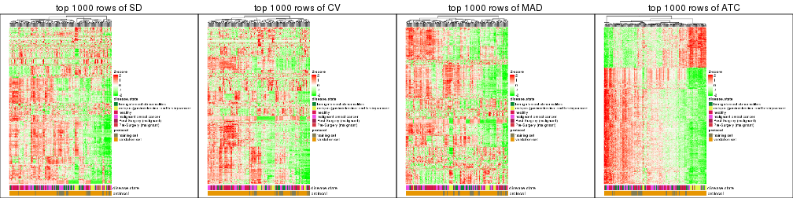</p>

</div>
<div id='tab-top-rows-heatmap-2'>
<pre><code class="r">top_rows_heatmap(res_list, top_n = 2000)
</code></pre>

<p></p>

</div>
<div id='tab-top-rows-heatmap-3'>
<pre><code class="r">top_rows_heatmap(res_list, top_n = 3000)
</code></pre>

<p></p>

</div>
<div id='tab-top-rows-heatmap-4'>
<pre><code class="r">top_rows_heatmap(res_list, top_n = 4000)
</code></pre>

<p></p>

</div>
<div id='tab-top-rows-heatmap-5'>
<pre><code class="r">top_rows_heatmap(res_list, top_n = 5000)
</code></pre>

<p></p>

</div>
</div>


### Test to known annotations


Test correlation between subgroups and known annotations. If the known
annotation is numeric, one-way ANOVA test is applied, and if the known
annotation is discrete, chi-squared contingency table test is applied.


<script>
$( function() {
	$( '#tabs-test-to-known-factors-from-consensus-partition-list' ).tabs();
} );
</script>
<div id='tabs-test-to-known-factors-from-consensus-partition-list'>
<ul>
<li><a href='#tab-test-to-known-factors-from-consensus-partition-list-1'>k = 2</a></li>
<li><a href='#tab-test-to-known-factors-from-consensus-partition-list-2'>k = 3</a></li>
<li><a href='#tab-test-to-known-factors-from-consensus-partition-list-3'>k = 4</a></li>
<li><a href='#tab-test-to-known-factors-from-consensus-partition-list-4'>k = 5</a></li>
<li><a href='#tab-test-to-known-factors-from-consensus-partition-list-5'>k = 6</a></li>
</ul>
<div id='tab-test-to-known-factors-from-consensus-partition-list-1'>
<pre><code class="r">test_to_known_factors(res_list, k = 2)
</code></pre>

<pre><code>#&gt;               n disease.state(p) protocol(p) k
#&gt; SD:NMF      148         2.72e-07     0.95353 2
#&gt; CV:NMF      156         1.04e-10     0.89399 2
#&gt; MAD:NMF     140         2.33e-07     0.73990 2
#&gt; ATC:NMF     151         5.16e-09     0.39540 2
#&gt; SD:skmeans  161         1.40e-05     0.00811 2
#&gt; CV:skmeans  161         1.78e-05     0.01017 2
#&gt; MAD:skmeans 161         1.40e-05     0.00811 2
#&gt; ATC:skmeans 161         2.03e-09     0.31523 2
#&gt; SD:mclust   159         4.70e-06     0.54774 2
#&gt; CV:mclust   146         4.88e-10     0.56505 2
#&gt; MAD:mclust  158         1.58e-04     1.00000 2
#&gt; ATC:mclust  161         3.70e-17     0.00218 2
#&gt; SD:kmeans   157         1.65e-03     0.40766 2
#&gt; CV:kmeans   157         2.25e-03     0.35121 2
#&gt; MAD:kmeans  153         3.73e-05     0.21366 2
#&gt; ATC:kmeans  160         3.83e-09     0.29419 2
#&gt; SD:pam      158         1.36e-09     0.66407 2
#&gt; CV:pam      152         1.31e-01     0.88517 2
#&gt; MAD:pam     147         3.69e-08     0.22256 2
#&gt; ATC:pam     161         8.34e-11     0.07868 2
#&gt; SD:hclust   152         6.37e-05     0.95810 2
#&gt; CV:hclust   154         2.10e-04     0.92488 2
#&gt; MAD:hclust  154         1.75e-04     0.53830 2
#&gt; ATC:hclust  152         1.92e-05     0.95107 2
</code></pre>

</div>
<div id='tab-test-to-known-factors-from-consensus-partition-list-2'>
<pre><code class="r">test_to_known_factors(res_list, k = 3)
</code></pre>

<pre><code>#&gt;               n disease.state(p) protocol(p) k
#&gt; SD:NMF      142         9.71e-06    1.58e-03 3
#&gt; CV:NMF      152         1.29e-05    1.00e-03 3
#&gt; MAD:NMF     107         2.14e-03    6.05e-02 3
#&gt; ATC:NMF     149         3.15e-18    4.64e-02 3
#&gt; SD:skmeans  141         4.90e-06    4.25e-06 3
#&gt; CV:skmeans  141         9.31e-11    2.92e-09 3
#&gt; MAD:skmeans 144         5.56e-06    1.20e-06 3
#&gt; ATC:skmeans 160         6.97e-18    2.21e-01 3
#&gt; SD:mclust   139         1.54e-06    2.47e-06 3
#&gt; CV:mclust   147         1.68e-11    2.52e-08 3
#&gt; MAD:mclust  112         9.55e-08    3.13e-02 3
#&gt; ATC:mclust  132         5.31e-14    1.05e-05 3
#&gt; SD:kmeans   147         6.88e-08    7.88e-08 3
#&gt; CV:kmeans   125         9.94e-13    4.64e-07 3
#&gt; MAD:kmeans  147         5.49e-07    1.17e-07 3
#&gt; ATC:kmeans  153         8.46e-13    8.56e-02 3
#&gt; SD:pam      113         2.88e-11    1.91e-03 3
#&gt; CV:pam      156         1.06e-16    7.49e-08 3
#&gt; MAD:pam     103         2.78e-08    3.17e-04 3
#&gt; ATC:pam     158         5.78e-14    1.99e-02 3
#&gt; SD:hclust   133         2.56e-07    3.04e-01 3
#&gt; CV:hclust   122         3.49e-03    1.71e-01 3
#&gt; MAD:hclust  110         1.42e-04    8.38e-03 3
#&gt; ATC:hclust  129         4.33e-06    3.19e-01 3
</code></pre>

</div>
<div id='tab-test-to-known-factors-from-consensus-partition-list-3'>
<pre><code class="r">test_to_known_factors(res_list, k = 4)
</code></pre>

<pre><code>#&gt;               n disease.state(p) protocol(p) k
#&gt; SD:NMF      139         1.62e-08    6.27e-06 4
#&gt; CV:NMF      143         7.49e-09    4.47e-04 4
#&gt; MAD:NMF     133         2.60e-08    4.93e-05 4
#&gt; ATC:NMF     127         4.35e-15    2.85e-02 4
#&gt; SD:skmeans  116         5.83e-06    4.00e-05 4
#&gt; CV:skmeans  142         4.72e-09    1.10e-04 4
#&gt; MAD:skmeans 118         1.49e-06    3.19e-07 4
#&gt; ATC:skmeans 144         4.60e-15    7.89e-03 4
#&gt; SD:mclust   142         2.30e-13    1.86e-06 4
#&gt; CV:mclust   139         2.24e-12    3.32e-06 4
#&gt; MAD:mclust   93         1.50e-07    3.55e-01 4
#&gt; ATC:mclust  127         4.69e-12    3.83e-07 4
#&gt; SD:kmeans   145         2.65e-08    1.85e-05 4
#&gt; CV:kmeans   141         1.44e-09    2.89e-04 4
#&gt; MAD:kmeans  114         7.06e-06    3.39e-06 4
#&gt; ATC:kmeans  157         3.04e-16    6.28e-04 4
#&gt; SD:pam      100         2.61e-12    7.32e-05 4
#&gt; CV:pam      150         1.04e-13    2.32e-05 4
#&gt; MAD:pam     128         2.26e-15    2.23e-06 4
#&gt; ATC:pam     149         6.20e-18    1.37e-02 4
#&gt; SD:hclust   126         3.51e-12    5.13e-02 4
#&gt; CV:hclust   135         1.16e-12    8.45e-03 4
#&gt; MAD:hclust  114         9.12e-09    1.69e-03 4
#&gt; ATC:hclust  143         8.63e-18    7.01e-02 4
</code></pre>

</div>
<div id='tab-test-to-known-factors-from-consensus-partition-list-4'>
<pre><code class="r">test_to_known_factors(res_list, k = 5)
</code></pre>

<pre><code>#&gt;               n disease.state(p) protocol(p) k
#&gt; SD:NMF       74         1.44e-03    4.54e-04 5
#&gt; CV:NMF       92         6.50e-07    3.63e-04 5
#&gt; MAD:NMF      81         3.21e-05    1.72e-03 5
#&gt; ATC:NMF      91         6.76e-09    2.77e-01 5
#&gt; SD:skmeans  147         4.46e-09    7.54e-07 5
#&gt; CV:skmeans  151         4.78e-11    7.44e-08 5
#&gt; MAD:skmeans 140         2.70e-08    3.52e-05 5
#&gt; ATC:skmeans 131         2.88e-13    5.68e-04 5
#&gt; SD:mclust   128         3.60e-14    1.19e-04 5
#&gt; CV:mclust   127         4.00e-15    3.18e-03 5
#&gt; MAD:mclust  110         5.16e-05    1.82e-03 5
#&gt; ATC:mclust  145         2.11e-12    2.83e-06 5
#&gt; SD:kmeans   102         7.43e-05    4.58e-03 5
#&gt; CV:kmeans    88         2.18e-06    1.19e-03 5
#&gt; MAD:kmeans  133         5.14e-09    7.23e-06 5
#&gt; ATC:kmeans  137         4.36e-12    6.81e-03 5
#&gt; SD:pam      142         7.05e-14    2.05e-05 5
#&gt; CV:pam      141         2.77e-18    8.06e-07 5
#&gt; MAD:pam     142         2.24e-12    5.24e-06 5
#&gt; ATC:pam     120         3.56e-14    2.93e-09 5
#&gt; SD:hclust   113         7.09e-11    1.31e-01 5
#&gt; CV:hclust   135         1.20e-15    3.22e-05 5
#&gt; MAD:hclust  100         1.99e-09    1.09e-04 5
#&gt; ATC:hclust  118         2.19e-10    9.89e-03 5
</code></pre>

</div>
<div id='tab-test-to-known-factors-from-consensus-partition-list-5'>
<pre><code class="r">test_to_known_factors(res_list, k = 6)
</code></pre>

<pre><code>#&gt;               n disease.state(p) protocol(p) k
#&gt; SD:NMF       69         1.25e-07    1.17e-05 6
#&gt; CV:NMF      134         1.66e-16    4.92e-07 6
#&gt; MAD:NMF      75         2.04e-05    2.02e-04 6
#&gt; ATC:NMF      91         1.73e-16    3.48e-12 6
#&gt; SD:skmeans  130         2.21e-09    1.75e-04 6
#&gt; CV:skmeans  132         7.36e-12    1.86e-06 6
#&gt; MAD:skmeans 137         1.14e-09    5.73e-05 6
#&gt; ATC:skmeans 119         1.27e-13    2.09e-04 6
#&gt; SD:mclust   104         8.24e-10    6.49e-07 6
#&gt; CV:mclust   113         1.90e-12    9.69e-05 6
#&gt; MAD:mclust  108         1.15e-05    6.08e-05 6
#&gt; ATC:mclust  104         1.14e-11    4.36e-07 6
#&gt; SD:kmeans   115         8.00e-10    6.19e-09 6
#&gt; CV:kmeans   119         4.29e-14    1.26e-08 6
#&gt; MAD:kmeans  122         8.49e-09    8.07e-07 6
#&gt; ATC:kmeans  116         1.24e-10    2.39e-03 6
#&gt; SD:pam       82         4.54e-12    1.46e-07 6
#&gt; CV:pam      147         7.71e-20    7.78e-08 6
#&gt; MAD:pam     134         4.34e-17    7.32e-10 6
#&gt; ATC:pam     115         2.35e-11    4.53e-10 6
#&gt; SD:hclust    87         9.81e-06    7.59e-07 6
#&gt; CV:hclust   135         1.73e-13    1.08e-05 6
#&gt; MAD:hclust   84         1.42e-06    2.08e-05 6
#&gt; ATC:hclust  132         3.29e-14    1.47e-02 6
</code></pre>

</div>
</div>


 
## Results for each method


---------------------------------------------------


### SD:hclust


The object with results only for a single top-value method and a single partition method 
can be extracted as:

```r
res = res_list["SD", "hclust"]
# you can also extract it by
# res = res_list["SD:hclust"]
```

A summary of `res` and all the functions that can be applied to it:

```r
res
```

```
#> A 'ConsensusPartition' object with k = 2, 3, 4, 5, 6.
#>   On a matrix with 51941 rows and 162 columns.
#>   Top rows (1000, 2000, 3000, 4000, 5000) are extracted by 'SD' method.
#>   Subgroups are detected by 'hclust' method.
#>   Performed in total 1250 partitions by row resampling.
#>   Best k for subgroups seems to be 3.
#> 
#> Following methods can be applied to this 'ConsensusPartition' object:
#>  [1] "cola_report"             "collect_classes"         "collect_plots"          
#>  [4] "collect_stats"           "colnames"                "compare_signatures"     
#>  [7] "consensus_heatmap"       "dimension_reduction"     "functional_enrichment"  
#> [10] "get_anno_col"            "get_anno"                "get_classes"            
#> [13] "get_consensus"           "get_matrix"              "get_membership"         
#> [16] "get_param"               "get_signatures"          "get_stats"              
#> [19] "is_best_k"               "is_stable_k"             "membership_heatmap"     
#> [22] "ncol"                    "nrow"                    "plot_ecdf"              
#> [25] "rownames"                "select_partition_number" "show"                   
#> [28] "suggest_best_k"          "test_to_known_factors"
```

`collect_plots()` function collects all the plots made from `res` for all `k` (number of partitions)
into one single page to provide an easy and fast comparison between different `k`.

```r
collect_plots(res)
```


The plots are:

- The first row: a plot of the ECDF (Empirical cumulative distribution
  function) curves of the consensus matrix for each `k` and the heatmap of
  predicted classes for each `k`.
- The second row: heatmaps of the consensus matrix for each `k`.
- The third row: heatmaps of the membership matrix for each `k`.
- The fouth row: heatmaps of the signatures for each `k`.

All the plots in panels can be made by individual functions and they are
plotted later in this section.

`select_partition_number()` produces several plots showing different
statistics for choosing "optimized" `k`. There are following statistics:

- ECDF curves of the consensus matrix for each `k`;
- 1-PAC. [The PAC
  score](https://en.wikipedia.org/wiki/Consensus_clustering#Over-interpretation_potential_of_consensus_clustering)
  measures the proportion of the ambiguous subgrouping.
- Mean silhouette score.
- Concordance. The mean probability of fiting the consensus class ids in all
  partitions.
- Area increased. Denote $A_k$ as the area under the ECDF curve for current
  `k`, the area increased is defined as $A_k - A_{k-1}$.
- Rand index. The percent of pairs of samples that are both in a same cluster
  or both are not in a same cluster in the partition of k and k-1.
- Jaccard index. The ratio of pairs of samples are both in a same cluster in
  the partition of k and k-1 and the pairs of samples are both in a same
  cluster in the partition k or k-1.

The detailed explanations of these statistics can be found in [the cola
vignette](http://bioconductor.org/packages/devel/bioc/vignettes/cola/inst/doc/cola.html#toc_13).

Generally speaking, lower PAC score, higher mean silhouette score or higher
concordance corresponds to better partition. Rand index and Jaccard index
measure how similar the current partition is compared to partition with `k-1`.
If they are too similar, we won't accept `k` is better than `k-1`.

```r
select_partition_number(res)
```


The numeric values for all these statistics can be obtained by `get_stats()`.

```r
get_stats(res)
```

```
#>   k 1-PAC mean_silhouette concordance area_increased  Rand Jaccard
#> 2 2 0.389           0.782       0.877          0.342 0.632   0.632
#> 3 3 0.429           0.661       0.809          0.489 0.850   0.767
#> 4 4 0.442           0.626       0.800          0.125 0.938   0.884
#> 5 5 0.439           0.534       0.719          0.126 0.910   0.822
#> 6 6 0.451           0.482       0.717          0.122 0.788   0.534
```

`suggest_best_k()` suggests the best $k$ based on these statistics. The rules are as follows:

- All $k$ with Jaccard index larger than 0.95 are removed because the increase of
  the partition number does not provides enough extra information. If all $k$ are removed,
  the best $k$ is assigned by `NA`.
- For $k$ with 1-PAC larger than 0.9, the maximal $k$ is taken as the "best k". Other $k$ is called "optional k".
- If it does not fit the second rule. The $k$ with the highest vote of highest
  1-PAC, mean silhouette and concordance is taken as the "best k".

```r
suggest_best_k(res)
```

```
#> [1] 3
```


Following shows the table of the partitions (You need to click the **show/hide
code output** link to see it). The membership matrix (columns with name `p*`)
is inferred by
[`clue::cl_consensus()`](https://www.rdocumentation.org/link/cl_consensus?package=clue)
function with the `SE` method. Basically the value in the membership matrix
represents the probability to belong to a certain group. The finall class
label for an item is determined with the group with highest probability it
belongs to.

In `get_classes()` function, the entropy is calculated from the membership
matrix and the silhouette score is calculated from the consensus matrix.


<script>
$( function() {
	$( '#tabs-SD-hclust-get-classes' ).tabs();
} );
</script>
<div id='tabs-SD-hclust-get-classes'>
<ul>
<li><a href='#tab-SD-hclust-get-classes-1'>k = 2</a></li>
<li><a href='#tab-SD-hclust-get-classes-2'>k = 3</a></li>
<li><a href='#tab-SD-hclust-get-classes-3'>k = 4</a></li>
<li><a href='#tab-SD-hclust-get-classes-4'>k = 5</a></li>
<li><a href='#tab-SD-hclust-get-classes-5'>k = 6</a></li>
</ul>

<div id='tab-SD-hclust-get-classes-1'>
<p><a id='tab-SD-hclust-get-classes-1-a' style='color:#0366d6' href='#'>show/hide code output</a></p>
<pre><code class="r">cbind(get_classes(res, k = 2), get_membership(res, k = 2))
</code></pre>

<pre><code>#&gt;           class entropy silhouette    p1    p2
#&gt; GSM682002     1  0.0672      0.896 0.992 0.008
#&gt; GSM682003     2  0.6048      0.787 0.148 0.852
#&gt; GSM682004     2  0.6048      0.787 0.148 0.852
#&gt; GSM682005     1  0.2603      0.885 0.956 0.044
#&gt; GSM682006     1  0.2236      0.895 0.964 0.036
#&gt; GSM682007     1  0.3114      0.885 0.944 0.056
#&gt; GSM682008     1  0.3114      0.885 0.944 0.056
#&gt; GSM682009     1  0.8327      0.507 0.736 0.264
#&gt; GSM682010     1  0.0672      0.898 0.992 0.008
#&gt; GSM682011     1  0.1414      0.894 0.980 0.020
#&gt; GSM682096     1  0.7453      0.700 0.788 0.212
#&gt; GSM682097     1  0.6623      0.773 0.828 0.172
#&gt; GSM682098     1  0.7299      0.718 0.796 0.204
#&gt; GSM682099     1  0.6973      0.730 0.812 0.188
#&gt; GSM682100     2  0.8763      0.780 0.296 0.704
#&gt; GSM682101     1  0.8267      0.578 0.740 0.260
#&gt; GSM682102     1  0.0376      0.897 0.996 0.004
#&gt; GSM682103     1  0.2043      0.895 0.968 0.032
#&gt; GSM682104     1  0.7376      0.678 0.792 0.208
#&gt; GSM682105     1  0.0938      0.897 0.988 0.012
#&gt; GSM682106     1  0.2236      0.895 0.964 0.036
#&gt; GSM682107     1  0.1184      0.895 0.984 0.016
#&gt; GSM682108     1  0.3274      0.876 0.940 0.060
#&gt; GSM682109     1  0.7219      0.691 0.800 0.200
#&gt; GSM682110     1  0.2603      0.892 0.956 0.044
#&gt; GSM682111     1  0.8443      0.538 0.728 0.272
#&gt; GSM682112     2  0.5519      0.743 0.128 0.872
#&gt; GSM682113     1  0.0376      0.897 0.996 0.004
#&gt; GSM682114     1  0.3114      0.881 0.944 0.056
#&gt; GSM682115     1  0.0376      0.897 0.996 0.004
#&gt; GSM682116     1  0.0376      0.897 0.996 0.004
#&gt; GSM682117     1  0.1414      0.894 0.980 0.020
#&gt; GSM682118     1  0.1184      0.898 0.984 0.016
#&gt; GSM682119     1  0.1184      0.896 0.984 0.016
#&gt; GSM682120     1  0.0938      0.897 0.988 0.012
#&gt; GSM682121     1  0.0376      0.897 0.996 0.004
#&gt; GSM682122     1  0.4939      0.834 0.892 0.108
#&gt; GSM682012     2  0.8016      0.791 0.244 0.756
#&gt; GSM682013     2  0.8909      0.770 0.308 0.692
#&gt; GSM682014     2  0.8144      0.796 0.252 0.748
#&gt; GSM682015     2  0.8144      0.796 0.252 0.748
#&gt; GSM682016     2  0.8016      0.791 0.244 0.756
#&gt; GSM682017     2  0.8144      0.796 0.252 0.748
#&gt; GSM682018     2  0.9933      0.509 0.452 0.548
#&gt; GSM682019     2  0.9491      0.690 0.368 0.632
#&gt; GSM682020     2  0.8861      0.774 0.304 0.696
#&gt; GSM682021     1  0.8861      0.447 0.696 0.304
#&gt; GSM682022     2  0.9732      0.623 0.404 0.596
#&gt; GSM682023     2  0.9732      0.623 0.404 0.596
#&gt; GSM682024     1  0.0376      0.897 0.996 0.004
#&gt; GSM682025     1  0.9993     -0.318 0.516 0.484
#&gt; GSM682026     2  0.9491      0.690 0.368 0.632
#&gt; GSM682027     1  0.7139      0.718 0.804 0.196
#&gt; GSM682028     1  0.4431      0.843 0.908 0.092
#&gt; GSM682029     1  0.4431      0.843 0.908 0.092
#&gt; GSM682030     1  0.4431      0.843 0.908 0.092
#&gt; GSM682031     1  0.4431      0.843 0.908 0.092
#&gt; GSM682032     1  0.4431      0.843 0.908 0.092
#&gt; GSM682033     2  0.5178      0.770 0.116 0.884
#&gt; GSM681992     1  0.7139      0.681 0.804 0.196
#&gt; GSM681993     2  0.9427      0.638 0.360 0.640
#&gt; GSM681994     1  0.2236      0.886 0.964 0.036
#&gt; GSM681995     1  0.1633      0.893 0.976 0.024
#&gt; GSM681996     1  0.3114      0.885 0.944 0.056
#&gt; GSM681997     1  0.2423      0.886 0.960 0.040
#&gt; GSM681998     1  0.2236      0.887 0.964 0.036
#&gt; GSM681999     1  0.1414      0.894 0.980 0.020
#&gt; GSM682000     1  0.2423      0.883 0.960 0.040
#&gt; GSM682001     1  0.1414      0.894 0.980 0.020
#&gt; GSM682055     1  0.9954     -0.179 0.540 0.460
#&gt; GSM682056     1  0.6623      0.773 0.828 0.172
#&gt; GSM682057     2  0.8813      0.777 0.300 0.700
#&gt; GSM682058     1  0.6623      0.773 0.828 0.172
#&gt; GSM682059     2  0.8763      0.780 0.296 0.704
#&gt; GSM682060     2  0.8909      0.707 0.308 0.692
#&gt; GSM682061     2  0.3733      0.735 0.072 0.928
#&gt; GSM682062     2  0.8763      0.780 0.296 0.704
#&gt; GSM682063     1  0.8267      0.578 0.740 0.260
#&gt; GSM682064     1  0.0938      0.897 0.988 0.012
#&gt; GSM682065     1  0.0376      0.897 0.996 0.004
#&gt; GSM682066     1  0.1184      0.897 0.984 0.016
#&gt; GSM682067     1  0.0672      0.898 0.992 0.008
#&gt; GSM682068     1  0.4022      0.851 0.920 0.080
#&gt; GSM682069     1  0.0672      0.898 0.992 0.008
#&gt; GSM682070     1  0.0938      0.897 0.988 0.012
#&gt; GSM682071     2  0.9963      0.454 0.464 0.536
#&gt; GSM682072     1  0.7883      0.613 0.764 0.236
#&gt; GSM682073     1  0.5294      0.824 0.880 0.120
#&gt; GSM682074     1  0.1633      0.894 0.976 0.024
#&gt; GSM682075     1  0.4022      0.851 0.920 0.080
#&gt; GSM682076     1  0.0376      0.897 0.996 0.004
#&gt; GSM682077     1  0.0376      0.897 0.996 0.004
#&gt; GSM682078     1  0.0938      0.895 0.988 0.012
#&gt; GSM682079     1  0.1184      0.898 0.984 0.016
#&gt; GSM682080     2  0.9993      0.395 0.484 0.516
#&gt; GSM682081     1  0.8608      0.497 0.716 0.284
#&gt; GSM682082     1  0.2778      0.885 0.952 0.048
#&gt; GSM682083     1  0.0376      0.897 0.996 0.004
#&gt; GSM682084     1  0.2948      0.880 0.948 0.052
#&gt; GSM682085     1  0.2948      0.880 0.948 0.052
#&gt; GSM682086     1  0.1184      0.895 0.984 0.016
#&gt; GSM682087     1  0.0376      0.897 0.996 0.004
#&gt; GSM682088     1  0.1633      0.894 0.976 0.024
#&gt; GSM682089     1  0.1633      0.894 0.976 0.024
#&gt; GSM682090     1  0.1633      0.894 0.976 0.024
#&gt; GSM682091     1  0.1633      0.896 0.976 0.024
#&gt; GSM682092     1  0.0938      0.897 0.988 0.012
#&gt; GSM682093     1  0.1843      0.895 0.972 0.028
#&gt; GSM682094     1  0.0938      0.895 0.988 0.012
#&gt; GSM682095     2  0.6148      0.788 0.152 0.848
#&gt; GSM681982     2  0.7528      0.755 0.216 0.784
#&gt; GSM681983     1  0.0000      0.897 1.000 0.000
#&gt; GSM681984     1  0.9954     -0.288 0.540 0.460
#&gt; GSM681985     2  0.6887      0.761 0.184 0.816
#&gt; GSM681986     1  0.9954     -0.288 0.540 0.460
#&gt; GSM681987     2  0.6048      0.787 0.148 0.852
#&gt; GSM681988     1  0.9087      0.367 0.676 0.324
#&gt; GSM681989     1  0.8327      0.507 0.736 0.264
#&gt; GSM681990     1  0.1414      0.897 0.980 0.020
#&gt; GSM681991     2  0.6048      0.787 0.148 0.852
#&gt; GSM682034     1  0.0376      0.897 0.996 0.004
#&gt; GSM682035     1  0.0376      0.897 0.996 0.004
#&gt; GSM682036     1  0.2423      0.890 0.960 0.040
#&gt; GSM682037     1  0.0000      0.897 1.000 0.000
#&gt; GSM682038     2  0.9983      0.484 0.476 0.524
#&gt; GSM682039     1  0.6531      0.731 0.832 0.168
#&gt; GSM682040     2  0.3114      0.721 0.056 0.944
#&gt; GSM682041     1  0.2423      0.887 0.960 0.040
#&gt; GSM682042     2  0.7299      0.753 0.204 0.796
#&gt; GSM682043     1  0.0000      0.897 1.000 0.000
#&gt; GSM682044     1  0.0376      0.897 0.996 0.004
#&gt; GSM682045     1  0.6531      0.731 0.832 0.168
#&gt; GSM682046     1  0.0000      0.897 1.000 0.000
#&gt; GSM682047     1  0.1633      0.894 0.976 0.024
#&gt; GSM682048     1  0.8016      0.575 0.756 0.244
#&gt; GSM682049     1  0.2423      0.887 0.960 0.040
#&gt; GSM682050     1  0.0000      0.897 1.000 0.000
#&gt; GSM682051     1  0.2423      0.887 0.960 0.040
#&gt; GSM682052     2  0.7139      0.755 0.196 0.804
#&gt; GSM682053     2  0.9866      0.520 0.432 0.568
#&gt; GSM682054     1  0.0000      0.897 1.000 0.000
#&gt; GSM682123     1  0.0672      0.898 0.992 0.008
#&gt; GSM682124     1  0.0672      0.898 0.992 0.008
#&gt; GSM682125     1  0.7745      0.612 0.772 0.228
#&gt; GSM682126     1  0.0376      0.897 0.996 0.004
#&gt; GSM682127     1  0.0376      0.897 0.996 0.004
#&gt; GSM682128     1  0.0672      0.898 0.992 0.008
#&gt; GSM682129     2  0.8909      0.770 0.308 0.692
#&gt; GSM682130     2  0.8861      0.774 0.304 0.696
#&gt; GSM682131     2  0.6343      0.791 0.160 0.840
#&gt; GSM682132     1  0.4022      0.851 0.920 0.080
#&gt; GSM682133     1  0.0672      0.898 0.992 0.008
#&gt; GSM682134     1  0.0672      0.898 0.992 0.008
#&gt; GSM682135     1  0.2423      0.890 0.960 0.040
#&gt; GSM682136     1  0.0376      0.897 0.996 0.004
#&gt; GSM682137     1  0.0672      0.898 0.992 0.008
#&gt; GSM682138     1  0.1633      0.894 0.976 0.024
#&gt; GSM682139     1  0.0672      0.898 0.992 0.008
#&gt; GSM682140     1  0.1633      0.894 0.976 0.024
#&gt; GSM682141     1  0.0000      0.897 1.000 0.000
#&gt; GSM682142     1  0.0376      0.897 0.996 0.004
#&gt; GSM682143     2  0.6048      0.787 0.148 0.852
</code></pre>

<script>
$('#tab-SD-hclust-get-classes-1-a').parent().next().next().hide();
$('#tab-SD-hclust-get-classes-1-a').click(function(){
  $('#tab-SD-hclust-get-classes-1-a').parent().next().next().toggle();
  return(false);
});
</script>
</div>

<div id='tab-SD-hclust-get-classes-2'>
<p><a id='tab-SD-hclust-get-classes-2-a' style='color:#0366d6' href='#'>show/hide code output</a></p>
<pre><code class="r">cbind(get_classes(res, k = 3), get_membership(res, k = 3))
</code></pre>

<pre><code>#&gt;           class entropy silhouette    p1    p2    p3
#&gt; GSM682002     1  0.1860     0.8353 0.948 0.000 0.052
#&gt; GSM682003     2  0.1411     0.6592 0.000 0.964 0.036
#&gt; GSM682004     2  0.1411     0.6592 0.000 0.964 0.036
#&gt; GSM682005     1  0.4465     0.7296 0.820 0.004 0.176
#&gt; GSM682006     1  0.3851     0.7896 0.860 0.004 0.136
#&gt; GSM682007     1  0.3918     0.8034 0.868 0.012 0.120
#&gt; GSM682008     1  0.3918     0.8034 0.868 0.012 0.120
#&gt; GSM682009     1  0.7844     0.3978 0.652 0.240 0.108
#&gt; GSM682010     1  0.1989     0.8373 0.948 0.004 0.048
#&gt; GSM682011     1  0.3192     0.8080 0.888 0.000 0.112
#&gt; GSM682096     3  0.9674     0.5166 0.392 0.212 0.396
#&gt; GSM682097     1  0.8371     0.1265 0.592 0.116 0.292
#&gt; GSM682098     1  0.9152    -0.3126 0.484 0.152 0.364
#&gt; GSM682099     3  0.9326     0.6098 0.284 0.204 0.512
#&gt; GSM682100     2  0.4834     0.6598 0.004 0.792 0.204
#&gt; GSM682101     3  0.9481     0.4590 0.224 0.284 0.492
#&gt; GSM682102     1  0.0424     0.8456 0.992 0.000 0.008
#&gt; GSM682103     1  0.2651     0.8424 0.928 0.012 0.060
#&gt; GSM682104     1  0.7441     0.5454 0.700 0.164 0.136
#&gt; GSM682105     1  0.1529     0.8439 0.960 0.000 0.040
#&gt; GSM682106     1  0.3500     0.8151 0.880 0.004 0.116
#&gt; GSM682107     1  0.3340     0.8036 0.880 0.000 0.120
#&gt; GSM682108     1  0.4749     0.7799 0.844 0.040 0.116
#&gt; GSM682109     1  0.7281     0.5756 0.712 0.148 0.140
#&gt; GSM682110     1  0.3377     0.8218 0.896 0.012 0.092
#&gt; GSM682111     1  0.8085     0.4300 0.648 0.204 0.148
#&gt; GSM682112     2  0.8129     0.4540 0.124 0.632 0.244
#&gt; GSM682113     1  0.0237     0.8453 0.996 0.000 0.004
#&gt; GSM682114     1  0.2400     0.8343 0.932 0.004 0.064
#&gt; GSM682115     1  0.0424     0.8455 0.992 0.000 0.008
#&gt; GSM682116     1  0.0424     0.8455 0.992 0.000 0.008
#&gt; GSM682117     1  0.3192     0.8085 0.888 0.000 0.112
#&gt; GSM682118     1  0.2496     0.8322 0.928 0.004 0.068
#&gt; GSM682119     1  0.2682     0.8292 0.920 0.004 0.076
#&gt; GSM682120     1  0.0747     0.8468 0.984 0.000 0.016
#&gt; GSM682121     1  0.0592     0.8453 0.988 0.000 0.012
#&gt; GSM682122     1  0.4892     0.7634 0.840 0.048 0.112
#&gt; GSM682012     2  0.5178     0.6507 0.000 0.744 0.256
#&gt; GSM682013     2  0.4978     0.6545 0.004 0.780 0.216
#&gt; GSM682014     2  0.4351     0.6671 0.004 0.828 0.168
#&gt; GSM682015     2  0.4351     0.6671 0.004 0.828 0.168
#&gt; GSM682016     2  0.5216     0.6500 0.000 0.740 0.260
#&gt; GSM682017     2  0.4351     0.6671 0.004 0.828 0.168
#&gt; GSM682018     2  0.7665     0.4698 0.060 0.600 0.340
#&gt; GSM682019     2  0.5896     0.6028 0.008 0.700 0.292
#&gt; GSM682020     2  0.4931     0.6565 0.004 0.784 0.212
#&gt; GSM682021     3  0.9268     0.2858 0.172 0.336 0.492
#&gt; GSM682022     2  0.6677     0.5469 0.024 0.652 0.324
#&gt; GSM682023     2  0.6702     0.5456 0.024 0.648 0.328
#&gt; GSM682024     1  0.0424     0.8458 0.992 0.000 0.008
#&gt; GSM682025     2  0.7785     0.3328 0.052 0.528 0.420
#&gt; GSM682026     2  0.5896     0.6028 0.008 0.700 0.292
#&gt; GSM682027     3  0.7431     0.3782 0.100 0.212 0.688
#&gt; GSM682028     3  0.5363     0.7293 0.276 0.000 0.724
#&gt; GSM682029     3  0.5363     0.7293 0.276 0.000 0.724
#&gt; GSM682030     3  0.5363     0.7293 0.276 0.000 0.724
#&gt; GSM682031     3  0.5363     0.7293 0.276 0.000 0.724
#&gt; GSM682032     3  0.5363     0.7293 0.276 0.000 0.724
#&gt; GSM682033     2  0.2537     0.6581 0.000 0.920 0.080
#&gt; GSM681992     1  0.7441     0.5267 0.700 0.164 0.136
#&gt; GSM681993     2  0.9767     0.0163 0.328 0.428 0.244
#&gt; GSM681994     1  0.4291     0.7273 0.820 0.000 0.180
#&gt; GSM681995     1  0.3340     0.8014 0.880 0.000 0.120
#&gt; GSM681996     1  0.3918     0.8034 0.868 0.012 0.120
#&gt; GSM681997     1  0.4351     0.7386 0.828 0.004 0.168
#&gt; GSM681998     1  0.4235     0.7341 0.824 0.000 0.176
#&gt; GSM681999     1  0.3116     0.8108 0.892 0.000 0.108
#&gt; GSM682000     1  0.4605     0.6910 0.796 0.000 0.204
#&gt; GSM682001     1  0.3116     0.8108 0.892 0.000 0.108
#&gt; GSM682055     2  0.9431    -0.2949 0.400 0.424 0.176
#&gt; GSM682056     1  0.8371     0.1265 0.592 0.116 0.292
#&gt; GSM682057     2  0.5012     0.6582 0.008 0.788 0.204
#&gt; GSM682058     1  0.8371     0.1265 0.592 0.116 0.292
#&gt; GSM682059     2  0.4834     0.6598 0.004 0.792 0.204
#&gt; GSM682060     2  0.7954     0.4022 0.148 0.660 0.192
#&gt; GSM682061     2  0.3340     0.6309 0.000 0.880 0.120
#&gt; GSM682062     2  0.4834     0.6598 0.004 0.792 0.204
#&gt; GSM682063     3  0.9481     0.4590 0.224 0.284 0.492
#&gt; GSM682064     1  0.2301     0.8380 0.936 0.004 0.060
#&gt; GSM682065     1  0.0000     0.8442 1.000 0.000 0.000
#&gt; GSM682066     1  0.2590     0.8348 0.924 0.004 0.072
#&gt; GSM682067     1  0.0892     0.8459 0.980 0.000 0.020
#&gt; GSM682068     3  0.6204     0.6331 0.424 0.000 0.576
#&gt; GSM682069     1  0.0892     0.8459 0.980 0.000 0.020
#&gt; GSM682070     1  0.2301     0.8380 0.936 0.004 0.060
#&gt; GSM682071     2  0.9159     0.0143 0.328 0.508 0.164
#&gt; GSM682072     1  0.7692     0.5043 0.680 0.184 0.136
#&gt; GSM682073     1  0.5538     0.7416 0.808 0.060 0.132
#&gt; GSM682074     1  0.0892     0.8434 0.980 0.000 0.020
#&gt; GSM682075     3  0.6204     0.6331 0.424 0.000 0.576
#&gt; GSM682076     1  0.0592     0.8453 0.988 0.000 0.012
#&gt; GSM682077     1  0.0237     0.8454 0.996 0.000 0.004
#&gt; GSM682078     1  0.0592     0.8456 0.988 0.000 0.012
#&gt; GSM682079     1  0.1289     0.8470 0.968 0.000 0.032
#&gt; GSM682080     2  0.9252    -0.0457 0.356 0.480 0.164
#&gt; GSM682081     1  0.8176     0.3966 0.636 0.224 0.140
#&gt; GSM682082     1  0.1878     0.8385 0.952 0.004 0.044
#&gt; GSM682083     1  0.0424     0.8455 0.992 0.000 0.008
#&gt; GSM682084     1  0.2301     0.8340 0.936 0.004 0.060
#&gt; GSM682085     1  0.2301     0.8340 0.936 0.004 0.060
#&gt; GSM682086     1  0.3340     0.8036 0.880 0.000 0.120
#&gt; GSM682087     1  0.0592     0.8453 0.988 0.000 0.012
#&gt; GSM682088     1  0.0892     0.8434 0.980 0.000 0.020
#&gt; GSM682089     1  0.1031     0.8446 0.976 0.000 0.024
#&gt; GSM682090     1  0.1031     0.8446 0.976 0.000 0.024
#&gt; GSM682091     1  0.2682     0.8338 0.920 0.004 0.076
#&gt; GSM682092     1  0.1411     0.8444 0.964 0.000 0.036
#&gt; GSM682093     1  0.3112     0.8286 0.900 0.004 0.096
#&gt; GSM682094     1  0.2537     0.8261 0.920 0.000 0.080
#&gt; GSM682095     2  0.0747     0.6616 0.000 0.984 0.016
#&gt; GSM681982     2  0.8845     0.3604 0.184 0.576 0.240
#&gt; GSM681983     1  0.0747     0.8453 0.984 0.000 0.016
#&gt; GSM681984     1  0.8889    -0.1806 0.452 0.428 0.120
#&gt; GSM681985     2  0.8737     0.3834 0.180 0.588 0.232
#&gt; GSM681986     1  0.8889    -0.1806 0.452 0.428 0.120
#&gt; GSM681987     2  0.1411     0.6592 0.000 0.964 0.036
#&gt; GSM681988     1  0.8460     0.2941 0.600 0.264 0.136
#&gt; GSM681989     1  0.7844     0.3978 0.652 0.240 0.108
#&gt; GSM681990     1  0.2680     0.8308 0.924 0.008 0.068
#&gt; GSM681991     2  0.1411     0.6592 0.000 0.964 0.036
#&gt; GSM682034     1  0.0000     0.8442 1.000 0.000 0.000
#&gt; GSM682035     1  0.0000     0.8442 1.000 0.000 0.000
#&gt; GSM682036     1  0.3445     0.8198 0.896 0.016 0.088
#&gt; GSM682037     1  0.0237     0.8448 0.996 0.000 0.004
#&gt; GSM682038     2  0.8376    -0.0976 0.420 0.496 0.084
#&gt; GSM682039     1  0.5564     0.6837 0.808 0.128 0.064
#&gt; GSM682040     2  0.5070     0.5651 0.004 0.772 0.224
#&gt; GSM682041     1  0.1411     0.8379 0.964 0.000 0.036
#&gt; GSM682042     2  0.8924     0.3656 0.172 0.560 0.268
#&gt; GSM682043     1  0.0237     0.8448 0.996 0.000 0.004
#&gt; GSM682044     1  0.0000     0.8442 1.000 0.000 0.000
#&gt; GSM682045     1  0.5564     0.6837 0.808 0.128 0.064
#&gt; GSM682046     1  0.0237     0.8448 0.996 0.000 0.004
#&gt; GSM682047     1  0.0892     0.8434 0.980 0.000 0.020
#&gt; GSM682048     1  0.6696     0.5495 0.736 0.188 0.076
#&gt; GSM682049     1  0.1411     0.8379 0.964 0.000 0.036
#&gt; GSM682050     1  0.0237     0.8448 0.996 0.000 0.004
#&gt; GSM682051     1  0.1411     0.8379 0.964 0.000 0.036
#&gt; GSM682052     2  0.8880     0.3758 0.168 0.564 0.268
#&gt; GSM682053     1  0.9793    -0.2630 0.416 0.340 0.244
#&gt; GSM682054     1  0.0237     0.8448 0.996 0.000 0.004
#&gt; GSM682123     1  0.0747     0.8450 0.984 0.000 0.016
#&gt; GSM682124     1  0.0747     0.8450 0.984 0.000 0.016
#&gt; GSM682125     1  0.6490     0.5819 0.752 0.172 0.076
#&gt; GSM682126     1  0.0237     0.8448 0.996 0.000 0.004
#&gt; GSM682127     1  0.0000     0.8442 1.000 0.000 0.000
#&gt; GSM682128     1  0.2165     0.8161 0.936 0.000 0.064
#&gt; GSM682129     2  0.4978     0.6545 0.004 0.780 0.216
#&gt; GSM682130     2  0.4931     0.6565 0.004 0.784 0.212
#&gt; GSM682131     2  0.2860     0.6654 0.004 0.912 0.084
#&gt; GSM682132     3  0.6204     0.6331 0.424 0.000 0.576
#&gt; GSM682133     1  0.2165     0.8161 0.936 0.000 0.064
#&gt; GSM682134     1  0.0747     0.8450 0.984 0.000 0.016
#&gt; GSM682135     1  0.3445     0.8198 0.896 0.016 0.088
#&gt; GSM682136     1  0.0237     0.8448 0.996 0.000 0.004
#&gt; GSM682137     1  0.2066     0.8202 0.940 0.000 0.060
#&gt; GSM682138     1  0.0892     0.8434 0.980 0.000 0.020
#&gt; GSM682139     1  0.0892     0.8459 0.980 0.000 0.020
#&gt; GSM682140     1  0.0892     0.8434 0.980 0.000 0.020
#&gt; GSM682141     1  0.0237     0.8448 0.996 0.000 0.004
#&gt; GSM682142     1  0.0237     0.8448 0.996 0.000 0.004
#&gt; GSM682143     2  0.1411     0.6592 0.000 0.964 0.036
</code></pre>

<script>
$('#tab-SD-hclust-get-classes-2-a').parent().next().next().hide();
$('#tab-SD-hclust-get-classes-2-a').click(function(){
  $('#tab-SD-hclust-get-classes-2-a').parent().next().next().toggle();
  return(false);
});
</script>
</div>

<div id='tab-SD-hclust-get-classes-3'>
<p><a id='tab-SD-hclust-get-classes-3-a' style='color:#0366d6' href='#'>show/hide code output</a></p>
<pre><code class="r">cbind(get_classes(res, k = 4), get_membership(res, k = 4))
</code></pre>

<pre><code>#&gt;           class entropy silhouette    p1    p2    p3    p4
#&gt; GSM682002     1  0.1902     0.8295 0.932 0.000 0.004 0.064
#&gt; GSM682003     2  0.5039     0.3182 0.000 0.592 0.404 0.004
#&gt; GSM682004     2  0.5050     0.3145 0.000 0.588 0.408 0.004
#&gt; GSM682005     1  0.6134     0.6639 0.672 0.008 0.080 0.240
#&gt; GSM682006     1  0.5087     0.7778 0.780 0.008 0.088 0.124
#&gt; GSM682007     1  0.5157     0.7798 0.784 0.016 0.116 0.084
#&gt; GSM682008     1  0.5157     0.7798 0.784 0.016 0.116 0.084
#&gt; GSM682009     1  0.7992     0.4243 0.560 0.212 0.180 0.048
#&gt; GSM682010     1  0.3510     0.8148 0.868 0.008 0.096 0.028
#&gt; GSM682011     1  0.4276     0.8017 0.828 0.004 0.072 0.096
#&gt; GSM682096     1  0.9364    -0.1737 0.340 0.328 0.096 0.236
#&gt; GSM682097     1  0.8682     0.3682 0.524 0.200 0.116 0.160
#&gt; GSM682098     1  0.9179     0.1242 0.432 0.240 0.100 0.228
#&gt; GSM682099     2  0.9086    -0.1441 0.224 0.356 0.072 0.348
#&gt; GSM682100     2  0.0469     0.6024 0.000 0.988 0.000 0.012
#&gt; GSM682101     2  0.8847     0.1173 0.168 0.472 0.092 0.268
#&gt; GSM682102     1  0.0592     0.8313 0.984 0.000 0.000 0.016
#&gt; GSM682103     1  0.3378     0.8299 0.884 0.012 0.060 0.044
#&gt; GSM682104     1  0.7721     0.5357 0.592 0.140 0.216 0.052
#&gt; GSM682105     1  0.2578     0.8329 0.912 0.000 0.036 0.052
#&gt; GSM682106     1  0.4731     0.7970 0.800 0.004 0.100 0.096
#&gt; GSM682107     1  0.4266     0.8030 0.828 0.004 0.068 0.100
#&gt; GSM682108     1  0.5804     0.7607 0.760 0.056 0.112 0.072
#&gt; GSM682109     1  0.7426     0.5648 0.608 0.108 0.236 0.048
#&gt; GSM682110     1  0.4583     0.7968 0.816 0.012 0.108 0.064
#&gt; GSM682111     1  0.7991     0.4117 0.536 0.160 0.264 0.040
#&gt; GSM682112     3  0.4638     0.5914 0.044 0.180 0.776 0.000
#&gt; GSM682113     1  0.0188     0.8300 0.996 0.000 0.000 0.004
#&gt; GSM682114     1  0.3047     0.8174 0.872 0.000 0.116 0.012
#&gt; GSM682115     1  0.0707     0.8280 0.980 0.000 0.000 0.020
#&gt; GSM682116     1  0.0707     0.8280 0.980 0.000 0.000 0.020
#&gt; GSM682117     1  0.4276     0.8018 0.828 0.004 0.072 0.096
#&gt; GSM682118     1  0.4072     0.8124 0.844 0.008 0.088 0.060
#&gt; GSM682119     1  0.3909     0.8113 0.856 0.012 0.080 0.052
#&gt; GSM682120     1  0.0804     0.8323 0.980 0.000 0.008 0.012
#&gt; GSM682121     1  0.1211     0.8243 0.960 0.000 0.000 0.040
#&gt; GSM682122     1  0.5675     0.7354 0.744 0.052 0.172 0.032
#&gt; GSM682012     2  0.4245     0.5431 0.000 0.820 0.116 0.064
#&gt; GSM682013     2  0.0817     0.6036 0.000 0.976 0.000 0.024
#&gt; GSM682014     2  0.2999     0.5556 0.000 0.864 0.132 0.004
#&gt; GSM682015     2  0.2999     0.5556 0.000 0.864 0.132 0.004
#&gt; GSM682016     2  0.4301     0.5405 0.000 0.816 0.120 0.064
#&gt; GSM682017     2  0.2999     0.5556 0.000 0.864 0.132 0.004
#&gt; GSM682018     2  0.4994     0.5217 0.044 0.796 0.032 0.128
#&gt; GSM682019     2  0.2909     0.5829 0.000 0.888 0.020 0.092
#&gt; GSM682020     2  0.0707     0.6037 0.000 0.980 0.000 0.020
#&gt; GSM682021     2  0.8322     0.2024 0.124 0.524 0.080 0.272
#&gt; GSM682022     2  0.3736     0.5630 0.016 0.848 0.012 0.124
#&gt; GSM682023     2  0.3854     0.5607 0.016 0.844 0.016 0.124
#&gt; GSM682024     1  0.0336     0.8304 0.992 0.000 0.008 0.000
#&gt; GSM682025     2  0.5564     0.4688 0.032 0.720 0.024 0.224
#&gt; GSM682026     2  0.2909     0.5829 0.000 0.888 0.020 0.092
#&gt; GSM682027     4  0.5673     0.1977 0.032 0.372 0.000 0.596
#&gt; GSM682028     4  0.0188     0.7718 0.000 0.004 0.000 0.996
#&gt; GSM682029     4  0.0188     0.7718 0.000 0.004 0.000 0.996
#&gt; GSM682030     4  0.0188     0.7718 0.000 0.004 0.000 0.996
#&gt; GSM682031     4  0.0188     0.7718 0.000 0.004 0.000 0.996
#&gt; GSM682032     4  0.0188     0.7718 0.000 0.004 0.000 0.996
#&gt; GSM682033     2  0.5138     0.3156 0.000 0.600 0.392 0.008
#&gt; GSM681992     1  0.7423     0.5783 0.636 0.184 0.108 0.072
#&gt; GSM681993     3  0.7715     0.4503 0.240 0.208 0.536 0.016
#&gt; GSM681994     1  0.5835     0.6722 0.684 0.004 0.068 0.244
#&gt; GSM681995     1  0.4514     0.7949 0.812 0.004 0.072 0.112
#&gt; GSM681996     1  0.5157     0.7798 0.784 0.016 0.116 0.084
#&gt; GSM681997     1  0.6010     0.6761 0.684 0.008 0.076 0.232
#&gt; GSM681998     1  0.5935     0.6727 0.680 0.004 0.076 0.240
#&gt; GSM681999     1  0.4213     0.8030 0.832 0.004 0.072 0.092
#&gt; GSM682000     1  0.5840     0.6531 0.672 0.004 0.060 0.264
#&gt; GSM682001     1  0.4213     0.8030 0.832 0.004 0.072 0.092
#&gt; GSM682055     2  0.8071    -0.0943 0.372 0.472 0.088 0.068
#&gt; GSM682056     1  0.8682     0.3682 0.524 0.200 0.116 0.160
#&gt; GSM682057     2  0.0657     0.6026 0.004 0.984 0.000 0.012
#&gt; GSM682058     1  0.8682     0.3682 0.524 0.200 0.116 0.160
#&gt; GSM682059     2  0.0469     0.6024 0.000 0.988 0.000 0.012
#&gt; GSM682060     3  0.7833     0.1954 0.108 0.360 0.492 0.040
#&gt; GSM682061     3  0.5158    -0.1372 0.000 0.472 0.524 0.004
#&gt; GSM682062     2  0.0469     0.6024 0.000 0.988 0.000 0.012
#&gt; GSM682063     2  0.8847     0.1173 0.168 0.472 0.092 0.268
#&gt; GSM682064     1  0.3039     0.8270 0.900 0.012 0.052 0.036
#&gt; GSM682065     1  0.0000     0.8288 1.000 0.000 0.000 0.000
#&gt; GSM682066     1  0.3211     0.8279 0.892 0.012 0.040 0.056
#&gt; GSM682067     1  0.1398     0.8326 0.956 0.000 0.040 0.004
#&gt; GSM682068     4  0.3649     0.6374 0.204 0.000 0.000 0.796
#&gt; GSM682069     1  0.1398     0.8326 0.956 0.000 0.040 0.004
#&gt; GSM682070     1  0.3039     0.8270 0.900 0.012 0.052 0.036
#&gt; GSM682071     2  0.8665    -0.3073 0.256 0.384 0.324 0.036
#&gt; GSM682072     1  0.7723     0.4997 0.576 0.136 0.244 0.044
#&gt; GSM682073     1  0.6151     0.7263 0.720 0.044 0.172 0.064
#&gt; GSM682074     1  0.0817     0.8289 0.976 0.000 0.024 0.000
#&gt; GSM682075     4  0.3688     0.6297 0.208 0.000 0.000 0.792
#&gt; GSM682076     1  0.1211     0.8243 0.960 0.000 0.000 0.040
#&gt; GSM682077     1  0.0188     0.8298 0.996 0.000 0.004 0.000
#&gt; GSM682078     1  0.1174     0.8303 0.968 0.000 0.012 0.020
#&gt; GSM682079     1  0.1610     0.8347 0.952 0.000 0.016 0.032
#&gt; GSM682080     2  0.8708    -0.3182 0.268 0.352 0.344 0.036
#&gt; GSM682081     1  0.8083     0.3872 0.528 0.176 0.256 0.040
#&gt; GSM682082     1  0.2861     0.8219 0.888 0.000 0.096 0.016
#&gt; GSM682083     1  0.0707     0.8280 0.980 0.000 0.000 0.020
#&gt; GSM682084     1  0.3032     0.8158 0.868 0.000 0.124 0.008
#&gt; GSM682085     1  0.3032     0.8158 0.868 0.000 0.124 0.008
#&gt; GSM682086     1  0.4266     0.8030 0.828 0.004 0.068 0.100
#&gt; GSM682087     1  0.1211     0.8243 0.960 0.000 0.000 0.040
#&gt; GSM682088     1  0.0817     0.8289 0.976 0.000 0.024 0.000
#&gt; GSM682089     1  0.1022     0.8311 0.968 0.000 0.032 0.000
#&gt; GSM682090     1  0.0921     0.8317 0.972 0.000 0.028 0.000
#&gt; GSM682091     1  0.3455     0.8233 0.880 0.012 0.064 0.044
#&gt; GSM682092     1  0.1888     0.8334 0.940 0.000 0.016 0.044
#&gt; GSM682093     1  0.3946     0.8189 0.856 0.016 0.080 0.048
#&gt; GSM682094     1  0.3870     0.8098 0.852 0.004 0.080 0.064
#&gt; GSM682095     2  0.4889     0.3678 0.000 0.636 0.360 0.004
#&gt; GSM681982     3  0.6809     0.5877 0.104 0.240 0.636 0.020
#&gt; GSM681983     1  0.0707     0.8325 0.980 0.000 0.000 0.020
#&gt; GSM681984     1  0.8596    -0.2256 0.380 0.336 0.252 0.032
#&gt; GSM681985     3  0.5650     0.6381 0.104 0.180 0.716 0.000
#&gt; GSM681986     1  0.8596    -0.2256 0.380 0.336 0.252 0.032
#&gt; GSM681987     2  0.5050     0.3145 0.000 0.588 0.408 0.004
#&gt; GSM681988     1  0.8256     0.3074 0.508 0.216 0.236 0.040
#&gt; GSM681989     1  0.7992     0.4243 0.560 0.212 0.180 0.048
#&gt; GSM681990     1  0.3996     0.8088 0.852 0.016 0.088 0.044
#&gt; GSM681991     2  0.5050     0.3145 0.000 0.588 0.408 0.004
#&gt; GSM682034     1  0.0000     0.8288 1.000 0.000 0.000 0.000
#&gt; GSM682035     1  0.0000     0.8288 1.000 0.000 0.000 0.000
#&gt; GSM682036     1  0.3959     0.8162 0.860 0.024 0.064 0.052
#&gt; GSM682037     1  0.0188     0.8299 0.996 0.000 0.000 0.004
#&gt; GSM682038     1  0.8522    -0.3628 0.352 0.340 0.284 0.024
#&gt; GSM682039     1  0.5327     0.6757 0.732 0.056 0.208 0.004
#&gt; GSM682040     3  0.3688     0.3621 0.000 0.208 0.792 0.000
#&gt; GSM682041     1  0.1389     0.8255 0.952 0.000 0.048 0.000
#&gt; GSM682042     3  0.5414     0.6413 0.096 0.152 0.748 0.004
#&gt; GSM682043     1  0.0188     0.8299 0.996 0.000 0.000 0.004
#&gt; GSM682044     1  0.0000     0.8288 1.000 0.000 0.000 0.000
#&gt; GSM682045     1  0.5327     0.6757 0.732 0.056 0.208 0.004
#&gt; GSM682046     1  0.0188     0.8299 0.996 0.000 0.000 0.004
#&gt; GSM682047     1  0.0817     0.8289 0.976 0.000 0.024 0.000
#&gt; GSM682048     1  0.5897     0.5470 0.656 0.056 0.284 0.004
#&gt; GSM682049     1  0.1389     0.8255 0.952 0.000 0.048 0.000
#&gt; GSM682050     1  0.0188     0.8299 0.996 0.000 0.000 0.004
#&gt; GSM682051     1  0.1389     0.8255 0.952 0.000 0.048 0.000
#&gt; GSM682052     3  0.5174     0.6407 0.092 0.152 0.756 0.000
#&gt; GSM682053     3  0.6140     0.3551 0.340 0.064 0.596 0.000
#&gt; GSM682054     1  0.0188     0.8299 0.996 0.000 0.000 0.004
#&gt; GSM682123     1  0.0707     0.8302 0.980 0.000 0.020 0.000
#&gt; GSM682124     1  0.0779     0.8316 0.980 0.000 0.016 0.004
#&gt; GSM682125     1  0.5840     0.5772 0.672 0.060 0.264 0.004
#&gt; GSM682126     1  0.0188     0.8299 0.996 0.000 0.000 0.004
#&gt; GSM682127     1  0.0000     0.8288 1.000 0.000 0.000 0.000
#&gt; GSM682128     1  0.2011     0.8124 0.920 0.000 0.000 0.080
#&gt; GSM682129     2  0.0817     0.6036 0.000 0.976 0.000 0.024
#&gt; GSM682130     2  0.0707     0.6037 0.000 0.980 0.000 0.020
#&gt; GSM682131     2  0.4551     0.4068 0.004 0.724 0.268 0.004
#&gt; GSM682132     4  0.3649     0.6374 0.204 0.000 0.000 0.796
#&gt; GSM682133     1  0.2011     0.8124 0.920 0.000 0.000 0.080
#&gt; GSM682134     1  0.0707     0.8302 0.980 0.000 0.020 0.000
#&gt; GSM682135     1  0.3959     0.8162 0.860 0.024 0.064 0.052
#&gt; GSM682136     1  0.0188     0.8299 0.996 0.000 0.000 0.004
#&gt; GSM682137     1  0.1940     0.8145 0.924 0.000 0.000 0.076
#&gt; GSM682138     1  0.0817     0.8289 0.976 0.000 0.024 0.000
#&gt; GSM682139     1  0.1004     0.8330 0.972 0.000 0.024 0.004
#&gt; GSM682140     1  0.0707     0.8294 0.980 0.000 0.020 0.000
#&gt; GSM682141     1  0.0188     0.8299 0.996 0.000 0.000 0.004
#&gt; GSM682142     1  0.0188     0.8299 0.996 0.000 0.000 0.004
#&gt; GSM682143     2  0.5050     0.3145 0.000 0.588 0.408 0.004
</code></pre>

<script>
$('#tab-SD-hclust-get-classes-3-a').parent().next().next().hide();
$('#tab-SD-hclust-get-classes-3-a').click(function(){
  $('#tab-SD-hclust-get-classes-3-a').parent().next().next().toggle();
  return(false);
});
</script>
</div>

<div id='tab-SD-hclust-get-classes-4'>
<p><a id='tab-SD-hclust-get-classes-4-a' style='color:#0366d6' href='#'>show/hide code output</a></p>
<pre><code class="r">cbind(get_classes(res, k = 5), get_membership(res, k = 5))
</code></pre>

<pre><code>#&gt;           class entropy silhouette    p1    p2    p3    p4    p5
#&gt; GSM682002     1  0.2729     0.7416 0.884 0.000 0.000 0.056 0.060
#&gt; GSM682003     5  0.6742     0.2665 0.000 0.272 0.264 0.004 0.460
#&gt; GSM682004     5  0.6742     0.2697 0.000 0.268 0.268 0.004 0.460
#&gt; GSM682005     1  0.6831     0.4416 0.476 0.004 0.008 0.200 0.312
#&gt; GSM682006     1  0.6017     0.5768 0.572 0.004 0.012 0.084 0.328
#&gt; GSM682007     1  0.6468     0.5426 0.532 0.008 0.056 0.044 0.360
#&gt; GSM682008     1  0.6468     0.5426 0.532 0.008 0.056 0.044 0.360
#&gt; GSM682009     1  0.8266     0.1058 0.396 0.164 0.132 0.008 0.300
#&gt; GSM682010     1  0.4659     0.6350 0.644 0.004 0.020 0.000 0.332
#&gt; GSM682011     1  0.5312     0.6189 0.624 0.004 0.000 0.064 0.308
#&gt; GSM682096     2  0.9141     0.0304 0.216 0.340 0.040 0.184 0.220
#&gt; GSM682097     1  0.8928     0.1075 0.356 0.208 0.044 0.116 0.276
#&gt; GSM682098     1  0.9243    -0.0808 0.304 0.252 0.044 0.176 0.224
#&gt; GSM682099     2  0.8510     0.0284 0.136 0.360 0.016 0.320 0.168
#&gt; GSM682100     2  0.0693     0.6821 0.000 0.980 0.008 0.000 0.012
#&gt; GSM682101     2  0.8179     0.2877 0.116 0.488 0.032 0.232 0.132
#&gt; GSM682102     1  0.0798     0.7411 0.976 0.000 0.000 0.016 0.008
#&gt; GSM682103     1  0.4983     0.7139 0.756 0.012 0.044 0.032 0.156
#&gt; GSM682104     1  0.8211     0.1773 0.376 0.108 0.160 0.012 0.344
#&gt; GSM682105     1  0.3523     0.7367 0.836 0.000 0.008 0.040 0.116
#&gt; GSM682106     1  0.6540     0.5840 0.552 0.004 0.056 0.064 0.324
#&gt; GSM682107     1  0.5290     0.6337 0.644 0.004 0.000 0.072 0.280
#&gt; GSM682108     1  0.6503     0.5782 0.588 0.052 0.032 0.032 0.296
#&gt; GSM682109     1  0.7896     0.2020 0.380 0.088 0.148 0.008 0.376
#&gt; GSM682110     1  0.6165     0.5767 0.560 0.008 0.056 0.028 0.348
#&gt; GSM682111     5  0.8144    -0.1363 0.304 0.116 0.216 0.000 0.364
#&gt; GSM682112     3  0.2208     0.4570 0.000 0.072 0.908 0.000 0.020
#&gt; GSM682113     1  0.0162     0.7387 0.996 0.000 0.000 0.004 0.000
#&gt; GSM682114     1  0.5102     0.6538 0.684 0.000 0.100 0.000 0.216
#&gt; GSM682115     1  0.1117     0.7353 0.964 0.000 0.000 0.020 0.016
#&gt; GSM682116     1  0.1117     0.7353 0.964 0.000 0.000 0.020 0.016
#&gt; GSM682117     1  0.5295     0.6226 0.628 0.004 0.000 0.064 0.304
#&gt; GSM682118     1  0.5184     0.6434 0.640 0.004 0.012 0.032 0.312
#&gt; GSM682119     1  0.4754     0.6470 0.664 0.012 0.000 0.020 0.304
#&gt; GSM682120     1  0.1978     0.7393 0.932 0.000 0.024 0.012 0.032
#&gt; GSM682121     1  0.1492     0.7291 0.948 0.000 0.004 0.040 0.008
#&gt; GSM682122     1  0.6883     0.4997 0.532 0.052 0.124 0.000 0.292
#&gt; GSM682012     2  0.4213     0.6344 0.000 0.808 0.036 0.048 0.108
#&gt; GSM682013     2  0.0613     0.6885 0.000 0.984 0.004 0.008 0.004
#&gt; GSM682014     2  0.4593     0.5018 0.000 0.748 0.124 0.000 0.128
#&gt; GSM682015     2  0.4593     0.5018 0.000 0.748 0.124 0.000 0.128
#&gt; GSM682016     2  0.4289     0.6333 0.000 0.804 0.040 0.048 0.108
#&gt; GSM682017     2  0.4593     0.5018 0.000 0.748 0.124 0.000 0.128
#&gt; GSM682018     2  0.4305     0.6567 0.024 0.812 0.012 0.104 0.048
#&gt; GSM682019     2  0.2784     0.6846 0.000 0.888 0.012 0.072 0.028
#&gt; GSM682020     2  0.0324     0.6876 0.000 0.992 0.004 0.004 0.000
#&gt; GSM682021     2  0.7560     0.3613 0.080 0.540 0.024 0.240 0.116
#&gt; GSM682022     2  0.3138     0.6787 0.008 0.864 0.008 0.104 0.016
#&gt; GSM682023     2  0.3249     0.6776 0.008 0.860 0.012 0.104 0.016
#&gt; GSM682024     1  0.0290     0.7381 0.992 0.000 0.008 0.000 0.000
#&gt; GSM682025     2  0.4853     0.5799 0.016 0.736 0.008 0.200 0.040
#&gt; GSM682026     2  0.2784     0.6846 0.000 0.888 0.012 0.072 0.028
#&gt; GSM682027     4  0.5111     0.1068 0.016 0.372 0.000 0.592 0.020
#&gt; GSM682028     4  0.0162     0.7906 0.000 0.000 0.000 0.996 0.004
#&gt; GSM682029     4  0.0162     0.7906 0.000 0.000 0.000 0.996 0.004
#&gt; GSM682030     4  0.0162     0.7906 0.000 0.000 0.000 0.996 0.004
#&gt; GSM682031     4  0.0162     0.7906 0.000 0.000 0.000 0.996 0.004
#&gt; GSM682032     4  0.0162     0.7906 0.000 0.000 0.000 0.996 0.004
#&gt; GSM682033     5  0.6831     0.1220 0.000 0.324 0.224 0.008 0.444
#&gt; GSM681992     1  0.7930     0.3839 0.504 0.156 0.080 0.028 0.232
#&gt; GSM681993     3  0.6947     0.3933 0.100 0.112 0.580 0.000 0.208
#&gt; GSM681994     1  0.6576     0.4703 0.496 0.004 0.000 0.216 0.284
#&gt; GSM681995     1  0.5526     0.6082 0.608 0.004 0.000 0.080 0.308
#&gt; GSM681996     1  0.6468     0.5426 0.532 0.008 0.056 0.044 0.360
#&gt; GSM681997     1  0.6710     0.4565 0.484 0.004 0.004 0.200 0.308
#&gt; GSM681998     1  0.6610     0.4463 0.476 0.004 0.000 0.204 0.316
#&gt; GSM681999     1  0.5255     0.6213 0.628 0.004 0.000 0.060 0.308
#&gt; GSM682000     1  0.6644     0.4467 0.484 0.004 0.000 0.236 0.276
#&gt; GSM682001     1  0.5255     0.6213 0.628 0.004 0.000 0.060 0.308
#&gt; GSM682055     2  0.8388    -0.0595 0.280 0.428 0.064 0.048 0.180
#&gt; GSM682056     1  0.8928     0.1075 0.356 0.208 0.044 0.116 0.276
#&gt; GSM682057     2  0.0798     0.6839 0.000 0.976 0.008 0.000 0.016
#&gt; GSM682058     1  0.8928     0.1075 0.356 0.208 0.044 0.116 0.276
#&gt; GSM682059     2  0.0693     0.6821 0.000 0.980 0.008 0.000 0.012
#&gt; GSM682060     5  0.8225    -0.1315 0.060 0.200 0.288 0.032 0.420
#&gt; GSM682061     5  0.6736     0.1028 0.000 0.212 0.372 0.004 0.412
#&gt; GSM682062     2  0.0693     0.6821 0.000 0.980 0.008 0.000 0.012
#&gt; GSM682063     2  0.8179     0.2877 0.116 0.488 0.032 0.232 0.132
#&gt; GSM682064     1  0.3953     0.7214 0.808 0.012 0.008 0.024 0.148
#&gt; GSM682065     1  0.0000     0.7372 1.000 0.000 0.000 0.000 0.000
#&gt; GSM682066     1  0.3984     0.7229 0.804 0.012 0.000 0.044 0.140
#&gt; GSM682067     1  0.1568     0.7421 0.944 0.000 0.020 0.000 0.036
#&gt; GSM682068     4  0.3462     0.6581 0.196 0.000 0.000 0.792 0.012
#&gt; GSM682069     1  0.1568     0.7421 0.944 0.000 0.020 0.000 0.036
#&gt; GSM682070     1  0.3953     0.7214 0.808 0.012 0.008 0.024 0.148
#&gt; GSM682071     5  0.7913    -0.2682 0.080 0.256 0.276 0.000 0.388
#&gt; GSM682072     5  0.8018    -0.2128 0.352 0.100 0.172 0.004 0.372
#&gt; GSM682073     1  0.7243     0.4254 0.456 0.032 0.108 0.024 0.380
#&gt; GSM682074     1  0.2729     0.7160 0.884 0.000 0.060 0.000 0.056
#&gt; GSM682075     4  0.3496     0.6506 0.200 0.000 0.000 0.788 0.012
#&gt; GSM682076     1  0.1492     0.7291 0.948 0.000 0.004 0.040 0.008
#&gt; GSM682077     1  0.0162     0.7380 0.996 0.000 0.004 0.000 0.000
#&gt; GSM682078     1  0.2751     0.7277 0.896 0.000 0.044 0.020 0.040
#&gt; GSM682079     1  0.2537     0.7465 0.904 0.000 0.016 0.024 0.056
#&gt; GSM682080     5  0.7869    -0.2764 0.084 0.224 0.284 0.000 0.408
#&gt; GSM682081     5  0.8209    -0.1396 0.292 0.132 0.208 0.000 0.368
#&gt; GSM682082     1  0.5092     0.6687 0.708 0.000 0.092 0.008 0.192
#&gt; GSM682083     1  0.1117     0.7353 0.964 0.000 0.000 0.020 0.016
#&gt; GSM682084     1  0.5137     0.6532 0.684 0.000 0.108 0.000 0.208
#&gt; GSM682085     1  0.5137     0.6532 0.684 0.000 0.108 0.000 0.208
#&gt; GSM682086     1  0.5269     0.6366 0.648 0.004 0.000 0.072 0.276
#&gt; GSM682087     1  0.1492     0.7291 0.948 0.000 0.004 0.040 0.008
#&gt; GSM682088     1  0.2729     0.7160 0.884 0.000 0.060 0.000 0.056
#&gt; GSM682089     1  0.2729     0.7194 0.884 0.000 0.056 0.000 0.060
#&gt; GSM682090     1  0.2659     0.7243 0.888 0.000 0.052 0.000 0.060
#&gt; GSM682091     1  0.4167     0.7238 0.812 0.012 0.024 0.028 0.124
#&gt; GSM682092     1  0.2754     0.7427 0.884 0.000 0.004 0.032 0.080
#&gt; GSM682093     1  0.4616     0.7166 0.780 0.016 0.028 0.028 0.148
#&gt; GSM682094     1  0.4715     0.6503 0.672 0.004 0.000 0.032 0.292
#&gt; GSM682095     5  0.6635     0.2332 0.000 0.296 0.220 0.004 0.480
#&gt; GSM681982     3  0.5066     0.4864 0.032 0.136 0.744 0.000 0.088
#&gt; GSM681983     1  0.0912     0.7429 0.972 0.000 0.000 0.016 0.012
#&gt; GSM681984     3  0.8696     0.2551 0.268 0.224 0.288 0.004 0.216
#&gt; GSM681985     3  0.3643     0.5201 0.044 0.072 0.848 0.000 0.036
#&gt; GSM681986     3  0.8696     0.2551 0.268 0.224 0.288 0.004 0.216
#&gt; GSM681987     5  0.6742     0.2697 0.000 0.268 0.268 0.004 0.460
#&gt; GSM681988     5  0.8397    -0.1628 0.284 0.164 0.216 0.000 0.336
#&gt; GSM681989     1  0.8266     0.1058 0.396 0.164 0.132 0.008 0.300
#&gt; GSM681990     1  0.5081     0.6232 0.628 0.012 0.012 0.012 0.336
#&gt; GSM681991     5  0.6742     0.2697 0.000 0.268 0.268 0.004 0.460
#&gt; GSM682034     1  0.0000     0.7372 1.000 0.000 0.000 0.000 0.000
#&gt; GSM682035     1  0.0000     0.7372 1.000 0.000 0.000 0.000 0.000
#&gt; GSM682036     1  0.4787     0.7125 0.780 0.028 0.024 0.036 0.132
#&gt; GSM682037     1  0.0162     0.7383 0.996 0.000 0.000 0.004 0.000
#&gt; GSM682038     3  0.8391     0.2990 0.252 0.208 0.360 0.000 0.180
#&gt; GSM682039     1  0.5965     0.5001 0.636 0.032 0.240 0.000 0.092
#&gt; GSM682040     3  0.3803     0.1718 0.000 0.056 0.804 0.000 0.140
#&gt; GSM682041     1  0.2974     0.7019 0.868 0.000 0.080 0.000 0.052
#&gt; GSM682042     3  0.3805     0.5284 0.044 0.068 0.840 0.000 0.048
#&gt; GSM682043     1  0.0162     0.7383 0.996 0.000 0.000 0.004 0.000
#&gt; GSM682044     1  0.0000     0.7372 1.000 0.000 0.000 0.000 0.000
#&gt; GSM682045     1  0.5965     0.5001 0.636 0.032 0.240 0.000 0.092
#&gt; GSM682046     1  0.0162     0.7383 0.996 0.000 0.000 0.004 0.000
#&gt; GSM682047     1  0.2729     0.7160 0.884 0.000 0.060 0.000 0.056
#&gt; GSM682048     1  0.6114     0.3337 0.568 0.024 0.324 0.000 0.084
#&gt; GSM682049     1  0.2974     0.7019 0.868 0.000 0.080 0.000 0.052
#&gt; GSM682050     1  0.0162     0.7383 0.996 0.000 0.000 0.004 0.000
#&gt; GSM682051     1  0.2974     0.7019 0.868 0.000 0.080 0.000 0.052
#&gt; GSM682052     3  0.3658     0.5246 0.040 0.068 0.848 0.000 0.044
#&gt; GSM682053     3  0.5506     0.3910 0.272 0.024 0.648 0.000 0.056
#&gt; GSM682054     1  0.0162     0.7383 0.996 0.000 0.000 0.004 0.000
#&gt; GSM682123     1  0.0912     0.7393 0.972 0.000 0.016 0.000 0.012
#&gt; GSM682124     1  0.0912     0.7406 0.972 0.000 0.012 0.000 0.016
#&gt; GSM682125     1  0.6054     0.3739 0.584 0.024 0.308 0.000 0.084
#&gt; GSM682126     1  0.0162     0.7382 0.996 0.000 0.000 0.004 0.000
#&gt; GSM682127     1  0.0000     0.7372 1.000 0.000 0.000 0.000 0.000
#&gt; GSM682128     1  0.1732     0.7143 0.920 0.000 0.000 0.080 0.000
#&gt; GSM682129     2  0.0613     0.6885 0.000 0.984 0.004 0.008 0.004
#&gt; GSM682130     2  0.0324     0.6876 0.000 0.992 0.004 0.004 0.000
#&gt; GSM682131     2  0.6220     0.0690 0.000 0.508 0.132 0.004 0.356
#&gt; GSM682132     4  0.3388     0.6541 0.200 0.000 0.000 0.792 0.008
#&gt; GSM682133     1  0.1732     0.7143 0.920 0.000 0.000 0.080 0.000
#&gt; GSM682134     1  0.0912     0.7393 0.972 0.000 0.016 0.000 0.012
#&gt; GSM682135     1  0.4742     0.7136 0.784 0.028 0.024 0.036 0.128
#&gt; GSM682136     1  0.0162     0.7382 0.996 0.000 0.000 0.004 0.000
#&gt; GSM682137     1  0.1671     0.7168 0.924 0.000 0.000 0.076 0.000
#&gt; GSM682138     1  0.2729     0.7160 0.884 0.000 0.060 0.000 0.056
#&gt; GSM682139     1  0.1106     0.7420 0.964 0.000 0.012 0.000 0.024
#&gt; GSM682140     1  0.2661     0.7184 0.888 0.000 0.056 0.000 0.056
#&gt; GSM682141     1  0.0162     0.7383 0.996 0.000 0.000 0.004 0.000
#&gt; GSM682142     1  0.0162     0.7382 0.996 0.000 0.000 0.004 0.000
#&gt; GSM682143     5  0.6742     0.2697 0.000 0.268 0.268 0.004 0.460
</code></pre>

<script>
$('#tab-SD-hclust-get-classes-4-a').parent().next().next().hide();
$('#tab-SD-hclust-get-classes-4-a').click(function(){
  $('#tab-SD-hclust-get-classes-4-a').parent().next().next().toggle();
  return(false);
});
</script>
</div>

<div id='tab-SD-hclust-get-classes-5'>
<p><a id='tab-SD-hclust-get-classes-5-a' style='color:#0366d6' href='#'>show/hide code output</a></p>
<pre><code class="r">cbind(get_classes(res, k = 6), get_membership(res, k = 6))
</code></pre>

<pre><code>#&gt;           class entropy silhouette    p1    p2    p3    p4    p5    p6
#&gt; GSM682002     1  0.3566    0.63219 0.788 0.000 0.156 0.000 0.000 0.056
#&gt; GSM682003     4  0.3078    0.86537 0.000 0.108 0.000 0.836 0.056 0.000
#&gt; GSM682004     4  0.2923    0.86938 0.000 0.100 0.000 0.848 0.052 0.000
#&gt; GSM682005     3  0.5807    0.48664 0.284 0.000 0.516 0.000 0.004 0.196
#&gt; GSM682006     3  0.5161    0.44865 0.376 0.000 0.540 0.000 0.004 0.080
#&gt; GSM682007     3  0.3836    0.52702 0.176 0.000 0.772 0.000 0.012 0.040
#&gt; GSM682008     3  0.3836    0.52702 0.176 0.000 0.772 0.000 0.012 0.040
#&gt; GSM682009     3  0.7711    0.39131 0.344 0.104 0.372 0.032 0.144 0.004
#&gt; GSM682010     3  0.4357    0.39146 0.420 0.000 0.560 0.008 0.012 0.000
#&gt; GSM682011     3  0.5135    0.38492 0.420 0.000 0.512 0.004 0.004 0.060
#&gt; GSM682096     3  0.7610   -0.14470 0.060 0.348 0.364 0.000 0.052 0.176
#&gt; GSM682097     3  0.7377    0.31216 0.116 0.212 0.508 0.000 0.052 0.112
#&gt; GSM682098     3  0.7804    0.15347 0.100 0.260 0.420 0.000 0.052 0.168
#&gt; GSM682099     2  0.7632    0.07914 0.068 0.360 0.220 0.000 0.036 0.316
#&gt; GSM682100     2  0.0865    0.70588 0.000 0.964 0.000 0.036 0.000 0.000
#&gt; GSM682101     2  0.7353    0.34200 0.064 0.496 0.156 0.000 0.060 0.224
#&gt; GSM682102     1  0.1245    0.70639 0.952 0.000 0.032 0.000 0.000 0.016
#&gt; GSM682103     1  0.4855    0.30213 0.592 0.008 0.360 0.000 0.012 0.028
#&gt; GSM682104     3  0.5935    0.37752 0.128 0.060 0.672 0.016 0.112 0.012
#&gt; GSM682105     1  0.4028    0.51555 0.732 0.000 0.224 0.000 0.008 0.036
#&gt; GSM682106     3  0.4810    0.49778 0.240 0.000 0.680 0.004 0.016 0.060
#&gt; GSM682107     1  0.5249   -0.32397 0.464 0.000 0.460 0.004 0.004 0.068
#&gt; GSM682108     3  0.6144    0.39431 0.424 0.032 0.456 0.000 0.060 0.028
#&gt; GSM682109     3  0.5445    0.40178 0.120 0.044 0.712 0.020 0.096 0.008
#&gt; GSM682110     3  0.4271    0.53138 0.220 0.000 0.728 0.004 0.024 0.024
#&gt; GSM682111     3  0.5556    0.25795 0.068 0.056 0.692 0.032 0.152 0.000
#&gt; GSM682112     5  0.3106    0.57065 0.000 0.016 0.084 0.048 0.852 0.000
#&gt; GSM682113     1  0.0146    0.71555 0.996 0.000 0.000 0.000 0.000 0.004
#&gt; GSM682114     3  0.4499    0.07826 0.428 0.000 0.540 0.000 0.032 0.000
#&gt; GSM682115     1  0.2945    0.64971 0.824 0.000 0.156 0.000 0.000 0.020
#&gt; GSM682116     1  0.2945    0.64971 0.824 0.000 0.156 0.000 0.000 0.020
#&gt; GSM682117     3  0.5147    0.37656 0.432 0.000 0.500 0.004 0.004 0.060
#&gt; GSM682118     3  0.4767    0.33113 0.432 0.000 0.528 0.004 0.004 0.032
#&gt; GSM682119     3  0.4751    0.28215 0.476 0.008 0.492 0.004 0.004 0.016
#&gt; GSM682120     1  0.2805    0.66360 0.828 0.000 0.160 0.000 0.000 0.012
#&gt; GSM682121     1  0.3123    0.66151 0.824 0.000 0.136 0.000 0.000 0.040
#&gt; GSM682122     3  0.5151    0.43068 0.248 0.028 0.648 0.000 0.076 0.000
#&gt; GSM682012     2  0.4142    0.64849 0.000 0.804 0.076 0.064 0.016 0.040
#&gt; GSM682013     2  0.0508    0.71405 0.000 0.984 0.000 0.012 0.000 0.004
#&gt; GSM682014     2  0.3482    0.40718 0.000 0.684 0.000 0.316 0.000 0.000
#&gt; GSM682015     2  0.3482    0.40718 0.000 0.684 0.000 0.316 0.000 0.000
#&gt; GSM682016     2  0.4227    0.64769 0.000 0.800 0.076 0.064 0.020 0.040
#&gt; GSM682017     2  0.3482    0.40718 0.000 0.684 0.000 0.316 0.000 0.000
#&gt; GSM682018     2  0.3687    0.69182 0.004 0.820 0.056 0.000 0.024 0.096
#&gt; GSM682019     2  0.2350    0.71356 0.000 0.900 0.004 0.024 0.008 0.064
#&gt; GSM682020     2  0.0458    0.71276 0.000 0.984 0.000 0.016 0.000 0.000
#&gt; GSM682021     2  0.6755    0.41773 0.040 0.548 0.132 0.000 0.048 0.232
#&gt; GSM682022     2  0.2698    0.70989 0.004 0.872 0.020 0.000 0.008 0.096
#&gt; GSM682023     2  0.2798    0.70901 0.004 0.868 0.020 0.000 0.012 0.096
#&gt; GSM682024     1  0.0363    0.71400 0.988 0.000 0.000 0.000 0.012 0.000
#&gt; GSM682025     2  0.4275    0.62122 0.012 0.744 0.044 0.000 0.008 0.192
#&gt; GSM682026     2  0.2350    0.71356 0.000 0.900 0.004 0.024 0.008 0.064
#&gt; GSM682027     6  0.4665    0.04686 0.016 0.372 0.024 0.000 0.000 0.588
#&gt; GSM682028     6  0.0146    0.77574 0.000 0.000 0.004 0.000 0.000 0.996
#&gt; GSM682029     6  0.0146    0.77574 0.000 0.000 0.004 0.000 0.000 0.996
#&gt; GSM682030     6  0.0146    0.77574 0.000 0.000 0.004 0.000 0.000 0.996
#&gt; GSM682031     6  0.0146    0.77574 0.000 0.000 0.004 0.000 0.000 0.996
#&gt; GSM682032     6  0.0146    0.77574 0.000 0.000 0.004 0.000 0.000 0.996
#&gt; GSM682033     4  0.5205    0.65165 0.000 0.164 0.084 0.696 0.052 0.004
#&gt; GSM681992     1  0.7724   -0.38161 0.396 0.116 0.336 0.016 0.112 0.024
#&gt; GSM681993     5  0.6052    0.48269 0.024 0.040 0.332 0.060 0.544 0.000
#&gt; GSM681994     3  0.5955    0.45534 0.308 0.000 0.476 0.004 0.000 0.212
#&gt; GSM681995     3  0.5296    0.39996 0.404 0.000 0.512 0.004 0.004 0.076
#&gt; GSM681996     3  0.3836    0.52702 0.176 0.000 0.772 0.000 0.012 0.040
#&gt; GSM681997     3  0.5820    0.48104 0.288 0.000 0.512 0.004 0.000 0.196
#&gt; GSM681998     3  0.5828    0.48219 0.284 0.000 0.512 0.004 0.000 0.200
#&gt; GSM681999     3  0.5091    0.38208 0.424 0.000 0.512 0.004 0.004 0.056
#&gt; GSM682000     3  0.6009    0.45731 0.296 0.000 0.468 0.004 0.000 0.232
#&gt; GSM682001     3  0.5091    0.38208 0.424 0.000 0.512 0.004 0.004 0.056
#&gt; GSM682055     2  0.7986    0.11066 0.088 0.408 0.328 0.092 0.044 0.040
#&gt; GSM682056     3  0.7377    0.31216 0.116 0.212 0.508 0.000 0.052 0.112
#&gt; GSM682057     2  0.0935    0.70829 0.000 0.964 0.004 0.032 0.000 0.000
#&gt; GSM682058     3  0.7377    0.31216 0.116 0.212 0.508 0.000 0.052 0.112
#&gt; GSM682059     2  0.0865    0.70588 0.000 0.964 0.000 0.036 0.000 0.000
#&gt; GSM682060     5  0.8436    0.00861 0.020 0.144 0.224 0.292 0.292 0.028
#&gt; GSM682061     4  0.6245    0.37742 0.000 0.084 0.108 0.560 0.248 0.000
#&gt; GSM682062     2  0.0865    0.70588 0.000 0.964 0.000 0.036 0.000 0.000
#&gt; GSM682063     2  0.7353    0.34200 0.064 0.496 0.156 0.000 0.060 0.224
#&gt; GSM682064     1  0.4502    0.42166 0.704 0.008 0.240 0.000 0.028 0.020
#&gt; GSM682065     1  0.0000    0.71485 1.000 0.000 0.000 0.000 0.000 0.000
#&gt; GSM682066     1  0.4574    0.43567 0.704 0.008 0.232 0.000 0.016 0.040
#&gt; GSM682067     1  0.1938    0.68871 0.920 0.000 0.036 0.004 0.040 0.000
#&gt; GSM682068     6  0.3168    0.65176 0.192 0.000 0.016 0.000 0.000 0.792
#&gt; GSM682069     1  0.1938    0.68871 0.920 0.000 0.036 0.004 0.040 0.000
#&gt; GSM682070     1  0.4502    0.42166 0.704 0.008 0.240 0.000 0.028 0.020
#&gt; GSM682071     3  0.7147   -0.26751 0.008 0.196 0.484 0.120 0.192 0.000
#&gt; GSM682072     3  0.5687    0.36184 0.116 0.048 0.688 0.024 0.120 0.004
#&gt; GSM682073     3  0.4060    0.46564 0.120 0.016 0.804 0.012 0.028 0.020
#&gt; GSM682074     1  0.3565    0.51147 0.692 0.000 0.304 0.000 0.004 0.000
#&gt; GSM682075     6  0.3200    0.64785 0.196 0.000 0.016 0.000 0.000 0.788
#&gt; GSM682076     1  0.3123    0.66151 0.824 0.000 0.136 0.000 0.000 0.040
#&gt; GSM682077     1  0.0260    0.71463 0.992 0.000 0.000 0.000 0.008 0.000
#&gt; GSM682078     1  0.3514    0.62043 0.768 0.000 0.208 0.000 0.004 0.020
#&gt; GSM682079     1  0.3189    0.63334 0.796 0.000 0.184 0.000 0.000 0.020
#&gt; GSM682080     3  0.6934   -0.23999 0.008 0.144 0.516 0.120 0.212 0.000
#&gt; GSM682081     3  0.5750    0.26050 0.072 0.072 0.680 0.032 0.144 0.000
#&gt; GSM682082     3  0.4478   -0.01487 0.452 0.000 0.524 0.000 0.016 0.008
#&gt; GSM682083     1  0.2945    0.64971 0.824 0.000 0.156 0.000 0.000 0.020
#&gt; GSM682084     3  0.4555    0.08226 0.424 0.000 0.540 0.000 0.036 0.000
#&gt; GSM682085     3  0.4555    0.08226 0.424 0.000 0.540 0.000 0.036 0.000
#&gt; GSM682086     1  0.5248   -0.31436 0.468 0.000 0.456 0.004 0.004 0.068
#&gt; GSM682087     1  0.3123    0.66151 0.824 0.000 0.136 0.000 0.000 0.040
#&gt; GSM682088     1  0.3547    0.51133 0.696 0.000 0.300 0.000 0.004 0.000
#&gt; GSM682089     1  0.3565    0.51029 0.692 0.000 0.304 0.000 0.004 0.000
#&gt; GSM682090     1  0.3351    0.53395 0.712 0.000 0.288 0.000 0.000 0.000
#&gt; GSM682091     1  0.4667    0.45471 0.712 0.008 0.212 0.000 0.044 0.024
#&gt; GSM682092     1  0.3312    0.58013 0.792 0.000 0.180 0.000 0.000 0.028
#&gt; GSM682093     1  0.4975    0.41050 0.680 0.012 0.236 0.000 0.048 0.024
#&gt; GSM682094     1  0.4728   -0.25435 0.500 0.000 0.464 0.004 0.004 0.028
#&gt; GSM682095     4  0.2234    0.83904 0.000 0.124 0.000 0.872 0.004 0.000
#&gt; GSM681982     5  0.5218    0.58999 0.012 0.076 0.160 0.048 0.704 0.000
#&gt; GSM681983     1  0.1245    0.70657 0.952 0.000 0.032 0.000 0.000 0.016
#&gt; GSM681984     3  0.8735   -0.10302 0.216 0.124 0.272 0.140 0.248 0.000
#&gt; GSM681985     5  0.4004    0.61480 0.024 0.016 0.120 0.040 0.800 0.000
#&gt; GSM681986     3  0.8735   -0.10302 0.216 0.124 0.272 0.140 0.248 0.000
#&gt; GSM681987     4  0.2923    0.86938 0.000 0.100 0.000 0.848 0.052 0.000
#&gt; GSM681988     3  0.6203    0.20390 0.072 0.100 0.640 0.036 0.152 0.000
#&gt; GSM681989     3  0.7711    0.39131 0.344 0.104 0.372 0.032 0.144 0.004
#&gt; GSM681990     3  0.4533    0.39208 0.420 0.008 0.556 0.004 0.004 0.008
#&gt; GSM681991     4  0.2923    0.86938 0.000 0.100 0.000 0.848 0.052 0.000
#&gt; GSM682034     1  0.0000    0.71485 1.000 0.000 0.000 0.000 0.000 0.000
#&gt; GSM682035     1  0.0000    0.71485 1.000 0.000 0.000 0.000 0.000 0.000
#&gt; GSM682036     1  0.5090    0.41481 0.692 0.024 0.212 0.000 0.040 0.032
#&gt; GSM682037     1  0.0405    0.71413 0.988 0.000 0.008 0.000 0.000 0.004
#&gt; GSM682038     5  0.8743    0.14296 0.216 0.112 0.220 0.168 0.284 0.000
#&gt; GSM682039     1  0.5848    0.29402 0.580 0.016 0.204 0.004 0.196 0.000
#&gt; GSM682040     5  0.3404    0.15772 0.000 0.004 0.000 0.248 0.744 0.004
#&gt; GSM682041     1  0.3725    0.47500 0.676 0.000 0.316 0.000 0.008 0.000
#&gt; GSM682042     5  0.3553    0.62449 0.020 0.020 0.120 0.016 0.824 0.000
#&gt; GSM682043     1  0.0405    0.71413 0.988 0.000 0.008 0.000 0.000 0.004
#&gt; GSM682044     1  0.0000    0.71485 1.000 0.000 0.000 0.000 0.000 0.000
#&gt; GSM682045     1  0.5848    0.29402 0.580 0.016 0.204 0.004 0.196 0.000
#&gt; GSM682046     1  0.0405    0.71413 0.988 0.000 0.008 0.000 0.000 0.004
#&gt; GSM682047     1  0.3565    0.51147 0.692 0.000 0.304 0.000 0.004 0.000
#&gt; GSM682048     1  0.6024    0.15097 0.512 0.008 0.196 0.004 0.280 0.000
#&gt; GSM682049     1  0.3725    0.47500 0.676 0.000 0.316 0.000 0.008 0.000
#&gt; GSM682050     1  0.0405    0.71413 0.988 0.000 0.008 0.000 0.000 0.004
#&gt; GSM682051     1  0.3725    0.47500 0.676 0.000 0.316 0.000 0.008 0.000
#&gt; GSM682052     5  0.3465    0.62147 0.020 0.020 0.112 0.016 0.832 0.000
#&gt; GSM682053     5  0.5307    0.44931 0.240 0.008 0.136 0.000 0.616 0.000
#&gt; GSM682054     1  0.0405    0.71413 0.988 0.000 0.008 0.000 0.000 0.004
#&gt; GSM682123     1  0.1370    0.70246 0.948 0.000 0.012 0.004 0.036 0.000
#&gt; GSM682124     1  0.1257    0.70306 0.952 0.000 0.020 0.000 0.028 0.000
#&gt; GSM682125     1  0.5966    0.18409 0.528 0.008 0.196 0.004 0.264 0.000
#&gt; GSM682126     1  0.0146    0.71528 0.996 0.000 0.000 0.000 0.000 0.004
#&gt; GSM682127     1  0.0000    0.71485 1.000 0.000 0.000 0.000 0.000 0.000
#&gt; GSM682128     1  0.2852    0.67617 0.856 0.000 0.064 0.000 0.000 0.080
#&gt; GSM682129     2  0.0508    0.71405 0.000 0.984 0.000 0.012 0.000 0.004
#&gt; GSM682130     2  0.0458    0.71276 0.000 0.984 0.000 0.016 0.000 0.000
#&gt; GSM682131     2  0.6029   -0.29279 0.000 0.436 0.080 0.432 0.052 0.000
#&gt; GSM682132     6  0.3110    0.64734 0.196 0.000 0.012 0.000 0.000 0.792
#&gt; GSM682133     1  0.2794    0.67745 0.860 0.000 0.060 0.000 0.000 0.080
#&gt; GSM682134     1  0.1370    0.70246 0.948 0.000 0.012 0.004 0.036 0.000
#&gt; GSM682135     1  0.5126    0.41814 0.692 0.024 0.208 0.000 0.044 0.032
#&gt; GSM682136     1  0.0146    0.71528 0.996 0.000 0.000 0.000 0.000 0.004
#&gt; GSM682137     1  0.2799    0.67860 0.860 0.000 0.064 0.000 0.000 0.076
#&gt; GSM682138     1  0.3565    0.51147 0.692 0.000 0.304 0.000 0.004 0.000
#&gt; GSM682139     1  0.1498    0.69749 0.940 0.000 0.028 0.000 0.032 0.000
#&gt; GSM682140     1  0.3446    0.51700 0.692 0.000 0.308 0.000 0.000 0.000
#&gt; GSM682141     1  0.0405    0.71413 0.988 0.000 0.008 0.000 0.000 0.004
#&gt; GSM682142     1  0.0146    0.71528 0.996 0.000 0.000 0.000 0.000 0.004
#&gt; GSM682143     4  0.2923    0.86938 0.000 0.100 0.000 0.848 0.052 0.000
</code></pre>

<script>
$('#tab-SD-hclust-get-classes-5-a').parent().next().next().hide();
$('#tab-SD-hclust-get-classes-5-a').click(function(){
  $('#tab-SD-hclust-get-classes-5-a').parent().next().next().toggle();
  return(false);
});
</script>
</div>
</div>

Heatmaps for the consensus matrix. It visualizes the probability of two
samples to be in a same group.


<script>
$( function() {
	$( '#tabs-SD-hclust-consensus-heatmap' ).tabs();
} );
</script>
<div id='tabs-SD-hclust-consensus-heatmap'>
<ul>
<li><a href='#tab-SD-hclust-consensus-heatmap-1'>k = 2</a></li>
<li><a href='#tab-SD-hclust-consensus-heatmap-2'>k = 3</a></li>
<li><a href='#tab-SD-hclust-consensus-heatmap-3'>k = 4</a></li>
<li><a href='#tab-SD-hclust-consensus-heatmap-4'>k = 5</a></li>
<li><a href='#tab-SD-hclust-consensus-heatmap-5'>k = 6</a></li>
</ul>
<div id='tab-SD-hclust-consensus-heatmap-1'>
<pre><code class="r">consensus_heatmap(res, k = 2)
</code></pre>

<p></p>

</div>
<div id='tab-SD-hclust-consensus-heatmap-2'>
<pre><code class="r">consensus_heatmap(res, k = 3)
</code></pre>

<p>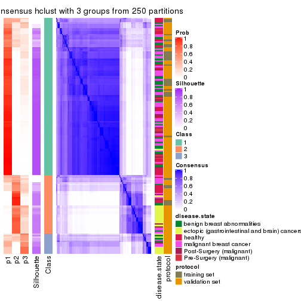</p>

</div>
<div id='tab-SD-hclust-consensus-heatmap-3'>
<pre><code class="r">consensus_heatmap(res, k = 4)
</code></pre>

<p></p>

</div>
<div id='tab-SD-hclust-consensus-heatmap-4'>
<pre><code class="r">consensus_heatmap(res, k = 5)
</code></pre>

<p></p>

</div>
<div id='tab-SD-hclust-consensus-heatmap-5'>
<pre><code class="r">consensus_heatmap(res, k = 6)
</code></pre>

<p></p>

</div>
</div>

Heatmaps for the membership of samples in all partitions to see how consistent they are:


<script>
$( function() {
	$( '#tabs-SD-hclust-membership-heatmap' ).tabs();
} );
</script>
<div id='tabs-SD-hclust-membership-heatmap'>
<ul>
<li><a href='#tab-SD-hclust-membership-heatmap-1'>k = 2</a></li>
<li><a href='#tab-SD-hclust-membership-heatmap-2'>k = 3</a></li>
<li><a href='#tab-SD-hclust-membership-heatmap-3'>k = 4</a></li>
<li><a href='#tab-SD-hclust-membership-heatmap-4'>k = 5</a></li>
<li><a href='#tab-SD-hclust-membership-heatmap-5'>k = 6</a></li>
</ul>
<div id='tab-SD-hclust-membership-heatmap-1'>
<pre><code class="r">membership_heatmap(res, k = 2)
</code></pre>

<p></p>

</div>
<div id='tab-SD-hclust-membership-heatmap-2'>
<pre><code class="r">membership_heatmap(res, k = 3)
</code></pre>

<p></p>

</div>
<div id='tab-SD-hclust-membership-heatmap-3'>
<pre><code class="r">membership_heatmap(res, k = 4)
</code></pre>

<p></p>

</div>
<div id='tab-SD-hclust-membership-heatmap-4'>
<pre><code class="r">membership_heatmap(res, k = 5)
</code></pre>

<p></p>

</div>
<div id='tab-SD-hclust-membership-heatmap-5'>
<pre><code class="r">membership_heatmap(res, k = 6)
</code></pre>

<p></p>

</div>
</div>

As soon as we have had the classes for columns, we can look for signatures
which are significantly different between classes which can be candidate marks
for certain classes. Following are the heatmaps for signatures.


Signature heatmaps where rows are scaled:


<script>
$( function() {
	$( '#tabs-SD-hclust-get-signatures' ).tabs();
} );
</script>
<div id='tabs-SD-hclust-get-signatures'>
<ul>
<li><a href='#tab-SD-hclust-get-signatures-1'>k = 2</a></li>
<li><a href='#tab-SD-hclust-get-signatures-2'>k = 3</a></li>
<li><a href='#tab-SD-hclust-get-signatures-3'>k = 4</a></li>
<li><a href='#tab-SD-hclust-get-signatures-4'>k = 5</a></li>
<li><a href='#tab-SD-hclust-get-signatures-5'>k = 6</a></li>
</ul>
<div id='tab-SD-hclust-get-signatures-1'>
<pre><code class="r">get_signatures(res, k = 2)
</code></pre>

<p></p>

</div>
<div id='tab-SD-hclust-get-signatures-2'>
<pre><code class="r">get_signatures(res, k = 3)
</code></pre>

<p></p>

</div>
<div id='tab-SD-hclust-get-signatures-3'>
<pre><code class="r">get_signatures(res, k = 4)
</code></pre>

<p></p>

</div>
<div id='tab-SD-hclust-get-signatures-4'>
<pre><code class="r">get_signatures(res, k = 5)
</code></pre>

<p></p>

</div>
<div id='tab-SD-hclust-get-signatures-5'>
<pre><code class="r">get_signatures(res, k = 6)
</code></pre>

<p></p>

</div>
</div>


Signature heatmaps where rows are not scaled:


<script>
$( function() {
	$( '#tabs-SD-hclust-get-signatures-no-scale' ).tabs();
} );
</script>
<div id='tabs-SD-hclust-get-signatures-no-scale'>
<ul>
<li><a href='#tab-SD-hclust-get-signatures-no-scale-1'>k = 2</a></li>
<li><a href='#tab-SD-hclust-get-signatures-no-scale-2'>k = 3</a></li>
<li><a href='#tab-SD-hclust-get-signatures-no-scale-3'>k = 4</a></li>
<li><a href='#tab-SD-hclust-get-signatures-no-scale-4'>k = 5</a></li>
<li><a href='#tab-SD-hclust-get-signatures-no-scale-5'>k = 6</a></li>
</ul>
<div id='tab-SD-hclust-get-signatures-no-scale-1'>
<pre><code class="r">get_signatures(res, k = 2, scale_rows = FALSE)
</code></pre>

<p></p>

</div>
<div id='tab-SD-hclust-get-signatures-no-scale-2'>
<pre><code class="r">get_signatures(res, k = 3, scale_rows = FALSE)
</code></pre>

<p></p>

</div>
<div id='tab-SD-hclust-get-signatures-no-scale-3'>
<pre><code class="r">get_signatures(res, k = 4, scale_rows = FALSE)
</code></pre>

<p></p>

</div>
<div id='tab-SD-hclust-get-signatures-no-scale-4'>
<pre><code class="r">get_signatures(res, k = 5, scale_rows = FALSE)
</code></pre>

<p></p>

</div>
<div id='tab-SD-hclust-get-signatures-no-scale-5'>
<pre><code class="r">get_signatures(res, k = 6, scale_rows = FALSE)
</code></pre>

<p></p>

</div>
</div>


Compare the overlap of signatures from different k:

```r
compare_signatures(res)
```


`get_signature()` returns a data frame invisibly. TO get the list of signatures, the function
call should be assigned to a variable explicitly. In following code, if `plot` argument is set
to `FALSE`, no heatmap is plotted while only the differential analysis is performed.

```r
# code only for demonstration
tb = get_signature(res, k = ..., plot = FALSE)
```

An example of the output of `tb` is:

```
#>   which_row         fdr    mean_1    mean_2 scaled_mean_1 scaled_mean_2 km
#> 1        38 0.042760348  8.373488  9.131774    -0.5533452     0.5164555  1
#> 2        40 0.018707592  7.106213  8.469186    -0.6173731     0.5762149  1
#> 3        55 0.019134737 10.221463 11.207825    -0.6159697     0.5749050  1
#> 4        59 0.006059896  5.921854  7.869574    -0.6899429     0.6439467  1
#> 5        60 0.018055526  8.928898 10.211722    -0.6204761     0.5791110  1
#> 6        98 0.009384629 15.714769 14.887706     0.6635654    -0.6193277  2
...
```

The columns in `tb` are:

1. `which_row`: row indices corresponding to the input matrix.
2. `fdr`: FDR for the differential test. 
3. `mean_x`: The mean value in group x.
4. `scaled_mean_x`: The mean value in group x after rows are scaled.
5. `km`: Row groups if k-means clustering is applied to rows.


UMAP plot which shows how samples are separated.


<script>
$( function() {
	$( '#tabs-SD-hclust-dimension-reduction' ).tabs();
} );
</script>
<div id='tabs-SD-hclust-dimension-reduction'>
<ul>
<li><a href='#tab-SD-hclust-dimension-reduction-1'>k = 2</a></li>
<li><a href='#tab-SD-hclust-dimension-reduction-2'>k = 3</a></li>
<li><a href='#tab-SD-hclust-dimension-reduction-3'>k = 4</a></li>
<li><a href='#tab-SD-hclust-dimension-reduction-4'>k = 5</a></li>
<li><a href='#tab-SD-hclust-dimension-reduction-5'>k = 6</a></li>
</ul>
<div id='tab-SD-hclust-dimension-reduction-1'>
<pre><code class="r">dimension_reduction(res, k = 2, method = &quot;UMAP&quot;)
</code></pre>

<p></p>

</div>
<div id='tab-SD-hclust-dimension-reduction-2'>
<pre><code class="r">dimension_reduction(res, k = 3, method = &quot;UMAP&quot;)
</code></pre>

<p></p>

</div>
<div id='tab-SD-hclust-dimension-reduction-3'>
<pre><code class="r">dimension_reduction(res, k = 4, method = &quot;UMAP&quot;)
</code></pre>

<p></p>

</div>
<div id='tab-SD-hclust-dimension-reduction-4'>
<pre><code class="r">dimension_reduction(res, k = 5, method = &quot;UMAP&quot;)
</code></pre>

<p></p>

</div>
<div id='tab-SD-hclust-dimension-reduction-5'>
<pre><code class="r">dimension_reduction(res, k = 6, method = &quot;UMAP&quot;)
</code></pre>

<p></p>

</div>
</div>


Following heatmap shows how subgroups are split when increasing `k`:

```r
collect_classes(res)
```


Test correlation between subgroups and known annotations. If the known
annotation is numeric, one-way ANOVA test is applied, and if the known
annotation is discrete, chi-squared contingency table test is applied.

```r
test_to_known_factors(res)
```

```
#>             n disease.state(p) protocol(p) k
#> SD:hclust 152         6.37e-05    9.58e-01 2
#> SD:hclust 133         2.56e-07    3.04e-01 3
#> SD:hclust 126         3.51e-12    5.13e-02 4
#> SD:hclust 113         7.09e-11    1.31e-01 5
#> SD:hclust  87         9.81e-06    7.59e-07 6
```


If matrix rows can be associated to genes, consider to use `GO_Enrichment(res,
...)` to perform function enrichment for the signature genes.


 

---------------------------------------------------


### SD:kmeans


The object with results only for a single top-value method and a single partition method 
can be extracted as:

```r
res = res_list["SD", "kmeans"]
# you can also extract it by
# res = res_list["SD:kmeans"]
```

A summary of `res` and all the functions that can be applied to it:

```r
res
```

```
#> A 'ConsensusPartition' object with k = 2, 3, 4, 5, 6.
#>   On a matrix with 51941 rows and 162 columns.
#>   Top rows (1000, 2000, 3000, 4000, 5000) are extracted by 'SD' method.
#>   Subgroups are detected by 'kmeans' method.
#>   Performed in total 1250 partitions by row resampling.
#>   Best k for subgroups seems to be 2.
#> 
#> Following methods can be applied to this 'ConsensusPartition' object:
#>  [1] "cola_report"             "collect_classes"         "collect_plots"          
#>  [4] "collect_stats"           "colnames"                "compare_signatures"     
#>  [7] "consensus_heatmap"       "dimension_reduction"     "functional_enrichment"  
#> [10] "get_anno_col"            "get_anno"                "get_classes"            
#> [13] "get_consensus"           "get_matrix"              "get_membership"         
#> [16] "get_param"               "get_signatures"          "get_stats"              
#> [19] "is_best_k"               "is_stable_k"             "membership_heatmap"     
#> [22] "ncol"                    "nrow"                    "plot_ecdf"              
#> [25] "rownames"                "select_partition_number" "show"                   
#> [28] "suggest_best_k"          "test_to_known_factors"
```

`collect_plots()` function collects all the plots made from `res` for all `k` (number of partitions)
into one single page to provide an easy and fast comparison between different `k`.

```r
collect_plots(res)
```


The plots are:

- The first row: a plot of the ECDF (Empirical cumulative distribution
  function) curves of the consensus matrix for each `k` and the heatmap of
  predicted classes for each `k`.
- The second row: heatmaps of the consensus matrix for each `k`.
- The third row: heatmaps of the membership matrix for each `k`.
- The fouth row: heatmaps of the signatures for each `k`.

All the plots in panels can be made by individual functions and they are
plotted later in this section.

`select_partition_number()` produces several plots showing different
statistics for choosing "optimized" `k`. There are following statistics:

- ECDF curves of the consensus matrix for each `k`;
- 1-PAC. [The PAC
  score](https://en.wikipedia.org/wiki/Consensus_clustering#Over-interpretation_potential_of_consensus_clustering)
  measures the proportion of the ambiguous subgrouping.
- Mean silhouette score.
- Concordance. The mean probability of fiting the consensus class ids in all
  partitions.
- Area increased. Denote $A_k$ as the area under the ECDF curve for current
  `k`, the area increased is defined as $A_k - A_{k-1}$.
- Rand index. The percent of pairs of samples that are both in a same cluster
  or both are not in a same cluster in the partition of k and k-1.
- Jaccard index. The ratio of pairs of samples are both in a same cluster in
  the partition of k and k-1 and the pairs of samples are both in a same
  cluster in the partition k or k-1.

The detailed explanations of these statistics can be found in [the cola
vignette](http://bioconductor.org/packages/devel/bioc/vignettes/cola/inst/doc/cola.html#toc_13).

Generally speaking, lower PAC score, higher mean silhouette score or higher
concordance corresponds to better partition. Rand index and Jaccard index
measure how similar the current partition is compared to partition with `k-1`.
If they are too similar, we won't accept `k` is better than `k-1`.

```r
select_partition_number(res)
```


The numeric values for all these statistics can be obtained by `get_stats()`.

```r
get_stats(res)
```

```
#>   k 1-PAC mean_silhouette concordance area_increased  Rand Jaccard
#> 2 2 0.862           0.920       0.964         0.4472 0.549   0.549
#> 3 3 0.615           0.782       0.885         0.4439 0.724   0.532
#> 4 4 0.627           0.737       0.841         0.1246 0.863   0.643
#> 5 5 0.596           0.487       0.699         0.0750 0.889   0.628
#> 6 6 0.648           0.576       0.726         0.0424 0.847   0.432
```

`suggest_best_k()` suggests the best $k$ based on these statistics. The rules are as follows:

- All $k$ with Jaccard index larger than 0.95 are removed because the increase of
  the partition number does not provides enough extra information. If all $k$ are removed,
  the best $k$ is assigned by `NA`.
- For $k$ with 1-PAC larger than 0.9, the maximal $k$ is taken as the "best k". Other $k$ is called "optional k".
- If it does not fit the second rule. The $k$ with the highest vote of highest
  1-PAC, mean silhouette and concordance is taken as the "best k".

```r
suggest_best_k(res)
```

```
#> [1] 2
```


Following shows the table of the partitions (You need to click the **show/hide
code output** link to see it). The membership matrix (columns with name `p*`)
is inferred by
[`clue::cl_consensus()`](https://www.rdocumentation.org/link/cl_consensus?package=clue)
function with the `SE` method. Basically the value in the membership matrix
represents the probability to belong to a certain group. The finall class
label for an item is determined with the group with highest probability it
belongs to.

In `get_classes()` function, the entropy is calculated from the membership
matrix and the silhouette score is calculated from the consensus matrix.


<script>
$( function() {
	$( '#tabs-SD-kmeans-get-classes' ).tabs();
} );
</script>
<div id='tabs-SD-kmeans-get-classes'>
<ul>
<li><a href='#tab-SD-kmeans-get-classes-1'>k = 2</a></li>
<li><a href='#tab-SD-kmeans-get-classes-2'>k = 3</a></li>
<li><a href='#tab-SD-kmeans-get-classes-3'>k = 4</a></li>
<li><a href='#tab-SD-kmeans-get-classes-4'>k = 5</a></li>
<li><a href='#tab-SD-kmeans-get-classes-5'>k = 6</a></li>
</ul>

<div id='tab-SD-kmeans-get-classes-1'>
<p><a id='tab-SD-kmeans-get-classes-1-a' style='color:#0366d6' href='#'>show/hide code output</a></p>
<pre><code class="r">cbind(get_classes(res, k = 2), get_membership(res, k = 2))
</code></pre>

<pre><code>#&gt;           class entropy silhouette    p1    p2
#&gt; GSM682002     1  0.0000      0.973 1.000 0.000
#&gt; GSM682003     2  0.0000      0.938 0.000 1.000
#&gt; GSM682004     2  0.0000      0.938 0.000 1.000
#&gt; GSM682005     1  0.2948      0.932 0.948 0.052
#&gt; GSM682006     1  0.2948      0.932 0.948 0.052
#&gt; GSM682007     1  0.2423      0.942 0.960 0.040
#&gt; GSM682008     1  0.4815      0.879 0.896 0.104
#&gt; GSM682009     2  0.2236      0.923 0.036 0.964
#&gt; GSM682010     1  0.0000      0.973 1.000 0.000
#&gt; GSM682011     1  0.0000      0.973 1.000 0.000
#&gt; GSM682096     2  0.8327      0.648 0.264 0.736
#&gt; GSM682097     2  0.1414      0.931 0.020 0.980
#&gt; GSM682098     2  0.0000      0.938 0.000 1.000
#&gt; GSM682099     1  0.3733      0.912 0.928 0.072
#&gt; GSM682100     2  0.0000      0.938 0.000 1.000
#&gt; GSM682101     2  0.9909      0.201 0.444 0.556
#&gt; GSM682102     1  0.0000      0.973 1.000 0.000
#&gt; GSM682103     1  0.0000      0.973 1.000 0.000
#&gt; GSM682104     1  0.2948      0.932 0.948 0.052
#&gt; GSM682105     1  0.0000      0.973 1.000 0.000
#&gt; GSM682106     1  0.0000      0.973 1.000 0.000
#&gt; GSM682107     1  0.0000      0.973 1.000 0.000
#&gt; GSM682108     1  0.0000      0.973 1.000 0.000
#&gt; GSM682109     1  0.2948      0.932 0.948 0.052
#&gt; GSM682110     1  0.0000      0.973 1.000 0.000
#&gt; GSM682111     2  0.7528      0.756 0.216 0.784
#&gt; GSM682112     2  0.5842      0.845 0.140 0.860
#&gt; GSM682113     1  0.0000      0.973 1.000 0.000
#&gt; GSM682114     1  0.0000      0.973 1.000 0.000
#&gt; GSM682115     1  0.0000      0.973 1.000 0.000
#&gt; GSM682116     1  0.0000      0.973 1.000 0.000
#&gt; GSM682117     1  0.0000      0.973 1.000 0.000
#&gt; GSM682118     1  0.0000      0.973 1.000 0.000
#&gt; GSM682119     1  0.0000      0.973 1.000 0.000
#&gt; GSM682120     1  0.0000      0.973 1.000 0.000
#&gt; GSM682121     1  0.0000      0.973 1.000 0.000
#&gt; GSM682122     1  0.0000      0.973 1.000 0.000
#&gt; GSM682012     2  0.0000      0.938 0.000 1.000
#&gt; GSM682013     2  0.0000      0.938 0.000 1.000
#&gt; GSM682014     2  0.0000      0.938 0.000 1.000
#&gt; GSM682015     2  0.0000      0.938 0.000 1.000
#&gt; GSM682016     2  0.0000      0.938 0.000 1.000
#&gt; GSM682017     2  0.0000      0.938 0.000 1.000
#&gt; GSM682018     2  0.0000      0.938 0.000 1.000
#&gt; GSM682019     2  0.0000      0.938 0.000 1.000
#&gt; GSM682020     2  0.0000      0.938 0.000 1.000
#&gt; GSM682021     2  0.9608      0.383 0.384 0.616
#&gt; GSM682022     2  0.0000      0.938 0.000 1.000
#&gt; GSM682023     2  0.0000      0.938 0.000 1.000
#&gt; GSM682024     1  0.0000      0.973 1.000 0.000
#&gt; GSM682025     2  0.0000      0.938 0.000 1.000
#&gt; GSM682026     2  0.0000      0.938 0.000 1.000
#&gt; GSM682027     1  0.9970      0.118 0.532 0.468
#&gt; GSM682028     1  0.9970      0.118 0.532 0.468
#&gt; GSM682029     1  0.7376      0.749 0.792 0.208
#&gt; GSM682030     1  0.7219      0.761 0.800 0.200
#&gt; GSM682031     1  0.7219      0.761 0.800 0.200
#&gt; GSM682032     1  0.7219      0.761 0.800 0.200
#&gt; GSM682033     2  0.0000      0.938 0.000 1.000
#&gt; GSM681992     2  0.6048      0.840 0.148 0.852
#&gt; GSM681993     2  0.5842      0.845 0.140 0.860
#&gt; GSM681994     1  0.0000      0.973 1.000 0.000
#&gt; GSM681995     1  0.0000      0.973 1.000 0.000
#&gt; GSM681996     1  0.2948      0.932 0.948 0.052
#&gt; GSM681997     1  0.2948      0.932 0.948 0.052
#&gt; GSM681998     1  0.2948      0.932 0.948 0.052
#&gt; GSM681999     1  0.2948      0.932 0.948 0.052
#&gt; GSM682000     1  0.0000      0.973 1.000 0.000
#&gt; GSM682001     1  0.0000      0.973 1.000 0.000
#&gt; GSM682055     2  0.0000      0.938 0.000 1.000
#&gt; GSM682056     2  0.6973      0.779 0.188 0.812
#&gt; GSM682057     2  0.0000      0.938 0.000 1.000
#&gt; GSM682058     1  0.6887      0.781 0.816 0.184
#&gt; GSM682059     2  0.0000      0.938 0.000 1.000
#&gt; GSM682060     2  0.2603      0.919 0.044 0.956
#&gt; GSM682061     2  0.0000      0.938 0.000 1.000
#&gt; GSM682062     2  0.0000      0.938 0.000 1.000
#&gt; GSM682063     2  0.0000      0.938 0.000 1.000
#&gt; GSM682064     1  0.0000      0.973 1.000 0.000
#&gt; GSM682065     1  0.0000      0.973 1.000 0.000
#&gt; GSM682066     1  0.0000      0.973 1.000 0.000
#&gt; GSM682067     1  0.0000      0.973 1.000 0.000
#&gt; GSM682068     1  0.0000      0.973 1.000 0.000
#&gt; GSM682069     1  0.0000      0.973 1.000 0.000
#&gt; GSM682070     1  0.0000      0.973 1.000 0.000
#&gt; GSM682071     2  0.0000      0.938 0.000 1.000
#&gt; GSM682072     1  0.2948      0.932 0.948 0.052
#&gt; GSM682073     1  0.3114      0.929 0.944 0.056
#&gt; GSM682074     1  0.0000      0.973 1.000 0.000
#&gt; GSM682075     1  0.0000      0.973 1.000 0.000
#&gt; GSM682076     1  0.0000      0.973 1.000 0.000
#&gt; GSM682077     1  0.0000      0.973 1.000 0.000
#&gt; GSM682078     1  0.0000      0.973 1.000 0.000
#&gt; GSM682079     1  0.0000      0.973 1.000 0.000
#&gt; GSM682080     2  0.4298      0.890 0.088 0.912
#&gt; GSM682081     2  0.7528      0.757 0.216 0.784
#&gt; GSM682082     1  0.0000      0.973 1.000 0.000
#&gt; GSM682083     1  0.0000      0.973 1.000 0.000
#&gt; GSM682084     1  0.0000      0.973 1.000 0.000
#&gt; GSM682085     1  0.0000      0.973 1.000 0.000
#&gt; GSM682086     1  0.0000      0.973 1.000 0.000
#&gt; GSM682087     1  0.0000      0.973 1.000 0.000
#&gt; GSM682088     1  0.0000      0.973 1.000 0.000
#&gt; GSM682089     1  0.0000      0.973 1.000 0.000
#&gt; GSM682090     1  0.0000      0.973 1.000 0.000
#&gt; GSM682091     1  0.0000      0.973 1.000 0.000
#&gt; GSM682092     1  0.0000      0.973 1.000 0.000
#&gt; GSM682093     1  0.0000      0.973 1.000 0.000
#&gt; GSM682094     1  0.0000      0.973 1.000 0.000
#&gt; GSM682095     2  0.0000      0.938 0.000 1.000
#&gt; GSM681982     2  0.3879      0.899 0.076 0.924
#&gt; GSM681983     1  0.0000      0.973 1.000 0.000
#&gt; GSM681984     2  0.1184      0.932 0.016 0.984
#&gt; GSM681985     2  0.9754      0.377 0.408 0.592
#&gt; GSM681986     2  0.0938      0.934 0.012 0.988
#&gt; GSM681987     2  0.0000      0.938 0.000 1.000
#&gt; GSM681988     2  0.1843      0.927 0.028 0.972
#&gt; GSM681989     2  0.1633      0.929 0.024 0.976
#&gt; GSM681990     1  0.0000      0.973 1.000 0.000
#&gt; GSM681991     2  0.0000      0.938 0.000 1.000
#&gt; GSM682034     1  0.0000      0.973 1.000 0.000
#&gt; GSM682035     1  0.0000      0.973 1.000 0.000
#&gt; GSM682036     1  0.0000      0.973 1.000 0.000
#&gt; GSM682037     1  0.0000      0.973 1.000 0.000
#&gt; GSM682038     2  0.0000      0.938 0.000 1.000
#&gt; GSM682039     1  0.0000      0.973 1.000 0.000
#&gt; GSM682040     2  0.3733      0.901 0.072 0.928
#&gt; GSM682041     1  0.0000      0.973 1.000 0.000
#&gt; GSM682042     2  0.5178      0.867 0.116 0.884
#&gt; GSM682043     1  0.0000      0.973 1.000 0.000
#&gt; GSM682044     1  0.0000      0.973 1.000 0.000
#&gt; GSM682045     1  0.0000      0.973 1.000 0.000
#&gt; GSM682046     1  0.0000      0.973 1.000 0.000
#&gt; GSM682047     1  0.0000      0.973 1.000 0.000
#&gt; GSM682048     1  0.0000      0.973 1.000 0.000
#&gt; GSM682049     1  0.0000      0.973 1.000 0.000
#&gt; GSM682050     1  0.0000      0.973 1.000 0.000
#&gt; GSM682051     1  0.0000      0.973 1.000 0.000
#&gt; GSM682052     2  0.5842      0.845 0.140 0.860
#&gt; GSM682053     1  0.0000      0.973 1.000 0.000
#&gt; GSM682054     1  0.0000      0.973 1.000 0.000
#&gt; GSM682123     1  0.0000      0.973 1.000 0.000
#&gt; GSM682124     1  0.0000      0.973 1.000 0.000
#&gt; GSM682125     1  0.0000      0.973 1.000 0.000
#&gt; GSM682126     1  0.0000      0.973 1.000 0.000
#&gt; GSM682127     1  0.0000      0.973 1.000 0.000
#&gt; GSM682128     1  0.0000      0.973 1.000 0.000
#&gt; GSM682129     2  0.0000      0.938 0.000 1.000
#&gt; GSM682130     2  0.0000      0.938 0.000 1.000
#&gt; GSM682131     2  0.0000      0.938 0.000 1.000
#&gt; GSM682132     1  0.0000      0.973 1.000 0.000
#&gt; GSM682133     1  0.0000      0.973 1.000 0.000
#&gt; GSM682134     1  0.0000      0.973 1.000 0.000
#&gt; GSM682135     1  0.0000      0.973 1.000 0.000
#&gt; GSM682136     1  0.0000      0.973 1.000 0.000
#&gt; GSM682137     1  0.0000      0.973 1.000 0.000
#&gt; GSM682138     1  0.0000      0.973 1.000 0.000
#&gt; GSM682139     1  0.0000      0.973 1.000 0.000
#&gt; GSM682140     1  0.0000      0.973 1.000 0.000
#&gt; GSM682141     1  0.0000      0.973 1.000 0.000
#&gt; GSM682142     1  0.0000      0.973 1.000 0.000
#&gt; GSM682143     2  0.0000      0.938 0.000 1.000
</code></pre>

<script>
$('#tab-SD-kmeans-get-classes-1-a').parent().next().next().hide();
$('#tab-SD-kmeans-get-classes-1-a').click(function(){
  $('#tab-SD-kmeans-get-classes-1-a').parent().next().next().toggle();
  return(false);
});
</script>
</div>

<div id='tab-SD-kmeans-get-classes-2'>
<p><a id='tab-SD-kmeans-get-classes-2-a' style='color:#0366d6' href='#'>show/hide code output</a></p>
<pre><code class="r">cbind(get_classes(res, k = 3), get_membership(res, k = 3))
</code></pre>

<pre><code>#&gt;           class entropy silhouette    p1    p2    p3
#&gt; GSM682002     1  0.0237    0.89619 0.996 0.000 0.004
#&gt; GSM682003     2  0.1964    0.87431 0.000 0.944 0.056
#&gt; GSM682004     2  0.0747    0.89248 0.000 0.984 0.016
#&gt; GSM682005     3  0.3482    0.80511 0.128 0.000 0.872
#&gt; GSM682006     3  0.3619    0.80283 0.136 0.000 0.864
#&gt; GSM682007     3  0.0000    0.78917 0.000 0.000 1.000
#&gt; GSM682008     3  0.0000    0.78917 0.000 0.000 1.000
#&gt; GSM682009     3  0.2879    0.79339 0.024 0.052 0.924
#&gt; GSM682010     3  0.5650    0.44739 0.312 0.000 0.688
#&gt; GSM682011     3  0.5621    0.64879 0.308 0.000 0.692
#&gt; GSM682096     3  0.6488    0.74290 0.084 0.160 0.756
#&gt; GSM682097     3  0.4291    0.63340 0.000 0.180 0.820
#&gt; GSM682098     3  0.5397    0.63005 0.000 0.280 0.720
#&gt; GSM682099     3  0.6291    0.77027 0.152 0.080 0.768
#&gt; GSM682100     2  0.0000    0.89605 0.000 1.000 0.000
#&gt; GSM682101     3  0.7512    0.63154 0.076 0.268 0.656
#&gt; GSM682102     1  0.0000    0.89728 1.000 0.000 0.000
#&gt; GSM682103     1  0.3551    0.85533 0.868 0.000 0.132
#&gt; GSM682104     3  0.1753    0.78098 0.048 0.000 0.952
#&gt; GSM682105     1  0.1031    0.88782 0.976 0.000 0.024
#&gt; GSM682106     3  0.0892    0.79643 0.020 0.000 0.980
#&gt; GSM682107     3  0.5621    0.64879 0.308 0.000 0.692
#&gt; GSM682108     3  0.3038    0.80436 0.104 0.000 0.896
#&gt; GSM682109     3  0.0592    0.78936 0.012 0.000 0.988
#&gt; GSM682110     3  0.3619    0.80264 0.136 0.000 0.864
#&gt; GSM682111     3  0.2050    0.77715 0.020 0.028 0.952
#&gt; GSM682112     2  0.7353    0.57319 0.052 0.632 0.316
#&gt; GSM682113     1  0.0000    0.89728 1.000 0.000 0.000
#&gt; GSM682114     1  0.6180    0.42742 0.584 0.000 0.416
#&gt; GSM682115     1  0.0747    0.89776 0.984 0.000 0.016
#&gt; GSM682116     1  0.0747    0.89776 0.984 0.000 0.016
#&gt; GSM682117     1  0.5291    0.53492 0.732 0.000 0.268
#&gt; GSM682118     1  0.3340    0.87134 0.880 0.000 0.120
#&gt; GSM682119     1  0.2537    0.88550 0.920 0.000 0.080
#&gt; GSM682120     1  0.0892    0.89750 0.980 0.000 0.020
#&gt; GSM682121     1  0.1529    0.89300 0.960 0.000 0.040
#&gt; GSM682122     3  0.1643    0.78439 0.044 0.000 0.956
#&gt; GSM682012     2  0.0000    0.89605 0.000 1.000 0.000
#&gt; GSM682013     2  0.0000    0.89605 0.000 1.000 0.000
#&gt; GSM682014     2  0.0000    0.89605 0.000 1.000 0.000
#&gt; GSM682015     2  0.0000    0.89605 0.000 1.000 0.000
#&gt; GSM682016     2  0.2711    0.85316 0.000 0.912 0.088
#&gt; GSM682017     2  0.0000    0.89605 0.000 1.000 0.000
#&gt; GSM682018     2  0.0000    0.89605 0.000 1.000 0.000
#&gt; GSM682019     2  0.0000    0.89605 0.000 1.000 0.000
#&gt; GSM682020     2  0.0000    0.89605 0.000 1.000 0.000
#&gt; GSM682021     2  0.7489    0.41960 0.080 0.664 0.256
#&gt; GSM682022     2  0.0000    0.89605 0.000 1.000 0.000
#&gt; GSM682023     2  0.0000    0.89605 0.000 1.000 0.000
#&gt; GSM682024     1  0.0000    0.89728 1.000 0.000 0.000
#&gt; GSM682025     2  0.0000    0.89605 0.000 1.000 0.000
#&gt; GSM682026     2  0.0000    0.89605 0.000 1.000 0.000
#&gt; GSM682027     3  0.6935    0.72525 0.096 0.176 0.728
#&gt; GSM682028     3  0.6935    0.72525 0.096 0.176 0.728
#&gt; GSM682029     3  0.7026    0.73805 0.120 0.152 0.728
#&gt; GSM682030     3  0.7034    0.73976 0.124 0.148 0.728
#&gt; GSM682031     3  0.7034    0.73976 0.124 0.148 0.728
#&gt; GSM682032     3  0.7034    0.73976 0.124 0.148 0.728
#&gt; GSM682033     2  0.0000    0.89605 0.000 1.000 0.000
#&gt; GSM681992     3  0.3755    0.80634 0.120 0.008 0.872
#&gt; GSM681993     3  0.5450    0.54845 0.012 0.228 0.760
#&gt; GSM681994     3  0.4235    0.78807 0.176 0.000 0.824
#&gt; GSM681995     3  0.4399    0.78148 0.188 0.000 0.812
#&gt; GSM681996     3  0.0237    0.79121 0.004 0.000 0.996
#&gt; GSM681997     3  0.3412    0.80522 0.124 0.000 0.876
#&gt; GSM681998     3  0.3340    0.80616 0.120 0.000 0.880
#&gt; GSM681999     3  0.3686    0.80126 0.140 0.000 0.860
#&gt; GSM682000     3  0.5327    0.70363 0.272 0.000 0.728
#&gt; GSM682001     3  0.4842    0.75708 0.224 0.000 0.776
#&gt; GSM682055     2  0.4002    0.80115 0.000 0.840 0.160
#&gt; GSM682056     3  0.4645    0.63491 0.008 0.176 0.816
#&gt; GSM682057     2  0.0000    0.89605 0.000 1.000 0.000
#&gt; GSM682058     3  0.3325    0.80496 0.076 0.020 0.904
#&gt; GSM682059     2  0.0000    0.89605 0.000 1.000 0.000
#&gt; GSM682060     2  0.7793    0.27690 0.052 0.524 0.424
#&gt; GSM682061     2  0.4346    0.78172 0.000 0.816 0.184
#&gt; GSM682062     2  0.0000    0.89605 0.000 1.000 0.000
#&gt; GSM682063     2  0.0000    0.89605 0.000 1.000 0.000
#&gt; GSM682064     1  0.5591    0.45361 0.696 0.000 0.304
#&gt; GSM682065     1  0.0000    0.89728 1.000 0.000 0.000
#&gt; GSM682066     1  0.0424    0.89500 0.992 0.000 0.008
#&gt; GSM682067     1  0.2711    0.88073 0.912 0.000 0.088
#&gt; GSM682068     1  0.6252    0.00966 0.556 0.000 0.444
#&gt; GSM682069     1  0.2711    0.88073 0.912 0.000 0.088
#&gt; GSM682070     1  0.0747    0.89784 0.984 0.000 0.016
#&gt; GSM682071     2  0.5560    0.65796 0.000 0.700 0.300
#&gt; GSM682072     3  0.1753    0.78098 0.048 0.000 0.952
#&gt; GSM682073     3  0.0000    0.78917 0.000 0.000 1.000
#&gt; GSM682074     1  0.3267    0.86555 0.884 0.000 0.116
#&gt; GSM682075     1  0.4062    0.73566 0.836 0.000 0.164
#&gt; GSM682076     1  0.3038    0.87392 0.896 0.000 0.104
#&gt; GSM682077     1  0.2796    0.87807 0.908 0.000 0.092
#&gt; GSM682078     1  0.3340    0.86322 0.880 0.000 0.120
#&gt; GSM682079     1  0.0592    0.89799 0.988 0.000 0.012
#&gt; GSM682080     3  0.6701    0.05221 0.012 0.412 0.576
#&gt; GSM682081     3  0.0000    0.78917 0.000 0.000 1.000
#&gt; GSM682082     1  0.6302    0.26205 0.520 0.000 0.480
#&gt; GSM682083     1  0.0592    0.89799 0.988 0.000 0.012
#&gt; GSM682084     1  0.5905    0.56461 0.648 0.000 0.352
#&gt; GSM682085     3  0.6260   -0.01978 0.448 0.000 0.552
#&gt; GSM682086     1  0.0592    0.89367 0.988 0.000 0.012
#&gt; GSM682087     1  0.3412    0.86716 0.876 0.000 0.124
#&gt; GSM682088     1  0.3267    0.86555 0.884 0.000 0.116
#&gt; GSM682089     1  0.3482    0.85756 0.872 0.000 0.128
#&gt; GSM682090     1  0.3482    0.85756 0.872 0.000 0.128
#&gt; GSM682091     1  0.1031    0.89646 0.976 0.000 0.024
#&gt; GSM682092     1  0.0237    0.89778 0.996 0.000 0.004
#&gt; GSM682093     1  0.6291    0.27606 0.532 0.000 0.468
#&gt; GSM682094     1  0.0747    0.89207 0.984 0.000 0.016
#&gt; GSM682095     2  0.0747    0.89248 0.000 0.984 0.016
#&gt; GSM681982     3  0.6274   -0.10336 0.000 0.456 0.544
#&gt; GSM681983     1  0.0000    0.89728 1.000 0.000 0.000
#&gt; GSM681984     2  0.5431    0.67202 0.000 0.716 0.284
#&gt; GSM681985     3  0.7332    0.46759 0.276 0.064 0.660
#&gt; GSM681986     3  0.4443    0.78579 0.052 0.084 0.864
#&gt; GSM681987     2  0.1964    0.87431 0.000 0.944 0.056
#&gt; GSM681988     3  0.0592    0.78579 0.000 0.012 0.988
#&gt; GSM681989     3  0.2663    0.79564 0.024 0.044 0.932
#&gt; GSM681990     3  0.2261    0.80414 0.068 0.000 0.932
#&gt; GSM681991     2  0.0747    0.89248 0.000 0.984 0.016
#&gt; GSM682034     1  0.0000    0.89728 1.000 0.000 0.000
#&gt; GSM682035     1  0.2448    0.88474 0.924 0.000 0.076
#&gt; GSM682036     1  0.2356    0.88734 0.928 0.000 0.072
#&gt; GSM682037     1  0.0000    0.89728 1.000 0.000 0.000
#&gt; GSM682038     2  0.3267    0.83441 0.000 0.884 0.116
#&gt; GSM682039     1  0.2261    0.88703 0.932 0.000 0.068
#&gt; GSM682040     2  0.6193    0.65204 0.016 0.692 0.292
#&gt; GSM682041     1  0.3267    0.86555 0.884 0.000 0.116
#&gt; GSM682042     2  0.7175    0.49399 0.032 0.592 0.376
#&gt; GSM682043     1  0.0000    0.89728 1.000 0.000 0.000
#&gt; GSM682044     1  0.0000    0.89728 1.000 0.000 0.000
#&gt; GSM682045     1  0.0747    0.89784 0.984 0.000 0.016
#&gt; GSM682046     1  0.0000    0.89728 1.000 0.000 0.000
#&gt; GSM682047     1  0.3340    0.86322 0.880 0.000 0.120
#&gt; GSM682048     1  0.2356    0.88623 0.928 0.000 0.072
#&gt; GSM682049     1  0.3267    0.86555 0.884 0.000 0.116
#&gt; GSM682050     1  0.0000    0.89728 1.000 0.000 0.000
#&gt; GSM682051     1  0.3482    0.85756 0.872 0.000 0.128
#&gt; GSM682052     2  0.7589    0.49511 0.052 0.588 0.360
#&gt; GSM682053     1  0.4235    0.81429 0.824 0.000 0.176
#&gt; GSM682054     1  0.0000    0.89728 1.000 0.000 0.000
#&gt; GSM682123     1  0.2625    0.88165 0.916 0.000 0.084
#&gt; GSM682124     1  0.0000    0.89728 1.000 0.000 0.000
#&gt; GSM682125     1  0.2878    0.87703 0.904 0.000 0.096
#&gt; GSM682126     1  0.0000    0.89728 1.000 0.000 0.000
#&gt; GSM682127     1  0.0000    0.89728 1.000 0.000 0.000
#&gt; GSM682128     1  0.4555    0.68601 0.800 0.000 0.200
#&gt; GSM682129     2  0.0000    0.89605 0.000 1.000 0.000
#&gt; GSM682130     2  0.0000    0.89605 0.000 1.000 0.000
#&gt; GSM682131     2  0.0747    0.89248 0.000 0.984 0.016
#&gt; GSM682132     1  0.5835    0.37048 0.660 0.000 0.340
#&gt; GSM682133     1  0.0000    0.89728 1.000 0.000 0.000
#&gt; GSM682134     1  0.2625    0.88165 0.916 0.000 0.084
#&gt; GSM682135     1  0.2165    0.85858 0.936 0.000 0.064
#&gt; GSM682136     1  0.0000    0.89728 1.000 0.000 0.000
#&gt; GSM682137     1  0.0424    0.89487 0.992 0.000 0.008
#&gt; GSM682138     1  0.3267    0.86555 0.884 0.000 0.116
#&gt; GSM682139     1  0.0000    0.89728 1.000 0.000 0.000
#&gt; GSM682140     1  0.0747    0.89776 0.984 0.000 0.016
#&gt; GSM682141     1  0.0000    0.89728 1.000 0.000 0.000
#&gt; GSM682142     1  0.0000    0.89728 1.000 0.000 0.000
#&gt; GSM682143     2  0.1529    0.88260 0.000 0.960 0.040
</code></pre>

<script>
$('#tab-SD-kmeans-get-classes-2-a').parent().next().next().hide();
$('#tab-SD-kmeans-get-classes-2-a').click(function(){
  $('#tab-SD-kmeans-get-classes-2-a').parent().next().next().toggle();
  return(false);
});
</script>
</div>

<div id='tab-SD-kmeans-get-classes-3'>
<p><a id='tab-SD-kmeans-get-classes-3-a' style='color:#0366d6' href='#'>show/hide code output</a></p>
<pre><code class="r">cbind(get_classes(res, k = 4), get_membership(res, k = 4))
</code></pre>

<pre><code>#&gt;           class entropy silhouette    p1    p2    p3    p4
#&gt; GSM682002     1  0.3037    0.85698 0.888 0.000 0.076 0.036
#&gt; GSM682003     2  0.2401    0.87461 0.000 0.904 0.092 0.004
#&gt; GSM682004     2  0.2334    0.87740 0.000 0.908 0.088 0.004
#&gt; GSM682005     4  0.2760    0.78867 0.000 0.000 0.128 0.872
#&gt; GSM682006     4  0.2944    0.78751 0.004 0.000 0.128 0.868
#&gt; GSM682007     3  0.5085    0.43235 0.008 0.000 0.616 0.376
#&gt; GSM682008     4  0.5281    0.00233 0.008 0.000 0.464 0.528
#&gt; GSM682009     3  0.4406    0.54913 0.000 0.000 0.700 0.300
#&gt; GSM682010     3  0.4282    0.70055 0.060 0.000 0.816 0.124
#&gt; GSM682011     4  0.2644    0.80179 0.032 0.000 0.060 0.908
#&gt; GSM682096     4  0.4356    0.75213 0.000 0.048 0.148 0.804
#&gt; GSM682097     3  0.3808    0.71848 0.004 0.012 0.824 0.160
#&gt; GSM682098     4  0.4852    0.73392 0.000 0.072 0.152 0.776
#&gt; GSM682099     4  0.1816    0.79892 0.004 0.024 0.024 0.948
#&gt; GSM682100     2  0.0657    0.91519 0.000 0.984 0.012 0.004
#&gt; GSM682101     4  0.7222    0.33748 0.004 0.356 0.132 0.508
#&gt; GSM682102     1  0.0657    0.86517 0.984 0.000 0.004 0.012
#&gt; GSM682103     1  0.5766    0.53187 0.564 0.000 0.404 0.032
#&gt; GSM682104     3  0.3219    0.70464 0.000 0.000 0.836 0.164
#&gt; GSM682105     1  0.4364    0.83038 0.816 0.000 0.092 0.092
#&gt; GSM682106     3  0.5378    0.23676 0.012 0.000 0.540 0.448
#&gt; GSM682107     4  0.2915    0.80240 0.028 0.000 0.080 0.892
#&gt; GSM682108     3  0.4690    0.61602 0.016 0.000 0.724 0.260
#&gt; GSM682109     3  0.4103    0.63941 0.000 0.000 0.744 0.256
#&gt; GSM682110     4  0.3626    0.73422 0.004 0.000 0.184 0.812
#&gt; GSM682111     3  0.2216    0.72464 0.000 0.000 0.908 0.092
#&gt; GSM682112     3  0.2888    0.69845 0.000 0.124 0.872 0.004
#&gt; GSM682113     1  0.0804    0.86519 0.980 0.000 0.008 0.012
#&gt; GSM682114     3  0.3706    0.65341 0.112 0.000 0.848 0.040
#&gt; GSM682115     1  0.2742    0.85329 0.900 0.000 0.076 0.024
#&gt; GSM682116     1  0.2845    0.85273 0.896 0.000 0.076 0.028
#&gt; GSM682117     1  0.6356    0.43442 0.604 0.000 0.088 0.308
#&gt; GSM682118     1  0.5592    0.65469 0.656 0.000 0.300 0.044
#&gt; GSM682119     1  0.5078    0.63635 0.700 0.000 0.272 0.028
#&gt; GSM682120     1  0.3342    0.84406 0.868 0.000 0.100 0.032
#&gt; GSM682121     1  0.4144    0.82706 0.828 0.000 0.104 0.068
#&gt; GSM682122     3  0.3695    0.69906 0.016 0.000 0.828 0.156
#&gt; GSM682012     2  0.0188    0.91439 0.000 0.996 0.004 0.000
#&gt; GSM682013     2  0.0657    0.91519 0.000 0.984 0.012 0.004
#&gt; GSM682014     2  0.0188    0.91350 0.000 0.996 0.004 0.000
#&gt; GSM682015     2  0.0188    0.91350 0.000 0.996 0.004 0.000
#&gt; GSM682016     2  0.5366    0.55721 0.000 0.684 0.276 0.040
#&gt; GSM682017     2  0.0188    0.91350 0.000 0.996 0.004 0.000
#&gt; GSM682018     2  0.2224    0.89016 0.000 0.928 0.032 0.040
#&gt; GSM682019     2  0.1584    0.90322 0.000 0.952 0.012 0.036
#&gt; GSM682020     2  0.0657    0.91519 0.000 0.984 0.012 0.004
#&gt; GSM682021     2  0.7296    0.47532 0.064 0.608 0.068 0.260
#&gt; GSM682022     2  0.1584    0.90322 0.000 0.952 0.012 0.036
#&gt; GSM682023     2  0.1677    0.90110 0.000 0.948 0.012 0.040
#&gt; GSM682024     1  0.0469    0.86488 0.988 0.000 0.000 0.012
#&gt; GSM682025     2  0.1677    0.90110 0.000 0.948 0.012 0.040
#&gt; GSM682026     2  0.0524    0.91501 0.000 0.988 0.008 0.004
#&gt; GSM682027     4  0.1847    0.78383 0.004 0.052 0.004 0.940
#&gt; GSM682028     4  0.1847    0.78552 0.004 0.052 0.004 0.940
#&gt; GSM682029     4  0.1847    0.78552 0.004 0.052 0.004 0.940
#&gt; GSM682030     4  0.1847    0.78552 0.004 0.052 0.004 0.940
#&gt; GSM682031     4  0.1847    0.78552 0.004 0.052 0.004 0.940
#&gt; GSM682032     4  0.1847    0.78552 0.004 0.052 0.004 0.940
#&gt; GSM682033     2  0.0188    0.91350 0.000 0.996 0.004 0.000
#&gt; GSM681992     4  0.5212    0.29877 0.008 0.000 0.420 0.572
#&gt; GSM681993     3  0.2131    0.72995 0.000 0.036 0.932 0.032
#&gt; GSM681994     4  0.3105    0.78690 0.004 0.000 0.140 0.856
#&gt; GSM681995     4  0.2198    0.80556 0.008 0.000 0.072 0.920
#&gt; GSM681996     4  0.4011    0.70025 0.008 0.000 0.208 0.784
#&gt; GSM681997     4  0.2149    0.80340 0.000 0.000 0.088 0.912
#&gt; GSM681998     4  0.2760    0.78867 0.000 0.000 0.128 0.872
#&gt; GSM681999     4  0.2480    0.80364 0.008 0.000 0.088 0.904
#&gt; GSM682000     4  0.2256    0.80492 0.020 0.000 0.056 0.924
#&gt; GSM682001     4  0.2882    0.80317 0.024 0.000 0.084 0.892
#&gt; GSM682055     3  0.5105    0.16038 0.000 0.432 0.564 0.004
#&gt; GSM682056     3  0.3598    0.70789 0.012 0.008 0.848 0.132
#&gt; GSM682057     2  0.0657    0.91519 0.000 0.984 0.012 0.004
#&gt; GSM682058     4  0.3006    0.78949 0.012 0.008 0.092 0.888
#&gt; GSM682059     2  0.0000    0.91367 0.000 1.000 0.000 0.000
#&gt; GSM682060     3  0.5970    0.58775 0.000 0.244 0.668 0.088
#&gt; GSM682061     2  0.5236    0.24186 0.000 0.560 0.432 0.008
#&gt; GSM682062     2  0.0657    0.91519 0.000 0.984 0.012 0.004
#&gt; GSM682063     2  0.2131    0.89275 0.000 0.932 0.032 0.036
#&gt; GSM682064     1  0.5083    0.65392 0.716 0.000 0.248 0.036
#&gt; GSM682065     1  0.0469    0.86488 0.988 0.000 0.000 0.012
#&gt; GSM682066     1  0.1624    0.86554 0.952 0.000 0.020 0.028
#&gt; GSM682067     1  0.3649    0.74053 0.796 0.000 0.204 0.000
#&gt; GSM682068     4  0.3852    0.65145 0.192 0.000 0.008 0.800
#&gt; GSM682069     1  0.3569    0.74906 0.804 0.000 0.196 0.000
#&gt; GSM682070     1  0.3166    0.81717 0.868 0.000 0.116 0.016
#&gt; GSM682071     3  0.4741    0.41452 0.000 0.328 0.668 0.004
#&gt; GSM682072     3  0.3024    0.71019 0.000 0.000 0.852 0.148
#&gt; GSM682073     3  0.4277    0.61266 0.000 0.000 0.720 0.280
#&gt; GSM682074     1  0.4406    0.78441 0.780 0.000 0.192 0.028
#&gt; GSM682075     4  0.6170    0.35574 0.332 0.000 0.068 0.600
#&gt; GSM682076     1  0.4853    0.75040 0.744 0.000 0.220 0.036
#&gt; GSM682077     1  0.2402    0.85855 0.912 0.000 0.076 0.012
#&gt; GSM682078     1  0.4764    0.75363 0.748 0.000 0.220 0.032
#&gt; GSM682079     1  0.3117    0.84854 0.880 0.000 0.092 0.028
#&gt; GSM682080     3  0.2197    0.72262 0.000 0.080 0.916 0.004
#&gt; GSM682081     3  0.3764    0.67348 0.000 0.000 0.784 0.216
#&gt; GSM682082     3  0.5847    0.37599 0.320 0.000 0.628 0.052
#&gt; GSM682083     1  0.2742    0.85329 0.900 0.000 0.076 0.024
#&gt; GSM682084     3  0.3037    0.68072 0.076 0.000 0.888 0.036
#&gt; GSM682085     3  0.3505    0.67250 0.088 0.000 0.864 0.048
#&gt; GSM682086     1  0.2142    0.85645 0.928 0.000 0.016 0.056
#&gt; GSM682087     1  0.4853    0.75040 0.744 0.000 0.220 0.036
#&gt; GSM682088     1  0.3205    0.84640 0.872 0.000 0.104 0.024
#&gt; GSM682089     1  0.4764    0.75363 0.748 0.000 0.220 0.032
#&gt; GSM682090     1  0.4764    0.75363 0.748 0.000 0.220 0.032
#&gt; GSM682091     1  0.4137    0.73361 0.780 0.000 0.208 0.012
#&gt; GSM682092     1  0.3308    0.85083 0.872 0.000 0.092 0.036
#&gt; GSM682093     3  0.3958    0.66863 0.144 0.000 0.824 0.032
#&gt; GSM682094     1  0.3090    0.83637 0.888 0.000 0.056 0.056
#&gt; GSM682095     2  0.2125    0.88396 0.000 0.920 0.076 0.004
#&gt; GSM681982     3  0.2271    0.71987 0.000 0.076 0.916 0.008
#&gt; GSM681983     1  0.0592    0.86444 0.984 0.000 0.000 0.016
#&gt; GSM681984     3  0.3764    0.66315 0.000 0.172 0.816 0.012
#&gt; GSM681985     3  0.2284    0.72973 0.012 0.020 0.932 0.036
#&gt; GSM681986     3  0.5105    0.06847 0.000 0.004 0.564 0.432
#&gt; GSM681987     2  0.2401    0.87461 0.000 0.904 0.092 0.004
#&gt; GSM681988     3  0.3688    0.67338 0.000 0.000 0.792 0.208
#&gt; GSM681989     4  0.4948    0.21519 0.000 0.000 0.440 0.560
#&gt; GSM681990     3  0.4769    0.56029 0.008 0.000 0.684 0.308
#&gt; GSM681991     2  0.2334    0.87740 0.000 0.908 0.088 0.004
#&gt; GSM682034     1  0.0469    0.86488 0.988 0.000 0.000 0.012
#&gt; GSM682035     1  0.0188    0.86513 0.996 0.000 0.004 0.000
#&gt; GSM682036     1  0.4516    0.68038 0.736 0.000 0.252 0.012
#&gt; GSM682037     1  0.0469    0.86488 0.988 0.000 0.000 0.012
#&gt; GSM682038     2  0.4836    0.54515 0.000 0.672 0.320 0.008
#&gt; GSM682039     1  0.3764    0.76316 0.816 0.000 0.172 0.012
#&gt; GSM682040     3  0.4800    0.40912 0.000 0.340 0.656 0.004
#&gt; GSM682041     1  0.2060    0.86200 0.932 0.000 0.052 0.016
#&gt; GSM682042     3  0.2888    0.69845 0.000 0.124 0.872 0.004
#&gt; GSM682043     1  0.0469    0.86488 0.988 0.000 0.000 0.012
#&gt; GSM682044     1  0.0469    0.86488 0.988 0.000 0.000 0.012
#&gt; GSM682045     1  0.3479    0.78564 0.840 0.000 0.148 0.012
#&gt; GSM682046     1  0.0469    0.86488 0.988 0.000 0.000 0.012
#&gt; GSM682047     1  0.4764    0.75363 0.748 0.000 0.220 0.032
#&gt; GSM682048     1  0.3306    0.78469 0.840 0.000 0.156 0.004
#&gt; GSM682049     1  0.2662    0.85421 0.900 0.000 0.084 0.016
#&gt; GSM682050     1  0.0469    0.86488 0.988 0.000 0.000 0.012
#&gt; GSM682051     1  0.4609    0.74651 0.752 0.000 0.224 0.024
#&gt; GSM682052     3  0.2466    0.71226 0.000 0.096 0.900 0.004
#&gt; GSM682053     3  0.5408   -0.15908 0.488 0.000 0.500 0.012
#&gt; GSM682054     1  0.0469    0.86488 0.988 0.000 0.000 0.012
#&gt; GSM682123     1  0.1211    0.85814 0.960 0.000 0.040 0.000
#&gt; GSM682124     1  0.0469    0.86488 0.988 0.000 0.000 0.012
#&gt; GSM682125     1  0.3123    0.78486 0.844 0.000 0.156 0.000
#&gt; GSM682126     1  0.0657    0.86517 0.984 0.000 0.004 0.012
#&gt; GSM682127     1  0.0804    0.86519 0.980 0.000 0.008 0.012
#&gt; GSM682128     1  0.6800    0.13546 0.460 0.000 0.096 0.444
#&gt; GSM682129     2  0.0657    0.91519 0.000 0.984 0.012 0.004
#&gt; GSM682130     2  0.0657    0.91519 0.000 0.984 0.012 0.004
#&gt; GSM682131     2  0.1209    0.90526 0.000 0.964 0.032 0.004
#&gt; GSM682132     4  0.5235    0.54776 0.236 0.000 0.048 0.716
#&gt; GSM682133     1  0.2222    0.86238 0.924 0.000 0.060 0.016
#&gt; GSM682134     1  0.0188    0.86513 0.996 0.000 0.004 0.000
#&gt; GSM682135     1  0.4574    0.71070 0.756 0.000 0.220 0.024
#&gt; GSM682136     1  0.0657    0.86517 0.984 0.000 0.004 0.012
#&gt; GSM682137     1  0.3894    0.84079 0.844 0.000 0.088 0.068
#&gt; GSM682138     1  0.2973    0.85092 0.884 0.000 0.096 0.020
#&gt; GSM682139     1  0.2610    0.83265 0.900 0.000 0.088 0.012
#&gt; GSM682140     1  0.2949    0.85109 0.888 0.000 0.088 0.024
#&gt; GSM682141     1  0.0469    0.86488 0.988 0.000 0.000 0.012
#&gt; GSM682142     1  0.0657    0.86517 0.984 0.000 0.004 0.012
#&gt; GSM682143     2  0.2401    0.87461 0.000 0.904 0.092 0.004
</code></pre>

<script>
$('#tab-SD-kmeans-get-classes-3-a').parent().next().next().hide();
$('#tab-SD-kmeans-get-classes-3-a').click(function(){
  $('#tab-SD-kmeans-get-classes-3-a').parent().next().next().toggle();
  return(false);
});
</script>
</div>

<div id='tab-SD-kmeans-get-classes-4'>
<p><a id='tab-SD-kmeans-get-classes-4-a' style='color:#0366d6' href='#'>show/hide code output</a></p>
<pre><code class="r">cbind(get_classes(res, k = 5), get_membership(res, k = 5))
</code></pre>

<pre><code>#&gt;           class entropy silhouette    p1    p2    p3    p4    p5
#&gt; GSM682002     4  0.2370     0.5022 0.056 0.000 0.040 0.904 0.000
#&gt; GSM682003     2  0.5766     0.6271 0.220 0.616 0.000 0.000 0.164
#&gt; GSM682004     2  0.4708     0.7374 0.220 0.712 0.000 0.000 0.068
#&gt; GSM682005     3  0.4153     0.7245 0.032 0.000 0.768 0.008 0.192
#&gt; GSM682006     3  0.5042     0.6907 0.096 0.000 0.716 0.008 0.180
#&gt; GSM682007     5  0.5593     0.2724 0.000 0.000 0.340 0.088 0.572
#&gt; GSM682008     3  0.4617     0.3117 0.000 0.000 0.552 0.012 0.436
#&gt; GSM682009     5  0.5124     0.5346 0.112 0.000 0.156 0.012 0.720
#&gt; GSM682010     5  0.5806     0.5258 0.128 0.000 0.148 0.040 0.684
#&gt; GSM682011     3  0.4155     0.7526 0.084 0.000 0.812 0.024 0.080
#&gt; GSM682096     3  0.6367     0.6372 0.132 0.032 0.620 0.004 0.212
#&gt; GSM682097     5  0.3239     0.6458 0.004 0.048 0.044 0.028 0.876
#&gt; GSM682098     3  0.6556     0.5537 0.036 0.176 0.592 0.000 0.196
#&gt; GSM682099     3  0.3568     0.7624 0.060 0.000 0.852 0.028 0.060
#&gt; GSM682100     2  0.0000     0.8636 0.000 1.000 0.000 0.000 0.000
#&gt; GSM682101     2  0.7344     0.2553 0.112 0.528 0.236 0.000 0.124
#&gt; GSM682102     4  0.4294    -0.3383 0.468 0.000 0.000 0.532 0.000
#&gt; GSM682103     4  0.5229     0.3217 0.108 0.000 0.004 0.688 0.200
#&gt; GSM682104     5  0.2798     0.6394 0.008 0.000 0.060 0.044 0.888
#&gt; GSM682105     4  0.3320     0.4553 0.060 0.000 0.068 0.860 0.012
#&gt; GSM682106     4  0.6897    -0.3062 0.004 0.000 0.272 0.388 0.336
#&gt; GSM682107     3  0.4741     0.7354 0.104 0.000 0.776 0.040 0.080
#&gt; GSM682108     5  0.5698     0.4768 0.108 0.000 0.208 0.020 0.664
#&gt; GSM682109     5  0.3967     0.5579 0.020 0.000 0.200 0.008 0.772
#&gt; GSM682110     3  0.5448     0.6472 0.092 0.000 0.680 0.016 0.212
#&gt; GSM682111     5  0.0981     0.6564 0.008 0.000 0.008 0.012 0.972
#&gt; GSM682112     5  0.3646     0.6384 0.120 0.044 0.000 0.008 0.828
#&gt; GSM682113     1  0.4430     0.5304 0.540 0.000 0.000 0.456 0.004
#&gt; GSM682114     5  0.5161     0.3229 0.032 0.000 0.004 0.432 0.532
#&gt; GSM682115     4  0.1544     0.4954 0.068 0.000 0.000 0.932 0.000
#&gt; GSM682116     4  0.1571     0.5011 0.060 0.000 0.004 0.936 0.000
#&gt; GSM682117     1  0.7701     0.3862 0.432 0.000 0.280 0.216 0.072
#&gt; GSM682118     4  0.6515     0.2668 0.112 0.000 0.124 0.640 0.124
#&gt; GSM682119     1  0.7357     0.5418 0.544 0.000 0.120 0.180 0.156
#&gt; GSM682120     4  0.1243     0.5180 0.008 0.000 0.004 0.960 0.028
#&gt; GSM682121     4  0.2562     0.5020 0.008 0.000 0.060 0.900 0.032
#&gt; GSM682122     5  0.5384     0.4035 0.008 0.000 0.044 0.384 0.564
#&gt; GSM682012     2  0.0880     0.8611 0.032 0.968 0.000 0.000 0.000
#&gt; GSM682013     2  0.0000     0.8636 0.000 1.000 0.000 0.000 0.000
#&gt; GSM682014     2  0.2077     0.8481 0.084 0.908 0.000 0.000 0.008
#&gt; GSM682015     2  0.1956     0.8506 0.076 0.916 0.000 0.000 0.008
#&gt; GSM682016     2  0.5326     0.4126 0.048 0.624 0.012 0.000 0.316
#&gt; GSM682017     2  0.1956     0.8506 0.076 0.916 0.000 0.000 0.008
#&gt; GSM682018     2  0.2921     0.8085 0.068 0.884 0.020 0.000 0.028
#&gt; GSM682019     2  0.1469     0.8474 0.036 0.948 0.016 0.000 0.000
#&gt; GSM682020     2  0.0000     0.8636 0.000 1.000 0.000 0.000 0.000
#&gt; GSM682021     2  0.5480     0.6552 0.116 0.720 0.116 0.000 0.048
#&gt; GSM682022     2  0.0992     0.8546 0.024 0.968 0.008 0.000 0.000
#&gt; GSM682023     2  0.1728     0.8437 0.036 0.940 0.020 0.000 0.004
#&gt; GSM682024     1  0.4307     0.3551 0.504 0.000 0.000 0.496 0.000
#&gt; GSM682025     2  0.1568     0.8453 0.036 0.944 0.020 0.000 0.000
#&gt; GSM682026     2  0.0000     0.8636 0.000 1.000 0.000 0.000 0.000
#&gt; GSM682027     3  0.2462     0.7279 0.112 0.000 0.880 0.000 0.008
#&gt; GSM682028     3  0.2621     0.7273 0.112 0.000 0.876 0.004 0.008
#&gt; GSM682029     3  0.2621     0.7273 0.112 0.000 0.876 0.004 0.008
#&gt; GSM682030     3  0.2746     0.7269 0.112 0.000 0.872 0.008 0.008
#&gt; GSM682031     3  0.2746     0.7269 0.112 0.000 0.872 0.008 0.008
#&gt; GSM682032     3  0.2746     0.7269 0.112 0.000 0.872 0.008 0.008
#&gt; GSM682033     2  0.3171     0.8073 0.176 0.816 0.000 0.000 0.008
#&gt; GSM681992     5  0.6175     0.2056 0.120 0.000 0.336 0.008 0.536
#&gt; GSM681993     5  0.1029     0.6583 0.008 0.008 0.004 0.008 0.972
#&gt; GSM681994     3  0.5098     0.7275 0.032 0.000 0.744 0.112 0.112
#&gt; GSM681995     3  0.3033     0.7675 0.032 0.000 0.876 0.016 0.076
#&gt; GSM681996     3  0.4147     0.5859 0.000 0.000 0.676 0.008 0.316
#&gt; GSM681997     3  0.3077     0.7644 0.028 0.000 0.864 0.008 0.100
#&gt; GSM681998     3  0.4002     0.7402 0.044 0.000 0.796 0.008 0.152
#&gt; GSM681999     3  0.4034     0.7486 0.084 0.000 0.808 0.008 0.100
#&gt; GSM682000     3  0.2100     0.7660 0.012 0.000 0.924 0.016 0.048
#&gt; GSM682001     3  0.4395     0.7421 0.096 0.000 0.792 0.020 0.092
#&gt; GSM682055     5  0.4780     0.4685 0.048 0.280 0.000 0.000 0.672
#&gt; GSM682056     5  0.6210     0.4582 0.008 0.060 0.036 0.304 0.592
#&gt; GSM682057     2  0.0000     0.8636 0.000 1.000 0.000 0.000 0.000
#&gt; GSM682058     3  0.5844     0.6880 0.048 0.004 0.696 0.112 0.140
#&gt; GSM682059     2  0.1830     0.8526 0.068 0.924 0.000 0.000 0.008
#&gt; GSM682060     5  0.7028     0.5304 0.192 0.164 0.044 0.016 0.584
#&gt; GSM682061     5  0.6620     0.0205 0.228 0.336 0.000 0.000 0.436
#&gt; GSM682062     2  0.0000     0.8636 0.000 1.000 0.000 0.000 0.000
#&gt; GSM682063     2  0.1728     0.8396 0.020 0.940 0.004 0.000 0.036
#&gt; GSM682064     1  0.6797     0.6324 0.568 0.000 0.048 0.228 0.156
#&gt; GSM682065     4  0.4305    -0.3592 0.488 0.000 0.000 0.512 0.000
#&gt; GSM682066     1  0.5649     0.4621 0.480 0.000 0.064 0.452 0.004
#&gt; GSM682067     1  0.5940     0.6622 0.568 0.000 0.000 0.292 0.140
#&gt; GSM682068     3  0.3683     0.7069 0.072 0.000 0.828 0.096 0.004
#&gt; GSM682069     1  0.5827     0.6645 0.576 0.000 0.000 0.300 0.124
#&gt; GSM682070     1  0.5232     0.6638 0.600 0.000 0.000 0.340 0.060
#&gt; GSM682071     5  0.4426     0.5574 0.052 0.196 0.000 0.004 0.748
#&gt; GSM682072     5  0.2518     0.6381 0.016 0.000 0.080 0.008 0.896
#&gt; GSM682073     5  0.3280     0.5731 0.000 0.000 0.176 0.012 0.812
#&gt; GSM682074     4  0.2450     0.5087 0.028 0.000 0.000 0.896 0.076
#&gt; GSM682075     3  0.4594     0.4221 0.012 0.000 0.620 0.364 0.004
#&gt; GSM682076     4  0.2952     0.4930 0.004 0.000 0.036 0.872 0.088
#&gt; GSM682077     4  0.3730     0.1182 0.288 0.000 0.000 0.712 0.000
#&gt; GSM682078     4  0.2597     0.5024 0.024 0.000 0.000 0.884 0.092
#&gt; GSM682079     4  0.0671     0.5118 0.016 0.000 0.000 0.980 0.004
#&gt; GSM682080     5  0.1530     0.6592 0.008 0.028 0.004 0.008 0.952
#&gt; GSM682081     5  0.2646     0.6157 0.004 0.000 0.124 0.004 0.868
#&gt; GSM682082     4  0.4944     0.0910 0.004 0.000 0.032 0.620 0.344
#&gt; GSM682083     4  0.1704     0.4968 0.068 0.000 0.004 0.928 0.000
#&gt; GSM682084     5  0.5211     0.3898 0.032 0.000 0.008 0.396 0.564
#&gt; GSM682085     5  0.5468     0.3506 0.024 0.000 0.024 0.424 0.528
#&gt; GSM682086     1  0.6591     0.4950 0.468 0.000 0.192 0.336 0.004
#&gt; GSM682087     4  0.2952     0.4930 0.004 0.000 0.036 0.872 0.088
#&gt; GSM682088     4  0.1485     0.5148 0.032 0.000 0.000 0.948 0.020
#&gt; GSM682089     4  0.2653     0.5011 0.024 0.000 0.000 0.880 0.096
#&gt; GSM682090     4  0.2561     0.5018 0.020 0.000 0.000 0.884 0.096
#&gt; GSM682091     1  0.6529     0.6610 0.576 0.000 0.036 0.260 0.128
#&gt; GSM682092     4  0.2536     0.4076 0.128 0.000 0.000 0.868 0.004
#&gt; GSM682093     5  0.4587     0.5935 0.188 0.000 0.012 0.052 0.748
#&gt; GSM682094     1  0.7396     0.4839 0.468 0.000 0.176 0.296 0.060
#&gt; GSM682095     2  0.4168     0.7703 0.200 0.756 0.000 0.000 0.044
#&gt; GSM681982     5  0.2074     0.6537 0.060 0.016 0.004 0.000 0.920
#&gt; GSM681983     1  0.4641     0.4380 0.532 0.000 0.012 0.456 0.000
#&gt; GSM681984     5  0.4812     0.5655 0.288 0.032 0.008 0.000 0.672
#&gt; GSM681985     5  0.2513     0.6478 0.116 0.000 0.000 0.008 0.876
#&gt; GSM681986     5  0.5895     0.4554 0.260 0.000 0.152 0.000 0.588
#&gt; GSM681987     2  0.5799     0.6209 0.220 0.612 0.000 0.000 0.168
#&gt; GSM681988     5  0.2179     0.6238 0.000 0.000 0.112 0.000 0.888
#&gt; GSM681989     5  0.5887     0.2256 0.100 0.000 0.344 0.004 0.552
#&gt; GSM681990     5  0.5821     0.4434 0.108 0.000 0.240 0.016 0.636
#&gt; GSM681991     2  0.4649     0.7409 0.220 0.716 0.000 0.000 0.064
#&gt; GSM682034     4  0.4305    -0.3411 0.488 0.000 0.000 0.512 0.000
#&gt; GSM682035     4  0.4306    -0.3438 0.492 0.000 0.000 0.508 0.000
#&gt; GSM682036     1  0.6713     0.6435 0.572 0.000 0.044 0.236 0.148
#&gt; GSM682037     4  0.4304    -0.3356 0.484 0.000 0.000 0.516 0.000
#&gt; GSM682038     5  0.6643    -0.0978 0.224 0.372 0.000 0.000 0.404
#&gt; GSM682039     1  0.5537     0.6634 0.624 0.000 0.000 0.264 0.112
#&gt; GSM682040     5  0.6215     0.4006 0.252 0.164 0.000 0.008 0.576
#&gt; GSM682041     4  0.2852     0.4105 0.172 0.000 0.000 0.828 0.000
#&gt; GSM682042     5  0.3773     0.6383 0.108 0.060 0.000 0.008 0.824
#&gt; GSM682043     4  0.4273    -0.2826 0.448 0.000 0.000 0.552 0.000
#&gt; GSM682044     4  0.4305    -0.3466 0.488 0.000 0.000 0.512 0.000
#&gt; GSM682045     1  0.5505     0.6761 0.604 0.000 0.000 0.304 0.092
#&gt; GSM682046     4  0.4302    -0.3311 0.480 0.000 0.000 0.520 0.000
#&gt; GSM682047     4  0.2597     0.5026 0.024 0.000 0.000 0.884 0.092
#&gt; GSM682048     1  0.5744     0.6394 0.572 0.000 0.000 0.320 0.108
#&gt; GSM682049     4  0.1965     0.4889 0.096 0.000 0.000 0.904 0.000
#&gt; GSM682050     4  0.4302    -0.3311 0.480 0.000 0.000 0.520 0.000
#&gt; GSM682051     4  0.3375     0.4964 0.056 0.000 0.000 0.840 0.104
#&gt; GSM682052     5  0.3640     0.6408 0.108 0.052 0.000 0.008 0.832
#&gt; GSM682053     5  0.6637    -0.2366 0.348 0.000 0.000 0.228 0.424
#&gt; GSM682054     4  0.4302    -0.3311 0.480 0.000 0.000 0.520 0.000
#&gt; GSM682123     1  0.4708     0.4739 0.548 0.000 0.000 0.436 0.016
#&gt; GSM682124     1  0.4307     0.3551 0.504 0.000 0.000 0.496 0.000
#&gt; GSM682125     1  0.5855     0.5972 0.536 0.000 0.000 0.356 0.108
#&gt; GSM682126     4  0.4297    -0.3313 0.472 0.000 0.000 0.528 0.000
#&gt; GSM682127     4  0.4300    -0.3527 0.476 0.000 0.000 0.524 0.000
#&gt; GSM682128     4  0.4188     0.3793 0.008 0.000 0.228 0.744 0.020
#&gt; GSM682129     2  0.0000     0.8636 0.000 1.000 0.000 0.000 0.000
#&gt; GSM682130     2  0.0000     0.8636 0.000 1.000 0.000 0.000 0.000
#&gt; GSM682131     2  0.1043     0.8607 0.040 0.960 0.000 0.000 0.000
#&gt; GSM682132     3  0.4649     0.6072 0.068 0.000 0.720 0.212 0.000
#&gt; GSM682133     4  0.4015    -0.0847 0.348 0.000 0.000 0.652 0.000
#&gt; GSM682134     1  0.4291     0.4073 0.536 0.000 0.000 0.464 0.000
#&gt; GSM682135     1  0.6679     0.6453 0.576 0.000 0.044 0.236 0.144
#&gt; GSM682136     4  0.4297    -0.3313 0.472 0.000 0.000 0.528 0.000
#&gt; GSM682137     4  0.2142     0.5077 0.028 0.000 0.048 0.920 0.004
#&gt; GSM682138     4  0.1282     0.5084 0.044 0.000 0.000 0.952 0.004
#&gt; GSM682139     1  0.5467     0.6133 0.548 0.000 0.000 0.384 0.068
#&gt; GSM682140     4  0.0771     0.5128 0.020 0.000 0.000 0.976 0.004
#&gt; GSM682141     4  0.4304    -0.3356 0.484 0.000 0.000 0.516 0.000
#&gt; GSM682142     4  0.4300    -0.3526 0.476 0.000 0.000 0.524 0.000
#&gt; GSM682143     2  0.5766     0.6271 0.220 0.616 0.000 0.000 0.164
</code></pre>

<script>
$('#tab-SD-kmeans-get-classes-4-a').parent().next().next().hide();
$('#tab-SD-kmeans-get-classes-4-a').click(function(){
  $('#tab-SD-kmeans-get-classes-4-a').parent().next().next().toggle();
  return(false);
});
</script>
</div>

<div id='tab-SD-kmeans-get-classes-5'>
<p><a id='tab-SD-kmeans-get-classes-5-a' style='color:#0366d6' href='#'>show/hide code output</a></p>
<pre><code class="r">cbind(get_classes(res, k = 6), get_membership(res, k = 6))
</code></pre>

<pre><code>#&gt;           class entropy silhouette    p1    p2    p3    p4    p5    p6
#&gt; GSM682002     4  0.4443     0.6902 0.300 0.000 0.036 0.656 0.000 0.008
#&gt; GSM682003     2  0.7571     0.4415 0.000 0.428 0.088 0.160 0.284 0.040
#&gt; GSM682004     2  0.7318     0.5405 0.000 0.500 0.088 0.160 0.212 0.040
#&gt; GSM682005     3  0.4657     0.5092 0.000 0.000 0.672 0.020 0.044 0.264
#&gt; GSM682006     3  0.3696     0.5555 0.000 0.000 0.764 0.016 0.016 0.204
#&gt; GSM682007     3  0.5992     0.3096 0.000 0.000 0.580 0.092 0.256 0.072
#&gt; GSM682008     3  0.6305     0.4106 0.000 0.000 0.568 0.076 0.196 0.160
#&gt; GSM682009     3  0.3404     0.4965 0.004 0.000 0.744 0.000 0.248 0.004
#&gt; GSM682010     3  0.3602     0.5525 0.012 0.000 0.792 0.016 0.172 0.008
#&gt; GSM682011     3  0.4009     0.4622 0.000 0.000 0.684 0.028 0.000 0.288
#&gt; GSM682096     3  0.6066     0.3922 0.000 0.084 0.584 0.008 0.064 0.260
#&gt; GSM682097     5  0.6099     0.6180 0.000 0.076 0.128 0.088 0.660 0.048
#&gt; GSM682098     2  0.7013     0.1455 0.000 0.496 0.128 0.024 0.080 0.272
#&gt; GSM682099     6  0.5279     0.4939 0.000 0.012 0.260 0.088 0.008 0.632
#&gt; GSM682100     2  0.0146     0.7857 0.000 0.996 0.000 0.000 0.004 0.000
#&gt; GSM682101     2  0.6270     0.4203 0.024 0.616 0.180 0.004 0.044 0.132
#&gt; GSM682102     1  0.2784     0.7268 0.848 0.000 0.028 0.124 0.000 0.000
#&gt; GSM682103     4  0.5051     0.6408 0.140 0.000 0.112 0.704 0.044 0.000
#&gt; GSM682104     5  0.5341     0.4803 0.000 0.000 0.312 0.132 0.556 0.000
#&gt; GSM682105     4  0.4813     0.6688 0.156 0.000 0.144 0.692 0.000 0.008
#&gt; GSM682106     3  0.5605     0.2594 0.000 0.000 0.492 0.408 0.072 0.028
#&gt; GSM682107     3  0.4393     0.4967 0.008 0.000 0.708 0.060 0.000 0.224
#&gt; GSM682108     3  0.3089     0.5540 0.004 0.000 0.800 0.008 0.188 0.000
#&gt; GSM682109     3  0.4763     0.2481 0.000 0.000 0.620 0.052 0.320 0.008
#&gt; GSM682110     3  0.3721     0.5716 0.000 0.000 0.784 0.032 0.016 0.168
#&gt; GSM682111     5  0.4307     0.6086 0.000 0.000 0.224 0.072 0.704 0.000
#&gt; GSM682112     5  0.1836     0.6609 0.024 0.008 0.020 0.008 0.936 0.004
#&gt; GSM682113     1  0.4103     0.7380 0.764 0.000 0.136 0.092 0.000 0.008
#&gt; GSM682114     4  0.5363    -0.0624 0.004 0.000 0.096 0.496 0.404 0.000
#&gt; GSM682115     4  0.3969     0.6670 0.344 0.000 0.004 0.644 0.000 0.008
#&gt; GSM682116     4  0.3910     0.6777 0.328 0.000 0.004 0.660 0.000 0.008
#&gt; GSM682117     3  0.4351     0.4554 0.196 0.000 0.728 0.064 0.000 0.012
#&gt; GSM682118     3  0.4432     0.3449 0.036 0.000 0.600 0.364 0.000 0.000
#&gt; GSM682119     3  0.4647     0.3863 0.272 0.000 0.672 0.012 0.036 0.008
#&gt; GSM682120     4  0.3485     0.7498 0.204 0.000 0.020 0.772 0.000 0.004
#&gt; GSM682121     4  0.3594     0.7482 0.184 0.000 0.028 0.780 0.000 0.008
#&gt; GSM682122     4  0.5740    -0.1992 0.000 0.000 0.168 0.436 0.396 0.000
#&gt; GSM682012     2  0.2726     0.7740 0.000 0.892 0.016 0.032 0.032 0.028
#&gt; GSM682013     2  0.0291     0.7859 0.000 0.992 0.000 0.000 0.004 0.004
#&gt; GSM682014     2  0.4757     0.7361 0.000 0.764 0.060 0.100 0.044 0.032
#&gt; GSM682015     2  0.4664     0.7394 0.000 0.772 0.060 0.092 0.044 0.032
#&gt; GSM682016     2  0.4561     0.5166 0.000 0.688 0.012 0.004 0.252 0.044
#&gt; GSM682017     2  0.4664     0.7394 0.000 0.772 0.060 0.092 0.044 0.032
#&gt; GSM682018     2  0.3158     0.7268 0.016 0.868 0.016 0.004 0.036 0.060
#&gt; GSM682019     2  0.1477     0.7693 0.000 0.940 0.004 0.000 0.008 0.048
#&gt; GSM682020     2  0.0146     0.7857 0.000 0.996 0.000 0.000 0.004 0.000
#&gt; GSM682021     2  0.4655     0.6363 0.040 0.764 0.028 0.004 0.032 0.132
#&gt; GSM682022     2  0.1124     0.7739 0.000 0.956 0.000 0.000 0.008 0.036
#&gt; GSM682023     2  0.1788     0.7641 0.000 0.928 0.004 0.004 0.012 0.052
#&gt; GSM682024     1  0.1863     0.7638 0.928 0.000 0.032 0.032 0.004 0.004
#&gt; GSM682025     2  0.1462     0.7666 0.000 0.936 0.000 0.000 0.008 0.056
#&gt; GSM682026     2  0.0291     0.7857 0.000 0.992 0.004 0.000 0.000 0.004
#&gt; GSM682027     6  0.1411     0.7945 0.000 0.004 0.060 0.000 0.000 0.936
#&gt; GSM682028     6  0.1411     0.7945 0.000 0.004 0.060 0.000 0.000 0.936
#&gt; GSM682029     6  0.1555     0.7969 0.000 0.004 0.060 0.004 0.000 0.932
#&gt; GSM682030     6  0.1555     0.7969 0.000 0.004 0.060 0.004 0.000 0.932
#&gt; GSM682031     6  0.1555     0.7969 0.000 0.004 0.060 0.004 0.000 0.932
#&gt; GSM682032     6  0.1555     0.7969 0.000 0.004 0.060 0.004 0.000 0.932
#&gt; GSM682033     2  0.6144     0.6749 0.000 0.644 0.092 0.160 0.064 0.040
#&gt; GSM681992     3  0.3791     0.5859 0.004 0.000 0.768 0.000 0.180 0.048
#&gt; GSM681993     5  0.3700     0.6519 0.000 0.000 0.152 0.068 0.780 0.000
#&gt; GSM681994     3  0.5054     0.4547 0.000 0.000 0.640 0.124 0.004 0.232
#&gt; GSM681995     3  0.4153     0.3955 0.000 0.000 0.636 0.024 0.000 0.340
#&gt; GSM681996     3  0.6125     0.4304 0.000 0.000 0.592 0.080 0.128 0.200
#&gt; GSM681997     3  0.4259     0.4286 0.000 0.000 0.648 0.020 0.008 0.324
#&gt; GSM681998     3  0.4058     0.5113 0.000 0.000 0.708 0.016 0.016 0.260
#&gt; GSM681999     3  0.3855     0.4959 0.000 0.000 0.704 0.016 0.004 0.276
#&gt; GSM682000     6  0.4535    -0.0601 0.000 0.000 0.480 0.032 0.000 0.488
#&gt; GSM682001     3  0.3673     0.5146 0.004 0.000 0.736 0.016 0.000 0.244
#&gt; GSM682055     5  0.4498     0.5828 0.000 0.220 0.040 0.016 0.716 0.008
#&gt; GSM682056     5  0.7165     0.3944 0.000 0.076 0.100 0.316 0.464 0.044
#&gt; GSM682057     2  0.0520     0.7845 0.000 0.984 0.000 0.000 0.008 0.008
#&gt; GSM682058     4  0.7479    -0.2647 0.000 0.044 0.168 0.388 0.060 0.340
#&gt; GSM682059     2  0.4383     0.7460 0.000 0.792 0.060 0.080 0.036 0.032
#&gt; GSM682060     3  0.8013    -0.2113 0.060 0.264 0.316 0.004 0.296 0.060
#&gt; GSM682061     5  0.7000     0.1052 0.000 0.232 0.060 0.144 0.524 0.040
#&gt; GSM682062     2  0.0291     0.7859 0.000 0.992 0.000 0.000 0.004 0.004
#&gt; GSM682063     2  0.1963     0.7633 0.004 0.928 0.008 0.004 0.024 0.032
#&gt; GSM682064     1  0.5291     0.5672 0.620 0.000 0.284 0.016 0.072 0.008
#&gt; GSM682065     1  0.2173     0.7595 0.904 0.000 0.028 0.064 0.000 0.004
#&gt; GSM682066     1  0.5835     0.4255 0.484 0.000 0.336 0.176 0.000 0.004
#&gt; GSM682067     1  0.4601     0.7038 0.744 0.000 0.112 0.016 0.120 0.008
#&gt; GSM682068     6  0.5684     0.5646 0.088 0.000 0.192 0.080 0.000 0.640
#&gt; GSM682069     1  0.4557     0.7086 0.752 0.000 0.104 0.020 0.116 0.008
#&gt; GSM682070     1  0.4526     0.6951 0.720 0.000 0.212 0.020 0.040 0.008
#&gt; GSM682071     5  0.4916     0.6500 0.000 0.104 0.084 0.064 0.740 0.008
#&gt; GSM682072     5  0.4926     0.4047 0.000 0.000 0.392 0.068 0.540 0.000
#&gt; GSM682073     5  0.5300     0.4406 0.000 0.000 0.356 0.072 0.556 0.016
#&gt; GSM682074     4  0.3519     0.7459 0.232 0.000 0.008 0.752 0.008 0.000
#&gt; GSM682075     4  0.7191     0.1115 0.124 0.000 0.176 0.412 0.000 0.288
#&gt; GSM682076     4  0.3635     0.7498 0.180 0.000 0.032 0.780 0.000 0.008
#&gt; GSM682077     1  0.3895     0.4450 0.696 0.000 0.016 0.284 0.000 0.004
#&gt; GSM682078     4  0.3577     0.7507 0.200 0.000 0.016 0.772 0.012 0.000
#&gt; GSM682079     4  0.3629     0.7221 0.260 0.000 0.016 0.724 0.000 0.000
#&gt; GSM682080     5  0.4152     0.6531 0.000 0.016 0.148 0.072 0.764 0.000
#&gt; GSM682081     5  0.5032     0.5009 0.000 0.000 0.324 0.072 0.596 0.008
#&gt; GSM682082     4  0.4593     0.6373 0.064 0.000 0.064 0.760 0.108 0.004
#&gt; GSM682083     4  0.3955     0.6639 0.340 0.000 0.004 0.648 0.000 0.008
#&gt; GSM682084     4  0.5609    -0.1249 0.008 0.000 0.112 0.464 0.416 0.000
#&gt; GSM682085     4  0.5661    -0.0933 0.004 0.000 0.136 0.476 0.384 0.000
#&gt; GSM682086     3  0.5254     0.3062 0.280 0.000 0.596 0.120 0.000 0.004
#&gt; GSM682087     4  0.3602     0.7486 0.176 0.000 0.032 0.784 0.000 0.008
#&gt; GSM682088     4  0.3499     0.7344 0.264 0.000 0.004 0.728 0.004 0.000
#&gt; GSM682089     4  0.3777     0.7465 0.208 0.000 0.008 0.756 0.028 0.000
#&gt; GSM682090     4  0.3630     0.7502 0.196 0.000 0.012 0.772 0.020 0.000
#&gt; GSM682091     1  0.5051     0.6224 0.656 0.000 0.260 0.020 0.056 0.008
#&gt; GSM682092     4  0.4270     0.6833 0.264 0.000 0.052 0.684 0.000 0.000
#&gt; GSM682093     5  0.6652     0.2570 0.124 0.000 0.352 0.060 0.456 0.008
#&gt; GSM682094     3  0.4926     0.3943 0.240 0.000 0.656 0.096 0.000 0.008
#&gt; GSM682095     2  0.6842     0.6220 0.000 0.580 0.092 0.156 0.128 0.044
#&gt; GSM681982     5  0.1956     0.6618 0.000 0.000 0.080 0.008 0.908 0.004
#&gt; GSM681983     1  0.3932     0.7094 0.776 0.000 0.108 0.112 0.000 0.004
#&gt; GSM681984     5  0.4161     0.5915 0.024 0.000 0.104 0.068 0.792 0.012
#&gt; GSM681985     5  0.2100     0.6571 0.024 0.000 0.048 0.008 0.916 0.004
#&gt; GSM681986     3  0.4658     0.3457 0.000 0.000 0.596 0.036 0.360 0.008
#&gt; GSM681987     2  0.7596     0.4236 0.000 0.416 0.088 0.160 0.296 0.040
#&gt; GSM681988     5  0.4910     0.5277 0.000 0.000 0.304 0.068 0.620 0.008
#&gt; GSM681989     3  0.3953     0.5757 0.000 0.000 0.744 0.000 0.196 0.060
#&gt; GSM681990     3  0.2914     0.5899 0.004 0.000 0.832 0.008 0.152 0.004
#&gt; GSM681991     2  0.7299     0.5454 0.000 0.504 0.088 0.160 0.208 0.040
#&gt; GSM682034     1  0.1615     0.7481 0.928 0.000 0.004 0.064 0.000 0.004
#&gt; GSM682035     1  0.1897     0.7378 0.908 0.000 0.004 0.084 0.000 0.004
#&gt; GSM682036     1  0.5188     0.5971 0.636 0.000 0.272 0.016 0.068 0.008
#&gt; GSM682037     1  0.1949     0.7354 0.904 0.000 0.004 0.088 0.000 0.004
#&gt; GSM682038     5  0.5947     0.3168 0.000 0.176 0.036 0.120 0.640 0.028
#&gt; GSM682039     1  0.5240     0.6503 0.660 0.000 0.168 0.012 0.156 0.004
#&gt; GSM682040     5  0.5036     0.4940 0.000 0.076 0.056 0.096 0.744 0.028
#&gt; GSM682041     4  0.4536     0.4307 0.464 0.000 0.008 0.512 0.012 0.004
#&gt; GSM682042     5  0.1943     0.6609 0.024 0.016 0.016 0.008 0.932 0.004
#&gt; GSM682043     1  0.4063     0.4142 0.692 0.000 0.020 0.280 0.000 0.008
#&gt; GSM682044     1  0.1606     0.7497 0.932 0.000 0.008 0.056 0.000 0.004
#&gt; GSM682045     1  0.4869     0.6832 0.704 0.000 0.180 0.012 0.096 0.008
#&gt; GSM682046     1  0.2540     0.7272 0.872 0.000 0.020 0.104 0.000 0.004
#&gt; GSM682047     4  0.3604     0.7485 0.216 0.000 0.012 0.760 0.012 0.000
#&gt; GSM682048     1  0.4611     0.6996 0.736 0.000 0.088 0.020 0.152 0.004
#&gt; GSM682049     4  0.4145     0.6613 0.356 0.000 0.008 0.628 0.004 0.004
#&gt; GSM682050     1  0.2540     0.7272 0.872 0.000 0.020 0.104 0.000 0.004
#&gt; GSM682051     4  0.4012     0.7358 0.232 0.000 0.008 0.728 0.032 0.000
#&gt; GSM682052     5  0.2122     0.6632 0.024 0.012 0.024 0.012 0.924 0.004
#&gt; GSM682053     5  0.5866    -0.0146 0.404 0.000 0.068 0.040 0.484 0.004
#&gt; GSM682054     1  0.2540     0.7272 0.872 0.000 0.020 0.104 0.000 0.004
#&gt; GSM682123     1  0.2722     0.7518 0.888 0.000 0.036 0.020 0.048 0.008
#&gt; GSM682124     1  0.1780     0.7635 0.932 0.000 0.024 0.036 0.004 0.004
#&gt; GSM682125     1  0.4630     0.6792 0.720 0.000 0.064 0.020 0.192 0.004
#&gt; GSM682126     1  0.2573     0.7317 0.864 0.000 0.024 0.112 0.000 0.000
#&gt; GSM682127     1  0.3000     0.7524 0.852 0.000 0.044 0.096 0.000 0.008
#&gt; GSM682128     4  0.4495     0.7260 0.164 0.000 0.032 0.740 0.000 0.064
#&gt; GSM682129     2  0.0551     0.7846 0.000 0.984 0.004 0.000 0.008 0.004
#&gt; GSM682130     2  0.0146     0.7857 0.000 0.996 0.000 0.000 0.004 0.000
#&gt; GSM682131     2  0.3750     0.7621 0.000 0.836 0.040 0.048 0.044 0.032
#&gt; GSM682132     6  0.5207     0.5265 0.084 0.000 0.040 0.208 0.000 0.668
#&gt; GSM682133     1  0.4378     0.0988 0.588 0.000 0.016 0.388 0.000 0.008
#&gt; GSM682134     1  0.1956     0.7602 0.928 0.000 0.032 0.016 0.016 0.008
#&gt; GSM682135     1  0.5016     0.6206 0.656 0.000 0.264 0.020 0.052 0.008
#&gt; GSM682136     1  0.2760     0.7293 0.856 0.000 0.024 0.116 0.000 0.004
#&gt; GSM682137     4  0.3966     0.7314 0.236 0.000 0.028 0.728 0.000 0.008
#&gt; GSM682138     4  0.3646     0.7181 0.292 0.000 0.004 0.700 0.004 0.000
#&gt; GSM682139     1  0.3198     0.7486 0.856 0.000 0.072 0.016 0.048 0.008
#&gt; GSM682140     4  0.3521     0.7242 0.268 0.000 0.004 0.724 0.000 0.004
#&gt; GSM682141     1  0.2264     0.7342 0.888 0.000 0.012 0.096 0.000 0.004
#&gt; GSM682142     1  0.2595     0.7559 0.872 0.000 0.044 0.084 0.000 0.000
#&gt; GSM682143     2  0.7552     0.4534 0.000 0.436 0.088 0.160 0.276 0.040
</code></pre>

<script>
$('#tab-SD-kmeans-get-classes-5-a').parent().next().next().hide();
$('#tab-SD-kmeans-get-classes-5-a').click(function(){
  $('#tab-SD-kmeans-get-classes-5-a').parent().next().next().toggle();
  return(false);
});
</script>
</div>
</div>

Heatmaps for the consensus matrix. It visualizes the probability of two
samples to be in a same group.


<script>
$( function() {
	$( '#tabs-SD-kmeans-consensus-heatmap' ).tabs();
} );
</script>
<div id='tabs-SD-kmeans-consensus-heatmap'>
<ul>
<li><a href='#tab-SD-kmeans-consensus-heatmap-1'>k = 2</a></li>
<li><a href='#tab-SD-kmeans-consensus-heatmap-2'>k = 3</a></li>
<li><a href='#tab-SD-kmeans-consensus-heatmap-3'>k = 4</a></li>
<li><a href='#tab-SD-kmeans-consensus-heatmap-4'>k = 5</a></li>
<li><a href='#tab-SD-kmeans-consensus-heatmap-5'>k = 6</a></li>
</ul>
<div id='tab-SD-kmeans-consensus-heatmap-1'>
<pre><code class="r">consensus_heatmap(res, k = 2)
</code></pre>

<p></p>

</div>
<div id='tab-SD-kmeans-consensus-heatmap-2'>
<pre><code class="r">consensus_heatmap(res, k = 3)
</code></pre>

<p></p>

</div>
<div id='tab-SD-kmeans-consensus-heatmap-3'>
<pre><code class="r">consensus_heatmap(res, k = 4)
</code></pre>

<p></p>

</div>
<div id='tab-SD-kmeans-consensus-heatmap-4'>
<pre><code class="r">consensus_heatmap(res, k = 5)
</code></pre>

<p></p>

</div>
<div id='tab-SD-kmeans-consensus-heatmap-5'>
<pre><code class="r">consensus_heatmap(res, k = 6)
</code></pre>

<p></p>

</div>
</div>

Heatmaps for the membership of samples in all partitions to see how consistent they are:


<script>
$( function() {
	$( '#tabs-SD-kmeans-membership-heatmap' ).tabs();
} );
</script>
<div id='tabs-SD-kmeans-membership-heatmap'>
<ul>
<li><a href='#tab-SD-kmeans-membership-heatmap-1'>k = 2</a></li>
<li><a href='#tab-SD-kmeans-membership-heatmap-2'>k = 3</a></li>
<li><a href='#tab-SD-kmeans-membership-heatmap-3'>k = 4</a></li>
<li><a href='#tab-SD-kmeans-membership-heatmap-4'>k = 5</a></li>
<li><a href='#tab-SD-kmeans-membership-heatmap-5'>k = 6</a></li>
</ul>
<div id='tab-SD-kmeans-membership-heatmap-1'>
<pre><code class="r">membership_heatmap(res, k = 2)
</code></pre>

<p></p>

</div>
<div id='tab-SD-kmeans-membership-heatmap-2'>
<pre><code class="r">membership_heatmap(res, k = 3)
</code></pre>

<p></p>

</div>
<div id='tab-SD-kmeans-membership-heatmap-3'>
<pre><code class="r">membership_heatmap(res, k = 4)
</code></pre>

<p>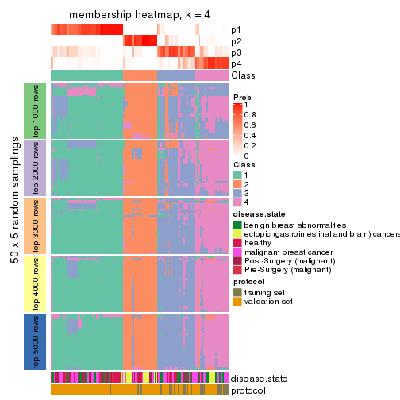</p>

</div>
<div id='tab-SD-kmeans-membership-heatmap-4'>
<pre><code class="r">membership_heatmap(res, k = 5)
</code></pre>

<p></p>

</div>
<div id='tab-SD-kmeans-membership-heatmap-5'>
<pre><code class="r">membership_heatmap(res, k = 6)
</code></pre>

<p></p>

</div>
</div>

As soon as we have had the classes for columns, we can look for signatures
which are significantly different between classes which can be candidate marks
for certain classes. Following are the heatmaps for signatures.


Signature heatmaps where rows are scaled:


<script>
$( function() {
	$( '#tabs-SD-kmeans-get-signatures' ).tabs();
} );
</script>
<div id='tabs-SD-kmeans-get-signatures'>
<ul>
<li><a href='#tab-SD-kmeans-get-signatures-1'>k = 2</a></li>
<li><a href='#tab-SD-kmeans-get-signatures-2'>k = 3</a></li>
<li><a href='#tab-SD-kmeans-get-signatures-3'>k = 4</a></li>
<li><a href='#tab-SD-kmeans-get-signatures-4'>k = 5</a></li>
<li><a href='#tab-SD-kmeans-get-signatures-5'>k = 6</a></li>
</ul>
<div id='tab-SD-kmeans-get-signatures-1'>
<pre><code class="r">get_signatures(res, k = 2)
</code></pre>

<p></p>

</div>
<div id='tab-SD-kmeans-get-signatures-2'>
<pre><code class="r">get_signatures(res, k = 3)
</code></pre>

<p></p>

</div>
<div id='tab-SD-kmeans-get-signatures-3'>
<pre><code class="r">get_signatures(res, k = 4)
</code></pre>

<p></p>

</div>
<div id='tab-SD-kmeans-get-signatures-4'>
<pre><code class="r">get_signatures(res, k = 5)
</code></pre>

<p></p>

</div>
<div id='tab-SD-kmeans-get-signatures-5'>
<pre><code class="r">get_signatures(res, k = 6)
</code></pre>

<p></p>

</div>
</div>


Signature heatmaps where rows are not scaled:


<script>
$( function() {
	$( '#tabs-SD-kmeans-get-signatures-no-scale' ).tabs();
} );
</script>
<div id='tabs-SD-kmeans-get-signatures-no-scale'>
<ul>
<li><a href='#tab-SD-kmeans-get-signatures-no-scale-1'>k = 2</a></li>
<li><a href='#tab-SD-kmeans-get-signatures-no-scale-2'>k = 3</a></li>
<li><a href='#tab-SD-kmeans-get-signatures-no-scale-3'>k = 4</a></li>
<li><a href='#tab-SD-kmeans-get-signatures-no-scale-4'>k = 5</a></li>
<li><a href='#tab-SD-kmeans-get-signatures-no-scale-5'>k = 6</a></li>
</ul>
<div id='tab-SD-kmeans-get-signatures-no-scale-1'>
<pre><code class="r">get_signatures(res, k = 2, scale_rows = FALSE)
</code></pre>

<p></p>

</div>
<div id='tab-SD-kmeans-get-signatures-no-scale-2'>
<pre><code class="r">get_signatures(res, k = 3, scale_rows = FALSE)
</code></pre>

<p></p>

</div>
<div id='tab-SD-kmeans-get-signatures-no-scale-3'>
<pre><code class="r">get_signatures(res, k = 4, scale_rows = FALSE)
</code></pre>

<p></p>

</div>
<div id='tab-SD-kmeans-get-signatures-no-scale-4'>
<pre><code class="r">get_signatures(res, k = 5, scale_rows = FALSE)
</code></pre>

<p></p>

</div>
<div id='tab-SD-kmeans-get-signatures-no-scale-5'>
<pre><code class="r">get_signatures(res, k = 6, scale_rows = FALSE)
</code></pre>

<p>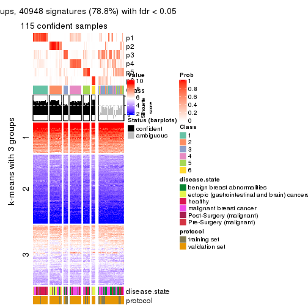</p>

</div>
</div>


Compare the overlap of signatures from different k:

```r
compare_signatures(res)
```

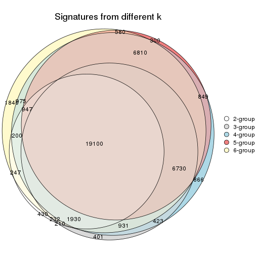

`get_signature()` returns a data frame invisibly. TO get the list of signatures, the function
call should be assigned to a variable explicitly. In following code, if `plot` argument is set
to `FALSE`, no heatmap is plotted while only the differential analysis is performed.

```r
# code only for demonstration
tb = get_signature(res, k = ..., plot = FALSE)
```

An example of the output of `tb` is:

```
#>   which_row         fdr    mean_1    mean_2 scaled_mean_1 scaled_mean_2 km
#> 1        38 0.042760348  8.373488  9.131774    -0.5533452     0.5164555  1
#> 2        40 0.018707592  7.106213  8.469186    -0.6173731     0.5762149  1
#> 3        55 0.019134737 10.221463 11.207825    -0.6159697     0.5749050  1
#> 4        59 0.006059896  5.921854  7.869574    -0.6899429     0.6439467  1
#> 5        60 0.018055526  8.928898 10.211722    -0.6204761     0.5791110  1
#> 6        98 0.009384629 15.714769 14.887706     0.6635654    -0.6193277  2
...
```

The columns in `tb` are:

1. `which_row`: row indices corresponding to the input matrix.
2. `fdr`: FDR for the differential test. 
3. `mean_x`: The mean value in group x.
4. `scaled_mean_x`: The mean value in group x after rows are scaled.
5. `km`: Row groups if k-means clustering is applied to rows.


UMAP plot which shows how samples are separated.


<script>
$( function() {
	$( '#tabs-SD-kmeans-dimension-reduction' ).tabs();
} );
</script>
<div id='tabs-SD-kmeans-dimension-reduction'>
<ul>
<li><a href='#tab-SD-kmeans-dimension-reduction-1'>k = 2</a></li>
<li><a href='#tab-SD-kmeans-dimension-reduction-2'>k = 3</a></li>
<li><a href='#tab-SD-kmeans-dimension-reduction-3'>k = 4</a></li>
<li><a href='#tab-SD-kmeans-dimension-reduction-4'>k = 5</a></li>
<li><a href='#tab-SD-kmeans-dimension-reduction-5'>k = 6</a></li>
</ul>
<div id='tab-SD-kmeans-dimension-reduction-1'>
<pre><code class="r">dimension_reduction(res, k = 2, method = &quot;UMAP&quot;)
</code></pre>

<p></p>

</div>
<div id='tab-SD-kmeans-dimension-reduction-2'>
<pre><code class="r">dimension_reduction(res, k = 3, method = &quot;UMAP&quot;)
</code></pre>

<p></p>

</div>
<div id='tab-SD-kmeans-dimension-reduction-3'>
<pre><code class="r">dimension_reduction(res, k = 4, method = &quot;UMAP&quot;)
</code></pre>

<p></p>

</div>
<div id='tab-SD-kmeans-dimension-reduction-4'>
<pre><code class="r">dimension_reduction(res, k = 5, method = &quot;UMAP&quot;)
</code></pre>

<p></p>

</div>
<div id='tab-SD-kmeans-dimension-reduction-5'>
<pre><code class="r">dimension_reduction(res, k = 6, method = &quot;UMAP&quot;)
</code></pre>

<p></p>

</div>
</div>


Following heatmap shows how subgroups are split when increasing `k`:

```r
collect_classes(res)
```


Test correlation between subgroups and known annotations. If the known
annotation is numeric, one-way ANOVA test is applied, and if the known
annotation is discrete, chi-squared contingency table test is applied.

```r
test_to_known_factors(res)
```

```
#>             n disease.state(p) protocol(p) k
#> SD:kmeans 157         1.65e-03    4.08e-01 2
#> SD:kmeans 147         6.88e-08    7.88e-08 3
#> SD:kmeans 145         2.65e-08    1.85e-05 4
#> SD:kmeans 102         7.43e-05    4.58e-03 5
#> SD:kmeans 115         8.00e-10    6.19e-09 6
```


If matrix rows can be associated to genes, consider to use `GO_Enrichment(res,
...)` to perform function enrichment for the signature genes.


 

---------------------------------------------------


### SD:skmeans**


The object with results only for a single top-value method and a single partition method 
can be extracted as:

```r
res = res_list["SD", "skmeans"]
# you can also extract it by
# res = res_list["SD:skmeans"]
```

A summary of `res` and all the functions that can be applied to it:

```r
res
```

```
#> A 'ConsensusPartition' object with k = 2, 3, 4, 5, 6.
#>   On a matrix with 51941 rows and 162 columns.
#>   Top rows (1000, 2000, 3000, 4000, 5000) are extracted by 'SD' method.
#>   Subgroups are detected by 'skmeans' method.
#>   Performed in total 1250 partitions by row resampling.
#>   Best k for subgroups seems to be 2.
#> 
#> Following methods can be applied to this 'ConsensusPartition' object:
#>  [1] "cola_report"             "collect_classes"         "collect_plots"          
#>  [4] "collect_stats"           "colnames"                "compare_signatures"     
#>  [7] "consensus_heatmap"       "dimension_reduction"     "functional_enrichment"  
#> [10] "get_anno_col"            "get_anno"                "get_classes"            
#> [13] "get_consensus"           "get_matrix"              "get_membership"         
#> [16] "get_param"               "get_signatures"          "get_stats"              
#> [19] "is_best_k"               "is_stable_k"             "membership_heatmap"     
#> [22] "ncol"                    "nrow"                    "plot_ecdf"              
#> [25] "rownames"                "select_partition_number" "show"                   
#> [28] "suggest_best_k"          "test_to_known_factors"
```

`collect_plots()` function collects all the plots made from `res` for all `k` (number of partitions)
into one single page to provide an easy and fast comparison between different `k`.

```r
collect_plots(res)
```


The plots are:

- The first row: a plot of the ECDF (Empirical cumulative distribution
  function) curves of the consensus matrix for each `k` and the heatmap of
  predicted classes for each `k`.
- The second row: heatmaps of the consensus matrix for each `k`.
- The third row: heatmaps of the membership matrix for each `k`.
- The fouth row: heatmaps of the signatures for each `k`.

All the plots in panels can be made by individual functions and they are
plotted later in this section.

`select_partition_number()` produces several plots showing different
statistics for choosing "optimized" `k`. There are following statistics:

- ECDF curves of the consensus matrix for each `k`;
- 1-PAC. [The PAC
  score](https://en.wikipedia.org/wiki/Consensus_clustering#Over-interpretation_potential_of_consensus_clustering)
  measures the proportion of the ambiguous subgrouping.
- Mean silhouette score.
- Concordance. The mean probability of fiting the consensus class ids in all
  partitions.
- Area increased. Denote $A_k$ as the area under the ECDF curve for current
  `k`, the area increased is defined as $A_k - A_{k-1}$.
- Rand index. The percent of pairs of samples that are both in a same cluster
  or both are not in a same cluster in the partition of k and k-1.
- Jaccard index. The ratio of pairs of samples are both in a same cluster in
  the partition of k and k-1 and the pairs of samples are both in a same
  cluster in the partition k or k-1.

The detailed explanations of these statistics can be found in [the cola
vignette](http://bioconductor.org/packages/devel/bioc/vignettes/cola/inst/doc/cola.html#toc_13).

Generally speaking, lower PAC score, higher mean silhouette score or higher
concordance corresponds to better partition. Rand index and Jaccard index
measure how similar the current partition is compared to partition with `k-1`.
If they are too similar, we won't accept `k` is better than `k-1`.

```r
select_partition_number(res)
```


The numeric values for all these statistics can be obtained by `get_stats()`.

```r
get_stats(res)
```

```
#>   k 1-PAC mean_silhouette concordance area_increased  Rand Jaccard
#> 2 2 0.999           0.977       0.989         0.5006 0.500   0.500
#> 3 3 0.640           0.734       0.882         0.3173 0.791   0.604
#> 4 4 0.737           0.669       0.846         0.1332 0.793   0.485
#> 5 5 0.857           0.808       0.906         0.0706 0.864   0.536
#> 6 6 0.796           0.686       0.843         0.0350 0.938   0.715
```

`suggest_best_k()` suggests the best $k$ based on these statistics. The rules are as follows:

- All $k$ with Jaccard index larger than 0.95 are removed because the increase of
  the partition number does not provides enough extra information. If all $k$ are removed,
  the best $k$ is assigned by `NA`.
- For $k$ with 1-PAC larger than 0.9, the maximal $k$ is taken as the "best k". Other $k$ is called "optional k".
- If it does not fit the second rule. The $k$ with the highest vote of highest
  1-PAC, mean silhouette and concordance is taken as the "best k".

```r
suggest_best_k(res)
```

```
#> [1] 2
```


Following shows the table of the partitions (You need to click the **show/hide
code output** link to see it). The membership matrix (columns with name `p*`)
is inferred by
[`clue::cl_consensus()`](https://www.rdocumentation.org/link/cl_consensus?package=clue)
function with the `SE` method. Basically the value in the membership matrix
represents the probability to belong to a certain group. The finall class
label for an item is determined with the group with highest probability it
belongs to.

In `get_classes()` function, the entropy is calculated from the membership
matrix and the silhouette score is calculated from the consensus matrix.


<script>
$( function() {
	$( '#tabs-SD-skmeans-get-classes' ).tabs();
} );
</script>
<div id='tabs-SD-skmeans-get-classes'>
<ul>
<li><a href='#tab-SD-skmeans-get-classes-1'>k = 2</a></li>
<li><a href='#tab-SD-skmeans-get-classes-2'>k = 3</a></li>
<li><a href='#tab-SD-skmeans-get-classes-3'>k = 4</a></li>
<li><a href='#tab-SD-skmeans-get-classes-4'>k = 5</a></li>
<li><a href='#tab-SD-skmeans-get-classes-5'>k = 6</a></li>
</ul>

<div id='tab-SD-skmeans-get-classes-1'>
<p><a id='tab-SD-skmeans-get-classes-1-a' style='color:#0366d6' href='#'>show/hide code output</a></p>
<pre><code class="r">cbind(get_classes(res, k = 2), get_membership(res, k = 2))
</code></pre>

<pre><code>#&gt;           class entropy silhouette    p1    p2
#&gt; GSM682002     1  0.0000      0.990 1.000 0.000
#&gt; GSM682003     2  0.0000      0.988 0.000 1.000
#&gt; GSM682004     2  0.0000      0.988 0.000 1.000
#&gt; GSM682005     2  0.0000      0.988 0.000 1.000
#&gt; GSM682006     2  0.3733      0.930 0.072 0.928
#&gt; GSM682007     2  0.3879      0.926 0.076 0.924
#&gt; GSM682008     2  0.0000      0.988 0.000 1.000
#&gt; GSM682009     2  0.0000      0.988 0.000 1.000
#&gt; GSM682010     1  0.0000      0.990 1.000 0.000
#&gt; GSM682011     1  0.0000      0.990 1.000 0.000
#&gt; GSM682096     2  0.0000      0.988 0.000 1.000
#&gt; GSM682097     2  0.0000      0.988 0.000 1.000
#&gt; GSM682098     2  0.0000      0.988 0.000 1.000
#&gt; GSM682099     2  0.6801      0.798 0.180 0.820
#&gt; GSM682100     2  0.0000      0.988 0.000 1.000
#&gt; GSM682101     2  0.0000      0.988 0.000 1.000
#&gt; GSM682102     1  0.0000      0.990 1.000 0.000
#&gt; GSM682103     1  0.0000      0.990 1.000 0.000
#&gt; GSM682104     2  0.0000      0.988 0.000 1.000
#&gt; GSM682105     1  0.0000      0.990 1.000 0.000
#&gt; GSM682106     1  0.0000      0.990 1.000 0.000
#&gt; GSM682107     1  0.0000      0.990 1.000 0.000
#&gt; GSM682108     1  0.9922      0.205 0.552 0.448
#&gt; GSM682109     2  0.0000      0.988 0.000 1.000
#&gt; GSM682110     1  0.0000      0.990 1.000 0.000
#&gt; GSM682111     2  0.0000      0.988 0.000 1.000
#&gt; GSM682112     2  0.0000      0.988 0.000 1.000
#&gt; GSM682113     1  0.0000      0.990 1.000 0.000
#&gt; GSM682114     1  0.0000      0.990 1.000 0.000
#&gt; GSM682115     1  0.0000      0.990 1.000 0.000
#&gt; GSM682116     1  0.0000      0.990 1.000 0.000
#&gt; GSM682117     1  0.0000      0.990 1.000 0.000
#&gt; GSM682118     1  0.0000      0.990 1.000 0.000
#&gt; GSM682119     1  0.0000      0.990 1.000 0.000
#&gt; GSM682120     1  0.0000      0.990 1.000 0.000
#&gt; GSM682121     1  0.0000      0.990 1.000 0.000
#&gt; GSM682122     1  0.0376      0.987 0.996 0.004
#&gt; GSM682012     2  0.0000      0.988 0.000 1.000
#&gt; GSM682013     2  0.0000      0.988 0.000 1.000
#&gt; GSM682014     2  0.0000      0.988 0.000 1.000
#&gt; GSM682015     2  0.0000      0.988 0.000 1.000
#&gt; GSM682016     2  0.0000      0.988 0.000 1.000
#&gt; GSM682017     2  0.0000      0.988 0.000 1.000
#&gt; GSM682018     2  0.0000      0.988 0.000 1.000
#&gt; GSM682019     2  0.0000      0.988 0.000 1.000
#&gt; GSM682020     2  0.0000      0.988 0.000 1.000
#&gt; GSM682021     2  0.0000      0.988 0.000 1.000
#&gt; GSM682022     2  0.0000      0.988 0.000 1.000
#&gt; GSM682023     2  0.0000      0.988 0.000 1.000
#&gt; GSM682024     1  0.0000      0.990 1.000 0.000
#&gt; GSM682025     2  0.0000      0.988 0.000 1.000
#&gt; GSM682026     2  0.0000      0.988 0.000 1.000
#&gt; GSM682027     2  0.0000      0.988 0.000 1.000
#&gt; GSM682028     2  0.0000      0.988 0.000 1.000
#&gt; GSM682029     2  0.0000      0.988 0.000 1.000
#&gt; GSM682030     2  0.3879      0.926 0.076 0.924
#&gt; GSM682031     2  0.3879      0.926 0.076 0.924
#&gt; GSM682032     2  0.3879      0.926 0.076 0.924
#&gt; GSM682033     2  0.0000      0.988 0.000 1.000
#&gt; GSM681992     2  0.0000      0.988 0.000 1.000
#&gt; GSM681993     2  0.0000      0.988 0.000 1.000
#&gt; GSM681994     1  0.0000      0.990 1.000 0.000
#&gt; GSM681995     1  0.0000      0.990 1.000 0.000
#&gt; GSM681996     2  0.3879      0.926 0.076 0.924
#&gt; GSM681997     2  0.3879      0.926 0.076 0.924
#&gt; GSM681998     2  0.3879      0.926 0.076 0.924
#&gt; GSM681999     2  0.3879      0.926 0.076 0.924
#&gt; GSM682000     1  0.0000      0.990 1.000 0.000
#&gt; GSM682001     1  0.1843      0.965 0.972 0.028
#&gt; GSM682055     2  0.0000      0.988 0.000 1.000
#&gt; GSM682056     2  0.0000      0.988 0.000 1.000
#&gt; GSM682057     2  0.0000      0.988 0.000 1.000
#&gt; GSM682058     2  0.2778      0.950 0.048 0.952
#&gt; GSM682059     2  0.0000      0.988 0.000 1.000
#&gt; GSM682060     2  0.0000      0.988 0.000 1.000
#&gt; GSM682061     2  0.0000      0.988 0.000 1.000
#&gt; GSM682062     2  0.0000      0.988 0.000 1.000
#&gt; GSM682063     2  0.0000      0.988 0.000 1.000
#&gt; GSM682064     1  0.3431      0.930 0.936 0.064
#&gt; GSM682065     1  0.0000      0.990 1.000 0.000
#&gt; GSM682066     1  0.0000      0.990 1.000 0.000
#&gt; GSM682067     1  0.3879      0.917 0.924 0.076
#&gt; GSM682068     1  0.0000      0.990 1.000 0.000
#&gt; GSM682069     1  0.3879      0.917 0.924 0.076
#&gt; GSM682070     1  0.0000      0.990 1.000 0.000
#&gt; GSM682071     2  0.0000      0.988 0.000 1.000
#&gt; GSM682072     2  0.0000      0.988 0.000 1.000
#&gt; GSM682073     2  0.0000      0.988 0.000 1.000
#&gt; GSM682074     1  0.0000      0.990 1.000 0.000
#&gt; GSM682075     1  0.0000      0.990 1.000 0.000
#&gt; GSM682076     1  0.0000      0.990 1.000 0.000
#&gt; GSM682077     1  0.0000      0.990 1.000 0.000
#&gt; GSM682078     1  0.0000      0.990 1.000 0.000
#&gt; GSM682079     1  0.0000      0.990 1.000 0.000
#&gt; GSM682080     2  0.0000      0.988 0.000 1.000
#&gt; GSM682081     2  0.0000      0.988 0.000 1.000
#&gt; GSM682082     1  0.0000      0.990 1.000 0.000
#&gt; GSM682083     1  0.0000      0.990 1.000 0.000
#&gt; GSM682084     1  0.0000      0.990 1.000 0.000
#&gt; GSM682085     1  0.0000      0.990 1.000 0.000
#&gt; GSM682086     1  0.0000      0.990 1.000 0.000
#&gt; GSM682087     1  0.0000      0.990 1.000 0.000
#&gt; GSM682088     1  0.0000      0.990 1.000 0.000
#&gt; GSM682089     1  0.0000      0.990 1.000 0.000
#&gt; GSM682090     1  0.0000      0.990 1.000 0.000
#&gt; GSM682091     1  0.0000      0.990 1.000 0.000
#&gt; GSM682092     1  0.0000      0.990 1.000 0.000
#&gt; GSM682093     1  0.3879      0.917 0.924 0.076
#&gt; GSM682094     1  0.0000      0.990 1.000 0.000
#&gt; GSM682095     2  0.0000      0.988 0.000 1.000
#&gt; GSM681982     2  0.0000      0.988 0.000 1.000
#&gt; GSM681983     1  0.0000      0.990 1.000 0.000
#&gt; GSM681984     2  0.0000      0.988 0.000 1.000
#&gt; GSM681985     2  0.0000      0.988 0.000 1.000
#&gt; GSM681986     2  0.0000      0.988 0.000 1.000
#&gt; GSM681987     2  0.0000      0.988 0.000 1.000
#&gt; GSM681988     2  0.0000      0.988 0.000 1.000
#&gt; GSM681989     2  0.0000      0.988 0.000 1.000
#&gt; GSM681990     1  0.0000      0.990 1.000 0.000
#&gt; GSM681991     2  0.0000      0.988 0.000 1.000
#&gt; GSM682034     1  0.0000      0.990 1.000 0.000
#&gt; GSM682035     1  0.0000      0.990 1.000 0.000
#&gt; GSM682036     1  0.0000      0.990 1.000 0.000
#&gt; GSM682037     1  0.0000      0.990 1.000 0.000
#&gt; GSM682038     2  0.0000      0.988 0.000 1.000
#&gt; GSM682039     1  0.0000      0.990 1.000 0.000
#&gt; GSM682040     2  0.0000      0.988 0.000 1.000
#&gt; GSM682041     1  0.0000      0.990 1.000 0.000
#&gt; GSM682042     2  0.0000      0.988 0.000 1.000
#&gt; GSM682043     1  0.0000      0.990 1.000 0.000
#&gt; GSM682044     1  0.0000      0.990 1.000 0.000
#&gt; GSM682045     1  0.0000      0.990 1.000 0.000
#&gt; GSM682046     1  0.0000      0.990 1.000 0.000
#&gt; GSM682047     1  0.0000      0.990 1.000 0.000
#&gt; GSM682048     1  0.0000      0.990 1.000 0.000
#&gt; GSM682049     1  0.0000      0.990 1.000 0.000
#&gt; GSM682050     1  0.0000      0.990 1.000 0.000
#&gt; GSM682051     1  0.0000      0.990 1.000 0.000
#&gt; GSM682052     2  0.0000      0.988 0.000 1.000
#&gt; GSM682053     1  0.0000      0.990 1.000 0.000
#&gt; GSM682054     1  0.0000      0.990 1.000 0.000
#&gt; GSM682123     1  0.0000      0.990 1.000 0.000
#&gt; GSM682124     1  0.0000      0.990 1.000 0.000
#&gt; GSM682125     1  0.2778      0.946 0.952 0.048
#&gt; GSM682126     1  0.0000      0.990 1.000 0.000
#&gt; GSM682127     1  0.0000      0.990 1.000 0.000
#&gt; GSM682128     1  0.0000      0.990 1.000 0.000
#&gt; GSM682129     2  0.0000      0.988 0.000 1.000
#&gt; GSM682130     2  0.0000      0.988 0.000 1.000
#&gt; GSM682131     2  0.0000      0.988 0.000 1.000
#&gt; GSM682132     1  0.0000      0.990 1.000 0.000
#&gt; GSM682133     1  0.0000      0.990 1.000 0.000
#&gt; GSM682134     1  0.0000      0.990 1.000 0.000
#&gt; GSM682135     1  0.0000      0.990 1.000 0.000
#&gt; GSM682136     1  0.0000      0.990 1.000 0.000
#&gt; GSM682137     1  0.0000      0.990 1.000 0.000
#&gt; GSM682138     1  0.0000      0.990 1.000 0.000
#&gt; GSM682139     1  0.0000      0.990 1.000 0.000
#&gt; GSM682140     1  0.0000      0.990 1.000 0.000
#&gt; GSM682141     1  0.0000      0.990 1.000 0.000
#&gt; GSM682142     1  0.0000      0.990 1.000 0.000
#&gt; GSM682143     2  0.0000      0.988 0.000 1.000
</code></pre>

<script>
$('#tab-SD-skmeans-get-classes-1-a').parent().next().next().hide();
$('#tab-SD-skmeans-get-classes-1-a').click(function(){
  $('#tab-SD-skmeans-get-classes-1-a').parent().next().next().toggle();
  return(false);
});
</script>
</div>

<div id='tab-SD-skmeans-get-classes-2'>
<p><a id='tab-SD-skmeans-get-classes-2-a' style='color:#0366d6' href='#'>show/hide code output</a></p>
<pre><code class="r">cbind(get_classes(res, k = 3), get_membership(res, k = 3))
</code></pre>

<pre><code>#&gt;           class entropy silhouette    p1    p2    p3
#&gt; GSM682002     1  0.5465     0.5204 0.712 0.000 0.288
#&gt; GSM682003     2  0.0000     0.9016 0.000 1.000 0.000
#&gt; GSM682004     2  0.0000     0.9016 0.000 1.000 0.000
#&gt; GSM682005     3  0.4733     0.7104 0.004 0.196 0.800
#&gt; GSM682006     3  0.4629     0.7148 0.004 0.188 0.808
#&gt; GSM682007     3  0.0000     0.7680 0.000 0.000 1.000
#&gt; GSM682008     3  0.0000     0.7680 0.000 0.000 1.000
#&gt; GSM682009     2  0.6126     0.2362 0.000 0.600 0.400
#&gt; GSM682010     3  0.5905     0.2718 0.352 0.000 0.648
#&gt; GSM682011     3  0.4702     0.6826 0.212 0.000 0.788
#&gt; GSM682096     2  0.1163     0.8798 0.000 0.972 0.028
#&gt; GSM682097     2  0.4346     0.7604 0.000 0.816 0.184
#&gt; GSM682098     2  0.0000     0.9016 0.000 1.000 0.000
#&gt; GSM682099     3  0.4702     0.7003 0.000 0.212 0.788
#&gt; GSM682100     2  0.0000     0.9016 0.000 1.000 0.000
#&gt; GSM682101     2  0.0000     0.9016 0.000 1.000 0.000
#&gt; GSM682102     1  0.0000     0.8576 1.000 0.000 0.000
#&gt; GSM682103     1  0.4654     0.7412 0.792 0.000 0.208
#&gt; GSM682104     3  0.6079     0.1302 0.000 0.388 0.612
#&gt; GSM682105     1  0.5810     0.4239 0.664 0.000 0.336
#&gt; GSM682106     3  0.0000     0.7680 0.000 0.000 1.000
#&gt; GSM682107     3  0.4702     0.6826 0.212 0.000 0.788
#&gt; GSM682108     3  0.2165     0.7626 0.064 0.000 0.936
#&gt; GSM682109     3  0.0000     0.7680 0.000 0.000 1.000
#&gt; GSM682110     3  0.0237     0.7691 0.004 0.000 0.996
#&gt; GSM682111     2  0.6154     0.4476 0.000 0.592 0.408
#&gt; GSM682112     2  0.4702     0.7362 0.000 0.788 0.212
#&gt; GSM682113     1  0.0000     0.8576 1.000 0.000 0.000
#&gt; GSM682114     1  0.4702     0.7374 0.788 0.000 0.212
#&gt; GSM682115     1  0.0237     0.8568 0.996 0.000 0.004
#&gt; GSM682116     1  0.0424     0.8558 0.992 0.000 0.008
#&gt; GSM682117     3  0.5138     0.6424 0.252 0.000 0.748
#&gt; GSM682118     1  0.6295     0.3495 0.528 0.000 0.472
#&gt; GSM682119     1  0.0000     0.8576 1.000 0.000 0.000
#&gt; GSM682120     1  0.4399     0.7573 0.812 0.000 0.188
#&gt; GSM682121     1  0.6305     0.3071 0.516 0.000 0.484
#&gt; GSM682122     3  0.0000     0.7680 0.000 0.000 1.000
#&gt; GSM682012     2  0.0000     0.9016 0.000 1.000 0.000
#&gt; GSM682013     2  0.0000     0.9016 0.000 1.000 0.000
#&gt; GSM682014     2  0.0000     0.9016 0.000 1.000 0.000
#&gt; GSM682015     2  0.0000     0.9016 0.000 1.000 0.000
#&gt; GSM682016     2  0.0000     0.9016 0.000 1.000 0.000
#&gt; GSM682017     2  0.0000     0.9016 0.000 1.000 0.000
#&gt; GSM682018     2  0.0000     0.9016 0.000 1.000 0.000
#&gt; GSM682019     2  0.0000     0.9016 0.000 1.000 0.000
#&gt; GSM682020     2  0.0000     0.9016 0.000 1.000 0.000
#&gt; GSM682021     2  0.0000     0.9016 0.000 1.000 0.000
#&gt; GSM682022     2  0.0000     0.9016 0.000 1.000 0.000
#&gt; GSM682023     2  0.0000     0.9016 0.000 1.000 0.000
#&gt; GSM682024     1  0.0000     0.8576 1.000 0.000 0.000
#&gt; GSM682025     2  0.0000     0.9016 0.000 1.000 0.000
#&gt; GSM682026     2  0.0000     0.9016 0.000 1.000 0.000
#&gt; GSM682027     3  0.4702     0.7003 0.000 0.212 0.788
#&gt; GSM682028     3  0.4702     0.7003 0.000 0.212 0.788
#&gt; GSM682029     3  0.4702     0.7003 0.000 0.212 0.788
#&gt; GSM682030     3  0.4883     0.7032 0.004 0.208 0.788
#&gt; GSM682031     3  0.4883     0.7032 0.004 0.208 0.788
#&gt; GSM682032     3  0.4883     0.7032 0.004 0.208 0.788
#&gt; GSM682033     2  0.0000     0.9016 0.000 1.000 0.000
#&gt; GSM681992     2  0.6483     0.0590 0.004 0.544 0.452
#&gt; GSM681993     2  0.4702     0.7362 0.000 0.788 0.212
#&gt; GSM681994     3  0.0237     0.7691 0.004 0.000 0.996
#&gt; GSM681995     3  0.4654     0.6858 0.208 0.000 0.792
#&gt; GSM681996     3  0.0000     0.7680 0.000 0.000 1.000
#&gt; GSM681997     3  0.0237     0.7691 0.004 0.000 0.996
#&gt; GSM681998     3  0.0237     0.7691 0.004 0.000 0.996
#&gt; GSM681999     3  0.5863     0.7337 0.084 0.120 0.796
#&gt; GSM682000     3  0.4702     0.6826 0.212 0.000 0.788
#&gt; GSM682001     3  0.4654     0.6858 0.208 0.000 0.792
#&gt; GSM682055     2  0.0000     0.9016 0.000 1.000 0.000
#&gt; GSM682056     2  0.4654     0.7388 0.000 0.792 0.208
#&gt; GSM682057     2  0.0000     0.9016 0.000 1.000 0.000
#&gt; GSM682058     3  0.4750     0.6971 0.000 0.216 0.784
#&gt; GSM682059     2  0.0000     0.9016 0.000 1.000 0.000
#&gt; GSM682060     2  0.0000     0.9016 0.000 1.000 0.000
#&gt; GSM682061     2  0.0000     0.9016 0.000 1.000 0.000
#&gt; GSM682062     2  0.0000     0.9016 0.000 1.000 0.000
#&gt; GSM682063     2  0.0000     0.9016 0.000 1.000 0.000
#&gt; GSM682064     1  0.2384     0.8135 0.936 0.056 0.008
#&gt; GSM682065     1  0.0000     0.8576 1.000 0.000 0.000
#&gt; GSM682066     1  0.0237     0.8558 0.996 0.000 0.004
#&gt; GSM682067     1  0.3851     0.7372 0.860 0.136 0.004
#&gt; GSM682068     3  0.6168     0.3444 0.412 0.000 0.588
#&gt; GSM682069     1  0.3851     0.7372 0.860 0.136 0.004
#&gt; GSM682070     1  0.0000     0.8576 1.000 0.000 0.000
#&gt; GSM682071     2  0.4702     0.7362 0.000 0.788 0.212
#&gt; GSM682072     3  0.5926     0.2237 0.000 0.356 0.644
#&gt; GSM682073     3  0.0000     0.7680 0.000 0.000 1.000
#&gt; GSM682074     1  0.4654     0.7412 0.792 0.000 0.208
#&gt; GSM682075     1  0.6062     0.3069 0.616 0.000 0.384
#&gt; GSM682076     1  0.6280     0.3778 0.540 0.000 0.460
#&gt; GSM682077     1  0.0237     0.8568 0.996 0.000 0.004
#&gt; GSM682078     1  0.4654     0.7412 0.792 0.000 0.208
#&gt; GSM682079     1  0.0237     0.8568 0.996 0.000 0.004
#&gt; GSM682080     2  0.4702     0.7362 0.000 0.788 0.212
#&gt; GSM682081     3  0.2261     0.7285 0.000 0.068 0.932
#&gt; GSM682082     3  0.6180    -0.0389 0.416 0.000 0.584
#&gt; GSM682083     1  0.0237     0.8568 0.996 0.000 0.004
#&gt; GSM682084     1  0.4702     0.7374 0.788 0.000 0.212
#&gt; GSM682085     3  0.6111     0.0627 0.396 0.000 0.604
#&gt; GSM682086     1  0.5988     0.3489 0.632 0.000 0.368
#&gt; GSM682087     1  0.6299     0.3396 0.524 0.000 0.476
#&gt; GSM682088     1  0.4399     0.7573 0.812 0.000 0.188
#&gt; GSM682089     1  0.4654     0.7412 0.792 0.000 0.208
#&gt; GSM682090     1  0.4654     0.7412 0.792 0.000 0.208
#&gt; GSM682091     1  0.0000     0.8576 1.000 0.000 0.000
#&gt; GSM682092     1  0.0000     0.8576 1.000 0.000 0.000
#&gt; GSM682093     1  0.6895     0.6687 0.716 0.072 0.212
#&gt; GSM682094     1  0.6026     0.3284 0.624 0.000 0.376
#&gt; GSM682095     2  0.0000     0.9016 0.000 1.000 0.000
#&gt; GSM681982     2  0.4702     0.7362 0.000 0.788 0.212
#&gt; GSM681983     1  0.0000     0.8576 1.000 0.000 0.000
#&gt; GSM681984     2  0.0237     0.8992 0.000 0.996 0.004
#&gt; GSM681985     2  0.4702     0.7362 0.000 0.788 0.212
#&gt; GSM681986     2  0.2448     0.8377 0.000 0.924 0.076
#&gt; GSM681987     2  0.0000     0.9016 0.000 1.000 0.000
#&gt; GSM681988     3  0.6062     0.1412 0.000 0.384 0.616
#&gt; GSM681989     2  0.6267     0.0697 0.000 0.548 0.452
#&gt; GSM681990     3  0.0237     0.7691 0.004 0.000 0.996
#&gt; GSM681991     2  0.0000     0.9016 0.000 1.000 0.000
#&gt; GSM682034     1  0.0000     0.8576 1.000 0.000 0.000
#&gt; GSM682035     1  0.0237     0.8568 0.996 0.000 0.004
#&gt; GSM682036     1  0.0000     0.8576 1.000 0.000 0.000
#&gt; GSM682037     1  0.0000     0.8576 1.000 0.000 0.000
#&gt; GSM682038     2  0.0000     0.9016 0.000 1.000 0.000
#&gt; GSM682039     1  0.0000     0.8576 1.000 0.000 0.000
#&gt; GSM682040     2  0.4702     0.7362 0.000 0.788 0.212
#&gt; GSM682041     1  0.4399     0.7573 0.812 0.000 0.188
#&gt; GSM682042     2  0.4702     0.7362 0.000 0.788 0.212
#&gt; GSM682043     1  0.0000     0.8576 1.000 0.000 0.000
#&gt; GSM682044     1  0.0000     0.8576 1.000 0.000 0.000
#&gt; GSM682045     1  0.0000     0.8576 1.000 0.000 0.000
#&gt; GSM682046     1  0.0000     0.8576 1.000 0.000 0.000
#&gt; GSM682047     1  0.4654     0.7412 0.792 0.000 0.208
#&gt; GSM682048     1  0.0000     0.8576 1.000 0.000 0.000
#&gt; GSM682049     1  0.4291     0.7630 0.820 0.000 0.180
#&gt; GSM682050     1  0.0000     0.8576 1.000 0.000 0.000
#&gt; GSM682051     1  0.4654     0.7412 0.792 0.000 0.208
#&gt; GSM682052     2  0.4702     0.7362 0.000 0.788 0.212
#&gt; GSM682053     1  0.4654     0.7412 0.792 0.000 0.208
#&gt; GSM682054     1  0.0000     0.8576 1.000 0.000 0.000
#&gt; GSM682123     1  0.0237     0.8568 0.996 0.000 0.004
#&gt; GSM682124     1  0.0000     0.8576 1.000 0.000 0.000
#&gt; GSM682125     1  0.0475     0.8555 0.992 0.004 0.004
#&gt; GSM682126     1  0.0000     0.8576 1.000 0.000 0.000
#&gt; GSM682127     1  0.0000     0.8576 1.000 0.000 0.000
#&gt; GSM682128     3  0.6260    -0.0960 0.448 0.000 0.552
#&gt; GSM682129     2  0.0000     0.9016 0.000 1.000 0.000
#&gt; GSM682130     2  0.0000     0.9016 0.000 1.000 0.000
#&gt; GSM682131     2  0.0000     0.9016 0.000 1.000 0.000
#&gt; GSM682132     1  0.6305    -0.0351 0.516 0.000 0.484
#&gt; GSM682133     1  0.0000     0.8576 1.000 0.000 0.000
#&gt; GSM682134     1  0.0237     0.8568 0.996 0.000 0.004
#&gt; GSM682135     1  0.0000     0.8576 1.000 0.000 0.000
#&gt; GSM682136     1  0.0000     0.8576 1.000 0.000 0.000
#&gt; GSM682137     1  0.5058     0.5960 0.756 0.000 0.244
#&gt; GSM682138     1  0.4291     0.7630 0.820 0.000 0.180
#&gt; GSM682139     1  0.0000     0.8576 1.000 0.000 0.000
#&gt; GSM682140     1  0.2165     0.8307 0.936 0.000 0.064
#&gt; GSM682141     1  0.0000     0.8576 1.000 0.000 0.000
#&gt; GSM682142     1  0.0000     0.8576 1.000 0.000 0.000
#&gt; GSM682143     2  0.0000     0.9016 0.000 1.000 0.000
</code></pre>

<script>
$('#tab-SD-skmeans-get-classes-2-a').parent().next().next().hide();
$('#tab-SD-skmeans-get-classes-2-a').click(function(){
  $('#tab-SD-skmeans-get-classes-2-a').parent().next().next().toggle();
  return(false);
});
</script>
</div>

<div id='tab-SD-skmeans-get-classes-3'>
<p><a id='tab-SD-skmeans-get-classes-3-a' style='color:#0366d6' href='#'>show/hide code output</a></p>
<pre><code class="r">cbind(get_classes(res, k = 4), get_membership(res, k = 4))
</code></pre>

<pre><code>#&gt;           class entropy silhouette    p1    p2    p3    p4
#&gt; GSM682002     4  0.6644    0.40186 0.088 0.000 0.392 0.520
#&gt; GSM682003     2  0.0000    0.94543 0.000 1.000 0.000 0.000
#&gt; GSM682004     2  0.0000    0.94543 0.000 1.000 0.000 0.000
#&gt; GSM682005     4  0.0000    0.76961 0.000 0.000 0.000 1.000
#&gt; GSM682006     4  0.0000    0.76961 0.000 0.000 0.000 1.000
#&gt; GSM682007     3  0.4992    0.22873 0.000 0.000 0.524 0.476
#&gt; GSM682008     4  0.4907    0.00365 0.000 0.000 0.420 0.580
#&gt; GSM682009     2  0.5971    0.37591 0.000 0.584 0.048 0.368
#&gt; GSM682010     3  0.4920    0.37732 0.004 0.000 0.628 0.368
#&gt; GSM682011     4  0.0000    0.76961 0.000 0.000 0.000 1.000
#&gt; GSM682096     2  0.1940    0.86391 0.000 0.924 0.000 0.076
#&gt; GSM682097     3  0.4955    0.34957 0.000 0.444 0.556 0.000
#&gt; GSM682098     2  0.0000    0.94543 0.000 1.000 0.000 0.000
#&gt; GSM682099     4  0.3726    0.65515 0.000 0.000 0.212 0.788
#&gt; GSM682100     2  0.0000    0.94543 0.000 1.000 0.000 0.000
#&gt; GSM682101     2  0.0000    0.94543 0.000 1.000 0.000 0.000
#&gt; GSM682102     1  0.0336    0.86148 0.992 0.000 0.008 0.000
#&gt; GSM682103     3  0.2704    0.52836 0.124 0.000 0.876 0.000
#&gt; GSM682104     3  0.5346    0.51802 0.000 0.076 0.732 0.192
#&gt; GSM682105     4  0.5969    0.45117 0.044 0.000 0.392 0.564
#&gt; GSM682106     3  0.4866    0.03705 0.000 0.000 0.596 0.404
#&gt; GSM682107     4  0.0000    0.76961 0.000 0.000 0.000 1.000
#&gt; GSM682108     3  0.6265    0.21237 0.056 0.000 0.500 0.444
#&gt; GSM682109     3  0.4855    0.34396 0.000 0.000 0.600 0.400
#&gt; GSM682110     4  0.0000    0.76961 0.000 0.000 0.000 1.000
#&gt; GSM682111     3  0.6548    0.51305 0.000 0.276 0.608 0.116
#&gt; GSM682112     3  0.4991    0.43352 0.004 0.388 0.608 0.000
#&gt; GSM682113     1  0.0336    0.86148 0.992 0.000 0.008 0.000
#&gt; GSM682114     3  0.0188    0.55330 0.004 0.000 0.996 0.000
#&gt; GSM682115     1  0.4830    0.51176 0.608 0.000 0.392 0.000
#&gt; GSM682116     1  0.6253    0.42931 0.544 0.000 0.396 0.060
#&gt; GSM682117     4  0.4482    0.54524 0.264 0.000 0.008 0.728
#&gt; GSM682118     3  0.5018    0.41211 0.088 0.000 0.768 0.144
#&gt; GSM682119     1  0.0188    0.85866 0.996 0.000 0.004 0.000
#&gt; GSM682120     3  0.5482    0.04773 0.368 0.000 0.608 0.024
#&gt; GSM682121     4  0.6179    0.43632 0.056 0.000 0.392 0.552
#&gt; GSM682122     3  0.0469    0.55177 0.000 0.000 0.988 0.012
#&gt; GSM682012     2  0.0000    0.94543 0.000 1.000 0.000 0.000
#&gt; GSM682013     2  0.0000    0.94543 0.000 1.000 0.000 0.000
#&gt; GSM682014     2  0.0000    0.94543 0.000 1.000 0.000 0.000
#&gt; GSM682015     2  0.0000    0.94543 0.000 1.000 0.000 0.000
#&gt; GSM682016     2  0.0000    0.94543 0.000 1.000 0.000 0.000
#&gt; GSM682017     2  0.0000    0.94543 0.000 1.000 0.000 0.000
#&gt; GSM682018     2  0.0000    0.94543 0.000 1.000 0.000 0.000
#&gt; GSM682019     2  0.0000    0.94543 0.000 1.000 0.000 0.000
#&gt; GSM682020     2  0.0000    0.94543 0.000 1.000 0.000 0.000
#&gt; GSM682021     2  0.0000    0.94543 0.000 1.000 0.000 0.000
#&gt; GSM682022     2  0.0000    0.94543 0.000 1.000 0.000 0.000
#&gt; GSM682023     2  0.0000    0.94543 0.000 1.000 0.000 0.000
#&gt; GSM682024     1  0.0336    0.86148 0.992 0.000 0.008 0.000
#&gt; GSM682025     2  0.0000    0.94543 0.000 1.000 0.000 0.000
#&gt; GSM682026     2  0.0000    0.94543 0.000 1.000 0.000 0.000
#&gt; GSM682027     4  0.0000    0.76961 0.000 0.000 0.000 1.000
#&gt; GSM682028     4  0.0000    0.76961 0.000 0.000 0.000 1.000
#&gt; GSM682029     4  0.0000    0.76961 0.000 0.000 0.000 1.000
#&gt; GSM682030     4  0.0000    0.76961 0.000 0.000 0.000 1.000
#&gt; GSM682031     4  0.0000    0.76961 0.000 0.000 0.000 1.000
#&gt; GSM682032     4  0.0000    0.76961 0.000 0.000 0.000 1.000
#&gt; GSM682033     2  0.0000    0.94543 0.000 1.000 0.000 0.000
#&gt; GSM681992     2  0.5980    0.31790 0.000 0.560 0.044 0.396
#&gt; GSM681993     3  0.4830    0.42935 0.000 0.392 0.608 0.000
#&gt; GSM681994     4  0.3764    0.65213 0.000 0.000 0.216 0.784
#&gt; GSM681995     4  0.0000    0.76961 0.000 0.000 0.000 1.000
#&gt; GSM681996     4  0.0707    0.75355 0.000 0.000 0.020 0.980
#&gt; GSM681997     4  0.0000    0.76961 0.000 0.000 0.000 1.000
#&gt; GSM681998     4  0.0000    0.76961 0.000 0.000 0.000 1.000
#&gt; GSM681999     4  0.0000    0.76961 0.000 0.000 0.000 1.000
#&gt; GSM682000     4  0.0000    0.76961 0.000 0.000 0.000 1.000
#&gt; GSM682001     4  0.0000    0.76961 0.000 0.000 0.000 1.000
#&gt; GSM682055     2  0.0188    0.94183 0.000 0.996 0.004 0.000
#&gt; GSM682056     3  0.4866    0.41846 0.000 0.404 0.596 0.000
#&gt; GSM682057     2  0.0000    0.94543 0.000 1.000 0.000 0.000
#&gt; GSM682058     4  0.4790    0.50797 0.000 0.000 0.380 0.620
#&gt; GSM682059     2  0.0000    0.94543 0.000 1.000 0.000 0.000
#&gt; GSM682060     2  0.0000    0.94543 0.000 1.000 0.000 0.000
#&gt; GSM682061     2  0.0000    0.94543 0.000 1.000 0.000 0.000
#&gt; GSM682062     2  0.0000    0.94543 0.000 1.000 0.000 0.000
#&gt; GSM682063     2  0.0000    0.94543 0.000 1.000 0.000 0.000
#&gt; GSM682064     1  0.0188    0.85866 0.996 0.000 0.004 0.000
#&gt; GSM682065     1  0.0336    0.86148 0.992 0.000 0.008 0.000
#&gt; GSM682066     1  0.3852    0.71914 0.800 0.000 0.192 0.008
#&gt; GSM682067     1  0.0188    0.85866 0.996 0.000 0.004 0.000
#&gt; GSM682068     4  0.3616    0.69031 0.112 0.000 0.036 0.852
#&gt; GSM682069     1  0.0188    0.85866 0.996 0.000 0.004 0.000
#&gt; GSM682070     1  0.0000    0.85994 1.000 0.000 0.000 0.000
#&gt; GSM682071     3  0.4843    0.42492 0.000 0.396 0.604 0.000
#&gt; GSM682072     3  0.5313    0.37239 0.000 0.016 0.608 0.376
#&gt; GSM682073     3  0.4843    0.34886 0.000 0.000 0.604 0.396
#&gt; GSM682074     3  0.3688    0.45254 0.208 0.000 0.792 0.000
#&gt; GSM682075     4  0.4936    0.51479 0.004 0.000 0.372 0.624
#&gt; GSM682076     3  0.5042    0.41825 0.096 0.000 0.768 0.136
#&gt; GSM682077     1  0.4500    0.60382 0.684 0.000 0.316 0.000
#&gt; GSM682078     3  0.3649    0.45891 0.204 0.000 0.796 0.000
#&gt; GSM682079     1  0.4830    0.51176 0.608 0.000 0.392 0.000
#&gt; GSM682080     3  0.4830    0.42935 0.000 0.392 0.608 0.000
#&gt; GSM682081     3  0.5326    0.36920 0.000 0.016 0.604 0.380
#&gt; GSM682082     3  0.1489    0.53374 0.004 0.000 0.952 0.044
#&gt; GSM682083     1  0.4830    0.51176 0.608 0.000 0.392 0.000
#&gt; GSM682084     3  0.0188    0.55420 0.004 0.000 0.996 0.000
#&gt; GSM682085     3  0.0188    0.55330 0.004 0.000 0.996 0.000
#&gt; GSM682086     4  0.5404    0.12723 0.476 0.000 0.012 0.512
#&gt; GSM682087     3  0.4966    0.40082 0.076 0.000 0.768 0.156
#&gt; GSM682088     3  0.4843   -0.02123 0.396 0.000 0.604 0.000
#&gt; GSM682089     3  0.2921    0.52222 0.140 0.000 0.860 0.000
#&gt; GSM682090     3  0.3074    0.51665 0.152 0.000 0.848 0.000
#&gt; GSM682091     1  0.0188    0.85866 0.996 0.000 0.004 0.000
#&gt; GSM682092     1  0.4830    0.51176 0.608 0.000 0.392 0.000
#&gt; GSM682093     3  0.4564    0.40181 0.328 0.000 0.672 0.000
#&gt; GSM682094     1  0.5399   -0.02621 0.520 0.000 0.012 0.468
#&gt; GSM682095     2  0.0000    0.94543 0.000 1.000 0.000 0.000
#&gt; GSM681982     3  0.4830    0.42935 0.000 0.392 0.608 0.000
#&gt; GSM681983     1  0.0336    0.86148 0.992 0.000 0.008 0.000
#&gt; GSM681984     2  0.1389    0.89929 0.000 0.952 0.048 0.000
#&gt; GSM681985     3  0.5112    0.43678 0.008 0.384 0.608 0.000
#&gt; GSM681986     2  0.5393    0.56003 0.000 0.688 0.044 0.268
#&gt; GSM681987     2  0.0000    0.94543 0.000 1.000 0.000 0.000
#&gt; GSM681988     3  0.5573    0.38160 0.000 0.028 0.604 0.368
#&gt; GSM681989     2  0.6016    0.28050 0.000 0.544 0.044 0.412
#&gt; GSM681990     4  0.4855    0.05633 0.000 0.000 0.400 0.600
#&gt; GSM681991     2  0.0000    0.94543 0.000 1.000 0.000 0.000
#&gt; GSM682034     1  0.0336    0.86148 0.992 0.000 0.008 0.000
#&gt; GSM682035     1  0.0336    0.86148 0.992 0.000 0.008 0.000
#&gt; GSM682036     1  0.0188    0.85866 0.996 0.000 0.004 0.000
#&gt; GSM682037     1  0.0336    0.86148 0.992 0.000 0.008 0.000
#&gt; GSM682038     2  0.0707    0.92752 0.000 0.980 0.020 0.000
#&gt; GSM682039     1  0.0188    0.85866 0.996 0.000 0.004 0.000
#&gt; GSM682040     3  0.4888    0.40319 0.000 0.412 0.588 0.000
#&gt; GSM682041     1  0.3837    0.68374 0.776 0.000 0.224 0.000
#&gt; GSM682042     3  0.4991    0.43352 0.004 0.388 0.608 0.000
#&gt; GSM682043     1  0.1557    0.83297 0.944 0.000 0.056 0.000
#&gt; GSM682044     1  0.0188    0.86077 0.996 0.000 0.004 0.000
#&gt; GSM682045     1  0.0188    0.85866 0.996 0.000 0.004 0.000
#&gt; GSM682046     1  0.0336    0.86148 0.992 0.000 0.008 0.000
#&gt; GSM682047     3  0.3610    0.46481 0.200 0.000 0.800 0.000
#&gt; GSM682048     1  0.0188    0.85866 0.996 0.000 0.004 0.000
#&gt; GSM682049     1  0.4977    0.39373 0.540 0.000 0.460 0.000
#&gt; GSM682050     1  0.0336    0.86148 0.992 0.000 0.008 0.000
#&gt; GSM682051     3  0.3172    0.51238 0.160 0.000 0.840 0.000
#&gt; GSM682052     3  0.4991    0.43352 0.004 0.388 0.608 0.000
#&gt; GSM682053     1  0.4977   -0.01197 0.540 0.000 0.460 0.000
#&gt; GSM682054     1  0.0336    0.86148 0.992 0.000 0.008 0.000
#&gt; GSM682123     1  0.0000    0.85994 1.000 0.000 0.000 0.000
#&gt; GSM682124     1  0.0336    0.86148 0.992 0.000 0.008 0.000
#&gt; GSM682125     1  0.0188    0.85866 0.996 0.000 0.004 0.000
#&gt; GSM682126     1  0.0336    0.86148 0.992 0.000 0.008 0.000
#&gt; GSM682127     1  0.0336    0.86148 0.992 0.000 0.008 0.000
#&gt; GSM682128     4  0.5364    0.48056 0.016 0.000 0.392 0.592
#&gt; GSM682129     2  0.0000    0.94543 0.000 1.000 0.000 0.000
#&gt; GSM682130     2  0.0000    0.94543 0.000 1.000 0.000 0.000
#&gt; GSM682131     2  0.0000    0.94543 0.000 1.000 0.000 0.000
#&gt; GSM682132     4  0.4720    0.56142 0.004 0.000 0.324 0.672
#&gt; GSM682133     1  0.4564    0.58907 0.672 0.000 0.328 0.000
#&gt; GSM682134     1  0.0000    0.85994 1.000 0.000 0.000 0.000
#&gt; GSM682135     1  0.0188    0.85866 0.996 0.000 0.004 0.000
#&gt; GSM682136     1  0.0336    0.86148 0.992 0.000 0.008 0.000
#&gt; GSM682137     4  0.6483    0.40829 0.076 0.000 0.392 0.532
#&gt; GSM682138     1  0.4996    0.34043 0.516 0.000 0.484 0.000
#&gt; GSM682139     1  0.0188    0.85866 0.996 0.000 0.004 0.000
#&gt; GSM682140     1  0.4955    0.42526 0.556 0.000 0.444 0.000
#&gt; GSM682141     1  0.0336    0.86148 0.992 0.000 0.008 0.000
#&gt; GSM682142     1  0.0336    0.86148 0.992 0.000 0.008 0.000
#&gt; GSM682143     2  0.0000    0.94543 0.000 1.000 0.000 0.000
</code></pre>

<script>
$('#tab-SD-skmeans-get-classes-3-a').parent().next().next().hide();
$('#tab-SD-skmeans-get-classes-3-a').click(function(){
  $('#tab-SD-skmeans-get-classes-3-a').parent().next().next().toggle();
  return(false);
});
</script>
</div>

<div id='tab-SD-skmeans-get-classes-4'>
<p><a id='tab-SD-skmeans-get-classes-4-a' style='color:#0366d6' href='#'>show/hide code output</a></p>
<pre><code class="r">cbind(get_classes(res, k = 5), get_membership(res, k = 5))
</code></pre>

<pre><code>#&gt;           class entropy silhouette    p1    p2    p3    p4    p5
#&gt; GSM682002     4  0.1282    0.88510 0.004 0.000 0.044 0.952 0.000
#&gt; GSM682003     2  0.3143    0.72027 0.000 0.796 0.000 0.000 0.204
#&gt; GSM682004     2  0.1965    0.84695 0.000 0.904 0.000 0.000 0.096
#&gt; GSM682005     3  0.1608    0.86700 0.000 0.000 0.928 0.000 0.072
#&gt; GSM682006     3  0.1544    0.86669 0.000 0.000 0.932 0.000 0.068
#&gt; GSM682007     3  0.4768    0.38262 0.000 0.000 0.592 0.024 0.384
#&gt; GSM682008     3  0.3684    0.63240 0.000 0.000 0.720 0.000 0.280
#&gt; GSM682009     5  0.4768    0.62069 0.008 0.244 0.044 0.000 0.704
#&gt; GSM682010     5  0.2868    0.77839 0.012 0.000 0.072 0.032 0.884
#&gt; GSM682011     3  0.1478    0.86789 0.000 0.000 0.936 0.000 0.064
#&gt; GSM682096     2  0.1732    0.86487 0.000 0.920 0.080 0.000 0.000
#&gt; GSM682097     2  0.5246    0.39302 0.000 0.596 0.060 0.000 0.344
#&gt; GSM682098     2  0.1410    0.87793 0.000 0.940 0.060 0.000 0.000
#&gt; GSM682099     3  0.0566    0.85438 0.000 0.000 0.984 0.012 0.004
#&gt; GSM682100     2  0.0000    0.91459 0.000 1.000 0.000 0.000 0.000
#&gt; GSM682101     2  0.1478    0.87516 0.000 0.936 0.064 0.000 0.000
#&gt; GSM682102     1  0.0609    0.93572 0.980 0.000 0.000 0.020 0.000
#&gt; GSM682103     4  0.0162    0.90948 0.000 0.000 0.000 0.996 0.004
#&gt; GSM682104     5  0.2437    0.80914 0.000 0.004 0.060 0.032 0.904
#&gt; GSM682105     4  0.1270    0.87885 0.000 0.000 0.052 0.948 0.000
#&gt; GSM682106     4  0.5180    0.36630 0.000 0.000 0.312 0.624 0.064
#&gt; GSM682107     3  0.1478    0.86789 0.000 0.000 0.936 0.000 0.064
#&gt; GSM682108     5  0.3388    0.68921 0.008 0.000 0.200 0.000 0.792
#&gt; GSM682109     5  0.2377    0.76103 0.000 0.000 0.128 0.000 0.872
#&gt; GSM682110     3  0.1478    0.86789 0.000 0.000 0.936 0.000 0.064
#&gt; GSM682111     5  0.0324    0.82242 0.000 0.004 0.004 0.000 0.992
#&gt; GSM682112     5  0.1768    0.83390 0.004 0.072 0.000 0.000 0.924
#&gt; GSM682113     1  0.0290    0.93829 0.992 0.000 0.000 0.008 0.000
#&gt; GSM682114     4  0.3730    0.60896 0.000 0.000 0.000 0.712 0.288
#&gt; GSM682115     4  0.0162    0.91027 0.004 0.000 0.000 0.996 0.000
#&gt; GSM682116     4  0.0162    0.91027 0.004 0.000 0.000 0.996 0.000
#&gt; GSM682117     3  0.5464    0.43559 0.348 0.000 0.584 0.004 0.064
#&gt; GSM682118     4  0.0727    0.90181 0.004 0.000 0.004 0.980 0.012
#&gt; GSM682119     1  0.1571    0.88806 0.936 0.000 0.004 0.000 0.060
#&gt; GSM682120     4  0.0000    0.91148 0.000 0.000 0.000 1.000 0.000
#&gt; GSM682121     4  0.0000    0.91148 0.000 0.000 0.000 1.000 0.000
#&gt; GSM682122     4  0.3796    0.59286 0.000 0.000 0.000 0.700 0.300
#&gt; GSM682012     2  0.0000    0.91459 0.000 1.000 0.000 0.000 0.000
#&gt; GSM682013     2  0.0000    0.91459 0.000 1.000 0.000 0.000 0.000
#&gt; GSM682014     2  0.0000    0.91459 0.000 1.000 0.000 0.000 0.000
#&gt; GSM682015     2  0.0000    0.91459 0.000 1.000 0.000 0.000 0.000
#&gt; GSM682016     2  0.0162    0.91366 0.000 0.996 0.004 0.000 0.000
#&gt; GSM682017     2  0.0000    0.91459 0.000 1.000 0.000 0.000 0.000
#&gt; GSM682018     2  0.0162    0.91366 0.000 0.996 0.004 0.000 0.000
#&gt; GSM682019     2  0.0162    0.91366 0.000 0.996 0.004 0.000 0.000
#&gt; GSM682020     2  0.0000    0.91459 0.000 1.000 0.000 0.000 0.000
#&gt; GSM682021     2  0.1478    0.87516 0.000 0.936 0.064 0.000 0.000
#&gt; GSM682022     2  0.0162    0.91366 0.000 0.996 0.004 0.000 0.000
#&gt; GSM682023     2  0.0162    0.91366 0.000 0.996 0.004 0.000 0.000
#&gt; GSM682024     1  0.0404    0.93827 0.988 0.000 0.000 0.012 0.000
#&gt; GSM682025     2  0.0162    0.91366 0.000 0.996 0.004 0.000 0.000
#&gt; GSM682026     2  0.0000    0.91459 0.000 1.000 0.000 0.000 0.000
#&gt; GSM682027     3  0.0162    0.85822 0.000 0.000 0.996 0.000 0.004
#&gt; GSM682028     3  0.0162    0.85822 0.000 0.000 0.996 0.000 0.004
#&gt; GSM682029     3  0.0162    0.85822 0.000 0.000 0.996 0.000 0.004
#&gt; GSM682030     3  0.0162    0.85822 0.000 0.000 0.996 0.000 0.004
#&gt; GSM682031     3  0.0162    0.85822 0.000 0.000 0.996 0.000 0.004
#&gt; GSM682032     3  0.0162    0.85822 0.000 0.000 0.996 0.000 0.004
#&gt; GSM682033     2  0.0000    0.91459 0.000 1.000 0.000 0.000 0.000
#&gt; GSM681992     5  0.5256    0.44808 0.008 0.048 0.324 0.000 0.620
#&gt; GSM681993     5  0.1608    0.83388 0.000 0.072 0.000 0.000 0.928
#&gt; GSM681994     3  0.2423    0.83166 0.000 0.000 0.896 0.080 0.024
#&gt; GSM681995     3  0.1478    0.86789 0.000 0.000 0.936 0.000 0.064
#&gt; GSM681996     3  0.2020    0.85070 0.000 0.000 0.900 0.000 0.100
#&gt; GSM681997     3  0.1478    0.86789 0.000 0.000 0.936 0.000 0.064
#&gt; GSM681998     3  0.1544    0.86669 0.000 0.000 0.932 0.000 0.068
#&gt; GSM681999     3  0.1478    0.86789 0.000 0.000 0.936 0.000 0.064
#&gt; GSM682000     3  0.1410    0.86802 0.000 0.000 0.940 0.000 0.060
#&gt; GSM682001     3  0.1638    0.86689 0.004 0.000 0.932 0.000 0.064
#&gt; GSM682055     2  0.2471    0.80230 0.000 0.864 0.000 0.000 0.136
#&gt; GSM682056     2  0.7238    0.23958 0.000 0.496 0.060 0.156 0.288
#&gt; GSM682057     2  0.0000    0.91459 0.000 1.000 0.000 0.000 0.000
#&gt; GSM682058     3  0.4597    0.49656 0.000 0.024 0.672 0.300 0.004
#&gt; GSM682059     2  0.0000    0.91459 0.000 1.000 0.000 0.000 0.000
#&gt; GSM682060     2  0.0992    0.90179 0.000 0.968 0.024 0.000 0.008
#&gt; GSM682061     2  0.4302    0.03205 0.000 0.520 0.000 0.000 0.480
#&gt; GSM682062     2  0.0000    0.91459 0.000 1.000 0.000 0.000 0.000
#&gt; GSM682063     2  0.0000    0.91459 0.000 1.000 0.000 0.000 0.000
#&gt; GSM682064     1  0.0162    0.93607 0.996 0.000 0.000 0.000 0.004
#&gt; GSM682065     1  0.0404    0.93827 0.988 0.000 0.000 0.012 0.000
#&gt; GSM682066     1  0.3530    0.72042 0.784 0.000 0.012 0.204 0.000
#&gt; GSM682067     1  0.0404    0.93341 0.988 0.000 0.000 0.000 0.012
#&gt; GSM682068     3  0.1918    0.84657 0.036 0.000 0.928 0.036 0.000
#&gt; GSM682069     1  0.0404    0.93341 0.988 0.000 0.000 0.000 0.012
#&gt; GSM682070     1  0.0162    0.93607 0.996 0.000 0.000 0.000 0.004
#&gt; GSM682071     5  0.2813    0.76753 0.000 0.168 0.000 0.000 0.832
#&gt; GSM682072     5  0.0404    0.82026 0.000 0.000 0.012 0.000 0.988
#&gt; GSM682073     5  0.2074    0.77507 0.000 0.000 0.104 0.000 0.896
#&gt; GSM682074     4  0.0000    0.91148 0.000 0.000 0.000 1.000 0.000
#&gt; GSM682075     3  0.3689    0.63556 0.004 0.000 0.740 0.256 0.000
#&gt; GSM682076     4  0.0000    0.91148 0.000 0.000 0.000 1.000 0.000
#&gt; GSM682077     1  0.4242    0.25223 0.572 0.000 0.000 0.428 0.000
#&gt; GSM682078     4  0.0000    0.91148 0.000 0.000 0.000 1.000 0.000
#&gt; GSM682079     4  0.0000    0.91148 0.000 0.000 0.000 1.000 0.000
#&gt; GSM682080     5  0.1608    0.83388 0.000 0.072 0.000 0.000 0.928
#&gt; GSM682081     5  0.0609    0.81856 0.000 0.000 0.020 0.000 0.980
#&gt; GSM682082     4  0.0290    0.90709 0.000 0.000 0.000 0.992 0.008
#&gt; GSM682083     4  0.0162    0.91027 0.004 0.000 0.000 0.996 0.000
#&gt; GSM682084     4  0.3796    0.59286 0.000 0.000 0.000 0.700 0.300
#&gt; GSM682085     4  0.3796    0.59286 0.000 0.000 0.000 0.700 0.300
#&gt; GSM682086     3  0.5601    0.14123 0.452 0.000 0.488 0.008 0.052
#&gt; GSM682087     4  0.0000    0.91148 0.000 0.000 0.000 1.000 0.000
#&gt; GSM682088     4  0.0000    0.91148 0.000 0.000 0.000 1.000 0.000
#&gt; GSM682089     4  0.0000    0.91148 0.000 0.000 0.000 1.000 0.000
#&gt; GSM682090     4  0.0000    0.91148 0.000 0.000 0.000 1.000 0.000
#&gt; GSM682091     1  0.0162    0.93607 0.996 0.000 0.000 0.000 0.004
#&gt; GSM682092     4  0.0609    0.89958 0.020 0.000 0.000 0.980 0.000
#&gt; GSM682093     5  0.2624    0.76984 0.116 0.000 0.000 0.012 0.872
#&gt; GSM682094     1  0.5641   -0.00481 0.504 0.000 0.432 0.008 0.056
#&gt; GSM682095     2  0.1270    0.88289 0.000 0.948 0.000 0.000 0.052
#&gt; GSM681982     5  0.1608    0.83388 0.000 0.072 0.000 0.000 0.928
#&gt; GSM681983     1  0.0898    0.93228 0.972 0.000 0.008 0.020 0.000
#&gt; GSM681984     5  0.3048    0.76456 0.004 0.176 0.000 0.000 0.820
#&gt; GSM681985     5  0.1704    0.83366 0.004 0.068 0.000 0.000 0.928
#&gt; GSM681986     5  0.5680    0.65428 0.008 0.176 0.160 0.000 0.656
#&gt; GSM681987     2  0.3816    0.53372 0.000 0.696 0.000 0.000 0.304
#&gt; GSM681988     5  0.0898    0.82297 0.000 0.008 0.020 0.000 0.972
#&gt; GSM681989     5  0.4445    0.52387 0.000 0.024 0.300 0.000 0.676
#&gt; GSM681990     5  0.4415    0.34256 0.008 0.000 0.388 0.000 0.604
#&gt; GSM681991     2  0.1965    0.84695 0.000 0.904 0.000 0.000 0.096
#&gt; GSM682034     1  0.0404    0.93827 0.988 0.000 0.000 0.012 0.000
#&gt; GSM682035     1  0.0609    0.93572 0.980 0.000 0.000 0.020 0.000
#&gt; GSM682036     1  0.0162    0.93607 0.996 0.000 0.000 0.000 0.004
#&gt; GSM682037     1  0.0510    0.93745 0.984 0.000 0.000 0.016 0.000
#&gt; GSM682038     5  0.4088    0.44971 0.000 0.368 0.000 0.000 0.632
#&gt; GSM682039     1  0.0609    0.92914 0.980 0.000 0.000 0.000 0.020
#&gt; GSM682040     5  0.3003    0.74086 0.000 0.188 0.000 0.000 0.812
#&gt; GSM682041     4  0.3143    0.70286 0.204 0.000 0.000 0.796 0.000
#&gt; GSM682042     5  0.1732    0.83109 0.000 0.080 0.000 0.000 0.920
#&gt; GSM682043     1  0.3424    0.68631 0.760 0.000 0.000 0.240 0.000
#&gt; GSM682044     1  0.0290    0.93829 0.992 0.000 0.000 0.008 0.000
#&gt; GSM682045     1  0.0162    0.93607 0.996 0.000 0.000 0.000 0.004
#&gt; GSM682046     1  0.0510    0.93745 0.984 0.000 0.000 0.016 0.000
#&gt; GSM682047     4  0.0000    0.91148 0.000 0.000 0.000 1.000 0.000
#&gt; GSM682048     1  0.0671    0.93317 0.980 0.000 0.000 0.004 0.016
#&gt; GSM682049     4  0.0162    0.91027 0.004 0.000 0.000 0.996 0.000
#&gt; GSM682050     1  0.0510    0.93745 0.984 0.000 0.000 0.016 0.000
#&gt; GSM682051     4  0.0000    0.91148 0.000 0.000 0.000 1.000 0.000
#&gt; GSM682052     5  0.1671    0.83275 0.000 0.076 0.000 0.000 0.924
#&gt; GSM682053     1  0.5119    0.32874 0.592 0.000 0.000 0.048 0.360
#&gt; GSM682054     1  0.0609    0.93572 0.980 0.000 0.000 0.020 0.000
#&gt; GSM682123     1  0.0451    0.93642 0.988 0.000 0.000 0.004 0.008
#&gt; GSM682124     1  0.0290    0.93829 0.992 0.000 0.000 0.008 0.000
#&gt; GSM682125     1  0.0771    0.93087 0.976 0.000 0.000 0.004 0.020
#&gt; GSM682126     1  0.0510    0.93745 0.984 0.000 0.000 0.016 0.000
#&gt; GSM682127     1  0.0404    0.93827 0.988 0.000 0.000 0.012 0.000
#&gt; GSM682128     4  0.1608    0.86318 0.000 0.000 0.072 0.928 0.000
#&gt; GSM682129     2  0.0000    0.91459 0.000 1.000 0.000 0.000 0.000
#&gt; GSM682130     2  0.0000    0.91459 0.000 1.000 0.000 0.000 0.000
#&gt; GSM682131     2  0.0000    0.91459 0.000 1.000 0.000 0.000 0.000
#&gt; GSM682132     3  0.3318    0.73320 0.012 0.000 0.808 0.180 0.000
#&gt; GSM682133     4  0.4305   -0.03036 0.488 0.000 0.000 0.512 0.000
#&gt; GSM682134     1  0.0451    0.93796 0.988 0.000 0.000 0.008 0.004
#&gt; GSM682135     1  0.0162    0.93607 0.996 0.000 0.000 0.000 0.004
#&gt; GSM682136     1  0.0609    0.93572 0.980 0.000 0.000 0.020 0.000
#&gt; GSM682137     4  0.0880    0.89387 0.000 0.000 0.032 0.968 0.000
#&gt; GSM682138     4  0.0000    0.91148 0.000 0.000 0.000 1.000 0.000
#&gt; GSM682139     1  0.0324    0.93709 0.992 0.000 0.000 0.004 0.004
#&gt; GSM682140     4  0.0000    0.91148 0.000 0.000 0.000 1.000 0.000
#&gt; GSM682141     1  0.0510    0.93745 0.984 0.000 0.000 0.016 0.000
#&gt; GSM682142     1  0.0290    0.93829 0.992 0.000 0.000 0.008 0.000
#&gt; GSM682143     2  0.2891    0.75844 0.000 0.824 0.000 0.000 0.176
</code></pre>

<script>
$('#tab-SD-skmeans-get-classes-4-a').parent().next().next().hide();
$('#tab-SD-skmeans-get-classes-4-a').click(function(){
  $('#tab-SD-skmeans-get-classes-4-a').parent().next().next().toggle();
  return(false);
});
</script>
</div>

<div id='tab-SD-skmeans-get-classes-5'>
<p><a id='tab-SD-skmeans-get-classes-5-a' style='color:#0366d6' href='#'>show/hide code output</a></p>
<pre><code class="r">cbind(get_classes(res, k = 6), get_membership(res, k = 6))
</code></pre>

<pre><code>#&gt;           class entropy silhouette    p1    p2    p3    p4    p5    p6
#&gt; GSM682002     4  0.1692     0.8389 0.048 0.000 0.008 0.932 0.000 0.012
#&gt; GSM682003     2  0.4229     0.2506 0.000 0.548 0.016 0.000 0.436 0.000
#&gt; GSM682004     2  0.3738     0.5879 0.000 0.704 0.016 0.000 0.280 0.000
#&gt; GSM682005     6  0.3956     0.5113 0.000 0.000 0.252 0.000 0.036 0.712
#&gt; GSM682006     3  0.3911     0.3790 0.000 0.000 0.624 0.000 0.008 0.368
#&gt; GSM682007     3  0.6338     0.1445 0.000 0.000 0.476 0.028 0.296 0.200
#&gt; GSM682008     6  0.5634     0.0919 0.000 0.000 0.416 0.000 0.148 0.436
#&gt; GSM682009     3  0.3979     0.4219 0.000 0.020 0.708 0.000 0.264 0.008
#&gt; GSM682010     3  0.1536     0.5829 0.000 0.000 0.940 0.004 0.040 0.016
#&gt; GSM682011     3  0.3390     0.5071 0.000 0.000 0.704 0.000 0.000 0.296
#&gt; GSM682096     2  0.3288     0.6388 0.000 0.724 0.000 0.000 0.000 0.276
#&gt; GSM682097     5  0.5670     0.5443 0.000 0.228 0.024 0.000 0.600 0.148
#&gt; GSM682098     2  0.2912     0.7090 0.000 0.784 0.000 0.000 0.000 0.216
#&gt; GSM682099     6  0.0508     0.7208 0.000 0.004 0.000 0.012 0.000 0.984
#&gt; GSM682100     2  0.0000     0.8820 0.000 1.000 0.000 0.000 0.000 0.000
#&gt; GSM682101     2  0.2416     0.7636 0.000 0.844 0.000 0.000 0.000 0.156
#&gt; GSM682102     1  0.0891     0.8986 0.968 0.000 0.024 0.008 0.000 0.000
#&gt; GSM682103     4  0.0000     0.8731 0.000 0.000 0.000 1.000 0.000 0.000
#&gt; GSM682104     5  0.4593     0.6665 0.000 0.000 0.188 0.012 0.712 0.088
#&gt; GSM682105     4  0.1245     0.8498 0.000 0.000 0.016 0.952 0.000 0.032
#&gt; GSM682106     4  0.5089     0.1784 0.000 0.000 0.408 0.524 0.008 0.060
#&gt; GSM682107     3  0.3309     0.5209 0.000 0.000 0.720 0.000 0.000 0.280
#&gt; GSM682108     3  0.1644     0.5899 0.000 0.000 0.932 0.000 0.040 0.028
#&gt; GSM682109     3  0.4758    -0.2302 0.000 0.000 0.476 0.000 0.476 0.048
#&gt; GSM682110     3  0.3126     0.5394 0.000 0.000 0.752 0.000 0.000 0.248
#&gt; GSM682111     5  0.2969     0.6777 0.000 0.000 0.224 0.000 0.776 0.000
#&gt; GSM682112     5  0.0692     0.7226 0.000 0.020 0.004 0.000 0.976 0.000
#&gt; GSM682113     1  0.0748     0.9007 0.976 0.000 0.016 0.004 0.004 0.000
#&gt; GSM682114     4  0.4750     0.3668 0.000 0.000 0.064 0.596 0.340 0.000
#&gt; GSM682115     4  0.0865     0.8565 0.036 0.000 0.000 0.964 0.000 0.000
#&gt; GSM682116     4  0.0865     0.8565 0.036 0.000 0.000 0.964 0.000 0.000
#&gt; GSM682117     3  0.4209     0.5463 0.104 0.000 0.736 0.000 0.000 0.160
#&gt; GSM682118     4  0.3464     0.5068 0.000 0.000 0.312 0.688 0.000 0.000
#&gt; GSM682119     3  0.3514     0.4604 0.228 0.000 0.752 0.000 0.020 0.000
#&gt; GSM682120     4  0.0000     0.8731 0.000 0.000 0.000 1.000 0.000 0.000
#&gt; GSM682121     4  0.0000     0.8731 0.000 0.000 0.000 1.000 0.000 0.000
#&gt; GSM682122     4  0.5898     0.1319 0.000 0.000 0.152 0.488 0.348 0.012
#&gt; GSM682012     2  0.0000     0.8820 0.000 1.000 0.000 0.000 0.000 0.000
#&gt; GSM682013     2  0.0000     0.8820 0.000 1.000 0.000 0.000 0.000 0.000
#&gt; GSM682014     2  0.0000     0.8820 0.000 1.000 0.000 0.000 0.000 0.000
#&gt; GSM682015     2  0.0000     0.8820 0.000 1.000 0.000 0.000 0.000 0.000
#&gt; GSM682016     2  0.0458     0.8735 0.000 0.984 0.000 0.000 0.016 0.000
#&gt; GSM682017     2  0.0000     0.8820 0.000 1.000 0.000 0.000 0.000 0.000
#&gt; GSM682018     2  0.0000     0.8820 0.000 1.000 0.000 0.000 0.000 0.000
#&gt; GSM682019     2  0.0000     0.8820 0.000 1.000 0.000 0.000 0.000 0.000
#&gt; GSM682020     2  0.0000     0.8820 0.000 1.000 0.000 0.000 0.000 0.000
#&gt; GSM682021     2  0.2416     0.7636 0.000 0.844 0.000 0.000 0.000 0.156
#&gt; GSM682022     2  0.0000     0.8820 0.000 1.000 0.000 0.000 0.000 0.000
#&gt; GSM682023     2  0.0000     0.8820 0.000 1.000 0.000 0.000 0.000 0.000
#&gt; GSM682024     1  0.0146     0.9005 0.996 0.000 0.000 0.004 0.000 0.000
#&gt; GSM682025     2  0.0000     0.8820 0.000 1.000 0.000 0.000 0.000 0.000
#&gt; GSM682026     2  0.0000     0.8820 0.000 1.000 0.000 0.000 0.000 0.000
#&gt; GSM682027     6  0.0146     0.7253 0.000 0.004 0.000 0.000 0.000 0.996
#&gt; GSM682028     6  0.0000     0.7275 0.000 0.000 0.000 0.000 0.000 1.000
#&gt; GSM682029     6  0.0000     0.7275 0.000 0.000 0.000 0.000 0.000 1.000
#&gt; GSM682030     6  0.0000     0.7275 0.000 0.000 0.000 0.000 0.000 1.000
#&gt; GSM682031     6  0.0000     0.7275 0.000 0.000 0.000 0.000 0.000 1.000
#&gt; GSM682032     6  0.0000     0.7275 0.000 0.000 0.000 0.000 0.000 1.000
#&gt; GSM682033     2  0.0603     0.8724 0.000 0.980 0.016 0.000 0.004 0.000
#&gt; GSM681992     3  0.4406     0.5513 0.000 0.008 0.728 0.000 0.176 0.088
#&gt; GSM681993     5  0.3062     0.7137 0.000 0.024 0.160 0.000 0.816 0.000
#&gt; GSM681994     6  0.4646     0.3972 0.000 0.000 0.324 0.060 0.000 0.616
#&gt; GSM681995     3  0.3860     0.1393 0.000 0.000 0.528 0.000 0.000 0.472
#&gt; GSM681996     6  0.4933     0.2181 0.000 0.000 0.432 0.000 0.064 0.504
#&gt; GSM681997     6  0.3756     0.3798 0.000 0.000 0.352 0.000 0.004 0.644
#&gt; GSM681998     3  0.3975     0.1610 0.000 0.000 0.544 0.000 0.004 0.452
#&gt; GSM681999     3  0.3330     0.5213 0.000 0.000 0.716 0.000 0.000 0.284
#&gt; GSM682000     6  0.3330     0.5036 0.000 0.000 0.284 0.000 0.000 0.716
#&gt; GSM682001     3  0.3076     0.5510 0.000 0.000 0.760 0.000 0.000 0.240
#&gt; GSM682055     2  0.4039     0.1653 0.000 0.568 0.008 0.000 0.424 0.000
#&gt; GSM682056     5  0.7329     0.4527 0.000 0.252 0.032 0.092 0.476 0.148
#&gt; GSM682057     2  0.0000     0.8820 0.000 1.000 0.000 0.000 0.000 0.000
#&gt; GSM682058     6  0.2452     0.6488 0.000 0.028 0.004 0.084 0.000 0.884
#&gt; GSM682059     2  0.0000     0.8820 0.000 1.000 0.000 0.000 0.000 0.000
#&gt; GSM682060     2  0.1232     0.8611 0.000 0.956 0.016 0.000 0.024 0.004
#&gt; GSM682061     5  0.4121     0.3192 0.000 0.380 0.016 0.000 0.604 0.000
#&gt; GSM682062     2  0.0000     0.8820 0.000 1.000 0.000 0.000 0.000 0.000
#&gt; GSM682063     2  0.0000     0.8820 0.000 1.000 0.000 0.000 0.000 0.000
#&gt; GSM682064     1  0.2230     0.8723 0.892 0.000 0.084 0.000 0.024 0.000
#&gt; GSM682065     1  0.0146     0.9005 0.996 0.000 0.000 0.004 0.000 0.000
#&gt; GSM682066     1  0.3962     0.7204 0.772 0.000 0.096 0.128 0.000 0.004
#&gt; GSM682067     1  0.1984     0.8774 0.912 0.000 0.032 0.000 0.056 0.000
#&gt; GSM682068     6  0.4067     0.6026 0.064 0.000 0.172 0.008 0.000 0.756
#&gt; GSM682069     1  0.2046     0.8756 0.908 0.000 0.032 0.000 0.060 0.000
#&gt; GSM682070     1  0.2147     0.8738 0.896 0.000 0.084 0.000 0.020 0.000
#&gt; GSM682071     5  0.4125     0.7036 0.000 0.128 0.124 0.000 0.748 0.000
#&gt; GSM682072     5  0.3266     0.6329 0.000 0.000 0.272 0.000 0.728 0.000
#&gt; GSM682073     5  0.4989     0.4752 0.000 0.000 0.316 0.000 0.592 0.092
#&gt; GSM682074     4  0.0000     0.8731 0.000 0.000 0.000 1.000 0.000 0.000
#&gt; GSM682075     6  0.5217     0.4837 0.044 0.000 0.064 0.240 0.000 0.652
#&gt; GSM682076     4  0.0000     0.8731 0.000 0.000 0.000 1.000 0.000 0.000
#&gt; GSM682077     1  0.3695     0.4321 0.624 0.000 0.000 0.376 0.000 0.000
#&gt; GSM682078     4  0.0000     0.8731 0.000 0.000 0.000 1.000 0.000 0.000
#&gt; GSM682079     4  0.0000     0.8731 0.000 0.000 0.000 1.000 0.000 0.000
#&gt; GSM682080     5  0.3381     0.7164 0.000 0.044 0.156 0.000 0.800 0.000
#&gt; GSM682081     5  0.3778     0.6185 0.000 0.000 0.272 0.000 0.708 0.020
#&gt; GSM682082     4  0.0000     0.8731 0.000 0.000 0.000 1.000 0.000 0.000
#&gt; GSM682083     4  0.1010     0.8547 0.036 0.000 0.004 0.960 0.000 0.000
#&gt; GSM682084     4  0.4938     0.3390 0.000 0.000 0.080 0.580 0.340 0.000
#&gt; GSM682085     4  0.4938     0.3390 0.000 0.000 0.080 0.580 0.340 0.000
#&gt; GSM682086     3  0.4418     0.5005 0.192 0.000 0.708 0.000 0.000 0.100
#&gt; GSM682087     4  0.0000     0.8731 0.000 0.000 0.000 1.000 0.000 0.000
#&gt; GSM682088     4  0.0000     0.8731 0.000 0.000 0.000 1.000 0.000 0.000
#&gt; GSM682089     4  0.0000     0.8731 0.000 0.000 0.000 1.000 0.000 0.000
#&gt; GSM682090     4  0.0000     0.8731 0.000 0.000 0.000 1.000 0.000 0.000
#&gt; GSM682091     1  0.2383     0.8648 0.880 0.000 0.096 0.000 0.024 0.000
#&gt; GSM682092     4  0.0405     0.8689 0.004 0.000 0.008 0.988 0.000 0.000
#&gt; GSM682093     5  0.2806     0.6667 0.060 0.000 0.056 0.012 0.872 0.000
#&gt; GSM682094     3  0.4299     0.5060 0.188 0.000 0.720 0.000 0.000 0.092
#&gt; GSM682095     2  0.2653     0.7582 0.000 0.844 0.012 0.000 0.144 0.000
#&gt; GSM681982     5  0.1341     0.7269 0.000 0.028 0.024 0.000 0.948 0.000
#&gt; GSM681983     1  0.1787     0.8729 0.920 0.000 0.068 0.008 0.000 0.004
#&gt; GSM681984     5  0.3319     0.6287 0.000 0.164 0.036 0.000 0.800 0.000
#&gt; GSM681985     5  0.0405     0.7176 0.000 0.004 0.008 0.000 0.988 0.000
#&gt; GSM681986     3  0.4578     0.1724 0.000 0.036 0.520 0.000 0.444 0.000
#&gt; GSM681987     2  0.4242     0.2168 0.000 0.536 0.016 0.000 0.448 0.000
#&gt; GSM681988     5  0.3023     0.6721 0.000 0.000 0.232 0.000 0.768 0.000
#&gt; GSM681989     3  0.4267     0.4532 0.000 0.004 0.692 0.000 0.260 0.044
#&gt; GSM681990     3  0.1829     0.5952 0.000 0.000 0.920 0.000 0.024 0.056
#&gt; GSM681991     2  0.3778     0.5756 0.000 0.696 0.016 0.000 0.288 0.000
#&gt; GSM682034     1  0.0405     0.9008 0.988 0.000 0.008 0.004 0.000 0.000
#&gt; GSM682035     1  0.0520     0.9008 0.984 0.000 0.008 0.008 0.000 0.000
#&gt; GSM682036     1  0.2911     0.8301 0.832 0.000 0.144 0.000 0.024 0.000
#&gt; GSM682037     1  0.0717     0.8997 0.976 0.000 0.016 0.008 0.000 0.000
#&gt; GSM682038     5  0.4131     0.1921 0.000 0.384 0.016 0.000 0.600 0.000
#&gt; GSM682039     1  0.4220     0.7531 0.732 0.000 0.096 0.000 0.172 0.000
#&gt; GSM682040     5  0.1765     0.7096 0.000 0.096 0.000 0.000 0.904 0.000
#&gt; GSM682041     4  0.2941     0.6629 0.220 0.000 0.000 0.780 0.000 0.000
#&gt; GSM682042     5  0.0713     0.7245 0.000 0.028 0.000 0.000 0.972 0.000
#&gt; GSM682043     1  0.3984     0.4891 0.648 0.000 0.016 0.336 0.000 0.000
#&gt; GSM682044     1  0.0405     0.9008 0.988 0.000 0.008 0.004 0.000 0.000
#&gt; GSM682045     1  0.2905     0.8580 0.852 0.000 0.084 0.000 0.064 0.000
#&gt; GSM682046     1  0.0717     0.8997 0.976 0.000 0.016 0.008 0.000 0.000
#&gt; GSM682047     4  0.0000     0.8731 0.000 0.000 0.000 1.000 0.000 0.000
#&gt; GSM682048     1  0.3456     0.7911 0.788 0.000 0.040 0.000 0.172 0.000
#&gt; GSM682049     4  0.1007     0.8520 0.044 0.000 0.000 0.956 0.000 0.000
#&gt; GSM682050     1  0.0717     0.8997 0.976 0.000 0.016 0.008 0.000 0.000
#&gt; GSM682051     4  0.0000     0.8731 0.000 0.000 0.000 1.000 0.000 0.000
#&gt; GSM682052     5  0.0777     0.7252 0.000 0.024 0.004 0.000 0.972 0.000
#&gt; GSM682053     5  0.4770     0.1362 0.396 0.000 0.032 0.012 0.560 0.000
#&gt; GSM682054     1  0.0806     0.8989 0.972 0.000 0.020 0.008 0.000 0.000
#&gt; GSM682123     1  0.1921     0.8790 0.916 0.000 0.032 0.000 0.052 0.000
#&gt; GSM682124     1  0.0146     0.9005 0.996 0.000 0.000 0.004 0.000 0.000
#&gt; GSM682125     1  0.3512     0.7633 0.772 0.000 0.032 0.000 0.196 0.000
#&gt; GSM682126     1  0.0717     0.8997 0.976 0.000 0.016 0.008 0.000 0.000
#&gt; GSM682127     1  0.0551     0.9008 0.984 0.000 0.008 0.004 0.004 0.000
#&gt; GSM682128     4  0.3769     0.3982 0.000 0.000 0.004 0.640 0.000 0.356
#&gt; GSM682129     2  0.0000     0.8820 0.000 1.000 0.000 0.000 0.000 0.000
#&gt; GSM682130     2  0.0000     0.8820 0.000 1.000 0.000 0.000 0.000 0.000
#&gt; GSM682131     2  0.0000     0.8820 0.000 1.000 0.000 0.000 0.000 0.000
#&gt; GSM682132     6  0.4199     0.6153 0.064 0.000 0.044 0.112 0.000 0.780
#&gt; GSM682133     1  0.4405     0.3862 0.604 0.000 0.008 0.368 0.000 0.020
#&gt; GSM682134     1  0.1341     0.8884 0.948 0.000 0.028 0.000 0.024 0.000
#&gt; GSM682135     1  0.1765     0.8853 0.924 0.000 0.052 0.000 0.024 0.000
#&gt; GSM682136     1  0.0717     0.8997 0.976 0.000 0.016 0.008 0.000 0.000
#&gt; GSM682137     4  0.1196     0.8471 0.000 0.000 0.008 0.952 0.000 0.040
#&gt; GSM682138     4  0.0000     0.8731 0.000 0.000 0.000 1.000 0.000 0.000
#&gt; GSM682139     1  0.1261     0.8895 0.952 0.000 0.024 0.000 0.024 0.000
#&gt; GSM682140     4  0.0000     0.8731 0.000 0.000 0.000 1.000 0.000 0.000
#&gt; GSM682141     1  0.0717     0.8997 0.976 0.000 0.016 0.008 0.000 0.000
#&gt; GSM682142     1  0.0922     0.9002 0.968 0.000 0.024 0.004 0.004 0.000
#&gt; GSM682143     2  0.4205     0.2933 0.000 0.564 0.016 0.000 0.420 0.000
</code></pre>

<script>
$('#tab-SD-skmeans-get-classes-5-a').parent().next().next().hide();
$('#tab-SD-skmeans-get-classes-5-a').click(function(){
  $('#tab-SD-skmeans-get-classes-5-a').parent().next().next().toggle();
  return(false);
});
</script>
</div>
</div>

Heatmaps for the consensus matrix. It visualizes the probability of two
samples to be in a same group.


<script>
$( function() {
	$( '#tabs-SD-skmeans-consensus-heatmap' ).tabs();
} );
</script>
<div id='tabs-SD-skmeans-consensus-heatmap'>
<ul>
<li><a href='#tab-SD-skmeans-consensus-heatmap-1'>k = 2</a></li>
<li><a href='#tab-SD-skmeans-consensus-heatmap-2'>k = 3</a></li>
<li><a href='#tab-SD-skmeans-consensus-heatmap-3'>k = 4</a></li>
<li><a href='#tab-SD-skmeans-consensus-heatmap-4'>k = 5</a></li>
<li><a href='#tab-SD-skmeans-consensus-heatmap-5'>k = 6</a></li>
</ul>
<div id='tab-SD-skmeans-consensus-heatmap-1'>
<pre><code class="r">consensus_heatmap(res, k = 2)
</code></pre>

<p></p>

</div>
<div id='tab-SD-skmeans-consensus-heatmap-2'>
<pre><code class="r">consensus_heatmap(res, k = 3)
</code></pre>

<p></p>

</div>
<div id='tab-SD-skmeans-consensus-heatmap-3'>
<pre><code class="r">consensus_heatmap(res, k = 4)
</code></pre>

<p></p>

</div>
<div id='tab-SD-skmeans-consensus-heatmap-4'>
<pre><code class="r">consensus_heatmap(res, k = 5)
</code></pre>

<p></p>

</div>
<div id='tab-SD-skmeans-consensus-heatmap-5'>
<pre><code class="r">consensus_heatmap(res, k = 6)
</code></pre>

<p></p>

</div>
</div>

Heatmaps for the membership of samples in all partitions to see how consistent they are:


<script>
$( function() {
	$( '#tabs-SD-skmeans-membership-heatmap' ).tabs();
} );
</script>
<div id='tabs-SD-skmeans-membership-heatmap'>
<ul>
<li><a href='#tab-SD-skmeans-membership-heatmap-1'>k = 2</a></li>
<li><a href='#tab-SD-skmeans-membership-heatmap-2'>k = 3</a></li>
<li><a href='#tab-SD-skmeans-membership-heatmap-3'>k = 4</a></li>
<li><a href='#tab-SD-skmeans-membership-heatmap-4'>k = 5</a></li>
<li><a href='#tab-SD-skmeans-membership-heatmap-5'>k = 6</a></li>
</ul>
<div id='tab-SD-skmeans-membership-heatmap-1'>
<pre><code class="r">membership_heatmap(res, k = 2)
</code></pre>

<p></p>

</div>
<div id='tab-SD-skmeans-membership-heatmap-2'>
<pre><code class="r">membership_heatmap(res, k = 3)
</code></pre>

<p></p>

</div>
<div id='tab-SD-skmeans-membership-heatmap-3'>
<pre><code class="r">membership_heatmap(res, k = 4)
</code></pre>

<p></p>

</div>
<div id='tab-SD-skmeans-membership-heatmap-4'>
<pre><code class="r">membership_heatmap(res, k = 5)
</code></pre>

<p></p>

</div>
<div id='tab-SD-skmeans-membership-heatmap-5'>
<pre><code class="r">membership_heatmap(res, k = 6)
</code></pre>

<p></p>

</div>
</div>

As soon as we have had the classes for columns, we can look for signatures
which are significantly different between classes which can be candidate marks
for certain classes. Following are the heatmaps for signatures.


Signature heatmaps where rows are scaled:


<script>
$( function() {
	$( '#tabs-SD-skmeans-get-signatures' ).tabs();
} );
</script>
<div id='tabs-SD-skmeans-get-signatures'>
<ul>
<li><a href='#tab-SD-skmeans-get-signatures-1'>k = 2</a></li>
<li><a href='#tab-SD-skmeans-get-signatures-2'>k = 3</a></li>
<li><a href='#tab-SD-skmeans-get-signatures-3'>k = 4</a></li>
<li><a href='#tab-SD-skmeans-get-signatures-4'>k = 5</a></li>
<li><a href='#tab-SD-skmeans-get-signatures-5'>k = 6</a></li>
</ul>
<div id='tab-SD-skmeans-get-signatures-1'>
<pre><code class="r">get_signatures(res, k = 2)
</code></pre>

<pre><code>#&gt; Error in mat[ceiling(1:nr/h_ratio), ceiling(1:nc/w_ratio), drop = FALSE]: subscript out of bounds
</code></pre>

<p></p>

</div>
<div id='tab-SD-skmeans-get-signatures-2'>
<pre><code class="r">get_signatures(res, k = 3)
</code></pre>

<p></p>

</div>
<div id='tab-SD-skmeans-get-signatures-3'>
<pre><code class="r">get_signatures(res, k = 4)
</code></pre>

<p></p>

</div>
<div id='tab-SD-skmeans-get-signatures-4'>
<pre><code class="r">get_signatures(res, k = 5)
</code></pre>

<p></p>

</div>
<div id='tab-SD-skmeans-get-signatures-5'>
<pre><code class="r">get_signatures(res, k = 6)
</code></pre>

<p></p>

</div>
</div>


Signature heatmaps where rows are not scaled:


<script>
$( function() {
	$( '#tabs-SD-skmeans-get-signatures-no-scale' ).tabs();
} );
</script>
<div id='tabs-SD-skmeans-get-signatures-no-scale'>
<ul>
<li><a href='#tab-SD-skmeans-get-signatures-no-scale-1'>k = 2</a></li>
<li><a href='#tab-SD-skmeans-get-signatures-no-scale-2'>k = 3</a></li>
<li><a href='#tab-SD-skmeans-get-signatures-no-scale-3'>k = 4</a></li>
<li><a href='#tab-SD-skmeans-get-signatures-no-scale-4'>k = 5</a></li>
<li><a href='#tab-SD-skmeans-get-signatures-no-scale-5'>k = 6</a></li>
</ul>
<div id='tab-SD-skmeans-get-signatures-no-scale-1'>
<pre><code class="r">get_signatures(res, k = 2, scale_rows = FALSE)
</code></pre>

<pre><code>#&gt; Error in mat[ceiling(1:nr/h_ratio), ceiling(1:nc/w_ratio), drop = FALSE]: subscript out of bounds
</code></pre>

<p></p>

</div>
<div id='tab-SD-skmeans-get-signatures-no-scale-2'>
<pre><code class="r">get_signatures(res, k = 3, scale_rows = FALSE)
</code></pre>

<p></p>

</div>
<div id='tab-SD-skmeans-get-signatures-no-scale-3'>
<pre><code class="r">get_signatures(res, k = 4, scale_rows = FALSE)
</code></pre>

<p></p>

</div>
<div id='tab-SD-skmeans-get-signatures-no-scale-4'>
<pre><code class="r">get_signatures(res, k = 5, scale_rows = FALSE)
</code></pre>

<p></p>

</div>
<div id='tab-SD-skmeans-get-signatures-no-scale-5'>
<pre><code class="r">get_signatures(res, k = 6, scale_rows = FALSE)
</code></pre>

<p></p>

</div>
</div>


Compare the overlap of signatures from different k:

```r
compare_signatures(res)
```


`get_signature()` returns a data frame invisibly. TO get the list of signatures, the function
call should be assigned to a variable explicitly. In following code, if `plot` argument is set
to `FALSE`, no heatmap is plotted while only the differential analysis is performed.

```r
# code only for demonstration
tb = get_signature(res, k = ..., plot = FALSE)
```

An example of the output of `tb` is:

```
#>   which_row         fdr    mean_1    mean_2 scaled_mean_1 scaled_mean_2 km
#> 1        38 0.042760348  8.373488  9.131774    -0.5533452     0.5164555  1
#> 2        40 0.018707592  7.106213  8.469186    -0.6173731     0.5762149  1
#> 3        55 0.019134737 10.221463 11.207825    -0.6159697     0.5749050  1
#> 4        59 0.006059896  5.921854  7.869574    -0.6899429     0.6439467  1
#> 5        60 0.018055526  8.928898 10.211722    -0.6204761     0.5791110  1
#> 6        98 0.009384629 15.714769 14.887706     0.6635654    -0.6193277  2
...
```

The columns in `tb` are:

1. `which_row`: row indices corresponding to the input matrix.
2. `fdr`: FDR for the differential test. 
3. `mean_x`: The mean value in group x.
4. `scaled_mean_x`: The mean value in group x after rows are scaled.
5. `km`: Row groups if k-means clustering is applied to rows.


UMAP plot which shows how samples are separated.


<script>
$( function() {
	$( '#tabs-SD-skmeans-dimension-reduction' ).tabs();
} );
</script>
<div id='tabs-SD-skmeans-dimension-reduction'>
<ul>
<li><a href='#tab-SD-skmeans-dimension-reduction-1'>k = 2</a></li>
<li><a href='#tab-SD-skmeans-dimension-reduction-2'>k = 3</a></li>
<li><a href='#tab-SD-skmeans-dimension-reduction-3'>k = 4</a></li>
<li><a href='#tab-SD-skmeans-dimension-reduction-4'>k = 5</a></li>
<li><a href='#tab-SD-skmeans-dimension-reduction-5'>k = 6</a></li>
</ul>
<div id='tab-SD-skmeans-dimension-reduction-1'>
<pre><code class="r">dimension_reduction(res, k = 2, method = &quot;UMAP&quot;)
</code></pre>

<p></p>

</div>
<div id='tab-SD-skmeans-dimension-reduction-2'>
<pre><code class="r">dimension_reduction(res, k = 3, method = &quot;UMAP&quot;)
</code></pre>

<p></p>

</div>
<div id='tab-SD-skmeans-dimension-reduction-3'>
<pre><code class="r">dimension_reduction(res, k = 4, method = &quot;UMAP&quot;)
</code></pre>

<p></p>

</div>
<div id='tab-SD-skmeans-dimension-reduction-4'>
<pre><code class="r">dimension_reduction(res, k = 5, method = &quot;UMAP&quot;)
</code></pre>

<p></p>

</div>
<div id='tab-SD-skmeans-dimension-reduction-5'>
<pre><code class="r">dimension_reduction(res, k = 6, method = &quot;UMAP&quot;)
</code></pre>

<p></p>

</div>
</div>


Following heatmap shows how subgroups are split when increasing `k`:

```r
collect_classes(res)
```


Test correlation between subgroups and known annotations. If the known
annotation is numeric, one-way ANOVA test is applied, and if the known
annotation is discrete, chi-squared contingency table test is applied.

```r
test_to_known_factors(res)
```

```
#>              n disease.state(p) protocol(p) k
#> SD:skmeans 161         1.40e-05    8.11e-03 2
#> SD:skmeans 141         4.90e-06    4.25e-06 3
#> SD:skmeans 116         5.83e-06    4.00e-05 4
#> SD:skmeans 147         4.46e-09    7.54e-07 5
#> SD:skmeans 130         2.21e-09    1.75e-04 6
```


If matrix rows can be associated to genes, consider to use `GO_Enrichment(res,
...)` to perform function enrichment for the signature genes.


 

---------------------------------------------------


### SD:pam


The object with results only for a single top-value method and a single partition method 
can be extracted as:

```r
res = res_list["SD", "pam"]
# you can also extract it by
# res = res_list["SD:pam"]
```

A summary of `res` and all the functions that can be applied to it:

```r
res
```

```
#> A 'ConsensusPartition' object with k = 2, 3, 4, 5, 6.
#>   On a matrix with 51941 rows and 162 columns.
#>   Top rows (1000, 2000, 3000, 4000, 5000) are extracted by 'SD' method.
#>   Subgroups are detected by 'pam' method.
#>   Performed in total 1250 partitions by row resampling.
#>   Best k for subgroups seems to be 5.
#> 
#> Following methods can be applied to this 'ConsensusPartition' object:
#>  [1] "cola_report"             "collect_classes"         "collect_plots"          
#>  [4] "collect_stats"           "colnames"                "compare_signatures"     
#>  [7] "consensus_heatmap"       "dimension_reduction"     "functional_enrichment"  
#> [10] "get_anno_col"            "get_anno"                "get_classes"            
#> [13] "get_consensus"           "get_matrix"              "get_membership"         
#> [16] "get_param"               "get_signatures"          "get_stats"              
#> [19] "is_best_k"               "is_stable_k"             "membership_heatmap"     
#> [22] "ncol"                    "nrow"                    "plot_ecdf"              
#> [25] "rownames"                "select_partition_number" "show"                   
#> [28] "suggest_best_k"          "test_to_known_factors"
```

`collect_plots()` function collects all the plots made from `res` for all `k` (number of partitions)
into one single page to provide an easy and fast comparison between different `k`.

```r
collect_plots(res)
```

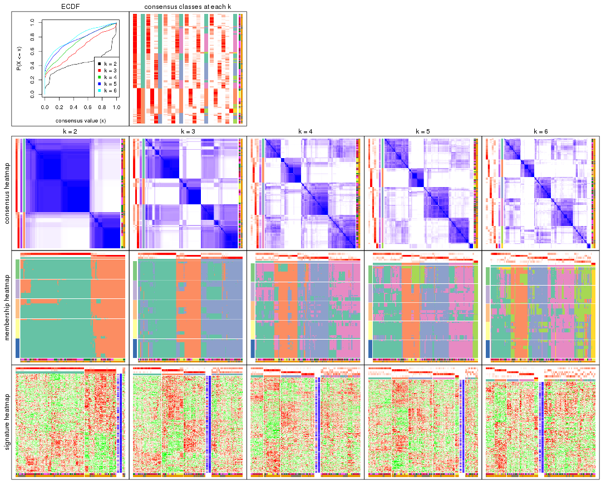

The plots are:

- The first row: a plot of the ECDF (Empirical cumulative distribution
  function) curves of the consensus matrix for each `k` and the heatmap of
  predicted classes for each `k`.
- The second row: heatmaps of the consensus matrix for each `k`.
- The third row: heatmaps of the membership matrix for each `k`.
- The fouth row: heatmaps of the signatures for each `k`.

All the plots in panels can be made by individual functions and they are
plotted later in this section.

`select_partition_number()` produces several plots showing different
statistics for choosing "optimized" `k`. There are following statistics:

- ECDF curves of the consensus matrix for each `k`;
- 1-PAC. [The PAC
  score](https://en.wikipedia.org/wiki/Consensus_clustering#Over-interpretation_potential_of_consensus_clustering)
  measures the proportion of the ambiguous subgrouping.
- Mean silhouette score.
- Concordance. The mean probability of fiting the consensus class ids in all
  partitions.
- Area increased. Denote $A_k$ as the area under the ECDF curve for current
  `k`, the area increased is defined as $A_k - A_{k-1}$.
- Rand index. The percent of pairs of samples that are both in a same cluster
  or both are not in a same cluster in the partition of k and k-1.
- Jaccard index. The ratio of pairs of samples are both in a same cluster in
  the partition of k and k-1 and the pairs of samples are both in a same
  cluster in the partition k or k-1.

The detailed explanations of these statistics can be found in [the cola
vignette](http://bioconductor.org/packages/devel/bioc/vignettes/cola/inst/doc/cola.html#toc_13).

Generally speaking, lower PAC score, higher mean silhouette score or higher
concordance corresponds to better partition. Rand index and Jaccard index
measure how similar the current partition is compared to partition with `k-1`.
If they are too similar, we won't accept `k` is better than `k-1`.

```r
select_partition_number(res)
```


The numeric values for all these statistics can be obtained by `get_stats()`.

```r
get_stats(res)
```

```
#>   k 1-PAC mean_silhouette concordance area_increased  Rand Jaccard
#> 2 2 0.754           0.882       0.935         0.4403 0.557   0.557
#> 3 3 0.476           0.580       0.821         0.4435 0.669   0.463
#> 4 4 0.482           0.501       0.727         0.1347 0.787   0.477
#> 5 5 0.547           0.656       0.772         0.0584 0.860   0.554
#> 6 6 0.593           0.444       0.713         0.0507 0.870   0.525
```

`suggest_best_k()` suggests the best $k$ based on these statistics. The rules are as follows:

- All $k$ with Jaccard index larger than 0.95 are removed because the increase of
  the partition number does not provides enough extra information. If all $k$ are removed,
  the best $k$ is assigned by `NA`.
- For $k$ with 1-PAC larger than 0.9, the maximal $k$ is taken as the "best k". Other $k$ is called "optional k".
- If it does not fit the second rule. The $k$ with the highest vote of highest
  1-PAC, mean silhouette and concordance is taken as the "best k".

```r
suggest_best_k(res)
```

```
#> [1] 5
```


Following shows the table of the partitions (You need to click the **show/hide
code output** link to see it). The membership matrix (columns with name `p*`)
is inferred by
[`clue::cl_consensus()`](https://www.rdocumentation.org/link/cl_consensus?package=clue)
function with the `SE` method. Basically the value in the membership matrix
represents the probability to belong to a certain group. The finall class
label for an item is determined with the group with highest probability it
belongs to.

In `get_classes()` function, the entropy is calculated from the membership
matrix and the silhouette score is calculated from the consensus matrix.


<script>
$( function() {
	$( '#tabs-SD-pam-get-classes' ).tabs();
} );
</script>
<div id='tabs-SD-pam-get-classes'>
<ul>
<li><a href='#tab-SD-pam-get-classes-1'>k = 2</a></li>
<li><a href='#tab-SD-pam-get-classes-2'>k = 3</a></li>
<li><a href='#tab-SD-pam-get-classes-3'>k = 4</a></li>
<li><a href='#tab-SD-pam-get-classes-4'>k = 5</a></li>
<li><a href='#tab-SD-pam-get-classes-5'>k = 6</a></li>
</ul>

<div id='tab-SD-pam-get-classes-1'>
<p><a id='tab-SD-pam-get-classes-1-a' style='color:#0366d6' href='#'>show/hide code output</a></p>
<pre><code class="r">cbind(get_classes(res, k = 2), get_membership(res, k = 2))
</code></pre>

<pre><code>#&gt;           class entropy silhouette    p1    p2
#&gt; GSM682002     1  0.0000      0.933 1.000 0.000
#&gt; GSM682003     2  0.0000      0.922 0.000 1.000
#&gt; GSM682004     2  0.0000      0.922 0.000 1.000
#&gt; GSM682005     2  0.8661      0.601 0.288 0.712
#&gt; GSM682006     1  0.4161      0.900 0.916 0.084
#&gt; GSM682007     1  0.6247      0.812 0.844 0.156
#&gt; GSM682008     2  0.9983      0.057 0.476 0.524
#&gt; GSM682009     1  0.9710      0.412 0.600 0.400
#&gt; GSM682010     1  0.3431      0.931 0.936 0.064
#&gt; GSM682011     1  0.0000      0.933 1.000 0.000
#&gt; GSM682096     2  0.1633      0.915 0.024 0.976
#&gt; GSM682097     2  0.7602      0.722 0.220 0.780
#&gt; GSM682098     2  0.0376      0.921 0.004 0.996
#&gt; GSM682099     1  0.6247      0.812 0.844 0.156
#&gt; GSM682100     2  0.0000      0.922 0.000 1.000
#&gt; GSM682101     1  0.7674      0.775 0.776 0.224
#&gt; GSM682102     1  0.0000      0.933 1.000 0.000
#&gt; GSM682103     1  0.0672      0.934 0.992 0.008
#&gt; GSM682104     1  0.4022      0.922 0.920 0.080
#&gt; GSM682105     1  0.0000      0.933 1.000 0.000
#&gt; GSM682106     1  0.0672      0.934 0.992 0.008
#&gt; GSM682107     1  0.0000      0.933 1.000 0.000
#&gt; GSM682108     1  0.3431      0.931 0.936 0.064
#&gt; GSM682109     1  0.3431      0.931 0.936 0.064
#&gt; GSM682110     1  0.0672      0.934 0.992 0.008
#&gt; GSM682111     1  0.4815      0.904 0.896 0.104
#&gt; GSM682112     1  0.6887      0.823 0.816 0.184
#&gt; GSM682113     1  0.2043      0.935 0.968 0.032
#&gt; GSM682114     1  0.3431      0.931 0.936 0.064
#&gt; GSM682115     1  0.0000      0.933 1.000 0.000
#&gt; GSM682116     1  0.0000      0.933 1.000 0.000
#&gt; GSM682117     1  0.0000      0.933 1.000 0.000
#&gt; GSM682118     1  0.0000      0.933 1.000 0.000
#&gt; GSM682119     1  0.0672      0.934 0.992 0.008
#&gt; GSM682120     1  0.0000      0.933 1.000 0.000
#&gt; GSM682121     1  0.0000      0.933 1.000 0.000
#&gt; GSM682122     1  0.3431      0.931 0.936 0.064
#&gt; GSM682012     2  0.0000      0.922 0.000 1.000
#&gt; GSM682013     2  0.0000      0.922 0.000 1.000
#&gt; GSM682014     2  0.0000      0.922 0.000 1.000
#&gt; GSM682015     2  0.0000      0.922 0.000 1.000
#&gt; GSM682016     2  0.0000      0.922 0.000 1.000
#&gt; GSM682017     2  0.0000      0.922 0.000 1.000
#&gt; GSM682018     2  0.0000      0.922 0.000 1.000
#&gt; GSM682019     2  0.0000      0.922 0.000 1.000
#&gt; GSM682020     2  0.0000      0.922 0.000 1.000
#&gt; GSM682021     2  0.0000      0.922 0.000 1.000
#&gt; GSM682022     2  0.0000      0.922 0.000 1.000
#&gt; GSM682023     2  0.0000      0.922 0.000 1.000
#&gt; GSM682024     1  0.2948      0.933 0.948 0.052
#&gt; GSM682025     2  0.0000      0.922 0.000 1.000
#&gt; GSM682026     2  0.0000      0.922 0.000 1.000
#&gt; GSM682027     2  0.3584      0.889 0.068 0.932
#&gt; GSM682028     2  0.3584      0.889 0.068 0.932
#&gt; GSM682029     2  0.3584      0.889 0.068 0.932
#&gt; GSM682030     2  0.4815      0.873 0.104 0.896
#&gt; GSM682031     2  0.3879      0.884 0.076 0.924
#&gt; GSM682032     2  0.3879      0.884 0.076 0.924
#&gt; GSM682033     2  0.0000      0.922 0.000 1.000
#&gt; GSM681992     2  0.9944      0.112 0.456 0.544
#&gt; GSM681993     1  0.8861      0.641 0.696 0.304
#&gt; GSM681994     1  0.0672      0.934 0.992 0.008
#&gt; GSM681995     1  0.0376      0.932 0.996 0.004
#&gt; GSM681996     1  0.6712      0.787 0.824 0.176
#&gt; GSM681997     1  0.6247      0.812 0.844 0.156
#&gt; GSM681998     1  0.6247      0.812 0.844 0.156
#&gt; GSM681999     1  0.6247      0.812 0.844 0.156
#&gt; GSM682000     1  0.3274      0.903 0.940 0.060
#&gt; GSM682001     1  0.0000      0.933 1.000 0.000
#&gt; GSM682055     2  0.1414      0.915 0.020 0.980
#&gt; GSM682056     1  0.9209      0.578 0.664 0.336
#&gt; GSM682057     2  0.0000      0.922 0.000 1.000
#&gt; GSM682058     2  0.7219      0.782 0.200 0.800
#&gt; GSM682059     2  0.0000      0.922 0.000 1.000
#&gt; GSM682060     2  0.7674      0.710 0.224 0.776
#&gt; GSM682061     2  0.3431      0.893 0.064 0.936
#&gt; GSM682062     2  0.0000      0.922 0.000 1.000
#&gt; GSM682063     2  0.0376      0.921 0.004 0.996
#&gt; GSM682064     1  0.3431      0.931 0.936 0.064
#&gt; GSM682065     1  0.3114      0.931 0.944 0.056
#&gt; GSM682066     1  0.1633      0.935 0.976 0.024
#&gt; GSM682067     1  0.3431      0.931 0.936 0.064
#&gt; GSM682068     1  0.0000      0.933 1.000 0.000
#&gt; GSM682069     1  0.3431      0.931 0.936 0.064
#&gt; GSM682070     1  0.3114      0.931 0.944 0.056
#&gt; GSM682071     2  0.6801      0.771 0.180 0.820
#&gt; GSM682072     1  0.3584      0.929 0.932 0.068
#&gt; GSM682073     1  0.8909      0.634 0.692 0.308
#&gt; GSM682074     1  0.2603      0.934 0.956 0.044
#&gt; GSM682075     1  0.0000      0.933 1.000 0.000
#&gt; GSM682076     1  0.0000      0.933 1.000 0.000
#&gt; GSM682077     1  0.3431      0.931 0.936 0.064
#&gt; GSM682078     1  0.0000      0.933 1.000 0.000
#&gt; GSM682079     1  0.0000      0.933 1.000 0.000
#&gt; GSM682080     1  0.9000      0.621 0.684 0.316
#&gt; GSM682081     1  0.8955      0.626 0.688 0.312
#&gt; GSM682082     1  0.0672      0.934 0.992 0.008
#&gt; GSM682083     1  0.0000      0.933 1.000 0.000
#&gt; GSM682084     1  0.3431      0.931 0.936 0.064
#&gt; GSM682085     1  0.3431      0.931 0.936 0.064
#&gt; GSM682086     1  0.0000      0.933 1.000 0.000
#&gt; GSM682087     1  0.0000      0.933 1.000 0.000
#&gt; GSM682088     1  0.3431      0.931 0.936 0.064
#&gt; GSM682089     1  0.3431      0.931 0.936 0.064
#&gt; GSM682090     1  0.0000      0.933 1.000 0.000
#&gt; GSM682091     1  0.3431      0.931 0.936 0.064
#&gt; GSM682092     1  0.0672      0.934 0.992 0.008
#&gt; GSM682093     1  0.3431      0.931 0.936 0.064
#&gt; GSM682094     1  0.0000      0.933 1.000 0.000
#&gt; GSM682095     2  0.0000      0.922 0.000 1.000
#&gt; GSM681982     2  0.8713      0.584 0.292 0.708
#&gt; GSM681983     1  0.0000      0.933 1.000 0.000
#&gt; GSM681984     2  0.3733      0.887 0.072 0.928
#&gt; GSM681985     1  0.7376      0.792 0.792 0.208
#&gt; GSM681986     2  0.3879      0.885 0.076 0.924
#&gt; GSM681987     2  0.0000      0.922 0.000 1.000
#&gt; GSM681988     2  0.3733      0.887 0.072 0.928
#&gt; GSM681989     2  0.3879      0.885 0.076 0.924
#&gt; GSM681990     1  0.3431      0.931 0.936 0.064
#&gt; GSM681991     2  0.0000      0.922 0.000 1.000
#&gt; GSM682034     1  0.3114      0.931 0.944 0.056
#&gt; GSM682035     1  0.3114      0.931 0.944 0.056
#&gt; GSM682036     1  0.3431      0.931 0.936 0.064
#&gt; GSM682037     1  0.3114      0.931 0.944 0.056
#&gt; GSM682038     2  0.3431      0.892 0.064 0.936
#&gt; GSM682039     1  0.3431      0.931 0.936 0.064
#&gt; GSM682040     2  0.9580      0.360 0.380 0.620
#&gt; GSM682041     1  0.3431      0.931 0.936 0.064
#&gt; GSM682042     1  0.8327      0.713 0.736 0.264
#&gt; GSM682043     1  0.0000      0.933 1.000 0.000
#&gt; GSM682044     1  0.0000      0.933 1.000 0.000
#&gt; GSM682045     1  0.2423      0.934 0.960 0.040
#&gt; GSM682046     1  0.0000      0.933 1.000 0.000
#&gt; GSM682047     1  0.3431      0.931 0.936 0.064
#&gt; GSM682048     1  0.3431      0.931 0.936 0.064
#&gt; GSM682049     1  0.3274      0.931 0.940 0.060
#&gt; GSM682050     1  0.0000      0.933 1.000 0.000
#&gt; GSM682051     1  0.3431      0.931 0.936 0.064
#&gt; GSM682052     1  0.3431      0.931 0.936 0.064
#&gt; GSM682053     1  0.3431      0.931 0.936 0.064
#&gt; GSM682054     1  0.0000      0.933 1.000 0.000
#&gt; GSM682123     1  0.3431      0.931 0.936 0.064
#&gt; GSM682124     1  0.2948      0.932 0.948 0.052
#&gt; GSM682125     1  0.3431      0.931 0.936 0.064
#&gt; GSM682126     1  0.0000      0.933 1.000 0.000
#&gt; GSM682127     1  0.1633      0.935 0.976 0.024
#&gt; GSM682128     1  0.0672      0.934 0.992 0.008
#&gt; GSM682129     2  0.0000      0.922 0.000 1.000
#&gt; GSM682130     2  0.0000      0.922 0.000 1.000
#&gt; GSM682131     2  0.0000      0.922 0.000 1.000
#&gt; GSM682132     1  0.0000      0.933 1.000 0.000
#&gt; GSM682133     1  0.0000      0.933 1.000 0.000
#&gt; GSM682134     1  0.3431      0.931 0.936 0.064
#&gt; GSM682135     1  0.3431      0.931 0.936 0.064
#&gt; GSM682136     1  0.0000      0.933 1.000 0.000
#&gt; GSM682137     1  0.0000      0.933 1.000 0.000
#&gt; GSM682138     1  0.0000      0.933 1.000 0.000
#&gt; GSM682139     1  0.3431      0.931 0.936 0.064
#&gt; GSM682140     1  0.0000      0.933 1.000 0.000
#&gt; GSM682141     1  0.0000      0.933 1.000 0.000
#&gt; GSM682142     1  0.0000      0.933 1.000 0.000
#&gt; GSM682143     2  0.3431      0.892 0.064 0.936
</code></pre>

<script>
$('#tab-SD-pam-get-classes-1-a').parent().next().next().hide();
$('#tab-SD-pam-get-classes-1-a').click(function(){
  $('#tab-SD-pam-get-classes-1-a').parent().next().next().toggle();
  return(false);
});
</script>
</div>

<div id='tab-SD-pam-get-classes-2'>
<p><a id='tab-SD-pam-get-classes-2-a' style='color:#0366d6' href='#'>show/hide code output</a></p>
<pre><code class="r">cbind(get_classes(res, k = 3), get_membership(res, k = 3))
</code></pre>

<pre><code>#&gt;           class entropy silhouette    p1    p2    p3
#&gt; GSM682002     1  0.0424     0.7723 0.992 0.000 0.008
#&gt; GSM682003     2  0.4291     0.7191 0.000 0.820 0.180
#&gt; GSM682004     2  0.0000     0.8541 0.000 1.000 0.000
#&gt; GSM682005     3  0.0424     0.6743 0.008 0.000 0.992
#&gt; GSM682006     3  0.4796     0.4762 0.220 0.000 0.780
#&gt; GSM682007     3  0.5733     0.3106 0.324 0.000 0.676
#&gt; GSM682008     3  0.1529     0.6613 0.040 0.000 0.960
#&gt; GSM682009     3  0.0424     0.6753 0.008 0.000 0.992
#&gt; GSM682010     3  0.0747     0.6755 0.016 0.000 0.984
#&gt; GSM682011     1  0.4702     0.5562 0.788 0.000 0.212
#&gt; GSM682096     2  0.9287     0.4393 0.188 0.508 0.304
#&gt; GSM682097     3  0.6188     0.5244 0.040 0.216 0.744
#&gt; GSM682098     2  0.6189     0.4942 0.004 0.632 0.364
#&gt; GSM682099     1  0.5016     0.5374 0.760 0.000 0.240
#&gt; GSM682100     2  0.0000     0.8541 0.000 1.000 0.000
#&gt; GSM682101     1  0.9793    -0.1303 0.388 0.236 0.376
#&gt; GSM682102     1  0.0000     0.7731 1.000 0.000 0.000
#&gt; GSM682103     1  0.5016     0.5275 0.760 0.000 0.240
#&gt; GSM682104     3  0.3340     0.6046 0.120 0.000 0.880
#&gt; GSM682105     1  0.0424     0.7723 0.992 0.000 0.008
#&gt; GSM682106     3  0.6244     0.1259 0.440 0.000 0.560
#&gt; GSM682107     1  0.6111     0.2413 0.604 0.000 0.396
#&gt; GSM682108     3  0.0424     0.6753 0.008 0.000 0.992
#&gt; GSM682109     3  0.0000     0.6745 0.000 0.000 1.000
#&gt; GSM682110     3  0.5785     0.3001 0.332 0.000 0.668
#&gt; GSM682111     3  0.0000     0.6745 0.000 0.000 1.000
#&gt; GSM682112     3  0.0424     0.6753 0.008 0.000 0.992
#&gt; GSM682113     1  0.4654     0.5965 0.792 0.000 0.208
#&gt; GSM682114     3  0.6267     0.3056 0.452 0.000 0.548
#&gt; GSM682115     1  0.0424     0.7723 0.992 0.000 0.008
#&gt; GSM682116     1  0.0424     0.7723 0.992 0.000 0.008
#&gt; GSM682117     1  0.0424     0.7723 0.992 0.000 0.008
#&gt; GSM682118     3  0.5882     0.2796 0.348 0.000 0.652
#&gt; GSM682119     1  0.4974     0.5966 0.764 0.000 0.236
#&gt; GSM682120     1  0.0424     0.7723 0.992 0.000 0.008
#&gt; GSM682121     1  0.0424     0.7723 0.992 0.000 0.008
#&gt; GSM682122     3  0.3412     0.6445 0.124 0.000 0.876
#&gt; GSM682012     2  0.0000     0.8541 0.000 1.000 0.000
#&gt; GSM682013     2  0.0000     0.8541 0.000 1.000 0.000
#&gt; GSM682014     2  0.0000     0.8541 0.000 1.000 0.000
#&gt; GSM682015     2  0.0000     0.8541 0.000 1.000 0.000
#&gt; GSM682016     2  0.5497     0.5921 0.000 0.708 0.292
#&gt; GSM682017     2  0.0000     0.8541 0.000 1.000 0.000
#&gt; GSM682018     2  0.2959     0.8001 0.000 0.900 0.100
#&gt; GSM682019     2  0.0000     0.8541 0.000 1.000 0.000
#&gt; GSM682020     2  0.0000     0.8541 0.000 1.000 0.000
#&gt; GSM682021     2  0.2959     0.8001 0.000 0.900 0.100
#&gt; GSM682022     2  0.0000     0.8541 0.000 1.000 0.000
#&gt; GSM682023     2  0.2959     0.8001 0.000 0.900 0.100
#&gt; GSM682024     1  0.6633     0.5386 0.728 0.212 0.060
#&gt; GSM682025     2  0.0000     0.8541 0.000 1.000 0.000
#&gt; GSM682026     2  0.0000     0.8541 0.000 1.000 0.000
#&gt; GSM682027     2  0.7536     0.5637 0.304 0.632 0.064
#&gt; GSM682028     2  0.7285     0.5493 0.320 0.632 0.048
#&gt; GSM682029     2  0.7285     0.5493 0.320 0.632 0.048
#&gt; GSM682030     2  0.7285     0.5493 0.320 0.632 0.048
#&gt; GSM682031     2  0.7285     0.5493 0.320 0.632 0.048
#&gt; GSM682032     2  0.7285     0.5493 0.320 0.632 0.048
#&gt; GSM682033     2  0.0000     0.8541 0.000 1.000 0.000
#&gt; GSM681992     3  0.1163     0.6741 0.028 0.000 0.972
#&gt; GSM681993     3  0.0000     0.6745 0.000 0.000 1.000
#&gt; GSM681994     1  0.5016     0.5398 0.760 0.000 0.240
#&gt; GSM681995     1  0.6215     0.1888 0.572 0.000 0.428
#&gt; GSM681996     3  0.5733     0.3106 0.324 0.000 0.676
#&gt; GSM681997     3  0.5733     0.3107 0.324 0.000 0.676
#&gt; GSM681998     3  0.5733     0.3107 0.324 0.000 0.676
#&gt; GSM681999     3  0.6295    -0.0135 0.472 0.000 0.528
#&gt; GSM682000     1  0.6225     0.1814 0.568 0.000 0.432
#&gt; GSM682001     1  0.6204     0.1909 0.576 0.000 0.424
#&gt; GSM682055     2  0.6045     0.4590 0.000 0.620 0.380
#&gt; GSM682056     3  0.7169     0.3642 0.404 0.028 0.568
#&gt; GSM682057     2  0.0237     0.8526 0.000 0.996 0.004
#&gt; GSM682058     1  0.8395     0.3078 0.568 0.328 0.104
#&gt; GSM682059     2  0.0000     0.8541 0.000 1.000 0.000
#&gt; GSM682060     3  0.5292     0.5183 0.008 0.228 0.764
#&gt; GSM682061     2  0.6308     0.1660 0.000 0.508 0.492
#&gt; GSM682062     2  0.0000     0.8541 0.000 1.000 0.000
#&gt; GSM682063     2  0.1529     0.8358 0.000 0.960 0.040
#&gt; GSM682064     3  0.2537     0.6605 0.080 0.000 0.920
#&gt; GSM682065     1  0.5706     0.3223 0.680 0.000 0.320
#&gt; GSM682066     1  0.6192     0.0651 0.580 0.000 0.420
#&gt; GSM682067     3  0.4931     0.5610 0.232 0.000 0.768
#&gt; GSM682068     1  0.0237     0.7731 0.996 0.000 0.004
#&gt; GSM682069     3  0.6215     0.3542 0.428 0.000 0.572
#&gt; GSM682070     1  0.5560     0.3809 0.700 0.000 0.300
#&gt; GSM682071     3  0.4399     0.5503 0.000 0.188 0.812
#&gt; GSM682072     3  0.0424     0.6753 0.008 0.000 0.992
#&gt; GSM682073     3  0.0237     0.6739 0.004 0.000 0.996
#&gt; GSM682074     1  0.6286    -0.1060 0.536 0.000 0.464
#&gt; GSM682075     1  0.0000     0.7731 1.000 0.000 0.000
#&gt; GSM682076     1  0.0424     0.7723 0.992 0.000 0.008
#&gt; GSM682077     3  0.6274     0.3053 0.456 0.000 0.544
#&gt; GSM682078     1  0.2261     0.7378 0.932 0.000 0.068
#&gt; GSM682079     1  0.2066     0.7453 0.940 0.000 0.060
#&gt; GSM682080     3  0.0000     0.6745 0.000 0.000 1.000
#&gt; GSM682081     3  0.0237     0.6745 0.004 0.000 0.996
#&gt; GSM682082     1  0.5016     0.5374 0.760 0.000 0.240
#&gt; GSM682083     1  0.0424     0.7723 0.992 0.000 0.008
#&gt; GSM682084     3  0.5327     0.5250 0.272 0.000 0.728
#&gt; GSM682085     3  0.6154     0.3757 0.408 0.000 0.592
#&gt; GSM682086     1  0.3619     0.6582 0.864 0.000 0.136
#&gt; GSM682087     1  0.0424     0.7723 0.992 0.000 0.008
#&gt; GSM682088     3  0.6305     0.2471 0.484 0.000 0.516
#&gt; GSM682089     3  0.6280     0.2888 0.460 0.000 0.540
#&gt; GSM682090     1  0.3116     0.7102 0.892 0.000 0.108
#&gt; GSM682091     3  0.6126     0.3900 0.400 0.000 0.600
#&gt; GSM682092     1  0.4974     0.5332 0.764 0.000 0.236
#&gt; GSM682093     3  0.6244     0.3364 0.440 0.000 0.560
#&gt; GSM682094     1  0.0237     0.7731 0.996 0.000 0.004
#&gt; GSM682095     2  0.0000     0.8541 0.000 1.000 0.000
#&gt; GSM681982     3  0.0237     0.6739 0.004 0.000 0.996
#&gt; GSM681983     1  0.0237     0.7731 0.996 0.000 0.004
#&gt; GSM681984     3  0.0424     0.6753 0.008 0.000 0.992
#&gt; GSM681985     3  0.0424     0.6753 0.008 0.000 0.992
#&gt; GSM681986     3  0.0661     0.6751 0.008 0.004 0.988
#&gt; GSM681987     2  0.5363     0.6260 0.000 0.724 0.276
#&gt; GSM681988     3  0.0237     0.6741 0.000 0.004 0.996
#&gt; GSM681989     3  0.0424     0.6753 0.008 0.000 0.992
#&gt; GSM681990     3  0.0747     0.6743 0.016 0.000 0.984
#&gt; GSM681991     2  0.0000     0.8541 0.000 1.000 0.000
#&gt; GSM682034     1  0.5529     0.3780 0.704 0.000 0.296
#&gt; GSM682035     1  0.5859     0.2776 0.656 0.000 0.344
#&gt; GSM682036     3  0.2261     0.6646 0.068 0.000 0.932
#&gt; GSM682037     3  0.6307     0.2283 0.488 0.000 0.512
#&gt; GSM682038     3  0.0747     0.6720 0.000 0.016 0.984
#&gt; GSM682039     3  0.6244     0.3364 0.440 0.000 0.560
#&gt; GSM682040     3  0.4700     0.5623 0.008 0.180 0.812
#&gt; GSM682041     3  0.6260     0.3270 0.448 0.000 0.552
#&gt; GSM682042     3  0.0237     0.6739 0.004 0.000 0.996
#&gt; GSM682043     1  0.0000     0.7731 1.000 0.000 0.000
#&gt; GSM682044     1  0.0237     0.7731 0.996 0.000 0.004
#&gt; GSM682045     1  0.3619     0.6680 0.864 0.000 0.136
#&gt; GSM682046     1  0.0237     0.7731 0.996 0.000 0.004
#&gt; GSM682047     3  0.6008     0.4306 0.372 0.000 0.628
#&gt; GSM682048     3  0.6244     0.3364 0.440 0.000 0.560
#&gt; GSM682049     1  0.6302    -0.1633 0.520 0.000 0.480
#&gt; GSM682050     1  0.0237     0.7731 0.996 0.000 0.004
#&gt; GSM682051     3  0.6267     0.3050 0.452 0.000 0.548
#&gt; GSM682052     3  0.3752     0.6281 0.144 0.000 0.856
#&gt; GSM682053     3  0.6235     0.3419 0.436 0.000 0.564
#&gt; GSM682054     1  0.0237     0.7731 0.996 0.000 0.004
#&gt; GSM682123     3  0.6244     0.3364 0.440 0.000 0.560
#&gt; GSM682124     1  0.5431     0.4089 0.716 0.000 0.284
#&gt; GSM682125     3  0.6244     0.3364 0.440 0.000 0.560
#&gt; GSM682126     1  0.0237     0.7731 0.996 0.000 0.004
#&gt; GSM682127     1  0.4605     0.5581 0.796 0.000 0.204
#&gt; GSM682128     1  0.5058     0.5324 0.756 0.000 0.244
#&gt; GSM682129     2  0.0000     0.8541 0.000 1.000 0.000
#&gt; GSM682130     2  0.0000     0.8541 0.000 1.000 0.000
#&gt; GSM682131     2  0.0000     0.8541 0.000 1.000 0.000
#&gt; GSM682132     1  0.0424     0.7723 0.992 0.000 0.008
#&gt; GSM682133     1  0.0000     0.7731 1.000 0.000 0.000
#&gt; GSM682134     3  0.6244     0.3353 0.440 0.000 0.560
#&gt; GSM682135     3  0.6215     0.3542 0.428 0.000 0.572
#&gt; GSM682136     1  0.0237     0.7731 0.996 0.000 0.004
#&gt; GSM682137     1  0.0424     0.7723 0.992 0.000 0.008
#&gt; GSM682138     1  0.1031     0.7667 0.976 0.000 0.024
#&gt; GSM682139     3  0.6244     0.3364 0.440 0.000 0.560
#&gt; GSM682140     1  0.1031     0.7685 0.976 0.000 0.024
#&gt; GSM682141     1  0.0237     0.7731 0.996 0.000 0.004
#&gt; GSM682142     1  0.0237     0.7731 0.996 0.000 0.004
#&gt; GSM682143     3  0.6260     0.0935 0.000 0.448 0.552
</code></pre>

<script>
$('#tab-SD-pam-get-classes-2-a').parent().next().next().hide();
$('#tab-SD-pam-get-classes-2-a').click(function(){
  $('#tab-SD-pam-get-classes-2-a').parent().next().next().toggle();
  return(false);
});
</script>
</div>

<div id='tab-SD-pam-get-classes-3'>
<p><a id='tab-SD-pam-get-classes-3-a' style='color:#0366d6' href='#'>show/hide code output</a></p>
<pre><code class="r">cbind(get_classes(res, k = 4), get_membership(res, k = 4))
</code></pre>

<pre><code>#&gt;           class entropy silhouette    p1    p2    p3    p4
#&gt; GSM682002     4  0.3400     0.5269 0.180 0.000 0.000 0.820
#&gt; GSM682003     2  0.4039     0.7576 0.084 0.836 0.080 0.000
#&gt; GSM682004     2  0.3754     0.7646 0.084 0.852 0.064 0.000
#&gt; GSM682005     3  0.1833     0.7555 0.032 0.000 0.944 0.024
#&gt; GSM682006     3  0.0804     0.7593 0.012 0.000 0.980 0.008
#&gt; GSM682007     3  0.3308     0.7301 0.036 0.000 0.872 0.092
#&gt; GSM682008     3  0.2928     0.7416 0.052 0.000 0.896 0.052
#&gt; GSM682009     3  0.3172     0.6397 0.160 0.000 0.840 0.000
#&gt; GSM682010     3  0.5769     0.4328 0.292 0.000 0.652 0.056
#&gt; GSM682011     4  0.7581    -0.0321 0.380 0.000 0.196 0.424
#&gt; GSM682096     3  0.7491     0.0921 0.004 0.368 0.468 0.160
#&gt; GSM682097     3  0.6080     0.4986 0.000 0.236 0.664 0.100
#&gt; GSM682098     2  0.5773     0.2691 0.004 0.564 0.408 0.024
#&gt; GSM682099     4  0.1716     0.5831 0.000 0.000 0.064 0.936
#&gt; GSM682100     2  0.2081     0.7933 0.084 0.916 0.000 0.000
#&gt; GSM682101     2  0.9904    -0.3145 0.256 0.288 0.272 0.184
#&gt; GSM682102     4  0.2011     0.5691 0.080 0.000 0.000 0.920
#&gt; GSM682103     4  0.4610     0.4261 0.020 0.000 0.236 0.744
#&gt; GSM682104     3  0.3764     0.6099 0.000 0.000 0.784 0.216
#&gt; GSM682105     4  0.2300     0.5770 0.064 0.000 0.016 0.920
#&gt; GSM682106     4  0.4877     0.3138 0.008 0.000 0.328 0.664
#&gt; GSM682107     1  0.7749     0.0717 0.408 0.000 0.236 0.356
#&gt; GSM682108     3  0.2760     0.6757 0.128 0.000 0.872 0.000
#&gt; GSM682109     3  0.0336     0.7581 0.008 0.000 0.992 0.000
#&gt; GSM682110     3  0.4955     0.5616 0.024 0.000 0.708 0.268
#&gt; GSM682111     3  0.0000     0.7569 0.000 0.000 1.000 0.000
#&gt; GSM682112     3  0.1637     0.7376 0.060 0.000 0.940 0.000
#&gt; GSM682113     4  0.5927     0.1472 0.264 0.000 0.076 0.660
#&gt; GSM682114     4  0.3942     0.4292 0.000 0.000 0.236 0.764
#&gt; GSM682115     4  0.4713     0.1841 0.360 0.000 0.000 0.640
#&gt; GSM682116     4  0.3266     0.5146 0.168 0.000 0.000 0.832
#&gt; GSM682117     4  0.4594     0.2358 0.280 0.000 0.008 0.712
#&gt; GSM682118     3  0.7784    -0.0120 0.292 0.000 0.428 0.280
#&gt; GSM682119     4  0.7894    -0.2014 0.332 0.000 0.296 0.372
#&gt; GSM682120     4  0.1637     0.5770 0.060 0.000 0.000 0.940
#&gt; GSM682121     4  0.0000     0.5885 0.000 0.000 0.000 1.000
#&gt; GSM682122     3  0.2973     0.7240 0.000 0.000 0.856 0.144
#&gt; GSM682012     2  0.1211     0.7954 0.040 0.960 0.000 0.000
#&gt; GSM682013     2  0.2081     0.7933 0.084 0.916 0.000 0.000
#&gt; GSM682014     2  0.2081     0.7933 0.084 0.916 0.000 0.000
#&gt; GSM682015     2  0.2081     0.7933 0.084 0.916 0.000 0.000
#&gt; GSM682016     2  0.4647     0.5241 0.008 0.704 0.288 0.000
#&gt; GSM682017     2  0.2081     0.7933 0.084 0.916 0.000 0.000
#&gt; GSM682018     2  0.3486     0.6515 0.000 0.812 0.188 0.000
#&gt; GSM682019     2  0.0000     0.7931 0.000 1.000 0.000 0.000
#&gt; GSM682020     2  0.2081     0.7933 0.084 0.916 0.000 0.000
#&gt; GSM682021     2  0.5102     0.6152 0.064 0.748 0.188 0.000
#&gt; GSM682022     2  0.0000     0.7931 0.000 1.000 0.000 0.000
#&gt; GSM682023     2  0.3486     0.6515 0.000 0.812 0.188 0.000
#&gt; GSM682024     1  0.4761     0.5985 0.628 0.000 0.000 0.372
#&gt; GSM682025     2  0.0000     0.7931 0.000 1.000 0.000 0.000
#&gt; GSM682026     2  0.0000     0.7931 0.000 1.000 0.000 0.000
#&gt; GSM682027     2  0.7925     0.4624 0.228 0.500 0.016 0.256
#&gt; GSM682028     2  0.8001     0.4652 0.228 0.500 0.020 0.252
#&gt; GSM682029     2  0.7925     0.4624 0.228 0.500 0.016 0.256
#&gt; GSM682030     2  0.7925     0.4624 0.228 0.500 0.016 0.256
#&gt; GSM682031     2  0.7925     0.4624 0.228 0.500 0.016 0.256
#&gt; GSM682032     2  0.7925     0.4624 0.228 0.500 0.016 0.256
#&gt; GSM682033     2  0.0707     0.7892 0.000 0.980 0.020 0.000
#&gt; GSM681992     3  0.6827     0.2689 0.304 0.000 0.568 0.128
#&gt; GSM681993     3  0.1022     0.7536 0.000 0.000 0.968 0.032
#&gt; GSM681994     4  0.2722     0.5666 0.064 0.000 0.032 0.904
#&gt; GSM681995     3  0.6805     0.2462 0.100 0.000 0.500 0.400
#&gt; GSM681996     3  0.3652     0.7221 0.052 0.000 0.856 0.092
#&gt; GSM681997     3  0.4188     0.7069 0.064 0.000 0.824 0.112
#&gt; GSM681998     3  0.4614     0.6859 0.064 0.000 0.792 0.144
#&gt; GSM681999     3  0.6436     0.4710 0.100 0.000 0.608 0.292
#&gt; GSM682000     3  0.7192     0.2620 0.144 0.000 0.488 0.368
#&gt; GSM682001     1  0.7837     0.0854 0.408 0.000 0.292 0.300
#&gt; GSM682055     2  0.4941     0.2351 0.000 0.564 0.436 0.000
#&gt; GSM682056     4  0.6903     0.1932 0.000 0.112 0.380 0.508
#&gt; GSM682057     2  0.0000     0.7931 0.000 1.000 0.000 0.000
#&gt; GSM682058     4  0.5512     0.4196 0.000 0.100 0.172 0.728
#&gt; GSM682059     2  0.2081     0.7933 0.084 0.916 0.000 0.000
#&gt; GSM682060     3  0.4564     0.4223 0.000 0.328 0.672 0.000
#&gt; GSM682061     3  0.4898     0.2307 0.000 0.416 0.584 0.000
#&gt; GSM682062     2  0.2081     0.7933 0.084 0.916 0.000 0.000
#&gt; GSM682063     2  0.2048     0.7699 0.064 0.928 0.008 0.000
#&gt; GSM682064     3  0.5696    -0.1062 0.480 0.000 0.496 0.024
#&gt; GSM682065     1  0.4817     0.5813 0.612 0.000 0.000 0.388
#&gt; GSM682066     1  0.6745     0.5001 0.480 0.000 0.092 0.428
#&gt; GSM682067     1  0.6393     0.2001 0.480 0.000 0.456 0.064
#&gt; GSM682068     4  0.4898     0.0621 0.416 0.000 0.000 0.584
#&gt; GSM682069     1  0.7551     0.4795 0.512 0.004 0.276 0.208
#&gt; GSM682070     1  0.5950     0.5546 0.544 0.000 0.040 0.416
#&gt; GSM682071     3  0.3610     0.6083 0.000 0.200 0.800 0.000
#&gt; GSM682072     3  0.0000     0.7569 0.000 0.000 1.000 0.000
#&gt; GSM682073     3  0.1635     0.7536 0.008 0.000 0.948 0.044
#&gt; GSM682074     4  0.5332     0.4165 0.080 0.000 0.184 0.736
#&gt; GSM682075     4  0.1637     0.5770 0.060 0.000 0.000 0.940
#&gt; GSM682076     4  0.0000     0.5885 0.000 0.000 0.000 1.000
#&gt; GSM682077     1  0.6273     0.4878 0.488 0.000 0.056 0.456
#&gt; GSM682078     4  0.1510     0.5856 0.028 0.000 0.016 0.956
#&gt; GSM682079     4  0.2408     0.5840 0.044 0.000 0.036 0.920
#&gt; GSM682080     3  0.0000     0.7569 0.000 0.000 1.000 0.000
#&gt; GSM682081     3  0.2271     0.7472 0.008 0.000 0.916 0.076
#&gt; GSM682082     4  0.0921     0.5868 0.000 0.000 0.028 0.972
#&gt; GSM682083     4  0.3311     0.5129 0.172 0.000 0.000 0.828
#&gt; GSM682084     3  0.4331     0.4957 0.000 0.000 0.712 0.288
#&gt; GSM682085     4  0.4543     0.3273 0.000 0.000 0.324 0.676
#&gt; GSM682086     4  0.6319     0.1021 0.312 0.000 0.084 0.604
#&gt; GSM682087     4  0.0000     0.5885 0.000 0.000 0.000 1.000
#&gt; GSM682088     4  0.2408     0.5677 0.000 0.000 0.104 0.896
#&gt; GSM682089     4  0.2589     0.5590 0.000 0.000 0.116 0.884
#&gt; GSM682090     4  0.0000     0.5885 0.000 0.000 0.000 1.000
#&gt; GSM682091     4  0.7846    -0.1870 0.300 0.000 0.296 0.404
#&gt; GSM682092     4  0.2469     0.5710 0.000 0.000 0.108 0.892
#&gt; GSM682093     3  0.5231     0.2287 0.012 0.000 0.604 0.384
#&gt; GSM682094     4  0.4500     0.1432 0.316 0.000 0.000 0.684
#&gt; GSM682095     2  0.2081     0.7933 0.084 0.916 0.000 0.000
#&gt; GSM681982     3  0.0336     0.7581 0.008 0.000 0.992 0.000
#&gt; GSM681983     1  0.4585     0.5110 0.668 0.000 0.000 0.332
#&gt; GSM681984     3  0.0000     0.7569 0.000 0.000 1.000 0.000
#&gt; GSM681985     3  0.0000     0.7569 0.000 0.000 1.000 0.000
#&gt; GSM681986     3  0.0336     0.7581 0.008 0.000 0.992 0.000
#&gt; GSM681987     2  0.6607     0.2872 0.084 0.516 0.400 0.000
#&gt; GSM681988     3  0.1635     0.7536 0.008 0.000 0.948 0.044
#&gt; GSM681989     3  0.0336     0.7581 0.008 0.000 0.992 0.000
#&gt; GSM681990     3  0.1722     0.7540 0.048 0.000 0.944 0.008
#&gt; GSM681991     2  0.2412     0.7916 0.084 0.908 0.008 0.000
#&gt; GSM682034     1  0.4477     0.6142 0.688 0.000 0.000 0.312
#&gt; GSM682035     1  0.4661     0.6035 0.652 0.000 0.000 0.348
#&gt; GSM682036     3  0.5792     0.0905 0.416 0.000 0.552 0.032
#&gt; GSM682037     1  0.6340     0.5750 0.580 0.000 0.076 0.344
#&gt; GSM682038     3  0.0779     0.7559 0.016 0.004 0.980 0.000
#&gt; GSM682039     4  0.7876    -0.2413 0.352 0.000 0.280 0.368
#&gt; GSM682040     3  0.4244     0.6122 0.032 0.168 0.800 0.000
#&gt; GSM682041     4  0.7088     0.2374 0.228 0.000 0.204 0.568
#&gt; GSM682042     3  0.0000     0.7569 0.000 0.000 1.000 0.000
#&gt; GSM682043     4  0.3942     0.4742 0.236 0.000 0.000 0.764
#&gt; GSM682044     1  0.4477     0.6142 0.688 0.000 0.000 0.312
#&gt; GSM682045     1  0.6702     0.5590 0.616 0.000 0.168 0.216
#&gt; GSM682046     1  0.4543     0.6058 0.676 0.000 0.000 0.324
#&gt; GSM682047     3  0.4996    -0.0420 0.000 0.000 0.516 0.484
#&gt; GSM682048     1  0.7289     0.4816 0.528 0.000 0.280 0.192
#&gt; GSM682049     4  0.6055     0.0680 0.372 0.000 0.052 0.576
#&gt; GSM682050     1  0.4564     0.6037 0.672 0.000 0.000 0.328
#&gt; GSM682051     4  0.6473     0.3168 0.108 0.000 0.280 0.612
#&gt; GSM682052     3  0.2530     0.6872 0.000 0.000 0.888 0.112
#&gt; GSM682053     4  0.7785    -0.1625 0.284 0.000 0.288 0.428
#&gt; GSM682054     4  0.4898     0.0332 0.416 0.000 0.000 0.584
#&gt; GSM682123     1  0.7062     0.5322 0.572 0.000 0.204 0.224
#&gt; GSM682124     1  0.4477     0.6142 0.688 0.000 0.000 0.312
#&gt; GSM682125     1  0.7318     0.4794 0.524 0.000 0.280 0.196
#&gt; GSM682126     1  0.4941     0.5151 0.564 0.000 0.000 0.436
#&gt; GSM682127     4  0.4998    -0.4332 0.488 0.000 0.000 0.512
#&gt; GSM682128     4  0.2408     0.5730 0.000 0.000 0.104 0.896
#&gt; GSM682129     2  0.0000     0.7931 0.000 1.000 0.000 0.000
#&gt; GSM682130     2  0.0336     0.7940 0.008 0.992 0.000 0.000
#&gt; GSM682131     2  0.2011     0.7937 0.080 0.920 0.000 0.000
#&gt; GSM682132     4  0.4222     0.4851 0.272 0.000 0.000 0.728
#&gt; GSM682133     4  0.4624     0.2243 0.340 0.000 0.000 0.660
#&gt; GSM682134     1  0.5986     0.5988 0.620 0.000 0.060 0.320
#&gt; GSM682135     1  0.7654     0.4452 0.464 0.000 0.284 0.252
#&gt; GSM682136     1  0.4955     0.5030 0.556 0.000 0.000 0.444
#&gt; GSM682137     4  0.1474     0.5797 0.052 0.000 0.000 0.948
#&gt; GSM682138     4  0.4485     0.2897 0.248 0.000 0.012 0.740
#&gt; GSM682139     1  0.6784     0.5233 0.600 0.000 0.244 0.156
#&gt; GSM682140     4  0.3801     0.3626 0.220 0.000 0.000 0.780
#&gt; GSM682141     1  0.4713     0.5630 0.640 0.000 0.000 0.360
#&gt; GSM682142     1  0.4972     0.5046 0.544 0.000 0.000 0.456
#&gt; GSM682143     3  0.6564     0.1068 0.084 0.380 0.536 0.000
</code></pre>

<script>
$('#tab-SD-pam-get-classes-3-a').parent().next().next().hide();
$('#tab-SD-pam-get-classes-3-a').click(function(){
  $('#tab-SD-pam-get-classes-3-a').parent().next().next().toggle();
  return(false);
});
</script>
</div>

<div id='tab-SD-pam-get-classes-4'>
<p><a id='tab-SD-pam-get-classes-4-a' style='color:#0366d6' href='#'>show/hide code output</a></p>
<pre><code class="r">cbind(get_classes(res, k = 5), get_membership(res, k = 5))
</code></pre>

<pre><code>#&gt;           class entropy silhouette    p1    p2    p3    p4    p5
#&gt; GSM682002     4  0.3750     0.6725 0.232 0.000 0.000 0.756 0.012
#&gt; GSM682003     2  0.3647     0.5522 0.004 0.764 0.228 0.000 0.004
#&gt; GSM682004     2  0.0324     0.8006 0.004 0.992 0.000 0.000 0.004
#&gt; GSM682005     3  0.0992     0.7866 0.000 0.000 0.968 0.024 0.008
#&gt; GSM682006     3  0.0290     0.7895 0.000 0.000 0.992 0.008 0.000
#&gt; GSM682007     3  0.2286     0.7469 0.000 0.000 0.888 0.108 0.004
#&gt; GSM682008     3  0.1892     0.7622 0.000 0.000 0.916 0.080 0.004
#&gt; GSM682009     3  0.4030     0.3297 0.352 0.000 0.648 0.000 0.000
#&gt; GSM682010     1  0.5490     0.4346 0.592 0.000 0.324 0.084 0.000
#&gt; GSM682011     1  0.5854     0.5710 0.628 0.000 0.240 0.120 0.012
#&gt; GSM682096     3  0.3284     0.7781 0.040 0.004 0.872 0.024 0.060
#&gt; GSM682097     3  0.5732     0.5785 0.076 0.004 0.660 0.236 0.024
#&gt; GSM682098     3  0.5720     0.6499 0.072 0.020 0.704 0.028 0.176
#&gt; GSM682099     4  0.1717     0.7600 0.004 0.000 0.052 0.936 0.008
#&gt; GSM682100     2  0.0162     0.8040 0.004 0.996 0.000 0.000 0.000
#&gt; GSM682101     2  0.7634     0.3642 0.108 0.560 0.136 0.172 0.024
#&gt; GSM682102     4  0.2561     0.7380 0.144 0.000 0.000 0.856 0.000
#&gt; GSM682103     4  0.5081     0.5794 0.140 0.000 0.132 0.720 0.008
#&gt; GSM682104     3  0.3186     0.7805 0.080 0.000 0.864 0.048 0.008
#&gt; GSM682105     4  0.2900     0.7548 0.108 0.000 0.028 0.864 0.000
#&gt; GSM682106     4  0.4161     0.2915 0.000 0.000 0.392 0.608 0.000
#&gt; GSM682107     1  0.5981     0.5945 0.624 0.000 0.212 0.152 0.012
#&gt; GSM682108     3  0.3730     0.4829 0.288 0.000 0.712 0.000 0.000
#&gt; GSM682109     3  0.1270     0.7908 0.052 0.000 0.948 0.000 0.000
#&gt; GSM682110     3  0.2818     0.7326 0.000 0.000 0.856 0.132 0.012
#&gt; GSM682111     3  0.1502     0.7905 0.056 0.000 0.940 0.004 0.000
#&gt; GSM682112     3  0.3904     0.6818 0.216 0.000 0.764 0.008 0.012
#&gt; GSM682113     1  0.5779     0.4932 0.492 0.000 0.076 0.428 0.004
#&gt; GSM682114     4  0.1956     0.7625 0.012 0.000 0.052 0.928 0.008
#&gt; GSM682115     4  0.4270     0.6092 0.320 0.000 0.000 0.668 0.012
#&gt; GSM682116     4  0.3916     0.6606 0.256 0.000 0.000 0.732 0.012
#&gt; GSM682117     1  0.5083     0.3959 0.492 0.000 0.020 0.480 0.008
#&gt; GSM682118     1  0.6387     0.5467 0.516 0.000 0.248 0.236 0.000
#&gt; GSM682119     1  0.5396     0.6491 0.688 0.000 0.156 0.148 0.008
#&gt; GSM682120     4  0.2127     0.7515 0.108 0.000 0.000 0.892 0.000
#&gt; GSM682121     4  0.0290     0.7731 0.008 0.000 0.000 0.992 0.000
#&gt; GSM682122     3  0.4599     0.7461 0.072 0.000 0.744 0.180 0.004
#&gt; GSM682012     2  0.1952     0.7962 0.004 0.912 0.000 0.000 0.084
#&gt; GSM682013     2  0.0162     0.8040 0.004 0.996 0.000 0.000 0.000
#&gt; GSM682014     2  0.0000     0.8036 0.000 1.000 0.000 0.000 0.000
#&gt; GSM682015     2  0.0000     0.8036 0.000 1.000 0.000 0.000 0.000
#&gt; GSM682016     3  0.7037     0.3540 0.040 0.220 0.556 0.008 0.176
#&gt; GSM682017     2  0.0000     0.8036 0.000 1.000 0.000 0.000 0.000
#&gt; GSM682018     2  0.7155     0.5281 0.084 0.596 0.128 0.016 0.176
#&gt; GSM682019     2  0.3048     0.7737 0.004 0.820 0.000 0.000 0.176
#&gt; GSM682020     2  0.0000     0.8036 0.000 1.000 0.000 0.000 0.000
#&gt; GSM682021     2  0.7224     0.5346 0.112 0.596 0.096 0.020 0.176
#&gt; GSM682022     2  0.3048     0.7737 0.004 0.820 0.000 0.000 0.176
#&gt; GSM682023     2  0.7110     0.5283 0.088 0.596 0.128 0.012 0.176
#&gt; GSM682024     1  0.3177     0.6576 0.792 0.000 0.000 0.208 0.000
#&gt; GSM682025     2  0.3048     0.7737 0.004 0.820 0.000 0.000 0.176
#&gt; GSM682026     2  0.3048     0.7737 0.004 0.820 0.000 0.000 0.176
#&gt; GSM682027     5  0.0771     0.8105 0.000 0.020 0.004 0.000 0.976
#&gt; GSM682028     5  0.0771     0.8105 0.000 0.020 0.004 0.000 0.976
#&gt; GSM682029     5  0.0771     0.8105 0.000 0.020 0.004 0.000 0.976
#&gt; GSM682030     5  0.0771     0.8105 0.000 0.020 0.004 0.000 0.976
#&gt; GSM682031     5  0.0771     0.8105 0.000 0.020 0.004 0.000 0.976
#&gt; GSM682032     5  0.0771     0.8105 0.000 0.020 0.004 0.000 0.976
#&gt; GSM682033     2  0.4767     0.7064 0.004 0.732 0.084 0.000 0.180
#&gt; GSM681992     1  0.5310     0.4135 0.536 0.000 0.424 0.020 0.020
#&gt; GSM681993     3  0.3503     0.7764 0.080 0.000 0.848 0.060 0.012
#&gt; GSM681994     4  0.1877     0.7401 0.000 0.000 0.064 0.924 0.012
#&gt; GSM681995     3  0.4124     0.6800 0.052 0.000 0.796 0.140 0.012
#&gt; GSM681996     3  0.2286     0.7469 0.000 0.000 0.888 0.108 0.004
#&gt; GSM681997     3  0.2818     0.7326 0.000 0.000 0.856 0.132 0.012
#&gt; GSM681998     3  0.2818     0.7326 0.000 0.000 0.856 0.132 0.012
#&gt; GSM681999     3  0.4124     0.6800 0.052 0.000 0.796 0.140 0.012
#&gt; GSM682000     3  0.6326     0.2432 0.008 0.000 0.524 0.140 0.328
#&gt; GSM682001     1  0.5801     0.5262 0.608 0.000 0.288 0.092 0.012
#&gt; GSM682055     3  0.5754     0.6375 0.088 0.032 0.692 0.008 0.180
#&gt; GSM682056     4  0.6868     0.4757 0.080 0.012 0.196 0.612 0.100
#&gt; GSM682057     2  0.3048     0.7737 0.004 0.820 0.000 0.000 0.176
#&gt; GSM682058     4  0.5002     0.6512 0.076 0.008 0.096 0.772 0.048
#&gt; GSM682059     2  0.0000     0.8036 0.000 1.000 0.000 0.000 0.000
#&gt; GSM682060     3  0.7476     0.4113 0.080 0.192 0.536 0.008 0.184
#&gt; GSM682061     3  0.5715     0.6194 0.048 0.084 0.688 0.000 0.180
#&gt; GSM682062     2  0.0162     0.8040 0.004 0.996 0.000 0.000 0.000
#&gt; GSM682063     2  0.2891     0.7738 0.000 0.824 0.000 0.000 0.176
#&gt; GSM682064     1  0.4378     0.5219 0.676 0.000 0.308 0.008 0.008
#&gt; GSM682065     1  0.3480     0.6414 0.752 0.000 0.000 0.248 0.000
#&gt; GSM682066     1  0.5674     0.6388 0.596 0.000 0.080 0.316 0.008
#&gt; GSM682067     1  0.4734     0.5519 0.676 0.000 0.288 0.028 0.008
#&gt; GSM682068     5  0.6825    -0.0759 0.336 0.000 0.000 0.324 0.340
#&gt; GSM682069     1  0.5199     0.6438 0.708 0.000 0.132 0.152 0.008
#&gt; GSM682070     1  0.4516     0.6440 0.704 0.000 0.024 0.264 0.008
#&gt; GSM682071     3  0.5456     0.6501 0.084 0.020 0.708 0.008 0.180
#&gt; GSM682072     3  0.1410     0.7900 0.060 0.000 0.940 0.000 0.000
#&gt; GSM682073     3  0.2172     0.7725 0.016 0.000 0.908 0.076 0.000
#&gt; GSM682074     4  0.3110     0.7478 0.060 0.000 0.080 0.860 0.000
#&gt; GSM682075     4  0.2127     0.7515 0.108 0.000 0.000 0.892 0.000
#&gt; GSM682076     4  0.0290     0.7731 0.008 0.000 0.000 0.992 0.000
#&gt; GSM682077     1  0.5221     0.5411 0.552 0.000 0.048 0.400 0.000
#&gt; GSM682078     4  0.2325     0.7725 0.068 0.000 0.028 0.904 0.000
#&gt; GSM682079     4  0.3146     0.7595 0.092 0.000 0.052 0.856 0.000
#&gt; GSM682080     3  0.2474     0.7813 0.084 0.000 0.896 0.012 0.008
#&gt; GSM682081     3  0.3060     0.7487 0.024 0.000 0.848 0.128 0.000
#&gt; GSM682082     4  0.0000     0.7726 0.000 0.000 0.000 1.000 0.000
#&gt; GSM682083     4  0.3942     0.6595 0.260 0.000 0.000 0.728 0.012
#&gt; GSM682084     3  0.4240     0.5858 0.004 0.000 0.684 0.304 0.008
#&gt; GSM682085     4  0.2230     0.7332 0.000 0.000 0.116 0.884 0.000
#&gt; GSM682086     1  0.5415     0.5085 0.552 0.000 0.064 0.384 0.000
#&gt; GSM682087     4  0.0290     0.7731 0.008 0.000 0.000 0.992 0.000
#&gt; GSM682088     4  0.2020     0.7548 0.000 0.000 0.100 0.900 0.000
#&gt; GSM682089     4  0.2127     0.7495 0.000 0.000 0.108 0.892 0.000
#&gt; GSM682090     4  0.0290     0.7731 0.008 0.000 0.000 0.992 0.000
#&gt; GSM682091     1  0.5997     0.6030 0.616 0.000 0.180 0.196 0.008
#&gt; GSM682092     4  0.2660     0.7343 0.008 0.000 0.128 0.864 0.000
#&gt; GSM682093     3  0.5945     0.3671 0.096 0.000 0.556 0.340 0.008
#&gt; GSM682094     1  0.4126     0.5746 0.620 0.000 0.000 0.380 0.000
#&gt; GSM682095     2  0.0000     0.8036 0.000 1.000 0.000 0.000 0.000
#&gt; GSM681982     3  0.1243     0.7925 0.028 0.000 0.960 0.008 0.004
#&gt; GSM681983     1  0.3359     0.6152 0.816 0.000 0.000 0.164 0.020
#&gt; GSM681984     3  0.2017     0.7856 0.080 0.000 0.912 0.000 0.008
#&gt; GSM681985     3  0.1956     0.7867 0.076 0.000 0.916 0.000 0.008
#&gt; GSM681986     3  0.0324     0.7900 0.004 0.000 0.992 0.000 0.004
#&gt; GSM681987     3  0.4745     0.3377 0.012 0.424 0.560 0.000 0.004
#&gt; GSM681988     3  0.1809     0.7789 0.012 0.000 0.928 0.060 0.000
#&gt; GSM681989     3  0.0000     0.7892 0.000 0.000 1.000 0.000 0.000
#&gt; GSM681990     3  0.0955     0.7851 0.000 0.000 0.968 0.028 0.004
#&gt; GSM681991     2  0.0324     0.8006 0.004 0.992 0.000 0.000 0.004
#&gt; GSM682034     1  0.2248     0.6429 0.900 0.000 0.000 0.088 0.012
#&gt; GSM682035     1  0.3496     0.6026 0.788 0.000 0.000 0.200 0.012
#&gt; GSM682036     1  0.4735     0.4266 0.608 0.000 0.372 0.012 0.008
#&gt; GSM682037     1  0.5309     0.5559 0.680 0.000 0.080 0.228 0.012
#&gt; GSM682038     3  0.3351     0.7773 0.084 0.028 0.864 0.008 0.016
#&gt; GSM682039     1  0.5579     0.6199 0.668 0.000 0.164 0.160 0.008
#&gt; GSM682040     3  0.5964     0.6727 0.088 0.096 0.704 0.008 0.104
#&gt; GSM682041     4  0.5505     0.6338 0.220 0.000 0.100 0.668 0.012
#&gt; GSM682042     3  0.2532     0.7804 0.088 0.000 0.892 0.008 0.012
#&gt; GSM682043     4  0.4387     0.6016 0.348 0.000 0.000 0.640 0.012
#&gt; GSM682044     1  0.2248     0.6429 0.900 0.000 0.000 0.088 0.012
#&gt; GSM682045     1  0.2990     0.6793 0.868 0.000 0.024 0.100 0.008
#&gt; GSM682046     1  0.2470     0.6403 0.884 0.000 0.000 0.104 0.012
#&gt; GSM682047     4  0.5404     0.5173 0.080 0.000 0.260 0.652 0.008
#&gt; GSM682048     1  0.5614     0.6049 0.664 0.000 0.164 0.164 0.008
#&gt; GSM682049     4  0.5088     0.6148 0.280 0.000 0.044 0.664 0.012
#&gt; GSM682050     1  0.2470     0.6392 0.884 0.000 0.000 0.104 0.012
#&gt; GSM682051     4  0.5188     0.6782 0.168 0.000 0.108 0.712 0.012
#&gt; GSM682052     3  0.4194     0.7318 0.084 0.000 0.800 0.104 0.012
#&gt; GSM682053     1  0.6422     0.5306 0.532 0.000 0.168 0.292 0.008
#&gt; GSM682054     1  0.4130     0.4573 0.696 0.000 0.000 0.292 0.012
#&gt; GSM682123     1  0.4238     0.6601 0.768 0.000 0.068 0.164 0.000
#&gt; GSM682124     1  0.2248     0.6429 0.900 0.000 0.000 0.088 0.012
#&gt; GSM682125     1  0.5833     0.5521 0.660 0.000 0.164 0.156 0.020
#&gt; GSM682126     1  0.3837     0.5761 0.692 0.000 0.000 0.308 0.000
#&gt; GSM682127     1  0.4278     0.4180 0.548 0.000 0.000 0.452 0.000
#&gt; GSM682128     4  0.2280     0.7434 0.000 0.000 0.120 0.880 0.000
#&gt; GSM682129     2  0.3048     0.7737 0.004 0.820 0.000 0.000 0.176
#&gt; GSM682130     2  0.2773     0.7782 0.000 0.836 0.000 0.000 0.164
#&gt; GSM682131     2  0.0162     0.8040 0.004 0.996 0.000 0.000 0.000
#&gt; GSM682132     5  0.5958     0.4101 0.200 0.000 0.000 0.208 0.592
#&gt; GSM682133     4  0.4505     0.5350 0.384 0.000 0.000 0.604 0.012
#&gt; GSM682134     1  0.4065     0.6604 0.772 0.000 0.048 0.180 0.000
#&gt; GSM682135     1  0.5781     0.6123 0.644 0.000 0.168 0.180 0.008
#&gt; GSM682136     1  0.3684     0.5611 0.720 0.000 0.000 0.280 0.000
#&gt; GSM682137     4  0.2074     0.7532 0.104 0.000 0.000 0.896 0.000
#&gt; GSM682138     4  0.3093     0.7104 0.168 0.000 0.008 0.824 0.000
#&gt; GSM682139     1  0.3010     0.6239 0.860 0.000 0.116 0.016 0.008
#&gt; GSM682140     4  0.2377     0.7485 0.128 0.000 0.000 0.872 0.000
#&gt; GSM682141     1  0.3039     0.6152 0.836 0.000 0.000 0.152 0.012
#&gt; GSM682142     1  0.3774     0.6231 0.704 0.000 0.000 0.296 0.000
#&gt; GSM682143     2  0.4802    -0.1500 0.012 0.504 0.480 0.000 0.004
</code></pre>

<script>
$('#tab-SD-pam-get-classes-4-a').parent().next().next().hide();
$('#tab-SD-pam-get-classes-4-a').click(function(){
  $('#tab-SD-pam-get-classes-4-a').parent().next().next().toggle();
  return(false);
});
</script>
</div>

<div id='tab-SD-pam-get-classes-5'>
<p><a id='tab-SD-pam-get-classes-5-a' style='color:#0366d6' href='#'>show/hide code output</a></p>
<pre><code class="r">cbind(get_classes(res, k = 6), get_membership(res, k = 6))
</code></pre>

<pre><code>#&gt;           class entropy silhouette    p1    p2    p3    p4    p5    p6
#&gt; GSM682002     4  0.3592    0.46840 0.344 0.000 0.000 0.656 0.000 0.000
#&gt; GSM682003     2  0.3797    0.40896 0.000 0.580 0.000 0.000 0.420 0.000
#&gt; GSM682004     2  0.3620    0.49972 0.000 0.648 0.000 0.000 0.352 0.000
#&gt; GSM682005     3  0.1814    0.61420 0.000 0.000 0.900 0.000 0.100 0.000
#&gt; GSM682006     3  0.1444    0.62545 0.000 0.000 0.928 0.000 0.072 0.000
#&gt; GSM682007     3  0.0363    0.64280 0.000 0.000 0.988 0.000 0.012 0.000
#&gt; GSM682008     3  0.0000    0.64109 0.000 0.000 1.000 0.000 0.000 0.000
#&gt; GSM682009     3  0.5624    0.25901 0.200 0.000 0.536 0.000 0.264 0.000
#&gt; GSM682010     3  0.6164    0.06987 0.332 0.000 0.432 0.008 0.228 0.000
#&gt; GSM682011     1  0.6168    0.35553 0.496 0.000 0.316 0.160 0.028 0.000
#&gt; GSM682096     3  0.3960    0.54040 0.004 0.000 0.752 0.032 0.204 0.008
#&gt; GSM682097     5  0.5828    0.13376 0.000 0.000 0.408 0.160 0.428 0.004
#&gt; GSM682098     5  0.5609    0.20165 0.000 0.072 0.412 0.000 0.488 0.028
#&gt; GSM682099     4  0.3167    0.65968 0.000 0.000 0.072 0.832 0.096 0.000
#&gt; GSM682100     2  0.2092    0.76049 0.000 0.876 0.000 0.000 0.124 0.000
#&gt; GSM682101     2  0.6492   -0.17060 0.064 0.428 0.004 0.104 0.400 0.000
#&gt; GSM682102     4  0.2234    0.65419 0.124 0.000 0.000 0.872 0.004 0.000
#&gt; GSM682103     4  0.4423    0.21644 0.028 0.000 0.000 0.552 0.420 0.000
#&gt; GSM682104     3  0.4824    0.08413 0.000 0.000 0.524 0.056 0.420 0.000
#&gt; GSM682105     4  0.2092    0.65540 0.124 0.000 0.000 0.876 0.000 0.000
#&gt; GSM682106     3  0.3867   -0.06924 0.000 0.000 0.512 0.488 0.000 0.000
#&gt; GSM682107     1  0.5726    0.11935 0.456 0.000 0.416 0.116 0.012 0.000
#&gt; GSM682108     3  0.5371    0.34155 0.176 0.000 0.584 0.000 0.240 0.000
#&gt; GSM682109     3  0.3050    0.52561 0.000 0.000 0.764 0.000 0.236 0.000
#&gt; GSM682110     3  0.0632    0.63874 0.000 0.000 0.976 0.024 0.000 0.000
#&gt; GSM682111     3  0.3076    0.52045 0.000 0.000 0.760 0.000 0.240 0.000
#&gt; GSM682112     5  0.3217    0.37843 0.008 0.000 0.224 0.000 0.768 0.000
#&gt; GSM682113     4  0.5421   -0.26619 0.432 0.000 0.000 0.452 0.116 0.000
#&gt; GSM682114     4  0.3221    0.65828 0.000 0.000 0.096 0.828 0.076 0.000
#&gt; GSM682115     4  0.3706    0.40692 0.380 0.000 0.000 0.620 0.000 0.000
#&gt; GSM682116     4  0.4289    0.44766 0.360 0.000 0.028 0.612 0.000 0.000
#&gt; GSM682117     4  0.5635   -0.03867 0.388 0.000 0.108 0.492 0.012 0.000
#&gt; GSM682118     3  0.6996   -0.06018 0.332 0.000 0.388 0.204 0.076 0.000
#&gt; GSM682119     1  0.6885    0.20074 0.428 0.000 0.124 0.112 0.336 0.000
#&gt; GSM682120     4  0.1957    0.66166 0.112 0.000 0.000 0.888 0.000 0.000
#&gt; GSM682121     4  0.1444    0.68131 0.000 0.000 0.072 0.928 0.000 0.000
#&gt; GSM682122     3  0.4357    0.42972 0.000 0.000 0.700 0.076 0.224 0.000
#&gt; GSM682012     2  0.3037    0.74879 0.000 0.808 0.000 0.000 0.176 0.016
#&gt; GSM682013     2  0.2048    0.76072 0.000 0.880 0.000 0.000 0.120 0.000
#&gt; GSM682014     2  0.0000    0.74739 0.000 1.000 0.000 0.000 0.000 0.000
#&gt; GSM682015     2  0.0000    0.74739 0.000 1.000 0.000 0.000 0.000 0.000
#&gt; GSM682016     5  0.5698    0.22280 0.000 0.200 0.164 0.000 0.608 0.028
#&gt; GSM682017     2  0.0000    0.74739 0.000 1.000 0.000 0.000 0.000 0.000
#&gt; GSM682018     5  0.4456   -0.11933 0.000 0.448 0.000 0.000 0.524 0.028
#&gt; GSM682019     2  0.3470    0.73740 0.000 0.772 0.000 0.000 0.200 0.028
#&gt; GSM682020     2  0.0146    0.74773 0.000 0.996 0.000 0.000 0.004 0.000
#&gt; GSM682021     5  0.6962    0.06675 0.076 0.384 0.000 0.092 0.420 0.028
#&gt; GSM682022     2  0.3470    0.73740 0.000 0.772 0.000 0.000 0.200 0.028
#&gt; GSM682023     5  0.4456   -0.11933 0.000 0.448 0.000 0.000 0.524 0.028
#&gt; GSM682024     1  0.3065    0.57443 0.820 0.000 0.000 0.152 0.028 0.000
#&gt; GSM682025     2  0.3470    0.73740 0.000 0.772 0.000 0.000 0.200 0.028
#&gt; GSM682026     2  0.3440    0.73897 0.000 0.776 0.000 0.000 0.196 0.028
#&gt; GSM682027     6  0.1444    0.85998 0.000 0.000 0.000 0.000 0.072 0.928
#&gt; GSM682028     6  0.0000    0.91325 0.000 0.000 0.000 0.000 0.000 1.000
#&gt; GSM682029     6  0.0000    0.91325 0.000 0.000 0.000 0.000 0.000 1.000
#&gt; GSM682030     6  0.0260    0.90630 0.000 0.000 0.000 0.008 0.000 0.992
#&gt; GSM682031     6  0.0000    0.91325 0.000 0.000 0.000 0.000 0.000 1.000
#&gt; GSM682032     6  0.0000    0.91325 0.000 0.000 0.000 0.000 0.000 1.000
#&gt; GSM682033     2  0.4650    0.48273 0.000 0.548 0.008 0.000 0.416 0.028
#&gt; GSM681992     5  0.4795    0.29766 0.072 0.000 0.324 0.000 0.604 0.000
#&gt; GSM681993     3  0.4514    0.19103 0.000 0.000 0.588 0.040 0.372 0.000
#&gt; GSM681994     4  0.3076    0.59356 0.000 0.000 0.240 0.760 0.000 0.000
#&gt; GSM681995     3  0.1007    0.63045 0.000 0.000 0.956 0.044 0.000 0.000
#&gt; GSM681996     3  0.0000    0.64109 0.000 0.000 1.000 0.000 0.000 0.000
#&gt; GSM681997     3  0.0632    0.63874 0.000 0.000 0.976 0.024 0.000 0.000
#&gt; GSM681998     3  0.0632    0.63874 0.000 0.000 0.976 0.024 0.000 0.000
#&gt; GSM681999     3  0.1007    0.63045 0.000 0.000 0.956 0.044 0.000 0.000
#&gt; GSM682000     3  0.4152    0.42824 0.004 0.000 0.712 0.044 0.000 0.240
#&gt; GSM682001     3  0.4648    0.12006 0.408 0.000 0.548 0.044 0.000 0.000
#&gt; GSM682055     5  0.2401    0.42928 0.000 0.072 0.008 0.000 0.892 0.028
#&gt; GSM682056     4  0.5704    0.08580 0.000 0.000 0.084 0.500 0.388 0.028
#&gt; GSM682057     2  0.3470    0.73575 0.000 0.772 0.000 0.000 0.200 0.028
#&gt; GSM682058     4  0.4585    0.40877 0.000 0.000 0.060 0.632 0.308 0.000
#&gt; GSM682059     2  0.0000    0.74739 0.000 1.000 0.000 0.000 0.000 0.000
#&gt; GSM682060     5  0.6004    0.16280 0.000 0.116 0.412 0.000 0.444 0.028
#&gt; GSM682061     5  0.6358    0.02232 0.000 0.176 0.392 0.000 0.404 0.028
#&gt; GSM682062     2  0.2048    0.76072 0.000 0.880 0.000 0.000 0.120 0.000
#&gt; GSM682063     2  0.3490    0.68008 0.072 0.832 0.000 0.000 0.068 0.028
#&gt; GSM682064     1  0.5479    0.14116 0.484 0.000 0.128 0.000 0.388 0.000
#&gt; GSM682065     1  0.4322    0.39348 0.600 0.000 0.000 0.372 0.028 0.000
#&gt; GSM682066     1  0.6013    0.39402 0.484 0.000 0.016 0.340 0.160 0.000
#&gt; GSM682067     1  0.5701    0.16208 0.484 0.000 0.116 0.012 0.388 0.000
#&gt; GSM682068     4  0.7111   -0.04094 0.352 0.000 0.044 0.364 0.016 0.224
#&gt; GSM682069     1  0.5319    0.30177 0.504 0.000 0.000 0.108 0.388 0.000
#&gt; GSM682070     1  0.4674    0.42003 0.608 0.000 0.000 0.332 0.060 0.000
#&gt; GSM682071     5  0.4542    0.17354 0.000 0.004 0.412 0.000 0.556 0.028
#&gt; GSM682072     3  0.3076    0.52045 0.000 0.000 0.760 0.000 0.240 0.000
#&gt; GSM682073     3  0.2003    0.62161 0.000 0.000 0.884 0.000 0.116 0.000
#&gt; GSM682074     4  0.1636    0.66928 0.036 0.000 0.024 0.936 0.004 0.000
#&gt; GSM682075     4  0.1957    0.66166 0.112 0.000 0.000 0.888 0.000 0.000
#&gt; GSM682076     4  0.1444    0.68131 0.000 0.000 0.072 0.928 0.000 0.000
#&gt; GSM682077     4  0.4471   -0.28643 0.472 0.000 0.000 0.500 0.028 0.000
#&gt; GSM682078     4  0.0260    0.68202 0.008 0.000 0.000 0.992 0.000 0.000
#&gt; GSM682079     4  0.2480    0.66198 0.104 0.000 0.000 0.872 0.024 0.000
#&gt; GSM682080     5  0.3857    0.07578 0.000 0.000 0.468 0.000 0.532 0.000
#&gt; GSM682081     3  0.2474    0.62059 0.000 0.000 0.880 0.040 0.080 0.000
#&gt; GSM682082     4  0.1444    0.68131 0.000 0.000 0.072 0.928 0.000 0.000
#&gt; GSM682083     4  0.3890    0.43669 0.400 0.000 0.004 0.596 0.000 0.000
#&gt; GSM682084     3  0.5481    0.24460 0.000 0.000 0.552 0.284 0.164 0.000
#&gt; GSM682085     4  0.2482    0.65712 0.000 0.000 0.148 0.848 0.004 0.000
#&gt; GSM682086     4  0.4919    0.02538 0.412 0.000 0.040 0.536 0.012 0.000
#&gt; GSM682087     4  0.1444    0.68131 0.000 0.000 0.072 0.928 0.000 0.000
#&gt; GSM682088     4  0.0000    0.68209 0.000 0.000 0.000 1.000 0.000 0.000
#&gt; GSM682089     4  0.0363    0.68378 0.000 0.000 0.000 0.988 0.012 0.000
#&gt; GSM682090     4  0.0000    0.68209 0.000 0.000 0.000 1.000 0.000 0.000
#&gt; GSM682091     1  0.5919    0.24780 0.436 0.000 0.008 0.160 0.396 0.000
#&gt; GSM682092     4  0.2219    0.63752 0.000 0.000 0.000 0.864 0.136 0.000
#&gt; GSM682093     5  0.5916    0.19423 0.000 0.000 0.336 0.220 0.444 0.000
#&gt; GSM682094     4  0.4460   -0.08726 0.452 0.000 0.000 0.520 0.028 0.000
#&gt; GSM682095     2  0.0000    0.74739 0.000 1.000 0.000 0.000 0.000 0.000
#&gt; GSM681982     5  0.3833    0.14275 0.000 0.000 0.444 0.000 0.556 0.000
#&gt; GSM681983     1  0.1075    0.58101 0.952 0.000 0.000 0.048 0.000 0.000
#&gt; GSM681984     5  0.3737    0.18490 0.000 0.000 0.392 0.000 0.608 0.000
#&gt; GSM681985     5  0.3659    0.14829 0.000 0.000 0.364 0.000 0.636 0.000
#&gt; GSM681986     3  0.3804    0.13877 0.000 0.000 0.576 0.000 0.424 0.000
#&gt; GSM681987     2  0.3838    0.35711 0.000 0.552 0.000 0.000 0.448 0.000
#&gt; GSM681988     3  0.1501    0.63654 0.000 0.000 0.924 0.000 0.076 0.000
#&gt; GSM681989     3  0.2092    0.62165 0.000 0.000 0.876 0.000 0.124 0.000
#&gt; GSM681990     3  0.2048    0.62443 0.000 0.000 0.880 0.000 0.120 0.000
#&gt; GSM681991     2  0.3620    0.49972 0.000 0.648 0.000 0.000 0.352 0.000
#&gt; GSM682034     1  0.0146    0.59425 0.996 0.000 0.000 0.004 0.000 0.000
#&gt; GSM682035     1  0.2260    0.54141 0.860 0.000 0.000 0.140 0.000 0.000
#&gt; GSM682036     5  0.6026    0.00301 0.384 0.000 0.152 0.016 0.448 0.000
#&gt; GSM682037     1  0.3297    0.53928 0.820 0.000 0.000 0.068 0.112 0.000
#&gt; GSM682038     5  0.2703    0.44559 0.000 0.004 0.172 0.000 0.824 0.000
#&gt; GSM682039     5  0.5142   -0.18881 0.428 0.000 0.000 0.084 0.488 0.000
#&gt; GSM682040     5  0.2742    0.46253 0.000 0.036 0.072 0.000 0.876 0.016
#&gt; GSM682041     4  0.4665    0.34014 0.412 0.000 0.024 0.552 0.012 0.000
#&gt; GSM682042     5  0.2048    0.45300 0.000 0.000 0.120 0.000 0.880 0.000
#&gt; GSM682043     1  0.3866   -0.34632 0.516 0.000 0.000 0.484 0.000 0.000
#&gt; GSM682044     1  0.0000    0.59440 1.000 0.000 0.000 0.000 0.000 0.000
#&gt; GSM682045     1  0.3874    0.56454 0.760 0.000 0.000 0.068 0.172 0.000
#&gt; GSM682046     1  0.0146    0.59480 0.996 0.000 0.000 0.004 0.000 0.000
#&gt; GSM682047     4  0.4597    0.39537 0.000 0.000 0.072 0.652 0.276 0.000
#&gt; GSM682048     5  0.4530    0.28991 0.208 0.000 0.000 0.100 0.692 0.000
#&gt; GSM682049     4  0.3823    0.33456 0.436 0.000 0.000 0.564 0.000 0.000
#&gt; GSM682050     1  0.0146    0.59437 0.996 0.000 0.000 0.004 0.000 0.000
#&gt; GSM682051     4  0.3453    0.59464 0.164 0.000 0.044 0.792 0.000 0.000
#&gt; GSM682052     5  0.4855    0.22388 0.000 0.000 0.380 0.064 0.556 0.000
#&gt; GSM682053     5  0.6195   -0.16503 0.292 0.000 0.004 0.304 0.400 0.000
#&gt; GSM682054     1  0.2178    0.51829 0.868 0.000 0.000 0.132 0.000 0.000
#&gt; GSM682123     1  0.4709    0.55157 0.680 0.000 0.000 0.188 0.132 0.000
#&gt; GSM682124     1  0.0363    0.59878 0.988 0.000 0.000 0.012 0.000 0.000
#&gt; GSM682125     5  0.5001    0.07353 0.384 0.000 0.000 0.076 0.540 0.000
#&gt; GSM682126     1  0.4076    0.32833 0.592 0.000 0.000 0.396 0.012 0.000
#&gt; GSM682127     1  0.4314    0.25365 0.536 0.000 0.000 0.444 0.020 0.000
#&gt; GSM682128     4  0.2048    0.64640 0.000 0.000 0.000 0.880 0.120 0.000
#&gt; GSM682129     2  0.3470    0.73740 0.000 0.772 0.000 0.000 0.200 0.028
#&gt; GSM682130     2  0.2696    0.75908 0.000 0.856 0.000 0.000 0.116 0.028
#&gt; GSM682131     2  0.2219    0.76021 0.000 0.864 0.000 0.000 0.136 0.000
#&gt; GSM682132     6  0.5214    0.49624 0.304 0.000 0.000 0.120 0.000 0.576
#&gt; GSM682133     4  0.3756    0.35259 0.400 0.000 0.000 0.600 0.000 0.000
#&gt; GSM682134     1  0.3278    0.57235 0.808 0.000 0.000 0.152 0.040 0.000
#&gt; GSM682135     1  0.5583    0.28543 0.480 0.000 0.004 0.124 0.392 0.000
#&gt; GSM682136     1  0.3725    0.41924 0.676 0.000 0.000 0.316 0.008 0.000
#&gt; GSM682137     4  0.2250    0.66941 0.092 0.000 0.020 0.888 0.000 0.000
#&gt; GSM682138     4  0.1584    0.66094 0.064 0.000 0.008 0.928 0.000 0.000
#&gt; GSM682139     1  0.3547    0.39075 0.668 0.000 0.000 0.000 0.332 0.000
#&gt; GSM682140     4  0.1075    0.66899 0.048 0.000 0.000 0.952 0.000 0.000
#&gt; GSM682141     1  0.0713    0.58719 0.972 0.000 0.000 0.028 0.000 0.000
#&gt; GSM682142     1  0.4300    0.39034 0.608 0.000 0.000 0.364 0.028 0.000
#&gt; GSM682143     2  0.4581    0.30333 0.000 0.516 0.036 0.000 0.448 0.000
</code></pre>

<script>
$('#tab-SD-pam-get-classes-5-a').parent().next().next().hide();
$('#tab-SD-pam-get-classes-5-a').click(function(){
  $('#tab-SD-pam-get-classes-5-a').parent().next().next().toggle();
  return(false);
});
</script>
</div>
</div>

Heatmaps for the consensus matrix. It visualizes the probability of two
samples to be in a same group.


<script>
$( function() {
	$( '#tabs-SD-pam-consensus-heatmap' ).tabs();
} );
</script>
<div id='tabs-SD-pam-consensus-heatmap'>
<ul>
<li><a href='#tab-SD-pam-consensus-heatmap-1'>k = 2</a></li>
<li><a href='#tab-SD-pam-consensus-heatmap-2'>k = 3</a></li>
<li><a href='#tab-SD-pam-consensus-heatmap-3'>k = 4</a></li>
<li><a href='#tab-SD-pam-consensus-heatmap-4'>k = 5</a></li>
<li><a href='#tab-SD-pam-consensus-heatmap-5'>k = 6</a></li>
</ul>
<div id='tab-SD-pam-consensus-heatmap-1'>
<pre><code class="r">consensus_heatmap(res, k = 2)
</code></pre>

<p></p>

</div>
<div id='tab-SD-pam-consensus-heatmap-2'>
<pre><code class="r">consensus_heatmap(res, k = 3)
</code></pre>

<p></p>

</div>
<div id='tab-SD-pam-consensus-heatmap-3'>
<pre><code class="r">consensus_heatmap(res, k = 4)
</code></pre>

<p></p>

</div>
<div id='tab-SD-pam-consensus-heatmap-4'>
<pre><code class="r">consensus_heatmap(res, k = 5)
</code></pre>

<p></p>

</div>
<div id='tab-SD-pam-consensus-heatmap-5'>
<pre><code class="r">consensus_heatmap(res, k = 6)
</code></pre>

<p></p>

</div>
</div>

Heatmaps for the membership of samples in all partitions to see how consistent they are:


<script>
$( function() {
	$( '#tabs-SD-pam-membership-heatmap' ).tabs();
} );
</script>
<div id='tabs-SD-pam-membership-heatmap'>
<ul>
<li><a href='#tab-SD-pam-membership-heatmap-1'>k = 2</a></li>
<li><a href='#tab-SD-pam-membership-heatmap-2'>k = 3</a></li>
<li><a href='#tab-SD-pam-membership-heatmap-3'>k = 4</a></li>
<li><a href='#tab-SD-pam-membership-heatmap-4'>k = 5</a></li>
<li><a href='#tab-SD-pam-membership-heatmap-5'>k = 6</a></li>
</ul>
<div id='tab-SD-pam-membership-heatmap-1'>
<pre><code class="r">membership_heatmap(res, k = 2)
</code></pre>

<p></p>

</div>
<div id='tab-SD-pam-membership-heatmap-2'>
<pre><code class="r">membership_heatmap(res, k = 3)
</code></pre>

<p></p>

</div>
<div id='tab-SD-pam-membership-heatmap-3'>
<pre><code class="r">membership_heatmap(res, k = 4)
</code></pre>

<p></p>

</div>
<div id='tab-SD-pam-membership-heatmap-4'>
<pre><code class="r">membership_heatmap(res, k = 5)
</code></pre>

<p></p>

</div>
<div id='tab-SD-pam-membership-heatmap-5'>
<pre><code class="r">membership_heatmap(res, k = 6)
</code></pre>

<p></p>

</div>
</div>

As soon as we have had the classes for columns, we can look for signatures
which are significantly different between classes which can be candidate marks
for certain classes. Following are the heatmaps for signatures.


Signature heatmaps where rows are scaled:


<script>
$( function() {
	$( '#tabs-SD-pam-get-signatures' ).tabs();
} );
</script>
<div id='tabs-SD-pam-get-signatures'>
<ul>
<li><a href='#tab-SD-pam-get-signatures-1'>k = 2</a></li>
<li><a href='#tab-SD-pam-get-signatures-2'>k = 3</a></li>
<li><a href='#tab-SD-pam-get-signatures-3'>k = 4</a></li>
<li><a href='#tab-SD-pam-get-signatures-4'>k = 5</a></li>
<li><a href='#tab-SD-pam-get-signatures-5'>k = 6</a></li>
</ul>
<div id='tab-SD-pam-get-signatures-1'>
<pre><code class="r">get_signatures(res, k = 2)
</code></pre>

<p></p>

</div>
<div id='tab-SD-pam-get-signatures-2'>
<pre><code class="r">get_signatures(res, k = 3)
</code></pre>

<p></p>

</div>
<div id='tab-SD-pam-get-signatures-3'>
<pre><code class="r">get_signatures(res, k = 4)
</code></pre>

<p></p>

</div>
<div id='tab-SD-pam-get-signatures-4'>
<pre><code class="r">get_signatures(res, k = 5)
</code></pre>

<p></p>

</div>
<div id='tab-SD-pam-get-signatures-5'>
<pre><code class="r">get_signatures(res, k = 6)
</code></pre>

<p></p>

</div>
</div>


Signature heatmaps where rows are not scaled:


<script>
$( function() {
	$( '#tabs-SD-pam-get-signatures-no-scale' ).tabs();
} );
</script>
<div id='tabs-SD-pam-get-signatures-no-scale'>
<ul>
<li><a href='#tab-SD-pam-get-signatures-no-scale-1'>k = 2</a></li>
<li><a href='#tab-SD-pam-get-signatures-no-scale-2'>k = 3</a></li>
<li><a href='#tab-SD-pam-get-signatures-no-scale-3'>k = 4</a></li>
<li><a href='#tab-SD-pam-get-signatures-no-scale-4'>k = 5</a></li>
<li><a href='#tab-SD-pam-get-signatures-no-scale-5'>k = 6</a></li>
</ul>
<div id='tab-SD-pam-get-signatures-no-scale-1'>
<pre><code class="r">get_signatures(res, k = 2, scale_rows = FALSE)
</code></pre>

<p></p>

</div>
<div id='tab-SD-pam-get-signatures-no-scale-2'>
<pre><code class="r">get_signatures(res, k = 3, scale_rows = FALSE)
</code></pre>

<p></p>

</div>
<div id='tab-SD-pam-get-signatures-no-scale-3'>
<pre><code class="r">get_signatures(res, k = 4, scale_rows = FALSE)
</code></pre>

<p></p>

</div>
<div id='tab-SD-pam-get-signatures-no-scale-4'>
<pre><code class="r">get_signatures(res, k = 5, scale_rows = FALSE)
</code></pre>

<p></p>

</div>
<div id='tab-SD-pam-get-signatures-no-scale-5'>
<pre><code class="r">get_signatures(res, k = 6, scale_rows = FALSE)
</code></pre>

<p></p>

</div>
</div>


Compare the overlap of signatures from different k:

```r
compare_signatures(res)
```


`get_signature()` returns a data frame invisibly. TO get the list of signatures, the function
call should be assigned to a variable explicitly. In following code, if `plot` argument is set
to `FALSE`, no heatmap is plotted while only the differential analysis is performed.

```r
# code only for demonstration
tb = get_signature(res, k = ..., plot = FALSE)
```

An example of the output of `tb` is:

```
#>   which_row         fdr    mean_1    mean_2 scaled_mean_1 scaled_mean_2 km
#> 1        38 0.042760348  8.373488  9.131774    -0.5533452     0.5164555  1
#> 2        40 0.018707592  7.106213  8.469186    -0.6173731     0.5762149  1
#> 3        55 0.019134737 10.221463 11.207825    -0.6159697     0.5749050  1
#> 4        59 0.006059896  5.921854  7.869574    -0.6899429     0.6439467  1
#> 5        60 0.018055526  8.928898 10.211722    -0.6204761     0.5791110  1
#> 6        98 0.009384629 15.714769 14.887706     0.6635654    -0.6193277  2
...
```

The columns in `tb` are:

1. `which_row`: row indices corresponding to the input matrix.
2. `fdr`: FDR for the differential test. 
3. `mean_x`: The mean value in group x.
4. `scaled_mean_x`: The mean value in group x after rows are scaled.
5. `km`: Row groups if k-means clustering is applied to rows.


UMAP plot which shows how samples are separated.


<script>
$( function() {
	$( '#tabs-SD-pam-dimension-reduction' ).tabs();
} );
</script>
<div id='tabs-SD-pam-dimension-reduction'>
<ul>
<li><a href='#tab-SD-pam-dimension-reduction-1'>k = 2</a></li>
<li><a href='#tab-SD-pam-dimension-reduction-2'>k = 3</a></li>
<li><a href='#tab-SD-pam-dimension-reduction-3'>k = 4</a></li>
<li><a href='#tab-SD-pam-dimension-reduction-4'>k = 5</a></li>
<li><a href='#tab-SD-pam-dimension-reduction-5'>k = 6</a></li>
</ul>
<div id='tab-SD-pam-dimension-reduction-1'>
<pre><code class="r">dimension_reduction(res, k = 2, method = &quot;UMAP&quot;)
</code></pre>

<p></p>

</div>
<div id='tab-SD-pam-dimension-reduction-2'>
<pre><code class="r">dimension_reduction(res, k = 3, method = &quot;UMAP&quot;)
</code></pre>

<p></p>

</div>
<div id='tab-SD-pam-dimension-reduction-3'>
<pre><code class="r">dimension_reduction(res, k = 4, method = &quot;UMAP&quot;)
</code></pre>

<p></p>

</div>
<div id='tab-SD-pam-dimension-reduction-4'>
<pre><code class="r">dimension_reduction(res, k = 5, method = &quot;UMAP&quot;)
</code></pre>

<p></p>

</div>
<div id='tab-SD-pam-dimension-reduction-5'>
<pre><code class="r">dimension_reduction(res, k = 6, method = &quot;UMAP&quot;)
</code></pre>

<p></p>

</div>
</div>


Following heatmap shows how subgroups are split when increasing `k`:

```r
collect_classes(res)
```


Test correlation between subgroups and known annotations. If the known
annotation is numeric, one-way ANOVA test is applied, and if the known
annotation is discrete, chi-squared contingency table test is applied.

```r
test_to_known_factors(res)
```

```
#>          n disease.state(p) protocol(p) k
#> SD:pam 158         1.36e-09    6.64e-01 2
#> SD:pam 113         2.88e-11    1.91e-03 3
#> SD:pam 100         2.61e-12    7.32e-05 4
#> SD:pam 142         7.05e-14    2.05e-05 5
#> SD:pam  82         4.54e-12    1.46e-07 6
```


If matrix rows can be associated to genes, consider to use `GO_Enrichment(res,
...)` to perform function enrichment for the signature genes.


 

---------------------------------------------------


### SD:mclust


The object with results only for a single top-value method and a single partition method 
can be extracted as:

```r
res = res_list["SD", "mclust"]
# you can also extract it by
# res = res_list["SD:mclust"]
```

A summary of `res` and all the functions that can be applied to it:

```r
res
```

```
#> A 'ConsensusPartition' object with k = 2, 3, 4, 5, 6.
#>   On a matrix with 51941 rows and 162 columns.
#>   Top rows (1000, 2000, 3000, 4000, 5000) are extracted by 'SD' method.
#>   Subgroups are detected by 'mclust' method.
#>   Performed in total 1250 partitions by row resampling.
#>   Best k for subgroups seems to be 4.
#> 
#> Following methods can be applied to this 'ConsensusPartition' object:
#>  [1] "cola_report"             "collect_classes"         "collect_plots"          
#>  [4] "collect_stats"           "colnames"                "compare_signatures"     
#>  [7] "consensus_heatmap"       "dimension_reduction"     "functional_enrichment"  
#> [10] "get_anno_col"            "get_anno"                "get_classes"            
#> [13] "get_consensus"           "get_matrix"              "get_membership"         
#> [16] "get_param"               "get_signatures"          "get_stats"              
#> [19] "is_best_k"               "is_stable_k"             "membership_heatmap"     
#> [22] "ncol"                    "nrow"                    "plot_ecdf"              
#> [25] "rownames"                "select_partition_number" "show"                   
#> [28] "suggest_best_k"          "test_to_known_factors"
```

`collect_plots()` function collects all the plots made from `res` for all `k` (number of partitions)
into one single page to provide an easy and fast comparison between different `k`.

```r
collect_plots(res)
```


The plots are:

- The first row: a plot of the ECDF (Empirical cumulative distribution
  function) curves of the consensus matrix for each `k` and the heatmap of
  predicted classes for each `k`.
- The second row: heatmaps of the consensus matrix for each `k`.
- The third row: heatmaps of the membership matrix for each `k`.
- The fouth row: heatmaps of the signatures for each `k`.

All the plots in panels can be made by individual functions and they are
plotted later in this section.

`select_partition_number()` produces several plots showing different
statistics for choosing "optimized" `k`. There are following statistics:

- ECDF curves of the consensus matrix for each `k`;
- 1-PAC. [The PAC
  score](https://en.wikipedia.org/wiki/Consensus_clustering#Over-interpretation_potential_of_consensus_clustering)
  measures the proportion of the ambiguous subgrouping.
- Mean silhouette score.
- Concordance. The mean probability of fiting the consensus class ids in all
  partitions.
- Area increased. Denote $A_k$ as the area under the ECDF curve for current
  `k`, the area increased is defined as $A_k - A_{k-1}$.
- Rand index. The percent of pairs of samples that are both in a same cluster
  or both are not in a same cluster in the partition of k and k-1.
- Jaccard index. The ratio of pairs of samples are both in a same cluster in
  the partition of k and k-1 and the pairs of samples are both in a same
  cluster in the partition k or k-1.

The detailed explanations of these statistics can be found in [the cola
vignette](http://bioconductor.org/packages/devel/bioc/vignettes/cola/inst/doc/cola.html#toc_13).

Generally speaking, lower PAC score, higher mean silhouette score or higher
concordance corresponds to better partition. Rand index and Jaccard index
measure how similar the current partition is compared to partition with `k-1`.
If they are too similar, we won't accept `k` is better than `k-1`.

```r
select_partition_number(res)
```


The numeric values for all these statistics can be obtained by `get_stats()`.

```r
get_stats(res)
```

```
#>   k 1-PAC mean_silhouette concordance area_increased  Rand Jaccard
#> 2 2 0.789           0.920       0.965         0.3332 0.681   0.681
#> 3 3 0.460           0.701       0.842         0.7602 0.656   0.506
#> 4 4 0.472           0.697       0.843         0.0765 0.883   0.715
#> 5 5 0.499           0.612       0.778         0.0682 0.802   0.530
#> 6 6 0.555           0.536       0.764         0.1391 0.829   0.504
```

`suggest_best_k()` suggests the best $k$ based on these statistics. The rules are as follows:

- All $k$ with Jaccard index larger than 0.95 are removed because the increase of
  the partition number does not provides enough extra information. If all $k$ are removed,
  the best $k$ is assigned by `NA`.
- For $k$ with 1-PAC larger than 0.9, the maximal $k$ is taken as the "best k". Other $k$ is called "optional k".
- If it does not fit the second rule. The $k$ with the highest vote of highest
  1-PAC, mean silhouette and concordance is taken as the "best k".

```r
suggest_best_k(res)
```

```
#> [1] 4
```


Following shows the table of the partitions (You need to click the **show/hide
code output** link to see it). The membership matrix (columns with name `p*`)
is inferred by
[`clue::cl_consensus()`](https://www.rdocumentation.org/link/cl_consensus?package=clue)
function with the `SE` method. Basically the value in the membership matrix
represents the probability to belong to a certain group. The finall class
label for an item is determined with the group with highest probability it
belongs to.

In `get_classes()` function, the entropy is calculated from the membership
matrix and the silhouette score is calculated from the consensus matrix.


<script>
$( function() {
	$( '#tabs-SD-mclust-get-classes' ).tabs();
} );
</script>
<div id='tabs-SD-mclust-get-classes'>
<ul>
<li><a href='#tab-SD-mclust-get-classes-1'>k = 2</a></li>
<li><a href='#tab-SD-mclust-get-classes-2'>k = 3</a></li>
<li><a href='#tab-SD-mclust-get-classes-3'>k = 4</a></li>
<li><a href='#tab-SD-mclust-get-classes-4'>k = 5</a></li>
<li><a href='#tab-SD-mclust-get-classes-5'>k = 6</a></li>
</ul>

<div id='tab-SD-mclust-get-classes-1'>
<p><a id='tab-SD-mclust-get-classes-1-a' style='color:#0366d6' href='#'>show/hide code output</a></p>
<pre><code class="r">cbind(get_classes(res, k = 2), get_membership(res, k = 2))
</code></pre>

<pre><code>#&gt;           class entropy silhouette    p1    p2
#&gt; GSM682002     1  0.0000      0.966 1.000 0.000
#&gt; GSM682003     2  0.0000      0.943 0.000 1.000
#&gt; GSM682004     2  0.0000      0.943 0.000 1.000
#&gt; GSM682005     1  0.0000      0.966 1.000 0.000
#&gt; GSM682006     1  0.0000      0.966 1.000 0.000
#&gt; GSM682007     1  0.0000      0.966 1.000 0.000
#&gt; GSM682008     1  0.0000      0.966 1.000 0.000
#&gt; GSM682009     1  0.2236      0.938 0.964 0.036
#&gt; GSM682010     1  0.0376      0.964 0.996 0.004
#&gt; GSM682011     1  0.0000      0.966 1.000 0.000
#&gt; GSM682096     1  0.6438      0.803 0.836 0.164
#&gt; GSM682097     1  0.0672      0.961 0.992 0.008
#&gt; GSM682098     1  0.8081      0.682 0.752 0.248
#&gt; GSM682099     1  0.2778      0.928 0.952 0.048
#&gt; GSM682100     2  0.0000      0.943 0.000 1.000
#&gt; GSM682101     1  0.8081      0.682 0.752 0.248
#&gt; GSM682102     1  0.0000      0.966 1.000 0.000
#&gt; GSM682103     1  0.0000      0.966 1.000 0.000
#&gt; GSM682104     1  0.0376      0.964 0.996 0.004
#&gt; GSM682105     1  0.0000      0.966 1.000 0.000
#&gt; GSM682106     1  0.0000      0.966 1.000 0.000
#&gt; GSM682107     1  0.0000      0.966 1.000 0.000
#&gt; GSM682108     1  0.0000      0.966 1.000 0.000
#&gt; GSM682109     1  0.0000      0.966 1.000 0.000
#&gt; GSM682110     1  0.0000      0.966 1.000 0.000
#&gt; GSM682111     1  0.0376      0.964 0.996 0.004
#&gt; GSM682112     1  0.5519      0.838 0.872 0.128
#&gt; GSM682113     1  0.0000      0.966 1.000 0.000
#&gt; GSM682114     1  0.0000      0.966 1.000 0.000
#&gt; GSM682115     1  0.0000      0.966 1.000 0.000
#&gt; GSM682116     1  0.0000      0.966 1.000 0.000
#&gt; GSM682117     1  0.0000      0.966 1.000 0.000
#&gt; GSM682118     1  0.0000      0.966 1.000 0.000
#&gt; GSM682119     1  0.0000      0.966 1.000 0.000
#&gt; GSM682120     1  0.0000      0.966 1.000 0.000
#&gt; GSM682121     1  0.0000      0.966 1.000 0.000
#&gt; GSM682122     1  0.0000      0.966 1.000 0.000
#&gt; GSM682012     2  0.0000      0.943 0.000 1.000
#&gt; GSM682013     2  0.0000      0.943 0.000 1.000
#&gt; GSM682014     2  0.0000      0.943 0.000 1.000
#&gt; GSM682015     2  0.0000      0.943 0.000 1.000
#&gt; GSM682016     2  0.5946      0.822 0.144 0.856
#&gt; GSM682017     2  0.0000      0.943 0.000 1.000
#&gt; GSM682018     1  0.9286      0.488 0.656 0.344
#&gt; GSM682019     2  0.0000      0.943 0.000 1.000
#&gt; GSM682020     2  0.0000      0.943 0.000 1.000
#&gt; GSM682021     1  0.8081      0.682 0.752 0.248
#&gt; GSM682022     2  0.0000      0.943 0.000 1.000
#&gt; GSM682023     2  0.7299      0.745 0.204 0.796
#&gt; GSM682024     1  0.0000      0.966 1.000 0.000
#&gt; GSM682025     2  0.0000      0.943 0.000 1.000
#&gt; GSM682026     2  0.0000      0.943 0.000 1.000
#&gt; GSM682027     1  0.8081      0.682 0.752 0.248
#&gt; GSM682028     1  0.8081      0.682 0.752 0.248
#&gt; GSM682029     1  0.8081      0.682 0.752 0.248
#&gt; GSM682030     1  0.8081      0.682 0.752 0.248
#&gt; GSM682031     1  0.8081      0.682 0.752 0.248
#&gt; GSM682032     1  0.8081      0.682 0.752 0.248
#&gt; GSM682033     2  0.0000      0.943 0.000 1.000
#&gt; GSM681992     1  0.2043      0.941 0.968 0.032
#&gt; GSM681993     1  0.0376      0.964 0.996 0.004
#&gt; GSM681994     1  0.0000      0.966 1.000 0.000
#&gt; GSM681995     1  0.0000      0.966 1.000 0.000
#&gt; GSM681996     1  0.0000      0.966 1.000 0.000
#&gt; GSM681997     1  0.0000      0.966 1.000 0.000
#&gt; GSM681998     1  0.0000      0.966 1.000 0.000
#&gt; GSM681999     1  0.0000      0.966 1.000 0.000
#&gt; GSM682000     1  0.0000      0.966 1.000 0.000
#&gt; GSM682001     1  0.0000      0.966 1.000 0.000
#&gt; GSM682055     2  0.7602      0.725 0.220 0.780
#&gt; GSM682056     1  0.3114      0.920 0.944 0.056
#&gt; GSM682057     2  0.0000      0.943 0.000 1.000
#&gt; GSM682058     1  0.3584      0.908 0.932 0.068
#&gt; GSM682059     2  0.0000      0.943 0.000 1.000
#&gt; GSM682060     1  0.7376      0.740 0.792 0.208
#&gt; GSM682061     2  0.3879      0.887 0.076 0.924
#&gt; GSM682062     2  0.0000      0.943 0.000 1.000
#&gt; GSM682063     2  0.5737      0.830 0.136 0.864
#&gt; GSM682064     1  0.0000      0.966 1.000 0.000
#&gt; GSM682065     1  0.0000      0.966 1.000 0.000
#&gt; GSM682066     1  0.0000      0.966 1.000 0.000
#&gt; GSM682067     1  0.0000      0.966 1.000 0.000
#&gt; GSM682068     1  0.0000      0.966 1.000 0.000
#&gt; GSM682069     1  0.0000      0.966 1.000 0.000
#&gt; GSM682070     1  0.0000      0.966 1.000 0.000
#&gt; GSM682071     2  0.9833      0.286 0.424 0.576
#&gt; GSM682072     1  0.0000      0.966 1.000 0.000
#&gt; GSM682073     1  0.0000      0.966 1.000 0.000
#&gt; GSM682074     1  0.0000      0.966 1.000 0.000
#&gt; GSM682075     1  0.0000      0.966 1.000 0.000
#&gt; GSM682076     1  0.0000      0.966 1.000 0.000
#&gt; GSM682077     1  0.0000      0.966 1.000 0.000
#&gt; GSM682078     1  0.0000      0.966 1.000 0.000
#&gt; GSM682079     1  0.0000      0.966 1.000 0.000
#&gt; GSM682080     1  0.0376      0.964 0.996 0.004
#&gt; GSM682081     1  0.0000      0.966 1.000 0.000
#&gt; GSM682082     1  0.0000      0.966 1.000 0.000
#&gt; GSM682083     1  0.0000      0.966 1.000 0.000
#&gt; GSM682084     1  0.0376      0.964 0.996 0.004
#&gt; GSM682085     1  0.0376      0.964 0.996 0.004
#&gt; GSM682086     1  0.0000      0.966 1.000 0.000
#&gt; GSM682087     1  0.0000      0.966 1.000 0.000
#&gt; GSM682088     1  0.0000      0.966 1.000 0.000
#&gt; GSM682089     1  0.0000      0.966 1.000 0.000
#&gt; GSM682090     1  0.0000      0.966 1.000 0.000
#&gt; GSM682091     1  0.0000      0.966 1.000 0.000
#&gt; GSM682092     1  0.0000      0.966 1.000 0.000
#&gt; GSM682093     1  0.0000      0.966 1.000 0.000
#&gt; GSM682094     1  0.0000      0.966 1.000 0.000
#&gt; GSM682095     2  0.0000      0.943 0.000 1.000
#&gt; GSM681982     1  0.5178      0.852 0.884 0.116
#&gt; GSM681983     1  0.0000      0.966 1.000 0.000
#&gt; GSM681984     1  0.9044      0.510 0.680 0.320
#&gt; GSM681985     1  0.0376      0.964 0.996 0.004
#&gt; GSM681986     1  0.6801      0.782 0.820 0.180
#&gt; GSM681987     2  0.0000      0.943 0.000 1.000
#&gt; GSM681988     1  0.0376      0.964 0.996 0.004
#&gt; GSM681989     1  0.2778      0.928 0.952 0.048
#&gt; GSM681990     1  0.0000      0.966 1.000 0.000
#&gt; GSM681991     2  0.0000      0.943 0.000 1.000
#&gt; GSM682034     1  0.0000      0.966 1.000 0.000
#&gt; GSM682035     1  0.0000      0.966 1.000 0.000
#&gt; GSM682036     1  0.0000      0.966 1.000 0.000
#&gt; GSM682037     1  0.0000      0.966 1.000 0.000
#&gt; GSM682038     2  0.1414      0.930 0.020 0.980
#&gt; GSM682039     1  0.0000      0.966 1.000 0.000
#&gt; GSM682040     2  0.9944      0.179 0.456 0.544
#&gt; GSM682041     1  0.0000      0.966 1.000 0.000
#&gt; GSM682042     1  0.0376      0.964 0.996 0.004
#&gt; GSM682043     1  0.0000      0.966 1.000 0.000
#&gt; GSM682044     1  0.0000      0.966 1.000 0.000
#&gt; GSM682045     1  0.0000      0.966 1.000 0.000
#&gt; GSM682046     1  0.0000      0.966 1.000 0.000
#&gt; GSM682047     1  0.0000      0.966 1.000 0.000
#&gt; GSM682048     1  0.0000      0.966 1.000 0.000
#&gt; GSM682049     1  0.0000      0.966 1.000 0.000
#&gt; GSM682050     1  0.0000      0.966 1.000 0.000
#&gt; GSM682051     1  0.0000      0.966 1.000 0.000
#&gt; GSM682052     1  0.0376      0.964 0.996 0.004
#&gt; GSM682053     1  0.0000      0.966 1.000 0.000
#&gt; GSM682054     1  0.0000      0.966 1.000 0.000
#&gt; GSM682123     1  0.0000      0.966 1.000 0.000
#&gt; GSM682124     1  0.0000      0.966 1.000 0.000
#&gt; GSM682125     1  0.0000      0.966 1.000 0.000
#&gt; GSM682126     1  0.0000      0.966 1.000 0.000
#&gt; GSM682127     1  0.0000      0.966 1.000 0.000
#&gt; GSM682128     1  0.0000      0.966 1.000 0.000
#&gt; GSM682129     2  0.0000      0.943 0.000 1.000
#&gt; GSM682130     2  0.0000      0.943 0.000 1.000
#&gt; GSM682131     2  0.0000      0.943 0.000 1.000
#&gt; GSM682132     1  0.0000      0.966 1.000 0.000
#&gt; GSM682133     1  0.0000      0.966 1.000 0.000
#&gt; GSM682134     1  0.0000      0.966 1.000 0.000
#&gt; GSM682135     1  0.0000      0.966 1.000 0.000
#&gt; GSM682136     1  0.0000      0.966 1.000 0.000
#&gt; GSM682137     1  0.0000      0.966 1.000 0.000
#&gt; GSM682138     1  0.0000      0.966 1.000 0.000
#&gt; GSM682139     1  0.0000      0.966 1.000 0.000
#&gt; GSM682140     1  0.0000      0.966 1.000 0.000
#&gt; GSM682141     1  0.0000      0.966 1.000 0.000
#&gt; GSM682142     1  0.0000      0.966 1.000 0.000
#&gt; GSM682143     2  0.0000      0.943 0.000 1.000
</code></pre>

<script>
$('#tab-SD-mclust-get-classes-1-a').parent().next().next().hide();
$('#tab-SD-mclust-get-classes-1-a').click(function(){
  $('#tab-SD-mclust-get-classes-1-a').parent().next().next().toggle();
  return(false);
});
</script>
</div>

<div id='tab-SD-mclust-get-classes-2'>
<p><a id='tab-SD-mclust-get-classes-2-a' style='color:#0366d6' href='#'>show/hide code output</a></p>
<pre><code class="r">cbind(get_classes(res, k = 3), get_membership(res, k = 3))
</code></pre>

<pre><code>#&gt;           class entropy silhouette    p1    p2    p3
#&gt; GSM682002     1  0.1411     0.8509 0.964 0.000 0.036
#&gt; GSM682003     2  0.0747     0.8661 0.000 0.984 0.016
#&gt; GSM682004     2  0.0000     0.8724 0.000 1.000 0.000
#&gt; GSM682005     3  0.4293     0.8023 0.164 0.004 0.832
#&gt; GSM682006     3  0.4796     0.7583 0.220 0.000 0.780
#&gt; GSM682007     3  0.4178     0.7986 0.172 0.000 0.828
#&gt; GSM682008     3  0.4121     0.8005 0.168 0.000 0.832
#&gt; GSM682009     3  0.8673     0.6111 0.160 0.252 0.588
#&gt; GSM682010     1  0.6235     0.1955 0.564 0.000 0.436
#&gt; GSM682011     1  0.6244     0.2022 0.560 0.000 0.440
#&gt; GSM682096     3  0.8882     0.5411 0.144 0.316 0.540
#&gt; GSM682097     3  0.5598     0.7973 0.148 0.052 0.800
#&gt; GSM682098     3  0.7603     0.7044 0.140 0.172 0.688
#&gt; GSM682099     3  0.5466     0.7987 0.160 0.040 0.800
#&gt; GSM682100     2  0.0000     0.8724 0.000 1.000 0.000
#&gt; GSM682101     3  0.9111     0.3198 0.140 0.424 0.436
#&gt; GSM682102     1  0.0000     0.8448 1.000 0.000 0.000
#&gt; GSM682103     1  0.4842     0.6770 0.776 0.000 0.224
#&gt; GSM682104     3  0.4351     0.8025 0.168 0.004 0.828
#&gt; GSM682105     1  0.1289     0.8521 0.968 0.000 0.032
#&gt; GSM682106     1  0.6267     0.1555 0.548 0.000 0.452
#&gt; GSM682107     1  0.5968     0.4351 0.636 0.000 0.364
#&gt; GSM682108     3  0.6189     0.5307 0.364 0.004 0.632
#&gt; GSM682109     3  0.4178     0.8007 0.172 0.000 0.828
#&gt; GSM682110     3  0.6308     0.0737 0.492 0.000 0.508
#&gt; GSM682111     3  0.4235     0.8007 0.176 0.000 0.824
#&gt; GSM682112     3  0.4811     0.8006 0.148 0.024 0.828
#&gt; GSM682113     1  0.0592     0.8503 0.988 0.000 0.012
#&gt; GSM682114     3  0.5760     0.5865 0.328 0.000 0.672
#&gt; GSM682115     1  0.1163     0.8523 0.972 0.000 0.028
#&gt; GSM682116     1  0.1163     0.8523 0.972 0.000 0.028
#&gt; GSM682117     1  0.4452     0.7269 0.808 0.000 0.192
#&gt; GSM682118     1  0.4555     0.7219 0.800 0.000 0.200
#&gt; GSM682119     1  0.3941     0.7500 0.844 0.000 0.156
#&gt; GSM682120     1  0.1163     0.8523 0.972 0.000 0.028
#&gt; GSM682121     1  0.2261     0.8393 0.932 0.000 0.068
#&gt; GSM682122     3  0.4235     0.7966 0.176 0.000 0.824
#&gt; GSM682012     2  0.0424     0.8695 0.000 0.992 0.008
#&gt; GSM682013     2  0.0000     0.8724 0.000 1.000 0.000
#&gt; GSM682014     2  0.0000     0.8724 0.000 1.000 0.000
#&gt; GSM682015     2  0.0000     0.8724 0.000 1.000 0.000
#&gt; GSM682016     2  0.6799     0.0939 0.012 0.532 0.456
#&gt; GSM682017     2  0.0000     0.8724 0.000 1.000 0.000
#&gt; GSM682018     2  0.6667     0.3024 0.016 0.616 0.368
#&gt; GSM682019     2  0.0000     0.8724 0.000 1.000 0.000
#&gt; GSM682020     2  0.0000     0.8724 0.000 1.000 0.000
#&gt; GSM682021     2  0.9098    -0.2840 0.140 0.456 0.404
#&gt; GSM682022     2  0.0000     0.8724 0.000 1.000 0.000
#&gt; GSM682023     2  0.6126     0.3727 0.004 0.644 0.352
#&gt; GSM682024     1  0.1015     0.8498 0.980 0.008 0.012
#&gt; GSM682025     2  0.0237     0.8703 0.000 0.996 0.004
#&gt; GSM682026     2  0.0000     0.8724 0.000 1.000 0.000
#&gt; GSM682027     3  0.4575     0.5423 0.012 0.160 0.828
#&gt; GSM682028     3  0.4233     0.5296 0.004 0.160 0.836
#&gt; GSM682029     3  0.4002     0.5230 0.000 0.160 0.840
#&gt; GSM682030     3  0.4002     0.5230 0.000 0.160 0.840
#&gt; GSM682031     3  0.4002     0.5230 0.000 0.160 0.840
#&gt; GSM682032     3  0.4002     0.5230 0.000 0.160 0.840
#&gt; GSM682033     2  0.0747     0.8661 0.000 0.984 0.016
#&gt; GSM681992     3  0.8733     0.6003 0.160 0.260 0.580
#&gt; GSM681993     3  0.4351     0.8024 0.168 0.004 0.828
#&gt; GSM681994     1  0.6244     0.2017 0.560 0.000 0.440
#&gt; GSM681995     3  0.5465     0.6561 0.288 0.000 0.712
#&gt; GSM681996     3  0.4121     0.8005 0.168 0.000 0.832
#&gt; GSM681997     3  0.4121     0.8005 0.168 0.000 0.832
#&gt; GSM681998     3  0.4121     0.8005 0.168 0.000 0.832
#&gt; GSM681999     3  0.4121     0.8005 0.168 0.000 0.832
#&gt; GSM682000     3  0.5706     0.6011 0.320 0.000 0.680
#&gt; GSM682001     3  0.6215     0.3335 0.428 0.000 0.572
#&gt; GSM682055     2  0.6771     0.1327 0.012 0.548 0.440
#&gt; GSM682056     3  0.6737     0.7673 0.156 0.100 0.744
#&gt; GSM682057     2  0.0000     0.8724 0.000 1.000 0.000
#&gt; GSM682058     3  0.6463     0.7809 0.164 0.080 0.756
#&gt; GSM682059     2  0.0000     0.8724 0.000 1.000 0.000
#&gt; GSM682060     2  0.9102    -0.2930 0.140 0.452 0.408
#&gt; GSM682061     2  0.3983     0.7429 0.004 0.852 0.144
#&gt; GSM682062     2  0.0000     0.8724 0.000 1.000 0.000
#&gt; GSM682063     2  0.4702     0.6276 0.000 0.788 0.212
#&gt; GSM682064     1  0.6314     0.2895 0.604 0.004 0.392
#&gt; GSM682065     1  0.0000     0.8448 1.000 0.000 0.000
#&gt; GSM682066     1  0.0892     0.8520 0.980 0.000 0.020
#&gt; GSM682067     1  0.5363     0.5717 0.724 0.000 0.276
#&gt; GSM682068     1  0.5678     0.5236 0.684 0.000 0.316
#&gt; GSM682069     1  0.5363     0.5717 0.724 0.000 0.276
#&gt; GSM682070     1  0.0592     0.8503 0.988 0.000 0.012
#&gt; GSM682071     3  0.6357     0.4066 0.012 0.336 0.652
#&gt; GSM682072     3  0.4409     0.8022 0.172 0.004 0.824
#&gt; GSM682073     3  0.4121     0.8005 0.168 0.000 0.832
#&gt; GSM682074     1  0.1163     0.8523 0.972 0.000 0.028
#&gt; GSM682075     1  0.3116     0.8165 0.892 0.000 0.108
#&gt; GSM682076     1  0.1411     0.8514 0.964 0.000 0.036
#&gt; GSM682077     1  0.0592     0.8503 0.988 0.000 0.012
#&gt; GSM682078     1  0.1163     0.8523 0.972 0.000 0.028
#&gt; GSM682079     1  0.1163     0.8523 0.972 0.000 0.028
#&gt; GSM682080     3  0.4741     0.8014 0.152 0.020 0.828
#&gt; GSM682081     3  0.4235     0.8002 0.176 0.000 0.824
#&gt; GSM682082     1  0.6062     0.3626 0.616 0.000 0.384
#&gt; GSM682083     1  0.1163     0.8523 0.972 0.000 0.028
#&gt; GSM682084     3  0.5988     0.4980 0.368 0.000 0.632
#&gt; GSM682085     3  0.6252     0.2668 0.444 0.000 0.556
#&gt; GSM682086     1  0.3619     0.7808 0.864 0.000 0.136
#&gt; GSM682087     1  0.3038     0.8182 0.896 0.000 0.104
#&gt; GSM682088     1  0.1163     0.8523 0.972 0.000 0.028
#&gt; GSM682089     1  0.1411     0.8514 0.964 0.000 0.036
#&gt; GSM682090     1  0.2711     0.8297 0.912 0.000 0.088
#&gt; GSM682091     1  0.4702     0.6893 0.788 0.000 0.212
#&gt; GSM682092     1  0.0892     0.8520 0.980 0.000 0.020
#&gt; GSM682093     1  0.6299    -0.0644 0.524 0.000 0.476
#&gt; GSM682094     1  0.3941     0.7600 0.844 0.000 0.156
#&gt; GSM682095     2  0.0747     0.8661 0.000 0.984 0.016
#&gt; GSM681982     3  0.4811     0.8006 0.148 0.024 0.828
#&gt; GSM681983     1  0.0592     0.8503 0.988 0.000 0.012
#&gt; GSM681984     3  0.7056     0.2639 0.024 0.404 0.572
#&gt; GSM681985     3  0.4178     0.8015 0.172 0.000 0.828
#&gt; GSM681986     3  0.7236     0.3003 0.032 0.392 0.576
#&gt; GSM681987     2  0.0747     0.8661 0.000 0.984 0.016
#&gt; GSM681988     3  0.4634     0.8038 0.164 0.012 0.824
#&gt; GSM681989     3  0.4575     0.8035 0.160 0.012 0.828
#&gt; GSM681990     3  0.6307     0.0937 0.488 0.000 0.512
#&gt; GSM681991     2  0.0747     0.8661 0.000 0.984 0.016
#&gt; GSM682034     1  0.0000     0.8448 1.000 0.000 0.000
#&gt; GSM682035     1  0.0592     0.8503 0.988 0.000 0.012
#&gt; GSM682036     1  0.4121     0.7506 0.832 0.000 0.168
#&gt; GSM682037     1  0.0000     0.8448 1.000 0.000 0.000
#&gt; GSM682038     2  0.3349     0.7794 0.004 0.888 0.108
#&gt; GSM682039     1  0.4796     0.6773 0.780 0.000 0.220
#&gt; GSM682040     3  0.6761     0.5530 0.048 0.252 0.700
#&gt; GSM682041     1  0.1163     0.8523 0.972 0.000 0.028
#&gt; GSM682042     3  0.5219     0.7886 0.196 0.016 0.788
#&gt; GSM682043     1  0.0424     0.8488 0.992 0.000 0.008
#&gt; GSM682044     1  0.0000     0.8448 1.000 0.000 0.000
#&gt; GSM682045     1  0.1643     0.8450 0.956 0.000 0.044
#&gt; GSM682046     1  0.0000     0.8448 1.000 0.000 0.000
#&gt; GSM682047     1  0.2537     0.8342 0.920 0.000 0.080
#&gt; GSM682048     1  0.2796     0.8193 0.908 0.000 0.092
#&gt; GSM682049     1  0.1031     0.8517 0.976 0.000 0.024
#&gt; GSM682050     1  0.0000     0.8448 1.000 0.000 0.000
#&gt; GSM682051     1  0.2959     0.8208 0.900 0.000 0.100
#&gt; GSM682052     3  0.4912     0.7911 0.196 0.008 0.796
#&gt; GSM682053     1  0.5254     0.6046 0.736 0.000 0.264
#&gt; GSM682054     1  0.0000     0.8448 1.000 0.000 0.000
#&gt; GSM682123     1  0.2878     0.8164 0.904 0.000 0.096
#&gt; GSM682124     1  0.0000     0.8448 1.000 0.000 0.000
#&gt; GSM682125     1  0.5431     0.5638 0.716 0.000 0.284
#&gt; GSM682126     1  0.0000     0.8448 1.000 0.000 0.000
#&gt; GSM682127     1  0.0000     0.8448 1.000 0.000 0.000
#&gt; GSM682128     1  0.5254     0.6226 0.736 0.000 0.264
#&gt; GSM682129     2  0.0000     0.8724 0.000 1.000 0.000
#&gt; GSM682130     2  0.0000     0.8724 0.000 1.000 0.000
#&gt; GSM682131     2  0.0000     0.8724 0.000 1.000 0.000
#&gt; GSM682132     1  0.5397     0.5886 0.720 0.000 0.280
#&gt; GSM682133     1  0.0892     0.8520 0.980 0.000 0.020
#&gt; GSM682134     1  0.0592     0.8503 0.988 0.000 0.012
#&gt; GSM682135     1  0.5722     0.5383 0.704 0.004 0.292
#&gt; GSM682136     1  0.0000     0.8448 1.000 0.000 0.000
#&gt; GSM682137     1  0.1163     0.8523 0.972 0.000 0.028
#&gt; GSM682138     1  0.1163     0.8523 0.972 0.000 0.028
#&gt; GSM682139     1  0.3879     0.7624 0.848 0.000 0.152
#&gt; GSM682140     1  0.1163     0.8523 0.972 0.000 0.028
#&gt; GSM682141     1  0.0000     0.8448 1.000 0.000 0.000
#&gt; GSM682142     1  0.0000     0.8448 1.000 0.000 0.000
#&gt; GSM682143     2  0.0000     0.8724 0.000 1.000 0.000
</code></pre>

<script>
$('#tab-SD-mclust-get-classes-2-a').parent().next().next().hide();
$('#tab-SD-mclust-get-classes-2-a').click(function(){
  $('#tab-SD-mclust-get-classes-2-a').parent().next().next().toggle();
  return(false);
});
</script>
</div>

<div id='tab-SD-mclust-get-classes-3'>
<p><a id='tab-SD-mclust-get-classes-3-a' style='color:#0366d6' href='#'>show/hide code output</a></p>
<pre><code class="r">cbind(get_classes(res, k = 4), get_membership(res, k = 4))
</code></pre>

<pre><code>#&gt;           class entropy silhouette    p1    p2    p3    p4
#&gt; GSM682002     1  0.4799     0.7392 0.744 0.000 0.224 0.032
#&gt; GSM682003     2  0.0469     0.9248 0.000 0.988 0.000 0.012
#&gt; GSM682004     2  0.0336     0.9259 0.000 0.992 0.000 0.008
#&gt; GSM682005     3  0.3907     0.6431 0.232 0.000 0.768 0.000
#&gt; GSM682006     3  0.4040     0.6224 0.248 0.000 0.752 0.000
#&gt; GSM682007     3  0.0000     0.7366 0.000 0.000 1.000 0.000
#&gt; GSM682008     3  0.0000     0.7366 0.000 0.000 1.000 0.000
#&gt; GSM682009     3  0.2760     0.7367 0.128 0.000 0.872 0.000
#&gt; GSM682010     3  0.4907     0.2126 0.420 0.000 0.580 0.000
#&gt; GSM682011     3  0.4888     0.2057 0.412 0.000 0.588 0.000
#&gt; GSM682096     3  0.5346     0.6150 0.248 0.040 0.708 0.004
#&gt; GSM682097     3  0.1082     0.7311 0.004 0.020 0.972 0.004
#&gt; GSM682098     3  0.3822     0.6476 0.016 0.140 0.836 0.008
#&gt; GSM682099     3  0.5769     0.5848 0.264 0.032 0.684 0.020
#&gt; GSM682100     2  0.0188     0.9289 0.000 0.996 0.000 0.004
#&gt; GSM682101     3  0.7453     0.4161 0.308 0.160 0.524 0.008
#&gt; GSM682102     1  0.0469     0.7754 0.988 0.000 0.000 0.012
#&gt; GSM682103     1  0.5842     0.2542 0.520 0.000 0.448 0.032
#&gt; GSM682104     3  0.0188     0.7378 0.004 0.000 0.996 0.000
#&gt; GSM682105     1  0.4375     0.7811 0.788 0.000 0.180 0.032
#&gt; GSM682106     3  0.2216     0.7527 0.092 0.000 0.908 0.000
#&gt; GSM682107     1  0.5000     0.1826 0.504 0.000 0.496 0.000
#&gt; GSM682108     3  0.4040     0.6224 0.248 0.000 0.752 0.000
#&gt; GSM682109     3  0.0000     0.7366 0.000 0.000 1.000 0.000
#&gt; GSM682110     3  0.4382     0.5434 0.296 0.000 0.704 0.000
#&gt; GSM682111     3  0.0000     0.7366 0.000 0.000 1.000 0.000
#&gt; GSM682112     3  0.1902     0.7369 0.064 0.004 0.932 0.000
#&gt; GSM682113     1  0.2036     0.7916 0.936 0.000 0.032 0.032
#&gt; GSM682114     3  0.2125     0.7361 0.076 0.000 0.920 0.004
#&gt; GSM682115     1  0.2589     0.8012 0.884 0.000 0.116 0.000
#&gt; GSM682116     1  0.2921     0.8000 0.860 0.000 0.140 0.000
#&gt; GSM682117     1  0.4722     0.6635 0.692 0.000 0.300 0.008
#&gt; GSM682118     1  0.5143     0.5619 0.628 0.000 0.360 0.012
#&gt; GSM682119     1  0.4697     0.6669 0.696 0.000 0.296 0.008
#&gt; GSM682120     1  0.4152     0.7900 0.808 0.000 0.160 0.032
#&gt; GSM682121     1  0.4728     0.7514 0.752 0.000 0.216 0.032
#&gt; GSM682122     3  0.0592     0.7396 0.016 0.000 0.984 0.000
#&gt; GSM682012     2  0.0000     0.9294 0.000 1.000 0.000 0.000
#&gt; GSM682013     2  0.0000     0.9294 0.000 1.000 0.000 0.000
#&gt; GSM682014     2  0.0000     0.9294 0.000 1.000 0.000 0.000
#&gt; GSM682015     2  0.0000     0.9294 0.000 1.000 0.000 0.000
#&gt; GSM682016     3  0.4978     0.2310 0.000 0.384 0.612 0.004
#&gt; GSM682017     2  0.0000     0.9294 0.000 1.000 0.000 0.000
#&gt; GSM682018     2  0.4872     0.2990 0.000 0.640 0.356 0.004
#&gt; GSM682019     2  0.0188     0.9289 0.000 0.996 0.000 0.004
#&gt; GSM682020     2  0.0188     0.9289 0.000 0.996 0.000 0.004
#&gt; GSM682021     3  0.8032     0.2631 0.280 0.344 0.372 0.004
#&gt; GSM682022     2  0.0188     0.9289 0.000 0.996 0.000 0.004
#&gt; GSM682023     2  0.3539     0.6608 0.000 0.820 0.176 0.004
#&gt; GSM682024     1  0.0817     0.7853 0.976 0.000 0.024 0.000
#&gt; GSM682025     2  0.0188     0.9289 0.000 0.996 0.000 0.004
#&gt; GSM682026     2  0.0000     0.9294 0.000 1.000 0.000 0.000
#&gt; GSM682027     4  0.9650     0.0133 0.180 0.172 0.288 0.360
#&gt; GSM682028     4  0.3463     0.7621 0.000 0.040 0.096 0.864
#&gt; GSM682029     4  0.1211     0.8281 0.000 0.040 0.000 0.960
#&gt; GSM682030     4  0.1211     0.8281 0.000 0.040 0.000 0.960
#&gt; GSM682031     4  0.1211     0.8281 0.000 0.040 0.000 0.960
#&gt; GSM682032     4  0.1211     0.8281 0.000 0.040 0.000 0.960
#&gt; GSM682033     2  0.0000     0.9294 0.000 1.000 0.000 0.000
#&gt; GSM681992     3  0.4008     0.6277 0.244 0.000 0.756 0.000
#&gt; GSM681993     3  0.0000     0.7366 0.000 0.000 1.000 0.000
#&gt; GSM681994     3  0.4605     0.4570 0.336 0.000 0.664 0.000
#&gt; GSM681995     3  0.5532     0.6167 0.228 0.000 0.704 0.068
#&gt; GSM681996     3  0.0000     0.7366 0.000 0.000 1.000 0.000
#&gt; GSM681997     3  0.2101     0.7502 0.060 0.000 0.928 0.012
#&gt; GSM681998     3  0.2704     0.7384 0.124 0.000 0.876 0.000
#&gt; GSM681999     3  0.4188     0.6264 0.244 0.000 0.752 0.004
#&gt; GSM682000     3  0.6074     0.5329 0.268 0.000 0.648 0.084
#&gt; GSM682001     3  0.4431     0.5243 0.304 0.000 0.696 0.000
#&gt; GSM682055     3  0.3300     0.6284 0.000 0.144 0.848 0.008
#&gt; GSM682056     3  0.1909     0.7186 0.008 0.048 0.940 0.004
#&gt; GSM682057     2  0.0188     0.9289 0.000 0.996 0.000 0.004
#&gt; GSM682058     3  0.4980     0.6812 0.196 0.044 0.756 0.004
#&gt; GSM682059     2  0.0000     0.9294 0.000 1.000 0.000 0.000
#&gt; GSM682060     3  0.7370     0.5080 0.244 0.188 0.560 0.008
#&gt; GSM682061     2  0.5244     0.2053 0.000 0.556 0.436 0.008
#&gt; GSM682062     2  0.0188     0.9289 0.000 0.996 0.000 0.004
#&gt; GSM682063     2  0.1151     0.8990 0.000 0.968 0.024 0.008
#&gt; GSM682064     1  0.5775     0.2796 0.560 0.000 0.408 0.032
#&gt; GSM682065     1  0.0336     0.7750 0.992 0.000 0.000 0.008
#&gt; GSM682066     1  0.4375     0.7816 0.788 0.000 0.180 0.032
#&gt; GSM682067     1  0.5367     0.5273 0.664 0.000 0.304 0.032
#&gt; GSM682068     1  0.6143     0.2492 0.496 0.000 0.456 0.048
#&gt; GSM682069     1  0.4679     0.4018 0.648 0.000 0.352 0.000
#&gt; GSM682070     1  0.2036     0.7916 0.936 0.000 0.032 0.032
#&gt; GSM682071     3  0.3401     0.6198 0.000 0.152 0.840 0.008
#&gt; GSM682072     3  0.0000     0.7366 0.000 0.000 1.000 0.000
#&gt; GSM682073     3  0.0000     0.7366 0.000 0.000 1.000 0.000
#&gt; GSM682074     1  0.4199     0.7884 0.804 0.000 0.164 0.032
#&gt; GSM682075     1  0.5085     0.7129 0.708 0.000 0.260 0.032
#&gt; GSM682076     1  0.4500     0.7724 0.776 0.000 0.192 0.032
#&gt; GSM682077     1  0.1022     0.7889 0.968 0.000 0.032 0.000
#&gt; GSM682078     1  0.4244     0.7866 0.800 0.000 0.168 0.032
#&gt; GSM682079     1  0.3803     0.7973 0.836 0.000 0.132 0.032
#&gt; GSM682080     3  0.0000     0.7366 0.000 0.000 1.000 0.000
#&gt; GSM682081     3  0.0000     0.7366 0.000 0.000 1.000 0.000
#&gt; GSM682082     3  0.4105     0.6758 0.156 0.000 0.812 0.032
#&gt; GSM682083     1  0.2647     0.8013 0.880 0.000 0.120 0.000
#&gt; GSM682084     3  0.2589     0.7245 0.116 0.000 0.884 0.000
#&gt; GSM682085     3  0.2081     0.7361 0.084 0.000 0.916 0.000
#&gt; GSM682086     1  0.4744     0.7219 0.736 0.000 0.240 0.024
#&gt; GSM682087     1  0.5222     0.6723 0.688 0.000 0.280 0.032
#&gt; GSM682088     1  0.4105     0.7914 0.812 0.000 0.156 0.032
#&gt; GSM682089     1  0.5195     0.6777 0.692 0.000 0.276 0.032
#&gt; GSM682090     1  0.5222     0.6720 0.688 0.000 0.280 0.032
#&gt; GSM682091     1  0.4244     0.7572 0.800 0.000 0.168 0.032
#&gt; GSM682092     1  0.3749     0.7983 0.840 0.000 0.128 0.032
#&gt; GSM682093     3  0.5659     0.3474 0.368 0.000 0.600 0.032
#&gt; GSM682094     1  0.4767     0.7093 0.724 0.000 0.256 0.020
#&gt; GSM682095     2  0.0469     0.9248 0.000 0.988 0.000 0.012
#&gt; GSM681982     3  0.0000     0.7366 0.000 0.000 1.000 0.000
#&gt; GSM681983     1  0.1724     0.7873 0.948 0.000 0.020 0.032
#&gt; GSM681984     3  0.1211     0.7245 0.000 0.040 0.960 0.000
#&gt; GSM681985     3  0.1792     0.7373 0.068 0.000 0.932 0.000
#&gt; GSM681986     3  0.5265     0.6505 0.092 0.160 0.748 0.000
#&gt; GSM681987     2  0.0469     0.9248 0.000 0.988 0.000 0.012
#&gt; GSM681988     3  0.0000     0.7366 0.000 0.000 1.000 0.000
#&gt; GSM681989     3  0.1211     0.7493 0.040 0.000 0.960 0.000
#&gt; GSM681990     3  0.4331     0.5632 0.288 0.000 0.712 0.000
#&gt; GSM681991     2  0.0469     0.9248 0.000 0.988 0.000 0.012
#&gt; GSM682034     1  0.0000     0.7739 1.000 0.000 0.000 0.000
#&gt; GSM682035     1  0.1022     0.7889 0.968 0.000 0.032 0.000
#&gt; GSM682036     1  0.4900     0.6972 0.732 0.000 0.236 0.032
#&gt; GSM682037     1  0.0000     0.7739 1.000 0.000 0.000 0.000
#&gt; GSM682038     2  0.3401     0.7092 0.000 0.840 0.152 0.008
#&gt; GSM682039     1  0.3668     0.7313 0.808 0.000 0.188 0.004
#&gt; GSM682040     3  0.4397     0.6615 0.052 0.120 0.820 0.008
#&gt; GSM682041     1  0.3074     0.7984 0.848 0.000 0.152 0.000
#&gt; GSM682042     3  0.2587     0.7339 0.076 0.004 0.908 0.012
#&gt; GSM682043     1  0.2408     0.8011 0.896 0.000 0.104 0.000
#&gt; GSM682044     1  0.0000     0.7739 1.000 0.000 0.000 0.000
#&gt; GSM682045     1  0.1637     0.7926 0.940 0.000 0.060 0.000
#&gt; GSM682046     1  0.0000     0.7739 1.000 0.000 0.000 0.000
#&gt; GSM682047     1  0.5113     0.7008 0.704 0.000 0.264 0.032
#&gt; GSM682048     1  0.2921     0.7704 0.860 0.000 0.140 0.000
#&gt; GSM682049     1  0.2814     0.8023 0.868 0.000 0.132 0.000
#&gt; GSM682050     1  0.0000     0.7739 1.000 0.000 0.000 0.000
#&gt; GSM682051     3  0.5168    -0.1707 0.492 0.000 0.504 0.004
#&gt; GSM682052     3  0.2662     0.7303 0.084 0.000 0.900 0.016
#&gt; GSM682053     1  0.5858     0.1947 0.500 0.000 0.468 0.032
#&gt; GSM682054     1  0.0000     0.7739 1.000 0.000 0.000 0.000
#&gt; GSM682123     1  0.2530     0.7873 0.888 0.000 0.112 0.000
#&gt; GSM682124     1  0.0000     0.7739 1.000 0.000 0.000 0.000
#&gt; GSM682125     1  0.4746     0.3863 0.632 0.000 0.368 0.000
#&gt; GSM682126     1  0.0000     0.7739 1.000 0.000 0.000 0.000
#&gt; GSM682127     1  0.0000     0.7739 1.000 0.000 0.000 0.000
#&gt; GSM682128     1  0.5859     0.2112 0.496 0.000 0.472 0.032
#&gt; GSM682129     2  0.0188     0.9289 0.000 0.996 0.000 0.004
#&gt; GSM682130     2  0.0188     0.9289 0.000 0.996 0.000 0.004
#&gt; GSM682131     2  0.0000     0.9294 0.000 1.000 0.000 0.000
#&gt; GSM682132     3  0.6775     0.0106 0.412 0.000 0.492 0.096
#&gt; GSM682133     1  0.2868     0.8009 0.864 0.000 0.136 0.000
#&gt; GSM682134     1  0.1022     0.7889 0.968 0.000 0.032 0.000
#&gt; GSM682135     1  0.5222     0.6268 0.688 0.000 0.280 0.032
#&gt; GSM682136     1  0.0000     0.7739 1.000 0.000 0.000 0.000
#&gt; GSM682137     1  0.4152     0.7900 0.808 0.000 0.160 0.032
#&gt; GSM682138     1  0.3803     0.7978 0.836 0.000 0.132 0.032
#&gt; GSM682139     1  0.2216     0.7910 0.908 0.000 0.092 0.000
#&gt; GSM682140     1  0.3907     0.7958 0.828 0.000 0.140 0.032
#&gt; GSM682141     1  0.0000     0.7739 1.000 0.000 0.000 0.000
#&gt; GSM682142     1  0.0000     0.7739 1.000 0.000 0.000 0.000
#&gt; GSM682143     2  0.0336     0.9259 0.000 0.992 0.000 0.008
</code></pre>

<script>
$('#tab-SD-mclust-get-classes-3-a').parent().next().next().hide();
$('#tab-SD-mclust-get-classes-3-a').click(function(){
  $('#tab-SD-mclust-get-classes-3-a').parent().next().next().toggle();
  return(false);
});
</script>
</div>

<div id='tab-SD-mclust-get-classes-4'>
<p><a id='tab-SD-mclust-get-classes-4-a' style='color:#0366d6' href='#'>show/hide code output</a></p>
<pre><code class="r">cbind(get_classes(res, k = 5), get_membership(res, k = 5))
</code></pre>

<pre><code>#&gt;           class entropy silhouette    p1    p2    p3    p4    p5
#&gt; GSM682002     4  0.4967     0.6819 0.104 0.000 0.192 0.704 0.000
#&gt; GSM682003     2  0.1341     0.8671 0.000 0.944 0.000 0.056 0.000
#&gt; GSM682004     2  0.1341     0.8671 0.000 0.944 0.000 0.056 0.000
#&gt; GSM682005     3  0.0000     0.7538 0.000 0.000 1.000 0.000 0.000
#&gt; GSM682006     3  0.0609     0.7545 0.000 0.000 0.980 0.020 0.000
#&gt; GSM682007     3  0.0703     0.7553 0.000 0.000 0.976 0.024 0.000
#&gt; GSM682008     3  0.0794     0.7559 0.000 0.000 0.972 0.028 0.000
#&gt; GSM682009     3  0.1557     0.7546 0.000 0.052 0.940 0.008 0.000
#&gt; GSM682010     3  0.2144     0.7351 0.068 0.000 0.912 0.020 0.000
#&gt; GSM682011     3  0.0162     0.7535 0.000 0.000 0.996 0.004 0.000
#&gt; GSM682096     3  0.2072     0.7467 0.016 0.020 0.928 0.036 0.000
#&gt; GSM682097     3  0.3952     0.7318 0.024 0.012 0.788 0.176 0.000
#&gt; GSM682098     3  0.3171     0.7143 0.008 0.084 0.864 0.044 0.000
#&gt; GSM682099     3  0.1686     0.7485 0.028 0.008 0.944 0.020 0.000
#&gt; GSM682100     2  0.0000     0.8924 0.000 1.000 0.000 0.000 0.000
#&gt; GSM682101     3  0.2766     0.7402 0.012 0.056 0.892 0.040 0.000
#&gt; GSM682102     1  0.0880     0.4932 0.968 0.000 0.000 0.032 0.000
#&gt; GSM682103     3  0.3639     0.6509 0.144 0.000 0.812 0.044 0.000
#&gt; GSM682104     3  0.1750     0.7560 0.036 0.000 0.936 0.028 0.000
#&gt; GSM682105     4  0.5083     0.6948 0.120 0.000 0.184 0.696 0.000
#&gt; GSM682106     3  0.0162     0.7542 0.000 0.000 0.996 0.004 0.000
#&gt; GSM682107     3  0.3398     0.4864 0.004 0.000 0.780 0.216 0.000
#&gt; GSM682108     3  0.0000     0.7538 0.000 0.000 1.000 0.000 0.000
#&gt; GSM682109     3  0.0510     0.7559 0.000 0.000 0.984 0.016 0.000
#&gt; GSM682110     3  0.0609     0.7545 0.000 0.000 0.980 0.020 0.000
#&gt; GSM682111     3  0.3177     0.7198 0.000 0.000 0.792 0.208 0.000
#&gt; GSM682112     3  0.3274     0.7193 0.000 0.000 0.780 0.220 0.000
#&gt; GSM682113     1  0.5123     0.5022 0.572 0.000 0.384 0.044 0.000
#&gt; GSM682114     3  0.3491     0.7206 0.004 0.000 0.768 0.228 0.000
#&gt; GSM682115     4  0.5289     0.5816 0.340 0.000 0.064 0.596 0.000
#&gt; GSM682116     4  0.5673     0.6818 0.252 0.000 0.132 0.616 0.000
#&gt; GSM682117     4  0.5289     0.5938 0.064 0.000 0.340 0.596 0.000
#&gt; GSM682118     3  0.5498    -0.3568 0.064 0.000 0.496 0.440 0.000
#&gt; GSM682119     3  0.5302    -0.0799 0.412 0.000 0.536 0.052 0.000
#&gt; GSM682120     4  0.4968     0.6966 0.136 0.000 0.152 0.712 0.000
#&gt; GSM682121     3  0.5960    -0.1578 0.116 0.000 0.516 0.368 0.000
#&gt; GSM682122     3  0.2424     0.7415 0.000 0.000 0.868 0.132 0.000
#&gt; GSM682012     2  0.0000     0.8924 0.000 1.000 0.000 0.000 0.000
#&gt; GSM682013     2  0.0000     0.8924 0.000 1.000 0.000 0.000 0.000
#&gt; GSM682014     2  0.0000     0.8924 0.000 1.000 0.000 0.000 0.000
#&gt; GSM682015     2  0.0000     0.8924 0.000 1.000 0.000 0.000 0.000
#&gt; GSM682016     3  0.4451     0.2003 0.000 0.492 0.504 0.004 0.000
#&gt; GSM682017     2  0.0000     0.8924 0.000 1.000 0.000 0.000 0.000
#&gt; GSM682018     2  0.4150     0.1438 0.000 0.612 0.388 0.000 0.000
#&gt; GSM682019     2  0.0000     0.8924 0.000 1.000 0.000 0.000 0.000
#&gt; GSM682020     2  0.0000     0.8924 0.000 1.000 0.000 0.000 0.000
#&gt; GSM682021     3  0.5271     0.3482 0.048 0.432 0.520 0.000 0.000
#&gt; GSM682022     2  0.0000     0.8924 0.000 1.000 0.000 0.000 0.000
#&gt; GSM682023     2  0.3999     0.3030 0.000 0.656 0.344 0.000 0.000
#&gt; GSM682024     1  0.2597     0.5108 0.884 0.000 0.092 0.024 0.000
#&gt; GSM682025     2  0.0000     0.8924 0.000 1.000 0.000 0.000 0.000
#&gt; GSM682026     2  0.0000     0.8924 0.000 1.000 0.000 0.000 0.000
#&gt; GSM682027     3  0.4825     0.4530 0.000 0.024 0.568 0.000 0.408
#&gt; GSM682028     5  0.3143     0.6268 0.000 0.000 0.204 0.000 0.796
#&gt; GSM682029     5  0.0162     0.9085 0.000 0.000 0.004 0.000 0.996
#&gt; GSM682030     5  0.0000     0.9111 0.000 0.000 0.000 0.000 1.000
#&gt; GSM682031     5  0.0000     0.9111 0.000 0.000 0.000 0.000 1.000
#&gt; GSM682032     5  0.0000     0.9111 0.000 0.000 0.000 0.000 1.000
#&gt; GSM682033     2  0.0000     0.8924 0.000 1.000 0.000 0.000 0.000
#&gt; GSM681992     3  0.0000     0.7538 0.000 0.000 1.000 0.000 0.000
#&gt; GSM681993     3  0.3177     0.7198 0.000 0.000 0.792 0.208 0.000
#&gt; GSM681994     3  0.0404     0.7526 0.000 0.000 0.988 0.012 0.000
#&gt; GSM681995     3  0.0609     0.7545 0.000 0.000 0.980 0.020 0.000
#&gt; GSM681996     3  0.0609     0.7545 0.000 0.000 0.980 0.020 0.000
#&gt; GSM681997     3  0.0609     0.7545 0.000 0.000 0.980 0.020 0.000
#&gt; GSM681998     3  0.0609     0.7545 0.000 0.000 0.980 0.020 0.000
#&gt; GSM681999     3  0.0609     0.7545 0.000 0.000 0.980 0.020 0.000
#&gt; GSM682000     3  0.0290     0.7542 0.000 0.000 0.992 0.008 0.000
#&gt; GSM682001     3  0.0609     0.7545 0.000 0.000 0.980 0.020 0.000
#&gt; GSM682055     3  0.5112     0.6574 0.000 0.080 0.664 0.256 0.000
#&gt; GSM682056     3  0.4141     0.7261 0.016 0.020 0.768 0.196 0.000
#&gt; GSM682057     2  0.0000     0.8924 0.000 1.000 0.000 0.000 0.000
#&gt; GSM682058     3  0.1997     0.7470 0.024 0.016 0.932 0.028 0.000
#&gt; GSM682059     2  0.0000     0.8924 0.000 1.000 0.000 0.000 0.000
#&gt; GSM682060     3  0.4623     0.6278 0.024 0.184 0.752 0.040 0.000
#&gt; GSM682061     2  0.6117     0.2515 0.000 0.540 0.304 0.156 0.000
#&gt; GSM682062     2  0.0000     0.8924 0.000 1.000 0.000 0.000 0.000
#&gt; GSM682063     2  0.3847     0.6087 0.000 0.784 0.180 0.036 0.000
#&gt; GSM682064     3  0.5039    -0.1526 0.456 0.000 0.512 0.032 0.000
#&gt; GSM682065     1  0.0404     0.5132 0.988 0.000 0.000 0.012 0.000
#&gt; GSM682066     3  0.5632     0.3137 0.140 0.000 0.628 0.232 0.000
#&gt; GSM682067     1  0.4920     0.5117 0.584 0.000 0.384 0.032 0.000
#&gt; GSM682068     3  0.2824     0.6960 0.096 0.000 0.872 0.032 0.000
#&gt; GSM682069     1  0.4288     0.5353 0.612 0.000 0.384 0.004 0.000
#&gt; GSM682070     1  0.5246     0.4944 0.564 0.000 0.384 0.052 0.000
#&gt; GSM682071     3  0.5112     0.6577 0.000 0.080 0.664 0.256 0.000
#&gt; GSM682072     3  0.2852     0.7316 0.000 0.000 0.828 0.172 0.000
#&gt; GSM682073     3  0.2648     0.7374 0.000 0.000 0.848 0.152 0.000
#&gt; GSM682074     4  0.6554     0.3487 0.200 0.000 0.392 0.408 0.000
#&gt; GSM682075     3  0.5641     0.2346 0.120 0.000 0.612 0.268 0.000
#&gt; GSM682076     4  0.5558     0.6922 0.112 0.000 0.268 0.620 0.000
#&gt; GSM682077     1  0.4276     0.5414 0.616 0.000 0.380 0.004 0.000
#&gt; GSM682078     4  0.6248     0.4742 0.148 0.000 0.384 0.468 0.000
#&gt; GSM682079     4  0.4737     0.6690 0.224 0.000 0.068 0.708 0.000
#&gt; GSM682080     3  0.3177     0.7210 0.000 0.000 0.792 0.208 0.000
#&gt; GSM682081     3  0.2929     0.7303 0.000 0.000 0.820 0.180 0.000
#&gt; GSM682082     3  0.2260     0.7282 0.028 0.000 0.908 0.064 0.000
#&gt; GSM682083     4  0.5649     0.6442 0.296 0.000 0.108 0.596 0.000
#&gt; GSM682084     3  0.3398     0.7220 0.004 0.000 0.780 0.216 0.000
#&gt; GSM682085     3  0.3300     0.7260 0.004 0.000 0.792 0.204 0.000
#&gt; GSM682086     4  0.6006     0.6400 0.144 0.000 0.300 0.556 0.000
#&gt; GSM682087     3  0.5515     0.2727 0.108 0.000 0.624 0.268 0.000
#&gt; GSM682088     4  0.6763     0.2324 0.332 0.000 0.276 0.392 0.000
#&gt; GSM682089     3  0.5638     0.4070 0.192 0.000 0.636 0.172 0.000
#&gt; GSM682090     3  0.6090    -0.0852 0.136 0.000 0.516 0.348 0.000
#&gt; GSM682091     1  0.5024     0.3745 0.528 0.000 0.440 0.032 0.000
#&gt; GSM682092     4  0.6674     0.4512 0.280 0.000 0.280 0.440 0.000
#&gt; GSM682093     3  0.3146     0.6764 0.128 0.000 0.844 0.028 0.000
#&gt; GSM682094     4  0.5091     0.6480 0.088 0.000 0.236 0.676 0.000
#&gt; GSM682095     2  0.1270     0.8691 0.000 0.948 0.000 0.052 0.000
#&gt; GSM681982     3  0.3177     0.7198 0.000 0.000 0.792 0.208 0.000
#&gt; GSM681983     1  0.3459     0.4814 0.832 0.000 0.116 0.052 0.000
#&gt; GSM681984     3  0.4025     0.7023 0.000 0.132 0.792 0.076 0.000
#&gt; GSM681985     3  0.3242     0.7218 0.000 0.000 0.784 0.216 0.000
#&gt; GSM681986     3  0.3003     0.6808 0.000 0.188 0.812 0.000 0.000
#&gt; GSM681987     2  0.1341     0.8671 0.000 0.944 0.000 0.056 0.000
#&gt; GSM681988     3  0.3003     0.7273 0.000 0.000 0.812 0.188 0.000
#&gt; GSM681989     3  0.0290     0.7546 0.000 0.000 0.992 0.008 0.000
#&gt; GSM681990     3  0.0000     0.7538 0.000 0.000 1.000 0.000 0.000
#&gt; GSM681991     2  0.1341     0.8671 0.000 0.944 0.000 0.056 0.000
#&gt; GSM682034     1  0.0162     0.5164 0.996 0.000 0.000 0.004 0.000
#&gt; GSM682035     1  0.4276     0.5414 0.616 0.000 0.380 0.004 0.000
#&gt; GSM682036     3  0.5049    -0.2384 0.480 0.000 0.488 0.032 0.000
#&gt; GSM682037     1  0.0000     0.5166 1.000 0.000 0.000 0.000 0.000
#&gt; GSM682038     2  0.3555     0.7130 0.000 0.824 0.124 0.052 0.000
#&gt; GSM682039     1  0.4276     0.5414 0.616 0.000 0.380 0.004 0.000
#&gt; GSM682040     3  0.5160     0.6698 0.008 0.064 0.672 0.256 0.000
#&gt; GSM682041     1  0.4708     0.3954 0.548 0.000 0.436 0.016 0.000
#&gt; GSM682042     3  0.4870     0.6974 0.052 0.012 0.712 0.224 0.000
#&gt; GSM682043     4  0.4440     0.3733 0.468 0.000 0.004 0.528 0.000
#&gt; GSM682044     1  0.0000     0.5166 1.000 0.000 0.000 0.000 0.000
#&gt; GSM682045     1  0.4276     0.5414 0.616 0.000 0.380 0.004 0.000
#&gt; GSM682046     1  0.0290     0.5149 0.992 0.000 0.000 0.008 0.000
#&gt; GSM682047     3  0.5961     0.0651 0.132 0.000 0.552 0.316 0.000
#&gt; GSM682048     1  0.4276     0.5414 0.616 0.000 0.380 0.004 0.000
#&gt; GSM682049     1  0.4675     0.5305 0.600 0.000 0.380 0.020 0.000
#&gt; GSM682050     1  0.0290     0.5149 0.992 0.000 0.000 0.008 0.000
#&gt; GSM682051     3  0.5748     0.3903 0.300 0.000 0.584 0.116 0.000
#&gt; GSM682052     3  0.4575     0.6958 0.052 0.000 0.712 0.236 0.000
#&gt; GSM682053     3  0.4464     0.1757 0.408 0.000 0.584 0.008 0.000
#&gt; GSM682054     1  0.0290     0.5149 0.992 0.000 0.000 0.008 0.000
#&gt; GSM682123     1  0.4276     0.5414 0.616 0.000 0.380 0.004 0.000
#&gt; GSM682124     1  0.0162     0.5164 0.996 0.000 0.000 0.004 0.000
#&gt; GSM682125     1  0.4410     0.3971 0.556 0.000 0.440 0.004 0.000
#&gt; GSM682126     1  0.0290     0.5149 0.992 0.000 0.000 0.008 0.000
#&gt; GSM682127     1  0.0162     0.5154 0.996 0.000 0.000 0.004 0.000
#&gt; GSM682128     3  0.2554     0.7129 0.072 0.000 0.892 0.036 0.000
#&gt; GSM682129     2  0.0000     0.8924 0.000 1.000 0.000 0.000 0.000
#&gt; GSM682130     2  0.0000     0.8924 0.000 1.000 0.000 0.000 0.000
#&gt; GSM682131     2  0.0000     0.8924 0.000 1.000 0.000 0.000 0.000
#&gt; GSM682132     3  0.2712     0.7027 0.088 0.000 0.880 0.032 0.000
#&gt; GSM682133     4  0.6694     0.4678 0.292 0.000 0.276 0.432 0.000
#&gt; GSM682134     1  0.4276     0.5414 0.616 0.000 0.380 0.004 0.000
#&gt; GSM682135     3  0.5046    -0.1967 0.468 0.000 0.500 0.032 0.000
#&gt; GSM682136     1  0.0290     0.5149 0.992 0.000 0.000 0.008 0.000
#&gt; GSM682137     4  0.4989     0.6920 0.124 0.000 0.168 0.708 0.000
#&gt; GSM682138     1  0.6698     0.1231 0.424 0.000 0.316 0.260 0.000
#&gt; GSM682139     1  0.4494     0.5343 0.608 0.000 0.380 0.012 0.000
#&gt; GSM682140     4  0.4964     0.6980 0.156 0.000 0.132 0.712 0.000
#&gt; GSM682141     1  0.0000     0.5166 1.000 0.000 0.000 0.000 0.000
#&gt; GSM682142     1  0.0290     0.5149 0.992 0.000 0.000 0.008 0.000
#&gt; GSM682143     2  0.1341     0.8671 0.000 0.944 0.000 0.056 0.000
</code></pre>

<script>
$('#tab-SD-mclust-get-classes-4-a').parent().next().next().hide();
$('#tab-SD-mclust-get-classes-4-a').click(function(){
  $('#tab-SD-mclust-get-classes-4-a').parent().next().next().toggle();
  return(false);
});
</script>
</div>

<div id='tab-SD-mclust-get-classes-5'>
<p><a id='tab-SD-mclust-get-classes-5-a' style='color:#0366d6' href='#'>show/hide code output</a></p>
<pre><code class="r">cbind(get_classes(res, k = 6), get_membership(res, k = 6))
</code></pre>

<pre><code>#&gt;           class entropy silhouette    p1    p2    p3    p4    p5    p6
#&gt; GSM682002     4  0.1858     0.6799 0.004 0.000 0.092 0.904 0.000 0.000
#&gt; GSM682003     2  0.2912     0.7830 0.000 0.784 0.000 0.000 0.216 0.000
#&gt; GSM682004     2  0.2178     0.8212 0.000 0.868 0.000 0.000 0.132 0.000
#&gt; GSM682005     3  0.2572     0.5098 0.000 0.000 0.852 0.136 0.012 0.000
#&gt; GSM682006     3  0.2972     0.5158 0.000 0.000 0.836 0.128 0.036 0.000
#&gt; GSM682007     3  0.2301     0.4128 0.000 0.000 0.884 0.020 0.096 0.000
#&gt; GSM682008     3  0.1501     0.4245 0.000 0.000 0.924 0.000 0.076 0.000
#&gt; GSM682009     3  0.4103     0.3748 0.000 0.088 0.788 0.036 0.088 0.000
#&gt; GSM682010     3  0.4057     0.2458 0.008 0.000 0.556 0.436 0.000 0.000
#&gt; GSM682011     3  0.4508     0.0743 0.000 0.000 0.568 0.396 0.036 0.000
#&gt; GSM682096     3  0.4071     0.4150 0.004 0.000 0.712 0.248 0.036 0.000
#&gt; GSM682097     3  0.4832     0.0174 0.004 0.000 0.672 0.116 0.208 0.000
#&gt; GSM682098     3  0.4131     0.3831 0.000 0.004 0.752 0.088 0.156 0.000
#&gt; GSM682099     3  0.3834     0.4268 0.004 0.000 0.728 0.244 0.024 0.000
#&gt; GSM682100     2  0.0146     0.8732 0.000 0.996 0.000 0.000 0.004 0.000
#&gt; GSM682101     3  0.5916     0.2922 0.076 0.108 0.676 0.100 0.040 0.000
#&gt; GSM682102     1  0.3933     0.6509 0.716 0.000 0.000 0.248 0.036 0.000
#&gt; GSM682103     4  0.3852     0.4221 0.012 0.000 0.324 0.664 0.000 0.000
#&gt; GSM682104     3  0.5297     0.2753 0.004 0.000 0.616 0.212 0.168 0.000
#&gt; GSM682105     4  0.2668     0.6512 0.004 0.000 0.168 0.828 0.000 0.000
#&gt; GSM682106     3  0.2537     0.4824 0.000 0.000 0.872 0.096 0.032 0.000
#&gt; GSM682107     4  0.4319     0.3919 0.000 0.000 0.400 0.576 0.024 0.000
#&gt; GSM682108     3  0.2805     0.5023 0.000 0.000 0.812 0.184 0.004 0.000
#&gt; GSM682109     3  0.2859     0.3176 0.000 0.000 0.828 0.016 0.156 0.000
#&gt; GSM682110     3  0.3014     0.5156 0.000 0.000 0.832 0.132 0.036 0.000
#&gt; GSM682111     3  0.3907    -0.5132 0.000 0.000 0.588 0.004 0.408 0.000
#&gt; GSM682112     5  0.3961     0.6085 0.000 0.000 0.440 0.004 0.556 0.000
#&gt; GSM682113     1  0.4500     0.6547 0.676 0.000 0.076 0.248 0.000 0.000
#&gt; GSM682114     3  0.4851    -0.5487 0.000 0.000 0.536 0.060 0.404 0.000
#&gt; GSM682115     4  0.3963     0.5962 0.192 0.000 0.012 0.756 0.040 0.000
#&gt; GSM682116     4  0.3958     0.6269 0.144 0.000 0.036 0.784 0.036 0.000
#&gt; GSM682117     4  0.4037     0.6089 0.064 0.000 0.200 0.736 0.000 0.000
#&gt; GSM682118     4  0.2996     0.6008 0.000 0.000 0.228 0.772 0.000 0.000
#&gt; GSM682119     1  0.5992     0.0584 0.440 0.000 0.268 0.292 0.000 0.000
#&gt; GSM682120     4  0.1716     0.6699 0.004 0.000 0.028 0.932 0.036 0.000
#&gt; GSM682121     4  0.3023     0.6247 0.004 0.000 0.212 0.784 0.000 0.000
#&gt; GSM682122     3  0.2983     0.2718 0.000 0.000 0.832 0.032 0.136 0.000
#&gt; GSM682012     2  0.1556     0.8517 0.000 0.920 0.000 0.000 0.080 0.000
#&gt; GSM682013     2  0.0146     0.8732 0.000 0.996 0.000 0.000 0.004 0.000
#&gt; GSM682014     2  0.0146     0.8732 0.000 0.996 0.000 0.000 0.004 0.000
#&gt; GSM682015     2  0.0146     0.8732 0.000 0.996 0.000 0.000 0.004 0.000
#&gt; GSM682016     2  0.5328     0.1599 0.000 0.560 0.308 0.000 0.132 0.000
#&gt; GSM682017     2  0.0146     0.8732 0.000 0.996 0.000 0.000 0.004 0.000
#&gt; GSM682018     2  0.2149     0.7551 0.000 0.888 0.104 0.004 0.004 0.000
#&gt; GSM682019     2  0.0146     0.8734 0.000 0.996 0.000 0.000 0.004 0.000
#&gt; GSM682020     2  0.0146     0.8732 0.000 0.996 0.000 0.000 0.004 0.000
#&gt; GSM682021     2  0.5886     0.2531 0.216 0.556 0.216 0.004 0.004 0.004
#&gt; GSM682022     2  0.0146     0.8732 0.000 0.996 0.000 0.000 0.004 0.000
#&gt; GSM682023     2  0.1219     0.8365 0.000 0.948 0.048 0.000 0.004 0.000
#&gt; GSM682024     1  0.0748     0.8062 0.976 0.000 0.016 0.004 0.004 0.000
#&gt; GSM682025     2  0.0146     0.8734 0.000 0.996 0.000 0.000 0.004 0.000
#&gt; GSM682026     2  0.0146     0.8734 0.000 0.996 0.000 0.000 0.004 0.000
#&gt; GSM682027     6  0.3722     0.3461 0.000 0.008 0.260 0.004 0.004 0.724
#&gt; GSM682028     6  0.2442     0.6891 0.000 0.000 0.144 0.000 0.004 0.852
#&gt; GSM682029     6  0.0000     0.8564 0.000 0.000 0.000 0.000 0.000 1.000
#&gt; GSM682030     6  0.0000     0.8564 0.000 0.000 0.000 0.000 0.000 1.000
#&gt; GSM682031     6  0.0000     0.8564 0.000 0.000 0.000 0.000 0.000 1.000
#&gt; GSM682032     6  0.0000     0.8564 0.000 0.000 0.000 0.000 0.000 1.000
#&gt; GSM682033     2  0.1556     0.8517 0.000 0.920 0.000 0.000 0.080 0.000
#&gt; GSM681992     3  0.3224     0.5037 0.000 0.008 0.828 0.128 0.036 0.000
#&gt; GSM681993     3  0.3971    -0.5638 0.000 0.000 0.548 0.004 0.448 0.000
#&gt; GSM681994     3  0.2703     0.4971 0.000 0.000 0.824 0.172 0.004 0.000
#&gt; GSM681995     3  0.3953     0.4787 0.000 0.000 0.764 0.132 0.104 0.000
#&gt; GSM681996     3  0.1010     0.4590 0.000 0.000 0.960 0.004 0.036 0.000
#&gt; GSM681997     3  0.1794     0.4856 0.000 0.000 0.924 0.040 0.036 0.000
#&gt; GSM681998     3  0.2294     0.5055 0.000 0.000 0.892 0.072 0.036 0.000
#&gt; GSM681999     3  0.2972     0.5158 0.000 0.000 0.836 0.128 0.036 0.000
#&gt; GSM682000     3  0.6416     0.3024 0.000 0.000 0.568 0.160 0.104 0.168
#&gt; GSM682001     3  0.3054     0.5151 0.000 0.000 0.828 0.136 0.036 0.000
#&gt; GSM682055     5  0.3905     0.6798 0.000 0.004 0.356 0.004 0.636 0.000
#&gt; GSM682056     3  0.5215     0.0735 0.008 0.000 0.636 0.144 0.212 0.000
#&gt; GSM682057     2  0.0146     0.8734 0.000 0.996 0.000 0.000 0.004 0.000
#&gt; GSM682058     3  0.3979     0.4204 0.004 0.000 0.720 0.244 0.032 0.000
#&gt; GSM682059     2  0.0000     0.8732 0.000 1.000 0.000 0.000 0.000 0.000
#&gt; GSM682060     3  0.6848     0.1525 0.144 0.248 0.508 0.092 0.008 0.000
#&gt; GSM682061     2  0.6066    -0.1680 0.000 0.380 0.264 0.000 0.356 0.000
#&gt; GSM682062     2  0.0146     0.8732 0.000 0.996 0.000 0.000 0.004 0.000
#&gt; GSM682063     2  0.0520     0.8703 0.000 0.984 0.008 0.000 0.008 0.000
#&gt; GSM682064     1  0.4861     0.6915 0.712 0.000 0.144 0.116 0.028 0.000
#&gt; GSM682065     1  0.2092     0.7949 0.876 0.000 0.000 0.124 0.000 0.000
#&gt; GSM682066     4  0.4704     0.6089 0.100 0.000 0.236 0.664 0.000 0.000
#&gt; GSM682067     1  0.3537     0.7690 0.808 0.000 0.072 0.116 0.004 0.000
#&gt; GSM682068     4  0.4997     0.2420 0.020 0.000 0.456 0.492 0.032 0.000
#&gt; GSM682069     1  0.1946     0.8138 0.912 0.000 0.072 0.012 0.004 0.000
#&gt; GSM682070     1  0.3728     0.7622 0.784 0.000 0.060 0.152 0.004 0.000
#&gt; GSM682071     5  0.3961     0.6799 0.000 0.004 0.440 0.000 0.556 0.000
#&gt; GSM682072     3  0.3782     0.1072 0.000 0.000 0.740 0.036 0.224 0.000
#&gt; GSM682073     3  0.2762     0.2393 0.000 0.000 0.804 0.000 0.196 0.000
#&gt; GSM682074     4  0.1788     0.6866 0.004 0.000 0.076 0.916 0.004 0.000
#&gt; GSM682075     4  0.3966     0.6332 0.008 0.000 0.236 0.728 0.028 0.000
#&gt; GSM682076     4  0.1588     0.6902 0.004 0.000 0.072 0.924 0.000 0.000
#&gt; GSM682077     1  0.1769     0.8185 0.924 0.000 0.060 0.012 0.004 0.000
#&gt; GSM682078     4  0.1644     0.6896 0.004 0.000 0.076 0.920 0.000 0.000
#&gt; GSM682079     4  0.2070     0.6950 0.048 0.000 0.044 0.908 0.000 0.000
#&gt; GSM682080     3  0.4045    -0.5683 0.000 0.000 0.564 0.008 0.428 0.000
#&gt; GSM682081     3  0.2969     0.1763 0.000 0.000 0.776 0.000 0.224 0.000
#&gt; GSM682082     4  0.3993     0.1036 0.004 0.000 0.476 0.520 0.000 0.000
#&gt; GSM682083     4  0.4136     0.5976 0.192 0.000 0.020 0.748 0.040 0.000
#&gt; GSM682084     3  0.5290    -0.4712 0.000 0.000 0.544 0.116 0.340 0.000
#&gt; GSM682085     3  0.5222    -0.3608 0.000 0.000 0.584 0.128 0.288 0.000
#&gt; GSM682086     4  0.4468     0.5997 0.184 0.000 0.088 0.720 0.008 0.000
#&gt; GSM682087     4  0.3405     0.5232 0.004 0.000 0.272 0.724 0.000 0.000
#&gt; GSM682088     4  0.4421     0.6450 0.052 0.000 0.068 0.764 0.116 0.000
#&gt; GSM682089     4  0.3740     0.4917 0.012 0.000 0.252 0.728 0.008 0.000
#&gt; GSM682090     4  0.1908     0.6807 0.004 0.000 0.096 0.900 0.000 0.000
#&gt; GSM682091     1  0.4478     0.7012 0.728 0.000 0.148 0.116 0.008 0.000
#&gt; GSM682092     4  0.3896     0.5958 0.204 0.000 0.052 0.744 0.000 0.000
#&gt; GSM682093     3  0.5108     0.2823 0.040 0.000 0.548 0.388 0.024 0.000
#&gt; GSM682094     4  0.4277     0.6267 0.124 0.000 0.144 0.732 0.000 0.000
#&gt; GSM682095     2  0.2823     0.7909 0.000 0.796 0.000 0.000 0.204 0.000
#&gt; GSM681982     3  0.3804    -0.5446 0.000 0.000 0.576 0.000 0.424 0.000
#&gt; GSM681983     1  0.4489     0.5867 0.656 0.000 0.040 0.296 0.008 0.000
#&gt; GSM681984     3  0.5871    -0.3693 0.000 0.216 0.464 0.000 0.320 0.000
#&gt; GSM681985     5  0.5187     0.4599 0.000 0.000 0.440 0.088 0.472 0.000
#&gt; GSM681986     3  0.5232    -0.0216 0.000 0.320 0.564 0.000 0.116 0.000
#&gt; GSM681987     2  0.2883     0.7857 0.000 0.788 0.000 0.000 0.212 0.000
#&gt; GSM681988     3  0.2762     0.1783 0.000 0.000 0.804 0.000 0.196 0.000
#&gt; GSM681989     3  0.2282     0.4542 0.000 0.000 0.888 0.024 0.088 0.000
#&gt; GSM681990     3  0.3323     0.4666 0.000 0.000 0.752 0.240 0.008 0.000
#&gt; GSM681991     2  0.2092     0.8234 0.000 0.876 0.000 0.000 0.124 0.000
#&gt; GSM682034     1  0.0260     0.7968 0.992 0.000 0.000 0.008 0.000 0.000
#&gt; GSM682035     1  0.1524     0.8186 0.932 0.000 0.060 0.008 0.000 0.000
#&gt; GSM682036     1  0.4621     0.7016 0.720 0.000 0.140 0.128 0.012 0.000
#&gt; GSM682037     1  0.0717     0.7966 0.976 0.000 0.000 0.016 0.008 0.000
#&gt; GSM682038     2  0.4167     0.7066 0.000 0.708 0.056 0.000 0.236 0.000
#&gt; GSM682039     1  0.3260     0.7870 0.832 0.000 0.072 0.092 0.004 0.000
#&gt; GSM682040     5  0.4237     0.6681 0.000 0.028 0.308 0.004 0.660 0.000
#&gt; GSM682041     1  0.6531     0.1909 0.460 0.000 0.076 0.348 0.116 0.000
#&gt; GSM682042     5  0.5695     0.6325 0.012 0.000 0.416 0.112 0.460 0.000
#&gt; GSM682043     4  0.4242     0.2352 0.412 0.000 0.012 0.572 0.004 0.000
#&gt; GSM682044     1  0.0260     0.7968 0.992 0.000 0.000 0.008 0.000 0.000
#&gt; GSM682045     1  0.2034     0.8184 0.912 0.000 0.060 0.024 0.004 0.000
#&gt; GSM682046     1  0.2106     0.7877 0.904 0.000 0.000 0.064 0.032 0.000
#&gt; GSM682047     4  0.2902     0.5981 0.004 0.000 0.196 0.800 0.000 0.000
#&gt; GSM682048     1  0.2655     0.8096 0.876 0.000 0.060 0.060 0.004 0.000
#&gt; GSM682049     1  0.6159     0.3273 0.548 0.000 0.060 0.276 0.116 0.000
#&gt; GSM682050     1  0.1856     0.7928 0.920 0.000 0.000 0.048 0.032 0.000
#&gt; GSM682051     4  0.6172     0.3281 0.148 0.000 0.268 0.540 0.044 0.000
#&gt; GSM682052     5  0.5645     0.6434 0.012 0.000 0.372 0.112 0.504 0.000
#&gt; GSM682053     4  0.6723     0.0826 0.340 0.000 0.260 0.364 0.036 0.000
#&gt; GSM682054     1  0.2509     0.7743 0.876 0.000 0.000 0.088 0.036 0.000
#&gt; GSM682123     1  0.1668     0.8179 0.928 0.000 0.060 0.008 0.004 0.000
#&gt; GSM682124     1  0.0260     0.7968 0.992 0.000 0.000 0.008 0.000 0.000
#&gt; GSM682125     1  0.3152     0.6757 0.792 0.000 0.196 0.008 0.004 0.000
#&gt; GSM682126     1  0.2294     0.7936 0.892 0.000 0.000 0.072 0.036 0.000
#&gt; GSM682127     1  0.1471     0.8097 0.932 0.000 0.000 0.064 0.004 0.000
#&gt; GSM682128     4  0.4478     0.2870 0.016 0.000 0.452 0.524 0.008 0.000
#&gt; GSM682129     2  0.0865     0.8670 0.000 0.964 0.000 0.000 0.036 0.000
#&gt; GSM682130     2  0.0146     0.8732 0.000 0.996 0.000 0.000 0.004 0.000
#&gt; GSM682131     2  0.1610     0.8501 0.000 0.916 0.000 0.000 0.084 0.000
#&gt; GSM682132     4  0.5991     0.3340 0.040 0.000 0.404 0.472 0.080 0.004
#&gt; GSM682133     4  0.4795     0.2538 0.392 0.000 0.040 0.560 0.008 0.000
#&gt; GSM682134     1  0.1668     0.8179 0.928 0.000 0.060 0.008 0.004 0.000
#&gt; GSM682135     1  0.4750     0.7060 0.724 0.000 0.132 0.116 0.028 0.000
#&gt; GSM682136     1  0.2706     0.7775 0.860 0.000 0.000 0.104 0.036 0.000
#&gt; GSM682137     4  0.2907     0.6622 0.020 0.000 0.152 0.828 0.000 0.000
#&gt; GSM682138     4  0.5820     0.4597 0.216 0.000 0.056 0.612 0.116 0.000
#&gt; GSM682139     1  0.1555     0.8174 0.932 0.000 0.060 0.004 0.004 0.000
#&gt; GSM682140     4  0.1767     0.6690 0.012 0.000 0.020 0.932 0.036 0.000
#&gt; GSM682141     1  0.0935     0.7911 0.964 0.000 0.000 0.004 0.032 0.000
#&gt; GSM682142     1  0.2331     0.8025 0.888 0.000 0.000 0.080 0.032 0.000
#&gt; GSM682143     2  0.2854     0.7884 0.000 0.792 0.000 0.000 0.208 0.000
</code></pre>

<script>
$('#tab-SD-mclust-get-classes-5-a').parent().next().next().hide();
$('#tab-SD-mclust-get-classes-5-a').click(function(){
  $('#tab-SD-mclust-get-classes-5-a').parent().next().next().toggle();
  return(false);
});
</script>
</div>
</div>

Heatmaps for the consensus matrix. It visualizes the probability of two
samples to be in a same group.


<script>
$( function() {
	$( '#tabs-SD-mclust-consensus-heatmap' ).tabs();
} );
</script>
<div id='tabs-SD-mclust-consensus-heatmap'>
<ul>
<li><a href='#tab-SD-mclust-consensus-heatmap-1'>k = 2</a></li>
<li><a href='#tab-SD-mclust-consensus-heatmap-2'>k = 3</a></li>
<li><a href='#tab-SD-mclust-consensus-heatmap-3'>k = 4</a></li>
<li><a href='#tab-SD-mclust-consensus-heatmap-4'>k = 5</a></li>
<li><a href='#tab-SD-mclust-consensus-heatmap-5'>k = 6</a></li>
</ul>
<div id='tab-SD-mclust-consensus-heatmap-1'>
<pre><code class="r">consensus_heatmap(res, k = 2)
</code></pre>

<p></p>

</div>
<div id='tab-SD-mclust-consensus-heatmap-2'>
<pre><code class="r">consensus_heatmap(res, k = 3)
</code></pre>

<p></p>

</div>
<div id='tab-SD-mclust-consensus-heatmap-3'>
<pre><code class="r">consensus_heatmap(res, k = 4)
</code></pre>

<p></p>

</div>
<div id='tab-SD-mclust-consensus-heatmap-4'>
<pre><code class="r">consensus_heatmap(res, k = 5)
</code></pre>

<p></p>

</div>
<div id='tab-SD-mclust-consensus-heatmap-5'>
<pre><code class="r">consensus_heatmap(res, k = 6)
</code></pre>

<p></p>

</div>
</div>

Heatmaps for the membership of samples in all partitions to see how consistent they are:


<script>
$( function() {
	$( '#tabs-SD-mclust-membership-heatmap' ).tabs();
} );
</script>
<div id='tabs-SD-mclust-membership-heatmap'>
<ul>
<li><a href='#tab-SD-mclust-membership-heatmap-1'>k = 2</a></li>
<li><a href='#tab-SD-mclust-membership-heatmap-2'>k = 3</a></li>
<li><a href='#tab-SD-mclust-membership-heatmap-3'>k = 4</a></li>
<li><a href='#tab-SD-mclust-membership-heatmap-4'>k = 5</a></li>
<li><a href='#tab-SD-mclust-membership-heatmap-5'>k = 6</a></li>
</ul>
<div id='tab-SD-mclust-membership-heatmap-1'>
<pre><code class="r">membership_heatmap(res, k = 2)
</code></pre>

<p></p>

</div>
<div id='tab-SD-mclust-membership-heatmap-2'>
<pre><code class="r">membership_heatmap(res, k = 3)
</code></pre>

<p></p>

</div>
<div id='tab-SD-mclust-membership-heatmap-3'>
<pre><code class="r">membership_heatmap(res, k = 4)
</code></pre>

<p></p>

</div>
<div id='tab-SD-mclust-membership-heatmap-4'>
<pre><code class="r">membership_heatmap(res, k = 5)
</code></pre>

<p></p>

</div>
<div id='tab-SD-mclust-membership-heatmap-5'>
<pre><code class="r">membership_heatmap(res, k = 6)
</code></pre>

<p></p>

</div>
</div>

As soon as we have had the classes for columns, we can look for signatures
which are significantly different between classes which can be candidate marks
for certain classes. Following are the heatmaps for signatures.


Signature heatmaps where rows are scaled:


<script>
$( function() {
	$( '#tabs-SD-mclust-get-signatures' ).tabs();
} );
</script>
<div id='tabs-SD-mclust-get-signatures'>
<ul>
<li><a href='#tab-SD-mclust-get-signatures-1'>k = 2</a></li>
<li><a href='#tab-SD-mclust-get-signatures-2'>k = 3</a></li>
<li><a href='#tab-SD-mclust-get-signatures-3'>k = 4</a></li>
<li><a href='#tab-SD-mclust-get-signatures-4'>k = 5</a></li>
<li><a href='#tab-SD-mclust-get-signatures-5'>k = 6</a></li>
</ul>
<div id='tab-SD-mclust-get-signatures-1'>
<pre><code class="r">get_signatures(res, k = 2)
</code></pre>

<p></p>

</div>
<div id='tab-SD-mclust-get-signatures-2'>
<pre><code class="r">get_signatures(res, k = 3)
</code></pre>

<p></p>

</div>
<div id='tab-SD-mclust-get-signatures-3'>
<pre><code class="r">get_signatures(res, k = 4)
</code></pre>

<p></p>

</div>
<div id='tab-SD-mclust-get-signatures-4'>
<pre><code class="r">get_signatures(res, k = 5)
</code></pre>

<p>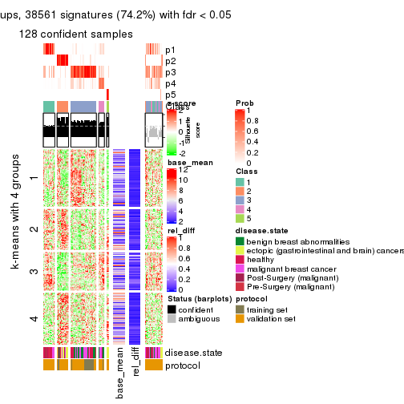</p>

</div>
<div id='tab-SD-mclust-get-signatures-5'>
<pre><code class="r">get_signatures(res, k = 6)
</code></pre>

<p></p>

</div>
</div>


Signature heatmaps where rows are not scaled:


<script>
$( function() {
	$( '#tabs-SD-mclust-get-signatures-no-scale' ).tabs();
} );
</script>
<div id='tabs-SD-mclust-get-signatures-no-scale'>
<ul>
<li><a href='#tab-SD-mclust-get-signatures-no-scale-1'>k = 2</a></li>
<li><a href='#tab-SD-mclust-get-signatures-no-scale-2'>k = 3</a></li>
<li><a href='#tab-SD-mclust-get-signatures-no-scale-3'>k = 4</a></li>
<li><a href='#tab-SD-mclust-get-signatures-no-scale-4'>k = 5</a></li>
<li><a href='#tab-SD-mclust-get-signatures-no-scale-5'>k = 6</a></li>
</ul>
<div id='tab-SD-mclust-get-signatures-no-scale-1'>
<pre><code class="r">get_signatures(res, k = 2, scale_rows = FALSE)
</code></pre>

<p></p>

</div>
<div id='tab-SD-mclust-get-signatures-no-scale-2'>
<pre><code class="r">get_signatures(res, k = 3, scale_rows = FALSE)
</code></pre>

<p></p>

</div>
<div id='tab-SD-mclust-get-signatures-no-scale-3'>
<pre><code class="r">get_signatures(res, k = 4, scale_rows = FALSE)
</code></pre>

<p></p>

</div>
<div id='tab-SD-mclust-get-signatures-no-scale-4'>
<pre><code class="r">get_signatures(res, k = 5, scale_rows = FALSE)
</code></pre>

<p></p>

</div>
<div id='tab-SD-mclust-get-signatures-no-scale-5'>
<pre><code class="r">get_signatures(res, k = 6, scale_rows = FALSE)
</code></pre>

<p></p>

</div>
</div>


Compare the overlap of signatures from different k:

```r
compare_signatures(res)
```


`get_signature()` returns a data frame invisibly. TO get the list of signatures, the function
call should be assigned to a variable explicitly. In following code, if `plot` argument is set
to `FALSE`, no heatmap is plotted while only the differential analysis is performed.

```r
# code only for demonstration
tb = get_signature(res, k = ..., plot = FALSE)
```

An example of the output of `tb` is:

```
#>   which_row         fdr    mean_1    mean_2 scaled_mean_1 scaled_mean_2 km
#> 1        38 0.042760348  8.373488  9.131774    -0.5533452     0.5164555  1
#> 2        40 0.018707592  7.106213  8.469186    -0.6173731     0.5762149  1
#> 3        55 0.019134737 10.221463 11.207825    -0.6159697     0.5749050  1
#> 4        59 0.006059896  5.921854  7.869574    -0.6899429     0.6439467  1
#> 5        60 0.018055526  8.928898 10.211722    -0.6204761     0.5791110  1
#> 6        98 0.009384629 15.714769 14.887706     0.6635654    -0.6193277  2
...
```

The columns in `tb` are:

1. `which_row`: row indices corresponding to the input matrix.
2. `fdr`: FDR for the differential test. 
3. `mean_x`: The mean value in group x.
4. `scaled_mean_x`: The mean value in group x after rows are scaled.
5. `km`: Row groups if k-means clustering is applied to rows.


UMAP plot which shows how samples are separated.


<script>
$( function() {
	$( '#tabs-SD-mclust-dimension-reduction' ).tabs();
} );
</script>
<div id='tabs-SD-mclust-dimension-reduction'>
<ul>
<li><a href='#tab-SD-mclust-dimension-reduction-1'>k = 2</a></li>
<li><a href='#tab-SD-mclust-dimension-reduction-2'>k = 3</a></li>
<li><a href='#tab-SD-mclust-dimension-reduction-3'>k = 4</a></li>
<li><a href='#tab-SD-mclust-dimension-reduction-4'>k = 5</a></li>
<li><a href='#tab-SD-mclust-dimension-reduction-5'>k = 6</a></li>
</ul>
<div id='tab-SD-mclust-dimension-reduction-1'>
<pre><code class="r">dimension_reduction(res, k = 2, method = &quot;UMAP&quot;)
</code></pre>

<p></p>

</div>
<div id='tab-SD-mclust-dimension-reduction-2'>
<pre><code class="r">dimension_reduction(res, k = 3, method = &quot;UMAP&quot;)
</code></pre>

<p></p>

</div>
<div id='tab-SD-mclust-dimension-reduction-3'>
<pre><code class="r">dimension_reduction(res, k = 4, method = &quot;UMAP&quot;)
</code></pre>

<p></p>

</div>
<div id='tab-SD-mclust-dimension-reduction-4'>
<pre><code class="r">dimension_reduction(res, k = 5, method = &quot;UMAP&quot;)
</code></pre>

<p>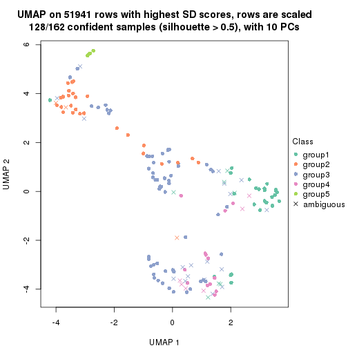</p>

</div>
<div id='tab-SD-mclust-dimension-reduction-5'>
<pre><code class="r">dimension_reduction(res, k = 6, method = &quot;UMAP&quot;)
</code></pre>

<p></p>

</div>
</div>


Following heatmap shows how subgroups are split when increasing `k`:

```r
collect_classes(res)
```


Test correlation between subgroups and known annotations. If the known
annotation is numeric, one-way ANOVA test is applied, and if the known
annotation is discrete, chi-squared contingency table test is applied.

```r
test_to_known_factors(res)
```

```
#>             n disease.state(p) protocol(p) k
#> SD:mclust 159         4.70e-06    5.48e-01 2
#> SD:mclust 139         1.54e-06    2.47e-06 3
#> SD:mclust 142         2.30e-13    1.86e-06 4
#> SD:mclust 128         3.60e-14    1.19e-04 5
#> SD:mclust 104         8.24e-10    6.49e-07 6
```


If matrix rows can be associated to genes, consider to use `GO_Enrichment(res,
...)` to perform function enrichment for the signature genes.


 

---------------------------------------------------


### SD:NMF


The object with results only for a single top-value method and a single partition method 
can be extracted as:

```r
res = res_list["SD", "NMF"]
# you can also extract it by
# res = res_list["SD:NMF"]
```

A summary of `res` and all the functions that can be applied to it:

```r
res
```

```
#> A 'ConsensusPartition' object with k = 2, 3, 4, 5, 6.
#>   On a matrix with 51941 rows and 162 columns.
#>   Top rows (1000, 2000, 3000, 4000, 5000) are extracted by 'SD' method.
#>   Subgroups are detected by 'NMF' method.
#>   Performed in total 1250 partitions by row resampling.
#>   Best k for subgroups seems to be 3.
#> 
#> Following methods can be applied to this 'ConsensusPartition' object:
#>  [1] "cola_report"             "collect_classes"         "collect_plots"          
#>  [4] "collect_stats"           "colnames"                "compare_signatures"     
#>  [7] "consensus_heatmap"       "dimension_reduction"     "functional_enrichment"  
#> [10] "get_anno_col"            "get_anno"                "get_classes"            
#> [13] "get_consensus"           "get_matrix"              "get_membership"         
#> [16] "get_param"               "get_signatures"          "get_stats"              
#> [19] "is_best_k"               "is_stable_k"             "membership_heatmap"     
#> [22] "ncol"                    "nrow"                    "plot_ecdf"              
#> [25] "rownames"                "select_partition_number" "show"                   
#> [28] "suggest_best_k"          "test_to_known_factors"
```

`collect_plots()` function collects all the plots made from `res` for all `k` (number of partitions)
into one single page to provide an easy and fast comparison between different `k`.

```r
collect_plots(res)
```


The plots are:

- The first row: a plot of the ECDF (Empirical cumulative distribution
  function) curves of the consensus matrix for each `k` and the heatmap of
  predicted classes for each `k`.
- The second row: heatmaps of the consensus matrix for each `k`.
- The third row: heatmaps of the membership matrix for each `k`.
- The fouth row: heatmaps of the signatures for each `k`.

All the plots in panels can be made by individual functions and they are
plotted later in this section.

`select_partition_number()` produces several plots showing different
statistics for choosing "optimized" `k`. There are following statistics:

- ECDF curves of the consensus matrix for each `k`;
- 1-PAC. [The PAC
  score](https://en.wikipedia.org/wiki/Consensus_clustering#Over-interpretation_potential_of_consensus_clustering)
  measures the proportion of the ambiguous subgrouping.
- Mean silhouette score.
- Concordance. The mean probability of fiting the consensus class ids in all
  partitions.
- Area increased. Denote $A_k$ as the area under the ECDF curve for current
  `k`, the area increased is defined as $A_k - A_{k-1}$.
- Rand index. The percent of pairs of samples that are both in a same cluster
  or both are not in a same cluster in the partition of k and k-1.
- Jaccard index. The ratio of pairs of samples are both in a same cluster in
  the partition of k and k-1 and the pairs of samples are both in a same
  cluster in the partition k or k-1.

The detailed explanations of these statistics can be found in [the cola
vignette](http://bioconductor.org/packages/devel/bioc/vignettes/cola/inst/doc/cola.html#toc_13).

Generally speaking, lower PAC score, higher mean silhouette score or higher
concordance corresponds to better partition. Rand index and Jaccard index
measure how similar the current partition is compared to partition with `k-1`.
If they are too similar, we won't accept `k` is better than `k-1`.

```r
select_partition_number(res)
```


The numeric values for all these statistics can be obtained by `get_stats()`.

```r
get_stats(res)
```

```
#>   k 1-PAC mean_silhouette concordance area_increased  Rand Jaccard
#> 2 2 0.736           0.849       0.941         0.4175 0.591   0.591
#> 3 3 0.592           0.757       0.879         0.5543 0.679   0.491
#> 4 4 0.630           0.718       0.848         0.1357 0.742   0.408
#> 5 5 0.579           0.429       0.634         0.0745 0.837   0.484
#> 6 6 0.600           0.419       0.684         0.0329 0.862   0.474
```

`suggest_best_k()` suggests the best $k$ based on these statistics. The rules are as follows:

- All $k$ with Jaccard index larger than 0.95 are removed because the increase of
  the partition number does not provides enough extra information. If all $k$ are removed,
  the best $k$ is assigned by `NA`.
- For $k$ with 1-PAC larger than 0.9, the maximal $k$ is taken as the "best k". Other $k$ is called "optional k".
- If it does not fit the second rule. The $k$ with the highest vote of highest
  1-PAC, mean silhouette and concordance is taken as the "best k".

```r
suggest_best_k(res)
```

```
#> [1] 3
```


Following shows the table of the partitions (You need to click the **show/hide
code output** link to see it). The membership matrix (columns with name `p*`)
is inferred by
[`clue::cl_consensus()`](https://www.rdocumentation.org/link/cl_consensus?package=clue)
function with the `SE` method. Basically the value in the membership matrix
represents the probability to belong to a certain group. The finall class
label for an item is determined with the group with highest probability it
belongs to.

In `get_classes()` function, the entropy is calculated from the membership
matrix and the silhouette score is calculated from the consensus matrix.


<script>
$( function() {
	$( '#tabs-SD-NMF-get-classes' ).tabs();
} );
</script>
<div id='tabs-SD-NMF-get-classes'>
<ul>
<li><a href='#tab-SD-NMF-get-classes-1'>k = 2</a></li>
<li><a href='#tab-SD-NMF-get-classes-2'>k = 3</a></li>
<li><a href='#tab-SD-NMF-get-classes-3'>k = 4</a></li>
<li><a href='#tab-SD-NMF-get-classes-4'>k = 5</a></li>
<li><a href='#tab-SD-NMF-get-classes-5'>k = 6</a></li>
</ul>

<div id='tab-SD-NMF-get-classes-1'>
<p><a id='tab-SD-NMF-get-classes-1-a' style='color:#0366d6' href='#'>show/hide code output</a></p>
<pre><code class="r">cbind(get_classes(res, k = 2), get_membership(res, k = 2))
</code></pre>

<pre><code>#&gt;           class entropy silhouette    p1    p2
#&gt; GSM682002     1  0.0000      0.944 1.000 0.000
#&gt; GSM682003     2  0.0000      0.901 0.000 1.000
#&gt; GSM682004     2  0.0000      0.901 0.000 1.000
#&gt; GSM682005     1  0.0000      0.944 1.000 0.000
#&gt; GSM682006     1  0.0000      0.944 1.000 0.000
#&gt; GSM682007     1  0.0000      0.944 1.000 0.000
#&gt; GSM682008     1  0.0376      0.940 0.996 0.004
#&gt; GSM682009     2  0.0000      0.901 0.000 1.000
#&gt; GSM682010     1  0.0000      0.944 1.000 0.000
#&gt; GSM682011     1  0.0376      0.940 0.996 0.004
#&gt; GSM682096     2  0.9833      0.276 0.424 0.576
#&gt; GSM682097     1  0.5294      0.818 0.880 0.120
#&gt; GSM682098     2  0.0000      0.901 0.000 1.000
#&gt; GSM682099     1  0.7745      0.672 0.772 0.228
#&gt; GSM682100     2  0.0000      0.901 0.000 1.000
#&gt; GSM682101     2  0.5178      0.817 0.116 0.884
#&gt; GSM682102     1  0.0000      0.944 1.000 0.000
#&gt; GSM682103     1  0.0000      0.944 1.000 0.000
#&gt; GSM682104     1  0.0376      0.940 0.996 0.004
#&gt; GSM682105     1  0.0000      0.944 1.000 0.000
#&gt; GSM682106     1  0.0000      0.944 1.000 0.000
#&gt; GSM682107     1  0.0000      0.944 1.000 0.000
#&gt; GSM682108     1  0.0000      0.944 1.000 0.000
#&gt; GSM682109     1  0.0000      0.944 1.000 0.000
#&gt; GSM682110     1  0.0000      0.944 1.000 0.000
#&gt; GSM682111     1  0.5294      0.817 0.880 0.120
#&gt; GSM682112     1  0.9881      0.141 0.564 0.436
#&gt; GSM682113     1  0.0000      0.944 1.000 0.000
#&gt; GSM682114     1  0.0000      0.944 1.000 0.000
#&gt; GSM682115     1  0.0000      0.944 1.000 0.000
#&gt; GSM682116     1  0.0000      0.944 1.000 0.000
#&gt; GSM682117     1  0.0000      0.944 1.000 0.000
#&gt; GSM682118     1  0.0000      0.944 1.000 0.000
#&gt; GSM682119     1  0.0000      0.944 1.000 0.000
#&gt; GSM682120     1  0.0000      0.944 1.000 0.000
#&gt; GSM682121     1  0.0000      0.944 1.000 0.000
#&gt; GSM682122     1  0.0000      0.944 1.000 0.000
#&gt; GSM682012     2  0.0000      0.901 0.000 1.000
#&gt; GSM682013     2  0.0000      0.901 0.000 1.000
#&gt; GSM682014     2  0.0000      0.901 0.000 1.000
#&gt; GSM682015     2  0.0000      0.901 0.000 1.000
#&gt; GSM682016     2  0.0000      0.901 0.000 1.000
#&gt; GSM682017     2  0.0000      0.901 0.000 1.000
#&gt; GSM682018     2  0.0000      0.901 0.000 1.000
#&gt; GSM682019     2  0.0000      0.901 0.000 1.000
#&gt; GSM682020     2  0.0000      0.901 0.000 1.000
#&gt; GSM682021     2  0.7139      0.729 0.196 0.804
#&gt; GSM682022     2  0.0000      0.901 0.000 1.000
#&gt; GSM682023     2  0.0000      0.901 0.000 1.000
#&gt; GSM682024     1  0.9686      0.318 0.604 0.396
#&gt; GSM682025     2  0.0000      0.901 0.000 1.000
#&gt; GSM682026     2  0.0000      0.901 0.000 1.000
#&gt; GSM682027     2  0.9909      0.216 0.444 0.556
#&gt; GSM682028     2  0.8861      0.557 0.304 0.696
#&gt; GSM682029     1  0.9491      0.392 0.632 0.368
#&gt; GSM682030     1  0.8207      0.626 0.744 0.256
#&gt; GSM682031     1  0.9170      0.476 0.668 0.332
#&gt; GSM682032     1  0.9000      0.511 0.684 0.316
#&gt; GSM682033     2  0.0000      0.901 0.000 1.000
#&gt; GSM681992     1  0.9552      0.372 0.624 0.376
#&gt; GSM681993     1  0.9775      0.222 0.588 0.412
#&gt; GSM681994     1  0.0000      0.944 1.000 0.000
#&gt; GSM681995     1  0.0000      0.944 1.000 0.000
#&gt; GSM681996     1  0.0000      0.944 1.000 0.000
#&gt; GSM681997     1  0.0000      0.944 1.000 0.000
#&gt; GSM681998     1  0.0000      0.944 1.000 0.000
#&gt; GSM681999     1  0.0000      0.944 1.000 0.000
#&gt; GSM682000     1  0.0000      0.944 1.000 0.000
#&gt; GSM682001     1  0.0376      0.940 0.996 0.004
#&gt; GSM682055     2  0.0000      0.901 0.000 1.000
#&gt; GSM682056     2  0.9170      0.535 0.332 0.668
#&gt; GSM682057     2  0.0000      0.901 0.000 1.000
#&gt; GSM682058     1  0.0000      0.944 1.000 0.000
#&gt; GSM682059     2  0.0000      0.901 0.000 1.000
#&gt; GSM682060     1  0.1633      0.923 0.976 0.024
#&gt; GSM682061     2  0.9323      0.502 0.348 0.652
#&gt; GSM682062     2  0.0000      0.901 0.000 1.000
#&gt; GSM682063     2  0.0000      0.901 0.000 1.000
#&gt; GSM682064     1  0.7453      0.697 0.788 0.212
#&gt; GSM682065     1  0.0000      0.944 1.000 0.000
#&gt; GSM682066     1  0.0000      0.944 1.000 0.000
#&gt; GSM682067     1  0.0000      0.944 1.000 0.000
#&gt; GSM682068     1  0.0000      0.944 1.000 0.000
#&gt; GSM682069     1  0.0000      0.944 1.000 0.000
#&gt; GSM682070     1  0.0000      0.944 1.000 0.000
#&gt; GSM682071     2  0.4562      0.834 0.096 0.904
#&gt; GSM682072     1  0.0000      0.944 1.000 0.000
#&gt; GSM682073     1  0.0000      0.944 1.000 0.000
#&gt; GSM682074     1  0.0000      0.944 1.000 0.000
#&gt; GSM682075     1  0.0000      0.944 1.000 0.000
#&gt; GSM682076     1  0.0000      0.944 1.000 0.000
#&gt; GSM682077     1  0.0000      0.944 1.000 0.000
#&gt; GSM682078     1  0.0000      0.944 1.000 0.000
#&gt; GSM682079     1  0.0000      0.944 1.000 0.000
#&gt; GSM682080     2  0.8861      0.583 0.304 0.696
#&gt; GSM682081     1  0.9993     -0.043 0.516 0.484
#&gt; GSM682082     1  0.0000      0.944 1.000 0.000
#&gt; GSM682083     1  0.0000      0.944 1.000 0.000
#&gt; GSM682084     1  0.0000      0.944 1.000 0.000
#&gt; GSM682085     1  0.0000      0.944 1.000 0.000
#&gt; GSM682086     1  0.0000      0.944 1.000 0.000
#&gt; GSM682087     1  0.0000      0.944 1.000 0.000
#&gt; GSM682088     1  0.0000      0.944 1.000 0.000
#&gt; GSM682089     1  0.0000      0.944 1.000 0.000
#&gt; GSM682090     1  0.0000      0.944 1.000 0.000
#&gt; GSM682091     1  0.0000      0.944 1.000 0.000
#&gt; GSM682092     1  0.0000      0.944 1.000 0.000
#&gt; GSM682093     1  0.0000      0.944 1.000 0.000
#&gt; GSM682094     1  0.0000      0.944 1.000 0.000
#&gt; GSM682095     2  0.0000      0.901 0.000 1.000
#&gt; GSM681982     2  0.9552      0.442 0.376 0.624
#&gt; GSM681983     1  0.0000      0.944 1.000 0.000
#&gt; GSM681984     2  0.7219      0.735 0.200 0.800
#&gt; GSM681985     1  0.0000      0.944 1.000 0.000
#&gt; GSM681986     1  0.9491      0.392 0.632 0.368
#&gt; GSM681987     2  0.0000      0.901 0.000 1.000
#&gt; GSM681988     2  0.8499      0.627 0.276 0.724
#&gt; GSM681989     2  0.4815      0.828 0.104 0.896
#&gt; GSM681990     1  0.0000      0.944 1.000 0.000
#&gt; GSM681991     2  0.0000      0.901 0.000 1.000
#&gt; GSM682034     1  0.0000      0.944 1.000 0.000
#&gt; GSM682035     1  0.0000      0.944 1.000 0.000
#&gt; GSM682036     1  0.0000      0.944 1.000 0.000
#&gt; GSM682037     1  0.0000      0.944 1.000 0.000
#&gt; GSM682038     2  0.0000      0.901 0.000 1.000
#&gt; GSM682039     1  0.0000      0.944 1.000 0.000
#&gt; GSM682040     2  0.9996      0.121 0.488 0.512
#&gt; GSM682041     1  0.0000      0.944 1.000 0.000
#&gt; GSM682042     1  0.9358      0.393 0.648 0.352
#&gt; GSM682043     1  0.0000      0.944 1.000 0.000
#&gt; GSM682044     1  0.0000      0.944 1.000 0.000
#&gt; GSM682045     1  0.0000      0.944 1.000 0.000
#&gt; GSM682046     1  0.0000      0.944 1.000 0.000
#&gt; GSM682047     1  0.0000      0.944 1.000 0.000
#&gt; GSM682048     1  0.0000      0.944 1.000 0.000
#&gt; GSM682049     1  0.0000      0.944 1.000 0.000
#&gt; GSM682050     1  0.0000      0.944 1.000 0.000
#&gt; GSM682051     1  0.0000      0.944 1.000 0.000
#&gt; GSM682052     1  0.9686      0.271 0.604 0.396
#&gt; GSM682053     1  0.0000      0.944 1.000 0.000
#&gt; GSM682054     1  0.0000      0.944 1.000 0.000
#&gt; GSM682123     1  0.0000      0.944 1.000 0.000
#&gt; GSM682124     1  0.0000      0.944 1.000 0.000
#&gt; GSM682125     1  0.0000      0.944 1.000 0.000
#&gt; GSM682126     1  0.0000      0.944 1.000 0.000
#&gt; GSM682127     1  0.0000      0.944 1.000 0.000
#&gt; GSM682128     1  0.0000      0.944 1.000 0.000
#&gt; GSM682129     2  0.0000      0.901 0.000 1.000
#&gt; GSM682130     2  0.0000      0.901 0.000 1.000
#&gt; GSM682131     2  0.0000      0.901 0.000 1.000
#&gt; GSM682132     1  0.0000      0.944 1.000 0.000
#&gt; GSM682133     1  0.0000      0.944 1.000 0.000
#&gt; GSM682134     1  0.0000      0.944 1.000 0.000
#&gt; GSM682135     1  0.5842      0.795 0.860 0.140
#&gt; GSM682136     1  0.0000      0.944 1.000 0.000
#&gt; GSM682137     1  0.0000      0.944 1.000 0.000
#&gt; GSM682138     1  0.0000      0.944 1.000 0.000
#&gt; GSM682139     1  0.7950      0.653 0.760 0.240
#&gt; GSM682140     1  0.0000      0.944 1.000 0.000
#&gt; GSM682141     1  0.0000      0.944 1.000 0.000
#&gt; GSM682142     1  0.0000      0.944 1.000 0.000
#&gt; GSM682143     2  0.0000      0.901 0.000 1.000
</code></pre>

<script>
$('#tab-SD-NMF-get-classes-1-a').parent().next().next().hide();
$('#tab-SD-NMF-get-classes-1-a').click(function(){
  $('#tab-SD-NMF-get-classes-1-a').parent().next().next().toggle();
  return(false);
});
</script>
</div>

<div id='tab-SD-NMF-get-classes-2'>
<p><a id='tab-SD-NMF-get-classes-2-a' style='color:#0366d6' href='#'>show/hide code output</a></p>
<pre><code class="r">cbind(get_classes(res, k = 3), get_membership(res, k = 3))
</code></pre>

<pre><code>#&gt;           class entropy silhouette    p1    p2    p3
#&gt; GSM682002     1  0.2448     0.8312 0.924 0.000 0.076
#&gt; GSM682003     2  0.0747     0.9203 0.000 0.984 0.016
#&gt; GSM682004     2  0.0424     0.9240 0.000 0.992 0.008
#&gt; GSM682005     1  0.0424     0.8415 0.992 0.000 0.008
#&gt; GSM682006     1  0.0592     0.8425 0.988 0.000 0.012
#&gt; GSM682007     3  0.6168     0.3981 0.412 0.000 0.588
#&gt; GSM682008     1  0.3551     0.7587 0.868 0.000 0.132
#&gt; GSM682009     2  0.1832     0.8966 0.036 0.956 0.008
#&gt; GSM682010     3  0.3412     0.7988 0.124 0.000 0.876
#&gt; GSM682011     1  0.1267     0.8441 0.972 0.004 0.024
#&gt; GSM682096     1  0.4654     0.6397 0.792 0.208 0.000
#&gt; GSM682097     3  0.6349     0.7276 0.092 0.140 0.768
#&gt; GSM682098     2  0.2165     0.8841 0.064 0.936 0.000
#&gt; GSM682099     1  0.0747     0.8373 0.984 0.016 0.000
#&gt; GSM682100     2  0.0000     0.9265 0.000 1.000 0.000
#&gt; GSM682101     2  0.1753     0.8981 0.048 0.952 0.000
#&gt; GSM682102     1  0.5497     0.6591 0.708 0.000 0.292
#&gt; GSM682103     3  0.1031     0.8436 0.024 0.000 0.976
#&gt; GSM682104     3  0.4750     0.7236 0.216 0.000 0.784
#&gt; GSM682105     1  0.2878     0.8243 0.904 0.000 0.096
#&gt; GSM682106     1  0.6008     0.2611 0.628 0.000 0.372
#&gt; GSM682107     1  0.1289     0.8428 0.968 0.000 0.032
#&gt; GSM682108     3  0.4555     0.7538 0.200 0.000 0.800
#&gt; GSM682109     3  0.5138     0.6852 0.252 0.000 0.748
#&gt; GSM682110     1  0.0592     0.8416 0.988 0.000 0.012
#&gt; GSM682111     3  0.3771     0.8026 0.112 0.012 0.876
#&gt; GSM682112     3  0.0747     0.8394 0.000 0.016 0.984
#&gt; GSM682113     1  0.6026     0.5386 0.624 0.000 0.376
#&gt; GSM682114     3  0.1643     0.8398 0.044 0.000 0.956
#&gt; GSM682115     3  0.2796     0.8155 0.092 0.000 0.908
#&gt; GSM682116     3  0.6079     0.3837 0.388 0.000 0.612
#&gt; GSM682117     1  0.3551     0.8019 0.868 0.000 0.132
#&gt; GSM682118     3  0.3879     0.7928 0.152 0.000 0.848
#&gt; GSM682119     3  0.2066     0.8388 0.060 0.000 0.940
#&gt; GSM682120     3  0.3816     0.8003 0.148 0.000 0.852
#&gt; GSM682121     1  0.2448     0.8156 0.924 0.000 0.076
#&gt; GSM682122     3  0.4504     0.7436 0.196 0.000 0.804
#&gt; GSM682012     2  0.0000     0.9265 0.000 1.000 0.000
#&gt; GSM682013     2  0.0000     0.9265 0.000 1.000 0.000
#&gt; GSM682014     2  0.0000     0.9265 0.000 1.000 0.000
#&gt; GSM682015     2  0.0000     0.9265 0.000 1.000 0.000
#&gt; GSM682016     2  0.0237     0.9252 0.004 0.996 0.000
#&gt; GSM682017     2  0.0000     0.9265 0.000 1.000 0.000
#&gt; GSM682018     2  0.1267     0.9094 0.004 0.972 0.024
#&gt; GSM682019     2  0.0237     0.9252 0.004 0.996 0.000
#&gt; GSM682020     2  0.0000     0.9265 0.000 1.000 0.000
#&gt; GSM682021     2  0.6823     0.6915 0.152 0.740 0.108
#&gt; GSM682022     2  0.0000     0.9265 0.000 1.000 0.000
#&gt; GSM682023     2  0.0000     0.9265 0.000 1.000 0.000
#&gt; GSM682024     2  0.8228     0.1536 0.076 0.512 0.412
#&gt; GSM682025     2  0.0892     0.9170 0.020 0.980 0.000
#&gt; GSM682026     2  0.0000     0.9265 0.000 1.000 0.000
#&gt; GSM682027     1  0.1411     0.8269 0.964 0.036 0.000
#&gt; GSM682028     1  0.1411     0.8269 0.964 0.036 0.000
#&gt; GSM682029     1  0.0592     0.8389 0.988 0.012 0.000
#&gt; GSM682030     1  0.0592     0.8389 0.988 0.012 0.000
#&gt; GSM682031     1  0.0592     0.8389 0.988 0.012 0.000
#&gt; GSM682032     1  0.0592     0.8389 0.988 0.012 0.000
#&gt; GSM682033     2  0.0424     0.9236 0.008 0.992 0.000
#&gt; GSM681992     1  0.4586     0.8171 0.856 0.048 0.096
#&gt; GSM681993     3  0.4842     0.6797 0.000 0.224 0.776
#&gt; GSM681994     1  0.0892     0.8437 0.980 0.000 0.020
#&gt; GSM681995     1  0.0424     0.8415 0.992 0.000 0.008
#&gt; GSM681996     1  0.1031     0.8386 0.976 0.000 0.024
#&gt; GSM681997     1  0.0424     0.8415 0.992 0.000 0.008
#&gt; GSM681998     1  0.0424     0.8415 0.992 0.000 0.008
#&gt; GSM681999     1  0.0424     0.8415 0.992 0.000 0.008
#&gt; GSM682000     1  0.0424     0.8415 0.992 0.000 0.008
#&gt; GSM682001     1  0.1399     0.8439 0.968 0.004 0.028
#&gt; GSM682055     2  0.1031     0.9152 0.000 0.976 0.024
#&gt; GSM682056     2  0.6521    -0.0453 0.004 0.504 0.492
#&gt; GSM682057     2  0.0000     0.9265 0.000 1.000 0.000
#&gt; GSM682058     1  0.0237     0.8410 0.996 0.004 0.000
#&gt; GSM682059     2  0.0000     0.9265 0.000 1.000 0.000
#&gt; GSM682060     3  0.7742     0.4671 0.288 0.080 0.632
#&gt; GSM682061     3  0.6307     0.0754 0.000 0.488 0.512
#&gt; GSM682062     2  0.0000     0.9265 0.000 1.000 0.000
#&gt; GSM682063     2  0.0000     0.9265 0.000 1.000 0.000
#&gt; GSM682064     1  0.8128     0.3179 0.492 0.068 0.440
#&gt; GSM682065     3  0.1529     0.8371 0.040 0.000 0.960
#&gt; GSM682066     1  0.4605     0.7527 0.796 0.000 0.204
#&gt; GSM682067     3  0.0000     0.8418 0.000 0.000 1.000
#&gt; GSM682068     1  0.0424     0.8436 0.992 0.000 0.008
#&gt; GSM682069     3  0.0424     0.8416 0.008 0.000 0.992
#&gt; GSM682070     3  0.1031     0.8412 0.024 0.000 0.976
#&gt; GSM682071     2  0.3267     0.8258 0.000 0.884 0.116
#&gt; GSM682072     3  0.3412     0.7988 0.124 0.000 0.876
#&gt; GSM682073     3  0.6305     0.1967 0.484 0.000 0.516
#&gt; GSM682074     3  0.0424     0.8416 0.008 0.000 0.992
#&gt; GSM682075     1  0.0747     0.8440 0.984 0.000 0.016
#&gt; GSM682076     3  0.4654     0.7455 0.208 0.000 0.792
#&gt; GSM682077     3  0.0424     0.8416 0.008 0.000 0.992
#&gt; GSM682078     3  0.2066     0.8377 0.060 0.000 0.940
#&gt; GSM682079     3  0.2261     0.8359 0.068 0.000 0.932
#&gt; GSM682080     3  0.6244     0.2338 0.000 0.440 0.560
#&gt; GSM682081     3  0.8392     0.5286 0.148 0.236 0.616
#&gt; GSM682082     3  0.5560     0.6222 0.300 0.000 0.700
#&gt; GSM682083     3  0.5905     0.3523 0.352 0.000 0.648
#&gt; GSM682084     3  0.0892     0.8434 0.020 0.000 0.980
#&gt; GSM682085     3  0.3412     0.7988 0.124 0.000 0.876
#&gt; GSM682086     1  0.2711     0.8264 0.912 0.000 0.088
#&gt; GSM682087     3  0.5327     0.6718 0.272 0.000 0.728
#&gt; GSM682088     3  0.0892     0.8420 0.020 0.000 0.980
#&gt; GSM682089     3  0.0237     0.8419 0.004 0.000 0.996
#&gt; GSM682090     3  0.2165     0.8365 0.064 0.000 0.936
#&gt; GSM682091     3  0.2537     0.8144 0.080 0.000 0.920
#&gt; GSM682092     3  0.3340     0.7822 0.120 0.000 0.880
#&gt; GSM682093     3  0.0237     0.8424 0.004 0.000 0.996
#&gt; GSM682094     1  0.4291     0.7685 0.820 0.000 0.180
#&gt; GSM682095     2  0.0237     0.9254 0.000 0.996 0.004
#&gt; GSM681982     3  0.5363     0.6000 0.000 0.276 0.724
#&gt; GSM681983     1  0.4702     0.7426 0.788 0.000 0.212
#&gt; GSM681984     3  0.6282     0.3599 0.004 0.384 0.612
#&gt; GSM681985     3  0.0000     0.8418 0.000 0.000 1.000
#&gt; GSM681986     1  0.6349     0.7612 0.764 0.080 0.156
#&gt; GSM681987     2  0.0747     0.9203 0.000 0.984 0.016
#&gt; GSM681988     2  0.7534     0.1366 0.040 0.532 0.428
#&gt; GSM681989     2  0.6633     0.2277 0.444 0.548 0.008
#&gt; GSM681990     3  0.4002     0.7881 0.160 0.000 0.840
#&gt; GSM681991     2  0.0000     0.9265 0.000 1.000 0.000
#&gt; GSM682034     3  0.1289     0.8393 0.032 0.000 0.968
#&gt; GSM682035     3  0.1031     0.8409 0.024 0.000 0.976
#&gt; GSM682036     3  0.1031     0.8436 0.024 0.000 0.976
#&gt; GSM682037     3  0.5621     0.4556 0.308 0.000 0.692
#&gt; GSM682038     2  0.0892     0.9194 0.000 0.980 0.020
#&gt; GSM682039     3  0.0747     0.8424 0.016 0.000 0.984
#&gt; GSM682040     3  0.3340     0.7821 0.000 0.120 0.880
#&gt; GSM682041     3  0.0747     0.8419 0.016 0.000 0.984
#&gt; GSM682042     3  0.1289     0.8336 0.000 0.032 0.968
#&gt; GSM682043     1  0.5327     0.6874 0.728 0.000 0.272
#&gt; GSM682044     3  0.2537     0.8168 0.080 0.000 0.920
#&gt; GSM682045     3  0.1753     0.8340 0.048 0.000 0.952
#&gt; GSM682046     1  0.5016     0.7198 0.760 0.000 0.240
#&gt; GSM682047     3  0.2165     0.8351 0.064 0.000 0.936
#&gt; GSM682048     3  0.0892     0.8420 0.020 0.000 0.980
#&gt; GSM682049     3  0.0592     0.8419 0.012 0.000 0.988
#&gt; GSM682050     1  0.6235     0.4104 0.564 0.000 0.436
#&gt; GSM682051     3  0.0424     0.8416 0.008 0.000 0.992
#&gt; GSM682052     3  0.1860     0.8249 0.000 0.052 0.948
#&gt; GSM682053     3  0.0000     0.8418 0.000 0.000 1.000
#&gt; GSM682054     1  0.5706     0.6287 0.680 0.000 0.320
#&gt; GSM682123     3  0.0424     0.8416 0.008 0.000 0.992
#&gt; GSM682124     3  0.6045     0.2362 0.380 0.000 0.620
#&gt; GSM682125     3  0.0424     0.8416 0.008 0.000 0.992
#&gt; GSM682126     1  0.6307     0.2586 0.512 0.000 0.488
#&gt; GSM682127     3  0.2537     0.8168 0.080 0.000 0.920
#&gt; GSM682128     1  0.0237     0.8427 0.996 0.000 0.004
#&gt; GSM682129     2  0.0000     0.9265 0.000 1.000 0.000
#&gt; GSM682130     2  0.0000     0.9265 0.000 1.000 0.000
#&gt; GSM682131     2  0.0424     0.9240 0.000 0.992 0.008
#&gt; GSM682132     1  0.0424     0.8434 0.992 0.000 0.008
#&gt; GSM682133     1  0.1643     0.8380 0.956 0.000 0.044
#&gt; GSM682134     3  0.0592     0.8419 0.012 0.000 0.988
#&gt; GSM682135     1  0.6318     0.5738 0.636 0.008 0.356
#&gt; GSM682136     1  0.6062     0.5228 0.616 0.000 0.384
#&gt; GSM682137     1  0.3038     0.8174 0.896 0.000 0.104
#&gt; GSM682138     3  0.0747     0.8419 0.016 0.000 0.984
#&gt; GSM682139     3  0.6319     0.6266 0.040 0.228 0.732
#&gt; GSM682140     3  0.3816     0.8010 0.148 0.000 0.852
#&gt; GSM682141     1  0.6235     0.4102 0.564 0.000 0.436
#&gt; GSM682142     1  0.6260     0.3791 0.552 0.000 0.448
#&gt; GSM682143     2  0.0592     0.9222 0.000 0.988 0.012
</code></pre>

<script>
$('#tab-SD-NMF-get-classes-2-a').parent().next().next().hide();
$('#tab-SD-NMF-get-classes-2-a').click(function(){
  $('#tab-SD-NMF-get-classes-2-a').parent().next().next().toggle();
  return(false);
});
</script>
</div>

<div id='tab-SD-NMF-get-classes-3'>
<p><a id='tab-SD-NMF-get-classes-3-a' style='color:#0366d6' href='#'>show/hide code output</a></p>
<pre><code class="r">cbind(get_classes(res, k = 4), get_membership(res, k = 4))
</code></pre>

<pre><code>#&gt;           class entropy silhouette    p1    p2    p3    p4
#&gt; GSM682002     4  0.5639     0.4851 0.324 0.000 0.040 0.636
#&gt; GSM682003     2  0.4955     0.1446 0.000 0.556 0.444 0.000
#&gt; GSM682004     2  0.0592     0.8841 0.000 0.984 0.016 0.000
#&gt; GSM682005     4  0.2589     0.7796 0.000 0.000 0.116 0.884
#&gt; GSM682006     4  0.2593     0.7859 0.004 0.000 0.104 0.892
#&gt; GSM682007     3  0.4040     0.6133 0.000 0.000 0.752 0.248
#&gt; GSM682008     4  0.4431     0.4792 0.000 0.000 0.304 0.696
#&gt; GSM682009     3  0.5070     0.3056 0.000 0.372 0.620 0.008
#&gt; GSM682010     3  0.1109     0.7559 0.028 0.000 0.968 0.004
#&gt; GSM682011     4  0.3821     0.7586 0.120 0.000 0.040 0.840
#&gt; GSM682096     4  0.5452     0.2732 0.012 0.400 0.004 0.584
#&gt; GSM682097     3  0.5985     0.6879 0.016 0.120 0.724 0.140
#&gt; GSM682098     4  0.5250     0.1143 0.000 0.440 0.008 0.552
#&gt; GSM682099     4  0.0000     0.8024 0.000 0.000 0.000 1.000
#&gt; GSM682100     2  0.0000     0.8883 0.000 1.000 0.000 0.000
#&gt; GSM682101     2  0.1398     0.8691 0.000 0.956 0.004 0.040
#&gt; GSM682102     1  0.1677     0.8552 0.948 0.000 0.040 0.012
#&gt; GSM682103     1  0.4713     0.6193 0.640 0.000 0.360 0.000
#&gt; GSM682104     3  0.3768     0.6947 0.008 0.000 0.808 0.184
#&gt; GSM682105     4  0.5847     0.2931 0.404 0.000 0.036 0.560
#&gt; GSM682106     4  0.4679     0.4355 0.000 0.000 0.352 0.648
#&gt; GSM682107     4  0.3674     0.7681 0.104 0.000 0.044 0.852
#&gt; GSM682108     3  0.6171     0.1989 0.348 0.000 0.588 0.064
#&gt; GSM682109     3  0.3335     0.7241 0.020 0.000 0.860 0.120
#&gt; GSM682110     4  0.2831     0.7767 0.004 0.000 0.120 0.876
#&gt; GSM682111     3  0.0188     0.7614 0.000 0.004 0.996 0.000
#&gt; GSM682112     3  0.1733     0.7638 0.024 0.028 0.948 0.000
#&gt; GSM682113     1  0.1398     0.8566 0.956 0.000 0.040 0.004
#&gt; GSM682114     3  0.0707     0.7589 0.020 0.000 0.980 0.000
#&gt; GSM682115     1  0.2300     0.8535 0.920 0.000 0.064 0.016
#&gt; GSM682116     1  0.4292     0.8114 0.820 0.000 0.080 0.100
#&gt; GSM682117     1  0.6153     0.4157 0.604 0.000 0.068 0.328
#&gt; GSM682118     3  0.5056     0.5275 0.224 0.000 0.732 0.044
#&gt; GSM682119     1  0.4382     0.7195 0.704 0.000 0.296 0.000
#&gt; GSM682120     1  0.4088     0.8383 0.820 0.000 0.140 0.040
#&gt; GSM682121     4  0.1398     0.7961 0.004 0.000 0.040 0.956
#&gt; GSM682122     3  0.3528     0.6765 0.000 0.000 0.808 0.192
#&gt; GSM682012     2  0.0804     0.8838 0.000 0.980 0.012 0.008
#&gt; GSM682013     2  0.0000     0.8883 0.000 1.000 0.000 0.000
#&gt; GSM682014     2  0.0000     0.8883 0.000 1.000 0.000 0.000
#&gt; GSM682015     2  0.0000     0.8883 0.000 1.000 0.000 0.000
#&gt; GSM682016     2  0.6031     0.3007 0.000 0.564 0.048 0.388
#&gt; GSM682017     2  0.0000     0.8883 0.000 1.000 0.000 0.000
#&gt; GSM682018     2  0.1585     0.8637 0.040 0.952 0.004 0.004
#&gt; GSM682019     2  0.1109     0.8801 0.000 0.968 0.004 0.028
#&gt; GSM682020     2  0.0000     0.8883 0.000 1.000 0.000 0.000
#&gt; GSM682021     2  0.4514     0.6901 0.176 0.788 0.004 0.032
#&gt; GSM682022     2  0.0657     0.8849 0.000 0.984 0.004 0.012
#&gt; GSM682023     2  0.0657     0.8849 0.000 0.984 0.004 0.012
#&gt; GSM682024     1  0.4252     0.6187 0.744 0.252 0.004 0.000
#&gt; GSM682025     2  0.1489     0.8689 0.000 0.952 0.004 0.044
#&gt; GSM682026     2  0.0188     0.8881 0.000 0.996 0.000 0.004
#&gt; GSM682027     4  0.1930     0.7971 0.056 0.004 0.004 0.936
#&gt; GSM682028     4  0.0000     0.8024 0.000 0.000 0.000 1.000
#&gt; GSM682029     4  0.0000     0.8024 0.000 0.000 0.000 1.000
#&gt; GSM682030     4  0.0469     0.8045 0.012 0.000 0.000 0.988
#&gt; GSM682031     4  0.0469     0.8045 0.012 0.000 0.000 0.988
#&gt; GSM682032     4  0.0592     0.8046 0.016 0.000 0.000 0.984
#&gt; GSM682033     2  0.1576     0.8684 0.000 0.948 0.004 0.048
#&gt; GSM681992     2  0.9515    -0.0201 0.124 0.376 0.236 0.264
#&gt; GSM681993     3  0.1302     0.7623 0.000 0.044 0.956 0.000
#&gt; GSM681994     4  0.2654     0.7840 0.004 0.000 0.108 0.888
#&gt; GSM681995     4  0.1677     0.8048 0.012 0.000 0.040 0.948
#&gt; GSM681996     4  0.3074     0.7186 0.000 0.000 0.152 0.848
#&gt; GSM681997     4  0.1557     0.7949 0.000 0.000 0.056 0.944
#&gt; GSM681998     4  0.2530     0.7803 0.000 0.000 0.112 0.888
#&gt; GSM681999     4  0.2739     0.8003 0.036 0.000 0.060 0.904
#&gt; GSM682000     4  0.1305     0.8035 0.036 0.000 0.004 0.960
#&gt; GSM682001     4  0.6178     0.5508 0.288 0.012 0.056 0.644
#&gt; GSM682055     3  0.4936     0.4066 0.000 0.372 0.624 0.004
#&gt; GSM682056     3  0.5830     0.6629 0.008 0.172 0.720 0.100
#&gt; GSM682057     2  0.0188     0.8881 0.000 0.996 0.000 0.004
#&gt; GSM682058     4  0.0000     0.8024 0.000 0.000 0.000 1.000
#&gt; GSM682059     2  0.0188     0.8876 0.000 0.996 0.004 0.000
#&gt; GSM682060     1  0.4018     0.7253 0.812 0.168 0.004 0.016
#&gt; GSM682061     3  0.4327     0.6534 0.000 0.216 0.768 0.016
#&gt; GSM682062     2  0.0000     0.8883 0.000 1.000 0.000 0.000
#&gt; GSM682063     2  0.0376     0.8873 0.000 0.992 0.004 0.004
#&gt; GSM682064     1  0.5991     0.7274 0.728 0.136 0.116 0.020
#&gt; GSM682065     1  0.1211     0.8569 0.960 0.000 0.040 0.000
#&gt; GSM682066     1  0.5693     0.6134 0.688 0.000 0.072 0.240
#&gt; GSM682067     1  0.4253     0.8067 0.776 0.016 0.208 0.000
#&gt; GSM682068     4  0.3278     0.7689 0.116 0.000 0.020 0.864
#&gt; GSM682069     1  0.2706     0.8459 0.900 0.020 0.080 0.000
#&gt; GSM682070     1  0.3024     0.8226 0.852 0.000 0.148 0.000
#&gt; GSM682071     3  0.5321     0.6300 0.000 0.228 0.716 0.056
#&gt; GSM682072     3  0.0524     0.7603 0.008 0.000 0.988 0.004
#&gt; GSM682073     3  0.4277     0.5784 0.000 0.000 0.720 0.280
#&gt; GSM682074     1  0.4888     0.3783 0.588 0.000 0.412 0.000
#&gt; GSM682075     4  0.2924     0.7783 0.100 0.000 0.016 0.884
#&gt; GSM682076     4  0.7478     0.1576 0.188 0.000 0.344 0.468
#&gt; GSM682077     1  0.2149     0.8448 0.912 0.000 0.088 0.000
#&gt; GSM682078     1  0.3907     0.7884 0.768 0.000 0.232 0.000
#&gt; GSM682079     1  0.3157     0.8446 0.852 0.000 0.144 0.004
#&gt; GSM682080     3  0.4746     0.6930 0.000 0.168 0.776 0.056
#&gt; GSM682081     3  0.4307     0.6784 0.000 0.024 0.784 0.192
#&gt; GSM682082     3  0.5057     0.5228 0.012 0.000 0.648 0.340
#&gt; GSM682083     1  0.2751     0.8503 0.904 0.000 0.056 0.040
#&gt; GSM682084     3  0.0921     0.7567 0.028 0.000 0.972 0.000
#&gt; GSM682085     3  0.0657     0.7598 0.012 0.000 0.984 0.004
#&gt; GSM682086     1  0.6071     0.4330 0.612 0.000 0.064 0.324
#&gt; GSM682087     4  0.5557     0.4681 0.040 0.000 0.308 0.652
#&gt; GSM682088     1  0.2868     0.8444 0.864 0.000 0.136 0.000
#&gt; GSM682089     3  0.4948     0.1623 0.440 0.000 0.560 0.000
#&gt; GSM682090     3  0.5323     0.3791 0.352 0.000 0.628 0.020
#&gt; GSM682091     1  0.2611     0.8447 0.896 0.008 0.096 0.000
#&gt; GSM682092     1  0.1302     0.8615 0.956 0.000 0.044 0.000
#&gt; GSM682093     1  0.4406     0.7152 0.700 0.000 0.300 0.000
#&gt; GSM682094     1  0.6745     0.5058 0.604 0.000 0.152 0.244
#&gt; GSM682095     2  0.1557     0.8567 0.000 0.944 0.056 0.000
#&gt; GSM681982     3  0.1356     0.7636 0.000 0.032 0.960 0.008
#&gt; GSM681983     1  0.2313     0.8487 0.924 0.000 0.044 0.032
#&gt; GSM681984     3  0.3743     0.6910 0.016 0.160 0.824 0.000
#&gt; GSM681985     3  0.1211     0.7512 0.040 0.000 0.960 0.000
#&gt; GSM681986     3  0.9187     0.0520 0.128 0.352 0.380 0.140
#&gt; GSM681987     2  0.4713     0.3973 0.000 0.640 0.360 0.000
#&gt; GSM681988     3  0.4956     0.6762 0.000 0.056 0.756 0.188
#&gt; GSM681989     4  0.5579     0.5938 0.000 0.060 0.252 0.688
#&gt; GSM681990     3  0.4988     0.5131 0.236 0.000 0.728 0.036
#&gt; GSM681991     2  0.0469     0.8857 0.000 0.988 0.012 0.000
#&gt; GSM682034     1  0.0188     0.8546 0.996 0.000 0.004 0.000
#&gt; GSM682035     1  0.1792     0.8516 0.932 0.000 0.068 0.000
#&gt; GSM682036     1  0.3356     0.8025 0.824 0.000 0.176 0.000
#&gt; GSM682037     1  0.0000     0.8536 1.000 0.000 0.000 0.000
#&gt; GSM682038     2  0.4961     0.2131 0.000 0.552 0.448 0.000
#&gt; GSM682039     1  0.3266     0.8328 0.832 0.000 0.168 0.000
#&gt; GSM682040     3  0.4890     0.6994 0.080 0.144 0.776 0.000
#&gt; GSM682041     1  0.2408     0.8468 0.896 0.000 0.104 0.000
#&gt; GSM682042     3  0.2413     0.7623 0.020 0.064 0.916 0.000
#&gt; GSM682043     1  0.0804     0.8549 0.980 0.000 0.008 0.012
#&gt; GSM682044     1  0.0000     0.8536 1.000 0.000 0.000 0.000
#&gt; GSM682045     1  0.1635     0.8590 0.948 0.008 0.044 0.000
#&gt; GSM682046     1  0.1388     0.8508 0.960 0.000 0.012 0.028
#&gt; GSM682047     1  0.4624     0.6690 0.660 0.000 0.340 0.000
#&gt; GSM682048     1  0.2011     0.8564 0.920 0.000 0.080 0.000
#&gt; GSM682049     1  0.2281     0.8433 0.904 0.000 0.096 0.000
#&gt; GSM682050     1  0.0188     0.8547 0.996 0.000 0.004 0.000
#&gt; GSM682051     1  0.4843     0.3683 0.604 0.000 0.396 0.000
#&gt; GSM682052     3  0.2021     0.7634 0.012 0.056 0.932 0.000
#&gt; GSM682053     1  0.3975     0.7811 0.760 0.000 0.240 0.000
#&gt; GSM682054     1  0.1042     0.8565 0.972 0.000 0.020 0.008
#&gt; GSM682123     1  0.2081     0.8464 0.916 0.000 0.084 0.000
#&gt; GSM682124     1  0.0000     0.8536 1.000 0.000 0.000 0.000
#&gt; GSM682125     1  0.2081     0.8464 0.916 0.000 0.084 0.000
#&gt; GSM682126     1  0.1118     0.8574 0.964 0.000 0.036 0.000
#&gt; GSM682127     1  0.0592     0.8568 0.984 0.000 0.016 0.000
#&gt; GSM682128     4  0.0336     0.8042 0.008 0.000 0.000 0.992
#&gt; GSM682129     2  0.0336     0.8867 0.000 0.992 0.008 0.000
#&gt; GSM682130     2  0.0524     0.8856 0.008 0.988 0.004 0.000
#&gt; GSM682131     2  0.2530     0.8045 0.000 0.888 0.112 0.000
#&gt; GSM682132     4  0.1557     0.7990 0.056 0.000 0.000 0.944
#&gt; GSM682133     1  0.3945     0.7021 0.780 0.000 0.004 0.216
#&gt; GSM682134     1  0.1792     0.8516 0.932 0.000 0.068 0.000
#&gt; GSM682135     1  0.3699     0.8186 0.864 0.080 0.048 0.008
#&gt; GSM682136     1  0.1545     0.8558 0.952 0.000 0.040 0.008
#&gt; GSM682137     4  0.4699     0.5409 0.320 0.000 0.004 0.676
#&gt; GSM682138     1  0.2814     0.8458 0.868 0.000 0.132 0.000
#&gt; GSM682139     1  0.2704     0.7781 0.876 0.124 0.000 0.000
#&gt; GSM682140     1  0.3325     0.8534 0.864 0.000 0.112 0.024
#&gt; GSM682141     1  0.0000     0.8536 1.000 0.000 0.000 0.000
#&gt; GSM682142     1  0.1211     0.8569 0.960 0.000 0.040 0.000
#&gt; GSM682143     2  0.2149     0.8278 0.000 0.912 0.088 0.000
</code></pre>

<script>
$('#tab-SD-NMF-get-classes-3-a').parent().next().next().hide();
$('#tab-SD-NMF-get-classes-3-a').click(function(){
  $('#tab-SD-NMF-get-classes-3-a').parent().next().next().toggle();
  return(false);
});
</script>
</div>

<div id='tab-SD-NMF-get-classes-4'>
<p><a id='tab-SD-NMF-get-classes-4-a' style='color:#0366d6' href='#'>show/hide code output</a></p>
<pre><code class="r">cbind(get_classes(res, k = 5), get_membership(res, k = 5))
</code></pre>

<pre><code>#&gt;           class entropy silhouette    p1    p2    p3    p4    p5
#&gt; GSM682002     3  0.3098    0.58686 0.016 0.000 0.836 0.000 0.148
#&gt; GSM682003     2  0.5954    0.38454 0.000 0.592 0.000 0.216 0.192
#&gt; GSM682004     2  0.1894    0.79529 0.000 0.920 0.000 0.008 0.072
#&gt; GSM682005     3  0.4113    0.53200 0.000 0.000 0.784 0.076 0.140
#&gt; GSM682006     3  0.4126    0.46942 0.000 0.000 0.620 0.000 0.380
#&gt; GSM682007     5  0.5723   -0.23341 0.000 0.000 0.088 0.392 0.520
#&gt; GSM682008     4  0.6696    0.31485 0.000 0.000 0.372 0.388 0.240
#&gt; GSM682009     5  0.0566    0.38139 0.000 0.012 0.004 0.000 0.984
#&gt; GSM682010     5  0.0609    0.36818 0.000 0.000 0.000 0.020 0.980
#&gt; GSM682011     3  0.3932    0.48178 0.000 0.000 0.672 0.000 0.328
#&gt; GSM682096     3  0.4595    0.11753 0.000 0.400 0.588 0.008 0.004
#&gt; GSM682097     4  0.1608    0.51062 0.000 0.000 0.072 0.928 0.000
#&gt; GSM682098     4  0.6369    0.03252 0.000 0.244 0.236 0.520 0.000
#&gt; GSM682099     3  0.4815    0.10133 0.000 0.020 0.524 0.456 0.000
#&gt; GSM682100     2  0.0000    0.84276 0.000 1.000 0.000 0.000 0.000
#&gt; GSM682101     2  0.0510    0.84172 0.000 0.984 0.016 0.000 0.000
#&gt; GSM682102     5  0.6756   -0.06350 0.268 0.000 0.344 0.000 0.388
#&gt; GSM682103     1  0.6482    0.18975 0.440 0.000 0.000 0.372 0.188
#&gt; GSM682104     4  0.5008    0.48269 0.000 0.000 0.056 0.644 0.300
#&gt; GSM682105     3  0.2787    0.59460 0.004 0.000 0.856 0.004 0.136
#&gt; GSM682106     5  0.6586   -0.22640 0.000 0.000 0.292 0.244 0.464
#&gt; GSM682107     3  0.4074    0.45876 0.000 0.000 0.636 0.000 0.364
#&gt; GSM682108     5  0.1965    0.32914 0.000 0.000 0.096 0.000 0.904
#&gt; GSM682109     5  0.4645    0.02466 0.000 0.000 0.044 0.268 0.688
#&gt; GSM682110     3  0.4331    0.44431 0.000 0.000 0.596 0.004 0.400
#&gt; GSM682111     5  0.4256   -0.19451 0.000 0.000 0.000 0.436 0.564
#&gt; GSM682112     5  0.4383   -0.18106 0.004 0.000 0.000 0.424 0.572
#&gt; GSM682113     5  0.6757   -0.03636 0.320 0.000 0.280 0.000 0.400
#&gt; GSM682114     4  0.4283    0.43251 0.008 0.000 0.000 0.644 0.348
#&gt; GSM682115     1  0.0290    0.74563 0.992 0.000 0.000 0.008 0.000
#&gt; GSM682116     1  0.2740    0.72314 0.876 0.000 0.096 0.028 0.000
#&gt; GSM682117     3  0.4440    0.32775 0.004 0.000 0.528 0.000 0.468
#&gt; GSM682118     5  0.2654    0.34730 0.000 0.000 0.064 0.048 0.888
#&gt; GSM682119     5  0.2852    0.24020 0.000 0.000 0.172 0.000 0.828
#&gt; GSM682120     1  0.4602    0.69854 0.776 0.000 0.104 0.020 0.100
#&gt; GSM682121     3  0.4290    0.34418 0.016 0.000 0.680 0.304 0.000
#&gt; GSM682122     4  0.4152    0.47303 0.000 0.000 0.012 0.692 0.296
#&gt; GSM682012     2  0.5066    0.63518 0.000 0.608 0.048 0.344 0.000
#&gt; GSM682013     2  0.0000    0.84276 0.000 1.000 0.000 0.000 0.000
#&gt; GSM682014     2  0.0000    0.84276 0.000 1.000 0.000 0.000 0.000
#&gt; GSM682015     2  0.0000    0.84276 0.000 1.000 0.000 0.000 0.000
#&gt; GSM682016     4  0.6134   -0.19225 0.000 0.340 0.144 0.516 0.000
#&gt; GSM682017     2  0.0000    0.84276 0.000 1.000 0.000 0.000 0.000
#&gt; GSM682018     2  0.0451    0.84303 0.000 0.988 0.004 0.008 0.000
#&gt; GSM682019     2  0.5210    0.68230 0.000 0.652 0.084 0.264 0.000
#&gt; GSM682020     2  0.0000    0.84276 0.000 1.000 0.000 0.000 0.000
#&gt; GSM682021     2  0.3374    0.79701 0.032 0.852 0.100 0.016 0.000
#&gt; GSM682022     2  0.2561    0.82232 0.000 0.884 0.020 0.096 0.000
#&gt; GSM682023     2  0.4946    0.69722 0.000 0.664 0.060 0.276 0.000
#&gt; GSM682024     1  0.3934    0.54668 0.716 0.276 0.008 0.000 0.000
#&gt; GSM682025     2  0.4883    0.73160 0.000 0.708 0.092 0.200 0.000
#&gt; GSM682026     2  0.4295    0.75336 0.000 0.740 0.044 0.216 0.000
#&gt; GSM682027     3  0.1168    0.58946 0.000 0.008 0.960 0.032 0.000
#&gt; GSM682028     3  0.4350    0.21237 0.000 0.004 0.588 0.408 0.000
#&gt; GSM682029     3  0.3796    0.37626 0.000 0.000 0.700 0.300 0.000
#&gt; GSM682030     3  0.3143    0.48228 0.000 0.000 0.796 0.204 0.000
#&gt; GSM682031     3  0.3424    0.44693 0.000 0.000 0.760 0.240 0.000
#&gt; GSM682032     3  0.2074    0.55721 0.000 0.000 0.896 0.104 0.000
#&gt; GSM682033     2  0.5708    0.57359 0.000 0.556 0.096 0.348 0.000
#&gt; GSM681992     5  0.4436   -0.17032 0.000 0.008 0.396 0.000 0.596
#&gt; GSM681993     5  0.4300   -0.25326 0.000 0.000 0.000 0.476 0.524
#&gt; GSM681994     3  0.4719    0.48309 0.000 0.000 0.696 0.056 0.248
#&gt; GSM681995     3  0.3366    0.55808 0.000 0.000 0.768 0.000 0.232
#&gt; GSM681996     3  0.6211    0.12371 0.000 0.000 0.544 0.192 0.264
#&gt; GSM681997     3  0.3649    0.57243 0.000 0.000 0.824 0.088 0.088
#&gt; GSM681998     3  0.4211    0.45577 0.000 0.000 0.636 0.004 0.360
#&gt; GSM681999     3  0.3983    0.48670 0.000 0.000 0.660 0.000 0.340
#&gt; GSM682000     3  0.2561    0.59264 0.000 0.000 0.856 0.000 0.144
#&gt; GSM682001     3  0.4294    0.33398 0.000 0.000 0.532 0.000 0.468
#&gt; GSM682055     4  0.4073    0.34301 0.000 0.216 0.000 0.752 0.032
#&gt; GSM682056     4  0.2439    0.49973 0.000 0.004 0.120 0.876 0.000
#&gt; GSM682057     2  0.3852    0.77004 0.000 0.760 0.020 0.220 0.000
#&gt; GSM682058     4  0.4855    0.00558 0.004 0.016 0.436 0.544 0.000
#&gt; GSM682059     2  0.1410    0.83760 0.000 0.940 0.000 0.060 0.000
#&gt; GSM682060     1  0.5285    0.37960 0.584 0.356 0.060 0.000 0.000
#&gt; GSM682061     4  0.5472    0.49567 0.000 0.056 0.028 0.664 0.252
#&gt; GSM682062     2  0.0000    0.84276 0.000 1.000 0.000 0.000 0.000
#&gt; GSM682063     2  0.0162    0.84114 0.000 0.996 0.000 0.000 0.004
#&gt; GSM682064     5  0.7067   -0.03966 0.012 0.340 0.260 0.000 0.388
#&gt; GSM682065     1  0.4527    0.65005 0.732 0.000 0.064 0.000 0.204
#&gt; GSM682066     3  0.4430    0.44115 0.012 0.000 0.628 0.000 0.360
#&gt; GSM682067     5  0.6739    0.09411 0.208 0.316 0.000 0.008 0.468
#&gt; GSM682068     3  0.2971    0.58438 0.008 0.000 0.836 0.000 0.156
#&gt; GSM682069     1  0.6162    0.46880 0.572 0.172 0.000 0.004 0.252
#&gt; GSM682070     5  0.6338    0.13219 0.232 0.008 0.196 0.000 0.564
#&gt; GSM682071     4  0.2305    0.51980 0.000 0.012 0.000 0.896 0.092
#&gt; GSM682072     5  0.3774    0.02629 0.000 0.000 0.000 0.296 0.704
#&gt; GSM682073     5  0.6003   -0.36158 0.000 0.000 0.112 0.444 0.444
#&gt; GSM682074     1  0.3366    0.63502 0.768 0.000 0.000 0.232 0.000
#&gt; GSM682075     3  0.2017    0.59823 0.008 0.000 0.912 0.000 0.080
#&gt; GSM682076     4  0.7452    0.18341 0.288 0.000 0.236 0.432 0.044
#&gt; GSM682077     1  0.0609    0.74596 0.980 0.000 0.000 0.020 0.000
#&gt; GSM682078     1  0.5700    0.55477 0.628 0.000 0.000 0.196 0.176
#&gt; GSM682079     1  0.4033    0.68126 0.764 0.000 0.020 0.008 0.208
#&gt; GSM682080     4  0.4446    0.38284 0.000 0.008 0.000 0.592 0.400
#&gt; GSM682081     4  0.4702    0.35292 0.000 0.000 0.016 0.552 0.432
#&gt; GSM682082     4  0.3810    0.49808 0.000 0.000 0.168 0.792 0.040
#&gt; GSM682083     1  0.1082    0.74627 0.964 0.000 0.028 0.008 0.000
#&gt; GSM682084     5  0.4410   -0.20196 0.004 0.000 0.000 0.440 0.556
#&gt; GSM682085     4  0.4294    0.29696 0.000 0.000 0.000 0.532 0.468
#&gt; GSM682086     3  0.4517    0.35411 0.008 0.000 0.556 0.000 0.436
#&gt; GSM682087     4  0.7263    0.41229 0.104 0.000 0.216 0.544 0.136
#&gt; GSM682088     1  0.1579    0.75085 0.944 0.000 0.000 0.024 0.032
#&gt; GSM682089     1  0.5103    0.34534 0.556 0.000 0.000 0.404 0.040
#&gt; GSM682090     1  0.4800    0.26696 0.508 0.000 0.012 0.476 0.004
#&gt; GSM682091     5  0.7804    0.00875 0.088 0.224 0.248 0.000 0.440
#&gt; GSM682092     1  0.0771    0.75229 0.976 0.000 0.000 0.004 0.020
#&gt; GSM682093     5  0.5935    0.02016 0.152 0.000 0.000 0.268 0.580
#&gt; GSM682094     3  0.4305    0.30282 0.000 0.000 0.512 0.000 0.488
#&gt; GSM682095     2  0.1197    0.83364 0.000 0.952 0.000 0.048 0.000
#&gt; GSM681982     5  0.4262   -0.20426 0.000 0.000 0.000 0.440 0.560
#&gt; GSM681983     3  0.5271    0.30585 0.048 0.000 0.520 0.000 0.432
#&gt; GSM681984     5  0.1544    0.32571 0.000 0.000 0.000 0.068 0.932
#&gt; GSM681985     5  0.3966   -0.04542 0.000 0.000 0.000 0.336 0.664
#&gt; GSM681986     5  0.3662    0.11116 0.000 0.004 0.252 0.000 0.744
#&gt; GSM681987     2  0.5008    0.61189 0.000 0.708 0.000 0.152 0.140
#&gt; GSM681988     4  0.4696    0.42762 0.000 0.000 0.024 0.616 0.360
#&gt; GSM681989     5  0.3661    0.07370 0.000 0.000 0.276 0.000 0.724
#&gt; GSM681990     5  0.1410    0.36081 0.000 0.000 0.060 0.000 0.940
#&gt; GSM681991     2  0.1965    0.77476 0.000 0.904 0.000 0.000 0.096
#&gt; GSM682034     1  0.1341    0.75209 0.944 0.000 0.000 0.000 0.056
#&gt; GSM682035     1  0.0703    0.75205 0.976 0.000 0.000 0.000 0.024
#&gt; GSM682036     5  0.6316   -0.02294 0.008 0.156 0.288 0.000 0.548
#&gt; GSM682037     1  0.0963    0.75275 0.964 0.000 0.000 0.000 0.036
#&gt; GSM682038     5  0.5645    0.00956 0.000 0.376 0.000 0.084 0.540
#&gt; GSM682039     5  0.4437   -0.30534 0.464 0.000 0.004 0.000 0.532
#&gt; GSM682040     4  0.6452    0.26383 0.196 0.000 0.000 0.476 0.328
#&gt; GSM682041     1  0.0771    0.74701 0.976 0.000 0.000 0.020 0.004
#&gt; GSM682042     4  0.5286    0.26699 0.048 0.000 0.000 0.504 0.448
#&gt; GSM682043     1  0.2370    0.74368 0.904 0.000 0.056 0.000 0.040
#&gt; GSM682044     1  0.4309    0.58234 0.676 0.000 0.016 0.000 0.308
#&gt; GSM682045     5  0.7264   -0.13211 0.340 0.148 0.056 0.000 0.456
#&gt; GSM682046     1  0.6661    0.22897 0.444 0.000 0.284 0.000 0.272
#&gt; GSM682047     1  0.6653    0.33314 0.484 0.000 0.004 0.248 0.264
#&gt; GSM682048     1  0.3861    0.62314 0.712 0.000 0.000 0.004 0.284
#&gt; GSM682049     1  0.0510    0.74593 0.984 0.000 0.000 0.016 0.000
#&gt; GSM682050     1  0.5459    0.54998 0.644 0.000 0.120 0.000 0.236
#&gt; GSM682051     1  0.3003    0.67128 0.812 0.000 0.000 0.188 0.000
#&gt; GSM682052     5  0.4827   -0.26626 0.020 0.000 0.000 0.476 0.504
#&gt; GSM682053     1  0.4801    0.63529 0.728 0.000 0.000 0.148 0.124
#&gt; GSM682054     1  0.6564    0.27206 0.460 0.000 0.224 0.000 0.316
#&gt; GSM682123     1  0.2293    0.74071 0.900 0.000 0.000 0.016 0.084
#&gt; GSM682124     1  0.1478    0.75086 0.936 0.000 0.000 0.000 0.064
#&gt; GSM682125     1  0.0510    0.74593 0.984 0.000 0.000 0.016 0.000
#&gt; GSM682126     1  0.5906    0.46548 0.576 0.000 0.140 0.000 0.284
#&gt; GSM682127     1  0.3687    0.68770 0.792 0.000 0.028 0.000 0.180
#&gt; GSM682128     3  0.4060    0.29093 0.000 0.000 0.640 0.360 0.000
#&gt; GSM682129     2  0.4679    0.68111 0.000 0.652 0.032 0.316 0.000
#&gt; GSM682130     2  0.0000    0.84276 0.000 1.000 0.000 0.000 0.000
#&gt; GSM682131     2  0.4135    0.67531 0.000 0.656 0.000 0.340 0.004
#&gt; GSM682132     3  0.3466    0.58713 0.008 0.000 0.844 0.100 0.048
#&gt; GSM682133     1  0.4309    0.57820 0.676 0.000 0.308 0.000 0.016
#&gt; GSM682134     1  0.0162    0.74605 0.996 0.000 0.000 0.004 0.000
#&gt; GSM682135     5  0.7235   -0.08127 0.020 0.280 0.308 0.000 0.392
#&gt; GSM682136     1  0.6262    0.35912 0.504 0.000 0.164 0.000 0.332
#&gt; GSM682137     3  0.5234    0.26121 0.332 0.000 0.612 0.052 0.004
#&gt; GSM682138     1  0.1310    0.75231 0.956 0.000 0.000 0.020 0.024
#&gt; GSM682139     1  0.6004    0.58215 0.640 0.172 0.020 0.000 0.168
#&gt; GSM682140     1  0.2606    0.74850 0.900 0.000 0.032 0.012 0.056
#&gt; GSM682141     1  0.1205    0.75322 0.956 0.000 0.004 0.000 0.040
#&gt; GSM682142     5  0.6596   -0.14361 0.372 0.000 0.212 0.000 0.416
#&gt; GSM682143     2  0.1331    0.83230 0.000 0.952 0.000 0.040 0.008
</code></pre>

<script>
$('#tab-SD-NMF-get-classes-4-a').parent().next().next().hide();
$('#tab-SD-NMF-get-classes-4-a').click(function(){
  $('#tab-SD-NMF-get-classes-4-a').parent().next().next().toggle();
  return(false);
});
</script>
</div>

<div id='tab-SD-NMF-get-classes-5'>
<p><a id='tab-SD-NMF-get-classes-5-a' style='color:#0366d6' href='#'>show/hide code output</a></p>
<pre><code class="r">cbind(get_classes(res, k = 6), get_membership(res, k = 6))
</code></pre>

<pre><code>#&gt;           class entropy silhouette    p1    p2    p3    p4    p5    p6
#&gt; GSM682002     3  0.2121    0.59769 0.032 0.000 0.916 0.008 0.004 0.040
#&gt; GSM682003     4  0.7322    0.04841 0.000 0.240 0.000 0.368 0.280 0.112
#&gt; GSM682004     2  0.3178    0.60715 0.000 0.848 0.000 0.016 0.080 0.056
#&gt; GSM682005     3  0.4574    0.52011 0.000 0.000 0.732 0.036 0.060 0.172
#&gt; GSM682006     3  0.4280    0.46690 0.000 0.000 0.716 0.228 0.044 0.012
#&gt; GSM682007     4  0.3170    0.54533 0.000 0.000 0.056 0.856 0.052 0.036
#&gt; GSM682008     4  0.6645    0.35532 0.000 0.000 0.188 0.496 0.068 0.248
#&gt; GSM682009     5  0.4845    0.47636 0.000 0.028 0.156 0.092 0.720 0.004
#&gt; GSM682010     4  0.5829   -0.08934 0.000 0.000 0.120 0.456 0.408 0.016
#&gt; GSM682011     3  0.2623    0.53739 0.000 0.000 0.852 0.016 0.132 0.000
#&gt; GSM682096     2  0.6475    0.27782 0.000 0.572 0.208 0.144 0.016 0.060
#&gt; GSM682097     4  0.3724    0.50511 0.000 0.004 0.000 0.716 0.012 0.268
#&gt; GSM682098     6  0.5072    0.47932 0.000 0.184 0.120 0.020 0.000 0.676
#&gt; GSM682099     6  0.6390    0.08263 0.000 0.040 0.372 0.152 0.000 0.436
#&gt; GSM682100     2  0.1610    0.63859 0.000 0.916 0.000 0.000 0.000 0.084
#&gt; GSM682101     2  0.2207    0.63745 0.000 0.908 0.020 0.004 0.008 0.060
#&gt; GSM682102     3  0.5792   -0.10081 0.404 0.004 0.476 0.008 0.104 0.004
#&gt; GSM682103     4  0.4370    0.39044 0.252 0.004 0.004 0.704 0.020 0.016
#&gt; GSM682104     4  0.2404    0.56089 0.000 0.004 0.004 0.880 0.008 0.104
#&gt; GSM682105     3  0.3169    0.58565 0.024 0.000 0.852 0.096 0.008 0.020
#&gt; GSM682106     4  0.5741    0.37789 0.000 0.000 0.232 0.612 0.052 0.104
#&gt; GSM682107     3  0.3473    0.52062 0.000 0.000 0.804 0.048 0.144 0.004
#&gt; GSM682108     4  0.6471   -0.18559 0.000 0.000 0.332 0.360 0.292 0.016
#&gt; GSM682109     4  0.4517    0.42741 0.000 0.000 0.112 0.740 0.128 0.020
#&gt; GSM682110     3  0.5504    0.29269 0.000 0.000 0.560 0.324 0.100 0.016
#&gt; GSM682111     4  0.2742    0.50728 0.000 0.000 0.012 0.852 0.128 0.008
#&gt; GSM682112     5  0.4554    0.21536 0.004 0.000 0.000 0.360 0.600 0.036
#&gt; GSM682113     1  0.7784    0.33572 0.448 0.032 0.296 0.116 0.060 0.048
#&gt; GSM682114     4  0.2859    0.55173 0.008 0.000 0.000 0.856 0.028 0.108
#&gt; GSM682115     1  0.0603    0.77099 0.980 0.000 0.000 0.004 0.000 0.016
#&gt; GSM682116     1  0.3136    0.73819 0.852 0.000 0.076 0.008 0.004 0.060
#&gt; GSM682117     3  0.5497    0.36463 0.004 0.000 0.632 0.192 0.156 0.016
#&gt; GSM682118     3  0.6418   -0.01318 0.004 0.000 0.440 0.228 0.312 0.016
#&gt; GSM682119     5  0.6054    0.21162 0.004 0.000 0.316 0.232 0.448 0.000
#&gt; GSM682120     1  0.5695    0.54507 0.612 0.000 0.112 0.240 0.004 0.032
#&gt; GSM682121     3  0.6075    0.21729 0.032 0.000 0.508 0.112 0.004 0.344
#&gt; GSM682122     4  0.2858    0.55496 0.000 0.000 0.000 0.844 0.032 0.124
#&gt; GSM682012     6  0.5052    0.36032 0.000 0.308 0.004 0.004 0.076 0.608
#&gt; GSM682013     2  0.3566    0.57881 0.000 0.788 0.000 0.000 0.056 0.156
#&gt; GSM682014     2  0.1088    0.64246 0.000 0.960 0.000 0.000 0.024 0.016
#&gt; GSM682015     2  0.1970    0.63792 0.000 0.912 0.000 0.000 0.028 0.060
#&gt; GSM682016     6  0.4488    0.47558 0.000 0.132 0.044 0.004 0.060 0.760
#&gt; GSM682017     2  0.0777    0.64416 0.000 0.972 0.000 0.000 0.024 0.004
#&gt; GSM682018     2  0.3352    0.58680 0.000 0.792 0.000 0.000 0.032 0.176
#&gt; GSM682019     6  0.5040    0.29443 0.000 0.384 0.024 0.000 0.036 0.556
#&gt; GSM682020     2  0.0937    0.64555 0.000 0.960 0.000 0.000 0.000 0.040
#&gt; GSM682021     2  0.2322    0.62511 0.004 0.904 0.016 0.008 0.004 0.064
#&gt; GSM682022     2  0.3841    0.47975 0.000 0.716 0.000 0.000 0.028 0.256
#&gt; GSM682023     6  0.4875    0.23984 0.000 0.400 0.000 0.004 0.052 0.544
#&gt; GSM682024     1  0.4103    0.51422 0.684 0.288 0.000 0.000 0.008 0.020
#&gt; GSM682025     2  0.4463    0.15012 0.000 0.588 0.036 0.000 0.000 0.376
#&gt; GSM682026     2  0.4396   -0.03314 0.000 0.520 0.000 0.000 0.024 0.456
#&gt; GSM682027     3  0.3630    0.49366 0.000 0.032 0.756 0.000 0.000 0.212
#&gt; GSM682028     6  0.4499   -0.13895 0.000 0.012 0.476 0.012 0.000 0.500
#&gt; GSM682029     3  0.4010    0.28142 0.000 0.000 0.584 0.008 0.000 0.408
#&gt; GSM682030     3  0.3911    0.34443 0.000 0.000 0.624 0.008 0.000 0.368
#&gt; GSM682031     3  0.3975    0.30992 0.000 0.000 0.600 0.008 0.000 0.392
#&gt; GSM682032     3  0.3707    0.41971 0.000 0.000 0.680 0.008 0.000 0.312
#&gt; GSM682033     6  0.5643    0.30076 0.000 0.388 0.084 0.008 0.012 0.508
#&gt; GSM681992     3  0.5409   -0.05969 0.000 0.020 0.468 0.064 0.448 0.000
#&gt; GSM681993     4  0.4122    0.44559 0.000 0.000 0.000 0.724 0.212 0.064
#&gt; GSM681994     3  0.5340    0.51774 0.000 0.000 0.676 0.144 0.048 0.132
#&gt; GSM681995     3  0.1829    0.57897 0.000 0.000 0.920 0.004 0.064 0.012
#&gt; GSM681996     3  0.6422    0.28584 0.000 0.000 0.528 0.224 0.056 0.192
#&gt; GSM681997     3  0.3551    0.55084 0.000 0.000 0.792 0.060 0.000 0.148
#&gt; GSM681998     3  0.4355    0.52713 0.000 0.000 0.756 0.136 0.084 0.024
#&gt; GSM681999     3  0.2821    0.52436 0.000 0.000 0.832 0.016 0.152 0.000
#&gt; GSM682000     3  0.1075    0.59784 0.000 0.000 0.952 0.000 0.000 0.048
#&gt; GSM682001     3  0.3821    0.44731 0.000 0.000 0.740 0.040 0.220 0.000
#&gt; GSM682055     6  0.6207    0.17473 0.000 0.168 0.000 0.312 0.028 0.492
#&gt; GSM682056     4  0.4754    0.27070 0.004 0.020 0.000 0.532 0.012 0.432
#&gt; GSM682057     2  0.4135    0.47143 0.000 0.712 0.000 0.028 0.012 0.248
#&gt; GSM682058     6  0.5924    0.31308 0.000 0.024 0.220 0.156 0.008 0.592
#&gt; GSM682059     2  0.3129    0.59325 0.000 0.820 0.000 0.004 0.024 0.152
#&gt; GSM682060     2  0.5636    0.46362 0.164 0.696 0.040 0.040 0.016 0.044
#&gt; GSM682061     4  0.6441    0.30341 0.000 0.036 0.000 0.440 0.176 0.348
#&gt; GSM682062     2  0.2930    0.61010 0.000 0.840 0.000 0.000 0.036 0.124
#&gt; GSM682063     2  0.1124    0.63592 0.000 0.956 0.000 0.000 0.008 0.036
#&gt; GSM682064     2  0.6672    0.23073 0.004 0.528 0.260 0.012 0.144 0.052
#&gt; GSM682065     1  0.5089    0.71917 0.760 0.032 0.096 0.036 0.036 0.040
#&gt; GSM682066     3  0.3978    0.54625 0.020 0.000 0.804 0.036 0.116 0.024
#&gt; GSM682067     2  0.7597    0.37417 0.132 0.564 0.060 0.108 0.084 0.052
#&gt; GSM682068     3  0.1686    0.59795 0.012 0.000 0.924 0.000 0.000 0.064
#&gt; GSM682069     1  0.6420    0.34814 0.540 0.308 0.004 0.024 0.072 0.052
#&gt; GSM682070     3  0.8307   -0.11178 0.252 0.024 0.292 0.120 0.292 0.020
#&gt; GSM682071     4  0.5448    0.29634 0.000 0.008 0.000 0.468 0.092 0.432
#&gt; GSM682072     4  0.4633    0.37640 0.000 0.000 0.064 0.704 0.212 0.020
#&gt; GSM682073     4  0.3691    0.55062 0.000 0.000 0.036 0.820 0.072 0.072
#&gt; GSM682074     1  0.4447    0.39424 0.600 0.000 0.004 0.372 0.004 0.020
#&gt; GSM682075     3  0.2053    0.58237 0.004 0.000 0.888 0.000 0.000 0.108
#&gt; GSM682076     4  0.7170    0.31900 0.208 0.000 0.116 0.460 0.004 0.212
#&gt; GSM682077     1  0.2700    0.75426 0.884 0.016 0.000 0.072 0.012 0.016
#&gt; GSM682078     1  0.5023    0.37012 0.564 0.004 0.032 0.384 0.008 0.008
#&gt; GSM682079     1  0.6215    0.39121 0.524 0.008 0.088 0.340 0.024 0.016
#&gt; GSM682080     5  0.6313   -0.19426 0.000 0.012 0.000 0.368 0.380 0.240
#&gt; GSM682081     4  0.5584    0.40712 0.000 0.000 0.016 0.580 0.276 0.128
#&gt; GSM682082     4  0.5297    0.23609 0.008 0.000 0.076 0.476 0.000 0.440
#&gt; GSM682083     1  0.2153    0.76423 0.912 0.000 0.040 0.004 0.004 0.040
#&gt; GSM682084     4  0.2156    0.53236 0.008 0.000 0.008 0.908 0.068 0.008
#&gt; GSM682085     4  0.1836    0.54848 0.004 0.000 0.008 0.928 0.048 0.012
#&gt; GSM682086     3  0.4005    0.50068 0.008 0.000 0.780 0.048 0.152 0.012
#&gt; GSM682087     6  0.7472   -0.21152 0.140 0.000 0.140 0.352 0.012 0.356
#&gt; GSM682088     1  0.4496    0.35707 0.552 0.004 0.000 0.424 0.012 0.008
#&gt; GSM682089     1  0.5534    0.06531 0.476 0.004 0.000 0.436 0.020 0.064
#&gt; GSM682090     4  0.5062    0.46596 0.204 0.004 0.000 0.672 0.012 0.108
#&gt; GSM682091     2  0.7846   -0.02994 0.048 0.384 0.284 0.020 0.228 0.036
#&gt; GSM682092     1  0.1387    0.77331 0.956 0.004 0.008 0.012 0.012 0.008
#&gt; GSM682093     4  0.5941    0.35572 0.196 0.008 0.044 0.644 0.092 0.016
#&gt; GSM682094     3  0.4311    0.42639 0.008 0.000 0.716 0.056 0.220 0.000
#&gt; GSM682095     2  0.4914    0.49255 0.000 0.680 0.000 0.008 0.160 0.152
#&gt; GSM681982     5  0.4788    0.25869 0.000 0.000 0.004 0.288 0.636 0.072
#&gt; GSM681983     3  0.4746    0.39956 0.116 0.000 0.668 0.000 0.216 0.000
#&gt; GSM681984     5  0.3896    0.46307 0.000 0.004 0.076 0.132 0.784 0.004
#&gt; GSM681985     5  0.4331    0.25985 0.000 0.000 0.004 0.332 0.636 0.028
#&gt; GSM681986     5  0.4740    0.41506 0.000 0.004 0.260 0.060 0.668 0.008
#&gt; GSM681987     5  0.6757    0.00950 0.000 0.340 0.000 0.284 0.340 0.036
#&gt; GSM681988     4  0.6336    0.27261 0.000 0.000 0.024 0.468 0.292 0.216
#&gt; GSM681989     5  0.4453    0.08820 0.000 0.004 0.452 0.020 0.524 0.000
#&gt; GSM681990     5  0.5127    0.35853 0.000 0.000 0.300 0.112 0.588 0.000
#&gt; GSM681991     2  0.3175    0.58027 0.000 0.808 0.000 0.000 0.164 0.028
#&gt; GSM682034     1  0.0603    0.77211 0.980 0.000 0.016 0.000 0.004 0.000
#&gt; GSM682035     1  0.0508    0.77120 0.984 0.000 0.012 0.000 0.004 0.000
#&gt; GSM682036     5  0.6227    0.13027 0.016 0.092 0.380 0.032 0.480 0.000
#&gt; GSM682037     1  0.0935    0.77223 0.964 0.000 0.032 0.000 0.004 0.000
#&gt; GSM682038     5  0.3163    0.41767 0.000 0.044 0.004 0.020 0.856 0.076
#&gt; GSM682039     5  0.5619    0.28490 0.300 0.004 0.100 0.008 0.580 0.008
#&gt; GSM682040     4  0.6348    0.08183 0.104 0.008 0.000 0.452 0.392 0.044
#&gt; GSM682041     1  0.0146    0.76906 0.996 0.000 0.000 0.000 0.004 0.000
#&gt; GSM682042     5  0.6256    0.26115 0.084 0.000 0.000 0.188 0.580 0.148
#&gt; GSM682043     1  0.2462    0.74643 0.860 0.000 0.132 0.000 0.004 0.004
#&gt; GSM682044     1  0.3518    0.70950 0.804 0.000 0.092 0.000 0.104 0.000
#&gt; GSM682045     5  0.6584    0.28500 0.268 0.036 0.136 0.000 0.532 0.028
#&gt; GSM682046     1  0.4888    0.35223 0.536 0.004 0.408 0.000 0.052 0.000
#&gt; GSM682047     4  0.5664    0.29623 0.312 0.000 0.068 0.576 0.040 0.004
#&gt; GSM682048     1  0.2536    0.74057 0.864 0.000 0.020 0.000 0.116 0.000
#&gt; GSM682049     1  0.0146    0.76896 0.996 0.000 0.000 0.004 0.000 0.000
#&gt; GSM682050     1  0.3488    0.69996 0.780 0.000 0.184 0.000 0.036 0.000
#&gt; GSM682051     1  0.2070    0.73743 0.892 0.000 0.000 0.100 0.000 0.008
#&gt; GSM682052     5  0.5945    0.16100 0.036 0.000 0.000 0.320 0.532 0.112
#&gt; GSM682053     1  0.2000    0.76316 0.916 0.000 0.000 0.048 0.032 0.004
#&gt; GSM682054     1  0.5166    0.39275 0.540 0.000 0.364 0.000 0.096 0.000
#&gt; GSM682123     1  0.0146    0.76993 0.996 0.000 0.000 0.000 0.004 0.000
#&gt; GSM682124     1  0.1406    0.77353 0.952 0.016 0.020 0.000 0.004 0.008
#&gt; GSM682125     1  0.1082    0.76790 0.956 0.000 0.000 0.000 0.040 0.004
#&gt; GSM682126     1  0.4554    0.64077 0.696 0.008 0.252 0.004 0.024 0.016
#&gt; GSM682127     1  0.4490    0.73986 0.800 0.032 0.076 0.028 0.028 0.036
#&gt; GSM682128     3  0.4396    0.15177 0.000 0.000 0.520 0.024 0.000 0.456
#&gt; GSM682129     6  0.4932    0.12211 0.000 0.452 0.000 0.004 0.052 0.492
#&gt; GSM682130     2  0.1643    0.64206 0.000 0.924 0.000 0.000 0.008 0.068
#&gt; GSM682131     6  0.5957    0.17576 0.000 0.392 0.000 0.024 0.120 0.464
#&gt; GSM682132     3  0.4138    0.46019 0.020 0.000 0.700 0.008 0.004 0.268
#&gt; GSM682133     3  0.5732   -0.09954 0.436 0.012 0.448 0.000 0.004 0.100
#&gt; GSM682134     1  0.0146    0.76965 0.996 0.000 0.000 0.000 0.000 0.004
#&gt; GSM682135     2  0.6831    0.00745 0.020 0.412 0.388 0.000 0.132 0.048
#&gt; GSM682136     1  0.4854    0.55584 0.632 0.004 0.308 0.000 0.040 0.016
#&gt; GSM682137     3  0.5976    0.29198 0.316 0.000 0.484 0.008 0.000 0.192
#&gt; GSM682138     1  0.1413    0.77001 0.948 0.000 0.004 0.036 0.008 0.004
#&gt; GSM682139     2  0.6394   -0.04235 0.432 0.436 0.028 0.004 0.044 0.056
#&gt; GSM682140     1  0.3695    0.73623 0.804 0.000 0.080 0.108 0.004 0.004
#&gt; GSM682141     1  0.1462    0.77006 0.936 0.000 0.056 0.000 0.008 0.000
#&gt; GSM682142     1  0.5684    0.36910 0.516 0.004 0.324 0.000 0.156 0.000
#&gt; GSM682143     2  0.4312    0.56025 0.000 0.768 0.000 0.120 0.076 0.036
</code></pre>

<script>
$('#tab-SD-NMF-get-classes-5-a').parent().next().next().hide();
$('#tab-SD-NMF-get-classes-5-a').click(function(){
  $('#tab-SD-NMF-get-classes-5-a').parent().next().next().toggle();
  return(false);
});
</script>
</div>
</div>

Heatmaps for the consensus matrix. It visualizes the probability of two
samples to be in a same group.


<script>
$( function() {
	$( '#tabs-SD-NMF-consensus-heatmap' ).tabs();
} );
</script>
<div id='tabs-SD-NMF-consensus-heatmap'>
<ul>
<li><a href='#tab-SD-NMF-consensus-heatmap-1'>k = 2</a></li>
<li><a href='#tab-SD-NMF-consensus-heatmap-2'>k = 3</a></li>
<li><a href='#tab-SD-NMF-consensus-heatmap-3'>k = 4</a></li>
<li><a href='#tab-SD-NMF-consensus-heatmap-4'>k = 5</a></li>
<li><a href='#tab-SD-NMF-consensus-heatmap-5'>k = 6</a></li>
</ul>
<div id='tab-SD-NMF-consensus-heatmap-1'>
<pre><code class="r">consensus_heatmap(res, k = 2)
</code></pre>

<p></p>

</div>
<div id='tab-SD-NMF-consensus-heatmap-2'>
<pre><code class="r">consensus_heatmap(res, k = 3)
</code></pre>

<p></p>

</div>
<div id='tab-SD-NMF-consensus-heatmap-3'>
<pre><code class="r">consensus_heatmap(res, k = 4)
</code></pre>

<p></p>

</div>
<div id='tab-SD-NMF-consensus-heatmap-4'>
<pre><code class="r">consensus_heatmap(res, k = 5)
</code></pre>

<p></p>

</div>
<div id='tab-SD-NMF-consensus-heatmap-5'>
<pre><code class="r">consensus_heatmap(res, k = 6)
</code></pre>

<p></p>

</div>
</div>

Heatmaps for the membership of samples in all partitions to see how consistent they are:


<script>
$( function() {
	$( '#tabs-SD-NMF-membership-heatmap' ).tabs();
} );
</script>
<div id='tabs-SD-NMF-membership-heatmap'>
<ul>
<li><a href='#tab-SD-NMF-membership-heatmap-1'>k = 2</a></li>
<li><a href='#tab-SD-NMF-membership-heatmap-2'>k = 3</a></li>
<li><a href='#tab-SD-NMF-membership-heatmap-3'>k = 4</a></li>
<li><a href='#tab-SD-NMF-membership-heatmap-4'>k = 5</a></li>
<li><a href='#tab-SD-NMF-membership-heatmap-5'>k = 6</a></li>
</ul>
<div id='tab-SD-NMF-membership-heatmap-1'>
<pre><code class="r">membership_heatmap(res, k = 2)
</code></pre>

<p></p>

</div>
<div id='tab-SD-NMF-membership-heatmap-2'>
<pre><code class="r">membership_heatmap(res, k = 3)
</code></pre>

<p></p>

</div>
<div id='tab-SD-NMF-membership-heatmap-3'>
<pre><code class="r">membership_heatmap(res, k = 4)
</code></pre>

<p></p>

</div>
<div id='tab-SD-NMF-membership-heatmap-4'>
<pre><code class="r">membership_heatmap(res, k = 5)
</code></pre>

<p></p>

</div>
<div id='tab-SD-NMF-membership-heatmap-5'>
<pre><code class="r">membership_heatmap(res, k = 6)
</code></pre>

<p></p>

</div>
</div>

As soon as we have had the classes for columns, we can look for signatures
which are significantly different between classes which can be candidate marks
for certain classes. Following are the heatmaps for signatures.


Signature heatmaps where rows are scaled:


<script>
$( function() {
	$( '#tabs-SD-NMF-get-signatures' ).tabs();
} );
</script>
<div id='tabs-SD-NMF-get-signatures'>
<ul>
<li><a href='#tab-SD-NMF-get-signatures-1'>k = 2</a></li>
<li><a href='#tab-SD-NMF-get-signatures-2'>k = 3</a></li>
<li><a href='#tab-SD-NMF-get-signatures-3'>k = 4</a></li>
<li><a href='#tab-SD-NMF-get-signatures-4'>k = 5</a></li>
<li><a href='#tab-SD-NMF-get-signatures-5'>k = 6</a></li>
</ul>
<div id='tab-SD-NMF-get-signatures-1'>
<pre><code class="r">get_signatures(res, k = 2)
</code></pre>

<p></p>

</div>
<div id='tab-SD-NMF-get-signatures-2'>
<pre><code class="r">get_signatures(res, k = 3)
</code></pre>

<p></p>

</div>
<div id='tab-SD-NMF-get-signatures-3'>
<pre><code class="r">get_signatures(res, k = 4)
</code></pre>

<p></p>

</div>
<div id='tab-SD-NMF-get-signatures-4'>
<pre><code class="r">get_signatures(res, k = 5)
</code></pre>

<p></p>

</div>
<div id='tab-SD-NMF-get-signatures-5'>
<pre><code class="r">get_signatures(res, k = 6)
</code></pre>

<p></p>

</div>
</div>


Signature heatmaps where rows are not scaled:


<script>
$( function() {
	$( '#tabs-SD-NMF-get-signatures-no-scale' ).tabs();
} );
</script>
<div id='tabs-SD-NMF-get-signatures-no-scale'>
<ul>
<li><a href='#tab-SD-NMF-get-signatures-no-scale-1'>k = 2</a></li>
<li><a href='#tab-SD-NMF-get-signatures-no-scale-2'>k = 3</a></li>
<li><a href='#tab-SD-NMF-get-signatures-no-scale-3'>k = 4</a></li>
<li><a href='#tab-SD-NMF-get-signatures-no-scale-4'>k = 5</a></li>
<li><a href='#tab-SD-NMF-get-signatures-no-scale-5'>k = 6</a></li>
</ul>
<div id='tab-SD-NMF-get-signatures-no-scale-1'>
<pre><code class="r">get_signatures(res, k = 2, scale_rows = FALSE)
</code></pre>

<p></p>

</div>
<div id='tab-SD-NMF-get-signatures-no-scale-2'>
<pre><code class="r">get_signatures(res, k = 3, scale_rows = FALSE)
</code></pre>

<p></p>

</div>
<div id='tab-SD-NMF-get-signatures-no-scale-3'>
<pre><code class="r">get_signatures(res, k = 4, scale_rows = FALSE)
</code></pre>

<p></p>

</div>
<div id='tab-SD-NMF-get-signatures-no-scale-4'>
<pre><code class="r">get_signatures(res, k = 5, scale_rows = FALSE)
</code></pre>

<p>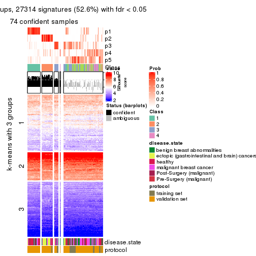</p>

</div>
<div id='tab-SD-NMF-get-signatures-no-scale-5'>
<pre><code class="r">get_signatures(res, k = 6, scale_rows = FALSE)
</code></pre>

<p></p>

</div>
</div>


Compare the overlap of signatures from different k:

```r
compare_signatures(res)
```


`get_signature()` returns a data frame invisibly. TO get the list of signatures, the function
call should be assigned to a variable explicitly. In following code, if `plot` argument is set
to `FALSE`, no heatmap is plotted while only the differential analysis is performed.

```r
# code only for demonstration
tb = get_signature(res, k = ..., plot = FALSE)
```

An example of the output of `tb` is:

```
#>   which_row         fdr    mean_1    mean_2 scaled_mean_1 scaled_mean_2 km
#> 1        38 0.042760348  8.373488  9.131774    -0.5533452     0.5164555  1
#> 2        40 0.018707592  7.106213  8.469186    -0.6173731     0.5762149  1
#> 3        55 0.019134737 10.221463 11.207825    -0.6159697     0.5749050  1
#> 4        59 0.006059896  5.921854  7.869574    -0.6899429     0.6439467  1
#> 5        60 0.018055526  8.928898 10.211722    -0.6204761     0.5791110  1
#> 6        98 0.009384629 15.714769 14.887706     0.6635654    -0.6193277  2
...
```

The columns in `tb` are:

1. `which_row`: row indices corresponding to the input matrix.
2. `fdr`: FDR for the differential test. 
3. `mean_x`: The mean value in group x.
4. `scaled_mean_x`: The mean value in group x after rows are scaled.
5. `km`: Row groups if k-means clustering is applied to rows.


UMAP plot which shows how samples are separated.


<script>
$( function() {
	$( '#tabs-SD-NMF-dimension-reduction' ).tabs();
} );
</script>
<div id='tabs-SD-NMF-dimension-reduction'>
<ul>
<li><a href='#tab-SD-NMF-dimension-reduction-1'>k = 2</a></li>
<li><a href='#tab-SD-NMF-dimension-reduction-2'>k = 3</a></li>
<li><a href='#tab-SD-NMF-dimension-reduction-3'>k = 4</a></li>
<li><a href='#tab-SD-NMF-dimension-reduction-4'>k = 5</a></li>
<li><a href='#tab-SD-NMF-dimension-reduction-5'>k = 6</a></li>
</ul>
<div id='tab-SD-NMF-dimension-reduction-1'>
<pre><code class="r">dimension_reduction(res, k = 2, method = &quot;UMAP&quot;)
</code></pre>

<p></p>

</div>
<div id='tab-SD-NMF-dimension-reduction-2'>
<pre><code class="r">dimension_reduction(res, k = 3, method = &quot;UMAP&quot;)
</code></pre>

<p></p>

</div>
<div id='tab-SD-NMF-dimension-reduction-3'>
<pre><code class="r">dimension_reduction(res, k = 4, method = &quot;UMAP&quot;)
</code></pre>

<p></p>

</div>
<div id='tab-SD-NMF-dimension-reduction-4'>
<pre><code class="r">dimension_reduction(res, k = 5, method = &quot;UMAP&quot;)
</code></pre>

<p></p>

</div>
<div id='tab-SD-NMF-dimension-reduction-5'>
<pre><code class="r">dimension_reduction(res, k = 6, method = &quot;UMAP&quot;)
</code></pre>

<p></p>

</div>
</div>


Following heatmap shows how subgroups are split when increasing `k`:

```r
collect_classes(res)
```

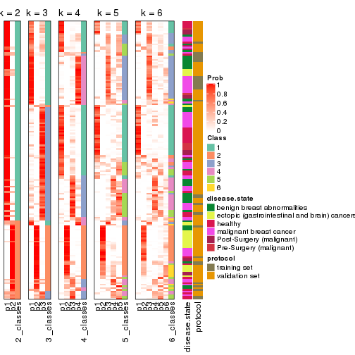


Test correlation between subgroups and known annotations. If the known
annotation is numeric, one-way ANOVA test is applied, and if the known
annotation is discrete, chi-squared contingency table test is applied.

```r
test_to_known_factors(res)
```

```
#>          n disease.state(p) protocol(p) k
#> SD:NMF 148         2.72e-07    9.54e-01 2
#> SD:NMF 142         9.71e-06    1.58e-03 3
#> SD:NMF 139         1.62e-08    6.27e-06 4
#> SD:NMF  74         1.44e-03    4.54e-04 5
#> SD:NMF  69         1.25e-07    1.17e-05 6
```


If matrix rows can be associated to genes, consider to use `GO_Enrichment(res,
...)` to perform function enrichment for the signature genes.


 

---------------------------------------------------


### CV:hclust


The object with results only for a single top-value method and a single partition method 
can be extracted as:

```r
res = res_list["CV", "hclust"]
# you can also extract it by
# res = res_list["CV:hclust"]
```

A summary of `res` and all the functions that can be applied to it:

```r
res
```

```
#> A 'ConsensusPartition' object with k = 2, 3, 4, 5, 6.
#>   On a matrix with 51941 rows and 162 columns.
#>   Top rows (1000, 2000, 3000, 4000, 5000) are extracted by 'CV' method.
#>   Subgroups are detected by 'hclust' method.
#>   Performed in total 1250 partitions by row resampling.
#>   Best k for subgroups seems to be 5.
#> 
#> Following methods can be applied to this 'ConsensusPartition' object:
#>  [1] "cola_report"             "collect_classes"         "collect_plots"          
#>  [4] "collect_stats"           "colnames"                "compare_signatures"     
#>  [7] "consensus_heatmap"       "dimension_reduction"     "functional_enrichment"  
#> [10] "get_anno_col"            "get_anno"                "get_classes"            
#> [13] "get_consensus"           "get_matrix"              "get_membership"         
#> [16] "get_param"               "get_signatures"          "get_stats"              
#> [19] "is_best_k"               "is_stable_k"             "membership_heatmap"     
#> [22] "ncol"                    "nrow"                    "plot_ecdf"              
#> [25] "rownames"                "select_partition_number" "show"                   
#> [28] "suggest_best_k"          "test_to_known_factors"
```

`collect_plots()` function collects all the plots made from `res` for all `k` (number of partitions)
into one single page to provide an easy and fast comparison between different `k`.

```r
collect_plots(res)
```


The plots are:

- The first row: a plot of the ECDF (Empirical cumulative distribution
  function) curves of the consensus matrix for each `k` and the heatmap of
  predicted classes for each `k`.
- The second row: heatmaps of the consensus matrix for each `k`.
- The third row: heatmaps of the membership matrix for each `k`.
- The fouth row: heatmaps of the signatures for each `k`.

All the plots in panels can be made by individual functions and they are
plotted later in this section.

`select_partition_number()` produces several plots showing different
statistics for choosing "optimized" `k`. There are following statistics:

- ECDF curves of the consensus matrix for each `k`;
- 1-PAC. [The PAC
  score](https://en.wikipedia.org/wiki/Consensus_clustering#Over-interpretation_potential_of_consensus_clustering)
  measures the proportion of the ambiguous subgrouping.
- Mean silhouette score.
- Concordance. The mean probability of fiting the consensus class ids in all
  partitions.
- Area increased. Denote $A_k$ as the area under the ECDF curve for current
  `k`, the area increased is defined as $A_k - A_{k-1}$.
- Rand index. The percent of pairs of samples that are both in a same cluster
  or both are not in a same cluster in the partition of k and k-1.
- Jaccard index. The ratio of pairs of samples are both in a same cluster in
  the partition of k and k-1 and the pairs of samples are both in a same
  cluster in the partition k or k-1.

The detailed explanations of these statistics can be found in [the cola
vignette](http://bioconductor.org/packages/devel/bioc/vignettes/cola/inst/doc/cola.html#toc_13).

Generally speaking, lower PAC score, higher mean silhouette score or higher
concordance corresponds to better partition. Rand index and Jaccard index
measure how similar the current partition is compared to partition with `k-1`.
If they are too similar, we won't accept `k` is better than `k-1`.

```r
select_partition_number(res)
```


The numeric values for all these statistics can be obtained by `get_stats()`.

```r
get_stats(res)
```

```
#>   k 1-PAC mean_silhouette concordance area_increased  Rand Jaccard
#> 2 2 0.393           0.801       0.884         0.3289 0.626   0.626
#> 3 3 0.327           0.613       0.768         0.5601 0.868   0.793
#> 4 4 0.370           0.633       0.744         0.1599 0.927   0.863
#> 5 5 0.440           0.639       0.765         0.2169 0.756   0.504
#> 6 6 0.487           0.630       0.759         0.0387 0.971   0.894
```

`suggest_best_k()` suggests the best $k$ based on these statistics. The rules are as follows:

- All $k$ with Jaccard index larger than 0.95 are removed because the increase of
  the partition number does not provides enough extra information. If all $k$ are removed,
  the best $k$ is assigned by `NA`.
- For $k$ with 1-PAC larger than 0.9, the maximal $k$ is taken as the "best k". Other $k$ is called "optional k".
- If it does not fit the second rule. The $k$ with the highest vote of highest
  1-PAC, mean silhouette and concordance is taken as the "best k".

```r
suggest_best_k(res)
```

```
#> [1] 5
```


Following shows the table of the partitions (You need to click the **show/hide
code output** link to see it). The membership matrix (columns with name `p*`)
is inferred by
[`clue::cl_consensus()`](https://www.rdocumentation.org/link/cl_consensus?package=clue)
function with the `SE` method. Basically the value in the membership matrix
represents the probability to belong to a certain group. The finall class
label for an item is determined with the group with highest probability it
belongs to.

In `get_classes()` function, the entropy is calculated from the membership
matrix and the silhouette score is calculated from the consensus matrix.


<script>
$( function() {
	$( '#tabs-CV-hclust-get-classes' ).tabs();
} );
</script>
<div id='tabs-CV-hclust-get-classes'>
<ul>
<li><a href='#tab-CV-hclust-get-classes-1'>k = 2</a></li>
<li><a href='#tab-CV-hclust-get-classes-2'>k = 3</a></li>
<li><a href='#tab-CV-hclust-get-classes-3'>k = 4</a></li>
<li><a href='#tab-CV-hclust-get-classes-4'>k = 5</a></li>
<li><a href='#tab-CV-hclust-get-classes-5'>k = 6</a></li>
</ul>

<div id='tab-CV-hclust-get-classes-1'>
<p><a id='tab-CV-hclust-get-classes-1-a' style='color:#0366d6' href='#'>show/hide code output</a></p>
<pre><code class="r">cbind(get_classes(res, k = 2), get_membership(res, k = 2))
</code></pre>

<pre><code>#&gt;           class entropy silhouette    p1    p2
#&gt; GSM682002     1  0.0000      0.911 1.000 0.000
#&gt; GSM682003     2  0.6712      0.746 0.176 0.824
#&gt; GSM682004     2  0.6712      0.746 0.176 0.824
#&gt; GSM682005     1  0.4562      0.865 0.904 0.096
#&gt; GSM682006     1  0.4690      0.862 0.900 0.100
#&gt; GSM682007     1  0.6148      0.811 0.848 0.152
#&gt; GSM682008     1  0.6148      0.811 0.848 0.152
#&gt; GSM682009     1  0.7528      0.698 0.784 0.216
#&gt; GSM682010     1  0.4690      0.863 0.900 0.100
#&gt; GSM682011     1  0.0672      0.911 0.992 0.008
#&gt; GSM682096     1  0.6973      0.758 0.812 0.188
#&gt; GSM682097     1  0.6887      0.765 0.816 0.184
#&gt; GSM682098     1  0.6973      0.758 0.812 0.188
#&gt; GSM682099     1  0.4939      0.816 0.892 0.108
#&gt; GSM682100     2  0.9881      0.581 0.436 0.564
#&gt; GSM682101     1  0.6712      0.725 0.824 0.176
#&gt; GSM682102     1  0.0000      0.911 1.000 0.000
#&gt; GSM682103     1  0.1843      0.906 0.972 0.028
#&gt; GSM682104     1  0.6712      0.779 0.824 0.176
#&gt; GSM682105     1  0.1184      0.910 0.984 0.016
#&gt; GSM682106     1  0.4431      0.870 0.908 0.092
#&gt; GSM682107     1  0.0672      0.911 0.992 0.008
#&gt; GSM682108     1  0.3274      0.890 0.940 0.060
#&gt; GSM682109     1  0.7376      0.728 0.792 0.208
#&gt; GSM682110     1  0.4431      0.870 0.908 0.092
#&gt; GSM682111     1  0.8016      0.657 0.756 0.244
#&gt; GSM682112     2  0.0672      0.683 0.008 0.992
#&gt; GSM682113     1  0.0000      0.911 1.000 0.000
#&gt; GSM682114     1  0.6148      0.809 0.848 0.152
#&gt; GSM682115     1  0.0000      0.911 1.000 0.000
#&gt; GSM682116     1  0.0000      0.911 1.000 0.000
#&gt; GSM682117     1  0.0938      0.910 0.988 0.012
#&gt; GSM682118     1  0.0938      0.911 0.988 0.012
#&gt; GSM682119     1  0.2603      0.899 0.956 0.044
#&gt; GSM682120     1  0.0000      0.911 1.000 0.000
#&gt; GSM682121     1  0.0000      0.911 1.000 0.000
#&gt; GSM682122     1  0.6887      0.766 0.816 0.184
#&gt; GSM682012     2  0.2778      0.704 0.048 0.952
#&gt; GSM682013     2  0.9922      0.561 0.448 0.552
#&gt; GSM682014     2  0.9087      0.698 0.324 0.676
#&gt; GSM682015     2  0.9087      0.698 0.324 0.676
#&gt; GSM682016     2  0.3274      0.710 0.060 0.940
#&gt; GSM682017     2  0.9087      0.698 0.324 0.676
#&gt; GSM682018     1  0.8909      0.355 0.692 0.308
#&gt; GSM682019     2  0.9922      0.560 0.448 0.552
#&gt; GSM682020     2  0.9850      0.593 0.428 0.572
#&gt; GSM682021     1  0.8713      0.418 0.708 0.292
#&gt; GSM682022     2  0.9933      0.552 0.452 0.548
#&gt; GSM682023     2  0.9988      0.485 0.480 0.520
#&gt; GSM682024     1  0.0000      0.911 1.000 0.000
#&gt; GSM682025     2  0.9933      0.552 0.452 0.548
#&gt; GSM682026     2  0.9963      0.528 0.464 0.536
#&gt; GSM682027     1  0.4939      0.816 0.892 0.108
#&gt; GSM682028     1  0.0000      0.911 1.000 0.000
#&gt; GSM682029     1  0.0000      0.911 1.000 0.000
#&gt; GSM682030     1  0.0000      0.911 1.000 0.000
#&gt; GSM682031     1  0.0000      0.911 1.000 0.000
#&gt; GSM682032     1  0.0000      0.911 1.000 0.000
#&gt; GSM682033     2  0.4939      0.733 0.108 0.892
#&gt; GSM681992     1  0.6247      0.796 0.844 0.156
#&gt; GSM681993     2  0.7139      0.697 0.196 0.804
#&gt; GSM681994     1  0.1184      0.910 0.984 0.016
#&gt; GSM681995     1  0.0672      0.911 0.992 0.008
#&gt; GSM681996     1  0.6148      0.811 0.848 0.152
#&gt; GSM681997     1  0.3431      0.887 0.936 0.064
#&gt; GSM681998     1  0.3431      0.887 0.936 0.064
#&gt; GSM681999     1  0.0938      0.910 0.988 0.012
#&gt; GSM682000     1  0.0672      0.911 0.992 0.008
#&gt; GSM682001     1  0.0938      0.910 0.988 0.012
#&gt; GSM682055     1  0.7376      0.726 0.792 0.208
#&gt; GSM682056     1  0.6887      0.765 0.816 0.184
#&gt; GSM682057     2  0.9988      0.483 0.480 0.520
#&gt; GSM682058     1  0.6623      0.782 0.828 0.172
#&gt; GSM682059     2  0.9686      0.633 0.396 0.604
#&gt; GSM682060     2  0.0000      0.679 0.000 1.000
#&gt; GSM682061     2  0.0000      0.679 0.000 1.000
#&gt; GSM682062     2  0.9881      0.581 0.436 0.564
#&gt; GSM682063     1  0.6712      0.725 0.824 0.176
#&gt; GSM682064     1  0.1843      0.906 0.972 0.028
#&gt; GSM682065     1  0.0000      0.911 1.000 0.000
#&gt; GSM682066     1  0.1184      0.910 0.984 0.016
#&gt; GSM682067     1  0.0938      0.911 0.988 0.012
#&gt; GSM682068     1  0.0000      0.911 1.000 0.000
#&gt; GSM682069     1  0.0938      0.911 0.988 0.012
#&gt; GSM682070     1  0.1843      0.906 0.972 0.028
#&gt; GSM682071     2  0.9358      0.611 0.352 0.648
#&gt; GSM682072     1  0.7376      0.728 0.792 0.208
#&gt; GSM682073     1  0.7745      0.690 0.772 0.228
#&gt; GSM682074     1  0.0000      0.911 1.000 0.000
#&gt; GSM682075     1  0.0000      0.911 1.000 0.000
#&gt; GSM682076     1  0.0000      0.911 1.000 0.000
#&gt; GSM682077     1  0.0376      0.911 0.996 0.004
#&gt; GSM682078     1  0.2423      0.900 0.960 0.040
#&gt; GSM682079     1  0.0000      0.911 1.000 0.000
#&gt; GSM682080     2  0.9608      0.564 0.384 0.616
#&gt; GSM682081     1  0.7815      0.681 0.768 0.232
#&gt; GSM682082     1  0.5519      0.833 0.872 0.128
#&gt; GSM682083     1  0.0000      0.911 1.000 0.000
#&gt; GSM682084     1  0.6048      0.814 0.852 0.148
#&gt; GSM682085     1  0.6048      0.814 0.852 0.148
#&gt; GSM682086     1  0.0672      0.911 0.992 0.008
#&gt; GSM682087     1  0.0000      0.911 1.000 0.000
#&gt; GSM682088     1  0.2043      0.901 0.968 0.032
#&gt; GSM682089     1  0.2043      0.901 0.968 0.032
#&gt; GSM682090     1  0.0000      0.911 1.000 0.000
#&gt; GSM682091     1  0.1843      0.906 0.972 0.028
#&gt; GSM682092     1  0.0376      0.911 0.996 0.004
#&gt; GSM682093     1  0.5059      0.853 0.888 0.112
#&gt; GSM682094     1  0.1184      0.910 0.984 0.016
#&gt; GSM682095     2  0.6531      0.746 0.168 0.832
#&gt; GSM681982     2  0.5294      0.720 0.120 0.880
#&gt; GSM681983     1  0.0000      0.911 1.000 0.000
#&gt; GSM681984     2  0.9944      0.465 0.456 0.544
#&gt; GSM681985     2  0.5059      0.718 0.112 0.888
#&gt; GSM681986     2  0.9944      0.465 0.456 0.544
#&gt; GSM681987     2  0.6048      0.744 0.148 0.852
#&gt; GSM681988     1  0.8909      0.490 0.692 0.308
#&gt; GSM681989     1  0.7528      0.698 0.784 0.216
#&gt; GSM681990     1  0.2948      0.896 0.948 0.052
#&gt; GSM681991     2  0.6048      0.744 0.148 0.852
#&gt; GSM682034     1  0.0000      0.911 1.000 0.000
#&gt; GSM682035     1  0.0000      0.911 1.000 0.000
#&gt; GSM682036     1  0.2043      0.904 0.968 0.032
#&gt; GSM682037     1  0.0000      0.911 1.000 0.000
#&gt; GSM682038     2  0.8608      0.711 0.284 0.716
#&gt; GSM682039     1  0.3431      0.887 0.936 0.064
#&gt; GSM682040     2  0.0000      0.679 0.000 1.000
#&gt; GSM682041     1  0.1414      0.907 0.980 0.020
#&gt; GSM682042     2  0.6973      0.699 0.188 0.812
#&gt; GSM682043     1  0.0000      0.911 1.000 0.000
#&gt; GSM682044     1  0.0000      0.911 1.000 0.000
#&gt; GSM682045     1  0.3431      0.887 0.936 0.064
#&gt; GSM682046     1  0.0000      0.911 1.000 0.000
#&gt; GSM682047     1  0.2043      0.904 0.968 0.032
#&gt; GSM682048     1  0.4815      0.857 0.896 0.104
#&gt; GSM682049     1  0.1414      0.907 0.980 0.020
#&gt; GSM682050     1  0.0000      0.911 1.000 0.000
#&gt; GSM682051     1  0.1414      0.907 0.980 0.020
#&gt; GSM682052     2  0.6973      0.699 0.188 0.812
#&gt; GSM682053     1  0.9963     -0.145 0.536 0.464
#&gt; GSM682054     1  0.0000      0.911 1.000 0.000
#&gt; GSM682123     1  0.0000      0.911 1.000 0.000
#&gt; GSM682124     1  0.0672      0.911 0.992 0.008
#&gt; GSM682125     1  0.4815      0.857 0.896 0.104
#&gt; GSM682126     1  0.0000      0.911 1.000 0.000
#&gt; GSM682127     1  0.0000      0.911 1.000 0.000
#&gt; GSM682128     1  0.0000      0.911 1.000 0.000
#&gt; GSM682129     2  0.9922      0.561 0.448 0.552
#&gt; GSM682130     2  0.9850      0.593 0.428 0.572
#&gt; GSM682131     2  0.4815      0.732 0.104 0.896
#&gt; GSM682132     1  0.0000      0.911 1.000 0.000
#&gt; GSM682133     1  0.0000      0.911 1.000 0.000
#&gt; GSM682134     1  0.0000      0.911 1.000 0.000
#&gt; GSM682135     1  0.2043      0.904 0.968 0.032
#&gt; GSM682136     1  0.0000      0.911 1.000 0.000
#&gt; GSM682137     1  0.0000      0.911 1.000 0.000
#&gt; GSM682138     1  0.0000      0.911 1.000 0.000
#&gt; GSM682139     1  0.0672      0.911 0.992 0.008
#&gt; GSM682140     1  0.0000      0.911 1.000 0.000
#&gt; GSM682141     1  0.0000      0.911 1.000 0.000
#&gt; GSM682142     1  0.0000      0.911 1.000 0.000
#&gt; GSM682143     2  0.6712      0.746 0.176 0.824
</code></pre>

<script>
$('#tab-CV-hclust-get-classes-1-a').parent().next().next().hide();
$('#tab-CV-hclust-get-classes-1-a').click(function(){
  $('#tab-CV-hclust-get-classes-1-a').parent().next().next().toggle();
  return(false);
});
</script>
</div>

<div id='tab-CV-hclust-get-classes-2'>
<p><a id='tab-CV-hclust-get-classes-2-a' style='color:#0366d6' href='#'>show/hide code output</a></p>
<pre><code class="r">cbind(get_classes(res, k = 3), get_membership(res, k = 3))
</code></pre>

<pre><code>#&gt;           class entropy silhouette    p1    p2    p3
#&gt; GSM682002     1  0.2448     0.8110 0.924 0.076 0.000
#&gt; GSM682003     3  0.5016     0.5335 0.000 0.240 0.760
#&gt; GSM682004     3  0.5016     0.5335 0.000 0.240 0.760
#&gt; GSM682005     1  0.7180     0.7330 0.700 0.216 0.084
#&gt; GSM682006     1  0.7124     0.7366 0.708 0.204 0.088
#&gt; GSM682007     1  0.7830     0.6998 0.668 0.196 0.136
#&gt; GSM682008     1  0.7830     0.6998 0.668 0.196 0.136
#&gt; GSM682009     1  0.8386     0.6188 0.624 0.172 0.204
#&gt; GSM682010     1  0.6567     0.7656 0.752 0.160 0.088
#&gt; GSM682011     1  0.5327     0.7401 0.728 0.272 0.000
#&gt; GSM682096     1  0.8241     0.6489 0.636 0.204 0.160
#&gt; GSM682097     1  0.8112     0.6649 0.648 0.192 0.160
#&gt; GSM682098     1  0.8199     0.6548 0.640 0.200 0.160
#&gt; GSM682099     2  0.5905     0.3219 0.352 0.648 0.000
#&gt; GSM682100     2  0.7192     0.2052 0.028 0.560 0.412
#&gt; GSM682101     2  0.6506     0.3442 0.236 0.720 0.044
#&gt; GSM682102     1  0.1163     0.8015 0.972 0.028 0.000
#&gt; GSM682103     1  0.3112     0.8171 0.916 0.056 0.028
#&gt; GSM682104     1  0.7975     0.6831 0.660 0.180 0.160
#&gt; GSM682105     1  0.2703     0.8171 0.928 0.056 0.016
#&gt; GSM682106     1  0.7144     0.7348 0.700 0.220 0.080
#&gt; GSM682107     1  0.5178     0.7543 0.744 0.256 0.000
#&gt; GSM682108     1  0.6393     0.7556 0.736 0.216 0.048
#&gt; GSM682109     1  0.8260     0.6471 0.636 0.172 0.192
#&gt; GSM682110     1  0.7144     0.7348 0.700 0.220 0.080
#&gt; GSM682111     1  0.8485     0.6029 0.612 0.164 0.224
#&gt; GSM682112     3  0.1525     0.6187 0.004 0.032 0.964
#&gt; GSM682113     1  0.1753     0.8114 0.952 0.048 0.000
#&gt; GSM682114     1  0.6462     0.7536 0.764 0.116 0.120
#&gt; GSM682115     1  0.1163     0.8020 0.972 0.028 0.000
#&gt; GSM682116     1  0.1163     0.8020 0.972 0.028 0.000
#&gt; GSM682117     1  0.5024     0.7748 0.776 0.220 0.004
#&gt; GSM682118     1  0.4645     0.7957 0.816 0.176 0.008
#&gt; GSM682119     1  0.5874     0.7686 0.760 0.208 0.032
#&gt; GSM682120     1  0.1289     0.8086 0.968 0.032 0.000
#&gt; GSM682121     1  0.1289     0.8061 0.968 0.032 0.000
#&gt; GSM682122     1  0.7975     0.6817 0.660 0.180 0.160
#&gt; GSM682012     3  0.2550     0.6227 0.012 0.056 0.932
#&gt; GSM682013     2  0.7169     0.2131 0.028 0.568 0.404
#&gt; GSM682014     3  0.6295     0.1181 0.000 0.472 0.528
#&gt; GSM682015     3  0.6295     0.1181 0.000 0.472 0.528
#&gt; GSM682016     3  0.2845     0.6211 0.012 0.068 0.920
#&gt; GSM682017     3  0.6295     0.1181 0.000 0.472 0.528
#&gt; GSM682018     2  0.7672     0.3188 0.156 0.684 0.160
#&gt; GSM682019     2  0.7169     0.2081 0.028 0.568 0.404
#&gt; GSM682020     2  0.7102     0.1873 0.024 0.556 0.420
#&gt; GSM682021     2  0.7661     0.3247 0.172 0.684 0.144
#&gt; GSM682022     2  0.7156     0.2119 0.028 0.572 0.400
#&gt; GSM682023     2  0.7032     0.2368 0.028 0.604 0.368
#&gt; GSM682024     1  0.2356     0.7810 0.928 0.072 0.000
#&gt; GSM682025     2  0.7156     0.2119 0.028 0.572 0.400
#&gt; GSM682026     2  0.7099     0.2250 0.028 0.588 0.384
#&gt; GSM682027     2  0.4931     0.3245 0.232 0.768 0.000
#&gt; GSM682028     2  0.6260    -0.1370 0.448 0.552 0.000
#&gt; GSM682029     2  0.6280    -0.1770 0.460 0.540 0.000
#&gt; GSM682030     2  0.6280    -0.1770 0.460 0.540 0.000
#&gt; GSM682031     2  0.6280    -0.1770 0.460 0.540 0.000
#&gt; GSM682032     2  0.6280    -0.1770 0.460 0.540 0.000
#&gt; GSM682033     3  0.3755     0.6123 0.008 0.120 0.872
#&gt; GSM681992     1  0.7954     0.6806 0.660 0.192 0.148
#&gt; GSM681993     3  0.6111     0.4859 0.104 0.112 0.784
#&gt; GSM681994     1  0.4963     0.7842 0.792 0.200 0.008
#&gt; GSM681995     1  0.5254     0.7470 0.736 0.264 0.000
#&gt; GSM681996     1  0.7830     0.6998 0.668 0.196 0.136
#&gt; GSM681997     1  0.6703     0.7397 0.712 0.236 0.052
#&gt; GSM681998     1  0.6703     0.7397 0.712 0.236 0.052
#&gt; GSM681999     1  0.5325     0.7570 0.748 0.248 0.004
#&gt; GSM682000     1  0.5397     0.7328 0.720 0.280 0.000
#&gt; GSM682001     1  0.5325     0.7570 0.748 0.248 0.004
#&gt; GSM682055     1  0.8218     0.6480 0.640 0.176 0.184
#&gt; GSM682056     1  0.8112     0.6649 0.648 0.192 0.160
#&gt; GSM682057     2  0.7874     0.2172 0.064 0.568 0.368
#&gt; GSM682058     1  0.7999     0.6756 0.656 0.196 0.148
#&gt; GSM682059     2  0.7169     0.0839 0.024 0.520 0.456
#&gt; GSM682060     3  0.0237     0.6225 0.000 0.004 0.996
#&gt; GSM682061     3  0.0237     0.6225 0.000 0.004 0.996
#&gt; GSM682062     2  0.7192     0.2052 0.028 0.560 0.412
#&gt; GSM682063     2  0.6506     0.3442 0.236 0.720 0.044
#&gt; GSM682064     1  0.4413     0.8069 0.852 0.124 0.024
#&gt; GSM682065     1  0.1289     0.8102 0.968 0.032 0.000
#&gt; GSM682066     1  0.4692     0.8002 0.820 0.168 0.012
#&gt; GSM682067     1  0.2651     0.8151 0.928 0.060 0.012
#&gt; GSM682068     1  0.6095     0.4273 0.608 0.392 0.000
#&gt; GSM682069     1  0.2651     0.8151 0.928 0.060 0.012
#&gt; GSM682070     1  0.4413     0.8062 0.852 0.124 0.024
#&gt; GSM682071     3  0.8210     0.2444 0.240 0.132 0.628
#&gt; GSM682072     1  0.8260     0.6471 0.636 0.172 0.192
#&gt; GSM682073     1  0.8427     0.6206 0.620 0.172 0.208
#&gt; GSM682074     1  0.1163     0.8096 0.972 0.028 0.000
#&gt; GSM682075     1  0.6008     0.4607 0.628 0.372 0.000
#&gt; GSM682076     1  0.1289     0.8061 0.968 0.032 0.000
#&gt; GSM682077     1  0.1163     0.8110 0.972 0.028 0.000
#&gt; GSM682078     1  0.3148     0.8148 0.916 0.048 0.036
#&gt; GSM682079     1  0.1529     0.8141 0.960 0.040 0.000
#&gt; GSM682080     3  0.8536     0.1911 0.260 0.144 0.596
#&gt; GSM682081     1  0.8466     0.6139 0.616 0.172 0.212
#&gt; GSM682082     1  0.5407     0.7755 0.820 0.076 0.104
#&gt; GSM682083     1  0.1163     0.8020 0.972 0.028 0.000
#&gt; GSM682084     1  0.6462     0.7558 0.764 0.120 0.116
#&gt; GSM682085     1  0.6462     0.7558 0.764 0.120 0.116
#&gt; GSM682086     1  0.5178     0.7543 0.744 0.256 0.000
#&gt; GSM682087     1  0.1289     0.8061 0.968 0.032 0.000
#&gt; GSM682088     1  0.2050     0.8092 0.952 0.028 0.020
#&gt; GSM682089     1  0.1919     0.8082 0.956 0.024 0.020
#&gt; GSM682090     1  0.1163     0.8072 0.972 0.028 0.000
#&gt; GSM682091     1  0.4196     0.8087 0.864 0.112 0.024
#&gt; GSM682092     1  0.1989     0.8156 0.948 0.048 0.004
#&gt; GSM682093     1  0.6809     0.7606 0.740 0.156 0.104
#&gt; GSM682094     1  0.5335     0.7658 0.760 0.232 0.008
#&gt; GSM682095     3  0.4931     0.5405 0.000 0.232 0.768
#&gt; GSM681982     3  0.4475     0.5750 0.072 0.064 0.864
#&gt; GSM681983     1  0.1964     0.8123 0.944 0.056 0.000
#&gt; GSM681984     3  0.9223     0.1479 0.272 0.200 0.528
#&gt; GSM681985     3  0.4658     0.5726 0.076 0.068 0.856
#&gt; GSM681986     3  0.9223     0.1479 0.272 0.200 0.528
#&gt; GSM681987     3  0.4178     0.5878 0.000 0.172 0.828
#&gt; GSM681988     1  0.8872     0.4848 0.556 0.156 0.288
#&gt; GSM681989     1  0.8386     0.6188 0.624 0.172 0.204
#&gt; GSM681990     1  0.6096     0.7640 0.752 0.208 0.040
#&gt; GSM681991     3  0.4178     0.5878 0.000 0.172 0.828
#&gt; GSM682034     1  0.0892     0.8044 0.980 0.020 0.000
#&gt; GSM682035     1  0.0892     0.8044 0.980 0.020 0.000
#&gt; GSM682036     1  0.4618     0.8019 0.840 0.136 0.024
#&gt; GSM682037     1  0.1163     0.8015 0.972 0.028 0.000
#&gt; GSM682038     3  0.7500     0.4440 0.140 0.164 0.696
#&gt; GSM682039     1  0.5020     0.8001 0.836 0.108 0.056
#&gt; GSM682040     3  0.1163     0.6161 0.000 0.028 0.972
#&gt; GSM682041     1  0.1643     0.8019 0.956 0.044 0.000
#&gt; GSM682042     3  0.6144     0.4789 0.132 0.088 0.780
#&gt; GSM682043     1  0.1163     0.8015 0.972 0.028 0.000
#&gt; GSM682044     1  0.0892     0.8044 0.980 0.020 0.000
#&gt; GSM682045     1  0.5020     0.8001 0.836 0.108 0.056
#&gt; GSM682046     1  0.1163     0.8015 0.972 0.028 0.000
#&gt; GSM682047     1  0.2681     0.8161 0.932 0.040 0.028
#&gt; GSM682048     1  0.5650     0.7881 0.808 0.108 0.084
#&gt; GSM682049     1  0.1643     0.8019 0.956 0.044 0.000
#&gt; GSM682050     1  0.1163     0.8015 0.972 0.028 0.000
#&gt; GSM682051     1  0.1643     0.8019 0.956 0.044 0.000
#&gt; GSM682052     3  0.6144     0.4789 0.132 0.088 0.780
#&gt; GSM682053     1  0.8793     0.0973 0.452 0.112 0.436
#&gt; GSM682054     1  0.1163     0.8015 0.972 0.028 0.000
#&gt; GSM682123     1  0.1163     0.8092 0.972 0.028 0.000
#&gt; GSM682124     1  0.2173     0.8152 0.944 0.048 0.008
#&gt; GSM682125     1  0.5650     0.7881 0.808 0.108 0.084
#&gt; GSM682126     1  0.1289     0.8006 0.968 0.032 0.000
#&gt; GSM682127     1  0.1529     0.8095 0.960 0.040 0.000
#&gt; GSM682128     1  0.1163     0.8063 0.972 0.028 0.000
#&gt; GSM682129     2  0.7169     0.2131 0.028 0.568 0.404
#&gt; GSM682130     2  0.7102     0.1873 0.024 0.556 0.420
#&gt; GSM682131     3  0.3482     0.6113 0.000 0.128 0.872
#&gt; GSM682132     1  0.6095     0.4133 0.608 0.392 0.000
#&gt; GSM682133     1  0.1529     0.8030 0.960 0.040 0.000
#&gt; GSM682134     1  0.1163     0.8092 0.972 0.028 0.000
#&gt; GSM682135     1  0.4683     0.8018 0.836 0.140 0.024
#&gt; GSM682136     1  0.1289     0.8006 0.968 0.032 0.000
#&gt; GSM682137     1  0.1163     0.8063 0.972 0.028 0.000
#&gt; GSM682138     1  0.1163     0.8096 0.972 0.028 0.000
#&gt; GSM682139     1  0.2173     0.8152 0.944 0.048 0.008
#&gt; GSM682140     1  0.1163     0.8096 0.972 0.028 0.000
#&gt; GSM682141     1  0.1163     0.8015 0.972 0.028 0.000
#&gt; GSM682142     1  0.1163     0.8015 0.972 0.028 0.000
#&gt; GSM682143     3  0.5016     0.5335 0.000 0.240 0.760
</code></pre>

<script>
$('#tab-CV-hclust-get-classes-2-a').parent().next().next().hide();
$('#tab-CV-hclust-get-classes-2-a').click(function(){
  $('#tab-CV-hclust-get-classes-2-a').parent().next().next().toggle();
  return(false);
});
</script>
</div>

<div id='tab-CV-hclust-get-classes-3'>
<p><a id='tab-CV-hclust-get-classes-3-a' style='color:#0366d6' href='#'>show/hide code output</a></p>
<pre><code class="r">cbind(get_classes(res, k = 4), get_membership(res, k = 4))
</code></pre>

<pre><code>#&gt;           class entropy silhouette    p1    p2    p3    p4
#&gt; GSM682002     1  0.2742     0.7569 0.900 0.000 0.024 0.076
#&gt; GSM682003     2  0.4164     0.3341 0.000 0.736 0.264 0.000
#&gt; GSM682004     2  0.4164     0.3341 0.000 0.736 0.264 0.000
#&gt; GSM682005     1  0.7051     0.6680 0.560 0.020 0.336 0.084
#&gt; GSM682006     1  0.6306     0.6795 0.584 0.008 0.356 0.052
#&gt; GSM682007     1  0.6193     0.6426 0.548 0.012 0.408 0.032
#&gt; GSM682008     1  0.6193     0.6426 0.548 0.012 0.408 0.032
#&gt; GSM682009     1  0.7651     0.5898 0.528 0.092 0.336 0.044
#&gt; GSM682010     1  0.5127     0.7095 0.632 0.000 0.356 0.012
#&gt; GSM682011     1  0.7034     0.6607 0.576 0.000 0.204 0.220
#&gt; GSM682096     1  0.6752     0.5927 0.512 0.040 0.420 0.028
#&gt; GSM682097     1  0.6515     0.6086 0.524 0.028 0.420 0.028
#&gt; GSM682098     1  0.6676     0.5985 0.516 0.036 0.420 0.028
#&gt; GSM682099     4  0.9336     0.2788 0.164 0.312 0.132 0.392
#&gt; GSM682100     2  0.3271     0.6683 0.000 0.856 0.132 0.012
#&gt; GSM682101     2  0.9079     0.1357 0.116 0.460 0.248 0.176
#&gt; GSM682102     1  0.1229     0.7477 0.968 0.004 0.008 0.020
#&gt; GSM682103     1  0.3734     0.7705 0.848 0.000 0.108 0.044
#&gt; GSM682104     1  0.6118     0.6342 0.548 0.028 0.412 0.012
#&gt; GSM682105     1  0.3634     0.7709 0.856 0.000 0.096 0.048
#&gt; GSM682106     1  0.6626     0.6738 0.568 0.004 0.344 0.084
#&gt; GSM682107     1  0.6854     0.6863 0.600 0.000 0.204 0.196
#&gt; GSM682108     1  0.6530     0.6999 0.608 0.008 0.304 0.080
#&gt; GSM682109     1  0.6200     0.5990 0.524 0.036 0.432 0.008
#&gt; GSM682110     1  0.6626     0.6738 0.568 0.004 0.344 0.084
#&gt; GSM682111     1  0.6479     0.5627 0.508 0.060 0.428 0.004
#&gt; GSM682112     3  0.4868     0.4703 0.000 0.304 0.684 0.012
#&gt; GSM682113     1  0.2207     0.7672 0.932 0.004 0.040 0.024
#&gt; GSM682114     1  0.4897     0.7084 0.660 0.000 0.332 0.008
#&gt; GSM682115     1  0.0804     0.7470 0.980 0.000 0.008 0.012
#&gt; GSM682116     1  0.0804     0.7470 0.980 0.000 0.008 0.012
#&gt; GSM682117     1  0.6344     0.7224 0.648 0.000 0.224 0.128
#&gt; GSM682118     1  0.5775     0.7505 0.696 0.000 0.212 0.092
#&gt; GSM682119     1  0.6148     0.7146 0.636 0.000 0.280 0.084
#&gt; GSM682120     1  0.1677     0.7527 0.948 0.000 0.012 0.040
#&gt; GSM682121     1  0.1635     0.7485 0.948 0.000 0.008 0.044
#&gt; GSM682122     1  0.5756     0.6344 0.552 0.012 0.424 0.012
#&gt; GSM682012     3  0.6071     0.2650 0.000 0.452 0.504 0.044
#&gt; GSM682013     2  0.3638     0.6724 0.000 0.848 0.120 0.032
#&gt; GSM682014     2  0.0592     0.6119 0.000 0.984 0.016 0.000
#&gt; GSM682015     2  0.0592     0.6119 0.000 0.984 0.016 0.000
#&gt; GSM682016     3  0.6130     0.2698 0.000 0.440 0.512 0.048
#&gt; GSM682017     2  0.0592     0.6119 0.000 0.984 0.016 0.000
#&gt; GSM682018     2  0.7700     0.3849 0.064 0.592 0.236 0.108
#&gt; GSM682019     2  0.3764     0.6714 0.000 0.844 0.116 0.040
#&gt; GSM682020     2  0.2944     0.6684 0.000 0.868 0.128 0.004
#&gt; GSM682021     2  0.7942     0.3575 0.080 0.576 0.236 0.108
#&gt; GSM682022     2  0.3764     0.6718 0.000 0.844 0.116 0.040
#&gt; GSM682023     2  0.4436     0.6549 0.000 0.800 0.148 0.052
#&gt; GSM682024     1  0.2552     0.7280 0.920 0.048 0.020 0.012
#&gt; GSM682025     2  0.3764     0.6718 0.000 0.844 0.116 0.040
#&gt; GSM682026     2  0.4257     0.6628 0.000 0.812 0.140 0.048
#&gt; GSM682027     4  0.7399     0.3152 0.020 0.312 0.120 0.548
#&gt; GSM682028     4  0.1284     0.7534 0.000 0.024 0.012 0.964
#&gt; GSM682029     4  0.0657     0.7595 0.000 0.004 0.012 0.984
#&gt; GSM682030     4  0.0657     0.7595 0.000 0.004 0.012 0.984
#&gt; GSM682031     4  0.0657     0.7595 0.000 0.004 0.012 0.984
#&gt; GSM682032     4  0.0657     0.7595 0.000 0.004 0.012 0.984
#&gt; GSM682033     2  0.5229    -0.0540 0.000 0.564 0.428 0.008
#&gt; GSM681992     1  0.7651     0.6425 0.556 0.072 0.304 0.068
#&gt; GSM681993     3  0.4926     0.5512 0.056 0.168 0.772 0.004
#&gt; GSM681994     1  0.6390     0.7257 0.644 0.000 0.224 0.132
#&gt; GSM681995     1  0.7007     0.6698 0.580 0.000 0.208 0.212
#&gt; GSM681996     1  0.6193     0.6426 0.548 0.012 0.408 0.032
#&gt; GSM681997     1  0.7003     0.6700 0.564 0.008 0.316 0.112
#&gt; GSM681998     1  0.7020     0.6673 0.560 0.008 0.320 0.112
#&gt; GSM681999     1  0.6908     0.6834 0.592 0.000 0.220 0.188
#&gt; GSM682000     1  0.7085     0.6514 0.568 0.000 0.200 0.232
#&gt; GSM682001     1  0.6875     0.6859 0.596 0.000 0.220 0.184
#&gt; GSM682055     1  0.6935     0.5954 0.516 0.052 0.404 0.028
#&gt; GSM682056     1  0.6515     0.6086 0.524 0.028 0.420 0.028
#&gt; GSM682057     2  0.3997     0.6150 0.012 0.816 0.164 0.008
#&gt; GSM682058     1  0.6805     0.6098 0.520 0.028 0.408 0.044
#&gt; GSM682059     2  0.2125     0.6596 0.000 0.920 0.076 0.004
#&gt; GSM682060     3  0.4761     0.4126 0.000 0.372 0.628 0.000
#&gt; GSM682061     3  0.4761     0.4126 0.000 0.372 0.628 0.000
#&gt; GSM682062     2  0.3271     0.6683 0.000 0.856 0.132 0.012
#&gt; GSM682063     2  0.9079     0.1357 0.116 0.460 0.248 0.176
#&gt; GSM682064     1  0.5137     0.7570 0.744 0.004 0.204 0.048
#&gt; GSM682065     1  0.1296     0.7580 0.964 0.004 0.028 0.004
#&gt; GSM682066     1  0.5878     0.7514 0.712 0.004 0.164 0.120
#&gt; GSM682067     1  0.2899     0.7690 0.880 0.004 0.112 0.004
#&gt; GSM682068     4  0.4139     0.6866 0.176 0.000 0.024 0.800
#&gt; GSM682069     1  0.2899     0.7690 0.880 0.004 0.112 0.004
#&gt; GSM682070     1  0.5031     0.7551 0.740 0.000 0.212 0.048
#&gt; GSM682071     3  0.6656     0.4737 0.188 0.188 0.624 0.000
#&gt; GSM682072     1  0.6200     0.5990 0.524 0.036 0.432 0.008
#&gt; GSM682073     1  0.6413     0.5795 0.516 0.048 0.428 0.008
#&gt; GSM682074     1  0.1406     0.7632 0.960 0.000 0.024 0.016
#&gt; GSM682075     4  0.4576     0.5798 0.260 0.000 0.012 0.728
#&gt; GSM682076     1  0.1635     0.7485 0.948 0.000 0.008 0.044
#&gt; GSM682077     1  0.1585     0.7624 0.952 0.004 0.040 0.004
#&gt; GSM682078     1  0.3404     0.7690 0.864 0.000 0.104 0.032
#&gt; GSM682079     1  0.2840     0.7679 0.900 0.000 0.056 0.044
#&gt; GSM682080     3  0.6429     0.4523 0.192 0.160 0.648 0.000
#&gt; GSM682081     1  0.6480     0.5747 0.512 0.052 0.428 0.008
#&gt; GSM682082     1  0.4706     0.7368 0.748 0.000 0.224 0.028
#&gt; GSM682083     1  0.0804     0.7470 0.980 0.000 0.008 0.012
#&gt; GSM682084     1  0.4917     0.7090 0.656 0.000 0.336 0.008
#&gt; GSM682085     1  0.4917     0.7090 0.656 0.000 0.336 0.008
#&gt; GSM682086     1  0.6854     0.6863 0.600 0.000 0.204 0.196
#&gt; GSM682087     1  0.1635     0.7485 0.948 0.000 0.008 0.044
#&gt; GSM682088     1  0.2125     0.7663 0.920 0.000 0.076 0.004
#&gt; GSM682089     1  0.2125     0.7678 0.920 0.000 0.076 0.004
#&gt; GSM682090     1  0.1733     0.7623 0.948 0.000 0.024 0.028
#&gt; GSM682091     1  0.4919     0.7581 0.752 0.000 0.200 0.048
#&gt; GSM682092     1  0.3071     0.7708 0.888 0.000 0.068 0.044
#&gt; GSM682093     1  0.5871     0.7103 0.628 0.016 0.332 0.024
#&gt; GSM682094     1  0.6769     0.6966 0.608 0.000 0.220 0.172
#&gt; GSM682095     2  0.4250     0.3173 0.000 0.724 0.276 0.000
#&gt; GSM681982     3  0.5393     0.5382 0.044 0.268 0.688 0.000
#&gt; GSM681983     1  0.2485     0.7561 0.916 0.004 0.016 0.064
#&gt; GSM681984     3  0.8078     0.3936 0.216 0.264 0.496 0.024
#&gt; GSM681985     3  0.5394     0.5498 0.044 0.212 0.732 0.012
#&gt; GSM681986     3  0.8078     0.3936 0.216 0.264 0.496 0.024
#&gt; GSM681987     2  0.4790     0.1023 0.000 0.620 0.380 0.000
#&gt; GSM681988     1  0.6920     0.4482 0.460 0.092 0.444 0.004
#&gt; GSM681989     1  0.7651     0.5898 0.528 0.092 0.336 0.044
#&gt; GSM681990     1  0.6354     0.7059 0.620 0.004 0.296 0.080
#&gt; GSM681991     2  0.4790     0.1023 0.000 0.620 0.380 0.000
#&gt; GSM682034     1  0.0859     0.7498 0.980 0.004 0.008 0.008
#&gt; GSM682035     1  0.0859     0.7498 0.980 0.004 0.008 0.008
#&gt; GSM682036     1  0.5327     0.7500 0.720 0.000 0.220 0.060
#&gt; GSM682037     1  0.1229     0.7477 0.968 0.004 0.008 0.020
#&gt; GSM682038     3  0.6928     0.4173 0.116 0.372 0.512 0.000
#&gt; GSM682039     1  0.4826     0.7478 0.716 0.000 0.264 0.020
#&gt; GSM682040     3  0.5038     0.4377 0.000 0.336 0.652 0.012
#&gt; GSM682041     1  0.1722     0.7618 0.944 0.000 0.048 0.008
#&gt; GSM682042     3  0.5321     0.5415 0.068 0.160 0.760 0.012
#&gt; GSM682043     1  0.1229     0.7477 0.968 0.004 0.008 0.020
#&gt; GSM682044     1  0.0859     0.7498 0.980 0.004 0.008 0.008
#&gt; GSM682045     1  0.4826     0.7478 0.716 0.000 0.264 0.020
#&gt; GSM682046     1  0.1229     0.7477 0.968 0.004 0.008 0.020
#&gt; GSM682047     1  0.2909     0.7717 0.888 0.000 0.092 0.020
#&gt; GSM682048     1  0.5456     0.7382 0.700 0.020 0.260 0.020
#&gt; GSM682049     1  0.1722     0.7618 0.944 0.000 0.048 0.008
#&gt; GSM682050     1  0.1229     0.7477 0.968 0.004 0.008 0.020
#&gt; GSM682051     1  0.1722     0.7618 0.944 0.000 0.048 0.008
#&gt; GSM682052     3  0.5321     0.5415 0.068 0.160 0.760 0.012
#&gt; GSM682053     3  0.6450     0.0277 0.364 0.052 0.572 0.012
#&gt; GSM682054     1  0.1229     0.7477 0.968 0.004 0.008 0.020
#&gt; GSM682123     1  0.1492     0.7600 0.956 0.004 0.036 0.004
#&gt; GSM682124     1  0.2520     0.7694 0.904 0.004 0.088 0.004
#&gt; GSM682125     1  0.5456     0.7382 0.700 0.020 0.260 0.020
#&gt; GSM682126     1  0.1114     0.7467 0.972 0.004 0.008 0.016
#&gt; GSM682127     1  0.1811     0.7590 0.948 0.004 0.028 0.020
#&gt; GSM682128     1  0.1807     0.7479 0.940 0.000 0.008 0.052
#&gt; GSM682129     2  0.3638     0.6724 0.000 0.848 0.120 0.032
#&gt; GSM682130     2  0.2944     0.6684 0.000 0.868 0.128 0.004
#&gt; GSM682131     2  0.5427    -0.0624 0.000 0.568 0.416 0.016
#&gt; GSM682132     4  0.3852     0.6909 0.180 0.000 0.012 0.808
#&gt; GSM682133     1  0.0921     0.7504 0.972 0.000 0.000 0.028
#&gt; GSM682134     1  0.1492     0.7600 0.956 0.004 0.036 0.004
#&gt; GSM682135     1  0.5505     0.7502 0.716 0.004 0.220 0.060
#&gt; GSM682136     1  0.1114     0.7467 0.972 0.004 0.008 0.016
#&gt; GSM682137     1  0.1807     0.7479 0.940 0.000 0.008 0.052
#&gt; GSM682138     1  0.1406     0.7632 0.960 0.000 0.024 0.016
#&gt; GSM682139     1  0.2520     0.7694 0.904 0.004 0.088 0.004
#&gt; GSM682140     1  0.1406     0.7632 0.960 0.000 0.024 0.016
#&gt; GSM682141     1  0.1229     0.7477 0.968 0.004 0.008 0.020
#&gt; GSM682142     1  0.1229     0.7477 0.968 0.004 0.008 0.020
#&gt; GSM682143     2  0.4164     0.3341 0.000 0.736 0.264 0.000
</code></pre>

<script>
$('#tab-CV-hclust-get-classes-3-a').parent().next().next().hide();
$('#tab-CV-hclust-get-classes-3-a').click(function(){
  $('#tab-CV-hclust-get-classes-3-a').parent().next().next().toggle();
  return(false);
});
</script>
</div>

<div id='tab-CV-hclust-get-classes-4'>
<p><a id='tab-CV-hclust-get-classes-4-a' style='color:#0366d6' href='#'>show/hide code output</a></p>
<pre><code class="r">cbind(get_classes(res, k = 5), get_membership(res, k = 5))
</code></pre>

<pre><code>#&gt;           class entropy silhouette    p1    p2    p3    p4    p5
#&gt; GSM682002     1  0.4255     0.7952 0.788 0.000 0.140 0.060 0.012
#&gt; GSM682003     2  0.4440    -0.0438 0.000 0.528 0.000 0.004 0.468
#&gt; GSM682004     2  0.4440    -0.0438 0.000 0.528 0.000 0.004 0.468
#&gt; GSM682005     3  0.4596     0.7550 0.108 0.008 0.792 0.064 0.028
#&gt; GSM682006     3  0.3628     0.7551 0.100 0.004 0.844 0.032 0.020
#&gt; GSM682007     3  0.1794     0.7293 0.012 0.008 0.944 0.012 0.024
#&gt; GSM682008     3  0.1794     0.7293 0.012 0.008 0.944 0.012 0.024
#&gt; GSM682009     3  0.6040     0.7054 0.096 0.060 0.716 0.036 0.092
#&gt; GSM682010     3  0.2835     0.7637 0.112 0.000 0.868 0.004 0.016
#&gt; GSM682011     3  0.6096     0.6646 0.164 0.000 0.628 0.188 0.020
#&gt; GSM682096     3  0.3625     0.6955 0.012 0.084 0.852 0.016 0.036
#&gt; GSM682097     3  0.3446     0.7030 0.012 0.072 0.864 0.016 0.036
#&gt; GSM682098     3  0.3567     0.6981 0.012 0.080 0.856 0.016 0.036
#&gt; GSM682099     2  0.8371    -0.2032 0.120 0.360 0.144 0.356 0.020
#&gt; GSM682100     2  0.1573     0.7235 0.004 0.948 0.036 0.008 0.004
#&gt; GSM682101     2  0.7630     0.3399 0.076 0.552 0.188 0.156 0.028
#&gt; GSM682102     1  0.0854     0.8105 0.976 0.000 0.012 0.004 0.008
#&gt; GSM682103     1  0.5532     0.4443 0.564 0.000 0.380 0.032 0.024
#&gt; GSM682104     3  0.2675     0.7308 0.032 0.020 0.904 0.004 0.040
#&gt; GSM682105     1  0.5408     0.4979 0.584 0.000 0.364 0.032 0.020
#&gt; GSM682106     3  0.3255     0.7544 0.056 0.000 0.868 0.056 0.020
#&gt; GSM682107     3  0.6035     0.6722 0.180 0.000 0.636 0.164 0.020
#&gt; GSM682108     3  0.4334     0.7586 0.124 0.004 0.796 0.060 0.016
#&gt; GSM682109     3  0.2821     0.7083 0.012 0.032 0.896 0.008 0.052
#&gt; GSM682110     3  0.3255     0.7544 0.056 0.000 0.868 0.056 0.020
#&gt; GSM682111     3  0.3053     0.6796 0.004 0.036 0.872 0.004 0.084
#&gt; GSM682112     5  0.3151     0.6182 0.000 0.064 0.068 0.004 0.864
#&gt; GSM682113     1  0.2929     0.7981 0.860 0.004 0.124 0.008 0.004
#&gt; GSM682114     3  0.3849     0.6981 0.104 0.000 0.820 0.008 0.068
#&gt; GSM682115     1  0.2411     0.8179 0.884 0.000 0.108 0.000 0.008
#&gt; GSM682116     1  0.2411     0.8179 0.884 0.000 0.108 0.000 0.008
#&gt; GSM682117     3  0.5521     0.7240 0.168 0.004 0.704 0.100 0.024
#&gt; GSM682118     3  0.5702     0.3145 0.376 0.000 0.552 0.060 0.012
#&gt; GSM682119     3  0.4082     0.7531 0.140 0.000 0.796 0.056 0.008
#&gt; GSM682120     1  0.4614     0.7415 0.728 0.000 0.224 0.032 0.016
#&gt; GSM682121     1  0.4143     0.7861 0.784 0.000 0.168 0.032 0.016
#&gt; GSM682122     3  0.2729     0.7136 0.020 0.016 0.900 0.008 0.056
#&gt; GSM682012     5  0.5244     0.4631 0.000 0.312 0.012 0.044 0.632
#&gt; GSM682013     2  0.2522     0.7237 0.004 0.912 0.032 0.028 0.024
#&gt; GSM682014     2  0.2694     0.6322 0.004 0.864 0.004 0.000 0.128
#&gt; GSM682015     2  0.2694     0.6322 0.004 0.864 0.004 0.000 0.128
#&gt; GSM682016     5  0.5386     0.4607 0.000 0.308 0.016 0.048 0.628
#&gt; GSM682017     2  0.2694     0.6322 0.004 0.864 0.004 0.000 0.128
#&gt; GSM682018     2  0.6189     0.5391 0.044 0.684 0.156 0.092 0.024
#&gt; GSM682019     2  0.2692     0.7219 0.004 0.904 0.028 0.036 0.028
#&gt; GSM682020     2  0.1124     0.7223 0.004 0.960 0.036 0.000 0.000
#&gt; GSM682021     2  0.6432     0.5210 0.056 0.668 0.156 0.096 0.024
#&gt; GSM682022     2  0.2692     0.7228 0.004 0.904 0.028 0.036 0.028
#&gt; GSM682023     2  0.2963     0.7142 0.004 0.888 0.044 0.048 0.016
#&gt; GSM682024     1  0.2462     0.7741 0.912 0.048 0.004 0.016 0.020
#&gt; GSM682025     2  0.2692     0.7228 0.004 0.904 0.028 0.036 0.028
#&gt; GSM682026     2  0.3003     0.7186 0.004 0.888 0.040 0.044 0.024
#&gt; GSM682027     4  0.6529     0.1556 0.016 0.360 0.104 0.512 0.008
#&gt; GSM682028     4  0.1299     0.8044 0.008 0.020 0.012 0.960 0.000
#&gt; GSM682029     4  0.0693     0.8132 0.008 0.000 0.012 0.980 0.000
#&gt; GSM682030     4  0.0693     0.8132 0.008 0.000 0.012 0.980 0.000
#&gt; GSM682031     4  0.0693     0.8132 0.008 0.000 0.012 0.980 0.000
#&gt; GSM682032     4  0.0693     0.8132 0.008 0.000 0.012 0.980 0.000
#&gt; GSM682033     5  0.4607     0.3859 0.000 0.368 0.004 0.012 0.616
#&gt; GSM681992     3  0.5918     0.7303 0.100 0.052 0.728 0.056 0.064
#&gt; GSM681993     5  0.4798     0.5807 0.000 0.044 0.268 0.004 0.684
#&gt; GSM681994     3  0.5605     0.6850 0.228 0.000 0.656 0.104 0.012
#&gt; GSM681995     3  0.5894     0.6817 0.148 0.000 0.652 0.180 0.020
#&gt; GSM681996     3  0.1794     0.7293 0.012 0.008 0.944 0.012 0.024
#&gt; GSM681997     3  0.4871     0.7496 0.112 0.004 0.768 0.088 0.028
#&gt; GSM681998     3  0.4823     0.7500 0.108 0.004 0.772 0.088 0.028
#&gt; GSM681999     3  0.5648     0.7013 0.140 0.000 0.680 0.160 0.020
#&gt; GSM682000     3  0.5971     0.6682 0.140 0.000 0.640 0.200 0.020
#&gt; GSM682001     3  0.5611     0.7029 0.140 0.000 0.684 0.156 0.020
#&gt; GSM682055     3  0.3834     0.6924 0.012 0.088 0.840 0.016 0.044
#&gt; GSM682056     3  0.3446     0.7030 0.012 0.072 0.864 0.016 0.036
#&gt; GSM682057     2  0.2512     0.6909 0.004 0.892 0.092 0.004 0.008
#&gt; GSM682058     3  0.3826     0.7042 0.016 0.072 0.848 0.032 0.032
#&gt; GSM682059     2  0.2284     0.7008 0.004 0.912 0.028 0.000 0.056
#&gt; GSM682060     5  0.2921     0.5988 0.000 0.124 0.020 0.000 0.856
#&gt; GSM682061     5  0.2921     0.5988 0.000 0.124 0.020 0.000 0.856
#&gt; GSM682062     2  0.1573     0.7235 0.004 0.948 0.036 0.008 0.004
#&gt; GSM682063     2  0.7630     0.3399 0.076 0.552 0.188 0.156 0.028
#&gt; GSM682064     3  0.6210     0.2688 0.452 0.020 0.468 0.040 0.020
#&gt; GSM682065     1  0.1404     0.8020 0.956 0.004 0.028 0.008 0.004
#&gt; GSM682066     3  0.6708     0.3702 0.396 0.008 0.472 0.100 0.024
#&gt; GSM682067     1  0.3696     0.7525 0.832 0.020 0.124 0.008 0.016
#&gt; GSM682068     4  0.4380     0.7355 0.140 0.000 0.068 0.780 0.012
#&gt; GSM682069     1  0.3696     0.7525 0.832 0.020 0.124 0.008 0.016
#&gt; GSM682070     3  0.6052     0.5123 0.352 0.020 0.568 0.040 0.020
#&gt; GSM682071     5  0.5725     0.3035 0.000 0.084 0.428 0.000 0.488
#&gt; GSM682072     3  0.2821     0.7083 0.012 0.032 0.896 0.008 0.052
#&gt; GSM682073     3  0.2809     0.6913 0.004 0.036 0.888 0.004 0.068
#&gt; GSM682074     1  0.4492     0.7284 0.712 0.000 0.256 0.016 0.016
#&gt; GSM682075     4  0.4993     0.6590 0.200 0.000 0.072 0.716 0.012
#&gt; GSM682076     1  0.4143     0.7861 0.784 0.000 0.168 0.032 0.016
#&gt; GSM682077     1  0.2353     0.8081 0.916 0.004 0.028 0.008 0.044
#&gt; GSM682078     1  0.5300     0.5342 0.600 0.000 0.352 0.024 0.024
#&gt; GSM682079     1  0.5081     0.6592 0.664 0.000 0.284 0.032 0.020
#&gt; GSM682080     3  0.5694    -0.2680 0.000 0.080 0.460 0.000 0.460
#&gt; GSM682081     3  0.2872     0.6878 0.004 0.036 0.884 0.004 0.072
#&gt; GSM682082     3  0.4944     0.6134 0.204 0.000 0.724 0.028 0.044
#&gt; GSM682083     1  0.2411     0.8179 0.884 0.000 0.108 0.000 0.008
#&gt; GSM682084     3  0.3849     0.7044 0.104 0.000 0.820 0.008 0.068
#&gt; GSM682085     3  0.3849     0.7044 0.104 0.000 0.820 0.008 0.068
#&gt; GSM682086     3  0.6035     0.6722 0.180 0.000 0.636 0.164 0.020
#&gt; GSM682087     1  0.4143     0.7861 0.784 0.000 0.168 0.032 0.016
#&gt; GSM682088     1  0.5070     0.5633 0.600 0.000 0.360 0.004 0.036
#&gt; GSM682089     1  0.5175     0.5476 0.584 0.000 0.372 0.004 0.040
#&gt; GSM682090     1  0.4323     0.7727 0.760 0.000 0.196 0.024 0.020
#&gt; GSM682091     3  0.6096     0.4839 0.368 0.020 0.552 0.040 0.020
#&gt; GSM682092     1  0.5322     0.4854 0.592 0.000 0.360 0.028 0.020
#&gt; GSM682093     3  0.5109     0.6972 0.216 0.016 0.716 0.016 0.036
#&gt; GSM682094     3  0.5792     0.6892 0.188 0.000 0.656 0.140 0.016
#&gt; GSM682095     2  0.4446    -0.0708 0.000 0.520 0.000 0.004 0.476
#&gt; GSM681982     5  0.4479     0.6247 0.000 0.072 0.184 0.000 0.744
#&gt; GSM681983     1  0.2846     0.8074 0.888 0.000 0.052 0.048 0.012
#&gt; GSM681984     5  0.7572     0.3071 0.020 0.176 0.380 0.028 0.396
#&gt; GSM681985     5  0.4501     0.6191 0.020 0.044 0.156 0.004 0.776
#&gt; GSM681986     5  0.7572     0.3071 0.020 0.176 0.380 0.028 0.396
#&gt; GSM681987     5  0.4350     0.2957 0.000 0.408 0.000 0.004 0.588
#&gt; GSM681988     3  0.3981     0.6151 0.004 0.060 0.800 0.000 0.136
#&gt; GSM681989     3  0.6040     0.7054 0.096 0.060 0.716 0.036 0.092
#&gt; GSM681990     3  0.3944     0.7554 0.124 0.000 0.812 0.052 0.012
#&gt; GSM681991     5  0.4350     0.2957 0.000 0.408 0.000 0.004 0.588
#&gt; GSM682034     1  0.0981     0.8087 0.972 0.000 0.012 0.008 0.008
#&gt; GSM682035     1  0.1087     0.8087 0.968 0.000 0.016 0.008 0.008
#&gt; GSM682036     3  0.5953     0.5843 0.312 0.016 0.604 0.048 0.020
#&gt; GSM682037     1  0.0854     0.8093 0.976 0.000 0.012 0.004 0.008
#&gt; GSM682038     5  0.6390     0.5063 0.000 0.200 0.260 0.004 0.536
#&gt; GSM682039     3  0.5496     0.6520 0.264 0.016 0.664 0.016 0.040
#&gt; GSM682040     5  0.2548     0.6034 0.000 0.072 0.028 0.004 0.896
#&gt; GSM682041     1  0.4456     0.7358 0.716 0.000 0.248 0.004 0.032
#&gt; GSM682042     5  0.4184     0.5674 0.000 0.024 0.232 0.004 0.740
#&gt; GSM682043     1  0.0854     0.8093 0.976 0.000 0.012 0.004 0.008
#&gt; GSM682044     1  0.0981     0.8087 0.972 0.000 0.012 0.008 0.008
#&gt; GSM682045     3  0.5496     0.6520 0.264 0.016 0.664 0.016 0.040
#&gt; GSM682046     1  0.0854     0.8093 0.976 0.000 0.012 0.004 0.008
#&gt; GSM682047     1  0.5057     0.6171 0.628 0.000 0.332 0.016 0.024
#&gt; GSM682048     3  0.5734     0.6490 0.256 0.016 0.652 0.012 0.064
#&gt; GSM682049     1  0.4318     0.7534 0.736 0.000 0.228 0.004 0.032
#&gt; GSM682050     1  0.0854     0.8093 0.976 0.000 0.012 0.004 0.008
#&gt; GSM682051     1  0.4456     0.7358 0.716 0.000 0.248 0.004 0.032
#&gt; GSM682052     5  0.4184     0.5674 0.000 0.024 0.232 0.004 0.740
#&gt; GSM682053     3  0.6497     0.1606 0.104 0.016 0.460 0.004 0.416
#&gt; GSM682054     1  0.0854     0.8093 0.976 0.000 0.012 0.004 0.008
#&gt; GSM682123     1  0.1659     0.7995 0.948 0.004 0.016 0.008 0.024
#&gt; GSM682124     1  0.3352     0.7763 0.856 0.016 0.104 0.008 0.016
#&gt; GSM682125     3  0.5734     0.6490 0.256 0.016 0.652 0.012 0.064
#&gt; GSM682126     1  0.0451     0.8041 0.988 0.000 0.000 0.004 0.008
#&gt; GSM682127     1  0.2622     0.8107 0.884 0.004 0.100 0.008 0.004
#&gt; GSM682128     1  0.4143     0.7912 0.788 0.000 0.160 0.036 0.016
#&gt; GSM682129     2  0.2522     0.7237 0.004 0.912 0.032 0.028 0.024
#&gt; GSM682130     2  0.1124     0.7223 0.004 0.960 0.036 0.000 0.000
#&gt; GSM682131     5  0.5111     0.3730 0.000 0.372 0.016 0.020 0.592
#&gt; GSM682132     4  0.3964     0.7340 0.160 0.000 0.032 0.796 0.012
#&gt; GSM682133     1  0.2444     0.8204 0.904 0.000 0.068 0.016 0.012
#&gt; GSM682134     1  0.1659     0.7995 0.948 0.004 0.016 0.008 0.024
#&gt; GSM682135     3  0.6235     0.3467 0.428 0.016 0.488 0.048 0.020
#&gt; GSM682136     1  0.0451     0.8041 0.988 0.000 0.000 0.004 0.008
#&gt; GSM682137     1  0.4143     0.7912 0.788 0.000 0.160 0.036 0.016
#&gt; GSM682138     1  0.4492     0.7284 0.712 0.000 0.256 0.016 0.016
#&gt; GSM682139     1  0.3352     0.7763 0.856 0.016 0.104 0.008 0.016
#&gt; GSM682140     1  0.4492     0.7284 0.712 0.000 0.256 0.016 0.016
#&gt; GSM682141     1  0.0854     0.8093 0.976 0.000 0.012 0.004 0.008
#&gt; GSM682142     1  0.0854     0.8105 0.976 0.000 0.012 0.004 0.008
#&gt; GSM682143     2  0.4440    -0.0438 0.000 0.528 0.000 0.004 0.468
</code></pre>

<script>
$('#tab-CV-hclust-get-classes-4-a').parent().next().next().hide();
$('#tab-CV-hclust-get-classes-4-a').click(function(){
  $('#tab-CV-hclust-get-classes-4-a').parent().next().next().toggle();
  return(false);
});
</script>
</div>

<div id='tab-CV-hclust-get-classes-5'>
<p><a id='tab-CV-hclust-get-classes-5-a' style='color:#0366d6' href='#'>show/hide code output</a></p>
<pre><code class="r">cbind(get_classes(res, k = 6), get_membership(res, k = 6))
</code></pre>

<pre><code>#&gt;           class entropy silhouette    p1    p2    p3    p4    p5    p6
#&gt; GSM682002     1  0.4134     0.7714 0.784 0.000 0.124 0.004 0.028 0.060
#&gt; GSM682003     4  0.3102     0.7211 0.000 0.156 0.000 0.816 0.028 0.000
#&gt; GSM682004     4  0.3102     0.7211 0.000 0.156 0.000 0.816 0.028 0.000
#&gt; GSM682005     3  0.4125     0.7214 0.096 0.008 0.804 0.012 0.020 0.060
#&gt; GSM682006     3  0.3211     0.7221 0.088 0.004 0.856 0.012 0.012 0.028
#&gt; GSM682007     3  0.1129     0.6955 0.000 0.004 0.964 0.008 0.012 0.012
#&gt; GSM682008     3  0.1129     0.6955 0.000 0.004 0.964 0.008 0.012 0.012
#&gt; GSM682009     3  0.5741     0.6843 0.088 0.052 0.716 0.036 0.080 0.028
#&gt; GSM682010     3  0.2808     0.7305 0.076 0.000 0.868 0.008 0.048 0.000
#&gt; GSM682011     3  0.6409     0.6461 0.128 0.000 0.608 0.028 0.068 0.168
#&gt; GSM682096     3  0.4326     0.6390 0.004 0.108 0.780 0.020 0.080 0.008
#&gt; GSM682097     3  0.4190     0.6485 0.004 0.096 0.792 0.020 0.080 0.008
#&gt; GSM682098     3  0.4282     0.6422 0.004 0.104 0.784 0.020 0.080 0.008
#&gt; GSM682099     2  0.8275    -0.1007 0.092 0.384 0.104 0.036 0.064 0.320
#&gt; GSM682100     2  0.0603     0.8053 0.000 0.980 0.000 0.016 0.004 0.000
#&gt; GSM682101     2  0.7159     0.4728 0.016 0.592 0.108 0.080 0.088 0.116
#&gt; GSM682102     1  0.0837     0.7819 0.972 0.000 0.004 0.020 0.000 0.004
#&gt; GSM682103     1  0.6113     0.4257 0.524 0.000 0.352 0.032 0.060 0.032
#&gt; GSM682104     3  0.2626     0.6990 0.024 0.020 0.900 0.016 0.036 0.004
#&gt; GSM682105     1  0.6063     0.4828 0.544 0.000 0.332 0.032 0.060 0.032
#&gt; GSM682106     3  0.3002     0.7199 0.036 0.000 0.876 0.020 0.020 0.048
#&gt; GSM682107     3  0.6342     0.6532 0.144 0.000 0.616 0.028 0.064 0.148
#&gt; GSM682108     3  0.4496     0.7228 0.104 0.000 0.780 0.032 0.040 0.044
#&gt; GSM682109     3  0.2550     0.6809 0.008 0.024 0.900 0.016 0.048 0.004
#&gt; GSM682110     3  0.3002     0.7199 0.036 0.000 0.876 0.020 0.020 0.048
#&gt; GSM682111     3  0.2782     0.6561 0.000 0.032 0.876 0.024 0.068 0.000
#&gt; GSM682112     5  0.4046     0.4786 0.000 0.024 0.048 0.156 0.772 0.000
#&gt; GSM682113     1  0.3295     0.7752 0.844 0.000 0.100 0.020 0.028 0.008
#&gt; GSM682114     3  0.3942     0.6402 0.044 0.000 0.796 0.044 0.116 0.000
#&gt; GSM682115     1  0.2163     0.7906 0.892 0.000 0.096 0.008 0.004 0.000
#&gt; GSM682116     1  0.2163     0.7906 0.892 0.000 0.096 0.008 0.004 0.000
#&gt; GSM682117     3  0.5892     0.6990 0.136 0.000 0.672 0.036 0.072 0.084
#&gt; GSM682118     3  0.6140     0.2951 0.344 0.000 0.528 0.024 0.044 0.060
#&gt; GSM682119     3  0.4606     0.7198 0.116 0.000 0.768 0.024 0.048 0.044
#&gt; GSM682120     1  0.5187     0.7122 0.688 0.000 0.208 0.024 0.048 0.032
#&gt; GSM682121     1  0.4627     0.7577 0.748 0.000 0.156 0.016 0.048 0.032
#&gt; GSM682122     3  0.2367     0.6776 0.004 0.012 0.900 0.020 0.064 0.000
#&gt; GSM682012     5  0.6074     0.1884 0.000 0.288 0.008 0.112 0.556 0.036
#&gt; GSM682013     2  0.1294     0.8033 0.000 0.956 0.004 0.024 0.008 0.008
#&gt; GSM682014     2  0.3290     0.6303 0.000 0.776 0.000 0.208 0.016 0.000
#&gt; GSM682015     2  0.3261     0.6344 0.000 0.780 0.000 0.204 0.016 0.000
#&gt; GSM682016     5  0.6098     0.1992 0.000 0.288 0.008 0.108 0.556 0.040
#&gt; GSM682017     2  0.3261     0.6344 0.000 0.780 0.000 0.204 0.016 0.000
#&gt; GSM682018     2  0.5376     0.6547 0.008 0.736 0.080 0.052 0.072 0.052
#&gt; GSM682019     2  0.1570     0.8004 0.000 0.944 0.004 0.028 0.008 0.016
#&gt; GSM682020     2  0.0632     0.8028 0.000 0.976 0.000 0.024 0.000 0.000
#&gt; GSM682021     2  0.5603     0.6408 0.008 0.720 0.080 0.064 0.072 0.056
#&gt; GSM682022     2  0.1743     0.8042 0.000 0.936 0.004 0.024 0.008 0.028
#&gt; GSM682023     2  0.1476     0.7980 0.000 0.948 0.004 0.008 0.012 0.028
#&gt; GSM682024     1  0.3327     0.7304 0.856 0.048 0.004 0.064 0.016 0.012
#&gt; GSM682025     2  0.1743     0.8042 0.000 0.936 0.004 0.024 0.008 0.028
#&gt; GSM682026     2  0.1686     0.7988 0.000 0.940 0.004 0.016 0.016 0.024
#&gt; GSM682027     6  0.6469     0.0344 0.012 0.384 0.064 0.028 0.032 0.480
#&gt; GSM682028     6  0.0891     0.7912 0.008 0.024 0.000 0.000 0.000 0.968
#&gt; GSM682029     6  0.0405     0.8008 0.008 0.004 0.000 0.000 0.000 0.988
#&gt; GSM682030     6  0.0405     0.8008 0.008 0.004 0.000 0.000 0.000 0.988
#&gt; GSM682031     6  0.0405     0.8008 0.008 0.004 0.000 0.000 0.000 0.988
#&gt; GSM682032     6  0.0405     0.8008 0.008 0.004 0.000 0.000 0.000 0.988
#&gt; GSM682033     4  0.5457     0.6168 0.000 0.132 0.004 0.620 0.232 0.012
#&gt; GSM681992     3  0.5617     0.7058 0.092 0.036 0.728 0.052 0.052 0.040
#&gt; GSM681993     5  0.5271     0.4688 0.000 0.040 0.252 0.068 0.640 0.000
#&gt; GSM681994     3  0.5921     0.6682 0.196 0.000 0.636 0.024 0.040 0.104
#&gt; GSM681995     3  0.6202     0.6626 0.112 0.000 0.632 0.028 0.068 0.160
#&gt; GSM681996     3  0.1129     0.6955 0.000 0.004 0.964 0.008 0.012 0.012
#&gt; GSM681997     3  0.4508     0.7150 0.100 0.004 0.776 0.020 0.020 0.080
#&gt; GSM681998     3  0.4461     0.7152 0.096 0.004 0.780 0.020 0.020 0.080
#&gt; GSM681999     3  0.5949     0.6807 0.108 0.000 0.660 0.028 0.064 0.140
#&gt; GSM682000     3  0.6259     0.6499 0.108 0.000 0.620 0.028 0.064 0.180
#&gt; GSM682001     3  0.5914     0.6818 0.108 0.000 0.664 0.028 0.064 0.136
#&gt; GSM682055     3  0.4370     0.6394 0.004 0.112 0.776 0.020 0.080 0.008
#&gt; GSM682056     3  0.4190     0.6485 0.004 0.096 0.792 0.020 0.080 0.008
#&gt; GSM682057     2  0.2116     0.7814 0.000 0.916 0.024 0.024 0.036 0.000
#&gt; GSM682058     3  0.4650     0.6478 0.008 0.096 0.772 0.020 0.080 0.024
#&gt; GSM682059     2  0.2060     0.7595 0.000 0.900 0.000 0.084 0.016 0.000
#&gt; GSM682060     5  0.4270     0.3913 0.000 0.044 0.008 0.220 0.724 0.004
#&gt; GSM682061     5  0.4270     0.3913 0.000 0.044 0.008 0.220 0.724 0.004
#&gt; GSM682062     2  0.0603     0.8053 0.000 0.980 0.000 0.016 0.004 0.000
#&gt; GSM682063     2  0.7159     0.4728 0.016 0.592 0.108 0.080 0.088 0.116
#&gt; GSM682064     3  0.6870     0.2730 0.396 0.016 0.440 0.052 0.068 0.028
#&gt; GSM682065     1  0.2613     0.7612 0.892 0.000 0.016 0.056 0.028 0.008
#&gt; GSM682066     3  0.6998     0.3481 0.364 0.004 0.444 0.028 0.072 0.088
#&gt; GSM682067     1  0.5097     0.6970 0.744 0.016 0.100 0.060 0.072 0.008
#&gt; GSM682068     6  0.4274     0.7257 0.120 0.004 0.036 0.012 0.040 0.788
#&gt; GSM682069     1  0.5097     0.6970 0.744 0.016 0.100 0.060 0.072 0.008
#&gt; GSM682070     3  0.6635     0.5129 0.300 0.016 0.540 0.048 0.068 0.028
#&gt; GSM682071     5  0.6255     0.2762 0.000 0.072 0.424 0.068 0.432 0.004
#&gt; GSM682072     3  0.2550     0.6809 0.008 0.024 0.900 0.016 0.048 0.004
#&gt; GSM682073     3  0.2428     0.6663 0.000 0.024 0.896 0.020 0.060 0.000
#&gt; GSM682074     1  0.5200     0.6920 0.660 0.000 0.244 0.020 0.060 0.016
#&gt; GSM682075     6  0.4839     0.6472 0.180 0.004 0.052 0.008 0.032 0.724
#&gt; GSM682076     1  0.4627     0.7577 0.748 0.000 0.156 0.016 0.048 0.032
#&gt; GSM682077     1  0.3402     0.7624 0.852 0.004 0.024 0.056 0.056 0.008
#&gt; GSM682078     1  0.5961     0.5042 0.548 0.000 0.332 0.028 0.068 0.024
#&gt; GSM682079     1  0.5857     0.6295 0.612 0.000 0.260 0.036 0.060 0.032
#&gt; GSM682080     3  0.6075    -0.2665 0.000 0.072 0.452 0.052 0.420 0.004
#&gt; GSM682081     3  0.2570     0.6621 0.000 0.024 0.888 0.024 0.064 0.000
#&gt; GSM682082     3  0.5326     0.5995 0.140 0.000 0.704 0.040 0.096 0.020
#&gt; GSM682083     1  0.2163     0.7906 0.892 0.000 0.096 0.008 0.004 0.000
#&gt; GSM682084     3  0.3833     0.6458 0.040 0.000 0.804 0.044 0.112 0.000
#&gt; GSM682085     3  0.3833     0.6458 0.040 0.000 0.804 0.044 0.112 0.000
#&gt; GSM682086     3  0.6342     0.6532 0.144 0.000 0.616 0.028 0.064 0.148
#&gt; GSM682087     1  0.4627     0.7577 0.748 0.000 0.156 0.016 0.048 0.032
#&gt; GSM682088     1  0.5590     0.5140 0.544 0.000 0.344 0.024 0.088 0.000
#&gt; GSM682089     1  0.5646     0.5015 0.532 0.000 0.348 0.020 0.100 0.000
#&gt; GSM682090     1  0.4983     0.7445 0.716 0.000 0.176 0.024 0.060 0.024
#&gt; GSM682091     3  0.6746     0.4933 0.304 0.016 0.528 0.052 0.072 0.028
#&gt; GSM682092     1  0.5905     0.4613 0.548 0.000 0.340 0.028 0.056 0.028
#&gt; GSM682093     3  0.4951     0.6653 0.204 0.020 0.712 0.024 0.028 0.012
#&gt; GSM682094     3  0.6097     0.6695 0.152 0.000 0.640 0.028 0.056 0.124
#&gt; GSM682095     4  0.3139     0.7175 0.000 0.152 0.000 0.816 0.032 0.000
#&gt; GSM681982     5  0.5621     0.4840 0.000 0.052 0.172 0.132 0.644 0.000
#&gt; GSM681983     1  0.2793     0.7777 0.884 0.000 0.040 0.008 0.020 0.048
#&gt; GSM681984     3  0.7392    -0.1774 0.008 0.060 0.400 0.288 0.232 0.012
#&gt; GSM681985     5  0.4508     0.5316 0.012 0.016 0.128 0.088 0.756 0.000
#&gt; GSM681986     3  0.7392    -0.1774 0.008 0.060 0.400 0.288 0.232 0.012
#&gt; GSM681987     4  0.4432     0.6798 0.000 0.104 0.000 0.708 0.188 0.000
#&gt; GSM681988     3  0.3813     0.6005 0.000 0.048 0.800 0.028 0.124 0.000
#&gt; GSM681989     3  0.5741     0.6843 0.088 0.052 0.716 0.036 0.080 0.028
#&gt; GSM681990     3  0.4318     0.7194 0.096 0.000 0.792 0.024 0.048 0.040
#&gt; GSM681991     4  0.4432     0.6798 0.000 0.104 0.000 0.708 0.188 0.000
#&gt; GSM682034     1  0.0767     0.7794 0.976 0.000 0.000 0.012 0.004 0.008
#&gt; GSM682035     1  0.0912     0.7794 0.972 0.000 0.004 0.012 0.004 0.008
#&gt; GSM682036     3  0.6479     0.5675 0.276 0.012 0.568 0.040 0.068 0.036
#&gt; GSM682037     1  0.0508     0.7798 0.984 0.000 0.000 0.012 0.000 0.004
#&gt; GSM682038     4  0.7094    -0.1639 0.000 0.072 0.256 0.340 0.332 0.000
#&gt; GSM682039     3  0.5956     0.6337 0.232 0.016 0.616 0.024 0.104 0.008
#&gt; GSM682040     5  0.3564     0.4185 0.000 0.020 0.008 0.200 0.772 0.000
#&gt; GSM682041     1  0.4788     0.7027 0.688 0.000 0.224 0.024 0.064 0.000
#&gt; GSM682042     5  0.3954     0.5225 0.000 0.008 0.172 0.056 0.764 0.000
#&gt; GSM682043     1  0.0508     0.7798 0.984 0.000 0.000 0.012 0.000 0.004
#&gt; GSM682044     1  0.0767     0.7794 0.976 0.000 0.000 0.012 0.004 0.008
#&gt; GSM682045     3  0.5956     0.6337 0.232 0.016 0.616 0.024 0.104 0.008
#&gt; GSM682046     1  0.0508     0.7798 0.984 0.000 0.000 0.012 0.000 0.004
#&gt; GSM682047     1  0.5750     0.5858 0.576 0.000 0.312 0.028 0.068 0.016
#&gt; GSM682048     3  0.6027     0.6313 0.220 0.016 0.604 0.016 0.136 0.008
#&gt; GSM682049     1  0.4656     0.7201 0.708 0.000 0.204 0.024 0.064 0.000
#&gt; GSM682050     1  0.0508     0.7798 0.984 0.000 0.000 0.012 0.000 0.004
#&gt; GSM682051     1  0.4788     0.7027 0.688 0.000 0.224 0.024 0.064 0.000
#&gt; GSM682052     5  0.3954     0.5225 0.000 0.008 0.172 0.056 0.764 0.000
#&gt; GSM682053     5  0.5576    -0.0151 0.068 0.016 0.404 0.008 0.504 0.000
#&gt; GSM682054     1  0.0508     0.7798 0.984 0.000 0.000 0.012 0.000 0.004
#&gt; GSM682123     1  0.2677     0.7575 0.892 0.004 0.012 0.052 0.032 0.008
#&gt; GSM682124     1  0.4659     0.7183 0.776 0.012 0.080 0.056 0.068 0.008
#&gt; GSM682125     3  0.6027     0.6313 0.220 0.016 0.604 0.016 0.136 0.008
#&gt; GSM682126     1  0.0692     0.7779 0.976 0.000 0.000 0.020 0.000 0.004
#&gt; GSM682127     1  0.2965     0.7837 0.868 0.000 0.080 0.020 0.024 0.008
#&gt; GSM682128     1  0.4534     0.7628 0.756 0.000 0.152 0.016 0.040 0.036
#&gt; GSM682129     2  0.1294     0.8033 0.000 0.956 0.004 0.024 0.008 0.008
#&gt; GSM682130     2  0.0632     0.8028 0.000 0.976 0.000 0.024 0.000 0.000
#&gt; GSM682131     4  0.6557     0.2411 0.000 0.224 0.016 0.392 0.360 0.008
#&gt; GSM682132     6  0.3765     0.7239 0.140 0.004 0.012 0.008 0.032 0.804
#&gt; GSM682133     1  0.2622     0.7916 0.888 0.000 0.064 0.004 0.028 0.016
#&gt; GSM682134     1  0.2677     0.7575 0.892 0.004 0.012 0.052 0.032 0.008
#&gt; GSM682135     3  0.6805     0.3230 0.388 0.012 0.452 0.044 0.068 0.036
#&gt; GSM682136     1  0.0692     0.7779 0.976 0.000 0.000 0.020 0.000 0.004
#&gt; GSM682137     1  0.4534     0.7628 0.756 0.000 0.152 0.016 0.040 0.036
#&gt; GSM682138     1  0.5200     0.6920 0.660 0.000 0.244 0.020 0.060 0.016
#&gt; GSM682139     1  0.4659     0.7183 0.776 0.012 0.080 0.056 0.068 0.008
#&gt; GSM682140     1  0.5200     0.6920 0.660 0.000 0.244 0.020 0.060 0.016
#&gt; GSM682141     1  0.0508     0.7798 0.984 0.000 0.000 0.012 0.000 0.004
#&gt; GSM682142     1  0.0837     0.7819 0.972 0.000 0.004 0.020 0.000 0.004
#&gt; GSM682143     4  0.3102     0.7211 0.000 0.156 0.000 0.816 0.028 0.000
</code></pre>

<script>
$('#tab-CV-hclust-get-classes-5-a').parent().next().next().hide();
$('#tab-CV-hclust-get-classes-5-a').click(function(){
  $('#tab-CV-hclust-get-classes-5-a').parent().next().next().toggle();
  return(false);
});
</script>
</div>
</div>

Heatmaps for the consensus matrix. It visualizes the probability of two
samples to be in a same group.


<script>
$( function() {
	$( '#tabs-CV-hclust-consensus-heatmap' ).tabs();
} );
</script>
<div id='tabs-CV-hclust-consensus-heatmap'>
<ul>
<li><a href='#tab-CV-hclust-consensus-heatmap-1'>k = 2</a></li>
<li><a href='#tab-CV-hclust-consensus-heatmap-2'>k = 3</a></li>
<li><a href='#tab-CV-hclust-consensus-heatmap-3'>k = 4</a></li>
<li><a href='#tab-CV-hclust-consensus-heatmap-4'>k = 5</a></li>
<li><a href='#tab-CV-hclust-consensus-heatmap-5'>k = 6</a></li>
</ul>
<div id='tab-CV-hclust-consensus-heatmap-1'>
<pre><code class="r">consensus_heatmap(res, k = 2)
</code></pre>

<p></p>

</div>
<div id='tab-CV-hclust-consensus-heatmap-2'>
<pre><code class="r">consensus_heatmap(res, k = 3)
</code></pre>

<p></p>

</div>
<div id='tab-CV-hclust-consensus-heatmap-3'>
<pre><code class="r">consensus_heatmap(res, k = 4)
</code></pre>

<p></p>

</div>
<div id='tab-CV-hclust-consensus-heatmap-4'>
<pre><code class="r">consensus_heatmap(res, k = 5)
</code></pre>

<p></p>

</div>
<div id='tab-CV-hclust-consensus-heatmap-5'>
<pre><code class="r">consensus_heatmap(res, k = 6)
</code></pre>

<p></p>

</div>
</div>

Heatmaps for the membership of samples in all partitions to see how consistent they are:


<script>
$( function() {
	$( '#tabs-CV-hclust-membership-heatmap' ).tabs();
} );
</script>
<div id='tabs-CV-hclust-membership-heatmap'>
<ul>
<li><a href='#tab-CV-hclust-membership-heatmap-1'>k = 2</a></li>
<li><a href='#tab-CV-hclust-membership-heatmap-2'>k = 3</a></li>
<li><a href='#tab-CV-hclust-membership-heatmap-3'>k = 4</a></li>
<li><a href='#tab-CV-hclust-membership-heatmap-4'>k = 5</a></li>
<li><a href='#tab-CV-hclust-membership-heatmap-5'>k = 6</a></li>
</ul>
<div id='tab-CV-hclust-membership-heatmap-1'>
<pre><code class="r">membership_heatmap(res, k = 2)
</code></pre>

<p>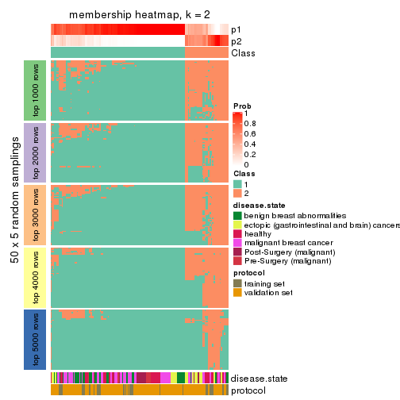</p>

</div>
<div id='tab-CV-hclust-membership-heatmap-2'>
<pre><code class="r">membership_heatmap(res, k = 3)
</code></pre>

<p></p>

</div>
<div id='tab-CV-hclust-membership-heatmap-3'>
<pre><code class="r">membership_heatmap(res, k = 4)
</code></pre>

<p></p>

</div>
<div id='tab-CV-hclust-membership-heatmap-4'>
<pre><code class="r">membership_heatmap(res, k = 5)
</code></pre>

<p></p>

</div>
<div id='tab-CV-hclust-membership-heatmap-5'>
<pre><code class="r">membership_heatmap(res, k = 6)
</code></pre>

<p></p>

</div>
</div>

As soon as we have had the classes for columns, we can look for signatures
which are significantly different between classes which can be candidate marks
for certain classes. Following are the heatmaps for signatures.


Signature heatmaps where rows are scaled:


<script>
$( function() {
	$( '#tabs-CV-hclust-get-signatures' ).tabs();
} );
</script>
<div id='tabs-CV-hclust-get-signatures'>
<ul>
<li><a href='#tab-CV-hclust-get-signatures-1'>k = 2</a></li>
<li><a href='#tab-CV-hclust-get-signatures-2'>k = 3</a></li>
<li><a href='#tab-CV-hclust-get-signatures-3'>k = 4</a></li>
<li><a href='#tab-CV-hclust-get-signatures-4'>k = 5</a></li>
<li><a href='#tab-CV-hclust-get-signatures-5'>k = 6</a></li>
</ul>
<div id='tab-CV-hclust-get-signatures-1'>
<pre><code class="r">get_signatures(res, k = 2)
</code></pre>

<p></p>

</div>
<div id='tab-CV-hclust-get-signatures-2'>
<pre><code class="r">get_signatures(res, k = 3)
</code></pre>

<p></p>

</div>
<div id='tab-CV-hclust-get-signatures-3'>
<pre><code class="r">get_signatures(res, k = 4)
</code></pre>

<p></p>

</div>
<div id='tab-CV-hclust-get-signatures-4'>
<pre><code class="r">get_signatures(res, k = 5)
</code></pre>

<p></p>

</div>
<div id='tab-CV-hclust-get-signatures-5'>
<pre><code class="r">get_signatures(res, k = 6)
</code></pre>

<p></p>

</div>
</div>


Signature heatmaps where rows are not scaled:


<script>
$( function() {
	$( '#tabs-CV-hclust-get-signatures-no-scale' ).tabs();
} );
</script>
<div id='tabs-CV-hclust-get-signatures-no-scale'>
<ul>
<li><a href='#tab-CV-hclust-get-signatures-no-scale-1'>k = 2</a></li>
<li><a href='#tab-CV-hclust-get-signatures-no-scale-2'>k = 3</a></li>
<li><a href='#tab-CV-hclust-get-signatures-no-scale-3'>k = 4</a></li>
<li><a href='#tab-CV-hclust-get-signatures-no-scale-4'>k = 5</a></li>
<li><a href='#tab-CV-hclust-get-signatures-no-scale-5'>k = 6</a></li>
</ul>
<div id='tab-CV-hclust-get-signatures-no-scale-1'>
<pre><code class="r">get_signatures(res, k = 2, scale_rows = FALSE)
</code></pre>

<p></p>

</div>
<div id='tab-CV-hclust-get-signatures-no-scale-2'>
<pre><code class="r">get_signatures(res, k = 3, scale_rows = FALSE)
</code></pre>

<p></p>

</div>
<div id='tab-CV-hclust-get-signatures-no-scale-3'>
<pre><code class="r">get_signatures(res, k = 4, scale_rows = FALSE)
</code></pre>

<p></p>

</div>
<div id='tab-CV-hclust-get-signatures-no-scale-4'>
<pre><code class="r">get_signatures(res, k = 5, scale_rows = FALSE)
</code></pre>

<p></p>

</div>
<div id='tab-CV-hclust-get-signatures-no-scale-5'>
<pre><code class="r">get_signatures(res, k = 6, scale_rows = FALSE)
</code></pre>

<p></p>

</div>
</div>


Compare the overlap of signatures from different k:

```r
compare_signatures(res)
```

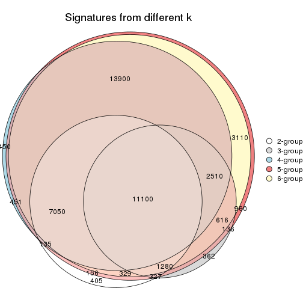

`get_signature()` returns a data frame invisibly. TO get the list of signatures, the function
call should be assigned to a variable explicitly. In following code, if `plot` argument is set
to `FALSE`, no heatmap is plotted while only the differential analysis is performed.

```r
# code only for demonstration
tb = get_signature(res, k = ..., plot = FALSE)
```

An example of the output of `tb` is:

```
#>   which_row         fdr    mean_1    mean_2 scaled_mean_1 scaled_mean_2 km
#> 1        38 0.042760348  8.373488  9.131774    -0.5533452     0.5164555  1
#> 2        40 0.018707592  7.106213  8.469186    -0.6173731     0.5762149  1
#> 3        55 0.019134737 10.221463 11.207825    -0.6159697     0.5749050  1
#> 4        59 0.006059896  5.921854  7.869574    -0.6899429     0.6439467  1
#> 5        60 0.018055526  8.928898 10.211722    -0.6204761     0.5791110  1
#> 6        98 0.009384629 15.714769 14.887706     0.6635654    -0.6193277  2
...
```

The columns in `tb` are:

1. `which_row`: row indices corresponding to the input matrix.
2. `fdr`: FDR for the differential test. 
3. `mean_x`: The mean value in group x.
4. `scaled_mean_x`: The mean value in group x after rows are scaled.
5. `km`: Row groups if k-means clustering is applied to rows.


UMAP plot which shows how samples are separated.


<script>
$( function() {
	$( '#tabs-CV-hclust-dimension-reduction' ).tabs();
} );
</script>
<div id='tabs-CV-hclust-dimension-reduction'>
<ul>
<li><a href='#tab-CV-hclust-dimension-reduction-1'>k = 2</a></li>
<li><a href='#tab-CV-hclust-dimension-reduction-2'>k = 3</a></li>
<li><a href='#tab-CV-hclust-dimension-reduction-3'>k = 4</a></li>
<li><a href='#tab-CV-hclust-dimension-reduction-4'>k = 5</a></li>
<li><a href='#tab-CV-hclust-dimension-reduction-5'>k = 6</a></li>
</ul>
<div id='tab-CV-hclust-dimension-reduction-1'>
<pre><code class="r">dimension_reduction(res, k = 2, method = &quot;UMAP&quot;)
</code></pre>

<p></p>

</div>
<div id='tab-CV-hclust-dimension-reduction-2'>
<pre><code class="r">dimension_reduction(res, k = 3, method = &quot;UMAP&quot;)
</code></pre>

<p></p>

</div>
<div id='tab-CV-hclust-dimension-reduction-3'>
<pre><code class="r">dimension_reduction(res, k = 4, method = &quot;UMAP&quot;)
</code></pre>

<p></p>

</div>
<div id='tab-CV-hclust-dimension-reduction-4'>
<pre><code class="r">dimension_reduction(res, k = 5, method = &quot;UMAP&quot;)
</code></pre>

<p>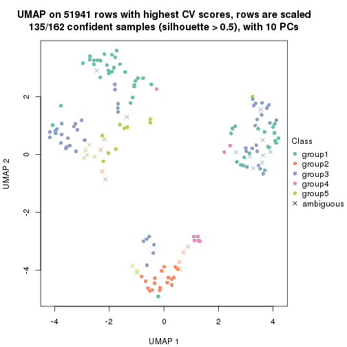</p>

</div>
<div id='tab-CV-hclust-dimension-reduction-5'>
<pre><code class="r">dimension_reduction(res, k = 6, method = &quot;UMAP&quot;)
</code></pre>

<p></p>

</div>
</div>


Following heatmap shows how subgroups are split when increasing `k`:

```r
collect_classes(res)
```


Test correlation between subgroups and known annotations. If the known
annotation is numeric, one-way ANOVA test is applied, and if the known
annotation is discrete, chi-squared contingency table test is applied.

```r
test_to_known_factors(res)
```

```
#>             n disease.state(p) protocol(p) k
#> CV:hclust 154         2.10e-04    9.25e-01 2
#> CV:hclust 122         3.49e-03    1.71e-01 3
#> CV:hclust 135         1.16e-12    8.45e-03 4
#> CV:hclust 135         1.20e-15    3.22e-05 5
#> CV:hclust 135         1.73e-13    1.08e-05 6
```


If matrix rows can be associated to genes, consider to use `GO_Enrichment(res,
...)` to perform function enrichment for the signature genes.


 

---------------------------------------------------


### CV:kmeans


The object with results only for a single top-value method and a single partition method 
can be extracted as:

```r
res = res_list["CV", "kmeans"]
# you can also extract it by
# res = res_list["CV:kmeans"]
```

A summary of `res` and all the functions that can be applied to it:

```r
res
```

```
#> A 'ConsensusPartition' object with k = 2, 3, 4, 5, 6.
#>   On a matrix with 51941 rows and 162 columns.
#>   Top rows (1000, 2000, 3000, 4000, 5000) are extracted by 'CV' method.
#>   Subgroups are detected by 'kmeans' method.
#>   Performed in total 1250 partitions by row resampling.
#>   Best k for subgroups seems to be 2.
#> 
#> Following methods can be applied to this 'ConsensusPartition' object:
#>  [1] "cola_report"             "collect_classes"         "collect_plots"          
#>  [4] "collect_stats"           "colnames"                "compare_signatures"     
#>  [7] "consensus_heatmap"       "dimension_reduction"     "functional_enrichment"  
#> [10] "get_anno_col"            "get_anno"                "get_classes"            
#> [13] "get_consensus"           "get_matrix"              "get_membership"         
#> [16] "get_param"               "get_signatures"          "get_stats"              
#> [19] "is_best_k"               "is_stable_k"             "membership_heatmap"     
#> [22] "ncol"                    "nrow"                    "plot_ecdf"              
#> [25] "rownames"                "select_partition_number" "show"                   
#> [28] "suggest_best_k"          "test_to_known_factors"
```

`collect_plots()` function collects all the plots made from `res` for all `k` (number of partitions)
into one single page to provide an easy and fast comparison between different `k`.

```r
collect_plots(res)
```


The plots are:

- The first row: a plot of the ECDF (Empirical cumulative distribution
  function) curves of the consensus matrix for each `k` and the heatmap of
  predicted classes for each `k`.
- The second row: heatmaps of the consensus matrix for each `k`.
- The third row: heatmaps of the membership matrix for each `k`.
- The fouth row: heatmaps of the signatures for each `k`.

All the plots in panels can be made by individual functions and they are
plotted later in this section.

`select_partition_number()` produces several plots showing different
statistics for choosing "optimized" `k`. There are following statistics:

- ECDF curves of the consensus matrix for each `k`;
- 1-PAC. [The PAC
  score](https://en.wikipedia.org/wiki/Consensus_clustering#Over-interpretation_potential_of_consensus_clustering)
  measures the proportion of the ambiguous subgrouping.
- Mean silhouette score.
- Concordance. The mean probability of fiting the consensus class ids in all
  partitions.
- Area increased. Denote $A_k$ as the area under the ECDF curve for current
  `k`, the area increased is defined as $A_k - A_{k-1}$.
- Rand index. The percent of pairs of samples that are both in a same cluster
  or both are not in a same cluster in the partition of k and k-1.
- Jaccard index. The ratio of pairs of samples are both in a same cluster in
  the partition of k and k-1 and the pairs of samples are both in a same
  cluster in the partition k or k-1.

The detailed explanations of these statistics can be found in [the cola
vignette](http://bioconductor.org/packages/devel/bioc/vignettes/cola/inst/doc/cola.html#toc_13).

Generally speaking, lower PAC score, higher mean silhouette score or higher
concordance corresponds to better partition. Rand index and Jaccard index
measure how similar the current partition is compared to partition with `k-1`.
If they are too similar, we won't accept `k` is better than `k-1`.

```r
select_partition_number(res)
```


The numeric values for all these statistics can be obtained by `get_stats()`.

```r
get_stats(res)
```

```
#>   k 1-PAC mean_silhouette concordance area_increased  Rand Jaccard
#> 2 2 0.757           0.887       0.898         0.4597 0.537   0.537
#> 3 3 0.533           0.670       0.855         0.4084 0.668   0.454
#> 4 4 0.601           0.702       0.827         0.1289 0.836   0.576
#> 5 5 0.598           0.506       0.725         0.0686 0.849   0.511
#> 6 6 0.658           0.599       0.764         0.0445 0.868   0.492
```

`suggest_best_k()` suggests the best $k$ based on these statistics. The rules are as follows:

- All $k$ with Jaccard index larger than 0.95 are removed because the increase of
  the partition number does not provides enough extra information. If all $k$ are removed,
  the best $k$ is assigned by `NA`.
- For $k$ with 1-PAC larger than 0.9, the maximal $k$ is taken as the "best k". Other $k$ is called "optional k".
- If it does not fit the second rule. The $k$ with the highest vote of highest
  1-PAC, mean silhouette and concordance is taken as the "best k".

```r
suggest_best_k(res)
```

```
#> [1] 2
```


Following shows the table of the partitions (You need to click the **show/hide
code output** link to see it). The membership matrix (columns with name `p*`)
is inferred by
[`clue::cl_consensus()`](https://www.rdocumentation.org/link/cl_consensus?package=clue)
function with the `SE` method. Basically the value in the membership matrix
represents the probability to belong to a certain group. The finall class
label for an item is determined with the group with highest probability it
belongs to.

In `get_classes()` function, the entropy is calculated from the membership
matrix and the silhouette score is calculated from the consensus matrix.


<script>
$( function() {
	$( '#tabs-CV-kmeans-get-classes' ).tabs();
} );
</script>
<div id='tabs-CV-kmeans-get-classes'>
<ul>
<li><a href='#tab-CV-kmeans-get-classes-1'>k = 2</a></li>
<li><a href='#tab-CV-kmeans-get-classes-2'>k = 3</a></li>
<li><a href='#tab-CV-kmeans-get-classes-3'>k = 4</a></li>
<li><a href='#tab-CV-kmeans-get-classes-4'>k = 5</a></li>
<li><a href='#tab-CV-kmeans-get-classes-5'>k = 6</a></li>
</ul>

<div id='tab-CV-kmeans-get-classes-1'>
<p><a id='tab-CV-kmeans-get-classes-1-a' style='color:#0366d6' href='#'>show/hide code output</a></p>
<pre><code class="r">cbind(get_classes(res, k = 2), get_membership(res, k = 2))
</code></pre>

<pre><code>#&gt;           class entropy silhouette    p1    p2
#&gt; GSM682002     1  0.1184     0.9486 0.984 0.016
#&gt; GSM682003     2  0.1414     0.9126 0.020 0.980
#&gt; GSM682004     2  0.0376     0.9140 0.004 0.996
#&gt; GSM682005     1  0.7528     0.7344 0.784 0.216
#&gt; GSM682006     1  0.3733     0.9167 0.928 0.072
#&gt; GSM682007     1  0.3274     0.9199 0.940 0.060
#&gt; GSM682008     1  0.8555     0.6162 0.720 0.280
#&gt; GSM682009     2  0.3733     0.8986 0.072 0.928
#&gt; GSM682010     1  0.1414     0.9429 0.980 0.020
#&gt; GSM682011     1  0.1414     0.9477 0.980 0.020
#&gt; GSM682096     2  0.1414     0.9148 0.020 0.980
#&gt; GSM682097     2  0.3733     0.9013 0.072 0.928
#&gt; GSM682098     2  0.1633     0.9148 0.024 0.976
#&gt; GSM682099     1  0.4939     0.8762 0.892 0.108
#&gt; GSM682100     2  0.1414     0.9148 0.020 0.980
#&gt; GSM682101     1  0.9286     0.5270 0.656 0.344
#&gt; GSM682102     1  0.1414     0.9477 0.980 0.020
#&gt; GSM682103     1  0.1184     0.9447 0.984 0.016
#&gt; GSM682104     1  0.9686     0.3173 0.604 0.396
#&gt; GSM682105     1  0.0000     0.9493 1.000 0.000
#&gt; GSM682106     1  0.1414     0.9429 0.980 0.020
#&gt; GSM682107     1  0.0938     0.9492 0.988 0.012
#&gt; GSM682108     1  0.6887     0.7793 0.816 0.184
#&gt; GSM682109     1  0.7602     0.7273 0.780 0.220
#&gt; GSM682110     1  0.1414     0.9429 0.980 0.020
#&gt; GSM682111     2  0.6148     0.8399 0.152 0.848
#&gt; GSM682112     2  0.6048     0.8439 0.148 0.852
#&gt; GSM682113     1  0.0938     0.9492 0.988 0.012
#&gt; GSM682114     1  0.1414     0.9429 0.980 0.020
#&gt; GSM682115     1  0.0376     0.9495 0.996 0.004
#&gt; GSM682116     1  0.0000     0.9493 1.000 0.000
#&gt; GSM682117     1  0.0672     0.9475 0.992 0.008
#&gt; GSM682118     1  0.1414     0.9429 0.980 0.020
#&gt; GSM682119     1  0.1414     0.9429 0.980 0.020
#&gt; GSM682120     1  0.0000     0.9493 1.000 0.000
#&gt; GSM682121     1  0.0000     0.9493 1.000 0.000
#&gt; GSM682122     1  0.1414     0.9429 0.980 0.020
#&gt; GSM682012     2  0.0376     0.9138 0.004 0.996
#&gt; GSM682013     2  0.1414     0.9148 0.020 0.980
#&gt; GSM682014     2  0.1414     0.9148 0.020 0.980
#&gt; GSM682015     2  0.1414     0.9148 0.020 0.980
#&gt; GSM682016     2  0.1414     0.9126 0.020 0.980
#&gt; GSM682017     2  0.1414     0.9148 0.020 0.980
#&gt; GSM682018     2  0.1414     0.9148 0.020 0.980
#&gt; GSM682019     2  0.1414     0.9148 0.020 0.980
#&gt; GSM682020     2  0.1414     0.9148 0.020 0.980
#&gt; GSM682021     2  0.9944     0.1220 0.456 0.544
#&gt; GSM682022     2  0.1414     0.9148 0.020 0.980
#&gt; GSM682023     2  0.1414     0.9148 0.020 0.980
#&gt; GSM682024     1  0.1414     0.9477 0.980 0.020
#&gt; GSM682025     2  0.1414     0.9148 0.020 0.980
#&gt; GSM682026     2  0.1414     0.9148 0.020 0.980
#&gt; GSM682027     2  0.9988     0.0255 0.480 0.520
#&gt; GSM682028     2  0.9993     0.0222 0.484 0.516
#&gt; GSM682029     1  0.7299     0.7711 0.796 0.204
#&gt; GSM682030     1  0.7299     0.7711 0.796 0.204
#&gt; GSM682031     1  0.7299     0.7711 0.796 0.204
#&gt; GSM682032     1  0.7299     0.7711 0.796 0.204
#&gt; GSM682033     2  0.1414     0.9126 0.020 0.980
#&gt; GSM681992     2  0.3733     0.8986 0.072 0.928
#&gt; GSM681993     2  0.6048     0.8439 0.148 0.852
#&gt; GSM681994     1  0.0938     0.9463 0.988 0.012
#&gt; GSM681995     1  0.0672     0.9496 0.992 0.008
#&gt; GSM681996     1  0.4161     0.8995 0.916 0.084
#&gt; GSM681997     1  0.4161     0.8995 0.916 0.084
#&gt; GSM681998     1  0.4161     0.8995 0.916 0.084
#&gt; GSM681999     1  0.4298     0.9002 0.912 0.088
#&gt; GSM682000     1  0.1184     0.9486 0.984 0.016
#&gt; GSM682001     1  0.1184     0.9486 0.984 0.016
#&gt; GSM682055     2  0.1414     0.9126 0.020 0.980
#&gt; GSM682056     2  0.3733     0.9013 0.072 0.928
#&gt; GSM682057     2  0.1414     0.9148 0.020 0.980
#&gt; GSM682058     1  0.5059     0.8657 0.888 0.112
#&gt; GSM682059     2  0.1414     0.9148 0.020 0.980
#&gt; GSM682060     2  0.3274     0.9056 0.060 0.940
#&gt; GSM682061     2  0.1414     0.9126 0.020 0.980
#&gt; GSM682062     2  0.1414     0.9148 0.020 0.980
#&gt; GSM682063     2  0.1414     0.9148 0.020 0.980
#&gt; GSM682064     1  0.2948     0.9310 0.948 0.052
#&gt; GSM682065     1  0.1414     0.9477 0.980 0.020
#&gt; GSM682066     1  0.1184     0.9486 0.984 0.016
#&gt; GSM682067     1  0.6048     0.8315 0.852 0.148
#&gt; GSM682068     1  0.1184     0.9486 0.984 0.016
#&gt; GSM682069     1  0.8813     0.5693 0.700 0.300
#&gt; GSM682070     1  0.1184     0.9488 0.984 0.016
#&gt; GSM682071     2  0.1414     0.9126 0.020 0.980
#&gt; GSM682072     2  0.9427     0.5052 0.360 0.640
#&gt; GSM682073     2  0.9460     0.4960 0.364 0.636
#&gt; GSM682074     1  0.0000     0.9493 1.000 0.000
#&gt; GSM682075     1  0.1184     0.9486 0.984 0.016
#&gt; GSM682076     1  0.0000     0.9493 1.000 0.000
#&gt; GSM682077     1  0.0376     0.9493 0.996 0.004
#&gt; GSM682078     1  0.1184     0.9447 0.984 0.016
#&gt; GSM682079     1  0.0000     0.9493 1.000 0.000
#&gt; GSM682080     2  0.4562     0.8878 0.096 0.904
#&gt; GSM682081     2  0.6148     0.8399 0.152 0.848
#&gt; GSM682082     1  0.1414     0.9429 0.980 0.020
#&gt; GSM682083     1  0.0000     0.9493 1.000 0.000
#&gt; GSM682084     1  0.1414     0.9429 0.980 0.020
#&gt; GSM682085     1  0.1414     0.9429 0.980 0.020
#&gt; GSM682086     1  0.1184     0.9486 0.984 0.016
#&gt; GSM682087     1  0.0376     0.9485 0.996 0.004
#&gt; GSM682088     1  0.1184     0.9447 0.984 0.016
#&gt; GSM682089     1  0.1184     0.9447 0.984 0.016
#&gt; GSM682090     1  0.0000     0.9493 1.000 0.000
#&gt; GSM682091     1  0.1414     0.9477 0.980 0.020
#&gt; GSM682092     1  0.0000     0.9493 1.000 0.000
#&gt; GSM682093     1  0.6247     0.8155 0.844 0.156
#&gt; GSM682094     1  0.0938     0.9492 0.988 0.012
#&gt; GSM682095     2  0.0000     0.9134 0.000 1.000
#&gt; GSM681982     2  0.4161     0.8954 0.084 0.916
#&gt; GSM681983     1  0.1414     0.9477 0.980 0.020
#&gt; GSM681984     2  0.4161     0.8954 0.084 0.916
#&gt; GSM681985     2  0.7528     0.7618 0.216 0.784
#&gt; GSM681986     2  0.3584     0.9007 0.068 0.932
#&gt; GSM681987     2  0.1414     0.9126 0.020 0.980
#&gt; GSM681988     2  0.4161     0.8954 0.084 0.916
#&gt; GSM681989     2  0.1184     0.9152 0.016 0.984
#&gt; GSM681990     1  0.1414     0.9429 0.980 0.020
#&gt; GSM681991     2  0.0000     0.9134 0.000 1.000
#&gt; GSM682034     1  0.1414     0.9477 0.980 0.020
#&gt; GSM682035     1  0.0376     0.9493 0.996 0.004
#&gt; GSM682036     1  0.1414     0.9495 0.980 0.020
#&gt; GSM682037     1  0.1414     0.9477 0.980 0.020
#&gt; GSM682038     2  0.1414     0.9126 0.020 0.980
#&gt; GSM682039     1  0.1414     0.9429 0.980 0.020
#&gt; GSM682040     2  0.4815     0.8820 0.104 0.896
#&gt; GSM682041     1  0.1414     0.9429 0.980 0.020
#&gt; GSM682042     2  0.5178     0.8726 0.116 0.884
#&gt; GSM682043     1  0.0672     0.9496 0.992 0.008
#&gt; GSM682044     1  0.1414     0.9477 0.980 0.020
#&gt; GSM682045     1  0.1414     0.9477 0.980 0.020
#&gt; GSM682046     1  0.1414     0.9477 0.980 0.020
#&gt; GSM682047     1  0.1184     0.9447 0.984 0.016
#&gt; GSM682048     1  0.1184     0.9472 0.984 0.016
#&gt; GSM682049     1  0.0000     0.9493 1.000 0.000
#&gt; GSM682050     1  0.1414     0.9477 0.980 0.020
#&gt; GSM682051     1  0.1414     0.9429 0.980 0.020
#&gt; GSM682052     2  0.6048     0.8439 0.148 0.852
#&gt; GSM682053     1  0.1414     0.9429 0.980 0.020
#&gt; GSM682054     1  0.1414     0.9477 0.980 0.020
#&gt; GSM682123     1  0.1414     0.9477 0.980 0.020
#&gt; GSM682124     1  0.1414     0.9477 0.980 0.020
#&gt; GSM682125     1  0.1184     0.9472 0.984 0.016
#&gt; GSM682126     1  0.1414     0.9477 0.980 0.020
#&gt; GSM682127     1  0.1414     0.9477 0.980 0.020
#&gt; GSM682128     1  0.0000     0.9493 1.000 0.000
#&gt; GSM682129     2  0.1414     0.9148 0.020 0.980
#&gt; GSM682130     2  0.1414     0.9148 0.020 0.980
#&gt; GSM682131     2  0.1414     0.9126 0.020 0.980
#&gt; GSM682132     1  0.1184     0.9486 0.984 0.016
#&gt; GSM682133     1  0.1414     0.9477 0.980 0.020
#&gt; GSM682134     1  0.1414     0.9477 0.980 0.020
#&gt; GSM682135     1  0.1414     0.9477 0.980 0.020
#&gt; GSM682136     1  0.1414     0.9477 0.980 0.020
#&gt; GSM682137     1  0.0000     0.9493 1.000 0.000
#&gt; GSM682138     1  0.0000     0.9493 1.000 0.000
#&gt; GSM682139     1  0.1414     0.9477 0.980 0.020
#&gt; GSM682140     1  0.0000     0.9493 1.000 0.000
#&gt; GSM682141     1  0.1414     0.9477 0.980 0.020
#&gt; GSM682142     1  0.1414     0.9477 0.980 0.020
#&gt; GSM682143     2  0.1184     0.9126 0.016 0.984
</code></pre>

<script>
$('#tab-CV-kmeans-get-classes-1-a').parent().next().next().hide();
$('#tab-CV-kmeans-get-classes-1-a').click(function(){
  $('#tab-CV-kmeans-get-classes-1-a').parent().next().next().toggle();
  return(false);
});
</script>
</div>

<div id='tab-CV-kmeans-get-classes-2'>
<p><a id='tab-CV-kmeans-get-classes-2-a' style='color:#0366d6' href='#'>show/hide code output</a></p>
<pre><code class="r">cbind(get_classes(res, k = 3), get_membership(res, k = 3))
</code></pre>

<pre><code>#&gt;           class entropy silhouette    p1    p2    p3
#&gt; GSM682002     1  0.0237     0.8837 0.996 0.000 0.004
#&gt; GSM682003     2  0.3412     0.7690 0.000 0.876 0.124
#&gt; GSM682004     2  0.0000     0.8468 0.000 1.000 0.000
#&gt; GSM682005     3  0.1129     0.7415 0.020 0.004 0.976
#&gt; GSM682006     3  0.1031     0.7424 0.024 0.000 0.976
#&gt; GSM682007     3  0.1031     0.7426 0.024 0.000 0.976
#&gt; GSM682008     3  0.1129     0.7416 0.020 0.004 0.976
#&gt; GSM682009     3  0.2031     0.7333 0.016 0.032 0.952
#&gt; GSM682010     3  0.2711     0.7315 0.088 0.000 0.912
#&gt; GSM682011     3  0.6308    -0.1062 0.492 0.000 0.508
#&gt; GSM682096     3  0.5722     0.5034 0.004 0.292 0.704
#&gt; GSM682097     3  0.5595     0.5424 0.016 0.228 0.756
#&gt; GSM682098     3  0.6295     0.1510 0.000 0.472 0.528
#&gt; GSM682099     3  0.8606     0.1880 0.364 0.108 0.528
#&gt; GSM682100     2  0.0000     0.8468 0.000 1.000 0.000
#&gt; GSM682101     2  0.8487     0.0788 0.100 0.536 0.364
#&gt; GSM682102     1  0.0237     0.8837 0.996 0.000 0.004
#&gt; GSM682103     3  0.5291     0.5941 0.268 0.000 0.732
#&gt; GSM682104     3  0.1453     0.7422 0.024 0.008 0.968
#&gt; GSM682105     1  0.4887     0.6911 0.772 0.000 0.228
#&gt; GSM682106     3  0.1031     0.7426 0.024 0.000 0.976
#&gt; GSM682107     3  0.6305    -0.0316 0.484 0.000 0.516
#&gt; GSM682108     3  0.1267     0.7428 0.024 0.004 0.972
#&gt; GSM682109     3  0.1267     0.7426 0.024 0.004 0.972
#&gt; GSM682110     3  0.0892     0.7427 0.020 0.000 0.980
#&gt; GSM682111     3  0.1905     0.7351 0.016 0.028 0.956
#&gt; GSM682112     3  0.6836     0.1434 0.016 0.412 0.572
#&gt; GSM682113     1  0.0237     0.8837 0.996 0.000 0.004
#&gt; GSM682114     3  0.3340     0.7193 0.120 0.000 0.880
#&gt; GSM682115     1  0.0237     0.8829 0.996 0.000 0.004
#&gt; GSM682116     1  0.0237     0.8829 0.996 0.000 0.004
#&gt; GSM682117     1  0.6280     0.1674 0.540 0.000 0.460
#&gt; GSM682118     3  0.4654     0.6536 0.208 0.000 0.792
#&gt; GSM682119     3  0.3412     0.7228 0.124 0.000 0.876
#&gt; GSM682120     1  0.0237     0.8829 0.996 0.000 0.004
#&gt; GSM682121     1  0.1860     0.8600 0.948 0.000 0.052
#&gt; GSM682122     3  0.1163     0.7430 0.028 0.000 0.972
#&gt; GSM682012     2  0.0000     0.8468 0.000 1.000 0.000
#&gt; GSM682013     2  0.0000     0.8468 0.000 1.000 0.000
#&gt; GSM682014     2  0.0000     0.8468 0.000 1.000 0.000
#&gt; GSM682015     2  0.0000     0.8468 0.000 1.000 0.000
#&gt; GSM682016     2  0.6126     0.3804 0.000 0.600 0.400
#&gt; GSM682017     2  0.0000     0.8468 0.000 1.000 0.000
#&gt; GSM682018     2  0.0237     0.8441 0.000 0.996 0.004
#&gt; GSM682019     2  0.0000     0.8468 0.000 1.000 0.000
#&gt; GSM682020     2  0.0000     0.8468 0.000 1.000 0.000
#&gt; GSM682021     2  0.1999     0.8074 0.036 0.952 0.012
#&gt; GSM682022     2  0.0000     0.8468 0.000 1.000 0.000
#&gt; GSM682023     2  0.0237     0.8441 0.000 0.996 0.004
#&gt; GSM682024     1  0.0237     0.8837 0.996 0.000 0.004
#&gt; GSM682025     2  0.0000     0.8468 0.000 1.000 0.000
#&gt; GSM682026     2  0.0000     0.8468 0.000 1.000 0.000
#&gt; GSM682027     3  0.7466     0.1634 0.036 0.444 0.520
#&gt; GSM682028     3  0.7379     0.3770 0.048 0.336 0.616
#&gt; GSM682029     3  0.8361     0.4932 0.216 0.160 0.624
#&gt; GSM682030     3  0.8392     0.4707 0.236 0.148 0.616
#&gt; GSM682031     3  0.8392     0.4707 0.236 0.148 0.616
#&gt; GSM682032     3  0.8392     0.4707 0.236 0.148 0.616
#&gt; GSM682033     2  0.3879     0.7444 0.000 0.848 0.152
#&gt; GSM681992     3  0.1636     0.7379 0.016 0.020 0.964
#&gt; GSM681993     3  0.6648     0.2759 0.016 0.364 0.620
#&gt; GSM681994     3  0.3267     0.7165 0.116 0.000 0.884
#&gt; GSM681995     3  0.4555     0.6351 0.200 0.000 0.800
#&gt; GSM681996     3  0.1031     0.7426 0.024 0.000 0.976
#&gt; GSM681997     3  0.0892     0.7427 0.020 0.000 0.980
#&gt; GSM681998     3  0.0892     0.7427 0.020 0.000 0.980
#&gt; GSM681999     3  0.1031     0.7424 0.024 0.000 0.976
#&gt; GSM682000     3  0.6079     0.2669 0.388 0.000 0.612
#&gt; GSM682001     3  0.4842     0.6219 0.224 0.000 0.776
#&gt; GSM682055     2  0.6295     0.2275 0.000 0.528 0.472
#&gt; GSM682056     3  0.6553     0.3638 0.020 0.324 0.656
#&gt; GSM682057     2  0.0000     0.8468 0.000 1.000 0.000
#&gt; GSM682058     3  0.4165     0.7064 0.048 0.076 0.876
#&gt; GSM682059     2  0.0000     0.8468 0.000 1.000 0.000
#&gt; GSM682060     2  0.6944     0.1805 0.016 0.516 0.468
#&gt; GSM682061     2  0.6260     0.2852 0.000 0.552 0.448
#&gt; GSM682062     2  0.0000     0.8468 0.000 1.000 0.000
#&gt; GSM682063     2  0.0000     0.8468 0.000 1.000 0.000
#&gt; GSM682064     1  0.6225     0.2392 0.568 0.000 0.432
#&gt; GSM682065     1  0.0237     0.8837 0.996 0.000 0.004
#&gt; GSM682066     1  0.5591     0.5442 0.696 0.000 0.304
#&gt; GSM682067     1  0.6008     0.4867 0.664 0.004 0.332
#&gt; GSM682068     1  0.6235     0.3072 0.564 0.000 0.436
#&gt; GSM682069     1  0.7930     0.5207 0.664 0.164 0.172
#&gt; GSM682070     1  0.4605     0.6938 0.796 0.000 0.204
#&gt; GSM682071     2  0.6302     0.2051 0.000 0.520 0.480
#&gt; GSM682072     3  0.1620     0.7415 0.024 0.012 0.964
#&gt; GSM682073     3  0.1129     0.7416 0.020 0.004 0.976
#&gt; GSM682074     1  0.0237     0.8829 0.996 0.000 0.004
#&gt; GSM682075     1  0.3816     0.7841 0.852 0.000 0.148
#&gt; GSM682076     1  0.1411     0.8695 0.964 0.000 0.036
#&gt; GSM682077     1  0.0237     0.8829 0.996 0.000 0.004
#&gt; GSM682078     1  0.3686     0.7839 0.860 0.000 0.140
#&gt; GSM682079     1  0.0237     0.8829 0.996 0.000 0.004
#&gt; GSM682080     3  0.6783     0.1913 0.016 0.396 0.588
#&gt; GSM682081     3  0.1491     0.7391 0.016 0.016 0.968
#&gt; GSM682082     3  0.5560     0.5317 0.300 0.000 0.700
#&gt; GSM682083     1  0.0237     0.8829 0.996 0.000 0.004
#&gt; GSM682084     3  0.4291     0.6819 0.180 0.000 0.820
#&gt; GSM682085     3  0.3267     0.7210 0.116 0.000 0.884
#&gt; GSM682086     1  0.5785     0.5009 0.668 0.000 0.332
#&gt; GSM682087     1  0.2066     0.8553 0.940 0.000 0.060
#&gt; GSM682088     1  0.0237     0.8829 0.996 0.000 0.004
#&gt; GSM682089     1  0.3116     0.8005 0.892 0.000 0.108
#&gt; GSM682090     1  0.0237     0.8829 0.996 0.000 0.004
#&gt; GSM682091     1  0.6180     0.2848 0.584 0.000 0.416
#&gt; GSM682092     1  0.0237     0.8829 0.996 0.000 0.004
#&gt; GSM682093     3  0.3116     0.7237 0.108 0.000 0.892
#&gt; GSM682094     1  0.6244     0.2391 0.560 0.000 0.440
#&gt; GSM682095     2  0.0000     0.8468 0.000 1.000 0.000
#&gt; GSM681982     3  0.6783     0.1913 0.016 0.396 0.588
#&gt; GSM681983     1  0.0237     0.8837 0.996 0.000 0.004
#&gt; GSM681984     3  0.6824     0.1567 0.016 0.408 0.576
#&gt; GSM681985     3  0.5974     0.6308 0.068 0.148 0.784
#&gt; GSM681986     3  0.4411     0.6504 0.016 0.140 0.844
#&gt; GSM681987     2  0.3412     0.7690 0.000 0.876 0.124
#&gt; GSM681988     3  0.1774     0.7367 0.016 0.024 0.960
#&gt; GSM681989     3  0.1636     0.7379 0.016 0.020 0.964
#&gt; GSM681990     3  0.1163     0.7432 0.028 0.000 0.972
#&gt; GSM681991     2  0.2796     0.7926 0.000 0.908 0.092
#&gt; GSM682034     1  0.0000     0.8833 1.000 0.000 0.000
#&gt; GSM682035     1  0.0000     0.8833 1.000 0.000 0.000
#&gt; GSM682036     3  0.5988     0.3743 0.368 0.000 0.632
#&gt; GSM682037     1  0.0237     0.8837 0.996 0.000 0.004
#&gt; GSM682038     2  0.6274     0.2668 0.000 0.544 0.456
#&gt; GSM682039     3  0.6215     0.3110 0.428 0.000 0.572
#&gt; GSM682040     2  0.6948     0.1775 0.016 0.512 0.472
#&gt; GSM682041     1  0.3038     0.8044 0.896 0.000 0.104
#&gt; GSM682042     3  0.6824     0.1567 0.016 0.408 0.576
#&gt; GSM682043     1  0.0237     0.8837 0.996 0.000 0.004
#&gt; GSM682044     1  0.0237     0.8837 0.996 0.000 0.004
#&gt; GSM682045     1  0.1860     0.8588 0.948 0.000 0.052
#&gt; GSM682046     1  0.0237     0.8837 0.996 0.000 0.004
#&gt; GSM682047     1  0.3116     0.8043 0.892 0.000 0.108
#&gt; GSM682048     1  0.3879     0.7521 0.848 0.000 0.152
#&gt; GSM682049     1  0.0237     0.8829 0.996 0.000 0.004
#&gt; GSM682050     1  0.0237     0.8837 0.996 0.000 0.004
#&gt; GSM682051     1  0.3116     0.8005 0.892 0.000 0.108
#&gt; GSM682052     3  0.6824     0.1567 0.016 0.408 0.576
#&gt; GSM682053     3  0.6291     0.1958 0.468 0.000 0.532
#&gt; GSM682054     1  0.0237     0.8837 0.996 0.000 0.004
#&gt; GSM682123     1  0.0000     0.8833 1.000 0.000 0.000
#&gt; GSM682124     1  0.0237     0.8837 0.996 0.000 0.004
#&gt; GSM682125     1  0.3551     0.7717 0.868 0.000 0.132
#&gt; GSM682126     1  0.0237     0.8837 0.996 0.000 0.004
#&gt; GSM682127     1  0.0237     0.8837 0.996 0.000 0.004
#&gt; GSM682128     1  0.5016     0.6710 0.760 0.000 0.240
#&gt; GSM682129     2  0.0000     0.8468 0.000 1.000 0.000
#&gt; GSM682130     2  0.0000     0.8468 0.000 1.000 0.000
#&gt; GSM682131     2  0.0000     0.8468 0.000 1.000 0.000
#&gt; GSM682132     1  0.4974     0.6894 0.764 0.000 0.236
#&gt; GSM682133     1  0.0237     0.8837 0.996 0.000 0.004
#&gt; GSM682134     1  0.0000     0.8833 1.000 0.000 0.000
#&gt; GSM682135     1  0.5760     0.4931 0.672 0.000 0.328
#&gt; GSM682136     1  0.0237     0.8837 0.996 0.000 0.004
#&gt; GSM682137     1  0.1031     0.8757 0.976 0.000 0.024
#&gt; GSM682138     1  0.0237     0.8829 0.996 0.000 0.004
#&gt; GSM682139     1  0.0237     0.8837 0.996 0.000 0.004
#&gt; GSM682140     1  0.0237     0.8829 0.996 0.000 0.004
#&gt; GSM682141     1  0.0237     0.8837 0.996 0.000 0.004
#&gt; GSM682142     1  0.0237     0.8837 0.996 0.000 0.004
#&gt; GSM682143     2  0.3116     0.7812 0.000 0.892 0.108
</code></pre>

<script>
$('#tab-CV-kmeans-get-classes-2-a').parent().next().next().hide();
$('#tab-CV-kmeans-get-classes-2-a').click(function(){
  $('#tab-CV-kmeans-get-classes-2-a').parent().next().next().toggle();
  return(false);
});
</script>
</div>

<div id='tab-CV-kmeans-get-classes-3'>
<p><a id='tab-CV-kmeans-get-classes-3-a' style='color:#0366d6' href='#'>show/hide code output</a></p>
<pre><code class="r">cbind(get_classes(res, k = 4), get_membership(res, k = 4))
</code></pre>

<pre><code>#&gt;           class entropy silhouette    p1    p2    p3    p4
#&gt; GSM682002     1  0.2197     0.8532 0.928 0.000 0.024 0.048
#&gt; GSM682003     2  0.5132     0.3488 0.000 0.548 0.448 0.004
#&gt; GSM682004     2  0.2921     0.8171 0.000 0.860 0.140 0.000
#&gt; GSM682005     4  0.4500     0.4929 0.000 0.000 0.316 0.684
#&gt; GSM682006     4  0.3764     0.6252 0.000 0.000 0.216 0.784
#&gt; GSM682007     3  0.4972     0.3171 0.000 0.000 0.544 0.456
#&gt; GSM682008     4  0.4500     0.4694 0.000 0.000 0.316 0.684
#&gt; GSM682009     3  0.4103     0.6678 0.000 0.000 0.744 0.256
#&gt; GSM682010     3  0.5407     0.6104 0.036 0.000 0.668 0.296
#&gt; GSM682011     4  0.3286     0.7118 0.080 0.000 0.044 0.876
#&gt; GSM682096     4  0.6567     0.5566 0.000 0.128 0.256 0.616
#&gt; GSM682097     3  0.4070     0.7581 0.000 0.044 0.824 0.132
#&gt; GSM682098     4  0.7666     0.1235 0.000 0.212 0.388 0.400
#&gt; GSM682099     4  0.3674     0.6975 0.020 0.084 0.028 0.868
#&gt; GSM682100     2  0.0188     0.8835 0.000 0.996 0.000 0.004
#&gt; GSM682101     2  0.6328     0.5873 0.040 0.716 0.100 0.144
#&gt; GSM682102     1  0.1118     0.8536 0.964 0.000 0.000 0.036
#&gt; GSM682103     3  0.7395     0.1690 0.344 0.000 0.480 0.176
#&gt; GSM682104     3  0.3726     0.7225 0.000 0.000 0.788 0.212
#&gt; GSM682105     4  0.6009     0.2188 0.380 0.000 0.048 0.572
#&gt; GSM682106     4  0.4932     0.5569 0.032 0.000 0.240 0.728
#&gt; GSM682107     4  0.2589     0.7160 0.044 0.000 0.044 0.912
#&gt; GSM682108     3  0.4454     0.6191 0.000 0.000 0.692 0.308
#&gt; GSM682109     3  0.3873     0.7164 0.000 0.000 0.772 0.228
#&gt; GSM682110     4  0.4164     0.5623 0.000 0.000 0.264 0.736
#&gt; GSM682111     3  0.3047     0.7608 0.000 0.012 0.872 0.116
#&gt; GSM682112     3  0.2011     0.7470 0.000 0.080 0.920 0.000
#&gt; GSM682113     1  0.2546     0.8500 0.912 0.000 0.028 0.060
#&gt; GSM682114     3  0.4874     0.6833 0.056 0.000 0.764 0.180
#&gt; GSM682115     1  0.1837     0.8473 0.944 0.000 0.028 0.028
#&gt; GSM682116     1  0.1936     0.8464 0.940 0.000 0.032 0.028
#&gt; GSM682117     4  0.5219     0.5934 0.244 0.000 0.044 0.712
#&gt; GSM682118     4  0.7053     0.2060 0.132 0.000 0.356 0.512
#&gt; GSM682119     3  0.5614     0.5795 0.044 0.000 0.652 0.304
#&gt; GSM682120     1  0.3439     0.8207 0.868 0.000 0.048 0.084
#&gt; GSM682121     1  0.5812     0.4621 0.624 0.000 0.048 0.328
#&gt; GSM682122     3  0.4707     0.6873 0.036 0.000 0.760 0.204
#&gt; GSM682012     2  0.2530     0.8376 0.000 0.896 0.100 0.004
#&gt; GSM682013     2  0.0000     0.8836 0.000 1.000 0.000 0.000
#&gt; GSM682014     2  0.0188     0.8832 0.000 0.996 0.004 0.000
#&gt; GSM682015     2  0.0188     0.8832 0.000 0.996 0.004 0.000
#&gt; GSM682016     3  0.4844     0.5035 0.000 0.300 0.688 0.012
#&gt; GSM682017     2  0.0188     0.8832 0.000 0.996 0.004 0.000
#&gt; GSM682018     2  0.1174     0.8691 0.000 0.968 0.012 0.020
#&gt; GSM682019     2  0.0469     0.8824 0.000 0.988 0.000 0.012
#&gt; GSM682020     2  0.0000     0.8836 0.000 1.000 0.000 0.000
#&gt; GSM682021     2  0.3050     0.8112 0.044 0.900 0.012 0.044
#&gt; GSM682022     2  0.0336     0.8823 0.000 0.992 0.000 0.008
#&gt; GSM682023     2  0.0707     0.8762 0.000 0.980 0.000 0.020
#&gt; GSM682024     1  0.1584     0.8510 0.952 0.000 0.012 0.036
#&gt; GSM682025     2  0.0469     0.8824 0.000 0.988 0.000 0.012
#&gt; GSM682026     2  0.0336     0.8832 0.000 0.992 0.000 0.008
#&gt; GSM682027     4  0.3160     0.6842 0.004 0.120 0.008 0.868
#&gt; GSM682028     4  0.3231     0.6857 0.004 0.116 0.012 0.868
#&gt; GSM682029     4  0.3444     0.6912 0.016 0.104 0.012 0.868
#&gt; GSM682030     4  0.3444     0.6912 0.016 0.104 0.012 0.868
#&gt; GSM682031     4  0.3444     0.6912 0.016 0.104 0.012 0.868
#&gt; GSM682032     4  0.3444     0.6912 0.016 0.104 0.012 0.868
#&gt; GSM682033     2  0.5137     0.3284 0.000 0.544 0.452 0.004
#&gt; GSM681992     3  0.4193     0.6549 0.000 0.000 0.732 0.268
#&gt; GSM681993     3  0.1970     0.7547 0.000 0.060 0.932 0.008
#&gt; GSM681994     4  0.3024     0.6748 0.000 0.000 0.148 0.852
#&gt; GSM681995     4  0.2363     0.7138 0.024 0.000 0.056 0.920
#&gt; GSM681996     4  0.4040     0.5901 0.000 0.000 0.248 0.752
#&gt; GSM681997     4  0.3444     0.6524 0.000 0.000 0.184 0.816
#&gt; GSM681998     4  0.3837     0.6169 0.000 0.000 0.224 0.776
#&gt; GSM681999     4  0.2831     0.6889 0.004 0.000 0.120 0.876
#&gt; GSM682000     4  0.2500     0.7162 0.040 0.000 0.044 0.916
#&gt; GSM682001     4  0.2660     0.7151 0.036 0.000 0.056 0.908
#&gt; GSM682055     3  0.4123     0.6233 0.000 0.220 0.772 0.008
#&gt; GSM682056     3  0.5495     0.6977 0.036 0.052 0.764 0.148
#&gt; GSM682057     2  0.0188     0.8835 0.000 0.996 0.000 0.004
#&gt; GSM682058     4  0.5497     0.6099 0.032 0.020 0.228 0.720
#&gt; GSM682059     2  0.0188     0.8832 0.000 0.996 0.004 0.000
#&gt; GSM682060     3  0.4630     0.6037 0.000 0.252 0.732 0.016
#&gt; GSM682061     3  0.4049     0.6130 0.000 0.212 0.780 0.008
#&gt; GSM682062     2  0.0188     0.8835 0.000 0.996 0.000 0.004
#&gt; GSM682063     2  0.0804     0.8763 0.000 0.980 0.012 0.008
#&gt; GSM682064     1  0.6916     0.4072 0.588 0.000 0.176 0.236
#&gt; GSM682065     1  0.1174     0.8544 0.968 0.000 0.012 0.020
#&gt; GSM682066     1  0.5417     0.6170 0.704 0.000 0.056 0.240
#&gt; GSM682067     1  0.5219     0.6462 0.728 0.000 0.216 0.056
#&gt; GSM682068     4  0.2944     0.7004 0.128 0.000 0.004 0.868
#&gt; GSM682069     1  0.4845     0.6872 0.756 0.012 0.212 0.020
#&gt; GSM682070     1  0.5624     0.6792 0.724 0.000 0.148 0.128
#&gt; GSM682071     3  0.3791     0.6309 0.000 0.200 0.796 0.004
#&gt; GSM682072     3  0.3649     0.7300 0.000 0.000 0.796 0.204
#&gt; GSM682073     3  0.3837     0.7185 0.000 0.000 0.776 0.224
#&gt; GSM682074     1  0.2844     0.8367 0.900 0.000 0.052 0.048
#&gt; GSM682075     4  0.5417     0.4866 0.284 0.000 0.040 0.676
#&gt; GSM682076     1  0.4624     0.7462 0.784 0.000 0.052 0.164
#&gt; GSM682077     1  0.2214     0.8503 0.928 0.000 0.044 0.028
#&gt; GSM682078     1  0.4203     0.7924 0.824 0.000 0.068 0.108
#&gt; GSM682079     1  0.3156     0.8300 0.884 0.000 0.048 0.068
#&gt; GSM682080     3  0.2197     0.7487 0.000 0.080 0.916 0.004
#&gt; GSM682081     3  0.3569     0.7335 0.000 0.000 0.804 0.196
#&gt; GSM682082     4  0.7851     0.1467 0.268 0.000 0.356 0.376
#&gt; GSM682083     1  0.1837     0.8473 0.944 0.000 0.028 0.028
#&gt; GSM682084     3  0.4638     0.6899 0.044 0.000 0.776 0.180
#&gt; GSM682085     3  0.4800     0.6859 0.044 0.000 0.760 0.196
#&gt; GSM682086     4  0.5233     0.4827 0.332 0.000 0.020 0.648
#&gt; GSM682087     1  0.5903     0.4504 0.616 0.000 0.052 0.332
#&gt; GSM682088     1  0.3088     0.8320 0.888 0.000 0.052 0.060
#&gt; GSM682089     1  0.3667     0.8140 0.856 0.000 0.056 0.088
#&gt; GSM682090     1  0.3521     0.8186 0.864 0.000 0.052 0.084
#&gt; GSM682091     1  0.6790     0.4943 0.608 0.000 0.196 0.196
#&gt; GSM682092     1  0.3156     0.8338 0.884 0.000 0.048 0.068
#&gt; GSM682093     3  0.3351     0.7344 0.008 0.000 0.844 0.148
#&gt; GSM682094     4  0.5472     0.5611 0.280 0.000 0.044 0.676
#&gt; GSM682095     2  0.2973     0.8135 0.000 0.856 0.144 0.000
#&gt; GSM681982     3  0.2053     0.7504 0.000 0.072 0.924 0.004
#&gt; GSM681983     1  0.1211     0.8528 0.960 0.000 0.000 0.040
#&gt; GSM681984     3  0.2197     0.7472 0.000 0.080 0.916 0.004
#&gt; GSM681985     3  0.1833     0.7593 0.000 0.024 0.944 0.032
#&gt; GSM681986     3  0.2214     0.7574 0.000 0.028 0.928 0.044
#&gt; GSM681987     2  0.5290     0.2602 0.000 0.516 0.476 0.008
#&gt; GSM681988     3  0.2081     0.7562 0.000 0.000 0.916 0.084
#&gt; GSM681989     3  0.4134     0.6632 0.000 0.000 0.740 0.260
#&gt; GSM681990     3  0.4605     0.5843 0.000 0.000 0.664 0.336
#&gt; GSM681991     2  0.4053     0.7314 0.000 0.768 0.228 0.004
#&gt; GSM682034     1  0.0707     0.8551 0.980 0.000 0.000 0.020
#&gt; GSM682035     1  0.0188     0.8542 0.996 0.000 0.000 0.004
#&gt; GSM682036     1  0.7701    -0.0968 0.392 0.000 0.388 0.220
#&gt; GSM682037     1  0.1118     0.8536 0.964 0.000 0.000 0.036
#&gt; GSM682038     3  0.3810     0.6468 0.000 0.188 0.804 0.008
#&gt; GSM682039     3  0.3907     0.7124 0.120 0.000 0.836 0.044
#&gt; GSM682040     3  0.3444     0.6540 0.000 0.184 0.816 0.000
#&gt; GSM682041     1  0.2214     0.8449 0.928 0.000 0.028 0.044
#&gt; GSM682042     3  0.2011     0.7470 0.000 0.080 0.920 0.000
#&gt; GSM682043     1  0.1118     0.8536 0.964 0.000 0.000 0.036
#&gt; GSM682044     1  0.1118     0.8536 0.964 0.000 0.000 0.036
#&gt; GSM682045     1  0.4578     0.7358 0.788 0.000 0.160 0.052
#&gt; GSM682046     1  0.1118     0.8536 0.964 0.000 0.000 0.036
#&gt; GSM682047     1  0.3919     0.8066 0.840 0.000 0.056 0.104
#&gt; GSM682048     1  0.4284     0.7132 0.780 0.000 0.200 0.020
#&gt; GSM682049     1  0.2124     0.8454 0.932 0.000 0.028 0.040
#&gt; GSM682050     1  0.1118     0.8536 0.964 0.000 0.000 0.036
#&gt; GSM682051     1  0.3090     0.8323 0.888 0.000 0.056 0.056
#&gt; GSM682052     3  0.2011     0.7470 0.000 0.080 0.920 0.000
#&gt; GSM682053     3  0.4155     0.6874 0.100 0.000 0.828 0.072
#&gt; GSM682054     1  0.1118     0.8536 0.964 0.000 0.000 0.036
#&gt; GSM682123     1  0.0657     0.8542 0.984 0.000 0.012 0.004
#&gt; GSM682124     1  0.1584     0.8510 0.952 0.000 0.012 0.036
#&gt; GSM682125     1  0.3672     0.7553 0.824 0.000 0.164 0.012
#&gt; GSM682126     1  0.1118     0.8536 0.964 0.000 0.000 0.036
#&gt; GSM682127     1  0.1820     0.8528 0.944 0.000 0.020 0.036
#&gt; GSM682128     4  0.5754     0.4149 0.316 0.000 0.048 0.636
#&gt; GSM682129     2  0.0188     0.8835 0.000 0.996 0.000 0.004
#&gt; GSM682130     2  0.0188     0.8835 0.000 0.996 0.000 0.004
#&gt; GSM682131     2  0.2888     0.8226 0.000 0.872 0.124 0.004
#&gt; GSM682132     4  0.4313     0.5664 0.260 0.000 0.004 0.736
#&gt; GSM682133     1  0.1305     0.8539 0.960 0.000 0.004 0.036
#&gt; GSM682134     1  0.0657     0.8542 0.984 0.000 0.012 0.004
#&gt; GSM682135     1  0.6416     0.5327 0.648 0.000 0.152 0.200
#&gt; GSM682136     1  0.1118     0.8536 0.964 0.000 0.000 0.036
#&gt; GSM682137     1  0.5773     0.4927 0.632 0.000 0.048 0.320
#&gt; GSM682138     1  0.2761     0.8380 0.904 0.000 0.048 0.048
#&gt; GSM682139     1  0.2319     0.8448 0.924 0.000 0.040 0.036
#&gt; GSM682140     1  0.2675     0.8394 0.908 0.000 0.048 0.044
#&gt; GSM682141     1  0.1118     0.8536 0.964 0.000 0.000 0.036
#&gt; GSM682142     1  0.1305     0.8529 0.960 0.000 0.004 0.036
#&gt; GSM682143     2  0.5119     0.3664 0.000 0.556 0.440 0.004
</code></pre>

<script>
$('#tab-CV-kmeans-get-classes-3-a').parent().next().next().hide();
$('#tab-CV-kmeans-get-classes-3-a').click(function(){
  $('#tab-CV-kmeans-get-classes-3-a').parent().next().next().toggle();
  return(false);
});
</script>
</div>

<div id='tab-CV-kmeans-get-classes-4'>
<p><a id='tab-CV-kmeans-get-classes-4-a' style='color:#0366d6' href='#'>show/hide code output</a></p>
<pre><code class="r">cbind(get_classes(res, k = 5), get_membership(res, k = 5))
</code></pre>

<pre><code>#&gt;           class entropy silhouette    p1    p2    p3    p4    p5
#&gt; GSM682002     1  0.2962   0.675101 0.868 0.000 0.048 0.084 0.000
#&gt; GSM682003     5  0.3366   0.528951 0.000 0.232 0.000 0.000 0.768
#&gt; GSM682004     2  0.3366   0.730324 0.000 0.768 0.000 0.000 0.232
#&gt; GSM682005     3  0.6210   0.471269 0.000 0.000 0.492 0.360 0.148
#&gt; GSM682006     3  0.5821   0.495252 0.000 0.000 0.504 0.400 0.096
#&gt; GSM682007     4  0.6265   0.077216 0.000 0.000 0.220 0.540 0.240
#&gt; GSM682008     3  0.6538   0.374742 0.000 0.000 0.444 0.352 0.204
#&gt; GSM682009     5  0.6100   0.367687 0.000 0.000 0.132 0.368 0.500
#&gt; GSM682010     4  0.4375   0.267634 0.004 0.000 0.104 0.776 0.116
#&gt; GSM682011     3  0.3754   0.669436 0.020 0.000 0.796 0.176 0.008
#&gt; GSM682096     3  0.7473   0.436073 0.000 0.076 0.424 0.360 0.140
#&gt; GSM682097     5  0.5201   0.291628 0.000 0.028 0.008 0.432 0.532
#&gt; GSM682098     3  0.8397   0.145917 0.000 0.164 0.336 0.216 0.284
#&gt; GSM682099     3  0.3744   0.637801 0.020 0.020 0.832 0.120 0.008
#&gt; GSM682100     2  0.0000   0.909624 0.000 1.000 0.000 0.000 0.000
#&gt; GSM682101     2  0.4339   0.761670 0.024 0.824 0.052 0.064 0.036
#&gt; GSM682102     1  0.1124   0.738342 0.960 0.000 0.004 0.036 0.000
#&gt; GSM682103     4  0.2408   0.456136 0.016 0.000 0.000 0.892 0.092
#&gt; GSM682104     4  0.5352  -0.207778 0.000 0.000 0.052 0.480 0.468
#&gt; GSM682105     4  0.5896   0.276848 0.168 0.000 0.236 0.596 0.000
#&gt; GSM682106     4  0.4421   0.237612 0.000 0.000 0.184 0.748 0.068
#&gt; GSM682107     3  0.4560   0.631071 0.016 0.000 0.672 0.304 0.008
#&gt; GSM682108     4  0.5991   0.010729 0.000 0.000 0.148 0.564 0.288
#&gt; GSM682109     5  0.5858   0.261832 0.000 0.000 0.096 0.448 0.456
#&gt; GSM682110     4  0.5483  -0.354211 0.000 0.000 0.424 0.512 0.064
#&gt; GSM682111     5  0.4651   0.440640 0.000 0.000 0.020 0.372 0.608
#&gt; GSM682112     5  0.2522   0.711681 0.000 0.024 0.004 0.076 0.896
#&gt; GSM682113     1  0.5041   0.405482 0.632 0.000 0.024 0.328 0.016
#&gt; GSM682114     4  0.3430   0.382729 0.004 0.000 0.000 0.776 0.220
#&gt; GSM682115     1  0.3491   0.553841 0.768 0.000 0.004 0.228 0.000
#&gt; GSM682116     1  0.3766   0.494818 0.728 0.000 0.004 0.268 0.000
#&gt; GSM682117     4  0.6271  -0.177265 0.132 0.000 0.332 0.528 0.008
#&gt; GSM682118     4  0.3355   0.290527 0.000 0.000 0.132 0.832 0.036
#&gt; GSM682119     4  0.6428   0.167889 0.116 0.000 0.128 0.648 0.108
#&gt; GSM682120     4  0.4350   0.207230 0.408 0.000 0.004 0.588 0.000
#&gt; GSM682121     4  0.5154   0.261237 0.372 0.000 0.048 0.580 0.000
#&gt; GSM682122     4  0.3611   0.378292 0.004 0.000 0.008 0.780 0.208
#&gt; GSM682012     2  0.4321   0.449547 0.000 0.600 0.000 0.004 0.396
#&gt; GSM682013     2  0.0566   0.909208 0.000 0.984 0.000 0.004 0.012
#&gt; GSM682014     2  0.1043   0.899384 0.000 0.960 0.000 0.000 0.040
#&gt; GSM682015     2  0.1043   0.899384 0.000 0.960 0.000 0.000 0.040
#&gt; GSM682016     5  0.3461   0.605939 0.000 0.224 0.000 0.004 0.772
#&gt; GSM682017     2  0.1043   0.899384 0.000 0.960 0.000 0.000 0.040
#&gt; GSM682018     2  0.1372   0.888701 0.000 0.956 0.024 0.004 0.016
#&gt; GSM682019     2  0.0613   0.909736 0.000 0.984 0.004 0.004 0.008
#&gt; GSM682020     2  0.0000   0.909624 0.000 1.000 0.000 0.000 0.000
#&gt; GSM682021     2  0.2653   0.853213 0.020 0.908 0.040 0.016 0.016
#&gt; GSM682022     2  0.0324   0.908179 0.000 0.992 0.004 0.004 0.000
#&gt; GSM682023     2  0.0865   0.899097 0.000 0.972 0.024 0.004 0.000
#&gt; GSM682024     1  0.0740   0.744755 0.980 0.008 0.004 0.008 0.000
#&gt; GSM682025     2  0.0613   0.909736 0.000 0.984 0.004 0.004 0.008
#&gt; GSM682026     2  0.0451   0.909797 0.000 0.988 0.000 0.004 0.008
#&gt; GSM682027     3  0.1492   0.644786 0.008 0.040 0.948 0.004 0.000
#&gt; GSM682028     3  0.1331   0.643041 0.008 0.040 0.952 0.000 0.000
#&gt; GSM682029     3  0.1386   0.644484 0.016 0.032 0.952 0.000 0.000
#&gt; GSM682030     3  0.1386   0.644484 0.016 0.032 0.952 0.000 0.000
#&gt; GSM682031     3  0.1386   0.644484 0.016 0.032 0.952 0.000 0.000
#&gt; GSM682032     3  0.1386   0.644484 0.016 0.032 0.952 0.000 0.000
#&gt; GSM682033     5  0.3551   0.541078 0.000 0.220 0.000 0.008 0.772
#&gt; GSM681992     5  0.6321   0.295744 0.000 0.000 0.160 0.376 0.464
#&gt; GSM681993     5  0.2835   0.704494 0.000 0.016 0.004 0.112 0.868
#&gt; GSM681994     3  0.4767   0.526218 0.000 0.000 0.560 0.420 0.020
#&gt; GSM681995     3  0.3318   0.670357 0.000 0.000 0.808 0.180 0.012
#&gt; GSM681996     3  0.6385   0.459755 0.000 0.000 0.504 0.296 0.200
#&gt; GSM681997     3  0.4874   0.598771 0.000 0.000 0.632 0.328 0.040
#&gt; GSM681998     3  0.5874   0.520038 0.000 0.000 0.528 0.364 0.108
#&gt; GSM681999     3  0.4687   0.632008 0.000 0.000 0.672 0.288 0.040
#&gt; GSM682000     3  0.2796   0.672252 0.008 0.000 0.868 0.116 0.008
#&gt; GSM682001     3  0.4477   0.637772 0.008 0.000 0.688 0.288 0.016
#&gt; GSM682055     5  0.3035   0.702135 0.000 0.112 0.000 0.032 0.856
#&gt; GSM682056     4  0.4409   0.375809 0.004 0.040 0.000 0.736 0.220
#&gt; GSM682057     2  0.0290   0.909636 0.000 0.992 0.000 0.000 0.008
#&gt; GSM682058     4  0.6361   0.000719 0.000 0.024 0.332 0.540 0.104
#&gt; GSM682059     2  0.0963   0.901156 0.000 0.964 0.000 0.000 0.036
#&gt; GSM682060     5  0.5416   0.652352 0.000 0.196 0.004 0.128 0.672
#&gt; GSM682061     5  0.2286   0.671104 0.000 0.108 0.004 0.000 0.888
#&gt; GSM682062     2  0.0162   0.909986 0.000 0.996 0.000 0.000 0.004
#&gt; GSM682063     2  0.0671   0.899813 0.000 0.980 0.004 0.000 0.016
#&gt; GSM682064     1  0.7579   0.000525 0.412 0.008 0.108 0.388 0.084
#&gt; GSM682065     1  0.0404   0.746931 0.988 0.000 0.000 0.012 0.000
#&gt; GSM682066     1  0.6357   0.088457 0.460 0.000 0.104 0.420 0.016
#&gt; GSM682067     1  0.6169   0.395367 0.600 0.008 0.008 0.260 0.124
#&gt; GSM682068     3  0.2729   0.655751 0.060 0.000 0.884 0.056 0.000
#&gt; GSM682069     1  0.6187   0.396707 0.600 0.008 0.008 0.256 0.128
#&gt; GSM682070     1  0.6233   0.223221 0.512 0.004 0.032 0.396 0.056
#&gt; GSM682071     5  0.2046   0.702063 0.000 0.068 0.000 0.016 0.916
#&gt; GSM682072     5  0.5483   0.333769 0.000 0.000 0.064 0.424 0.512
#&gt; GSM682073     5  0.5584   0.359938 0.000 0.000 0.076 0.392 0.532
#&gt; GSM682074     1  0.4452   0.003774 0.500 0.000 0.004 0.496 0.000
#&gt; GSM682075     3  0.5983   0.317481 0.252 0.000 0.580 0.168 0.000
#&gt; GSM682076     4  0.4735   0.262461 0.372 0.000 0.012 0.608 0.008
#&gt; GSM682077     1  0.2966   0.653617 0.816 0.000 0.000 0.184 0.000
#&gt; GSM682078     4  0.4096   0.393274 0.260 0.000 0.004 0.724 0.012
#&gt; GSM682079     4  0.4359   0.175169 0.412 0.000 0.004 0.584 0.000
#&gt; GSM682080     5  0.2813   0.707287 0.000 0.024 0.000 0.108 0.868
#&gt; GSM682081     5  0.5260   0.474285 0.000 0.000 0.064 0.332 0.604
#&gt; GSM682082     4  0.4877   0.488411 0.144 0.000 0.024 0.752 0.080
#&gt; GSM682083     1  0.3491   0.553841 0.768 0.000 0.004 0.228 0.000
#&gt; GSM682084     4  0.3522   0.380970 0.004 0.000 0.004 0.780 0.212
#&gt; GSM682085     4  0.3196   0.392541 0.004 0.000 0.000 0.804 0.192
#&gt; GSM682086     3  0.6964   0.271173 0.308 0.000 0.412 0.272 0.008
#&gt; GSM682087     4  0.5141   0.280695 0.360 0.000 0.028 0.600 0.012
#&gt; GSM682088     4  0.4278   0.090112 0.452 0.000 0.000 0.548 0.000
#&gt; GSM682089     4  0.4632   0.259240 0.376 0.000 0.004 0.608 0.012
#&gt; GSM682090     4  0.4595   0.217616 0.400 0.000 0.004 0.588 0.008
#&gt; GSM682091     4  0.6749  -0.041548 0.412 0.004 0.048 0.460 0.076
#&gt; GSM682092     4  0.4533   0.099954 0.448 0.000 0.008 0.544 0.000
#&gt; GSM682093     4  0.5052   0.010425 0.008 0.000 0.028 0.600 0.364
#&gt; GSM682094     4  0.6913  -0.272442 0.232 0.000 0.368 0.392 0.008
#&gt; GSM682095     2  0.4161   0.485171 0.000 0.608 0.000 0.000 0.392
#&gt; GSM681982     5  0.2206   0.712151 0.000 0.016 0.004 0.068 0.912
#&gt; GSM681983     1  0.1281   0.734190 0.956 0.000 0.012 0.032 0.000
#&gt; GSM681984     5  0.2125   0.711425 0.000 0.024 0.004 0.052 0.920
#&gt; GSM681985     5  0.3264   0.667602 0.000 0.000 0.016 0.164 0.820
#&gt; GSM681986     5  0.3844   0.645965 0.000 0.000 0.044 0.164 0.792
#&gt; GSM681987     5  0.3398   0.552032 0.000 0.216 0.000 0.004 0.780
#&gt; GSM681988     5  0.3283   0.686036 0.000 0.000 0.028 0.140 0.832
#&gt; GSM681989     5  0.6224   0.351316 0.000 0.000 0.152 0.352 0.496
#&gt; GSM681990     4  0.6206  -0.005534 0.000 0.000 0.200 0.548 0.252
#&gt; GSM681991     5  0.3949   0.393229 0.000 0.300 0.000 0.004 0.696
#&gt; GSM682034     1  0.0162   0.746899 0.996 0.000 0.000 0.004 0.000
#&gt; GSM682035     1  0.0290   0.746238 0.992 0.000 0.000 0.008 0.000
#&gt; GSM682036     4  0.7283   0.151801 0.316 0.004 0.084 0.496 0.100
#&gt; GSM682037     1  0.0000   0.747445 1.000 0.000 0.000 0.000 0.000
#&gt; GSM682038     5  0.1757   0.705242 0.000 0.048 0.004 0.012 0.936
#&gt; GSM682039     5  0.6617   0.331610 0.092 0.004 0.032 0.368 0.504
#&gt; GSM682040     5  0.1682   0.705343 0.000 0.044 0.004 0.012 0.940
#&gt; GSM682041     1  0.3895   0.422779 0.680 0.000 0.000 0.320 0.000
#&gt; GSM682042     5  0.2264   0.711914 0.000 0.024 0.004 0.060 0.912
#&gt; GSM682043     1  0.0162   0.747291 0.996 0.000 0.000 0.004 0.000
#&gt; GSM682044     1  0.0000   0.747445 1.000 0.000 0.000 0.000 0.000
#&gt; GSM682045     1  0.6154   0.359363 0.584 0.004 0.024 0.308 0.080
#&gt; GSM682046     1  0.0324   0.747181 0.992 0.000 0.004 0.004 0.000
#&gt; GSM682047     4  0.4193   0.349556 0.304 0.000 0.000 0.684 0.012
#&gt; GSM682048     1  0.6190   0.402947 0.600 0.004 0.012 0.252 0.132
#&gt; GSM682049     1  0.3395   0.548823 0.764 0.000 0.000 0.236 0.000
#&gt; GSM682050     1  0.0324   0.747181 0.992 0.000 0.004 0.004 0.000
#&gt; GSM682051     4  0.4560  -0.002647 0.484 0.000 0.000 0.508 0.008
#&gt; GSM682052     5  0.2112   0.705569 0.000 0.004 0.004 0.084 0.908
#&gt; GSM682053     4  0.5479  -0.086647 0.052 0.000 0.004 0.508 0.436
#&gt; GSM682054     1  0.0324   0.747181 0.992 0.000 0.004 0.004 0.000
#&gt; GSM682123     1  0.1444   0.738319 0.948 0.000 0.000 0.040 0.012
#&gt; GSM682124     1  0.0613   0.746153 0.984 0.000 0.004 0.008 0.004
#&gt; GSM682125     1  0.5345   0.528113 0.696 0.004 0.004 0.164 0.132
#&gt; GSM682126     1  0.0324   0.747181 0.992 0.000 0.004 0.004 0.000
#&gt; GSM682127     1  0.1571   0.732736 0.936 0.000 0.000 0.060 0.004
#&gt; GSM682128     4  0.6442   0.224890 0.208 0.000 0.300 0.492 0.000
#&gt; GSM682129     2  0.0451   0.909797 0.000 0.988 0.000 0.004 0.008
#&gt; GSM682130     2  0.0000   0.909624 0.000 1.000 0.000 0.000 0.000
#&gt; GSM682131     2  0.4331   0.441134 0.000 0.596 0.000 0.004 0.400
#&gt; GSM682132     3  0.3764   0.534004 0.156 0.000 0.800 0.044 0.000
#&gt; GSM682133     1  0.1251   0.733181 0.956 0.000 0.008 0.036 0.000
#&gt; GSM682134     1  0.1251   0.741001 0.956 0.000 0.000 0.036 0.008
#&gt; GSM682135     1  0.6775   0.293090 0.548 0.008 0.068 0.312 0.064
#&gt; GSM682136     1  0.0324   0.747181 0.992 0.000 0.004 0.004 0.000
#&gt; GSM682137     4  0.6236   0.137503 0.400 0.000 0.144 0.456 0.000
#&gt; GSM682138     1  0.4249   0.209232 0.568 0.000 0.000 0.432 0.000
#&gt; GSM682139     1  0.2665   0.710702 0.900 0.008 0.004 0.052 0.036
#&gt; GSM682140     1  0.4375   0.224392 0.576 0.000 0.004 0.420 0.000
#&gt; GSM682141     1  0.0324   0.747181 0.992 0.000 0.004 0.004 0.000
#&gt; GSM682142     1  0.1205   0.740866 0.956 0.000 0.004 0.040 0.000
#&gt; GSM682143     5  0.3521   0.526434 0.000 0.232 0.000 0.004 0.764
</code></pre>

<script>
$('#tab-CV-kmeans-get-classes-4-a').parent().next().next().hide();
$('#tab-CV-kmeans-get-classes-4-a').click(function(){
  $('#tab-CV-kmeans-get-classes-4-a').parent().next().next().toggle();
  return(false);
});
</script>
</div>

<div id='tab-CV-kmeans-get-classes-5'>
<p><a id='tab-CV-kmeans-get-classes-5-a' style='color:#0366d6' href='#'>show/hide code output</a></p>
<pre><code class="r">cbind(get_classes(res, k = 6), get_membership(res, k = 6))
</code></pre>

<pre><code>#&gt;           class entropy silhouette    p1    p2    p3    p4    p5    p6
#&gt; GSM682002     1  0.3571     0.4995 0.744 0.000 0.008 0.240 0.000 0.008
#&gt; GSM682003     5  0.2306     0.7138 0.000 0.096 0.008 0.004 0.888 0.004
#&gt; GSM682004     2  0.4261     0.3436 0.000 0.584 0.004 0.004 0.400 0.008
#&gt; GSM682005     3  0.4131     0.5747 0.000 0.000 0.760 0.040 0.028 0.172
#&gt; GSM682006     3  0.2841     0.6016 0.000 0.000 0.848 0.012 0.012 0.128
#&gt; GSM682007     3  0.5039     0.4866 0.000 0.000 0.644 0.272 0.036 0.048
#&gt; GSM682008     3  0.5764     0.4595 0.000 0.000 0.608 0.204 0.036 0.152
#&gt; GSM682009     3  0.2979     0.6097 0.000 0.000 0.840 0.044 0.116 0.000
#&gt; GSM682010     3  0.2102     0.6289 0.000 0.000 0.908 0.068 0.012 0.012
#&gt; GSM682011     3  0.4549     0.2722 0.008 0.000 0.596 0.028 0.000 0.368
#&gt; GSM682096     3  0.5132     0.5922 0.000 0.052 0.732 0.068 0.028 0.120
#&gt; GSM682097     4  0.6524    -0.2217 0.000 0.020 0.196 0.416 0.360 0.008
#&gt; GSM682098     3  0.8339     0.2681 0.000 0.200 0.400 0.128 0.132 0.140
#&gt; GSM682099     6  0.4650     0.6408 0.000 0.008 0.076 0.232 0.000 0.684
#&gt; GSM682100     2  0.0000     0.9552 0.000 1.000 0.000 0.000 0.000 0.000
#&gt; GSM682101     2  0.3115     0.8450 0.024 0.880 0.024 0.032 0.020 0.020
#&gt; GSM682102     1  0.2182     0.7234 0.900 0.000 0.020 0.076 0.000 0.004
#&gt; GSM682103     4  0.4085     0.5388 0.020 0.000 0.212 0.744 0.016 0.008
#&gt; GSM682104     3  0.5818     0.3094 0.000 0.000 0.492 0.328 0.176 0.004
#&gt; GSM682105     4  0.5841     0.3909 0.092 0.000 0.328 0.540 0.000 0.040
#&gt; GSM682106     3  0.4615     0.3109 0.000 0.000 0.568 0.396 0.008 0.028
#&gt; GSM682107     3  0.4182     0.4765 0.004 0.000 0.700 0.040 0.000 0.256
#&gt; GSM682108     3  0.2278     0.6305 0.000 0.000 0.900 0.044 0.052 0.004
#&gt; GSM682109     3  0.4302     0.5476 0.000 0.000 0.728 0.156 0.116 0.000
#&gt; GSM682110     3  0.3079     0.6153 0.000 0.000 0.844 0.056 0.004 0.096
#&gt; GSM682111     5  0.5758     0.3808 0.000 0.000 0.312 0.196 0.492 0.000
#&gt; GSM682112     5  0.4008     0.7253 0.000 0.004 0.100 0.128 0.768 0.000
#&gt; GSM682113     1  0.6545     0.2901 0.476 0.000 0.312 0.164 0.004 0.044
#&gt; GSM682114     4  0.3728     0.5564 0.000 0.000 0.152 0.784 0.060 0.004
#&gt; GSM682115     1  0.3899     0.1278 0.592 0.000 0.000 0.404 0.000 0.004
#&gt; GSM682116     1  0.4111    -0.0676 0.536 0.000 0.004 0.456 0.000 0.004
#&gt; GSM682117     3  0.3497     0.6008 0.016 0.000 0.824 0.064 0.000 0.096
#&gt; GSM682118     3  0.2980     0.5965 0.000 0.000 0.808 0.180 0.000 0.012
#&gt; GSM682119     3  0.2811     0.6159 0.012 0.000 0.876 0.076 0.008 0.028
#&gt; GSM682120     4  0.3883     0.7008 0.200 0.000 0.044 0.752 0.000 0.004
#&gt; GSM682121     4  0.3991     0.7005 0.200 0.000 0.044 0.748 0.000 0.008
#&gt; GSM682122     4  0.4005     0.5318 0.000 0.000 0.192 0.748 0.056 0.004
#&gt; GSM682012     5  0.4283     0.4178 0.000 0.344 0.004 0.016 0.632 0.004
#&gt; GSM682013     2  0.0146     0.9548 0.000 0.996 0.000 0.000 0.004 0.000
#&gt; GSM682014     2  0.1082     0.9334 0.000 0.956 0.000 0.000 0.040 0.004
#&gt; GSM682015     2  0.1082     0.9334 0.000 0.956 0.000 0.000 0.040 0.004
#&gt; GSM682016     5  0.3913     0.6832 0.000 0.200 0.024 0.020 0.756 0.000
#&gt; GSM682017     2  0.1082     0.9334 0.000 0.956 0.000 0.000 0.040 0.004
#&gt; GSM682018     2  0.0727     0.9484 0.004 0.980 0.004 0.004 0.004 0.004
#&gt; GSM682019     2  0.0436     0.9554 0.000 0.988 0.000 0.004 0.004 0.004
#&gt; GSM682020     2  0.0000     0.9552 0.000 1.000 0.000 0.000 0.000 0.000
#&gt; GSM682021     2  0.1963     0.9057 0.024 0.932 0.008 0.012 0.008 0.016
#&gt; GSM682022     2  0.0291     0.9548 0.000 0.992 0.000 0.004 0.000 0.004
#&gt; GSM682023     2  0.0291     0.9548 0.000 0.992 0.000 0.004 0.000 0.004
#&gt; GSM682024     1  0.1852     0.7256 0.928 0.004 0.040 0.004 0.000 0.024
#&gt; GSM682025     2  0.0436     0.9554 0.000 0.988 0.000 0.004 0.004 0.004
#&gt; GSM682026     2  0.0436     0.9554 0.000 0.988 0.000 0.004 0.004 0.004
#&gt; GSM682027     6  0.1434     0.8478 0.000 0.012 0.048 0.000 0.000 0.940
#&gt; GSM682028     6  0.1500     0.8506 0.000 0.012 0.052 0.000 0.000 0.936
#&gt; GSM682029     6  0.1500     0.8506 0.000 0.012 0.052 0.000 0.000 0.936
#&gt; GSM682030     6  0.1500     0.8506 0.000 0.012 0.052 0.000 0.000 0.936
#&gt; GSM682031     6  0.1500     0.8506 0.000 0.012 0.052 0.000 0.000 0.936
#&gt; GSM682032     6  0.1500     0.8506 0.000 0.012 0.052 0.000 0.000 0.936
#&gt; GSM682033     5  0.2569     0.7153 0.000 0.092 0.012 0.012 0.880 0.004
#&gt; GSM681992     3  0.2894     0.6220 0.000 0.000 0.864 0.028 0.088 0.020
#&gt; GSM681993     5  0.4603     0.6824 0.000 0.000 0.156 0.148 0.696 0.000
#&gt; GSM681994     3  0.4172     0.5261 0.000 0.000 0.724 0.072 0.000 0.204
#&gt; GSM681995     3  0.4026     0.3441 0.000 0.000 0.636 0.016 0.000 0.348
#&gt; GSM681996     3  0.5729     0.4667 0.000 0.000 0.616 0.168 0.036 0.180
#&gt; GSM681997     3  0.3670     0.5089 0.000 0.000 0.736 0.024 0.000 0.240
#&gt; GSM681998     3  0.3447     0.5773 0.000 0.000 0.800 0.024 0.012 0.164
#&gt; GSM681999     3  0.3240     0.5141 0.000 0.000 0.752 0.004 0.000 0.244
#&gt; GSM682000     6  0.4444     0.1653 0.000 0.000 0.436 0.028 0.000 0.536
#&gt; GSM682001     3  0.3420     0.5122 0.000 0.000 0.748 0.012 0.000 0.240
#&gt; GSM682055     5  0.4455     0.7338 0.000 0.096 0.028 0.124 0.752 0.000
#&gt; GSM682056     4  0.4339     0.5518 0.000 0.028 0.128 0.768 0.072 0.004
#&gt; GSM682057     2  0.0436     0.9554 0.000 0.988 0.000 0.004 0.004 0.004
#&gt; GSM682058     4  0.5105     0.5177 0.000 0.016 0.132 0.712 0.024 0.116
#&gt; GSM682059     2  0.0777     0.9439 0.000 0.972 0.000 0.000 0.024 0.004
#&gt; GSM682060     5  0.6197     0.5911 0.000 0.176 0.200 0.056 0.568 0.000
#&gt; GSM682061     5  0.2189     0.7332 0.000 0.052 0.016 0.016 0.912 0.004
#&gt; GSM682062     2  0.0000     0.9552 0.000 1.000 0.000 0.000 0.000 0.000
#&gt; GSM682063     2  0.0436     0.9495 0.004 0.988 0.004 0.000 0.004 0.000
#&gt; GSM682064     3  0.6673     0.0660 0.364 0.000 0.460 0.104 0.024 0.048
#&gt; GSM682065     1  0.2544     0.7198 0.896 0.000 0.044 0.020 0.004 0.036
#&gt; GSM682066     3  0.6400     0.2560 0.288 0.000 0.516 0.144 0.004 0.048
#&gt; GSM682067     1  0.7022     0.4182 0.536 0.004 0.224 0.140 0.048 0.048
#&gt; GSM682068     6  0.4033     0.7351 0.032 0.000 0.168 0.032 0.000 0.768
#&gt; GSM682069     1  0.7103     0.4216 0.536 0.008 0.220 0.140 0.048 0.048
#&gt; GSM682070     3  0.6777     0.0142 0.372 0.000 0.440 0.116 0.024 0.048
#&gt; GSM682071     5  0.3251     0.7456 0.000 0.028 0.036 0.092 0.844 0.000
#&gt; GSM682072     3  0.4982     0.4499 0.000 0.000 0.648 0.172 0.180 0.000
#&gt; GSM682073     3  0.5690     0.2214 0.000 0.000 0.536 0.176 0.284 0.004
#&gt; GSM682074     4  0.3628     0.6519 0.268 0.000 0.008 0.720 0.000 0.004
#&gt; GSM682075     4  0.7453     0.0861 0.156 0.000 0.192 0.352 0.000 0.300
#&gt; GSM682076     4  0.4025     0.7055 0.192 0.000 0.048 0.752 0.004 0.004
#&gt; GSM682077     1  0.3906     0.6596 0.796 0.000 0.040 0.132 0.004 0.028
#&gt; GSM682078     4  0.3615     0.7104 0.140 0.000 0.060 0.796 0.004 0.000
#&gt; GSM682079     4  0.3780     0.6885 0.224 0.000 0.028 0.744 0.000 0.004
#&gt; GSM682080     5  0.4528     0.6968 0.000 0.004 0.132 0.148 0.716 0.000
#&gt; GSM682081     5  0.5890     0.1827 0.000 0.000 0.404 0.172 0.420 0.004
#&gt; GSM682082     4  0.3565     0.6919 0.080 0.000 0.080 0.824 0.012 0.004
#&gt; GSM682083     1  0.3907     0.1147 0.588 0.000 0.000 0.408 0.000 0.004
#&gt; GSM682084     4  0.3999     0.5372 0.000 0.000 0.164 0.760 0.072 0.004
#&gt; GSM682085     4  0.3819     0.5542 0.000 0.000 0.176 0.768 0.052 0.004
#&gt; GSM682086     3  0.5562     0.4530 0.144 0.000 0.660 0.064 0.000 0.132
#&gt; GSM682087     4  0.4055     0.7043 0.196 0.000 0.048 0.748 0.004 0.004
#&gt; GSM682088     4  0.3819     0.6802 0.232 0.000 0.020 0.740 0.004 0.004
#&gt; GSM682089     4  0.3792     0.7071 0.196 0.000 0.032 0.764 0.004 0.004
#&gt; GSM682090     4  0.3909     0.6978 0.212 0.000 0.032 0.748 0.004 0.004
#&gt; GSM682091     3  0.6784     0.0843 0.348 0.000 0.456 0.128 0.024 0.044
#&gt; GSM682092     4  0.4572     0.6681 0.212 0.000 0.080 0.700 0.000 0.008
#&gt; GSM682093     3  0.6239     0.4678 0.016 0.000 0.584 0.228 0.128 0.044
#&gt; GSM682094     3  0.4551     0.5612 0.068 0.000 0.756 0.064 0.000 0.112
#&gt; GSM682095     5  0.3998     0.4288 0.000 0.316 0.004 0.008 0.668 0.004
#&gt; GSM681982     5  0.3876     0.7286 0.000 0.000 0.108 0.120 0.772 0.000
#&gt; GSM681983     1  0.1616     0.7267 0.932 0.000 0.020 0.048 0.000 0.000
#&gt; GSM681984     5  0.2452     0.7413 0.000 0.004 0.084 0.028 0.884 0.000
#&gt; GSM681985     5  0.4757     0.6566 0.000 0.000 0.180 0.144 0.676 0.000
#&gt; GSM681986     5  0.4264     0.0391 0.000 0.000 0.488 0.016 0.496 0.000
#&gt; GSM681987     5  0.2305     0.7171 0.000 0.088 0.012 0.004 0.892 0.004
#&gt; GSM681988     5  0.4908     0.6220 0.000 0.000 0.224 0.128 0.648 0.000
#&gt; GSM681989     3  0.3195     0.6123 0.000 0.000 0.836 0.036 0.116 0.012
#&gt; GSM681990     3  0.2271     0.6312 0.000 0.000 0.908 0.024 0.036 0.032
#&gt; GSM681991     5  0.2404     0.7093 0.000 0.104 0.008 0.004 0.880 0.004
#&gt; GSM682034     1  0.0790     0.7299 0.968 0.000 0.000 0.032 0.000 0.000
#&gt; GSM682035     1  0.0937     0.7289 0.960 0.000 0.000 0.040 0.000 0.000
#&gt; GSM682036     3  0.5561     0.4994 0.124 0.000 0.692 0.112 0.028 0.044
#&gt; GSM682037     1  0.0865     0.7287 0.964 0.000 0.000 0.036 0.000 0.000
#&gt; GSM682038     5  0.1332     0.7359 0.000 0.012 0.028 0.008 0.952 0.000
#&gt; GSM682039     3  0.7595     0.3019 0.144 0.000 0.480 0.140 0.192 0.044
#&gt; GSM682040     5  0.1616     0.7379 0.000 0.012 0.020 0.028 0.940 0.000
#&gt; GSM682041     1  0.4308    -0.0511 0.532 0.000 0.008 0.452 0.008 0.000
#&gt; GSM682042     5  0.3716     0.7335 0.000 0.004 0.076 0.128 0.792 0.000
#&gt; GSM682043     1  0.2149     0.6825 0.888 0.000 0.004 0.104 0.000 0.004
#&gt; GSM682044     1  0.0777     0.7315 0.972 0.000 0.004 0.024 0.000 0.000
#&gt; GSM682045     1  0.7015     0.1966 0.444 0.000 0.344 0.128 0.040 0.044
#&gt; GSM682046     1  0.1265     0.7281 0.948 0.000 0.008 0.044 0.000 0.000
#&gt; GSM682047     4  0.3652     0.6997 0.124 0.000 0.064 0.804 0.004 0.004
#&gt; GSM682048     1  0.7099     0.4175 0.516 0.000 0.228 0.152 0.056 0.048
#&gt; GSM682049     1  0.4015     0.1341 0.596 0.000 0.000 0.396 0.004 0.004
#&gt; GSM682050     1  0.1265     0.7281 0.948 0.000 0.008 0.044 0.000 0.000
#&gt; GSM682051     4  0.3806     0.6582 0.256 0.000 0.008 0.724 0.008 0.004
#&gt; GSM682052     5  0.4087     0.7221 0.000 0.004 0.100 0.136 0.760 0.000
#&gt; GSM682053     4  0.7324     0.0405 0.044 0.000 0.224 0.448 0.240 0.044
#&gt; GSM682054     1  0.1333     0.7283 0.944 0.000 0.008 0.048 0.000 0.000
#&gt; GSM682123     1  0.3402     0.7017 0.852 0.000 0.040 0.052 0.012 0.044
#&gt; GSM682124     1  0.2842     0.7148 0.880 0.000 0.048 0.028 0.004 0.040
#&gt; GSM682125     1  0.6282     0.5598 0.636 0.000 0.108 0.148 0.060 0.048
#&gt; GSM682126     1  0.1461     0.7306 0.940 0.000 0.016 0.044 0.000 0.000
#&gt; GSM682127     1  0.3436     0.7026 0.844 0.000 0.048 0.064 0.004 0.040
#&gt; GSM682128     4  0.5321     0.6699 0.140 0.000 0.076 0.688 0.000 0.096
#&gt; GSM682129     2  0.0436     0.9554 0.000 0.988 0.000 0.004 0.004 0.004
#&gt; GSM682130     2  0.0000     0.9552 0.000 1.000 0.000 0.000 0.000 0.000
#&gt; GSM682131     5  0.4105     0.4457 0.000 0.332 0.000 0.016 0.648 0.004
#&gt; GSM682132     6  0.4525     0.6894 0.128 0.000 0.044 0.076 0.000 0.752
#&gt; GSM682133     1  0.2703     0.6847 0.860 0.000 0.016 0.116 0.000 0.008
#&gt; GSM682134     1  0.2926     0.7112 0.876 0.000 0.040 0.040 0.004 0.040
#&gt; GSM682135     1  0.6671     0.0819 0.428 0.000 0.400 0.100 0.024 0.048
#&gt; GSM682136     1  0.1461     0.7306 0.940 0.000 0.016 0.044 0.000 0.000
#&gt; GSM682137     4  0.4504     0.6825 0.212 0.000 0.040 0.716 0.000 0.032
#&gt; GSM682138     4  0.3822     0.5961 0.300 0.000 0.004 0.688 0.004 0.004
#&gt; GSM682139     1  0.4551     0.6632 0.784 0.004 0.068 0.076 0.020 0.048
#&gt; GSM682140     4  0.3665     0.5905 0.296 0.000 0.004 0.696 0.000 0.004
#&gt; GSM682141     1  0.1152     0.7271 0.952 0.000 0.004 0.044 0.000 0.000
#&gt; GSM682142     1  0.3123     0.7170 0.864 0.000 0.048 0.048 0.004 0.036
#&gt; GSM682143     5  0.2306     0.7138 0.000 0.096 0.008 0.004 0.888 0.004
</code></pre>

<script>
$('#tab-CV-kmeans-get-classes-5-a').parent().next().next().hide();
$('#tab-CV-kmeans-get-classes-5-a').click(function(){
  $('#tab-CV-kmeans-get-classes-5-a').parent().next().next().toggle();
  return(false);
});
</script>
</div>
</div>

Heatmaps for the consensus matrix. It visualizes the probability of two
samples to be in a same group.


<script>
$( function() {
	$( '#tabs-CV-kmeans-consensus-heatmap' ).tabs();
} );
</script>
<div id='tabs-CV-kmeans-consensus-heatmap'>
<ul>
<li><a href='#tab-CV-kmeans-consensus-heatmap-1'>k = 2</a></li>
<li><a href='#tab-CV-kmeans-consensus-heatmap-2'>k = 3</a></li>
<li><a href='#tab-CV-kmeans-consensus-heatmap-3'>k = 4</a></li>
<li><a href='#tab-CV-kmeans-consensus-heatmap-4'>k = 5</a></li>
<li><a href='#tab-CV-kmeans-consensus-heatmap-5'>k = 6</a></li>
</ul>
<div id='tab-CV-kmeans-consensus-heatmap-1'>
<pre><code class="r">consensus_heatmap(res, k = 2)
</code></pre>

<p></p>

</div>
<div id='tab-CV-kmeans-consensus-heatmap-2'>
<pre><code class="r">consensus_heatmap(res, k = 3)
</code></pre>

<p></p>

</div>
<div id='tab-CV-kmeans-consensus-heatmap-3'>
<pre><code class="r">consensus_heatmap(res, k = 4)
</code></pre>

<p></p>

</div>
<div id='tab-CV-kmeans-consensus-heatmap-4'>
<pre><code class="r">consensus_heatmap(res, k = 5)
</code></pre>

<p></p>

</div>
<div id='tab-CV-kmeans-consensus-heatmap-5'>
<pre><code class="r">consensus_heatmap(res, k = 6)
</code></pre>

<p></p>

</div>
</div>

Heatmaps for the membership of samples in all partitions to see how consistent they are:


<script>
$( function() {
	$( '#tabs-CV-kmeans-membership-heatmap' ).tabs();
} );
</script>
<div id='tabs-CV-kmeans-membership-heatmap'>
<ul>
<li><a href='#tab-CV-kmeans-membership-heatmap-1'>k = 2</a></li>
<li><a href='#tab-CV-kmeans-membership-heatmap-2'>k = 3</a></li>
<li><a href='#tab-CV-kmeans-membership-heatmap-3'>k = 4</a></li>
<li><a href='#tab-CV-kmeans-membership-heatmap-4'>k = 5</a></li>
<li><a href='#tab-CV-kmeans-membership-heatmap-5'>k = 6</a></li>
</ul>
<div id='tab-CV-kmeans-membership-heatmap-1'>
<pre><code class="r">membership_heatmap(res, k = 2)
</code></pre>

<p></p>

</div>
<div id='tab-CV-kmeans-membership-heatmap-2'>
<pre><code class="r">membership_heatmap(res, k = 3)
</code></pre>

<p></p>

</div>
<div id='tab-CV-kmeans-membership-heatmap-3'>
<pre><code class="r">membership_heatmap(res, k = 4)
</code></pre>

<p></p>

</div>
<div id='tab-CV-kmeans-membership-heatmap-4'>
<pre><code class="r">membership_heatmap(res, k = 5)
</code></pre>

<p></p>

</div>
<div id='tab-CV-kmeans-membership-heatmap-5'>
<pre><code class="r">membership_heatmap(res, k = 6)
</code></pre>

<p></p>

</div>
</div>

As soon as we have had the classes for columns, we can look for signatures
which are significantly different between classes which can be candidate marks
for certain classes. Following are the heatmaps for signatures.


Signature heatmaps where rows are scaled:


<script>
$( function() {
	$( '#tabs-CV-kmeans-get-signatures' ).tabs();
} );
</script>
<div id='tabs-CV-kmeans-get-signatures'>
<ul>
<li><a href='#tab-CV-kmeans-get-signatures-1'>k = 2</a></li>
<li><a href='#tab-CV-kmeans-get-signatures-2'>k = 3</a></li>
<li><a href='#tab-CV-kmeans-get-signatures-3'>k = 4</a></li>
<li><a href='#tab-CV-kmeans-get-signatures-4'>k = 5</a></li>
<li><a href='#tab-CV-kmeans-get-signatures-5'>k = 6</a></li>
</ul>
<div id='tab-CV-kmeans-get-signatures-1'>
<pre><code class="r">get_signatures(res, k = 2)
</code></pre>

<p></p>

</div>
<div id='tab-CV-kmeans-get-signatures-2'>
<pre><code class="r">get_signatures(res, k = 3)
</code></pre>

<p></p>

</div>
<div id='tab-CV-kmeans-get-signatures-3'>
<pre><code class="r">get_signatures(res, k = 4)
</code></pre>

<p></p>

</div>
<div id='tab-CV-kmeans-get-signatures-4'>
<pre><code class="r">get_signatures(res, k = 5)
</code></pre>

<p></p>

</div>
<div id='tab-CV-kmeans-get-signatures-5'>
<pre><code class="r">get_signatures(res, k = 6)
</code></pre>

<p></p>

</div>
</div>


Signature heatmaps where rows are not scaled:


<script>
$( function() {
	$( '#tabs-CV-kmeans-get-signatures-no-scale' ).tabs();
} );
</script>
<div id='tabs-CV-kmeans-get-signatures-no-scale'>
<ul>
<li><a href='#tab-CV-kmeans-get-signatures-no-scale-1'>k = 2</a></li>
<li><a href='#tab-CV-kmeans-get-signatures-no-scale-2'>k = 3</a></li>
<li><a href='#tab-CV-kmeans-get-signatures-no-scale-3'>k = 4</a></li>
<li><a href='#tab-CV-kmeans-get-signatures-no-scale-4'>k = 5</a></li>
<li><a href='#tab-CV-kmeans-get-signatures-no-scale-5'>k = 6</a></li>
</ul>
<div id='tab-CV-kmeans-get-signatures-no-scale-1'>
<pre><code class="r">get_signatures(res, k = 2, scale_rows = FALSE)
</code></pre>

<p></p>

</div>
<div id='tab-CV-kmeans-get-signatures-no-scale-2'>
<pre><code class="r">get_signatures(res, k = 3, scale_rows = FALSE)
</code></pre>

<p></p>

</div>
<div id='tab-CV-kmeans-get-signatures-no-scale-3'>
<pre><code class="r">get_signatures(res, k = 4, scale_rows = FALSE)
</code></pre>

<p></p>

</div>
<div id='tab-CV-kmeans-get-signatures-no-scale-4'>
<pre><code class="r">get_signatures(res, k = 5, scale_rows = FALSE)
</code></pre>

<p></p>

</div>
<div id='tab-CV-kmeans-get-signatures-no-scale-5'>
<pre><code class="r">get_signatures(res, k = 6, scale_rows = FALSE)
</code></pre>

<p></p>

</div>
</div>


Compare the overlap of signatures from different k:

```r
compare_signatures(res)
```


`get_signature()` returns a data frame invisibly. TO get the list of signatures, the function
call should be assigned to a variable explicitly. In following code, if `plot` argument is set
to `FALSE`, no heatmap is plotted while only the differential analysis is performed.

```r
# code only for demonstration
tb = get_signature(res, k = ..., plot = FALSE)
```

An example of the output of `tb` is:

```
#>   which_row         fdr    mean_1    mean_2 scaled_mean_1 scaled_mean_2 km
#> 1        38 0.042760348  8.373488  9.131774    -0.5533452     0.5164555  1
#> 2        40 0.018707592  7.106213  8.469186    -0.6173731     0.5762149  1
#> 3        55 0.019134737 10.221463 11.207825    -0.6159697     0.5749050  1
#> 4        59 0.006059896  5.921854  7.869574    -0.6899429     0.6439467  1
#> 5        60 0.018055526  8.928898 10.211722    -0.6204761     0.5791110  1
#> 6        98 0.009384629 15.714769 14.887706     0.6635654    -0.6193277  2
...
```

The columns in `tb` are:

1. `which_row`: row indices corresponding to the input matrix.
2. `fdr`: FDR for the differential test. 
3. `mean_x`: The mean value in group x.
4. `scaled_mean_x`: The mean value in group x after rows are scaled.
5. `km`: Row groups if k-means clustering is applied to rows.


UMAP plot which shows how samples are separated.


<script>
$( function() {
	$( '#tabs-CV-kmeans-dimension-reduction' ).tabs();
} );
</script>
<div id='tabs-CV-kmeans-dimension-reduction'>
<ul>
<li><a href='#tab-CV-kmeans-dimension-reduction-1'>k = 2</a></li>
<li><a href='#tab-CV-kmeans-dimension-reduction-2'>k = 3</a></li>
<li><a href='#tab-CV-kmeans-dimension-reduction-3'>k = 4</a></li>
<li><a href='#tab-CV-kmeans-dimension-reduction-4'>k = 5</a></li>
<li><a href='#tab-CV-kmeans-dimension-reduction-5'>k = 6</a></li>
</ul>
<div id='tab-CV-kmeans-dimension-reduction-1'>
<pre><code class="r">dimension_reduction(res, k = 2, method = &quot;UMAP&quot;)
</code></pre>

<p></p>

</div>
<div id='tab-CV-kmeans-dimension-reduction-2'>
<pre><code class="r">dimension_reduction(res, k = 3, method = &quot;UMAP&quot;)
</code></pre>

<p></p>

</div>
<div id='tab-CV-kmeans-dimension-reduction-3'>
<pre><code class="r">dimension_reduction(res, k = 4, method = &quot;UMAP&quot;)
</code></pre>

<p></p>

</div>
<div id='tab-CV-kmeans-dimension-reduction-4'>
<pre><code class="r">dimension_reduction(res, k = 5, method = &quot;UMAP&quot;)
</code></pre>

<p></p>

</div>
<div id='tab-CV-kmeans-dimension-reduction-5'>
<pre><code class="r">dimension_reduction(res, k = 6, method = &quot;UMAP&quot;)
</code></pre>

<p></p>

</div>
</div>


Following heatmap shows how subgroups are split when increasing `k`:

```r
collect_classes(res)
```


Test correlation between subgroups and known annotations. If the known
annotation is numeric, one-way ANOVA test is applied, and if the known
annotation is discrete, chi-squared contingency table test is applied.

```r
test_to_known_factors(res)
```

```
#>             n disease.state(p) protocol(p) k
#> CV:kmeans 157         2.25e-03    3.51e-01 2
#> CV:kmeans 125         9.94e-13    4.64e-07 3
#> CV:kmeans 141         1.44e-09    2.89e-04 4
#> CV:kmeans  88         2.18e-06    1.19e-03 5
#> CV:kmeans 119         4.29e-14    1.26e-08 6
```


If matrix rows can be associated to genes, consider to use `GO_Enrichment(res,
...)` to perform function enrichment for the signature genes.


 

---------------------------------------------------


### CV:skmeans*


The object with results only for a single top-value method and a single partition method 
can be extracted as:

```r
res = res_list["CV", "skmeans"]
# you can also extract it by
# res = res_list["CV:skmeans"]
```

A summary of `res` and all the functions that can be applied to it:

```r
res
```

```
#> A 'ConsensusPartition' object with k = 2, 3, 4, 5, 6.
#>   On a matrix with 51941 rows and 162 columns.
#>   Top rows (1000, 2000, 3000, 4000, 5000) are extracted by 'CV' method.
#>   Subgroups are detected by 'skmeans' method.
#>   Performed in total 1250 partitions by row resampling.
#>   Best k for subgroups seems to be 2.
#> 
#> Following methods can be applied to this 'ConsensusPartition' object:
#>  [1] "cola_report"             "collect_classes"         "collect_plots"          
#>  [4] "collect_stats"           "colnames"                "compare_signatures"     
#>  [7] "consensus_heatmap"       "dimension_reduction"     "functional_enrichment"  
#> [10] "get_anno_col"            "get_anno"                "get_classes"            
#> [13] "get_consensus"           "get_matrix"              "get_membership"         
#> [16] "get_param"               "get_signatures"          "get_stats"              
#> [19] "is_best_k"               "is_stable_k"             "membership_heatmap"     
#> [22] "ncol"                    "nrow"                    "plot_ecdf"              
#> [25] "rownames"                "select_partition_number" "show"                   
#> [28] "suggest_best_k"          "test_to_known_factors"
```

`collect_plots()` function collects all the plots made from `res` for all `k` (number of partitions)
into one single page to provide an easy and fast comparison between different `k`.

```r
collect_plots(res)
```


The plots are:

- The first row: a plot of the ECDF (Empirical cumulative distribution
  function) curves of the consensus matrix for each `k` and the heatmap of
  predicted classes for each `k`.
- The second row: heatmaps of the consensus matrix for each `k`.
- The third row: heatmaps of the membership matrix for each `k`.
- The fouth row: heatmaps of the signatures for each `k`.

All the plots in panels can be made by individual functions and they are
plotted later in this section.

`select_partition_number()` produces several plots showing different
statistics for choosing "optimized" `k`. There are following statistics:

- ECDF curves of the consensus matrix for each `k`;
- 1-PAC. [The PAC
  score](https://en.wikipedia.org/wiki/Consensus_clustering#Over-interpretation_potential_of_consensus_clustering)
  measures the proportion of the ambiguous subgrouping.
- Mean silhouette score.
- Concordance. The mean probability of fiting the consensus class ids in all
  partitions.
- Area increased. Denote $A_k$ as the area under the ECDF curve for current
  `k`, the area increased is defined as $A_k - A_{k-1}$.
- Rand index. The percent of pairs of samples that are both in a same cluster
  or both are not in a same cluster in the partition of k and k-1.
- Jaccard index. The ratio of pairs of samples are both in a same cluster in
  the partition of k and k-1 and the pairs of samples are both in a same
  cluster in the partition k or k-1.

The detailed explanations of these statistics can be found in [the cola
vignette](http://bioconductor.org/packages/devel/bioc/vignettes/cola/inst/doc/cola.html#toc_13).

Generally speaking, lower PAC score, higher mean silhouette score or higher
concordance corresponds to better partition. Rand index and Jaccard index
measure how similar the current partition is compared to partition with `k-1`.
If they are too similar, we won't accept `k` is better than `k-1`.

```r
select_partition_number(res)
```


The numeric values for all these statistics can be obtained by `get_stats()`.

```r
get_stats(res)
```

```
#>   k 1-PAC mean_silhouette concordance area_increased  Rand Jaccard
#> 2 2 0.914           0.956       0.979         0.5014 0.499   0.499
#> 3 3 0.727           0.746       0.880         0.3176 0.742   0.530
#> 4 4 0.679           0.732       0.856         0.1290 0.827   0.551
#> 5 5 0.873           0.845       0.920         0.0741 0.837   0.471
#> 6 6 0.776           0.694       0.843         0.0368 0.944   0.734
```

`suggest_best_k()` suggests the best $k$ based on these statistics. The rules are as follows:

- All $k$ with Jaccard index larger than 0.95 are removed because the increase of
  the partition number does not provides enough extra information. If all $k$ are removed,
  the best $k$ is assigned by `NA`.
- For $k$ with 1-PAC larger than 0.9, the maximal $k$ is taken as the "best k". Other $k$ is called "optional k".
- If it does not fit the second rule. The $k$ with the highest vote of highest
  1-PAC, mean silhouette and concordance is taken as the "best k".

```r
suggest_best_k(res)
```

```
#> [1] 2
```


Following shows the table of the partitions (You need to click the **show/hide
code output** link to see it). The membership matrix (columns with name `p*`)
is inferred by
[`clue::cl_consensus()`](https://www.rdocumentation.org/link/cl_consensus?package=clue)
function with the `SE` method. Basically the value in the membership matrix
represents the probability to belong to a certain group. The finall class
label for an item is determined with the group with highest probability it
belongs to.

In `get_classes()` function, the entropy is calculated from the membership
matrix and the silhouette score is calculated from the consensus matrix.


<script>
$( function() {
	$( '#tabs-CV-skmeans-get-classes' ).tabs();
} );
</script>
<div id='tabs-CV-skmeans-get-classes'>
<ul>
<li><a href='#tab-CV-skmeans-get-classes-1'>k = 2</a></li>
<li><a href='#tab-CV-skmeans-get-classes-2'>k = 3</a></li>
<li><a href='#tab-CV-skmeans-get-classes-3'>k = 4</a></li>
<li><a href='#tab-CV-skmeans-get-classes-4'>k = 5</a></li>
<li><a href='#tab-CV-skmeans-get-classes-5'>k = 6</a></li>
</ul>

<div id='tab-CV-skmeans-get-classes-1'>
<p><a id='tab-CV-skmeans-get-classes-1-a' style='color:#0366d6' href='#'>show/hide code output</a></p>
<pre><code class="r">cbind(get_classes(res, k = 2), get_membership(res, k = 2))
</code></pre>

<pre><code>#&gt;           class entropy silhouette    p1    p2
#&gt; GSM682002     1  0.0000      0.981 1.000 0.000
#&gt; GSM682003     2  0.0000      0.975 0.000 1.000
#&gt; GSM682004     2  0.0000      0.975 0.000 1.000
#&gt; GSM682005     2  0.0000      0.975 0.000 1.000
#&gt; GSM682006     2  0.5059      0.881 0.112 0.888
#&gt; GSM682007     2  0.6247      0.834 0.156 0.844
#&gt; GSM682008     2  0.0000      0.975 0.000 1.000
#&gt; GSM682009     2  0.0000      0.975 0.000 1.000
#&gt; GSM682010     1  0.0000      0.981 1.000 0.000
#&gt; GSM682011     1  0.0000      0.981 1.000 0.000
#&gt; GSM682096     2  0.0000      0.975 0.000 1.000
#&gt; GSM682097     2  0.0000      0.975 0.000 1.000
#&gt; GSM682098     2  0.0000      0.975 0.000 1.000
#&gt; GSM682099     1  0.7528      0.718 0.784 0.216
#&gt; GSM682100     2  0.0000      0.975 0.000 1.000
#&gt; GSM682101     2  0.0000      0.975 0.000 1.000
#&gt; GSM682102     1  0.0000      0.981 1.000 0.000
#&gt; GSM682103     1  0.0000      0.981 1.000 0.000
#&gt; GSM682104     2  0.0000      0.975 0.000 1.000
#&gt; GSM682105     1  0.0000      0.981 1.000 0.000
#&gt; GSM682106     1  0.0000      0.981 1.000 0.000
#&gt; GSM682107     1  0.0000      0.981 1.000 0.000
#&gt; GSM682108     2  0.6801      0.783 0.180 0.820
#&gt; GSM682109     2  0.0000      0.975 0.000 1.000
#&gt; GSM682110     1  0.0000      0.981 1.000 0.000
#&gt; GSM682111     2  0.0000      0.975 0.000 1.000
#&gt; GSM682112     2  0.0000      0.975 0.000 1.000
#&gt; GSM682113     1  0.0000      0.981 1.000 0.000
#&gt; GSM682114     1  0.0000      0.981 1.000 0.000
#&gt; GSM682115     1  0.0000      0.981 1.000 0.000
#&gt; GSM682116     1  0.0000      0.981 1.000 0.000
#&gt; GSM682117     1  0.0000      0.981 1.000 0.000
#&gt; GSM682118     1  0.0000      0.981 1.000 0.000
#&gt; GSM682119     1  0.0000      0.981 1.000 0.000
#&gt; GSM682120     1  0.0000      0.981 1.000 0.000
#&gt; GSM682121     1  0.0000      0.981 1.000 0.000
#&gt; GSM682122     1  0.0000      0.981 1.000 0.000
#&gt; GSM682012     2  0.0000      0.975 0.000 1.000
#&gt; GSM682013     2  0.0000      0.975 0.000 1.000
#&gt; GSM682014     2  0.0000      0.975 0.000 1.000
#&gt; GSM682015     2  0.0000      0.975 0.000 1.000
#&gt; GSM682016     2  0.0000      0.975 0.000 1.000
#&gt; GSM682017     2  0.0000      0.975 0.000 1.000
#&gt; GSM682018     2  0.0000      0.975 0.000 1.000
#&gt; GSM682019     2  0.0000      0.975 0.000 1.000
#&gt; GSM682020     2  0.0000      0.975 0.000 1.000
#&gt; GSM682021     2  0.0000      0.975 0.000 1.000
#&gt; GSM682022     2  0.0000      0.975 0.000 1.000
#&gt; GSM682023     2  0.0000      0.975 0.000 1.000
#&gt; GSM682024     1  0.0000      0.981 1.000 0.000
#&gt; GSM682025     2  0.0000      0.975 0.000 1.000
#&gt; GSM682026     2  0.0000      0.975 0.000 1.000
#&gt; GSM682027     2  0.0000      0.975 0.000 1.000
#&gt; GSM682028     2  0.0000      0.975 0.000 1.000
#&gt; GSM682029     2  0.1843      0.954 0.028 0.972
#&gt; GSM682030     2  0.7602      0.746 0.220 0.780
#&gt; GSM682031     2  0.6887      0.798 0.184 0.816
#&gt; GSM682032     2  0.6887      0.798 0.184 0.816
#&gt; GSM682033     2  0.0000      0.975 0.000 1.000
#&gt; GSM681992     2  0.0000      0.975 0.000 1.000
#&gt; GSM681993     2  0.0000      0.975 0.000 1.000
#&gt; GSM681994     1  0.0000      0.981 1.000 0.000
#&gt; GSM681995     1  0.0000      0.981 1.000 0.000
#&gt; GSM681996     2  0.4298      0.904 0.088 0.912
#&gt; GSM681997     2  0.5519      0.865 0.128 0.872
#&gt; GSM681998     2  0.4022      0.911 0.080 0.920
#&gt; GSM681999     2  0.5519      0.865 0.128 0.872
#&gt; GSM682000     1  0.0000      0.981 1.000 0.000
#&gt; GSM682001     1  0.4022      0.905 0.920 0.080
#&gt; GSM682055     2  0.0000      0.975 0.000 1.000
#&gt; GSM682056     2  0.0000      0.975 0.000 1.000
#&gt; GSM682057     2  0.0000      0.975 0.000 1.000
#&gt; GSM682058     2  0.6531      0.819 0.168 0.832
#&gt; GSM682059     2  0.0000      0.975 0.000 1.000
#&gt; GSM682060     2  0.0000      0.975 0.000 1.000
#&gt; GSM682061     2  0.0000      0.975 0.000 1.000
#&gt; GSM682062     2  0.0000      0.975 0.000 1.000
#&gt; GSM682063     2  0.0000      0.975 0.000 1.000
#&gt; GSM682064     1  0.9460      0.455 0.636 0.364
#&gt; GSM682065     1  0.0000      0.981 1.000 0.000
#&gt; GSM682066     1  0.0000      0.981 1.000 0.000
#&gt; GSM682067     1  0.7815      0.715 0.768 0.232
#&gt; GSM682068     1  0.0000      0.981 1.000 0.000
#&gt; GSM682069     1  0.7815      0.715 0.768 0.232
#&gt; GSM682070     1  0.0000      0.981 1.000 0.000
#&gt; GSM682071     2  0.0000      0.975 0.000 1.000
#&gt; GSM682072     2  0.0000      0.975 0.000 1.000
#&gt; GSM682073     2  0.0000      0.975 0.000 1.000
#&gt; GSM682074     1  0.0000      0.981 1.000 0.000
#&gt; GSM682075     1  0.0000      0.981 1.000 0.000
#&gt; GSM682076     1  0.0000      0.981 1.000 0.000
#&gt; GSM682077     1  0.0000      0.981 1.000 0.000
#&gt; GSM682078     1  0.0000      0.981 1.000 0.000
#&gt; GSM682079     1  0.0000      0.981 1.000 0.000
#&gt; GSM682080     2  0.0000      0.975 0.000 1.000
#&gt; GSM682081     2  0.0000      0.975 0.000 1.000
#&gt; GSM682082     1  0.0000      0.981 1.000 0.000
#&gt; GSM682083     1  0.0000      0.981 1.000 0.000
#&gt; GSM682084     1  0.0000      0.981 1.000 0.000
#&gt; GSM682085     1  0.0000      0.981 1.000 0.000
#&gt; GSM682086     1  0.0000      0.981 1.000 0.000
#&gt; GSM682087     1  0.0000      0.981 1.000 0.000
#&gt; GSM682088     1  0.0000      0.981 1.000 0.000
#&gt; GSM682089     1  0.0000      0.981 1.000 0.000
#&gt; GSM682090     1  0.0000      0.981 1.000 0.000
#&gt; GSM682091     1  0.3274      0.929 0.940 0.060
#&gt; GSM682092     1  0.0000      0.981 1.000 0.000
#&gt; GSM682093     2  0.6531      0.800 0.168 0.832
#&gt; GSM682094     1  0.0000      0.981 1.000 0.000
#&gt; GSM682095     2  0.0000      0.975 0.000 1.000
#&gt; GSM681982     2  0.0000      0.975 0.000 1.000
#&gt; GSM681983     1  0.0000      0.981 1.000 0.000
#&gt; GSM681984     2  0.0000      0.975 0.000 1.000
#&gt; GSM681985     2  0.0000      0.975 0.000 1.000
#&gt; GSM681986     2  0.0000      0.975 0.000 1.000
#&gt; GSM681987     2  0.0000      0.975 0.000 1.000
#&gt; GSM681988     2  0.0000      0.975 0.000 1.000
#&gt; GSM681989     2  0.0000      0.975 0.000 1.000
#&gt; GSM681990     1  0.0938      0.971 0.988 0.012
#&gt; GSM681991     2  0.0000      0.975 0.000 1.000
#&gt; GSM682034     1  0.0000      0.981 1.000 0.000
#&gt; GSM682035     1  0.0000      0.981 1.000 0.000
#&gt; GSM682036     1  0.0376      0.978 0.996 0.004
#&gt; GSM682037     1  0.0000      0.981 1.000 0.000
#&gt; GSM682038     2  0.0000      0.975 0.000 1.000
#&gt; GSM682039     1  0.5178      0.870 0.884 0.116
#&gt; GSM682040     2  0.0000      0.975 0.000 1.000
#&gt; GSM682041     1  0.0000      0.981 1.000 0.000
#&gt; GSM682042     2  0.0000      0.975 0.000 1.000
#&gt; GSM682043     1  0.0000      0.981 1.000 0.000
#&gt; GSM682044     1  0.0000      0.981 1.000 0.000
#&gt; GSM682045     1  0.1184      0.968 0.984 0.016
#&gt; GSM682046     1  0.0000      0.981 1.000 0.000
#&gt; GSM682047     1  0.0000      0.981 1.000 0.000
#&gt; GSM682048     1  0.1843      0.959 0.972 0.028
#&gt; GSM682049     1  0.0000      0.981 1.000 0.000
#&gt; GSM682050     1  0.0000      0.981 1.000 0.000
#&gt; GSM682051     1  0.0000      0.981 1.000 0.000
#&gt; GSM682052     2  0.0000      0.975 0.000 1.000
#&gt; GSM682053     1  0.1414      0.965 0.980 0.020
#&gt; GSM682054     1  0.0000      0.981 1.000 0.000
#&gt; GSM682123     1  0.0000      0.981 1.000 0.000
#&gt; GSM682124     1  0.0000      0.981 1.000 0.000
#&gt; GSM682125     1  0.5408      0.860 0.876 0.124
#&gt; GSM682126     1  0.0000      0.981 1.000 0.000
#&gt; GSM682127     1  0.0000      0.981 1.000 0.000
#&gt; GSM682128     1  0.0000      0.981 1.000 0.000
#&gt; GSM682129     2  0.0000      0.975 0.000 1.000
#&gt; GSM682130     2  0.0000      0.975 0.000 1.000
#&gt; GSM682131     2  0.0000      0.975 0.000 1.000
#&gt; GSM682132     1  0.0000      0.981 1.000 0.000
#&gt; GSM682133     1  0.0000      0.981 1.000 0.000
#&gt; GSM682134     1  0.0000      0.981 1.000 0.000
#&gt; GSM682135     1  0.3584      0.921 0.932 0.068
#&gt; GSM682136     1  0.0000      0.981 1.000 0.000
#&gt; GSM682137     1  0.0000      0.981 1.000 0.000
#&gt; GSM682138     1  0.0000      0.981 1.000 0.000
#&gt; GSM682139     1  0.1843      0.959 0.972 0.028
#&gt; GSM682140     1  0.0000      0.981 1.000 0.000
#&gt; GSM682141     1  0.0000      0.981 1.000 0.000
#&gt; GSM682142     1  0.0000      0.981 1.000 0.000
#&gt; GSM682143     2  0.0000      0.975 0.000 1.000
</code></pre>

<script>
$('#tab-CV-skmeans-get-classes-1-a').parent().next().next().hide();
$('#tab-CV-skmeans-get-classes-1-a').click(function(){
  $('#tab-CV-skmeans-get-classes-1-a').parent().next().next().toggle();
  return(false);
});
</script>
</div>

<div id='tab-CV-skmeans-get-classes-2'>
<p><a id='tab-CV-skmeans-get-classes-2-a' style='color:#0366d6' href='#'>show/hide code output</a></p>
<pre><code class="r">cbind(get_classes(res, k = 3), get_membership(res, k = 3))
</code></pre>

<pre><code>#&gt;           class entropy silhouette    p1    p2    p3
#&gt; GSM682002     1  0.0592      0.924 0.988 0.012 0.000
#&gt; GSM682003     3  0.6154     -0.576 0.000 0.408 0.592
#&gt; GSM682004     2  0.6111      0.887 0.000 0.604 0.396
#&gt; GSM682005     3  0.6126      0.721 0.000 0.400 0.600
#&gt; GSM682006     3  0.6126      0.721 0.000 0.400 0.600
#&gt; GSM682007     3  0.6111      0.722 0.000 0.396 0.604
#&gt; GSM682008     3  0.6111      0.722 0.000 0.396 0.604
#&gt; GSM682009     3  0.5138      0.686 0.000 0.252 0.748
#&gt; GSM682010     3  0.6111      0.722 0.000 0.396 0.604
#&gt; GSM682011     1  0.6111      0.496 0.604 0.396 0.000
#&gt; GSM682096     2  0.6111      0.887 0.000 0.604 0.396
#&gt; GSM682097     3  0.5058     -0.112 0.000 0.244 0.756
#&gt; GSM682098     2  0.6111      0.887 0.000 0.604 0.396
#&gt; GSM682099     2  0.0237      0.430 0.004 0.996 0.000
#&gt; GSM682100     2  0.6111      0.887 0.000 0.604 0.396
#&gt; GSM682101     2  0.6111      0.887 0.000 0.604 0.396
#&gt; GSM682102     1  0.0000      0.930 1.000 0.000 0.000
#&gt; GSM682103     1  0.3482      0.803 0.872 0.000 0.128
#&gt; GSM682104     3  0.0592      0.561 0.000 0.012 0.988
#&gt; GSM682105     1  0.2448      0.878 0.924 0.076 0.000
#&gt; GSM682106     3  0.6111      0.722 0.000 0.396 0.604
#&gt; GSM682107     1  0.6111      0.496 0.604 0.396 0.000
#&gt; GSM682108     3  0.6111      0.722 0.000 0.396 0.604
#&gt; GSM682109     3  0.6111      0.722 0.000 0.396 0.604
#&gt; GSM682110     3  0.6111      0.722 0.000 0.396 0.604
#&gt; GSM682111     3  0.0592      0.561 0.000 0.012 0.988
#&gt; GSM682112     3  0.0000      0.551 0.000 0.000 1.000
#&gt; GSM682113     1  0.0000      0.930 1.000 0.000 0.000
#&gt; GSM682114     3  0.6935      0.414 0.372 0.024 0.604
#&gt; GSM682115     1  0.0000      0.930 1.000 0.000 0.000
#&gt; GSM682116     1  0.0000      0.930 1.000 0.000 0.000
#&gt; GSM682117     1  0.6111      0.496 0.604 0.396 0.000
#&gt; GSM682118     3  0.6330      0.721 0.004 0.396 0.600
#&gt; GSM682119     3  0.6111      0.722 0.000 0.396 0.604
#&gt; GSM682120     1  0.0000      0.930 1.000 0.000 0.000
#&gt; GSM682121     1  0.1289      0.912 0.968 0.032 0.000
#&gt; GSM682122     3  0.6111      0.722 0.000 0.396 0.604
#&gt; GSM682012     2  0.6111      0.887 0.000 0.604 0.396
#&gt; GSM682013     2  0.6111      0.887 0.000 0.604 0.396
#&gt; GSM682014     2  0.6111      0.887 0.000 0.604 0.396
#&gt; GSM682015     2  0.6111      0.887 0.000 0.604 0.396
#&gt; GSM682016     3  0.6154     -0.575 0.000 0.408 0.592
#&gt; GSM682017     2  0.6111      0.887 0.000 0.604 0.396
#&gt; GSM682018     2  0.6111      0.887 0.000 0.604 0.396
#&gt; GSM682019     2  0.6111      0.887 0.000 0.604 0.396
#&gt; GSM682020     2  0.6111      0.887 0.000 0.604 0.396
#&gt; GSM682021     2  0.6111      0.887 0.000 0.604 0.396
#&gt; GSM682022     2  0.6111      0.887 0.000 0.604 0.396
#&gt; GSM682023     2  0.6111      0.887 0.000 0.604 0.396
#&gt; GSM682024     1  0.0000      0.930 1.000 0.000 0.000
#&gt; GSM682025     2  0.6111      0.887 0.000 0.604 0.396
#&gt; GSM682026     2  0.6111      0.887 0.000 0.604 0.396
#&gt; GSM682027     2  0.0000      0.429 0.000 1.000 0.000
#&gt; GSM682028     2  0.0000      0.429 0.000 1.000 0.000
#&gt; GSM682029     2  0.0000      0.429 0.000 1.000 0.000
#&gt; GSM682030     2  0.0000      0.429 0.000 1.000 0.000
#&gt; GSM682031     2  0.0000      0.429 0.000 1.000 0.000
#&gt; GSM682032     2  0.0000      0.429 0.000 1.000 0.000
#&gt; GSM682033     2  0.6111      0.887 0.000 0.604 0.396
#&gt; GSM681992     3  0.5216      0.689 0.000 0.260 0.740
#&gt; GSM681993     3  0.0000      0.551 0.000 0.000 1.000
#&gt; GSM681994     3  0.6111      0.722 0.000 0.396 0.604
#&gt; GSM681995     3  0.6330      0.721 0.004 0.396 0.600
#&gt; GSM681996     3  0.6111      0.722 0.000 0.396 0.604
#&gt; GSM681997     3  0.6111      0.722 0.000 0.396 0.604
#&gt; GSM681998     3  0.6111      0.722 0.000 0.396 0.604
#&gt; GSM681999     3  0.6111      0.722 0.000 0.396 0.604
#&gt; GSM682000     1  0.6111      0.496 0.604 0.396 0.000
#&gt; GSM682001     3  0.6498      0.718 0.008 0.396 0.596
#&gt; GSM682055     2  0.6154      0.873 0.000 0.592 0.408
#&gt; GSM682056     2  0.6126      0.883 0.000 0.600 0.400
#&gt; GSM682057     2  0.6111      0.887 0.000 0.604 0.396
#&gt; GSM682058     2  0.7319      0.598 0.164 0.708 0.128
#&gt; GSM682059     2  0.6111      0.887 0.000 0.604 0.396
#&gt; GSM682060     2  0.6111      0.887 0.000 0.604 0.396
#&gt; GSM682061     3  0.0237      0.545 0.000 0.004 0.996
#&gt; GSM682062     2  0.6111      0.887 0.000 0.604 0.396
#&gt; GSM682063     2  0.6111      0.887 0.000 0.604 0.396
#&gt; GSM682064     2  0.7569      0.723 0.088 0.664 0.248
#&gt; GSM682065     1  0.0000      0.930 1.000 0.000 0.000
#&gt; GSM682066     1  0.0000      0.930 1.000 0.000 0.000
#&gt; GSM682067     1  0.5327      0.602 0.728 0.000 0.272
#&gt; GSM682068     1  0.5905      0.564 0.648 0.352 0.000
#&gt; GSM682069     1  0.5733      0.503 0.676 0.000 0.324
#&gt; GSM682070     1  0.0000      0.930 1.000 0.000 0.000
#&gt; GSM682071     3  0.0000      0.551 0.000 0.000 1.000
#&gt; GSM682072     3  0.5678      0.709 0.000 0.316 0.684
#&gt; GSM682073     3  0.6111      0.722 0.000 0.396 0.604
#&gt; GSM682074     1  0.0000      0.930 1.000 0.000 0.000
#&gt; GSM682075     1  0.2448      0.878 0.924 0.076 0.000
#&gt; GSM682076     1  0.1129      0.918 0.976 0.020 0.004
#&gt; GSM682077     1  0.0000      0.930 1.000 0.000 0.000
#&gt; GSM682078     1  0.0424      0.926 0.992 0.000 0.008
#&gt; GSM682079     1  0.0000      0.930 1.000 0.000 0.000
#&gt; GSM682080     3  0.0000      0.551 0.000 0.000 1.000
#&gt; GSM682081     3  0.6062      0.722 0.000 0.384 0.616
#&gt; GSM682082     3  0.7981      0.450 0.340 0.076 0.584
#&gt; GSM682083     1  0.0000      0.930 1.000 0.000 0.000
#&gt; GSM682084     3  0.8474      0.593 0.252 0.144 0.604
#&gt; GSM682085     3  0.8543      0.652 0.160 0.236 0.604
#&gt; GSM682086     1  0.6111      0.496 0.604 0.396 0.000
#&gt; GSM682087     1  0.1453      0.914 0.968 0.024 0.008
#&gt; GSM682088     1  0.0000      0.930 1.000 0.000 0.000
#&gt; GSM682089     1  0.0424      0.926 0.992 0.000 0.008
#&gt; GSM682090     1  0.0237      0.928 0.996 0.000 0.004
#&gt; GSM682091     1  0.0424      0.925 0.992 0.000 0.008
#&gt; GSM682092     1  0.0000      0.930 1.000 0.000 0.000
#&gt; GSM682093     3  0.0000      0.551 0.000 0.000 1.000
#&gt; GSM682094     1  0.6111      0.496 0.604 0.396 0.000
#&gt; GSM682095     2  0.6111      0.887 0.000 0.604 0.396
#&gt; GSM681982     3  0.0000      0.551 0.000 0.000 1.000
#&gt; GSM681983     1  0.0000      0.930 1.000 0.000 0.000
#&gt; GSM681984     3  0.0000      0.551 0.000 0.000 1.000
#&gt; GSM681985     3  0.0000      0.551 0.000 0.000 1.000
#&gt; GSM681986     3  0.0592      0.554 0.000 0.012 0.988
#&gt; GSM681987     3  0.5678     -0.344 0.000 0.316 0.684
#&gt; GSM681988     3  0.5058      0.689 0.000 0.244 0.756
#&gt; GSM681989     3  0.5706      0.706 0.000 0.320 0.680
#&gt; GSM681990     3  0.6111      0.722 0.000 0.396 0.604
#&gt; GSM681991     2  0.6111      0.887 0.000 0.604 0.396
#&gt; GSM682034     1  0.0000      0.930 1.000 0.000 0.000
#&gt; GSM682035     1  0.0000      0.930 1.000 0.000 0.000
#&gt; GSM682036     1  0.8397      0.418 0.588 0.296 0.116
#&gt; GSM682037     1  0.0000      0.930 1.000 0.000 0.000
#&gt; GSM682038     3  0.0424      0.541 0.000 0.008 0.992
#&gt; GSM682039     3  0.5431      0.531 0.284 0.000 0.716
#&gt; GSM682040     3  0.0000      0.551 0.000 0.000 1.000
#&gt; GSM682041     1  0.0424      0.926 0.992 0.000 0.008
#&gt; GSM682042     3  0.0000      0.551 0.000 0.000 1.000
#&gt; GSM682043     1  0.0000      0.930 1.000 0.000 0.000
#&gt; GSM682044     1  0.0000      0.930 1.000 0.000 0.000
#&gt; GSM682045     1  0.0000      0.930 1.000 0.000 0.000
#&gt; GSM682046     1  0.0000      0.930 1.000 0.000 0.000
#&gt; GSM682047     1  0.0424      0.926 0.992 0.000 0.008
#&gt; GSM682048     1  0.0000      0.930 1.000 0.000 0.000
#&gt; GSM682049     1  0.0000      0.930 1.000 0.000 0.000
#&gt; GSM682050     1  0.0000      0.930 1.000 0.000 0.000
#&gt; GSM682051     1  0.0424      0.926 0.992 0.000 0.008
#&gt; GSM682052     3  0.0000      0.551 0.000 0.000 1.000
#&gt; GSM682053     3  0.6154      0.353 0.408 0.000 0.592
#&gt; GSM682054     1  0.0000      0.930 1.000 0.000 0.000
#&gt; GSM682123     1  0.0000      0.930 1.000 0.000 0.000
#&gt; GSM682124     1  0.0000      0.930 1.000 0.000 0.000
#&gt; GSM682125     1  0.0237      0.928 0.996 0.000 0.004
#&gt; GSM682126     1  0.0000      0.930 1.000 0.000 0.000
#&gt; GSM682127     1  0.0000      0.930 1.000 0.000 0.000
#&gt; GSM682128     1  0.2448      0.878 0.924 0.076 0.000
#&gt; GSM682129     2  0.6111      0.887 0.000 0.604 0.396
#&gt; GSM682130     2  0.6111      0.887 0.000 0.604 0.396
#&gt; GSM682131     2  0.6111      0.887 0.000 0.604 0.396
#&gt; GSM682132     1  0.3192      0.848 0.888 0.112 0.000
#&gt; GSM682133     1  0.0000      0.930 1.000 0.000 0.000
#&gt; GSM682134     1  0.0000      0.930 1.000 0.000 0.000
#&gt; GSM682135     1  0.1015      0.919 0.980 0.008 0.012
#&gt; GSM682136     1  0.0000      0.930 1.000 0.000 0.000
#&gt; GSM682137     1  0.0237      0.929 0.996 0.004 0.000
#&gt; GSM682138     1  0.0000      0.930 1.000 0.000 0.000
#&gt; GSM682139     1  0.0000      0.930 1.000 0.000 0.000
#&gt; GSM682140     1  0.0000      0.930 1.000 0.000 0.000
#&gt; GSM682141     1  0.0000      0.930 1.000 0.000 0.000
#&gt; GSM682142     1  0.0000      0.930 1.000 0.000 0.000
#&gt; GSM682143     2  0.6111      0.887 0.000 0.604 0.396
</code></pre>

<script>
$('#tab-CV-skmeans-get-classes-2-a').parent().next().next().hide();
$('#tab-CV-skmeans-get-classes-2-a').click(function(){
  $('#tab-CV-skmeans-get-classes-2-a').parent().next().next().toggle();
  return(false);
});
</script>
</div>

<div id='tab-CV-skmeans-get-classes-3'>
<p><a id='tab-CV-skmeans-get-classes-3-a' style='color:#0366d6' href='#'>show/hide code output</a></p>
<pre><code class="r">cbind(get_classes(res, k = 4), get_membership(res, k = 4))
</code></pre>

<pre><code>#&gt;           class entropy silhouette    p1    p2    p3    p4
#&gt; GSM682002     1  0.4608    0.77483 0.800 0.000 0.096 0.104
#&gt; GSM682003     2  0.4605    0.48416 0.000 0.664 0.336 0.000
#&gt; GSM682004     2  0.2408    0.82642 0.000 0.896 0.104 0.000
#&gt; GSM682005     4  0.0188    0.82445 0.000 0.000 0.004 0.996
#&gt; GSM682006     4  0.0188    0.82445 0.000 0.000 0.004 0.996
#&gt; GSM682007     4  0.4985   -0.06163 0.000 0.000 0.468 0.532
#&gt; GSM682008     4  0.4072    0.54577 0.000 0.000 0.252 0.748
#&gt; GSM682009     3  0.7201    0.31536 0.000 0.356 0.496 0.148
#&gt; GSM682010     3  0.4431    0.58379 0.000 0.000 0.696 0.304
#&gt; GSM682011     4  0.0188    0.82485 0.004 0.000 0.000 0.996
#&gt; GSM682096     2  0.0000    0.90661 0.000 1.000 0.000 0.000
#&gt; GSM682097     3  0.4564    0.55286 0.000 0.328 0.672 0.000
#&gt; GSM682098     2  0.0000    0.90661 0.000 1.000 0.000 0.000
#&gt; GSM682099     4  0.3550    0.77029 0.000 0.044 0.096 0.860
#&gt; GSM682100     2  0.0000    0.90661 0.000 1.000 0.000 0.000
#&gt; GSM682101     2  0.0592    0.89261 0.016 0.984 0.000 0.000
#&gt; GSM682102     1  0.0000    0.87733 1.000 0.000 0.000 0.000
#&gt; GSM682103     1  0.5163    0.33127 0.516 0.000 0.480 0.004
#&gt; GSM682104     3  0.2408    0.77168 0.000 0.104 0.896 0.000
#&gt; GSM682105     4  0.6050    0.57166 0.232 0.000 0.100 0.668
#&gt; GSM682106     4  0.3726    0.60598 0.000 0.000 0.212 0.788
#&gt; GSM682107     4  0.0188    0.82485 0.004 0.000 0.000 0.996
#&gt; GSM682108     3  0.4431    0.58384 0.000 0.000 0.696 0.304
#&gt; GSM682109     3  0.3649    0.68900 0.000 0.000 0.796 0.204
#&gt; GSM682110     4  0.0188    0.82445 0.000 0.000 0.004 0.996
#&gt; GSM682111     3  0.2345    0.77305 0.000 0.100 0.900 0.000
#&gt; GSM682112     3  0.2345    0.77305 0.000 0.100 0.900 0.000
#&gt; GSM682113     1  0.0000    0.87733 1.000 0.000 0.000 0.000
#&gt; GSM682114     3  0.2676    0.66519 0.092 0.000 0.896 0.012
#&gt; GSM682115     1  0.2530    0.85415 0.896 0.000 0.100 0.004
#&gt; GSM682116     1  0.2530    0.85415 0.896 0.000 0.100 0.004
#&gt; GSM682117     4  0.0817    0.82039 0.024 0.000 0.000 0.976
#&gt; GSM682118     4  0.4500    0.40840 0.000 0.000 0.316 0.684
#&gt; GSM682119     3  0.4741    0.54827 0.004 0.000 0.668 0.328
#&gt; GSM682120     1  0.2530    0.85415 0.896 0.000 0.100 0.004
#&gt; GSM682121     4  0.6516    0.42477 0.308 0.000 0.100 0.592
#&gt; GSM682122     3  0.2469    0.70212 0.000 0.000 0.892 0.108
#&gt; GSM682012     2  0.0000    0.90661 0.000 1.000 0.000 0.000
#&gt; GSM682013     2  0.0000    0.90661 0.000 1.000 0.000 0.000
#&gt; GSM682014     2  0.0000    0.90661 0.000 1.000 0.000 0.000
#&gt; GSM682015     2  0.0000    0.90661 0.000 1.000 0.000 0.000
#&gt; GSM682016     2  0.3764    0.67173 0.000 0.784 0.216 0.000
#&gt; GSM682017     2  0.0000    0.90661 0.000 1.000 0.000 0.000
#&gt; GSM682018     2  0.0000    0.90661 0.000 1.000 0.000 0.000
#&gt; GSM682019     2  0.0000    0.90661 0.000 1.000 0.000 0.000
#&gt; GSM682020     2  0.0000    0.90661 0.000 1.000 0.000 0.000
#&gt; GSM682021     2  0.1302    0.86421 0.044 0.956 0.000 0.000
#&gt; GSM682022     2  0.0000    0.90661 0.000 1.000 0.000 0.000
#&gt; GSM682023     2  0.0000    0.90661 0.000 1.000 0.000 0.000
#&gt; GSM682024     1  0.0000    0.87733 1.000 0.000 0.000 0.000
#&gt; GSM682025     2  0.0000    0.90661 0.000 1.000 0.000 0.000
#&gt; GSM682026     2  0.0000    0.90661 0.000 1.000 0.000 0.000
#&gt; GSM682027     4  0.3873    0.65782 0.000 0.228 0.000 0.772
#&gt; GSM682028     4  0.2011    0.79018 0.000 0.080 0.000 0.920
#&gt; GSM682029     4  0.1118    0.81670 0.000 0.036 0.000 0.964
#&gt; GSM682030     4  0.1022    0.81833 0.000 0.032 0.000 0.968
#&gt; GSM682031     4  0.1118    0.81670 0.000 0.036 0.000 0.964
#&gt; GSM682032     4  0.1022    0.81833 0.000 0.032 0.000 0.968
#&gt; GSM682033     2  0.2149    0.83990 0.000 0.912 0.088 0.000
#&gt; GSM681992     3  0.7449    0.32396 0.000 0.332 0.480 0.188
#&gt; GSM681993     3  0.2345    0.77305 0.000 0.100 0.900 0.000
#&gt; GSM681994     4  0.0000    0.82459 0.000 0.000 0.000 1.000
#&gt; GSM681995     4  0.0188    0.82445 0.000 0.000 0.004 0.996
#&gt; GSM681996     4  0.2011    0.77148 0.000 0.000 0.080 0.920
#&gt; GSM681997     4  0.0188    0.82445 0.000 0.000 0.004 0.996
#&gt; GSM681998     4  0.0188    0.82445 0.000 0.000 0.004 0.996
#&gt; GSM681999     4  0.0188    0.82445 0.000 0.000 0.004 0.996
#&gt; GSM682000     4  0.0188    0.82485 0.004 0.000 0.000 0.996
#&gt; GSM682001     4  0.0188    0.82485 0.004 0.000 0.000 0.996
#&gt; GSM682055     2  0.4164    0.59240 0.000 0.736 0.264 0.000
#&gt; GSM682056     3  0.5161    0.16894 0.000 0.476 0.520 0.004
#&gt; GSM682057     2  0.0000    0.90661 0.000 1.000 0.000 0.000
#&gt; GSM682058     4  0.5938    0.68230 0.020 0.136 0.112 0.732
#&gt; GSM682059     2  0.0000    0.90661 0.000 1.000 0.000 0.000
#&gt; GSM682060     2  0.2149    0.83885 0.000 0.912 0.088 0.000
#&gt; GSM682061     3  0.3172    0.73946 0.000 0.160 0.840 0.000
#&gt; GSM682062     2  0.0000    0.90661 0.000 1.000 0.000 0.000
#&gt; GSM682063     2  0.0000    0.90661 0.000 1.000 0.000 0.000
#&gt; GSM682064     2  0.6785    0.15006 0.420 0.484 0.096 0.000
#&gt; GSM682065     1  0.0000    0.87733 1.000 0.000 0.000 0.000
#&gt; GSM682066     1  0.3833    0.81624 0.848 0.000 0.080 0.072
#&gt; GSM682067     1  0.5440    0.64654 0.736 0.160 0.104 0.000
#&gt; GSM682068     4  0.1022    0.81928 0.032 0.000 0.000 0.968
#&gt; GSM682069     1  0.5803    0.59189 0.700 0.196 0.104 0.000
#&gt; GSM682070     1  0.0000    0.87733 1.000 0.000 0.000 0.000
#&gt; GSM682071     3  0.2408    0.77168 0.000 0.104 0.896 0.000
#&gt; GSM682072     3  0.2654    0.74397 0.000 0.004 0.888 0.108
#&gt; GSM682073     3  0.3610    0.69162 0.000 0.000 0.800 0.200
#&gt; GSM682074     1  0.2530    0.85415 0.896 0.000 0.100 0.004
#&gt; GSM682075     4  0.5900    0.59417 0.220 0.000 0.096 0.684
#&gt; GSM682076     1  0.7883   -0.00534 0.384 0.000 0.300 0.316
#&gt; GSM682077     1  0.2266    0.85875 0.912 0.000 0.084 0.004
#&gt; GSM682078     1  0.4964    0.54668 0.616 0.000 0.380 0.004
#&gt; GSM682079     1  0.2530    0.85415 0.896 0.000 0.100 0.004
#&gt; GSM682080     3  0.2345    0.77305 0.000 0.100 0.900 0.000
#&gt; GSM682081     3  0.3668    0.70180 0.000 0.004 0.808 0.188
#&gt; GSM682082     3  0.7737   -0.20889 0.232 0.000 0.408 0.360
#&gt; GSM682083     1  0.2530    0.85415 0.896 0.000 0.100 0.004
#&gt; GSM682084     3  0.2345    0.70655 0.000 0.000 0.900 0.100
#&gt; GSM682085     3  0.2469    0.70212 0.000 0.000 0.892 0.108
#&gt; GSM682086     4  0.0817    0.82039 0.024 0.000 0.000 0.976
#&gt; GSM682087     4  0.7900    0.14424 0.332 0.000 0.300 0.368
#&gt; GSM682088     1  0.2999    0.83911 0.864 0.000 0.132 0.004
#&gt; GSM682089     1  0.4936    0.56058 0.624 0.000 0.372 0.004
#&gt; GSM682090     1  0.4741    0.63024 0.668 0.000 0.328 0.004
#&gt; GSM682091     1  0.4022    0.76431 0.836 0.068 0.096 0.000
#&gt; GSM682092     1  0.2530    0.85415 0.896 0.000 0.100 0.004
#&gt; GSM682093     3  0.2281    0.77290 0.000 0.096 0.904 0.000
#&gt; GSM682094     4  0.0817    0.82039 0.024 0.000 0.000 0.976
#&gt; GSM682095     2  0.2149    0.84194 0.000 0.912 0.088 0.000
#&gt; GSM681982     3  0.2345    0.77305 0.000 0.100 0.900 0.000
#&gt; GSM681983     1  0.0000    0.87733 1.000 0.000 0.000 0.000
#&gt; GSM681984     3  0.4679    0.43261 0.000 0.352 0.648 0.000
#&gt; GSM681985     3  0.2345    0.77305 0.000 0.100 0.900 0.000
#&gt; GSM681986     3  0.5203    0.27411 0.000 0.416 0.576 0.008
#&gt; GSM681987     2  0.4989    0.06415 0.000 0.528 0.472 0.000
#&gt; GSM681988     3  0.2844    0.77222 0.000 0.052 0.900 0.048
#&gt; GSM681989     3  0.7468    0.36809 0.000 0.304 0.492 0.204
#&gt; GSM681990     3  0.4776    0.46480 0.000 0.000 0.624 0.376
#&gt; GSM681991     2  0.3172    0.77590 0.000 0.840 0.160 0.000
#&gt; GSM682034     1  0.0000    0.87733 1.000 0.000 0.000 0.000
#&gt; GSM682035     1  0.0000    0.87733 1.000 0.000 0.000 0.000
#&gt; GSM682036     1  0.5936    0.40284 0.620 0.000 0.324 0.056
#&gt; GSM682037     1  0.0000    0.87733 1.000 0.000 0.000 0.000
#&gt; GSM682038     3  0.4898    0.28058 0.000 0.416 0.584 0.000
#&gt; GSM682039     3  0.2973    0.71070 0.144 0.000 0.856 0.000
#&gt; GSM682040     3  0.2345    0.77305 0.000 0.100 0.900 0.000
#&gt; GSM682041     1  0.1743    0.86356 0.940 0.000 0.056 0.004
#&gt; GSM682042     3  0.2345    0.77305 0.000 0.100 0.900 0.000
#&gt; GSM682043     1  0.0000    0.87733 1.000 0.000 0.000 0.000
#&gt; GSM682044     1  0.0000    0.87733 1.000 0.000 0.000 0.000
#&gt; GSM682045     1  0.1940    0.83317 0.924 0.000 0.076 0.000
#&gt; GSM682046     1  0.0000    0.87733 1.000 0.000 0.000 0.000
#&gt; GSM682047     1  0.4761    0.62454 0.664 0.000 0.332 0.004
#&gt; GSM682048     1  0.2011    0.83032 0.920 0.000 0.080 0.000
#&gt; GSM682049     1  0.2530    0.85415 0.896 0.000 0.100 0.004
#&gt; GSM682050     1  0.0000    0.87733 1.000 0.000 0.000 0.000
#&gt; GSM682051     1  0.4905    0.57420 0.632 0.000 0.364 0.004
#&gt; GSM682052     3  0.2345    0.77305 0.000 0.100 0.900 0.000
#&gt; GSM682053     3  0.2714    0.72659 0.112 0.000 0.884 0.004
#&gt; GSM682054     1  0.0000    0.87733 1.000 0.000 0.000 0.000
#&gt; GSM682123     1  0.0000    0.87733 1.000 0.000 0.000 0.000
#&gt; GSM682124     1  0.0000    0.87733 1.000 0.000 0.000 0.000
#&gt; GSM682125     1  0.2888    0.79596 0.872 0.000 0.124 0.004
#&gt; GSM682126     1  0.0000    0.87733 1.000 0.000 0.000 0.000
#&gt; GSM682127     1  0.0000    0.87733 1.000 0.000 0.000 0.000
#&gt; GSM682128     4  0.6080    0.56497 0.236 0.000 0.100 0.664
#&gt; GSM682129     2  0.0000    0.90661 0.000 1.000 0.000 0.000
#&gt; GSM682130     2  0.0000    0.90661 0.000 1.000 0.000 0.000
#&gt; GSM682131     2  0.0188    0.90428 0.000 0.996 0.004 0.000
#&gt; GSM682132     4  0.4764    0.70495 0.124 0.000 0.088 0.788
#&gt; GSM682133     1  0.2081    0.85960 0.916 0.000 0.084 0.000
#&gt; GSM682134     1  0.0000    0.87733 1.000 0.000 0.000 0.000
#&gt; GSM682135     1  0.3966    0.76951 0.840 0.072 0.088 0.000
#&gt; GSM682136     1  0.0000    0.87733 1.000 0.000 0.000 0.000
#&gt; GSM682137     4  0.6634    0.35825 0.336 0.000 0.100 0.564
#&gt; GSM682138     1  0.2530    0.85415 0.896 0.000 0.100 0.004
#&gt; GSM682139     1  0.1302    0.85533 0.956 0.044 0.000 0.000
#&gt; GSM682140     1  0.2530    0.85415 0.896 0.000 0.100 0.004
#&gt; GSM682141     1  0.0000    0.87733 1.000 0.000 0.000 0.000
#&gt; GSM682142     1  0.0000    0.87733 1.000 0.000 0.000 0.000
#&gt; GSM682143     2  0.3649    0.72179 0.000 0.796 0.204 0.000
</code></pre>

<script>
$('#tab-CV-skmeans-get-classes-3-a').parent().next().next().hide();
$('#tab-CV-skmeans-get-classes-3-a').click(function(){
  $('#tab-CV-skmeans-get-classes-3-a').parent().next().next().toggle();
  return(false);
});
</script>
</div>

<div id='tab-CV-skmeans-get-classes-4'>
<p><a id='tab-CV-skmeans-get-classes-4-a' style='color:#0366d6' href='#'>show/hide code output</a></p>
<pre><code class="r">cbind(get_classes(res, k = 5), get_membership(res, k = 5))
</code></pre>

<pre><code>#&gt;           class entropy silhouette    p1    p2    p3    p4    p5
#&gt; GSM682002     3  0.4276     0.6232 0.032 0.000 0.724 0.244 0.000
#&gt; GSM682003     5  0.1478     0.8838 0.000 0.064 0.000 0.000 0.936
#&gt; GSM682004     2  0.3177     0.7354 0.000 0.792 0.000 0.000 0.208
#&gt; GSM682005     3  0.1908     0.8406 0.000 0.000 0.908 0.000 0.092
#&gt; GSM682006     3  0.0162     0.8866 0.000 0.000 0.996 0.004 0.000
#&gt; GSM682007     3  0.4548     0.6274 0.000 0.000 0.716 0.052 0.232
#&gt; GSM682008     3  0.1571     0.8591 0.000 0.000 0.936 0.004 0.060
#&gt; GSM682009     5  0.1685     0.8983 0.016 0.016 0.016 0.004 0.948
#&gt; GSM682010     4  0.7070     0.1166 0.016 0.000 0.332 0.416 0.236
#&gt; GSM682011     3  0.0324     0.8862 0.004 0.000 0.992 0.004 0.000
#&gt; GSM682096     2  0.0324     0.9741 0.004 0.992 0.000 0.004 0.000
#&gt; GSM682097     5  0.3835     0.6788 0.000 0.260 0.000 0.008 0.732
#&gt; GSM682098     2  0.0162     0.9765 0.000 0.996 0.000 0.004 0.000
#&gt; GSM682099     3  0.3688     0.7573 0.004 0.036 0.812 0.148 0.000
#&gt; GSM682100     2  0.0162     0.9782 0.000 0.996 0.000 0.000 0.004
#&gt; GSM682101     2  0.0162     0.9760 0.004 0.996 0.000 0.000 0.000
#&gt; GSM682102     1  0.1341     0.9397 0.944 0.000 0.000 0.056 0.000
#&gt; GSM682103     4  0.0451     0.8847 0.008 0.000 0.000 0.988 0.004
#&gt; GSM682104     5  0.0162     0.9100 0.000 0.000 0.000 0.004 0.996
#&gt; GSM682105     4  0.4403     0.2489 0.004 0.000 0.436 0.560 0.000
#&gt; GSM682106     4  0.4300     0.1474 0.000 0.000 0.476 0.524 0.000
#&gt; GSM682107     3  0.0324     0.8862 0.004 0.000 0.992 0.004 0.000
#&gt; GSM682108     5  0.3538     0.7507 0.016 0.000 0.176 0.004 0.804
#&gt; GSM682109     5  0.1638     0.8761 0.000 0.000 0.064 0.004 0.932
#&gt; GSM682110     3  0.0162     0.8866 0.000 0.000 0.996 0.004 0.000
#&gt; GSM682111     5  0.0162     0.9100 0.000 0.000 0.000 0.004 0.996
#&gt; GSM682112     5  0.0000     0.9101 0.000 0.000 0.000 0.000 1.000
#&gt; GSM682113     1  0.0963     0.9368 0.964 0.000 0.000 0.036 0.000
#&gt; GSM682114     4  0.1502     0.8576 0.004 0.000 0.000 0.940 0.056
#&gt; GSM682115     4  0.0609     0.8825 0.020 0.000 0.000 0.980 0.000
#&gt; GSM682116     4  0.0510     0.8842 0.016 0.000 0.000 0.984 0.000
#&gt; GSM682117     3  0.3491     0.6940 0.228 0.000 0.768 0.004 0.000
#&gt; GSM682118     4  0.4323     0.4845 0.012 0.000 0.332 0.656 0.000
#&gt; GSM682119     1  0.6728     0.1736 0.464 0.000 0.268 0.004 0.264
#&gt; GSM682120     4  0.0404     0.8854 0.012 0.000 0.000 0.988 0.000
#&gt; GSM682121     4  0.0451     0.8842 0.004 0.000 0.008 0.988 0.000
#&gt; GSM682122     4  0.2193     0.8379 0.000 0.000 0.028 0.912 0.060
#&gt; GSM682012     2  0.0609     0.9656 0.000 0.980 0.000 0.000 0.020
#&gt; GSM682013     2  0.0162     0.9782 0.000 0.996 0.000 0.000 0.004
#&gt; GSM682014     2  0.0162     0.9782 0.000 0.996 0.000 0.000 0.004
#&gt; GSM682015     2  0.0162     0.9782 0.000 0.996 0.000 0.000 0.004
#&gt; GSM682016     5  0.3816     0.6265 0.000 0.304 0.000 0.000 0.696
#&gt; GSM682017     2  0.0162     0.9782 0.000 0.996 0.000 0.000 0.004
#&gt; GSM682018     2  0.0000     0.9781 0.000 1.000 0.000 0.000 0.000
#&gt; GSM682019     2  0.0000     0.9781 0.000 1.000 0.000 0.000 0.000
#&gt; GSM682020     2  0.0162     0.9782 0.000 0.996 0.000 0.000 0.004
#&gt; GSM682021     2  0.0162     0.9760 0.004 0.996 0.000 0.000 0.000
#&gt; GSM682022     2  0.0000     0.9781 0.000 1.000 0.000 0.000 0.000
#&gt; GSM682023     2  0.0000     0.9781 0.000 1.000 0.000 0.000 0.000
#&gt; GSM682024     1  0.1341     0.9397 0.944 0.000 0.000 0.056 0.000
#&gt; GSM682025     2  0.0000     0.9781 0.000 1.000 0.000 0.000 0.000
#&gt; GSM682026     2  0.0000     0.9781 0.000 1.000 0.000 0.000 0.000
#&gt; GSM682027     3  0.2921     0.7909 0.004 0.148 0.844 0.004 0.000
#&gt; GSM682028     3  0.1662     0.8657 0.004 0.056 0.936 0.004 0.000
#&gt; GSM682029     3  0.1116     0.8802 0.004 0.028 0.964 0.004 0.000
#&gt; GSM682030     3  0.1116     0.8802 0.004 0.028 0.964 0.004 0.000
#&gt; GSM682031     3  0.1116     0.8802 0.004 0.028 0.964 0.004 0.000
#&gt; GSM682032     3  0.1116     0.8802 0.004 0.028 0.964 0.004 0.000
#&gt; GSM682033     5  0.2773     0.8035 0.000 0.164 0.000 0.000 0.836
#&gt; GSM681992     5  0.1947     0.8856 0.016 0.004 0.044 0.004 0.932
#&gt; GSM681993     5  0.0162     0.9100 0.000 0.000 0.000 0.004 0.996
#&gt; GSM681994     3  0.0000     0.8866 0.000 0.000 1.000 0.000 0.000
#&gt; GSM681995     3  0.0000     0.8866 0.000 0.000 1.000 0.000 0.000
#&gt; GSM681996     3  0.0566     0.8837 0.000 0.000 0.984 0.004 0.012
#&gt; GSM681997     3  0.0000     0.8866 0.000 0.000 1.000 0.000 0.000
#&gt; GSM681998     3  0.0000     0.8866 0.000 0.000 1.000 0.000 0.000
#&gt; GSM681999     3  0.0324     0.8862 0.004 0.000 0.992 0.004 0.000
#&gt; GSM682000     3  0.0000     0.8866 0.000 0.000 1.000 0.000 0.000
#&gt; GSM682001     3  0.0671     0.8833 0.016 0.000 0.980 0.004 0.000
#&gt; GSM682055     5  0.3876     0.6015 0.000 0.316 0.000 0.000 0.684
#&gt; GSM682056     4  0.4129     0.6663 0.000 0.204 0.000 0.756 0.040
#&gt; GSM682057     2  0.0162     0.9782 0.000 0.996 0.000 0.000 0.004
#&gt; GSM682058     4  0.5434     0.4387 0.004 0.068 0.324 0.604 0.000
#&gt; GSM682059     2  0.0162     0.9782 0.000 0.996 0.000 0.000 0.004
#&gt; GSM682060     5  0.4242     0.3661 0.000 0.428 0.000 0.000 0.572
#&gt; GSM682061     5  0.0510     0.9084 0.000 0.016 0.000 0.000 0.984
#&gt; GSM682062     2  0.0162     0.9782 0.000 0.996 0.000 0.000 0.004
#&gt; GSM682063     2  0.0000     0.9781 0.000 1.000 0.000 0.000 0.000
#&gt; GSM682064     1  0.0451     0.9172 0.988 0.008 0.000 0.004 0.000
#&gt; GSM682065     1  0.1341     0.9397 0.944 0.000 0.000 0.056 0.000
#&gt; GSM682066     1  0.3639     0.7786 0.792 0.000 0.024 0.184 0.000
#&gt; GSM682067     1  0.0579     0.9201 0.984 0.008 0.000 0.000 0.008
#&gt; GSM682068     3  0.0798     0.8813 0.008 0.000 0.976 0.016 0.000
#&gt; GSM682069     1  0.0579     0.9201 0.984 0.008 0.000 0.000 0.008
#&gt; GSM682070     1  0.0290     0.9235 0.992 0.000 0.000 0.008 0.000
#&gt; GSM682071     5  0.0324     0.9102 0.000 0.004 0.000 0.004 0.992
#&gt; GSM682072     5  0.0451     0.9085 0.000 0.000 0.008 0.004 0.988
#&gt; GSM682073     5  0.0451     0.9085 0.000 0.000 0.008 0.004 0.988
#&gt; GSM682074     4  0.0290     0.8858 0.008 0.000 0.000 0.992 0.000
#&gt; GSM682075     3  0.3300     0.6992 0.004 0.000 0.792 0.204 0.000
#&gt; GSM682076     4  0.0324     0.8849 0.004 0.000 0.004 0.992 0.000
#&gt; GSM682077     1  0.4227     0.3653 0.580 0.000 0.000 0.420 0.000
#&gt; GSM682078     4  0.0290     0.8858 0.008 0.000 0.000 0.992 0.000
#&gt; GSM682079     4  0.0404     0.8854 0.012 0.000 0.000 0.988 0.000
#&gt; GSM682080     5  0.0162     0.9100 0.000 0.000 0.000 0.004 0.996
#&gt; GSM682081     5  0.0451     0.9085 0.000 0.000 0.008 0.004 0.988
#&gt; GSM682082     4  0.0727     0.8798 0.004 0.000 0.012 0.980 0.004
#&gt; GSM682083     4  0.0609     0.8825 0.020 0.000 0.000 0.980 0.000
#&gt; GSM682084     4  0.2012     0.8443 0.000 0.000 0.020 0.920 0.060
#&gt; GSM682085     4  0.2054     0.8445 0.000 0.000 0.028 0.920 0.052
#&gt; GSM682086     3  0.3430     0.7048 0.220 0.000 0.776 0.004 0.000
#&gt; GSM682087     4  0.0324     0.8849 0.004 0.000 0.004 0.992 0.000
#&gt; GSM682088     4  0.0404     0.8854 0.012 0.000 0.000 0.988 0.000
#&gt; GSM682089     4  0.0290     0.8858 0.008 0.000 0.000 0.992 0.000
#&gt; GSM682090     4  0.0290     0.8858 0.008 0.000 0.000 0.992 0.000
#&gt; GSM682091     1  0.0486     0.9189 0.988 0.004 0.000 0.004 0.004
#&gt; GSM682092     4  0.0609     0.8824 0.020 0.000 0.000 0.980 0.000
#&gt; GSM682093     5  0.0880     0.9004 0.032 0.000 0.000 0.000 0.968
#&gt; GSM682094     3  0.3398     0.7104 0.216 0.000 0.780 0.004 0.000
#&gt; GSM682095     2  0.3074     0.7566 0.000 0.804 0.000 0.000 0.196
#&gt; GSM681982     5  0.0000     0.9101 0.000 0.000 0.000 0.000 1.000
#&gt; GSM681983     1  0.1341     0.9397 0.944 0.000 0.000 0.056 0.000
#&gt; GSM681984     5  0.0162     0.9099 0.004 0.000 0.000 0.000 0.996
#&gt; GSM681985     5  0.0000     0.9101 0.000 0.000 0.000 0.000 1.000
#&gt; GSM681986     5  0.0727     0.9067 0.012 0.004 0.000 0.004 0.980
#&gt; GSM681987     5  0.0703     0.9057 0.000 0.024 0.000 0.000 0.976
#&gt; GSM681988     5  0.0324     0.9096 0.000 0.000 0.004 0.004 0.992
#&gt; GSM681989     5  0.1573     0.8937 0.008 0.004 0.036 0.004 0.948
#&gt; GSM681990     3  0.4888     0.0287 0.016 0.000 0.508 0.004 0.472
#&gt; GSM681991     5  0.2020     0.8590 0.000 0.100 0.000 0.000 0.900
#&gt; GSM682034     1  0.1341     0.9397 0.944 0.000 0.000 0.056 0.000
#&gt; GSM682035     1  0.1341     0.9397 0.944 0.000 0.000 0.056 0.000
#&gt; GSM682036     1  0.1153     0.9042 0.964 0.000 0.008 0.004 0.024
#&gt; GSM682037     1  0.1341     0.9397 0.944 0.000 0.000 0.056 0.000
#&gt; GSM682038     5  0.0290     0.9098 0.000 0.008 0.000 0.000 0.992
#&gt; GSM682039     5  0.4310     0.4249 0.392 0.000 0.000 0.004 0.604
#&gt; GSM682040     5  0.0162     0.9104 0.000 0.004 0.000 0.000 0.996
#&gt; GSM682041     4  0.2852     0.7303 0.172 0.000 0.000 0.828 0.000
#&gt; GSM682042     5  0.0000     0.9101 0.000 0.000 0.000 0.000 1.000
#&gt; GSM682043     1  0.1671     0.9261 0.924 0.000 0.000 0.076 0.000
#&gt; GSM682044     1  0.1341     0.9397 0.944 0.000 0.000 0.056 0.000
#&gt; GSM682045     1  0.0451     0.9194 0.988 0.000 0.000 0.004 0.008
#&gt; GSM682046     1  0.1341     0.9397 0.944 0.000 0.000 0.056 0.000
#&gt; GSM682047     4  0.0290     0.8858 0.008 0.000 0.000 0.992 0.000
#&gt; GSM682048     1  0.0693     0.9279 0.980 0.000 0.000 0.012 0.008
#&gt; GSM682049     4  0.0609     0.8825 0.020 0.000 0.000 0.980 0.000
#&gt; GSM682050     1  0.1341     0.9397 0.944 0.000 0.000 0.056 0.000
#&gt; GSM682051     4  0.0290     0.8858 0.008 0.000 0.000 0.992 0.000
#&gt; GSM682052     5  0.0000     0.9101 0.000 0.000 0.000 0.000 1.000
#&gt; GSM682053     5  0.5848     0.5204 0.192 0.000 0.000 0.200 0.608
#&gt; GSM682054     1  0.1341     0.9397 0.944 0.000 0.000 0.056 0.000
#&gt; GSM682123     1  0.0609     0.9318 0.980 0.000 0.000 0.020 0.000
#&gt; GSM682124     1  0.1341     0.9397 0.944 0.000 0.000 0.056 0.000
#&gt; GSM682125     1  0.0798     0.9294 0.976 0.000 0.000 0.016 0.008
#&gt; GSM682126     1  0.1341     0.9397 0.944 0.000 0.000 0.056 0.000
#&gt; GSM682127     1  0.1341     0.9397 0.944 0.000 0.000 0.056 0.000
#&gt; GSM682128     4  0.4196     0.4516 0.004 0.000 0.356 0.640 0.000
#&gt; GSM682129     2  0.0162     0.9782 0.000 0.996 0.000 0.000 0.004
#&gt; GSM682130     2  0.0000     0.9781 0.000 1.000 0.000 0.000 0.000
#&gt; GSM682131     2  0.0794     0.9583 0.000 0.972 0.000 0.000 0.028
#&gt; GSM682132     3  0.3013     0.7538 0.008 0.000 0.832 0.160 0.000
#&gt; GSM682133     1  0.3424     0.7300 0.760 0.000 0.000 0.240 0.000
#&gt; GSM682134     1  0.0703     0.9332 0.976 0.000 0.000 0.024 0.000
#&gt; GSM682135     1  0.0324     0.9189 0.992 0.004 0.000 0.004 0.000
#&gt; GSM682136     1  0.1341     0.9397 0.944 0.000 0.000 0.056 0.000
#&gt; GSM682137     4  0.2286     0.8117 0.004 0.000 0.108 0.888 0.000
#&gt; GSM682138     4  0.0404     0.8854 0.012 0.000 0.000 0.988 0.000
#&gt; GSM682139     1  0.0609     0.9318 0.980 0.000 0.000 0.020 0.000
#&gt; GSM682140     4  0.0404     0.8854 0.012 0.000 0.000 0.988 0.000
#&gt; GSM682141     1  0.1341     0.9397 0.944 0.000 0.000 0.056 0.000
#&gt; GSM682142     1  0.1341     0.9397 0.944 0.000 0.000 0.056 0.000
#&gt; GSM682143     5  0.2127     0.8525 0.000 0.108 0.000 0.000 0.892
</code></pre>

<script>
$('#tab-CV-skmeans-get-classes-4-a').parent().next().next().hide();
$('#tab-CV-skmeans-get-classes-4-a').click(function(){
  $('#tab-CV-skmeans-get-classes-4-a').parent().next().next().toggle();
  return(false);
});
</script>
</div>

<div id='tab-CV-skmeans-get-classes-5'>
<p><a id='tab-CV-skmeans-get-classes-5-a' style='color:#0366d6' href='#'>show/hide code output</a></p>
<pre><code class="r">cbind(get_classes(res, k = 6), get_membership(res, k = 6))
</code></pre>

<pre><code>#&gt;           class entropy silhouette    p1    p2    p3    p4    p5    p6
#&gt; GSM682002     4  0.6436     0.0913 0.216 0.000 0.024 0.412 0.000 0.348
#&gt; GSM682003     5  0.1007     0.7914 0.000 0.044 0.000 0.000 0.956 0.000
#&gt; GSM682004     2  0.3076     0.6766 0.000 0.760 0.000 0.000 0.240 0.000
#&gt; GSM682005     6  0.5099    -0.1343 0.000 0.000 0.424 0.000 0.080 0.496
#&gt; GSM682006     3  0.3563     0.4562 0.000 0.000 0.664 0.000 0.000 0.336
#&gt; GSM682007     3  0.4788     0.5599 0.000 0.000 0.728 0.048 0.080 0.144
#&gt; GSM682008     3  0.3876     0.5109 0.000 0.000 0.700 0.000 0.024 0.276
#&gt; GSM682009     3  0.3782     0.3190 0.000 0.000 0.636 0.000 0.360 0.004
#&gt; GSM682010     3  0.2066     0.5929 0.012 0.000 0.920 0.024 0.004 0.040
#&gt; GSM682011     6  0.3727     0.2781 0.000 0.000 0.388 0.000 0.000 0.612
#&gt; GSM682096     2  0.1141     0.9183 0.000 0.948 0.000 0.000 0.000 0.052
#&gt; GSM682097     5  0.3909     0.6987 0.000 0.168 0.040 0.004 0.776 0.012
#&gt; GSM682098     2  0.0547     0.9424 0.000 0.980 0.000 0.000 0.000 0.020
#&gt; GSM682099     6  0.1528     0.6666 0.000 0.016 0.000 0.048 0.000 0.936
#&gt; GSM682100     2  0.0146     0.9544 0.000 0.996 0.000 0.000 0.004 0.000
#&gt; GSM682101     2  0.0790     0.9320 0.000 0.968 0.000 0.000 0.000 0.032
#&gt; GSM682102     1  0.1820     0.8805 0.924 0.000 0.012 0.056 0.000 0.008
#&gt; GSM682103     4  0.0508     0.8502 0.000 0.000 0.012 0.984 0.000 0.004
#&gt; GSM682104     5  0.3844     0.5615 0.000 0.000 0.312 0.004 0.676 0.008
#&gt; GSM682105     4  0.3923     0.2733 0.000 0.000 0.004 0.580 0.000 0.416
#&gt; GSM682106     3  0.4361     0.4603 0.000 0.000 0.700 0.236 0.004 0.060
#&gt; GSM682107     6  0.3857     0.0755 0.000 0.000 0.468 0.000 0.000 0.532
#&gt; GSM682108     3  0.2122     0.5938 0.000 0.000 0.900 0.000 0.076 0.024
#&gt; GSM682109     3  0.3923     0.0503 0.000 0.000 0.580 0.000 0.416 0.004
#&gt; GSM682110     3  0.2527     0.5830 0.000 0.000 0.832 0.000 0.000 0.168
#&gt; GSM682111     5  0.3531     0.5479 0.000 0.000 0.328 0.000 0.672 0.000
#&gt; GSM682112     5  0.0458     0.7926 0.000 0.000 0.016 0.000 0.984 0.000
#&gt; GSM682113     1  0.3293     0.8453 0.824 0.000 0.128 0.040 0.000 0.008
#&gt; GSM682114     4  0.4041     0.6899 0.000 0.000 0.136 0.764 0.096 0.004
#&gt; GSM682115     4  0.2404     0.7908 0.112 0.000 0.016 0.872 0.000 0.000
#&gt; GSM682116     4  0.2214     0.8021 0.096 0.000 0.016 0.888 0.000 0.000
#&gt; GSM682117     3  0.4575     0.2724 0.048 0.000 0.600 0.000 0.000 0.352
#&gt; GSM682118     3  0.3307     0.5509 0.000 0.000 0.808 0.148 0.000 0.044
#&gt; GSM682119     3  0.1714     0.5785 0.024 0.000 0.936 0.000 0.016 0.024
#&gt; GSM682120     4  0.0146     0.8564 0.004 0.000 0.000 0.996 0.000 0.000
#&gt; GSM682121     4  0.0146     0.8558 0.000 0.000 0.004 0.996 0.000 0.000
#&gt; GSM682122     4  0.4754     0.5609 0.000 0.000 0.236 0.668 0.092 0.004
#&gt; GSM682012     2  0.2260     0.8246 0.000 0.860 0.000 0.000 0.140 0.000
#&gt; GSM682013     2  0.0146     0.9544 0.000 0.996 0.000 0.000 0.004 0.000
#&gt; GSM682014     2  0.0146     0.9544 0.000 0.996 0.000 0.000 0.004 0.000
#&gt; GSM682015     2  0.0146     0.9544 0.000 0.996 0.000 0.000 0.004 0.000
#&gt; GSM682016     5  0.3314     0.6391 0.000 0.256 0.004 0.000 0.740 0.000
#&gt; GSM682017     2  0.0146     0.9544 0.000 0.996 0.000 0.000 0.004 0.000
#&gt; GSM682018     2  0.0000     0.9526 0.000 1.000 0.000 0.000 0.000 0.000
#&gt; GSM682019     2  0.0146     0.9544 0.000 0.996 0.000 0.000 0.004 0.000
#&gt; GSM682020     2  0.0146     0.9544 0.000 0.996 0.000 0.000 0.004 0.000
#&gt; GSM682021     2  0.0790     0.9320 0.000 0.968 0.000 0.000 0.000 0.032
#&gt; GSM682022     2  0.0000     0.9526 0.000 1.000 0.000 0.000 0.000 0.000
#&gt; GSM682023     2  0.0000     0.9526 0.000 1.000 0.000 0.000 0.000 0.000
#&gt; GSM682024     1  0.1398     0.8810 0.940 0.000 0.008 0.052 0.000 0.000
#&gt; GSM682025     2  0.0146     0.9544 0.000 0.996 0.000 0.000 0.004 0.000
#&gt; GSM682026     2  0.0146     0.9544 0.000 0.996 0.000 0.000 0.004 0.000
#&gt; GSM682027     6  0.1204     0.6644 0.000 0.056 0.000 0.000 0.000 0.944
#&gt; GSM682028     6  0.0717     0.6925 0.000 0.016 0.008 0.000 0.000 0.976
#&gt; GSM682029     6  0.0725     0.6937 0.000 0.012 0.012 0.000 0.000 0.976
#&gt; GSM682030     6  0.0622     0.6947 0.000 0.008 0.012 0.000 0.000 0.980
#&gt; GSM682031     6  0.0622     0.6947 0.000 0.008 0.012 0.000 0.000 0.980
#&gt; GSM682032     6  0.0622     0.6947 0.000 0.008 0.012 0.000 0.000 0.980
#&gt; GSM682033     5  0.2178     0.7502 0.000 0.132 0.000 0.000 0.868 0.000
#&gt; GSM681992     3  0.3923     0.3386 0.000 0.000 0.620 0.000 0.372 0.008
#&gt; GSM681993     5  0.2048     0.7555 0.000 0.000 0.120 0.000 0.880 0.000
#&gt; GSM681994     6  0.3717     0.2524 0.000 0.000 0.384 0.000 0.000 0.616
#&gt; GSM681995     6  0.3672     0.2971 0.000 0.000 0.368 0.000 0.000 0.632
#&gt; GSM681996     3  0.3729     0.4954 0.000 0.000 0.692 0.000 0.012 0.296
#&gt; GSM681997     3  0.3756     0.3594 0.000 0.000 0.600 0.000 0.000 0.400
#&gt; GSM681998     3  0.3659     0.4152 0.000 0.000 0.636 0.000 0.000 0.364
#&gt; GSM681999     3  0.3620     0.3968 0.000 0.000 0.648 0.000 0.000 0.352
#&gt; GSM682000     6  0.3151     0.4920 0.000 0.000 0.252 0.000 0.000 0.748
#&gt; GSM682001     3  0.3857     0.0463 0.000 0.000 0.532 0.000 0.000 0.468
#&gt; GSM682055     5  0.3161     0.6811 0.000 0.216 0.008 0.000 0.776 0.000
#&gt; GSM682056     4  0.5512     0.5793 0.000 0.180 0.044 0.660 0.112 0.004
#&gt; GSM682057     2  0.0146     0.9544 0.000 0.996 0.000 0.000 0.004 0.000
#&gt; GSM682058     6  0.4584     0.0666 0.000 0.040 0.000 0.404 0.000 0.556
#&gt; GSM682059     2  0.0146     0.9544 0.000 0.996 0.000 0.000 0.004 0.000
#&gt; GSM682060     5  0.3797     0.3104 0.000 0.420 0.000 0.000 0.580 0.000
#&gt; GSM682061     5  0.0935     0.7938 0.000 0.032 0.004 0.000 0.964 0.000
#&gt; GSM682062     2  0.0146     0.9544 0.000 0.996 0.000 0.000 0.004 0.000
#&gt; GSM682063     2  0.0000     0.9526 0.000 1.000 0.000 0.000 0.000 0.000
#&gt; GSM682064     1  0.3013     0.8081 0.828 0.004 0.152 0.000 0.004 0.012
#&gt; GSM682065     1  0.1606     0.8810 0.932 0.000 0.008 0.056 0.000 0.004
#&gt; GSM682066     1  0.5050     0.7233 0.712 0.000 0.060 0.124 0.000 0.104
#&gt; GSM682067     1  0.2261     0.8325 0.884 0.000 0.104 0.000 0.004 0.008
#&gt; GSM682068     6  0.1453     0.6823 0.008 0.000 0.040 0.008 0.000 0.944
#&gt; GSM682069     1  0.2261     0.8325 0.884 0.000 0.104 0.000 0.004 0.008
#&gt; GSM682070     1  0.3078     0.7846 0.796 0.000 0.192 0.000 0.000 0.012
#&gt; GSM682071     5  0.1753     0.7737 0.000 0.004 0.084 0.000 0.912 0.000
#&gt; GSM682072     5  0.3756     0.4270 0.000 0.000 0.400 0.000 0.600 0.000
#&gt; GSM682073     5  0.3765     0.4149 0.000 0.000 0.404 0.000 0.596 0.000
#&gt; GSM682074     4  0.0146     0.8564 0.004 0.000 0.000 0.996 0.000 0.000
#&gt; GSM682075     6  0.3594     0.5447 0.020 0.000 0.008 0.204 0.000 0.768
#&gt; GSM682076     4  0.0000     0.8560 0.000 0.000 0.000 1.000 0.000 0.000
#&gt; GSM682077     1  0.3861     0.5032 0.640 0.000 0.008 0.352 0.000 0.000
#&gt; GSM682078     4  0.0000     0.8560 0.000 0.000 0.000 1.000 0.000 0.000
#&gt; GSM682079     4  0.0146     0.8564 0.004 0.000 0.000 0.996 0.000 0.000
#&gt; GSM682080     5  0.1863     0.7645 0.000 0.000 0.104 0.000 0.896 0.000
#&gt; GSM682081     5  0.3756     0.4225 0.000 0.000 0.400 0.000 0.600 0.000
#&gt; GSM682082     4  0.0291     0.8528 0.000 0.000 0.004 0.992 0.000 0.004
#&gt; GSM682083     4  0.2311     0.7970 0.104 0.000 0.016 0.880 0.000 0.000
#&gt; GSM682084     4  0.4584     0.6111 0.000 0.000 0.196 0.700 0.100 0.004
#&gt; GSM682085     4  0.4304     0.6395 0.000 0.000 0.196 0.724 0.076 0.004
#&gt; GSM682086     3  0.5261    -0.0248 0.096 0.000 0.460 0.000 0.000 0.444
#&gt; GSM682087     4  0.0000     0.8560 0.000 0.000 0.000 1.000 0.000 0.000
#&gt; GSM682088     4  0.0000     0.8560 0.000 0.000 0.000 1.000 0.000 0.000
#&gt; GSM682089     4  0.0146     0.8546 0.000 0.000 0.000 0.996 0.000 0.004
#&gt; GSM682090     4  0.0146     0.8546 0.000 0.000 0.000 0.996 0.000 0.004
#&gt; GSM682091     1  0.3281     0.7754 0.784 0.000 0.200 0.000 0.004 0.012
#&gt; GSM682092     4  0.0806     0.8487 0.020 0.000 0.008 0.972 0.000 0.000
#&gt; GSM682093     5  0.3409     0.7189 0.044 0.000 0.144 0.000 0.808 0.004
#&gt; GSM682094     3  0.5064     0.0263 0.076 0.000 0.492 0.000 0.000 0.432
#&gt; GSM682095     2  0.3351     0.6032 0.000 0.712 0.000 0.000 0.288 0.000
#&gt; GSM681982     5  0.0146     0.7939 0.000 0.000 0.004 0.000 0.996 0.000
#&gt; GSM681983     1  0.2002     0.8796 0.916 0.000 0.020 0.056 0.000 0.008
#&gt; GSM681984     5  0.0363     0.7932 0.000 0.000 0.012 0.000 0.988 0.000
#&gt; GSM681985     5  0.0260     0.7937 0.000 0.000 0.008 0.000 0.992 0.000
#&gt; GSM681986     5  0.2562     0.6820 0.000 0.000 0.172 0.000 0.828 0.000
#&gt; GSM681987     5  0.0935     0.7927 0.000 0.032 0.004 0.000 0.964 0.000
#&gt; GSM681988     5  0.3547     0.5243 0.000 0.000 0.332 0.000 0.668 0.000
#&gt; GSM681989     3  0.4039     0.1745 0.000 0.000 0.568 0.000 0.424 0.008
#&gt; GSM681990     3  0.2537     0.6014 0.000 0.000 0.872 0.000 0.032 0.096
#&gt; GSM681991     5  0.1958     0.7632 0.000 0.100 0.004 0.000 0.896 0.000
#&gt; GSM682034     1  0.1563     0.8806 0.932 0.000 0.012 0.056 0.000 0.000
#&gt; GSM682035     1  0.1779     0.8777 0.920 0.000 0.016 0.064 0.000 0.000
#&gt; GSM682036     1  0.3836     0.7114 0.724 0.000 0.252 0.000 0.012 0.012
#&gt; GSM682037     1  0.1657     0.8799 0.928 0.000 0.016 0.056 0.000 0.000
#&gt; GSM682038     5  0.0603     0.7942 0.000 0.016 0.004 0.000 0.980 0.000
#&gt; GSM682039     5  0.5739     0.3947 0.232 0.000 0.204 0.000 0.556 0.008
#&gt; GSM682040     5  0.0146     0.7946 0.000 0.004 0.000 0.000 0.996 0.000
#&gt; GSM682041     4  0.3046     0.7219 0.188 0.000 0.012 0.800 0.000 0.000
#&gt; GSM682042     5  0.0000     0.7939 0.000 0.000 0.000 0.000 1.000 0.000
#&gt; GSM682043     1  0.3543     0.7352 0.764 0.000 0.020 0.212 0.000 0.004
#&gt; GSM682044     1  0.1594     0.8814 0.932 0.000 0.016 0.052 0.000 0.000
#&gt; GSM682045     1  0.3533     0.7663 0.776 0.000 0.196 0.000 0.020 0.008
#&gt; GSM682046     1  0.2002     0.8796 0.916 0.000 0.020 0.056 0.000 0.008
#&gt; GSM682047     4  0.0146     0.8564 0.004 0.000 0.000 0.996 0.000 0.000
#&gt; GSM682048     1  0.3951     0.7645 0.780 0.000 0.100 0.000 0.112 0.008
#&gt; GSM682049     4  0.2312     0.7943 0.112 0.000 0.012 0.876 0.000 0.000
#&gt; GSM682050     1  0.2002     0.8796 0.916 0.000 0.020 0.056 0.000 0.008
#&gt; GSM682051     4  0.0146     0.8564 0.004 0.000 0.000 0.996 0.000 0.000
#&gt; GSM682052     5  0.0000     0.7939 0.000 0.000 0.000 0.000 1.000 0.000
#&gt; GSM682053     5  0.5119     0.6029 0.144 0.000 0.104 0.036 0.708 0.008
#&gt; GSM682054     1  0.2002     0.8796 0.916 0.000 0.020 0.056 0.000 0.008
#&gt; GSM682123     1  0.1398     0.8552 0.940 0.000 0.052 0.000 0.000 0.008
#&gt; GSM682124     1  0.1398     0.8810 0.940 0.000 0.008 0.052 0.000 0.000
#&gt; GSM682125     1  0.4984     0.4370 0.600 0.000 0.068 0.000 0.324 0.008
#&gt; GSM682126     1  0.1719     0.8805 0.928 0.000 0.008 0.056 0.000 0.008
#&gt; GSM682127     1  0.1555     0.8814 0.932 0.000 0.004 0.060 0.000 0.004
#&gt; GSM682128     4  0.3950     0.2511 0.000 0.000 0.004 0.564 0.000 0.432
#&gt; GSM682129     2  0.0146     0.9544 0.000 0.996 0.000 0.000 0.004 0.000
#&gt; GSM682130     2  0.0146     0.9544 0.000 0.996 0.000 0.000 0.004 0.000
#&gt; GSM682131     2  0.2883     0.7232 0.000 0.788 0.000 0.000 0.212 0.000
#&gt; GSM682132     6  0.2600     0.6334 0.036 0.000 0.004 0.084 0.000 0.876
#&gt; GSM682133     1  0.3651     0.7126 0.752 0.000 0.016 0.224 0.000 0.008
#&gt; GSM682134     1  0.1251     0.8667 0.956 0.000 0.024 0.012 0.000 0.008
#&gt; GSM682135     1  0.2313     0.8349 0.884 0.000 0.100 0.000 0.004 0.012
#&gt; GSM682136     1  0.1820     0.8805 0.924 0.000 0.012 0.056 0.000 0.008
#&gt; GSM682137     4  0.3796     0.6799 0.032 0.000 0.012 0.768 0.000 0.188
#&gt; GSM682138     4  0.0146     0.8564 0.004 0.000 0.000 0.996 0.000 0.000
#&gt; GSM682139     1  0.1584     0.8502 0.928 0.000 0.064 0.000 0.000 0.008
#&gt; GSM682140     4  0.0146     0.8564 0.004 0.000 0.000 0.996 0.000 0.000
#&gt; GSM682141     1  0.1889     0.8794 0.920 0.000 0.020 0.056 0.000 0.004
#&gt; GSM682142     1  0.1757     0.8817 0.928 0.000 0.012 0.052 0.000 0.008
#&gt; GSM682143     5  0.1814     0.7667 0.000 0.100 0.000 0.000 0.900 0.000
</code></pre>

<script>
$('#tab-CV-skmeans-get-classes-5-a').parent().next().next().hide();
$('#tab-CV-skmeans-get-classes-5-a').click(function(){
  $('#tab-CV-skmeans-get-classes-5-a').parent().next().next().toggle();
  return(false);
});
</script>
</div>
</div>

Heatmaps for the consensus matrix. It visualizes the probability of two
samples to be in a same group.


<script>
$( function() {
	$( '#tabs-CV-skmeans-consensus-heatmap' ).tabs();
} );
</script>
<div id='tabs-CV-skmeans-consensus-heatmap'>
<ul>
<li><a href='#tab-CV-skmeans-consensus-heatmap-1'>k = 2</a></li>
<li><a href='#tab-CV-skmeans-consensus-heatmap-2'>k = 3</a></li>
<li><a href='#tab-CV-skmeans-consensus-heatmap-3'>k = 4</a></li>
<li><a href='#tab-CV-skmeans-consensus-heatmap-4'>k = 5</a></li>
<li><a href='#tab-CV-skmeans-consensus-heatmap-5'>k = 6</a></li>
</ul>
<div id='tab-CV-skmeans-consensus-heatmap-1'>
<pre><code class="r">consensus_heatmap(res, k = 2)
</code></pre>

<p></p>

</div>
<div id='tab-CV-skmeans-consensus-heatmap-2'>
<pre><code class="r">consensus_heatmap(res, k = 3)
</code></pre>

<p></p>

</div>
<div id='tab-CV-skmeans-consensus-heatmap-3'>
<pre><code class="r">consensus_heatmap(res, k = 4)
</code></pre>

<p></p>

</div>
<div id='tab-CV-skmeans-consensus-heatmap-4'>
<pre><code class="r">consensus_heatmap(res, k = 5)
</code></pre>

<p></p>

</div>
<div id='tab-CV-skmeans-consensus-heatmap-5'>
<pre><code class="r">consensus_heatmap(res, k = 6)
</code></pre>

<p></p>

</div>
</div>

Heatmaps for the membership of samples in all partitions to see how consistent they are:


<script>
$( function() {
	$( '#tabs-CV-skmeans-membership-heatmap' ).tabs();
} );
</script>
<div id='tabs-CV-skmeans-membership-heatmap'>
<ul>
<li><a href='#tab-CV-skmeans-membership-heatmap-1'>k = 2</a></li>
<li><a href='#tab-CV-skmeans-membership-heatmap-2'>k = 3</a></li>
<li><a href='#tab-CV-skmeans-membership-heatmap-3'>k = 4</a></li>
<li><a href='#tab-CV-skmeans-membership-heatmap-4'>k = 5</a></li>
<li><a href='#tab-CV-skmeans-membership-heatmap-5'>k = 6</a></li>
</ul>
<div id='tab-CV-skmeans-membership-heatmap-1'>
<pre><code class="r">membership_heatmap(res, k = 2)
</code></pre>

<p></p>

</div>
<div id='tab-CV-skmeans-membership-heatmap-2'>
<pre><code class="r">membership_heatmap(res, k = 3)
</code></pre>

<p></p>

</div>
<div id='tab-CV-skmeans-membership-heatmap-3'>
<pre><code class="r">membership_heatmap(res, k = 4)
</code></pre>

<p></p>

</div>
<div id='tab-CV-skmeans-membership-heatmap-4'>
<pre><code class="r">membership_heatmap(res, k = 5)
</code></pre>

<p></p>

</div>
<div id='tab-CV-skmeans-membership-heatmap-5'>
<pre><code class="r">membership_heatmap(res, k = 6)
</code></pre>

<p></p>

</div>
</div>

As soon as we have had the classes for columns, we can look for signatures
which are significantly different between classes which can be candidate marks
for certain classes. Following are the heatmaps for signatures.


Signature heatmaps where rows are scaled:


<script>
$( function() {
	$( '#tabs-CV-skmeans-get-signatures' ).tabs();
} );
</script>
<div id='tabs-CV-skmeans-get-signatures'>
<ul>
<li><a href='#tab-CV-skmeans-get-signatures-1'>k = 2</a></li>
<li><a href='#tab-CV-skmeans-get-signatures-2'>k = 3</a></li>
<li><a href='#tab-CV-skmeans-get-signatures-3'>k = 4</a></li>
<li><a href='#tab-CV-skmeans-get-signatures-4'>k = 5</a></li>
<li><a href='#tab-CV-skmeans-get-signatures-5'>k = 6</a></li>
</ul>
<div id='tab-CV-skmeans-get-signatures-1'>
<pre><code class="r">get_signatures(res, k = 2)
</code></pre>

<pre><code>#&gt; Error in mat[ceiling(1:nr/h_ratio), ceiling(1:nc/w_ratio), drop = FALSE]: subscript out of bounds
</code></pre>

<p></p>

</div>
<div id='tab-CV-skmeans-get-signatures-2'>
<pre><code class="r">get_signatures(res, k = 3)
</code></pre>

<p></p>

</div>
<div id='tab-CV-skmeans-get-signatures-3'>
<pre><code class="r">get_signatures(res, k = 4)
</code></pre>

<p></p>

</div>
<div id='tab-CV-skmeans-get-signatures-4'>
<pre><code class="r">get_signatures(res, k = 5)
</code></pre>

<p></p>

</div>
<div id='tab-CV-skmeans-get-signatures-5'>
<pre><code class="r">get_signatures(res, k = 6)
</code></pre>

<p></p>

</div>
</div>


Signature heatmaps where rows are not scaled:


<script>
$( function() {
	$( '#tabs-CV-skmeans-get-signatures-no-scale' ).tabs();
} );
</script>
<div id='tabs-CV-skmeans-get-signatures-no-scale'>
<ul>
<li><a href='#tab-CV-skmeans-get-signatures-no-scale-1'>k = 2</a></li>
<li><a href='#tab-CV-skmeans-get-signatures-no-scale-2'>k = 3</a></li>
<li><a href='#tab-CV-skmeans-get-signatures-no-scale-3'>k = 4</a></li>
<li><a href='#tab-CV-skmeans-get-signatures-no-scale-4'>k = 5</a></li>
<li><a href='#tab-CV-skmeans-get-signatures-no-scale-5'>k = 6</a></li>
</ul>
<div id='tab-CV-skmeans-get-signatures-no-scale-1'>
<pre><code class="r">get_signatures(res, k = 2, scale_rows = FALSE)
</code></pre>

<pre><code>#&gt; Error in mat[ceiling(1:nr/h_ratio), ceiling(1:nc/w_ratio), drop = FALSE]: subscript out of bounds
</code></pre>

<p></p>

</div>
<div id='tab-CV-skmeans-get-signatures-no-scale-2'>
<pre><code class="r">get_signatures(res, k = 3, scale_rows = FALSE)
</code></pre>

<p></p>

</div>
<div id='tab-CV-skmeans-get-signatures-no-scale-3'>
<pre><code class="r">get_signatures(res, k = 4, scale_rows = FALSE)
</code></pre>

<p></p>

</div>
<div id='tab-CV-skmeans-get-signatures-no-scale-4'>
<pre><code class="r">get_signatures(res, k = 5, scale_rows = FALSE)
</code></pre>

<p></p>

</div>
<div id='tab-CV-skmeans-get-signatures-no-scale-5'>
<pre><code class="r">get_signatures(res, k = 6, scale_rows = FALSE)
</code></pre>

<p></p>

</div>
</div>


Compare the overlap of signatures from different k:

```r
compare_signatures(res)
```


`get_signature()` returns a data frame invisibly. TO get the list of signatures, the function
call should be assigned to a variable explicitly. In following code, if `plot` argument is set
to `FALSE`, no heatmap is plotted while only the differential analysis is performed.

```r
# code only for demonstration
tb = get_signature(res, k = ..., plot = FALSE)
```

An example of the output of `tb` is:

```
#>   which_row         fdr    mean_1    mean_2 scaled_mean_1 scaled_mean_2 km
#> 1        38 0.042760348  8.373488  9.131774    -0.5533452     0.5164555  1
#> 2        40 0.018707592  7.106213  8.469186    -0.6173731     0.5762149  1
#> 3        55 0.019134737 10.221463 11.207825    -0.6159697     0.5749050  1
#> 4        59 0.006059896  5.921854  7.869574    -0.6899429     0.6439467  1
#> 5        60 0.018055526  8.928898 10.211722    -0.6204761     0.5791110  1
#> 6        98 0.009384629 15.714769 14.887706     0.6635654    -0.6193277  2
...
```

The columns in `tb` are:

1. `which_row`: row indices corresponding to the input matrix.
2. `fdr`: FDR for the differential test. 
3. `mean_x`: The mean value in group x.
4. `scaled_mean_x`: The mean value in group x after rows are scaled.
5. `km`: Row groups if k-means clustering is applied to rows.


UMAP plot which shows how samples are separated.


<script>
$( function() {
	$( '#tabs-CV-skmeans-dimension-reduction' ).tabs();
} );
</script>
<div id='tabs-CV-skmeans-dimension-reduction'>
<ul>
<li><a href='#tab-CV-skmeans-dimension-reduction-1'>k = 2</a></li>
<li><a href='#tab-CV-skmeans-dimension-reduction-2'>k = 3</a></li>
<li><a href='#tab-CV-skmeans-dimension-reduction-3'>k = 4</a></li>
<li><a href='#tab-CV-skmeans-dimension-reduction-4'>k = 5</a></li>
<li><a href='#tab-CV-skmeans-dimension-reduction-5'>k = 6</a></li>
</ul>
<div id='tab-CV-skmeans-dimension-reduction-1'>
<pre><code class="r">dimension_reduction(res, k = 2, method = &quot;UMAP&quot;)
</code></pre>

<p></p>

</div>
<div id='tab-CV-skmeans-dimension-reduction-2'>
<pre><code class="r">dimension_reduction(res, k = 3, method = &quot;UMAP&quot;)
</code></pre>

<p></p>

</div>
<div id='tab-CV-skmeans-dimension-reduction-3'>
<pre><code class="r">dimension_reduction(res, k = 4, method = &quot;UMAP&quot;)
</code></pre>

<p></p>

</div>
<div id='tab-CV-skmeans-dimension-reduction-4'>
<pre><code class="r">dimension_reduction(res, k = 5, method = &quot;UMAP&quot;)
</code></pre>

<p></p>

</div>
<div id='tab-CV-skmeans-dimension-reduction-5'>
<pre><code class="r">dimension_reduction(res, k = 6, method = &quot;UMAP&quot;)
</code></pre>

<p></p>

</div>
</div>


Following heatmap shows how subgroups are split when increasing `k`:

```r
collect_classes(res)
```


Test correlation between subgroups and known annotations. If the known
annotation is numeric, one-way ANOVA test is applied, and if the known
annotation is discrete, chi-squared contingency table test is applied.

```r
test_to_known_factors(res)
```

```
#>              n disease.state(p) protocol(p) k
#> CV:skmeans 161         1.78e-05    1.02e-02 2
#> CV:skmeans 141         9.31e-11    2.92e-09 3
#> CV:skmeans 142         4.72e-09    1.10e-04 4
#> CV:skmeans 151         4.78e-11    7.44e-08 5
#> CV:skmeans 132         7.36e-12    1.86e-06 6
```


If matrix rows can be associated to genes, consider to use `GO_Enrichment(res,
...)` to perform function enrichment for the signature genes.


 

---------------------------------------------------


### CV:pam


The object with results only for a single top-value method and a single partition method 
can be extracted as:

```r
res = res_list["CV", "pam"]
# you can also extract it by
# res = res_list["CV:pam"]
```

A summary of `res` and all the functions that can be applied to it:

```r
res
```

```
#> A 'ConsensusPartition' object with k = 2, 3, 4, 5, 6.
#>   On a matrix with 51941 rows and 162 columns.
#>   Top rows (1000, 2000, 3000, 4000, 5000) are extracted by 'CV' method.
#>   Subgroups are detected by 'pam' method.
#>   Performed in total 1250 partitions by row resampling.
#>   Best k for subgroups seems to be 3.
#> 
#> Following methods can be applied to this 'ConsensusPartition' object:
#>  [1] "cola_report"             "collect_classes"         "collect_plots"          
#>  [4] "collect_stats"           "colnames"                "compare_signatures"     
#>  [7] "consensus_heatmap"       "dimension_reduction"     "functional_enrichment"  
#> [10] "get_anno_col"            "get_anno"                "get_classes"            
#> [13] "get_consensus"           "get_matrix"              "get_membership"         
#> [16] "get_param"               "get_signatures"          "get_stats"              
#> [19] "is_best_k"               "is_stable_k"             "membership_heatmap"     
#> [22] "ncol"                    "nrow"                    "plot_ecdf"              
#> [25] "rownames"                "select_partition_number" "show"                   
#> [28] "suggest_best_k"          "test_to_known_factors"
```

`collect_plots()` function collects all the plots made from `res` for all `k` (number of partitions)
into one single page to provide an easy and fast comparison between different `k`.

```r
collect_plots(res)
```


The plots are:

- The first row: a plot of the ECDF (Empirical cumulative distribution
  function) curves of the consensus matrix for each `k` and the heatmap of
  predicted classes for each `k`.
- The second row: heatmaps of the consensus matrix for each `k`.
- The third row: heatmaps of the membership matrix for each `k`.
- The fouth row: heatmaps of the signatures for each `k`.

All the plots in panels can be made by individual functions and they are
plotted later in this section.

`select_partition_number()` produces several plots showing different
statistics for choosing "optimized" `k`. There are following statistics:

- ECDF curves of the consensus matrix for each `k`;
- 1-PAC. [The PAC
  score](https://en.wikipedia.org/wiki/Consensus_clustering#Over-interpretation_potential_of_consensus_clustering)
  measures the proportion of the ambiguous subgrouping.
- Mean silhouette score.
- Concordance. The mean probability of fiting the consensus class ids in all
  partitions.
- Area increased. Denote $A_k$ as the area under the ECDF curve for current
  `k`, the area increased is defined as $A_k - A_{k-1}$.
- Rand index. The percent of pairs of samples that are both in a same cluster
  or both are not in a same cluster in the partition of k and k-1.
- Jaccard index. The ratio of pairs of samples are both in a same cluster in
  the partition of k and k-1 and the pairs of samples are both in a same
  cluster in the partition k or k-1.

The detailed explanations of these statistics can be found in [the cola
vignette](http://bioconductor.org/packages/devel/bioc/vignettes/cola/inst/doc/cola.html#toc_13).

Generally speaking, lower PAC score, higher mean silhouette score or higher
concordance corresponds to better partition. Rand index and Jaccard index
measure how similar the current partition is compared to partition with `k-1`.
If they are too similar, we won't accept `k` is better than `k-1`.

```r
select_partition_number(res)
```


The numeric values for all these statistics can be obtained by `get_stats()`.

```r
get_stats(res)
```

```
#>   k 1-PAC mean_silhouette concordance area_increased  Rand Jaccard
#> 2 2 0.477           0.755       0.864         0.4685 0.502   0.502
#> 3 3 0.589           0.828       0.913         0.3595 0.567   0.330
#> 4 4 0.678           0.786       0.885         0.1583 0.799   0.505
#> 5 5 0.657           0.708       0.842         0.0299 0.883   0.615
#> 6 6 0.722           0.749       0.858         0.0589 0.932   0.726
```

`suggest_best_k()` suggests the best $k$ based on these statistics. The rules are as follows:

- All $k$ with Jaccard index larger than 0.95 are removed because the increase of
  the partition number does not provides enough extra information. If all $k$ are removed,
  the best $k$ is assigned by `NA`.
- For $k$ with 1-PAC larger than 0.9, the maximal $k$ is taken as the "best k". Other $k$ is called "optional k".
- If it does not fit the second rule. The $k$ with the highest vote of highest
  1-PAC, mean silhouette and concordance is taken as the "best k".

```r
suggest_best_k(res)
```

```
#> [1] 3
```


Following shows the table of the partitions (You need to click the **show/hide
code output** link to see it). The membership matrix (columns with name `p*`)
is inferred by
[`clue::cl_consensus()`](https://www.rdocumentation.org/link/cl_consensus?package=clue)
function with the `SE` method. Basically the value in the membership matrix
represents the probability to belong to a certain group. The finall class
label for an item is determined with the group with highest probability it
belongs to.

In `get_classes()` function, the entropy is calculated from the membership
matrix and the silhouette score is calculated from the consensus matrix.


<script>
$( function() {
	$( '#tabs-CV-pam-get-classes' ).tabs();
} );
</script>
<div id='tabs-CV-pam-get-classes'>
<ul>
<li><a href='#tab-CV-pam-get-classes-1'>k = 2</a></li>
<li><a href='#tab-CV-pam-get-classes-2'>k = 3</a></li>
<li><a href='#tab-CV-pam-get-classes-3'>k = 4</a></li>
<li><a href='#tab-CV-pam-get-classes-4'>k = 5</a></li>
<li><a href='#tab-CV-pam-get-classes-5'>k = 6</a></li>
</ul>

<div id='tab-CV-pam-get-classes-1'>
<p><a id='tab-CV-pam-get-classes-1-a' style='color:#0366d6' href='#'>show/hide code output</a></p>
<pre><code class="r">cbind(get_classes(res, k = 2), get_membership(res, k = 2))
</code></pre>

<pre><code>#&gt;           class entropy silhouette    p1    p2
#&gt; GSM682002     1  0.0000     0.9124 1.000 0.000
#&gt; GSM682003     2  0.0000     0.7617 0.000 1.000
#&gt; GSM682004     2  0.0000     0.7617 0.000 1.000
#&gt; GSM682005     2  0.8386     0.7412 0.268 0.732
#&gt; GSM682006     1  0.1843     0.8955 0.972 0.028
#&gt; GSM682007     1  0.1184     0.9040 0.984 0.016
#&gt; GSM682008     2  0.9993     0.3577 0.484 0.516
#&gt; GSM682009     2  0.6438     0.7688 0.164 0.836
#&gt; GSM682010     2  0.9460     0.6885 0.364 0.636
#&gt; GSM682011     1  0.0938     0.9062 0.988 0.012
#&gt; GSM682096     2  0.9710     0.1057 0.400 0.600
#&gt; GSM682097     2  0.6148     0.7711 0.152 0.848
#&gt; GSM682098     2  0.0000     0.7617 0.000 1.000
#&gt; GSM682099     1  0.0000     0.9124 1.000 0.000
#&gt; GSM682100     2  0.0938     0.7615 0.012 0.988
#&gt; GSM682101     2  0.8661     0.7366 0.288 0.712
#&gt; GSM682102     1  0.0000     0.9124 1.000 0.000
#&gt; GSM682103     1  0.0000     0.9124 1.000 0.000
#&gt; GSM682104     2  0.9248     0.7069 0.340 0.660
#&gt; GSM682105     1  0.0000     0.9124 1.000 0.000
#&gt; GSM682106     1  0.0938     0.9062 0.988 0.012
#&gt; GSM682107     1  0.1184     0.9040 0.984 0.016
#&gt; GSM682108     2  0.9427     0.6923 0.360 0.640
#&gt; GSM682109     2  0.9427     0.6923 0.360 0.640
#&gt; GSM682110     1  0.1184     0.9040 0.984 0.016
#&gt; GSM682111     2  0.9427     0.6923 0.360 0.640
#&gt; GSM682112     2  0.8081     0.7505 0.248 0.752
#&gt; GSM682113     1  0.1633     0.8925 0.976 0.024
#&gt; GSM682114     2  0.9552     0.6837 0.376 0.624
#&gt; GSM682115     1  0.0000     0.9124 1.000 0.000
#&gt; GSM682116     1  0.0000     0.9124 1.000 0.000
#&gt; GSM682117     1  0.0672     0.9085 0.992 0.008
#&gt; GSM682118     1  0.1184     0.9040 0.984 0.016
#&gt; GSM682119     1  0.7453     0.6036 0.788 0.212
#&gt; GSM682120     1  0.0000     0.9124 1.000 0.000
#&gt; GSM682121     1  0.0000     0.9124 1.000 0.000
#&gt; GSM682122     2  0.9491     0.6840 0.368 0.632
#&gt; GSM682012     2  0.0000     0.7617 0.000 1.000
#&gt; GSM682013     2  0.0000     0.7617 0.000 1.000
#&gt; GSM682014     2  0.0000     0.7617 0.000 1.000
#&gt; GSM682015     2  0.0000     0.7617 0.000 1.000
#&gt; GSM682016     2  0.0000     0.7617 0.000 1.000
#&gt; GSM682017     2  0.0000     0.7617 0.000 1.000
#&gt; GSM682018     2  0.1184     0.7610 0.016 0.984
#&gt; GSM682019     2  0.0000     0.7617 0.000 1.000
#&gt; GSM682020     2  0.0938     0.7615 0.012 0.988
#&gt; GSM682021     2  0.3879     0.7261 0.076 0.924
#&gt; GSM682022     2  0.1184     0.7610 0.016 0.984
#&gt; GSM682023     2  0.1184     0.7610 0.016 0.984
#&gt; GSM682024     1  0.0000     0.9124 1.000 0.000
#&gt; GSM682025     2  0.0000     0.7617 0.000 1.000
#&gt; GSM682026     2  0.0000     0.7617 0.000 1.000
#&gt; GSM682027     1  0.9552     0.4304 0.624 0.376
#&gt; GSM682028     1  0.9522     0.4362 0.628 0.372
#&gt; GSM682029     1  0.9000     0.5263 0.684 0.316
#&gt; GSM682030     1  0.6887     0.7078 0.816 0.184
#&gt; GSM682031     1  0.7815     0.6434 0.768 0.232
#&gt; GSM682032     1  0.7745     0.6582 0.772 0.228
#&gt; GSM682033     2  0.0000     0.7617 0.000 1.000
#&gt; GSM681992     2  0.5294     0.7744 0.120 0.880
#&gt; GSM681993     2  0.7745     0.7563 0.228 0.772
#&gt; GSM681994     1  0.0000     0.9124 1.000 0.000
#&gt; GSM681995     1  0.1184     0.9040 0.984 0.016
#&gt; GSM681996     1  0.1184     0.9040 0.984 0.016
#&gt; GSM681997     1  0.1184     0.9040 0.984 0.016
#&gt; GSM681998     1  0.1184     0.9040 0.984 0.016
#&gt; GSM681999     1  0.2043     0.8922 0.968 0.032
#&gt; GSM682000     1  0.0938     0.9062 0.988 0.012
#&gt; GSM682001     1  0.1184     0.9040 0.984 0.016
#&gt; GSM682055     2  0.4022     0.7751 0.080 0.920
#&gt; GSM682056     2  0.8813     0.7312 0.300 0.700
#&gt; GSM682057     2  0.1184     0.7610 0.016 0.984
#&gt; GSM682058     1  0.2423     0.8781 0.960 0.040
#&gt; GSM682059     2  0.0000     0.7617 0.000 1.000
#&gt; GSM682060     2  0.4431     0.7757 0.092 0.908
#&gt; GSM682061     2  0.3431     0.7734 0.064 0.936
#&gt; GSM682062     2  0.0938     0.7615 0.012 0.988
#&gt; GSM682063     2  0.0938     0.7615 0.012 0.988
#&gt; GSM682064     2  0.7883     0.7544 0.236 0.764
#&gt; GSM682065     2  0.9580     0.6786 0.380 0.620
#&gt; GSM682066     1  0.0000     0.9124 1.000 0.000
#&gt; GSM682067     2  0.9129     0.7146 0.328 0.672
#&gt; GSM682068     1  0.0000     0.9124 1.000 0.000
#&gt; GSM682069     2  0.9460     0.6944 0.364 0.636
#&gt; GSM682070     1  0.9129     0.2416 0.672 0.328
#&gt; GSM682071     2  0.4298     0.7755 0.088 0.912
#&gt; GSM682072     2  0.9427     0.6923 0.360 0.640
#&gt; GSM682073     2  0.9323     0.7017 0.348 0.652
#&gt; GSM682074     1  0.9988    -0.3711 0.520 0.480
#&gt; GSM682075     1  0.0000     0.9124 1.000 0.000
#&gt; GSM682076     1  0.0000     0.9124 1.000 0.000
#&gt; GSM682077     2  0.9552     0.6837 0.376 0.624
#&gt; GSM682078     1  0.0000     0.9124 1.000 0.000
#&gt; GSM682079     1  0.0000     0.9124 1.000 0.000
#&gt; GSM682080     2  0.7815     0.7554 0.232 0.768
#&gt; GSM682081     2  0.8443     0.7410 0.272 0.728
#&gt; GSM682082     1  0.0000     0.9124 1.000 0.000
#&gt; GSM682083     1  0.0000     0.9124 1.000 0.000
#&gt; GSM682084     2  0.9427     0.6923 0.360 0.640
#&gt; GSM682085     2  0.9491     0.6840 0.368 0.632
#&gt; GSM682086     1  0.0000     0.9124 1.000 0.000
#&gt; GSM682087     1  0.0000     0.9124 1.000 0.000
#&gt; GSM682088     2  0.9635     0.6666 0.388 0.612
#&gt; GSM682089     2  0.9635     0.6666 0.388 0.612
#&gt; GSM682090     1  0.0000     0.9124 1.000 0.000
#&gt; GSM682091     2  0.9522     0.6865 0.372 0.628
#&gt; GSM682092     1  0.0000     0.9124 1.000 0.000
#&gt; GSM682093     2  0.9552     0.6837 0.376 0.624
#&gt; GSM682094     1  0.0000     0.9124 1.000 0.000
#&gt; GSM682095     2  0.0000     0.7617 0.000 1.000
#&gt; GSM681982     2  0.5178     0.7747 0.116 0.884
#&gt; GSM681983     1  0.0000     0.9124 1.000 0.000
#&gt; GSM681984     2  0.3879     0.7748 0.076 0.924
#&gt; GSM681985     2  0.9358     0.6990 0.352 0.648
#&gt; GSM681986     2  0.0000     0.7617 0.000 1.000
#&gt; GSM681987     2  0.0000     0.7617 0.000 1.000
#&gt; GSM681988     2  0.4431     0.7757 0.092 0.908
#&gt; GSM681989     2  0.4431     0.7757 0.092 0.908
#&gt; GSM681990     1  0.9732    -0.0471 0.596 0.404
#&gt; GSM681991     2  0.0000     0.7617 0.000 1.000
#&gt; GSM682034     1  0.9866    -0.2050 0.568 0.432
#&gt; GSM682035     1  1.0000    -0.4176 0.504 0.496
#&gt; GSM682036     2  0.9427     0.6923 0.360 0.640
#&gt; GSM682037     1  0.7528     0.5720 0.784 0.216
#&gt; GSM682038     2  0.1414     0.7667 0.020 0.980
#&gt; GSM682039     2  0.9552     0.6837 0.376 0.624
#&gt; GSM682040     2  0.4431     0.7757 0.092 0.908
#&gt; GSM682041     2  0.9552     0.6837 0.376 0.624
#&gt; GSM682042     2  0.8713     0.7330 0.292 0.708
#&gt; GSM682043     1  0.0000     0.9124 1.000 0.000
#&gt; GSM682044     1  0.0000     0.9124 1.000 0.000
#&gt; GSM682045     1  0.1843     0.8887 0.972 0.028
#&gt; GSM682046     1  0.0000     0.9124 1.000 0.000
#&gt; GSM682047     2  0.9635     0.6666 0.388 0.612
#&gt; GSM682048     2  0.9552     0.6837 0.376 0.624
#&gt; GSM682049     2  0.9977     0.4923 0.472 0.528
#&gt; GSM682050     1  0.0000     0.9124 1.000 0.000
#&gt; GSM682051     2  0.9552     0.6837 0.376 0.624
#&gt; GSM682052     2  0.9427     0.6923 0.360 0.640
#&gt; GSM682053     2  0.9552     0.6837 0.376 0.624
#&gt; GSM682054     1  0.0000     0.9124 1.000 0.000
#&gt; GSM682123     2  0.9552     0.6837 0.376 0.624
#&gt; GSM682124     1  0.0376     0.9099 0.996 0.004
#&gt; GSM682125     2  0.9552     0.6837 0.376 0.624
#&gt; GSM682126     1  0.0000     0.9124 1.000 0.000
#&gt; GSM682127     1  0.0000     0.9124 1.000 0.000
#&gt; GSM682128     1  0.0000     0.9124 1.000 0.000
#&gt; GSM682129     2  0.0000     0.7617 0.000 1.000
#&gt; GSM682130     2  0.1184     0.7610 0.016 0.984
#&gt; GSM682131     2  0.0000     0.7617 0.000 1.000
#&gt; GSM682132     1  0.0000     0.9124 1.000 0.000
#&gt; GSM682133     1  0.0000     0.9124 1.000 0.000
#&gt; GSM682134     2  0.9552     0.6837 0.376 0.624
#&gt; GSM682135     2  0.9552     0.6837 0.376 0.624
#&gt; GSM682136     1  0.0000     0.9124 1.000 0.000
#&gt; GSM682137     1  0.0000     0.9124 1.000 0.000
#&gt; GSM682138     1  0.0000     0.9124 1.000 0.000
#&gt; GSM682139     2  0.9552     0.6837 0.376 0.624
#&gt; GSM682140     1  0.0000     0.9124 1.000 0.000
#&gt; GSM682141     1  0.0000     0.9124 1.000 0.000
#&gt; GSM682142     1  0.0000     0.9124 1.000 0.000
#&gt; GSM682143     2  0.0376     0.7630 0.004 0.996
</code></pre>

<script>
$('#tab-CV-pam-get-classes-1-a').parent().next().next().hide();
$('#tab-CV-pam-get-classes-1-a').click(function(){
  $('#tab-CV-pam-get-classes-1-a').parent().next().next().toggle();
  return(false);
});
</script>
</div>

<div id='tab-CV-pam-get-classes-2'>
<p><a id='tab-CV-pam-get-classes-2-a' style='color:#0366d6' href='#'>show/hide code output</a></p>
<pre><code class="r">cbind(get_classes(res, k = 3), get_membership(res, k = 3))
</code></pre>

<pre><code>#&gt;           class entropy silhouette    p1    p2    p3
#&gt; GSM682002     1  0.0000      0.911 1.000 0.000 0.000
#&gt; GSM682003     2  0.5363      0.645 0.000 0.724 0.276
#&gt; GSM682004     2  0.0000      0.893 0.000 1.000 0.000
#&gt; GSM682005     3  0.0592      0.876 0.012 0.000 0.988
#&gt; GSM682006     3  0.3192      0.820 0.112 0.000 0.888
#&gt; GSM682007     3  0.3192      0.820 0.112 0.000 0.888
#&gt; GSM682008     3  0.0892      0.873 0.020 0.000 0.980
#&gt; GSM682009     3  0.0000      0.878 0.000 0.000 1.000
#&gt; GSM682010     3  0.0424      0.877 0.008 0.000 0.992
#&gt; GSM682011     1  0.4452      0.713 0.808 0.000 0.192
#&gt; GSM682096     2  0.5244      0.737 0.240 0.756 0.004
#&gt; GSM682097     3  0.5397      0.549 0.280 0.000 0.720
#&gt; GSM682098     2  0.6968      0.715 0.120 0.732 0.148
#&gt; GSM682099     1  0.0592      0.911 0.988 0.000 0.012
#&gt; GSM682100     2  0.0000      0.893 0.000 1.000 0.000
#&gt; GSM682101     1  0.6026      0.677 0.732 0.244 0.024
#&gt; GSM682102     1  0.0000      0.911 1.000 0.000 0.000
#&gt; GSM682103     1  0.0592      0.911 0.988 0.000 0.012
#&gt; GSM682104     3  0.2959      0.822 0.100 0.000 0.900
#&gt; GSM682105     1  0.0424      0.911 0.992 0.000 0.008
#&gt; GSM682106     3  0.5254      0.690 0.264 0.000 0.736
#&gt; GSM682107     3  0.5431      0.670 0.284 0.000 0.716
#&gt; GSM682108     3  0.0000      0.878 0.000 0.000 1.000
#&gt; GSM682109     3  0.0000      0.878 0.000 0.000 1.000
#&gt; GSM682110     3  0.3752      0.803 0.144 0.000 0.856
#&gt; GSM682111     3  0.0000      0.878 0.000 0.000 1.000
#&gt; GSM682112     3  0.0000      0.878 0.000 0.000 1.000
#&gt; GSM682113     1  0.0592      0.911 0.988 0.000 0.012
#&gt; GSM682114     1  0.6309      0.150 0.504 0.000 0.496
#&gt; GSM682115     1  0.0000      0.911 1.000 0.000 0.000
#&gt; GSM682116     1  0.0424      0.911 0.992 0.000 0.008
#&gt; GSM682117     1  0.4399      0.727 0.812 0.000 0.188
#&gt; GSM682118     3  0.3340      0.817 0.120 0.000 0.880
#&gt; GSM682119     3  0.2356      0.857 0.072 0.000 0.928
#&gt; GSM682120     1  0.0424      0.911 0.992 0.000 0.008
#&gt; GSM682121     1  0.0424      0.911 0.992 0.000 0.008
#&gt; GSM682122     3  0.0237      0.877 0.004 0.000 0.996
#&gt; GSM682012     2  0.2537      0.844 0.000 0.920 0.080
#&gt; GSM682013     2  0.0000      0.893 0.000 1.000 0.000
#&gt; GSM682014     2  0.0000      0.893 0.000 1.000 0.000
#&gt; GSM682015     2  0.0000      0.893 0.000 1.000 0.000
#&gt; GSM682016     2  0.5058      0.690 0.000 0.756 0.244
#&gt; GSM682017     2  0.0000      0.893 0.000 1.000 0.000
#&gt; GSM682018     2  0.0000      0.893 0.000 1.000 0.000
#&gt; GSM682019     2  0.0000      0.893 0.000 1.000 0.000
#&gt; GSM682020     2  0.0000      0.893 0.000 1.000 0.000
#&gt; GSM682021     2  0.0000      0.893 0.000 1.000 0.000
#&gt; GSM682022     2  0.0000      0.893 0.000 1.000 0.000
#&gt; GSM682023     2  0.0000      0.893 0.000 1.000 0.000
#&gt; GSM682024     1  0.5058      0.686 0.756 0.244 0.000
#&gt; GSM682025     2  0.0000      0.893 0.000 1.000 0.000
#&gt; GSM682026     2  0.0000      0.893 0.000 1.000 0.000
#&gt; GSM682027     2  0.4931      0.744 0.232 0.768 0.000
#&gt; GSM682028     2  0.5058      0.735 0.244 0.756 0.000
#&gt; GSM682029     2  0.5178      0.724 0.256 0.744 0.000
#&gt; GSM682030     2  0.5291      0.711 0.268 0.732 0.000
#&gt; GSM682031     2  0.5254      0.716 0.264 0.736 0.000
#&gt; GSM682032     2  0.5254      0.716 0.264 0.736 0.000
#&gt; GSM682033     2  0.5058      0.690 0.000 0.756 0.244
#&gt; GSM681992     3  0.2448      0.836 0.076 0.000 0.924
#&gt; GSM681993     3  0.0000      0.878 0.000 0.000 1.000
#&gt; GSM681994     1  0.0892      0.908 0.980 0.000 0.020
#&gt; GSM681995     3  0.5291      0.687 0.268 0.000 0.732
#&gt; GSM681996     3  0.3192      0.820 0.112 0.000 0.888
#&gt; GSM681997     3  0.3551      0.810 0.132 0.000 0.868
#&gt; GSM681998     3  0.3551      0.810 0.132 0.000 0.868
#&gt; GSM681999     3  0.5254      0.690 0.264 0.000 0.736
#&gt; GSM682000     3  0.5327      0.683 0.272 0.000 0.728
#&gt; GSM682001     3  0.6309      0.156 0.496 0.000 0.504
#&gt; GSM682055     2  0.5948      0.495 0.000 0.640 0.360
#&gt; GSM682056     1  0.3752      0.849 0.856 0.000 0.144
#&gt; GSM682057     2  0.0000      0.893 0.000 1.000 0.000
#&gt; GSM682058     1  0.0592      0.911 0.988 0.000 0.012
#&gt; GSM682059     2  0.0000      0.893 0.000 1.000 0.000
#&gt; GSM682060     3  0.4555      0.685 0.000 0.200 0.800
#&gt; GSM682061     3  0.4504      0.691 0.000 0.196 0.804
#&gt; GSM682062     2  0.0000      0.893 0.000 1.000 0.000
#&gt; GSM682063     2  0.0000      0.893 0.000 1.000 0.000
#&gt; GSM682064     1  0.6095      0.444 0.608 0.000 0.392
#&gt; GSM682065     1  0.3192      0.868 0.888 0.000 0.112
#&gt; GSM682066     1  0.0237      0.911 0.996 0.000 0.004
#&gt; GSM682067     3  0.1411      0.866 0.036 0.000 0.964
#&gt; GSM682068     1  0.0000      0.911 1.000 0.000 0.000
#&gt; GSM682069     1  0.5291      0.690 0.732 0.000 0.268
#&gt; GSM682070     1  0.3340      0.868 0.880 0.000 0.120
#&gt; GSM682071     3  0.3482      0.777 0.000 0.128 0.872
#&gt; GSM682072     3  0.0000      0.878 0.000 0.000 1.000
#&gt; GSM682073     3  0.0000      0.878 0.000 0.000 1.000
#&gt; GSM682074     1  0.3551      0.860 0.868 0.000 0.132
#&gt; GSM682075     1  0.0424      0.911 0.992 0.000 0.008
#&gt; GSM682076     1  0.0424      0.911 0.992 0.000 0.008
#&gt; GSM682077     1  0.3267      0.867 0.884 0.000 0.116
#&gt; GSM682078     1  0.0592      0.911 0.988 0.000 0.012
#&gt; GSM682079     1  0.0424      0.911 0.992 0.000 0.008
#&gt; GSM682080     3  0.0000      0.878 0.000 0.000 1.000
#&gt; GSM682081     3  0.0000      0.878 0.000 0.000 1.000
#&gt; GSM682082     1  0.0592      0.911 0.988 0.000 0.012
#&gt; GSM682083     1  0.0000      0.911 1.000 0.000 0.000
#&gt; GSM682084     3  0.0000      0.878 0.000 0.000 1.000
#&gt; GSM682085     3  0.0592      0.875 0.012 0.000 0.988
#&gt; GSM682086     1  0.0000      0.911 1.000 0.000 0.000
#&gt; GSM682087     1  0.0424      0.911 0.992 0.000 0.008
#&gt; GSM682088     1  0.3412      0.865 0.876 0.000 0.124
#&gt; GSM682089     1  0.3412      0.865 0.876 0.000 0.124
#&gt; GSM682090     1  0.0424      0.911 0.992 0.000 0.008
#&gt; GSM682091     1  0.3482      0.863 0.872 0.000 0.128
#&gt; GSM682092     1  0.0592      0.911 0.988 0.000 0.012
#&gt; GSM682093     1  0.5465      0.672 0.712 0.000 0.288
#&gt; GSM682094     1  0.1964      0.882 0.944 0.000 0.056
#&gt; GSM682095     2  0.0000      0.893 0.000 1.000 0.000
#&gt; GSM681982     3  0.0000      0.878 0.000 0.000 1.000
#&gt; GSM681983     1  0.0000      0.911 1.000 0.000 0.000
#&gt; GSM681984     3  0.0000      0.878 0.000 0.000 1.000
#&gt; GSM681985     3  0.0000      0.878 0.000 0.000 1.000
#&gt; GSM681986     3  0.0592      0.872 0.000 0.012 0.988
#&gt; GSM681987     3  0.4555      0.694 0.000 0.200 0.800
#&gt; GSM681988     3  0.0000      0.878 0.000 0.000 1.000
#&gt; GSM681989     3  0.0000      0.878 0.000 0.000 1.000
#&gt; GSM681990     3  0.0592      0.876 0.012 0.000 0.988
#&gt; GSM681991     2  0.0000      0.893 0.000 1.000 0.000
#&gt; GSM682034     1  0.3038      0.872 0.896 0.000 0.104
#&gt; GSM682035     1  0.3192      0.868 0.888 0.000 0.112
#&gt; GSM682036     3  0.3116      0.815 0.108 0.000 0.892
#&gt; GSM682037     1  0.2711      0.880 0.912 0.000 0.088
#&gt; GSM682038     3  0.0000      0.878 0.000 0.000 1.000
#&gt; GSM682039     1  0.4062      0.838 0.836 0.000 0.164
#&gt; GSM682040     3  0.0000      0.878 0.000 0.000 1.000
#&gt; GSM682041     1  0.5327      0.691 0.728 0.000 0.272
#&gt; GSM682042     3  0.0000      0.878 0.000 0.000 1.000
#&gt; GSM682043     1  0.0000      0.911 1.000 0.000 0.000
#&gt; GSM682044     1  0.0000      0.911 1.000 0.000 0.000
#&gt; GSM682045     1  0.0424      0.911 0.992 0.000 0.008
#&gt; GSM682046     1  0.0000      0.911 1.000 0.000 0.000
#&gt; GSM682047     3  0.5859      0.424 0.344 0.000 0.656
#&gt; GSM682048     1  0.3482      0.863 0.872 0.000 0.128
#&gt; GSM682049     1  0.3267      0.867 0.884 0.000 0.116
#&gt; GSM682050     1  0.0000      0.911 1.000 0.000 0.000
#&gt; GSM682051     1  0.5926      0.547 0.644 0.000 0.356
#&gt; GSM682052     3  0.0000      0.878 0.000 0.000 1.000
#&gt; GSM682053     1  0.5291      0.697 0.732 0.000 0.268
#&gt; GSM682054     1  0.0000      0.911 1.000 0.000 0.000
#&gt; GSM682123     1  0.3267      0.867 0.884 0.000 0.116
#&gt; GSM682124     1  0.0000      0.911 1.000 0.000 0.000
#&gt; GSM682125     1  0.3267      0.867 0.884 0.000 0.116
#&gt; GSM682126     1  0.0000      0.911 1.000 0.000 0.000
#&gt; GSM682127     1  0.0000      0.911 1.000 0.000 0.000
#&gt; GSM682128     1  0.0592      0.911 0.988 0.000 0.012
#&gt; GSM682129     2  0.0000      0.893 0.000 1.000 0.000
#&gt; GSM682130     2  0.0000      0.893 0.000 1.000 0.000
#&gt; GSM682131     2  0.2625      0.841 0.000 0.916 0.084
#&gt; GSM682132     1  0.0000      0.911 1.000 0.000 0.000
#&gt; GSM682133     1  0.0000      0.911 1.000 0.000 0.000
#&gt; GSM682134     1  0.3267      0.867 0.884 0.000 0.116
#&gt; GSM682135     1  0.3340      0.865 0.880 0.000 0.120
#&gt; GSM682136     1  0.0000      0.911 1.000 0.000 0.000
#&gt; GSM682137     1  0.0424      0.911 0.992 0.000 0.008
#&gt; GSM682138     1  0.0424      0.911 0.992 0.000 0.008
#&gt; GSM682139     1  0.3267      0.867 0.884 0.000 0.116
#&gt; GSM682140     1  0.0000      0.911 1.000 0.000 0.000
#&gt; GSM682141     1  0.0000      0.911 1.000 0.000 0.000
#&gt; GSM682142     1  0.0000      0.911 1.000 0.000 0.000
#&gt; GSM682143     3  0.6062      0.292 0.000 0.384 0.616
</code></pre>

<script>
$('#tab-CV-pam-get-classes-2-a').parent().next().next().hide();
$('#tab-CV-pam-get-classes-2-a').click(function(){
  $('#tab-CV-pam-get-classes-2-a').parent().next().next().toggle();
  return(false);
});
</script>
</div>

<div id='tab-CV-pam-get-classes-3'>
<p><a id='tab-CV-pam-get-classes-3-a' style='color:#0366d6' href='#'>show/hide code output</a></p>
<pre><code class="r">cbind(get_classes(res, k = 4), get_membership(res, k = 4))
</code></pre>

<pre><code>#&gt;           class entropy silhouette    p1    p2    p3    p4
#&gt; GSM682002     4  0.2281     0.8270 0.096 0.000 0.000 0.904
#&gt; GSM682003     2  0.3074     0.7668 0.000 0.848 0.152 0.000
#&gt; GSM682004     2  0.5566     0.6338 0.072 0.704 0.224 0.000
#&gt; GSM682005     3  0.0188     0.8928 0.000 0.000 0.996 0.004
#&gt; GSM682006     3  0.0000     0.8935 0.000 0.000 1.000 0.000
#&gt; GSM682007     3  0.0000     0.8935 0.000 0.000 1.000 0.000
#&gt; GSM682008     3  0.0000     0.8935 0.000 0.000 1.000 0.000
#&gt; GSM682009     3  0.0000     0.8935 0.000 0.000 1.000 0.000
#&gt; GSM682010     3  0.0779     0.8870 0.016 0.000 0.980 0.004
#&gt; GSM682011     4  0.3612     0.8192 0.100 0.000 0.044 0.856
#&gt; GSM682096     2  0.4925     0.2198 0.000 0.572 0.000 0.428
#&gt; GSM682097     3  0.1867     0.8604 0.000 0.000 0.928 0.072
#&gt; GSM682098     2  0.3219     0.7791 0.000 0.868 0.020 0.112
#&gt; GSM682099     4  0.0000     0.8560 0.000 0.000 0.000 1.000
#&gt; GSM682100     2  0.0000     0.8733 0.000 1.000 0.000 0.000
#&gt; GSM682101     1  0.5228     0.8350 0.756 0.120 0.000 0.124
#&gt; GSM682102     4  0.0817     0.8551 0.024 0.000 0.000 0.976
#&gt; GSM682103     4  0.0592     0.8523 0.016 0.000 0.000 0.984
#&gt; GSM682104     3  0.4730     0.3533 0.000 0.000 0.636 0.364
#&gt; GSM682105     4  0.0000     0.8560 0.000 0.000 0.000 1.000
#&gt; GSM682106     4  0.4454     0.6131 0.000 0.000 0.308 0.692
#&gt; GSM682107     4  0.5172     0.6712 0.036 0.000 0.260 0.704
#&gt; GSM682108     3  0.0188     0.8937 0.000 0.000 0.996 0.004
#&gt; GSM682109     3  0.0188     0.8937 0.000 0.000 0.996 0.004
#&gt; GSM682110     3  0.0817     0.8834 0.000 0.000 0.976 0.024
#&gt; GSM682111     3  0.0188     0.8937 0.000 0.000 0.996 0.004
#&gt; GSM682112     3  0.0188     0.8937 0.000 0.000 0.996 0.004
#&gt; GSM682113     4  0.2081     0.8200 0.084 0.000 0.000 0.916
#&gt; GSM682114     3  0.3801     0.7137 0.000 0.000 0.780 0.220
#&gt; GSM682115     1  0.2469     0.8612 0.892 0.000 0.000 0.108
#&gt; GSM682116     4  0.2408     0.8256 0.104 0.000 0.000 0.896
#&gt; GSM682117     4  0.4175     0.7487 0.016 0.000 0.200 0.784
#&gt; GSM682118     3  0.3790     0.7574 0.016 0.000 0.820 0.164
#&gt; GSM682119     3  0.2662     0.8366 0.016 0.000 0.900 0.084
#&gt; GSM682120     4  0.0707     0.8562 0.020 0.000 0.000 0.980
#&gt; GSM682121     4  0.0707     0.8562 0.020 0.000 0.000 0.980
#&gt; GSM682122     3  0.0817     0.8853 0.000 0.000 0.976 0.024
#&gt; GSM682012     2  0.0188     0.8714 0.000 0.996 0.004 0.000
#&gt; GSM682013     2  0.0000     0.8733 0.000 1.000 0.000 0.000
#&gt; GSM682014     2  0.0000     0.8733 0.000 1.000 0.000 0.000
#&gt; GSM682015     2  0.0000     0.8733 0.000 1.000 0.000 0.000
#&gt; GSM682016     2  0.2530     0.8043 0.000 0.888 0.112 0.000
#&gt; GSM682017     2  0.0000     0.8733 0.000 1.000 0.000 0.000
#&gt; GSM682018     2  0.0000     0.8733 0.000 1.000 0.000 0.000
#&gt; GSM682019     2  0.0000     0.8733 0.000 1.000 0.000 0.000
#&gt; GSM682020     2  0.0000     0.8733 0.000 1.000 0.000 0.000
#&gt; GSM682021     2  0.4522     0.5069 0.320 0.680 0.000 0.000
#&gt; GSM682022     2  0.0000     0.8733 0.000 1.000 0.000 0.000
#&gt; GSM682023     2  0.0000     0.8733 0.000 1.000 0.000 0.000
#&gt; GSM682024     1  0.2469     0.9099 0.892 0.000 0.000 0.108
#&gt; GSM682025     2  0.0000     0.8733 0.000 1.000 0.000 0.000
#&gt; GSM682026     2  0.0000     0.8733 0.000 1.000 0.000 0.000
#&gt; GSM682027     2  0.4888     0.2612 0.000 0.588 0.000 0.412
#&gt; GSM682028     2  0.5895     0.1835 0.028 0.544 0.004 0.424
#&gt; GSM682029     4  0.5833     0.2970 0.028 0.396 0.004 0.572
#&gt; GSM682030     4  0.5199     0.6325 0.036 0.240 0.004 0.720
#&gt; GSM682031     4  0.5112     0.6161 0.028 0.252 0.004 0.716
#&gt; GSM682032     4  0.5112     0.6165 0.028 0.252 0.004 0.716
#&gt; GSM682033     2  0.4925     0.2793 0.000 0.572 0.428 0.000
#&gt; GSM681992     3  0.2222     0.8508 0.016 0.000 0.924 0.060
#&gt; GSM681993     3  0.0188     0.8937 0.000 0.000 0.996 0.004
#&gt; GSM681994     4  0.1389     0.8487 0.000 0.000 0.048 0.952
#&gt; GSM681995     4  0.4661     0.5463 0.000 0.000 0.348 0.652
#&gt; GSM681996     3  0.0000     0.8935 0.000 0.000 1.000 0.000
#&gt; GSM681997     3  0.0188     0.8928 0.000 0.000 0.996 0.004
#&gt; GSM681998     3  0.0188     0.8928 0.000 0.000 0.996 0.004
#&gt; GSM681999     3  0.4985    -0.0562 0.000 0.000 0.532 0.468
#&gt; GSM682000     4  0.3873     0.7195 0.000 0.000 0.228 0.772
#&gt; GSM682001     4  0.5130     0.5645 0.016 0.000 0.332 0.652
#&gt; GSM682055     2  0.3402     0.7482 0.000 0.832 0.164 0.004
#&gt; GSM682056     4  0.3693     0.8047 0.000 0.072 0.072 0.856
#&gt; GSM682057     2  0.0000     0.8733 0.000 1.000 0.000 0.000
#&gt; GSM682058     4  0.0000     0.8560 0.000 0.000 0.000 1.000
#&gt; GSM682059     2  0.0000     0.8733 0.000 1.000 0.000 0.000
#&gt; GSM682060     3  0.3791     0.6971 0.000 0.200 0.796 0.004
#&gt; GSM682061     3  0.3528     0.7084 0.000 0.192 0.808 0.000
#&gt; GSM682062     2  0.0000     0.8733 0.000 1.000 0.000 0.000
#&gt; GSM682063     2  0.4406     0.5420 0.300 0.700 0.000 0.000
#&gt; GSM682064     1  0.3219     0.8261 0.868 0.000 0.112 0.020
#&gt; GSM682065     1  0.2530     0.9094 0.888 0.000 0.000 0.112
#&gt; GSM682066     1  0.4804     0.5493 0.616 0.000 0.000 0.384
#&gt; GSM682067     1  0.3266     0.8307 0.868 0.000 0.108 0.024
#&gt; GSM682068     4  0.3266     0.7624 0.168 0.000 0.000 0.832
#&gt; GSM682069     1  0.2814     0.9077 0.868 0.000 0.000 0.132
#&gt; GSM682070     1  0.3355     0.8969 0.836 0.000 0.004 0.160
#&gt; GSM682071     3  0.2944     0.7889 0.000 0.128 0.868 0.004
#&gt; GSM682072     3  0.0188     0.8937 0.000 0.000 0.996 0.004
#&gt; GSM682073     3  0.0000     0.8935 0.000 0.000 1.000 0.000
#&gt; GSM682074     1  0.4741     0.7425 0.668 0.000 0.004 0.328
#&gt; GSM682075     4  0.0895     0.8558 0.020 0.000 0.004 0.976
#&gt; GSM682076     4  0.0707     0.8562 0.020 0.000 0.000 0.980
#&gt; GSM682077     1  0.2814     0.9077 0.868 0.000 0.000 0.132
#&gt; GSM682078     4  0.0000     0.8560 0.000 0.000 0.000 1.000
#&gt; GSM682079     4  0.0707     0.8562 0.020 0.000 0.000 0.980
#&gt; GSM682080     3  0.0188     0.8937 0.000 0.000 0.996 0.004
#&gt; GSM682081     3  0.0188     0.8937 0.000 0.000 0.996 0.004
#&gt; GSM682082     4  0.0000     0.8560 0.000 0.000 0.000 1.000
#&gt; GSM682083     4  0.2469     0.8242 0.108 0.000 0.000 0.892
#&gt; GSM682084     3  0.0188     0.8937 0.000 0.000 0.996 0.004
#&gt; GSM682085     3  0.1118     0.8799 0.000 0.000 0.964 0.036
#&gt; GSM682086     4  0.0817     0.8551 0.024 0.000 0.000 0.976
#&gt; GSM682087     4  0.0707     0.8562 0.020 0.000 0.000 0.980
#&gt; GSM682088     4  0.0000     0.8560 0.000 0.000 0.000 1.000
#&gt; GSM682089     4  0.0000     0.8560 0.000 0.000 0.000 1.000
#&gt; GSM682090     4  0.0000     0.8560 0.000 0.000 0.000 1.000
#&gt; GSM682091     4  0.3123     0.7533 0.156 0.000 0.000 0.844
#&gt; GSM682092     4  0.0188     0.8563 0.004 0.000 0.000 0.996
#&gt; GSM682093     3  0.2216     0.8447 0.000 0.000 0.908 0.092
#&gt; GSM682094     4  0.1118     0.8538 0.036 0.000 0.000 0.964
#&gt; GSM682095     2  0.0000     0.8733 0.000 1.000 0.000 0.000
#&gt; GSM681982     3  0.0000     0.8935 0.000 0.000 1.000 0.000
#&gt; GSM681983     1  0.2868     0.8344 0.864 0.000 0.000 0.136
#&gt; GSM681984     3  0.0000     0.8935 0.000 0.000 1.000 0.000
#&gt; GSM681985     3  0.0188     0.8937 0.000 0.000 0.996 0.004
#&gt; GSM681986     3  0.0000     0.8935 0.000 0.000 1.000 0.000
#&gt; GSM681987     3  0.3311     0.7362 0.000 0.172 0.828 0.000
#&gt; GSM681988     3  0.0000     0.8935 0.000 0.000 1.000 0.000
#&gt; GSM681989     3  0.0000     0.8935 0.000 0.000 1.000 0.000
#&gt; GSM681990     3  0.0000     0.8935 0.000 0.000 1.000 0.000
#&gt; GSM681991     2  0.4382     0.5572 0.000 0.704 0.296 0.000
#&gt; GSM682034     1  0.0921     0.8879 0.972 0.000 0.000 0.028
#&gt; GSM682035     1  0.0921     0.8879 0.972 0.000 0.000 0.028
#&gt; GSM682036     3  0.5512    -0.0732 0.016 0.000 0.496 0.488
#&gt; GSM682037     1  0.0921     0.8879 0.972 0.000 0.000 0.028
#&gt; GSM682038     3  0.0000     0.8935 0.000 0.000 1.000 0.000
#&gt; GSM682039     4  0.4136     0.7422 0.016 0.000 0.196 0.788
#&gt; GSM682040     3  0.0188     0.8937 0.000 0.000 0.996 0.004
#&gt; GSM682041     3  0.7568     0.1243 0.352 0.000 0.448 0.200
#&gt; GSM682042     3  0.0188     0.8937 0.000 0.000 0.996 0.004
#&gt; GSM682043     4  0.3266     0.7910 0.168 0.000 0.000 0.832
#&gt; GSM682044     1  0.0921     0.8879 0.972 0.000 0.000 0.028
#&gt; GSM682045     4  0.3610     0.7034 0.200 0.000 0.000 0.800
#&gt; GSM682046     1  0.0921     0.8879 0.972 0.000 0.000 0.028
#&gt; GSM682047     4  0.4804     0.2375 0.000 0.000 0.384 0.616
#&gt; GSM682048     1  0.4655     0.7046 0.684 0.000 0.004 0.312
#&gt; GSM682049     1  0.2589     0.8708 0.884 0.000 0.000 0.116
#&gt; GSM682050     1  0.1302     0.8858 0.956 0.000 0.000 0.044
#&gt; GSM682051     3  0.6939     0.3759 0.128 0.000 0.540 0.332
#&gt; GSM682052     3  0.0817     0.8853 0.000 0.000 0.976 0.024
#&gt; GSM682053     3  0.4883     0.6041 0.016 0.000 0.696 0.288
#&gt; GSM682054     4  0.4522     0.6338 0.320 0.000 0.000 0.680
#&gt; GSM682123     1  0.2760     0.9089 0.872 0.000 0.000 0.128
#&gt; GSM682124     1  0.2469     0.9099 0.892 0.000 0.000 0.108
#&gt; GSM682125     1  0.2973     0.9057 0.856 0.000 0.000 0.144
#&gt; GSM682126     1  0.2589     0.9100 0.884 0.000 0.000 0.116
#&gt; GSM682127     1  0.2647     0.9099 0.880 0.000 0.000 0.120
#&gt; GSM682128     4  0.0000     0.8560 0.000 0.000 0.000 1.000
#&gt; GSM682129     2  0.0000     0.8733 0.000 1.000 0.000 0.000
#&gt; GSM682130     2  0.0000     0.8733 0.000 1.000 0.000 0.000
#&gt; GSM682131     2  0.0000     0.8733 0.000 1.000 0.000 0.000
#&gt; GSM682132     4  0.2593     0.8249 0.104 0.000 0.004 0.892
#&gt; GSM682133     1  0.2760     0.9082 0.872 0.000 0.000 0.128
#&gt; GSM682134     1  0.2760     0.9089 0.872 0.000 0.000 0.128
#&gt; GSM682135     1  0.2944     0.9083 0.868 0.000 0.004 0.128
#&gt; GSM682136     1  0.2760     0.9082 0.872 0.000 0.000 0.128
#&gt; GSM682137     4  0.0707     0.8562 0.020 0.000 0.000 0.980
#&gt; GSM682138     1  0.4356     0.7924 0.708 0.000 0.000 0.292
#&gt; GSM682139     1  0.2760     0.9089 0.872 0.000 0.000 0.128
#&gt; GSM682140     1  0.3975     0.8268 0.760 0.000 0.000 0.240
#&gt; GSM682141     1  0.0921     0.8879 0.972 0.000 0.000 0.028
#&gt; GSM682142     1  0.2868     0.9026 0.864 0.000 0.000 0.136
#&gt; GSM682143     3  0.4950     0.3440 0.000 0.376 0.620 0.004
</code></pre>

<script>
$('#tab-CV-pam-get-classes-3-a').parent().next().next().hide();
$('#tab-CV-pam-get-classes-3-a').click(function(){
  $('#tab-CV-pam-get-classes-3-a').parent().next().next().toggle();
  return(false);
});
</script>
</div>

<div id='tab-CV-pam-get-classes-4'>
<p><a id='tab-CV-pam-get-classes-4-a' style='color:#0366d6' href='#'>show/hide code output</a></p>
<pre><code class="r">cbind(get_classes(res, k = 5), get_membership(res, k = 5))
</code></pre>

<pre><code>#&gt;           class entropy silhouette    p1    p2    p3    p4    p5
#&gt; GSM682002     4  0.3723     0.6752 0.152 0.000 0.000 0.804 0.044
#&gt; GSM682003     2  0.5458     0.5445 0.020 0.700 0.140 0.000 0.140
#&gt; GSM682004     2  0.7901     0.1291 0.136 0.424 0.300 0.000 0.140
#&gt; GSM682005     3  0.2233     0.8264 0.000 0.000 0.892 0.004 0.104
#&gt; GSM682006     3  0.0324     0.8413 0.000 0.000 0.992 0.004 0.004
#&gt; GSM682007     3  0.0162     0.8414 0.000 0.000 0.996 0.004 0.000
#&gt; GSM682008     3  0.0162     0.8414 0.000 0.000 0.996 0.004 0.000
#&gt; GSM682009     3  0.0404     0.8410 0.012 0.000 0.988 0.000 0.000
#&gt; GSM682010     3  0.2077     0.8072 0.084 0.000 0.908 0.008 0.000
#&gt; GSM682011     1  0.5318     0.2599 0.496 0.000 0.040 0.460 0.004
#&gt; GSM682096     3  0.6974     0.1560 0.016 0.344 0.432 0.208 0.000
#&gt; GSM682097     3  0.0963     0.8374 0.000 0.000 0.964 0.036 0.000
#&gt; GSM682098     2  0.3521     0.6632 0.000 0.820 0.140 0.040 0.000
#&gt; GSM682099     4  0.0000     0.8192 0.000 0.000 0.000 1.000 0.000
#&gt; GSM682100     2  0.0000     0.8627 0.000 1.000 0.000 0.000 0.000
#&gt; GSM682101     1  0.5339     0.6924 0.672 0.152 0.000 0.176 0.000
#&gt; GSM682102     4  0.0880     0.8162 0.032 0.000 0.000 0.968 0.000
#&gt; GSM682103     4  0.1671     0.7685 0.076 0.000 0.000 0.924 0.000
#&gt; GSM682104     3  0.1121     0.8361 0.000 0.000 0.956 0.044 0.000
#&gt; GSM682105     4  0.0000     0.8192 0.000 0.000 0.000 1.000 0.000
#&gt; GSM682106     4  0.4161     0.2589 0.000 0.000 0.392 0.608 0.000
#&gt; GSM682107     3  0.6102     0.1006 0.108 0.000 0.468 0.420 0.004
#&gt; GSM682108     3  0.0162     0.8414 0.000 0.000 0.996 0.004 0.000
#&gt; GSM682109     3  0.0162     0.8414 0.000 0.000 0.996 0.004 0.000
#&gt; GSM682110     3  0.1410     0.8281 0.000 0.000 0.940 0.060 0.000
#&gt; GSM682111     3  0.0162     0.8414 0.000 0.000 0.996 0.004 0.000
#&gt; GSM682112     3  0.3106     0.8054 0.020 0.000 0.840 0.000 0.140
#&gt; GSM682113     4  0.3242     0.6098 0.216 0.000 0.000 0.784 0.000
#&gt; GSM682114     3  0.3395     0.6546 0.000 0.000 0.764 0.236 0.000
#&gt; GSM682115     1  0.5365     0.0431 0.528 0.000 0.000 0.416 0.056
#&gt; GSM682116     4  0.3821     0.6662 0.148 0.000 0.000 0.800 0.052
#&gt; GSM682117     4  0.5728    -0.0277 0.084 0.000 0.432 0.484 0.000
#&gt; GSM682118     3  0.2992     0.7930 0.064 0.000 0.868 0.068 0.000
#&gt; GSM682119     3  0.3536     0.7589 0.084 0.000 0.832 0.084 0.000
#&gt; GSM682120     4  0.0794     0.8176 0.028 0.000 0.000 0.972 0.000
#&gt; GSM682121     4  0.0794     0.8176 0.028 0.000 0.000 0.972 0.000
#&gt; GSM682122     3  0.0794     0.8389 0.000 0.000 0.972 0.028 0.000
#&gt; GSM682012     2  0.0955     0.8373 0.000 0.968 0.004 0.000 0.028
#&gt; GSM682013     2  0.0000     0.8627 0.000 1.000 0.000 0.000 0.000
#&gt; GSM682014     2  0.0000     0.8627 0.000 1.000 0.000 0.000 0.000
#&gt; GSM682015     2  0.0000     0.8627 0.000 1.000 0.000 0.000 0.000
#&gt; GSM682016     2  0.2964     0.7144 0.000 0.856 0.120 0.000 0.024
#&gt; GSM682017     2  0.0000     0.8627 0.000 1.000 0.000 0.000 0.000
#&gt; GSM682018     2  0.0000     0.8627 0.000 1.000 0.000 0.000 0.000
#&gt; GSM682019     2  0.0000     0.8627 0.000 1.000 0.000 0.000 0.000
#&gt; GSM682020     2  0.0000     0.8627 0.000 1.000 0.000 0.000 0.000
#&gt; GSM682021     1  0.4659     0.0660 0.500 0.488 0.000 0.012 0.000
#&gt; GSM682022     2  0.0000     0.8627 0.000 1.000 0.000 0.000 0.000
#&gt; GSM682023     2  0.0000     0.8627 0.000 1.000 0.000 0.000 0.000
#&gt; GSM682024     1  0.3183     0.7939 0.828 0.000 0.000 0.156 0.016
#&gt; GSM682025     2  0.0000     0.8627 0.000 1.000 0.000 0.000 0.000
#&gt; GSM682026     2  0.0000     0.8627 0.000 1.000 0.000 0.000 0.000
#&gt; GSM682027     5  0.5618     0.4279 0.000 0.348 0.000 0.088 0.564
#&gt; GSM682028     5  0.3916     0.7781 0.000 0.104 0.000 0.092 0.804
#&gt; GSM682029     5  0.3912     0.7940 0.000 0.088 0.000 0.108 0.804
#&gt; GSM682030     5  0.4059     0.7954 0.008 0.072 0.000 0.116 0.804
#&gt; GSM682031     5  0.3898     0.7985 0.000 0.080 0.000 0.116 0.804
#&gt; GSM682032     5  0.3898     0.7985 0.000 0.080 0.000 0.116 0.804
#&gt; GSM682033     3  0.6012     0.3896 0.012 0.344 0.552 0.000 0.092
#&gt; GSM681992     3  0.4437     0.7639 0.100 0.000 0.760 0.000 0.140
#&gt; GSM681993     3  0.1872     0.8327 0.020 0.000 0.928 0.000 0.052
#&gt; GSM681994     4  0.1704     0.7717 0.000 0.000 0.068 0.928 0.004
#&gt; GSM681995     3  0.3550     0.6430 0.000 0.000 0.760 0.236 0.004
#&gt; GSM681996     3  0.0162     0.8408 0.000 0.000 0.996 0.000 0.004
#&gt; GSM681997     3  0.1357     0.8308 0.000 0.000 0.948 0.048 0.004
#&gt; GSM681998     3  0.1357     0.8308 0.000 0.000 0.948 0.048 0.004
#&gt; GSM681999     3  0.2763     0.7524 0.000 0.000 0.848 0.148 0.004
#&gt; GSM682000     5  0.6665     0.3624 0.000 0.000 0.336 0.240 0.424
#&gt; GSM682001     3  0.5192     0.5628 0.084 0.000 0.676 0.236 0.004
#&gt; GSM682055     2  0.2970     0.6677 0.000 0.828 0.168 0.004 0.000
#&gt; GSM682056     4  0.4819     0.5397 0.000 0.112 0.164 0.724 0.000
#&gt; GSM682057     2  0.0000     0.8627 0.000 1.000 0.000 0.000 0.000
#&gt; GSM682058     4  0.0000     0.8192 0.000 0.000 0.000 1.000 0.000
#&gt; GSM682059     2  0.0000     0.8627 0.000 1.000 0.000 0.000 0.000
#&gt; GSM682060     3  0.3160     0.7097 0.000 0.188 0.808 0.004 0.000
#&gt; GSM682061     3  0.4797     0.6941 0.008 0.176 0.736 0.000 0.080
#&gt; GSM682062     2  0.0000     0.8627 0.000 1.000 0.000 0.000 0.000
#&gt; GSM682063     2  0.4297     0.0130 0.472 0.528 0.000 0.000 0.000
#&gt; GSM682064     1  0.3454     0.6619 0.816 0.000 0.156 0.028 0.000
#&gt; GSM682065     1  0.2732     0.7897 0.840 0.000 0.000 0.160 0.000
#&gt; GSM682066     1  0.3366     0.7687 0.768 0.000 0.000 0.232 0.000
#&gt; GSM682067     1  0.3589     0.6826 0.824 0.000 0.132 0.040 0.004
#&gt; GSM682068     1  0.4808     0.4806 0.576 0.000 0.000 0.400 0.024
#&gt; GSM682069     1  0.3310     0.7753 0.836 0.000 0.004 0.136 0.024
#&gt; GSM682070     1  0.3586     0.7814 0.792 0.000 0.020 0.188 0.000
#&gt; GSM682071     3  0.2536     0.7736 0.000 0.128 0.868 0.004 0.000
#&gt; GSM682072     3  0.0162     0.8414 0.000 0.000 0.996 0.004 0.000
#&gt; GSM682073     3  0.0162     0.8414 0.000 0.000 0.996 0.004 0.000
#&gt; GSM682074     4  0.4233     0.5431 0.208 0.000 0.044 0.748 0.000
#&gt; GSM682075     4  0.0955     0.8157 0.028 0.000 0.000 0.968 0.004
#&gt; GSM682076     4  0.0794     0.8176 0.028 0.000 0.000 0.972 0.000
#&gt; GSM682077     1  0.3074     0.7864 0.804 0.000 0.000 0.196 0.000
#&gt; GSM682078     4  0.0000     0.8192 0.000 0.000 0.000 1.000 0.000
#&gt; GSM682079     4  0.0794     0.8176 0.028 0.000 0.000 0.972 0.000
#&gt; GSM682080     3  0.0566     0.8413 0.000 0.012 0.984 0.004 0.000
#&gt; GSM682081     3  0.0162     0.8414 0.000 0.000 0.996 0.004 0.000
#&gt; GSM682082     4  0.0000     0.8192 0.000 0.000 0.000 1.000 0.000
#&gt; GSM682083     4  0.3930     0.6609 0.152 0.000 0.000 0.792 0.056
#&gt; GSM682084     3  0.0162     0.8414 0.000 0.000 0.996 0.004 0.000
#&gt; GSM682085     3  0.1478     0.8265 0.000 0.000 0.936 0.064 0.000
#&gt; GSM682086     4  0.1357     0.8101 0.048 0.000 0.000 0.948 0.004
#&gt; GSM682087     4  0.0794     0.8176 0.028 0.000 0.000 0.972 0.000
#&gt; GSM682088     4  0.0000     0.8192 0.000 0.000 0.000 1.000 0.000
#&gt; GSM682089     4  0.0000     0.8192 0.000 0.000 0.000 1.000 0.000
#&gt; GSM682090     4  0.0000     0.8192 0.000 0.000 0.000 1.000 0.000
#&gt; GSM682091     1  0.4410     0.4646 0.556 0.000 0.004 0.440 0.000
#&gt; GSM682092     4  0.0404     0.8194 0.012 0.000 0.000 0.988 0.000
#&gt; GSM682093     3  0.1965     0.8100 0.000 0.000 0.904 0.096 0.000
#&gt; GSM682094     4  0.2233     0.7699 0.104 0.000 0.004 0.892 0.000
#&gt; GSM682095     2  0.0000     0.8627 0.000 1.000 0.000 0.000 0.000
#&gt; GSM681982     3  0.3106     0.8054 0.020 0.000 0.840 0.000 0.140
#&gt; GSM681983     1  0.2569     0.7271 0.892 0.000 0.000 0.068 0.040
#&gt; GSM681984     3  0.3106     0.8054 0.020 0.000 0.840 0.000 0.140
#&gt; GSM681985     3  0.3106     0.8054 0.020 0.000 0.840 0.000 0.140
#&gt; GSM681986     3  0.3106     0.8054 0.020 0.000 0.840 0.000 0.140
#&gt; GSM681987     3  0.5334     0.7022 0.020 0.128 0.712 0.000 0.140
#&gt; GSM681988     3  0.0162     0.8414 0.000 0.000 0.996 0.004 0.000
#&gt; GSM681989     3  0.0000     0.8412 0.000 0.000 1.000 0.000 0.000
#&gt; GSM681990     3  0.0000     0.8412 0.000 0.000 1.000 0.000 0.000
#&gt; GSM681991     2  0.6724    -0.1316 0.020 0.424 0.416 0.000 0.140
#&gt; GSM682034     1  0.1943     0.7285 0.924 0.000 0.000 0.020 0.056
#&gt; GSM682035     1  0.1943     0.7285 0.924 0.000 0.000 0.020 0.056
#&gt; GSM682036     3  0.4504     0.6736 0.084 0.000 0.748 0.168 0.000
#&gt; GSM682037     1  0.1943     0.7285 0.924 0.000 0.000 0.020 0.056
#&gt; GSM682038     3  0.3106     0.8054 0.020 0.000 0.840 0.000 0.140
#&gt; GSM682039     3  0.7054     0.5584 0.096 0.000 0.572 0.196 0.136
#&gt; GSM682040     3  0.3106     0.8054 0.020 0.000 0.840 0.000 0.140
#&gt; GSM682041     4  0.6724     0.4263 0.244 0.000 0.124 0.576 0.056
#&gt; GSM682042     3  0.3106     0.8054 0.020 0.000 0.840 0.000 0.140
#&gt; GSM682043     4  0.4010     0.6572 0.160 0.000 0.000 0.784 0.056
#&gt; GSM682044     1  0.1943     0.7285 0.924 0.000 0.000 0.020 0.056
#&gt; GSM682045     1  0.4620     0.5036 0.592 0.000 0.000 0.392 0.016
#&gt; GSM682046     1  0.1648     0.7318 0.940 0.000 0.000 0.020 0.040
#&gt; GSM682047     4  0.1965     0.7478 0.000 0.000 0.096 0.904 0.000
#&gt; GSM682048     1  0.5805     0.6729 0.652 0.000 0.016 0.200 0.132
#&gt; GSM682049     1  0.5338     0.1393 0.544 0.000 0.000 0.400 0.056
#&gt; GSM682050     1  0.2370     0.7188 0.904 0.000 0.000 0.056 0.040
#&gt; GSM682051     4  0.5889     0.5058 0.104 0.000 0.188 0.668 0.040
#&gt; GSM682052     3  0.3869     0.7971 0.020 0.000 0.812 0.028 0.140
#&gt; GSM682053     3  0.6337     0.5106 0.084 0.000 0.600 0.264 0.052
#&gt; GSM682054     1  0.4666     0.5090 0.676 0.000 0.000 0.284 0.040
#&gt; GSM682123     1  0.3151     0.7925 0.836 0.000 0.000 0.144 0.020
#&gt; GSM682124     1  0.2424     0.7923 0.868 0.000 0.000 0.132 0.000
#&gt; GSM682125     1  0.3381     0.7933 0.808 0.000 0.000 0.176 0.016
#&gt; GSM682126     1  0.2852     0.7898 0.828 0.000 0.000 0.172 0.000
#&gt; GSM682127     1  0.3143     0.7797 0.796 0.000 0.000 0.204 0.000
#&gt; GSM682128     4  0.0000     0.8192 0.000 0.000 0.000 1.000 0.000
#&gt; GSM682129     2  0.0000     0.8627 0.000 1.000 0.000 0.000 0.000
#&gt; GSM682130     2  0.0000     0.8627 0.000 1.000 0.000 0.000 0.000
#&gt; GSM682131     2  0.0000     0.8627 0.000 1.000 0.000 0.000 0.000
#&gt; GSM682132     5  0.6272     0.2821 0.152 0.000 0.000 0.380 0.468
#&gt; GSM682133     1  0.3424     0.7558 0.760 0.000 0.000 0.240 0.000
#&gt; GSM682134     1  0.3151     0.7925 0.836 0.000 0.000 0.144 0.020
#&gt; GSM682135     1  0.3086     0.7871 0.816 0.000 0.004 0.180 0.000
#&gt; GSM682136     1  0.3398     0.7714 0.780 0.000 0.000 0.216 0.004
#&gt; GSM682137     4  0.0794     0.8176 0.028 0.000 0.000 0.972 0.000
#&gt; GSM682138     4  0.3508     0.4978 0.252 0.000 0.000 0.748 0.000
#&gt; GSM682139     1  0.2852     0.7900 0.828 0.000 0.000 0.172 0.000
#&gt; GSM682140     4  0.3730     0.4755 0.288 0.000 0.000 0.712 0.000
#&gt; GSM682141     1  0.1943     0.7285 0.924 0.000 0.000 0.020 0.056
#&gt; GSM682142     1  0.2732     0.7896 0.840 0.000 0.000 0.160 0.000
#&gt; GSM682143     3  0.6393     0.4893 0.020 0.272 0.568 0.000 0.140
</code></pre>

<script>
$('#tab-CV-pam-get-classes-4-a').parent().next().next().hide();
$('#tab-CV-pam-get-classes-4-a').click(function(){
  $('#tab-CV-pam-get-classes-4-a').parent().next().next().toggle();
  return(false);
});
</script>
</div>

<div id='tab-CV-pam-get-classes-5'>
<p><a id='tab-CV-pam-get-classes-5-a' style='color:#0366d6' href='#'>show/hide code output</a></p>
<pre><code class="r">cbind(get_classes(res, k = 6), get_membership(res, k = 6))
</code></pre>

<pre><code>#&gt;           class entropy silhouette    p1    p2    p3    p4    p5    p6
#&gt; GSM682002     4  0.3997     0.6804 0.132 0.000 0.000 0.760 0.108 0.000
#&gt; GSM682003     5  0.2491     0.7317 0.000 0.164 0.000 0.000 0.836 0.000
#&gt; GSM682004     5  0.2595     0.7367 0.000 0.160 0.004 0.000 0.836 0.000
#&gt; GSM682005     5  0.3804     0.4484 0.000 0.000 0.424 0.000 0.576 0.000
#&gt; GSM682006     3  0.0000     0.8491 0.000 0.000 1.000 0.000 0.000 0.000
#&gt; GSM682007     3  0.0000     0.8491 0.000 0.000 1.000 0.000 0.000 0.000
#&gt; GSM682008     3  0.0000     0.8491 0.000 0.000 1.000 0.000 0.000 0.000
#&gt; GSM682009     3  0.1610     0.7950 0.000 0.000 0.916 0.000 0.084 0.000
#&gt; GSM682010     3  0.2266     0.7782 0.108 0.000 0.880 0.000 0.012 0.000
#&gt; GSM682011     1  0.4411     0.4206 0.576 0.000 0.012 0.400 0.012 0.000
#&gt; GSM682096     3  0.5734     0.4743 0.008 0.224 0.588 0.172 0.008 0.000
#&gt; GSM682097     3  0.1257     0.8388 0.000 0.000 0.952 0.020 0.028 0.000
#&gt; GSM682098     2  0.2711     0.8465 0.000 0.876 0.080 0.024 0.020 0.000
#&gt; GSM682099     4  0.0260     0.8504 0.000 0.000 0.000 0.992 0.008 0.000
#&gt; GSM682100     2  0.0146     0.9717 0.000 0.996 0.000 0.000 0.004 0.000
#&gt; GSM682101     1  0.4541     0.7289 0.752 0.100 0.000 0.108 0.040 0.000
#&gt; GSM682102     4  0.0632     0.8494 0.024 0.000 0.000 0.976 0.000 0.000
#&gt; GSM682103     4  0.2679     0.7706 0.096 0.000 0.000 0.864 0.040 0.000
#&gt; GSM682104     3  0.1572     0.8337 0.000 0.000 0.936 0.036 0.028 0.000
#&gt; GSM682105     4  0.0260     0.8504 0.000 0.000 0.000 0.992 0.008 0.000
#&gt; GSM682106     4  0.3756     0.3182 0.000 0.000 0.400 0.600 0.000 0.000
#&gt; GSM682107     3  0.5771     0.1928 0.124 0.000 0.468 0.396 0.012 0.000
#&gt; GSM682108     3  0.0000     0.8491 0.000 0.000 1.000 0.000 0.000 0.000
#&gt; GSM682109     3  0.0000     0.8491 0.000 0.000 1.000 0.000 0.000 0.000
#&gt; GSM682110     3  0.0865     0.8402 0.000 0.000 0.964 0.036 0.000 0.000
#&gt; GSM682111     3  0.0000     0.8491 0.000 0.000 1.000 0.000 0.000 0.000
#&gt; GSM682112     5  0.2416     0.8114 0.000 0.000 0.156 0.000 0.844 0.000
#&gt; GSM682113     4  0.3420     0.6107 0.240 0.000 0.000 0.748 0.012 0.000
#&gt; GSM682114     3  0.3284     0.6843 0.000 0.000 0.784 0.196 0.020 0.000
#&gt; GSM682115     1  0.5462    -0.0390 0.476 0.000 0.000 0.400 0.124 0.000
#&gt; GSM682116     4  0.4203     0.6672 0.136 0.000 0.000 0.740 0.124 0.000
#&gt; GSM682117     3  0.5637     0.1402 0.104 0.000 0.452 0.432 0.012 0.000
#&gt; GSM682118     3  0.2933     0.7761 0.096 0.000 0.856 0.040 0.008 0.000
#&gt; GSM682119     3  0.3602     0.7405 0.108 0.000 0.812 0.068 0.012 0.000
#&gt; GSM682120     4  0.0632     0.8494 0.024 0.000 0.000 0.976 0.000 0.000
#&gt; GSM682121     4  0.0632     0.8494 0.024 0.000 0.000 0.976 0.000 0.000
#&gt; GSM682122     3  0.0777     0.8442 0.000 0.000 0.972 0.024 0.004 0.000
#&gt; GSM682012     2  0.1501     0.9014 0.000 0.924 0.000 0.000 0.076 0.000
#&gt; GSM682013     2  0.0146     0.9717 0.000 0.996 0.000 0.000 0.004 0.000
#&gt; GSM682014     2  0.0146     0.9717 0.000 0.996 0.000 0.000 0.004 0.000
#&gt; GSM682015     2  0.0146     0.9717 0.000 0.996 0.000 0.000 0.004 0.000
#&gt; GSM682016     2  0.2230     0.8657 0.000 0.892 0.084 0.000 0.024 0.000
#&gt; GSM682017     2  0.0146     0.9717 0.000 0.996 0.000 0.000 0.004 0.000
#&gt; GSM682018     2  0.0547     0.9569 0.000 0.980 0.000 0.000 0.020 0.000
#&gt; GSM682019     2  0.0000     0.9713 0.000 1.000 0.000 0.000 0.000 0.000
#&gt; GSM682020     2  0.0146     0.9717 0.000 0.996 0.000 0.000 0.004 0.000
#&gt; GSM682021     1  0.4170     0.5179 0.648 0.328 0.000 0.004 0.020 0.000
#&gt; GSM682022     2  0.0000     0.9713 0.000 1.000 0.000 0.000 0.000 0.000
#&gt; GSM682023     2  0.0547     0.9569 0.000 0.980 0.000 0.000 0.020 0.000
#&gt; GSM682024     1  0.2859     0.7763 0.828 0.000 0.000 0.156 0.016 0.000
#&gt; GSM682025     2  0.0000     0.9713 0.000 1.000 0.000 0.000 0.000 0.000
#&gt; GSM682026     2  0.0000     0.9713 0.000 1.000 0.000 0.000 0.000 0.000
#&gt; GSM682027     6  0.2969     0.5739 0.000 0.224 0.000 0.000 0.000 0.776
#&gt; GSM682028     6  0.0000     0.7912 0.000 0.000 0.000 0.000 0.000 1.000
#&gt; GSM682029     6  0.0000     0.7912 0.000 0.000 0.000 0.000 0.000 1.000
#&gt; GSM682030     6  0.0000     0.7912 0.000 0.000 0.000 0.000 0.000 1.000
#&gt; GSM682031     6  0.0000     0.7912 0.000 0.000 0.000 0.000 0.000 1.000
#&gt; GSM682032     6  0.0000     0.7912 0.000 0.000 0.000 0.000 0.000 1.000
#&gt; GSM682033     5  0.3240     0.6461 0.000 0.244 0.004 0.000 0.752 0.000
#&gt; GSM681992     5  0.2852     0.7604 0.080 0.000 0.064 0.000 0.856 0.000
#&gt; GSM681993     3  0.2491     0.7047 0.000 0.000 0.836 0.000 0.164 0.000
#&gt; GSM681994     4  0.1556     0.8038 0.000 0.000 0.080 0.920 0.000 0.000
#&gt; GSM681995     3  0.2631     0.7155 0.000 0.000 0.820 0.180 0.000 0.000
#&gt; GSM681996     3  0.0000     0.8491 0.000 0.000 1.000 0.000 0.000 0.000
#&gt; GSM681997     3  0.0713     0.8429 0.000 0.000 0.972 0.028 0.000 0.000
#&gt; GSM681998     3  0.0713     0.8429 0.000 0.000 0.972 0.028 0.000 0.000
#&gt; GSM681999     3  0.2003     0.7829 0.000 0.000 0.884 0.116 0.000 0.000
#&gt; GSM682000     6  0.5769     0.2264 0.000 0.000 0.360 0.180 0.000 0.460
#&gt; GSM682001     3  0.5985     0.5344 0.108 0.000 0.616 0.180 0.096 0.000
#&gt; GSM682055     2  0.2331     0.8835 0.000 0.888 0.032 0.000 0.080 0.000
#&gt; GSM682056     4  0.5226     0.5154 0.000 0.208 0.104 0.660 0.028 0.000
#&gt; GSM682057     2  0.0458     0.9604 0.000 0.984 0.000 0.000 0.016 0.000
#&gt; GSM682058     4  0.0713     0.8413 0.000 0.000 0.000 0.972 0.028 0.000
#&gt; GSM682059     2  0.0146     0.9717 0.000 0.996 0.000 0.000 0.004 0.000
#&gt; GSM682060     3  0.2981     0.7167 0.000 0.160 0.820 0.000 0.020 0.000
#&gt; GSM682061     3  0.4836     0.5057 0.000 0.140 0.664 0.000 0.196 0.000
#&gt; GSM682062     2  0.0146     0.9717 0.000 0.996 0.000 0.000 0.004 0.000
#&gt; GSM682063     1  0.3756     0.4953 0.644 0.352 0.000 0.000 0.004 0.000
#&gt; GSM682064     1  0.3386     0.7060 0.832 0.000 0.104 0.024 0.040 0.000
#&gt; GSM682065     1  0.2877     0.7700 0.820 0.000 0.000 0.168 0.012 0.000
#&gt; GSM682066     1  0.3156     0.7609 0.800 0.000 0.000 0.180 0.020 0.000
#&gt; GSM682067     1  0.3475     0.7168 0.832 0.000 0.084 0.028 0.056 0.000
#&gt; GSM682068     1  0.4273     0.5870 0.648 0.000 0.000 0.324 0.012 0.016
#&gt; GSM682069     1  0.3182     0.7293 0.832 0.008 0.000 0.036 0.124 0.000
#&gt; GSM682070     1  0.3121     0.7681 0.824 0.000 0.008 0.148 0.020 0.000
#&gt; GSM682071     3  0.2266     0.7801 0.000 0.108 0.880 0.000 0.012 0.000
#&gt; GSM682072     3  0.0000     0.8491 0.000 0.000 1.000 0.000 0.000 0.000
#&gt; GSM682073     3  0.0000     0.8491 0.000 0.000 1.000 0.000 0.000 0.000
#&gt; GSM682074     4  0.3349     0.6722 0.164 0.000 0.024 0.804 0.008 0.000
#&gt; GSM682075     4  0.0632     0.8494 0.024 0.000 0.000 0.976 0.000 0.000
#&gt; GSM682076     4  0.0632     0.8494 0.024 0.000 0.000 0.976 0.000 0.000
#&gt; GSM682077     1  0.3284     0.7655 0.784 0.000 0.000 0.196 0.020 0.000
#&gt; GSM682078     4  0.0260     0.8504 0.000 0.000 0.000 0.992 0.008 0.000
#&gt; GSM682079     4  0.0632     0.8494 0.024 0.000 0.000 0.976 0.000 0.000
#&gt; GSM682080     3  0.1092     0.8401 0.000 0.020 0.960 0.000 0.020 0.000
#&gt; GSM682081     3  0.0000     0.8491 0.000 0.000 1.000 0.000 0.000 0.000
#&gt; GSM682082     4  0.0260     0.8504 0.000 0.000 0.000 0.992 0.008 0.000
#&gt; GSM682083     4  0.4203     0.6672 0.136 0.000 0.000 0.740 0.124 0.000
#&gt; GSM682084     3  0.0000     0.8491 0.000 0.000 1.000 0.000 0.000 0.000
#&gt; GSM682085     3  0.1387     0.8258 0.000 0.000 0.932 0.068 0.000 0.000
#&gt; GSM682086     4  0.0713     0.8488 0.028 0.000 0.000 0.972 0.000 0.000
#&gt; GSM682087     4  0.0632     0.8494 0.024 0.000 0.000 0.976 0.000 0.000
#&gt; GSM682088     4  0.0260     0.8504 0.000 0.000 0.000 0.992 0.008 0.000
#&gt; GSM682089     4  0.0260     0.8504 0.000 0.000 0.000 0.992 0.008 0.000
#&gt; GSM682090     4  0.0260     0.8504 0.000 0.000 0.000 0.992 0.008 0.000
#&gt; GSM682091     1  0.4332     0.5979 0.644 0.000 0.000 0.316 0.040 0.000
#&gt; GSM682092     4  0.0260     0.8507 0.008 0.000 0.000 0.992 0.000 0.000
#&gt; GSM682093     3  0.1989     0.8234 0.004 0.000 0.916 0.052 0.028 0.000
#&gt; GSM682094     4  0.2531     0.7742 0.132 0.000 0.000 0.856 0.012 0.000
#&gt; GSM682095     2  0.0363     0.9673 0.000 0.988 0.000 0.000 0.012 0.000
#&gt; GSM681982     5  0.2527     0.8100 0.000 0.000 0.168 0.000 0.832 0.000
#&gt; GSM681983     1  0.2558     0.7069 0.868 0.000 0.000 0.028 0.104 0.000
#&gt; GSM681984     5  0.2527     0.8100 0.000 0.000 0.168 0.000 0.832 0.000
#&gt; GSM681985     5  0.2527     0.8100 0.000 0.000 0.168 0.000 0.832 0.000
#&gt; GSM681986     5  0.2527     0.8100 0.000 0.000 0.168 0.000 0.832 0.000
#&gt; GSM681987     5  0.3123     0.7937 0.000 0.076 0.088 0.000 0.836 0.000
#&gt; GSM681988     3  0.0000     0.8491 0.000 0.000 1.000 0.000 0.000 0.000
#&gt; GSM681989     3  0.0000     0.8491 0.000 0.000 1.000 0.000 0.000 0.000
#&gt; GSM681990     3  0.0000     0.8491 0.000 0.000 1.000 0.000 0.000 0.000
#&gt; GSM681991     5  0.2595     0.7367 0.000 0.160 0.004 0.000 0.836 0.000
#&gt; GSM682034     1  0.2092     0.7023 0.876 0.000 0.000 0.000 0.124 0.000
#&gt; GSM682035     1  0.2234     0.7023 0.872 0.000 0.000 0.004 0.124 0.000
#&gt; GSM682036     3  0.4909     0.6565 0.108 0.000 0.716 0.136 0.040 0.000
#&gt; GSM682037     1  0.2092     0.7023 0.876 0.000 0.000 0.000 0.124 0.000
#&gt; GSM682038     5  0.2527     0.8100 0.000 0.000 0.168 0.000 0.832 0.000
#&gt; GSM682039     5  0.2669     0.7058 0.108 0.000 0.004 0.024 0.864 0.000
#&gt; GSM682040     5  0.2340     0.8106 0.000 0.000 0.148 0.000 0.852 0.000
#&gt; GSM682041     4  0.6329     0.4749 0.236 0.000 0.084 0.556 0.124 0.000
#&gt; GSM682042     5  0.2340     0.8106 0.000 0.000 0.148 0.000 0.852 0.000
#&gt; GSM682043     4  0.4348     0.6546 0.152 0.000 0.000 0.724 0.124 0.000
#&gt; GSM682044     1  0.2092     0.7023 0.876 0.000 0.000 0.000 0.124 0.000
#&gt; GSM682045     1  0.5703     0.4291 0.524 0.000 0.000 0.236 0.240 0.000
#&gt; GSM682046     1  0.2118     0.7096 0.888 0.000 0.000 0.008 0.104 0.000
#&gt; GSM682047     4  0.1524     0.8143 0.000 0.000 0.060 0.932 0.008 0.000
#&gt; GSM682048     5  0.2934     0.6852 0.112 0.000 0.000 0.044 0.844 0.000
#&gt; GSM682049     1  0.5425     0.0817 0.504 0.000 0.000 0.372 0.124 0.000
#&gt; GSM682050     1  0.2218     0.7086 0.884 0.000 0.000 0.012 0.104 0.000
#&gt; GSM682051     4  0.5277     0.6100 0.108 0.000 0.144 0.688 0.060 0.000
#&gt; GSM682052     5  0.4333     0.1786 0.000 0.000 0.468 0.020 0.512 0.000
#&gt; GSM682053     3  0.6849     0.3385 0.104 0.000 0.492 0.176 0.228 0.000
#&gt; GSM682054     1  0.4402     0.5922 0.712 0.000 0.000 0.184 0.104 0.000
#&gt; GSM682123     1  0.2560     0.7763 0.872 0.000 0.000 0.092 0.036 0.000
#&gt; GSM682124     1  0.2218     0.7761 0.884 0.000 0.000 0.104 0.012 0.000
#&gt; GSM682125     1  0.3027     0.7786 0.824 0.000 0.000 0.148 0.028 0.000
#&gt; GSM682126     1  0.2730     0.7640 0.808 0.000 0.000 0.192 0.000 0.000
#&gt; GSM682127     1  0.3109     0.7499 0.772 0.000 0.000 0.224 0.004 0.000
#&gt; GSM682128     4  0.0260     0.8504 0.000 0.000 0.000 0.992 0.008 0.000
#&gt; GSM682129     2  0.0000     0.9713 0.000 1.000 0.000 0.000 0.000 0.000
#&gt; GSM682130     2  0.0146     0.9717 0.000 0.996 0.000 0.000 0.004 0.000
#&gt; GSM682131     2  0.0000     0.9713 0.000 1.000 0.000 0.000 0.000 0.000
#&gt; GSM682132     6  0.6828     0.3103 0.136 0.000 0.000 0.296 0.104 0.464
#&gt; GSM682133     1  0.3126     0.7326 0.752 0.000 0.000 0.248 0.000 0.000
#&gt; GSM682134     1  0.2445     0.7784 0.872 0.000 0.000 0.108 0.020 0.000
#&gt; GSM682135     1  0.3041     0.7667 0.832 0.000 0.000 0.128 0.040 0.000
#&gt; GSM682136     1  0.3076     0.7376 0.760 0.000 0.000 0.240 0.000 0.000
#&gt; GSM682137     4  0.0632     0.8494 0.024 0.000 0.000 0.976 0.000 0.000
#&gt; GSM682138     4  0.2848     0.6721 0.176 0.000 0.000 0.816 0.008 0.000
#&gt; GSM682139     1  0.2843     0.7703 0.848 0.000 0.000 0.116 0.036 0.000
#&gt; GSM682140     4  0.2883     0.6509 0.212 0.000 0.000 0.788 0.000 0.000
#&gt; GSM682141     1  0.2092     0.7023 0.876 0.000 0.000 0.000 0.124 0.000
#&gt; GSM682142     1  0.2572     0.7704 0.852 0.000 0.000 0.136 0.012 0.000
#&gt; GSM682143     5  0.2669     0.7406 0.000 0.156 0.008 0.000 0.836 0.000
</code></pre>

<script>
$('#tab-CV-pam-get-classes-5-a').parent().next().next().hide();
$('#tab-CV-pam-get-classes-5-a').click(function(){
  $('#tab-CV-pam-get-classes-5-a').parent().next().next().toggle();
  return(false);
});
</script>
</div>
</div>

Heatmaps for the consensus matrix. It visualizes the probability of two
samples to be in a same group.


<script>
$( function() {
	$( '#tabs-CV-pam-consensus-heatmap' ).tabs();
} );
</script>
<div id='tabs-CV-pam-consensus-heatmap'>
<ul>
<li><a href='#tab-CV-pam-consensus-heatmap-1'>k = 2</a></li>
<li><a href='#tab-CV-pam-consensus-heatmap-2'>k = 3</a></li>
<li><a href='#tab-CV-pam-consensus-heatmap-3'>k = 4</a></li>
<li><a href='#tab-CV-pam-consensus-heatmap-4'>k = 5</a></li>
<li><a href='#tab-CV-pam-consensus-heatmap-5'>k = 6</a></li>
</ul>
<div id='tab-CV-pam-consensus-heatmap-1'>
<pre><code class="r">consensus_heatmap(res, k = 2)
</code></pre>

<p></p>

</div>
<div id='tab-CV-pam-consensus-heatmap-2'>
<pre><code class="r">consensus_heatmap(res, k = 3)
</code></pre>

<p></p>

</div>
<div id='tab-CV-pam-consensus-heatmap-3'>
<pre><code class="r">consensus_heatmap(res, k = 4)
</code></pre>

<p></p>

</div>
<div id='tab-CV-pam-consensus-heatmap-4'>
<pre><code class="r">consensus_heatmap(res, k = 5)
</code></pre>

<p></p>

</div>
<div id='tab-CV-pam-consensus-heatmap-5'>
<pre><code class="r">consensus_heatmap(res, k = 6)
</code></pre>

<p></p>

</div>
</div>

Heatmaps for the membership of samples in all partitions to see how consistent they are:


<script>
$( function() {
	$( '#tabs-CV-pam-membership-heatmap' ).tabs();
} );
</script>
<div id='tabs-CV-pam-membership-heatmap'>
<ul>
<li><a href='#tab-CV-pam-membership-heatmap-1'>k = 2</a></li>
<li><a href='#tab-CV-pam-membership-heatmap-2'>k = 3</a></li>
<li><a href='#tab-CV-pam-membership-heatmap-3'>k = 4</a></li>
<li><a href='#tab-CV-pam-membership-heatmap-4'>k = 5</a></li>
<li><a href='#tab-CV-pam-membership-heatmap-5'>k = 6</a></li>
</ul>
<div id='tab-CV-pam-membership-heatmap-1'>
<pre><code class="r">membership_heatmap(res, k = 2)
</code></pre>

<p></p>

</div>
<div id='tab-CV-pam-membership-heatmap-2'>
<pre><code class="r">membership_heatmap(res, k = 3)
</code></pre>

<p></p>

</div>
<div id='tab-CV-pam-membership-heatmap-3'>
<pre><code class="r">membership_heatmap(res, k = 4)
</code></pre>

<p></p>

</div>
<div id='tab-CV-pam-membership-heatmap-4'>
<pre><code class="r">membership_heatmap(res, k = 5)
</code></pre>

<p></p>

</div>
<div id='tab-CV-pam-membership-heatmap-5'>
<pre><code class="r">membership_heatmap(res, k = 6)
</code></pre>

<p></p>

</div>
</div>

As soon as we have had the classes for columns, we can look for signatures
which are significantly different between classes which can be candidate marks
for certain classes. Following are the heatmaps for signatures.


Signature heatmaps where rows are scaled:


<script>
$( function() {
	$( '#tabs-CV-pam-get-signatures' ).tabs();
} );
</script>
<div id='tabs-CV-pam-get-signatures'>
<ul>
<li><a href='#tab-CV-pam-get-signatures-1'>k = 2</a></li>
<li><a href='#tab-CV-pam-get-signatures-2'>k = 3</a></li>
<li><a href='#tab-CV-pam-get-signatures-3'>k = 4</a></li>
<li><a href='#tab-CV-pam-get-signatures-4'>k = 5</a></li>
<li><a href='#tab-CV-pam-get-signatures-5'>k = 6</a></li>
</ul>
<div id='tab-CV-pam-get-signatures-1'>
<pre><code class="r">get_signatures(res, k = 2)
</code></pre>

<p></p>

</div>
<div id='tab-CV-pam-get-signatures-2'>
<pre><code class="r">get_signatures(res, k = 3)
</code></pre>

<p></p>

</div>
<div id='tab-CV-pam-get-signatures-3'>
<pre><code class="r">get_signatures(res, k = 4)
</code></pre>

<p></p>

</div>
<div id='tab-CV-pam-get-signatures-4'>
<pre><code class="r">get_signatures(res, k = 5)
</code></pre>

<p></p>

</div>
<div id='tab-CV-pam-get-signatures-5'>
<pre><code class="r">get_signatures(res, k = 6)
</code></pre>

<p></p>

</div>
</div>


Signature heatmaps where rows are not scaled:


<script>
$( function() {
	$( '#tabs-CV-pam-get-signatures-no-scale' ).tabs();
} );
</script>
<div id='tabs-CV-pam-get-signatures-no-scale'>
<ul>
<li><a href='#tab-CV-pam-get-signatures-no-scale-1'>k = 2</a></li>
<li><a href='#tab-CV-pam-get-signatures-no-scale-2'>k = 3</a></li>
<li><a href='#tab-CV-pam-get-signatures-no-scale-3'>k = 4</a></li>
<li><a href='#tab-CV-pam-get-signatures-no-scale-4'>k = 5</a></li>
<li><a href='#tab-CV-pam-get-signatures-no-scale-5'>k = 6</a></li>
</ul>
<div id='tab-CV-pam-get-signatures-no-scale-1'>
<pre><code class="r">get_signatures(res, k = 2, scale_rows = FALSE)
</code></pre>

<p></p>

</div>
<div id='tab-CV-pam-get-signatures-no-scale-2'>
<pre><code class="r">get_signatures(res, k = 3, scale_rows = FALSE)
</code></pre>

<p></p>

</div>
<div id='tab-CV-pam-get-signatures-no-scale-3'>
<pre><code class="r">get_signatures(res, k = 4, scale_rows = FALSE)
</code></pre>

<p>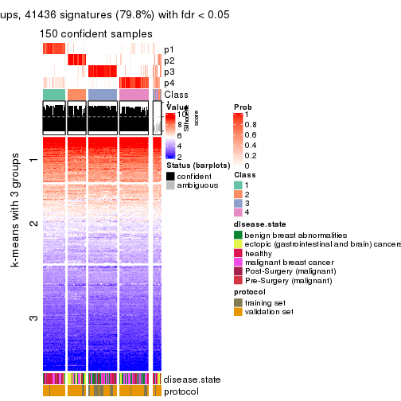</p>

</div>
<div id='tab-CV-pam-get-signatures-no-scale-4'>
<pre><code class="r">get_signatures(res, k = 5, scale_rows = FALSE)
</code></pre>

<p></p>

</div>
<div id='tab-CV-pam-get-signatures-no-scale-5'>
<pre><code class="r">get_signatures(res, k = 6, scale_rows = FALSE)
</code></pre>

<p></p>

</div>
</div>


Compare the overlap of signatures from different k:

```r
compare_signatures(res)
```


`get_signature()` returns a data frame invisibly. TO get the list of signatures, the function
call should be assigned to a variable explicitly. In following code, if `plot` argument is set
to `FALSE`, no heatmap is plotted while only the differential analysis is performed.

```r
# code only for demonstration
tb = get_signature(res, k = ..., plot = FALSE)
```

An example of the output of `tb` is:

```
#>   which_row         fdr    mean_1    mean_2 scaled_mean_1 scaled_mean_2 km
#> 1        38 0.042760348  8.373488  9.131774    -0.5533452     0.5164555  1
#> 2        40 0.018707592  7.106213  8.469186    -0.6173731     0.5762149  1
#> 3        55 0.019134737 10.221463 11.207825    -0.6159697     0.5749050  1
#> 4        59 0.006059896  5.921854  7.869574    -0.6899429     0.6439467  1
#> 5        60 0.018055526  8.928898 10.211722    -0.6204761     0.5791110  1
#> 6        98 0.009384629 15.714769 14.887706     0.6635654    -0.6193277  2
...
```

The columns in `tb` are:

1. `which_row`: row indices corresponding to the input matrix.
2. `fdr`: FDR for the differential test. 
3. `mean_x`: The mean value in group x.
4. `scaled_mean_x`: The mean value in group x after rows are scaled.
5. `km`: Row groups if k-means clustering is applied to rows.


UMAP plot which shows how samples are separated.


<script>
$( function() {
	$( '#tabs-CV-pam-dimension-reduction' ).tabs();
} );
</script>
<div id='tabs-CV-pam-dimension-reduction'>
<ul>
<li><a href='#tab-CV-pam-dimension-reduction-1'>k = 2</a></li>
<li><a href='#tab-CV-pam-dimension-reduction-2'>k = 3</a></li>
<li><a href='#tab-CV-pam-dimension-reduction-3'>k = 4</a></li>
<li><a href='#tab-CV-pam-dimension-reduction-4'>k = 5</a></li>
<li><a href='#tab-CV-pam-dimension-reduction-5'>k = 6</a></li>
</ul>
<div id='tab-CV-pam-dimension-reduction-1'>
<pre><code class="r">dimension_reduction(res, k = 2, method = &quot;UMAP&quot;)
</code></pre>

<p></p>

</div>
<div id='tab-CV-pam-dimension-reduction-2'>
<pre><code class="r">dimension_reduction(res, k = 3, method = &quot;UMAP&quot;)
</code></pre>

<p></p>

</div>
<div id='tab-CV-pam-dimension-reduction-3'>
<pre><code class="r">dimension_reduction(res, k = 4, method = &quot;UMAP&quot;)
</code></pre>

<p></p>

</div>
<div id='tab-CV-pam-dimension-reduction-4'>
<pre><code class="r">dimension_reduction(res, k = 5, method = &quot;UMAP&quot;)
</code></pre>

<p></p>

</div>
<div id='tab-CV-pam-dimension-reduction-5'>
<pre><code class="r">dimension_reduction(res, k = 6, method = &quot;UMAP&quot;)
</code></pre>

<p></p>

</div>
</div>


Following heatmap shows how subgroups are split when increasing `k`:

```r
collect_classes(res)
```


Test correlation between subgroups and known annotations. If the known
annotation is numeric, one-way ANOVA test is applied, and if the known
annotation is discrete, chi-squared contingency table test is applied.

```r
test_to_known_factors(res)
```

```
#>          n disease.state(p) protocol(p) k
#> CV:pam 152         1.31e-01    8.85e-01 2
#> CV:pam 156         1.06e-16    7.49e-08 3
#> CV:pam 150         1.04e-13    2.32e-05 4
#> CV:pam 141         2.77e-18    8.06e-07 5
#> CV:pam 147         7.71e-20    7.78e-08 6
```


If matrix rows can be associated to genes, consider to use `GO_Enrichment(res,
...)` to perform function enrichment for the signature genes.


 

---------------------------------------------------


### CV:mclust


The object with results only for a single top-value method and a single partition method 
can be extracted as:

```r
res = res_list["CV", "mclust"]
# you can also extract it by
# res = res_list["CV:mclust"]
```

A summary of `res` and all the functions that can be applied to it:

```r
res
```

```
#> A 'ConsensusPartition' object with k = 2, 3, 4, 5, 6.
#>   On a matrix with 51941 rows and 162 columns.
#>   Top rows (1000, 2000, 3000, 4000, 5000) are extracted by 'CV' method.
#>   Subgroups are detected by 'mclust' method.
#>   Performed in total 1250 partitions by row resampling.
#>   Best k for subgroups seems to be 4.
#> 
#> Following methods can be applied to this 'ConsensusPartition' object:
#>  [1] "cola_report"             "collect_classes"         "collect_plots"          
#>  [4] "collect_stats"           "colnames"                "compare_signatures"     
#>  [7] "consensus_heatmap"       "dimension_reduction"     "functional_enrichment"  
#> [10] "get_anno_col"            "get_anno"                "get_classes"            
#> [13] "get_consensus"           "get_matrix"              "get_membership"         
#> [16] "get_param"               "get_signatures"          "get_stats"              
#> [19] "is_best_k"               "is_stable_k"             "membership_heatmap"     
#> [22] "ncol"                    "nrow"                    "plot_ecdf"              
#> [25] "rownames"                "select_partition_number" "show"                   
#> [28] "suggest_best_k"          "test_to_known_factors"
```

`collect_plots()` function collects all the plots made from `res` for all `k` (number of partitions)
into one single page to provide an easy and fast comparison between different `k`.

```r
collect_plots(res)
```


The plots are:

- The first row: a plot of the ECDF (Empirical cumulative distribution
  function) curves of the consensus matrix for each `k` and the heatmap of
  predicted classes for each `k`.
- The second row: heatmaps of the consensus matrix for each `k`.
- The third row: heatmaps of the membership matrix for each `k`.
- The fouth row: heatmaps of the signatures for each `k`.

All the plots in panels can be made by individual functions and they are
plotted later in this section.

`select_partition_number()` produces several plots showing different
statistics for choosing "optimized" `k`. There are following statistics:

- ECDF curves of the consensus matrix for each `k`;
- 1-PAC. [The PAC
  score](https://en.wikipedia.org/wiki/Consensus_clustering#Over-interpretation_potential_of_consensus_clustering)
  measures the proportion of the ambiguous subgrouping.
- Mean silhouette score.
- Concordance. The mean probability of fiting the consensus class ids in all
  partitions.
- Area increased. Denote $A_k$ as the area under the ECDF curve for current
  `k`, the area increased is defined as $A_k - A_{k-1}$.
- Rand index. The percent of pairs of samples that are both in a same cluster
  or both are not in a same cluster in the partition of k and k-1.
- Jaccard index. The ratio of pairs of samples are both in a same cluster in
  the partition of k and k-1 and the pairs of samples are both in a same
  cluster in the partition k or k-1.

The detailed explanations of these statistics can be found in [the cola
vignette](http://bioconductor.org/packages/devel/bioc/vignettes/cola/inst/doc/cola.html#toc_13).

Generally speaking, lower PAC score, higher mean silhouette score or higher
concordance corresponds to better partition. Rand index and Jaccard index
measure how similar the current partition is compared to partition with `k-1`.
If they are too similar, we won't accept `k` is better than `k-1`.

```r
select_partition_number(res)
```


The numeric values for all these statistics can be obtained by `get_stats()`.

```r
get_stats(res)
```

```
#>   k 1-PAC mean_silhouette concordance area_increased  Rand Jaccard
#> 2 2 0.713           0.850       0.940         0.3880 0.602   0.602
#> 3 3 0.509           0.754       0.847         0.5057 0.699   0.532
#> 4 4 0.670           0.737       0.887         0.1323 0.866   0.684
#> 5 5 0.611           0.657       0.834         0.1040 0.751   0.410
#> 6 6 0.611           0.594       0.729         0.0725 0.862   0.552
```

`suggest_best_k()` suggests the best $k$ based on these statistics. The rules are as follows:

- All $k$ with Jaccard index larger than 0.95 are removed because the increase of
  the partition number does not provides enough extra information. If all $k$ are removed,
  the best $k$ is assigned by `NA`.
- For $k$ with 1-PAC larger than 0.9, the maximal $k$ is taken as the "best k". Other $k$ is called "optional k".
- If it does not fit the second rule. The $k$ with the highest vote of highest
  1-PAC, mean silhouette and concordance is taken as the "best k".

```r
suggest_best_k(res)
```

```
#> [1] 4
```


Following shows the table of the partitions (You need to click the **show/hide
code output** link to see it). The membership matrix (columns with name `p*`)
is inferred by
[`clue::cl_consensus()`](https://www.rdocumentation.org/link/cl_consensus?package=clue)
function with the `SE` method. Basically the value in the membership matrix
represents the probability to belong to a certain group. The finall class
label for an item is determined with the group with highest probability it
belongs to.

In `get_classes()` function, the entropy is calculated from the membership
matrix and the silhouette score is calculated from the consensus matrix.


<script>
$( function() {
	$( '#tabs-CV-mclust-get-classes' ).tabs();
} );
</script>
<div id='tabs-CV-mclust-get-classes'>
<ul>
<li><a href='#tab-CV-mclust-get-classes-1'>k = 2</a></li>
<li><a href='#tab-CV-mclust-get-classes-2'>k = 3</a></li>
<li><a href='#tab-CV-mclust-get-classes-3'>k = 4</a></li>
<li><a href='#tab-CV-mclust-get-classes-4'>k = 5</a></li>
<li><a href='#tab-CV-mclust-get-classes-5'>k = 6</a></li>
</ul>

<div id='tab-CV-mclust-get-classes-1'>
<p><a id='tab-CV-mclust-get-classes-1-a' style='color:#0366d6' href='#'>show/hide code output</a></p>
<pre><code class="r">cbind(get_classes(res, k = 2), get_membership(res, k = 2))
</code></pre>

<pre><code>#&gt;           class entropy silhouette    p1    p2
#&gt; GSM682002     1  0.0000     0.9582 1.000 0.000
#&gt; GSM682003     2  0.0000     0.8595 0.000 1.000
#&gt; GSM682004     2  0.0000     0.8595 0.000 1.000
#&gt; GSM682005     1  0.0000     0.9582 1.000 0.000
#&gt; GSM682006     1  0.0000     0.9582 1.000 0.000
#&gt; GSM682007     1  0.0000     0.9582 1.000 0.000
#&gt; GSM682008     1  0.0000     0.9582 1.000 0.000
#&gt; GSM682009     1  0.9954     0.0543 0.540 0.460
#&gt; GSM682010     1  0.0000     0.9582 1.000 0.000
#&gt; GSM682011     1  0.0000     0.9582 1.000 0.000
#&gt; GSM682096     2  0.6801     0.7302 0.180 0.820
#&gt; GSM682097     1  0.4939     0.8528 0.892 0.108
#&gt; GSM682098     2  0.4562     0.8036 0.096 0.904
#&gt; GSM682099     1  0.5408     0.8140 0.876 0.124
#&gt; GSM682100     2  0.0000     0.8595 0.000 1.000
#&gt; GSM682101     2  0.0672     0.8556 0.008 0.992
#&gt; GSM682102     1  0.0000     0.9582 1.000 0.000
#&gt; GSM682103     1  0.0000     0.9582 1.000 0.000
#&gt; GSM682104     1  0.3584     0.8960 0.932 0.068
#&gt; GSM682105     1  0.0000     0.9582 1.000 0.000
#&gt; GSM682106     1  0.0000     0.9582 1.000 0.000
#&gt; GSM682107     1  0.0000     0.9582 1.000 0.000
#&gt; GSM682108     1  0.0672     0.9518 0.992 0.008
#&gt; GSM682109     1  0.1633     0.9380 0.976 0.024
#&gt; GSM682110     1  0.0000     0.9582 1.000 0.000
#&gt; GSM682111     1  0.4815     0.8576 0.896 0.104
#&gt; GSM682112     1  0.4815     0.8576 0.896 0.104
#&gt; GSM682113     1  0.0000     0.9582 1.000 0.000
#&gt; GSM682114     1  0.0000     0.9582 1.000 0.000
#&gt; GSM682115     1  0.0000     0.9582 1.000 0.000
#&gt; GSM682116     1  0.0000     0.9582 1.000 0.000
#&gt; GSM682117     1  0.0000     0.9582 1.000 0.000
#&gt; GSM682118     1  0.0000     0.9582 1.000 0.000
#&gt; GSM682119     1  0.0000     0.9582 1.000 0.000
#&gt; GSM682120     1  0.0000     0.9582 1.000 0.000
#&gt; GSM682121     1  0.0000     0.9582 1.000 0.000
#&gt; GSM682122     1  0.0000     0.9582 1.000 0.000
#&gt; GSM682012     2  0.0000     0.8595 0.000 1.000
#&gt; GSM682013     2  0.0000     0.8595 0.000 1.000
#&gt; GSM682014     2  0.0000     0.8595 0.000 1.000
#&gt; GSM682015     2  0.0000     0.8595 0.000 1.000
#&gt; GSM682016     2  0.6801     0.7242 0.180 0.820
#&gt; GSM682017     2  0.0000     0.8595 0.000 1.000
#&gt; GSM682018     2  0.0000     0.8595 0.000 1.000
#&gt; GSM682019     2  0.0000     0.8595 0.000 1.000
#&gt; GSM682020     2  0.0000     0.8595 0.000 1.000
#&gt; GSM682021     2  0.0672     0.8556 0.008 0.992
#&gt; GSM682022     2  0.0000     0.8595 0.000 1.000
#&gt; GSM682023     2  0.0000     0.8595 0.000 1.000
#&gt; GSM682024     1  0.0000     0.9582 1.000 0.000
#&gt; GSM682025     2  0.0000     0.8595 0.000 1.000
#&gt; GSM682026     2  0.0000     0.8595 0.000 1.000
#&gt; GSM682027     2  0.9988     0.2354 0.480 0.520
#&gt; GSM682028     2  0.9988     0.2354 0.480 0.520
#&gt; GSM682029     2  0.9988     0.2354 0.480 0.520
#&gt; GSM682030     2  0.9988     0.2354 0.480 0.520
#&gt; GSM682031     2  0.9988     0.2354 0.480 0.520
#&gt; GSM682032     2  0.9988     0.2354 0.480 0.520
#&gt; GSM682033     2  0.0000     0.8595 0.000 1.000
#&gt; GSM681992     1  0.9909     0.1117 0.556 0.444
#&gt; GSM681993     1  0.4815     0.8576 0.896 0.104
#&gt; GSM681994     1  0.0000     0.9582 1.000 0.000
#&gt; GSM681995     1  0.0000     0.9582 1.000 0.000
#&gt; GSM681996     1  0.0000     0.9582 1.000 0.000
#&gt; GSM681997     1  0.0000     0.9582 1.000 0.000
#&gt; GSM681998     1  0.0000     0.9582 1.000 0.000
#&gt; GSM681999     1  0.0000     0.9582 1.000 0.000
#&gt; GSM682000     1  0.0000     0.9582 1.000 0.000
#&gt; GSM682001     1  0.0000     0.9582 1.000 0.000
#&gt; GSM682055     2  1.0000     0.0856 0.496 0.504
#&gt; GSM682056     1  0.1184     0.9450 0.984 0.016
#&gt; GSM682057     2  0.0000     0.8595 0.000 1.000
#&gt; GSM682058     1  0.0000     0.9582 1.000 0.000
#&gt; GSM682059     2  0.0000     0.8595 0.000 1.000
#&gt; GSM682060     2  0.9427     0.4632 0.360 0.640
#&gt; GSM682061     2  0.9000     0.5383 0.316 0.684
#&gt; GSM682062     2  0.0000     0.8595 0.000 1.000
#&gt; GSM682063     2  0.0000     0.8595 0.000 1.000
#&gt; GSM682064     1  0.8207     0.6062 0.744 0.256
#&gt; GSM682065     1  0.0000     0.9582 1.000 0.000
#&gt; GSM682066     1  0.0000     0.9582 1.000 0.000
#&gt; GSM682067     1  0.0000     0.9582 1.000 0.000
#&gt; GSM682068     1  0.0000     0.9582 1.000 0.000
#&gt; GSM682069     1  0.0000     0.9582 1.000 0.000
#&gt; GSM682070     1  0.0000     0.9582 1.000 0.000
#&gt; GSM682071     2  0.9933     0.2293 0.452 0.548
#&gt; GSM682072     1  0.4562     0.8661 0.904 0.096
#&gt; GSM682073     1  0.2778     0.9159 0.952 0.048
#&gt; GSM682074     1  0.0000     0.9582 1.000 0.000
#&gt; GSM682075     1  0.0000     0.9582 1.000 0.000
#&gt; GSM682076     1  0.0000     0.9582 1.000 0.000
#&gt; GSM682077     1  0.0000     0.9582 1.000 0.000
#&gt; GSM682078     1  0.0000     0.9582 1.000 0.000
#&gt; GSM682079     1  0.0000     0.9582 1.000 0.000
#&gt; GSM682080     1  0.9209     0.4378 0.664 0.336
#&gt; GSM682081     1  0.4815     0.8576 0.896 0.104
#&gt; GSM682082     1  0.0000     0.9582 1.000 0.000
#&gt; GSM682083     1  0.0000     0.9582 1.000 0.000
#&gt; GSM682084     1  0.0000     0.9582 1.000 0.000
#&gt; GSM682085     1  0.0000     0.9582 1.000 0.000
#&gt; GSM682086     1  0.0000     0.9582 1.000 0.000
#&gt; GSM682087     1  0.0000     0.9582 1.000 0.000
#&gt; GSM682088     1  0.0000     0.9582 1.000 0.000
#&gt; GSM682089     1  0.0000     0.9582 1.000 0.000
#&gt; GSM682090     1  0.0000     0.9582 1.000 0.000
#&gt; GSM682091     1  0.0000     0.9582 1.000 0.000
#&gt; GSM682092     1  0.0000     0.9582 1.000 0.000
#&gt; GSM682093     1  0.0000     0.9582 1.000 0.000
#&gt; GSM682094     1  0.0000     0.9582 1.000 0.000
#&gt; GSM682095     2  0.0000     0.8595 0.000 1.000
#&gt; GSM681982     1  0.9129     0.4577 0.672 0.328
#&gt; GSM681983     1  0.0000     0.9582 1.000 0.000
#&gt; GSM681984     1  0.9944     0.0698 0.544 0.456
#&gt; GSM681985     1  0.0672     0.9518 0.992 0.008
#&gt; GSM681986     2  1.0000     0.0691 0.500 0.500
#&gt; GSM681987     2  0.0000     0.8595 0.000 1.000
#&gt; GSM681988     1  0.7299     0.7123 0.796 0.204
#&gt; GSM681989     1  0.9710     0.2674 0.600 0.400
#&gt; GSM681990     1  0.0000     0.9582 1.000 0.000
#&gt; GSM681991     2  0.0000     0.8595 0.000 1.000
#&gt; GSM682034     1  0.0000     0.9582 1.000 0.000
#&gt; GSM682035     1  0.0000     0.9582 1.000 0.000
#&gt; GSM682036     1  0.0000     0.9582 1.000 0.000
#&gt; GSM682037     1  0.0000     0.9582 1.000 0.000
#&gt; GSM682038     2  0.4939     0.7913 0.108 0.892
#&gt; GSM682039     1  0.0000     0.9582 1.000 0.000
#&gt; GSM682040     1  0.4815     0.8576 0.896 0.104
#&gt; GSM682041     1  0.0000     0.9582 1.000 0.000
#&gt; GSM682042     1  0.4815     0.8576 0.896 0.104
#&gt; GSM682043     1  0.0000     0.9582 1.000 0.000
#&gt; GSM682044     1  0.0000     0.9582 1.000 0.000
#&gt; GSM682045     1  0.0000     0.9582 1.000 0.000
#&gt; GSM682046     1  0.0000     0.9582 1.000 0.000
#&gt; GSM682047     1  0.0000     0.9582 1.000 0.000
#&gt; GSM682048     1  0.0000     0.9582 1.000 0.000
#&gt; GSM682049     1  0.0000     0.9582 1.000 0.000
#&gt; GSM682050     1  0.0000     0.9582 1.000 0.000
#&gt; GSM682051     1  0.0000     0.9582 1.000 0.000
#&gt; GSM682052     1  0.4815     0.8576 0.896 0.104
#&gt; GSM682053     1  0.0000     0.9582 1.000 0.000
#&gt; GSM682054     1  0.0000     0.9582 1.000 0.000
#&gt; GSM682123     1  0.0000     0.9582 1.000 0.000
#&gt; GSM682124     1  0.0000     0.9582 1.000 0.000
#&gt; GSM682125     1  0.0000     0.9582 1.000 0.000
#&gt; GSM682126     1  0.0000     0.9582 1.000 0.000
#&gt; GSM682127     1  0.0000     0.9582 1.000 0.000
#&gt; GSM682128     1  0.0000     0.9582 1.000 0.000
#&gt; GSM682129     2  0.0000     0.8595 0.000 1.000
#&gt; GSM682130     2  0.0000     0.8595 0.000 1.000
#&gt; GSM682131     2  0.0000     0.8595 0.000 1.000
#&gt; GSM682132     1  0.0000     0.9582 1.000 0.000
#&gt; GSM682133     1  0.0000     0.9582 1.000 0.000
#&gt; GSM682134     1  0.0000     0.9582 1.000 0.000
#&gt; GSM682135     1  0.0000     0.9582 1.000 0.000
#&gt; GSM682136     1  0.0000     0.9582 1.000 0.000
#&gt; GSM682137     1  0.0000     0.9582 1.000 0.000
#&gt; GSM682138     1  0.0000     0.9582 1.000 0.000
#&gt; GSM682139     1  0.0000     0.9582 1.000 0.000
#&gt; GSM682140     1  0.0000     0.9582 1.000 0.000
#&gt; GSM682141     1  0.0000     0.9582 1.000 0.000
#&gt; GSM682142     1  0.0000     0.9582 1.000 0.000
#&gt; GSM682143     2  0.0000     0.8595 0.000 1.000
</code></pre>

<script>
$('#tab-CV-mclust-get-classes-1-a').parent().next().next().hide();
$('#tab-CV-mclust-get-classes-1-a').click(function(){
  $('#tab-CV-mclust-get-classes-1-a').parent().next().next().toggle();
  return(false);
});
</script>
</div>

<div id='tab-CV-mclust-get-classes-2'>
<p><a id='tab-CV-mclust-get-classes-2-a' style='color:#0366d6' href='#'>show/hide code output</a></p>
<pre><code class="r">cbind(get_classes(res, k = 3), get_membership(res, k = 3))
</code></pre>

<pre><code>#&gt;           class entropy silhouette    p1    p2    p3
#&gt; GSM682002     1  0.0237     0.8780 0.996 0.000 0.004
#&gt; GSM682003     2  0.6095     0.6483 0.000 0.608 0.392
#&gt; GSM682004     2  0.2878     0.8732 0.000 0.904 0.096
#&gt; GSM682005     3  0.5621     0.7473 0.308 0.000 0.692
#&gt; GSM682006     3  0.5760     0.7255 0.328 0.000 0.672
#&gt; GSM682007     3  0.5650     0.7435 0.312 0.000 0.688
#&gt; GSM682008     3  0.5621     0.7473 0.308 0.000 0.692
#&gt; GSM682009     3  0.7003     0.7590 0.248 0.060 0.692
#&gt; GSM682010     1  0.4121     0.7729 0.832 0.000 0.168
#&gt; GSM682011     1  0.5254     0.7005 0.736 0.000 0.264
#&gt; GSM682096     3  0.7139     0.7590 0.244 0.068 0.688
#&gt; GSM682097     3  0.5560     0.7466 0.300 0.000 0.700
#&gt; GSM682098     3  0.7884     0.7464 0.224 0.120 0.656
#&gt; GSM682099     1  0.6244     0.1815 0.560 0.000 0.440
#&gt; GSM682100     2  0.0237     0.8946 0.000 0.996 0.004
#&gt; GSM682101     2  0.6349     0.6418 0.140 0.768 0.092
#&gt; GSM682102     1  0.1753     0.8669 0.952 0.000 0.048
#&gt; GSM682103     1  0.3551     0.8224 0.868 0.000 0.132
#&gt; GSM682104     3  0.5560     0.7466 0.300 0.000 0.700
#&gt; GSM682105     1  0.1529     0.8725 0.960 0.000 0.040
#&gt; GSM682106     1  0.4555     0.7268 0.800 0.000 0.200
#&gt; GSM682107     1  0.3619     0.8071 0.864 0.000 0.136
#&gt; GSM682108     3  0.5678     0.7397 0.316 0.000 0.684
#&gt; GSM682109     3  0.5591     0.7474 0.304 0.000 0.696
#&gt; GSM682110     3  0.6062     0.6299 0.384 0.000 0.616
#&gt; GSM682111     3  0.3482     0.7328 0.128 0.000 0.872
#&gt; GSM682112     3  0.2261     0.6821 0.068 0.000 0.932
#&gt; GSM682113     1  0.0592     0.8760 0.988 0.000 0.012
#&gt; GSM682114     3  0.6309     0.2701 0.496 0.000 0.504
#&gt; GSM682115     1  0.0000     0.8780 1.000 0.000 0.000
#&gt; GSM682116     1  0.0237     0.8780 0.996 0.000 0.004
#&gt; GSM682117     1  0.3267     0.8250 0.884 0.000 0.116
#&gt; GSM682118     1  0.2356     0.8602 0.928 0.000 0.072
#&gt; GSM682119     1  0.3879     0.7921 0.848 0.000 0.152
#&gt; GSM682120     1  0.0237     0.8780 0.996 0.000 0.004
#&gt; GSM682121     1  0.0237     0.8780 0.996 0.000 0.004
#&gt; GSM682122     1  0.6235    -0.0360 0.564 0.000 0.436
#&gt; GSM682012     2  0.4974     0.8119 0.000 0.764 0.236
#&gt; GSM682013     2  0.0747     0.8968 0.000 0.984 0.016
#&gt; GSM682014     2  0.1411     0.8975 0.000 0.964 0.036
#&gt; GSM682015     2  0.1411     0.8975 0.000 0.964 0.036
#&gt; GSM682016     3  0.5905     0.4740 0.044 0.184 0.772
#&gt; GSM682017     2  0.1411     0.8975 0.000 0.964 0.036
#&gt; GSM682018     2  0.2711     0.8322 0.000 0.912 0.088
#&gt; GSM682019     2  0.0424     0.8949 0.000 0.992 0.008
#&gt; GSM682020     2  0.0237     0.8946 0.000 0.996 0.004
#&gt; GSM682021     2  0.2796     0.8281 0.000 0.908 0.092
#&gt; GSM682022     2  0.0237     0.8946 0.000 0.996 0.004
#&gt; GSM682023     2  0.0892     0.8898 0.000 0.980 0.020
#&gt; GSM682024     1  0.2590     0.8662 0.924 0.004 0.072
#&gt; GSM682025     2  0.0237     0.8946 0.000 0.996 0.004
#&gt; GSM682026     2  0.1411     0.8975 0.000 0.964 0.036
#&gt; GSM682027     3  0.6632     0.3053 0.012 0.392 0.596
#&gt; GSM682028     3  0.6632     0.3053 0.012 0.392 0.596
#&gt; GSM682029     3  0.6632     0.3053 0.012 0.392 0.596
#&gt; GSM682030     3  0.6647     0.3029 0.012 0.396 0.592
#&gt; GSM682031     3  0.6647     0.3029 0.012 0.396 0.592
#&gt; GSM682032     3  0.6647     0.3029 0.012 0.396 0.592
#&gt; GSM682033     2  0.5178     0.7998 0.000 0.744 0.256
#&gt; GSM681992     3  0.7003     0.7590 0.248 0.060 0.692
#&gt; GSM681993     3  0.2356     0.6866 0.072 0.000 0.928
#&gt; GSM681994     1  0.5810     0.3817 0.664 0.000 0.336
#&gt; GSM681995     3  0.5621     0.7473 0.308 0.000 0.692
#&gt; GSM681996     3  0.5733     0.7302 0.324 0.000 0.676
#&gt; GSM681997     3  0.5621     0.7473 0.308 0.000 0.692
#&gt; GSM681998     3  0.5621     0.7473 0.308 0.000 0.692
#&gt; GSM681999     3  0.5621     0.7473 0.308 0.000 0.692
#&gt; GSM682000     3  0.5465     0.7136 0.288 0.000 0.712
#&gt; GSM682001     3  0.5327     0.7362 0.272 0.000 0.728
#&gt; GSM682055     3  0.2356     0.5991 0.000 0.072 0.928
#&gt; GSM682056     1  0.6307    -0.2340 0.512 0.000 0.488
#&gt; GSM682057     2  0.1529     0.8968 0.000 0.960 0.040
#&gt; GSM682058     3  0.6307     0.3264 0.488 0.000 0.512
#&gt; GSM682059     2  0.1411     0.8975 0.000 0.964 0.036
#&gt; GSM682060     3  0.8386     0.7121 0.224 0.156 0.620
#&gt; GSM682061     3  0.5136     0.5330 0.044 0.132 0.824
#&gt; GSM682062     2  0.0237     0.8946 0.000 0.996 0.004
#&gt; GSM682063     2  0.1411     0.8794 0.000 0.964 0.036
#&gt; GSM682064     1  0.5070     0.7684 0.772 0.004 0.224
#&gt; GSM682065     1  0.1964     0.8666 0.944 0.000 0.056
#&gt; GSM682066     1  0.3038     0.8373 0.896 0.000 0.104
#&gt; GSM682067     1  0.4062     0.8337 0.836 0.000 0.164
#&gt; GSM682068     1  0.6291     0.0306 0.532 0.000 0.468
#&gt; GSM682069     1  0.3879     0.8408 0.848 0.000 0.152
#&gt; GSM682070     1  0.1529     0.8761 0.960 0.000 0.040
#&gt; GSM682071     3  0.3155     0.6404 0.044 0.040 0.916
#&gt; GSM682072     3  0.5560     0.7466 0.300 0.000 0.700
#&gt; GSM682073     3  0.5815     0.7491 0.304 0.004 0.692
#&gt; GSM682074     1  0.0000     0.8780 1.000 0.000 0.000
#&gt; GSM682075     1  0.0424     0.8784 0.992 0.000 0.008
#&gt; GSM682076     1  0.0237     0.8780 0.996 0.000 0.004
#&gt; GSM682077     1  0.1964     0.8666 0.944 0.000 0.056
#&gt; GSM682078     1  0.1411     0.8738 0.964 0.000 0.036
#&gt; GSM682079     1  0.0000     0.8780 1.000 0.000 0.000
#&gt; GSM682080     3  0.2261     0.6821 0.068 0.000 0.932
#&gt; GSM682081     3  0.5109     0.7652 0.212 0.008 0.780
#&gt; GSM682082     1  0.2796     0.8454 0.908 0.000 0.092
#&gt; GSM682083     1  0.0237     0.8780 0.996 0.000 0.004
#&gt; GSM682084     1  0.4291     0.7642 0.820 0.000 0.180
#&gt; GSM682085     1  0.4654     0.7322 0.792 0.000 0.208
#&gt; GSM682086     1  0.1031     0.8792 0.976 0.000 0.024
#&gt; GSM682087     1  0.0592     0.8784 0.988 0.000 0.012
#&gt; GSM682088     1  0.0237     0.8780 0.996 0.000 0.004
#&gt; GSM682089     1  0.0592     0.8784 0.988 0.000 0.012
#&gt; GSM682090     1  0.0237     0.8780 0.996 0.000 0.004
#&gt; GSM682091     1  0.4346     0.7762 0.816 0.000 0.184
#&gt; GSM682092     1  0.0592     0.8760 0.988 0.000 0.012
#&gt; GSM682093     1  0.4399     0.7575 0.812 0.000 0.188
#&gt; GSM682094     1  0.3038     0.8344 0.896 0.000 0.104
#&gt; GSM682095     2  0.4974     0.8119 0.000 0.764 0.236
#&gt; GSM681982     3  0.2711     0.7021 0.088 0.000 0.912
#&gt; GSM681983     1  0.1860     0.8664 0.948 0.000 0.052
#&gt; GSM681984     3  0.3425     0.7209 0.112 0.004 0.884
#&gt; GSM681985     3  0.5497     0.7520 0.292 0.000 0.708
#&gt; GSM681986     3  0.6887     0.7630 0.236 0.060 0.704
#&gt; GSM681987     2  0.5968     0.6884 0.000 0.636 0.364
#&gt; GSM681988     3  0.4897     0.7584 0.172 0.016 0.812
#&gt; GSM681989     3  0.6668     0.7613 0.264 0.040 0.696
#&gt; GSM681990     3  0.6126     0.5943 0.400 0.000 0.600
#&gt; GSM681991     2  0.5327     0.7877 0.000 0.728 0.272
#&gt; GSM682034     1  0.1964     0.8666 0.944 0.000 0.056
#&gt; GSM682035     1  0.1964     0.8666 0.944 0.000 0.056
#&gt; GSM682036     1  0.4291     0.7680 0.820 0.000 0.180
#&gt; GSM682037     1  0.1964     0.8666 0.944 0.000 0.056
#&gt; GSM682038     3  0.3412     0.5307 0.000 0.124 0.876
#&gt; GSM682039     1  0.3038     0.8434 0.896 0.000 0.104
#&gt; GSM682040     3  0.2261     0.6821 0.068 0.000 0.932
#&gt; GSM682041     1  0.0424     0.8784 0.992 0.000 0.008
#&gt; GSM682042     3  0.2356     0.6866 0.072 0.000 0.928
#&gt; GSM682043     1  0.0000     0.8780 1.000 0.000 0.000
#&gt; GSM682044     1  0.1964     0.8666 0.944 0.000 0.056
#&gt; GSM682045     1  0.3551     0.8486 0.868 0.000 0.132
#&gt; GSM682046     1  0.1964     0.8666 0.944 0.000 0.056
#&gt; GSM682047     1  0.1643     0.8701 0.956 0.000 0.044
#&gt; GSM682048     1  0.2878     0.8485 0.904 0.000 0.096
#&gt; GSM682049     1  0.0237     0.8780 0.996 0.000 0.004
#&gt; GSM682050     1  0.1964     0.8666 0.944 0.000 0.056
#&gt; GSM682051     1  0.1289     0.8755 0.968 0.000 0.032
#&gt; GSM682052     3  0.2711     0.7021 0.088 0.000 0.912
#&gt; GSM682053     1  0.3116     0.8406 0.892 0.000 0.108
#&gt; GSM682054     1  0.1964     0.8666 0.944 0.000 0.056
#&gt; GSM682123     1  0.2066     0.8679 0.940 0.000 0.060
#&gt; GSM682124     1  0.1964     0.8666 0.944 0.000 0.056
#&gt; GSM682125     1  0.3038     0.8434 0.896 0.000 0.104
#&gt; GSM682126     1  0.1964     0.8666 0.944 0.000 0.056
#&gt; GSM682127     1  0.1964     0.8666 0.944 0.000 0.056
#&gt; GSM682128     1  0.3038     0.8379 0.896 0.000 0.104
#&gt; GSM682129     2  0.0747     0.8969 0.000 0.984 0.016
#&gt; GSM682130     2  0.0237     0.8946 0.000 0.996 0.004
#&gt; GSM682131     2  0.5254     0.7922 0.000 0.736 0.264
#&gt; GSM682132     1  0.6267     0.0373 0.548 0.000 0.452
#&gt; GSM682133     1  0.1753     0.8669 0.952 0.000 0.048
#&gt; GSM682134     1  0.1964     0.8666 0.944 0.000 0.056
#&gt; GSM682135     1  0.4796     0.7790 0.780 0.000 0.220
#&gt; GSM682136     1  0.1964     0.8666 0.944 0.000 0.056
#&gt; GSM682137     1  0.0237     0.8780 0.996 0.000 0.004
#&gt; GSM682138     1  0.0000     0.8780 1.000 0.000 0.000
#&gt; GSM682139     1  0.3619     0.8504 0.864 0.000 0.136
#&gt; GSM682140     1  0.0237     0.8780 0.996 0.000 0.004
#&gt; GSM682141     1  0.1964     0.8666 0.944 0.000 0.056
#&gt; GSM682142     1  0.1964     0.8666 0.944 0.000 0.056
#&gt; GSM682143     2  0.5706     0.7372 0.000 0.680 0.320
</code></pre>

<script>
$('#tab-CV-mclust-get-classes-2-a').parent().next().next().hide();
$('#tab-CV-mclust-get-classes-2-a').click(function(){
  $('#tab-CV-mclust-get-classes-2-a').parent().next().next().toggle();
  return(false);
});
</script>
</div>

<div id='tab-CV-mclust-get-classes-3'>
<p><a id='tab-CV-mclust-get-classes-3-a' style='color:#0366d6' href='#'>show/hide code output</a></p>
<pre><code class="r">cbind(get_classes(res, k = 4), get_membership(res, k = 4))
</code></pre>

<pre><code>#&gt;           class entropy silhouette    p1    p2    p3    p4
#&gt; GSM682002     1  0.0657     0.8918 0.984 0.000 0.012 0.004
#&gt; GSM682003     2  0.3978     0.7081 0.000 0.796 0.192 0.012
#&gt; GSM682004     2  0.1767     0.8982 0.000 0.944 0.044 0.012
#&gt; GSM682005     3  0.1174     0.7730 0.020 0.000 0.968 0.012
#&gt; GSM682006     3  0.1867     0.7607 0.072 0.000 0.928 0.000
#&gt; GSM682007     3  0.1389     0.7719 0.048 0.000 0.952 0.000
#&gt; GSM682008     3  0.1389     0.7719 0.048 0.000 0.952 0.000
#&gt; GSM682009     3  0.0657     0.7702 0.012 0.000 0.984 0.004
#&gt; GSM682010     1  0.4981     0.0337 0.536 0.000 0.464 0.000
#&gt; GSM682011     3  0.7744     0.0120 0.292 0.000 0.440 0.268
#&gt; GSM682096     3  0.2422     0.7649 0.028 0.016 0.928 0.028
#&gt; GSM682097     3  0.1411     0.7716 0.020 0.000 0.960 0.020
#&gt; GSM682098     3  0.2096     0.7665 0.016 0.016 0.940 0.028
#&gt; GSM682099     1  0.6265     0.1370 0.500 0.000 0.444 0.056
#&gt; GSM682100     2  0.0000     0.9289 0.000 1.000 0.000 0.000
#&gt; GSM682101     2  0.6116     0.2621 0.320 0.612 0.068 0.000
#&gt; GSM682102     1  0.0000     0.8885 1.000 0.000 0.000 0.000
#&gt; GSM682103     1  0.3659     0.8143 0.840 0.000 0.136 0.024
#&gt; GSM682104     3  0.1411     0.7716 0.020 0.000 0.960 0.020
#&gt; GSM682105     1  0.4889     0.4183 0.636 0.000 0.360 0.004
#&gt; GSM682106     3  0.1716     0.7666 0.064 0.000 0.936 0.000
#&gt; GSM682107     1  0.5296     0.0625 0.500 0.000 0.492 0.008
#&gt; GSM682108     3  0.0921     0.7742 0.028 0.000 0.972 0.000
#&gt; GSM682109     3  0.0921     0.7742 0.028 0.000 0.972 0.000
#&gt; GSM682110     3  0.1389     0.7719 0.048 0.000 0.952 0.000
#&gt; GSM682111     3  0.0000     0.7605 0.000 0.000 1.000 0.000
#&gt; GSM682112     3  0.4543     0.4849 0.324 0.000 0.676 0.000
#&gt; GSM682113     1  0.1182     0.8892 0.968 0.000 0.016 0.016
#&gt; GSM682114     3  0.4817     0.4150 0.388 0.000 0.612 0.000
#&gt; GSM682115     1  0.0000     0.8885 1.000 0.000 0.000 0.000
#&gt; GSM682116     1  0.0469     0.8919 0.988 0.000 0.012 0.000
#&gt; GSM682117     1  0.3266     0.7940 0.832 0.000 0.168 0.000
#&gt; GSM682118     1  0.3266     0.7884 0.832 0.000 0.168 0.000
#&gt; GSM682119     1  0.3688     0.7380 0.792 0.000 0.208 0.000
#&gt; GSM682120     1  0.0469     0.8919 0.988 0.000 0.012 0.000
#&gt; GSM682121     1  0.0779     0.8915 0.980 0.000 0.016 0.004
#&gt; GSM682122     3  0.3837     0.6411 0.224 0.000 0.776 0.000
#&gt; GSM682012     2  0.0469     0.9242 0.000 0.988 0.012 0.000
#&gt; GSM682013     2  0.0000     0.9289 0.000 1.000 0.000 0.000
#&gt; GSM682014     2  0.0000     0.9289 0.000 1.000 0.000 0.000
#&gt; GSM682015     2  0.0000     0.9289 0.000 1.000 0.000 0.000
#&gt; GSM682016     3  0.4134     0.5056 0.000 0.260 0.740 0.000
#&gt; GSM682017     2  0.0000     0.9289 0.000 1.000 0.000 0.000
#&gt; GSM682018     2  0.0672     0.9215 0.000 0.984 0.008 0.008
#&gt; GSM682019     2  0.0469     0.9242 0.000 0.988 0.012 0.000
#&gt; GSM682020     2  0.0000     0.9289 0.000 1.000 0.000 0.000
#&gt; GSM682021     2  0.2039     0.8796 0.016 0.940 0.036 0.008
#&gt; GSM682022     2  0.0000     0.9289 0.000 1.000 0.000 0.000
#&gt; GSM682023     2  0.0000     0.9289 0.000 1.000 0.000 0.000
#&gt; GSM682024     1  0.1520     0.8821 0.956 0.000 0.024 0.020
#&gt; GSM682025     2  0.0336     0.9263 0.000 0.992 0.008 0.000
#&gt; GSM682026     2  0.0000     0.9289 0.000 1.000 0.000 0.000
#&gt; GSM682027     4  0.5677     0.3698 0.000 0.332 0.040 0.628
#&gt; GSM682028     4  0.1936     0.7448 0.000 0.032 0.028 0.940
#&gt; GSM682029     4  0.1936     0.7448 0.000 0.032 0.028 0.940
#&gt; GSM682030     4  0.1022     0.7400 0.000 0.032 0.000 0.968
#&gt; GSM682031     4  0.1022     0.7400 0.000 0.032 0.000 0.968
#&gt; GSM682032     4  0.1022     0.7400 0.000 0.032 0.000 0.968
#&gt; GSM682033     2  0.4086     0.6455 0.000 0.776 0.216 0.008
#&gt; GSM681992     3  0.1411     0.7716 0.020 0.000 0.960 0.020
#&gt; GSM681993     3  0.0707     0.7659 0.020 0.000 0.980 0.000
#&gt; GSM681994     3  0.4277     0.5168 0.280 0.000 0.720 0.000
#&gt; GSM681995     3  0.6207    -0.1483 0.052 0.000 0.496 0.452
#&gt; GSM681996     3  0.1389     0.7719 0.048 0.000 0.952 0.000
#&gt; GSM681997     3  0.1389     0.7719 0.048 0.000 0.952 0.000
#&gt; GSM681998     3  0.1389     0.7719 0.048 0.000 0.952 0.000
#&gt; GSM681999     3  0.3004     0.7378 0.048 0.000 0.892 0.060
#&gt; GSM682000     4  0.6148     0.1039 0.048 0.000 0.468 0.484
#&gt; GSM682001     3  0.7204     0.1818 0.332 0.000 0.512 0.156
#&gt; GSM682055     3  0.2521     0.7205 0.000 0.064 0.912 0.024
#&gt; GSM682056     3  0.2882     0.7471 0.084 0.000 0.892 0.024
#&gt; GSM682057     2  0.0188     0.9276 0.000 0.996 0.004 0.000
#&gt; GSM682058     3  0.2111     0.7652 0.044 0.000 0.932 0.024
#&gt; GSM682059     2  0.0000     0.9289 0.000 1.000 0.000 0.000
#&gt; GSM682060     3  0.3751     0.5928 0.000 0.196 0.800 0.004
#&gt; GSM682061     3  0.3428     0.6229 0.000 0.144 0.844 0.012
#&gt; GSM682062     2  0.0000     0.9289 0.000 1.000 0.000 0.000
#&gt; GSM682063     2  0.0000     0.9289 0.000 1.000 0.000 0.000
#&gt; GSM682064     3  0.5691    -0.0413 0.468 0.000 0.508 0.024
#&gt; GSM682065     1  0.0000     0.8885 1.000 0.000 0.000 0.000
#&gt; GSM682066     1  0.3355     0.7957 0.836 0.000 0.160 0.004
#&gt; GSM682067     1  0.3853     0.7913 0.820 0.000 0.160 0.020
#&gt; GSM682068     4  0.7188     0.1096 0.136 0.000 0.432 0.432
#&gt; GSM682069     1  0.3554     0.8166 0.844 0.000 0.136 0.020
#&gt; GSM682070     1  0.2706     0.8576 0.900 0.000 0.080 0.020
#&gt; GSM682071     3  0.2610     0.6891 0.000 0.088 0.900 0.012
#&gt; GSM682072     3  0.0592     0.7715 0.016 0.000 0.984 0.000
#&gt; GSM682073     3  0.0817     0.7740 0.024 0.000 0.976 0.000
#&gt; GSM682074     1  0.0469     0.8919 0.988 0.000 0.012 0.000
#&gt; GSM682075     1  0.3870     0.7068 0.788 0.000 0.208 0.004
#&gt; GSM682076     1  0.0592     0.8919 0.984 0.000 0.016 0.000
#&gt; GSM682077     1  0.1042     0.8863 0.972 0.000 0.008 0.020
#&gt; GSM682078     1  0.0707     0.8910 0.980 0.000 0.020 0.000
#&gt; GSM682079     1  0.0469     0.8919 0.988 0.000 0.012 0.000
#&gt; GSM682080     3  0.0000     0.7605 0.000 0.000 1.000 0.000
#&gt; GSM682081     3  0.0707     0.7732 0.020 0.000 0.980 0.000
#&gt; GSM682082     1  0.4981    -0.0478 0.536 0.000 0.464 0.000
#&gt; GSM682083     1  0.0188     0.8898 0.996 0.000 0.004 0.000
#&gt; GSM682084     3  0.4761     0.4285 0.372 0.000 0.628 0.000
#&gt; GSM682085     3  0.4730     0.4425 0.364 0.000 0.636 0.000
#&gt; GSM682086     1  0.2944     0.8247 0.868 0.000 0.128 0.004
#&gt; GSM682087     1  0.0592     0.8919 0.984 0.000 0.016 0.000
#&gt; GSM682088     1  0.0779     0.8915 0.980 0.000 0.016 0.004
#&gt; GSM682089     1  0.0592     0.8919 0.984 0.000 0.016 0.000
#&gt; GSM682090     1  0.0592     0.8919 0.984 0.000 0.016 0.000
#&gt; GSM682091     1  0.4472     0.7293 0.760 0.000 0.220 0.020
#&gt; GSM682092     1  0.0469     0.8919 0.988 0.000 0.012 0.000
#&gt; GSM682093     3  0.3763     0.6986 0.144 0.000 0.832 0.024
#&gt; GSM682094     1  0.3668     0.7642 0.808 0.000 0.188 0.004
#&gt; GSM682095     2  0.1807     0.8987 0.000 0.940 0.052 0.008
#&gt; GSM681982     3  0.0000     0.7605 0.000 0.000 1.000 0.000
#&gt; GSM681983     1  0.0336     0.8911 0.992 0.000 0.008 0.000
#&gt; GSM681984     3  0.0000     0.7605 0.000 0.000 1.000 0.000
#&gt; GSM681985     3  0.4585     0.4758 0.332 0.000 0.668 0.000
#&gt; GSM681986     3  0.0000     0.7605 0.000 0.000 1.000 0.000
#&gt; GSM681987     2  0.3718     0.7466 0.000 0.820 0.168 0.012
#&gt; GSM681988     3  0.0707     0.7732 0.020 0.000 0.980 0.000
#&gt; GSM681989     3  0.0707     0.7732 0.020 0.000 0.980 0.000
#&gt; GSM681990     3  0.1716     0.7698 0.064 0.000 0.936 0.000
#&gt; GSM681991     2  0.1938     0.8964 0.000 0.936 0.052 0.012
#&gt; GSM682034     1  0.0707     0.8829 0.980 0.000 0.000 0.020
#&gt; GSM682035     1  0.0000     0.8885 1.000 0.000 0.000 0.000
#&gt; GSM682036     1  0.5036     0.6372 0.696 0.000 0.280 0.024
#&gt; GSM682037     1  0.0469     0.8860 0.988 0.000 0.000 0.012
#&gt; GSM682038     3  0.3428     0.6301 0.000 0.144 0.844 0.012
#&gt; GSM682039     3  0.5428     0.4081 0.380 0.000 0.600 0.020
#&gt; GSM682040     3  0.5936     0.4440 0.324 0.056 0.620 0.000
#&gt; GSM682041     1  0.0592     0.8919 0.984 0.000 0.016 0.000
#&gt; GSM682042     3  0.1867     0.7399 0.072 0.000 0.928 0.000
#&gt; GSM682043     1  0.0000     0.8885 1.000 0.000 0.000 0.000
#&gt; GSM682044     1  0.0707     0.8829 0.980 0.000 0.000 0.020
#&gt; GSM682045     1  0.2973     0.8485 0.884 0.000 0.096 0.020
#&gt; GSM682046     1  0.0000     0.8885 1.000 0.000 0.000 0.000
#&gt; GSM682047     1  0.1302     0.8815 0.956 0.000 0.044 0.000
#&gt; GSM682048     1  0.2174     0.8731 0.928 0.000 0.052 0.020
#&gt; GSM682049     1  0.0336     0.8912 0.992 0.000 0.008 0.000
#&gt; GSM682050     1  0.0000     0.8885 1.000 0.000 0.000 0.000
#&gt; GSM682051     1  0.1004     0.8894 0.972 0.000 0.024 0.004
#&gt; GSM682052     3  0.3870     0.6158 0.208 0.000 0.788 0.004
#&gt; GSM682053     3  0.5570     0.2791 0.440 0.000 0.540 0.020
#&gt; GSM682054     1  0.0000     0.8885 1.000 0.000 0.000 0.000
#&gt; GSM682123     1  0.1297     0.8826 0.964 0.000 0.016 0.020
#&gt; GSM682124     1  0.0895     0.8812 0.976 0.000 0.004 0.020
#&gt; GSM682125     1  0.2563     0.8620 0.908 0.000 0.072 0.020
#&gt; GSM682126     1  0.0000     0.8885 1.000 0.000 0.000 0.000
#&gt; GSM682127     1  0.0000     0.8885 1.000 0.000 0.000 0.000
#&gt; GSM682128     1  0.5080     0.2747 0.576 0.000 0.420 0.004
#&gt; GSM682129     2  0.0000     0.9289 0.000 1.000 0.000 0.000
#&gt; GSM682130     2  0.0000     0.9289 0.000 1.000 0.000 0.000
#&gt; GSM682131     2  0.0817     0.9166 0.000 0.976 0.024 0.000
#&gt; GSM682132     3  0.7720    -0.1527 0.228 0.000 0.412 0.360
#&gt; GSM682133     1  0.0000     0.8885 1.000 0.000 0.000 0.000
#&gt; GSM682134     1  0.1297     0.8826 0.964 0.000 0.016 0.020
#&gt; GSM682135     1  0.5038     0.5998 0.684 0.000 0.296 0.020
#&gt; GSM682136     1  0.0000     0.8885 1.000 0.000 0.000 0.000
#&gt; GSM682137     1  0.0592     0.8919 0.984 0.000 0.016 0.000
#&gt; GSM682138     1  0.0469     0.8919 0.988 0.000 0.012 0.000
#&gt; GSM682139     1  0.3099     0.8425 0.876 0.000 0.104 0.020
#&gt; GSM682140     1  0.0469     0.8919 0.988 0.000 0.012 0.000
#&gt; GSM682141     1  0.0707     0.8829 0.980 0.000 0.000 0.020
#&gt; GSM682142     1  0.0000     0.8885 1.000 0.000 0.000 0.000
#&gt; GSM682143     2  0.2255     0.8815 0.000 0.920 0.068 0.012
</code></pre>

<script>
$('#tab-CV-mclust-get-classes-3-a').parent().next().next().hide();
$('#tab-CV-mclust-get-classes-3-a').click(function(){
  $('#tab-CV-mclust-get-classes-3-a').parent().next().next().toggle();
  return(false);
});
</script>
</div>

<div id='tab-CV-mclust-get-classes-4'>
<p><a id='tab-CV-mclust-get-classes-4-a' style='color:#0366d6' href='#'>show/hide code output</a></p>
<pre><code class="r">cbind(get_classes(res, k = 5), get_membership(res, k = 5))
</code></pre>

<pre><code>#&gt;           class entropy silhouette    p1    p2    p3    p4    p5
#&gt; GSM682002     1  0.3966     0.4126 0.664 0.000 0.336 0.000 0.000
#&gt; GSM682003     5  0.2605     0.6721 0.000 0.148 0.000 0.000 0.852
#&gt; GSM682004     2  0.1544     0.9085 0.000 0.932 0.000 0.000 0.068
#&gt; GSM682005     3  0.2583     0.6843 0.004 0.000 0.864 0.000 0.132
#&gt; GSM682006     3  0.0290     0.7190 0.008 0.000 0.992 0.000 0.000
#&gt; GSM682007     3  0.0162     0.7145 0.000 0.000 0.996 0.000 0.004
#&gt; GSM682008     3  0.0510     0.7093 0.000 0.000 0.984 0.000 0.016
#&gt; GSM682009     5  0.4464     0.3766 0.008 0.000 0.408 0.000 0.584
#&gt; GSM682010     3  0.1952     0.7246 0.084 0.000 0.912 0.000 0.004
#&gt; GSM682011     3  0.4622     0.4668 0.040 0.000 0.684 0.276 0.000
#&gt; GSM682096     3  0.3565     0.6794 0.024 0.000 0.800 0.000 0.176
#&gt; GSM682097     5  0.3992     0.6409 0.012 0.000 0.268 0.000 0.720
#&gt; GSM682098     3  0.3551     0.6366 0.008 0.000 0.772 0.000 0.220
#&gt; GSM682099     3  0.4118     0.6868 0.076 0.000 0.812 0.092 0.020
#&gt; GSM682100     2  0.0000     0.9563 0.000 1.000 0.000 0.000 0.000
#&gt; GSM682101     2  0.5772     0.4548 0.176 0.660 0.016 0.000 0.148
#&gt; GSM682102     1  0.0000     0.7977 1.000 0.000 0.000 0.000 0.000
#&gt; GSM682103     3  0.3724     0.6703 0.204 0.000 0.776 0.000 0.020
#&gt; GSM682104     3  0.3942     0.5638 0.012 0.000 0.728 0.000 0.260
#&gt; GSM682105     3  0.3796     0.5813 0.300 0.000 0.700 0.000 0.000
#&gt; GSM682106     3  0.0000     0.7153 0.000 0.000 1.000 0.000 0.000
#&gt; GSM682107     3  0.0963     0.7221 0.036 0.000 0.964 0.000 0.000
#&gt; GSM682108     3  0.1205     0.7141 0.004 0.000 0.956 0.000 0.040
#&gt; GSM682109     3  0.3242     0.4637 0.000 0.000 0.784 0.000 0.216
#&gt; GSM682110     3  0.0000     0.7153 0.000 0.000 1.000 0.000 0.000
#&gt; GSM682111     5  0.2624     0.7628 0.012 0.000 0.116 0.000 0.872
#&gt; GSM682112     5  0.1444     0.7853 0.012 0.000 0.040 0.000 0.948
#&gt; GSM682113     1  0.4273     0.0471 0.552 0.000 0.448 0.000 0.000
#&gt; GSM682114     3  0.6054     0.4206 0.172 0.000 0.568 0.000 0.260
#&gt; GSM682115     1  0.0000     0.7977 1.000 0.000 0.000 0.000 0.000
#&gt; GSM682116     1  0.4171     0.2385 0.604 0.000 0.396 0.000 0.000
#&gt; GSM682117     3  0.2179     0.7008 0.112 0.000 0.888 0.000 0.000
#&gt; GSM682118     3  0.2561     0.7048 0.144 0.000 0.856 0.000 0.000
#&gt; GSM682119     3  0.1410     0.7254 0.060 0.000 0.940 0.000 0.000
#&gt; GSM682120     3  0.4287     0.2662 0.460 0.000 0.540 0.000 0.000
#&gt; GSM682121     3  0.4114     0.4657 0.376 0.000 0.624 0.000 0.000
#&gt; GSM682122     3  0.0771     0.7237 0.020 0.000 0.976 0.000 0.004
#&gt; GSM682012     2  0.2648     0.8096 0.000 0.848 0.000 0.000 0.152
#&gt; GSM682013     2  0.0000     0.9563 0.000 1.000 0.000 0.000 0.000
#&gt; GSM682014     2  0.0000     0.9563 0.000 1.000 0.000 0.000 0.000
#&gt; GSM682015     2  0.0000     0.9563 0.000 1.000 0.000 0.000 0.000
#&gt; GSM682016     5  0.3492     0.6679 0.000 0.188 0.016 0.000 0.796
#&gt; GSM682017     2  0.0000     0.9563 0.000 1.000 0.000 0.000 0.000
#&gt; GSM682018     2  0.0000     0.9563 0.000 1.000 0.000 0.000 0.000
#&gt; GSM682019     2  0.0000     0.9563 0.000 1.000 0.000 0.000 0.000
#&gt; GSM682020     2  0.0000     0.9563 0.000 1.000 0.000 0.000 0.000
#&gt; GSM682021     2  0.1211     0.9069 0.024 0.960 0.016 0.000 0.000
#&gt; GSM682022     2  0.0000     0.9563 0.000 1.000 0.000 0.000 0.000
#&gt; GSM682023     2  0.0000     0.9563 0.000 1.000 0.000 0.000 0.000
#&gt; GSM682024     1  0.1942     0.7464 0.920 0.000 0.012 0.000 0.068
#&gt; GSM682025     2  0.0000     0.9563 0.000 1.000 0.000 0.000 0.000
#&gt; GSM682026     2  0.0000     0.9563 0.000 1.000 0.000 0.000 0.000
#&gt; GSM682027     4  0.1041     0.9620 0.004 0.000 0.032 0.964 0.000
#&gt; GSM682028     4  0.0880     0.9662 0.000 0.000 0.032 0.968 0.000
#&gt; GSM682029     4  0.0794     0.9691 0.000 0.000 0.028 0.972 0.000
#&gt; GSM682030     4  0.0000     0.9701 0.000 0.000 0.000 1.000 0.000
#&gt; GSM682031     4  0.0000     0.9701 0.000 0.000 0.000 1.000 0.000
#&gt; GSM682032     4  0.0000     0.9701 0.000 0.000 0.000 1.000 0.000
#&gt; GSM682033     5  0.3424     0.6008 0.000 0.240 0.000 0.000 0.760
#&gt; GSM681992     3  0.3487     0.6339 0.008 0.000 0.780 0.000 0.212
#&gt; GSM681993     5  0.1597     0.7860 0.012 0.000 0.048 0.000 0.940
#&gt; GSM681994     3  0.0510     0.7212 0.016 0.000 0.984 0.000 0.000
#&gt; GSM681995     3  0.1914     0.7044 0.016 0.000 0.924 0.060 0.000
#&gt; GSM681996     3  0.0000     0.7153 0.000 0.000 1.000 0.000 0.000
#&gt; GSM681997     3  0.0000     0.7153 0.000 0.000 1.000 0.000 0.000
#&gt; GSM681998     3  0.0000     0.7153 0.000 0.000 1.000 0.000 0.000
#&gt; GSM681999     3  0.0000     0.7153 0.000 0.000 1.000 0.000 0.000
#&gt; GSM682000     3  0.4811    -0.0286 0.020 0.000 0.528 0.452 0.000
#&gt; GSM682001     3  0.0912     0.7196 0.016 0.000 0.972 0.012 0.000
#&gt; GSM682055     5  0.0955     0.7783 0.004 0.000 0.028 0.000 0.968
#&gt; GSM682056     3  0.5178    -0.0272 0.040 0.000 0.484 0.000 0.476
#&gt; GSM682057     2  0.0000     0.9563 0.000 1.000 0.000 0.000 0.000
#&gt; GSM682058     3  0.3863     0.6953 0.052 0.000 0.796 0.000 0.152
#&gt; GSM682059     2  0.0000     0.9563 0.000 1.000 0.000 0.000 0.000
#&gt; GSM682060     5  0.5836     0.5511 0.004 0.104 0.316 0.000 0.576
#&gt; GSM682061     5  0.2843     0.6804 0.000 0.144 0.008 0.000 0.848
#&gt; GSM682062     2  0.0000     0.9563 0.000 1.000 0.000 0.000 0.000
#&gt; GSM682063     2  0.0000     0.9563 0.000 1.000 0.000 0.000 0.000
#&gt; GSM682064     1  0.6342     0.0240 0.464 0.000 0.372 0.000 0.164
#&gt; GSM682065     1  0.0000     0.7977 1.000 0.000 0.000 0.000 0.000
#&gt; GSM682066     3  0.4161     0.4366 0.392 0.000 0.608 0.000 0.000
#&gt; GSM682067     1  0.3241     0.6611 0.832 0.000 0.024 0.000 0.144
#&gt; GSM682068     3  0.5309     0.2905 0.060 0.000 0.576 0.364 0.000
#&gt; GSM682069     1  0.3151     0.6647 0.836 0.000 0.020 0.000 0.144
#&gt; GSM682070     1  0.4147     0.4353 0.676 0.000 0.316 0.000 0.008
#&gt; GSM682071     5  0.0609     0.7708 0.000 0.000 0.020 0.000 0.980
#&gt; GSM682072     5  0.4397     0.3596 0.004 0.000 0.432 0.000 0.564
#&gt; GSM682073     3  0.4249    -0.2345 0.000 0.000 0.568 0.000 0.432
#&gt; GSM682074     1  0.3612     0.5357 0.732 0.000 0.268 0.000 0.000
#&gt; GSM682075     3  0.4114     0.4638 0.376 0.000 0.624 0.000 0.000
#&gt; GSM682076     3  0.4150     0.4435 0.388 0.000 0.612 0.000 0.000
#&gt; GSM682077     1  0.0290     0.7983 0.992 0.000 0.008 0.000 0.000
#&gt; GSM682078     3  0.3983     0.5292 0.340 0.000 0.660 0.000 0.000
#&gt; GSM682079     1  0.4150     0.2632 0.612 0.000 0.388 0.000 0.000
#&gt; GSM682080     5  0.1597     0.7860 0.012 0.000 0.048 0.000 0.940
#&gt; GSM682081     5  0.4101     0.5746 0.000 0.000 0.372 0.000 0.628
#&gt; GSM682082     3  0.2966     0.6827 0.184 0.000 0.816 0.000 0.000
#&gt; GSM682083     1  0.2329     0.7211 0.876 0.000 0.124 0.000 0.000
#&gt; GSM682084     3  0.5672     0.5629 0.180 0.000 0.632 0.000 0.188
#&gt; GSM682085     3  0.4558     0.6676 0.168 0.000 0.744 0.000 0.088
#&gt; GSM682086     3  0.4192     0.2433 0.404 0.000 0.596 0.000 0.000
#&gt; GSM682087     3  0.4030     0.5079 0.352 0.000 0.648 0.000 0.000
#&gt; GSM682088     1  0.3966     0.3999 0.664 0.000 0.336 0.000 0.000
#&gt; GSM682089     3  0.4256     0.3370 0.436 0.000 0.564 0.000 0.000
#&gt; GSM682090     3  0.4304     0.1909 0.484 0.000 0.516 0.000 0.000
#&gt; GSM682091     3  0.5886     0.5016 0.272 0.000 0.584 0.000 0.144
#&gt; GSM682092     1  0.4305    -0.1191 0.512 0.000 0.488 0.000 0.000
#&gt; GSM682093     3  0.4049     0.6792 0.056 0.000 0.780 0.000 0.164
#&gt; GSM682094     3  0.2732     0.6716 0.160 0.000 0.840 0.000 0.000
#&gt; GSM682095     2  0.2074     0.8780 0.000 0.896 0.000 0.000 0.104
#&gt; GSM681982     5  0.1444     0.7853 0.012 0.000 0.040 0.000 0.948
#&gt; GSM681983     1  0.0510     0.7967 0.984 0.000 0.016 0.000 0.000
#&gt; GSM681984     5  0.1444     0.7853 0.012 0.000 0.040 0.000 0.948
#&gt; GSM681985     5  0.3319     0.7311 0.020 0.000 0.160 0.000 0.820
#&gt; GSM681986     5  0.1894     0.7810 0.008 0.000 0.072 0.000 0.920
#&gt; GSM681987     5  0.2690     0.6653 0.000 0.156 0.000 0.000 0.844
#&gt; GSM681988     5  0.2806     0.7471 0.004 0.000 0.152 0.000 0.844
#&gt; GSM681989     5  0.4415     0.3160 0.004 0.000 0.444 0.000 0.552
#&gt; GSM681990     3  0.0000     0.7153 0.000 0.000 1.000 0.000 0.000
#&gt; GSM681991     2  0.2329     0.8628 0.000 0.876 0.000 0.000 0.124
#&gt; GSM682034     1  0.0000     0.7977 1.000 0.000 0.000 0.000 0.000
#&gt; GSM682035     1  0.0290     0.7983 0.992 0.000 0.008 0.000 0.000
#&gt; GSM682036     3  0.4428     0.6850 0.096 0.000 0.760 0.000 0.144
#&gt; GSM682037     1  0.0000     0.7977 1.000 0.000 0.000 0.000 0.000
#&gt; GSM682038     5  0.0798     0.7683 0.000 0.008 0.016 0.000 0.976
#&gt; GSM682039     3  0.4558     0.6722 0.080 0.000 0.740 0.000 0.180
#&gt; GSM682040     5  0.1485     0.7812 0.020 0.000 0.032 0.000 0.948
#&gt; GSM682041     1  0.4235     0.1352 0.576 0.000 0.424 0.000 0.000
#&gt; GSM682042     5  0.1626     0.7849 0.016 0.000 0.044 0.000 0.940
#&gt; GSM682043     1  0.1671     0.7595 0.924 0.000 0.076 0.000 0.000
#&gt; GSM682044     1  0.0000     0.7977 1.000 0.000 0.000 0.000 0.000
#&gt; GSM682045     1  0.6154     0.1739 0.508 0.000 0.348 0.000 0.144
#&gt; GSM682046     1  0.0000     0.7977 1.000 0.000 0.000 0.000 0.000
#&gt; GSM682047     3  0.3837     0.5755 0.308 0.000 0.692 0.000 0.000
#&gt; GSM682048     3  0.6219     0.1292 0.424 0.000 0.436 0.000 0.140
#&gt; GSM682049     1  0.0290     0.7983 0.992 0.000 0.008 0.000 0.000
#&gt; GSM682050     1  0.0000     0.7977 1.000 0.000 0.000 0.000 0.000
#&gt; GSM682051     3  0.4304     0.1931 0.484 0.000 0.516 0.000 0.000
#&gt; GSM682052     5  0.1872     0.7831 0.020 0.000 0.052 0.000 0.928
#&gt; GSM682053     3  0.6062     0.5156 0.268 0.000 0.564 0.000 0.168
#&gt; GSM682054     1  0.0000     0.7977 1.000 0.000 0.000 0.000 0.000
#&gt; GSM682123     1  0.0290     0.7983 0.992 0.000 0.008 0.000 0.000
#&gt; GSM682124     1  0.0000     0.7977 1.000 0.000 0.000 0.000 0.000
#&gt; GSM682125     3  0.6233     0.2109 0.396 0.000 0.460 0.000 0.144
#&gt; GSM682126     1  0.0000     0.7977 1.000 0.000 0.000 0.000 0.000
#&gt; GSM682127     1  0.0000     0.7977 1.000 0.000 0.000 0.000 0.000
#&gt; GSM682128     3  0.2773     0.6945 0.164 0.000 0.836 0.000 0.000
#&gt; GSM682129     2  0.0000     0.9563 0.000 1.000 0.000 0.000 0.000
#&gt; GSM682130     2  0.0000     0.9563 0.000 1.000 0.000 0.000 0.000
#&gt; GSM682131     5  0.3796     0.5325 0.000 0.300 0.000 0.000 0.700
#&gt; GSM682132     3  0.5719     0.4170 0.120 0.000 0.596 0.284 0.000
#&gt; GSM682133     1  0.0000     0.7977 1.000 0.000 0.000 0.000 0.000
#&gt; GSM682134     1  0.0290     0.7983 0.992 0.000 0.008 0.000 0.000
#&gt; GSM682135     1  0.3495     0.6478 0.816 0.000 0.032 0.000 0.152
#&gt; GSM682136     1  0.0000     0.7977 1.000 0.000 0.000 0.000 0.000
#&gt; GSM682137     3  0.4201     0.4005 0.408 0.000 0.592 0.000 0.000
#&gt; GSM682138     1  0.3039     0.6454 0.808 0.000 0.192 0.000 0.000
#&gt; GSM682139     1  0.3055     0.6663 0.840 0.000 0.016 0.000 0.144
#&gt; GSM682140     1  0.3966     0.4043 0.664 0.000 0.336 0.000 0.000
#&gt; GSM682141     1  0.0000     0.7977 1.000 0.000 0.000 0.000 0.000
#&gt; GSM682142     1  0.0000     0.7977 1.000 0.000 0.000 0.000 0.000
#&gt; GSM682143     5  0.3074     0.6276 0.000 0.196 0.000 0.000 0.804
</code></pre>

<script>
$('#tab-CV-mclust-get-classes-4-a').parent().next().next().hide();
$('#tab-CV-mclust-get-classes-4-a').click(function(){
  $('#tab-CV-mclust-get-classes-4-a').parent().next().next().toggle();
  return(false);
});
</script>
</div>

<div id='tab-CV-mclust-get-classes-5'>
<p><a id='tab-CV-mclust-get-classes-5-a' style='color:#0366d6' href='#'>show/hide code output</a></p>
<pre><code class="r">cbind(get_classes(res, k = 6), get_membership(res, k = 6))
</code></pre>

<pre><code>#&gt;           class entropy silhouette    p1    p2    p3    p4    p5    p6
#&gt; GSM682002     1  0.4986     0.3331 0.556 0.000 0.024 0.388 0.032 0.000
#&gt; GSM682003     5  0.2988     0.7451 0.000 0.144 0.028 0.000 0.828 0.000
#&gt; GSM682004     2  0.2003     0.8287 0.000 0.884 0.000 0.000 0.116 0.000
#&gt; GSM682005     4  0.3076     0.5977 0.000 0.000 0.240 0.760 0.000 0.000
#&gt; GSM682006     4  0.2520     0.6418 0.004 0.000 0.152 0.844 0.000 0.000
#&gt; GSM682007     4  0.3695     0.3272 0.000 0.000 0.376 0.624 0.000 0.000
#&gt; GSM682008     4  0.3592     0.3640 0.000 0.000 0.344 0.656 0.000 0.000
#&gt; GSM682009     3  0.5595     0.5185 0.000 0.000 0.540 0.192 0.268 0.000
#&gt; GSM682010     3  0.5333     0.1108 0.112 0.000 0.588 0.292 0.008 0.000
#&gt; GSM682011     4  0.2290     0.6618 0.004 0.000 0.020 0.892 0.000 0.084
#&gt; GSM682096     4  0.3721     0.5197 0.004 0.000 0.252 0.728 0.016 0.000
#&gt; GSM682097     3  0.5121     0.5203 0.000 0.000 0.604 0.124 0.272 0.000
#&gt; GSM682098     4  0.5501    -0.0582 0.000 0.000 0.412 0.460 0.128 0.000
#&gt; GSM682099     4  0.1218     0.6765 0.004 0.000 0.012 0.956 0.000 0.028
#&gt; GSM682100     2  0.0000     0.9569 0.000 1.000 0.000 0.000 0.000 0.000
#&gt; GSM682101     2  0.3954     0.6206 0.052 0.780 0.148 0.020 0.000 0.000
#&gt; GSM682102     1  0.1806     0.7468 0.928 0.000 0.020 0.044 0.008 0.000
#&gt; GSM682103     4  0.5587     0.2663 0.124 0.000 0.396 0.476 0.004 0.000
#&gt; GSM682104     3  0.4281     0.5132 0.000 0.000 0.708 0.220 0.072 0.000
#&gt; GSM682105     4  0.3235     0.6576 0.136 0.000 0.008 0.824 0.032 0.000
#&gt; GSM682106     4  0.2454     0.6301 0.000 0.000 0.160 0.840 0.000 0.000
#&gt; GSM682107     4  0.2062     0.6662 0.008 0.000 0.088 0.900 0.000 0.004
#&gt; GSM682108     3  0.3737     0.1751 0.000 0.000 0.608 0.392 0.000 0.000
#&gt; GSM682109     3  0.4692     0.4521 0.000 0.000 0.644 0.276 0.080 0.000
#&gt; GSM682110     4  0.2454     0.6301 0.000 0.000 0.160 0.840 0.000 0.000
#&gt; GSM682111     3  0.3934     0.4979 0.000 0.000 0.676 0.020 0.304 0.000
#&gt; GSM682112     3  0.3922     0.4918 0.000 0.000 0.664 0.016 0.320 0.000
#&gt; GSM682113     1  0.4034     0.6215 0.708 0.000 0.024 0.260 0.008 0.000
#&gt; GSM682114     3  0.3886     0.4339 0.140 0.000 0.776 0.080 0.004 0.000
#&gt; GSM682115     1  0.0547     0.7448 0.980 0.000 0.020 0.000 0.000 0.000
#&gt; GSM682116     4  0.4896     0.1210 0.424 0.000 0.016 0.528 0.032 0.000
#&gt; GSM682117     4  0.4158     0.6740 0.076 0.000 0.112 0.780 0.032 0.000
#&gt; GSM682118     4  0.5740     0.5537 0.132 0.000 0.240 0.596 0.032 0.000
#&gt; GSM682119     3  0.5883    -0.2709 0.100 0.000 0.444 0.428 0.028 0.000
#&gt; GSM682120     4  0.4900     0.4262 0.296 0.000 0.036 0.636 0.032 0.000
#&gt; GSM682121     4  0.3791     0.6194 0.200 0.000 0.008 0.760 0.032 0.000
#&gt; GSM682122     3  0.4423     0.2000 0.028 0.000 0.608 0.360 0.004 0.000
#&gt; GSM682012     5  0.4134     0.6228 0.000 0.316 0.028 0.000 0.656 0.000
#&gt; GSM682013     2  0.0000     0.9569 0.000 1.000 0.000 0.000 0.000 0.000
#&gt; GSM682014     2  0.0000     0.9569 0.000 1.000 0.000 0.000 0.000 0.000
#&gt; GSM682015     2  0.0000     0.9569 0.000 1.000 0.000 0.000 0.000 0.000
#&gt; GSM682016     5  0.5742     0.3211 0.000 0.140 0.292 0.016 0.552 0.000
#&gt; GSM682017     2  0.0000     0.9569 0.000 1.000 0.000 0.000 0.000 0.000
#&gt; GSM682018     2  0.0000     0.9569 0.000 1.000 0.000 0.000 0.000 0.000
#&gt; GSM682019     2  0.1341     0.9206 0.000 0.948 0.028 0.000 0.024 0.000
#&gt; GSM682020     2  0.0000     0.9569 0.000 1.000 0.000 0.000 0.000 0.000
#&gt; GSM682021     2  0.1401     0.8899 0.028 0.948 0.004 0.020 0.000 0.000
#&gt; GSM682022     2  0.0000     0.9569 0.000 1.000 0.000 0.000 0.000 0.000
#&gt; GSM682023     2  0.0458     0.9513 0.000 0.984 0.000 0.000 0.016 0.000
#&gt; GSM682024     1  0.2704     0.6957 0.844 0.000 0.000 0.016 0.140 0.000
#&gt; GSM682025     2  0.1168     0.9270 0.000 0.956 0.028 0.000 0.016 0.000
#&gt; GSM682026     2  0.1003     0.9369 0.000 0.964 0.020 0.000 0.016 0.000
#&gt; GSM682027     6  0.1672     0.9393 0.000 0.000 0.004 0.048 0.016 0.932
#&gt; GSM682028     6  0.1327     0.9277 0.000 0.000 0.000 0.064 0.000 0.936
#&gt; GSM682029     6  0.1007     0.9492 0.000 0.000 0.000 0.044 0.000 0.956
#&gt; GSM682030     6  0.0000     0.9519 0.000 0.000 0.000 0.000 0.000 1.000
#&gt; GSM682031     6  0.0000     0.9519 0.000 0.000 0.000 0.000 0.000 1.000
#&gt; GSM682032     6  0.0000     0.9519 0.000 0.000 0.000 0.000 0.000 1.000
#&gt; GSM682033     5  0.3102     0.7453 0.000 0.156 0.028 0.000 0.816 0.000
#&gt; GSM681992     3  0.5434     0.3239 0.000 0.000 0.512 0.360 0.128 0.000
#&gt; GSM681993     3  0.3905     0.4918 0.000 0.000 0.668 0.016 0.316 0.000
#&gt; GSM681994     4  0.2442     0.6476 0.004 0.000 0.144 0.852 0.000 0.000
#&gt; GSM681995     4  0.2848     0.6423 0.004 0.000 0.124 0.848 0.000 0.024
#&gt; GSM681996     4  0.3050     0.5553 0.000 0.000 0.236 0.764 0.000 0.000
#&gt; GSM681997     4  0.2597     0.6210 0.000 0.000 0.176 0.824 0.000 0.000
#&gt; GSM681998     4  0.2697     0.6105 0.000 0.000 0.188 0.812 0.000 0.000
#&gt; GSM681999     4  0.2491     0.6277 0.000 0.000 0.164 0.836 0.000 0.000
#&gt; GSM682000     4  0.3610     0.6218 0.004 0.000 0.088 0.804 0.000 0.104
#&gt; GSM682001     4  0.2728     0.6538 0.004 0.000 0.100 0.864 0.000 0.032
#&gt; GSM682055     3  0.4264     0.2495 0.000 0.000 0.496 0.016 0.488 0.000
#&gt; GSM682056     3  0.5561     0.4910 0.000 0.000 0.552 0.244 0.204 0.000
#&gt; GSM682057     2  0.0820     0.9445 0.000 0.972 0.012 0.000 0.016 0.000
#&gt; GSM682058     4  0.2595     0.6216 0.004 0.000 0.160 0.836 0.000 0.000
#&gt; GSM682059     2  0.0458     0.9513 0.000 0.984 0.000 0.000 0.016 0.000
#&gt; GSM682060     3  0.7277     0.3637 0.000 0.140 0.408 0.180 0.272 0.000
#&gt; GSM682061     5  0.5357     0.3142 0.000 0.092 0.304 0.016 0.588 0.000
#&gt; GSM682062     2  0.0000     0.9569 0.000 1.000 0.000 0.000 0.000 0.000
#&gt; GSM682063     2  0.0000     0.9569 0.000 1.000 0.000 0.000 0.000 0.000
#&gt; GSM682064     1  0.5661     0.5455 0.552 0.000 0.192 0.252 0.004 0.000
#&gt; GSM682065     1  0.1564     0.7445 0.936 0.000 0.000 0.024 0.040 0.000
#&gt; GSM682066     4  0.4379     0.5718 0.224 0.000 0.028 0.716 0.032 0.000
#&gt; GSM682067     1  0.5965     0.6570 0.600 0.000 0.200 0.144 0.056 0.000
#&gt; GSM682068     4  0.1901     0.6643 0.004 0.000 0.008 0.912 0.000 0.076
#&gt; GSM682069     1  0.5603     0.6716 0.648 0.000 0.184 0.104 0.064 0.000
#&gt; GSM682070     1  0.5937     0.6548 0.600 0.000 0.172 0.180 0.048 0.000
#&gt; GSM682071     3  0.4224     0.3366 0.000 0.000 0.552 0.016 0.432 0.000
#&gt; GSM682072     3  0.3790     0.5533 0.000 0.000 0.772 0.072 0.156 0.000
#&gt; GSM682073     3  0.5771     0.4518 0.000 0.000 0.508 0.244 0.248 0.000
#&gt; GSM682074     1  0.5316     0.5778 0.592 0.000 0.240 0.168 0.000 0.000
#&gt; GSM682075     4  0.3235     0.6576 0.136 0.000 0.008 0.824 0.032 0.000
#&gt; GSM682076     4  0.4331     0.5645 0.228 0.000 0.024 0.716 0.032 0.000
#&gt; GSM682077     1  0.3233     0.7031 0.828 0.000 0.016 0.024 0.132 0.000
#&gt; GSM682078     4  0.6322     0.3399 0.220 0.000 0.244 0.504 0.032 0.000
#&gt; GSM682079     1  0.5405     0.6083 0.644 0.000 0.128 0.200 0.028 0.000
#&gt; GSM682080     3  0.3953     0.4814 0.000 0.000 0.656 0.016 0.328 0.000
#&gt; GSM682081     3  0.5711     0.4368 0.000 0.000 0.516 0.208 0.276 0.000
#&gt; GSM682082     4  0.4710     0.6371 0.144 0.000 0.144 0.704 0.008 0.000
#&gt; GSM682083     1  0.1672     0.7481 0.932 0.000 0.016 0.048 0.004 0.000
#&gt; GSM682084     3  0.3654     0.4119 0.144 0.000 0.792 0.060 0.004 0.000
#&gt; GSM682085     3  0.4022     0.4222 0.144 0.000 0.764 0.088 0.004 0.000
#&gt; GSM682086     4  0.4379     0.5145 0.224 0.000 0.028 0.716 0.032 0.000
#&gt; GSM682087     4  0.3730     0.6284 0.192 0.000 0.008 0.768 0.032 0.000
#&gt; GSM682088     1  0.5609     0.5384 0.552 0.000 0.276 0.168 0.004 0.000
#&gt; GSM682089     1  0.6084     0.2054 0.380 0.000 0.344 0.276 0.000 0.000
#&gt; GSM682090     1  0.6679     0.1669 0.376 0.000 0.272 0.320 0.032 0.000
#&gt; GSM682091     1  0.6080     0.3569 0.396 0.000 0.316 0.288 0.000 0.000
#&gt; GSM682092     1  0.5463     0.1185 0.460 0.000 0.084 0.444 0.012 0.000
#&gt; GSM682093     3  0.3789     0.2747 0.004 0.000 0.668 0.324 0.004 0.000
#&gt; GSM682094     4  0.2427     0.6778 0.036 0.000 0.032 0.900 0.032 0.000
#&gt; GSM682095     5  0.4449     0.2650 0.000 0.440 0.028 0.000 0.532 0.000
#&gt; GSM681982     3  0.3905     0.4918 0.000 0.000 0.668 0.016 0.316 0.000
#&gt; GSM681983     1  0.3668     0.7037 0.800 0.000 0.024 0.144 0.032 0.000
#&gt; GSM681984     3  0.3969     0.4842 0.000 0.000 0.652 0.016 0.332 0.000
#&gt; GSM681985     3  0.2480     0.5180 0.000 0.000 0.872 0.024 0.104 0.000
#&gt; GSM681986     3  0.5015     0.4943 0.000 0.000 0.564 0.084 0.352 0.000
#&gt; GSM681987     5  0.2988     0.7451 0.000 0.144 0.028 0.000 0.828 0.000
#&gt; GSM681988     3  0.4229     0.5008 0.000 0.000 0.668 0.040 0.292 0.000
#&gt; GSM681989     3  0.5746     0.5050 0.000 0.000 0.512 0.224 0.264 0.000
#&gt; GSM681990     4  0.3804     0.2710 0.000 0.000 0.424 0.576 0.000 0.000
#&gt; GSM681991     5  0.4417     0.3342 0.000 0.416 0.028 0.000 0.556 0.000
#&gt; GSM682034     1  0.2092     0.6941 0.876 0.000 0.000 0.000 0.124 0.000
#&gt; GSM682035     1  0.1503     0.7445 0.944 0.000 0.008 0.016 0.032 0.000
#&gt; GSM682036     4  0.4853     0.2047 0.056 0.000 0.456 0.488 0.000 0.000
#&gt; GSM682037     1  0.1528     0.7374 0.936 0.000 0.016 0.000 0.048 0.000
#&gt; GSM682038     5  0.3261     0.4674 0.000 0.000 0.204 0.016 0.780 0.000
#&gt; GSM682039     3  0.4616     0.3038 0.040 0.000 0.672 0.268 0.020 0.000
#&gt; GSM682040     3  0.4150     0.3930 0.000 0.000 0.592 0.016 0.392 0.000
#&gt; GSM682041     1  0.5559     0.5245 0.540 0.000 0.284 0.176 0.000 0.000
#&gt; GSM682042     3  0.4105     0.4621 0.000 0.000 0.632 0.020 0.348 0.000
#&gt; GSM682043     1  0.1666     0.7491 0.936 0.000 0.020 0.036 0.008 0.000
#&gt; GSM682044     1  0.2092     0.6941 0.876 0.000 0.000 0.000 0.124 0.000
#&gt; GSM682045     1  0.6174     0.6544 0.576 0.000 0.192 0.172 0.060 0.000
#&gt; GSM682046     1  0.0146     0.7416 0.996 0.000 0.004 0.000 0.000 0.000
#&gt; GSM682047     4  0.6443     0.2855 0.228 0.000 0.268 0.472 0.032 0.000
#&gt; GSM682048     1  0.7237     0.5049 0.388 0.000 0.312 0.172 0.128 0.000
#&gt; GSM682049     1  0.1794     0.7516 0.924 0.000 0.040 0.036 0.000 0.000
#&gt; GSM682050     1  0.0146     0.7416 0.996 0.000 0.004 0.000 0.000 0.000
#&gt; GSM682051     3  0.5745    -0.3775 0.412 0.000 0.420 0.168 0.000 0.000
#&gt; GSM682052     3  0.4249     0.4820 0.000 0.000 0.640 0.032 0.328 0.000
#&gt; GSM682053     3  0.5565     0.3183 0.052 0.000 0.652 0.160 0.136 0.000
#&gt; GSM682054     1  0.0547     0.7448 0.980 0.000 0.020 0.000 0.000 0.000
#&gt; GSM682123     1  0.3056     0.6933 0.832 0.000 0.012 0.016 0.140 0.000
#&gt; GSM682124     1  0.2260     0.6829 0.860 0.000 0.000 0.000 0.140 0.000
#&gt; GSM682125     1  0.6973     0.5430 0.440 0.000 0.304 0.128 0.128 0.000
#&gt; GSM682126     1  0.0146     0.7416 0.996 0.000 0.004 0.000 0.000 0.000
#&gt; GSM682127     1  0.0260     0.7451 0.992 0.000 0.000 0.008 0.000 0.000
#&gt; GSM682128     4  0.2691     0.6724 0.088 0.000 0.008 0.872 0.032 0.000
#&gt; GSM682129     2  0.0692     0.9481 0.000 0.976 0.004 0.000 0.020 0.000
#&gt; GSM682130     2  0.0000     0.9569 0.000 1.000 0.000 0.000 0.000 0.000
#&gt; GSM682131     5  0.3558     0.7284 0.000 0.212 0.028 0.000 0.760 0.000
#&gt; GSM682132     4  0.1862     0.6751 0.016 0.000 0.008 0.928 0.004 0.044
#&gt; GSM682133     1  0.1053     0.7456 0.964 0.000 0.020 0.004 0.012 0.000
#&gt; GSM682134     1  0.3056     0.6933 0.832 0.000 0.012 0.016 0.140 0.000
#&gt; GSM682135     1  0.4828     0.6664 0.668 0.000 0.176 0.156 0.000 0.000
#&gt; GSM682136     1  0.0146     0.7416 0.996 0.000 0.004 0.000 0.000 0.000
#&gt; GSM682137     4  0.3849     0.6102 0.208 0.000 0.008 0.752 0.032 0.000
#&gt; GSM682138     1  0.5336     0.5742 0.588 0.000 0.244 0.168 0.000 0.000
#&gt; GSM682139     1  0.3572     0.6846 0.820 0.000 0.100 0.020 0.060 0.000
#&gt; GSM682140     1  0.4454     0.6234 0.704 0.000 0.028 0.236 0.032 0.000
#&gt; GSM682141     1  0.2100     0.7010 0.884 0.000 0.004 0.000 0.112 0.000
#&gt; GSM682142     1  0.0909     0.7476 0.968 0.000 0.020 0.012 0.000 0.000
#&gt; GSM682143     5  0.2988     0.7451 0.000 0.144 0.028 0.000 0.828 0.000
</code></pre>

<script>
$('#tab-CV-mclust-get-classes-5-a').parent().next().next().hide();
$('#tab-CV-mclust-get-classes-5-a').click(function(){
  $('#tab-CV-mclust-get-classes-5-a').parent().next().next().toggle();
  return(false);
});
</script>
</div>
</div>

Heatmaps for the consensus matrix. It visualizes the probability of two
samples to be in a same group.


<script>
$( function() {
	$( '#tabs-CV-mclust-consensus-heatmap' ).tabs();
} );
</script>
<div id='tabs-CV-mclust-consensus-heatmap'>
<ul>
<li><a href='#tab-CV-mclust-consensus-heatmap-1'>k = 2</a></li>
<li><a href='#tab-CV-mclust-consensus-heatmap-2'>k = 3</a></li>
<li><a href='#tab-CV-mclust-consensus-heatmap-3'>k = 4</a></li>
<li><a href='#tab-CV-mclust-consensus-heatmap-4'>k = 5</a></li>
<li><a href='#tab-CV-mclust-consensus-heatmap-5'>k = 6</a></li>
</ul>
<div id='tab-CV-mclust-consensus-heatmap-1'>
<pre><code class="r">consensus_heatmap(res, k = 2)
</code></pre>

<p></p>

</div>
<div id='tab-CV-mclust-consensus-heatmap-2'>
<pre><code class="r">consensus_heatmap(res, k = 3)
</code></pre>

<p></p>

</div>
<div id='tab-CV-mclust-consensus-heatmap-3'>
<pre><code class="r">consensus_heatmap(res, k = 4)
</code></pre>

<p>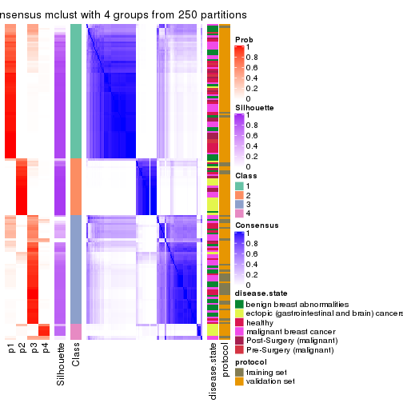</p>

</div>
<div id='tab-CV-mclust-consensus-heatmap-4'>
<pre><code class="r">consensus_heatmap(res, k = 5)
</code></pre>

<p></p>

</div>
<div id='tab-CV-mclust-consensus-heatmap-5'>
<pre><code class="r">consensus_heatmap(res, k = 6)
</code></pre>

<p></p>

</div>
</div>

Heatmaps for the membership of samples in all partitions to see how consistent they are:


<script>
$( function() {
	$( '#tabs-CV-mclust-membership-heatmap' ).tabs();
} );
</script>
<div id='tabs-CV-mclust-membership-heatmap'>
<ul>
<li><a href='#tab-CV-mclust-membership-heatmap-1'>k = 2</a></li>
<li><a href='#tab-CV-mclust-membership-heatmap-2'>k = 3</a></li>
<li><a href='#tab-CV-mclust-membership-heatmap-3'>k = 4</a></li>
<li><a href='#tab-CV-mclust-membership-heatmap-4'>k = 5</a></li>
<li><a href='#tab-CV-mclust-membership-heatmap-5'>k = 6</a></li>
</ul>
<div id='tab-CV-mclust-membership-heatmap-1'>
<pre><code class="r">membership_heatmap(res, k = 2)
</code></pre>

<p></p>

</div>
<div id='tab-CV-mclust-membership-heatmap-2'>
<pre><code class="r">membership_heatmap(res, k = 3)
</code></pre>

<p></p>

</div>
<div id='tab-CV-mclust-membership-heatmap-3'>
<pre><code class="r">membership_heatmap(res, k = 4)
</code></pre>

<p>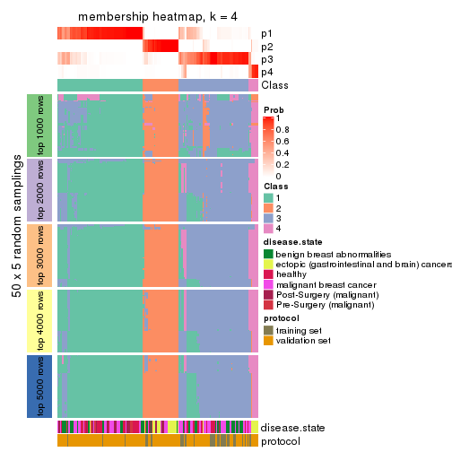</p>

</div>
<div id='tab-CV-mclust-membership-heatmap-4'>
<pre><code class="r">membership_heatmap(res, k = 5)
</code></pre>

<p></p>

</div>
<div id='tab-CV-mclust-membership-heatmap-5'>
<pre><code class="r">membership_heatmap(res, k = 6)
</code></pre>

<p></p>

</div>
</div>

As soon as we have had the classes for columns, we can look for signatures
which are significantly different between classes which can be candidate marks
for certain classes. Following are the heatmaps for signatures.


Signature heatmaps where rows are scaled:


<script>
$( function() {
	$( '#tabs-CV-mclust-get-signatures' ).tabs();
} );
</script>
<div id='tabs-CV-mclust-get-signatures'>
<ul>
<li><a href='#tab-CV-mclust-get-signatures-1'>k = 2</a></li>
<li><a href='#tab-CV-mclust-get-signatures-2'>k = 3</a></li>
<li><a href='#tab-CV-mclust-get-signatures-3'>k = 4</a></li>
<li><a href='#tab-CV-mclust-get-signatures-4'>k = 5</a></li>
<li><a href='#tab-CV-mclust-get-signatures-5'>k = 6</a></li>
</ul>
<div id='tab-CV-mclust-get-signatures-1'>
<pre><code class="r">get_signatures(res, k = 2)
</code></pre>

<p></p>

</div>
<div id='tab-CV-mclust-get-signatures-2'>
<pre><code class="r">get_signatures(res, k = 3)
</code></pre>

<p></p>

</div>
<div id='tab-CV-mclust-get-signatures-3'>
<pre><code class="r">get_signatures(res, k = 4)
</code></pre>

<p>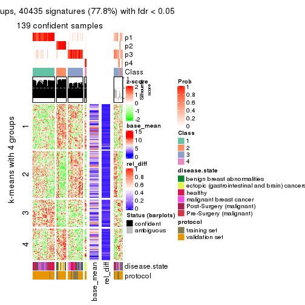</p>

</div>
<div id='tab-CV-mclust-get-signatures-4'>
<pre><code class="r">get_signatures(res, k = 5)
</code></pre>

<p></p>

</div>
<div id='tab-CV-mclust-get-signatures-5'>
<pre><code class="r">get_signatures(res, k = 6)
</code></pre>

<p></p>

</div>
</div>


Signature heatmaps where rows are not scaled:


<script>
$( function() {
	$( '#tabs-CV-mclust-get-signatures-no-scale' ).tabs();
} );
</script>
<div id='tabs-CV-mclust-get-signatures-no-scale'>
<ul>
<li><a href='#tab-CV-mclust-get-signatures-no-scale-1'>k = 2</a></li>
<li><a href='#tab-CV-mclust-get-signatures-no-scale-2'>k = 3</a></li>
<li><a href='#tab-CV-mclust-get-signatures-no-scale-3'>k = 4</a></li>
<li><a href='#tab-CV-mclust-get-signatures-no-scale-4'>k = 5</a></li>
<li><a href='#tab-CV-mclust-get-signatures-no-scale-5'>k = 6</a></li>
</ul>
<div id='tab-CV-mclust-get-signatures-no-scale-1'>
<pre><code class="r">get_signatures(res, k = 2, scale_rows = FALSE)
</code></pre>

<p></p>

</div>
<div id='tab-CV-mclust-get-signatures-no-scale-2'>
<pre><code class="r">get_signatures(res, k = 3, scale_rows = FALSE)
</code></pre>

<p></p>

</div>
<div id='tab-CV-mclust-get-signatures-no-scale-3'>
<pre><code class="r">get_signatures(res, k = 4, scale_rows = FALSE)
</code></pre>

<p></p>

</div>
<div id='tab-CV-mclust-get-signatures-no-scale-4'>
<pre><code class="r">get_signatures(res, k = 5, scale_rows = FALSE)
</code></pre>

<p></p>

</div>
<div id='tab-CV-mclust-get-signatures-no-scale-5'>
<pre><code class="r">get_signatures(res, k = 6, scale_rows = FALSE)
</code></pre>

<p>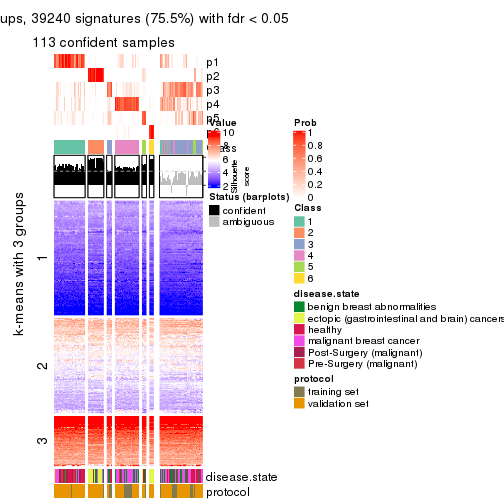</p>

</div>
</div>


Compare the overlap of signatures from different k:

```r
compare_signatures(res)
```


`get_signature()` returns a data frame invisibly. TO get the list of signatures, the function
call should be assigned to a variable explicitly. In following code, if `plot` argument is set
to `FALSE`, no heatmap is plotted while only the differential analysis is performed.

```r
# code only for demonstration
tb = get_signature(res, k = ..., plot = FALSE)
```

An example of the output of `tb` is:

```
#>   which_row         fdr    mean_1    mean_2 scaled_mean_1 scaled_mean_2 km
#> 1        38 0.042760348  8.373488  9.131774    -0.5533452     0.5164555  1
#> 2        40 0.018707592  7.106213  8.469186    -0.6173731     0.5762149  1
#> 3        55 0.019134737 10.221463 11.207825    -0.6159697     0.5749050  1
#> 4        59 0.006059896  5.921854  7.869574    -0.6899429     0.6439467  1
#> 5        60 0.018055526  8.928898 10.211722    -0.6204761     0.5791110  1
#> 6        98 0.009384629 15.714769 14.887706     0.6635654    -0.6193277  2
...
```

The columns in `tb` are:

1. `which_row`: row indices corresponding to the input matrix.
2. `fdr`: FDR for the differential test. 
3. `mean_x`: The mean value in group x.
4. `scaled_mean_x`: The mean value in group x after rows are scaled.
5. `km`: Row groups if k-means clustering is applied to rows.


UMAP plot which shows how samples are separated.


<script>
$( function() {
	$( '#tabs-CV-mclust-dimension-reduction' ).tabs();
} );
</script>
<div id='tabs-CV-mclust-dimension-reduction'>
<ul>
<li><a href='#tab-CV-mclust-dimension-reduction-1'>k = 2</a></li>
<li><a href='#tab-CV-mclust-dimension-reduction-2'>k = 3</a></li>
<li><a href='#tab-CV-mclust-dimension-reduction-3'>k = 4</a></li>
<li><a href='#tab-CV-mclust-dimension-reduction-4'>k = 5</a></li>
<li><a href='#tab-CV-mclust-dimension-reduction-5'>k = 6</a></li>
</ul>
<div id='tab-CV-mclust-dimension-reduction-1'>
<pre><code class="r">dimension_reduction(res, k = 2, method = &quot;UMAP&quot;)
</code></pre>

<p></p>

</div>
<div id='tab-CV-mclust-dimension-reduction-2'>
<pre><code class="r">dimension_reduction(res, k = 3, method = &quot;UMAP&quot;)
</code></pre>

<p></p>

</div>
<div id='tab-CV-mclust-dimension-reduction-3'>
<pre><code class="r">dimension_reduction(res, k = 4, method = &quot;UMAP&quot;)
</code></pre>

<p></p>

</div>
<div id='tab-CV-mclust-dimension-reduction-4'>
<pre><code class="r">dimension_reduction(res, k = 5, method = &quot;UMAP&quot;)
</code></pre>

<p></p>

</div>
<div id='tab-CV-mclust-dimension-reduction-5'>
<pre><code class="r">dimension_reduction(res, k = 6, method = &quot;UMAP&quot;)
</code></pre>

<p>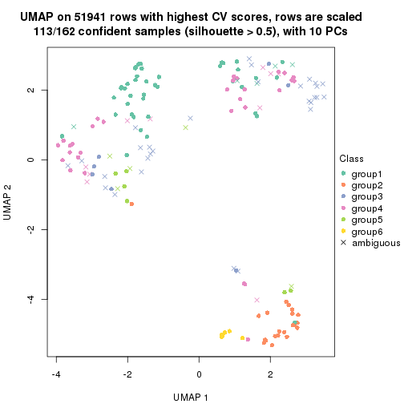</p>

</div>
</div>


Following heatmap shows how subgroups are split when increasing `k`:

```r
collect_classes(res)
```


Test correlation between subgroups and known annotations. If the known
annotation is numeric, one-way ANOVA test is applied, and if the known
annotation is discrete, chi-squared contingency table test is applied.

```r
test_to_known_factors(res)
```

```
#>             n disease.state(p) protocol(p) k
#> CV:mclust 146         4.88e-10    5.65e-01 2
#> CV:mclust 147         1.68e-11    2.52e-08 3
#> CV:mclust 139         2.24e-12    3.32e-06 4
#> CV:mclust 127         4.00e-15    3.18e-03 5
#> CV:mclust 113         1.90e-12    9.69e-05 6
```


If matrix rows can be associated to genes, consider to use `GO_Enrichment(res,
...)` to perform function enrichment for the signature genes.


 

---------------------------------------------------


### CV:NMF


The object with results only for a single top-value method and a single partition method 
can be extracted as:

```r
res = res_list["CV", "NMF"]
# you can also extract it by
# res = res_list["CV:NMF"]
```

A summary of `res` and all the functions that can be applied to it:

```r
res
```

```
#> A 'ConsensusPartition' object with k = 2, 3, 4, 5, 6.
#>   On a matrix with 51941 rows and 162 columns.
#>   Top rows (1000, 2000, 3000, 4000, 5000) are extracted by 'CV' method.
#>   Subgroups are detected by 'NMF' method.
#>   Performed in total 1250 partitions by row resampling.
#>   Best k for subgroups seems to be 3.
#> 
#> Following methods can be applied to this 'ConsensusPartition' object:
#>  [1] "cola_report"             "collect_classes"         "collect_plots"          
#>  [4] "collect_stats"           "colnames"                "compare_signatures"     
#>  [7] "consensus_heatmap"       "dimension_reduction"     "functional_enrichment"  
#> [10] "get_anno_col"            "get_anno"                "get_classes"            
#> [13] "get_consensus"           "get_matrix"              "get_membership"         
#> [16] "get_param"               "get_signatures"          "get_stats"              
#> [19] "is_best_k"               "is_stable_k"             "membership_heatmap"     
#> [22] "ncol"                    "nrow"                    "plot_ecdf"              
#> [25] "rownames"                "select_partition_number" "show"                   
#> [28] "suggest_best_k"          "test_to_known_factors"
```

`collect_plots()` function collects all the plots made from `res` for all `k` (number of partitions)
into one single page to provide an easy and fast comparison between different `k`.

```r
collect_plots(res)
```


The plots are:

- The first row: a plot of the ECDF (Empirical cumulative distribution
  function) curves of the consensus matrix for each `k` and the heatmap of
  predicted classes for each `k`.
- The second row: heatmaps of the consensus matrix for each `k`.
- The third row: heatmaps of the membership matrix for each `k`.
- The fouth row: heatmaps of the signatures for each `k`.

All the plots in panels can be made by individual functions and they are
plotted later in this section.

`select_partition_number()` produces several plots showing different
statistics for choosing "optimized" `k`. There are following statistics:

- ECDF curves of the consensus matrix for each `k`;
- 1-PAC. [The PAC
  score](https://en.wikipedia.org/wiki/Consensus_clustering#Over-interpretation_potential_of_consensus_clustering)
  measures the proportion of the ambiguous subgrouping.
- Mean silhouette score.
- Concordance. The mean probability of fiting the consensus class ids in all
  partitions.
- Area increased. Denote $A_k$ as the area under the ECDF curve for current
  `k`, the area increased is defined as $A_k - A_{k-1}$.
- Rand index. The percent of pairs of samples that are both in a same cluster
  or both are not in a same cluster in the partition of k and k-1.
- Jaccard index. The ratio of pairs of samples are both in a same cluster in
  the partition of k and k-1 and the pairs of samples are both in a same
  cluster in the partition k or k-1.

The detailed explanations of these statistics can be found in [the cola
vignette](http://bioconductor.org/packages/devel/bioc/vignettes/cola/inst/doc/cola.html#toc_13).

Generally speaking, lower PAC score, higher mean silhouette score or higher
concordance corresponds to better partition. Rand index and Jaccard index
measure how similar the current partition is compared to partition with `k-1`.
If they are too similar, we won't accept `k` is better than `k-1`.

```r
select_partition_number(res)
```


The numeric values for all these statistics can be obtained by `get_stats()`.

```r
get_stats(res)
```

```
#>   k 1-PAC mean_silhouette concordance area_increased  Rand Jaccard
#> 2 2 0.819           0.908       0.960         0.4378 0.557   0.557
#> 3 3 0.580           0.778       0.881         0.5005 0.708   0.511
#> 4 4 0.666           0.737       0.869         0.1329 0.784   0.468
#> 5 5 0.617           0.496       0.675         0.0689 0.850   0.510
#> 6 6 0.681           0.635       0.785         0.0390 0.862   0.471
```

`suggest_best_k()` suggests the best $k$ based on these statistics. The rules are as follows:

- All $k$ with Jaccard index larger than 0.95 are removed because the increase of
  the partition number does not provides enough extra information. If all $k$ are removed,
  the best $k$ is assigned by `NA`.
- For $k$ with 1-PAC larger than 0.9, the maximal $k$ is taken as the "best k". Other $k$ is called "optional k".
- If it does not fit the second rule. The $k$ with the highest vote of highest
  1-PAC, mean silhouette and concordance is taken as the "best k".

```r
suggest_best_k(res)
```

```
#> [1] 3
```


Following shows the table of the partitions (You need to click the **show/hide
code output** link to see it). The membership matrix (columns with name `p*`)
is inferred by
[`clue::cl_consensus()`](https://www.rdocumentation.org/link/cl_consensus?package=clue)
function with the `SE` method. Basically the value in the membership matrix
represents the probability to belong to a certain group. The finall class
label for an item is determined with the group with highest probability it
belongs to.

In `get_classes()` function, the entropy is calculated from the membership
matrix and the silhouette score is calculated from the consensus matrix.


<script>
$( function() {
	$( '#tabs-CV-NMF-get-classes' ).tabs();
} );
</script>
<div id='tabs-CV-NMF-get-classes'>
<ul>
<li><a href='#tab-CV-NMF-get-classes-1'>k = 2</a></li>
<li><a href='#tab-CV-NMF-get-classes-2'>k = 3</a></li>
<li><a href='#tab-CV-NMF-get-classes-3'>k = 4</a></li>
<li><a href='#tab-CV-NMF-get-classes-4'>k = 5</a></li>
<li><a href='#tab-CV-NMF-get-classes-5'>k = 6</a></li>
</ul>

<div id='tab-CV-NMF-get-classes-1'>
<p><a id='tab-CV-NMF-get-classes-1-a' style='color:#0366d6' href='#'>show/hide code output</a></p>
<pre><code class="r">cbind(get_classes(res, k = 2), get_membership(res, k = 2))
</code></pre>

<pre><code>#&gt;           class entropy silhouette    p1    p2
#&gt; GSM682002     1  0.0000     0.9722 1.000 0.000
#&gt; GSM682003     2  0.0000     0.9255 0.000 1.000
#&gt; GSM682004     2  0.0000     0.9255 0.000 1.000
#&gt; GSM682005     1  0.0672     0.9658 0.992 0.008
#&gt; GSM682006     1  0.0672     0.9658 0.992 0.008
#&gt; GSM682007     1  0.0000     0.9722 1.000 0.000
#&gt; GSM682008     1  0.0000     0.9722 1.000 0.000
#&gt; GSM682009     2  0.0000     0.9255 0.000 1.000
#&gt; GSM682010     1  0.0000     0.9722 1.000 0.000
#&gt; GSM682011     1  0.1414     0.9551 0.980 0.020
#&gt; GSM682096     2  0.5294     0.8519 0.120 0.880
#&gt; GSM682097     1  0.4690     0.8707 0.900 0.100
#&gt; GSM682098     2  0.0000     0.9255 0.000 1.000
#&gt; GSM682099     1  0.9963     0.0144 0.536 0.464
#&gt; GSM682100     2  0.0000     0.9255 0.000 1.000
#&gt; GSM682101     2  0.0000     0.9255 0.000 1.000
#&gt; GSM682102     1  0.0000     0.9722 1.000 0.000
#&gt; GSM682103     1  0.0000     0.9722 1.000 0.000
#&gt; GSM682104     1  0.0000     0.9722 1.000 0.000
#&gt; GSM682105     1  0.0000     0.9722 1.000 0.000
#&gt; GSM682106     1  0.0000     0.9722 1.000 0.000
#&gt; GSM682107     1  0.0000     0.9722 1.000 0.000
#&gt; GSM682108     1  0.0000     0.9722 1.000 0.000
#&gt; GSM682109     1  0.0000     0.9722 1.000 0.000
#&gt; GSM682110     1  0.0000     0.9722 1.000 0.000
#&gt; GSM682111     1  0.0000     0.9722 1.000 0.000
#&gt; GSM682112     1  0.1184     0.9587 0.984 0.016
#&gt; GSM682113     1  0.0000     0.9722 1.000 0.000
#&gt; GSM682114     1  0.0000     0.9722 1.000 0.000
#&gt; GSM682115     1  0.0000     0.9722 1.000 0.000
#&gt; GSM682116     1  0.0000     0.9722 1.000 0.000
#&gt; GSM682117     1  0.0000     0.9722 1.000 0.000
#&gt; GSM682118     1  0.0000     0.9722 1.000 0.000
#&gt; GSM682119     1  0.0000     0.9722 1.000 0.000
#&gt; GSM682120     1  0.0000     0.9722 1.000 0.000
#&gt; GSM682121     1  0.0000     0.9722 1.000 0.000
#&gt; GSM682122     1  0.0000     0.9722 1.000 0.000
#&gt; GSM682012     2  0.0000     0.9255 0.000 1.000
#&gt; GSM682013     2  0.0000     0.9255 0.000 1.000
#&gt; GSM682014     2  0.0000     0.9255 0.000 1.000
#&gt; GSM682015     2  0.0000     0.9255 0.000 1.000
#&gt; GSM682016     2  0.0000     0.9255 0.000 1.000
#&gt; GSM682017     2  0.0000     0.9255 0.000 1.000
#&gt; GSM682018     2  0.0000     0.9255 0.000 1.000
#&gt; GSM682019     2  0.0000     0.9255 0.000 1.000
#&gt; GSM682020     2  0.0000     0.9255 0.000 1.000
#&gt; GSM682021     2  0.0000     0.9255 0.000 1.000
#&gt; GSM682022     2  0.0000     0.9255 0.000 1.000
#&gt; GSM682023     2  0.0000     0.9255 0.000 1.000
#&gt; GSM682024     2  0.7528     0.7662 0.216 0.784
#&gt; GSM682025     2  0.0000     0.9255 0.000 1.000
#&gt; GSM682026     2  0.0000     0.9255 0.000 1.000
#&gt; GSM682027     2  0.1184     0.9177 0.016 0.984
#&gt; GSM682028     2  0.0000     0.9255 0.000 1.000
#&gt; GSM682029     2  0.7139     0.7868 0.196 0.804
#&gt; GSM682030     2  0.9209     0.5708 0.336 0.664
#&gt; GSM682031     2  0.6148     0.8281 0.152 0.848
#&gt; GSM682032     2  0.7528     0.7662 0.216 0.784
#&gt; GSM682033     2  0.0000     0.9255 0.000 1.000
#&gt; GSM681992     2  0.7745     0.7510 0.228 0.772
#&gt; GSM681993     1  0.0672     0.9659 0.992 0.008
#&gt; GSM681994     1  0.0000     0.9722 1.000 0.000
#&gt; GSM681995     1  0.0000     0.9722 1.000 0.000
#&gt; GSM681996     1  0.0000     0.9722 1.000 0.000
#&gt; GSM681997     1  0.0000     0.9722 1.000 0.000
#&gt; GSM681998     1  0.0000     0.9722 1.000 0.000
#&gt; GSM681999     1  0.0000     0.9722 1.000 0.000
#&gt; GSM682000     1  0.0000     0.9722 1.000 0.000
#&gt; GSM682001     1  0.1414     0.9551 0.980 0.020
#&gt; GSM682055     2  0.0000     0.9255 0.000 1.000
#&gt; GSM682056     1  0.9970     0.0927 0.532 0.468
#&gt; GSM682057     2  0.0000     0.9255 0.000 1.000
#&gt; GSM682058     1  0.4690     0.8666 0.900 0.100
#&gt; GSM682059     2  0.0000     0.9255 0.000 1.000
#&gt; GSM682060     2  0.2423     0.9036 0.040 0.960
#&gt; GSM682061     2  0.6623     0.7867 0.172 0.828
#&gt; GSM682062     2  0.0000     0.9255 0.000 1.000
#&gt; GSM682063     2  0.0000     0.9255 0.000 1.000
#&gt; GSM682064     2  0.8763     0.6474 0.296 0.704
#&gt; GSM682065     1  0.0000     0.9722 1.000 0.000
#&gt; GSM682066     1  0.0000     0.9722 1.000 0.000
#&gt; GSM682067     1  0.9087     0.4668 0.676 0.324
#&gt; GSM682068     1  0.0000     0.9722 1.000 0.000
#&gt; GSM682069     2  0.9933     0.2754 0.452 0.548
#&gt; GSM682070     1  0.0000     0.9722 1.000 0.000
#&gt; GSM682071     2  0.0000     0.9255 0.000 1.000
#&gt; GSM682072     1  0.0000     0.9722 1.000 0.000
#&gt; GSM682073     1  0.0000     0.9722 1.000 0.000
#&gt; GSM682074     1  0.0000     0.9722 1.000 0.000
#&gt; GSM682075     1  0.0000     0.9722 1.000 0.000
#&gt; GSM682076     1  0.0000     0.9722 1.000 0.000
#&gt; GSM682077     1  0.0000     0.9722 1.000 0.000
#&gt; GSM682078     1  0.0000     0.9722 1.000 0.000
#&gt; GSM682079     1  0.0000     0.9722 1.000 0.000
#&gt; GSM682080     2  0.9732     0.3436 0.404 0.596
#&gt; GSM682081     1  0.1184     0.9590 0.984 0.016
#&gt; GSM682082     1  0.0000     0.9722 1.000 0.000
#&gt; GSM682083     1  0.0000     0.9722 1.000 0.000
#&gt; GSM682084     1  0.0000     0.9722 1.000 0.000
#&gt; GSM682085     1  0.0000     0.9722 1.000 0.000
#&gt; GSM682086     1  0.0000     0.9722 1.000 0.000
#&gt; GSM682087     1  0.0000     0.9722 1.000 0.000
#&gt; GSM682088     1  0.0000     0.9722 1.000 0.000
#&gt; GSM682089     1  0.0000     0.9722 1.000 0.000
#&gt; GSM682090     1  0.0000     0.9722 1.000 0.000
#&gt; GSM682091     1  0.1184     0.9589 0.984 0.016
#&gt; GSM682092     1  0.0000     0.9722 1.000 0.000
#&gt; GSM682093     1  0.0000     0.9722 1.000 0.000
#&gt; GSM682094     1  0.0000     0.9722 1.000 0.000
#&gt; GSM682095     2  0.0000     0.9255 0.000 1.000
#&gt; GSM681982     1  0.4815     0.8642 0.896 0.104
#&gt; GSM681983     1  0.0000     0.9722 1.000 0.000
#&gt; GSM681984     2  0.7674     0.7562 0.224 0.776
#&gt; GSM681985     1  0.0000     0.9722 1.000 0.000
#&gt; GSM681986     2  0.7883     0.7403 0.236 0.764
#&gt; GSM681987     2  0.0000     0.9255 0.000 1.000
#&gt; GSM681988     1  0.9000     0.5254 0.684 0.316
#&gt; GSM681989     2  0.6887     0.7980 0.184 0.816
#&gt; GSM681990     1  0.0000     0.9722 1.000 0.000
#&gt; GSM681991     2  0.0000     0.9255 0.000 1.000
#&gt; GSM682034     1  0.0000     0.9722 1.000 0.000
#&gt; GSM682035     1  0.0000     0.9722 1.000 0.000
#&gt; GSM682036     1  0.0000     0.9722 1.000 0.000
#&gt; GSM682037     1  0.0000     0.9722 1.000 0.000
#&gt; GSM682038     2  0.0000     0.9255 0.000 1.000
#&gt; GSM682039     1  0.0000     0.9722 1.000 0.000
#&gt; GSM682040     1  0.7219     0.7299 0.800 0.200
#&gt; GSM682041     1  0.0000     0.9722 1.000 0.000
#&gt; GSM682042     1  0.1414     0.9553 0.980 0.020
#&gt; GSM682043     1  0.0000     0.9722 1.000 0.000
#&gt; GSM682044     1  0.0000     0.9722 1.000 0.000
#&gt; GSM682045     1  0.0000     0.9722 1.000 0.000
#&gt; GSM682046     1  0.0000     0.9722 1.000 0.000
#&gt; GSM682047     1  0.0000     0.9722 1.000 0.000
#&gt; GSM682048     1  0.0000     0.9722 1.000 0.000
#&gt; GSM682049     1  0.0000     0.9722 1.000 0.000
#&gt; GSM682050     1  0.0000     0.9722 1.000 0.000
#&gt; GSM682051     1  0.0000     0.9722 1.000 0.000
#&gt; GSM682052     1  0.3584     0.9057 0.932 0.068
#&gt; GSM682053     1  0.0000     0.9722 1.000 0.000
#&gt; GSM682054     1  0.0000     0.9722 1.000 0.000
#&gt; GSM682123     1  0.0000     0.9722 1.000 0.000
#&gt; GSM682124     1  0.0376     0.9690 0.996 0.004
#&gt; GSM682125     1  0.0672     0.9659 0.992 0.008
#&gt; GSM682126     1  0.0000     0.9722 1.000 0.000
#&gt; GSM682127     1  0.0000     0.9722 1.000 0.000
#&gt; GSM682128     1  0.0000     0.9722 1.000 0.000
#&gt; GSM682129     2  0.0000     0.9255 0.000 1.000
#&gt; GSM682130     2  0.0000     0.9255 0.000 1.000
#&gt; GSM682131     2  0.0000     0.9255 0.000 1.000
#&gt; GSM682132     1  0.0000     0.9722 1.000 0.000
#&gt; GSM682133     1  0.0000     0.9722 1.000 0.000
#&gt; GSM682134     1  0.0000     0.9722 1.000 0.000
#&gt; GSM682135     1  0.9954     0.0308 0.540 0.460
#&gt; GSM682136     1  0.0000     0.9722 1.000 0.000
#&gt; GSM682137     1  0.0000     0.9722 1.000 0.000
#&gt; GSM682138     1  0.0000     0.9722 1.000 0.000
#&gt; GSM682139     2  0.7376     0.7742 0.208 0.792
#&gt; GSM682140     1  0.0000     0.9722 1.000 0.000
#&gt; GSM682141     1  0.0000     0.9722 1.000 0.000
#&gt; GSM682142     1  0.0000     0.9722 1.000 0.000
#&gt; GSM682143     2  0.0000     0.9255 0.000 1.000
</code></pre>

<script>
$('#tab-CV-NMF-get-classes-1-a').parent().next().next().hide();
$('#tab-CV-NMF-get-classes-1-a').click(function(){
  $('#tab-CV-NMF-get-classes-1-a').parent().next().next().toggle();
  return(false);
});
</script>
</div>

<div id='tab-CV-NMF-get-classes-2'>
<p><a id='tab-CV-NMF-get-classes-2-a' style='color:#0366d6' href='#'>show/hide code output</a></p>
<pre><code class="r">cbind(get_classes(res, k = 3), get_membership(res, k = 3))
</code></pre>

<pre><code>#&gt;           class entropy silhouette    p1    p2    p3
#&gt; GSM682002     3  0.0892    0.84432 0.020 0.000 0.980
#&gt; GSM682003     2  0.1289    0.93058 0.032 0.968 0.000
#&gt; GSM682004     2  0.0237    0.94622 0.004 0.996 0.000
#&gt; GSM682005     3  0.0475    0.84660 0.004 0.004 0.992
#&gt; GSM682006     3  0.0237    0.84665 0.004 0.000 0.996
#&gt; GSM682007     1  0.6235    0.43781 0.564 0.000 0.436
#&gt; GSM682008     3  0.1964    0.82469 0.056 0.000 0.944
#&gt; GSM682009     2  0.3816    0.79986 0.000 0.852 0.148
#&gt; GSM682010     1  0.4504    0.77264 0.804 0.000 0.196
#&gt; GSM682011     3  0.0237    0.84592 0.000 0.004 0.996
#&gt; GSM682096     2  0.2261    0.90087 0.000 0.932 0.068
#&gt; GSM682097     1  0.7244    0.67628 0.700 0.208 0.092
#&gt; GSM682098     2  0.0592    0.94299 0.000 0.988 0.012
#&gt; GSM682099     3  0.1964    0.82457 0.000 0.056 0.944
#&gt; GSM682100     2  0.0237    0.94623 0.004 0.996 0.000
#&gt; GSM682101     2  0.0475    0.94540 0.004 0.992 0.004
#&gt; GSM682102     3  0.4555    0.73570 0.200 0.000 0.800
#&gt; GSM682103     1  0.2066    0.83063 0.940 0.000 0.060
#&gt; GSM682104     1  0.4654    0.76365 0.792 0.000 0.208
#&gt; GSM682105     3  0.1289    0.84309 0.032 0.000 0.968
#&gt; GSM682106     3  0.5785    0.29983 0.332 0.000 0.668
#&gt; GSM682107     3  0.0000    0.84661 0.000 0.000 1.000
#&gt; GSM682108     3  0.6225   -0.06965 0.432 0.000 0.568
#&gt; GSM682109     1  0.5859    0.63292 0.656 0.000 0.344
#&gt; GSM682110     3  0.0592    0.84531 0.012 0.000 0.988
#&gt; GSM682111     1  0.4555    0.76962 0.800 0.000 0.200
#&gt; GSM682112     1  0.3554    0.81993 0.900 0.036 0.064
#&gt; GSM682113     1  0.6295   -0.00741 0.528 0.000 0.472
#&gt; GSM682114     1  0.4291    0.78326 0.820 0.000 0.180
#&gt; GSM682115     1  0.2356    0.81769 0.928 0.000 0.072
#&gt; GSM682116     1  0.5859    0.47070 0.656 0.000 0.344
#&gt; GSM682117     3  0.2165    0.81834 0.064 0.000 0.936
#&gt; GSM682118     1  0.5706    0.69480 0.680 0.000 0.320
#&gt; GSM682119     1  0.5291    0.75058 0.732 0.000 0.268
#&gt; GSM682120     1  0.4702    0.77915 0.788 0.000 0.212
#&gt; GSM682121     3  0.3116    0.78074 0.108 0.000 0.892
#&gt; GSM682122     1  0.4605    0.76642 0.796 0.000 0.204
#&gt; GSM682012     2  0.0424    0.94470 0.000 0.992 0.008
#&gt; GSM682013     2  0.0000    0.94670 0.000 1.000 0.000
#&gt; GSM682014     2  0.0000    0.94670 0.000 1.000 0.000
#&gt; GSM682015     2  0.0000    0.94670 0.000 1.000 0.000
#&gt; GSM682016     2  0.0983    0.94093 0.004 0.980 0.016
#&gt; GSM682017     2  0.0000    0.94670 0.000 1.000 0.000
#&gt; GSM682018     2  0.0983    0.93999 0.016 0.980 0.004
#&gt; GSM682019     2  0.0592    0.94361 0.000 0.988 0.012
#&gt; GSM682020     2  0.0424    0.94511 0.008 0.992 0.000
#&gt; GSM682021     2  0.2200    0.91143 0.056 0.940 0.004
#&gt; GSM682022     2  0.0000    0.94670 0.000 1.000 0.000
#&gt; GSM682023     2  0.0000    0.94670 0.000 1.000 0.000
#&gt; GSM682024     2  0.4978    0.74475 0.216 0.780 0.004
#&gt; GSM682025     2  0.0424    0.94509 0.000 0.992 0.008
#&gt; GSM682026     2  0.0000    0.94670 0.000 1.000 0.000
#&gt; GSM682027     3  0.4504    0.71584 0.000 0.196 0.804
#&gt; GSM682028     3  0.4121    0.74540 0.000 0.168 0.832
#&gt; GSM682029     3  0.2165    0.82164 0.000 0.064 0.936
#&gt; GSM682030     3  0.1753    0.83180 0.000 0.048 0.952
#&gt; GSM682031     3  0.2356    0.82135 0.000 0.072 0.928
#&gt; GSM682032     3  0.1964    0.82784 0.000 0.056 0.944
#&gt; GSM682033     2  0.0424    0.94470 0.000 0.992 0.008
#&gt; GSM681992     3  0.3551    0.78037 0.000 0.132 0.868
#&gt; GSM681993     1  0.4861    0.77771 0.808 0.012 0.180
#&gt; GSM681994     3  0.0424    0.84640 0.008 0.000 0.992
#&gt; GSM681995     3  0.0000    0.84661 0.000 0.000 1.000
#&gt; GSM681996     3  0.0237    0.84665 0.004 0.000 0.996
#&gt; GSM681997     3  0.0237    0.84665 0.004 0.000 0.996
#&gt; GSM681998     3  0.0237    0.84665 0.004 0.000 0.996
#&gt; GSM681999     3  0.0000    0.84661 0.000 0.000 1.000
#&gt; GSM682000     3  0.0000    0.84661 0.000 0.000 1.000
#&gt; GSM682001     3  0.0237    0.84592 0.000 0.004 0.996
#&gt; GSM682055     2  0.2066    0.90992 0.060 0.940 0.000
#&gt; GSM682056     1  0.5733    0.50882 0.676 0.324 0.000
#&gt; GSM682057     2  0.0237    0.94623 0.004 0.996 0.000
#&gt; GSM682058     3  0.4551    0.79019 0.132 0.024 0.844
#&gt; GSM682059     2  0.0000    0.94670 0.000 1.000 0.000
#&gt; GSM682060     2  0.3644    0.84938 0.124 0.872 0.004
#&gt; GSM682061     2  0.4629    0.76686 0.188 0.808 0.004
#&gt; GSM682062     2  0.0000    0.94670 0.000 1.000 0.000
#&gt; GSM682063     2  0.0475    0.94540 0.004 0.992 0.004
#&gt; GSM682064     2  0.7344    0.57987 0.080 0.680 0.240
#&gt; GSM682065     1  0.2066    0.81993 0.940 0.000 0.060
#&gt; GSM682066     3  0.3340    0.78552 0.120 0.000 0.880
#&gt; GSM682067     1  0.1964    0.80068 0.944 0.056 0.000
#&gt; GSM682068     3  0.0592    0.84740 0.012 0.000 0.988
#&gt; GSM682069     1  0.3192    0.75834 0.888 0.112 0.000
#&gt; GSM682070     1  0.3482    0.82019 0.872 0.000 0.128
#&gt; GSM682071     2  0.2772    0.89237 0.080 0.916 0.004
#&gt; GSM682072     1  0.4654    0.76365 0.792 0.000 0.208
#&gt; GSM682073     1  0.6111    0.49291 0.604 0.000 0.396
#&gt; GSM682074     1  0.0424    0.82586 0.992 0.000 0.008
#&gt; GSM682075     3  0.0747    0.84705 0.016 0.000 0.984
#&gt; GSM682076     1  0.5178    0.75790 0.744 0.000 0.256
#&gt; GSM682077     1  0.0000    0.82315 1.000 0.000 0.000
#&gt; GSM682078     1  0.3879    0.81540 0.848 0.000 0.152
#&gt; GSM682079     1  0.3340    0.82216 0.880 0.000 0.120
#&gt; GSM682080     1  0.5553    0.62699 0.724 0.272 0.004
#&gt; GSM682081     1  0.6172    0.64241 0.680 0.012 0.308
#&gt; GSM682082     1  0.4796    0.75945 0.780 0.000 0.220
#&gt; GSM682083     1  0.5098    0.63536 0.752 0.000 0.248
#&gt; GSM682084     1  0.4346    0.78062 0.816 0.000 0.184
#&gt; GSM682085     1  0.4452    0.77553 0.808 0.000 0.192
#&gt; GSM682086     3  0.0592    0.84687 0.012 0.000 0.988
#&gt; GSM682087     1  0.5529    0.72428 0.704 0.000 0.296
#&gt; GSM682088     1  0.1529    0.82865 0.960 0.000 0.040
#&gt; GSM682089     1  0.0237    0.82459 0.996 0.000 0.004
#&gt; GSM682090     1  0.2066    0.82933 0.940 0.000 0.060
#&gt; GSM682091     1  0.2356    0.81617 0.928 0.000 0.072
#&gt; GSM682092     1  0.3192    0.79679 0.888 0.000 0.112
#&gt; GSM682093     1  0.0424    0.82522 0.992 0.000 0.008
#&gt; GSM682094     3  0.0592    0.84531 0.012 0.000 0.988
#&gt; GSM682095     2  0.0237    0.94622 0.004 0.996 0.000
#&gt; GSM681982     1  0.5277    0.77052 0.796 0.024 0.180
#&gt; GSM681983     3  0.3816    0.77583 0.148 0.000 0.852
#&gt; GSM681984     2  0.8466    0.51810 0.212 0.616 0.172
#&gt; GSM681985     1  0.4346    0.78062 0.816 0.000 0.184
#&gt; GSM681986     3  0.4121    0.74357 0.000 0.168 0.832
#&gt; GSM681987     2  0.0237    0.94622 0.004 0.996 0.000
#&gt; GSM681988     1  0.8677    0.50996 0.572 0.140 0.288
#&gt; GSM681989     3  0.6309   -0.02361 0.000 0.496 0.504
#&gt; GSM681990     3  0.6235   -0.09065 0.436 0.000 0.564
#&gt; GSM681991     2  0.0000    0.94670 0.000 1.000 0.000
#&gt; GSM682034     1  0.2066    0.81993 0.940 0.000 0.060
#&gt; GSM682035     1  0.1411    0.82461 0.964 0.000 0.036
#&gt; GSM682036     1  0.4654    0.79138 0.792 0.000 0.208
#&gt; GSM682037     1  0.4002    0.75025 0.840 0.000 0.160
#&gt; GSM682038     2  0.0237    0.94622 0.004 0.996 0.000
#&gt; GSM682039     1  0.2066    0.81993 0.940 0.000 0.060
#&gt; GSM682040     1  0.1289    0.81819 0.968 0.032 0.000
#&gt; GSM682041     1  0.1289    0.82621 0.968 0.000 0.032
#&gt; GSM682042     1  0.0237    0.82489 0.996 0.000 0.004
#&gt; GSM682043     3  0.5254    0.67767 0.264 0.000 0.736
#&gt; GSM682044     1  0.2537    0.81279 0.920 0.000 0.080
#&gt; GSM682045     1  0.2796    0.80928 0.908 0.000 0.092
#&gt; GSM682046     3  0.4702    0.72433 0.212 0.000 0.788
#&gt; GSM682047     1  0.3482    0.82205 0.872 0.000 0.128
#&gt; GSM682048     1  0.1643    0.82368 0.956 0.000 0.044
#&gt; GSM682049     1  0.0237    0.82396 0.996 0.000 0.004
#&gt; GSM682050     3  0.5291    0.67156 0.268 0.000 0.732
#&gt; GSM682051     1  0.0424    0.82522 0.992 0.000 0.008
#&gt; GSM682052     1  0.1129    0.82224 0.976 0.020 0.004
#&gt; GSM682053     1  0.0237    0.82396 0.996 0.000 0.004
#&gt; GSM682054     3  0.4654    0.72675 0.208 0.000 0.792
#&gt; GSM682123     1  0.0475    0.82376 0.992 0.004 0.004
#&gt; GSM682124     1  0.4504    0.70701 0.804 0.000 0.196
#&gt; GSM682125     1  0.0237    0.82269 0.996 0.004 0.000
#&gt; GSM682126     1  0.6307   -0.08620 0.512 0.000 0.488
#&gt; GSM682127     1  0.2356    0.81616 0.928 0.000 0.072
#&gt; GSM682128     3  0.0892    0.84653 0.020 0.000 0.980
#&gt; GSM682129     2  0.0000    0.94670 0.000 1.000 0.000
#&gt; GSM682130     2  0.0424    0.94511 0.008 0.992 0.000
#&gt; GSM682131     2  0.0424    0.94488 0.008 0.992 0.000
#&gt; GSM682132     3  0.0424    0.84758 0.008 0.000 0.992
#&gt; GSM682133     3  0.4702    0.72656 0.212 0.000 0.788
#&gt; GSM682134     1  0.0475    0.82376 0.992 0.004 0.004
#&gt; GSM682135     3  0.9550    0.29962 0.204 0.340 0.456
#&gt; GSM682136     3  0.5465    0.65095 0.288 0.000 0.712
#&gt; GSM682137     3  0.3482    0.79352 0.128 0.000 0.872
#&gt; GSM682138     1  0.1411    0.82760 0.964 0.000 0.036
#&gt; GSM682139     2  0.4978    0.74568 0.216 0.780 0.004
#&gt; GSM682140     1  0.3686    0.81456 0.860 0.000 0.140
#&gt; GSM682141     3  0.5835    0.55211 0.340 0.000 0.660
#&gt; GSM682142     3  0.5431    0.65253 0.284 0.000 0.716
#&gt; GSM682143     2  0.0747    0.94083 0.016 0.984 0.000
</code></pre>

<script>
$('#tab-CV-NMF-get-classes-2-a').parent().next().next().hide();
$('#tab-CV-NMF-get-classes-2-a').click(function(){
  $('#tab-CV-NMF-get-classes-2-a').parent().next().next().toggle();
  return(false);
});
</script>
</div>

<div id='tab-CV-NMF-get-classes-3'>
<p><a id='tab-CV-NMF-get-classes-3-a' style='color:#0366d6' href='#'>show/hide code output</a></p>
<pre><code class="r">cbind(get_classes(res, k = 4), get_membership(res, k = 4))
</code></pre>

<pre><code>#&gt;           class entropy silhouette    p1    p2    p3    p4
#&gt; GSM682002     4  0.2814    0.74473 0.132 0.000 0.000 0.868
#&gt; GSM682003     2  0.3873    0.72121 0.000 0.772 0.228 0.000
#&gt; GSM682004     2  0.0188    0.91146 0.004 0.996 0.000 0.000
#&gt; GSM682005     4  0.4761    0.50859 0.000 0.004 0.332 0.664
#&gt; GSM682006     4  0.4661    0.46402 0.000 0.000 0.348 0.652
#&gt; GSM682007     3  0.1792    0.77366 0.000 0.000 0.932 0.068
#&gt; GSM682008     3  0.3831    0.64432 0.000 0.004 0.792 0.204
#&gt; GSM682009     3  0.5473    0.24072 0.004 0.408 0.576 0.012
#&gt; GSM682010     3  0.2530    0.78672 0.100 0.000 0.896 0.004
#&gt; GSM682011     4  0.1022    0.80225 0.032 0.000 0.000 0.968
#&gt; GSM682096     2  0.1022    0.89883 0.000 0.968 0.000 0.032
#&gt; GSM682097     3  0.1004    0.79039 0.000 0.024 0.972 0.004
#&gt; GSM682098     2  0.5077    0.72683 0.000 0.760 0.080 0.160
#&gt; GSM682099     4  0.1452    0.79424 0.000 0.008 0.036 0.956
#&gt; GSM682100     2  0.0188    0.91146 0.004 0.996 0.000 0.000
#&gt; GSM682101     2  0.0188    0.91146 0.004 0.996 0.000 0.000
#&gt; GSM682102     1  0.4008    0.67865 0.756 0.000 0.000 0.244
#&gt; GSM682103     1  0.4431    0.53384 0.696 0.000 0.304 0.000
#&gt; GSM682104     3  0.1004    0.80142 0.024 0.000 0.972 0.004
#&gt; GSM682105     4  0.1211    0.80008 0.040 0.000 0.000 0.960
#&gt; GSM682106     3  0.3528    0.66391 0.000 0.000 0.808 0.192
#&gt; GSM682107     4  0.0817    0.80389 0.024 0.000 0.000 0.976
#&gt; GSM682108     3  0.7464    0.28743 0.328 0.000 0.480 0.192
#&gt; GSM682109     3  0.3245    0.77707 0.056 0.000 0.880 0.064
#&gt; GSM682110     4  0.4391    0.62250 0.008 0.000 0.252 0.740
#&gt; GSM682111     3  0.0188    0.79736 0.004 0.000 0.996 0.000
#&gt; GSM682112     3  0.2814    0.77101 0.132 0.000 0.868 0.000
#&gt; GSM682113     1  0.1211    0.86754 0.960 0.000 0.000 0.040
#&gt; GSM682114     3  0.1557    0.80064 0.056 0.000 0.944 0.000
#&gt; GSM682115     1  0.0657    0.87496 0.984 0.000 0.012 0.004
#&gt; GSM682116     1  0.3625    0.77022 0.828 0.000 0.012 0.160
#&gt; GSM682117     4  0.4907    0.23341 0.420 0.000 0.000 0.580
#&gt; GSM682118     3  0.5076    0.69731 0.172 0.000 0.756 0.072
#&gt; GSM682119     1  0.5998    0.53610 0.668 0.000 0.240 0.092
#&gt; GSM682120     1  0.3088    0.83670 0.888 0.000 0.060 0.052
#&gt; GSM682121     4  0.4485    0.67541 0.028 0.000 0.200 0.772
#&gt; GSM682122     3  0.0336    0.79468 0.000 0.000 0.992 0.008
#&gt; GSM682012     2  0.2222    0.87702 0.000 0.924 0.060 0.016
#&gt; GSM682013     2  0.0188    0.91146 0.004 0.996 0.000 0.000
#&gt; GSM682014     2  0.0188    0.91146 0.004 0.996 0.000 0.000
#&gt; GSM682015     2  0.0188    0.91146 0.004 0.996 0.000 0.000
#&gt; GSM682016     2  0.5951    0.66869 0.000 0.696 0.152 0.152
#&gt; GSM682017     2  0.0188    0.91146 0.004 0.996 0.000 0.000
#&gt; GSM682018     2  0.0188    0.91146 0.004 0.996 0.000 0.000
#&gt; GSM682019     2  0.0817    0.90184 0.000 0.976 0.000 0.024
#&gt; GSM682020     2  0.0188    0.91146 0.004 0.996 0.000 0.000
#&gt; GSM682021     2  0.0469    0.90725 0.012 0.988 0.000 0.000
#&gt; GSM682022     2  0.0000    0.91121 0.000 1.000 0.000 0.000
#&gt; GSM682023     2  0.0000    0.91121 0.000 1.000 0.000 0.000
#&gt; GSM682024     1  0.4220    0.66547 0.748 0.248 0.000 0.004
#&gt; GSM682025     2  0.0188    0.91027 0.000 0.996 0.000 0.004
#&gt; GSM682026     2  0.0188    0.91027 0.000 0.996 0.000 0.004
#&gt; GSM682027     4  0.2125    0.77641 0.004 0.076 0.000 0.920
#&gt; GSM682028     4  0.1452    0.79544 0.000 0.036 0.008 0.956
#&gt; GSM682029     4  0.0376    0.80433 0.000 0.004 0.004 0.992
#&gt; GSM682030     4  0.0188    0.80511 0.000 0.004 0.000 0.996
#&gt; GSM682031     4  0.0188    0.80511 0.000 0.004 0.000 0.996
#&gt; GSM682032     4  0.0188    0.80511 0.000 0.004 0.000 0.996
#&gt; GSM682033     2  0.2996    0.85305 0.000 0.892 0.044 0.064
#&gt; GSM681992     4  0.8198    0.40600 0.064 0.296 0.124 0.516
#&gt; GSM681993     3  0.0188    0.79707 0.004 0.000 0.996 0.000
#&gt; GSM681994     4  0.4643    0.47832 0.000 0.000 0.344 0.656
#&gt; GSM681995     4  0.0672    0.80621 0.008 0.000 0.008 0.984
#&gt; GSM681996     4  0.5165    0.10532 0.000 0.004 0.484 0.512
#&gt; GSM681997     4  0.4008    0.63265 0.000 0.000 0.244 0.756
#&gt; GSM681998     4  0.4250    0.59449 0.000 0.000 0.276 0.724
#&gt; GSM681999     4  0.0524    0.80623 0.008 0.000 0.004 0.988
#&gt; GSM682000     4  0.0188    0.80536 0.004 0.000 0.000 0.996
#&gt; GSM682001     4  0.1792    0.78685 0.068 0.000 0.000 0.932
#&gt; GSM682055     3  0.4907    0.17001 0.000 0.420 0.580 0.000
#&gt; GSM682056     3  0.4128    0.67500 0.020 0.168 0.808 0.004
#&gt; GSM682057     2  0.0000    0.91121 0.000 1.000 0.000 0.000
#&gt; GSM682058     4  0.4775    0.73695 0.048 0.024 0.120 0.808
#&gt; GSM682059     2  0.0000    0.91121 0.000 1.000 0.000 0.000
#&gt; GSM682060     2  0.3626    0.72630 0.184 0.812 0.000 0.004
#&gt; GSM682061     3  0.5099    0.26860 0.000 0.380 0.612 0.008
#&gt; GSM682062     2  0.0000    0.91121 0.000 1.000 0.000 0.000
#&gt; GSM682063     2  0.0188    0.91146 0.004 0.996 0.000 0.000
#&gt; GSM682064     2  0.7516    0.27844 0.228 0.524 0.004 0.244
#&gt; GSM682065     1  0.0000    0.87523 1.000 0.000 0.000 0.000
#&gt; GSM682066     4  0.4720    0.47262 0.324 0.000 0.004 0.672
#&gt; GSM682067     1  0.2984    0.83181 0.888 0.084 0.028 0.000
#&gt; GSM682068     4  0.0469    0.80542 0.012 0.000 0.000 0.988
#&gt; GSM682069     1  0.2611    0.82646 0.896 0.096 0.008 0.000
#&gt; GSM682070     1  0.1042    0.87295 0.972 0.000 0.020 0.008
#&gt; GSM682071     3  0.2944    0.72419 0.000 0.128 0.868 0.004
#&gt; GSM682072     3  0.1452    0.80219 0.036 0.000 0.956 0.008
#&gt; GSM682073     3  0.1022    0.79031 0.000 0.000 0.968 0.032
#&gt; GSM682074     1  0.4564    0.46968 0.672 0.000 0.328 0.000
#&gt; GSM682075     4  0.0592    0.80511 0.016 0.000 0.000 0.984
#&gt; GSM682076     3  0.4452    0.72877 0.156 0.000 0.796 0.048
#&gt; GSM682077     1  0.0707    0.87245 0.980 0.000 0.020 0.000
#&gt; GSM682078     1  0.4331    0.57983 0.712 0.000 0.288 0.000
#&gt; GSM682079     1  0.0524    0.87472 0.988 0.000 0.008 0.004
#&gt; GSM682080     3  0.0657    0.79338 0.000 0.012 0.984 0.004
#&gt; GSM682081     3  0.0469    0.79361 0.000 0.000 0.988 0.012
#&gt; GSM682082     3  0.2578    0.79491 0.052 0.000 0.912 0.036
#&gt; GSM682083     1  0.1978    0.85351 0.928 0.000 0.004 0.068
#&gt; GSM682084     3  0.2647    0.77823 0.120 0.000 0.880 0.000
#&gt; GSM682085     3  0.1389    0.80131 0.048 0.000 0.952 0.000
#&gt; GSM682086     4  0.4164    0.58761 0.264 0.000 0.000 0.736
#&gt; GSM682087     3  0.4487    0.74115 0.092 0.000 0.808 0.100
#&gt; GSM682088     1  0.1302    0.86127 0.956 0.000 0.044 0.000
#&gt; GSM682089     3  0.4994    0.12463 0.480 0.000 0.520 0.000
#&gt; GSM682090     3  0.4522    0.54958 0.320 0.000 0.680 0.000
#&gt; GSM682091     1  0.1938    0.85584 0.936 0.052 0.000 0.012
#&gt; GSM682092     1  0.0336    0.87530 0.992 0.000 0.000 0.008
#&gt; GSM682093     1  0.4072    0.63945 0.748 0.000 0.252 0.000
#&gt; GSM682094     4  0.4164    0.58729 0.264 0.000 0.000 0.736
#&gt; GSM682095     2  0.1302    0.89425 0.000 0.956 0.044 0.000
#&gt; GSM681982     3  0.0188    0.79490 0.000 0.000 0.996 0.004
#&gt; GSM681983     1  0.4955    0.24057 0.556 0.000 0.000 0.444
#&gt; GSM681984     2  0.5774    0.00693 0.020 0.496 0.480 0.004
#&gt; GSM681985     3  0.3123    0.75784 0.156 0.000 0.844 0.000
#&gt; GSM681986     4  0.9113    0.30944 0.084 0.276 0.224 0.416
#&gt; GSM681987     2  0.2944    0.83401 0.004 0.868 0.128 0.000
#&gt; GSM681988     3  0.0657    0.79241 0.000 0.004 0.984 0.012
#&gt; GSM681989     3  0.7343   -0.09110 0.000 0.156 0.424 0.420
#&gt; GSM681990     3  0.6897    0.46516 0.244 0.000 0.588 0.168
#&gt; GSM681991     2  0.0188    0.91146 0.004 0.996 0.000 0.000
#&gt; GSM682034     1  0.0000    0.87523 1.000 0.000 0.000 0.000
#&gt; GSM682035     1  0.0376    0.87493 0.992 0.000 0.004 0.004
#&gt; GSM682036     1  0.5272    0.70011 0.752 0.000 0.112 0.136
#&gt; GSM682037     1  0.0592    0.87398 0.984 0.000 0.000 0.016
#&gt; GSM682038     2  0.4790    0.44801 0.000 0.620 0.380 0.000
#&gt; GSM682039     1  0.0188    0.87580 0.996 0.000 0.004 0.000
#&gt; GSM682040     3  0.4543    0.51011 0.324 0.000 0.676 0.000
#&gt; GSM682041     1  0.0469    0.87408 0.988 0.000 0.012 0.000
#&gt; GSM682042     3  0.1302    0.80113 0.044 0.000 0.956 0.000
#&gt; GSM682043     1  0.2011    0.84822 0.920 0.000 0.000 0.080
#&gt; GSM682044     1  0.0336    0.87487 0.992 0.000 0.000 0.008
#&gt; GSM682045     1  0.0937    0.87369 0.976 0.012 0.000 0.012
#&gt; GSM682046     1  0.3975    0.68316 0.760 0.000 0.000 0.240
#&gt; GSM682047     1  0.3801    0.69780 0.780 0.000 0.220 0.000
#&gt; GSM682048     1  0.0188    0.87491 0.996 0.000 0.004 0.000
#&gt; GSM682049     1  0.0592    0.87327 0.984 0.000 0.016 0.000
#&gt; GSM682050     1  0.1557    0.86075 0.944 0.000 0.000 0.056
#&gt; GSM682051     1  0.4008    0.63747 0.756 0.000 0.244 0.000
#&gt; GSM682052     3  0.1792    0.79677 0.068 0.000 0.932 0.000
#&gt; GSM682053     1  0.1389    0.86278 0.952 0.000 0.048 0.000
#&gt; GSM682054     1  0.3528    0.74577 0.808 0.000 0.000 0.192
#&gt; GSM682123     1  0.0804    0.87349 0.980 0.012 0.008 0.000
#&gt; GSM682124     1  0.1520    0.86702 0.956 0.024 0.000 0.020
#&gt; GSM682125     1  0.1059    0.87256 0.972 0.012 0.016 0.000
#&gt; GSM682126     1  0.1302    0.86616 0.956 0.000 0.000 0.044
#&gt; GSM682127     1  0.0336    0.87487 0.992 0.000 0.000 0.008
#&gt; GSM682128     4  0.1211    0.79404 0.000 0.000 0.040 0.960
#&gt; GSM682129     2  0.1022    0.89962 0.000 0.968 0.032 0.000
#&gt; GSM682130     2  0.0188    0.91146 0.004 0.996 0.000 0.000
#&gt; GSM682131     2  0.2973    0.81872 0.000 0.856 0.144 0.000
#&gt; GSM682132     4  0.0188    0.80496 0.000 0.000 0.004 0.996
#&gt; GSM682133     1  0.4564    0.53906 0.672 0.000 0.000 0.328
#&gt; GSM682134     1  0.0804    0.87349 0.980 0.012 0.008 0.000
#&gt; GSM682135     1  0.6531    0.56592 0.636 0.204 0.000 0.160
#&gt; GSM682136     1  0.1474    0.86281 0.948 0.000 0.000 0.052
#&gt; GSM682137     4  0.3494    0.71626 0.172 0.000 0.004 0.824
#&gt; GSM682138     1  0.0592    0.87327 0.984 0.000 0.016 0.000
#&gt; GSM682139     1  0.3982    0.70562 0.776 0.220 0.000 0.004
#&gt; GSM682140     1  0.1059    0.87426 0.972 0.000 0.012 0.016
#&gt; GSM682141     1  0.1576    0.86423 0.948 0.004 0.000 0.048
#&gt; GSM682142     1  0.1557    0.86133 0.944 0.000 0.000 0.056
#&gt; GSM682143     2  0.1209    0.89970 0.004 0.964 0.032 0.000
</code></pre>

<script>
$('#tab-CV-NMF-get-classes-3-a').parent().next().next().hide();
$('#tab-CV-NMF-get-classes-3-a').click(function(){
  $('#tab-CV-NMF-get-classes-3-a').parent().next().next().toggle();
  return(false);
});
</script>
</div>

<div id='tab-CV-NMF-get-classes-4'>
<p><a id='tab-CV-NMF-get-classes-4-a' style='color:#0366d6' href='#'>show/hide code output</a></p>
<pre><code class="r">cbind(get_classes(res, k = 5), get_membership(res, k = 5))
</code></pre>

<pre><code>#&gt;           class entropy silhouette    p1    p2    p3    p4    p5
#&gt; GSM682002     4  0.3282    0.57371 0.008 0.000 0.000 0.804 0.188
#&gt; GSM682003     2  0.5059    0.37905 0.000 0.696 0.192 0.000 0.112
#&gt; GSM682004     2  0.2982    0.61400 0.000 0.860 0.004 0.020 0.116
#&gt; GSM682005     4  0.6072    0.48634 0.000 0.000 0.180 0.568 0.252
#&gt; GSM682006     4  0.4941    0.31830 0.000 0.000 0.328 0.628 0.044
#&gt; GSM682007     3  0.2189    0.71004 0.000 0.000 0.904 0.084 0.012
#&gt; GSM682008     3  0.4605    0.59700 0.000 0.000 0.732 0.076 0.192
#&gt; GSM682009     3  0.7247    0.26987 0.000 0.064 0.504 0.276 0.156
#&gt; GSM682010     3  0.5681    0.40278 0.000 0.000 0.608 0.268 0.124
#&gt; GSM682011     4  0.0865    0.60918 0.004 0.000 0.000 0.972 0.024
#&gt; GSM682096     2  0.2069    0.63034 0.000 0.912 0.000 0.076 0.012
#&gt; GSM682097     5  0.4434    0.01508 0.000 0.004 0.460 0.000 0.536
#&gt; GSM682098     5  0.3944    0.47513 0.000 0.272 0.004 0.004 0.720
#&gt; GSM682099     5  0.4737    0.29510 0.000 0.056 0.004 0.228 0.712
#&gt; GSM682100     2  0.0609    0.67002 0.000 0.980 0.000 0.000 0.020
#&gt; GSM682101     2  0.0290    0.67310 0.000 0.992 0.000 0.000 0.008
#&gt; GSM682102     4  0.4395    0.48889 0.188 0.000 0.000 0.748 0.064
#&gt; GSM682103     3  0.5021    0.25218 0.380 0.000 0.588 0.024 0.008
#&gt; GSM682104     3  0.2629    0.67331 0.000 0.000 0.860 0.004 0.136
#&gt; GSM682105     4  0.3305    0.54904 0.000 0.000 0.000 0.776 0.224
#&gt; GSM682106     3  0.3767    0.68460 0.000 0.000 0.812 0.120 0.068
#&gt; GSM682107     4  0.2102    0.60994 0.004 0.000 0.012 0.916 0.068
#&gt; GSM682108     3  0.6436    0.09540 0.004 0.000 0.440 0.404 0.152
#&gt; GSM682109     3  0.2575    0.69856 0.004 0.000 0.884 0.100 0.012
#&gt; GSM682110     4  0.5421    0.42247 0.000 0.000 0.276 0.628 0.096
#&gt; GSM682111     3  0.0912    0.71788 0.000 0.000 0.972 0.016 0.012
#&gt; GSM682112     3  0.0880    0.71296 0.000 0.000 0.968 0.000 0.032
#&gt; GSM682113     4  0.5850   -0.13763 0.428 0.000 0.000 0.476 0.096
#&gt; GSM682114     3  0.2130    0.69889 0.012 0.000 0.908 0.000 0.080
#&gt; GSM682115     1  0.0162    0.81980 0.996 0.000 0.004 0.000 0.000
#&gt; GSM682116     1  0.1831    0.79779 0.920 0.000 0.004 0.000 0.076
#&gt; GSM682117     4  0.2875    0.58978 0.008 0.000 0.052 0.884 0.056
#&gt; GSM682118     3  0.4581    0.51242 0.004 0.000 0.696 0.268 0.032
#&gt; GSM682119     3  0.6687    0.04936 0.004 0.008 0.420 0.416 0.152
#&gt; GSM682120     1  0.3076    0.78885 0.876 0.000 0.024 0.072 0.028
#&gt; GSM682121     4  0.6381    0.32353 0.016 0.000 0.112 0.496 0.376
#&gt; GSM682122     3  0.2020    0.69178 0.000 0.000 0.900 0.000 0.100
#&gt; GSM682012     5  0.4644    0.23044 0.000 0.460 0.012 0.000 0.528
#&gt; GSM682013     2  0.0880    0.66521 0.000 0.968 0.000 0.000 0.032
#&gt; GSM682014     2  0.0000    0.67380 0.000 1.000 0.000 0.000 0.000
#&gt; GSM682015     2  0.0404    0.67237 0.000 0.988 0.000 0.000 0.012
#&gt; GSM682016     5  0.4280    0.44936 0.000 0.312 0.008 0.004 0.676
#&gt; GSM682017     2  0.0000    0.67380 0.000 1.000 0.000 0.000 0.000
#&gt; GSM682018     2  0.1197    0.65816 0.000 0.952 0.000 0.000 0.048
#&gt; GSM682019     5  0.4305    0.17905 0.000 0.488 0.000 0.000 0.512
#&gt; GSM682020     2  0.0000    0.67380 0.000 1.000 0.000 0.000 0.000
#&gt; GSM682021     2  0.1341    0.65299 0.000 0.944 0.000 0.000 0.056
#&gt; GSM682022     2  0.3003    0.52067 0.000 0.812 0.000 0.000 0.188
#&gt; GSM682023     2  0.4305   -0.18559 0.000 0.512 0.000 0.000 0.488
#&gt; GSM682024     1  0.3913    0.45581 0.676 0.324 0.000 0.000 0.000
#&gt; GSM682025     2  0.3684    0.37782 0.000 0.720 0.000 0.000 0.280
#&gt; GSM682026     2  0.4273   -0.07209 0.000 0.552 0.000 0.000 0.448
#&gt; GSM682027     4  0.6084    0.19081 0.000 0.132 0.000 0.508 0.360
#&gt; GSM682028     5  0.4747    0.05839 0.000 0.028 0.000 0.352 0.620
#&gt; GSM682029     5  0.4300   -0.20966 0.000 0.000 0.000 0.476 0.524
#&gt; GSM682030     4  0.4249    0.32571 0.000 0.000 0.000 0.568 0.432
#&gt; GSM682031     4  0.4256    0.31545 0.000 0.000 0.000 0.564 0.436
#&gt; GSM682032     4  0.4150    0.38526 0.000 0.000 0.000 0.612 0.388
#&gt; GSM682033     5  0.4390    0.29930 0.000 0.428 0.000 0.004 0.568
#&gt; GSM681992     4  0.7186    0.26431 0.000 0.256 0.068 0.524 0.152
#&gt; GSM681993     3  0.0404    0.71539 0.000 0.000 0.988 0.000 0.012
#&gt; GSM681994     4  0.6061    0.48060 0.000 0.000 0.212 0.576 0.212
#&gt; GSM681995     4  0.2074    0.59964 0.000 0.000 0.000 0.896 0.104
#&gt; GSM681996     4  0.6760    0.28795 0.000 0.000 0.284 0.400 0.316
#&gt; GSM681997     4  0.5470    0.50013 0.000 0.000 0.112 0.636 0.252
#&gt; GSM681998     4  0.4946    0.56423 0.000 0.000 0.168 0.712 0.120
#&gt; GSM681999     4  0.1942    0.60959 0.000 0.000 0.012 0.920 0.068
#&gt; GSM682000     4  0.3210    0.55723 0.000 0.000 0.000 0.788 0.212
#&gt; GSM682001     4  0.2392    0.58307 0.004 0.000 0.004 0.888 0.104
#&gt; GSM682055     5  0.6500    0.39363 0.000 0.276 0.236 0.000 0.488
#&gt; GSM682056     5  0.5096    0.16280 0.016 0.016 0.400 0.000 0.568
#&gt; GSM682057     2  0.4138    0.13196 0.000 0.616 0.000 0.000 0.384
#&gt; GSM682058     5  0.4305    0.50746 0.032 0.084 0.048 0.016 0.820
#&gt; GSM682059     2  0.3534    0.41554 0.000 0.744 0.000 0.000 0.256
#&gt; GSM682060     2  0.3594    0.52652 0.172 0.804 0.000 0.004 0.020
#&gt; GSM682061     5  0.5950    0.47017 0.000 0.220 0.188 0.000 0.592
#&gt; GSM682062     2  0.1197    0.65708 0.000 0.952 0.000 0.000 0.048
#&gt; GSM682063     2  0.0000    0.67380 0.000 1.000 0.000 0.000 0.000
#&gt; GSM682064     2  0.6219    0.32011 0.008 0.560 0.000 0.288 0.144
#&gt; GSM682065     1  0.4949    0.65321 0.712 0.008 0.000 0.208 0.072
#&gt; GSM682066     4  0.1857    0.61071 0.008 0.000 0.004 0.928 0.060
#&gt; GSM682067     2  0.6911    0.43058 0.024 0.608 0.040 0.180 0.148
#&gt; GSM682068     4  0.3210    0.55782 0.000 0.000 0.000 0.788 0.212
#&gt; GSM682069     2  0.7305    0.37538 0.244 0.528 0.000 0.104 0.124
#&gt; GSM682070     4  0.9332    0.22042 0.156 0.168 0.128 0.400 0.148
#&gt; GSM682071     3  0.4307    0.01126 0.000 0.000 0.504 0.000 0.496
#&gt; GSM682072     3  0.2236    0.70590 0.000 0.000 0.908 0.068 0.024
#&gt; GSM682073     3  0.2592    0.71459 0.000 0.000 0.892 0.056 0.052
#&gt; GSM682074     1  0.3086    0.70756 0.816 0.000 0.180 0.000 0.004
#&gt; GSM682075     4  0.3508    0.52746 0.000 0.000 0.000 0.748 0.252
#&gt; GSM682076     3  0.6284    0.48388 0.224 0.000 0.592 0.016 0.168
#&gt; GSM682077     1  0.0510    0.81835 0.984 0.000 0.016 0.000 0.000
#&gt; GSM682078     1  0.5078    0.27371 0.544 0.000 0.424 0.028 0.004
#&gt; GSM682079     1  0.2597    0.79445 0.884 0.000 0.024 0.092 0.000
#&gt; GSM682080     3  0.2732    0.64794 0.000 0.000 0.840 0.000 0.160
#&gt; GSM682081     3  0.2172    0.70352 0.000 0.000 0.908 0.016 0.076
#&gt; GSM682082     3  0.4505    0.41492 0.008 0.000 0.620 0.004 0.368
#&gt; GSM682083     1  0.1041    0.81558 0.964 0.000 0.004 0.000 0.032
#&gt; GSM682084     3  0.0854    0.71780 0.004 0.000 0.976 0.008 0.012
#&gt; GSM682085     3  0.1205    0.71294 0.000 0.000 0.956 0.004 0.040
#&gt; GSM682086     4  0.1518    0.59895 0.004 0.000 0.004 0.944 0.048
#&gt; GSM682087     3  0.6541    0.48403 0.136 0.000 0.580 0.036 0.248
#&gt; GSM682088     1  0.0609    0.81786 0.980 0.000 0.020 0.000 0.000
#&gt; GSM682089     1  0.4872    0.24854 0.540 0.000 0.436 0.000 0.024
#&gt; GSM682090     1  0.5188    0.25532 0.540 0.000 0.416 0.000 0.044
#&gt; GSM682091     2  0.6930    0.26174 0.020 0.520 0.012 0.300 0.148
#&gt; GSM682092     1  0.0404    0.82138 0.988 0.000 0.000 0.012 0.000
#&gt; GSM682093     3  0.4256    0.63174 0.184 0.000 0.764 0.048 0.004
#&gt; GSM682094     4  0.2289    0.59152 0.004 0.000 0.012 0.904 0.080
#&gt; GSM682095     2  0.0807    0.67021 0.000 0.976 0.012 0.000 0.012
#&gt; GSM681982     3  0.0510    0.71480 0.000 0.000 0.984 0.000 0.016
#&gt; GSM681983     4  0.3090    0.57686 0.052 0.000 0.000 0.860 0.088
#&gt; GSM681984     3  0.7915    0.22809 0.000 0.156 0.460 0.228 0.156
#&gt; GSM681985     3  0.3912    0.63976 0.000 0.000 0.804 0.088 0.108
#&gt; GSM681986     4  0.7913    0.24728 0.000 0.184 0.192 0.468 0.156
#&gt; GSM681987     2  0.2344    0.64555 0.000 0.904 0.064 0.000 0.032
#&gt; GSM681988     3  0.2674    0.67372 0.000 0.000 0.856 0.004 0.140
#&gt; GSM681989     4  0.6255    0.18721 0.000 0.008 0.316 0.540 0.136
#&gt; GSM681990     3  0.6381    0.10702 0.004 0.000 0.448 0.404 0.144
#&gt; GSM681991     2  0.3567    0.59027 0.000 0.820 0.004 0.032 0.144
#&gt; GSM682034     1  0.0000    0.82032 1.000 0.000 0.000 0.000 0.000
#&gt; GSM682035     1  0.0000    0.82032 1.000 0.000 0.000 0.000 0.000
#&gt; GSM682036     4  0.8383    0.20432 0.012 0.224 0.184 0.428 0.152
#&gt; GSM682037     1  0.0000    0.82032 1.000 0.000 0.000 0.000 0.000
#&gt; GSM682038     2  0.6139    0.30908 0.000 0.560 0.328 0.020 0.092
#&gt; GSM682039     1  0.6858    0.46171 0.560 0.000 0.052 0.240 0.148
#&gt; GSM682040     3  0.4823    0.47156 0.276 0.000 0.672 0.000 0.052
#&gt; GSM682041     1  0.0000    0.82032 1.000 0.000 0.000 0.000 0.000
#&gt; GSM682042     3  0.3950    0.61929 0.068 0.000 0.796 0.000 0.136
#&gt; GSM682043     1  0.1041    0.81826 0.964 0.000 0.000 0.032 0.004
#&gt; GSM682044     1  0.3691    0.73341 0.804 0.000 0.000 0.156 0.040
#&gt; GSM682045     2  0.8853   -0.00351 0.276 0.308 0.020 0.248 0.148
#&gt; GSM682046     4  0.4744   -0.16035 0.476 0.000 0.000 0.508 0.016
#&gt; GSM682047     1  0.5576    0.22033 0.512 0.000 0.424 0.060 0.004
#&gt; GSM682048     1  0.4855    0.65992 0.720 0.000 0.000 0.168 0.112
#&gt; GSM682049     1  0.0162    0.81980 0.996 0.000 0.004 0.000 0.000
#&gt; GSM682050     1  0.3720    0.69063 0.760 0.000 0.000 0.228 0.012
#&gt; GSM682051     1  0.1430    0.80587 0.944 0.000 0.052 0.000 0.004
#&gt; GSM682052     3  0.0898    0.71554 0.008 0.000 0.972 0.000 0.020
#&gt; GSM682053     1  0.1908    0.79665 0.908 0.000 0.092 0.000 0.000
#&gt; GSM682054     1  0.4656    0.21707 0.508 0.000 0.000 0.480 0.012
#&gt; GSM682123     1  0.0798    0.82031 0.976 0.000 0.000 0.016 0.008
#&gt; GSM682124     1  0.2077    0.79737 0.908 0.000 0.000 0.084 0.008
#&gt; GSM682125     1  0.0000    0.82032 1.000 0.000 0.000 0.000 0.000
#&gt; GSM682126     1  0.4800    0.60965 0.676 0.000 0.000 0.272 0.052
#&gt; GSM682127     1  0.3319    0.74355 0.820 0.000 0.000 0.160 0.020
#&gt; GSM682128     5  0.5143   -0.18130 0.000 0.000 0.040 0.428 0.532
#&gt; GSM682129     5  0.5177    0.19328 0.000 0.472 0.040 0.000 0.488
#&gt; GSM682130     2  0.0290    0.67310 0.000 0.992 0.000 0.000 0.008
#&gt; GSM682131     2  0.5509   -0.24553 0.000 0.472 0.064 0.000 0.464
#&gt; GSM682132     4  0.4227    0.34811 0.000 0.000 0.000 0.580 0.420
#&gt; GSM682133     1  0.3321    0.73220 0.832 0.000 0.000 0.136 0.032
#&gt; GSM682134     1  0.0324    0.82031 0.992 0.004 0.000 0.000 0.004
#&gt; GSM682135     2  0.6582    0.27502 0.024 0.532 0.000 0.308 0.136
#&gt; GSM682136     1  0.5822    0.41834 0.548 0.000 0.000 0.344 0.108
#&gt; GSM682137     4  0.6678    0.33855 0.256 0.000 0.000 0.432 0.312
#&gt; GSM682138     1  0.0162    0.81980 0.996 0.000 0.004 0.000 0.000
#&gt; GSM682139     2  0.6705    0.42427 0.204 0.600 0.000 0.124 0.072
#&gt; GSM682140     1  0.0671    0.82095 0.980 0.000 0.004 0.016 0.000
#&gt; GSM682141     1  0.1197    0.81533 0.952 0.000 0.000 0.048 0.000
#&gt; GSM682142     4  0.6362   -0.01508 0.372 0.008 0.000 0.488 0.132
#&gt; GSM682143     2  0.0162    0.67356 0.000 0.996 0.000 0.000 0.004
</code></pre>

<script>
$('#tab-CV-NMF-get-classes-4-a').parent().next().next().hide();
$('#tab-CV-NMF-get-classes-4-a').click(function(){
  $('#tab-CV-NMF-get-classes-4-a').parent().next().next().toggle();
  return(false);
});
</script>
</div>

<div id='tab-CV-NMF-get-classes-5'>
<p><a id='tab-CV-NMF-get-classes-5-a' style='color:#0366d6' href='#'>show/hide code output</a></p>
<pre><code class="r">cbind(get_classes(res, k = 6), get_membership(res, k = 6))
</code></pre>

<pre><code>#&gt;           class entropy silhouette    p1    p2    p3    p4    p5    p6
#&gt; GSM682002     3  0.1829    0.74010 0.036 0.000 0.928 0.000 0.008 0.028
#&gt; GSM682003     5  0.6325    0.03425 0.000 0.100 0.000 0.064 0.448 0.388
#&gt; GSM682004     2  0.1333    0.77501 0.000 0.944 0.000 0.000 0.048 0.008
#&gt; GSM682005     3  0.4616    0.53237 0.000 0.000 0.672 0.020 0.268 0.040
#&gt; GSM682006     4  0.4565    0.16754 0.000 0.000 0.476 0.496 0.020 0.008
#&gt; GSM682007     4  0.3663    0.71066 0.000 0.000 0.064 0.816 0.096 0.024
#&gt; GSM682008     4  0.6202    0.53083 0.000 0.000 0.124 0.572 0.076 0.228
#&gt; GSM682009     5  0.3090    0.68047 0.000 0.024 0.092 0.024 0.856 0.004
#&gt; GSM682010     4  0.3737    0.65388 0.000 0.000 0.044 0.780 0.168 0.008
#&gt; GSM682011     3  0.1901    0.70773 0.000 0.000 0.912 0.004 0.076 0.008
#&gt; GSM682096     2  0.2401    0.77835 0.000 0.900 0.028 0.024 0.000 0.048
#&gt; GSM682097     4  0.4082    0.17437 0.000 0.004 0.000 0.560 0.004 0.432
#&gt; GSM682098     6  0.2940    0.72026 0.000 0.112 0.036 0.004 0.000 0.848
#&gt; GSM682099     6  0.6271   -0.07252 0.000 0.044 0.384 0.124 0.000 0.448
#&gt; GSM682100     2  0.1501    0.78164 0.000 0.924 0.000 0.000 0.000 0.076
#&gt; GSM682101     2  0.0632    0.78654 0.000 0.976 0.000 0.000 0.000 0.024
#&gt; GSM682102     3  0.4205    0.59999 0.184 0.000 0.744 0.000 0.060 0.012
#&gt; GSM682103     4  0.1845    0.72929 0.072 0.004 0.000 0.916 0.000 0.008
#&gt; GSM682104     4  0.0972    0.73089 0.000 0.000 0.000 0.964 0.008 0.028
#&gt; GSM682105     3  0.2209    0.74377 0.004 0.000 0.904 0.040 0.000 0.052
#&gt; GSM682106     4  0.3307    0.71208 0.000 0.000 0.116 0.832 0.028 0.024
#&gt; GSM682107     3  0.2036    0.71479 0.000 0.000 0.916 0.028 0.048 0.008
#&gt; GSM682108     4  0.5204    0.57018 0.000 0.008 0.152 0.680 0.144 0.016
#&gt; GSM682109     4  0.2625    0.71665 0.000 0.000 0.056 0.872 0.072 0.000
#&gt; GSM682110     4  0.4224    0.48489 0.000 0.000 0.340 0.632 0.028 0.000
#&gt; GSM682111     4  0.1138    0.72908 0.000 0.000 0.012 0.960 0.024 0.004
#&gt; GSM682112     5  0.4249    0.49717 0.000 0.000 0.000 0.260 0.688 0.052
#&gt; GSM682113     4  0.7958    0.08062 0.312 0.104 0.192 0.356 0.012 0.024
#&gt; GSM682114     4  0.1536    0.72766 0.004 0.000 0.000 0.940 0.016 0.040
#&gt; GSM682115     1  0.0146    0.88051 0.996 0.000 0.000 0.004 0.000 0.000
#&gt; GSM682116     1  0.1616    0.86155 0.932 0.000 0.020 0.000 0.000 0.048
#&gt; GSM682117     3  0.5464    0.00414 0.000 0.004 0.484 0.428 0.072 0.012
#&gt; GSM682118     4  0.5008    0.54364 0.000 0.000 0.188 0.644 0.168 0.000
#&gt; GSM682119     5  0.6387    0.05221 0.000 0.004 0.200 0.380 0.400 0.016
#&gt; GSM682120     4  0.5099    0.32148 0.416 0.000 0.060 0.516 0.000 0.008
#&gt; GSM682121     3  0.6086    0.29730 0.020 0.000 0.504 0.300 0.000 0.176
#&gt; GSM682122     4  0.1657    0.72616 0.000 0.000 0.000 0.928 0.016 0.056
#&gt; GSM682012     6  0.3763    0.71675 0.000 0.172 0.000 0.000 0.060 0.768
#&gt; GSM682013     2  0.2783    0.73665 0.000 0.836 0.000 0.000 0.016 0.148
#&gt; GSM682014     2  0.1151    0.78709 0.000 0.956 0.000 0.000 0.012 0.032
#&gt; GSM682015     2  0.2147    0.77444 0.000 0.896 0.000 0.000 0.020 0.084
#&gt; GSM682016     6  0.2362    0.72007 0.000 0.080 0.016 0.000 0.012 0.892
#&gt; GSM682017     2  0.1434    0.78575 0.000 0.940 0.000 0.000 0.012 0.048
#&gt; GSM682018     2  0.2234    0.75957 0.000 0.872 0.000 0.000 0.004 0.124
#&gt; GSM682019     6  0.3452    0.66146 0.000 0.256 0.004 0.000 0.004 0.736
#&gt; GSM682020     2  0.1010    0.78689 0.000 0.960 0.000 0.000 0.004 0.036
#&gt; GSM682021     2  0.1444    0.78292 0.000 0.928 0.000 0.000 0.000 0.072
#&gt; GSM682022     2  0.3314    0.61369 0.000 0.740 0.000 0.000 0.004 0.256
#&gt; GSM682023     6  0.3766    0.59090 0.000 0.304 0.000 0.000 0.012 0.684
#&gt; GSM682024     2  0.3266    0.55421 0.272 0.728 0.000 0.000 0.000 0.000
#&gt; GSM682025     2  0.3409    0.54924 0.000 0.700 0.000 0.000 0.000 0.300
#&gt; GSM682026     6  0.3769    0.48864 0.000 0.356 0.000 0.000 0.004 0.640
#&gt; GSM682027     3  0.3418    0.69478 0.000 0.032 0.784 0.000 0.000 0.184
#&gt; GSM682028     3  0.4212    0.38368 0.000 0.016 0.560 0.000 0.000 0.424
#&gt; GSM682029     3  0.3490    0.64162 0.000 0.008 0.724 0.000 0.000 0.268
#&gt; GSM682030     3  0.2994    0.69472 0.000 0.004 0.788 0.000 0.000 0.208
#&gt; GSM682031     3  0.3081    0.68709 0.000 0.004 0.776 0.000 0.000 0.220
#&gt; GSM682032     3  0.2762    0.70391 0.000 0.000 0.804 0.000 0.000 0.196
#&gt; GSM682033     6  0.3638    0.72480 0.000 0.156 0.036 0.004 0.008 0.796
#&gt; GSM681992     5  0.5237    0.50972 0.000 0.072 0.272 0.016 0.632 0.008
#&gt; GSM681993     4  0.4537    0.51857 0.000 0.000 0.000 0.664 0.264 0.072
#&gt; GSM681994     3  0.3634    0.71742 0.000 0.000 0.820 0.092 0.028 0.060
#&gt; GSM681995     3  0.1245    0.73412 0.000 0.000 0.952 0.000 0.032 0.016
#&gt; GSM681996     3  0.4400    0.68003 0.000 0.000 0.744 0.092 0.016 0.148
#&gt; GSM681997     3  0.3314    0.71976 0.000 0.000 0.820 0.048 0.004 0.128
#&gt; GSM681998     3  0.3419    0.70092 0.000 0.000 0.828 0.072 0.088 0.012
#&gt; GSM681999     3  0.1901    0.70888 0.000 0.000 0.912 0.008 0.076 0.004
#&gt; GSM682000     3  0.1082    0.74251 0.000 0.000 0.956 0.000 0.004 0.040
#&gt; GSM682001     3  0.3324    0.63733 0.000 0.004 0.808 0.016 0.164 0.008
#&gt; GSM682055     6  0.4688    0.67407 0.000 0.096 0.000 0.080 0.076 0.748
#&gt; GSM682056     6  0.5173    0.15632 0.012 0.024 0.000 0.436 0.020 0.508
#&gt; GSM682057     2  0.3707    0.51325 0.000 0.680 0.000 0.008 0.000 0.312
#&gt; GSM682058     6  0.4308    0.61271 0.000 0.040 0.104 0.084 0.000 0.772
#&gt; GSM682059     2  0.3938    0.47775 0.000 0.660 0.000 0.000 0.016 0.324
#&gt; GSM682060     2  0.2827    0.75974 0.032 0.884 0.004 0.052 0.004 0.024
#&gt; GSM682061     6  0.3512    0.70370 0.000 0.076 0.004 0.056 0.028 0.836
#&gt; GSM682062     2  0.2482    0.74007 0.000 0.848 0.000 0.000 0.004 0.148
#&gt; GSM682063     2  0.0291    0.78359 0.000 0.992 0.000 0.000 0.004 0.004
#&gt; GSM682064     2  0.3510    0.69042 0.000 0.824 0.088 0.000 0.072 0.016
#&gt; GSM682065     1  0.6244    0.62589 0.636 0.184 0.060 0.084 0.012 0.024
#&gt; GSM682066     3  0.3593    0.63825 0.004 0.000 0.788 0.176 0.024 0.008
#&gt; GSM682067     2  0.3807    0.70871 0.008 0.832 0.020 0.080 0.032 0.028
#&gt; GSM682068     3  0.1333    0.74365 0.008 0.000 0.944 0.000 0.000 0.048
#&gt; GSM682069     2  0.3521    0.71727 0.076 0.848 0.008 0.020 0.028 0.020
#&gt; GSM682070     2  0.8326   -0.06180 0.040 0.356 0.164 0.284 0.140 0.016
#&gt; GSM682071     6  0.4818    0.45061 0.000 0.004 0.000 0.212 0.112 0.672
#&gt; GSM682072     4  0.2436    0.71373 0.000 0.000 0.032 0.880 0.088 0.000
#&gt; GSM682073     4  0.2972    0.72592 0.000 0.000 0.032 0.868 0.052 0.048
#&gt; GSM682074     4  0.4341    0.44399 0.356 0.004 0.000 0.620 0.008 0.012
#&gt; GSM682075     3  0.1663    0.73914 0.000 0.000 0.912 0.000 0.000 0.088
#&gt; GSM682076     4  0.4148    0.70420 0.032 0.000 0.072 0.780 0.000 0.116
#&gt; GSM682077     1  0.3993    0.72304 0.764 0.032 0.000 0.184 0.004 0.016
#&gt; GSM682078     4  0.3017    0.70494 0.164 0.000 0.020 0.816 0.000 0.000
#&gt; GSM682079     4  0.3811    0.67373 0.152 0.004 0.028 0.792 0.000 0.024
#&gt; GSM682080     4  0.5879    0.26928 0.000 0.004 0.000 0.476 0.184 0.336
#&gt; GSM682081     4  0.3821    0.67141 0.000 0.000 0.000 0.772 0.148 0.080
#&gt; GSM682082     4  0.3580    0.67660 0.004 0.000 0.028 0.772 0.000 0.196
#&gt; GSM682083     1  0.0622    0.88044 0.980 0.000 0.008 0.000 0.000 0.012
#&gt; GSM682084     4  0.1053    0.72949 0.004 0.000 0.000 0.964 0.020 0.012
#&gt; GSM682085     4  0.1003    0.72872 0.000 0.000 0.000 0.964 0.020 0.016
#&gt; GSM682086     3  0.2758    0.69283 0.000 0.000 0.872 0.036 0.080 0.012
#&gt; GSM682087     4  0.5015    0.66099 0.052 0.000 0.072 0.700 0.000 0.176
#&gt; GSM682088     4  0.3451    0.65059 0.204 0.004 0.000 0.776 0.004 0.012
#&gt; GSM682089     4  0.3529    0.66219 0.208 0.000 0.000 0.764 0.000 0.028
#&gt; GSM682090     4  0.3660    0.67081 0.188 0.000 0.000 0.772 0.004 0.036
#&gt; GSM682091     2  0.4836    0.61988 0.000 0.744 0.112 0.032 0.096 0.016
#&gt; GSM682092     1  0.0858    0.87670 0.968 0.004 0.000 0.028 0.000 0.000
#&gt; GSM682093     4  0.1768    0.73147 0.044 0.004 0.000 0.932 0.008 0.012
#&gt; GSM682094     3  0.3043    0.66396 0.000 0.000 0.836 0.024 0.132 0.008
#&gt; GSM682095     2  0.4496    0.62770 0.000 0.704 0.000 0.000 0.116 0.180
#&gt; GSM681982     5  0.2786    0.63984 0.000 0.000 0.000 0.056 0.860 0.084
#&gt; GSM681983     3  0.4606    0.58819 0.080 0.004 0.720 0.000 0.184 0.012
#&gt; GSM681984     5  0.1799    0.68028 0.000 0.008 0.052 0.008 0.928 0.004
#&gt; GSM681985     5  0.1594    0.67082 0.000 0.000 0.000 0.052 0.932 0.016
#&gt; GSM681986     5  0.4116    0.63948 0.000 0.044 0.172 0.008 0.764 0.012
#&gt; GSM681987     5  0.5084    0.40809 0.000 0.252 0.000 0.012 0.640 0.096
#&gt; GSM681988     5  0.5912    0.21824 0.000 0.000 0.000 0.216 0.440 0.344
#&gt; GSM681989     5  0.3023    0.64342 0.000 0.000 0.180 0.008 0.808 0.004
#&gt; GSM681990     5  0.4214    0.62438 0.000 0.000 0.184 0.076 0.736 0.004
#&gt; GSM681991     2  0.3927    0.49266 0.000 0.644 0.000 0.000 0.344 0.012
#&gt; GSM682034     1  0.0363    0.88117 0.988 0.000 0.012 0.000 0.000 0.000
#&gt; GSM682035     1  0.0146    0.88135 0.996 0.000 0.004 0.000 0.000 0.000
#&gt; GSM682036     5  0.4938    0.59295 0.004 0.040 0.216 0.028 0.700 0.012
#&gt; GSM682037     1  0.0146    0.88135 0.996 0.000 0.004 0.000 0.000 0.000
#&gt; GSM682038     5  0.1957    0.64671 0.000 0.008 0.000 0.008 0.912 0.072
#&gt; GSM682039     5  0.4576    0.56751 0.208 0.004 0.080 0.000 0.704 0.004
#&gt; GSM682040     5  0.6292    0.49706 0.204 0.000 0.000 0.116 0.576 0.104
#&gt; GSM682041     1  0.0000    0.88032 1.000 0.000 0.000 0.000 0.000 0.000
#&gt; GSM682042     5  0.5046    0.56085 0.072 0.000 0.000 0.048 0.692 0.188
#&gt; GSM682043     1  0.1387    0.86607 0.932 0.000 0.068 0.000 0.000 0.000
#&gt; GSM682044     1  0.2451    0.83320 0.884 0.000 0.056 0.000 0.060 0.000
#&gt; GSM682045     5  0.5110    0.57091 0.196 0.020 0.092 0.000 0.684 0.008
#&gt; GSM682046     3  0.4664    0.27410 0.388 0.000 0.572 0.000 0.032 0.008
#&gt; GSM682047     4  0.4688    0.26131 0.428 0.000 0.024 0.536 0.012 0.000
#&gt; GSM682048     1  0.3679    0.70251 0.760 0.000 0.040 0.000 0.200 0.000
#&gt; GSM682049     1  0.0000    0.88032 1.000 0.000 0.000 0.000 0.000 0.000
#&gt; GSM682050     1  0.3460    0.75879 0.796 0.000 0.164 0.000 0.036 0.004
#&gt; GSM682051     1  0.0458    0.87948 0.984 0.000 0.000 0.016 0.000 0.000
#&gt; GSM682052     5  0.4820    0.58940 0.044 0.000 0.000 0.112 0.728 0.116
#&gt; GSM682053     1  0.1666    0.86695 0.936 0.000 0.000 0.020 0.036 0.008
#&gt; GSM682054     3  0.4891    0.32647 0.360 0.000 0.576 0.000 0.060 0.004
#&gt; GSM682123     1  0.0260    0.88187 0.992 0.000 0.000 0.000 0.008 0.000
#&gt; GSM682124     1  0.2228    0.86128 0.908 0.056 0.024 0.000 0.004 0.008
#&gt; GSM682125     1  0.0692    0.87811 0.976 0.000 0.000 0.000 0.020 0.004
#&gt; GSM682126     1  0.4006    0.77121 0.788 0.036 0.144 0.000 0.020 0.012
#&gt; GSM682127     1  0.3794    0.82650 0.836 0.044 0.036 0.056 0.004 0.024
#&gt; GSM682128     3  0.3584    0.60717 0.004 0.000 0.688 0.000 0.000 0.308
#&gt; GSM682129     6  0.3766    0.67884 0.000 0.232 0.000 0.000 0.032 0.736
#&gt; GSM682130     2  0.1471    0.78412 0.000 0.932 0.000 0.000 0.004 0.064
#&gt; GSM682131     6  0.4151    0.70583 0.000 0.176 0.000 0.004 0.076 0.744
#&gt; GSM682132     3  0.2915    0.71204 0.008 0.000 0.808 0.000 0.000 0.184
#&gt; GSM682133     1  0.4976    0.38366 0.592 0.000 0.340 0.012 0.000 0.056
#&gt; GSM682134     1  0.1078    0.87843 0.964 0.016 0.000 0.012 0.000 0.008
#&gt; GSM682135     2  0.3991    0.64938 0.004 0.788 0.128 0.000 0.064 0.016
#&gt; GSM682136     1  0.5371    0.58494 0.640 0.036 0.260 0.000 0.052 0.012
#&gt; GSM682137     3  0.4932    0.60859 0.228 0.000 0.644 0.000 0.000 0.128
#&gt; GSM682138     1  0.0858    0.87714 0.968 0.000 0.000 0.028 0.004 0.000
#&gt; GSM682139     2  0.3232    0.72257 0.076 0.860 0.028 0.004 0.012 0.020
#&gt; GSM682140     1  0.3056    0.72919 0.804 0.004 0.008 0.184 0.000 0.000
#&gt; GSM682141     1  0.1434    0.86717 0.940 0.000 0.048 0.000 0.012 0.000
#&gt; GSM682142     3  0.6179    0.24349 0.332 0.016 0.500 0.000 0.140 0.012
#&gt; GSM682143     2  0.1787    0.77449 0.000 0.920 0.000 0.004 0.068 0.008
</code></pre>

<script>
$('#tab-CV-NMF-get-classes-5-a').parent().next().next().hide();
$('#tab-CV-NMF-get-classes-5-a').click(function(){
  $('#tab-CV-NMF-get-classes-5-a').parent().next().next().toggle();
  return(false);
});
</script>
</div>
</div>

Heatmaps for the consensus matrix. It visualizes the probability of two
samples to be in a same group.


<script>
$( function() {
	$( '#tabs-CV-NMF-consensus-heatmap' ).tabs();
} );
</script>
<div id='tabs-CV-NMF-consensus-heatmap'>
<ul>
<li><a href='#tab-CV-NMF-consensus-heatmap-1'>k = 2</a></li>
<li><a href='#tab-CV-NMF-consensus-heatmap-2'>k = 3</a></li>
<li><a href='#tab-CV-NMF-consensus-heatmap-3'>k = 4</a></li>
<li><a href='#tab-CV-NMF-consensus-heatmap-4'>k = 5</a></li>
<li><a href='#tab-CV-NMF-consensus-heatmap-5'>k = 6</a></li>
</ul>
<div id='tab-CV-NMF-consensus-heatmap-1'>
<pre><code class="r">consensus_heatmap(res, k = 2)
</code></pre>

<p></p>

</div>
<div id='tab-CV-NMF-consensus-heatmap-2'>
<pre><code class="r">consensus_heatmap(res, k = 3)
</code></pre>

<p></p>

</div>
<div id='tab-CV-NMF-consensus-heatmap-3'>
<pre><code class="r">consensus_heatmap(res, k = 4)
</code></pre>

<p></p>

</div>
<div id='tab-CV-NMF-consensus-heatmap-4'>
<pre><code class="r">consensus_heatmap(res, k = 5)
</code></pre>

<p></p>

</div>
<div id='tab-CV-NMF-consensus-heatmap-5'>
<pre><code class="r">consensus_heatmap(res, k = 6)
</code></pre>

<p></p>

</div>
</div>

Heatmaps for the membership of samples in all partitions to see how consistent they are:


<script>
$( function() {
	$( '#tabs-CV-NMF-membership-heatmap' ).tabs();
} );
</script>
<div id='tabs-CV-NMF-membership-heatmap'>
<ul>
<li><a href='#tab-CV-NMF-membership-heatmap-1'>k = 2</a></li>
<li><a href='#tab-CV-NMF-membership-heatmap-2'>k = 3</a></li>
<li><a href='#tab-CV-NMF-membership-heatmap-3'>k = 4</a></li>
<li><a href='#tab-CV-NMF-membership-heatmap-4'>k = 5</a></li>
<li><a href='#tab-CV-NMF-membership-heatmap-5'>k = 6</a></li>
</ul>
<div id='tab-CV-NMF-membership-heatmap-1'>
<pre><code class="r">membership_heatmap(res, k = 2)
</code></pre>

<p></p>

</div>
<div id='tab-CV-NMF-membership-heatmap-2'>
<pre><code class="r">membership_heatmap(res, k = 3)
</code></pre>

<p></p>

</div>
<div id='tab-CV-NMF-membership-heatmap-3'>
<pre><code class="r">membership_heatmap(res, k = 4)
</code></pre>

<p></p>

</div>
<div id='tab-CV-NMF-membership-heatmap-4'>
<pre><code class="r">membership_heatmap(res, k = 5)
</code></pre>

<p>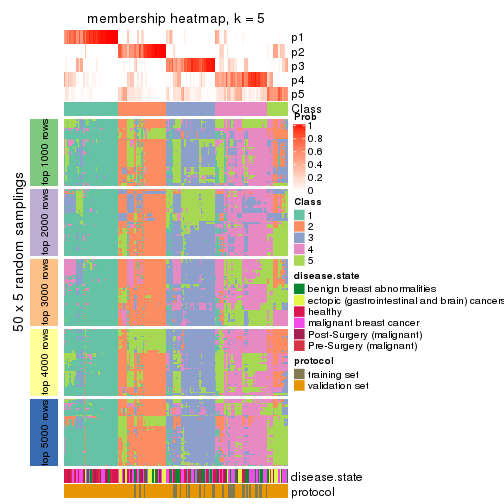</p>

</div>
<div id='tab-CV-NMF-membership-heatmap-5'>
<pre><code class="r">membership_heatmap(res, k = 6)
</code></pre>

<p></p>

</div>
</div>

As soon as we have had the classes for columns, we can look for signatures
which are significantly different between classes which can be candidate marks
for certain classes. Following are the heatmaps for signatures.


Signature heatmaps where rows are scaled:


<script>
$( function() {
	$( '#tabs-CV-NMF-get-signatures' ).tabs();
} );
</script>
<div id='tabs-CV-NMF-get-signatures'>
<ul>
<li><a href='#tab-CV-NMF-get-signatures-1'>k = 2</a></li>
<li><a href='#tab-CV-NMF-get-signatures-2'>k = 3</a></li>
<li><a href='#tab-CV-NMF-get-signatures-3'>k = 4</a></li>
<li><a href='#tab-CV-NMF-get-signatures-4'>k = 5</a></li>
<li><a href='#tab-CV-NMF-get-signatures-5'>k = 6</a></li>
</ul>
<div id='tab-CV-NMF-get-signatures-1'>
<pre><code class="r">get_signatures(res, k = 2)
</code></pre>

<p></p>

</div>
<div id='tab-CV-NMF-get-signatures-2'>
<pre><code class="r">get_signatures(res, k = 3)
</code></pre>

<p></p>

</div>
<div id='tab-CV-NMF-get-signatures-3'>
<pre><code class="r">get_signatures(res, k = 4)
</code></pre>

<p></p>

</div>
<div id='tab-CV-NMF-get-signatures-4'>
<pre><code class="r">get_signatures(res, k = 5)
</code></pre>

<p></p>

</div>
<div id='tab-CV-NMF-get-signatures-5'>
<pre><code class="r">get_signatures(res, k = 6)
</code></pre>

<p></p>

</div>
</div>


Signature heatmaps where rows are not scaled:


<script>
$( function() {
	$( '#tabs-CV-NMF-get-signatures-no-scale' ).tabs();
} );
</script>
<div id='tabs-CV-NMF-get-signatures-no-scale'>
<ul>
<li><a href='#tab-CV-NMF-get-signatures-no-scale-1'>k = 2</a></li>
<li><a href='#tab-CV-NMF-get-signatures-no-scale-2'>k = 3</a></li>
<li><a href='#tab-CV-NMF-get-signatures-no-scale-3'>k = 4</a></li>
<li><a href='#tab-CV-NMF-get-signatures-no-scale-4'>k = 5</a></li>
<li><a href='#tab-CV-NMF-get-signatures-no-scale-5'>k = 6</a></li>
</ul>
<div id='tab-CV-NMF-get-signatures-no-scale-1'>
<pre><code class="r">get_signatures(res, k = 2, scale_rows = FALSE)
</code></pre>

<p></p>

</div>
<div id='tab-CV-NMF-get-signatures-no-scale-2'>
<pre><code class="r">get_signatures(res, k = 3, scale_rows = FALSE)
</code></pre>

<p></p>

</div>
<div id='tab-CV-NMF-get-signatures-no-scale-3'>
<pre><code class="r">get_signatures(res, k = 4, scale_rows = FALSE)
</code></pre>

<p></p>

</div>
<div id='tab-CV-NMF-get-signatures-no-scale-4'>
<pre><code class="r">get_signatures(res, k = 5, scale_rows = FALSE)
</code></pre>

<p></p>

</div>
<div id='tab-CV-NMF-get-signatures-no-scale-5'>
<pre><code class="r">get_signatures(res, k = 6, scale_rows = FALSE)
</code></pre>

<p></p>

</div>
</div>


Compare the overlap of signatures from different k:

```r
compare_signatures(res)
```


`get_signature()` returns a data frame invisibly. TO get the list of signatures, the function
call should be assigned to a variable explicitly. In following code, if `plot` argument is set
to `FALSE`, no heatmap is plotted while only the differential analysis is performed.

```r
# code only for demonstration
tb = get_signature(res, k = ..., plot = FALSE)
```

An example of the output of `tb` is:

```
#>   which_row         fdr    mean_1    mean_2 scaled_mean_1 scaled_mean_2 km
#> 1        38 0.042760348  8.373488  9.131774    -0.5533452     0.5164555  1
#> 2        40 0.018707592  7.106213  8.469186    -0.6173731     0.5762149  1
#> 3        55 0.019134737 10.221463 11.207825    -0.6159697     0.5749050  1
#> 4        59 0.006059896  5.921854  7.869574    -0.6899429     0.6439467  1
#> 5        60 0.018055526  8.928898 10.211722    -0.6204761     0.5791110  1
#> 6        98 0.009384629 15.714769 14.887706     0.6635654    -0.6193277  2
...
```

The columns in `tb` are:

1. `which_row`: row indices corresponding to the input matrix.
2. `fdr`: FDR for the differential test. 
3. `mean_x`: The mean value in group x.
4. `scaled_mean_x`: The mean value in group x after rows are scaled.
5. `km`: Row groups if k-means clustering is applied to rows.


UMAP plot which shows how samples are separated.


<script>
$( function() {
	$( '#tabs-CV-NMF-dimension-reduction' ).tabs();
} );
</script>
<div id='tabs-CV-NMF-dimension-reduction'>
<ul>
<li><a href='#tab-CV-NMF-dimension-reduction-1'>k = 2</a></li>
<li><a href='#tab-CV-NMF-dimension-reduction-2'>k = 3</a></li>
<li><a href='#tab-CV-NMF-dimension-reduction-3'>k = 4</a></li>
<li><a href='#tab-CV-NMF-dimension-reduction-4'>k = 5</a></li>
<li><a href='#tab-CV-NMF-dimension-reduction-5'>k = 6</a></li>
</ul>
<div id='tab-CV-NMF-dimension-reduction-1'>
<pre><code class="r">dimension_reduction(res, k = 2, method = &quot;UMAP&quot;)
</code></pre>

<p></p>

</div>
<div id='tab-CV-NMF-dimension-reduction-2'>
<pre><code class="r">dimension_reduction(res, k = 3, method = &quot;UMAP&quot;)
</code></pre>

<p></p>

</div>
<div id='tab-CV-NMF-dimension-reduction-3'>
<pre><code class="r">dimension_reduction(res, k = 4, method = &quot;UMAP&quot;)
</code></pre>

<p></p>

</div>
<div id='tab-CV-NMF-dimension-reduction-4'>
<pre><code class="r">dimension_reduction(res, k = 5, method = &quot;UMAP&quot;)
</code></pre>

<p></p>

</div>
<div id='tab-CV-NMF-dimension-reduction-5'>
<pre><code class="r">dimension_reduction(res, k = 6, method = &quot;UMAP&quot;)
</code></pre>

<p></p>

</div>
</div>


Following heatmap shows how subgroups are split when increasing `k`:

```r
collect_classes(res)
```


Test correlation between subgroups and known annotations. If the known
annotation is numeric, one-way ANOVA test is applied, and if the known
annotation is discrete, chi-squared contingency table test is applied.

```r
test_to_known_factors(res)
```

```
#>          n disease.state(p) protocol(p) k
#> CV:NMF 156         1.04e-10    8.94e-01 2
#> CV:NMF 152         1.29e-05    1.00e-03 3
#> CV:NMF 143         7.49e-09    4.47e-04 4
#> CV:NMF  92         6.50e-07    3.63e-04 5
#> CV:NMF 134         1.66e-16    4.92e-07 6
```


If matrix rows can be associated to genes, consider to use `GO_Enrichment(res,
...)` to perform function enrichment for the signature genes.


 

---------------------------------------------------


### MAD:hclust


The object with results only for a single top-value method and a single partition method 
can be extracted as:

```r
res = res_list["MAD", "hclust"]
# you can also extract it by
# res = res_list["MAD:hclust"]
```

A summary of `res` and all the functions that can be applied to it:

```r
res
```

```
#> A 'ConsensusPartition' object with k = 2, 3, 4, 5, 6.
#>   On a matrix with 51941 rows and 162 columns.
#>   Top rows (1000, 2000, 3000, 4000, 5000) are extracted by 'MAD' method.
#>   Subgroups are detected by 'hclust' method.
#>   Performed in total 1250 partitions by row resampling.
#>   Best k for subgroups seems to be 3.
#> 
#> Following methods can be applied to this 'ConsensusPartition' object:
#>  [1] "cola_report"             "collect_classes"         "collect_plots"          
#>  [4] "collect_stats"           "colnames"                "compare_signatures"     
#>  [7] "consensus_heatmap"       "dimension_reduction"     "functional_enrichment"  
#> [10] "get_anno_col"            "get_anno"                "get_classes"            
#> [13] "get_consensus"           "get_matrix"              "get_membership"         
#> [16] "get_param"               "get_signatures"          "get_stats"              
#> [19] "is_best_k"               "is_stable_k"             "membership_heatmap"     
#> [22] "ncol"                    "nrow"                    "plot_ecdf"              
#> [25] "rownames"                "select_partition_number" "show"                   
#> [28] "suggest_best_k"          "test_to_known_factors"
```

`collect_plots()` function collects all the plots made from `res` for all `k` (number of partitions)
into one single page to provide an easy and fast comparison between different `k`.

```r
collect_plots(res)
```


The plots are:

- The first row: a plot of the ECDF (Empirical cumulative distribution
  function) curves of the consensus matrix for each `k` and the heatmap of
  predicted classes for each `k`.
- The second row: heatmaps of the consensus matrix for each `k`.
- The third row: heatmaps of the membership matrix for each `k`.
- The fouth row: heatmaps of the signatures for each `k`.

All the plots in panels can be made by individual functions and they are
plotted later in this section.

`select_partition_number()` produces several plots showing different
statistics for choosing "optimized" `k`. There are following statistics:

- ECDF curves of the consensus matrix for each `k`;
- 1-PAC. [The PAC
  score](https://en.wikipedia.org/wiki/Consensus_clustering#Over-interpretation_potential_of_consensus_clustering)
  measures the proportion of the ambiguous subgrouping.
- Mean silhouette score.
- Concordance. The mean probability of fiting the consensus class ids in all
  partitions.
- Area increased. Denote $A_k$ as the area under the ECDF curve for current
  `k`, the area increased is defined as $A_k - A_{k-1}$.
- Rand index. The percent of pairs of samples that are both in a same cluster
  or both are not in a same cluster in the partition of k and k-1.
- Jaccard index. The ratio of pairs of samples are both in a same cluster in
  the partition of k and k-1 and the pairs of samples are both in a same
  cluster in the partition k or k-1.

The detailed explanations of these statistics can be found in [the cola
vignette](http://bioconductor.org/packages/devel/bioc/vignettes/cola/inst/doc/cola.html#toc_13).

Generally speaking, lower PAC score, higher mean silhouette score or higher
concordance corresponds to better partition. Rand index and Jaccard index
measure how similar the current partition is compared to partition with `k-1`.
If they are too similar, we won't accept `k` is better than `k-1`.

```r
select_partition_number(res)
```


The numeric values for all these statistics can be obtained by `get_stats()`.

```r
get_stats(res)
```

```
#>   k 1-PAC mean_silhouette concordance area_increased  Rand Jaccard
#> 2 2 0.399           0.801       0.885         0.3327 0.645   0.645
#> 3 3 0.330           0.515       0.755         0.6660 0.793   0.686
#> 4 4 0.377           0.544       0.736         0.1318 0.904   0.810
#> 5 5 0.463           0.466       0.722         0.1588 0.824   0.617
#> 6 6 0.522           0.488       0.686         0.0466 0.907   0.713
```

`suggest_best_k()` suggests the best $k$ based on these statistics. The rules are as follows:

- All $k$ with Jaccard index larger than 0.95 are removed because the increase of
  the partition number does not provides enough extra information. If all $k$ are removed,
  the best $k$ is assigned by `NA`.
- For $k$ with 1-PAC larger than 0.9, the maximal $k$ is taken as the "best k". Other $k$ is called "optional k".
- If it does not fit the second rule. The $k$ with the highest vote of highest
  1-PAC, mean silhouette and concordance is taken as the "best k".

```r
suggest_best_k(res)
```

```
#> [1] 3
```


Following shows the table of the partitions (You need to click the **show/hide
code output** link to see it). The membership matrix (columns with name `p*`)
is inferred by
[`clue::cl_consensus()`](https://www.rdocumentation.org/link/cl_consensus?package=clue)
function with the `SE` method. Basically the value in the membership matrix
represents the probability to belong to a certain group. The finall class
label for an item is determined with the group with highest probability it
belongs to.

In `get_classes()` function, the entropy is calculated from the membership
matrix and the silhouette score is calculated from the consensus matrix.


<script>
$( function() {
	$( '#tabs-MAD-hclust-get-classes' ).tabs();
} );
</script>
<div id='tabs-MAD-hclust-get-classes'>
<ul>
<li><a href='#tab-MAD-hclust-get-classes-1'>k = 2</a></li>
<li><a href='#tab-MAD-hclust-get-classes-2'>k = 3</a></li>
<li><a href='#tab-MAD-hclust-get-classes-3'>k = 4</a></li>
<li><a href='#tab-MAD-hclust-get-classes-4'>k = 5</a></li>
<li><a href='#tab-MAD-hclust-get-classes-5'>k = 6</a></li>
</ul>

<div id='tab-MAD-hclust-get-classes-1'>
<p><a id='tab-MAD-hclust-get-classes-1-a' style='color:#0366d6' href='#'>show/hide code output</a></p>
<pre><code class="r">cbind(get_classes(res, k = 2), get_membership(res, k = 2))
</code></pre>

<pre><code>#&gt;           class entropy silhouette    p1    p2
#&gt; GSM682002     1  0.0376      0.906 0.996 0.004
#&gt; GSM682003     2  0.5737      0.785 0.136 0.864
#&gt; GSM682004     2  0.5629      0.784 0.132 0.868
#&gt; GSM682005     1  0.2778      0.885 0.952 0.048
#&gt; GSM682006     1  0.3274      0.881 0.940 0.060
#&gt; GSM682007     1  0.6623      0.794 0.828 0.172
#&gt; GSM682008     1  0.6623      0.794 0.828 0.172
#&gt; GSM682009     1  0.5294      0.817 0.880 0.120
#&gt; GSM682010     1  0.0938      0.905 0.988 0.012
#&gt; GSM682011     1  0.0376      0.906 0.996 0.004
#&gt; GSM682096     1  0.8499      0.506 0.724 0.276
#&gt; GSM682097     1  0.6048      0.810 0.852 0.148
#&gt; GSM682098     1  0.7528      0.699 0.784 0.216
#&gt; GSM682099     1  0.4022      0.860 0.920 0.080
#&gt; GSM682100     2  0.9460      0.747 0.364 0.636
#&gt; GSM682101     1  0.9209      0.272 0.664 0.336
#&gt; GSM682102     1  0.0000      0.905 1.000 0.000
#&gt; GSM682103     1  0.3733      0.880 0.928 0.072
#&gt; GSM682104     1  0.5408      0.838 0.876 0.124
#&gt; GSM682105     1  0.0672      0.906 0.992 0.008
#&gt; GSM682106     1  0.2423      0.897 0.960 0.040
#&gt; GSM682107     1  0.0376      0.906 0.996 0.004
#&gt; GSM682108     1  0.0938      0.905 0.988 0.012
#&gt; GSM682109     1  0.5519      0.825 0.872 0.128
#&gt; GSM682110     1  0.2043      0.899 0.968 0.032
#&gt; GSM682111     1  0.7299      0.743 0.796 0.204
#&gt; GSM682112     2  0.0672      0.707 0.008 0.992
#&gt; GSM682113     1  0.0000      0.905 1.000 0.000
#&gt; GSM682114     1  0.5178      0.845 0.884 0.116
#&gt; GSM682115     1  0.0376      0.905 0.996 0.004
#&gt; GSM682116     1  0.0376      0.905 0.996 0.004
#&gt; GSM682117     1  0.0376      0.906 0.996 0.004
#&gt; GSM682118     1  0.0376      0.906 0.996 0.004
#&gt; GSM682119     1  0.0376      0.906 0.996 0.004
#&gt; GSM682120     1  0.1633      0.902 0.976 0.024
#&gt; GSM682121     1  0.0376      0.905 0.996 0.004
#&gt; GSM682122     1  0.5408      0.839 0.876 0.124
#&gt; GSM682012     2  0.8081      0.794 0.248 0.752
#&gt; GSM682013     2  0.9522      0.736 0.372 0.628
#&gt; GSM682014     2  0.9460      0.747 0.364 0.636
#&gt; GSM682015     2  0.9460      0.747 0.364 0.636
#&gt; GSM682016     2  0.8081      0.794 0.248 0.752
#&gt; GSM682017     2  0.9460      0.747 0.364 0.636
#&gt; GSM682018     1  0.9909     -0.236 0.556 0.444
#&gt; GSM682019     2  0.9815      0.652 0.420 0.580
#&gt; GSM682020     2  0.9460      0.747 0.364 0.636
#&gt; GSM682021     1  0.9552      0.106 0.624 0.376
#&gt; GSM682022     2  0.9933      0.581 0.452 0.548
#&gt; GSM682023     2  0.9933      0.581 0.452 0.548
#&gt; GSM682024     1  0.0000      0.905 1.000 0.000
#&gt; GSM682025     1  1.0000     -0.438 0.504 0.496
#&gt; GSM682026     2  0.9710      0.691 0.400 0.600
#&gt; GSM682027     1  0.4939      0.830 0.892 0.108
#&gt; GSM682028     1  0.0938      0.904 0.988 0.012
#&gt; GSM682029     1  0.0938      0.904 0.988 0.012
#&gt; GSM682030     1  0.0938      0.904 0.988 0.012
#&gt; GSM682031     1  0.0938      0.904 0.988 0.012
#&gt; GSM682032     1  0.0938      0.904 0.988 0.012
#&gt; GSM682033     2  0.6623      0.792 0.172 0.828
#&gt; GSM681992     1  0.6531      0.723 0.832 0.168
#&gt; GSM681993     2  0.8955      0.687 0.312 0.688
#&gt; GSM681994     1  0.0672      0.906 0.992 0.008
#&gt; GSM681995     1  0.0376      0.906 0.996 0.004
#&gt; GSM681996     1  0.6623      0.794 0.828 0.172
#&gt; GSM681997     1  0.2423      0.890 0.960 0.040
#&gt; GSM681998     1  0.1843      0.898 0.972 0.028
#&gt; GSM681999     1  0.0376      0.906 0.996 0.004
#&gt; GSM682000     1  0.0672      0.905 0.992 0.008
#&gt; GSM682001     1  0.0376      0.906 0.996 0.004
#&gt; GSM682055     1  0.9427      0.302 0.640 0.360
#&gt; GSM682056     1  0.5946      0.815 0.856 0.144
#&gt; GSM682057     2  0.9460      0.747 0.364 0.636
#&gt; GSM682058     1  0.5946      0.815 0.856 0.144
#&gt; GSM682059     2  0.9460      0.747 0.364 0.636
#&gt; GSM682060     2  0.8499      0.720 0.276 0.724
#&gt; GSM682061     2  0.3584      0.746 0.068 0.932
#&gt; GSM682062     2  0.9460      0.747 0.364 0.636
#&gt; GSM682063     1  0.9209      0.272 0.664 0.336
#&gt; GSM682064     1  0.0672      0.906 0.992 0.008
#&gt; GSM682065     1  0.0000      0.905 1.000 0.000
#&gt; GSM682066     1  0.0376      0.906 0.996 0.004
#&gt; GSM682067     1  0.0376      0.906 0.996 0.004
#&gt; GSM682068     1  0.0672      0.905 0.992 0.008
#&gt; GSM682069     1  0.0376      0.906 0.996 0.004
#&gt; GSM682070     1  0.0672      0.906 0.992 0.008
#&gt; GSM682071     1  0.9815      0.129 0.580 0.420
#&gt; GSM682072     1  0.5629      0.820 0.868 0.132
#&gt; GSM682073     1  0.6887      0.774 0.816 0.184
#&gt; GSM682074     1  0.4298      0.863 0.912 0.088
#&gt; GSM682075     1  0.0672      0.905 0.992 0.008
#&gt; GSM682076     1  0.0376      0.905 0.996 0.004
#&gt; GSM682077     1  0.0000      0.905 1.000 0.000
#&gt; GSM682078     1  0.4022      0.868 0.920 0.080
#&gt; GSM682079     1  0.1633      0.902 0.976 0.024
#&gt; GSM682080     1  0.9795      0.147 0.584 0.416
#&gt; GSM682081     1  0.7376      0.736 0.792 0.208
#&gt; GSM682082     1  0.5178      0.845 0.884 0.116
#&gt; GSM682083     1  0.0376      0.905 0.996 0.004
#&gt; GSM682084     1  0.5294      0.843 0.880 0.120
#&gt; GSM682085     1  0.5294      0.843 0.880 0.120
#&gt; GSM682086     1  0.0376      0.906 0.996 0.004
#&gt; GSM682087     1  0.0376      0.905 0.996 0.004
#&gt; GSM682088     1  0.4022      0.868 0.920 0.080
#&gt; GSM682089     1  0.4161      0.868 0.916 0.084
#&gt; GSM682090     1  0.4298      0.865 0.912 0.088
#&gt; GSM682091     1  0.0672      0.906 0.992 0.008
#&gt; GSM682092     1  0.0672      0.906 0.992 0.008
#&gt; GSM682093     1  0.0938      0.906 0.988 0.012
#&gt; GSM682094     1  0.0000      0.905 1.000 0.000
#&gt; GSM682095     2  0.5737      0.785 0.136 0.864
#&gt; GSM681982     2  0.3733      0.750 0.072 0.928
#&gt; GSM681983     1  0.0000      0.905 1.000 0.000
#&gt; GSM681984     2  0.9608      0.655 0.384 0.616
#&gt; GSM681985     2  0.3879      0.752 0.076 0.924
#&gt; GSM681986     2  0.9608      0.655 0.384 0.616
#&gt; GSM681987     2  0.5629      0.784 0.132 0.868
#&gt; GSM681988     1  0.8386      0.626 0.732 0.268
#&gt; GSM681989     1  0.5294      0.817 0.880 0.120
#&gt; GSM681990     1  0.1184      0.904 0.984 0.016
#&gt; GSM681991     2  0.5629      0.784 0.132 0.868
#&gt; GSM682034     1  0.0000      0.905 1.000 0.000
#&gt; GSM682035     1  0.0000      0.905 1.000 0.000
#&gt; GSM682036     1  0.0672      0.906 0.992 0.008
#&gt; GSM682037     1  0.0000      0.905 1.000 0.000
#&gt; GSM682038     2  0.8327      0.782 0.264 0.736
#&gt; GSM682039     1  0.1843      0.897 0.972 0.028
#&gt; GSM682040     2  0.0000      0.706 0.000 1.000
#&gt; GSM682041     1  0.4690      0.855 0.900 0.100
#&gt; GSM682042     2  0.4161      0.740 0.084 0.916
#&gt; GSM682043     1  0.0000      0.905 1.000 0.000
#&gt; GSM682044     1  0.0000      0.905 1.000 0.000
#&gt; GSM682045     1  0.1843      0.897 0.972 0.028
#&gt; GSM682046     1  0.0000      0.905 1.000 0.000
#&gt; GSM682047     1  0.4298      0.863 0.912 0.088
#&gt; GSM682048     1  0.2603      0.890 0.956 0.044
#&gt; GSM682049     1  0.4690      0.855 0.900 0.100
#&gt; GSM682050     1  0.0000      0.905 1.000 0.000
#&gt; GSM682051     1  0.4690      0.855 0.900 0.100
#&gt; GSM682052     2  0.4161      0.740 0.084 0.916
#&gt; GSM682053     1  0.8661      0.541 0.712 0.288
#&gt; GSM682054     1  0.0000      0.905 1.000 0.000
#&gt; GSM682123     1  0.0376      0.906 0.996 0.004
#&gt; GSM682124     1  0.0376      0.906 0.996 0.004
#&gt; GSM682125     1  0.2603      0.890 0.956 0.044
#&gt; GSM682126     1  0.0000      0.905 1.000 0.000
#&gt; GSM682127     1  0.0000      0.905 1.000 0.000
#&gt; GSM682128     1  0.0672      0.905 0.992 0.008
#&gt; GSM682129     2  0.9358      0.755 0.352 0.648
#&gt; GSM682130     2  0.9460      0.747 0.364 0.636
#&gt; GSM682131     2  0.7674      0.796 0.224 0.776
#&gt; GSM682132     1  0.0672      0.905 0.992 0.008
#&gt; GSM682133     1  0.0672      0.905 0.992 0.008
#&gt; GSM682134     1  0.0376      0.906 0.996 0.004
#&gt; GSM682135     1  0.0672      0.906 0.992 0.008
#&gt; GSM682136     1  0.0000      0.905 1.000 0.000
#&gt; GSM682137     1  0.0672      0.905 0.992 0.008
#&gt; GSM682138     1  0.4298      0.863 0.912 0.088
#&gt; GSM682139     1  0.0376      0.906 0.996 0.004
#&gt; GSM682140     1  0.4298      0.863 0.912 0.088
#&gt; GSM682141     1  0.0000      0.905 1.000 0.000
#&gt; GSM682142     1  0.0000      0.905 1.000 0.000
#&gt; GSM682143     2  0.5629      0.784 0.132 0.868
</code></pre>

<script>
$('#tab-MAD-hclust-get-classes-1-a').parent().next().next().hide();
$('#tab-MAD-hclust-get-classes-1-a').click(function(){
  $('#tab-MAD-hclust-get-classes-1-a').parent().next().next().toggle();
  return(false);
});
</script>
</div>

<div id='tab-MAD-hclust-get-classes-2'>
<p><a id='tab-MAD-hclust-get-classes-2-a' style='color:#0366d6' href='#'>show/hide code output</a></p>
<pre><code class="r">cbind(get_classes(res, k = 3), get_membership(res, k = 3))
</code></pre>

<pre><code>#&gt;           class entropy silhouette    p1    p2    p3
#&gt; GSM682002     1  0.5529     0.3198 0.704 0.000 0.296
#&gt; GSM682003     2  0.0237     0.7406 0.000 0.996 0.004
#&gt; GSM682004     2  0.0000     0.7395 0.000 1.000 0.000
#&gt; GSM682005     3  0.7493     0.4340 0.480 0.036 0.484
#&gt; GSM682006     1  0.7263    -0.1358 0.568 0.032 0.400
#&gt; GSM682007     3  0.8275     0.2104 0.452 0.076 0.472
#&gt; GSM682008     3  0.8275     0.2104 0.452 0.076 0.472
#&gt; GSM682009     1  0.7987     0.1043 0.616 0.092 0.292
#&gt; GSM682010     1  0.5325     0.4688 0.748 0.004 0.248
#&gt; GSM682011     1  0.5397     0.4031 0.720 0.000 0.280
#&gt; GSM682096     3  0.9449    -0.1641 0.180 0.384 0.436
#&gt; GSM682097     1  0.8972    -0.2558 0.460 0.128 0.412
#&gt; GSM682098     3  0.9589     0.3846 0.376 0.200 0.424
#&gt; GSM682099     3  0.9054     0.5021 0.404 0.136 0.460
#&gt; GSM682100     2  0.6208     0.7588 0.052 0.756 0.192
#&gt; GSM682101     2  0.9520     0.3301 0.196 0.452 0.352
#&gt; GSM682102     1  0.0237     0.6878 0.996 0.000 0.004
#&gt; GSM682103     1  0.5967     0.5689 0.752 0.032 0.216
#&gt; GSM682104     1  0.8054     0.1413 0.568 0.076 0.356
#&gt; GSM682105     1  0.2959     0.6709 0.900 0.000 0.100
#&gt; GSM682106     1  0.6501     0.3916 0.664 0.020 0.316
#&gt; GSM682107     1  0.5926     0.1885 0.644 0.000 0.356
#&gt; GSM682108     1  0.5618     0.4361 0.732 0.008 0.260
#&gt; GSM682109     1  0.8054     0.0810 0.568 0.076 0.356
#&gt; GSM682110     1  0.6473     0.3752 0.668 0.020 0.312
#&gt; GSM682111     1  0.8708    -0.0589 0.488 0.108 0.404
#&gt; GSM682112     2  0.5461     0.6387 0.008 0.748 0.244
#&gt; GSM682113     1  0.0237     0.6876 0.996 0.004 0.000
#&gt; GSM682114     1  0.5775     0.5399 0.728 0.012 0.260
#&gt; GSM682115     1  0.2165     0.6745 0.936 0.000 0.064
#&gt; GSM682116     1  0.2165     0.6745 0.936 0.000 0.064
#&gt; GSM682117     1  0.5517     0.4250 0.728 0.004 0.268
#&gt; GSM682118     1  0.5115     0.5011 0.768 0.004 0.228
#&gt; GSM682119     1  0.5070     0.5048 0.772 0.004 0.224
#&gt; GSM682120     1  0.2356     0.6827 0.928 0.000 0.072
#&gt; GSM682121     1  0.2356     0.6736 0.928 0.000 0.072
#&gt; GSM682122     1  0.7044     0.3581 0.620 0.032 0.348
#&gt; GSM682012     2  0.5637     0.7514 0.040 0.788 0.172
#&gt; GSM682013     2  0.6306     0.7555 0.052 0.748 0.200
#&gt; GSM682014     2  0.6208     0.7588 0.052 0.756 0.192
#&gt; GSM682015     2  0.6208     0.7588 0.052 0.756 0.192
#&gt; GSM682016     2  0.5637     0.7514 0.040 0.788 0.172
#&gt; GSM682017     2  0.6208     0.7588 0.052 0.756 0.192
#&gt; GSM682018     2  0.8345     0.5811 0.096 0.560 0.344
#&gt; GSM682019     2  0.7015     0.7299 0.064 0.696 0.240
#&gt; GSM682020     2  0.6208     0.7588 0.052 0.756 0.192
#&gt; GSM682021     2  0.9065     0.4486 0.144 0.492 0.364
#&gt; GSM682022     2  0.7400     0.7059 0.072 0.664 0.264
#&gt; GSM682023     2  0.7400     0.7059 0.072 0.664 0.264
#&gt; GSM682024     1  0.0000     0.6888 1.000 0.000 0.000
#&gt; GSM682025     2  0.8172     0.6498 0.112 0.616 0.272
#&gt; GSM682026     2  0.6767     0.7424 0.064 0.720 0.216
#&gt; GSM682027     3  0.7634     0.0913 0.100 0.232 0.668
#&gt; GSM682028     3  0.5397     0.6468 0.280 0.000 0.720
#&gt; GSM682029     3  0.5397     0.6468 0.280 0.000 0.720
#&gt; GSM682030     3  0.5397     0.6468 0.280 0.000 0.720
#&gt; GSM682031     3  0.5397     0.6468 0.280 0.000 0.720
#&gt; GSM682032     3  0.5397     0.6468 0.280 0.000 0.720
#&gt; GSM682033     2  0.2625     0.7506 0.000 0.916 0.084
#&gt; GSM681992     1  0.8008     0.2067 0.656 0.152 0.192
#&gt; GSM681993     2  0.9212     0.2751 0.180 0.516 0.304
#&gt; GSM681994     1  0.6509    -0.3423 0.524 0.004 0.472
#&gt; GSM681995     1  0.5706     0.3080 0.680 0.000 0.320
#&gt; GSM681996     3  0.8275     0.2104 0.452 0.076 0.472
#&gt; GSM681997     3  0.7295     0.4184 0.484 0.028 0.488
#&gt; GSM681998     3  0.7074     0.4319 0.480 0.020 0.500
#&gt; GSM681999     1  0.5588     0.4071 0.720 0.004 0.276
#&gt; GSM682000     3  0.6286     0.4633 0.464 0.000 0.536
#&gt; GSM682001     1  0.5588     0.4071 0.720 0.004 0.276
#&gt; GSM682055     1  0.9993    -0.3788 0.348 0.336 0.316
#&gt; GSM682056     1  0.8929    -0.2543 0.460 0.124 0.416
#&gt; GSM682057     2  0.6208     0.7588 0.052 0.756 0.192
#&gt; GSM682058     1  0.8929    -0.2543 0.460 0.124 0.416
#&gt; GSM682059     2  0.6208     0.7588 0.052 0.756 0.192
#&gt; GSM682060     2  0.7507     0.6034 0.068 0.644 0.288
#&gt; GSM682061     2  0.3879     0.6993 0.000 0.848 0.152
#&gt; GSM682062     2  0.6208     0.7588 0.052 0.756 0.192
#&gt; GSM682063     2  0.9520     0.3301 0.196 0.452 0.352
#&gt; GSM682064     1  0.3193     0.6593 0.896 0.004 0.100
#&gt; GSM682065     1  0.0000     0.6888 1.000 0.000 0.000
#&gt; GSM682066     1  0.3644     0.6413 0.872 0.004 0.124
#&gt; GSM682067     1  0.0747     0.6889 0.984 0.000 0.016
#&gt; GSM682068     3  0.6095     0.5762 0.392 0.000 0.608
#&gt; GSM682069     1  0.0747     0.6889 0.984 0.000 0.016
#&gt; GSM682070     1  0.3193     0.6593 0.896 0.004 0.100
#&gt; GSM682071     1  0.9906    -0.2454 0.388 0.340 0.272
#&gt; GSM682072     1  0.8125     0.1287 0.576 0.084 0.340
#&gt; GSM682073     1  0.8395    -0.1072 0.480 0.084 0.436
#&gt; GSM682074     1  0.3918     0.6282 0.856 0.004 0.140
#&gt; GSM682075     3  0.6168     0.5543 0.412 0.000 0.588
#&gt; GSM682076     1  0.2356     0.6736 0.928 0.000 0.072
#&gt; GSM682077     1  0.0000     0.6888 1.000 0.000 0.000
#&gt; GSM682078     1  0.3784     0.6355 0.864 0.004 0.132
#&gt; GSM682079     1  0.3192     0.6761 0.888 0.000 0.112
#&gt; GSM682080     1  0.9913    -0.2465 0.388 0.336 0.276
#&gt; GSM682081     1  0.8779    -0.1178 0.472 0.112 0.416
#&gt; GSM682082     1  0.5619     0.5559 0.744 0.012 0.244
#&gt; GSM682083     1  0.2165     0.6745 0.936 0.000 0.064
#&gt; GSM682084     1  0.6172     0.4799 0.680 0.012 0.308
#&gt; GSM682085     1  0.6172     0.4799 0.680 0.012 0.308
#&gt; GSM682086     1  0.5905     0.2034 0.648 0.000 0.352
#&gt; GSM682087     1  0.2356     0.6736 0.928 0.000 0.072
#&gt; GSM682088     1  0.3715     0.6355 0.868 0.004 0.128
#&gt; GSM682089     1  0.3784     0.6340 0.864 0.004 0.132
#&gt; GSM682090     1  0.3983     0.6312 0.852 0.004 0.144
#&gt; GSM682091     1  0.3112     0.6618 0.900 0.004 0.096
#&gt; GSM682092     1  0.2625     0.6773 0.916 0.000 0.084
#&gt; GSM682093     1  0.3644     0.6492 0.872 0.004 0.124
#&gt; GSM682094     1  0.5058     0.4745 0.756 0.000 0.244
#&gt; GSM682095     2  0.0237     0.7406 0.000 0.996 0.004
#&gt; GSM681982     2  0.6393     0.6324 0.048 0.736 0.216
#&gt; GSM681983     1  0.3752     0.6050 0.856 0.000 0.144
#&gt; GSM681984     2  0.8720     0.3097 0.252 0.584 0.164
#&gt; GSM681985     2  0.6541     0.6262 0.056 0.732 0.212
#&gt; GSM681986     2  0.8720     0.3097 0.252 0.584 0.164
#&gt; GSM681987     2  0.0000     0.7395 0.000 1.000 0.000
#&gt; GSM681988     1  0.9357    -0.1982 0.440 0.168 0.392
#&gt; GSM681989     1  0.7987     0.1043 0.616 0.092 0.292
#&gt; GSM681990     1  0.5443     0.4522 0.736 0.004 0.260
#&gt; GSM681991     2  0.0000     0.7395 0.000 1.000 0.000
#&gt; GSM682034     1  0.0000     0.6888 1.000 0.000 0.000
#&gt; GSM682035     1  0.0000     0.6888 1.000 0.000 0.000
#&gt; GSM682036     1  0.3112     0.6618 0.900 0.004 0.096
#&gt; GSM682037     1  0.0000     0.6888 1.000 0.000 0.000
#&gt; GSM682038     2  0.7365     0.5593 0.188 0.700 0.112
#&gt; GSM682039     1  0.1781     0.6808 0.960 0.020 0.020
#&gt; GSM682040     2  0.4974     0.6428 0.000 0.764 0.236
#&gt; GSM682041     1  0.3983     0.6172 0.852 0.004 0.144
#&gt; GSM682042     2  0.7418     0.5939 0.080 0.672 0.248
#&gt; GSM682043     1  0.0000     0.6888 1.000 0.000 0.000
#&gt; GSM682044     1  0.0000     0.6888 1.000 0.000 0.000
#&gt; GSM682045     1  0.1781     0.6808 0.960 0.020 0.020
#&gt; GSM682046     1  0.0000     0.6888 1.000 0.000 0.000
#&gt; GSM682047     1  0.3918     0.6282 0.856 0.004 0.140
#&gt; GSM682048     1  0.2297     0.6745 0.944 0.036 0.020
#&gt; GSM682049     1  0.3983     0.6172 0.852 0.004 0.144
#&gt; GSM682050     1  0.0000     0.6888 1.000 0.000 0.000
#&gt; GSM682051     1  0.3983     0.6172 0.852 0.004 0.144
#&gt; GSM682052     2  0.7418     0.5939 0.080 0.672 0.248
#&gt; GSM682053     1  0.7372     0.3073 0.704 0.128 0.168
#&gt; GSM682054     1  0.0000     0.6888 1.000 0.000 0.000
#&gt; GSM682123     1  0.0424     0.6875 0.992 0.000 0.008
#&gt; GSM682124     1  0.0747     0.6889 0.984 0.000 0.016
#&gt; GSM682125     1  0.2297     0.6745 0.944 0.036 0.020
#&gt; GSM682126     1  0.0000     0.6888 1.000 0.000 0.000
#&gt; GSM682127     1  0.0000     0.6888 1.000 0.000 0.000
#&gt; GSM682128     1  0.3116     0.6662 0.892 0.000 0.108
#&gt; GSM682129     2  0.6054     0.7609 0.052 0.768 0.180
#&gt; GSM682130     2  0.6208     0.7588 0.052 0.756 0.192
#&gt; GSM682131     2  0.3752     0.7592 0.020 0.884 0.096
#&gt; GSM682132     3  0.6126     0.5667 0.400 0.000 0.600
#&gt; GSM682133     1  0.3116     0.6662 0.892 0.000 0.108
#&gt; GSM682134     1  0.0424     0.6875 0.992 0.000 0.008
#&gt; GSM682135     1  0.3112     0.6618 0.900 0.004 0.096
#&gt; GSM682136     1  0.0000     0.6888 1.000 0.000 0.000
#&gt; GSM682137     1  0.2796     0.6720 0.908 0.000 0.092
#&gt; GSM682138     1  0.3918     0.6282 0.856 0.004 0.140
#&gt; GSM682139     1  0.0747     0.6889 0.984 0.000 0.016
#&gt; GSM682140     1  0.3983     0.6283 0.852 0.004 0.144
#&gt; GSM682141     1  0.0000     0.6888 1.000 0.000 0.000
#&gt; GSM682142     1  0.0000     0.6888 1.000 0.000 0.000
#&gt; GSM682143     2  0.0000     0.7395 0.000 1.000 0.000
</code></pre>

<script>
$('#tab-MAD-hclust-get-classes-2-a').parent().next().next().hide();
$('#tab-MAD-hclust-get-classes-2-a').click(function(){
  $('#tab-MAD-hclust-get-classes-2-a').parent().next().next().toggle();
  return(false);
});
</script>
</div>

<div id='tab-MAD-hclust-get-classes-3'>
<p><a id='tab-MAD-hclust-get-classes-3-a' style='color:#0366d6' href='#'>show/hide code output</a></p>
<pre><code class="r">cbind(get_classes(res, k = 4), get_membership(res, k = 4))
</code></pre>

<pre><code>#&gt;           class entropy silhouette    p1    p2    p3    p4
#&gt; GSM682002     1  0.5447     0.5175 0.652 0.004 0.024 0.320
#&gt; GSM682003     2  0.4855     0.1797 0.000 0.600 0.400 0.000
#&gt; GSM682004     2  0.4866     0.1738 0.000 0.596 0.404 0.000
#&gt; GSM682005     4  0.7111     0.5649 0.208 0.064 0.080 0.648
#&gt; GSM682006     1  0.8073     0.3332 0.504 0.068 0.096 0.332
#&gt; GSM682007     1  0.9104     0.2014 0.372 0.068 0.260 0.300
#&gt; GSM682008     1  0.9104     0.2014 0.372 0.068 0.260 0.300
#&gt; GSM682009     1  0.8252     0.4643 0.572 0.128 0.116 0.184
#&gt; GSM682010     1  0.6583     0.6027 0.684 0.028 0.116 0.172
#&gt; GSM682011     1  0.6849     0.5515 0.640 0.024 0.104 0.232
#&gt; GSM682096     2  0.8355     0.2867 0.128 0.544 0.096 0.232
#&gt; GSM682097     1  0.9677     0.1815 0.380 0.176 0.216 0.228
#&gt; GSM682098     1  0.9923    -0.0562 0.308 0.256 0.220 0.216
#&gt; GSM682099     4  0.9038     0.2531 0.312 0.248 0.064 0.376
#&gt; GSM682100     2  0.1474     0.6430 0.052 0.948 0.000 0.000
#&gt; GSM682101     2  0.7393     0.4064 0.160 0.644 0.072 0.124
#&gt; GSM682102     1  0.0779     0.7273 0.980 0.000 0.004 0.016
#&gt; GSM682103     1  0.6866     0.6584 0.672 0.048 0.180 0.100
#&gt; GSM682104     1  0.8846     0.4495 0.480 0.092 0.248 0.180
#&gt; GSM682105     1  0.4001     0.7245 0.840 0.004 0.048 0.108
#&gt; GSM682106     1  0.7765     0.4960 0.528 0.020 0.176 0.276
#&gt; GSM682107     1  0.6437     0.4373 0.576 0.012 0.052 0.360
#&gt; GSM682108     1  0.6721     0.5793 0.664 0.028 0.104 0.204
#&gt; GSM682109     1  0.8720     0.4277 0.484 0.072 0.224 0.220
#&gt; GSM682110     1  0.7488     0.5542 0.596 0.032 0.152 0.220
#&gt; GSM682111     1  0.9037     0.3231 0.396 0.084 0.336 0.184
#&gt; GSM682112     3  0.4560     0.5006 0.004 0.296 0.700 0.000
#&gt; GSM682113     1  0.0188     0.7295 0.996 0.004 0.000 0.000
#&gt; GSM682114     1  0.6473     0.6183 0.628 0.004 0.268 0.100
#&gt; GSM682115     1  0.3176     0.7128 0.880 0.000 0.084 0.036
#&gt; GSM682116     1  0.3176     0.7128 0.880 0.000 0.084 0.036
#&gt; GSM682117     1  0.6705     0.5698 0.656 0.024 0.100 0.220
#&gt; GSM682118     1  0.5934     0.6401 0.704 0.012 0.076 0.208
#&gt; GSM682119     1  0.6218     0.6158 0.700 0.016 0.108 0.176
#&gt; GSM682120     1  0.3216     0.7254 0.880 0.000 0.076 0.044
#&gt; GSM682121     1  0.3970     0.6958 0.840 0.000 0.076 0.084
#&gt; GSM682122     1  0.7916     0.5206 0.520 0.028 0.284 0.168
#&gt; GSM682012     2  0.4955     0.4586 0.000 0.772 0.144 0.084
#&gt; GSM682013     2  0.1994     0.6425 0.052 0.936 0.004 0.008
#&gt; GSM682014     2  0.1661     0.6428 0.052 0.944 0.004 0.000
#&gt; GSM682015     2  0.1661     0.6428 0.052 0.944 0.004 0.000
#&gt; GSM682016     2  0.4955     0.4586 0.000 0.772 0.144 0.084
#&gt; GSM682017     2  0.1661     0.6428 0.052 0.944 0.004 0.000
#&gt; GSM682018     2  0.6017     0.5304 0.076 0.748 0.064 0.112
#&gt; GSM682019     2  0.3730     0.6254 0.060 0.872 0.028 0.040
#&gt; GSM682020     2  0.1661     0.6428 0.052 0.944 0.004 0.000
#&gt; GSM682021     2  0.6969     0.4647 0.104 0.680 0.072 0.144
#&gt; GSM682022     2  0.4117     0.6118 0.064 0.852 0.024 0.060
#&gt; GSM682023     2  0.4117     0.6118 0.064 0.852 0.024 0.060
#&gt; GSM682024     1  0.0000     0.7297 1.000 0.000 0.000 0.000
#&gt; GSM682025     2  0.5327     0.5705 0.084 0.788 0.040 0.088
#&gt; GSM682026     2  0.3138     0.6333 0.060 0.896 0.020 0.024
#&gt; GSM682027     4  0.6147     0.1063 0.056 0.380 0.000 0.564
#&gt; GSM682028     4  0.0188     0.6607 0.000 0.004 0.000 0.996
#&gt; GSM682029     4  0.0188     0.6607 0.000 0.004 0.000 0.996
#&gt; GSM682030     4  0.0188     0.6607 0.000 0.004 0.000 0.996
#&gt; GSM682031     4  0.0188     0.6607 0.000 0.004 0.000 0.996
#&gt; GSM682032     4  0.0188     0.6607 0.000 0.004 0.000 0.996
#&gt; GSM682033     2  0.4819     0.2684 0.000 0.652 0.344 0.004
#&gt; GSM681992     1  0.7875     0.4897 0.604 0.184 0.108 0.104
#&gt; GSM681993     3  0.8392     0.4013 0.160 0.252 0.520 0.068
#&gt; GSM681994     4  0.6109     0.5705 0.240 0.016 0.064 0.680
#&gt; GSM681995     1  0.7448     0.3419 0.520 0.024 0.104 0.352
#&gt; GSM681996     1  0.9104     0.2014 0.372 0.068 0.260 0.300
#&gt; GSM681997     4  0.6973     0.5650 0.208 0.056 0.080 0.656
#&gt; GSM681998     4  0.6661     0.5830 0.200 0.040 0.084 0.676
#&gt; GSM681999     1  0.6882     0.5565 0.644 0.028 0.104 0.224
#&gt; GSM682000     4  0.5247     0.6227 0.188 0.012 0.048 0.752
#&gt; GSM682001     1  0.6882     0.5565 0.644 0.028 0.104 0.224
#&gt; GSM682055     2  0.9316    -0.1228 0.292 0.404 0.184 0.120
#&gt; GSM682056     1  0.9669     0.1839 0.380 0.172 0.216 0.232
#&gt; GSM682057     2  0.1474     0.6430 0.052 0.948 0.000 0.000
#&gt; GSM682058     1  0.9669     0.1839 0.380 0.172 0.216 0.232
#&gt; GSM682059     2  0.1474     0.6430 0.052 0.948 0.000 0.000
#&gt; GSM682060     3  0.7809     0.1880 0.052 0.388 0.476 0.084
#&gt; GSM682061     3  0.5060     0.2597 0.000 0.412 0.584 0.004
#&gt; GSM682062     2  0.1474     0.6430 0.052 0.948 0.000 0.000
#&gt; GSM682063     2  0.7393     0.4064 0.160 0.644 0.072 0.124
#&gt; GSM682064     1  0.4157     0.7141 0.848 0.020 0.060 0.072
#&gt; GSM682065     1  0.0000     0.7297 1.000 0.000 0.000 0.000
#&gt; GSM682066     1  0.4540     0.7064 0.824 0.020 0.056 0.100
#&gt; GSM682067     1  0.1284     0.7320 0.964 0.000 0.024 0.012
#&gt; GSM682068     4  0.2773     0.6377 0.116 0.000 0.004 0.880
#&gt; GSM682069     1  0.1284     0.7320 0.964 0.000 0.024 0.012
#&gt; GSM682070     1  0.4157     0.7141 0.848 0.020 0.060 0.072
#&gt; GSM682071     3  0.9249     0.0856 0.308 0.284 0.332 0.076
#&gt; GSM682072     1  0.8585     0.4503 0.492 0.064 0.248 0.196
#&gt; GSM682073     1  0.9127     0.3050 0.396 0.080 0.300 0.224
#&gt; GSM682074     1  0.3808     0.6858 0.812 0.000 0.176 0.012
#&gt; GSM682075     4  0.3052     0.6312 0.136 0.000 0.004 0.860
#&gt; GSM682076     1  0.3903     0.6977 0.844 0.000 0.076 0.080
#&gt; GSM682077     1  0.0000     0.7297 1.000 0.000 0.000 0.000
#&gt; GSM682078     1  0.3743     0.6937 0.824 0.000 0.160 0.016
#&gt; GSM682079     1  0.4222     0.7266 0.832 0.004 0.080 0.084
#&gt; GSM682080     3  0.9280     0.0798 0.308 0.276 0.336 0.080
#&gt; GSM682081     1  0.9197     0.2940 0.384 0.096 0.328 0.192
#&gt; GSM682082     1  0.6224     0.6296 0.648 0.004 0.264 0.084
#&gt; GSM682083     1  0.3176     0.7128 0.880 0.000 0.084 0.036
#&gt; GSM682084     1  0.7099     0.5822 0.576 0.008 0.280 0.136
#&gt; GSM682085     1  0.7099     0.5822 0.576 0.008 0.280 0.136
#&gt; GSM682086     1  0.6423     0.4458 0.580 0.012 0.052 0.356
#&gt; GSM682087     1  0.3903     0.6977 0.844 0.000 0.076 0.080
#&gt; GSM682088     1  0.3300     0.7009 0.848 0.000 0.144 0.008
#&gt; GSM682089     1  0.3681     0.6919 0.816 0.000 0.176 0.008
#&gt; GSM682090     1  0.4079     0.6916 0.800 0.000 0.180 0.020
#&gt; GSM682091     1  0.4117     0.7156 0.852 0.024 0.060 0.064
#&gt; GSM682092     1  0.3689     0.7278 0.860 0.004 0.048 0.088
#&gt; GSM682093     1  0.4687     0.7098 0.820 0.024 0.072 0.084
#&gt; GSM682094     1  0.6346     0.5959 0.676 0.012 0.104 0.208
#&gt; GSM682095     2  0.4855     0.1813 0.000 0.600 0.400 0.000
#&gt; GSM681982     3  0.6108     0.5272 0.044 0.316 0.628 0.012
#&gt; GSM681983     1  0.3584     0.6905 0.836 0.004 0.008 0.152
#&gt; GSM681984     2  0.8951    -0.1117 0.232 0.424 0.276 0.068
#&gt; GSM681985     3  0.6195     0.5378 0.052 0.304 0.632 0.012
#&gt; GSM681986     2  0.8951    -0.1117 0.232 0.424 0.276 0.068
#&gt; GSM681987     2  0.4866     0.1738 0.000 0.596 0.404 0.000
#&gt; GSM681988     1  0.9468     0.2175 0.356 0.144 0.332 0.168
#&gt; GSM681989     1  0.8252     0.4643 0.572 0.128 0.116 0.184
#&gt; GSM681990     1  0.6749     0.5891 0.668 0.028 0.120 0.184
#&gt; GSM681991     2  0.4866     0.1738 0.000 0.596 0.404 0.000
#&gt; GSM682034     1  0.0188     0.7303 0.996 0.000 0.004 0.000
#&gt; GSM682035     1  0.0336     0.7303 0.992 0.000 0.008 0.000
#&gt; GSM682036     1  0.4117     0.7156 0.852 0.024 0.060 0.064
#&gt; GSM682037     1  0.0188     0.7303 0.996 0.000 0.004 0.000
#&gt; GSM682038     2  0.8185    -0.0769 0.176 0.492 0.296 0.036
#&gt; GSM682039     1  0.2328     0.7301 0.924 0.016 0.056 0.004
#&gt; GSM682040     3  0.3873     0.4764 0.000 0.228 0.772 0.000
#&gt; GSM682041     1  0.3751     0.6756 0.800 0.000 0.196 0.004
#&gt; GSM682042     3  0.5714     0.5505 0.056 0.256 0.684 0.004
#&gt; GSM682043     1  0.0188     0.7303 0.996 0.000 0.004 0.000
#&gt; GSM682044     1  0.0188     0.7303 0.996 0.000 0.004 0.000
#&gt; GSM682045     1  0.2328     0.7301 0.924 0.016 0.056 0.004
#&gt; GSM682046     1  0.0188     0.7303 0.996 0.000 0.004 0.000
#&gt; GSM682047     1  0.3808     0.6858 0.812 0.000 0.176 0.012
#&gt; GSM682048     1  0.2635     0.7266 0.908 0.016 0.072 0.004
#&gt; GSM682049     1  0.3751     0.6756 0.800 0.000 0.196 0.004
#&gt; GSM682050     1  0.0188     0.7303 0.996 0.000 0.004 0.000
#&gt; GSM682051     1  0.3751     0.6756 0.800 0.000 0.196 0.004
#&gt; GSM682052     3  0.5714     0.5505 0.056 0.256 0.684 0.004
#&gt; GSM682053     1  0.5497     0.4888 0.668 0.032 0.296 0.004
#&gt; GSM682054     1  0.0188     0.7303 0.996 0.000 0.004 0.000
#&gt; GSM682123     1  0.0817     0.7304 0.976 0.000 0.024 0.000
#&gt; GSM682124     1  0.1174     0.7320 0.968 0.000 0.020 0.012
#&gt; GSM682125     1  0.2635     0.7266 0.908 0.016 0.072 0.004
#&gt; GSM682126     1  0.0188     0.7303 0.996 0.000 0.004 0.000
#&gt; GSM682127     1  0.0000     0.7297 1.000 0.000 0.000 0.000
#&gt; GSM682128     1  0.3697     0.7118 0.852 0.000 0.048 0.100
#&gt; GSM682129     2  0.3339     0.6283 0.052 0.888 0.044 0.016
#&gt; GSM682130     2  0.1661     0.6428 0.052 0.944 0.004 0.000
#&gt; GSM682131     2  0.3719     0.5067 0.020 0.848 0.124 0.008
#&gt; GSM682132     4  0.2888     0.6311 0.124 0.000 0.004 0.872
#&gt; GSM682133     1  0.3697     0.7118 0.852 0.000 0.048 0.100
#&gt; GSM682134     1  0.0817     0.7304 0.976 0.000 0.024 0.000
#&gt; GSM682135     1  0.4117     0.7156 0.852 0.024 0.060 0.064
#&gt; GSM682136     1  0.0188     0.7303 0.996 0.000 0.004 0.000
#&gt; GSM682137     1  0.3439     0.7126 0.868 0.000 0.048 0.084
#&gt; GSM682138     1  0.3808     0.6858 0.812 0.000 0.176 0.012
#&gt; GSM682139     1  0.1174     0.7320 0.968 0.000 0.020 0.012
#&gt; GSM682140     1  0.3925     0.6853 0.808 0.000 0.176 0.016
#&gt; GSM682141     1  0.0188     0.7303 0.996 0.000 0.004 0.000
#&gt; GSM682142     1  0.0188     0.7303 0.996 0.000 0.004 0.000
#&gt; GSM682143     2  0.4866     0.1738 0.000 0.596 0.404 0.000
</code></pre>

<script>
$('#tab-MAD-hclust-get-classes-3-a').parent().next().next().hide();
$('#tab-MAD-hclust-get-classes-3-a').click(function(){
  $('#tab-MAD-hclust-get-classes-3-a').parent().next().next().toggle();
  return(false);
});
</script>
</div>

<div id='tab-MAD-hclust-get-classes-4'>
<p><a id='tab-MAD-hclust-get-classes-4-a' style='color:#0366d6' href='#'>show/hide code output</a></p>
<pre><code class="r">cbind(get_classes(res, k = 5), get_membership(res, k = 5))
</code></pre>

<pre><code>#&gt;           class entropy silhouette    p1    p2    p3    p4    p5
#&gt; GSM682002     1  0.6227   0.343249 0.580 0.004 0.136 0.272 0.008
#&gt; GSM682003     5  0.4262   0.536866 0.000 0.440 0.000 0.000 0.560
#&gt; GSM682004     5  0.4256   0.542176 0.000 0.436 0.000 0.000 0.564
#&gt; GSM682005     4  0.7020   0.314239 0.100 0.048 0.348 0.496 0.008
#&gt; GSM682006     3  0.7546   0.165672 0.372 0.048 0.408 0.164 0.008
#&gt; GSM682007     3  0.5618   0.539202 0.056 0.040 0.728 0.148 0.028
#&gt; GSM682008     3  0.5618   0.539202 0.056 0.040 0.728 0.148 0.028
#&gt; GSM682009     1  0.7657  -0.036130 0.452 0.108 0.356 0.048 0.036
#&gt; GSM682010     1  0.5569   0.153701 0.508 0.012 0.444 0.008 0.028
#&gt; GSM682011     1  0.6533   0.140904 0.492 0.012 0.400 0.068 0.028
#&gt; GSM682096     2  0.7012   0.398167 0.032 0.564 0.248 0.136 0.020
#&gt; GSM682097     3  0.6336   0.506668 0.056 0.172 0.656 0.108 0.008
#&gt; GSM682098     3  0.7210   0.413522 0.048 0.256 0.556 0.116 0.024
#&gt; GSM682099     3  0.8572   0.064007 0.160 0.268 0.316 0.252 0.004
#&gt; GSM682100     2  0.0771   0.714588 0.020 0.976 0.000 0.000 0.004
#&gt; GSM682101     2  0.6489   0.528227 0.092 0.676 0.108 0.100 0.024
#&gt; GSM682102     1  0.1235   0.647437 0.964 0.004 0.012 0.016 0.004
#&gt; GSM682103     3  0.6037   0.170535 0.392 0.044 0.532 0.020 0.012
#&gt; GSM682104     3  0.5700   0.596571 0.164 0.072 0.712 0.028 0.024
#&gt; GSM682105     1  0.4816   0.525005 0.708 0.004 0.236 0.048 0.004
#&gt; GSM682106     3  0.6074   0.431460 0.244 0.004 0.600 0.148 0.004
#&gt; GSM682107     1  0.7196   0.197522 0.496 0.012 0.212 0.260 0.020
#&gt; GSM682108     1  0.6296   0.170088 0.516 0.016 0.396 0.040 0.032
#&gt; GSM682109     3  0.5850   0.553966 0.184 0.052 0.696 0.048 0.020
#&gt; GSM682110     3  0.6287   0.185891 0.356 0.012 0.548 0.056 0.028
#&gt; GSM682111     3  0.3829   0.596391 0.028 0.056 0.852 0.024 0.040
#&gt; GSM682112     5  0.4922   0.601161 0.000 0.156 0.128 0.000 0.716
#&gt; GSM682113     1  0.0324   0.648387 0.992 0.000 0.004 0.000 0.004
#&gt; GSM682114     3  0.3851   0.491603 0.212 0.000 0.768 0.004 0.016
#&gt; GSM682115     1  0.4520   0.442242 0.684 0.000 0.284 0.032 0.000
#&gt; GSM682116     1  0.4520   0.442242 0.684 0.000 0.284 0.032 0.000
#&gt; GSM682117     1  0.6372   0.167660 0.508 0.012 0.396 0.056 0.028
#&gt; GSM682118     1  0.6108   0.282847 0.544 0.004 0.360 0.076 0.016
#&gt; GSM682119     1  0.5779   0.269838 0.572 0.012 0.364 0.028 0.024
#&gt; GSM682120     1  0.4197   0.509606 0.728 0.000 0.244 0.028 0.000
#&gt; GSM682121     1  0.5265   0.403715 0.636 0.000 0.284 0.080 0.000
#&gt; GSM682122     3  0.3705   0.601356 0.124 0.012 0.832 0.020 0.012
#&gt; GSM682012     2  0.5816   0.282660 0.000 0.652 0.032 0.084 0.232
#&gt; GSM682013     2  0.1299   0.714568 0.020 0.960 0.000 0.008 0.012
#&gt; GSM682014     2  0.1012   0.713110 0.020 0.968 0.000 0.000 0.012
#&gt; GSM682015     2  0.1012   0.713110 0.020 0.968 0.000 0.000 0.012
#&gt; GSM682016     2  0.5816   0.282660 0.000 0.652 0.032 0.084 0.232
#&gt; GSM682017     2  0.1012   0.713110 0.020 0.968 0.000 0.000 0.012
#&gt; GSM682018     2  0.4895   0.632105 0.028 0.780 0.088 0.088 0.016
#&gt; GSM682019     2  0.2931   0.705416 0.020 0.896 0.028 0.040 0.016
#&gt; GSM682020     2  0.1012   0.713110 0.020 0.968 0.000 0.000 0.012
#&gt; GSM682021     2  0.5928   0.577394 0.044 0.712 0.104 0.116 0.024
#&gt; GSM682022     2  0.3113   0.699255 0.024 0.884 0.032 0.052 0.008
#&gt; GSM682023     2  0.3113   0.699255 0.024 0.884 0.032 0.052 0.008
#&gt; GSM682024     1  0.0451   0.648562 0.988 0.000 0.008 0.000 0.004
#&gt; GSM682025     2  0.4469   0.650262 0.028 0.812 0.064 0.076 0.020
#&gt; GSM682026     2  0.2405   0.708874 0.020 0.920 0.024 0.024 0.012
#&gt; GSM682027     4  0.4973   0.000767 0.024 0.408 0.004 0.564 0.000
#&gt; GSM682028     4  0.0162   0.674091 0.000 0.000 0.004 0.996 0.000
#&gt; GSM682029     4  0.0162   0.674091 0.000 0.000 0.004 0.996 0.000
#&gt; GSM682030     4  0.0162   0.674091 0.000 0.000 0.004 0.996 0.000
#&gt; GSM682031     4  0.0162   0.674091 0.000 0.000 0.004 0.996 0.000
#&gt; GSM682032     4  0.0162   0.674091 0.000 0.000 0.004 0.996 0.000
#&gt; GSM682033     5  0.4954   0.434509 0.000 0.448 0.020 0.004 0.528
#&gt; GSM681992     1  0.7815   0.085205 0.484 0.164 0.272 0.032 0.048
#&gt; GSM681993     3  0.6608  -0.229593 0.008 0.140 0.428 0.004 0.420
#&gt; GSM681994     4  0.6344   0.396387 0.120 0.004 0.312 0.552 0.012
#&gt; GSM681995     3  0.7467   0.058735 0.372 0.012 0.400 0.188 0.028
#&gt; GSM681996     3  0.5618   0.539202 0.056 0.040 0.728 0.148 0.028
#&gt; GSM681997     4  0.6822   0.293965 0.100 0.040 0.364 0.492 0.004
#&gt; GSM681998     4  0.6520   0.344334 0.100 0.024 0.352 0.520 0.004
#&gt; GSM681999     1  0.6437   0.145611 0.496 0.012 0.404 0.060 0.028
#&gt; GSM682000     4  0.5877   0.516798 0.116 0.004 0.212 0.652 0.016
#&gt; GSM682001     1  0.6437   0.145611 0.496 0.012 0.404 0.060 0.028
#&gt; GSM682055     3  0.6805   0.182789 0.048 0.404 0.472 0.064 0.012
#&gt; GSM682056     3  0.6302   0.509203 0.056 0.168 0.660 0.108 0.008
#&gt; GSM682057     2  0.0771   0.714588 0.020 0.976 0.000 0.000 0.004
#&gt; GSM682058     3  0.6302   0.509203 0.056 0.168 0.660 0.108 0.008
#&gt; GSM682059     2  0.0771   0.714588 0.020 0.976 0.000 0.000 0.004
#&gt; GSM682060     5  0.7340   0.394205 0.032 0.220 0.128 0.052 0.568
#&gt; GSM682061     5  0.4269   0.594053 0.000 0.188 0.056 0.000 0.756
#&gt; GSM682062     2  0.0771   0.714588 0.020 0.976 0.000 0.000 0.004
#&gt; GSM682063     2  0.6489   0.528227 0.092 0.676 0.108 0.100 0.024
#&gt; GSM682064     1  0.4591   0.539089 0.756 0.016 0.192 0.016 0.020
#&gt; GSM682065     1  0.0324   0.648711 0.992 0.000 0.004 0.000 0.004
#&gt; GSM682066     1  0.5064   0.519269 0.732 0.016 0.192 0.044 0.016
#&gt; GSM682067     1  0.1522   0.642899 0.944 0.000 0.044 0.000 0.012
#&gt; GSM682068     4  0.2835   0.659213 0.112 0.000 0.016 0.868 0.004
#&gt; GSM682069     1  0.1522   0.642899 0.944 0.000 0.044 0.000 0.012
#&gt; GSM682070     1  0.4591   0.539089 0.756 0.016 0.192 0.016 0.020
#&gt; GSM682071     3  0.5782   0.419478 0.012 0.216 0.644 0.000 0.128
#&gt; GSM682072     3  0.5350   0.559842 0.184 0.044 0.724 0.020 0.028
#&gt; GSM682073     3  0.4364   0.588016 0.032 0.052 0.824 0.060 0.032
#&gt; GSM682074     1  0.4650   0.168081 0.520 0.000 0.468 0.000 0.012
#&gt; GSM682075     4  0.2865   0.647606 0.132 0.000 0.008 0.856 0.004
#&gt; GSM682076     1  0.5233   0.402289 0.636 0.000 0.288 0.076 0.000
#&gt; GSM682077     1  0.0671   0.649065 0.980 0.000 0.016 0.000 0.004
#&gt; GSM682078     1  0.4769   0.214949 0.544 0.000 0.440 0.004 0.012
#&gt; GSM682079     1  0.4865   0.483504 0.672 0.000 0.280 0.044 0.004
#&gt; GSM682080     3  0.5918   0.426016 0.012 0.208 0.644 0.004 0.132
#&gt; GSM682081     3  0.4284   0.592998 0.028 0.064 0.828 0.036 0.044
#&gt; GSM682082     3  0.4033   0.451355 0.236 0.000 0.744 0.004 0.016
#&gt; GSM682083     1  0.4520   0.442242 0.684 0.000 0.284 0.032 0.000
#&gt; GSM682084     3  0.3320   0.558279 0.164 0.000 0.820 0.004 0.012
#&gt; GSM682085     3  0.3320   0.558279 0.164 0.000 0.820 0.004 0.012
#&gt; GSM682086     1  0.7180   0.204053 0.500 0.012 0.212 0.256 0.020
#&gt; GSM682087     1  0.5233   0.402289 0.636 0.000 0.288 0.076 0.000
#&gt; GSM682088     1  0.4527   0.287530 0.596 0.000 0.392 0.000 0.012
#&gt; GSM682089     1  0.4650   0.187480 0.520 0.000 0.468 0.000 0.012
#&gt; GSM682090     1  0.4659   0.149899 0.500 0.000 0.488 0.000 0.012
#&gt; GSM682091     1  0.4374   0.559092 0.780 0.016 0.168 0.020 0.016
#&gt; GSM682092     1  0.4673   0.543884 0.728 0.004 0.216 0.048 0.004
#&gt; GSM682093     1  0.4886   0.521905 0.732 0.020 0.208 0.028 0.012
#&gt; GSM682094     1  0.6245   0.260075 0.556 0.012 0.348 0.060 0.024
#&gt; GSM682095     5  0.4410   0.532915 0.000 0.440 0.004 0.000 0.556
#&gt; GSM681982     5  0.5814   0.587143 0.000 0.168 0.200 0.004 0.628
#&gt; GSM681983     1  0.3773   0.583046 0.824 0.004 0.052 0.116 0.004
#&gt; GSM681984     2  0.8862  -0.139124 0.160 0.316 0.192 0.024 0.308
#&gt; GSM681985     5  0.5769   0.583142 0.000 0.156 0.208 0.004 0.632
#&gt; GSM681986     2  0.8862  -0.139124 0.160 0.316 0.192 0.024 0.308
#&gt; GSM681987     5  0.4256   0.542176 0.000 0.436 0.000 0.000 0.564
#&gt; GSM681988     3  0.5034   0.572939 0.024 0.104 0.776 0.036 0.060
#&gt; GSM681989     1  0.7657  -0.036130 0.452 0.108 0.356 0.048 0.036
#&gt; GSM681990     1  0.5832   0.145991 0.504 0.012 0.436 0.020 0.028
#&gt; GSM681991     5  0.4256   0.542176 0.000 0.436 0.000 0.000 0.564
#&gt; GSM682034     1  0.0162   0.648805 0.996 0.000 0.000 0.000 0.004
#&gt; GSM682035     1  0.0324   0.648569 0.992 0.000 0.004 0.000 0.004
#&gt; GSM682036     1  0.4374   0.559092 0.780 0.016 0.168 0.020 0.016
#&gt; GSM682037     1  0.0162   0.648805 0.996 0.000 0.000 0.000 0.004
#&gt; GSM682038     2  0.8170  -0.241442 0.124 0.368 0.132 0.012 0.364
#&gt; GSM682039     1  0.3112   0.627978 0.864 0.004 0.100 0.004 0.028
#&gt; GSM682040     5  0.4166   0.605013 0.000 0.088 0.116 0.004 0.792
#&gt; GSM682041     1  0.4655   0.140552 0.512 0.000 0.476 0.000 0.012
#&gt; GSM682042     5  0.5937   0.574473 0.020 0.140 0.176 0.004 0.660
#&gt; GSM682043     1  0.0162   0.648805 0.996 0.000 0.000 0.000 0.004
#&gt; GSM682044     1  0.0162   0.648805 0.996 0.000 0.000 0.000 0.004
#&gt; GSM682045     1  0.3112   0.627978 0.864 0.004 0.100 0.004 0.028
#&gt; GSM682046     1  0.0162   0.648805 0.996 0.000 0.000 0.000 0.004
#&gt; GSM682047     1  0.4650   0.168081 0.520 0.000 0.468 0.000 0.012
#&gt; GSM682048     1  0.3631   0.617989 0.836 0.004 0.112 0.008 0.040
#&gt; GSM682049     1  0.4655   0.140552 0.512 0.000 0.476 0.000 0.012
#&gt; GSM682050     1  0.0162   0.648805 0.996 0.000 0.000 0.000 0.004
#&gt; GSM682051     1  0.4746   0.131109 0.504 0.000 0.480 0.000 0.016
#&gt; GSM682052     5  0.5937   0.574473 0.020 0.140 0.176 0.004 0.660
#&gt; GSM682053     1  0.6052   0.378886 0.604 0.004 0.148 0.004 0.240
#&gt; GSM682054     1  0.0162   0.648805 0.996 0.000 0.000 0.000 0.004
#&gt; GSM682123     1  0.1281   0.644677 0.956 0.000 0.032 0.000 0.012
#&gt; GSM682124     1  0.1444   0.643179 0.948 0.000 0.040 0.000 0.012
#&gt; GSM682125     1  0.3631   0.617989 0.836 0.004 0.112 0.008 0.040
#&gt; GSM682126     1  0.0162   0.648805 0.996 0.000 0.000 0.000 0.004
#&gt; GSM682127     1  0.0162   0.648417 0.996 0.000 0.000 0.000 0.004
#&gt; GSM682128     1  0.4647   0.526870 0.736 0.000 0.172 0.092 0.000
#&gt; GSM682129     2  0.2706   0.683339 0.016 0.904 0.016 0.016 0.048
#&gt; GSM682130     2  0.1012   0.713110 0.020 0.968 0.000 0.000 0.012
#&gt; GSM682131     2  0.4235   0.404888 0.000 0.768 0.040 0.008 0.184
#&gt; GSM682132     4  0.2722   0.650724 0.120 0.000 0.008 0.868 0.004
#&gt; GSM682133     1  0.4647   0.526870 0.736 0.000 0.172 0.092 0.000
#&gt; GSM682134     1  0.1281   0.644677 0.956 0.000 0.032 0.000 0.012
#&gt; GSM682135     1  0.4374   0.559092 0.780 0.016 0.168 0.020 0.016
#&gt; GSM682136     1  0.0162   0.648805 0.996 0.000 0.000 0.000 0.004
#&gt; GSM682137     1  0.4502   0.529445 0.744 0.000 0.180 0.076 0.000
#&gt; GSM682138     1  0.4650   0.168081 0.520 0.000 0.468 0.000 0.012
#&gt; GSM682139     1  0.1444   0.643179 0.948 0.000 0.040 0.000 0.012
#&gt; GSM682140     1  0.4794   0.169578 0.520 0.000 0.464 0.004 0.012
#&gt; GSM682141     1  0.0162   0.648805 0.996 0.000 0.000 0.000 0.004
#&gt; GSM682142     1  0.0162   0.648805 0.996 0.000 0.000 0.000 0.004
#&gt; GSM682143     5  0.4256   0.542176 0.000 0.436 0.000 0.000 0.564
</code></pre>

<script>
$('#tab-MAD-hclust-get-classes-4-a').parent().next().next().hide();
$('#tab-MAD-hclust-get-classes-4-a').click(function(){
  $('#tab-MAD-hclust-get-classes-4-a').parent().next().next().toggle();
  return(false);
});
</script>
</div>

<div id='tab-MAD-hclust-get-classes-5'>
<p><a id='tab-MAD-hclust-get-classes-5-a' style='color:#0366d6' href='#'>show/hide code output</a></p>
<pre><code class="r">cbind(get_classes(res, k = 6), get_membership(res, k = 6))
</code></pre>

<pre><code>#&gt;           class entropy silhouette    p1    p2    p3    p4    p5    p6
#&gt; GSM682002     1  0.6387    0.39922 0.552 0.004 0.036 0.120 0.016 0.272
#&gt; GSM682003     5  0.2805    0.65450 0.000 0.160 0.012 0.000 0.828 0.000
#&gt; GSM682004     5  0.2593    0.66155 0.000 0.148 0.008 0.000 0.844 0.000
#&gt; GSM682005     6  0.7403    0.44686 0.064 0.032 0.096 0.304 0.028 0.476
#&gt; GSM682006     4  0.8017   -0.03932 0.328 0.032 0.088 0.380 0.028 0.144
#&gt; GSM682007     4  0.5097    0.40134 0.016 0.020 0.068 0.740 0.028 0.128
#&gt; GSM682008     4  0.5097    0.40134 0.016 0.020 0.068 0.740 0.028 0.128
#&gt; GSM682009     1  0.7835    0.14545 0.400 0.080 0.088 0.352 0.052 0.028
#&gt; GSM682010     1  0.6513    0.32925 0.468 0.004 0.120 0.360 0.040 0.008
#&gt; GSM682011     1  0.7350    0.32717 0.452 0.008 0.128 0.312 0.032 0.068
#&gt; GSM682096     2  0.6339    0.45095 0.004 0.592 0.040 0.224 0.024 0.116
#&gt; GSM682097     4  0.5596    0.35509 0.008 0.196 0.028 0.664 0.012 0.092
#&gt; GSM682098     4  0.6457    0.23511 0.008 0.272 0.036 0.560 0.024 0.100
#&gt; GSM682099     4  0.8390   -0.10514 0.112 0.292 0.040 0.300 0.016 0.240
#&gt; GSM682100     2  0.0713    0.81304 0.000 0.972 0.000 0.000 0.028 0.000
#&gt; GSM682101     2  0.5947    0.61019 0.064 0.704 0.048 0.068 0.028 0.088
#&gt; GSM682102     1  0.1078    0.65565 0.964 0.000 0.008 0.012 0.000 0.016
#&gt; GSM682103     4  0.6045    0.35065 0.300 0.040 0.024 0.584 0.024 0.028
#&gt; GSM682104     4  0.4879    0.50616 0.112 0.064 0.020 0.760 0.028 0.016
#&gt; GSM682105     1  0.5534    0.47619 0.636 0.000 0.040 0.252 0.016 0.056
#&gt; GSM682106     4  0.6047    0.41036 0.164 0.000 0.044 0.628 0.020 0.144
#&gt; GSM682107     1  0.7334    0.28445 0.460 0.008 0.088 0.168 0.012 0.264
#&gt; GSM682108     1  0.7093    0.33988 0.472 0.012 0.116 0.324 0.040 0.036
#&gt; GSM682109     4  0.5509    0.43773 0.160 0.032 0.060 0.704 0.020 0.024
#&gt; GSM682110     4  0.6941    0.00948 0.308 0.008 0.100 0.500 0.036 0.048
#&gt; GSM682111     4  0.3029    0.46000 0.000 0.044 0.060 0.864 0.032 0.000
#&gt; GSM682112     3  0.5400    0.68646 0.000 0.140 0.676 0.060 0.124 0.000
#&gt; GSM682113     1  0.0551    0.65699 0.984 0.000 0.004 0.004 0.008 0.000
#&gt; GSM682114     4  0.3754    0.52614 0.092 0.000 0.076 0.812 0.016 0.004
#&gt; GSM682115     1  0.5076    0.16821 0.604 0.000 0.016 0.332 0.012 0.036
#&gt; GSM682116     1  0.5076    0.16821 0.604 0.000 0.016 0.332 0.012 0.036
#&gt; GSM682117     1  0.7256    0.34423 0.468 0.008 0.128 0.304 0.036 0.056
#&gt; GSM682118     1  0.6449    0.38894 0.520 0.000 0.072 0.316 0.016 0.076
#&gt; GSM682119     1  0.6752    0.40645 0.528 0.008 0.124 0.276 0.036 0.028
#&gt; GSM682120     1  0.5254    0.31981 0.644 0.000 0.040 0.268 0.016 0.032
#&gt; GSM682121     1  0.6074    0.04793 0.528 0.000 0.032 0.340 0.016 0.084
#&gt; GSM682122     4  0.2593    0.52564 0.064 0.004 0.024 0.892 0.012 0.004
#&gt; GSM682012     2  0.6141    0.39609 0.000 0.616 0.112 0.012 0.188 0.072
#&gt; GSM682013     2  0.1124    0.81272 0.000 0.956 0.000 0.000 0.036 0.008
#&gt; GSM682014     2  0.0865    0.81145 0.000 0.964 0.000 0.000 0.036 0.000
#&gt; GSM682015     2  0.0865    0.81145 0.000 0.964 0.000 0.000 0.036 0.000
#&gt; GSM682016     2  0.6141    0.39609 0.000 0.616 0.112 0.012 0.188 0.072
#&gt; GSM682017     2  0.0865    0.81145 0.000 0.964 0.000 0.000 0.036 0.000
#&gt; GSM682018     2  0.4036    0.72549 0.008 0.820 0.044 0.040 0.016 0.072
#&gt; GSM682019     2  0.1899    0.80023 0.000 0.928 0.004 0.008 0.032 0.028
#&gt; GSM682020     2  0.0865    0.81145 0.000 0.964 0.000 0.000 0.036 0.000
#&gt; GSM682021     2  0.5127    0.66826 0.020 0.752 0.044 0.060 0.024 0.100
#&gt; GSM682022     2  0.2038    0.79454 0.004 0.924 0.004 0.012 0.016 0.040
#&gt; GSM682023     2  0.2038    0.79454 0.004 0.924 0.004 0.012 0.016 0.040
#&gt; GSM682024     1  0.0881    0.65578 0.972 0.000 0.008 0.008 0.012 0.000
#&gt; GSM682025     2  0.3689    0.73471 0.004 0.836 0.016 0.060 0.020 0.064
#&gt; GSM682026     2  0.1332    0.80454 0.000 0.952 0.000 0.008 0.028 0.012
#&gt; GSM682027     6  0.4178   -0.01600 0.004 0.428 0.008 0.000 0.000 0.560
#&gt; GSM682028     6  0.0260    0.66146 0.000 0.008 0.000 0.000 0.000 0.992
#&gt; GSM682029     6  0.0260    0.66146 0.000 0.008 0.000 0.000 0.000 0.992
#&gt; GSM682030     6  0.0260    0.66146 0.000 0.008 0.000 0.000 0.000 0.992
#&gt; GSM682031     6  0.0260    0.66146 0.000 0.008 0.000 0.000 0.000 0.992
#&gt; GSM682032     6  0.0260    0.66146 0.000 0.008 0.000 0.000 0.000 0.992
#&gt; GSM682033     5  0.5081    0.47494 0.000 0.260 0.088 0.008 0.640 0.004
#&gt; GSM681992     1  0.8199    0.27105 0.440 0.140 0.100 0.236 0.056 0.028
#&gt; GSM681993     3  0.6909    0.42092 0.000 0.128 0.400 0.364 0.108 0.000
#&gt; GSM681994     6  0.6750    0.50627 0.088 0.008 0.084 0.244 0.020 0.556
#&gt; GSM681995     1  0.8124    0.09502 0.332 0.008 0.128 0.312 0.032 0.188
#&gt; GSM681996     4  0.5097    0.40134 0.016 0.020 0.068 0.740 0.028 0.128
#&gt; GSM681997     6  0.7125    0.42846 0.064 0.024 0.096 0.328 0.016 0.472
#&gt; GSM681998     6  0.7119    0.47029 0.064 0.020 0.096 0.296 0.024 0.500
#&gt; GSM681999     1  0.7321    0.33082 0.456 0.008 0.128 0.312 0.036 0.060
#&gt; GSM682000     6  0.6020    0.57057 0.080 0.008 0.080 0.160 0.016 0.656
#&gt; GSM682001     1  0.7321    0.33082 0.456 0.008 0.128 0.312 0.036 0.060
#&gt; GSM682055     4  0.5936    0.04285 0.008 0.408 0.020 0.492 0.020 0.052
#&gt; GSM682056     4  0.5568    0.35959 0.008 0.192 0.028 0.668 0.012 0.092
#&gt; GSM682057     2  0.0713    0.81304 0.000 0.972 0.000 0.000 0.028 0.000
#&gt; GSM682058     4  0.5568    0.35959 0.008 0.192 0.028 0.668 0.012 0.092
#&gt; GSM682059     2  0.0713    0.81304 0.000 0.972 0.000 0.000 0.028 0.000
#&gt; GSM682060     3  0.7933    0.27020 0.024 0.168 0.456 0.072 0.232 0.048
#&gt; GSM682061     3  0.5907    0.20720 0.000 0.104 0.460 0.028 0.408 0.000
#&gt; GSM682062     2  0.0713    0.81304 0.000 0.972 0.000 0.000 0.028 0.000
#&gt; GSM682063     2  0.5947    0.61019 0.064 0.704 0.048 0.068 0.028 0.088
#&gt; GSM682064     1  0.5197    0.57541 0.716 0.008 0.076 0.156 0.024 0.020
#&gt; GSM682065     1  0.0653    0.65620 0.980 0.000 0.004 0.004 0.012 0.000
#&gt; GSM682066     1  0.5481    0.56275 0.696 0.008 0.064 0.168 0.020 0.044
#&gt; GSM682067     1  0.1952    0.65306 0.920 0.000 0.052 0.016 0.012 0.000
#&gt; GSM682068     6  0.2896    0.63710 0.092 0.004 0.016 0.016 0.004 0.868
#&gt; GSM682069     1  0.1952    0.65306 0.920 0.000 0.052 0.016 0.012 0.000
#&gt; GSM682070     1  0.5197    0.57541 0.716 0.008 0.076 0.156 0.024 0.020
#&gt; GSM682071     4  0.5789    0.22764 0.000 0.188 0.084 0.632 0.096 0.000
#&gt; GSM682072     4  0.4966    0.44807 0.160 0.036 0.048 0.728 0.028 0.000
#&gt; GSM682073     4  0.3715    0.45639 0.000 0.032 0.064 0.836 0.032 0.036
#&gt; GSM682074     4  0.5295    0.32417 0.412 0.000 0.052 0.516 0.016 0.004
#&gt; GSM682075     6  0.2851    0.62647 0.112 0.004 0.012 0.008 0.004 0.860
#&gt; GSM682076     1  0.6104    0.03776 0.524 0.000 0.036 0.344 0.016 0.080
#&gt; GSM682077     1  0.1173    0.65480 0.960 0.000 0.008 0.016 0.016 0.000
#&gt; GSM682078     4  0.5384    0.28099 0.432 0.000 0.056 0.492 0.012 0.008
#&gt; GSM682079     1  0.5577    0.36501 0.600 0.000 0.036 0.300 0.016 0.048
#&gt; GSM682080     4  0.5820    0.23267 0.000 0.180 0.088 0.632 0.100 0.000
#&gt; GSM682081     4  0.3512    0.45395 0.000 0.044 0.064 0.844 0.036 0.012
#&gt; GSM682082     4  0.3975    0.52632 0.116 0.000 0.072 0.792 0.016 0.004
#&gt; GSM682083     1  0.5076    0.16821 0.604 0.000 0.016 0.332 0.012 0.036
#&gt; GSM682084     4  0.2970    0.52991 0.072 0.000 0.060 0.860 0.004 0.004
#&gt; GSM682085     4  0.2970    0.52991 0.072 0.000 0.060 0.860 0.004 0.004
#&gt; GSM682086     1  0.7321    0.29268 0.464 0.008 0.088 0.168 0.012 0.260
#&gt; GSM682087     1  0.6104    0.03776 0.524 0.000 0.036 0.344 0.016 0.080
#&gt; GSM682088     1  0.5190   -0.19082 0.496 0.000 0.048 0.440 0.012 0.004
#&gt; GSM682089     4  0.5431    0.31506 0.404 0.000 0.064 0.512 0.016 0.004
#&gt; GSM682090     4  0.5399    0.34426 0.384 0.000 0.064 0.532 0.016 0.004
#&gt; GSM682091     1  0.4957    0.59169 0.744 0.012 0.064 0.136 0.020 0.024
#&gt; GSM682092     1  0.5360    0.49682 0.660 0.000 0.036 0.232 0.016 0.056
#&gt; GSM682093     1  0.5269    0.55948 0.696 0.016 0.044 0.200 0.016 0.028
#&gt; GSM682094     1  0.6962    0.40272 0.520 0.008 0.124 0.264 0.024 0.060
#&gt; GSM682095     5  0.2378    0.65358 0.000 0.152 0.000 0.000 0.848 0.000
#&gt; GSM681982     3  0.6334    0.68592 0.000 0.152 0.584 0.128 0.136 0.000
#&gt; GSM681983     1  0.3774    0.61198 0.816 0.004 0.024 0.032 0.008 0.116
#&gt; GSM681984     5  0.8697    0.23732 0.156 0.220 0.084 0.160 0.364 0.016
#&gt; GSM681985     3  0.6308    0.68789 0.000 0.140 0.588 0.136 0.136 0.000
#&gt; GSM681986     5  0.8697    0.23732 0.156 0.220 0.084 0.160 0.364 0.016
#&gt; GSM681987     5  0.2593    0.66155 0.000 0.148 0.008 0.000 0.844 0.000
#&gt; GSM681988     4  0.4358    0.42457 0.000 0.076 0.068 0.788 0.056 0.012
#&gt; GSM681989     1  0.7835    0.14545 0.400 0.080 0.088 0.352 0.052 0.028
#&gt; GSM681990     1  0.6841    0.31737 0.456 0.008 0.120 0.356 0.040 0.020
#&gt; GSM681991     5  0.2593    0.66155 0.000 0.148 0.008 0.000 0.844 0.000
#&gt; GSM682034     1  0.0146    0.65676 0.996 0.000 0.004 0.000 0.000 0.000
#&gt; GSM682035     1  0.0653    0.65461 0.980 0.000 0.004 0.012 0.004 0.000
#&gt; GSM682036     1  0.4957    0.59169 0.744 0.012 0.064 0.136 0.020 0.024
#&gt; GSM682037     1  0.0146    0.65676 0.996 0.000 0.004 0.000 0.000 0.000
#&gt; GSM682038     5  0.8469    0.21287 0.124 0.268 0.124 0.108 0.368 0.008
#&gt; GSM682039     1  0.3501    0.62508 0.832 0.004 0.080 0.072 0.008 0.004
#&gt; GSM682040     3  0.5218    0.63033 0.000 0.072 0.676 0.056 0.196 0.000
#&gt; GSM682041     4  0.5051    0.33145 0.412 0.000 0.040 0.532 0.012 0.004
#&gt; GSM682042     3  0.5649    0.69596 0.008 0.124 0.676 0.096 0.096 0.000
#&gt; GSM682043     1  0.0146    0.65676 0.996 0.000 0.004 0.000 0.000 0.000
#&gt; GSM682044     1  0.0146    0.65676 0.996 0.000 0.004 0.000 0.000 0.000
#&gt; GSM682045     1  0.3501    0.62508 0.832 0.004 0.080 0.072 0.008 0.004
#&gt; GSM682046     1  0.0146    0.65676 0.996 0.000 0.004 0.000 0.000 0.000
#&gt; GSM682047     4  0.5219    0.31964 0.416 0.000 0.052 0.516 0.012 0.004
#&gt; GSM682048     1  0.3956    0.61056 0.800 0.004 0.096 0.084 0.012 0.004
#&gt; GSM682049     4  0.5102    0.33494 0.408 0.000 0.044 0.532 0.012 0.004
#&gt; GSM682050     1  0.0146    0.65676 0.996 0.000 0.004 0.000 0.000 0.000
#&gt; GSM682051     4  0.5468    0.35641 0.380 0.000 0.064 0.532 0.020 0.004
#&gt; GSM682052     3  0.5649    0.69596 0.008 0.124 0.676 0.096 0.096 0.000
#&gt; GSM682053     1  0.5542    0.33860 0.564 0.004 0.320 0.100 0.012 0.000
#&gt; GSM682054     1  0.0146    0.65676 0.996 0.000 0.004 0.000 0.000 0.000
#&gt; GSM682123     1  0.1726    0.65312 0.932 0.000 0.044 0.012 0.012 0.000
#&gt; GSM682124     1  0.1793    0.65453 0.928 0.000 0.048 0.012 0.012 0.000
#&gt; GSM682125     1  0.3956    0.61056 0.800 0.004 0.096 0.084 0.012 0.004
#&gt; GSM682126     1  0.0146    0.65676 0.996 0.000 0.004 0.000 0.000 0.000
#&gt; GSM682127     1  0.0436    0.65607 0.988 0.000 0.004 0.004 0.004 0.000
#&gt; GSM682128     1  0.5238    0.38296 0.672 0.000 0.016 0.200 0.012 0.100
#&gt; GSM682129     2  0.2101    0.78730 0.000 0.908 0.008 0.004 0.072 0.008
#&gt; GSM682130     2  0.0865    0.81145 0.000 0.964 0.000 0.000 0.036 0.000
#&gt; GSM682131     2  0.4848    0.27797 0.000 0.608 0.032 0.024 0.336 0.000
#&gt; GSM682132     6  0.2710    0.63028 0.100 0.004 0.012 0.008 0.004 0.872
#&gt; GSM682133     1  0.5151    0.38744 0.676 0.000 0.012 0.200 0.012 0.100
#&gt; GSM682134     1  0.1726    0.65312 0.932 0.000 0.044 0.012 0.012 0.000
#&gt; GSM682135     1  0.4957    0.59169 0.744 0.012 0.064 0.136 0.020 0.024
#&gt; GSM682136     1  0.0146    0.65676 0.996 0.000 0.004 0.000 0.000 0.000
#&gt; GSM682137     1  0.5113    0.38251 0.680 0.000 0.016 0.208 0.012 0.084
#&gt; GSM682138     4  0.5219    0.31964 0.416 0.000 0.052 0.516 0.012 0.004
#&gt; GSM682139     1  0.1793    0.65453 0.928 0.000 0.048 0.012 0.012 0.000
#&gt; GSM682140     4  0.5395    0.32254 0.412 0.000 0.052 0.512 0.016 0.008
#&gt; GSM682141     1  0.0146    0.65676 0.996 0.000 0.004 0.000 0.000 0.000
#&gt; GSM682142     1  0.0146    0.65676 0.996 0.000 0.004 0.000 0.000 0.000
#&gt; GSM682143     5  0.2593    0.66155 0.000 0.148 0.008 0.000 0.844 0.000
</code></pre>

<script>
$('#tab-MAD-hclust-get-classes-5-a').parent().next().next().hide();
$('#tab-MAD-hclust-get-classes-5-a').click(function(){
  $('#tab-MAD-hclust-get-classes-5-a').parent().next().next().toggle();
  return(false);
});
</script>
</div>
</div>

Heatmaps for the consensus matrix. It visualizes the probability of two
samples to be in a same group.


<script>
$( function() {
	$( '#tabs-MAD-hclust-consensus-heatmap' ).tabs();
} );
</script>
<div id='tabs-MAD-hclust-consensus-heatmap'>
<ul>
<li><a href='#tab-MAD-hclust-consensus-heatmap-1'>k = 2</a></li>
<li><a href='#tab-MAD-hclust-consensus-heatmap-2'>k = 3</a></li>
<li><a href='#tab-MAD-hclust-consensus-heatmap-3'>k = 4</a></li>
<li><a href='#tab-MAD-hclust-consensus-heatmap-4'>k = 5</a></li>
<li><a href='#tab-MAD-hclust-consensus-heatmap-5'>k = 6</a></li>
</ul>
<div id='tab-MAD-hclust-consensus-heatmap-1'>
<pre><code class="r">consensus_heatmap(res, k = 2)
</code></pre>

<p></p>

</div>
<div id='tab-MAD-hclust-consensus-heatmap-2'>
<pre><code class="r">consensus_heatmap(res, k = 3)
</code></pre>

<p></p>

</div>
<div id='tab-MAD-hclust-consensus-heatmap-3'>
<pre><code class="r">consensus_heatmap(res, k = 4)
</code></pre>

<p></p>

</div>
<div id='tab-MAD-hclust-consensus-heatmap-4'>
<pre><code class="r">consensus_heatmap(res, k = 5)
</code></pre>

<p></p>

</div>
<div id='tab-MAD-hclust-consensus-heatmap-5'>
<pre><code class="r">consensus_heatmap(res, k = 6)
</code></pre>

<p></p>

</div>
</div>

Heatmaps for the membership of samples in all partitions to see how consistent they are:


<script>
$( function() {
	$( '#tabs-MAD-hclust-membership-heatmap' ).tabs();
} );
</script>
<div id='tabs-MAD-hclust-membership-heatmap'>
<ul>
<li><a href='#tab-MAD-hclust-membership-heatmap-1'>k = 2</a></li>
<li><a href='#tab-MAD-hclust-membership-heatmap-2'>k = 3</a></li>
<li><a href='#tab-MAD-hclust-membership-heatmap-3'>k = 4</a></li>
<li><a href='#tab-MAD-hclust-membership-heatmap-4'>k = 5</a></li>
<li><a href='#tab-MAD-hclust-membership-heatmap-5'>k = 6</a></li>
</ul>
<div id='tab-MAD-hclust-membership-heatmap-1'>
<pre><code class="r">membership_heatmap(res, k = 2)
</code></pre>

<p></p>

</div>
<div id='tab-MAD-hclust-membership-heatmap-2'>
<pre><code class="r">membership_heatmap(res, k = 3)
</code></pre>

<p></p>

</div>
<div id='tab-MAD-hclust-membership-heatmap-3'>
<pre><code class="r">membership_heatmap(res, k = 4)
</code></pre>

<p></p>

</div>
<div id='tab-MAD-hclust-membership-heatmap-4'>
<pre><code class="r">membership_heatmap(res, k = 5)
</code></pre>

<p></p>

</div>
<div id='tab-MAD-hclust-membership-heatmap-5'>
<pre><code class="r">membership_heatmap(res, k = 6)
</code></pre>

<p></p>

</div>
</div>

As soon as we have had the classes for columns, we can look for signatures
which are significantly different between classes which can be candidate marks
for certain classes. Following are the heatmaps for signatures.


Signature heatmaps where rows are scaled:


<script>
$( function() {
	$( '#tabs-MAD-hclust-get-signatures' ).tabs();
} );
</script>
<div id='tabs-MAD-hclust-get-signatures'>
<ul>
<li><a href='#tab-MAD-hclust-get-signatures-1'>k = 2</a></li>
<li><a href='#tab-MAD-hclust-get-signatures-2'>k = 3</a></li>
<li><a href='#tab-MAD-hclust-get-signatures-3'>k = 4</a></li>
<li><a href='#tab-MAD-hclust-get-signatures-4'>k = 5</a></li>
<li><a href='#tab-MAD-hclust-get-signatures-5'>k = 6</a></li>
</ul>
<div id='tab-MAD-hclust-get-signatures-1'>
<pre><code class="r">get_signatures(res, k = 2)
</code></pre>

<p></p>

</div>
<div id='tab-MAD-hclust-get-signatures-2'>
<pre><code class="r">get_signatures(res, k = 3)
</code></pre>

<p></p>

</div>
<div id='tab-MAD-hclust-get-signatures-3'>
<pre><code class="r">get_signatures(res, k = 4)
</code></pre>

<p></p>

</div>
<div id='tab-MAD-hclust-get-signatures-4'>
<pre><code class="r">get_signatures(res, k = 5)
</code></pre>

<p></p>

</div>
<div id='tab-MAD-hclust-get-signatures-5'>
<pre><code class="r">get_signatures(res, k = 6)
</code></pre>

<p></p>

</div>
</div>


Signature heatmaps where rows are not scaled:


<script>
$( function() {
	$( '#tabs-MAD-hclust-get-signatures-no-scale' ).tabs();
} );
</script>
<div id='tabs-MAD-hclust-get-signatures-no-scale'>
<ul>
<li><a href='#tab-MAD-hclust-get-signatures-no-scale-1'>k = 2</a></li>
<li><a href='#tab-MAD-hclust-get-signatures-no-scale-2'>k = 3</a></li>
<li><a href='#tab-MAD-hclust-get-signatures-no-scale-3'>k = 4</a></li>
<li><a href='#tab-MAD-hclust-get-signatures-no-scale-4'>k = 5</a></li>
<li><a href='#tab-MAD-hclust-get-signatures-no-scale-5'>k = 6</a></li>
</ul>
<div id='tab-MAD-hclust-get-signatures-no-scale-1'>
<pre><code class="r">get_signatures(res, k = 2, scale_rows = FALSE)
</code></pre>

<p></p>

</div>
<div id='tab-MAD-hclust-get-signatures-no-scale-2'>
<pre><code class="r">get_signatures(res, k = 3, scale_rows = FALSE)
</code></pre>

<p></p>

</div>
<div id='tab-MAD-hclust-get-signatures-no-scale-3'>
<pre><code class="r">get_signatures(res, k = 4, scale_rows = FALSE)
</code></pre>

<p></p>

</div>
<div id='tab-MAD-hclust-get-signatures-no-scale-4'>
<pre><code class="r">get_signatures(res, k = 5, scale_rows = FALSE)
</code></pre>

<p></p>

</div>
<div id='tab-MAD-hclust-get-signatures-no-scale-5'>
<pre><code class="r">get_signatures(res, k = 6, scale_rows = FALSE)
</code></pre>

<p></p>

</div>
</div>


Compare the overlap of signatures from different k:

```r
compare_signatures(res)
```


`get_signature()` returns a data frame invisibly. TO get the list of signatures, the function
call should be assigned to a variable explicitly. In following code, if `plot` argument is set
to `FALSE`, no heatmap is plotted while only the differential analysis is performed.

```r
# code only for demonstration
tb = get_signature(res, k = ..., plot = FALSE)
```

An example of the output of `tb` is:

```
#>   which_row         fdr    mean_1    mean_2 scaled_mean_1 scaled_mean_2 km
#> 1        38 0.042760348  8.373488  9.131774    -0.5533452     0.5164555  1
#> 2        40 0.018707592  7.106213  8.469186    -0.6173731     0.5762149  1
#> 3        55 0.019134737 10.221463 11.207825    -0.6159697     0.5749050  1
#> 4        59 0.006059896  5.921854  7.869574    -0.6899429     0.6439467  1
#> 5        60 0.018055526  8.928898 10.211722    -0.6204761     0.5791110  1
#> 6        98 0.009384629 15.714769 14.887706     0.6635654    -0.6193277  2
...
```

The columns in `tb` are:

1. `which_row`: row indices corresponding to the input matrix.
2. `fdr`: FDR for the differential test. 
3. `mean_x`: The mean value in group x.
4. `scaled_mean_x`: The mean value in group x after rows are scaled.
5. `km`: Row groups if k-means clustering is applied to rows.


UMAP plot which shows how samples are separated.


<script>
$( function() {
	$( '#tabs-MAD-hclust-dimension-reduction' ).tabs();
} );
</script>
<div id='tabs-MAD-hclust-dimension-reduction'>
<ul>
<li><a href='#tab-MAD-hclust-dimension-reduction-1'>k = 2</a></li>
<li><a href='#tab-MAD-hclust-dimension-reduction-2'>k = 3</a></li>
<li><a href='#tab-MAD-hclust-dimension-reduction-3'>k = 4</a></li>
<li><a href='#tab-MAD-hclust-dimension-reduction-4'>k = 5</a></li>
<li><a href='#tab-MAD-hclust-dimension-reduction-5'>k = 6</a></li>
</ul>
<div id='tab-MAD-hclust-dimension-reduction-1'>
<pre><code class="r">dimension_reduction(res, k = 2, method = &quot;UMAP&quot;)
</code></pre>

<p></p>

</div>
<div id='tab-MAD-hclust-dimension-reduction-2'>
<pre><code class="r">dimension_reduction(res, k = 3, method = &quot;UMAP&quot;)
</code></pre>

<p></p>

</div>
<div id='tab-MAD-hclust-dimension-reduction-3'>
<pre><code class="r">dimension_reduction(res, k = 4, method = &quot;UMAP&quot;)
</code></pre>

<p></p>

</div>
<div id='tab-MAD-hclust-dimension-reduction-4'>
<pre><code class="r">dimension_reduction(res, k = 5, method = &quot;UMAP&quot;)
</code></pre>

<p></p>

</div>
<div id='tab-MAD-hclust-dimension-reduction-5'>
<pre><code class="r">dimension_reduction(res, k = 6, method = &quot;UMAP&quot;)
</code></pre>

<p></p>

</div>
</div>


Following heatmap shows how subgroups are split when increasing `k`:

```r
collect_classes(res)
```


Test correlation between subgroups and known annotations. If the known
annotation is numeric, one-way ANOVA test is applied, and if the known
annotation is discrete, chi-squared contingency table test is applied.

```r
test_to_known_factors(res)
```

```
#>              n disease.state(p) protocol(p) k
#> MAD:hclust 154         1.75e-04    5.38e-01 2
#> MAD:hclust 110         1.42e-04    8.38e-03 3
#> MAD:hclust 114         9.12e-09    1.69e-03 4
#> MAD:hclust 100         1.99e-09    1.09e-04 5
#> MAD:hclust  84         1.42e-06    2.08e-05 6
```


If matrix rows can be associated to genes, consider to use `GO_Enrichment(res,
...)` to perform function enrichment for the signature genes.


 

---------------------------------------------------


### MAD:kmeans


The object with results only for a single top-value method and a single partition method 
can be extracted as:

```r
res = res_list["MAD", "kmeans"]
# you can also extract it by
# res = res_list["MAD:kmeans"]
```

A summary of `res` and all the functions that can be applied to it:

```r
res
```

```
#> A 'ConsensusPartition' object with k = 2, 3, 4, 5, 6.
#>   On a matrix with 51941 rows and 162 columns.
#>   Top rows (1000, 2000, 3000, 4000, 5000) are extracted by 'MAD' method.
#>   Subgroups are detected by 'kmeans' method.
#>   Performed in total 1250 partitions by row resampling.
#>   Best k for subgroups seems to be 2.
#> 
#> Following methods can be applied to this 'ConsensusPartition' object:
#>  [1] "cola_report"             "collect_classes"         "collect_plots"          
#>  [4] "collect_stats"           "colnames"                "compare_signatures"     
#>  [7] "consensus_heatmap"       "dimension_reduction"     "functional_enrichment"  
#> [10] "get_anno_col"            "get_anno"                "get_classes"            
#> [13] "get_consensus"           "get_matrix"              "get_membership"         
#> [16] "get_param"               "get_signatures"          "get_stats"              
#> [19] "is_best_k"               "is_stable_k"             "membership_heatmap"     
#> [22] "ncol"                    "nrow"                    "plot_ecdf"              
#> [25] "rownames"                "select_partition_number" "show"                   
#> [28] "suggest_best_k"          "test_to_known_factors"
```

`collect_plots()` function collects all the plots made from `res` for all `k` (number of partitions)
into one single page to provide an easy and fast comparison between different `k`.

```r
collect_plots(res)
```


The plots are:

- The first row: a plot of the ECDF (Empirical cumulative distribution
  function) curves of the consensus matrix for each `k` and the heatmap of
  predicted classes for each `k`.
- The second row: heatmaps of the consensus matrix for each `k`.
- The third row: heatmaps of the membership matrix for each `k`.
- The fouth row: heatmaps of the signatures for each `k`.

All the plots in panels can be made by individual functions and they are
plotted later in this section.

`select_partition_number()` produces several plots showing different
statistics for choosing "optimized" `k`. There are following statistics:

- ECDF curves of the consensus matrix for each `k`;
- 1-PAC. [The PAC
  score](https://en.wikipedia.org/wiki/Consensus_clustering#Over-interpretation_potential_of_consensus_clustering)
  measures the proportion of the ambiguous subgrouping.
- Mean silhouette score.
- Concordance. The mean probability of fiting the consensus class ids in all
  partitions.
- Area increased. Denote $A_k$ as the area under the ECDF curve for current
  `k`, the area increased is defined as $A_k - A_{k-1}$.
- Rand index. The percent of pairs of samples that are both in a same cluster
  or both are not in a same cluster in the partition of k and k-1.
- Jaccard index. The ratio of pairs of samples are both in a same cluster in
  the partition of k and k-1 and the pairs of samples are both in a same
  cluster in the partition k or k-1.

The detailed explanations of these statistics can be found in [the cola
vignette](http://bioconductor.org/packages/devel/bioc/vignettes/cola/inst/doc/cola.html#toc_13).

Generally speaking, lower PAC score, higher mean silhouette score or higher
concordance corresponds to better partition. Rand index and Jaccard index
measure how similar the current partition is compared to partition with `k-1`.
If they are too similar, we won't accept `k` is better than `k-1`.

```r
select_partition_number(res)
```


The numeric values for all these statistics can be obtained by `get_stats()`.

```r
get_stats(res)
```

```
#>   k 1-PAC mean_silhouette concordance area_increased  Rand Jaccard
#> 2 2 0.789           0.855       0.927         0.4719 0.528   0.528
#> 3 3 0.523           0.709       0.808         0.3836 0.731   0.529
#> 4 4 0.633           0.606       0.776         0.1268 0.824   0.548
#> 5 5 0.678           0.689       0.805         0.0754 0.855   0.518
#> 6 6 0.703           0.578       0.744         0.0383 0.937   0.722
```

`suggest_best_k()` suggests the best $k$ based on these statistics. The rules are as follows:

- All $k$ with Jaccard index larger than 0.95 are removed because the increase of
  the partition number does not provides enough extra information. If all $k$ are removed,
  the best $k$ is assigned by `NA`.
- For $k$ with 1-PAC larger than 0.9, the maximal $k$ is taken as the "best k". Other $k$ is called "optional k".
- If it does not fit the second rule. The $k$ with the highest vote of highest
  1-PAC, mean silhouette and concordance is taken as the "best k".

```r
suggest_best_k(res)
```

```
#> [1] 2
```


Following shows the table of the partitions (You need to click the **show/hide
code output** link to see it). The membership matrix (columns with name `p*`)
is inferred by
[`clue::cl_consensus()`](https://www.rdocumentation.org/link/cl_consensus?package=clue)
function with the `SE` method. Basically the value in the membership matrix
represents the probability to belong to a certain group. The finall class
label for an item is determined with the group with highest probability it
belongs to.

In `get_classes()` function, the entropy is calculated from the membership
matrix and the silhouette score is calculated from the consensus matrix.


<script>
$( function() {
	$( '#tabs-MAD-kmeans-get-classes' ).tabs();
} );
</script>
<div id='tabs-MAD-kmeans-get-classes'>
<ul>
<li><a href='#tab-MAD-kmeans-get-classes-1'>k = 2</a></li>
<li><a href='#tab-MAD-kmeans-get-classes-2'>k = 3</a></li>
<li><a href='#tab-MAD-kmeans-get-classes-3'>k = 4</a></li>
<li><a href='#tab-MAD-kmeans-get-classes-4'>k = 5</a></li>
<li><a href='#tab-MAD-kmeans-get-classes-5'>k = 6</a></li>
</ul>

<div id='tab-MAD-kmeans-get-classes-1'>
<p><a id='tab-MAD-kmeans-get-classes-1-a' style='color:#0366d6' href='#'>show/hide code output</a></p>
<pre><code class="r">cbind(get_classes(res, k = 2), get_membership(res, k = 2))
</code></pre>

<pre><code>#&gt;           class entropy silhouette    p1    p2
#&gt; GSM682002     1  0.2236     0.9242 0.964 0.036
#&gt; GSM682003     2  0.2603     0.9052 0.044 0.956
#&gt; GSM682004     2  0.0000     0.9215 0.000 1.000
#&gt; GSM682005     1  0.9977     0.1875 0.528 0.472
#&gt; GSM682006     1  0.9170     0.5684 0.668 0.332
#&gt; GSM682007     1  0.8608     0.5660 0.716 0.284
#&gt; GSM682008     2  0.9129     0.5811 0.328 0.672
#&gt; GSM682009     2  0.0000     0.9215 0.000 1.000
#&gt; GSM682010     1  0.0000     0.9190 1.000 0.000
#&gt; GSM682011     1  0.2948     0.9243 0.948 0.052
#&gt; GSM682096     2  0.0000     0.9215 0.000 1.000
#&gt; GSM682097     2  0.2948     0.9014 0.052 0.948
#&gt; GSM682098     2  0.0000     0.9215 0.000 1.000
#&gt; GSM682099     1  0.4431     0.8957 0.908 0.092
#&gt; GSM682100     2  0.0000     0.9215 0.000 1.000
#&gt; GSM682101     2  0.8713     0.5516 0.292 0.708
#&gt; GSM682102     1  0.2948     0.9243 0.948 0.052
#&gt; GSM682103     1  0.0000     0.9190 1.000 0.000
#&gt; GSM682104     1  0.9850     0.1644 0.572 0.428
#&gt; GSM682105     1  0.2236     0.9242 0.964 0.036
#&gt; GSM682106     1  0.0000     0.9190 1.000 0.000
#&gt; GSM682107     1  0.2948     0.9243 0.948 0.052
#&gt; GSM682108     1  0.7815     0.7357 0.768 0.232
#&gt; GSM682109     1  0.9393     0.3961 0.644 0.356
#&gt; GSM682110     1  0.0000     0.9190 1.000 0.000
#&gt; GSM682111     2  0.5519     0.8641 0.128 0.872
#&gt; GSM682112     2  0.5408     0.8673 0.124 0.876
#&gt; GSM682113     1  0.2948     0.9243 0.948 0.052
#&gt; GSM682114     1  0.0000     0.9190 1.000 0.000
#&gt; GSM682115     1  0.0000     0.9190 1.000 0.000
#&gt; GSM682116     1  0.0000     0.9190 1.000 0.000
#&gt; GSM682117     1  0.2948     0.9243 0.948 0.052
#&gt; GSM682118     1  0.0000     0.9190 1.000 0.000
#&gt; GSM682119     1  0.2948     0.9243 0.948 0.052
#&gt; GSM682120     1  0.0000     0.9190 1.000 0.000
#&gt; GSM682121     1  0.0000     0.9190 1.000 0.000
#&gt; GSM682122     1  0.0000     0.9190 1.000 0.000
#&gt; GSM682012     2  0.0000     0.9215 0.000 1.000
#&gt; GSM682013     2  0.0000     0.9215 0.000 1.000
#&gt; GSM682014     2  0.0000     0.9215 0.000 1.000
#&gt; GSM682015     2  0.0000     0.9215 0.000 1.000
#&gt; GSM682016     2  0.2603     0.9052 0.044 0.956
#&gt; GSM682017     2  0.0000     0.9215 0.000 1.000
#&gt; GSM682018     2  0.0000     0.9215 0.000 1.000
#&gt; GSM682019     2  0.0000     0.9215 0.000 1.000
#&gt; GSM682020     2  0.0000     0.9215 0.000 1.000
#&gt; GSM682021     2  0.8608     0.5695 0.284 0.716
#&gt; GSM682022     2  0.0000     0.9215 0.000 1.000
#&gt; GSM682023     2  0.0000     0.9215 0.000 1.000
#&gt; GSM682024     1  0.2948     0.9243 0.948 0.052
#&gt; GSM682025     2  0.0000     0.9215 0.000 1.000
#&gt; GSM682026     2  0.0000     0.9215 0.000 1.000
#&gt; GSM682027     2  0.8661     0.5599 0.288 0.712
#&gt; GSM682028     2  0.8661     0.5599 0.288 0.712
#&gt; GSM682029     2  0.9983    -0.0375 0.476 0.524
#&gt; GSM682030     1  0.9087     0.5980 0.676 0.324
#&gt; GSM682031     1  0.9635     0.4622 0.612 0.388
#&gt; GSM682032     1  0.9635     0.4622 0.612 0.388
#&gt; GSM682033     2  0.0000     0.9215 0.000 1.000
#&gt; GSM681992     2  0.0000     0.9215 0.000 1.000
#&gt; GSM681993     2  0.5178     0.8734 0.116 0.884
#&gt; GSM681994     1  0.0000     0.9190 1.000 0.000
#&gt; GSM681995     1  0.2948     0.9243 0.948 0.052
#&gt; GSM681996     1  0.9129     0.4705 0.672 0.328
#&gt; GSM681997     1  0.8555     0.5739 0.720 0.280
#&gt; GSM681998     1  0.9323     0.5287 0.652 0.348
#&gt; GSM681999     1  0.9170     0.5684 0.668 0.332
#&gt; GSM682000     1  0.2948     0.9243 0.948 0.052
#&gt; GSM682001     1  0.3114     0.9225 0.944 0.056
#&gt; GSM682055     2  0.2948     0.9014 0.052 0.948
#&gt; GSM682056     2  0.2948     0.9014 0.052 0.948
#&gt; GSM682057     2  0.0000     0.9215 0.000 1.000
#&gt; GSM682058     1  0.9044     0.5096 0.680 0.320
#&gt; GSM682059     2  0.0000     0.9215 0.000 1.000
#&gt; GSM682060     2  0.2043     0.9058 0.032 0.968
#&gt; GSM682061     2  0.2778     0.9033 0.048 0.952
#&gt; GSM682062     2  0.0000     0.9215 0.000 1.000
#&gt; GSM682063     2  0.0000     0.9215 0.000 1.000
#&gt; GSM682064     1  0.2948     0.9243 0.948 0.052
#&gt; GSM682065     1  0.2948     0.9243 0.948 0.052
#&gt; GSM682066     1  0.2948     0.9243 0.948 0.052
#&gt; GSM682067     1  0.2948     0.9243 0.948 0.052
#&gt; GSM682068     1  0.2948     0.9243 0.948 0.052
#&gt; GSM682069     1  0.2948     0.9243 0.948 0.052
#&gt; GSM682070     1  0.2948     0.9243 0.948 0.052
#&gt; GSM682071     2  0.2948     0.9014 0.052 0.948
#&gt; GSM682072     2  0.9963     0.2432 0.464 0.536
#&gt; GSM682073     2  0.9881     0.3283 0.436 0.564
#&gt; GSM682074     1  0.0000     0.9190 1.000 0.000
#&gt; GSM682075     1  0.2778     0.9245 0.952 0.048
#&gt; GSM682076     1  0.0000     0.9190 1.000 0.000
#&gt; GSM682077     1  0.0000     0.9190 1.000 0.000
#&gt; GSM682078     1  0.0000     0.9190 1.000 0.000
#&gt; GSM682079     1  0.0000     0.9190 1.000 0.000
#&gt; GSM682080     2  0.4562     0.8859 0.096 0.904
#&gt; GSM682081     2  0.5408     0.8676 0.124 0.876
#&gt; GSM682082     1  0.0000     0.9190 1.000 0.000
#&gt; GSM682083     1  0.0000     0.9190 1.000 0.000
#&gt; GSM682084     1  0.0000     0.9190 1.000 0.000
#&gt; GSM682085     1  0.0000     0.9190 1.000 0.000
#&gt; GSM682086     1  0.2948     0.9243 0.948 0.052
#&gt; GSM682087     1  0.0000     0.9190 1.000 0.000
#&gt; GSM682088     1  0.0000     0.9190 1.000 0.000
#&gt; GSM682089     1  0.0000     0.9190 1.000 0.000
#&gt; GSM682090     1  0.0000     0.9190 1.000 0.000
#&gt; GSM682091     1  0.2948     0.9243 0.948 0.052
#&gt; GSM682092     1  0.2236     0.9242 0.964 0.036
#&gt; GSM682093     1  0.0000     0.9190 1.000 0.000
#&gt; GSM682094     1  0.2948     0.9243 0.948 0.052
#&gt; GSM682095     2  0.0000     0.9215 0.000 1.000
#&gt; GSM681982     2  0.2948     0.9014 0.052 0.948
#&gt; GSM681983     1  0.2948     0.9243 0.948 0.052
#&gt; GSM681984     2  0.0000     0.9215 0.000 1.000
#&gt; GSM681985     2  0.5629     0.8605 0.132 0.868
#&gt; GSM681986     2  0.0000     0.9215 0.000 1.000
#&gt; GSM681987     2  0.0000     0.9215 0.000 1.000
#&gt; GSM681988     2  0.2948     0.9014 0.052 0.948
#&gt; GSM681989     2  0.0000     0.9215 0.000 1.000
#&gt; GSM681990     1  0.0376     0.9178 0.996 0.004
#&gt; GSM681991     2  0.0000     0.9215 0.000 1.000
#&gt; GSM682034     1  0.2778     0.9245 0.952 0.048
#&gt; GSM682035     1  0.0000     0.9190 1.000 0.000
#&gt; GSM682036     1  0.2948     0.9243 0.948 0.052
#&gt; GSM682037     1  0.2778     0.9245 0.952 0.048
#&gt; GSM682038     2  0.0000     0.9215 0.000 1.000
#&gt; GSM682039     1  0.2948     0.9243 0.948 0.052
#&gt; GSM682040     2  0.4690     0.8836 0.100 0.900
#&gt; GSM682041     1  0.0000     0.9190 1.000 0.000
#&gt; GSM682042     2  0.5178     0.8734 0.116 0.884
#&gt; GSM682043     1  0.2603     0.9245 0.956 0.044
#&gt; GSM682044     1  0.2948     0.9243 0.948 0.052
#&gt; GSM682045     1  0.2948     0.9243 0.948 0.052
#&gt; GSM682046     1  0.2948     0.9243 0.948 0.052
#&gt; GSM682047     1  0.0000     0.9190 1.000 0.000
#&gt; GSM682048     1  0.2948     0.9243 0.948 0.052
#&gt; GSM682049     1  0.0000     0.9190 1.000 0.000
#&gt; GSM682050     1  0.2948     0.9243 0.948 0.052
#&gt; GSM682051     1  0.0000     0.9190 1.000 0.000
#&gt; GSM682052     2  0.5408     0.8673 0.124 0.876
#&gt; GSM682053     1  0.0000     0.9190 1.000 0.000
#&gt; GSM682054     1  0.2948     0.9243 0.948 0.052
#&gt; GSM682123     1  0.2423     0.9244 0.960 0.040
#&gt; GSM682124     1  0.2948     0.9243 0.948 0.052
#&gt; GSM682125     1  0.1633     0.9228 0.976 0.024
#&gt; GSM682126     1  0.2948     0.9243 0.948 0.052
#&gt; GSM682127     1  0.2948     0.9243 0.948 0.052
#&gt; GSM682128     1  0.0000     0.9190 1.000 0.000
#&gt; GSM682129     2  0.0000     0.9215 0.000 1.000
#&gt; GSM682130     2  0.0000     0.9215 0.000 1.000
#&gt; GSM682131     2  0.2603     0.9052 0.044 0.956
#&gt; GSM682132     1  0.2778     0.9245 0.952 0.048
#&gt; GSM682133     1  0.2778     0.9245 0.952 0.048
#&gt; GSM682134     1  0.2423     0.9244 0.960 0.040
#&gt; GSM682135     1  0.2948     0.9243 0.948 0.052
#&gt; GSM682136     1  0.2948     0.9243 0.948 0.052
#&gt; GSM682137     1  0.0000     0.9190 1.000 0.000
#&gt; GSM682138     1  0.0000     0.9190 1.000 0.000
#&gt; GSM682139     1  0.2948     0.9243 0.948 0.052
#&gt; GSM682140     1  0.0000     0.9190 1.000 0.000
#&gt; GSM682141     1  0.2948     0.9243 0.948 0.052
#&gt; GSM682142     1  0.2948     0.9243 0.948 0.052
#&gt; GSM682143     2  0.0000     0.9215 0.000 1.000
</code></pre>

<script>
$('#tab-MAD-kmeans-get-classes-1-a').parent().next().next().hide();
$('#tab-MAD-kmeans-get-classes-1-a').click(function(){
  $('#tab-MAD-kmeans-get-classes-1-a').parent().next().next().toggle();
  return(false);
});
</script>
</div>

<div id='tab-MAD-kmeans-get-classes-2'>
<p><a id='tab-MAD-kmeans-get-classes-2-a' style='color:#0366d6' href='#'>show/hide code output</a></p>
<pre><code class="r">cbind(get_classes(res, k = 3), get_membership(res, k = 3))
</code></pre>

<pre><code>#&gt;           class entropy silhouette    p1    p2    p3
#&gt; GSM682002     1  0.3192     0.7844 0.888 0.000 0.112
#&gt; GSM682003     2  0.1529     0.8653 0.000 0.960 0.040
#&gt; GSM682004     2  0.0000     0.8808 0.000 1.000 0.000
#&gt; GSM682005     3  0.4575     0.7236 0.184 0.004 0.812
#&gt; GSM682006     3  0.4605     0.7165 0.204 0.000 0.796
#&gt; GSM682007     3  0.0000     0.7011 0.000 0.000 1.000
#&gt; GSM682008     3  0.0592     0.6995 0.000 0.012 0.988
#&gt; GSM682009     3  0.7001     0.3384 0.024 0.388 0.588
#&gt; GSM682010     3  0.3752     0.6426 0.144 0.000 0.856
#&gt; GSM682011     3  0.5905     0.5867 0.352 0.000 0.648
#&gt; GSM682096     3  0.7448     0.4857 0.052 0.332 0.616
#&gt; GSM682097     3  0.6180     0.0186 0.000 0.416 0.584
#&gt; GSM682098     2  0.5327     0.5399 0.000 0.728 0.272
#&gt; GSM682099     3  0.6646     0.6865 0.240 0.048 0.712
#&gt; GSM682100     2  0.0000     0.8808 0.000 1.000 0.000
#&gt; GSM682101     3  0.8464     0.5572 0.128 0.280 0.592
#&gt; GSM682102     1  0.0237     0.8403 0.996 0.000 0.004
#&gt; GSM682103     1  0.5529     0.6860 0.704 0.000 0.296
#&gt; GSM682104     3  0.3043     0.6804 0.084 0.008 0.908
#&gt; GSM682105     1  0.2711     0.8067 0.912 0.000 0.088
#&gt; GSM682106     3  0.0000     0.7011 0.000 0.000 1.000
#&gt; GSM682107     3  0.5835     0.5992 0.340 0.000 0.660
#&gt; GSM682108     3  0.5431     0.6837 0.284 0.000 0.716
#&gt; GSM682109     3  0.1399     0.7043 0.028 0.004 0.968
#&gt; GSM682110     3  0.4555     0.7180 0.200 0.000 0.800
#&gt; GSM682111     3  0.5200     0.5477 0.020 0.184 0.796
#&gt; GSM682112     2  0.6396     0.5837 0.016 0.664 0.320
#&gt; GSM682113     1  0.0000     0.8412 1.000 0.000 0.000
#&gt; GSM682114     3  0.6286    -0.1927 0.464 0.000 0.536
#&gt; GSM682115     1  0.3116     0.8262 0.892 0.000 0.108
#&gt; GSM682116     1  0.3340     0.8239 0.880 0.000 0.120
#&gt; GSM682117     3  0.6280     0.4039 0.460 0.000 0.540
#&gt; GSM682118     1  0.6225     0.4722 0.568 0.000 0.432
#&gt; GSM682119     1  0.3686     0.7154 0.860 0.000 0.140
#&gt; GSM682120     1  0.3879     0.8089 0.848 0.000 0.152
#&gt; GSM682121     1  0.5058     0.7439 0.756 0.000 0.244
#&gt; GSM682122     3  0.1753     0.6973 0.048 0.000 0.952
#&gt; GSM682012     2  0.0000     0.8808 0.000 1.000 0.000
#&gt; GSM682013     2  0.0000     0.8808 0.000 1.000 0.000
#&gt; GSM682014     2  0.0000     0.8808 0.000 1.000 0.000
#&gt; GSM682015     2  0.0000     0.8808 0.000 1.000 0.000
#&gt; GSM682016     2  0.2261     0.8514 0.000 0.932 0.068
#&gt; GSM682017     2  0.0000     0.8808 0.000 1.000 0.000
#&gt; GSM682018     2  0.0000     0.8808 0.000 1.000 0.000
#&gt; GSM682019     2  0.0000     0.8808 0.000 1.000 0.000
#&gt; GSM682020     2  0.0000     0.8808 0.000 1.000 0.000
#&gt; GSM682021     2  0.6129     0.4457 0.324 0.668 0.008
#&gt; GSM682022     2  0.0000     0.8808 0.000 1.000 0.000
#&gt; GSM682023     2  0.0000     0.8808 0.000 1.000 0.000
#&gt; GSM682024     1  0.0000     0.8412 1.000 0.000 0.000
#&gt; GSM682025     2  0.0000     0.8808 0.000 1.000 0.000
#&gt; GSM682026     2  0.0000     0.8808 0.000 1.000 0.000
#&gt; GSM682027     3  0.7899     0.6729 0.192 0.144 0.664
#&gt; GSM682028     3  0.7458     0.6954 0.196 0.112 0.692
#&gt; GSM682029     3  0.7222     0.6938 0.220 0.084 0.696
#&gt; GSM682030     3  0.7226     0.6857 0.236 0.076 0.688
#&gt; GSM682031     3  0.7226     0.6857 0.236 0.076 0.688
#&gt; GSM682032     3  0.7226     0.6857 0.236 0.076 0.688
#&gt; GSM682033     2  0.0000     0.8808 0.000 1.000 0.000
#&gt; GSM681992     3  0.8112     0.6345 0.160 0.192 0.648
#&gt; GSM681993     3  0.6633    -0.0891 0.008 0.444 0.548
#&gt; GSM681994     3  0.4291     0.7234 0.180 0.000 0.820
#&gt; GSM681995     3  0.5529     0.6518 0.296 0.000 0.704
#&gt; GSM681996     3  0.0424     0.7043 0.008 0.000 0.992
#&gt; GSM681997     3  0.4235     0.7246 0.176 0.000 0.824
#&gt; GSM681998     3  0.4399     0.7221 0.188 0.000 0.812
#&gt; GSM681999     3  0.5058     0.6954 0.244 0.000 0.756
#&gt; GSM682000     3  0.5650     0.6327 0.312 0.000 0.688
#&gt; GSM682001     3  0.5835     0.6046 0.340 0.000 0.660
#&gt; GSM682055     2  0.2448     0.8462 0.000 0.924 0.076
#&gt; GSM682056     3  0.6359     0.0365 0.004 0.404 0.592
#&gt; GSM682057     2  0.0000     0.8808 0.000 1.000 0.000
#&gt; GSM682058     3  0.0475     0.7036 0.004 0.004 0.992
#&gt; GSM682059     2  0.0000     0.8808 0.000 1.000 0.000
#&gt; GSM682060     2  0.5970     0.7359 0.060 0.780 0.160
#&gt; GSM682061     2  0.3816     0.7922 0.000 0.852 0.148
#&gt; GSM682062     2  0.0000     0.8808 0.000 1.000 0.000
#&gt; GSM682063     2  0.0000     0.8808 0.000 1.000 0.000
#&gt; GSM682064     1  0.3879     0.6904 0.848 0.000 0.152
#&gt; GSM682065     1  0.0000     0.8412 1.000 0.000 0.000
#&gt; GSM682066     1  0.0424     0.8398 0.992 0.000 0.008
#&gt; GSM682067     1  0.3340     0.8108 0.880 0.000 0.120
#&gt; GSM682068     1  0.5678     0.3960 0.684 0.000 0.316
#&gt; GSM682069     1  0.3340     0.8108 0.880 0.000 0.120
#&gt; GSM682070     1  0.0000     0.8412 1.000 0.000 0.000
#&gt; GSM682071     2  0.5835     0.5787 0.000 0.660 0.340
#&gt; GSM682072     3  0.2804     0.6938 0.060 0.016 0.924
#&gt; GSM682073     3  0.0829     0.6987 0.004 0.012 0.984
#&gt; GSM682074     1  0.5397     0.7016 0.720 0.000 0.280
#&gt; GSM682075     1  0.4605     0.6521 0.796 0.000 0.204
#&gt; GSM682076     1  0.5733     0.6703 0.676 0.000 0.324
#&gt; GSM682077     1  0.4002     0.7907 0.840 0.000 0.160
#&gt; GSM682078     1  0.5465     0.6950 0.712 0.000 0.288
#&gt; GSM682079     1  0.2878     0.8280 0.904 0.000 0.096
#&gt; GSM682080     2  0.6189     0.5356 0.004 0.632 0.364
#&gt; GSM682081     3  0.1267     0.6941 0.004 0.024 0.972
#&gt; GSM682082     3  0.5988     0.1064 0.368 0.000 0.632
#&gt; GSM682083     1  0.3192     0.8257 0.888 0.000 0.112
#&gt; GSM682084     3  0.5760     0.2819 0.328 0.000 0.672
#&gt; GSM682085     3  0.4654     0.5306 0.208 0.000 0.792
#&gt; GSM682086     1  0.4555     0.6381 0.800 0.000 0.200
#&gt; GSM682087     1  0.5988     0.6232 0.632 0.000 0.368
#&gt; GSM682088     1  0.5058     0.7258 0.756 0.000 0.244
#&gt; GSM682089     1  0.5560     0.6810 0.700 0.000 0.300
#&gt; GSM682090     1  0.5529     0.6860 0.704 0.000 0.296
#&gt; GSM682091     1  0.0000     0.8412 1.000 0.000 0.000
#&gt; GSM682092     1  0.1163     0.8401 0.972 0.000 0.028
#&gt; GSM682093     1  0.6192     0.4589 0.580 0.000 0.420
#&gt; GSM682094     1  0.4931     0.5716 0.768 0.000 0.232
#&gt; GSM682095     2  0.0000     0.8808 0.000 1.000 0.000
#&gt; GSM681982     2  0.5926     0.5551 0.000 0.644 0.356
#&gt; GSM681983     1  0.0424     0.8386 0.992 0.000 0.008
#&gt; GSM681984     2  0.2261     0.8508 0.000 0.932 0.068
#&gt; GSM681985     3  0.7084     0.2379 0.036 0.336 0.628
#&gt; GSM681986     2  0.7164     0.0428 0.024 0.524 0.452
#&gt; GSM681987     2  0.1529     0.8653 0.000 0.960 0.040
#&gt; GSM681988     3  0.3752     0.6064 0.000 0.144 0.856
#&gt; GSM681989     3  0.6451     0.5130 0.024 0.292 0.684
#&gt; GSM681990     3  0.2537     0.7193 0.080 0.000 0.920
#&gt; GSM681991     2  0.0000     0.8808 0.000 1.000 0.000
#&gt; GSM682034     1  0.0000     0.8412 1.000 0.000 0.000
#&gt; GSM682035     1  0.2165     0.8337 0.936 0.000 0.064
#&gt; GSM682036     1  0.1031     0.8340 0.976 0.000 0.024
#&gt; GSM682037     1  0.0000     0.8412 1.000 0.000 0.000
#&gt; GSM682038     2  0.1753     0.8616 0.000 0.952 0.048
#&gt; GSM682039     1  0.0237     0.8413 0.996 0.000 0.004
#&gt; GSM682040     2  0.5873     0.6089 0.004 0.684 0.312
#&gt; GSM682041     1  0.5058     0.7258 0.756 0.000 0.244
#&gt; GSM682042     2  0.6297     0.5495 0.008 0.640 0.352
#&gt; GSM682043     1  0.0237     0.8403 0.996 0.000 0.004
#&gt; GSM682044     1  0.0000     0.8412 1.000 0.000 0.000
#&gt; GSM682045     1  0.0000     0.8412 1.000 0.000 0.000
#&gt; GSM682046     1  0.0237     0.8403 0.996 0.000 0.004
#&gt; GSM682047     1  0.5497     0.6906 0.708 0.000 0.292
#&gt; GSM682048     1  0.0237     0.8413 0.996 0.000 0.004
#&gt; GSM682049     1  0.5016     0.7293 0.760 0.000 0.240
#&gt; GSM682050     1  0.0237     0.8403 0.996 0.000 0.004
#&gt; GSM682051     1  0.5431     0.6928 0.716 0.000 0.284
#&gt; GSM682052     2  0.6648     0.5162 0.016 0.620 0.364
#&gt; GSM682053     1  0.5497     0.6758 0.708 0.000 0.292
#&gt; GSM682054     1  0.0237     0.8403 0.996 0.000 0.004
#&gt; GSM682123     1  0.3482     0.8076 0.872 0.000 0.128
#&gt; GSM682124     1  0.0000     0.8412 1.000 0.000 0.000
#&gt; GSM682125     1  0.3879     0.7943 0.848 0.000 0.152
#&gt; GSM682126     1  0.0237     0.8403 0.996 0.000 0.004
#&gt; GSM682127     1  0.0000     0.8412 1.000 0.000 0.000
#&gt; GSM682128     1  0.5098     0.6649 0.752 0.000 0.248
#&gt; GSM682129     2  0.0000     0.8808 0.000 1.000 0.000
#&gt; GSM682130     2  0.0000     0.8808 0.000 1.000 0.000
#&gt; GSM682131     2  0.0000     0.8808 0.000 1.000 0.000
#&gt; GSM682132     1  0.5397     0.5080 0.720 0.000 0.280
#&gt; GSM682133     1  0.0237     0.8403 0.996 0.000 0.004
#&gt; GSM682134     1  0.2711     0.8274 0.912 0.000 0.088
#&gt; GSM682135     1  0.0892     0.8328 0.980 0.000 0.020
#&gt; GSM682136     1  0.0237     0.8403 0.996 0.000 0.004
#&gt; GSM682137     1  0.2796     0.8170 0.908 0.000 0.092
#&gt; GSM682138     1  0.5016     0.7293 0.760 0.000 0.240
#&gt; GSM682139     1  0.0000     0.8412 1.000 0.000 0.000
#&gt; GSM682140     1  0.3340     0.8235 0.880 0.000 0.120
#&gt; GSM682141     1  0.0237     0.8403 0.996 0.000 0.004
#&gt; GSM682142     1  0.0237     0.8403 0.996 0.000 0.004
#&gt; GSM682143     2  0.1411     0.8671 0.000 0.964 0.036
</code></pre>

<script>
$('#tab-MAD-kmeans-get-classes-2-a').parent().next().next().hide();
$('#tab-MAD-kmeans-get-classes-2-a').click(function(){
  $('#tab-MAD-kmeans-get-classes-2-a').parent().next().next().toggle();
  return(false);
});
</script>
</div>

<div id='tab-MAD-kmeans-get-classes-3'>
<p><a id='tab-MAD-kmeans-get-classes-3-a' style='color:#0366d6' href='#'>show/hide code output</a></p>
<pre><code class="r">cbind(get_classes(res, k = 4), get_membership(res, k = 4))
</code></pre>

<pre><code>#&gt;           class entropy silhouette    p1    p2    p3    p4
#&gt; GSM682002     1  0.6996     0.5136 0.580 0.000 0.192 0.228
#&gt; GSM682003     2  0.2844     0.8378 0.000 0.900 0.052 0.048
#&gt; GSM682004     2  0.2089     0.8557 0.000 0.932 0.048 0.020
#&gt; GSM682005     4  0.1661     0.7542 0.004 0.000 0.052 0.944
#&gt; GSM682006     4  0.1545     0.7634 0.008 0.000 0.040 0.952
#&gt; GSM682007     3  0.4941     0.2669 0.000 0.000 0.564 0.436
#&gt; GSM682008     3  0.5000     0.1172 0.000 0.000 0.504 0.496
#&gt; GSM682009     4  0.6946     0.3996 0.000 0.212 0.200 0.588
#&gt; GSM682010     3  0.4889     0.3892 0.004 0.000 0.636 0.360
#&gt; GSM682011     4  0.2480     0.7705 0.088 0.000 0.008 0.904
#&gt; GSM682096     4  0.5710     0.6412 0.004 0.228 0.068 0.700
#&gt; GSM682097     3  0.5664     0.5170 0.000 0.156 0.720 0.124
#&gt; GSM682098     2  0.6854     0.2581 0.000 0.548 0.120 0.332
#&gt; GSM682099     4  0.3489     0.7731 0.032 0.020 0.068 0.880
#&gt; GSM682100     2  0.0000     0.8761 0.000 1.000 0.000 0.000
#&gt; GSM682101     2  0.6993    -0.2013 0.020 0.460 0.064 0.456
#&gt; GSM682102     1  0.0336     0.8202 0.992 0.000 0.000 0.008
#&gt; GSM682103     3  0.5378    -0.1393 0.448 0.000 0.540 0.012
#&gt; GSM682104     3  0.4277     0.4642 0.000 0.000 0.720 0.280
#&gt; GSM682105     1  0.6656     0.5688 0.620 0.000 0.220 0.160
#&gt; GSM682106     3  0.4888     0.2093 0.000 0.000 0.588 0.412
#&gt; GSM682107     4  0.2480     0.7705 0.088 0.000 0.008 0.904
#&gt; GSM682108     4  0.6517     0.3626 0.108 0.000 0.288 0.604
#&gt; GSM682109     3  0.4898     0.2995 0.000 0.000 0.584 0.416
#&gt; GSM682110     4  0.2089     0.7689 0.020 0.000 0.048 0.932
#&gt; GSM682111     3  0.4804     0.4567 0.000 0.016 0.708 0.276
#&gt; GSM682112     3  0.5664     0.4411 0.000 0.228 0.696 0.076
#&gt; GSM682113     1  0.0937     0.8180 0.976 0.000 0.012 0.012
#&gt; GSM682114     3  0.2662     0.5297 0.084 0.000 0.900 0.016
#&gt; GSM682115     1  0.5010     0.6299 0.700 0.000 0.276 0.024
#&gt; GSM682116     1  0.5247     0.6148 0.684 0.000 0.284 0.032
#&gt; GSM682117     4  0.4973     0.4996 0.348 0.000 0.008 0.644
#&gt; GSM682118     3  0.7128     0.0158 0.372 0.000 0.492 0.136
#&gt; GSM682119     1  0.3758     0.7232 0.848 0.000 0.048 0.104
#&gt; GSM682120     1  0.5599     0.5056 0.616 0.000 0.352 0.032
#&gt; GSM682121     1  0.7516     0.3218 0.472 0.000 0.328 0.200
#&gt; GSM682122     3  0.2530     0.5233 0.000 0.000 0.888 0.112
#&gt; GSM682012     2  0.0188     0.8759 0.000 0.996 0.004 0.000
#&gt; GSM682013     2  0.0000     0.8761 0.000 1.000 0.000 0.000
#&gt; GSM682014     2  0.0336     0.8754 0.000 0.992 0.008 0.000
#&gt; GSM682015     2  0.0336     0.8754 0.000 0.992 0.008 0.000
#&gt; GSM682016     2  0.5325     0.6345 0.000 0.728 0.204 0.068
#&gt; GSM682017     2  0.0336     0.8754 0.000 0.992 0.008 0.000
#&gt; GSM682018     2  0.1004     0.8653 0.000 0.972 0.024 0.004
#&gt; GSM682019     2  0.0188     0.8751 0.000 0.996 0.000 0.004
#&gt; GSM682020     2  0.0000     0.8761 0.000 1.000 0.000 0.000
#&gt; GSM682021     2  0.5986     0.5612 0.220 0.700 0.060 0.020
#&gt; GSM682022     2  0.0376     0.8738 0.000 0.992 0.004 0.004
#&gt; GSM682023     2  0.0376     0.8738 0.000 0.992 0.004 0.004
#&gt; GSM682024     1  0.0672     0.8196 0.984 0.000 0.008 0.008
#&gt; GSM682025     2  0.0376     0.8738 0.000 0.992 0.004 0.004
#&gt; GSM682026     2  0.0000     0.8761 0.000 1.000 0.000 0.000
#&gt; GSM682027     4  0.3806     0.7708 0.028 0.064 0.040 0.868
#&gt; GSM682028     4  0.3806     0.7708 0.028 0.064 0.040 0.868
#&gt; GSM682029     4  0.3843     0.7734 0.036 0.056 0.040 0.868
#&gt; GSM682030     4  0.3853     0.7748 0.040 0.052 0.040 0.868
#&gt; GSM682031     4  0.3853     0.7748 0.040 0.052 0.040 0.868
#&gt; GSM682032     4  0.3853     0.7748 0.040 0.052 0.040 0.868
#&gt; GSM682033     2  0.0524     0.8748 0.000 0.988 0.008 0.004
#&gt; GSM681992     4  0.5466     0.6626 0.032 0.160 0.048 0.760
#&gt; GSM681993     3  0.5719     0.5060 0.000 0.176 0.712 0.112
#&gt; GSM681994     4  0.2222     0.7680 0.016 0.000 0.060 0.924
#&gt; GSM681995     4  0.2179     0.7769 0.064 0.000 0.012 0.924
#&gt; GSM681996     4  0.4134     0.5050 0.000 0.000 0.260 0.740
#&gt; GSM681997     4  0.1305     0.7612 0.004 0.000 0.036 0.960
#&gt; GSM681998     4  0.1398     0.7581 0.004 0.000 0.040 0.956
#&gt; GSM681999     4  0.1722     0.7776 0.048 0.000 0.008 0.944
#&gt; GSM682000     4  0.2255     0.7759 0.068 0.000 0.012 0.920
#&gt; GSM682001     4  0.2610     0.7708 0.088 0.000 0.012 0.900
#&gt; GSM682055     2  0.6407     0.2593 0.000 0.520 0.412 0.068
#&gt; GSM682056     3  0.2699     0.5322 0.000 0.028 0.904 0.068
#&gt; GSM682057     2  0.0000     0.8761 0.000 1.000 0.000 0.000
#&gt; GSM682058     4  0.5039     0.4119 0.000 0.004 0.404 0.592
#&gt; GSM682059     2  0.0000     0.8761 0.000 1.000 0.000 0.000
#&gt; GSM682060     2  0.7502     0.3527 0.052 0.556 0.316 0.076
#&gt; GSM682061     2  0.6350     0.3675 0.000 0.564 0.364 0.072
#&gt; GSM682062     2  0.0000     0.8761 0.000 1.000 0.000 0.000
#&gt; GSM682063     2  0.0657     0.8706 0.000 0.984 0.012 0.004
#&gt; GSM682064     1  0.3612     0.7291 0.856 0.000 0.044 0.100
#&gt; GSM682065     1  0.0336     0.8190 0.992 0.000 0.008 0.000
#&gt; GSM682066     1  0.1733     0.8158 0.948 0.000 0.024 0.028
#&gt; GSM682067     1  0.2048     0.8034 0.928 0.000 0.064 0.008
#&gt; GSM682068     4  0.3975     0.6429 0.240 0.000 0.000 0.760
#&gt; GSM682069     1  0.1902     0.8047 0.932 0.000 0.064 0.004
#&gt; GSM682070     1  0.1610     0.8104 0.952 0.000 0.032 0.016
#&gt; GSM682071     3  0.5979     0.3857 0.000 0.272 0.652 0.076
#&gt; GSM682072     3  0.4522     0.4244 0.000 0.000 0.680 0.320
#&gt; GSM682073     3  0.4746     0.3701 0.000 0.000 0.632 0.368
#&gt; GSM682074     3  0.5512    -0.1937 0.488 0.000 0.496 0.016
#&gt; GSM682075     4  0.7011     0.3081 0.300 0.000 0.148 0.552
#&gt; GSM682076     3  0.5938    -0.1744 0.476 0.000 0.488 0.036
#&gt; GSM682077     1  0.3444     0.7325 0.816 0.000 0.184 0.000
#&gt; GSM682078     3  0.5512    -0.1937 0.488 0.000 0.496 0.016
#&gt; GSM682079     1  0.4606     0.6550 0.724 0.000 0.264 0.012
#&gt; GSM682080     3  0.5655     0.4699 0.000 0.212 0.704 0.084
#&gt; GSM682081     3  0.4605     0.4099 0.000 0.000 0.664 0.336
#&gt; GSM682082     3  0.3842     0.5102 0.128 0.000 0.836 0.036
#&gt; GSM682083     1  0.5195     0.6246 0.692 0.000 0.276 0.032
#&gt; GSM682084     3  0.2797     0.5318 0.032 0.000 0.900 0.068
#&gt; GSM682085     3  0.2796     0.5247 0.016 0.000 0.892 0.092
#&gt; GSM682086     1  0.5039     0.2124 0.592 0.000 0.004 0.404
#&gt; GSM682087     3  0.6268    -0.1200 0.448 0.000 0.496 0.056
#&gt; GSM682088     1  0.5189     0.4963 0.616 0.000 0.372 0.012
#&gt; GSM682089     3  0.5417     0.0262 0.412 0.000 0.572 0.016
#&gt; GSM682090     3  0.5493    -0.1058 0.456 0.000 0.528 0.016
#&gt; GSM682091     1  0.1888     0.8042 0.940 0.000 0.044 0.016
#&gt; GSM682092     1  0.4387     0.6930 0.752 0.000 0.236 0.012
#&gt; GSM682093     3  0.6065     0.4738 0.276 0.000 0.644 0.080
#&gt; GSM682094     1  0.4872     0.3614 0.640 0.000 0.004 0.356
#&gt; GSM682095     2  0.2089     0.8557 0.000 0.932 0.048 0.020
#&gt; GSM681982     3  0.5716     0.4640 0.000 0.212 0.700 0.088
#&gt; GSM681983     1  0.1004     0.8158 0.972 0.000 0.004 0.024
#&gt; GSM681984     2  0.6089     0.5476 0.000 0.640 0.280 0.080
#&gt; GSM681985     3  0.5574     0.5161 0.000 0.124 0.728 0.148
#&gt; GSM681986     4  0.6147     0.5207 0.000 0.224 0.112 0.664
#&gt; GSM681987     2  0.2844     0.8378 0.000 0.900 0.052 0.048
#&gt; GSM681988     3  0.4957     0.4141 0.000 0.012 0.668 0.320
#&gt; GSM681989     4  0.5950     0.5543 0.000 0.156 0.148 0.696
#&gt; GSM681990     4  0.4936     0.2399 0.004 0.000 0.372 0.624
#&gt; GSM681991     2  0.2089     0.8557 0.000 0.932 0.048 0.020
#&gt; GSM682034     1  0.0592     0.8158 0.984 0.000 0.016 0.000
#&gt; GSM682035     1  0.1118     0.8090 0.964 0.000 0.036 0.000
#&gt; GSM682036     1  0.2313     0.7956 0.924 0.000 0.044 0.032
#&gt; GSM682037     1  0.0336     0.8202 0.992 0.000 0.000 0.008
#&gt; GSM682038     2  0.4231     0.7759 0.000 0.824 0.096 0.080
#&gt; GSM682039     1  0.1798     0.8075 0.944 0.000 0.040 0.016
#&gt; GSM682040     3  0.6015     0.3819 0.000 0.268 0.652 0.080
#&gt; GSM682041     1  0.4428     0.6200 0.720 0.000 0.276 0.004
#&gt; GSM682042     3  0.5564     0.4637 0.000 0.216 0.708 0.076
#&gt; GSM682043     1  0.0336     0.8202 0.992 0.000 0.000 0.008
#&gt; GSM682044     1  0.0336     0.8202 0.992 0.000 0.000 0.008
#&gt; GSM682045     1  0.1584     0.8101 0.952 0.000 0.036 0.012
#&gt; GSM682046     1  0.0336     0.8202 0.992 0.000 0.000 0.008
#&gt; GSM682047     3  0.5512    -0.1937 0.488 0.000 0.496 0.016
#&gt; GSM682048     1  0.1635     0.8115 0.948 0.000 0.044 0.008
#&gt; GSM682049     1  0.4936     0.5545 0.652 0.000 0.340 0.008
#&gt; GSM682050     1  0.0336     0.8202 0.992 0.000 0.000 0.008
#&gt; GSM682051     3  0.5300     0.0430 0.408 0.000 0.580 0.012
#&gt; GSM682052     3  0.5494     0.4731 0.000 0.208 0.716 0.076
#&gt; GSM682053     1  0.5236     0.2358 0.560 0.000 0.432 0.008
#&gt; GSM682054     1  0.0336     0.8202 0.992 0.000 0.000 0.008
#&gt; GSM682123     1  0.1474     0.8098 0.948 0.000 0.052 0.000
#&gt; GSM682124     1  0.0672     0.8196 0.984 0.000 0.008 0.008
#&gt; GSM682125     1  0.1902     0.8054 0.932 0.000 0.064 0.004
#&gt; GSM682126     1  0.0336     0.8202 0.992 0.000 0.000 0.008
#&gt; GSM682127     1  0.0524     0.8200 0.988 0.000 0.004 0.008
#&gt; GSM682128     1  0.7806     0.2145 0.392 0.000 0.252 0.356
#&gt; GSM682129     2  0.0000     0.8761 0.000 1.000 0.000 0.000
#&gt; GSM682130     2  0.0000     0.8761 0.000 1.000 0.000 0.000
#&gt; GSM682131     2  0.1182     0.8673 0.000 0.968 0.016 0.016
#&gt; GSM682132     4  0.6479     0.4850 0.224 0.000 0.140 0.636
#&gt; GSM682133     1  0.3325     0.7656 0.864 0.000 0.112 0.024
#&gt; GSM682134     1  0.1389     0.8103 0.952 0.000 0.048 0.000
#&gt; GSM682135     1  0.2224     0.7978 0.928 0.000 0.040 0.032
#&gt; GSM682136     1  0.0336     0.8202 0.992 0.000 0.000 0.008
#&gt; GSM682137     1  0.7196     0.4763 0.552 0.000 0.236 0.212
#&gt; GSM682138     1  0.4955     0.5542 0.648 0.000 0.344 0.008
#&gt; GSM682139     1  0.1356     0.8129 0.960 0.000 0.032 0.008
#&gt; GSM682140     1  0.5182     0.6121 0.684 0.000 0.288 0.028
#&gt; GSM682141     1  0.0336     0.8202 0.992 0.000 0.000 0.008
#&gt; GSM682142     1  0.0469     0.8195 0.988 0.000 0.000 0.012
#&gt; GSM682143     2  0.2675     0.8426 0.000 0.908 0.048 0.044
</code></pre>

<script>
$('#tab-MAD-kmeans-get-classes-3-a').parent().next().next().hide();
$('#tab-MAD-kmeans-get-classes-3-a').click(function(){
  $('#tab-MAD-kmeans-get-classes-3-a').parent().next().next().toggle();
  return(false);
});
</script>
</div>

<div id='tab-MAD-kmeans-get-classes-4'>
<p><a id='tab-MAD-kmeans-get-classes-4-a' style='color:#0366d6' href='#'>show/hide code output</a></p>
<pre><code class="r">cbind(get_classes(res, k = 5), get_membership(res, k = 5))
</code></pre>

<pre><code>#&gt;           class entropy silhouette    p1    p2    p3    p4    p5
#&gt; GSM682002     4  0.5163     0.7082 0.144 0.000 0.136 0.712 0.008
#&gt; GSM682003     2  0.5258     0.4828 0.000 0.636 0.004 0.064 0.296
#&gt; GSM682004     2  0.3087     0.8151 0.000 0.868 0.004 0.064 0.064
#&gt; GSM682005     3  0.3443     0.7751 0.028 0.000 0.840 0.012 0.120
#&gt; GSM682006     3  0.3567     0.7731 0.092 0.000 0.836 0.004 0.068
#&gt; GSM682007     5  0.5203     0.4358 0.000 0.000 0.332 0.060 0.608
#&gt; GSM682008     5  0.5295     0.0871 0.000 0.000 0.464 0.048 0.488
#&gt; GSM682009     5  0.6065     0.4194 0.120 0.000 0.280 0.012 0.588
#&gt; GSM682010     5  0.6539     0.5243 0.124 0.000 0.204 0.060 0.612
#&gt; GSM682011     3  0.2984     0.7900 0.108 0.000 0.860 0.000 0.032
#&gt; GSM682096     3  0.5738     0.6919 0.100 0.052 0.720 0.012 0.116
#&gt; GSM682097     5  0.3637     0.7074 0.004 0.056 0.024 0.064 0.852
#&gt; GSM682098     2  0.6912     0.0261 0.000 0.408 0.348 0.008 0.236
#&gt; GSM682099     3  0.1960     0.8025 0.004 0.000 0.928 0.048 0.020
#&gt; GSM682100     2  0.0404     0.8801 0.000 0.988 0.000 0.000 0.012
#&gt; GSM682101     2  0.6807     0.3943 0.080 0.580 0.252 0.004 0.084
#&gt; GSM682102     1  0.2909     0.8465 0.848 0.000 0.000 0.140 0.012
#&gt; GSM682103     4  0.3719     0.8035 0.116 0.000 0.000 0.816 0.068
#&gt; GSM682104     5  0.3619     0.6746 0.008 0.000 0.040 0.124 0.828
#&gt; GSM682105     4  0.3734     0.7900 0.168 0.000 0.036 0.796 0.000
#&gt; GSM682106     4  0.6349     0.2964 0.000 0.000 0.232 0.524 0.244
#&gt; GSM682107     3  0.3346     0.7873 0.108 0.000 0.848 0.008 0.036
#&gt; GSM682108     5  0.6419     0.1757 0.152 0.000 0.384 0.004 0.460
#&gt; GSM682109     5  0.4325     0.5946 0.000 0.000 0.240 0.036 0.724
#&gt; GSM682110     3  0.3902     0.7679 0.092 0.000 0.824 0.016 0.068
#&gt; GSM682111     5  0.2238     0.7114 0.004 0.004 0.036 0.036 0.920
#&gt; GSM682112     5  0.2580     0.7198 0.020 0.064 0.000 0.016 0.900
#&gt; GSM682113     1  0.1877     0.8436 0.924 0.000 0.000 0.064 0.012
#&gt; GSM682114     4  0.4425     0.3784 0.008 0.000 0.000 0.600 0.392
#&gt; GSM682115     4  0.3053     0.7858 0.164 0.000 0.000 0.828 0.008
#&gt; GSM682116     4  0.3053     0.7858 0.164 0.000 0.000 0.828 0.008
#&gt; GSM682117     3  0.5462     0.2135 0.464 0.000 0.488 0.012 0.036
#&gt; GSM682118     4  0.5917     0.6193 0.160 0.000 0.104 0.680 0.056
#&gt; GSM682119     1  0.3392     0.7207 0.852 0.000 0.080 0.008 0.060
#&gt; GSM682120     4  0.2753     0.8041 0.136 0.000 0.000 0.856 0.008
#&gt; GSM682121     4  0.3359     0.8127 0.112 0.000 0.024 0.848 0.016
#&gt; GSM682122     4  0.4695     0.2153 0.004 0.000 0.008 0.524 0.464
#&gt; GSM682012     2  0.0693     0.8743 0.000 0.980 0.000 0.012 0.008
#&gt; GSM682013     2  0.0404     0.8801 0.000 0.988 0.000 0.000 0.012
#&gt; GSM682014     2  0.0693     0.8728 0.000 0.980 0.000 0.008 0.012
#&gt; GSM682015     2  0.0693     0.8728 0.000 0.980 0.000 0.008 0.012
#&gt; GSM682016     5  0.4589     0.1488 0.000 0.472 0.004 0.004 0.520
#&gt; GSM682017     2  0.0693     0.8728 0.000 0.980 0.000 0.008 0.012
#&gt; GSM682018     2  0.1728     0.8533 0.020 0.940 0.004 0.000 0.036
#&gt; GSM682019     2  0.0566     0.8792 0.000 0.984 0.004 0.000 0.012
#&gt; GSM682020     2  0.0404     0.8801 0.000 0.988 0.000 0.000 0.012
#&gt; GSM682021     2  0.5044     0.5874 0.232 0.704 0.016 0.004 0.044
#&gt; GSM682022     2  0.0566     0.8792 0.000 0.984 0.004 0.000 0.012
#&gt; GSM682023     2  0.0566     0.8792 0.000 0.984 0.004 0.000 0.012
#&gt; GSM682024     1  0.2753     0.8489 0.856 0.000 0.000 0.136 0.008
#&gt; GSM682025     2  0.0566     0.8792 0.000 0.984 0.004 0.000 0.012
#&gt; GSM682026     2  0.0404     0.8801 0.000 0.988 0.000 0.000 0.012
#&gt; GSM682027     3  0.2197     0.7973 0.004 0.004 0.916 0.064 0.012
#&gt; GSM682028     3  0.2102     0.7983 0.004 0.000 0.916 0.068 0.012
#&gt; GSM682029     3  0.2102     0.7983 0.004 0.000 0.916 0.068 0.012
#&gt; GSM682030     3  0.2102     0.7983 0.004 0.000 0.916 0.068 0.012
#&gt; GSM682031     3  0.2102     0.7983 0.004 0.000 0.916 0.068 0.012
#&gt; GSM682032     3  0.2102     0.7983 0.004 0.000 0.916 0.068 0.012
#&gt; GSM682033     2  0.2664     0.8316 0.000 0.892 0.004 0.064 0.040
#&gt; GSM681992     3  0.6568     0.0386 0.132 0.000 0.464 0.016 0.388
#&gt; GSM681993     5  0.2411     0.7201 0.008 0.052 0.004 0.024 0.912
#&gt; GSM681994     3  0.2687     0.8081 0.028 0.000 0.900 0.028 0.044
#&gt; GSM681995     3  0.1195     0.8126 0.012 0.000 0.960 0.000 0.028
#&gt; GSM681996     3  0.4665     0.5521 0.000 0.000 0.692 0.048 0.260
#&gt; GSM681997     3  0.1538     0.8119 0.008 0.000 0.948 0.008 0.036
#&gt; GSM681998     3  0.2740     0.7977 0.044 0.000 0.888 0.004 0.064
#&gt; GSM681999     3  0.2983     0.7901 0.096 0.000 0.868 0.004 0.032
#&gt; GSM682000     3  0.1405     0.8118 0.008 0.000 0.956 0.020 0.016
#&gt; GSM682001     3  0.3170     0.7844 0.104 0.000 0.856 0.004 0.036
#&gt; GSM682055     5  0.3398     0.6240 0.000 0.216 0.000 0.004 0.780
#&gt; GSM682056     5  0.5585     0.0920 0.004 0.028 0.020 0.408 0.540
#&gt; GSM682057     2  0.0404     0.8801 0.000 0.988 0.000 0.000 0.012
#&gt; GSM682058     4  0.6597     0.1002 0.004 0.012 0.392 0.464 0.128
#&gt; GSM682059     2  0.0566     0.8797 0.000 0.984 0.000 0.004 0.012
#&gt; GSM682060     5  0.7246     0.2996 0.152 0.344 0.020 0.020 0.464
#&gt; GSM682061     5  0.5449     0.3807 0.000 0.328 0.004 0.068 0.600
#&gt; GSM682062     2  0.0404     0.8801 0.000 0.988 0.000 0.000 0.012
#&gt; GSM682063     2  0.1331     0.8611 0.008 0.952 0.000 0.000 0.040
#&gt; GSM682064     1  0.2304     0.7677 0.908 0.000 0.048 0.000 0.044
#&gt; GSM682065     1  0.2674     0.8491 0.856 0.000 0.000 0.140 0.004
#&gt; GSM682066     1  0.2580     0.8030 0.900 0.000 0.020 0.064 0.016
#&gt; GSM682067     1  0.2885     0.8230 0.880 0.000 0.004 0.064 0.052
#&gt; GSM682068     3  0.2989     0.7824 0.068 0.000 0.880 0.036 0.016
#&gt; GSM682069     1  0.2719     0.8270 0.884 0.000 0.000 0.068 0.048
#&gt; GSM682070     1  0.1059     0.8135 0.968 0.000 0.004 0.008 0.020
#&gt; GSM682071     5  0.2825     0.6908 0.000 0.124 0.000 0.016 0.860
#&gt; GSM682072     5  0.3018     0.6958 0.008 0.000 0.084 0.036 0.872
#&gt; GSM682073     5  0.3184     0.6819 0.000 0.000 0.100 0.048 0.852
#&gt; GSM682074     4  0.3115     0.8137 0.112 0.000 0.000 0.852 0.036
#&gt; GSM682075     3  0.5404     0.4600 0.080 0.000 0.652 0.260 0.008
#&gt; GSM682076     4  0.3359     0.8151 0.108 0.000 0.000 0.840 0.052
#&gt; GSM682077     1  0.4047     0.6228 0.676 0.000 0.000 0.320 0.004
#&gt; GSM682078     4  0.3409     0.8148 0.112 0.000 0.000 0.836 0.052
#&gt; GSM682079     4  0.2648     0.7942 0.152 0.000 0.000 0.848 0.000
#&gt; GSM682080     5  0.2456     0.7194 0.008 0.064 0.000 0.024 0.904
#&gt; GSM682081     5  0.2735     0.6945 0.000 0.000 0.084 0.036 0.880
#&gt; GSM682082     4  0.4037     0.6341 0.020 0.000 0.004 0.752 0.224
#&gt; GSM682083     4  0.3053     0.7858 0.164 0.000 0.000 0.828 0.008
#&gt; GSM682084     4  0.4637     0.2639 0.012 0.000 0.000 0.536 0.452
#&gt; GSM682085     4  0.4595     0.3561 0.004 0.000 0.008 0.588 0.400
#&gt; GSM682086     1  0.5244     0.1300 0.568 0.000 0.392 0.016 0.024
#&gt; GSM682087     4  0.3533     0.8141 0.104 0.000 0.004 0.836 0.056
#&gt; GSM682088     4  0.2953     0.8013 0.144 0.000 0.000 0.844 0.012
#&gt; GSM682089     4  0.3506     0.8130 0.104 0.000 0.000 0.832 0.064
#&gt; GSM682090     4  0.3375     0.8145 0.104 0.000 0.000 0.840 0.056
#&gt; GSM682091     1  0.2299     0.7751 0.912 0.000 0.032 0.004 0.052
#&gt; GSM682092     4  0.3913     0.5088 0.324 0.000 0.000 0.676 0.000
#&gt; GSM682093     5  0.5532     0.5991 0.216 0.004 0.012 0.092 0.676
#&gt; GSM682094     1  0.5172     0.2161 0.600 0.000 0.356 0.008 0.036
#&gt; GSM682095     2  0.3213     0.8094 0.000 0.860 0.004 0.064 0.072
#&gt; GSM681982     5  0.1948     0.7216 0.004 0.056 0.004 0.008 0.928
#&gt; GSM681983     1  0.1770     0.8290 0.936 0.000 0.008 0.048 0.008
#&gt; GSM681984     5  0.6494     0.5877 0.108 0.160 0.016 0.060 0.656
#&gt; GSM681985     5  0.1883     0.7165 0.028 0.012 0.008 0.012 0.940
#&gt; GSM681986     5  0.7493     0.3161 0.112 0.020 0.300 0.064 0.504
#&gt; GSM681987     2  0.5363     0.4260 0.000 0.612 0.004 0.064 0.320
#&gt; GSM681988     5  0.2460     0.7029 0.000 0.004 0.072 0.024 0.900
#&gt; GSM681989     5  0.6268     0.2147 0.108 0.000 0.384 0.012 0.496
#&gt; GSM681990     5  0.6510     0.1146 0.112 0.000 0.424 0.020 0.444
#&gt; GSM681991     2  0.3213     0.8094 0.000 0.860 0.004 0.064 0.072
#&gt; GSM682034     1  0.2909     0.8467 0.848 0.000 0.000 0.140 0.012
#&gt; GSM682035     1  0.2997     0.8448 0.840 0.000 0.000 0.148 0.012
#&gt; GSM682036     1  0.2663     0.7649 0.896 0.000 0.048 0.008 0.048
#&gt; GSM682037     1  0.2997     0.8438 0.840 0.000 0.000 0.148 0.012
#&gt; GSM682038     5  0.5934     0.1054 0.008 0.424 0.004 0.068 0.496
#&gt; GSM682039     1  0.1444     0.8044 0.948 0.000 0.000 0.012 0.040
#&gt; GSM682040     5  0.4553     0.6426 0.012 0.136 0.004 0.072 0.776
#&gt; GSM682041     4  0.4269     0.5862 0.300 0.000 0.000 0.684 0.016
#&gt; GSM682042     5  0.2736     0.7185 0.024 0.068 0.000 0.016 0.892
#&gt; GSM682043     1  0.3642     0.7564 0.760 0.000 0.000 0.232 0.008
#&gt; GSM682044     1  0.2864     0.8487 0.852 0.000 0.000 0.136 0.012
#&gt; GSM682045     1  0.1281     0.8085 0.956 0.000 0.000 0.012 0.032
#&gt; GSM682046     1  0.2798     0.8467 0.852 0.000 0.000 0.140 0.008
#&gt; GSM682047     4  0.3317     0.8150 0.116 0.000 0.000 0.840 0.044
#&gt; GSM682048     1  0.2927     0.8362 0.868 0.000 0.000 0.092 0.040
#&gt; GSM682049     4  0.3123     0.7894 0.160 0.000 0.000 0.828 0.012
#&gt; GSM682050     1  0.2798     0.8467 0.852 0.000 0.000 0.140 0.008
#&gt; GSM682051     4  0.3506     0.8130 0.104 0.000 0.000 0.832 0.064
#&gt; GSM682052     5  0.2605     0.7186 0.024 0.060 0.000 0.016 0.900
#&gt; GSM682053     1  0.5834     0.4706 0.584 0.000 0.000 0.132 0.284
#&gt; GSM682054     1  0.2798     0.8467 0.852 0.000 0.000 0.140 0.008
#&gt; GSM682123     1  0.2777     0.8458 0.864 0.000 0.000 0.120 0.016
#&gt; GSM682124     1  0.2629     0.8490 0.860 0.000 0.000 0.136 0.004
#&gt; GSM682125     1  0.3242     0.8385 0.844 0.000 0.000 0.116 0.040
#&gt; GSM682126     1  0.2909     0.8465 0.848 0.000 0.000 0.140 0.012
#&gt; GSM682127     1  0.2719     0.8484 0.852 0.000 0.000 0.144 0.004
#&gt; GSM682128     4  0.4641     0.7708 0.116 0.000 0.116 0.760 0.008
#&gt; GSM682129     2  0.0404     0.8801 0.000 0.988 0.000 0.000 0.012
#&gt; GSM682130     2  0.0404     0.8801 0.000 0.988 0.000 0.000 0.012
#&gt; GSM682131     2  0.1251     0.8714 0.000 0.956 0.000 0.008 0.036
#&gt; GSM682132     3  0.5269     0.5569 0.072 0.000 0.688 0.224 0.016
#&gt; GSM682133     1  0.4457     0.4997 0.620 0.000 0.000 0.368 0.012
#&gt; GSM682134     1  0.2864     0.8470 0.852 0.000 0.000 0.136 0.012
#&gt; GSM682135     1  0.2228     0.7703 0.912 0.000 0.048 0.000 0.040
#&gt; GSM682136     1  0.2909     0.8465 0.848 0.000 0.000 0.140 0.012
#&gt; GSM682137     4  0.3838     0.7922 0.148 0.000 0.044 0.804 0.004
#&gt; GSM682138     4  0.2806     0.7961 0.152 0.000 0.000 0.844 0.004
#&gt; GSM682139     1  0.2423     0.8450 0.896 0.000 0.000 0.080 0.024
#&gt; GSM682140     4  0.2690     0.7935 0.156 0.000 0.000 0.844 0.000
#&gt; GSM682141     1  0.2909     0.8467 0.848 0.000 0.000 0.140 0.012
#&gt; GSM682142     1  0.2753     0.8489 0.856 0.000 0.000 0.136 0.008
#&gt; GSM682143     2  0.5135     0.5299 0.000 0.660 0.004 0.064 0.272
</code></pre>

<script>
$('#tab-MAD-kmeans-get-classes-4-a').parent().next().next().hide();
$('#tab-MAD-kmeans-get-classes-4-a').click(function(){
  $('#tab-MAD-kmeans-get-classes-4-a').parent().next().next().toggle();
  return(false);
});
</script>
</div>

<div id='tab-MAD-kmeans-get-classes-5'>
<p><a id='tab-MAD-kmeans-get-classes-5-a' style='color:#0366d6' href='#'>show/hide code output</a></p>
<pre><code class="r">cbind(get_classes(res, k = 6), get_membership(res, k = 6))
</code></pre>

<pre><code>#&gt;           class entropy silhouette    p1    p2    p3    p4    p5    p6
#&gt; GSM682002     4  0.4655     0.7462 0.080 0.000 0.116 0.752 0.004 0.048
#&gt; GSM682003     6  0.6039     0.9550 0.000 0.332 0.000 0.000 0.260 0.408
#&gt; GSM682004     2  0.5157    -0.5046 0.000 0.508 0.000 0.000 0.088 0.404
#&gt; GSM682005     3  0.3834     0.6014 0.000 0.000 0.792 0.016 0.132 0.060
#&gt; GSM682006     3  0.2458     0.6079 0.016 0.000 0.888 0.004 0.084 0.008
#&gt; GSM682007     5  0.5284     0.1049 0.000 0.000 0.420 0.068 0.500 0.012
#&gt; GSM682008     5  0.5429     0.0898 0.000 0.000 0.404 0.032 0.512 0.052
#&gt; GSM682009     3  0.5674     0.2167 0.028 0.004 0.528 0.000 0.368 0.072
#&gt; GSM682010     3  0.5775     0.1753 0.032 0.000 0.524 0.024 0.380 0.040
#&gt; GSM682011     3  0.1148     0.6336 0.020 0.000 0.960 0.004 0.000 0.016
#&gt; GSM682096     3  0.5338     0.5552 0.016 0.104 0.712 0.000 0.100 0.068
#&gt; GSM682097     5  0.3702     0.6036 0.000 0.064 0.000 0.076 0.820 0.040
#&gt; GSM682098     2  0.5804     0.3195 0.000 0.652 0.108 0.004 0.144 0.092
#&gt; GSM682099     3  0.6240     0.4906 0.000 0.004 0.536 0.172 0.032 0.256
#&gt; GSM682100     2  0.0363     0.7206 0.000 0.988 0.000 0.000 0.000 0.012
#&gt; GSM682101     2  0.5209     0.4682 0.040 0.724 0.100 0.000 0.028 0.108
#&gt; GSM682102     1  0.2662     0.8574 0.884 0.000 0.008 0.056 0.004 0.048
#&gt; GSM682103     4  0.2462     0.8362 0.064 0.000 0.008 0.896 0.024 0.008
#&gt; GSM682104     5  0.4364     0.5772 0.000 0.008 0.044 0.192 0.740 0.016
#&gt; GSM682105     4  0.2922     0.8266 0.068 0.000 0.056 0.864 0.000 0.012
#&gt; GSM682106     4  0.6146     0.0776 0.000 0.000 0.300 0.452 0.240 0.008
#&gt; GSM682107     3  0.0951     0.6316 0.020 0.000 0.968 0.008 0.000 0.004
#&gt; GSM682108     3  0.5733     0.3816 0.076 0.000 0.604 0.012 0.272 0.036
#&gt; GSM682109     5  0.4494     0.1686 0.000 0.000 0.424 0.032 0.544 0.000
#&gt; GSM682110     3  0.3308     0.5913 0.016 0.000 0.844 0.028 0.100 0.012
#&gt; GSM682111     5  0.1789     0.6336 0.000 0.000 0.044 0.032 0.924 0.000
#&gt; GSM682112     5  0.3237     0.5540 0.016 0.028 0.000 0.004 0.840 0.112
#&gt; GSM682113     1  0.2721     0.8561 0.888 0.000 0.028 0.024 0.008 0.052
#&gt; GSM682114     4  0.4199     0.1079 0.004 0.000 0.000 0.544 0.444 0.008
#&gt; GSM682115     4  0.2789     0.8271 0.088 0.000 0.000 0.864 0.004 0.044
#&gt; GSM682116     4  0.2939     0.8305 0.080 0.000 0.008 0.864 0.004 0.044
#&gt; GSM682117     3  0.4404     0.5054 0.236 0.000 0.708 0.012 0.004 0.040
#&gt; GSM682118     4  0.5125     0.0874 0.028 0.000 0.440 0.504 0.024 0.004
#&gt; GSM682119     3  0.5565    -0.0522 0.452 0.000 0.452 0.008 0.008 0.080
#&gt; GSM682120     4  0.1524     0.8492 0.060 0.000 0.008 0.932 0.000 0.000
#&gt; GSM682121     4  0.1542     0.8489 0.052 0.000 0.008 0.936 0.000 0.004
#&gt; GSM682122     5  0.4062     0.1765 0.000 0.000 0.000 0.440 0.552 0.008
#&gt; GSM682012     2  0.1657     0.6820 0.000 0.928 0.000 0.000 0.016 0.056
#&gt; GSM682013     2  0.0146     0.7214 0.000 0.996 0.000 0.000 0.000 0.004
#&gt; GSM682014     2  0.2531     0.6087 0.000 0.856 0.000 0.000 0.012 0.132
#&gt; GSM682015     2  0.2402     0.6251 0.000 0.868 0.000 0.000 0.012 0.120
#&gt; GSM682016     2  0.4808    -0.2749 0.000 0.476 0.000 0.000 0.472 0.052
#&gt; GSM682017     2  0.2402     0.6251 0.000 0.868 0.000 0.000 0.012 0.120
#&gt; GSM682018     2  0.2333     0.6405 0.040 0.896 0.000 0.000 0.004 0.060
#&gt; GSM682019     2  0.0146     0.7218 0.000 0.996 0.000 0.000 0.000 0.004
#&gt; GSM682020     2  0.0458     0.7195 0.000 0.984 0.000 0.000 0.000 0.016
#&gt; GSM682021     2  0.3951     0.5156 0.112 0.780 0.000 0.000 0.008 0.100
#&gt; GSM682022     2  0.0146     0.7218 0.000 0.996 0.000 0.000 0.000 0.004
#&gt; GSM682023     2  0.0146     0.7218 0.000 0.996 0.000 0.000 0.000 0.004
#&gt; GSM682024     1  0.1297     0.8671 0.948 0.000 0.000 0.040 0.000 0.012
#&gt; GSM682025     2  0.0146     0.7218 0.000 0.996 0.000 0.000 0.000 0.004
#&gt; GSM682026     2  0.0000     0.7219 0.000 1.000 0.000 0.000 0.000 0.000
#&gt; GSM682027     3  0.5108     0.5063 0.000 0.004 0.528 0.044 0.012 0.412
#&gt; GSM682028     3  0.5108     0.5063 0.000 0.004 0.528 0.044 0.012 0.412
#&gt; GSM682029     3  0.5108     0.5063 0.000 0.004 0.528 0.044 0.012 0.412
#&gt; GSM682030     3  0.5108     0.5063 0.000 0.004 0.528 0.044 0.012 0.412
#&gt; GSM682031     3  0.5108     0.5063 0.000 0.004 0.528 0.044 0.012 0.412
#&gt; GSM682032     3  0.5108     0.5063 0.000 0.004 0.528 0.044 0.012 0.412
#&gt; GSM682033     2  0.4649    -0.3106 0.000 0.572 0.000 0.000 0.048 0.380
#&gt; GSM681992     3  0.5296     0.4896 0.040 0.004 0.684 0.004 0.188 0.080
#&gt; GSM681993     5  0.1680     0.6281 0.000 0.020 0.012 0.024 0.940 0.004
#&gt; GSM681994     3  0.3303     0.6225 0.000 0.000 0.848 0.044 0.048 0.060
#&gt; GSM681995     3  0.2151     0.6266 0.000 0.000 0.904 0.016 0.008 0.072
#&gt; GSM681996     3  0.5467     0.2485 0.000 0.000 0.540 0.032 0.368 0.060
#&gt; GSM681997     3  0.2624     0.6253 0.000 0.000 0.884 0.020 0.028 0.068
#&gt; GSM681998     3  0.2476     0.6210 0.000 0.000 0.888 0.008 0.072 0.032
#&gt; GSM681999     3  0.1129     0.6318 0.012 0.000 0.964 0.004 0.012 0.008
#&gt; GSM682000     3  0.3732     0.5875 0.000 0.000 0.744 0.024 0.004 0.228
#&gt; GSM682001     3  0.1377     0.6294 0.024 0.000 0.952 0.004 0.004 0.016
#&gt; GSM682055     5  0.3470     0.4882 0.000 0.152 0.000 0.000 0.796 0.052
#&gt; GSM682056     5  0.5345     0.3800 0.000 0.052 0.000 0.336 0.576 0.036
#&gt; GSM682057     2  0.0260     0.7219 0.000 0.992 0.000 0.000 0.000 0.008
#&gt; GSM682058     4  0.6415     0.4645 0.000 0.016 0.172 0.600 0.120 0.092
#&gt; GSM682059     2  0.1007     0.7057 0.000 0.956 0.000 0.000 0.000 0.044
#&gt; GSM682060     2  0.8427    -0.1865 0.120 0.328 0.116 0.004 0.312 0.120
#&gt; GSM682061     5  0.5757    -0.4860 0.000 0.180 0.000 0.000 0.468 0.352
#&gt; GSM682062     2  0.0458     0.7195 0.000 0.984 0.000 0.000 0.000 0.016
#&gt; GSM682063     2  0.1707     0.6837 0.012 0.928 0.000 0.000 0.004 0.056
#&gt; GSM682064     1  0.3613     0.7811 0.816 0.000 0.092 0.000 0.016 0.076
#&gt; GSM682065     1  0.1680     0.8677 0.936 0.000 0.004 0.040 0.004 0.016
#&gt; GSM682066     1  0.4999     0.7298 0.724 0.000 0.144 0.068 0.008 0.056
#&gt; GSM682067     1  0.3136     0.8264 0.852 0.000 0.020 0.008 0.020 0.100
#&gt; GSM682068     3  0.5564     0.5278 0.044 0.000 0.560 0.040 0.008 0.348
#&gt; GSM682069     1  0.2938     0.8292 0.860 0.000 0.016 0.004 0.020 0.100
#&gt; GSM682070     1  0.2930     0.8211 0.868 0.000 0.044 0.004 0.012 0.072
#&gt; GSM682071     5  0.2736     0.5842 0.000 0.076 0.000 0.020 0.876 0.028
#&gt; GSM682072     5  0.3485     0.5765 0.004 0.000 0.184 0.028 0.784 0.000
#&gt; GSM682073     5  0.3353     0.5849 0.000 0.000 0.160 0.032 0.804 0.004
#&gt; GSM682074     4  0.2058     0.8455 0.048 0.000 0.000 0.916 0.024 0.012
#&gt; GSM682075     3  0.6804     0.1184 0.052 0.000 0.396 0.368 0.004 0.180
#&gt; GSM682076     4  0.1718     0.8475 0.044 0.000 0.008 0.932 0.016 0.000
#&gt; GSM682077     1  0.3695     0.6846 0.732 0.000 0.000 0.244 0.000 0.024
#&gt; GSM682078     4  0.1693     0.8465 0.044 0.000 0.000 0.932 0.020 0.004
#&gt; GSM682079     4  0.1700     0.8469 0.080 0.000 0.004 0.916 0.000 0.000
#&gt; GSM682080     5  0.1636     0.6232 0.000 0.036 0.004 0.024 0.936 0.000
#&gt; GSM682081     5  0.2527     0.6282 0.000 0.000 0.084 0.032 0.880 0.004
#&gt; GSM682082     4  0.2149     0.7666 0.004 0.000 0.004 0.888 0.104 0.000
#&gt; GSM682083     4  0.2939     0.8305 0.080 0.000 0.008 0.864 0.004 0.044
#&gt; GSM682084     5  0.4095     0.0575 0.000 0.000 0.000 0.480 0.512 0.008
#&gt; GSM682085     4  0.4217     0.0334 0.000 0.000 0.004 0.524 0.464 0.008
#&gt; GSM682086     3  0.4625     0.4348 0.296 0.000 0.656 0.012 0.008 0.028
#&gt; GSM682087     4  0.1806     0.8467 0.044 0.000 0.008 0.928 0.020 0.000
#&gt; GSM682088     4  0.1732     0.8484 0.072 0.000 0.000 0.920 0.004 0.004
#&gt; GSM682089     4  0.1864     0.8407 0.040 0.000 0.000 0.924 0.032 0.004
#&gt; GSM682090     4  0.1633     0.8455 0.044 0.000 0.000 0.932 0.024 0.000
#&gt; GSM682091     1  0.3705     0.7844 0.816 0.000 0.088 0.004 0.016 0.076
#&gt; GSM682092     4  0.3340     0.7379 0.196 0.000 0.016 0.784 0.000 0.004
#&gt; GSM682093     5  0.7602     0.4078 0.136 0.008 0.112 0.128 0.532 0.084
#&gt; GSM682094     3  0.4744     0.4337 0.288 0.000 0.652 0.012 0.004 0.044
#&gt; GSM682095     2  0.5071    -0.3995 0.000 0.540 0.000 0.000 0.084 0.376
#&gt; GSM681982     5  0.2679     0.5723 0.000 0.024 0.008 0.004 0.876 0.088
#&gt; GSM681983     1  0.3121     0.8419 0.864 0.000 0.044 0.036 0.004 0.052
#&gt; GSM681984     5  0.6298    -0.2236 0.012 0.068 0.052 0.004 0.492 0.372
#&gt; GSM681985     5  0.2957     0.5786 0.012 0.000 0.020 0.008 0.860 0.100
#&gt; GSM681986     3  0.6356     0.1172 0.012 0.000 0.424 0.004 0.220 0.340
#&gt; GSM681987     6  0.6034     0.9518 0.000 0.328 0.000 0.000 0.260 0.412
#&gt; GSM681988     5  0.1693     0.6327 0.000 0.000 0.044 0.020 0.932 0.004
#&gt; GSM681989     3  0.5289     0.3527 0.024 0.004 0.604 0.000 0.308 0.060
#&gt; GSM681990     3  0.4962     0.3996 0.024 0.000 0.656 0.020 0.276 0.024
#&gt; GSM681991     2  0.5196    -0.5182 0.000 0.504 0.000 0.000 0.092 0.404
#&gt; GSM682034     1  0.2423     0.8617 0.896 0.000 0.004 0.048 0.004 0.048
#&gt; GSM682035     1  0.2914     0.8547 0.864 0.000 0.004 0.068 0.004 0.060
#&gt; GSM682036     1  0.3754     0.7806 0.812 0.000 0.092 0.004 0.016 0.076
#&gt; GSM682037     1  0.2421     0.8603 0.896 0.000 0.004 0.052 0.004 0.044
#&gt; GSM682038     5  0.6090    -0.6684 0.000 0.224 0.000 0.004 0.404 0.368
#&gt; GSM682039     1  0.3424     0.8133 0.836 0.000 0.040 0.008 0.016 0.100
#&gt; GSM682040     5  0.4971     0.1138 0.004 0.076 0.000 0.004 0.628 0.288
#&gt; GSM682041     4  0.4336     0.6582 0.232 0.000 0.000 0.704 0.004 0.060
#&gt; GSM682042     5  0.3336     0.5474 0.008 0.032 0.000 0.004 0.824 0.132
#&gt; GSM682043     1  0.4559     0.6635 0.704 0.000 0.008 0.220 0.004 0.064
#&gt; GSM682044     1  0.2356     0.8621 0.900 0.000 0.004 0.048 0.004 0.044
#&gt; GSM682045     1  0.2982     0.8228 0.864 0.000 0.040 0.008 0.008 0.080
#&gt; GSM682046     1  0.2726     0.8556 0.880 0.000 0.008 0.056 0.004 0.052
#&gt; GSM682047     4  0.2058     0.8455 0.048 0.000 0.000 0.916 0.024 0.012
#&gt; GSM682048     1  0.3083     0.8398 0.856 0.000 0.008 0.024 0.016 0.096
#&gt; GSM682049     4  0.2866     0.8295 0.084 0.000 0.000 0.860 0.004 0.052
#&gt; GSM682050     1  0.2662     0.8570 0.884 0.000 0.008 0.056 0.004 0.048
#&gt; GSM682051     4  0.2259     0.8415 0.040 0.000 0.000 0.908 0.032 0.020
#&gt; GSM682052     5  0.3363     0.5583 0.008 0.032 0.000 0.008 0.828 0.124
#&gt; GSM682053     1  0.6347     0.5322 0.584 0.000 0.008 0.084 0.208 0.116
#&gt; GSM682054     1  0.2726     0.8556 0.880 0.000 0.008 0.056 0.004 0.052
#&gt; GSM682123     1  0.2000     0.8605 0.916 0.000 0.000 0.032 0.004 0.048
#&gt; GSM682124     1  0.1082     0.8672 0.956 0.000 0.000 0.040 0.000 0.004
#&gt; GSM682125     1  0.3493     0.8379 0.828 0.000 0.008 0.036 0.016 0.112
#&gt; GSM682126     1  0.2662     0.8570 0.884 0.000 0.008 0.056 0.004 0.048
#&gt; GSM682127     1  0.1554     0.8676 0.940 0.000 0.004 0.044 0.004 0.008
#&gt; GSM682128     4  0.2693     0.8308 0.048 0.000 0.036 0.888 0.004 0.024
#&gt; GSM682129     2  0.0146     0.7218 0.000 0.996 0.000 0.000 0.000 0.004
#&gt; GSM682130     2  0.0363     0.7206 0.000 0.988 0.000 0.000 0.000 0.012
#&gt; GSM682131     2  0.2448     0.6246 0.000 0.884 0.000 0.000 0.052 0.064
#&gt; GSM682132     3  0.6608     0.4069 0.032 0.000 0.416 0.196 0.004 0.352
#&gt; GSM682133     1  0.5176     0.2920 0.544 0.000 0.012 0.388 0.004 0.052
#&gt; GSM682134     1  0.2144     0.8638 0.908 0.000 0.000 0.048 0.004 0.040
#&gt; GSM682135     1  0.3460     0.7921 0.828 0.000 0.084 0.000 0.016 0.072
#&gt; GSM682136     1  0.2662     0.8570 0.884 0.000 0.008 0.056 0.004 0.048
#&gt; GSM682137     4  0.2688     0.8383 0.068 0.000 0.024 0.884 0.004 0.020
#&gt; GSM682138     4  0.2002     0.8462 0.076 0.000 0.000 0.908 0.004 0.012
#&gt; GSM682139     1  0.2043     0.8531 0.912 0.000 0.000 0.012 0.012 0.064
#&gt; GSM682140     4  0.1787     0.8484 0.068 0.000 0.004 0.920 0.000 0.008
#&gt; GSM682141     1  0.2483     0.8590 0.892 0.000 0.004 0.056 0.004 0.044
#&gt; GSM682142     1  0.2034     0.8652 0.920 0.000 0.008 0.044 0.004 0.024
#&gt; GSM682143     6  0.5965     0.9105 0.000 0.368 0.000 0.000 0.224 0.408
</code></pre>

<script>
$('#tab-MAD-kmeans-get-classes-5-a').parent().next().next().hide();
$('#tab-MAD-kmeans-get-classes-5-a').click(function(){
  $('#tab-MAD-kmeans-get-classes-5-a').parent().next().next().toggle();
  return(false);
});
</script>
</div>
</div>

Heatmaps for the consensus matrix. It visualizes the probability of two
samples to be in a same group.


<script>
$( function() {
	$( '#tabs-MAD-kmeans-consensus-heatmap' ).tabs();
} );
</script>
<div id='tabs-MAD-kmeans-consensus-heatmap'>
<ul>
<li><a href='#tab-MAD-kmeans-consensus-heatmap-1'>k = 2</a></li>
<li><a href='#tab-MAD-kmeans-consensus-heatmap-2'>k = 3</a></li>
<li><a href='#tab-MAD-kmeans-consensus-heatmap-3'>k = 4</a></li>
<li><a href='#tab-MAD-kmeans-consensus-heatmap-4'>k = 5</a></li>
<li><a href='#tab-MAD-kmeans-consensus-heatmap-5'>k = 6</a></li>
</ul>
<div id='tab-MAD-kmeans-consensus-heatmap-1'>
<pre><code class="r">consensus_heatmap(res, k = 2)
</code></pre>

<p></p>

</div>
<div id='tab-MAD-kmeans-consensus-heatmap-2'>
<pre><code class="r">consensus_heatmap(res, k = 3)
</code></pre>

<p></p>

</div>
<div id='tab-MAD-kmeans-consensus-heatmap-3'>
<pre><code class="r">consensus_heatmap(res, k = 4)
</code></pre>

<p></p>

</div>
<div id='tab-MAD-kmeans-consensus-heatmap-4'>
<pre><code class="r">consensus_heatmap(res, k = 5)
</code></pre>

<p></p>

</div>
<div id='tab-MAD-kmeans-consensus-heatmap-5'>
<pre><code class="r">consensus_heatmap(res, k = 6)
</code></pre>

<p></p>

</div>
</div>

Heatmaps for the membership of samples in all partitions to see how consistent they are:


<script>
$( function() {
	$( '#tabs-MAD-kmeans-membership-heatmap' ).tabs();
} );
</script>
<div id='tabs-MAD-kmeans-membership-heatmap'>
<ul>
<li><a href='#tab-MAD-kmeans-membership-heatmap-1'>k = 2</a></li>
<li><a href='#tab-MAD-kmeans-membership-heatmap-2'>k = 3</a></li>
<li><a href='#tab-MAD-kmeans-membership-heatmap-3'>k = 4</a></li>
<li><a href='#tab-MAD-kmeans-membership-heatmap-4'>k = 5</a></li>
<li><a href='#tab-MAD-kmeans-membership-heatmap-5'>k = 6</a></li>
</ul>
<div id='tab-MAD-kmeans-membership-heatmap-1'>
<pre><code class="r">membership_heatmap(res, k = 2)
</code></pre>

<p></p>

</div>
<div id='tab-MAD-kmeans-membership-heatmap-2'>
<pre><code class="r">membership_heatmap(res, k = 3)
</code></pre>

<p></p>

</div>
<div id='tab-MAD-kmeans-membership-heatmap-3'>
<pre><code class="r">membership_heatmap(res, k = 4)
</code></pre>

<p></p>

</div>
<div id='tab-MAD-kmeans-membership-heatmap-4'>
<pre><code class="r">membership_heatmap(res, k = 5)
</code></pre>

<p></p>

</div>
<div id='tab-MAD-kmeans-membership-heatmap-5'>
<pre><code class="r">membership_heatmap(res, k = 6)
</code></pre>

<p></p>

</div>
</div>

As soon as we have had the classes for columns, we can look for signatures
which are significantly different between classes which can be candidate marks
for certain classes. Following are the heatmaps for signatures.


Signature heatmaps where rows are scaled:


<script>
$( function() {
	$( '#tabs-MAD-kmeans-get-signatures' ).tabs();
} );
</script>
<div id='tabs-MAD-kmeans-get-signatures'>
<ul>
<li><a href='#tab-MAD-kmeans-get-signatures-1'>k = 2</a></li>
<li><a href='#tab-MAD-kmeans-get-signatures-2'>k = 3</a></li>
<li><a href='#tab-MAD-kmeans-get-signatures-3'>k = 4</a></li>
<li><a href='#tab-MAD-kmeans-get-signatures-4'>k = 5</a></li>
<li><a href='#tab-MAD-kmeans-get-signatures-5'>k = 6</a></li>
</ul>
<div id='tab-MAD-kmeans-get-signatures-1'>
<pre><code class="r">get_signatures(res, k = 2)
</code></pre>

<p></p>

</div>
<div id='tab-MAD-kmeans-get-signatures-2'>
<pre><code class="r">get_signatures(res, k = 3)
</code></pre>

<p></p>

</div>
<div id='tab-MAD-kmeans-get-signatures-3'>
<pre><code class="r">get_signatures(res, k = 4)
</code></pre>

<p></p>

</div>
<div id='tab-MAD-kmeans-get-signatures-4'>
<pre><code class="r">get_signatures(res, k = 5)
</code></pre>

<p></p>

</div>
<div id='tab-MAD-kmeans-get-signatures-5'>
<pre><code class="r">get_signatures(res, k = 6)
</code></pre>

<p></p>

</div>
</div>


Signature heatmaps where rows are not scaled:


<script>
$( function() {
	$( '#tabs-MAD-kmeans-get-signatures-no-scale' ).tabs();
} );
</script>
<div id='tabs-MAD-kmeans-get-signatures-no-scale'>
<ul>
<li><a href='#tab-MAD-kmeans-get-signatures-no-scale-1'>k = 2</a></li>
<li><a href='#tab-MAD-kmeans-get-signatures-no-scale-2'>k = 3</a></li>
<li><a href='#tab-MAD-kmeans-get-signatures-no-scale-3'>k = 4</a></li>
<li><a href='#tab-MAD-kmeans-get-signatures-no-scale-4'>k = 5</a></li>
<li><a href='#tab-MAD-kmeans-get-signatures-no-scale-5'>k = 6</a></li>
</ul>
<div id='tab-MAD-kmeans-get-signatures-no-scale-1'>
<pre><code class="r">get_signatures(res, k = 2, scale_rows = FALSE)
</code></pre>

<p></p>

</div>
<div id='tab-MAD-kmeans-get-signatures-no-scale-2'>
<pre><code class="r">get_signatures(res, k = 3, scale_rows = FALSE)
</code></pre>

<p></p>

</div>
<div id='tab-MAD-kmeans-get-signatures-no-scale-3'>
<pre><code class="r">get_signatures(res, k = 4, scale_rows = FALSE)
</code></pre>

<p></p>

</div>
<div id='tab-MAD-kmeans-get-signatures-no-scale-4'>
<pre><code class="r">get_signatures(res, k = 5, scale_rows = FALSE)
</code></pre>

<p></p>

</div>
<div id='tab-MAD-kmeans-get-signatures-no-scale-5'>
<pre><code class="r">get_signatures(res, k = 6, scale_rows = FALSE)
</code></pre>

<p></p>

</div>
</div>


Compare the overlap of signatures from different k:

```r
compare_signatures(res)
```


`get_signature()` returns a data frame invisibly. TO get the list of signatures, the function
call should be assigned to a variable explicitly. In following code, if `plot` argument is set
to `FALSE`, no heatmap is plotted while only the differential analysis is performed.

```r
# code only for demonstration
tb = get_signature(res, k = ..., plot = FALSE)
```

An example of the output of `tb` is:

```
#>   which_row         fdr    mean_1    mean_2 scaled_mean_1 scaled_mean_2 km
#> 1        38 0.042760348  8.373488  9.131774    -0.5533452     0.5164555  1
#> 2        40 0.018707592  7.106213  8.469186    -0.6173731     0.5762149  1
#> 3        55 0.019134737 10.221463 11.207825    -0.6159697     0.5749050  1
#> 4        59 0.006059896  5.921854  7.869574    -0.6899429     0.6439467  1
#> 5        60 0.018055526  8.928898 10.211722    -0.6204761     0.5791110  1
#> 6        98 0.009384629 15.714769 14.887706     0.6635654    -0.6193277  2
...
```

The columns in `tb` are:

1. `which_row`: row indices corresponding to the input matrix.
2. `fdr`: FDR for the differential test. 
3. `mean_x`: The mean value in group x.
4. `scaled_mean_x`: The mean value in group x after rows are scaled.
5. `km`: Row groups if k-means clustering is applied to rows.


UMAP plot which shows how samples are separated.


<script>
$( function() {
	$( '#tabs-MAD-kmeans-dimension-reduction' ).tabs();
} );
</script>
<div id='tabs-MAD-kmeans-dimension-reduction'>
<ul>
<li><a href='#tab-MAD-kmeans-dimension-reduction-1'>k = 2</a></li>
<li><a href='#tab-MAD-kmeans-dimension-reduction-2'>k = 3</a></li>
<li><a href='#tab-MAD-kmeans-dimension-reduction-3'>k = 4</a></li>
<li><a href='#tab-MAD-kmeans-dimension-reduction-4'>k = 5</a></li>
<li><a href='#tab-MAD-kmeans-dimension-reduction-5'>k = 6</a></li>
</ul>
<div id='tab-MAD-kmeans-dimension-reduction-1'>
<pre><code class="r">dimension_reduction(res, k = 2, method = &quot;UMAP&quot;)
</code></pre>

<p></p>

</div>
<div id='tab-MAD-kmeans-dimension-reduction-2'>
<pre><code class="r">dimension_reduction(res, k = 3, method = &quot;UMAP&quot;)
</code></pre>

<p></p>

</div>
<div id='tab-MAD-kmeans-dimension-reduction-3'>
<pre><code class="r">dimension_reduction(res, k = 4, method = &quot;UMAP&quot;)
</code></pre>

<p></p>

</div>
<div id='tab-MAD-kmeans-dimension-reduction-4'>
<pre><code class="r">dimension_reduction(res, k = 5, method = &quot;UMAP&quot;)
</code></pre>

<p></p>

</div>
<div id='tab-MAD-kmeans-dimension-reduction-5'>
<pre><code class="r">dimension_reduction(res, k = 6, method = &quot;UMAP&quot;)
</code></pre>

<p></p>

</div>
</div>


Following heatmap shows how subgroups are split when increasing `k`:

```r
collect_classes(res)
```


Test correlation between subgroups and known annotations. If the known
annotation is numeric, one-way ANOVA test is applied, and if the known
annotation is discrete, chi-squared contingency table test is applied.

```r
test_to_known_factors(res)
```

```
#>              n disease.state(p) protocol(p) k
#> MAD:kmeans 153         3.73e-05    2.14e-01 2
#> MAD:kmeans 147         5.49e-07    1.17e-07 3
#> MAD:kmeans 114         7.06e-06    3.39e-06 4
#> MAD:kmeans 133         5.14e-09    7.23e-06 5
#> MAD:kmeans 122         8.49e-09    8.07e-07 6
```


If matrix rows can be associated to genes, consider to use `GO_Enrichment(res,
...)` to perform function enrichment for the signature genes.


 

---------------------------------------------------


### MAD:skmeans**


The object with results only for a single top-value method and a single partition method 
can be extracted as:

```r
res = res_list["MAD", "skmeans"]
# you can also extract it by
# res = res_list["MAD:skmeans"]
```

A summary of `res` and all the functions that can be applied to it:

```r
res
```

```
#> A 'ConsensusPartition' object with k = 2, 3, 4, 5, 6.
#>   On a matrix with 51941 rows and 162 columns.
#>   Top rows (1000, 2000, 3000, 4000, 5000) are extracted by 'MAD' method.
#>   Subgroups are detected by 'skmeans' method.
#>   Performed in total 1250 partitions by row resampling.
#>   Best k for subgroups seems to be 2.
#> 
#> Following methods can be applied to this 'ConsensusPartition' object:
#>  [1] "cola_report"             "collect_classes"         "collect_plots"          
#>  [4] "collect_stats"           "colnames"                "compare_signatures"     
#>  [7] "consensus_heatmap"       "dimension_reduction"     "functional_enrichment"  
#> [10] "get_anno_col"            "get_anno"                "get_classes"            
#> [13] "get_consensus"           "get_matrix"              "get_membership"         
#> [16] "get_param"               "get_signatures"          "get_stats"              
#> [19] "is_best_k"               "is_stable_k"             "membership_heatmap"     
#> [22] "ncol"                    "nrow"                    "plot_ecdf"              
#> [25] "rownames"                "select_partition_number" "show"                   
#> [28] "suggest_best_k"          "test_to_known_factors"
```

`collect_plots()` function collects all the plots made from `res` for all `k` (number of partitions)
into one single page to provide an easy and fast comparison between different `k`.

```r
collect_plots(res)
```


The plots are:

- The first row: a plot of the ECDF (Empirical cumulative distribution
  function) curves of the consensus matrix for each `k` and the heatmap of
  predicted classes for each `k`.
- The second row: heatmaps of the consensus matrix for each `k`.
- The third row: heatmaps of the membership matrix for each `k`.
- The fouth row: heatmaps of the signatures for each `k`.

All the plots in panels can be made by individual functions and they are
plotted later in this section.

`select_partition_number()` produces several plots showing different
statistics for choosing "optimized" `k`. There are following statistics:

- ECDF curves of the consensus matrix for each `k`;
- 1-PAC. [The PAC
  score](https://en.wikipedia.org/wiki/Consensus_clustering#Over-interpretation_potential_of_consensus_clustering)
  measures the proportion of the ambiguous subgrouping.
- Mean silhouette score.
- Concordance. The mean probability of fiting the consensus class ids in all
  partitions.
- Area increased. Denote $A_k$ as the area under the ECDF curve for current
  `k`, the area increased is defined as $A_k - A_{k-1}$.
- Rand index. The percent of pairs of samples that are both in a same cluster
  or both are not in a same cluster in the partition of k and k-1.
- Jaccard index. The ratio of pairs of samples are both in a same cluster in
  the partition of k and k-1 and the pairs of samples are both in a same
  cluster in the partition k or k-1.

The detailed explanations of these statistics can be found in [the cola
vignette](http://bioconductor.org/packages/devel/bioc/vignettes/cola/inst/doc/cola.html#toc_13).

Generally speaking, lower PAC score, higher mean silhouette score or higher
concordance corresponds to better partition. Rand index and Jaccard index
measure how similar the current partition is compared to partition with `k-1`.
If they are too similar, we won't accept `k` is better than `k-1`.

```r
select_partition_number(res)
```


The numeric values for all these statistics can be obtained by `get_stats()`.

```r
get_stats(res)
```

```
#>   k 1-PAC mean_silhouette concordance area_increased  Rand Jaccard
#> 2 2 1.000           0.983       0.993         0.5016 0.499   0.499
#> 3 3 0.648           0.696       0.861         0.3236 0.763   0.558
#> 4 4 0.743           0.674       0.866         0.1278 0.838   0.569
#> 5 5 0.851           0.796       0.907         0.0700 0.888   0.604
#> 6 6 0.828           0.718       0.857         0.0339 0.940   0.723
```

`suggest_best_k()` suggests the best $k$ based on these statistics. The rules are as follows:

- All $k$ with Jaccard index larger than 0.95 are removed because the increase of
  the partition number does not provides enough extra information. If all $k$ are removed,
  the best $k$ is assigned by `NA`.
- For $k$ with 1-PAC larger than 0.9, the maximal $k$ is taken as the "best k". Other $k$ is called "optional k".
- If it does not fit the second rule. The $k$ with the highest vote of highest
  1-PAC, mean silhouette and concordance is taken as the "best k".

```r
suggest_best_k(res)
```

```
#> [1] 2
```


Following shows the table of the partitions (You need to click the **show/hide
code output** link to see it). The membership matrix (columns with name `p*`)
is inferred by
[`clue::cl_consensus()`](https://www.rdocumentation.org/link/cl_consensus?package=clue)
function with the `SE` method. Basically the value in the membership matrix
represents the probability to belong to a certain group. The finall class
label for an item is determined with the group with highest probability it
belongs to.

In `get_classes()` function, the entropy is calculated from the membership
matrix and the silhouette score is calculated from the consensus matrix.


<script>
$( function() {
	$( '#tabs-MAD-skmeans-get-classes' ).tabs();
} );
</script>
<div id='tabs-MAD-skmeans-get-classes'>
<ul>
<li><a href='#tab-MAD-skmeans-get-classes-1'>k = 2</a></li>
<li><a href='#tab-MAD-skmeans-get-classes-2'>k = 3</a></li>
<li><a href='#tab-MAD-skmeans-get-classes-3'>k = 4</a></li>
<li><a href='#tab-MAD-skmeans-get-classes-4'>k = 5</a></li>
<li><a href='#tab-MAD-skmeans-get-classes-5'>k = 6</a></li>
</ul>

<div id='tab-MAD-skmeans-get-classes-1'>
<p><a id='tab-MAD-skmeans-get-classes-1-a' style='color:#0366d6' href='#'>show/hide code output</a></p>
<pre><code class="r">cbind(get_classes(res, k = 2), get_membership(res, k = 2))
</code></pre>

<pre><code>#&gt;           class entropy silhouette    p1    p2
#&gt; GSM682002     1   0.000      0.993 1.000 0.000
#&gt; GSM682003     2   0.000      0.993 0.000 1.000
#&gt; GSM682004     2   0.000      0.993 0.000 1.000
#&gt; GSM682005     2   0.000      0.993 0.000 1.000
#&gt; GSM682006     2   0.000      0.993 0.000 1.000
#&gt; GSM682007     2   0.000      0.993 0.000 1.000
#&gt; GSM682008     2   0.000      0.993 0.000 1.000
#&gt; GSM682009     2   0.000      0.993 0.000 1.000
#&gt; GSM682010     1   0.000      0.993 1.000 0.000
#&gt; GSM682011     1   0.000      0.993 1.000 0.000
#&gt; GSM682096     2   0.000      0.993 0.000 1.000
#&gt; GSM682097     2   0.000      0.993 0.000 1.000
#&gt; GSM682098     2   0.000      0.993 0.000 1.000
#&gt; GSM682099     2   0.563      0.844 0.132 0.868
#&gt; GSM682100     2   0.000      0.993 0.000 1.000
#&gt; GSM682101     2   0.000      0.993 0.000 1.000
#&gt; GSM682102     1   0.000      0.993 1.000 0.000
#&gt; GSM682103     1   0.000      0.993 1.000 0.000
#&gt; GSM682104     2   0.000      0.993 0.000 1.000
#&gt; GSM682105     1   0.000      0.993 1.000 0.000
#&gt; GSM682106     1   0.000      0.993 1.000 0.000
#&gt; GSM682107     1   0.000      0.993 1.000 0.000
#&gt; GSM682108     2   0.975      0.297 0.408 0.592
#&gt; GSM682109     2   0.000      0.993 0.000 1.000
#&gt; GSM682110     1   0.118      0.978 0.984 0.016
#&gt; GSM682111     2   0.000      0.993 0.000 1.000
#&gt; GSM682112     2   0.000      0.993 0.000 1.000
#&gt; GSM682113     1   0.000      0.993 1.000 0.000
#&gt; GSM682114     1   0.000      0.993 1.000 0.000
#&gt; GSM682115     1   0.000      0.993 1.000 0.000
#&gt; GSM682116     1   0.000      0.993 1.000 0.000
#&gt; GSM682117     1   0.000      0.993 1.000 0.000
#&gt; GSM682118     1   0.000      0.993 1.000 0.000
#&gt; GSM682119     1   0.000      0.993 1.000 0.000
#&gt; GSM682120     1   0.000      0.993 1.000 0.000
#&gt; GSM682121     1   0.000      0.993 1.000 0.000
#&gt; GSM682122     1   0.443      0.898 0.908 0.092
#&gt; GSM682012     2   0.000      0.993 0.000 1.000
#&gt; GSM682013     2   0.000      0.993 0.000 1.000
#&gt; GSM682014     2   0.000      0.993 0.000 1.000
#&gt; GSM682015     2   0.000      0.993 0.000 1.000
#&gt; GSM682016     2   0.000      0.993 0.000 1.000
#&gt; GSM682017     2   0.000      0.993 0.000 1.000
#&gt; GSM682018     2   0.000      0.993 0.000 1.000
#&gt; GSM682019     2   0.000      0.993 0.000 1.000
#&gt; GSM682020     2   0.000      0.993 0.000 1.000
#&gt; GSM682021     2   0.000      0.993 0.000 1.000
#&gt; GSM682022     2   0.000      0.993 0.000 1.000
#&gt; GSM682023     2   0.000      0.993 0.000 1.000
#&gt; GSM682024     1   0.000      0.993 1.000 0.000
#&gt; GSM682025     2   0.000      0.993 0.000 1.000
#&gt; GSM682026     2   0.000      0.993 0.000 1.000
#&gt; GSM682027     2   0.000      0.993 0.000 1.000
#&gt; GSM682028     2   0.000      0.993 0.000 1.000
#&gt; GSM682029     2   0.000      0.993 0.000 1.000
#&gt; GSM682030     2   0.000      0.993 0.000 1.000
#&gt; GSM682031     2   0.000      0.993 0.000 1.000
#&gt; GSM682032     2   0.000      0.993 0.000 1.000
#&gt; GSM682033     2   0.000      0.993 0.000 1.000
#&gt; GSM681992     2   0.000      0.993 0.000 1.000
#&gt; GSM681993     2   0.000      0.993 0.000 1.000
#&gt; GSM681994     1   0.000      0.993 1.000 0.000
#&gt; GSM681995     1   0.000      0.993 1.000 0.000
#&gt; GSM681996     2   0.000      0.993 0.000 1.000
#&gt; GSM681997     2   0.000      0.993 0.000 1.000
#&gt; GSM681998     2   0.000      0.993 0.000 1.000
#&gt; GSM681999     2   0.000      0.993 0.000 1.000
#&gt; GSM682000     1   0.000      0.993 1.000 0.000
#&gt; GSM682001     1   0.680      0.784 0.820 0.180
#&gt; GSM682055     2   0.000      0.993 0.000 1.000
#&gt; GSM682056     2   0.000      0.993 0.000 1.000
#&gt; GSM682057     2   0.000      0.993 0.000 1.000
#&gt; GSM682058     2   0.000      0.993 0.000 1.000
#&gt; GSM682059     2   0.000      0.993 0.000 1.000
#&gt; GSM682060     2   0.000      0.993 0.000 1.000
#&gt; GSM682061     2   0.000      0.993 0.000 1.000
#&gt; GSM682062     2   0.000      0.993 0.000 1.000
#&gt; GSM682063     2   0.000      0.993 0.000 1.000
#&gt; GSM682064     1   0.000      0.993 1.000 0.000
#&gt; GSM682065     1   0.000      0.993 1.000 0.000
#&gt; GSM682066     1   0.000      0.993 1.000 0.000
#&gt; GSM682067     1   0.000      0.993 1.000 0.000
#&gt; GSM682068     1   0.000      0.993 1.000 0.000
#&gt; GSM682069     1   0.000      0.993 1.000 0.000
#&gt; GSM682070     1   0.000      0.993 1.000 0.000
#&gt; GSM682071     2   0.000      0.993 0.000 1.000
#&gt; GSM682072     2   0.000      0.993 0.000 1.000
#&gt; GSM682073     2   0.000      0.993 0.000 1.000
#&gt; GSM682074     1   0.000      0.993 1.000 0.000
#&gt; GSM682075     1   0.000      0.993 1.000 0.000
#&gt; GSM682076     1   0.000      0.993 1.000 0.000
#&gt; GSM682077     1   0.000      0.993 1.000 0.000
#&gt; GSM682078     1   0.000      0.993 1.000 0.000
#&gt; GSM682079     1   0.000      0.993 1.000 0.000
#&gt; GSM682080     2   0.000      0.993 0.000 1.000
#&gt; GSM682081     2   0.000      0.993 0.000 1.000
#&gt; GSM682082     1   0.000      0.993 1.000 0.000
#&gt; GSM682083     1   0.000      0.993 1.000 0.000
#&gt; GSM682084     1   0.000      0.993 1.000 0.000
#&gt; GSM682085     1   0.000      0.993 1.000 0.000
#&gt; GSM682086     1   0.000      0.993 1.000 0.000
#&gt; GSM682087     1   0.000      0.993 1.000 0.000
#&gt; GSM682088     1   0.000      0.993 1.000 0.000
#&gt; GSM682089     1   0.000      0.993 1.000 0.000
#&gt; GSM682090     1   0.000      0.993 1.000 0.000
#&gt; GSM682091     1   0.000      0.993 1.000 0.000
#&gt; GSM682092     1   0.000      0.993 1.000 0.000
#&gt; GSM682093     1   0.644      0.807 0.836 0.164
#&gt; GSM682094     1   0.000      0.993 1.000 0.000
#&gt; GSM682095     2   0.000      0.993 0.000 1.000
#&gt; GSM681982     2   0.000      0.993 0.000 1.000
#&gt; GSM681983     1   0.000      0.993 1.000 0.000
#&gt; GSM681984     2   0.000      0.993 0.000 1.000
#&gt; GSM681985     2   0.000      0.993 0.000 1.000
#&gt; GSM681986     2   0.000      0.993 0.000 1.000
#&gt; GSM681987     2   0.000      0.993 0.000 1.000
#&gt; GSM681988     2   0.000      0.993 0.000 1.000
#&gt; GSM681989     2   0.000      0.993 0.000 1.000
#&gt; GSM681990     1   0.605      0.829 0.852 0.148
#&gt; GSM681991     2   0.000      0.993 0.000 1.000
#&gt; GSM682034     1   0.000      0.993 1.000 0.000
#&gt; GSM682035     1   0.000      0.993 1.000 0.000
#&gt; GSM682036     1   0.000      0.993 1.000 0.000
#&gt; GSM682037     1   0.000      0.993 1.000 0.000
#&gt; GSM682038     2   0.000      0.993 0.000 1.000
#&gt; GSM682039     1   0.000      0.993 1.000 0.000
#&gt; GSM682040     2   0.000      0.993 0.000 1.000
#&gt; GSM682041     1   0.000      0.993 1.000 0.000
#&gt; GSM682042     2   0.000      0.993 0.000 1.000
#&gt; GSM682043     1   0.000      0.993 1.000 0.000
#&gt; GSM682044     1   0.000      0.993 1.000 0.000
#&gt; GSM682045     1   0.000      0.993 1.000 0.000
#&gt; GSM682046     1   0.000      0.993 1.000 0.000
#&gt; GSM682047     1   0.000      0.993 1.000 0.000
#&gt; GSM682048     1   0.000      0.993 1.000 0.000
#&gt; GSM682049     1   0.000      0.993 1.000 0.000
#&gt; GSM682050     1   0.000      0.993 1.000 0.000
#&gt; GSM682051     1   0.000      0.993 1.000 0.000
#&gt; GSM682052     2   0.000      0.993 0.000 1.000
#&gt; GSM682053     1   0.000      0.993 1.000 0.000
#&gt; GSM682054     1   0.000      0.993 1.000 0.000
#&gt; GSM682123     1   0.000      0.993 1.000 0.000
#&gt; GSM682124     1   0.000      0.993 1.000 0.000
#&gt; GSM682125     1   0.000      0.993 1.000 0.000
#&gt; GSM682126     1   0.000      0.993 1.000 0.000
#&gt; GSM682127     1   0.000      0.993 1.000 0.000
#&gt; GSM682128     1   0.000      0.993 1.000 0.000
#&gt; GSM682129     2   0.000      0.993 0.000 1.000
#&gt; GSM682130     2   0.000      0.993 0.000 1.000
#&gt; GSM682131     2   0.000      0.993 0.000 1.000
#&gt; GSM682132     1   0.000      0.993 1.000 0.000
#&gt; GSM682133     1   0.000      0.993 1.000 0.000
#&gt; GSM682134     1   0.000      0.993 1.000 0.000
#&gt; GSM682135     1   0.000      0.993 1.000 0.000
#&gt; GSM682136     1   0.000      0.993 1.000 0.000
#&gt; GSM682137     1   0.000      0.993 1.000 0.000
#&gt; GSM682138     1   0.000      0.993 1.000 0.000
#&gt; GSM682139     1   0.000      0.993 1.000 0.000
#&gt; GSM682140     1   0.000      0.993 1.000 0.000
#&gt; GSM682141     1   0.000      0.993 1.000 0.000
#&gt; GSM682142     1   0.000      0.993 1.000 0.000
#&gt; GSM682143     2   0.000      0.993 0.000 1.000
</code></pre>

<script>
$('#tab-MAD-skmeans-get-classes-1-a').parent().next().next().hide();
$('#tab-MAD-skmeans-get-classes-1-a').click(function(){
  $('#tab-MAD-skmeans-get-classes-1-a').parent().next().next().toggle();
  return(false);
});
</script>
</div>

<div id='tab-MAD-skmeans-get-classes-2'>
<p><a id='tab-MAD-skmeans-get-classes-2-a' style='color:#0366d6' href='#'>show/hide code output</a></p>
<pre><code class="r">cbind(get_classes(res, k = 3), get_membership(res, k = 3))
</code></pre>

<pre><code>#&gt;           class entropy silhouette    p1    p2    p3
#&gt; GSM682002     3  0.6244     0.3790 0.440 0.000 0.560
#&gt; GSM682003     2  0.0000     0.8872 0.000 1.000 0.000
#&gt; GSM682004     2  0.0000     0.8872 0.000 1.000 0.000
#&gt; GSM682005     3  0.5591     0.5685 0.000 0.304 0.696
#&gt; GSM682006     3  0.5591     0.5685 0.000 0.304 0.696
#&gt; GSM682007     3  0.0000     0.6878 0.000 0.000 1.000
#&gt; GSM682008     3  0.0000     0.6878 0.000 0.000 1.000
#&gt; GSM682009     2  0.3116     0.7828 0.000 0.892 0.108
#&gt; GSM682010     3  0.1753     0.6630 0.048 0.000 0.952
#&gt; GSM682011     3  0.5650     0.5636 0.312 0.000 0.688
#&gt; GSM682096     2  0.0000     0.8872 0.000 1.000 0.000
#&gt; GSM682097     2  0.3267     0.8043 0.000 0.884 0.116
#&gt; GSM682098     2  0.0000     0.8872 0.000 1.000 0.000
#&gt; GSM682099     3  0.5621     0.5657 0.000 0.308 0.692
#&gt; GSM682100     2  0.0000     0.8872 0.000 1.000 0.000
#&gt; GSM682101     2  0.0000     0.8872 0.000 1.000 0.000
#&gt; GSM682102     1  0.0000     0.8348 1.000 0.000 0.000
#&gt; GSM682103     1  0.5621     0.6144 0.692 0.000 0.308
#&gt; GSM682104     2  0.5882     0.5839 0.000 0.652 0.348
#&gt; GSM682105     1  0.5465     0.3923 0.712 0.000 0.288
#&gt; GSM682106     3  0.0000     0.6878 0.000 0.000 1.000
#&gt; GSM682107     3  0.5621     0.5668 0.308 0.000 0.692
#&gt; GSM682108     3  0.5621     0.5670 0.308 0.000 0.692
#&gt; GSM682109     3  0.0000     0.6878 0.000 0.000 1.000
#&gt; GSM682110     3  0.0000     0.6878 0.000 0.000 1.000
#&gt; GSM682111     2  0.5650     0.6258 0.000 0.688 0.312
#&gt; GSM682112     2  0.5621     0.6297 0.000 0.692 0.308
#&gt; GSM682113     1  0.0000     0.8348 1.000 0.000 0.000
#&gt; GSM682114     1  0.5650     0.6093 0.688 0.000 0.312
#&gt; GSM682115     1  0.0592     0.8297 0.988 0.000 0.012
#&gt; GSM682116     1  0.4654     0.6964 0.792 0.000 0.208
#&gt; GSM682117     3  0.5650     0.5636 0.312 0.000 0.688
#&gt; GSM682118     3  0.4702     0.4865 0.212 0.000 0.788
#&gt; GSM682119     1  0.3879     0.6621 0.848 0.000 0.152
#&gt; GSM682120     1  0.5621     0.6144 0.692 0.000 0.308
#&gt; GSM682121     3  0.6140     0.0455 0.404 0.000 0.596
#&gt; GSM682122     3  0.0000     0.6878 0.000 0.000 1.000
#&gt; GSM682012     2  0.0000     0.8872 0.000 1.000 0.000
#&gt; GSM682013     2  0.0000     0.8872 0.000 1.000 0.000
#&gt; GSM682014     2  0.0000     0.8872 0.000 1.000 0.000
#&gt; GSM682015     2  0.0000     0.8872 0.000 1.000 0.000
#&gt; GSM682016     2  0.0000     0.8872 0.000 1.000 0.000
#&gt; GSM682017     2  0.0000     0.8872 0.000 1.000 0.000
#&gt; GSM682018     2  0.0000     0.8872 0.000 1.000 0.000
#&gt; GSM682019     2  0.0000     0.8872 0.000 1.000 0.000
#&gt; GSM682020     2  0.0000     0.8872 0.000 1.000 0.000
#&gt; GSM682021     2  0.0000     0.8872 0.000 1.000 0.000
#&gt; GSM682022     2  0.0000     0.8872 0.000 1.000 0.000
#&gt; GSM682023     2  0.0000     0.8872 0.000 1.000 0.000
#&gt; GSM682024     1  0.0000     0.8348 1.000 0.000 0.000
#&gt; GSM682025     2  0.0000     0.8872 0.000 1.000 0.000
#&gt; GSM682026     2  0.0000     0.8872 0.000 1.000 0.000
#&gt; GSM682027     3  0.5650     0.5605 0.000 0.312 0.688
#&gt; GSM682028     3  0.5621     0.5657 0.000 0.308 0.692
#&gt; GSM682029     3  0.5621     0.5657 0.000 0.308 0.692
#&gt; GSM682030     3  0.5621     0.5657 0.000 0.308 0.692
#&gt; GSM682031     3  0.5621     0.5657 0.000 0.308 0.692
#&gt; GSM682032     3  0.5621     0.5657 0.000 0.308 0.692
#&gt; GSM682033     2  0.0000     0.8872 0.000 1.000 0.000
#&gt; GSM681992     2  0.3340     0.7685 0.000 0.880 0.120
#&gt; GSM681993     2  0.5621     0.6297 0.000 0.692 0.308
#&gt; GSM681994     3  0.0000     0.6878 0.000 0.000 1.000
#&gt; GSM681995     3  0.5591     0.5698 0.304 0.000 0.696
#&gt; GSM681996     3  0.0000     0.6878 0.000 0.000 1.000
#&gt; GSM681997     3  0.0000     0.6878 0.000 0.000 1.000
#&gt; GSM681998     3  0.5016     0.6111 0.000 0.240 0.760
#&gt; GSM681999     3  0.6262     0.5837 0.020 0.284 0.696
#&gt; GSM682000     3  0.5621     0.5668 0.308 0.000 0.692
#&gt; GSM682001     3  0.5845     0.5667 0.308 0.004 0.688
#&gt; GSM682055     2  0.0000     0.8872 0.000 1.000 0.000
#&gt; GSM682056     2  0.5621     0.6297 0.000 0.692 0.308
#&gt; GSM682057     2  0.0000     0.8872 0.000 1.000 0.000
#&gt; GSM682058     3  0.6386     0.4112 0.004 0.412 0.584
#&gt; GSM682059     2  0.0000     0.8872 0.000 1.000 0.000
#&gt; GSM682060     2  0.0000     0.8872 0.000 1.000 0.000
#&gt; GSM682061     2  0.0237     0.8848 0.000 0.996 0.004
#&gt; GSM682062     2  0.0000     0.8872 0.000 1.000 0.000
#&gt; GSM682063     2  0.0000     0.8872 0.000 1.000 0.000
#&gt; GSM682064     1  0.3253     0.7595 0.912 0.052 0.036
#&gt; GSM682065     1  0.0000     0.8348 1.000 0.000 0.000
#&gt; GSM682066     1  0.0237     0.8319 0.996 0.000 0.004
#&gt; GSM682067     1  0.1031     0.8158 0.976 0.024 0.000
#&gt; GSM682068     3  0.6235     0.3877 0.436 0.000 0.564
#&gt; GSM682069     1  0.0592     0.8259 0.988 0.012 0.000
#&gt; GSM682070     1  0.0000     0.8348 1.000 0.000 0.000
#&gt; GSM682071     2  0.5621     0.6297 0.000 0.692 0.308
#&gt; GSM682072     3  0.6140    -0.0724 0.000 0.404 0.596
#&gt; GSM682073     3  0.0000     0.6878 0.000 0.000 1.000
#&gt; GSM682074     1  0.5621     0.6144 0.692 0.000 0.308
#&gt; GSM682075     1  0.5988     0.1707 0.632 0.000 0.368
#&gt; GSM682076     3  0.6192    -0.0106 0.420 0.000 0.580
#&gt; GSM682077     1  0.0000     0.8348 1.000 0.000 0.000
#&gt; GSM682078     1  0.5621     0.6144 0.692 0.000 0.308
#&gt; GSM682079     1  0.0000     0.8348 1.000 0.000 0.000
#&gt; GSM682080     2  0.5621     0.6297 0.000 0.692 0.308
#&gt; GSM682081     3  0.1163     0.6795 0.000 0.028 0.972
#&gt; GSM682082     3  0.5497     0.3404 0.292 0.000 0.708
#&gt; GSM682083     1  0.0592     0.8297 0.988 0.000 0.012
#&gt; GSM682084     1  0.6079     0.5039 0.612 0.000 0.388
#&gt; GSM682085     3  0.0747     0.6805 0.016 0.000 0.984
#&gt; GSM682086     3  0.6204     0.4118 0.424 0.000 0.576
#&gt; GSM682087     3  0.6154     0.0322 0.408 0.000 0.592
#&gt; GSM682088     1  0.5591     0.6174 0.696 0.000 0.304
#&gt; GSM682089     1  0.5621     0.6144 0.692 0.000 0.308
#&gt; GSM682090     1  0.5621     0.6144 0.692 0.000 0.308
#&gt; GSM682091     1  0.0000     0.8348 1.000 0.000 0.000
#&gt; GSM682092     1  0.0000     0.8348 1.000 0.000 0.000
#&gt; GSM682093     1  0.9949     0.1276 0.384 0.308 0.308
#&gt; GSM682094     3  0.6215     0.4048 0.428 0.000 0.572
#&gt; GSM682095     2  0.0000     0.8872 0.000 1.000 0.000
#&gt; GSM681982     2  0.5621     0.6297 0.000 0.692 0.308
#&gt; GSM681983     1  0.0000     0.8348 1.000 0.000 0.000
#&gt; GSM681984     2  0.0000     0.8872 0.000 1.000 0.000
#&gt; GSM681985     2  0.5621     0.6297 0.000 0.692 0.308
#&gt; GSM681986     2  0.0592     0.8779 0.000 0.988 0.012
#&gt; GSM681987     2  0.0000     0.8872 0.000 1.000 0.000
#&gt; GSM681988     2  0.6252     0.4360 0.000 0.556 0.444
#&gt; GSM681989     2  0.4887     0.6086 0.000 0.772 0.228
#&gt; GSM681990     3  0.0000     0.6878 0.000 0.000 1.000
#&gt; GSM681991     2  0.0000     0.8872 0.000 1.000 0.000
#&gt; GSM682034     1  0.0000     0.8348 1.000 0.000 0.000
#&gt; GSM682035     1  0.0000     0.8348 1.000 0.000 0.000
#&gt; GSM682036     1  0.0000     0.8348 1.000 0.000 0.000
#&gt; GSM682037     1  0.0000     0.8348 1.000 0.000 0.000
#&gt; GSM682038     2  0.0000     0.8872 0.000 1.000 0.000
#&gt; GSM682039     1  0.0000     0.8348 1.000 0.000 0.000
#&gt; GSM682040     2  0.5621     0.6297 0.000 0.692 0.308
#&gt; GSM682041     1  0.5591     0.6174 0.696 0.000 0.304
#&gt; GSM682042     2  0.5621     0.6297 0.000 0.692 0.308
#&gt; GSM682043     1  0.0000     0.8348 1.000 0.000 0.000
#&gt; GSM682044     1  0.0000     0.8348 1.000 0.000 0.000
#&gt; GSM682045     1  0.0000     0.8348 1.000 0.000 0.000
#&gt; GSM682046     1  0.0000     0.8348 1.000 0.000 0.000
#&gt; GSM682047     1  0.5621     0.6144 0.692 0.000 0.308
#&gt; GSM682048     1  0.0000     0.8348 1.000 0.000 0.000
#&gt; GSM682049     1  0.5591     0.6174 0.696 0.000 0.304
#&gt; GSM682050     1  0.0000     0.8348 1.000 0.000 0.000
#&gt; GSM682051     1  0.5621     0.6144 0.692 0.000 0.308
#&gt; GSM682052     2  0.5621     0.6297 0.000 0.692 0.308
#&gt; GSM682053     1  0.5591     0.6174 0.696 0.000 0.304
#&gt; GSM682054     1  0.0000     0.8348 1.000 0.000 0.000
#&gt; GSM682123     1  0.0000     0.8348 1.000 0.000 0.000
#&gt; GSM682124     1  0.0000     0.8348 1.000 0.000 0.000
#&gt; GSM682125     1  0.0000     0.8348 1.000 0.000 0.000
#&gt; GSM682126     1  0.0000     0.8348 1.000 0.000 0.000
#&gt; GSM682127     1  0.0000     0.8348 1.000 0.000 0.000
#&gt; GSM682128     3  0.6079     0.0967 0.388 0.000 0.612
#&gt; GSM682129     2  0.0000     0.8872 0.000 1.000 0.000
#&gt; GSM682130     2  0.0000     0.8872 0.000 1.000 0.000
#&gt; GSM682131     2  0.0000     0.8872 0.000 1.000 0.000
#&gt; GSM682132     1  0.6215    -0.0373 0.572 0.000 0.428
#&gt; GSM682133     1  0.0000     0.8348 1.000 0.000 0.000
#&gt; GSM682134     1  0.0000     0.8348 1.000 0.000 0.000
#&gt; GSM682135     1  0.0000     0.8348 1.000 0.000 0.000
#&gt; GSM682136     1  0.0000     0.8348 1.000 0.000 0.000
#&gt; GSM682137     1  0.5397     0.4114 0.720 0.000 0.280
#&gt; GSM682138     1  0.5591     0.6174 0.696 0.000 0.304
#&gt; GSM682139     1  0.0000     0.8348 1.000 0.000 0.000
#&gt; GSM682140     1  0.5621     0.6144 0.692 0.000 0.308
#&gt; GSM682141     1  0.0000     0.8348 1.000 0.000 0.000
#&gt; GSM682142     1  0.0000     0.8348 1.000 0.000 0.000
#&gt; GSM682143     2  0.0000     0.8872 0.000 1.000 0.000
</code></pre>

<script>
$('#tab-MAD-skmeans-get-classes-2-a').parent().next().next().hide();
$('#tab-MAD-skmeans-get-classes-2-a').click(function(){
  $('#tab-MAD-skmeans-get-classes-2-a').parent().next().next().toggle();
  return(false);
});
</script>
</div>

<div id='tab-MAD-skmeans-get-classes-3'>
<p><a id='tab-MAD-skmeans-get-classes-3-a' style='color:#0366d6' href='#'>show/hide code output</a></p>
<pre><code class="r">cbind(get_classes(res, k = 4), get_membership(res, k = 4))
</code></pre>

<pre><code>#&gt;           class entropy silhouette    p1    p2    p3    p4
#&gt; GSM682002     4  0.4907     0.1705 0.000 0.000 0.420 0.580
#&gt; GSM682003     2  0.0000     0.8461 0.000 1.000 0.000 0.000
#&gt; GSM682004     2  0.0000     0.8461 0.000 1.000 0.000 0.000
#&gt; GSM682005     4  0.0000     0.7887 0.000 0.000 0.000 1.000
#&gt; GSM682006     4  0.0000     0.7887 0.000 0.000 0.000 1.000
#&gt; GSM682007     4  0.4941     0.2734 0.000 0.000 0.436 0.564
#&gt; GSM682008     4  0.4331     0.5144 0.000 0.000 0.288 0.712
#&gt; GSM682009     2  0.4500     0.4714 0.000 0.684 0.000 0.316
#&gt; GSM682010     4  0.4977     0.2264 0.000 0.000 0.460 0.540
#&gt; GSM682011     4  0.0000     0.7887 0.000 0.000 0.000 1.000
#&gt; GSM682096     2  0.2149     0.7805 0.000 0.912 0.000 0.088
#&gt; GSM682097     2  0.4713     0.4851 0.000 0.640 0.360 0.000
#&gt; GSM682098     2  0.0000     0.8461 0.000 1.000 0.000 0.000
#&gt; GSM682099     4  0.4382     0.4514 0.000 0.000 0.296 0.704
#&gt; GSM682100     2  0.0000     0.8461 0.000 1.000 0.000 0.000
#&gt; GSM682101     2  0.0000     0.8461 0.000 1.000 0.000 0.000
#&gt; GSM682102     1  0.0000     0.9402 1.000 0.000 0.000 0.000
#&gt; GSM682103     3  0.0336     0.7038 0.008 0.000 0.992 0.000
#&gt; GSM682104     3  0.4008     0.4643 0.000 0.244 0.756 0.000
#&gt; GSM682105     3  0.5236     0.2021 0.008 0.000 0.560 0.432
#&gt; GSM682106     3  0.4746     0.2378 0.000 0.000 0.632 0.368
#&gt; GSM682107     4  0.0000     0.7887 0.000 0.000 0.000 1.000
#&gt; GSM682108     4  0.5169     0.5280 0.272 0.000 0.032 0.696
#&gt; GSM682109     4  0.4948     0.2676 0.000 0.000 0.440 0.560
#&gt; GSM682110     4  0.0000     0.7887 0.000 0.000 0.000 1.000
#&gt; GSM682111     2  0.4955     0.3520 0.000 0.556 0.444 0.000
#&gt; GSM682112     2  0.4948     0.3606 0.000 0.560 0.440 0.000
#&gt; GSM682113     1  0.0000     0.9402 1.000 0.000 0.000 0.000
#&gt; GSM682114     3  0.0000     0.7003 0.000 0.000 1.000 0.000
#&gt; GSM682115     3  0.5024     0.4008 0.360 0.000 0.632 0.008
#&gt; GSM682116     3  0.5905     0.5533 0.156 0.000 0.700 0.144
#&gt; GSM682117     4  0.4761     0.3533 0.372 0.000 0.000 0.628
#&gt; GSM682118     3  0.1545     0.6902 0.008 0.000 0.952 0.040
#&gt; GSM682119     1  0.0000     0.9402 1.000 0.000 0.000 0.000
#&gt; GSM682120     3  0.2730     0.6845 0.088 0.000 0.896 0.016
#&gt; GSM682121     3  0.5203     0.2340 0.008 0.000 0.576 0.416
#&gt; GSM682122     3  0.0000     0.7003 0.000 0.000 1.000 0.000
#&gt; GSM682012     2  0.0000     0.8461 0.000 1.000 0.000 0.000
#&gt; GSM682013     2  0.0000     0.8461 0.000 1.000 0.000 0.000
#&gt; GSM682014     2  0.0000     0.8461 0.000 1.000 0.000 0.000
#&gt; GSM682015     2  0.0000     0.8461 0.000 1.000 0.000 0.000
#&gt; GSM682016     2  0.0000     0.8461 0.000 1.000 0.000 0.000
#&gt; GSM682017     2  0.0000     0.8461 0.000 1.000 0.000 0.000
#&gt; GSM682018     2  0.0000     0.8461 0.000 1.000 0.000 0.000
#&gt; GSM682019     2  0.0000     0.8461 0.000 1.000 0.000 0.000
#&gt; GSM682020     2  0.0000     0.8461 0.000 1.000 0.000 0.000
#&gt; GSM682021     2  0.4382     0.5041 0.296 0.704 0.000 0.000
#&gt; GSM682022     2  0.0000     0.8461 0.000 1.000 0.000 0.000
#&gt; GSM682023     2  0.0000     0.8461 0.000 1.000 0.000 0.000
#&gt; GSM682024     1  0.0000     0.9402 1.000 0.000 0.000 0.000
#&gt; GSM682025     2  0.0000     0.8461 0.000 1.000 0.000 0.000
#&gt; GSM682026     2  0.0000     0.8461 0.000 1.000 0.000 0.000
#&gt; GSM682027     4  0.0000     0.7887 0.000 0.000 0.000 1.000
#&gt; GSM682028     4  0.0000     0.7887 0.000 0.000 0.000 1.000
#&gt; GSM682029     4  0.0000     0.7887 0.000 0.000 0.000 1.000
#&gt; GSM682030     4  0.0000     0.7887 0.000 0.000 0.000 1.000
#&gt; GSM682031     4  0.0000     0.7887 0.000 0.000 0.000 1.000
#&gt; GSM682032     4  0.0000     0.7887 0.000 0.000 0.000 1.000
#&gt; GSM682033     2  0.0000     0.8461 0.000 1.000 0.000 0.000
#&gt; GSM681992     2  0.4888     0.2646 0.000 0.588 0.000 0.412
#&gt; GSM681993     2  0.4955     0.3520 0.000 0.556 0.444 0.000
#&gt; GSM681994     4  0.2408     0.7084 0.000 0.000 0.104 0.896
#&gt; GSM681995     4  0.0000     0.7887 0.000 0.000 0.000 1.000
#&gt; GSM681996     4  0.2216     0.7271 0.000 0.000 0.092 0.908
#&gt; GSM681997     4  0.0000     0.7887 0.000 0.000 0.000 1.000
#&gt; GSM681998     4  0.0000     0.7887 0.000 0.000 0.000 1.000
#&gt; GSM681999     4  0.0000     0.7887 0.000 0.000 0.000 1.000
#&gt; GSM682000     4  0.0000     0.7887 0.000 0.000 0.000 1.000
#&gt; GSM682001     4  0.0000     0.7887 0.000 0.000 0.000 1.000
#&gt; GSM682055     2  0.0336     0.8418 0.000 0.992 0.008 0.000
#&gt; GSM682056     3  0.4250     0.4013 0.000 0.276 0.724 0.000
#&gt; GSM682057     2  0.0000     0.8461 0.000 1.000 0.000 0.000
#&gt; GSM682058     3  0.4941     0.1910 0.000 0.000 0.564 0.436
#&gt; GSM682059     2  0.0000     0.8461 0.000 1.000 0.000 0.000
#&gt; GSM682060     2  0.0000     0.8461 0.000 1.000 0.000 0.000
#&gt; GSM682061     2  0.0336     0.8412 0.000 0.992 0.008 0.000
#&gt; GSM682062     2  0.0000     0.8461 0.000 1.000 0.000 0.000
#&gt; GSM682063     2  0.0000     0.8461 0.000 1.000 0.000 0.000
#&gt; GSM682064     1  0.0188     0.9356 0.996 0.004 0.000 0.000
#&gt; GSM682065     1  0.0000     0.9402 1.000 0.000 0.000 0.000
#&gt; GSM682066     1  0.2011     0.8558 0.920 0.000 0.080 0.000
#&gt; GSM682067     1  0.0000     0.9402 1.000 0.000 0.000 0.000
#&gt; GSM682068     4  0.3907     0.5808 0.232 0.000 0.000 0.768
#&gt; GSM682069     1  0.0000     0.9402 1.000 0.000 0.000 0.000
#&gt; GSM682070     1  0.0000     0.9402 1.000 0.000 0.000 0.000
#&gt; GSM682071     2  0.4948     0.3606 0.000 0.560 0.440 0.000
#&gt; GSM682072     3  0.7634     0.0473 0.000 0.216 0.444 0.340
#&gt; GSM682073     4  0.4948     0.2676 0.000 0.000 0.440 0.560
#&gt; GSM682074     3  0.0336     0.7038 0.008 0.000 0.992 0.000
#&gt; GSM682075     4  0.4624     0.3666 0.000 0.000 0.340 0.660
#&gt; GSM682076     3  0.0927     0.7005 0.008 0.000 0.976 0.016
#&gt; GSM682077     1  0.4193     0.5717 0.732 0.000 0.268 0.000
#&gt; GSM682078     3  0.0336     0.7038 0.008 0.000 0.992 0.000
#&gt; GSM682079     3  0.4941     0.2212 0.436 0.000 0.564 0.000
#&gt; GSM682080     2  0.4948     0.3606 0.000 0.560 0.440 0.000
#&gt; GSM682081     3  0.7463    -0.0188 0.000 0.176 0.440 0.384
#&gt; GSM682082     3  0.0000     0.7003 0.000 0.000 1.000 0.000
#&gt; GSM682083     3  0.5717     0.4481 0.324 0.000 0.632 0.044
#&gt; GSM682084     3  0.0000     0.7003 0.000 0.000 1.000 0.000
#&gt; GSM682085     3  0.0000     0.7003 0.000 0.000 1.000 0.000
#&gt; GSM682086     1  0.4961     0.1563 0.552 0.000 0.000 0.448
#&gt; GSM682087     3  0.1151     0.6979 0.008 0.000 0.968 0.024
#&gt; GSM682088     3  0.2589     0.6778 0.116 0.000 0.884 0.000
#&gt; GSM682089     3  0.0336     0.7038 0.008 0.000 0.992 0.000
#&gt; GSM682090     3  0.0336     0.7038 0.008 0.000 0.992 0.000
#&gt; GSM682091     1  0.0000     0.9402 1.000 0.000 0.000 0.000
#&gt; GSM682092     3  0.4948     0.2097 0.440 0.000 0.560 0.000
#&gt; GSM682093     3  0.6010     0.4418 0.104 0.220 0.676 0.000
#&gt; GSM682094     1  0.4925     0.2161 0.572 0.000 0.000 0.428
#&gt; GSM682095     2  0.0000     0.8461 0.000 1.000 0.000 0.000
#&gt; GSM681982     2  0.4948     0.3606 0.000 0.560 0.440 0.000
#&gt; GSM681983     1  0.0000     0.9402 1.000 0.000 0.000 0.000
#&gt; GSM681984     2  0.0000     0.8461 0.000 1.000 0.000 0.000
#&gt; GSM681985     2  0.4948     0.3606 0.000 0.560 0.440 0.000
#&gt; GSM681986     2  0.4356     0.5154 0.000 0.708 0.000 0.292
#&gt; GSM681987     2  0.0000     0.8461 0.000 1.000 0.000 0.000
#&gt; GSM681988     3  0.7733     0.0861 0.000 0.256 0.440 0.304
#&gt; GSM681989     2  0.4941     0.2013 0.000 0.564 0.000 0.436
#&gt; GSM681990     4  0.4697     0.4047 0.000 0.000 0.356 0.644
#&gt; GSM681991     2  0.0000     0.8461 0.000 1.000 0.000 0.000
#&gt; GSM682034     1  0.0000     0.9402 1.000 0.000 0.000 0.000
#&gt; GSM682035     1  0.0000     0.9402 1.000 0.000 0.000 0.000
#&gt; GSM682036     1  0.0000     0.9402 1.000 0.000 0.000 0.000
#&gt; GSM682037     1  0.0000     0.9402 1.000 0.000 0.000 0.000
#&gt; GSM682038     2  0.0000     0.8461 0.000 1.000 0.000 0.000
#&gt; GSM682039     1  0.0000     0.9402 1.000 0.000 0.000 0.000
#&gt; GSM682040     2  0.4948     0.3606 0.000 0.560 0.440 0.000
#&gt; GSM682041     3  0.4713     0.4459 0.360 0.000 0.640 0.000
#&gt; GSM682042     2  0.4948     0.3606 0.000 0.560 0.440 0.000
#&gt; GSM682043     1  0.0000     0.9402 1.000 0.000 0.000 0.000
#&gt; GSM682044     1  0.0000     0.9402 1.000 0.000 0.000 0.000
#&gt; GSM682045     1  0.0000     0.9402 1.000 0.000 0.000 0.000
#&gt; GSM682046     1  0.0000     0.9402 1.000 0.000 0.000 0.000
#&gt; GSM682047     3  0.0336     0.7038 0.008 0.000 0.992 0.000
#&gt; GSM682048     1  0.0000     0.9402 1.000 0.000 0.000 0.000
#&gt; GSM682049     3  0.3123     0.6588 0.156 0.000 0.844 0.000
#&gt; GSM682050     1  0.0000     0.9402 1.000 0.000 0.000 0.000
#&gt; GSM682051     3  0.0336     0.7038 0.008 0.000 0.992 0.000
#&gt; GSM682052     2  0.4948     0.3606 0.000 0.560 0.440 0.000
#&gt; GSM682053     1  0.4989     0.0139 0.528 0.000 0.472 0.000
#&gt; GSM682054     1  0.0000     0.9402 1.000 0.000 0.000 0.000
#&gt; GSM682123     1  0.0000     0.9402 1.000 0.000 0.000 0.000
#&gt; GSM682124     1  0.0000     0.9402 1.000 0.000 0.000 0.000
#&gt; GSM682125     1  0.0000     0.9402 1.000 0.000 0.000 0.000
#&gt; GSM682126     1  0.0000     0.9402 1.000 0.000 0.000 0.000
#&gt; GSM682127     1  0.0000     0.9402 1.000 0.000 0.000 0.000
#&gt; GSM682128     3  0.5236     0.2021 0.008 0.000 0.560 0.432
#&gt; GSM682129     2  0.0000     0.8461 0.000 1.000 0.000 0.000
#&gt; GSM682130     2  0.0000     0.8461 0.000 1.000 0.000 0.000
#&gt; GSM682131     2  0.0000     0.8461 0.000 1.000 0.000 0.000
#&gt; GSM682132     4  0.4500     0.4149 0.000 0.000 0.316 0.684
#&gt; GSM682133     1  0.4748     0.5463 0.716 0.000 0.268 0.016
#&gt; GSM682134     1  0.0000     0.9402 1.000 0.000 0.000 0.000
#&gt; GSM682135     1  0.0000     0.9402 1.000 0.000 0.000 0.000
#&gt; GSM682136     1  0.0000     0.9402 1.000 0.000 0.000 0.000
#&gt; GSM682137     3  0.5236     0.2021 0.008 0.000 0.560 0.432
#&gt; GSM682138     3  0.3123     0.6588 0.156 0.000 0.844 0.000
#&gt; GSM682139     1  0.0000     0.9402 1.000 0.000 0.000 0.000
#&gt; GSM682140     3  0.3498     0.6537 0.160 0.000 0.832 0.008
#&gt; GSM682141     1  0.0000     0.9402 1.000 0.000 0.000 0.000
#&gt; GSM682142     1  0.0000     0.9402 1.000 0.000 0.000 0.000
#&gt; GSM682143     2  0.0000     0.8461 0.000 1.000 0.000 0.000
</code></pre>

<script>
$('#tab-MAD-skmeans-get-classes-3-a').parent().next().next().hide();
$('#tab-MAD-skmeans-get-classes-3-a').click(function(){
  $('#tab-MAD-skmeans-get-classes-3-a').parent().next().next().toggle();
  return(false);
});
</script>
</div>

<div id='tab-MAD-skmeans-get-classes-4'>
<p><a id='tab-MAD-skmeans-get-classes-4-a' style='color:#0366d6' href='#'>show/hide code output</a></p>
<pre><code class="r">cbind(get_classes(res, k = 5), get_membership(res, k = 5))
</code></pre>

<pre><code>#&gt;           class entropy silhouette    p1    p2    p3    p4    p5
#&gt; GSM682002     4  0.3452      0.653 0.000 0.000 0.244 0.756 0.000
#&gt; GSM682003     2  0.4138      0.519 0.000 0.616 0.000 0.000 0.384
#&gt; GSM682004     2  0.2813      0.771 0.000 0.832 0.000 0.000 0.168
#&gt; GSM682005     3  0.0865      0.886 0.000 0.000 0.972 0.004 0.024
#&gt; GSM682006     3  0.0404      0.889 0.000 0.000 0.988 0.000 0.012
#&gt; GSM682007     5  0.4383      0.245 0.000 0.000 0.424 0.004 0.572
#&gt; GSM682008     5  0.4268      0.195 0.000 0.000 0.444 0.000 0.556
#&gt; GSM682009     2  0.4830      0.439 0.004 0.560 0.016 0.000 0.420
#&gt; GSM682010     5  0.3231      0.644 0.004 0.000 0.196 0.000 0.800
#&gt; GSM682011     3  0.0162      0.892 0.000 0.000 0.996 0.000 0.004
#&gt; GSM682096     2  0.0162      0.880 0.000 0.996 0.004 0.000 0.000
#&gt; GSM682097     5  0.3913      0.513 0.000 0.324 0.000 0.000 0.676
#&gt; GSM682098     2  0.0000      0.883 0.000 1.000 0.000 0.000 0.000
#&gt; GSM682099     3  0.1502      0.855 0.000 0.000 0.940 0.056 0.004
#&gt; GSM682100     2  0.0000      0.883 0.000 1.000 0.000 0.000 0.000
#&gt; GSM682101     2  0.0162      0.880 0.000 0.996 0.004 0.000 0.000
#&gt; GSM682102     1  0.0162      0.962 0.996 0.000 0.000 0.004 0.000
#&gt; GSM682103     4  0.0162      0.933 0.000 0.000 0.000 0.996 0.004
#&gt; GSM682104     5  0.1956      0.755 0.000 0.008 0.000 0.076 0.916
#&gt; GSM682105     4  0.0404      0.927 0.000 0.000 0.012 0.988 0.000
#&gt; GSM682106     4  0.4909      0.187 0.000 0.000 0.412 0.560 0.028
#&gt; GSM682107     3  0.0162      0.892 0.000 0.000 0.996 0.000 0.004
#&gt; GSM682108     3  0.4734      0.357 0.024 0.000 0.604 0.000 0.372
#&gt; GSM682109     5  0.3534      0.570 0.000 0.000 0.256 0.000 0.744
#&gt; GSM682110     3  0.0162      0.892 0.000 0.000 0.996 0.000 0.004
#&gt; GSM682111     5  0.0290      0.779 0.000 0.008 0.000 0.000 0.992
#&gt; GSM682112     5  0.0671      0.779 0.004 0.016 0.000 0.000 0.980
#&gt; GSM682113     1  0.0162      0.962 0.996 0.000 0.000 0.004 0.000
#&gt; GSM682114     5  0.4249      0.310 0.000 0.000 0.000 0.432 0.568
#&gt; GSM682115     4  0.0000      0.933 0.000 0.000 0.000 1.000 0.000
#&gt; GSM682116     4  0.0000      0.933 0.000 0.000 0.000 1.000 0.000
#&gt; GSM682117     3  0.2806      0.766 0.152 0.000 0.844 0.000 0.004
#&gt; GSM682118     4  0.1153      0.911 0.004 0.000 0.024 0.964 0.008
#&gt; GSM682119     1  0.0290      0.957 0.992 0.000 0.008 0.000 0.000
#&gt; GSM682120     4  0.0000      0.933 0.000 0.000 0.000 1.000 0.000
#&gt; GSM682121     4  0.0000      0.933 0.000 0.000 0.000 1.000 0.000
#&gt; GSM682122     5  0.4227      0.332 0.000 0.000 0.000 0.420 0.580
#&gt; GSM682012     2  0.0000      0.883 0.000 1.000 0.000 0.000 0.000
#&gt; GSM682013     2  0.0000      0.883 0.000 1.000 0.000 0.000 0.000
#&gt; GSM682014     2  0.0000      0.883 0.000 1.000 0.000 0.000 0.000
#&gt; GSM682015     2  0.0000      0.883 0.000 1.000 0.000 0.000 0.000
#&gt; GSM682016     2  0.1732      0.829 0.000 0.920 0.000 0.000 0.080
#&gt; GSM682017     2  0.0000      0.883 0.000 1.000 0.000 0.000 0.000
#&gt; GSM682018     2  0.0000      0.883 0.000 1.000 0.000 0.000 0.000
#&gt; GSM682019     2  0.0000      0.883 0.000 1.000 0.000 0.000 0.000
#&gt; GSM682020     2  0.0000      0.883 0.000 1.000 0.000 0.000 0.000
#&gt; GSM682021     2  0.0486      0.875 0.004 0.988 0.004 0.000 0.004
#&gt; GSM682022     2  0.0000      0.883 0.000 1.000 0.000 0.000 0.000
#&gt; GSM682023     2  0.0000      0.883 0.000 1.000 0.000 0.000 0.000
#&gt; GSM682024     1  0.0324      0.962 0.992 0.000 0.000 0.004 0.004
#&gt; GSM682025     2  0.0000      0.883 0.000 1.000 0.000 0.000 0.000
#&gt; GSM682026     2  0.0000      0.883 0.000 1.000 0.000 0.000 0.000
#&gt; GSM682027     3  0.1202      0.870 0.000 0.032 0.960 0.004 0.004
#&gt; GSM682028     3  0.0324      0.891 0.000 0.000 0.992 0.004 0.004
#&gt; GSM682029     3  0.0324      0.891 0.000 0.000 0.992 0.004 0.004
#&gt; GSM682030     3  0.0324      0.891 0.000 0.000 0.992 0.004 0.004
#&gt; GSM682031     3  0.0324      0.891 0.000 0.000 0.992 0.004 0.004
#&gt; GSM682032     3  0.0324      0.891 0.000 0.000 0.992 0.004 0.004
#&gt; GSM682033     2  0.0000      0.883 0.000 1.000 0.000 0.000 0.000
#&gt; GSM681992     2  0.6839      0.236 0.004 0.424 0.268 0.000 0.304
#&gt; GSM681993     5  0.0404      0.779 0.000 0.012 0.000 0.000 0.988
#&gt; GSM681994     3  0.0324      0.892 0.000 0.000 0.992 0.004 0.004
#&gt; GSM681995     3  0.0162      0.892 0.000 0.000 0.996 0.000 0.004
#&gt; GSM681996     3  0.3424      0.637 0.000 0.000 0.760 0.000 0.240
#&gt; GSM681997     3  0.0451      0.891 0.000 0.000 0.988 0.004 0.008
#&gt; GSM681998     3  0.0290      0.891 0.000 0.000 0.992 0.000 0.008
#&gt; GSM681999     3  0.0162      0.892 0.000 0.000 0.996 0.000 0.004
#&gt; GSM682000     3  0.0324      0.892 0.000 0.000 0.992 0.004 0.004
#&gt; GSM682001     3  0.0162      0.892 0.000 0.000 0.996 0.000 0.004
#&gt; GSM682055     5  0.4126      0.413 0.000 0.380 0.000 0.000 0.620
#&gt; GSM682056     5  0.6033      0.537 0.000 0.220 0.000 0.200 0.580
#&gt; GSM682057     2  0.0000      0.883 0.000 1.000 0.000 0.000 0.000
#&gt; GSM682058     4  0.3699      0.718 0.000 0.008 0.204 0.780 0.008
#&gt; GSM682059     2  0.0000      0.883 0.000 1.000 0.000 0.000 0.000
#&gt; GSM682060     2  0.0609      0.872 0.000 0.980 0.000 0.000 0.020
#&gt; GSM682061     5  0.3796      0.433 0.000 0.300 0.000 0.000 0.700
#&gt; GSM682062     2  0.0000      0.883 0.000 1.000 0.000 0.000 0.000
#&gt; GSM682063     2  0.0000      0.883 0.000 1.000 0.000 0.000 0.000
#&gt; GSM682064     1  0.0000      0.962 1.000 0.000 0.000 0.000 0.000
#&gt; GSM682065     1  0.0162      0.962 0.996 0.000 0.000 0.004 0.000
#&gt; GSM682066     1  0.3688      0.789 0.816 0.000 0.060 0.124 0.000
#&gt; GSM682067     1  0.0162      0.962 0.996 0.000 0.000 0.000 0.004
#&gt; GSM682068     3  0.0566      0.887 0.012 0.000 0.984 0.004 0.000
#&gt; GSM682069     1  0.0162      0.962 0.996 0.000 0.000 0.000 0.004
#&gt; GSM682070     1  0.0000      0.962 1.000 0.000 0.000 0.000 0.000
#&gt; GSM682071     5  0.0609      0.779 0.000 0.020 0.000 0.000 0.980
#&gt; GSM682072     5  0.0290      0.776 0.000 0.000 0.008 0.000 0.992
#&gt; GSM682073     5  0.2891      0.659 0.000 0.000 0.176 0.000 0.824
#&gt; GSM682074     4  0.0162      0.933 0.000 0.000 0.000 0.996 0.004
#&gt; GSM682075     3  0.4047      0.484 0.004 0.000 0.676 0.320 0.000
#&gt; GSM682076     4  0.0000      0.933 0.000 0.000 0.000 1.000 0.000
#&gt; GSM682077     1  0.3534      0.649 0.744 0.000 0.000 0.256 0.000
#&gt; GSM682078     4  0.0162      0.933 0.000 0.000 0.000 0.996 0.004
#&gt; GSM682079     4  0.0162      0.932 0.004 0.000 0.000 0.996 0.000
#&gt; GSM682080     5  0.0510      0.780 0.000 0.016 0.000 0.000 0.984
#&gt; GSM682081     5  0.0162      0.776 0.000 0.000 0.004 0.000 0.996
#&gt; GSM682082     4  0.0290      0.930 0.000 0.000 0.000 0.992 0.008
#&gt; GSM682083     4  0.0000      0.933 0.000 0.000 0.000 1.000 0.000
#&gt; GSM682084     5  0.4242      0.319 0.000 0.000 0.000 0.428 0.572
#&gt; GSM682085     5  0.4249      0.310 0.000 0.000 0.000 0.432 0.568
#&gt; GSM682086     3  0.3274      0.695 0.220 0.000 0.780 0.000 0.000
#&gt; GSM682087     4  0.0000      0.933 0.000 0.000 0.000 1.000 0.000
#&gt; GSM682088     4  0.0162      0.933 0.000 0.000 0.000 0.996 0.004
#&gt; GSM682089     4  0.0162      0.933 0.000 0.000 0.000 0.996 0.004
#&gt; GSM682090     4  0.0162      0.933 0.000 0.000 0.000 0.996 0.004
#&gt; GSM682091     1  0.0000      0.962 1.000 0.000 0.000 0.000 0.000
#&gt; GSM682092     4  0.0404      0.926 0.012 0.000 0.000 0.988 0.000
#&gt; GSM682093     5  0.1770      0.766 0.008 0.008 0.000 0.048 0.936
#&gt; GSM682094     3  0.3689      0.651 0.256 0.000 0.740 0.000 0.004
#&gt; GSM682095     2  0.2773      0.774 0.000 0.836 0.000 0.000 0.164
#&gt; GSM681982     5  0.0404      0.779 0.000 0.012 0.000 0.000 0.988
#&gt; GSM681983     1  0.0880      0.938 0.968 0.000 0.032 0.000 0.000
#&gt; GSM681984     2  0.4367      0.463 0.004 0.580 0.000 0.000 0.416
#&gt; GSM681985     5  0.0613      0.778 0.004 0.008 0.004 0.000 0.984
#&gt; GSM681986     2  0.5130      0.432 0.004 0.552 0.032 0.000 0.412
#&gt; GSM681987     2  0.4182      0.494 0.000 0.600 0.000 0.000 0.400
#&gt; GSM681988     5  0.0162      0.776 0.000 0.000 0.004 0.000 0.996
#&gt; GSM681989     5  0.6396     -0.194 0.000 0.412 0.168 0.000 0.420
#&gt; GSM681990     3  0.4211      0.401 0.004 0.000 0.636 0.000 0.360
#&gt; GSM681991     2  0.2966      0.757 0.000 0.816 0.000 0.000 0.184
#&gt; GSM682034     1  0.0324      0.962 0.992 0.000 0.000 0.004 0.004
#&gt; GSM682035     1  0.0324      0.962 0.992 0.000 0.000 0.004 0.004
#&gt; GSM682036     1  0.0000      0.962 1.000 0.000 0.000 0.000 0.000
#&gt; GSM682037     1  0.0324      0.962 0.992 0.000 0.000 0.004 0.004
#&gt; GSM682038     2  0.4192      0.487 0.000 0.596 0.000 0.000 0.404
#&gt; GSM682039     1  0.0162      0.962 0.996 0.000 0.000 0.000 0.004
#&gt; GSM682040     5  0.0703      0.778 0.000 0.024 0.000 0.000 0.976
#&gt; GSM682041     4  0.3282      0.714 0.188 0.000 0.000 0.804 0.008
#&gt; GSM682042     5  0.0609      0.779 0.000 0.020 0.000 0.000 0.980
#&gt; GSM682043     1  0.4151      0.462 0.652 0.000 0.000 0.344 0.004
#&gt; GSM682044     1  0.0324      0.962 0.992 0.000 0.000 0.004 0.004
#&gt; GSM682045     1  0.0162      0.962 0.996 0.000 0.000 0.000 0.004
#&gt; GSM682046     1  0.0162      0.962 0.996 0.000 0.000 0.004 0.000
#&gt; GSM682047     4  0.0162      0.933 0.000 0.000 0.000 0.996 0.004
#&gt; GSM682048     1  0.0162      0.962 0.996 0.000 0.000 0.000 0.004
#&gt; GSM682049     4  0.0162      0.933 0.000 0.000 0.000 0.996 0.004
#&gt; GSM682050     1  0.0162      0.962 0.996 0.000 0.000 0.004 0.000
#&gt; GSM682051     4  0.0162      0.933 0.000 0.000 0.000 0.996 0.004
#&gt; GSM682052     5  0.0609      0.779 0.000 0.020 0.000 0.000 0.980
#&gt; GSM682053     1  0.5373      0.443 0.632 0.000 0.000 0.092 0.276
#&gt; GSM682054     1  0.0162      0.962 0.996 0.000 0.000 0.004 0.000
#&gt; GSM682123     1  0.0162      0.962 0.996 0.000 0.000 0.000 0.004
#&gt; GSM682124     1  0.0324      0.962 0.992 0.000 0.000 0.004 0.004
#&gt; GSM682125     1  0.0162      0.962 0.996 0.000 0.000 0.000 0.004
#&gt; GSM682126     1  0.0162      0.962 0.996 0.000 0.000 0.004 0.000
#&gt; GSM682127     1  0.0162      0.962 0.996 0.000 0.000 0.004 0.000
#&gt; GSM682128     4  0.0404      0.927 0.000 0.000 0.012 0.988 0.000
#&gt; GSM682129     2  0.0000      0.883 0.000 1.000 0.000 0.000 0.000
#&gt; GSM682130     2  0.0000      0.883 0.000 1.000 0.000 0.000 0.000
#&gt; GSM682131     2  0.0000      0.883 0.000 1.000 0.000 0.000 0.000
#&gt; GSM682132     3  0.3884      0.549 0.004 0.000 0.708 0.288 0.000
#&gt; GSM682133     4  0.4138      0.345 0.384 0.000 0.000 0.616 0.000
#&gt; GSM682134     1  0.0324      0.962 0.992 0.000 0.000 0.004 0.004
#&gt; GSM682135     1  0.0000      0.962 1.000 0.000 0.000 0.000 0.000
#&gt; GSM682136     1  0.0162      0.962 0.996 0.000 0.000 0.004 0.000
#&gt; GSM682137     4  0.0404      0.927 0.000 0.000 0.012 0.988 0.000
#&gt; GSM682138     4  0.0162      0.933 0.000 0.000 0.000 0.996 0.004
#&gt; GSM682139     1  0.0162      0.962 0.996 0.000 0.000 0.000 0.004
#&gt; GSM682140     4  0.0000      0.933 0.000 0.000 0.000 1.000 0.000
#&gt; GSM682141     1  0.0324      0.962 0.992 0.000 0.000 0.004 0.004
#&gt; GSM682142     1  0.0162      0.962 0.996 0.000 0.000 0.004 0.000
#&gt; GSM682143     2  0.3730      0.650 0.000 0.712 0.000 0.000 0.288
</code></pre>

<script>
$('#tab-MAD-skmeans-get-classes-4-a').parent().next().next().hide();
$('#tab-MAD-skmeans-get-classes-4-a').click(function(){
  $('#tab-MAD-skmeans-get-classes-4-a').parent().next().next().toggle();
  return(false);
});
</script>
</div>

<div id='tab-MAD-skmeans-get-classes-5'>
<p><a id='tab-MAD-skmeans-get-classes-5-a' style='color:#0366d6' href='#'>show/hide code output</a></p>
<pre><code class="r">cbind(get_classes(res, k = 6), get_membership(res, k = 6))
</code></pre>

<pre><code>#&gt;           class entropy silhouette    p1    p2    p3    p4    p5    p6
#&gt; GSM682002     4  0.2703     0.7415 0.000 0.000 0.004 0.824 0.000 0.172
#&gt; GSM682003     5  0.5380     0.0293 0.000 0.412 0.112 0.000 0.476 0.000
#&gt; GSM682004     2  0.4934     0.5095 0.000 0.632 0.112 0.000 0.256 0.000
#&gt; GSM682005     6  0.2826     0.6656 0.000 0.000 0.092 0.000 0.052 0.856
#&gt; GSM682006     3  0.3907     0.3662 0.000 0.000 0.588 0.000 0.004 0.408
#&gt; GSM682007     5  0.6225     0.0904 0.000 0.000 0.272 0.008 0.428 0.292
#&gt; GSM682008     6  0.5641     0.1878 0.000 0.000 0.168 0.000 0.328 0.504
#&gt; GSM682009     3  0.4520     0.4293 0.000 0.076 0.692 0.000 0.228 0.004
#&gt; GSM682010     3  0.3279     0.5522 0.000 0.000 0.796 0.000 0.176 0.028
#&gt; GSM682011     3  0.3531     0.5793 0.000 0.000 0.672 0.000 0.000 0.328
#&gt; GSM682096     2  0.2006     0.8452 0.000 0.892 0.004 0.000 0.000 0.104
#&gt; GSM682097     5  0.4188     0.6114 0.000 0.132 0.020 0.000 0.768 0.080
#&gt; GSM682098     2  0.1753     0.8610 0.000 0.912 0.004 0.000 0.000 0.084
#&gt; GSM682099     6  0.0725     0.7118 0.000 0.000 0.012 0.012 0.000 0.976
#&gt; GSM682100     2  0.0000     0.9195 0.000 1.000 0.000 0.000 0.000 0.000
#&gt; GSM682101     2  0.0713     0.9023 0.000 0.972 0.000 0.000 0.000 0.028
#&gt; GSM682102     1  0.0547     0.9312 0.980 0.000 0.020 0.000 0.000 0.000
#&gt; GSM682103     4  0.0458     0.9111 0.000 0.000 0.016 0.984 0.000 0.000
#&gt; GSM682104     5  0.2737     0.6761 0.000 0.000 0.096 0.024 0.868 0.012
#&gt; GSM682105     4  0.0520     0.9108 0.000 0.000 0.008 0.984 0.000 0.008
#&gt; GSM682106     4  0.6508     0.1359 0.000 0.000 0.320 0.484 0.076 0.120
#&gt; GSM682107     3  0.3531     0.5793 0.000 0.000 0.672 0.000 0.000 0.328
#&gt; GSM682108     3  0.2308     0.6297 0.000 0.000 0.892 0.000 0.040 0.068
#&gt; GSM682109     5  0.4497     0.3960 0.000 0.000 0.328 0.000 0.624 0.048
#&gt; GSM682110     3  0.3266     0.6066 0.000 0.000 0.728 0.000 0.000 0.272
#&gt; GSM682111     5  0.1714     0.6809 0.000 0.000 0.092 0.000 0.908 0.000
#&gt; GSM682112     5  0.1398     0.6775 0.000 0.008 0.052 0.000 0.940 0.000
#&gt; GSM682113     1  0.0458     0.9316 0.984 0.000 0.016 0.000 0.000 0.000
#&gt; GSM682114     5  0.4591     0.1399 0.000 0.000 0.036 0.464 0.500 0.000
#&gt; GSM682115     4  0.0000     0.9175 0.000 0.000 0.000 1.000 0.000 0.000
#&gt; GSM682116     4  0.0000     0.9175 0.000 0.000 0.000 1.000 0.000 0.000
#&gt; GSM682117     3  0.4330     0.6139 0.068 0.000 0.696 0.000 0.000 0.236
#&gt; GSM682118     4  0.3337     0.6155 0.000 0.000 0.260 0.736 0.000 0.004
#&gt; GSM682119     3  0.3489     0.4618 0.288 0.000 0.708 0.000 0.000 0.004
#&gt; GSM682120     4  0.0000     0.9175 0.000 0.000 0.000 1.000 0.000 0.000
#&gt; GSM682121     4  0.0000     0.9175 0.000 0.000 0.000 1.000 0.000 0.000
#&gt; GSM682122     5  0.5452     0.3231 0.000 0.000 0.100 0.372 0.520 0.008
#&gt; GSM682012     2  0.0146     0.9178 0.000 0.996 0.004 0.000 0.000 0.000
#&gt; GSM682013     2  0.0000     0.9195 0.000 1.000 0.000 0.000 0.000 0.000
#&gt; GSM682014     2  0.0000     0.9195 0.000 1.000 0.000 0.000 0.000 0.000
#&gt; GSM682015     2  0.0000     0.9195 0.000 1.000 0.000 0.000 0.000 0.000
#&gt; GSM682016     2  0.2848     0.7365 0.000 0.816 0.008 0.000 0.176 0.000
#&gt; GSM682017     2  0.0000     0.9195 0.000 1.000 0.000 0.000 0.000 0.000
#&gt; GSM682018     2  0.0000     0.9195 0.000 1.000 0.000 0.000 0.000 0.000
#&gt; GSM682019     2  0.0000     0.9195 0.000 1.000 0.000 0.000 0.000 0.000
#&gt; GSM682020     2  0.0000     0.9195 0.000 1.000 0.000 0.000 0.000 0.000
#&gt; GSM682021     2  0.0547     0.9070 0.000 0.980 0.000 0.000 0.000 0.020
#&gt; GSM682022     2  0.0000     0.9195 0.000 1.000 0.000 0.000 0.000 0.000
#&gt; GSM682023     2  0.0000     0.9195 0.000 1.000 0.000 0.000 0.000 0.000
#&gt; GSM682024     1  0.0260     0.9330 0.992 0.000 0.008 0.000 0.000 0.000
#&gt; GSM682025     2  0.0000     0.9195 0.000 1.000 0.000 0.000 0.000 0.000
#&gt; GSM682026     2  0.0000     0.9195 0.000 1.000 0.000 0.000 0.000 0.000
#&gt; GSM682027     6  0.0363     0.7134 0.000 0.012 0.000 0.000 0.000 0.988
#&gt; GSM682028     6  0.0000     0.7196 0.000 0.000 0.000 0.000 0.000 1.000
#&gt; GSM682029     6  0.0000     0.7196 0.000 0.000 0.000 0.000 0.000 1.000
#&gt; GSM682030     6  0.0000     0.7196 0.000 0.000 0.000 0.000 0.000 1.000
#&gt; GSM682031     6  0.0000     0.7196 0.000 0.000 0.000 0.000 0.000 1.000
#&gt; GSM682032     6  0.0000     0.7196 0.000 0.000 0.000 0.000 0.000 1.000
#&gt; GSM682033     2  0.1866     0.8608 0.000 0.908 0.084 0.000 0.008 0.000
#&gt; GSM681992     3  0.4934     0.5647 0.000 0.032 0.704 0.000 0.164 0.100
#&gt; GSM681993     5  0.1471     0.6863 0.000 0.004 0.064 0.000 0.932 0.000
#&gt; GSM681994     6  0.3586     0.5273 0.000 0.000 0.268 0.012 0.000 0.720
#&gt; GSM681995     6  0.3774     0.1676 0.000 0.000 0.408 0.000 0.000 0.592
#&gt; GSM681996     6  0.4977     0.4530 0.000 0.000 0.188 0.000 0.164 0.648
#&gt; GSM681997     6  0.3126     0.5651 0.000 0.000 0.248 0.000 0.000 0.752
#&gt; GSM681998     6  0.3747     0.2422 0.000 0.000 0.396 0.000 0.000 0.604
#&gt; GSM681999     3  0.3482     0.5843 0.000 0.000 0.684 0.000 0.000 0.316
#&gt; GSM682000     6  0.2697     0.6162 0.000 0.000 0.188 0.000 0.000 0.812
#&gt; GSM682001     3  0.3482     0.5891 0.000 0.000 0.684 0.000 0.000 0.316
#&gt; GSM682055     5  0.3797     0.5296 0.000 0.292 0.016 0.000 0.692 0.000
#&gt; GSM682056     5  0.5684     0.5793 0.000 0.128 0.028 0.076 0.688 0.080
#&gt; GSM682057     2  0.0000     0.9195 0.000 1.000 0.000 0.000 0.000 0.000
#&gt; GSM682058     6  0.4110     0.5122 0.000 0.016 0.016 0.228 0.008 0.732
#&gt; GSM682059     2  0.0000     0.9195 0.000 1.000 0.000 0.000 0.000 0.000
#&gt; GSM682060     2  0.2837     0.8220 0.000 0.856 0.088 0.000 0.056 0.000
#&gt; GSM682061     5  0.4585     0.5282 0.000 0.192 0.116 0.000 0.692 0.000
#&gt; GSM682062     2  0.0000     0.9195 0.000 1.000 0.000 0.000 0.000 0.000
#&gt; GSM682063     2  0.0000     0.9195 0.000 1.000 0.000 0.000 0.000 0.000
#&gt; GSM682064     1  0.0937     0.9261 0.960 0.000 0.040 0.000 0.000 0.000
#&gt; GSM682065     1  0.0260     0.9326 0.992 0.000 0.008 0.000 0.000 0.000
#&gt; GSM682066     1  0.4179     0.7168 0.772 0.000 0.104 0.104 0.000 0.020
#&gt; GSM682067     1  0.1082     0.9247 0.956 0.000 0.040 0.000 0.004 0.000
#&gt; GSM682068     6  0.3470     0.5926 0.028 0.000 0.200 0.000 0.000 0.772
#&gt; GSM682069     1  0.1082     0.9247 0.956 0.000 0.040 0.000 0.004 0.000
#&gt; GSM682070     1  0.0713     0.9303 0.972 0.000 0.028 0.000 0.000 0.000
#&gt; GSM682071     5  0.1745     0.6894 0.000 0.020 0.056 0.000 0.924 0.000
#&gt; GSM682072     5  0.2135     0.6684 0.000 0.000 0.128 0.000 0.872 0.000
#&gt; GSM682073     5  0.3782     0.6191 0.000 0.000 0.124 0.000 0.780 0.096
#&gt; GSM682074     4  0.0146     0.9175 0.000 0.000 0.004 0.996 0.000 0.000
#&gt; GSM682075     6  0.4339     0.4657 0.016 0.000 0.020 0.300 0.000 0.664
#&gt; GSM682076     4  0.0000     0.9175 0.000 0.000 0.000 1.000 0.000 0.000
#&gt; GSM682077     1  0.3711     0.6322 0.720 0.000 0.020 0.260 0.000 0.000
#&gt; GSM682078     4  0.0146     0.9175 0.000 0.000 0.004 0.996 0.000 0.000
#&gt; GSM682079     4  0.0000     0.9175 0.000 0.000 0.000 1.000 0.000 0.000
#&gt; GSM682080     5  0.1531     0.6857 0.000 0.004 0.068 0.000 0.928 0.000
#&gt; GSM682081     5  0.2389     0.6667 0.000 0.000 0.128 0.000 0.864 0.008
#&gt; GSM682082     4  0.0260     0.9146 0.000 0.000 0.008 0.992 0.000 0.000
#&gt; GSM682083     4  0.0000     0.9175 0.000 0.000 0.000 1.000 0.000 0.000
#&gt; GSM682084     5  0.5157     0.2681 0.000 0.000 0.088 0.404 0.508 0.000
#&gt; GSM682085     5  0.5162     0.2593 0.000 0.000 0.088 0.408 0.504 0.000
#&gt; GSM682086     3  0.4672     0.5956 0.128 0.000 0.684 0.000 0.000 0.188
#&gt; GSM682087     4  0.0000     0.9175 0.000 0.000 0.000 1.000 0.000 0.000
#&gt; GSM682088     4  0.0146     0.9175 0.000 0.000 0.004 0.996 0.000 0.000
#&gt; GSM682089     4  0.0146     0.9175 0.000 0.000 0.004 0.996 0.000 0.000
#&gt; GSM682090     4  0.0146     0.9175 0.000 0.000 0.004 0.996 0.000 0.000
#&gt; GSM682091     1  0.0790     0.9292 0.968 0.000 0.032 0.000 0.000 0.000
#&gt; GSM682092     4  0.0508     0.9095 0.004 0.000 0.012 0.984 0.000 0.000
#&gt; GSM682093     5  0.2999     0.6648 0.024 0.000 0.084 0.032 0.860 0.000
#&gt; GSM682094     3  0.4662     0.5913 0.140 0.000 0.688 0.000 0.000 0.172
#&gt; GSM682095     2  0.4156     0.6542 0.000 0.732 0.080 0.000 0.188 0.000
#&gt; GSM681982     5  0.1219     0.6797 0.000 0.004 0.048 0.000 0.948 0.000
#&gt; GSM681983     1  0.1531     0.8988 0.928 0.000 0.068 0.000 0.000 0.004
#&gt; GSM681984     5  0.5583     0.1987 0.000 0.336 0.156 0.000 0.508 0.000
#&gt; GSM681985     5  0.1267     0.6755 0.000 0.000 0.060 0.000 0.940 0.000
#&gt; GSM681986     3  0.5203     0.3442 0.000 0.084 0.596 0.000 0.308 0.012
#&gt; GSM681987     5  0.5376     0.0391 0.000 0.408 0.112 0.000 0.480 0.000
#&gt; GSM681988     5  0.2048     0.6720 0.000 0.000 0.120 0.000 0.880 0.000
#&gt; GSM681989     3  0.4629     0.4837 0.000 0.016 0.696 0.000 0.224 0.064
#&gt; GSM681990     3  0.2558     0.6366 0.000 0.000 0.868 0.000 0.028 0.104
#&gt; GSM681991     2  0.5029     0.4712 0.000 0.612 0.112 0.000 0.276 0.000
#&gt; GSM682034     1  0.0458     0.9328 0.984 0.000 0.016 0.000 0.000 0.000
#&gt; GSM682035     1  0.0458     0.9328 0.984 0.000 0.016 0.000 0.000 0.000
#&gt; GSM682036     1  0.1267     0.9177 0.940 0.000 0.060 0.000 0.000 0.000
#&gt; GSM682037     1  0.0363     0.9331 0.988 0.000 0.012 0.000 0.000 0.000
#&gt; GSM682038     5  0.5458     0.0630 0.000 0.396 0.124 0.000 0.480 0.000
#&gt; GSM682039     1  0.1950     0.9011 0.912 0.000 0.064 0.000 0.024 0.000
#&gt; GSM682040     5  0.1657     0.6761 0.000 0.016 0.056 0.000 0.928 0.000
#&gt; GSM682041     4  0.2907     0.7383 0.152 0.000 0.020 0.828 0.000 0.000
#&gt; GSM682042     5  0.1594     0.6776 0.000 0.016 0.052 0.000 0.932 0.000
#&gt; GSM682043     1  0.3952     0.5286 0.672 0.000 0.020 0.308 0.000 0.000
#&gt; GSM682044     1  0.0458     0.9328 0.984 0.000 0.016 0.000 0.000 0.000
#&gt; GSM682045     1  0.0937     0.9289 0.960 0.000 0.040 0.000 0.000 0.000
#&gt; GSM682046     1  0.0547     0.9312 0.980 0.000 0.020 0.000 0.000 0.000
#&gt; GSM682047     4  0.0146     0.9175 0.000 0.000 0.004 0.996 0.000 0.000
#&gt; GSM682048     1  0.1700     0.9075 0.928 0.000 0.048 0.000 0.024 0.000
#&gt; GSM682049     4  0.0260     0.9157 0.000 0.000 0.008 0.992 0.000 0.000
#&gt; GSM682050     1  0.0547     0.9312 0.980 0.000 0.020 0.000 0.000 0.000
#&gt; GSM682051     4  0.0146     0.9175 0.000 0.000 0.004 0.996 0.000 0.000
#&gt; GSM682052     5  0.1594     0.6776 0.000 0.016 0.052 0.000 0.932 0.000
#&gt; GSM682053     1  0.5692     0.1441 0.492 0.000 0.064 0.040 0.404 0.000
#&gt; GSM682054     1  0.0547     0.9312 0.980 0.000 0.020 0.000 0.000 0.000
#&gt; GSM682123     1  0.1010     0.9258 0.960 0.000 0.036 0.000 0.004 0.000
#&gt; GSM682124     1  0.0146     0.9329 0.996 0.000 0.004 0.000 0.000 0.000
#&gt; GSM682125     1  0.2680     0.8525 0.868 0.000 0.056 0.000 0.076 0.000
#&gt; GSM682126     1  0.0547     0.9312 0.980 0.000 0.020 0.000 0.000 0.000
#&gt; GSM682127     1  0.0363     0.9323 0.988 0.000 0.012 0.000 0.000 0.000
#&gt; GSM682128     4  0.3126     0.6314 0.000 0.000 0.000 0.752 0.000 0.248
#&gt; GSM682129     2  0.0000     0.9195 0.000 1.000 0.000 0.000 0.000 0.000
#&gt; GSM682130     2  0.0000     0.9195 0.000 1.000 0.000 0.000 0.000 0.000
#&gt; GSM682131     2  0.0260     0.9156 0.000 0.992 0.000 0.000 0.008 0.000
#&gt; GSM682132     6  0.3636     0.5692 0.016 0.000 0.012 0.208 0.000 0.764
#&gt; GSM682133     4  0.4627     0.0824 0.456 0.000 0.008 0.512 0.000 0.024
#&gt; GSM682134     1  0.0713     0.9291 0.972 0.000 0.028 0.000 0.000 0.000
#&gt; GSM682135     1  0.0865     0.9310 0.964 0.000 0.036 0.000 0.000 0.000
#&gt; GSM682136     1  0.0547     0.9312 0.980 0.000 0.020 0.000 0.000 0.000
#&gt; GSM682137     4  0.1204     0.8741 0.000 0.000 0.000 0.944 0.000 0.056
#&gt; GSM682138     4  0.0146     0.9175 0.000 0.000 0.004 0.996 0.000 0.000
#&gt; GSM682139     1  0.0458     0.9314 0.984 0.000 0.016 0.000 0.000 0.000
#&gt; GSM682140     4  0.0000     0.9175 0.000 0.000 0.000 1.000 0.000 0.000
#&gt; GSM682141     1  0.0547     0.9326 0.980 0.000 0.020 0.000 0.000 0.000
#&gt; GSM682142     1  0.0547     0.9312 0.980 0.000 0.020 0.000 0.000 0.000
#&gt; GSM682143     2  0.5387     0.0858 0.000 0.464 0.112 0.000 0.424 0.000
</code></pre>

<script>
$('#tab-MAD-skmeans-get-classes-5-a').parent().next().next().hide();
$('#tab-MAD-skmeans-get-classes-5-a').click(function(){
  $('#tab-MAD-skmeans-get-classes-5-a').parent().next().next().toggle();
  return(false);
});
</script>
</div>
</div>

Heatmaps for the consensus matrix. It visualizes the probability of two
samples to be in a same group.


<script>
$( function() {
	$( '#tabs-MAD-skmeans-consensus-heatmap' ).tabs();
} );
</script>
<div id='tabs-MAD-skmeans-consensus-heatmap'>
<ul>
<li><a href='#tab-MAD-skmeans-consensus-heatmap-1'>k = 2</a></li>
<li><a href='#tab-MAD-skmeans-consensus-heatmap-2'>k = 3</a></li>
<li><a href='#tab-MAD-skmeans-consensus-heatmap-3'>k = 4</a></li>
<li><a href='#tab-MAD-skmeans-consensus-heatmap-4'>k = 5</a></li>
<li><a href='#tab-MAD-skmeans-consensus-heatmap-5'>k = 6</a></li>
</ul>
<div id='tab-MAD-skmeans-consensus-heatmap-1'>
<pre><code class="r">consensus_heatmap(res, k = 2)
</code></pre>

<p></p>

</div>
<div id='tab-MAD-skmeans-consensus-heatmap-2'>
<pre><code class="r">consensus_heatmap(res, k = 3)
</code></pre>

<p></p>

</div>
<div id='tab-MAD-skmeans-consensus-heatmap-3'>
<pre><code class="r">consensus_heatmap(res, k = 4)
</code></pre>

<p></p>

</div>
<div id='tab-MAD-skmeans-consensus-heatmap-4'>
<pre><code class="r">consensus_heatmap(res, k = 5)
</code></pre>

<p></p>

</div>
<div id='tab-MAD-skmeans-consensus-heatmap-5'>
<pre><code class="r">consensus_heatmap(res, k = 6)
</code></pre>

<p></p>

</div>
</div>

Heatmaps for the membership of samples in all partitions to see how consistent they are:


<script>
$( function() {
	$( '#tabs-MAD-skmeans-membership-heatmap' ).tabs();
} );
</script>
<div id='tabs-MAD-skmeans-membership-heatmap'>
<ul>
<li><a href='#tab-MAD-skmeans-membership-heatmap-1'>k = 2</a></li>
<li><a href='#tab-MAD-skmeans-membership-heatmap-2'>k = 3</a></li>
<li><a href='#tab-MAD-skmeans-membership-heatmap-3'>k = 4</a></li>
<li><a href='#tab-MAD-skmeans-membership-heatmap-4'>k = 5</a></li>
<li><a href='#tab-MAD-skmeans-membership-heatmap-5'>k = 6</a></li>
</ul>
<div id='tab-MAD-skmeans-membership-heatmap-1'>
<pre><code class="r">membership_heatmap(res, k = 2)
</code></pre>

<p></p>

</div>
<div id='tab-MAD-skmeans-membership-heatmap-2'>
<pre><code class="r">membership_heatmap(res, k = 3)
</code></pre>

<p></p>

</div>
<div id='tab-MAD-skmeans-membership-heatmap-3'>
<pre><code class="r">membership_heatmap(res, k = 4)
</code></pre>

<p>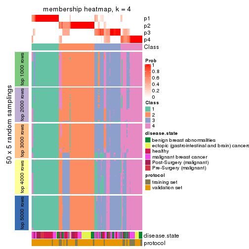</p>

</div>
<div id='tab-MAD-skmeans-membership-heatmap-4'>
<pre><code class="r">membership_heatmap(res, k = 5)
</code></pre>

<p></p>

</div>
<div id='tab-MAD-skmeans-membership-heatmap-5'>
<pre><code class="r">membership_heatmap(res, k = 6)
</code></pre>

<p></p>

</div>
</div>

As soon as we have had the classes for columns, we can look for signatures
which are significantly different between classes which can be candidate marks
for certain classes. Following are the heatmaps for signatures.


Signature heatmaps where rows are scaled:


<script>
$( function() {
	$( '#tabs-MAD-skmeans-get-signatures' ).tabs();
} );
</script>
<div id='tabs-MAD-skmeans-get-signatures'>
<ul>
<li><a href='#tab-MAD-skmeans-get-signatures-1'>k = 2</a></li>
<li><a href='#tab-MAD-skmeans-get-signatures-2'>k = 3</a></li>
<li><a href='#tab-MAD-skmeans-get-signatures-3'>k = 4</a></li>
<li><a href='#tab-MAD-skmeans-get-signatures-4'>k = 5</a></li>
<li><a href='#tab-MAD-skmeans-get-signatures-5'>k = 6</a></li>
</ul>
<div id='tab-MAD-skmeans-get-signatures-1'>
<pre><code class="r">get_signatures(res, k = 2)
</code></pre>

<pre><code>#&gt; Error in mat[ceiling(1:nr/h_ratio), ceiling(1:nc/w_ratio), drop = FALSE]: subscript out of bounds
</code></pre>

<p></p>

</div>
<div id='tab-MAD-skmeans-get-signatures-2'>
<pre><code class="r">get_signatures(res, k = 3)
</code></pre>

<p></p>

</div>
<div id='tab-MAD-skmeans-get-signatures-3'>
<pre><code class="r">get_signatures(res, k = 4)
</code></pre>

<p></p>

</div>
<div id='tab-MAD-skmeans-get-signatures-4'>
<pre><code class="r">get_signatures(res, k = 5)
</code></pre>

<p></p>

</div>
<div id='tab-MAD-skmeans-get-signatures-5'>
<pre><code class="r">get_signatures(res, k = 6)
</code></pre>

<p></p>

</div>
</div>


Signature heatmaps where rows are not scaled:


<script>
$( function() {
	$( '#tabs-MAD-skmeans-get-signatures-no-scale' ).tabs();
} );
</script>
<div id='tabs-MAD-skmeans-get-signatures-no-scale'>
<ul>
<li><a href='#tab-MAD-skmeans-get-signatures-no-scale-1'>k = 2</a></li>
<li><a href='#tab-MAD-skmeans-get-signatures-no-scale-2'>k = 3</a></li>
<li><a href='#tab-MAD-skmeans-get-signatures-no-scale-3'>k = 4</a></li>
<li><a href='#tab-MAD-skmeans-get-signatures-no-scale-4'>k = 5</a></li>
<li><a href='#tab-MAD-skmeans-get-signatures-no-scale-5'>k = 6</a></li>
</ul>
<div id='tab-MAD-skmeans-get-signatures-no-scale-1'>
<pre><code class="r">get_signatures(res, k = 2, scale_rows = FALSE)
</code></pre>

<pre><code>#&gt; Error in mat[ceiling(1:nr/h_ratio), ceiling(1:nc/w_ratio), drop = FALSE]: subscript out of bounds
</code></pre>

<p></p>

</div>
<div id='tab-MAD-skmeans-get-signatures-no-scale-2'>
<pre><code class="r">get_signatures(res, k = 3, scale_rows = FALSE)
</code></pre>

<p></p>

</div>
<div id='tab-MAD-skmeans-get-signatures-no-scale-3'>
<pre><code class="r">get_signatures(res, k = 4, scale_rows = FALSE)
</code></pre>

<p></p>

</div>
<div id='tab-MAD-skmeans-get-signatures-no-scale-4'>
<pre><code class="r">get_signatures(res, k = 5, scale_rows = FALSE)
</code></pre>

<p></p>

</div>
<div id='tab-MAD-skmeans-get-signatures-no-scale-5'>
<pre><code class="r">get_signatures(res, k = 6, scale_rows = FALSE)
</code></pre>

<p>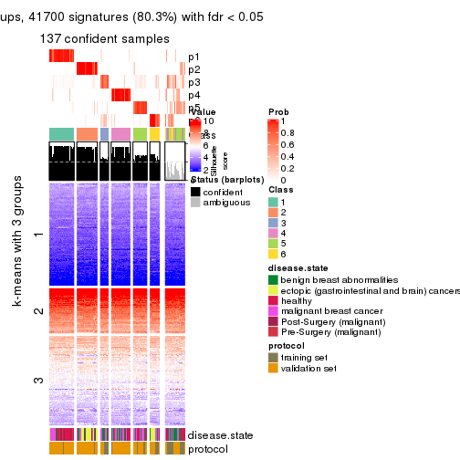</p>

</div>
</div>


Compare the overlap of signatures from different k:

```r
compare_signatures(res)
```


`get_signature()` returns a data frame invisibly. TO get the list of signatures, the function
call should be assigned to a variable explicitly. In following code, if `plot` argument is set
to `FALSE`, no heatmap is plotted while only the differential analysis is performed.

```r
# code only for demonstration
tb = get_signature(res, k = ..., plot = FALSE)
```

An example of the output of `tb` is:

```
#>   which_row         fdr    mean_1    mean_2 scaled_mean_1 scaled_mean_2 km
#> 1        38 0.042760348  8.373488  9.131774    -0.5533452     0.5164555  1
#> 2        40 0.018707592  7.106213  8.469186    -0.6173731     0.5762149  1
#> 3        55 0.019134737 10.221463 11.207825    -0.6159697     0.5749050  1
#> 4        59 0.006059896  5.921854  7.869574    -0.6899429     0.6439467  1
#> 5        60 0.018055526  8.928898 10.211722    -0.6204761     0.5791110  1
#> 6        98 0.009384629 15.714769 14.887706     0.6635654    -0.6193277  2
...
```

The columns in `tb` are:

1. `which_row`: row indices corresponding to the input matrix.
2. `fdr`: FDR for the differential test. 
3. `mean_x`: The mean value in group x.
4. `scaled_mean_x`: The mean value in group x after rows are scaled.
5. `km`: Row groups if k-means clustering is applied to rows.


UMAP plot which shows how samples are separated.


<script>
$( function() {
	$( '#tabs-MAD-skmeans-dimension-reduction' ).tabs();
} );
</script>
<div id='tabs-MAD-skmeans-dimension-reduction'>
<ul>
<li><a href='#tab-MAD-skmeans-dimension-reduction-1'>k = 2</a></li>
<li><a href='#tab-MAD-skmeans-dimension-reduction-2'>k = 3</a></li>
<li><a href='#tab-MAD-skmeans-dimension-reduction-3'>k = 4</a></li>
<li><a href='#tab-MAD-skmeans-dimension-reduction-4'>k = 5</a></li>
<li><a href='#tab-MAD-skmeans-dimension-reduction-5'>k = 6</a></li>
</ul>
<div id='tab-MAD-skmeans-dimension-reduction-1'>
<pre><code class="r">dimension_reduction(res, k = 2, method = &quot;UMAP&quot;)
</code></pre>

<p></p>

</div>
<div id='tab-MAD-skmeans-dimension-reduction-2'>
<pre><code class="r">dimension_reduction(res, k = 3, method = &quot;UMAP&quot;)
</code></pre>

<p></p>

</div>
<div id='tab-MAD-skmeans-dimension-reduction-3'>
<pre><code class="r">dimension_reduction(res, k = 4, method = &quot;UMAP&quot;)
</code></pre>

<p></p>

</div>
<div id='tab-MAD-skmeans-dimension-reduction-4'>
<pre><code class="r">dimension_reduction(res, k = 5, method = &quot;UMAP&quot;)
</code></pre>

<p></p>

</div>
<div id='tab-MAD-skmeans-dimension-reduction-5'>
<pre><code class="r">dimension_reduction(res, k = 6, method = &quot;UMAP&quot;)
</code></pre>

<p></p>

</div>
</div>


Following heatmap shows how subgroups are split when increasing `k`:

```r
collect_classes(res)
```


Test correlation between subgroups and known annotations. If the known
annotation is numeric, one-way ANOVA test is applied, and if the known
annotation is discrete, chi-squared contingency table test is applied.

```r
test_to_known_factors(res)
```

```
#>               n disease.state(p) protocol(p) k
#> MAD:skmeans 161         1.40e-05    8.11e-03 2
#> MAD:skmeans 144         5.56e-06    1.20e-06 3
#> MAD:skmeans 118         1.49e-06    3.19e-07 4
#> MAD:skmeans 140         2.70e-08    3.52e-05 5
#> MAD:skmeans 137         1.14e-09    5.73e-05 6
```


If matrix rows can be associated to genes, consider to use `GO_Enrichment(res,
...)` to perform function enrichment for the signature genes.


 

---------------------------------------------------


### MAD:pam


The object with results only for a single top-value method and a single partition method 
can be extracted as:

```r
res = res_list["MAD", "pam"]
# you can also extract it by
# res = res_list["MAD:pam"]
```

A summary of `res` and all the functions that can be applied to it:

```r
res
```

```
#> A 'ConsensusPartition' object with k = 2, 3, 4, 5, 6.
#>   On a matrix with 51941 rows and 162 columns.
#>   Top rows (1000, 2000, 3000, 4000, 5000) are extracted by 'MAD' method.
#>   Subgroups are detected by 'pam' method.
#>   Performed in total 1250 partitions by row resampling.
#>   Best k for subgroups seems to be 2.
#> 
#> Following methods can be applied to this 'ConsensusPartition' object:
#>  [1] "cola_report"             "collect_classes"         "collect_plots"          
#>  [4] "collect_stats"           "colnames"                "compare_signatures"     
#>  [7] "consensus_heatmap"       "dimension_reduction"     "functional_enrichment"  
#> [10] "get_anno_col"            "get_anno"                "get_classes"            
#> [13] "get_consensus"           "get_matrix"              "get_membership"         
#> [16] "get_param"               "get_signatures"          "get_stats"              
#> [19] "is_best_k"               "is_stable_k"             "membership_heatmap"     
#> [22] "ncol"                    "nrow"                    "plot_ecdf"              
#> [25] "rownames"                "select_partition_number" "show"                   
#> [28] "suggest_best_k"          "test_to_known_factors"
```

`collect_plots()` function collects all the plots made from `res` for all `k` (number of partitions)
into one single page to provide an easy and fast comparison between different `k`.

```r
collect_plots(res)
```


The plots are:

- The first row: a plot of the ECDF (Empirical cumulative distribution
  function) curves of the consensus matrix for each `k` and the heatmap of
  predicted classes for each `k`.
- The second row: heatmaps of the consensus matrix for each `k`.
- The third row: heatmaps of the membership matrix for each `k`.
- The fouth row: heatmaps of the signatures for each `k`.

All the plots in panels can be made by individual functions and they are
plotted later in this section.

`select_partition_number()` produces several plots showing different
statistics for choosing "optimized" `k`. There are following statistics:

- ECDF curves of the consensus matrix for each `k`;
- 1-PAC. [The PAC
  score](https://en.wikipedia.org/wiki/Consensus_clustering#Over-interpretation_potential_of_consensus_clustering)
  measures the proportion of the ambiguous subgrouping.
- Mean silhouette score.
- Concordance. The mean probability of fiting the consensus class ids in all
  partitions.
- Area increased. Denote $A_k$ as the area under the ECDF curve for current
  `k`, the area increased is defined as $A_k - A_{k-1}$.
- Rand index. The percent of pairs of samples that are both in a same cluster
  or both are not in a same cluster in the partition of k and k-1.
- Jaccard index. The ratio of pairs of samples are both in a same cluster in
  the partition of k and k-1 and the pairs of samples are both in a same
  cluster in the partition k or k-1.

The detailed explanations of these statistics can be found in [the cola
vignette](http://bioconductor.org/packages/devel/bioc/vignettes/cola/inst/doc/cola.html#toc_13).

Generally speaking, lower PAC score, higher mean silhouette score or higher
concordance corresponds to better partition. Rand index and Jaccard index
measure how similar the current partition is compared to partition with `k-1`.
If they are too similar, we won't accept `k` is better than `k-1`.

```r
select_partition_number(res)
```


The numeric values for all these statistics can be obtained by `get_stats()`.

```r
get_stats(res)
```

```
#>   k 1-PAC mean_silhouette concordance area_increased  Rand Jaccard
#> 2 2 0.390           0.756       0.880         0.4605 0.525   0.525
#> 3 3 0.465           0.524       0.812         0.3764 0.669   0.448
#> 4 4 0.551           0.625       0.787         0.1755 0.798   0.490
#> 5 5 0.652           0.676       0.832         0.0392 0.869   0.568
#> 6 6 0.660           0.631       0.793         0.0446 0.897   0.603
```

`suggest_best_k()` suggests the best $k$ based on these statistics. The rules are as follows:

- All $k$ with Jaccard index larger than 0.95 are removed because the increase of
  the partition number does not provides enough extra information. If all $k$ are removed,
  the best $k$ is assigned by `NA`.
- For $k$ with 1-PAC larger than 0.9, the maximal $k$ is taken as the "best k". Other $k$ is called "optional k".
- If it does not fit the second rule. The $k$ with the highest vote of highest
  1-PAC, mean silhouette and concordance is taken as the "best k".

```r
suggest_best_k(res)
```

```
#> [1] 2
```


Following shows the table of the partitions (You need to click the **show/hide
code output** link to see it). The membership matrix (columns with name `p*`)
is inferred by
[`clue::cl_consensus()`](https://www.rdocumentation.org/link/cl_consensus?package=clue)
function with the `SE` method. Basically the value in the membership matrix
represents the probability to belong to a certain group. The finall class
label for an item is determined with the group with highest probability it
belongs to.

In `get_classes()` function, the entropy is calculated from the membership
matrix and the silhouette score is calculated from the consensus matrix.


<script>
$( function() {
	$( '#tabs-MAD-pam-get-classes' ).tabs();
} );
</script>
<div id='tabs-MAD-pam-get-classes'>
<ul>
<li><a href='#tab-MAD-pam-get-classes-1'>k = 2</a></li>
<li><a href='#tab-MAD-pam-get-classes-2'>k = 3</a></li>
<li><a href='#tab-MAD-pam-get-classes-3'>k = 4</a></li>
<li><a href='#tab-MAD-pam-get-classes-4'>k = 5</a></li>
<li><a href='#tab-MAD-pam-get-classes-5'>k = 6</a></li>
</ul>

<div id='tab-MAD-pam-get-classes-1'>
<p><a id='tab-MAD-pam-get-classes-1-a' style='color:#0366d6' href='#'>show/hide code output</a></p>
<pre><code class="r">cbind(get_classes(res, k = 2), get_membership(res, k = 2))
</code></pre>

<pre><code>#&gt;           class entropy silhouette    p1    p2
#&gt; GSM682002     1  0.0000     0.8444 1.000 0.000
#&gt; GSM682003     2  0.0000     0.8484 0.000 1.000
#&gt; GSM682004     2  0.0000     0.8484 0.000 1.000
#&gt; GSM682005     2  0.5519     0.7834 0.128 0.872
#&gt; GSM682006     1  0.8955     0.5127 0.688 0.312
#&gt; GSM682007     1  0.8081     0.5638 0.752 0.248
#&gt; GSM682008     2  0.9170     0.4664 0.332 0.668
#&gt; GSM682009     2  0.7528     0.6739 0.216 0.784
#&gt; GSM682010     1  0.7139     0.8007 0.804 0.196
#&gt; GSM682011     1  0.0000     0.8444 1.000 0.000
#&gt; GSM682096     2  0.5519     0.7918 0.128 0.872
#&gt; GSM682097     2  0.5842     0.7733 0.140 0.860
#&gt; GSM682098     2  0.0000     0.8484 0.000 1.000
#&gt; GSM682099     1  0.8081     0.5638 0.752 0.248
#&gt; GSM682100     2  0.0000     0.8484 0.000 1.000
#&gt; GSM682101     2  0.9754     0.1935 0.408 0.592
#&gt; GSM682102     1  0.0000     0.8444 1.000 0.000
#&gt; GSM682103     1  0.0376     0.8443 0.996 0.004
#&gt; GSM682104     1  0.7299     0.7940 0.796 0.204
#&gt; GSM682105     1  0.0000     0.8444 1.000 0.000
#&gt; GSM682106     1  0.0376     0.8443 0.996 0.004
#&gt; GSM682107     1  0.0000     0.8444 1.000 0.000
#&gt; GSM682108     1  0.8081     0.7453 0.752 0.248
#&gt; GSM682109     1  0.9323     0.5800 0.652 0.348
#&gt; GSM682110     1  0.0376     0.8443 0.996 0.004
#&gt; GSM682111     1  0.9661     0.4786 0.608 0.392
#&gt; GSM682112     1  0.9833     0.3986 0.576 0.424
#&gt; GSM682113     1  0.0672     0.8445 0.992 0.008
#&gt; GSM682114     1  0.7139     0.8007 0.804 0.196
#&gt; GSM682115     1  0.0000     0.8444 1.000 0.000
#&gt; GSM682116     1  0.0000     0.8444 1.000 0.000
#&gt; GSM682117     1  0.0000     0.8444 1.000 0.000
#&gt; GSM682118     1  0.0000     0.8444 1.000 0.000
#&gt; GSM682119     1  0.4298     0.8346 0.912 0.088
#&gt; GSM682120     1  0.0000     0.8444 1.000 0.000
#&gt; GSM682121     1  0.0000     0.8444 1.000 0.000
#&gt; GSM682122     1  0.8713     0.6826 0.708 0.292
#&gt; GSM682012     2  0.0000     0.8484 0.000 1.000
#&gt; GSM682013     2  0.0000     0.8484 0.000 1.000
#&gt; GSM682014     2  0.0000     0.8484 0.000 1.000
#&gt; GSM682015     2  0.0000     0.8484 0.000 1.000
#&gt; GSM682016     2  0.0000     0.8484 0.000 1.000
#&gt; GSM682017     2  0.0000     0.8484 0.000 1.000
#&gt; GSM682018     2  0.0000     0.8484 0.000 1.000
#&gt; GSM682019     2  0.0000     0.8484 0.000 1.000
#&gt; GSM682020     2  0.0000     0.8484 0.000 1.000
#&gt; GSM682021     2  0.0938     0.8453 0.012 0.988
#&gt; GSM682022     2  0.0000     0.8484 0.000 1.000
#&gt; GSM682023     2  0.0000     0.8484 0.000 1.000
#&gt; GSM682024     1  0.2778     0.8411 0.952 0.048
#&gt; GSM682025     2  0.0000     0.8484 0.000 1.000
#&gt; GSM682026     2  0.0000     0.8484 0.000 1.000
#&gt; GSM682027     2  0.8499     0.6525 0.276 0.724
#&gt; GSM682028     2  0.8499     0.6525 0.276 0.724
#&gt; GSM682029     2  0.8499     0.6525 0.276 0.724
#&gt; GSM682030     2  0.8608     0.6452 0.284 0.716
#&gt; GSM682031     2  0.8555     0.6487 0.280 0.720
#&gt; GSM682032     2  0.8555     0.6487 0.280 0.720
#&gt; GSM682033     2  0.0000     0.8484 0.000 1.000
#&gt; GSM681992     2  0.5519     0.7834 0.128 0.872
#&gt; GSM681993     2  0.9552     0.3056 0.376 0.624
#&gt; GSM681994     1  0.2778     0.8207 0.952 0.048
#&gt; GSM681995     1  0.2423     0.8237 0.960 0.040
#&gt; GSM681996     1  0.9881    -0.0394 0.564 0.436
#&gt; GSM681997     1  0.8081     0.5638 0.752 0.248
#&gt; GSM681998     1  0.8081     0.5638 0.752 0.248
#&gt; GSM681999     2  0.9866     0.4283 0.432 0.568
#&gt; GSM682000     1  0.3733     0.8002 0.928 0.072
#&gt; GSM682001     1  0.8207     0.5371 0.744 0.256
#&gt; GSM682055     2  0.0000     0.8484 0.000 1.000
#&gt; GSM682056     2  0.9491     0.3298 0.368 0.632
#&gt; GSM682057     2  0.0000     0.8484 0.000 1.000
#&gt; GSM682058     2  0.9710     0.4705 0.400 0.600
#&gt; GSM682059     2  0.0000     0.8484 0.000 1.000
#&gt; GSM682060     2  0.8144     0.6333 0.252 0.748
#&gt; GSM682061     2  0.3733     0.8207 0.072 0.928
#&gt; GSM682062     2  0.0000     0.8484 0.000 1.000
#&gt; GSM682063     2  0.0000     0.8484 0.000 1.000
#&gt; GSM682064     1  0.7139     0.8007 0.804 0.196
#&gt; GSM682065     1  0.7056     0.8019 0.808 0.192
#&gt; GSM682066     1  0.4161     0.8356 0.916 0.084
#&gt; GSM682067     1  0.7139     0.8007 0.804 0.196
#&gt; GSM682068     1  0.0000     0.8444 1.000 0.000
#&gt; GSM682069     1  0.7139     0.8007 0.804 0.196
#&gt; GSM682070     1  0.6887     0.8056 0.816 0.184
#&gt; GSM682071     2  0.5737     0.7625 0.136 0.864
#&gt; GSM682072     1  0.9635     0.4885 0.612 0.388
#&gt; GSM682073     2  0.9944     0.0529 0.456 0.544
#&gt; GSM682074     1  0.6438     0.8139 0.836 0.164
#&gt; GSM682075     1  0.0000     0.8444 1.000 0.000
#&gt; GSM682076     1  0.0000     0.8444 1.000 0.000
#&gt; GSM682077     1  0.7139     0.8007 0.804 0.196
#&gt; GSM682078     1  0.0000     0.8444 1.000 0.000
#&gt; GSM682079     1  0.0000     0.8444 1.000 0.000
#&gt; GSM682080     2  0.9552     0.3056 0.376 0.624
#&gt; GSM682081     2  0.9954     0.0350 0.460 0.540
#&gt; GSM682082     1  0.0376     0.8443 0.996 0.004
#&gt; GSM682083     1  0.0000     0.8444 1.000 0.000
#&gt; GSM682084     1  0.7139     0.8007 0.804 0.196
#&gt; GSM682085     1  0.7139     0.8007 0.804 0.196
#&gt; GSM682086     1  0.0000     0.8444 1.000 0.000
#&gt; GSM682087     1  0.0000     0.8444 1.000 0.000
#&gt; GSM682088     1  0.7056     0.8028 0.808 0.192
#&gt; GSM682089     1  0.7139     0.8007 0.804 0.196
#&gt; GSM682090     1  0.0000     0.8444 1.000 0.000
#&gt; GSM682091     1  0.7139     0.8007 0.804 0.196
#&gt; GSM682092     1  0.0376     0.8443 0.996 0.004
#&gt; GSM682093     1  0.7139     0.8007 0.804 0.196
#&gt; GSM682094     1  0.0000     0.8444 1.000 0.000
#&gt; GSM682095     2  0.0000     0.8484 0.000 1.000
#&gt; GSM681982     2  0.6148     0.7465 0.152 0.848
#&gt; GSM681983     1  0.0000     0.8444 1.000 0.000
#&gt; GSM681984     2  0.3733     0.8207 0.072 0.928
#&gt; GSM681985     1  0.9922     0.3212 0.552 0.448
#&gt; GSM681986     2  0.4690     0.8029 0.100 0.900
#&gt; GSM681987     2  0.0000     0.8484 0.000 1.000
#&gt; GSM681988     2  0.1184     0.8439 0.016 0.984
#&gt; GSM681989     2  0.4690     0.8029 0.100 0.900
#&gt; GSM681990     1  0.7139     0.8007 0.804 0.196
#&gt; GSM681991     2  0.0000     0.8484 0.000 1.000
#&gt; GSM682034     1  0.7056     0.8019 0.808 0.192
#&gt; GSM682035     1  0.7056     0.8019 0.808 0.192
#&gt; GSM682036     1  0.7139     0.8007 0.804 0.196
#&gt; GSM682037     1  0.7056     0.8019 0.808 0.192
#&gt; GSM682038     2  0.1184     0.8439 0.016 0.984
#&gt; GSM682039     1  0.7139     0.8007 0.804 0.196
#&gt; GSM682040     2  0.8499     0.5609 0.276 0.724
#&gt; GSM682041     1  0.7139     0.8007 0.804 0.196
#&gt; GSM682042     2  0.9522     0.3176 0.372 0.628
#&gt; GSM682043     1  0.0000     0.8444 1.000 0.000
#&gt; GSM682044     1  0.0000     0.8444 1.000 0.000
#&gt; GSM682045     1  0.4562     0.8328 0.904 0.096
#&gt; GSM682046     1  0.0000     0.8444 1.000 0.000
#&gt; GSM682047     1  0.7139     0.8007 0.804 0.196
#&gt; GSM682048     1  0.7139     0.8007 0.804 0.196
#&gt; GSM682049     1  0.7056     0.8028 0.808 0.192
#&gt; GSM682050     1  0.0000     0.8444 1.000 0.000
#&gt; GSM682051     1  0.7139     0.8007 0.804 0.196
#&gt; GSM682052     1  0.8555     0.7015 0.720 0.280
#&gt; GSM682053     1  0.7139     0.8007 0.804 0.196
#&gt; GSM682054     1  0.0000     0.8444 1.000 0.000
#&gt; GSM682123     1  0.7139     0.8007 0.804 0.196
#&gt; GSM682124     1  0.5842     0.8211 0.860 0.140
#&gt; GSM682125     1  0.7139     0.8007 0.804 0.196
#&gt; GSM682126     1  0.0000     0.8444 1.000 0.000
#&gt; GSM682127     1  0.0000     0.8444 1.000 0.000
#&gt; GSM682128     1  0.0376     0.8443 0.996 0.004
#&gt; GSM682129     2  0.0000     0.8484 0.000 1.000
#&gt; GSM682130     2  0.0000     0.8484 0.000 1.000
#&gt; GSM682131     2  0.0000     0.8484 0.000 1.000
#&gt; GSM682132     1  0.0000     0.8444 1.000 0.000
#&gt; GSM682133     1  0.0000     0.8444 1.000 0.000
#&gt; GSM682134     1  0.7139     0.8007 0.804 0.196
#&gt; GSM682135     1  0.7139     0.8007 0.804 0.196
#&gt; GSM682136     1  0.0000     0.8444 1.000 0.000
#&gt; GSM682137     1  0.0000     0.8444 1.000 0.000
#&gt; GSM682138     1  0.0000     0.8444 1.000 0.000
#&gt; GSM682139     1  0.7139     0.8007 0.804 0.196
#&gt; GSM682140     1  0.0000     0.8444 1.000 0.000
#&gt; GSM682141     1  0.0000     0.8444 1.000 0.000
#&gt; GSM682142     1  0.0000     0.8444 1.000 0.000
#&gt; GSM682143     2  0.1184     0.8439 0.016 0.984
</code></pre>

<script>
$('#tab-MAD-pam-get-classes-1-a').parent().next().next().hide();
$('#tab-MAD-pam-get-classes-1-a').click(function(){
  $('#tab-MAD-pam-get-classes-1-a').parent().next().next().toggle();
  return(false);
});
</script>
</div>

<div id='tab-MAD-pam-get-classes-2'>
<p><a id='tab-MAD-pam-get-classes-2-a' style='color:#0366d6' href='#'>show/hide code output</a></p>
<pre><code class="r">cbind(get_classes(res, k = 3), get_membership(res, k = 3))
</code></pre>

<pre><code>#&gt;           class entropy silhouette    p1    p2    p3
#&gt; GSM682002     1  0.0000    0.74102 1.000 0.000 0.000
#&gt; GSM682003     2  0.4654    0.66966 0.000 0.792 0.208
#&gt; GSM682004     2  0.0000    0.83178 0.000 1.000 0.000
#&gt; GSM682005     3  0.0237    0.65609 0.004 0.000 0.996
#&gt; GSM682006     3  0.5650    0.33975 0.312 0.000 0.688
#&gt; GSM682007     3  0.6062    0.23021 0.384 0.000 0.616
#&gt; GSM682008     3  0.0000    0.65747 0.000 0.000 1.000
#&gt; GSM682009     3  0.0000    0.65747 0.000 0.000 1.000
#&gt; GSM682010     3  0.0000    0.65747 0.000 0.000 1.000
#&gt; GSM682011     1  0.4750    0.48588 0.784 0.000 0.216
#&gt; GSM682096     2  0.8525    0.54621 0.200 0.612 0.188
#&gt; GSM682097     3  0.7238    0.30267 0.044 0.328 0.628
#&gt; GSM682098     2  0.6282    0.40679 0.004 0.612 0.384
#&gt; GSM682099     1  0.3816    0.68363 0.852 0.000 0.148
#&gt; GSM682100     2  0.0237    0.82976 0.000 0.996 0.004
#&gt; GSM682101     1  0.9974   -0.01044 0.368 0.324 0.308
#&gt; GSM682102     1  0.0000    0.74102 1.000 0.000 0.000
#&gt; GSM682103     1  0.3816    0.68363 0.852 0.000 0.148
#&gt; GSM682104     3  0.3941    0.56119 0.156 0.000 0.844
#&gt; GSM682105     1  0.1753    0.73533 0.952 0.000 0.048
#&gt; GSM682106     3  0.6140    0.20159 0.404 0.000 0.596
#&gt; GSM682107     3  0.6309    0.05526 0.496 0.000 0.504
#&gt; GSM682108     3  0.0000    0.65747 0.000 0.000 1.000
#&gt; GSM682109     3  0.0000    0.65747 0.000 0.000 1.000
#&gt; GSM682110     3  0.6079    0.22477 0.388 0.000 0.612
#&gt; GSM682111     3  0.0000    0.65747 0.000 0.000 1.000
#&gt; GSM682112     3  0.0000    0.65747 0.000 0.000 1.000
#&gt; GSM682113     1  0.2625    0.72631 0.916 0.000 0.084
#&gt; GSM682114     3  0.6267    0.10801 0.452 0.000 0.548
#&gt; GSM682115     1  0.0000    0.74102 1.000 0.000 0.000
#&gt; GSM682116     1  0.1753    0.73533 0.952 0.000 0.048
#&gt; GSM682117     1  0.1860    0.73377 0.948 0.000 0.052
#&gt; GSM682118     3  0.6168    0.18916 0.412 0.000 0.588
#&gt; GSM682119     1  0.4702    0.62472 0.788 0.000 0.212
#&gt; GSM682120     1  0.1753    0.73533 0.952 0.000 0.048
#&gt; GSM682121     1  0.1753    0.73533 0.952 0.000 0.048
#&gt; GSM682122     3  0.2796    0.61583 0.092 0.000 0.908
#&gt; GSM682012     2  0.0000    0.83178 0.000 1.000 0.000
#&gt; GSM682013     2  0.0000    0.83178 0.000 1.000 0.000
#&gt; GSM682014     2  0.0000    0.83178 0.000 1.000 0.000
#&gt; GSM682015     2  0.0000    0.83178 0.000 1.000 0.000
#&gt; GSM682016     2  0.6079    0.40521 0.000 0.612 0.388
#&gt; GSM682017     2  0.0000    0.83178 0.000 1.000 0.000
#&gt; GSM682018     2  0.3816    0.73272 0.000 0.852 0.148
#&gt; GSM682019     2  0.0000    0.83178 0.000 1.000 0.000
#&gt; GSM682020     2  0.0000    0.83178 0.000 1.000 0.000
#&gt; GSM682021     2  0.4235    0.70577 0.000 0.824 0.176
#&gt; GSM682022     2  0.0000    0.83178 0.000 1.000 0.000
#&gt; GSM682023     2  0.4235    0.70577 0.000 0.824 0.176
#&gt; GSM682024     1  0.6034    0.53936 0.752 0.212 0.036
#&gt; GSM682025     2  0.0000    0.83178 0.000 1.000 0.000
#&gt; GSM682026     2  0.0000    0.83178 0.000 1.000 0.000
#&gt; GSM682027     2  0.6079    0.47584 0.388 0.612 0.000
#&gt; GSM682028     2  0.6079    0.47584 0.388 0.612 0.000
#&gt; GSM682029     2  0.6079    0.47584 0.388 0.612 0.000
#&gt; GSM682030     2  0.6632    0.45743 0.392 0.596 0.012
#&gt; GSM682031     2  0.6079    0.47584 0.388 0.612 0.000
#&gt; GSM682032     2  0.6298    0.47238 0.388 0.608 0.004
#&gt; GSM682033     2  0.0237    0.83023 0.000 0.996 0.004
#&gt; GSM681992     3  0.3375    0.63033 0.048 0.044 0.908
#&gt; GSM681993     3  0.0000    0.65747 0.000 0.000 1.000
#&gt; GSM681994     1  0.4235    0.66008 0.824 0.000 0.176
#&gt; GSM681995     1  0.6295   -0.01518 0.528 0.000 0.472
#&gt; GSM681996     3  0.6062    0.23021 0.384 0.000 0.616
#&gt; GSM681997     3  0.6079    0.22477 0.388 0.000 0.612
#&gt; GSM681998     3  0.6079    0.22477 0.388 0.000 0.612
#&gt; GSM681999     3  0.6305    0.07731 0.484 0.000 0.516
#&gt; GSM682000     3  0.6308    0.06294 0.492 0.000 0.508
#&gt; GSM682001     1  0.7446    0.01425 0.532 0.036 0.432
#&gt; GSM682055     2  0.6079    0.40521 0.000 0.612 0.388
#&gt; GSM682056     3  0.9066    0.29068 0.284 0.176 0.540
#&gt; GSM682057     2  0.0000    0.83178 0.000 1.000 0.000
#&gt; GSM682058     1  0.6796    0.27667 0.632 0.344 0.024
#&gt; GSM682059     2  0.0000    0.83178 0.000 1.000 0.000
#&gt; GSM682060     3  0.6095    0.17664 0.000 0.392 0.608
#&gt; GSM682061     3  0.6140    0.14453 0.000 0.404 0.596
#&gt; GSM682062     2  0.0000    0.83178 0.000 1.000 0.000
#&gt; GSM682063     2  0.1643    0.80760 0.044 0.956 0.000
#&gt; GSM682064     3  0.3340    0.60539 0.120 0.000 0.880
#&gt; GSM682065     1  0.6062    0.19978 0.616 0.000 0.384
#&gt; GSM682066     1  0.5678    0.40731 0.684 0.000 0.316
#&gt; GSM682067     3  0.6140    0.24231 0.404 0.000 0.596
#&gt; GSM682068     1  0.0000    0.74102 1.000 0.000 0.000
#&gt; GSM682069     1  0.6308   -0.01636 0.508 0.000 0.492
#&gt; GSM682070     1  0.5397    0.42622 0.720 0.000 0.280
#&gt; GSM682071     3  0.4555    0.50950 0.000 0.200 0.800
#&gt; GSM682072     3  0.0000    0.65747 0.000 0.000 1.000
#&gt; GSM682073     3  0.0000    0.65747 0.000 0.000 1.000
#&gt; GSM682074     3  0.6305    0.02266 0.484 0.000 0.516
#&gt; GSM682075     1  0.0000    0.74102 1.000 0.000 0.000
#&gt; GSM682076     1  0.1753    0.73533 0.952 0.000 0.048
#&gt; GSM682077     1  0.6305    0.00609 0.516 0.000 0.484
#&gt; GSM682078     1  0.3686    0.69029 0.860 0.000 0.140
#&gt; GSM682079     1  0.3686    0.69029 0.860 0.000 0.140
#&gt; GSM682080     3  0.0000    0.65747 0.000 0.000 1.000
#&gt; GSM682081     3  0.0000    0.65747 0.000 0.000 1.000
#&gt; GSM682082     1  0.3816    0.68363 0.852 0.000 0.148
#&gt; GSM682083     1  0.1289    0.73869 0.968 0.000 0.032
#&gt; GSM682084     3  0.4887    0.49000 0.228 0.000 0.772
#&gt; GSM682085     3  0.6062    0.25096 0.384 0.000 0.616
#&gt; GSM682086     1  0.0592    0.73646 0.988 0.000 0.012
#&gt; GSM682087     1  0.1753    0.73533 0.952 0.000 0.048
#&gt; GSM682088     3  0.6291    0.07226 0.468 0.000 0.532
#&gt; GSM682089     3  0.6291    0.07226 0.468 0.000 0.532
#&gt; GSM682090     1  0.3752    0.68710 0.856 0.000 0.144
#&gt; GSM682091     3  0.6291    0.07226 0.468 0.000 0.532
#&gt; GSM682092     1  0.3816    0.68363 0.852 0.000 0.148
#&gt; GSM682093     3  0.6291    0.07226 0.468 0.000 0.532
#&gt; GSM682094     1  0.1753    0.73533 0.952 0.000 0.048
#&gt; GSM682095     2  0.0000    0.83178 0.000 1.000 0.000
#&gt; GSM681982     3  0.0000    0.65747 0.000 0.000 1.000
#&gt; GSM681983     1  0.0000    0.74102 1.000 0.000 0.000
#&gt; GSM681984     3  0.0000    0.65747 0.000 0.000 1.000
#&gt; GSM681985     3  0.0000    0.65747 0.000 0.000 1.000
#&gt; GSM681986     3  0.3340    0.55128 0.000 0.120 0.880
#&gt; GSM681987     2  0.5058    0.63364 0.000 0.756 0.244
#&gt; GSM681988     3  0.0000    0.65747 0.000 0.000 1.000
#&gt; GSM681989     3  0.0000    0.65747 0.000 0.000 1.000
#&gt; GSM681990     3  0.0000    0.65747 0.000 0.000 1.000
#&gt; GSM681991     2  0.0000    0.83178 0.000 1.000 0.000
#&gt; GSM682034     1  0.6062    0.19978 0.616 0.000 0.384
#&gt; GSM682035     1  0.6274    0.06580 0.544 0.000 0.456
#&gt; GSM682036     3  0.4062    0.56069 0.164 0.000 0.836
#&gt; GSM682037     1  0.6302    0.01541 0.520 0.000 0.480
#&gt; GSM682038     3  0.0000    0.65747 0.000 0.000 1.000
#&gt; GSM682039     3  0.6291    0.07226 0.468 0.000 0.532
#&gt; GSM682040     3  0.4555    0.50950 0.000 0.200 0.800
#&gt; GSM682041     3  0.6280    0.08962 0.460 0.000 0.540
#&gt; GSM682042     3  0.0237    0.65658 0.000 0.004 0.996
#&gt; GSM682043     1  0.0000    0.74102 1.000 0.000 0.000
#&gt; GSM682044     1  0.0000    0.74102 1.000 0.000 0.000
#&gt; GSM682045     1  0.3412    0.66015 0.876 0.000 0.124
#&gt; GSM682046     1  0.0000    0.74102 1.000 0.000 0.000
#&gt; GSM682047     3  0.6095    0.23566 0.392 0.000 0.608
#&gt; GSM682048     3  0.6291    0.07226 0.468 0.000 0.532
#&gt; GSM682049     1  0.6308   -0.01636 0.508 0.000 0.492
#&gt; GSM682050     1  0.0000    0.74102 1.000 0.000 0.000
#&gt; GSM682051     3  0.6192    0.17767 0.420 0.000 0.580
#&gt; GSM682052     3  0.0592    0.65415 0.012 0.000 0.988
#&gt; GSM682053     3  0.6291    0.07226 0.468 0.000 0.532
#&gt; GSM682054     1  0.0000    0.74102 1.000 0.000 0.000
#&gt; GSM682123     1  0.6305    0.00609 0.516 0.000 0.484
#&gt; GSM682124     1  0.4887    0.51856 0.772 0.000 0.228
#&gt; GSM682125     3  0.6291    0.07226 0.468 0.000 0.532
#&gt; GSM682126     1  0.0000    0.74102 1.000 0.000 0.000
#&gt; GSM682127     1  0.0424    0.74015 0.992 0.000 0.008
#&gt; GSM682128     1  0.3816    0.68363 0.852 0.000 0.148
#&gt; GSM682129     2  0.0000    0.83178 0.000 1.000 0.000
#&gt; GSM682130     2  0.0000    0.83178 0.000 1.000 0.000
#&gt; GSM682131     2  0.0000    0.83178 0.000 1.000 0.000
#&gt; GSM682132     1  0.0000    0.74102 1.000 0.000 0.000
#&gt; GSM682133     1  0.0000    0.74102 1.000 0.000 0.000
#&gt; GSM682134     1  0.6305    0.00609 0.516 0.000 0.484
#&gt; GSM682135     1  0.6305    0.00609 0.516 0.000 0.484
#&gt; GSM682136     1  0.0000    0.74102 1.000 0.000 0.000
#&gt; GSM682137     1  0.2165    0.73189 0.936 0.000 0.064
#&gt; GSM682138     1  0.3038    0.70718 0.896 0.000 0.104
#&gt; GSM682139     1  0.6305    0.00609 0.516 0.000 0.484
#&gt; GSM682140     1  0.1860    0.73294 0.948 0.000 0.052
#&gt; GSM682141     1  0.0000    0.74102 1.000 0.000 0.000
#&gt; GSM682142     1  0.0000    0.74102 1.000 0.000 0.000
#&gt; GSM682143     2  0.6204    0.27657 0.000 0.576 0.424
</code></pre>

<script>
$('#tab-MAD-pam-get-classes-2-a').parent().next().next().hide();
$('#tab-MAD-pam-get-classes-2-a').click(function(){
  $('#tab-MAD-pam-get-classes-2-a').parent().next().next().toggle();
  return(false);
});
</script>
</div>

<div id='tab-MAD-pam-get-classes-3'>
<p><a id='tab-MAD-pam-get-classes-3-a' style='color:#0366d6' href='#'>show/hide code output</a></p>
<pre><code class="r">cbind(get_classes(res, k = 4), get_membership(res, k = 4))
</code></pre>

<pre><code>#&gt;           class entropy silhouette    p1    p2    p3    p4
#&gt; GSM682002     4  0.3528     0.5179 0.192 0.000 0.000 0.808
#&gt; GSM682003     2  0.0592     0.8270 0.000 0.984 0.016 0.000
#&gt; GSM682004     2  0.3123     0.7340 0.000 0.844 0.156 0.000
#&gt; GSM682005     3  0.0921     0.8207 0.000 0.000 0.972 0.028
#&gt; GSM682006     3  0.1302     0.8173 0.000 0.000 0.956 0.044
#&gt; GSM682007     3  0.3219     0.7715 0.000 0.000 0.836 0.164
#&gt; GSM682008     3  0.3219     0.7715 0.000 0.000 0.836 0.164
#&gt; GSM682009     3  0.2281     0.7625 0.096 0.000 0.904 0.000
#&gt; GSM682010     3  0.4121     0.6651 0.184 0.000 0.796 0.020
#&gt; GSM682011     4  0.7613    -0.0499 0.368 0.000 0.204 0.428
#&gt; GSM682096     2  0.6167     0.6271 0.000 0.668 0.208 0.124
#&gt; GSM682097     2  0.6743     0.1941 0.008 0.472 0.452 0.068
#&gt; GSM682098     2  0.3494     0.7305 0.000 0.824 0.172 0.004
#&gt; GSM682099     4  0.3257     0.7172 0.152 0.000 0.004 0.844
#&gt; GSM682100     2  0.1716     0.8016 0.000 0.936 0.064 0.000
#&gt; GSM682101     1  0.8207     0.4907 0.544 0.236 0.156 0.064
#&gt; GSM682102     4  0.3400     0.7062 0.180 0.000 0.000 0.820
#&gt; GSM682103     4  0.3900     0.6193 0.020 0.000 0.164 0.816
#&gt; GSM682104     3  0.4428     0.5216 0.004 0.000 0.720 0.276
#&gt; GSM682105     4  0.3743     0.7152 0.160 0.000 0.016 0.824
#&gt; GSM682106     4  0.5530     0.5335 0.076 0.000 0.212 0.712
#&gt; GSM682107     4  0.7526    -0.1485 0.188 0.000 0.372 0.440
#&gt; GSM682108     3  0.2469     0.7504 0.108 0.000 0.892 0.000
#&gt; GSM682109     3  0.0000     0.8188 0.000 0.000 1.000 0.000
#&gt; GSM682110     3  0.3610     0.7540 0.000 0.000 0.800 0.200
#&gt; GSM682111     3  0.0188     0.8184 0.004 0.000 0.996 0.000
#&gt; GSM682112     3  0.0469     0.8177 0.012 0.000 0.988 0.000
#&gt; GSM682113     1  0.4781     0.3987 0.660 0.000 0.004 0.336
#&gt; GSM682114     4  0.5619     0.6368 0.152 0.000 0.124 0.724
#&gt; GSM682115     1  0.4697     0.1209 0.644 0.000 0.000 0.356
#&gt; GSM682116     4  0.4819     0.5660 0.344 0.000 0.004 0.652
#&gt; GSM682117     4  0.3668     0.5107 0.188 0.000 0.004 0.808
#&gt; GSM682118     3  0.5786     0.4947 0.308 0.000 0.640 0.052
#&gt; GSM682119     4  0.7520     0.1946 0.192 0.000 0.352 0.456
#&gt; GSM682120     4  0.3355     0.7156 0.160 0.000 0.004 0.836
#&gt; GSM682121     4  0.3074     0.7159 0.152 0.000 0.000 0.848
#&gt; GSM682122     3  0.1706     0.8148 0.016 0.000 0.948 0.036
#&gt; GSM682012     2  0.0000     0.8311 0.000 1.000 0.000 0.000
#&gt; GSM682013     2  0.0000     0.8311 0.000 1.000 0.000 0.000
#&gt; GSM682014     2  0.0000     0.8311 0.000 1.000 0.000 0.000
#&gt; GSM682015     2  0.0000     0.8311 0.000 1.000 0.000 0.000
#&gt; GSM682016     2  0.3356     0.7282 0.000 0.824 0.176 0.000
#&gt; GSM682017     2  0.0000     0.8311 0.000 1.000 0.000 0.000
#&gt; GSM682018     2  0.1938     0.8090 0.012 0.936 0.052 0.000
#&gt; GSM682019     2  0.0000     0.8311 0.000 1.000 0.000 0.000
#&gt; GSM682020     2  0.0000     0.8311 0.000 1.000 0.000 0.000
#&gt; GSM682021     2  0.5358     0.5832 0.252 0.700 0.048 0.000
#&gt; GSM682022     2  0.0000     0.8311 0.000 1.000 0.000 0.000
#&gt; GSM682023     2  0.1474     0.8121 0.000 0.948 0.052 0.000
#&gt; GSM682024     1  0.0188     0.7183 0.996 0.000 0.000 0.004
#&gt; GSM682025     2  0.0000     0.8311 0.000 1.000 0.000 0.000
#&gt; GSM682026     2  0.0000     0.8311 0.000 1.000 0.000 0.000
#&gt; GSM682027     2  0.4741     0.5731 0.000 0.668 0.004 0.328
#&gt; GSM682028     2  0.5130     0.5892 0.000 0.668 0.020 0.312
#&gt; GSM682029     2  0.5097     0.4759 0.000 0.568 0.004 0.428
#&gt; GSM682030     2  0.5360     0.4514 0.000 0.552 0.012 0.436
#&gt; GSM682031     2  0.4933     0.4724 0.000 0.568 0.000 0.432
#&gt; GSM682032     2  0.5229     0.4716 0.000 0.564 0.008 0.428
#&gt; GSM682033     2  0.1211     0.8190 0.000 0.960 0.040 0.000
#&gt; GSM681992     3  0.8985     0.3216 0.180 0.172 0.496 0.152
#&gt; GSM681993     3  0.0524     0.8195 0.004 0.000 0.988 0.008
#&gt; GSM681994     4  0.1118     0.6256 0.000 0.000 0.036 0.964
#&gt; GSM681995     3  0.4961     0.4118 0.000 0.000 0.552 0.448
#&gt; GSM681996     3  0.3266     0.7698 0.000 0.000 0.832 0.168
#&gt; GSM681997     3  0.3400     0.7644 0.000 0.000 0.820 0.180
#&gt; GSM681998     3  0.3400     0.7644 0.000 0.000 0.820 0.180
#&gt; GSM681999     3  0.4961     0.4118 0.000 0.000 0.552 0.448
#&gt; GSM682000     3  0.4961     0.4118 0.000 0.000 0.552 0.448
#&gt; GSM682001     4  0.8463    -0.1018 0.188 0.040 0.344 0.428
#&gt; GSM682055     2  0.3400     0.7249 0.000 0.820 0.180 0.000
#&gt; GSM682056     2  0.8343     0.0602 0.016 0.372 0.280 0.332
#&gt; GSM682057     2  0.0336     0.8294 0.000 0.992 0.008 0.000
#&gt; GSM682058     4  0.4728     0.6065 0.008 0.048 0.152 0.792
#&gt; GSM682059     2  0.0000     0.8311 0.000 1.000 0.000 0.000
#&gt; GSM682060     3  0.4188     0.5535 0.004 0.244 0.752 0.000
#&gt; GSM682061     3  0.4679     0.3638 0.000 0.352 0.648 0.000
#&gt; GSM682062     2  0.0000     0.8311 0.000 1.000 0.000 0.000
#&gt; GSM682063     2  0.5791     0.4868 0.284 0.656 0.060 0.000
#&gt; GSM682064     1  0.4679     0.4955 0.648 0.000 0.352 0.000
#&gt; GSM682065     1  0.3569     0.6374 0.804 0.000 0.000 0.196
#&gt; GSM682066     1  0.3933     0.6348 0.792 0.000 0.008 0.200
#&gt; GSM682067     1  0.6437     0.6172 0.648 0.000 0.168 0.184
#&gt; GSM682068     4  0.4790     0.0302 0.380 0.000 0.000 0.620
#&gt; GSM682069     1  0.3450     0.6760 0.836 0.000 0.156 0.008
#&gt; GSM682070     1  0.3569     0.6374 0.804 0.000 0.000 0.196
#&gt; GSM682071     3  0.4331     0.5077 0.000 0.288 0.712 0.000
#&gt; GSM682072     3  0.0188     0.8184 0.004 0.000 0.996 0.000
#&gt; GSM682073     3  0.0707     0.8199 0.000 0.000 0.980 0.020
#&gt; GSM682074     4  0.4920     0.6760 0.192 0.000 0.052 0.756
#&gt; GSM682075     4  0.3172     0.7146 0.160 0.000 0.000 0.840
#&gt; GSM682076     4  0.3257     0.7172 0.152 0.000 0.004 0.844
#&gt; GSM682077     1  0.4011     0.6290 0.784 0.000 0.008 0.208
#&gt; GSM682078     4  0.3743     0.7152 0.160 0.000 0.016 0.824
#&gt; GSM682079     4  0.3743     0.7152 0.160 0.000 0.016 0.824
#&gt; GSM682080     3  0.2125     0.7899 0.004 0.076 0.920 0.000
#&gt; GSM682081     3  0.0707     0.8199 0.000 0.000 0.980 0.020
#&gt; GSM682082     4  0.3257     0.7172 0.152 0.000 0.004 0.844
#&gt; GSM682083     4  0.4697     0.5598 0.356 0.000 0.000 0.644
#&gt; GSM682084     3  0.4805     0.6657 0.132 0.000 0.784 0.084
#&gt; GSM682085     4  0.6936     0.4524 0.144 0.000 0.292 0.564
#&gt; GSM682086     4  0.4624     0.5242 0.340 0.000 0.000 0.660
#&gt; GSM682087     4  0.3257     0.7172 0.152 0.000 0.004 0.844
#&gt; GSM682088     4  0.3862     0.7153 0.152 0.000 0.024 0.824
#&gt; GSM682089     4  0.3862     0.7153 0.152 0.000 0.024 0.824
#&gt; GSM682090     4  0.3257     0.7172 0.152 0.000 0.004 0.844
#&gt; GSM682091     1  0.7121     0.4820 0.544 0.000 0.164 0.292
#&gt; GSM682092     4  0.3862     0.7153 0.152 0.000 0.024 0.824
#&gt; GSM682093     3  0.5364     0.2521 0.016 0.000 0.592 0.392
#&gt; GSM682094     4  0.4917     0.5227 0.336 0.000 0.008 0.656
#&gt; GSM682095     2  0.0000     0.8311 0.000 1.000 0.000 0.000
#&gt; GSM681982     3  0.0592     0.8200 0.000 0.000 0.984 0.016
#&gt; GSM681983     1  0.3311     0.6302 0.828 0.000 0.000 0.172
#&gt; GSM681984     3  0.0188     0.8184 0.004 0.000 0.996 0.000
#&gt; GSM681985     3  0.0188     0.8184 0.004 0.000 0.996 0.000
#&gt; GSM681986     3  0.2714     0.7659 0.000 0.112 0.884 0.004
#&gt; GSM681987     2  0.4222     0.5935 0.000 0.728 0.272 0.000
#&gt; GSM681988     3  0.0707     0.8199 0.000 0.000 0.980 0.020
#&gt; GSM681989     3  0.2345     0.7994 0.000 0.000 0.900 0.100
#&gt; GSM681990     3  0.3024     0.7767 0.000 0.000 0.852 0.148
#&gt; GSM681991     2  0.1022     0.8209 0.000 0.968 0.032 0.000
#&gt; GSM682034     1  0.0188     0.7183 0.996 0.000 0.000 0.004
#&gt; GSM682035     1  0.0336     0.7174 0.992 0.000 0.000 0.008
#&gt; GSM682036     1  0.5548     0.5215 0.628 0.000 0.340 0.032
#&gt; GSM682037     1  0.0707     0.7122 0.980 0.000 0.000 0.020
#&gt; GSM682038     3  0.2466     0.7764 0.004 0.096 0.900 0.000
#&gt; GSM682039     1  0.5800     0.5917 0.708 0.000 0.164 0.128
#&gt; GSM682040     3  0.3751     0.6288 0.004 0.196 0.800 0.000
#&gt; GSM682041     1  0.6738    -0.0466 0.544 0.000 0.104 0.352
#&gt; GSM682042     3  0.0376     0.8184 0.004 0.004 0.992 0.000
#&gt; GSM682043     4  0.4877     0.4995 0.408 0.000 0.000 0.592
#&gt; GSM682044     1  0.0188     0.7183 0.996 0.000 0.000 0.004
#&gt; GSM682045     1  0.2921     0.6807 0.860 0.000 0.140 0.000
#&gt; GSM682046     1  0.0188     0.7183 0.996 0.000 0.000 0.004
#&gt; GSM682047     4  0.5366     0.2628 0.012 0.000 0.440 0.548
#&gt; GSM682048     1  0.4004     0.6755 0.812 0.000 0.164 0.024
#&gt; GSM682049     1  0.4990     0.1327 0.640 0.000 0.008 0.352
#&gt; GSM682050     1  0.0188     0.7183 0.996 0.000 0.000 0.004
#&gt; GSM682051     4  0.7031     0.4548 0.152 0.000 0.296 0.552
#&gt; GSM682052     3  0.0188     0.8184 0.004 0.000 0.996 0.000
#&gt; GSM682053     4  0.5594     0.5460 0.112 0.000 0.164 0.724
#&gt; GSM682054     1  0.4134     0.3554 0.740 0.000 0.000 0.260
#&gt; GSM682123     1  0.3105     0.6853 0.856 0.000 0.140 0.004
#&gt; GSM682124     1  0.0188     0.7183 0.996 0.000 0.000 0.004
#&gt; GSM682125     1  0.3790     0.6735 0.820 0.000 0.164 0.016
#&gt; GSM682126     1  0.3688     0.6282 0.792 0.000 0.000 0.208
#&gt; GSM682127     1  0.3726     0.6254 0.788 0.000 0.000 0.212
#&gt; GSM682128     4  0.3862     0.7153 0.152 0.000 0.024 0.824
#&gt; GSM682129     2  0.0000     0.8311 0.000 1.000 0.000 0.000
#&gt; GSM682130     2  0.0000     0.8311 0.000 1.000 0.000 0.000
#&gt; GSM682131     2  0.0000     0.8311 0.000 1.000 0.000 0.000
#&gt; GSM682132     4  0.3528     0.5189 0.192 0.000 0.000 0.808
#&gt; GSM682133     1  0.3801     0.5193 0.780 0.000 0.000 0.220
#&gt; GSM682134     1  0.0524     0.7186 0.988 0.000 0.008 0.004
#&gt; GSM682135     1  0.6303     0.6207 0.660 0.000 0.148 0.192
#&gt; GSM682136     1  0.3688     0.6282 0.792 0.000 0.000 0.208
#&gt; GSM682137     4  0.3257     0.7172 0.152 0.000 0.004 0.844
#&gt; GSM682138     4  0.4967     0.2126 0.452 0.000 0.000 0.548
#&gt; GSM682139     1  0.3024     0.6780 0.852 0.000 0.148 0.000
#&gt; GSM682140     4  0.4967     0.2086 0.452 0.000 0.000 0.548
#&gt; GSM682141     1  0.0336     0.7174 0.992 0.000 0.000 0.008
#&gt; GSM682142     1  0.3569     0.6374 0.804 0.000 0.000 0.196
#&gt; GSM682143     2  0.5000    -0.0287 0.000 0.500 0.500 0.000
</code></pre>

<script>
$('#tab-MAD-pam-get-classes-3-a').parent().next().next().hide();
$('#tab-MAD-pam-get-classes-3-a').click(function(){
  $('#tab-MAD-pam-get-classes-3-a').parent().next().next().toggle();
  return(false);
});
</script>
</div>

<div id='tab-MAD-pam-get-classes-4'>
<p><a id='tab-MAD-pam-get-classes-4-a' style='color:#0366d6' href='#'>show/hide code output</a></p>
<pre><code class="r">cbind(get_classes(res, k = 5), get_membership(res, k = 5))
</code></pre>

<pre><code>#&gt;           class entropy silhouette    p1    p2    p3    p4    p5
#&gt; GSM682002     4  0.5024     0.6085 0.212 0.000 0.000 0.692 0.096
#&gt; GSM682003     2  0.4522     0.5361 0.000 0.708 0.248 0.000 0.044
#&gt; GSM682004     2  0.3958     0.6291 0.000 0.780 0.176 0.000 0.044
#&gt; GSM682005     3  0.1430     0.7688 0.000 0.000 0.944 0.004 0.052
#&gt; GSM682006     3  0.1043     0.7692 0.000 0.000 0.960 0.000 0.040
#&gt; GSM682007     3  0.2329     0.7291 0.000 0.000 0.876 0.000 0.124
#&gt; GSM682008     3  0.2329     0.7291 0.000 0.000 0.876 0.000 0.124
#&gt; GSM682009     3  0.3642     0.5052 0.232 0.000 0.760 0.000 0.008
#&gt; GSM682010     3  0.4705    -0.3017 0.484 0.000 0.504 0.004 0.008
#&gt; GSM682011     1  0.5843     0.5288 0.624 0.000 0.204 0.004 0.168
#&gt; GSM682096     3  0.4352     0.5325 0.004 0.320 0.668 0.004 0.004
#&gt; GSM682097     3  0.7146     0.2520 0.000 0.124 0.488 0.324 0.064
#&gt; GSM682098     3  0.4562     0.1130 0.000 0.492 0.500 0.008 0.000
#&gt; GSM682099     4  0.0963     0.8234 0.000 0.000 0.000 0.964 0.036
#&gt; GSM682100     2  0.0963     0.8360 0.000 0.964 0.036 0.000 0.000
#&gt; GSM682101     2  0.7641     0.3387 0.176 0.576 0.120 0.064 0.064
#&gt; GSM682102     4  0.0703     0.8292 0.024 0.000 0.000 0.976 0.000
#&gt; GSM682103     4  0.3920     0.7000 0.008 0.000 0.120 0.812 0.060
#&gt; GSM682104     3  0.1877     0.7630 0.000 0.000 0.924 0.012 0.064
#&gt; GSM682105     4  0.0290     0.8347 0.008 0.000 0.000 0.992 0.000
#&gt; GSM682106     4  0.4674     0.5379 0.000 0.000 0.232 0.708 0.060
#&gt; GSM682107     1  0.6490     0.3586 0.492 0.000 0.344 0.008 0.156
#&gt; GSM682108     3  0.3534     0.4581 0.256 0.000 0.744 0.000 0.000
#&gt; GSM682109     3  0.0162     0.7739 0.000 0.000 0.996 0.000 0.004
#&gt; GSM682110     3  0.2930     0.7056 0.000 0.000 0.832 0.004 0.164
#&gt; GSM682111     3  0.0290     0.7739 0.000 0.000 0.992 0.000 0.008
#&gt; GSM682112     3  0.2629     0.7537 0.012 0.000 0.880 0.004 0.104
#&gt; GSM682113     1  0.3983     0.6266 0.660 0.000 0.000 0.340 0.000
#&gt; GSM682114     4  0.0566     0.8325 0.000 0.000 0.012 0.984 0.004
#&gt; GSM682115     4  0.3242     0.6946 0.216 0.000 0.000 0.784 0.000
#&gt; GSM682116     4  0.3274     0.6905 0.220 0.000 0.000 0.780 0.000
#&gt; GSM682117     1  0.6415     0.4015 0.464 0.000 0.004 0.380 0.152
#&gt; GSM682118     1  0.6277     0.3931 0.464 0.000 0.384 0.152 0.000
#&gt; GSM682119     1  0.6953     0.5250 0.492 0.000 0.312 0.164 0.032
#&gt; GSM682120     4  0.0290     0.8347 0.008 0.000 0.000 0.992 0.000
#&gt; GSM682121     4  0.0324     0.8351 0.004 0.000 0.000 0.992 0.004
#&gt; GSM682122     3  0.1661     0.7700 0.000 0.000 0.940 0.036 0.024
#&gt; GSM682012     2  0.0000     0.8644 0.000 1.000 0.000 0.000 0.000
#&gt; GSM682013     2  0.0000     0.8644 0.000 1.000 0.000 0.000 0.000
#&gt; GSM682014     2  0.0000     0.8644 0.000 1.000 0.000 0.000 0.000
#&gt; GSM682015     2  0.0000     0.8644 0.000 1.000 0.000 0.000 0.000
#&gt; GSM682016     2  0.4450    -0.1120 0.000 0.508 0.488 0.004 0.000
#&gt; GSM682017     2  0.0000     0.8644 0.000 1.000 0.000 0.000 0.000
#&gt; GSM682018     2  0.1591     0.8178 0.004 0.940 0.052 0.004 0.000
#&gt; GSM682019     2  0.0000     0.8644 0.000 1.000 0.000 0.000 0.000
#&gt; GSM682020     2  0.0000     0.8644 0.000 1.000 0.000 0.000 0.000
#&gt; GSM682021     2  0.4480     0.5594 0.220 0.732 0.044 0.004 0.000
#&gt; GSM682022     2  0.0000     0.8644 0.000 1.000 0.000 0.000 0.000
#&gt; GSM682023     2  0.1430     0.8200 0.000 0.944 0.052 0.004 0.000
#&gt; GSM682024     1  0.0000     0.7138 1.000 0.000 0.000 0.000 0.000
#&gt; GSM682025     2  0.0000     0.8644 0.000 1.000 0.000 0.000 0.000
#&gt; GSM682026     2  0.0000     0.8644 0.000 1.000 0.000 0.000 0.000
#&gt; GSM682027     5  0.3210     0.7421 0.000 0.212 0.000 0.000 0.788
#&gt; GSM682028     5  0.3210     0.7421 0.000 0.212 0.000 0.000 0.788
#&gt; GSM682029     5  0.2179     0.8354 0.000 0.112 0.000 0.000 0.888
#&gt; GSM682030     5  0.2179     0.8354 0.000 0.112 0.000 0.000 0.888
#&gt; GSM682031     5  0.2230     0.8351 0.000 0.116 0.000 0.000 0.884
#&gt; GSM682032     5  0.2230     0.8351 0.000 0.116 0.000 0.000 0.884
#&gt; GSM682033     2  0.3983     0.3827 0.000 0.660 0.340 0.000 0.000
#&gt; GSM681992     1  0.6514     0.3823 0.480 0.000 0.356 0.008 0.156
#&gt; GSM681993     3  0.2074     0.7582 0.000 0.000 0.896 0.000 0.104
#&gt; GSM681994     4  0.3810     0.6717 0.000 0.000 0.040 0.792 0.168
#&gt; GSM681995     3  0.3048     0.6969 0.000 0.000 0.820 0.004 0.176
#&gt; GSM681996     3  0.2648     0.7151 0.000 0.000 0.848 0.000 0.152
#&gt; GSM681997     3  0.2970     0.7027 0.000 0.000 0.828 0.004 0.168
#&gt; GSM681998     3  0.2970     0.7027 0.000 0.000 0.828 0.004 0.168
#&gt; GSM681999     3  0.2970     0.7027 0.000 0.000 0.828 0.004 0.168
#&gt; GSM682000     5  0.3366     0.6098 0.000 0.000 0.232 0.000 0.768
#&gt; GSM682001     1  0.6444     0.3589 0.492 0.000 0.336 0.004 0.168
#&gt; GSM682055     3  0.4448     0.1527 0.000 0.480 0.516 0.004 0.000
#&gt; GSM682056     4  0.7446     0.1618 0.000 0.316 0.176 0.448 0.060
#&gt; GSM682057     2  0.0290     0.8595 0.000 0.992 0.008 0.000 0.000
#&gt; GSM682058     4  0.4193     0.6952 0.000 0.020 0.112 0.804 0.064
#&gt; GSM682059     2  0.0000     0.8644 0.000 1.000 0.000 0.000 0.000
#&gt; GSM682060     3  0.4583     0.6000 0.004 0.256 0.708 0.004 0.028
#&gt; GSM682061     3  0.3837     0.5508 0.000 0.308 0.692 0.000 0.000
#&gt; GSM682062     2  0.0000     0.8644 0.000 1.000 0.000 0.000 0.000
#&gt; GSM682063     2  0.4114     0.6169 0.176 0.776 0.044 0.000 0.004
#&gt; GSM682064     1  0.4993     0.6388 0.684 0.000 0.248 0.004 0.064
#&gt; GSM682065     1  0.3837     0.6559 0.692 0.000 0.000 0.308 0.000
#&gt; GSM682066     1  0.4142     0.6593 0.684 0.000 0.004 0.308 0.004
#&gt; GSM682067     1  0.5989     0.6870 0.680 0.000 0.120 0.136 0.064
#&gt; GSM682068     5  0.4906     0.5578 0.076 0.000 0.000 0.232 0.692
#&gt; GSM682069     1  0.3897     0.7064 0.820 0.000 0.104 0.012 0.064
#&gt; GSM682070     1  0.3969     0.6585 0.692 0.000 0.000 0.304 0.004
#&gt; GSM682071     3  0.4009     0.5311 0.000 0.312 0.684 0.004 0.000
#&gt; GSM682072     3  0.0324     0.7739 0.004 0.000 0.992 0.000 0.004
#&gt; GSM682073     3  0.0404     0.7739 0.000 0.000 0.988 0.000 0.012
#&gt; GSM682074     4  0.0162     0.8349 0.000 0.000 0.004 0.996 0.000
#&gt; GSM682075     4  0.0290     0.8347 0.008 0.000 0.000 0.992 0.000
#&gt; GSM682076     4  0.0162     0.8351 0.004 0.000 0.000 0.996 0.000
#&gt; GSM682077     1  0.3999     0.6283 0.656 0.000 0.000 0.344 0.000
#&gt; GSM682078     4  0.0162     0.8351 0.004 0.000 0.000 0.996 0.000
#&gt; GSM682079     4  0.0579     0.8342 0.008 0.000 0.008 0.984 0.000
#&gt; GSM682080     3  0.3209     0.7417 0.000 0.076 0.860 0.004 0.060
#&gt; GSM682081     3  0.0404     0.7739 0.000 0.000 0.988 0.000 0.012
#&gt; GSM682082     4  0.0162     0.8351 0.000 0.000 0.000 0.996 0.004
#&gt; GSM682083     4  0.3242     0.6963 0.216 0.000 0.000 0.784 0.000
#&gt; GSM682084     3  0.3983     0.6775 0.000 0.000 0.784 0.164 0.052
#&gt; GSM682085     4  0.0771     0.8296 0.000 0.000 0.020 0.976 0.004
#&gt; GSM682086     4  0.5112    -0.3270 0.468 0.000 0.000 0.496 0.036
#&gt; GSM682087     4  0.0324     0.8351 0.004 0.000 0.000 0.992 0.004
#&gt; GSM682088     4  0.0000     0.8353 0.000 0.000 0.000 1.000 0.000
#&gt; GSM682089     4  0.0290     0.8339 0.000 0.000 0.008 0.992 0.000
#&gt; GSM682090     4  0.0000     0.8353 0.000 0.000 0.000 1.000 0.000
#&gt; GSM682091     1  0.6143     0.6797 0.664 0.000 0.120 0.152 0.064
#&gt; GSM682092     4  0.0609     0.8292 0.000 0.000 0.020 0.980 0.000
#&gt; GSM682093     3  0.4298     0.6196 0.000 0.000 0.756 0.184 0.060
#&gt; GSM682094     1  0.5348     0.3753 0.492 0.000 0.000 0.456 0.052
#&gt; GSM682095     2  0.0000     0.8644 0.000 1.000 0.000 0.000 0.000
#&gt; GSM681982     3  0.1430     0.7737 0.000 0.000 0.944 0.004 0.052
#&gt; GSM681983     1  0.1341     0.6898 0.944 0.000 0.000 0.000 0.056
#&gt; GSM681984     3  0.1197     0.7731 0.000 0.000 0.952 0.000 0.048
#&gt; GSM681985     3  0.1410     0.7715 0.000 0.000 0.940 0.000 0.060
#&gt; GSM681986     3  0.3255     0.7411 0.000 0.100 0.848 0.000 0.052
#&gt; GSM681987     3  0.5068     0.4302 0.000 0.364 0.592 0.000 0.044
#&gt; GSM681988     3  0.0451     0.7746 0.000 0.004 0.988 0.000 0.008
#&gt; GSM681989     3  0.1851     0.7499 0.000 0.000 0.912 0.000 0.088
#&gt; GSM681990     3  0.2329     0.7291 0.000 0.000 0.876 0.000 0.124
#&gt; GSM681991     2  0.2153     0.8023 0.000 0.916 0.040 0.000 0.044
#&gt; GSM682034     1  0.0000     0.7138 1.000 0.000 0.000 0.000 0.000
#&gt; GSM682035     1  0.0162     0.7132 0.996 0.000 0.000 0.004 0.000
#&gt; GSM682036     1  0.5686     0.6116 0.628 0.000 0.284 0.024 0.064
#&gt; GSM682037     1  0.0794     0.7071 0.972 0.000 0.000 0.028 0.000
#&gt; GSM682038     3  0.4149     0.7031 0.000 0.124 0.792 0.004 0.080
#&gt; GSM682039     1  0.4289     0.7009 0.796 0.000 0.120 0.020 0.064
#&gt; GSM682040     3  0.4126     0.7083 0.000 0.096 0.796 0.004 0.104
#&gt; GSM682041     4  0.4066     0.5901 0.324 0.000 0.004 0.672 0.000
#&gt; GSM682042     3  0.2731     0.7545 0.000 0.016 0.876 0.004 0.104
#&gt; GSM682043     4  0.3932     0.5930 0.328 0.000 0.000 0.672 0.000
#&gt; GSM682044     1  0.0000     0.7138 1.000 0.000 0.000 0.000 0.000
#&gt; GSM682045     1  0.0324     0.7157 0.992 0.000 0.004 0.000 0.004
#&gt; GSM682046     1  0.0000     0.7138 1.000 0.000 0.000 0.000 0.000
#&gt; GSM682047     4  0.2674     0.7438 0.000 0.000 0.120 0.868 0.012
#&gt; GSM682048     1  0.4509     0.7017 0.784 0.000 0.124 0.028 0.064
#&gt; GSM682049     4  0.3876     0.5956 0.316 0.000 0.000 0.684 0.000
#&gt; GSM682050     1  0.0000     0.7138 1.000 0.000 0.000 0.000 0.000
#&gt; GSM682051     4  0.0162     0.8349 0.000 0.000 0.004 0.996 0.000
#&gt; GSM682052     3  0.2233     0.7566 0.000 0.000 0.892 0.004 0.104
#&gt; GSM682053     4  0.7025     0.0274 0.312 0.000 0.120 0.508 0.060
#&gt; GSM682054     1  0.0880     0.7073 0.968 0.000 0.000 0.032 0.000
#&gt; GSM682123     1  0.0451     0.7145 0.988 0.000 0.004 0.008 0.000
#&gt; GSM682124     1  0.0162     0.7144 0.996 0.000 0.000 0.000 0.004
#&gt; GSM682125     1  0.4559     0.6996 0.784 0.000 0.120 0.036 0.060
#&gt; GSM682126     1  0.3966     0.6294 0.664 0.000 0.000 0.336 0.000
#&gt; GSM682127     1  0.3966     0.6294 0.664 0.000 0.000 0.336 0.000
#&gt; GSM682128     4  0.0000     0.8353 0.000 0.000 0.000 1.000 0.000
#&gt; GSM682129     2  0.0000     0.8644 0.000 1.000 0.000 0.000 0.000
#&gt; GSM682130     2  0.0000     0.8644 0.000 1.000 0.000 0.000 0.000
#&gt; GSM682131     2  0.0000     0.8644 0.000 1.000 0.000 0.000 0.000
#&gt; GSM682132     5  0.3977     0.6812 0.204 0.000 0.000 0.032 0.764
#&gt; GSM682133     4  0.4114     0.4646 0.376 0.000 0.000 0.624 0.000
#&gt; GSM682134     1  0.0290     0.7132 0.992 0.000 0.000 0.008 0.000
#&gt; GSM682135     1  0.6105     0.6809 0.668 0.000 0.120 0.148 0.064
#&gt; GSM682136     1  0.3561     0.6828 0.740 0.000 0.000 0.260 0.000
#&gt; GSM682137     4  0.0324     0.8351 0.004 0.000 0.000 0.992 0.004
#&gt; GSM682138     4  0.0290     0.8348 0.008 0.000 0.000 0.992 0.000
#&gt; GSM682139     1  0.3265     0.7111 0.856 0.000 0.096 0.008 0.040
#&gt; GSM682140     4  0.0290     0.8348 0.008 0.000 0.000 0.992 0.000
#&gt; GSM682141     1  0.0000     0.7138 1.000 0.000 0.000 0.000 0.000
#&gt; GSM682142     1  0.3837     0.6559 0.692 0.000 0.000 0.308 0.000
#&gt; GSM682143     3  0.5068     0.4302 0.000 0.364 0.592 0.000 0.044
</code></pre>

<script>
$('#tab-MAD-pam-get-classes-4-a').parent().next().next().hide();
$('#tab-MAD-pam-get-classes-4-a').click(function(){
  $('#tab-MAD-pam-get-classes-4-a').parent().next().next().toggle();
  return(false);
});
</script>
</div>

<div id='tab-MAD-pam-get-classes-5'>
<p><a id='tab-MAD-pam-get-classes-5-a' style='color:#0366d6' href='#'>show/hide code output</a></p>
<pre><code class="r">cbind(get_classes(res, k = 6), get_membership(res, k = 6))
</code></pre>

<pre><code>#&gt;           class entropy silhouette    p1    p2    p3    p4    p5    p6
#&gt; GSM682002     4  0.5539     0.6443 0.216 0.000 0.072 0.648 0.060 0.004
#&gt; GSM682003     5  0.3799     0.5626 0.000 0.276 0.020 0.000 0.704 0.000
#&gt; GSM682004     5  0.3769     0.4503 0.000 0.356 0.004 0.000 0.640 0.000
#&gt; GSM682005     3  0.3494     0.4042 0.000 0.000 0.736 0.000 0.252 0.012
#&gt; GSM682006     3  0.0291     0.6950 0.000 0.000 0.992 0.004 0.004 0.000
#&gt; GSM682007     3  0.0146     0.6957 0.000 0.000 0.996 0.000 0.004 0.000
#&gt; GSM682008     3  0.0000     0.6942 0.000 0.000 1.000 0.000 0.000 0.000
#&gt; GSM682009     3  0.3774     0.5213 0.008 0.000 0.664 0.000 0.328 0.000
#&gt; GSM682010     3  0.5583     0.5516 0.192 0.000 0.648 0.068 0.092 0.000
#&gt; GSM682011     1  0.6122     0.1856 0.460 0.000 0.412 0.028 0.084 0.016
#&gt; GSM682096     3  0.3560     0.6265 0.000 0.104 0.808 0.004 0.084 0.000
#&gt; GSM682097     3  0.6123     0.3608 0.000 0.052 0.576 0.184 0.188 0.000
#&gt; GSM682098     2  0.5437     0.3420 0.000 0.568 0.292 0.000 0.136 0.004
#&gt; GSM682099     4  0.3054     0.7856 0.000 0.000 0.076 0.848 0.072 0.004
#&gt; GSM682100     2  0.0363     0.8230 0.000 0.988 0.000 0.000 0.012 0.000
#&gt; GSM682101     2  0.6150     0.1611 0.320 0.472 0.000 0.016 0.192 0.000
#&gt; GSM682102     4  0.2785     0.7884 0.028 0.000 0.068 0.876 0.028 0.000
#&gt; GSM682103     4  0.4258     0.6951 0.004 0.000 0.068 0.724 0.204 0.000
#&gt; GSM682104     3  0.4029     0.5958 0.000 0.000 0.680 0.028 0.292 0.000
#&gt; GSM682105     4  0.2344     0.7918 0.008 0.000 0.068 0.896 0.028 0.000
#&gt; GSM682106     4  0.4528     0.3932 0.000 0.000 0.404 0.564 0.028 0.004
#&gt; GSM682107     3  0.5561     0.4649 0.200 0.000 0.664 0.052 0.068 0.016
#&gt; GSM682108     3  0.2765     0.6937 0.016 0.000 0.848 0.004 0.132 0.000
#&gt; GSM682109     3  0.2454     0.6850 0.000 0.000 0.840 0.000 0.160 0.000
#&gt; GSM682110     3  0.0820     0.6877 0.000 0.000 0.972 0.000 0.012 0.016
#&gt; GSM682111     3  0.3563     0.6750 0.000 0.000 0.796 0.072 0.132 0.000
#&gt; GSM682112     5  0.2300     0.5760 0.000 0.000 0.144 0.000 0.856 0.000
#&gt; GSM682113     1  0.5380     0.5180 0.580 0.000 0.068 0.324 0.028 0.000
#&gt; GSM682114     4  0.0935     0.7958 0.000 0.000 0.004 0.964 0.032 0.000
#&gt; GSM682115     4  0.3511     0.6578 0.216 0.000 0.000 0.760 0.024 0.000
#&gt; GSM682116     4  0.4199     0.6765 0.212 0.000 0.052 0.728 0.008 0.000
#&gt; GSM682117     4  0.6429     0.5265 0.132 0.000 0.192 0.588 0.072 0.016
#&gt; GSM682118     3  0.6730     0.4614 0.192 0.000 0.520 0.180 0.108 0.000
#&gt; GSM682119     3  0.7458     0.2885 0.200 0.000 0.392 0.188 0.220 0.000
#&gt; GSM682120     4  0.2231     0.7923 0.004 0.000 0.068 0.900 0.028 0.000
#&gt; GSM682121     4  0.2201     0.7923 0.000 0.000 0.076 0.896 0.028 0.000
#&gt; GSM682122     3  0.4687     0.6301 0.000 0.000 0.684 0.136 0.180 0.000
#&gt; GSM682012     2  0.0870     0.8164 0.000 0.972 0.012 0.000 0.012 0.004
#&gt; GSM682013     2  0.0632     0.8219 0.000 0.976 0.000 0.000 0.024 0.000
#&gt; GSM682014     2  0.0865     0.8175 0.000 0.964 0.000 0.000 0.036 0.000
#&gt; GSM682015     2  0.0865     0.8175 0.000 0.964 0.000 0.000 0.036 0.000
#&gt; GSM682016     2  0.4496     0.5143 0.000 0.704 0.180 0.000 0.116 0.000
#&gt; GSM682017     2  0.0865     0.8175 0.000 0.964 0.000 0.000 0.036 0.000
#&gt; GSM682018     2  0.2442     0.7090 0.004 0.852 0.000 0.000 0.144 0.000
#&gt; GSM682019     2  0.0000     0.8232 0.000 1.000 0.000 0.000 0.000 0.000
#&gt; GSM682020     2  0.0713     0.8201 0.000 0.972 0.000 0.000 0.028 0.000
#&gt; GSM682021     1  0.5409     0.3738 0.540 0.324 0.000 0.000 0.136 0.000
#&gt; GSM682022     2  0.0000     0.8232 0.000 1.000 0.000 0.000 0.000 0.000
#&gt; GSM682023     2  0.2300     0.7117 0.000 0.856 0.000 0.000 0.144 0.000
#&gt; GSM682024     1  0.0000     0.7518 1.000 0.000 0.000 0.000 0.000 0.000
#&gt; GSM682025     2  0.0146     0.8232 0.000 0.996 0.000 0.000 0.004 0.000
#&gt; GSM682026     2  0.0000     0.8232 0.000 1.000 0.000 0.000 0.000 0.000
#&gt; GSM682027     6  0.0363     0.7986 0.000 0.012 0.000 0.000 0.000 0.988
#&gt; GSM682028     6  0.0363     0.7986 0.000 0.012 0.000 0.000 0.000 0.988
#&gt; GSM682029     6  0.0000     0.8045 0.000 0.000 0.000 0.000 0.000 1.000
#&gt; GSM682030     6  0.0000     0.8045 0.000 0.000 0.000 0.000 0.000 1.000
#&gt; GSM682031     6  0.0000     0.8045 0.000 0.000 0.000 0.000 0.000 1.000
#&gt; GSM682032     6  0.0000     0.8045 0.000 0.000 0.000 0.000 0.000 1.000
#&gt; GSM682033     5  0.4751     0.4084 0.000 0.392 0.044 0.000 0.560 0.004
#&gt; GSM681992     5  0.3159     0.5540 0.004 0.000 0.168 0.004 0.812 0.012
#&gt; GSM681993     3  0.4703     0.5288 0.000 0.000 0.620 0.068 0.312 0.000
#&gt; GSM681994     4  0.4289     0.6649 0.000 0.000 0.236 0.712 0.036 0.016
#&gt; GSM681995     3  0.2545     0.6448 0.000 0.000 0.888 0.024 0.068 0.020
#&gt; GSM681996     3  0.0260     0.6925 0.000 0.000 0.992 0.000 0.000 0.008
#&gt; GSM681997     3  0.0717     0.6876 0.000 0.000 0.976 0.000 0.008 0.016
#&gt; GSM681998     3  0.0717     0.6876 0.000 0.000 0.976 0.000 0.008 0.016
#&gt; GSM681999     3  0.2458     0.6467 0.000 0.000 0.892 0.024 0.068 0.016
#&gt; GSM682000     6  0.4763     0.1758 0.000 0.000 0.440 0.004 0.040 0.516
#&gt; GSM682001     3  0.6194     0.3367 0.200 0.000 0.580 0.028 0.176 0.016
#&gt; GSM682055     2  0.5136     0.3470 0.000 0.584 0.092 0.004 0.320 0.000
#&gt; GSM682056     4  0.6289    -0.0351 0.000 0.372 0.016 0.404 0.208 0.000
#&gt; GSM682057     2  0.1610     0.7643 0.000 0.916 0.000 0.000 0.084 0.000
#&gt; GSM682058     4  0.4345     0.7017 0.000 0.012 0.068 0.732 0.188 0.000
#&gt; GSM682059     2  0.0632     0.8219 0.000 0.976 0.000 0.000 0.024 0.000
#&gt; GSM682060     3  0.5422     0.4613 0.000 0.156 0.588 0.004 0.252 0.000
#&gt; GSM682061     5  0.5839     0.0432 0.000 0.188 0.404 0.000 0.408 0.000
#&gt; GSM682062     2  0.0632     0.8219 0.000 0.976 0.000 0.000 0.024 0.000
#&gt; GSM682063     2  0.5479    -0.0596 0.428 0.448 0.000 0.000 0.124 0.000
#&gt; GSM682064     1  0.4127     0.6763 0.740 0.000 0.088 0.000 0.172 0.000
#&gt; GSM682065     1  0.3151     0.6944 0.748 0.000 0.000 0.252 0.000 0.000
#&gt; GSM682066     1  0.3645     0.7012 0.740 0.000 0.000 0.236 0.024 0.000
#&gt; GSM682067     1  0.4309     0.7060 0.736 0.000 0.008 0.080 0.176 0.000
#&gt; GSM682068     6  0.6443     0.2597 0.172 0.000 0.000 0.328 0.040 0.460
#&gt; GSM682069     1  0.2703     0.7186 0.824 0.000 0.000 0.004 0.172 0.000
#&gt; GSM682070     1  0.3483     0.7002 0.748 0.000 0.000 0.236 0.016 0.000
#&gt; GSM682071     2  0.5932     0.0196 0.000 0.440 0.336 0.000 0.224 0.000
#&gt; GSM682072     3  0.3563     0.6750 0.000 0.000 0.796 0.072 0.132 0.000
#&gt; GSM682073     3  0.3159     0.6824 0.000 0.000 0.832 0.068 0.100 0.000
#&gt; GSM682074     4  0.0632     0.7963 0.000 0.000 0.000 0.976 0.024 0.000
#&gt; GSM682075     4  0.2288     0.7922 0.004 0.000 0.072 0.896 0.028 0.000
#&gt; GSM682076     4  0.0777     0.7959 0.000 0.000 0.004 0.972 0.024 0.000
#&gt; GSM682077     1  0.3984     0.6110 0.648 0.000 0.000 0.336 0.016 0.000
#&gt; GSM682078     4  0.0632     0.7963 0.000 0.000 0.000 0.976 0.024 0.000
#&gt; GSM682079     4  0.2563     0.7909 0.008 0.000 0.068 0.884 0.040 0.000
#&gt; GSM682080     3  0.7069     0.3056 0.000 0.204 0.428 0.096 0.272 0.000
#&gt; GSM682081     3  0.2962     0.6826 0.000 0.000 0.848 0.068 0.084 0.000
#&gt; GSM682082     4  0.0891     0.7960 0.000 0.000 0.008 0.968 0.024 0.000
#&gt; GSM682083     4  0.3834     0.6722 0.216 0.000 0.028 0.748 0.008 0.000
#&gt; GSM682084     3  0.5530     0.5164 0.000 0.000 0.560 0.216 0.224 0.000
#&gt; GSM682085     4  0.1257     0.7926 0.000 0.000 0.020 0.952 0.028 0.000
#&gt; GSM682086     4  0.5255     0.6412 0.156 0.000 0.068 0.704 0.060 0.012
#&gt; GSM682087     4  0.0891     0.7960 0.000 0.000 0.008 0.968 0.024 0.000
#&gt; GSM682088     4  0.0632     0.7963 0.000 0.000 0.000 0.976 0.024 0.000
#&gt; GSM682089     4  0.0713     0.7961 0.000 0.000 0.000 0.972 0.028 0.000
#&gt; GSM682090     4  0.0632     0.7963 0.000 0.000 0.000 0.976 0.024 0.000
#&gt; GSM682091     1  0.5759     0.6318 0.620 0.000 0.068 0.092 0.220 0.000
#&gt; GSM682092     4  0.2568     0.7894 0.000 0.000 0.068 0.876 0.056 0.000
#&gt; GSM682093     3  0.5607     0.4326 0.000 0.000 0.532 0.184 0.284 0.000
#&gt; GSM682094     4  0.5925     0.5447 0.200 0.000 0.068 0.632 0.088 0.012
#&gt; GSM682095     2  0.1075     0.8103 0.000 0.952 0.000 0.000 0.048 0.000
#&gt; GSM681982     5  0.3717     0.5044 0.000 0.000 0.384 0.000 0.616 0.000
#&gt; GSM681983     1  0.1442     0.7274 0.944 0.000 0.000 0.004 0.040 0.012
#&gt; GSM681984     5  0.3620     0.5218 0.000 0.000 0.352 0.000 0.648 0.000
#&gt; GSM681985     5  0.3151     0.5325 0.000 0.000 0.252 0.000 0.748 0.000
#&gt; GSM681986     5  0.4057     0.4908 0.000 0.012 0.388 0.000 0.600 0.000
#&gt; GSM681987     5  0.4085     0.5890 0.000 0.252 0.044 0.000 0.704 0.000
#&gt; GSM681988     3  0.3017     0.6724 0.000 0.072 0.844 0.000 0.084 0.000
#&gt; GSM681989     3  0.2454     0.6642 0.000 0.000 0.840 0.000 0.160 0.000
#&gt; GSM681990     3  0.2416     0.6647 0.000 0.000 0.844 0.000 0.156 0.000
#&gt; GSM681991     5  0.3634     0.4473 0.000 0.356 0.000 0.000 0.644 0.000
#&gt; GSM682034     1  0.0000     0.7518 1.000 0.000 0.000 0.000 0.000 0.000
#&gt; GSM682035     1  0.0820     0.7470 0.972 0.000 0.000 0.016 0.012 0.000
#&gt; GSM682036     1  0.5201     0.5439 0.616 0.000 0.096 0.012 0.276 0.000
#&gt; GSM682037     1  0.1387     0.7276 0.932 0.000 0.000 0.068 0.000 0.000
#&gt; GSM682038     5  0.4305     0.6152 0.000 0.068 0.232 0.000 0.700 0.000
#&gt; GSM682039     5  0.4224    -0.1269 0.432 0.000 0.000 0.016 0.552 0.000
#&gt; GSM682040     5  0.2346     0.5889 0.000 0.008 0.124 0.000 0.868 0.000
#&gt; GSM682041     4  0.4002     0.6145 0.260 0.000 0.000 0.704 0.036 0.000
#&gt; GSM682042     5  0.2662     0.5873 0.000 0.024 0.120 0.000 0.856 0.000
#&gt; GSM682043     4  0.4251     0.5787 0.348 0.000 0.028 0.624 0.000 0.000
#&gt; GSM682044     1  0.0000     0.7518 1.000 0.000 0.000 0.000 0.000 0.000
#&gt; GSM682045     1  0.0458     0.7522 0.984 0.000 0.000 0.000 0.016 0.000
#&gt; GSM682046     1  0.0000     0.7518 1.000 0.000 0.000 0.000 0.000 0.000
#&gt; GSM682047     4  0.2625     0.7574 0.000 0.000 0.056 0.872 0.072 0.000
#&gt; GSM682048     1  0.4205     0.4184 0.564 0.000 0.000 0.016 0.420 0.000
#&gt; GSM682049     4  0.3812     0.6133 0.264 0.000 0.000 0.712 0.024 0.000
#&gt; GSM682050     1  0.0000     0.7518 1.000 0.000 0.000 0.000 0.000 0.000
#&gt; GSM682051     4  0.0632     0.7963 0.000 0.000 0.000 0.976 0.024 0.000
#&gt; GSM682052     5  0.5466    -0.1786 0.000 0.008 0.380 0.100 0.512 0.000
#&gt; GSM682053     4  0.5252     0.6068 0.116 0.000 0.032 0.668 0.184 0.000
#&gt; GSM682054     1  0.3748     0.6542 0.812 0.000 0.068 0.092 0.028 0.000
#&gt; GSM682123     1  0.0405     0.7520 0.988 0.000 0.000 0.004 0.008 0.000
#&gt; GSM682124     1  0.0146     0.7521 0.996 0.000 0.000 0.000 0.004 0.000
#&gt; GSM682125     1  0.4229     0.6759 0.712 0.000 0.000 0.068 0.220 0.000
#&gt; GSM682126     1  0.3499     0.6368 0.680 0.000 0.000 0.320 0.000 0.000
#&gt; GSM682127     1  0.3515     0.6321 0.676 0.000 0.000 0.324 0.000 0.000
#&gt; GSM682128     4  0.2088     0.7927 0.000 0.000 0.068 0.904 0.028 0.000
#&gt; GSM682129     2  0.0000     0.8232 0.000 1.000 0.000 0.000 0.000 0.000
#&gt; GSM682130     2  0.0458     0.8228 0.000 0.984 0.000 0.000 0.016 0.000
#&gt; GSM682131     2  0.0000     0.8232 0.000 1.000 0.000 0.000 0.000 0.000
#&gt; GSM682132     6  0.4366     0.6152 0.204 0.000 0.000 0.068 0.008 0.720
#&gt; GSM682133     1  0.3330     0.5793 0.716 0.000 0.000 0.284 0.000 0.000
#&gt; GSM682134     1  0.0291     0.7512 0.992 0.000 0.000 0.004 0.004 0.000
#&gt; GSM682135     1  0.4222     0.7024 0.728 0.000 0.000 0.088 0.184 0.000
#&gt; GSM682136     1  0.3288     0.6802 0.724 0.000 0.000 0.276 0.000 0.000
#&gt; GSM682137     4  0.2201     0.7923 0.000 0.000 0.076 0.896 0.028 0.000
#&gt; GSM682138     4  0.0632     0.7963 0.000 0.000 0.000 0.976 0.024 0.000
#&gt; GSM682139     1  0.2320     0.7350 0.864 0.000 0.000 0.004 0.132 0.000
#&gt; GSM682140     4  0.2092     0.7524 0.124 0.000 0.000 0.876 0.000 0.000
#&gt; GSM682141     1  0.0000     0.7518 1.000 0.000 0.000 0.000 0.000 0.000
#&gt; GSM682142     1  0.3151     0.6944 0.748 0.000 0.000 0.252 0.000 0.000
#&gt; GSM682143     5  0.4085     0.5890 0.000 0.252 0.044 0.000 0.704 0.000
</code></pre>

<script>
$('#tab-MAD-pam-get-classes-5-a').parent().next().next().hide();
$('#tab-MAD-pam-get-classes-5-a').click(function(){
  $('#tab-MAD-pam-get-classes-5-a').parent().next().next().toggle();
  return(false);
});
</script>
</div>
</div>

Heatmaps for the consensus matrix. It visualizes the probability of two
samples to be in a same group.


<script>
$( function() {
	$( '#tabs-MAD-pam-consensus-heatmap' ).tabs();
} );
</script>
<div id='tabs-MAD-pam-consensus-heatmap'>
<ul>
<li><a href='#tab-MAD-pam-consensus-heatmap-1'>k = 2</a></li>
<li><a href='#tab-MAD-pam-consensus-heatmap-2'>k = 3</a></li>
<li><a href='#tab-MAD-pam-consensus-heatmap-3'>k = 4</a></li>
<li><a href='#tab-MAD-pam-consensus-heatmap-4'>k = 5</a></li>
<li><a href='#tab-MAD-pam-consensus-heatmap-5'>k = 6</a></li>
</ul>
<div id='tab-MAD-pam-consensus-heatmap-1'>
<pre><code class="r">consensus_heatmap(res, k = 2)
</code></pre>

<p></p>

</div>
<div id='tab-MAD-pam-consensus-heatmap-2'>
<pre><code class="r">consensus_heatmap(res, k = 3)
</code></pre>

<p></p>

</div>
<div id='tab-MAD-pam-consensus-heatmap-3'>
<pre><code class="r">consensus_heatmap(res, k = 4)
</code></pre>

<p></p>

</div>
<div id='tab-MAD-pam-consensus-heatmap-4'>
<pre><code class="r">consensus_heatmap(res, k = 5)
</code></pre>

<p></p>

</div>
<div id='tab-MAD-pam-consensus-heatmap-5'>
<pre><code class="r">consensus_heatmap(res, k = 6)
</code></pre>

<p></p>

</div>
</div>

Heatmaps for the membership of samples in all partitions to see how consistent they are:


<script>
$( function() {
	$( '#tabs-MAD-pam-membership-heatmap' ).tabs();
} );
</script>
<div id='tabs-MAD-pam-membership-heatmap'>
<ul>
<li><a href='#tab-MAD-pam-membership-heatmap-1'>k = 2</a></li>
<li><a href='#tab-MAD-pam-membership-heatmap-2'>k = 3</a></li>
<li><a href='#tab-MAD-pam-membership-heatmap-3'>k = 4</a></li>
<li><a href='#tab-MAD-pam-membership-heatmap-4'>k = 5</a></li>
<li><a href='#tab-MAD-pam-membership-heatmap-5'>k = 6</a></li>
</ul>
<div id='tab-MAD-pam-membership-heatmap-1'>
<pre><code class="r">membership_heatmap(res, k = 2)
</code></pre>

<p></p>

</div>
<div id='tab-MAD-pam-membership-heatmap-2'>
<pre><code class="r">membership_heatmap(res, k = 3)
</code></pre>

<p></p>

</div>
<div id='tab-MAD-pam-membership-heatmap-3'>
<pre><code class="r">membership_heatmap(res, k = 4)
</code></pre>

<p></p>

</div>
<div id='tab-MAD-pam-membership-heatmap-4'>
<pre><code class="r">membership_heatmap(res, k = 5)
</code></pre>

<p></p>

</div>
<div id='tab-MAD-pam-membership-heatmap-5'>
<pre><code class="r">membership_heatmap(res, k = 6)
</code></pre>

<p></p>

</div>
</div>

As soon as we have had the classes for columns, we can look for signatures
which are significantly different between classes which can be candidate marks
for certain classes. Following are the heatmaps for signatures.


Signature heatmaps where rows are scaled:


<script>
$( function() {
	$( '#tabs-MAD-pam-get-signatures' ).tabs();
} );
</script>
<div id='tabs-MAD-pam-get-signatures'>
<ul>
<li><a href='#tab-MAD-pam-get-signatures-1'>k = 2</a></li>
<li><a href='#tab-MAD-pam-get-signatures-2'>k = 3</a></li>
<li><a href='#tab-MAD-pam-get-signatures-3'>k = 4</a></li>
<li><a href='#tab-MAD-pam-get-signatures-4'>k = 5</a></li>
<li><a href='#tab-MAD-pam-get-signatures-5'>k = 6</a></li>
</ul>
<div id='tab-MAD-pam-get-signatures-1'>
<pre><code class="r">get_signatures(res, k = 2)
</code></pre>

<p></p>

</div>
<div id='tab-MAD-pam-get-signatures-2'>
<pre><code class="r">get_signatures(res, k = 3)
</code></pre>

<p></p>

</div>
<div id='tab-MAD-pam-get-signatures-3'>
<pre><code class="r">get_signatures(res, k = 4)
</code></pre>

<p></p>

</div>
<div id='tab-MAD-pam-get-signatures-4'>
<pre><code class="r">get_signatures(res, k = 5)
</code></pre>

<p></p>

</div>
<div id='tab-MAD-pam-get-signatures-5'>
<pre><code class="r">get_signatures(res, k = 6)
</code></pre>

<p></p>

</div>
</div>


Signature heatmaps where rows are not scaled:


<script>
$( function() {
	$( '#tabs-MAD-pam-get-signatures-no-scale' ).tabs();
} );
</script>
<div id='tabs-MAD-pam-get-signatures-no-scale'>
<ul>
<li><a href='#tab-MAD-pam-get-signatures-no-scale-1'>k = 2</a></li>
<li><a href='#tab-MAD-pam-get-signatures-no-scale-2'>k = 3</a></li>
<li><a href='#tab-MAD-pam-get-signatures-no-scale-3'>k = 4</a></li>
<li><a href='#tab-MAD-pam-get-signatures-no-scale-4'>k = 5</a></li>
<li><a href='#tab-MAD-pam-get-signatures-no-scale-5'>k = 6</a></li>
</ul>
<div id='tab-MAD-pam-get-signatures-no-scale-1'>
<pre><code class="r">get_signatures(res, k = 2, scale_rows = FALSE)
</code></pre>

<p></p>

</div>
<div id='tab-MAD-pam-get-signatures-no-scale-2'>
<pre><code class="r">get_signatures(res, k = 3, scale_rows = FALSE)
</code></pre>

<p></p>

</div>
<div id='tab-MAD-pam-get-signatures-no-scale-3'>
<pre><code class="r">get_signatures(res, k = 4, scale_rows = FALSE)
</code></pre>

<p></p>

</div>
<div id='tab-MAD-pam-get-signatures-no-scale-4'>
<pre><code class="r">get_signatures(res, k = 5, scale_rows = FALSE)
</code></pre>

<p></p>

</div>
<div id='tab-MAD-pam-get-signatures-no-scale-5'>
<pre><code class="r">get_signatures(res, k = 6, scale_rows = FALSE)
</code></pre>

<p></p>

</div>
</div>


Compare the overlap of signatures from different k:

```r
compare_signatures(res)
```


`get_signature()` returns a data frame invisibly. TO get the list of signatures, the function
call should be assigned to a variable explicitly. In following code, if `plot` argument is set
to `FALSE`, no heatmap is plotted while only the differential analysis is performed.

```r
# code only for demonstration
tb = get_signature(res, k = ..., plot = FALSE)
```

An example of the output of `tb` is:

```
#>   which_row         fdr    mean_1    mean_2 scaled_mean_1 scaled_mean_2 km
#> 1        38 0.042760348  8.373488  9.131774    -0.5533452     0.5164555  1
#> 2        40 0.018707592  7.106213  8.469186    -0.6173731     0.5762149  1
#> 3        55 0.019134737 10.221463 11.207825    -0.6159697     0.5749050  1
#> 4        59 0.006059896  5.921854  7.869574    -0.6899429     0.6439467  1
#> 5        60 0.018055526  8.928898 10.211722    -0.6204761     0.5791110  1
#> 6        98 0.009384629 15.714769 14.887706     0.6635654    -0.6193277  2
...
```

The columns in `tb` are:

1. `which_row`: row indices corresponding to the input matrix.
2. `fdr`: FDR for the differential test. 
3. `mean_x`: The mean value in group x.
4. `scaled_mean_x`: The mean value in group x after rows are scaled.
5. `km`: Row groups if k-means clustering is applied to rows.


UMAP plot which shows how samples are separated.


<script>
$( function() {
	$( '#tabs-MAD-pam-dimension-reduction' ).tabs();
} );
</script>
<div id='tabs-MAD-pam-dimension-reduction'>
<ul>
<li><a href='#tab-MAD-pam-dimension-reduction-1'>k = 2</a></li>
<li><a href='#tab-MAD-pam-dimension-reduction-2'>k = 3</a></li>
<li><a href='#tab-MAD-pam-dimension-reduction-3'>k = 4</a></li>
<li><a href='#tab-MAD-pam-dimension-reduction-4'>k = 5</a></li>
<li><a href='#tab-MAD-pam-dimension-reduction-5'>k = 6</a></li>
</ul>
<div id='tab-MAD-pam-dimension-reduction-1'>
<pre><code class="r">dimension_reduction(res, k = 2, method = &quot;UMAP&quot;)
</code></pre>

<p></p>

</div>
<div id='tab-MAD-pam-dimension-reduction-2'>
<pre><code class="r">dimension_reduction(res, k = 3, method = &quot;UMAP&quot;)
</code></pre>

<p></p>

</div>
<div id='tab-MAD-pam-dimension-reduction-3'>
<pre><code class="r">dimension_reduction(res, k = 4, method = &quot;UMAP&quot;)
</code></pre>

<p></p>

</div>
<div id='tab-MAD-pam-dimension-reduction-4'>
<pre><code class="r">dimension_reduction(res, k = 5, method = &quot;UMAP&quot;)
</code></pre>

<p></p>

</div>
<div id='tab-MAD-pam-dimension-reduction-5'>
<pre><code class="r">dimension_reduction(res, k = 6, method = &quot;UMAP&quot;)
</code></pre>

<p></p>

</div>
</div>


Following heatmap shows how subgroups are split when increasing `k`:

```r
collect_classes(res)
```


Test correlation between subgroups and known annotations. If the known
annotation is numeric, one-way ANOVA test is applied, and if the known
annotation is discrete, chi-squared contingency table test is applied.

```r
test_to_known_factors(res)
```

```
#>           n disease.state(p) protocol(p) k
#> MAD:pam 147         3.69e-08    2.23e-01 2
#> MAD:pam 103         2.78e-08    3.17e-04 3
#> MAD:pam 128         2.26e-15    2.23e-06 4
#> MAD:pam 142         2.24e-12    5.24e-06 5
#> MAD:pam 134         4.34e-17    7.32e-10 6
```


If matrix rows can be associated to genes, consider to use `GO_Enrichment(res,
...)` to perform function enrichment for the signature genes.


 

---------------------------------------------------


### MAD:mclust*


The object with results only for a single top-value method and a single partition method 
can be extracted as:

```r
res = res_list["MAD", "mclust"]
# you can also extract it by
# res = res_list["MAD:mclust"]
```

A summary of `res` and all the functions that can be applied to it:

```r
res
```

```
#> A 'ConsensusPartition' object with k = 2, 3, 4, 5, 6.
#>   On a matrix with 51941 rows and 162 columns.
#>   Top rows (1000, 2000, 3000, 4000, 5000) are extracted by 'MAD' method.
#>   Subgroups are detected by 'mclust' method.
#>   Performed in total 1250 partitions by row resampling.
#>   Best k for subgroups seems to be 2.
#> 
#> Following methods can be applied to this 'ConsensusPartition' object:
#>  [1] "cola_report"             "collect_classes"         "collect_plots"          
#>  [4] "collect_stats"           "colnames"                "compare_signatures"     
#>  [7] "consensus_heatmap"       "dimension_reduction"     "functional_enrichment"  
#> [10] "get_anno_col"            "get_anno"                "get_classes"            
#> [13] "get_consensus"           "get_matrix"              "get_membership"         
#> [16] "get_param"               "get_signatures"          "get_stats"              
#> [19] "is_best_k"               "is_stable_k"             "membership_heatmap"     
#> [22] "ncol"                    "nrow"                    "plot_ecdf"              
#> [25] "rownames"                "select_partition_number" "show"                   
#> [28] "suggest_best_k"          "test_to_known_factors"
```

`collect_plots()` function collects all the plots made from `res` for all `k` (number of partitions)
into one single page to provide an easy and fast comparison between different `k`.

```r
collect_plots(res)
```


The plots are:

- The first row: a plot of the ECDF (Empirical cumulative distribution
  function) curves of the consensus matrix for each `k` and the heatmap of
  predicted classes for each `k`.
- The second row: heatmaps of the consensus matrix for each `k`.
- The third row: heatmaps of the membership matrix for each `k`.
- The fouth row: heatmaps of the signatures for each `k`.

All the plots in panels can be made by individual functions and they are
plotted later in this section.

`select_partition_number()` produces several plots showing different
statistics for choosing "optimized" `k`. There are following statistics:

- ECDF curves of the consensus matrix for each `k`;
- 1-PAC. [The PAC
  score](https://en.wikipedia.org/wiki/Consensus_clustering#Over-interpretation_potential_of_consensus_clustering)
  measures the proportion of the ambiguous subgrouping.
- Mean silhouette score.
- Concordance. The mean probability of fiting the consensus class ids in all
  partitions.
- Area increased. Denote $A_k$ as the area under the ECDF curve for current
  `k`, the area increased is defined as $A_k - A_{k-1}$.
- Rand index. The percent of pairs of samples that are both in a same cluster
  or both are not in a same cluster in the partition of k and k-1.
- Jaccard index. The ratio of pairs of samples are both in a same cluster in
  the partition of k and k-1 and the pairs of samples are both in a same
  cluster in the partition k or k-1.

The detailed explanations of these statistics can be found in [the cola
vignette](http://bioconductor.org/packages/devel/bioc/vignettes/cola/inst/doc/cola.html#toc_13).

Generally speaking, lower PAC score, higher mean silhouette score or higher
concordance corresponds to better partition. Rand index and Jaccard index
measure how similar the current partition is compared to partition with `k-1`.
If they are too similar, we won't accept `k` is better than `k-1`.

```r
select_partition_number(res)
```


The numeric values for all these statistics can be obtained by `get_stats()`.

```r
get_stats(res)
```

```
#>   k 1-PAC mean_silhouette concordance area_increased  Rand Jaccard
#> 2 2 0.938           0.935       0.970         0.3033 0.720   0.720
#> 3 3 0.430           0.579       0.757         0.7031 0.831   0.765
#> 4 4 0.376           0.484       0.704         0.1512 0.790   0.656
#> 5 5 0.478           0.590       0.751         0.1978 0.626   0.277
#> 6 6 0.554           0.599       0.744         0.0832 0.946   0.758
```

`suggest_best_k()` suggests the best $k$ based on these statistics. The rules are as follows:

- All $k$ with Jaccard index larger than 0.95 are removed because the increase of
  the partition number does not provides enough extra information. If all $k$ are removed,
  the best $k$ is assigned by `NA`.
- For $k$ with 1-PAC larger than 0.9, the maximal $k$ is taken as the "best k". Other $k$ is called "optional k".
- If it does not fit the second rule. The $k$ with the highest vote of highest
  1-PAC, mean silhouette and concordance is taken as the "best k".

```r
suggest_best_k(res)
```

```
#> [1] 2
```


Following shows the table of the partitions (You need to click the **show/hide
code output** link to see it). The membership matrix (columns with name `p*`)
is inferred by
[`clue::cl_consensus()`](https://www.rdocumentation.org/link/cl_consensus?package=clue)
function with the `SE` method. Basically the value in the membership matrix
represents the probability to belong to a certain group. The finall class
label for an item is determined with the group with highest probability it
belongs to.

In `get_classes()` function, the entropy is calculated from the membership
matrix and the silhouette score is calculated from the consensus matrix.


<script>
$( function() {
	$( '#tabs-MAD-mclust-get-classes' ).tabs();
} );
</script>
<div id='tabs-MAD-mclust-get-classes'>
<ul>
<li><a href='#tab-MAD-mclust-get-classes-1'>k = 2</a></li>
<li><a href='#tab-MAD-mclust-get-classes-2'>k = 3</a></li>
<li><a href='#tab-MAD-mclust-get-classes-3'>k = 4</a></li>
<li><a href='#tab-MAD-mclust-get-classes-4'>k = 5</a></li>
<li><a href='#tab-MAD-mclust-get-classes-5'>k = 6</a></li>
</ul>

<div id='tab-MAD-mclust-get-classes-1'>
<p><a id='tab-MAD-mclust-get-classes-1-a' style='color:#0366d6' href='#'>show/hide code output</a></p>
<pre><code class="r">cbind(get_classes(res, k = 2), get_membership(res, k = 2))
</code></pre>

<pre><code>#&gt;           class entropy silhouette    p1    p2
#&gt; GSM682002     1  0.0000      0.969 1.000 0.000
#&gt; GSM682003     2  0.0672      0.975 0.008 0.992
#&gt; GSM682004     2  0.0672      0.975 0.008 0.992
#&gt; GSM682005     1  0.0000      0.969 1.000 0.000
#&gt; GSM682006     1  0.0672      0.965 0.992 0.008
#&gt; GSM682007     1  0.0672      0.965 0.992 0.008
#&gt; GSM682008     1  0.0672      0.965 0.992 0.008
#&gt; GSM682009     1  0.4562      0.888 0.904 0.096
#&gt; GSM682010     1  0.0000      0.969 1.000 0.000
#&gt; GSM682011     1  0.0672      0.965 0.992 0.008
#&gt; GSM682096     1  0.0000      0.969 1.000 0.000
#&gt; GSM682097     1  0.0376      0.966 0.996 0.004
#&gt; GSM682098     1  0.3733      0.912 0.928 0.072
#&gt; GSM682099     1  0.0672      0.965 0.992 0.008
#&gt; GSM682100     2  0.0672      0.975 0.008 0.992
#&gt; GSM682101     1  0.0000      0.969 1.000 0.000
#&gt; GSM682102     1  0.0000      0.969 1.000 0.000
#&gt; GSM682103     1  0.0000      0.969 1.000 0.000
#&gt; GSM682104     1  0.0000      0.969 1.000 0.000
#&gt; GSM682105     1  0.0000      0.969 1.000 0.000
#&gt; GSM682106     1  0.0672      0.965 0.992 0.008
#&gt; GSM682107     1  0.0672      0.965 0.992 0.008
#&gt; GSM682108     1  0.0000      0.969 1.000 0.000
#&gt; GSM682109     1  0.0672      0.965 0.992 0.008
#&gt; GSM682110     1  0.0672      0.965 0.992 0.008
#&gt; GSM682111     1  0.3584      0.915 0.932 0.068
#&gt; GSM682112     1  0.7815      0.715 0.768 0.232
#&gt; GSM682113     1  0.0000      0.969 1.000 0.000
#&gt; GSM682114     1  0.0000      0.969 1.000 0.000
#&gt; GSM682115     1  0.0000      0.969 1.000 0.000
#&gt; GSM682116     1  0.0000      0.969 1.000 0.000
#&gt; GSM682117     1  0.0000      0.969 1.000 0.000
#&gt; GSM682118     1  0.0000      0.969 1.000 0.000
#&gt; GSM682119     1  0.0000      0.969 1.000 0.000
#&gt; GSM682120     1  0.0000      0.969 1.000 0.000
#&gt; GSM682121     1  0.0000      0.969 1.000 0.000
#&gt; GSM682122     1  0.0000      0.969 1.000 0.000
#&gt; GSM682012     2  0.0672      0.975 0.008 0.992
#&gt; GSM682013     2  0.0672      0.975 0.008 0.992
#&gt; GSM682014     2  0.0672      0.975 0.008 0.992
#&gt; GSM682015     2  0.0672      0.975 0.008 0.992
#&gt; GSM682016     1  0.9686      0.377 0.604 0.396
#&gt; GSM682017     2  0.0672      0.975 0.008 0.992
#&gt; GSM682018     1  0.2948      0.930 0.948 0.052
#&gt; GSM682019     2  0.0672      0.975 0.008 0.992
#&gt; GSM682020     2  0.0672      0.975 0.008 0.992
#&gt; GSM682021     1  0.0000      0.969 1.000 0.000
#&gt; GSM682022     2  0.0672      0.975 0.008 0.992
#&gt; GSM682023     1  0.8016      0.696 0.756 0.244
#&gt; GSM682024     1  0.0000      0.969 1.000 0.000
#&gt; GSM682025     2  0.0672      0.975 0.008 0.992
#&gt; GSM682026     2  0.0672      0.975 0.008 0.992
#&gt; GSM682027     1  0.1184      0.962 0.984 0.016
#&gt; GSM682028     1  0.0672      0.965 0.992 0.008
#&gt; GSM682029     1  0.0672      0.965 0.992 0.008
#&gt; GSM682030     1  0.0672      0.965 0.992 0.008
#&gt; GSM682031     1  0.0672      0.965 0.992 0.008
#&gt; GSM682032     1  0.0672      0.965 0.992 0.008
#&gt; GSM682033     2  0.0672      0.975 0.008 0.992
#&gt; GSM681992     1  0.3114      0.926 0.944 0.056
#&gt; GSM681993     1  0.4562      0.888 0.904 0.096
#&gt; GSM681994     1  0.0000      0.969 1.000 0.000
#&gt; GSM681995     1  0.0672      0.965 0.992 0.008
#&gt; GSM681996     1  0.0672      0.965 0.992 0.008
#&gt; GSM681997     1  0.0672      0.965 0.992 0.008
#&gt; GSM681998     1  0.0672      0.965 0.992 0.008
#&gt; GSM681999     1  0.0672      0.965 0.992 0.008
#&gt; GSM682000     1  0.0672      0.965 0.992 0.008
#&gt; GSM682001     1  0.0672      0.965 0.992 0.008
#&gt; GSM682055     1  0.9358      0.488 0.648 0.352
#&gt; GSM682056     1  0.0000      0.969 1.000 0.000
#&gt; GSM682057     2  0.0672      0.975 0.008 0.992
#&gt; GSM682058     1  0.0000      0.969 1.000 0.000
#&gt; GSM682059     2  0.0672      0.975 0.008 0.992
#&gt; GSM682060     1  0.2603      0.936 0.956 0.044
#&gt; GSM682061     2  0.8861      0.558 0.304 0.696
#&gt; GSM682062     2  0.0672      0.975 0.008 0.992
#&gt; GSM682063     1  0.9815      0.305 0.580 0.420
#&gt; GSM682064     1  0.0000      0.969 1.000 0.000
#&gt; GSM682065     1  0.0000      0.969 1.000 0.000
#&gt; GSM682066     1  0.0000      0.969 1.000 0.000
#&gt; GSM682067     1  0.0000      0.969 1.000 0.000
#&gt; GSM682068     1  0.0000      0.969 1.000 0.000
#&gt; GSM682069     1  0.0000      0.969 1.000 0.000
#&gt; GSM682070     1  0.0000      0.969 1.000 0.000
#&gt; GSM682071     1  0.8813      0.597 0.700 0.300
#&gt; GSM682072     1  0.0376      0.966 0.996 0.004
#&gt; GSM682073     1  0.0672      0.965 0.992 0.008
#&gt; GSM682074     1  0.0000      0.969 1.000 0.000
#&gt; GSM682075     1  0.0000      0.969 1.000 0.000
#&gt; GSM682076     1  0.0000      0.969 1.000 0.000
#&gt; GSM682077     1  0.0000      0.969 1.000 0.000
#&gt; GSM682078     1  0.0000      0.969 1.000 0.000
#&gt; GSM682079     1  0.0000      0.969 1.000 0.000
#&gt; GSM682080     1  0.6438      0.810 0.836 0.164
#&gt; GSM682081     1  0.3114      0.931 0.944 0.056
#&gt; GSM682082     1  0.0000      0.969 1.000 0.000
#&gt; GSM682083     1  0.0000      0.969 1.000 0.000
#&gt; GSM682084     1  0.0000      0.969 1.000 0.000
#&gt; GSM682085     1  0.0000      0.969 1.000 0.000
#&gt; GSM682086     1  0.0000      0.969 1.000 0.000
#&gt; GSM682087     1  0.0000      0.969 1.000 0.000
#&gt; GSM682088     1  0.0000      0.969 1.000 0.000
#&gt; GSM682089     1  0.0000      0.969 1.000 0.000
#&gt; GSM682090     1  0.0000      0.969 1.000 0.000
#&gt; GSM682091     1  0.0000      0.969 1.000 0.000
#&gt; GSM682092     1  0.0000      0.969 1.000 0.000
#&gt; GSM682093     1  0.0000      0.969 1.000 0.000
#&gt; GSM682094     1  0.0000      0.969 1.000 0.000
#&gt; GSM682095     2  0.0672      0.975 0.008 0.992
#&gt; GSM681982     1  0.7376      0.750 0.792 0.208
#&gt; GSM681983     1  0.0000      0.969 1.000 0.000
#&gt; GSM681984     2  0.8861      0.558 0.304 0.696
#&gt; GSM681985     1  0.0938      0.961 0.988 0.012
#&gt; GSM681986     1  0.9686      0.373 0.604 0.396
#&gt; GSM681987     2  0.0672      0.975 0.008 0.992
#&gt; GSM681988     1  0.5294      0.862 0.880 0.120
#&gt; GSM681989     1  0.4562      0.888 0.904 0.096
#&gt; GSM681990     1  0.0672      0.965 0.992 0.008
#&gt; GSM681991     2  0.0672      0.975 0.008 0.992
#&gt; GSM682034     1  0.0000      0.969 1.000 0.000
#&gt; GSM682035     1  0.0000      0.969 1.000 0.000
#&gt; GSM682036     1  0.0000      0.969 1.000 0.000
#&gt; GSM682037     1  0.0000      0.969 1.000 0.000
#&gt; GSM682038     2  0.1633      0.960 0.024 0.976
#&gt; GSM682039     1  0.0000      0.969 1.000 0.000
#&gt; GSM682040     1  0.8016      0.696 0.756 0.244
#&gt; GSM682041     1  0.0000      0.969 1.000 0.000
#&gt; GSM682042     1  0.4161      0.900 0.916 0.084
#&gt; GSM682043     1  0.0000      0.969 1.000 0.000
#&gt; GSM682044     1  0.0000      0.969 1.000 0.000
#&gt; GSM682045     1  0.0000      0.969 1.000 0.000
#&gt; GSM682046     1  0.0000      0.969 1.000 0.000
#&gt; GSM682047     1  0.0000      0.969 1.000 0.000
#&gt; GSM682048     1  0.0000      0.969 1.000 0.000
#&gt; GSM682049     1  0.0000      0.969 1.000 0.000
#&gt; GSM682050     1  0.0000      0.969 1.000 0.000
#&gt; GSM682051     1  0.0000      0.969 1.000 0.000
#&gt; GSM682052     1  0.3584      0.915 0.932 0.068
#&gt; GSM682053     1  0.0000      0.969 1.000 0.000
#&gt; GSM682054     1  0.0000      0.969 1.000 0.000
#&gt; GSM682123     1  0.0000      0.969 1.000 0.000
#&gt; GSM682124     1  0.0000      0.969 1.000 0.000
#&gt; GSM682125     1  0.0000      0.969 1.000 0.000
#&gt; GSM682126     1  0.0000      0.969 1.000 0.000
#&gt; GSM682127     1  0.0000      0.969 1.000 0.000
#&gt; GSM682128     1  0.0000      0.969 1.000 0.000
#&gt; GSM682129     2  0.0672      0.975 0.008 0.992
#&gt; GSM682130     2  0.0672      0.975 0.008 0.992
#&gt; GSM682131     2  0.0672      0.975 0.008 0.992
#&gt; GSM682132     1  0.0000      0.969 1.000 0.000
#&gt; GSM682133     1  0.0000      0.969 1.000 0.000
#&gt; GSM682134     1  0.0000      0.969 1.000 0.000
#&gt; GSM682135     1  0.0000      0.969 1.000 0.000
#&gt; GSM682136     1  0.0000      0.969 1.000 0.000
#&gt; GSM682137     1  0.0000      0.969 1.000 0.000
#&gt; GSM682138     1  0.0000      0.969 1.000 0.000
#&gt; GSM682139     1  0.0000      0.969 1.000 0.000
#&gt; GSM682140     1  0.0000      0.969 1.000 0.000
#&gt; GSM682141     1  0.0000      0.969 1.000 0.000
#&gt; GSM682142     1  0.0000      0.969 1.000 0.000
#&gt; GSM682143     2  0.0672      0.975 0.008 0.992
</code></pre>

<script>
$('#tab-MAD-mclust-get-classes-1-a').parent().next().next().hide();
$('#tab-MAD-mclust-get-classes-1-a').click(function(){
  $('#tab-MAD-mclust-get-classes-1-a').parent().next().next().toggle();
  return(false);
});
</script>
</div>

<div id='tab-MAD-mclust-get-classes-2'>
<p><a id='tab-MAD-mclust-get-classes-2-a' style='color:#0366d6' href='#'>show/hide code output</a></p>
<pre><code class="r">cbind(get_classes(res, k = 3), get_membership(res, k = 3))
</code></pre>

<pre><code>#&gt;           class entropy silhouette    p1    p2    p3
#&gt; GSM682002     3  0.6274     0.4249 0.456 0.000 0.544
#&gt; GSM682003     2  0.0892     0.9356 0.000 0.980 0.020
#&gt; GSM682004     2  0.0000     0.9529 0.000 1.000 0.000
#&gt; GSM682005     3  0.0237     0.6062 0.004 0.000 0.996
#&gt; GSM682006     3  0.0424     0.6075 0.008 0.000 0.992
#&gt; GSM682007     3  0.0892     0.5981 0.020 0.000 0.980
#&gt; GSM682008     3  0.0892     0.5981 0.020 0.000 0.980
#&gt; GSM682009     3  0.4178     0.5929 0.000 0.172 0.828
#&gt; GSM682010     3  0.3686     0.6134 0.140 0.000 0.860
#&gt; GSM682011     3  0.1129     0.6082 0.020 0.004 0.976
#&gt; GSM682096     3  0.2165     0.6100 0.000 0.064 0.936
#&gt; GSM682097     3  0.6770     0.5333 0.044 0.264 0.692
#&gt; GSM682098     3  0.4605     0.5832 0.000 0.204 0.796
#&gt; GSM682099     3  0.0237     0.6052 0.000 0.004 0.996
#&gt; GSM682100     2  0.0000     0.9529 0.000 1.000 0.000
#&gt; GSM682101     3  0.3678     0.6244 0.080 0.028 0.892
#&gt; GSM682102     1  0.1753     0.7934 0.952 0.000 0.048
#&gt; GSM682103     3  0.6244     0.4505 0.440 0.000 0.560
#&gt; GSM682104     3  0.2959     0.6213 0.100 0.000 0.900
#&gt; GSM682105     3  0.6274     0.4249 0.456 0.000 0.544
#&gt; GSM682106     3  0.1964     0.6119 0.056 0.000 0.944
#&gt; GSM682107     3  0.4178     0.5658 0.172 0.000 0.828
#&gt; GSM682108     3  0.2625     0.6208 0.084 0.000 0.916
#&gt; GSM682109     3  0.1289     0.6042 0.032 0.000 0.968
#&gt; GSM682110     3  0.1411     0.6093 0.036 0.000 0.964
#&gt; GSM682111     3  0.6201     0.5557 0.044 0.208 0.748
#&gt; GSM682112     3  0.7084     0.5137 0.044 0.304 0.652
#&gt; GSM682113     1  0.6309    -0.3556 0.500 0.000 0.500
#&gt; GSM682114     3  0.5926     0.5588 0.356 0.000 0.644
#&gt; GSM682115     3  0.6291     0.4003 0.468 0.000 0.532
#&gt; GSM682116     3  0.6274     0.4249 0.456 0.000 0.544
#&gt; GSM682117     3  0.5397     0.5355 0.280 0.000 0.720
#&gt; GSM682118     3  0.6252     0.4445 0.444 0.000 0.556
#&gt; GSM682119     3  0.6308     0.3384 0.492 0.000 0.508
#&gt; GSM682120     3  0.6274     0.4249 0.456 0.000 0.544
#&gt; GSM682121     3  0.6244     0.4505 0.440 0.000 0.560
#&gt; GSM682122     3  0.3267     0.6210 0.116 0.000 0.884
#&gt; GSM682012     2  0.0237     0.9507 0.000 0.996 0.004
#&gt; GSM682013     2  0.0000     0.9529 0.000 1.000 0.000
#&gt; GSM682014     2  0.0000     0.9529 0.000 1.000 0.000
#&gt; GSM682015     2  0.0000     0.9529 0.000 1.000 0.000
#&gt; GSM682016     3  0.7112     0.5118 0.044 0.308 0.648
#&gt; GSM682017     2  0.0000     0.9529 0.000 1.000 0.000
#&gt; GSM682018     3  0.5835     0.5138 0.000 0.340 0.660
#&gt; GSM682019     2  0.0000     0.9529 0.000 1.000 0.000
#&gt; GSM682020     2  0.0000     0.9529 0.000 1.000 0.000
#&gt; GSM682021     3  0.5958     0.5756 0.300 0.008 0.692
#&gt; GSM682022     2  0.0000     0.9529 0.000 1.000 0.000
#&gt; GSM682023     3  0.5948     0.4937 0.000 0.360 0.640
#&gt; GSM682024     1  0.5465     0.3620 0.712 0.000 0.288
#&gt; GSM682025     2  0.0000     0.9529 0.000 1.000 0.000
#&gt; GSM682026     2  0.0000     0.9529 0.000 1.000 0.000
#&gt; GSM682027     3  0.0475     0.6036 0.004 0.004 0.992
#&gt; GSM682028     3  0.0475     0.6036 0.004 0.004 0.992
#&gt; GSM682029     3  0.0475     0.6036 0.004 0.004 0.992
#&gt; GSM682030     3  0.0475     0.6036 0.004 0.004 0.992
#&gt; GSM682031     3  0.0475     0.6036 0.004 0.004 0.992
#&gt; GSM682032     3  0.0475     0.6036 0.004 0.004 0.992
#&gt; GSM682033     2  0.0000     0.9529 0.000 1.000 0.000
#&gt; GSM681992     3  0.3267     0.6038 0.000 0.116 0.884
#&gt; GSM681993     3  0.7084     0.5137 0.044 0.304 0.652
#&gt; GSM681994     3  0.2356     0.6181 0.072 0.000 0.928
#&gt; GSM681995     3  0.0829     0.6055 0.012 0.004 0.984
#&gt; GSM681996     3  0.0892     0.5981 0.020 0.000 0.980
#&gt; GSM681997     3  0.0000     0.6053 0.000 0.000 1.000
#&gt; GSM681998     3  0.0237     0.6062 0.004 0.000 0.996
#&gt; GSM681999     3  0.0237     0.6052 0.000 0.004 0.996
#&gt; GSM682000     3  0.1129     0.6063 0.020 0.004 0.976
#&gt; GSM682001     3  0.0237     0.6052 0.000 0.004 0.996
#&gt; GSM682055     3  0.7084     0.5137 0.044 0.304 0.652
#&gt; GSM682056     3  0.7454     0.5424 0.080 0.252 0.668
#&gt; GSM682057     2  0.0000     0.9529 0.000 1.000 0.000
#&gt; GSM682058     3  0.1753     0.6177 0.048 0.000 0.952
#&gt; GSM682059     2  0.0000     0.9529 0.000 1.000 0.000
#&gt; GSM682060     3  0.5815     0.5399 0.004 0.304 0.692
#&gt; GSM682061     2  0.7619     0.0624 0.044 0.532 0.424
#&gt; GSM682062     2  0.0000     0.9529 0.000 1.000 0.000
#&gt; GSM682063     3  0.6280     0.3360 0.000 0.460 0.540
#&gt; GSM682064     3  0.5706     0.5664 0.320 0.000 0.680
#&gt; GSM682065     1  0.1753     0.7934 0.952 0.000 0.048
#&gt; GSM682066     3  0.6280     0.4173 0.460 0.000 0.540
#&gt; GSM682067     3  0.5835     0.5545 0.340 0.000 0.660
#&gt; GSM682068     3  0.5623     0.5803 0.280 0.004 0.716
#&gt; GSM682069     3  0.5835     0.5545 0.340 0.000 0.660
#&gt; GSM682070     3  0.6309     0.3139 0.500 0.000 0.500
#&gt; GSM682071     3  0.7084     0.5137 0.044 0.304 0.652
#&gt; GSM682072     3  0.4015     0.6031 0.028 0.096 0.876
#&gt; GSM682073     3  0.0892     0.5981 0.020 0.000 0.980
#&gt; GSM682074     3  0.6274     0.4249 0.456 0.000 0.544
#&gt; GSM682075     3  0.6274     0.4249 0.456 0.000 0.544
#&gt; GSM682076     3  0.6244     0.4505 0.440 0.000 0.560
#&gt; GSM682077     3  0.6307     0.3499 0.488 0.000 0.512
#&gt; GSM682078     3  0.6274     0.4249 0.456 0.000 0.544
#&gt; GSM682079     3  0.6307     0.3499 0.488 0.000 0.512
#&gt; GSM682080     3  0.7084     0.5137 0.044 0.304 0.652
#&gt; GSM682081     3  0.3683     0.5858 0.044 0.060 0.896
#&gt; GSM682082     3  0.6026     0.5464 0.376 0.000 0.624
#&gt; GSM682083     3  0.6291     0.4003 0.468 0.000 0.532
#&gt; GSM682084     3  0.6079     0.5354 0.388 0.000 0.612
#&gt; GSM682085     3  0.5363     0.5939 0.276 0.000 0.724
#&gt; GSM682086     3  0.6305     0.3609 0.484 0.000 0.516
#&gt; GSM682087     3  0.6235     0.4562 0.436 0.000 0.564
#&gt; GSM682088     3  0.6291     0.4003 0.468 0.000 0.532
#&gt; GSM682089     3  0.6267     0.4527 0.452 0.000 0.548
#&gt; GSM682090     3  0.6235     0.4562 0.436 0.000 0.564
#&gt; GSM682091     3  0.5948     0.5395 0.360 0.000 0.640
#&gt; GSM682092     3  0.6305     0.3607 0.484 0.000 0.516
#&gt; GSM682093     3  0.5650     0.5710 0.312 0.000 0.688
#&gt; GSM682094     3  0.6295     0.3842 0.472 0.000 0.528
#&gt; GSM682095     2  0.0237     0.9507 0.000 0.996 0.004
#&gt; GSM681982     3  0.7084     0.5137 0.044 0.304 0.652
#&gt; GSM681983     1  0.6309    -0.3556 0.500 0.000 0.500
#&gt; GSM681984     2  0.6148     0.3470 0.004 0.640 0.356
#&gt; GSM681985     3  0.6684     0.5364 0.032 0.292 0.676
#&gt; GSM681986     3  0.6168     0.4062 0.000 0.412 0.588
#&gt; GSM681987     2  0.0237     0.9507 0.000 0.996 0.004
#&gt; GSM681988     3  0.5514     0.5714 0.044 0.156 0.800
#&gt; GSM681989     3  0.3192     0.6043 0.000 0.112 0.888
#&gt; GSM681990     3  0.2165     0.6188 0.064 0.000 0.936
#&gt; GSM681991     2  0.0000     0.9529 0.000 1.000 0.000
#&gt; GSM682034     1  0.2448     0.7643 0.924 0.000 0.076
#&gt; GSM682035     3  0.6309     0.3139 0.500 0.000 0.500
#&gt; GSM682036     3  0.6026     0.5257 0.376 0.000 0.624
#&gt; GSM682037     1  0.1860     0.7900 0.948 0.000 0.052
#&gt; GSM682038     2  0.1964     0.8891 0.000 0.944 0.056
#&gt; GSM682039     3  0.6008     0.5293 0.372 0.000 0.628
#&gt; GSM682040     3  0.7084     0.5137 0.044 0.304 0.652
#&gt; GSM682041     3  0.6291     0.4003 0.468 0.000 0.532
#&gt; GSM682042     3  0.7084     0.5137 0.044 0.304 0.652
#&gt; GSM682043     1  0.6309    -0.3556 0.500 0.000 0.500
#&gt; GSM682044     1  0.1753     0.7934 0.952 0.000 0.048
#&gt; GSM682045     3  0.6215     0.4616 0.428 0.000 0.572
#&gt; GSM682046     1  0.1753     0.7934 0.952 0.000 0.048
#&gt; GSM682047     3  0.6252     0.4445 0.444 0.000 0.556
#&gt; GSM682048     3  0.6267     0.4291 0.452 0.000 0.548
#&gt; GSM682049     3  0.6280     0.4173 0.460 0.000 0.540
#&gt; GSM682050     1  0.1753     0.7934 0.952 0.000 0.048
#&gt; GSM682051     3  0.6274     0.4582 0.456 0.000 0.544
#&gt; GSM682052     3  0.7084     0.5137 0.044 0.304 0.652
#&gt; GSM682053     3  0.6225     0.4864 0.432 0.000 0.568
#&gt; GSM682054     1  0.1753     0.7934 0.952 0.000 0.048
#&gt; GSM682123     3  0.6295     0.3911 0.472 0.000 0.528
#&gt; GSM682124     1  0.1753     0.7934 0.952 0.000 0.048
#&gt; GSM682125     3  0.5785     0.5593 0.332 0.000 0.668
#&gt; GSM682126     1  0.1753     0.7934 0.952 0.000 0.048
#&gt; GSM682127     1  0.1753     0.7934 0.952 0.000 0.048
#&gt; GSM682128     3  0.6235     0.4562 0.436 0.000 0.564
#&gt; GSM682129     2  0.0000     0.9529 0.000 1.000 0.000
#&gt; GSM682130     2  0.0000     0.9529 0.000 1.000 0.000
#&gt; GSM682131     2  0.0747     0.9402 0.000 0.984 0.016
#&gt; GSM682132     3  0.5517     0.5821 0.268 0.004 0.728
#&gt; GSM682133     1  0.6309    -0.3556 0.500 0.000 0.500
#&gt; GSM682134     3  0.6309     0.3139 0.500 0.000 0.500
#&gt; GSM682135     3  0.5968     0.5367 0.364 0.000 0.636
#&gt; GSM682136     1  0.1753     0.7934 0.952 0.000 0.048
#&gt; GSM682137     3  0.6280     0.4173 0.460 0.000 0.540
#&gt; GSM682138     3  0.6291     0.4003 0.468 0.000 0.532
#&gt; GSM682139     3  0.6126     0.4979 0.400 0.000 0.600
#&gt; GSM682140     3  0.6280     0.4173 0.460 0.000 0.540
#&gt; GSM682141     1  0.1753     0.7934 0.952 0.000 0.048
#&gt; GSM682142     1  0.1753     0.7934 0.952 0.000 0.048
#&gt; GSM682143     2  0.0237     0.9507 0.000 0.996 0.004
</code></pre>

<script>
$('#tab-MAD-mclust-get-classes-2-a').parent().next().next().hide();
$('#tab-MAD-mclust-get-classes-2-a').click(function(){
  $('#tab-MAD-mclust-get-classes-2-a').parent().next().next().toggle();
  return(false);
});
</script>
</div>

<div id='tab-MAD-mclust-get-classes-3'>
<p><a id='tab-MAD-mclust-get-classes-3-a' style='color:#0366d6' href='#'>show/hide code output</a></p>
<pre><code class="r">cbind(get_classes(res, k = 4), get_membership(res, k = 4))
</code></pre>

<pre><code>#&gt;           class entropy silhouette    p1    p2    p3    p4
#&gt; GSM682002     3  0.2871     0.6145 0.032 0.000 0.896 0.072
#&gt; GSM682003     2  0.4605     0.6240 0.336 0.664 0.000 0.000
#&gt; GSM682004     2  0.4605     0.6240 0.336 0.664 0.000 0.000
#&gt; GSM682005     3  0.6608     0.5349 0.000 0.168 0.628 0.204
#&gt; GSM682006     3  0.5859     0.5420 0.000 0.064 0.652 0.284
#&gt; GSM682007     3  0.7511     0.3493 0.000 0.336 0.468 0.196
#&gt; GSM682008     3  0.7511     0.3493 0.000 0.336 0.468 0.196
#&gt; GSM682009     3  0.8081     0.3686 0.248 0.044 0.536 0.172
#&gt; GSM682010     3  0.4485     0.6156 0.000 0.028 0.772 0.200
#&gt; GSM682011     3  0.4920     0.4940 0.004 0.000 0.628 0.368
#&gt; GSM682096     3  0.7576     0.4261 0.212 0.020 0.568 0.200
#&gt; GSM682097     2  0.4992    -0.2706 0.000 0.524 0.476 0.000
#&gt; GSM682098     3  0.7500     0.2466 0.092 0.408 0.472 0.028
#&gt; GSM682099     3  0.5112     0.4651 0.000 0.008 0.608 0.384
#&gt; GSM682100     2  0.4605     0.6240 0.336 0.664 0.000 0.000
#&gt; GSM682101     3  0.4869     0.6041 0.000 0.132 0.780 0.088
#&gt; GSM682102     1  0.4605     0.9875 0.664 0.000 0.336 0.000
#&gt; GSM682103     3  0.0376     0.6163 0.000 0.004 0.992 0.004
#&gt; GSM682104     3  0.6478     0.4017 0.000 0.336 0.576 0.088
#&gt; GSM682105     3  0.1022     0.5947 0.032 0.000 0.968 0.000
#&gt; GSM682106     3  0.7369     0.4060 0.000 0.292 0.512 0.196
#&gt; GSM682107     3  0.4074     0.6089 0.008 0.004 0.792 0.196
#&gt; GSM682108     3  0.3933     0.6116 0.000 0.008 0.792 0.200
#&gt; GSM682109     3  0.7511     0.3493 0.000 0.336 0.468 0.196
#&gt; GSM682110     3  0.5383     0.5556 0.000 0.036 0.672 0.292
#&gt; GSM682111     3  0.6797     0.3416 0.000 0.436 0.468 0.096
#&gt; GSM682112     2  0.4985    -0.2577 0.000 0.532 0.468 0.000
#&gt; GSM682113     3  0.4564     0.2534 0.328 0.000 0.672 0.000
#&gt; GSM682114     3  0.4605     0.4170 0.000 0.336 0.664 0.000
#&gt; GSM682115     3  0.1302     0.5848 0.044 0.000 0.956 0.000
#&gt; GSM682116     3  0.0817     0.6005 0.024 0.000 0.976 0.000
#&gt; GSM682117     3  0.4630     0.5958 0.036 0.000 0.768 0.196
#&gt; GSM682118     3  0.1489     0.6240 0.004 0.000 0.952 0.044
#&gt; GSM682119     3  0.4769     0.2886 0.308 0.000 0.684 0.008
#&gt; GSM682120     3  0.0817     0.6005 0.024 0.000 0.976 0.000
#&gt; GSM682121     3  0.0000     0.6136 0.000 0.000 1.000 0.000
#&gt; GSM682122     3  0.4781     0.4166 0.000 0.336 0.660 0.004
#&gt; GSM682012     2  0.4605     0.6240 0.336 0.664 0.000 0.000
#&gt; GSM682013     2  0.4605     0.6240 0.336 0.664 0.000 0.000
#&gt; GSM682014     2  0.4605     0.6240 0.336 0.664 0.000 0.000
#&gt; GSM682015     2  0.4605     0.6240 0.336 0.664 0.000 0.000
#&gt; GSM682016     3  0.7356     0.1447 0.164 0.368 0.468 0.000
#&gt; GSM682017     2  0.4605     0.6240 0.336 0.664 0.000 0.000
#&gt; GSM682018     3  0.7796    -0.0854 0.360 0.248 0.392 0.000
#&gt; GSM682019     2  0.4605     0.6240 0.336 0.664 0.000 0.000
#&gt; GSM682020     2  0.4605     0.6240 0.336 0.664 0.000 0.000
#&gt; GSM682021     3  0.4882     0.5147 0.272 0.020 0.708 0.000
#&gt; GSM682022     2  0.4605     0.6240 0.336 0.664 0.000 0.000
#&gt; GSM682023     2  0.7907     0.3283 0.328 0.364 0.308 0.000
#&gt; GSM682024     1  0.4843     0.8646 0.604 0.000 0.396 0.000
#&gt; GSM682025     2  0.4605     0.6240 0.336 0.664 0.000 0.000
#&gt; GSM682026     2  0.4605     0.6240 0.336 0.664 0.000 0.000
#&gt; GSM682027     3  0.5550     0.3728 0.000 0.020 0.552 0.428
#&gt; GSM682028     4  0.5263    -0.2631 0.000 0.008 0.448 0.544
#&gt; GSM682029     4  0.2011     0.7158 0.000 0.000 0.080 0.920
#&gt; GSM682030     4  0.0000     0.7628 0.000 0.000 0.000 1.000
#&gt; GSM682031     4  0.0000     0.7628 0.000 0.000 0.000 1.000
#&gt; GSM682032     4  0.0000     0.7628 0.000 0.000 0.000 1.000
#&gt; GSM682033     2  0.4605     0.6240 0.336 0.664 0.000 0.000
#&gt; GSM681992     3  0.7319     0.4822 0.176 0.024 0.608 0.192
#&gt; GSM681993     2  0.4985    -0.2577 0.000 0.532 0.468 0.000
#&gt; GSM681994     3  0.3933     0.6116 0.000 0.008 0.792 0.200
#&gt; GSM681995     3  0.5105     0.3845 0.000 0.004 0.564 0.432
#&gt; GSM681996     3  0.7511     0.3493 0.000 0.336 0.468 0.196
#&gt; GSM681997     3  0.6407     0.3316 0.000 0.068 0.520 0.412
#&gt; GSM681998     3  0.7013     0.4409 0.000 0.152 0.556 0.292
#&gt; GSM681999     3  0.4936     0.4833 0.000 0.004 0.624 0.372
#&gt; GSM682000     3  0.5105     0.3845 0.000 0.004 0.564 0.432
#&gt; GSM682001     3  0.5013     0.5168 0.004 0.004 0.644 0.348
#&gt; GSM682055     2  0.4985    -0.2577 0.000 0.532 0.468 0.000
#&gt; GSM682056     3  0.4605     0.4170 0.000 0.336 0.664 0.000
#&gt; GSM682057     2  0.4605     0.6240 0.336 0.664 0.000 0.000
#&gt; GSM682058     3  0.3626     0.5814 0.000 0.184 0.812 0.004
#&gt; GSM682059     2  0.4605     0.6240 0.336 0.664 0.000 0.000
#&gt; GSM682060     3  0.6440     0.4375 0.148 0.208 0.644 0.000
#&gt; GSM682061     2  0.7058     0.2612 0.168 0.560 0.272 0.000
#&gt; GSM682062     2  0.4605     0.6240 0.336 0.664 0.000 0.000
#&gt; GSM682063     2  0.7526     0.4377 0.332 0.468 0.200 0.000
#&gt; GSM682064     3  0.4899     0.3367 0.300 0.008 0.688 0.004
#&gt; GSM682065     1  0.4605     0.9875 0.664 0.000 0.336 0.000
#&gt; GSM682066     3  0.2589     0.5630 0.116 0.000 0.884 0.000
#&gt; GSM682067     3  0.4634     0.3747 0.280 0.004 0.712 0.004
#&gt; GSM682068     3  0.5219     0.6023 0.044 0.000 0.712 0.244
#&gt; GSM682069     3  0.4634     0.3747 0.280 0.004 0.712 0.004
#&gt; GSM682070     3  0.4741     0.2556 0.328 0.000 0.668 0.004
#&gt; GSM682071     2  0.4985    -0.2577 0.000 0.532 0.468 0.000
#&gt; GSM682072     3  0.7511     0.3493 0.000 0.336 0.468 0.196
#&gt; GSM682073     3  0.7511     0.3493 0.000 0.336 0.468 0.196
#&gt; GSM682074     3  0.0188     0.6117 0.004 0.000 0.996 0.000
#&gt; GSM682075     3  0.1940     0.5853 0.076 0.000 0.924 0.000
#&gt; GSM682076     3  0.0000     0.6136 0.000 0.000 1.000 0.000
#&gt; GSM682077     3  0.4356     0.3155 0.292 0.000 0.708 0.000
#&gt; GSM682078     3  0.0336     0.6096 0.008 0.000 0.992 0.000
#&gt; GSM682079     3  0.2081     0.5690 0.084 0.000 0.916 0.000
#&gt; GSM682080     2  0.4985    -0.2577 0.000 0.532 0.468 0.000
#&gt; GSM682081     3  0.7511     0.3493 0.000 0.336 0.468 0.196
#&gt; GSM682082     3  0.4543     0.4286 0.000 0.324 0.676 0.000
#&gt; GSM682083     3  0.1302     0.5848 0.044 0.000 0.956 0.000
#&gt; GSM682084     3  0.4585     0.4202 0.000 0.332 0.668 0.000
#&gt; GSM682085     3  0.4585     0.4203 0.000 0.332 0.668 0.000
#&gt; GSM682086     3  0.5280     0.5597 0.124 0.000 0.752 0.124
#&gt; GSM682087     3  0.0188     0.6145 0.000 0.004 0.996 0.000
#&gt; GSM682088     3  0.0817     0.6005 0.024 0.000 0.976 0.000
#&gt; GSM682089     3  0.1557     0.6151 0.000 0.056 0.944 0.000
#&gt; GSM682090     3  0.0000     0.6136 0.000 0.000 1.000 0.000
#&gt; GSM682091     3  0.4428     0.3940 0.276 0.000 0.720 0.004
#&gt; GSM682092     3  0.2345     0.5632 0.100 0.000 0.900 0.000
#&gt; GSM682093     3  0.3992     0.5370 0.188 0.008 0.800 0.004
#&gt; GSM682094     3  0.5186     0.5772 0.084 0.000 0.752 0.164
#&gt; GSM682095     2  0.4605     0.6240 0.336 0.664 0.000 0.000
#&gt; GSM681982     2  0.4985    -0.2577 0.000 0.532 0.468 0.000
#&gt; GSM681983     3  0.4679     0.1598 0.352 0.000 0.648 0.000
#&gt; GSM681984     2  0.7429     0.4483 0.316 0.492 0.192 0.000
#&gt; GSM681985     2  0.4985    -0.2577 0.000 0.532 0.468 0.000
#&gt; GSM681986     2  0.8712     0.3939 0.328 0.424 0.192 0.056
#&gt; GSM681987     2  0.4605     0.6240 0.336 0.664 0.000 0.000
#&gt; GSM681988     3  0.7167     0.3480 0.000 0.396 0.468 0.136
#&gt; GSM681989     3  0.8243     0.3653 0.232 0.048 0.524 0.196
#&gt; GSM681990     3  0.4998     0.6170 0.000 0.052 0.748 0.200
#&gt; GSM681991     2  0.4605     0.6240 0.336 0.664 0.000 0.000
#&gt; GSM682034     1  0.4713     0.9459 0.640 0.000 0.360 0.000
#&gt; GSM682035     3  0.4564     0.2534 0.328 0.000 0.672 0.000
#&gt; GSM682036     3  0.4832     0.3077 0.312 0.004 0.680 0.004
#&gt; GSM682037     1  0.4605     0.9875 0.664 0.000 0.336 0.000
#&gt; GSM682038     2  0.5530     0.5993 0.336 0.632 0.032 0.000
#&gt; GSM682039     3  0.4655     0.3017 0.312 0.000 0.684 0.004
#&gt; GSM682040     2  0.4985    -0.2577 0.000 0.532 0.468 0.000
#&gt; GSM682041     3  0.3726     0.5051 0.212 0.000 0.788 0.000
#&gt; GSM682042     2  0.4985    -0.2577 0.000 0.532 0.468 0.000
#&gt; GSM682043     3  0.4500     0.2902 0.316 0.000 0.684 0.000
#&gt; GSM682044     1  0.4605     0.9875 0.664 0.000 0.336 0.000
#&gt; GSM682045     3  0.4741     0.2556 0.328 0.000 0.668 0.004
#&gt; GSM682046     1  0.4605     0.9875 0.664 0.000 0.336 0.000
#&gt; GSM682047     3  0.0000     0.6136 0.000 0.000 1.000 0.000
#&gt; GSM682048     3  0.4699     0.2807 0.320 0.000 0.676 0.004
#&gt; GSM682049     3  0.2081     0.5834 0.084 0.000 0.916 0.000
#&gt; GSM682050     1  0.4605     0.9875 0.664 0.000 0.336 0.000
#&gt; GSM682051     3  0.2921     0.5890 0.000 0.140 0.860 0.000
#&gt; GSM682052     2  0.4985    -0.2577 0.000 0.532 0.468 0.000
#&gt; GSM682053     3  0.3933     0.5266 0.196 0.004 0.796 0.004
#&gt; GSM682054     1  0.4605     0.9875 0.664 0.000 0.336 0.000
#&gt; GSM682123     3  0.4632     0.3121 0.308 0.000 0.688 0.004
#&gt; GSM682124     1  0.4605     0.9875 0.664 0.000 0.336 0.000
#&gt; GSM682125     3  0.4153     0.5198 0.204 0.008 0.784 0.004
#&gt; GSM682126     1  0.4605     0.9875 0.664 0.000 0.336 0.000
#&gt; GSM682127     1  0.4605     0.9875 0.664 0.000 0.336 0.000
#&gt; GSM682128     3  0.0000     0.6136 0.000 0.000 1.000 0.000
#&gt; GSM682129     2  0.4605     0.6240 0.336 0.664 0.000 0.000
#&gt; GSM682130     2  0.4605     0.6240 0.336 0.664 0.000 0.000
#&gt; GSM682131     2  0.4605     0.6240 0.336 0.664 0.000 0.000
#&gt; GSM682132     3  0.3117     0.6099 0.028 0.000 0.880 0.092
#&gt; GSM682133     3  0.2814     0.5466 0.132 0.000 0.868 0.000
#&gt; GSM682134     3  0.4564     0.2534 0.328 0.000 0.672 0.000
#&gt; GSM682135     3  0.4832     0.3077 0.312 0.004 0.680 0.004
#&gt; GSM682136     1  0.4605     0.9875 0.664 0.000 0.336 0.000
#&gt; GSM682137     3  0.0921     0.5978 0.028 0.000 0.972 0.000
#&gt; GSM682138     3  0.1389     0.5818 0.048 0.000 0.952 0.000
#&gt; GSM682139     3  0.4741     0.2556 0.328 0.000 0.668 0.004
#&gt; GSM682140     3  0.0921     0.5978 0.028 0.000 0.972 0.000
#&gt; GSM682141     1  0.4605     0.9875 0.664 0.000 0.336 0.000
#&gt; GSM682142     1  0.4605     0.9875 0.664 0.000 0.336 0.000
#&gt; GSM682143     2  0.4605     0.6240 0.336 0.664 0.000 0.000
</code></pre>

<script>
$('#tab-MAD-mclust-get-classes-3-a').parent().next().next().hide();
$('#tab-MAD-mclust-get-classes-3-a').click(function(){
  $('#tab-MAD-mclust-get-classes-3-a').parent().next().next().toggle();
  return(false);
});
</script>
</div>

<div id='tab-MAD-mclust-get-classes-4'>
<p><a id='tab-MAD-mclust-get-classes-4-a' style='color:#0366d6' href='#'>show/hide code output</a></p>
<pre><code class="r">cbind(get_classes(res, k = 5), get_membership(res, k = 5))
</code></pre>

<pre><code>#&gt;           class entropy silhouette    p1    p2    p3    p4    p5
#&gt; GSM682002     4  0.4275     0.7510 0.020 0.000 0.284 0.696 0.000
#&gt; GSM682003     2  0.0162     0.8689 0.000 0.996 0.000 0.004 0.000
#&gt; GSM682004     2  0.0290     0.8688 0.000 0.992 0.000 0.008 0.000
#&gt; GSM682005     3  0.3884     0.3532 0.000 0.000 0.708 0.288 0.004
#&gt; GSM682006     3  0.3857     0.3083 0.000 0.000 0.688 0.312 0.000
#&gt; GSM682007     3  0.6243     0.0984 0.000 0.000 0.532 0.184 0.284
#&gt; GSM682008     3  0.4824    -0.1853 0.000 0.000 0.596 0.028 0.376
#&gt; GSM682009     2  0.4704    -0.0677 0.000 0.508 0.480 0.004 0.008
#&gt; GSM682010     3  0.4307    -0.3094 0.000 0.000 0.504 0.496 0.000
#&gt; GSM682011     3  0.1893     0.5086 0.048 0.000 0.928 0.024 0.000
#&gt; GSM682096     3  0.4253     0.2900 0.000 0.332 0.660 0.004 0.004
#&gt; GSM682097     5  0.4102     0.7725 0.000 0.004 0.300 0.004 0.692
#&gt; GSM682098     5  0.6946     0.3028 0.000 0.320 0.312 0.004 0.364
#&gt; GSM682099     3  0.2513     0.5177 0.000 0.000 0.876 0.116 0.008
#&gt; GSM682100     2  0.0798     0.8652 0.000 0.976 0.000 0.008 0.016
#&gt; GSM682101     3  0.6890     0.1731 0.252 0.288 0.452 0.004 0.004
#&gt; GSM682102     1  0.0963     0.7039 0.964 0.000 0.000 0.036 0.000
#&gt; GSM682103     4  0.3816     0.7537 0.000 0.000 0.304 0.696 0.000
#&gt; GSM682104     5  0.6586     0.3305 0.000 0.000 0.304 0.236 0.460
#&gt; GSM682105     4  0.4206     0.7597 0.020 0.000 0.272 0.708 0.000
#&gt; GSM682106     4  0.4562     0.2828 0.000 0.000 0.492 0.500 0.008
#&gt; GSM682107     3  0.4419     0.3316 0.020 0.000 0.668 0.312 0.000
#&gt; GSM682108     3  0.5273     0.2702 0.048 0.000 0.636 0.304 0.012
#&gt; GSM682109     3  0.6229    -0.0268 0.000 0.000 0.516 0.164 0.320
#&gt; GSM682110     3  0.3876     0.3004 0.000 0.000 0.684 0.316 0.000
#&gt; GSM682111     5  0.3762     0.7961 0.000 0.004 0.244 0.004 0.748
#&gt; GSM682112     5  0.3989     0.7998 0.000 0.008 0.260 0.004 0.728
#&gt; GSM682113     1  0.3635     0.7471 0.748 0.000 0.248 0.004 0.000
#&gt; GSM682114     5  0.6764     0.0814 0.000 0.000 0.268 0.364 0.368
#&gt; GSM682115     4  0.2605     0.6285 0.000 0.000 0.148 0.852 0.000
#&gt; GSM682116     4  0.2230     0.5825 0.000 0.000 0.116 0.884 0.000
#&gt; GSM682117     3  0.6514     0.1047 0.236 0.000 0.484 0.280 0.000
#&gt; GSM682118     4  0.4118     0.7158 0.004 0.000 0.336 0.660 0.000
#&gt; GSM682119     1  0.3756     0.7471 0.744 0.000 0.248 0.008 0.000
#&gt; GSM682120     4  0.2230     0.5825 0.000 0.000 0.116 0.884 0.000
#&gt; GSM682121     4  0.3661     0.7728 0.000 0.000 0.276 0.724 0.000
#&gt; GSM682122     5  0.6807     0.1229 0.000 0.000 0.304 0.328 0.368
#&gt; GSM682012     2  0.0000     0.8690 0.000 1.000 0.000 0.000 0.000
#&gt; GSM682013     2  0.0290     0.8688 0.000 0.992 0.000 0.008 0.000
#&gt; GSM682014     2  0.0290     0.8688 0.000 0.992 0.000 0.008 0.000
#&gt; GSM682015     2  0.0290     0.8688 0.000 0.992 0.000 0.008 0.000
#&gt; GSM682016     5  0.5673     0.6965 0.000 0.112 0.292 0.000 0.596
#&gt; GSM682017     2  0.0290     0.8688 0.000 0.992 0.000 0.008 0.000
#&gt; GSM682018     2  0.7182     0.2385 0.160 0.548 0.224 0.004 0.064
#&gt; GSM682019     2  0.0404     0.8670 0.000 0.988 0.000 0.000 0.012
#&gt; GSM682020     2  0.0290     0.8688 0.000 0.992 0.000 0.008 0.000
#&gt; GSM682021     1  0.6802     0.3007 0.436 0.304 0.256 0.004 0.000
#&gt; GSM682022     2  0.0880     0.8573 0.000 0.968 0.000 0.000 0.032
#&gt; GSM682023     2  0.5595     0.4599 0.000 0.656 0.160 0.004 0.180
#&gt; GSM682024     1  0.1430     0.7284 0.944 0.000 0.052 0.004 0.000
#&gt; GSM682025     2  0.0162     0.8690 0.000 0.996 0.000 0.000 0.004
#&gt; GSM682026     2  0.0000     0.8690 0.000 1.000 0.000 0.000 0.000
#&gt; GSM682027     3  0.1399     0.4845 0.000 0.028 0.952 0.000 0.020
#&gt; GSM682028     3  0.1740     0.4697 0.000 0.000 0.932 0.012 0.056
#&gt; GSM682029     3  0.3991     0.3411 0.000 0.000 0.780 0.048 0.172
#&gt; GSM682030     3  0.4806     0.2757 0.000 0.000 0.688 0.060 0.252
#&gt; GSM682031     3  0.4806     0.2757 0.000 0.000 0.688 0.060 0.252
#&gt; GSM682032     3  0.4806     0.2757 0.000 0.000 0.688 0.060 0.252
#&gt; GSM682033     2  0.0000     0.8690 0.000 1.000 0.000 0.000 0.000
#&gt; GSM681992     2  0.4446    -0.0387 0.000 0.520 0.476 0.004 0.000
#&gt; GSM681993     5  0.3762     0.7961 0.000 0.004 0.244 0.004 0.748
#&gt; GSM681994     3  0.4302    -0.2589 0.000 0.000 0.520 0.480 0.000
#&gt; GSM681995     3  0.1331     0.5137 0.000 0.000 0.952 0.040 0.008
#&gt; GSM681996     3  0.5240     0.3924 0.000 0.000 0.672 0.216 0.112
#&gt; GSM681997     3  0.3196     0.4693 0.000 0.000 0.804 0.192 0.004
#&gt; GSM681998     3  0.3884     0.3537 0.000 0.000 0.708 0.288 0.004
#&gt; GSM681999     3  0.2732     0.4940 0.000 0.000 0.840 0.160 0.000
#&gt; GSM682000     3  0.0510     0.4916 0.000 0.000 0.984 0.000 0.016
#&gt; GSM682001     3  0.4221     0.4675 0.160 0.008 0.780 0.052 0.000
#&gt; GSM682055     5  0.3883     0.7965 0.000 0.008 0.244 0.004 0.744
#&gt; GSM682056     5  0.4003     0.7828 0.000 0.000 0.288 0.008 0.704
#&gt; GSM682057     2  0.1908     0.8184 0.000 0.908 0.000 0.000 0.092
#&gt; GSM682058     4  0.5821     0.4589 0.000 0.000 0.400 0.504 0.096
#&gt; GSM682059     2  0.0000     0.8690 0.000 1.000 0.000 0.000 0.000
#&gt; GSM682060     2  0.8840    -0.1980 0.156 0.380 0.304 0.088 0.072
#&gt; GSM682061     2  0.5916     0.1623 0.000 0.544 0.120 0.000 0.336
#&gt; GSM682062     2  0.0693     0.8667 0.000 0.980 0.000 0.008 0.012
#&gt; GSM682063     2  0.2660     0.7221 0.000 0.864 0.128 0.008 0.000
#&gt; GSM682064     1  0.3689     0.7384 0.740 0.000 0.256 0.004 0.000
#&gt; GSM682065     1  0.0000     0.7061 1.000 0.000 0.000 0.000 0.000
#&gt; GSM682066     1  0.6685     0.0282 0.436 0.000 0.284 0.280 0.000
#&gt; GSM682067     1  0.3635     0.7482 0.748 0.000 0.248 0.004 0.000
#&gt; GSM682068     3  0.1444     0.4970 0.040 0.000 0.948 0.012 0.000
#&gt; GSM682069     1  0.3579     0.7534 0.756 0.000 0.240 0.004 0.000
#&gt; GSM682070     1  0.3366     0.7649 0.784 0.000 0.212 0.004 0.000
#&gt; GSM682071     5  0.3883     0.7965 0.000 0.008 0.244 0.004 0.744
#&gt; GSM682072     5  0.4452     0.4727 0.000 0.000 0.496 0.004 0.500
#&gt; GSM682073     5  0.4452     0.4660 0.000 0.000 0.496 0.004 0.500
#&gt; GSM682074     4  0.3661     0.7728 0.000 0.000 0.276 0.724 0.000
#&gt; GSM682075     4  0.5674     0.5925 0.100 0.000 0.324 0.576 0.000
#&gt; GSM682076     4  0.3636     0.7712 0.000 0.000 0.272 0.728 0.000
#&gt; GSM682077     1  0.5303     0.6589 0.660 0.000 0.232 0.108 0.000
#&gt; GSM682078     4  0.3661     0.7728 0.000 0.000 0.276 0.724 0.000
#&gt; GSM682079     4  0.4193     0.7647 0.024 0.000 0.256 0.720 0.000
#&gt; GSM682080     5  0.3883     0.7965 0.000 0.008 0.244 0.004 0.744
#&gt; GSM682081     5  0.4375     0.6140 0.000 0.000 0.420 0.004 0.576
#&gt; GSM682082     4  0.3707     0.7702 0.000 0.000 0.284 0.716 0.000
#&gt; GSM682083     4  0.2230     0.5825 0.000 0.000 0.116 0.884 0.000
#&gt; GSM682084     4  0.6754     0.0833 0.000 0.000 0.284 0.404 0.312
#&gt; GSM682085     4  0.6754     0.0841 0.000 0.000 0.284 0.404 0.312
#&gt; GSM682086     1  0.4505     0.5460 0.604 0.000 0.384 0.012 0.000
#&gt; GSM682087     4  0.3661     0.7728 0.000 0.000 0.276 0.724 0.000
#&gt; GSM682088     4  0.4090     0.7713 0.016 0.000 0.268 0.716 0.000
#&gt; GSM682089     4  0.3707     0.7702 0.000 0.000 0.284 0.716 0.000
#&gt; GSM682090     4  0.3684     0.7720 0.000 0.000 0.280 0.720 0.000
#&gt; GSM682091     1  0.3662     0.7432 0.744 0.000 0.252 0.004 0.000
#&gt; GSM682092     4  0.6723     0.2826 0.324 0.000 0.264 0.412 0.000
#&gt; GSM682093     4  0.8429     0.1689 0.200 0.000 0.304 0.316 0.180
#&gt; GSM682094     1  0.5777     0.2180 0.468 0.000 0.444 0.088 0.000
#&gt; GSM682095     2  0.0162     0.8689 0.000 0.996 0.000 0.004 0.000
#&gt; GSM681982     5  0.3883     0.7965 0.000 0.008 0.244 0.004 0.744
#&gt; GSM681983     1  0.3266     0.7612 0.796 0.000 0.200 0.004 0.000
#&gt; GSM681984     2  0.1671     0.8038 0.000 0.924 0.076 0.000 0.000
#&gt; GSM681985     5  0.4240     0.7687 0.000 0.008 0.304 0.004 0.684
#&gt; GSM681986     2  0.2516     0.7172 0.000 0.860 0.140 0.000 0.000
#&gt; GSM681987     2  0.0162     0.8689 0.000 0.996 0.000 0.004 0.000
#&gt; GSM681988     5  0.3838     0.7904 0.000 0.000 0.280 0.004 0.716
#&gt; GSM681989     3  0.4452     0.0521 0.000 0.496 0.500 0.000 0.004
#&gt; GSM681990     3  0.4182     0.2033 0.000 0.000 0.644 0.352 0.004
#&gt; GSM681991     2  0.0290     0.8688 0.000 0.992 0.000 0.008 0.000
#&gt; GSM682034     1  0.1205     0.7247 0.956 0.000 0.040 0.004 0.000
#&gt; GSM682035     1  0.3461     0.7615 0.772 0.000 0.224 0.004 0.000
#&gt; GSM682036     1  0.3635     0.7474 0.748 0.000 0.248 0.004 0.000
#&gt; GSM682037     1  0.0963     0.7219 0.964 0.000 0.036 0.000 0.000
#&gt; GSM682038     2  0.0162     0.8684 0.000 0.996 0.004 0.000 0.000
#&gt; GSM682039     1  0.3430     0.7630 0.776 0.000 0.220 0.004 0.000
#&gt; GSM682040     5  0.3963     0.8004 0.000 0.008 0.256 0.004 0.732
#&gt; GSM682041     4  0.6545     0.4315 0.240 0.000 0.284 0.476 0.000
#&gt; GSM682042     5  0.3883     0.7965 0.000 0.008 0.244 0.004 0.744
#&gt; GSM682043     1  0.3689     0.7385 0.740 0.000 0.256 0.004 0.000
#&gt; GSM682044     1  0.0000     0.7061 1.000 0.000 0.000 0.000 0.000
#&gt; GSM682045     1  0.3366     0.7649 0.784 0.000 0.212 0.004 0.000
#&gt; GSM682046     1  0.0963     0.7039 0.964 0.000 0.000 0.036 0.000
#&gt; GSM682047     4  0.3707     0.7702 0.000 0.000 0.284 0.716 0.000
#&gt; GSM682048     1  0.3366     0.7649 0.784 0.000 0.212 0.004 0.000
#&gt; GSM682049     4  0.5047     0.7232 0.064 0.000 0.284 0.652 0.000
#&gt; GSM682050     1  0.0963     0.7039 0.964 0.000 0.000 0.036 0.000
#&gt; GSM682051     4  0.5047     0.7182 0.000 0.000 0.284 0.652 0.064
#&gt; GSM682052     5  0.3963     0.8004 0.000 0.008 0.256 0.004 0.732
#&gt; GSM682053     1  0.7639     0.3097 0.468 0.000 0.284 0.136 0.112
#&gt; GSM682054     1  0.0963     0.7039 0.964 0.000 0.000 0.036 0.000
#&gt; GSM682123     1  0.3521     0.7578 0.764 0.000 0.232 0.004 0.000
#&gt; GSM682124     1  0.0000     0.7061 1.000 0.000 0.000 0.000 0.000
#&gt; GSM682125     1  0.3790     0.7214 0.724 0.000 0.272 0.004 0.000
#&gt; GSM682126     1  0.0963     0.7039 0.964 0.000 0.000 0.036 0.000
#&gt; GSM682127     1  0.0000     0.7061 1.000 0.000 0.000 0.000 0.000
#&gt; GSM682128     4  0.3816     0.7537 0.000 0.000 0.304 0.696 0.000
#&gt; GSM682129     2  0.2561     0.7762 0.000 0.856 0.000 0.000 0.144
#&gt; GSM682130     2  0.0290     0.8688 0.000 0.992 0.000 0.008 0.000
#&gt; GSM682131     2  0.0451     0.8680 0.000 0.988 0.000 0.004 0.008
#&gt; GSM682132     3  0.4159     0.3171 0.068 0.000 0.776 0.156 0.000
#&gt; GSM682133     1  0.5059     0.6616 0.668 0.000 0.256 0.076 0.000
#&gt; GSM682134     1  0.3366     0.7649 0.784 0.000 0.212 0.004 0.000
#&gt; GSM682135     1  0.3607     0.7508 0.752 0.000 0.244 0.004 0.000
#&gt; GSM682136     1  0.0963     0.7039 0.964 0.000 0.000 0.036 0.000
#&gt; GSM682137     4  0.4206     0.7639 0.020 0.000 0.272 0.708 0.000
#&gt; GSM682138     4  0.4665     0.7488 0.048 0.000 0.260 0.692 0.000
#&gt; GSM682139     1  0.3366     0.7649 0.784 0.000 0.212 0.004 0.000
#&gt; GSM682140     4  0.2230     0.5825 0.000 0.000 0.116 0.884 0.000
#&gt; GSM682141     1  0.0703     0.7045 0.976 0.000 0.000 0.024 0.000
#&gt; GSM682142     1  0.0963     0.7039 0.964 0.000 0.000 0.036 0.000
#&gt; GSM682143     2  0.0162     0.8684 0.000 0.996 0.004 0.000 0.000
</code></pre>

<script>
$('#tab-MAD-mclust-get-classes-4-a').parent().next().next().hide();
$('#tab-MAD-mclust-get-classes-4-a').click(function(){
  $('#tab-MAD-mclust-get-classes-4-a').parent().next().next().toggle();
  return(false);
});
</script>
</div>

<div id='tab-MAD-mclust-get-classes-5'>
<p><a id='tab-MAD-mclust-get-classes-5-a' style='color:#0366d6' href='#'>show/hide code output</a></p>
<pre><code class="r">cbind(get_classes(res, k = 6), get_membership(res, k = 6))
</code></pre>

<pre><code>#&gt;           class entropy silhouette    p1    p2    p3    p4    p5    p6
#&gt; GSM682002     4  0.5870     0.4643 0.092 0.000 0.272 0.592 0.024 0.020
#&gt; GSM682003     2  0.0603     0.8809 0.000 0.980 0.016 0.000 0.004 0.000
#&gt; GSM682004     2  0.0000     0.8827 0.000 1.000 0.000 0.000 0.000 0.000
#&gt; GSM682005     3  0.4437     0.5220 0.000 0.000 0.724 0.088 0.180 0.008
#&gt; GSM682006     3  0.5238     0.4874 0.000 0.000 0.680 0.088 0.180 0.052
#&gt; GSM682007     3  0.5621     0.1674 0.000 0.000 0.472 0.040 0.432 0.056
#&gt; GSM682008     5  0.5320    -0.1292 0.000 0.000 0.460 0.020 0.464 0.056
#&gt; GSM682009     2  0.6044     0.3497 0.000 0.616 0.164 0.020 0.168 0.032
#&gt; GSM682010     4  0.6596     0.1551 0.000 0.000 0.144 0.448 0.344 0.064
#&gt; GSM682011     6  0.7109     0.4721 0.004 0.000 0.348 0.084 0.180 0.384
#&gt; GSM682096     3  0.6885     0.2653 0.000 0.264 0.500 0.032 0.164 0.040
#&gt; GSM682097     5  0.2765     0.5836 0.000 0.004 0.132 0.016 0.848 0.000
#&gt; GSM682098     3  0.6007     0.1902 0.000 0.108 0.432 0.032 0.428 0.000
#&gt; GSM682099     3  0.5647     0.5007 0.000 0.000 0.648 0.088 0.180 0.084
#&gt; GSM682100     2  0.0632     0.8784 0.000 0.976 0.000 0.000 0.024 0.000
#&gt; GSM682101     1  0.8909    -0.1190 0.328 0.180 0.224 0.036 0.176 0.056
#&gt; GSM682102     1  0.2260     0.7596 0.860 0.000 0.140 0.000 0.000 0.000
#&gt; GSM682103     4  0.4638     0.6272 0.044 0.000 0.008 0.676 0.264 0.008
#&gt; GSM682104     5  0.4979     0.2232 0.000 0.004 0.312 0.080 0.604 0.000
#&gt; GSM682105     4  0.5210     0.5664 0.100 0.000 0.212 0.660 0.028 0.000
#&gt; GSM682106     3  0.6821     0.4223 0.000 0.000 0.420 0.224 0.300 0.056
#&gt; GSM682107     3  0.7244    -0.3709 0.040 0.000 0.428 0.212 0.036 0.284
#&gt; GSM682108     3  0.7748     0.4631 0.080 0.000 0.448 0.152 0.244 0.076
#&gt; GSM682109     3  0.5021     0.2359 0.000 0.000 0.504 0.052 0.436 0.008
#&gt; GSM682110     3  0.5827     0.4939 0.000 0.000 0.620 0.116 0.200 0.064
#&gt; GSM682111     5  0.0405     0.6780 0.000 0.004 0.008 0.000 0.988 0.000
#&gt; GSM682112     5  0.0767     0.6722 0.000 0.004 0.012 0.008 0.976 0.000
#&gt; GSM682113     1  0.3175     0.7847 0.832 0.000 0.000 0.080 0.088 0.000
#&gt; GSM682114     5  0.4238    -0.1628 0.000 0.000 0.000 0.444 0.540 0.016
#&gt; GSM682115     4  0.1010     0.6637 0.000 0.000 0.036 0.960 0.000 0.004
#&gt; GSM682116     4  0.0937     0.6628 0.000 0.000 0.040 0.960 0.000 0.000
#&gt; GSM682117     1  0.7414     0.2496 0.444 0.000 0.260 0.180 0.024 0.092
#&gt; GSM682118     4  0.4103     0.7001 0.012 0.000 0.076 0.776 0.132 0.004
#&gt; GSM682119     1  0.3605     0.7871 0.832 0.000 0.032 0.032 0.092 0.012
#&gt; GSM682120     4  0.0937     0.6628 0.000 0.000 0.040 0.960 0.000 0.000
#&gt; GSM682121     4  0.2841     0.7249 0.000 0.000 0.032 0.864 0.092 0.012
#&gt; GSM682122     5  0.6420     0.0148 0.000 0.000 0.272 0.276 0.432 0.020
#&gt; GSM682012     2  0.0405     0.8822 0.000 0.988 0.008 0.000 0.004 0.000
#&gt; GSM682013     2  0.0000     0.8827 0.000 1.000 0.000 0.000 0.000 0.000
#&gt; GSM682014     2  0.0146     0.8826 0.000 0.996 0.004 0.000 0.000 0.000
#&gt; GSM682015     2  0.0146     0.8826 0.000 0.996 0.004 0.000 0.000 0.000
#&gt; GSM682016     5  0.4555     0.2811 0.000 0.328 0.036 0.008 0.628 0.000
#&gt; GSM682017     2  0.0146     0.8826 0.000 0.996 0.004 0.000 0.000 0.000
#&gt; GSM682018     2  0.5431     0.5646 0.144 0.664 0.000 0.004 0.156 0.032
#&gt; GSM682019     2  0.0547     0.8797 0.000 0.980 0.000 0.000 0.020 0.000
#&gt; GSM682020     2  0.0000     0.8827 0.000 1.000 0.000 0.000 0.000 0.000
#&gt; GSM682021     1  0.6513     0.4719 0.544 0.244 0.004 0.016 0.160 0.032
#&gt; GSM682022     2  0.0865     0.8732 0.000 0.964 0.000 0.000 0.036 0.000
#&gt; GSM682023     2  0.3288     0.6428 0.000 0.724 0.000 0.000 0.276 0.000
#&gt; GSM682024     1  0.0622     0.7969 0.980 0.000 0.000 0.012 0.008 0.000
#&gt; GSM682025     2  0.0260     0.8825 0.000 0.992 0.000 0.000 0.008 0.000
#&gt; GSM682026     2  0.0000     0.8827 0.000 1.000 0.000 0.000 0.000 0.000
#&gt; GSM682027     6  0.7254     0.4545 0.000 0.032 0.280 0.068 0.160 0.460
#&gt; GSM682028     6  0.5674     0.4596 0.000 0.000 0.288 0.008 0.156 0.548
#&gt; GSM682029     6  0.3629     0.4754 0.000 0.000 0.276 0.000 0.012 0.712
#&gt; GSM682030     6  0.2135     0.4536 0.000 0.000 0.128 0.000 0.000 0.872
#&gt; GSM682031     6  0.2260     0.4513 0.000 0.000 0.140 0.000 0.000 0.860
#&gt; GSM682032     6  0.2178     0.4535 0.000 0.000 0.132 0.000 0.000 0.868
#&gt; GSM682033     2  0.0146     0.8824 0.000 0.996 0.004 0.000 0.000 0.000
#&gt; GSM681992     2  0.6465     0.3321 0.000 0.608 0.128 0.032 0.160 0.072
#&gt; GSM681993     5  0.0291     0.6778 0.000 0.004 0.000 0.004 0.992 0.000
#&gt; GSM681994     3  0.5477     0.4842 0.000 0.000 0.644 0.144 0.180 0.032
#&gt; GSM681995     6  0.7020     0.4598 0.000 0.000 0.352 0.088 0.180 0.380
#&gt; GSM681996     3  0.5458     0.4324 0.000 0.000 0.568 0.040 0.336 0.056
#&gt; GSM681997     3  0.5119     0.4995 0.000 0.000 0.688 0.088 0.180 0.044
#&gt; GSM681998     3  0.5057     0.5033 0.000 0.000 0.692 0.088 0.180 0.040
#&gt; GSM681999     6  0.7021     0.4578 0.000 0.000 0.356 0.088 0.180 0.376
#&gt; GSM682000     6  0.6943     0.4824 0.000 0.000 0.340 0.080 0.180 0.400
#&gt; GSM682001     6  0.7202     0.4687 0.008 0.000 0.348 0.084 0.180 0.380
#&gt; GSM682055     5  0.0692     0.6748 0.000 0.004 0.020 0.000 0.976 0.000
#&gt; GSM682056     5  0.1088     0.6653 0.000 0.000 0.024 0.016 0.960 0.000
#&gt; GSM682057     2  0.1714     0.8402 0.000 0.908 0.000 0.000 0.092 0.000
#&gt; GSM682058     3  0.6086     0.4258 0.000 0.000 0.520 0.260 0.200 0.020
#&gt; GSM682059     2  0.0000     0.8827 0.000 1.000 0.000 0.000 0.000 0.000
#&gt; GSM682060     2  0.7283    -0.0699 0.144 0.416 0.004 0.056 0.348 0.032
#&gt; GSM682061     2  0.4067     0.1187 0.000 0.548 0.008 0.000 0.444 0.000
#&gt; GSM682062     2  0.0632     0.8784 0.000 0.976 0.000 0.000 0.024 0.000
#&gt; GSM682063     2  0.0508     0.8792 0.000 0.984 0.000 0.000 0.012 0.004
#&gt; GSM682064     1  0.3101     0.8054 0.852 0.000 0.000 0.024 0.092 0.032
#&gt; GSM682065     1  0.0146     0.7869 0.996 0.000 0.004 0.000 0.000 0.000
#&gt; GSM682066     1  0.5912     0.5777 0.624 0.000 0.076 0.148 0.152 0.000
#&gt; GSM682067     1  0.2741     0.8094 0.868 0.000 0.000 0.008 0.092 0.032
#&gt; GSM682068     6  0.7244     0.4694 0.012 0.000 0.340 0.080 0.180 0.388
#&gt; GSM682069     1  0.2691     0.8104 0.872 0.000 0.000 0.008 0.088 0.032
#&gt; GSM682070     1  0.1918     0.8120 0.904 0.000 0.000 0.008 0.088 0.000
#&gt; GSM682071     5  0.0405     0.6780 0.000 0.004 0.008 0.000 0.988 0.000
#&gt; GSM682072     5  0.4581     0.1447 0.000 0.000 0.368 0.020 0.596 0.016
#&gt; GSM682073     5  0.5244    -0.0697 0.000 0.000 0.448 0.016 0.480 0.056
#&gt; GSM682074     4  0.2794     0.7311 0.004 0.000 0.000 0.840 0.144 0.012
#&gt; GSM682075     4  0.7315     0.1593 0.148 0.000 0.292 0.436 0.108 0.016
#&gt; GSM682076     4  0.2766     0.7255 0.000 0.000 0.028 0.868 0.092 0.012
#&gt; GSM682077     1  0.4061     0.6904 0.748 0.000 0.000 0.164 0.088 0.000
#&gt; GSM682078     4  0.2631     0.7338 0.012 0.000 0.004 0.856 0.128 0.000
#&gt; GSM682079     4  0.4075     0.6970 0.100 0.000 0.024 0.784 0.092 0.000
#&gt; GSM682080     5  0.0291     0.6786 0.000 0.004 0.004 0.000 0.992 0.000
#&gt; GSM682081     5  0.4953     0.2007 0.000 0.000 0.364 0.008 0.572 0.056
#&gt; GSM682082     4  0.4343     0.5867 0.000 0.000 0.016 0.648 0.320 0.016
#&gt; GSM682083     4  0.0937     0.6628 0.000 0.000 0.040 0.960 0.000 0.000
#&gt; GSM682084     4  0.4229     0.3846 0.000 0.000 0.000 0.548 0.436 0.016
#&gt; GSM682085     4  0.4192     0.4358 0.000 0.000 0.000 0.572 0.412 0.016
#&gt; GSM682086     1  0.6556     0.5414 0.584 0.000 0.168 0.140 0.016 0.092
#&gt; GSM682087     4  0.3415     0.7081 0.000 0.000 0.028 0.808 0.152 0.012
#&gt; GSM682088     4  0.3092     0.7253 0.060 0.000 0.000 0.836 0.104 0.000
#&gt; GSM682089     4  0.3784     0.6028 0.000 0.000 0.000 0.680 0.308 0.012
#&gt; GSM682090     4  0.2692     0.7290 0.000 0.000 0.000 0.840 0.148 0.012
#&gt; GSM682091     1  0.3397     0.7954 0.832 0.000 0.000 0.032 0.104 0.032
#&gt; GSM682092     1  0.5290     0.3370 0.524 0.000 0.004 0.380 0.092 0.000
#&gt; GSM682093     5  0.6886    -0.0754 0.380 0.000 0.024 0.168 0.396 0.032
#&gt; GSM682094     1  0.6919     0.4576 0.536 0.000 0.192 0.164 0.020 0.088
#&gt; GSM682095     2  0.0458     0.8805 0.000 0.984 0.016 0.000 0.000 0.000
#&gt; GSM681982     5  0.0146     0.6784 0.000 0.004 0.000 0.000 0.996 0.000
#&gt; GSM681983     1  0.3782     0.7460 0.780 0.000 0.000 0.096 0.124 0.000
#&gt; GSM681984     2  0.2488     0.7502 0.000 0.864 0.008 0.004 0.124 0.000
#&gt; GSM681985     5  0.0508     0.6758 0.000 0.004 0.000 0.012 0.984 0.000
#&gt; GSM681986     2  0.3337     0.6985 0.000 0.820 0.036 0.004 0.136 0.004
#&gt; GSM681987     2  0.0458     0.8805 0.000 0.984 0.016 0.000 0.000 0.000
#&gt; GSM681988     5  0.4617     0.3558 0.000 0.000 0.296 0.004 0.644 0.056
#&gt; GSM681989     3  0.7214     0.2493 0.000 0.336 0.384 0.032 0.212 0.036
#&gt; GSM681990     3  0.6777     0.5132 0.000 0.000 0.464 0.164 0.292 0.080
#&gt; GSM681991     2  0.0000     0.8827 0.000 1.000 0.000 0.000 0.000 0.000
#&gt; GSM682034     1  0.0291     0.7891 0.992 0.000 0.004 0.004 0.000 0.000
#&gt; GSM682035     1  0.1918     0.8120 0.904 0.000 0.000 0.008 0.088 0.000
#&gt; GSM682036     1  0.3101     0.8054 0.852 0.000 0.000 0.024 0.092 0.032
#&gt; GSM682037     1  0.1082     0.7977 0.956 0.000 0.004 0.040 0.000 0.000
#&gt; GSM682038     2  0.0622     0.8789 0.000 0.980 0.008 0.000 0.012 0.000
#&gt; GSM682039     1  0.2691     0.8104 0.872 0.000 0.000 0.008 0.088 0.032
#&gt; GSM682040     5  0.0653     0.6697 0.000 0.004 0.012 0.004 0.980 0.000
#&gt; GSM682041     4  0.5570     0.4983 0.232 0.000 0.000 0.552 0.216 0.000
#&gt; GSM682042     5  0.0146     0.6784 0.000 0.004 0.000 0.000 0.996 0.000
#&gt; GSM682043     1  0.4135     0.7455 0.760 0.000 0.072 0.156 0.012 0.000
#&gt; GSM682044     1  0.0146     0.7869 0.996 0.000 0.004 0.000 0.000 0.000
#&gt; GSM682045     1  0.2691     0.8104 0.872 0.000 0.000 0.008 0.088 0.032
#&gt; GSM682046     1  0.2260     0.7596 0.860 0.000 0.140 0.000 0.000 0.000
#&gt; GSM682047     4  0.3183     0.7088 0.008 0.000 0.004 0.788 0.200 0.000
#&gt; GSM682048     1  0.2691     0.8104 0.872 0.000 0.000 0.008 0.088 0.032
#&gt; GSM682049     4  0.4819     0.6638 0.124 0.000 0.000 0.688 0.180 0.008
#&gt; GSM682050     1  0.2260     0.7596 0.860 0.000 0.140 0.000 0.000 0.000
#&gt; GSM682051     4  0.3883     0.5693 0.000 0.000 0.000 0.656 0.332 0.012
#&gt; GSM682052     5  0.0291     0.6778 0.000 0.004 0.000 0.004 0.992 0.000
#&gt; GSM682053     1  0.6176     0.3753 0.516 0.000 0.000 0.164 0.288 0.032
#&gt; GSM682054     1  0.2260     0.7596 0.860 0.000 0.140 0.000 0.000 0.000
#&gt; GSM682123     1  0.2537     0.8115 0.880 0.000 0.000 0.008 0.088 0.024
#&gt; GSM682124     1  0.0000     0.7871 1.000 0.000 0.000 0.000 0.000 0.000
#&gt; GSM682125     1  0.3414     0.7942 0.828 0.000 0.000 0.028 0.112 0.032
#&gt; GSM682126     1  0.2260     0.7596 0.860 0.000 0.140 0.000 0.000 0.000
#&gt; GSM682127     1  0.0146     0.7869 0.996 0.000 0.004 0.000 0.000 0.000
#&gt; GSM682128     4  0.5321     0.4702 0.000 0.000 0.232 0.608 0.156 0.004
#&gt; GSM682129     2  0.2703     0.7742 0.000 0.824 0.004 0.000 0.172 0.000
#&gt; GSM682130     2  0.0000     0.8827 0.000 1.000 0.000 0.000 0.000 0.000
#&gt; GSM682131     2  0.1951     0.8482 0.000 0.908 0.016 0.000 0.076 0.000
#&gt; GSM682132     6  0.7899     0.2993 0.016 0.000 0.288 0.192 0.180 0.324
#&gt; GSM682133     1  0.4788     0.6723 0.688 0.000 0.112 0.192 0.008 0.000
#&gt; GSM682134     1  0.2174     0.8123 0.896 0.000 0.000 0.008 0.088 0.008
#&gt; GSM682135     1  0.3179     0.8040 0.848 0.000 0.000 0.028 0.092 0.032
#&gt; GSM682136     1  0.2260     0.7596 0.860 0.000 0.140 0.000 0.000 0.000
#&gt; GSM682137     4  0.4317     0.6567 0.024 0.000 0.132 0.760 0.084 0.000
#&gt; GSM682138     4  0.3832     0.6921 0.120 0.000 0.000 0.776 0.104 0.000
#&gt; GSM682139     1  0.2691     0.8104 0.872 0.000 0.000 0.008 0.088 0.032
#&gt; GSM682140     4  0.1082     0.6613 0.000 0.000 0.040 0.956 0.004 0.000
#&gt; GSM682141     1  0.1610     0.7761 0.916 0.000 0.084 0.000 0.000 0.000
#&gt; GSM682142     1  0.2260     0.7596 0.860 0.000 0.140 0.000 0.000 0.000
#&gt; GSM682143     2  0.0520     0.8810 0.000 0.984 0.008 0.000 0.008 0.000
</code></pre>

<script>
$('#tab-MAD-mclust-get-classes-5-a').parent().next().next().hide();
$('#tab-MAD-mclust-get-classes-5-a').click(function(){
  $('#tab-MAD-mclust-get-classes-5-a').parent().next().next().toggle();
  return(false);
});
</script>
</div>
</div>

Heatmaps for the consensus matrix. It visualizes the probability of two
samples to be in a same group.


<script>
$( function() {
	$( '#tabs-MAD-mclust-consensus-heatmap' ).tabs();
} );
</script>
<div id='tabs-MAD-mclust-consensus-heatmap'>
<ul>
<li><a href='#tab-MAD-mclust-consensus-heatmap-1'>k = 2</a></li>
<li><a href='#tab-MAD-mclust-consensus-heatmap-2'>k = 3</a></li>
<li><a href='#tab-MAD-mclust-consensus-heatmap-3'>k = 4</a></li>
<li><a href='#tab-MAD-mclust-consensus-heatmap-4'>k = 5</a></li>
<li><a href='#tab-MAD-mclust-consensus-heatmap-5'>k = 6</a></li>
</ul>
<div id='tab-MAD-mclust-consensus-heatmap-1'>
<pre><code class="r">consensus_heatmap(res, k = 2)
</code></pre>

<p></p>

</div>
<div id='tab-MAD-mclust-consensus-heatmap-2'>
<pre><code class="r">consensus_heatmap(res, k = 3)
</code></pre>

<p></p>

</div>
<div id='tab-MAD-mclust-consensus-heatmap-3'>
<pre><code class="r">consensus_heatmap(res, k = 4)
</code></pre>

<p></p>

</div>
<div id='tab-MAD-mclust-consensus-heatmap-4'>
<pre><code class="r">consensus_heatmap(res, k = 5)
</code></pre>

<p></p>

</div>
<div id='tab-MAD-mclust-consensus-heatmap-5'>
<pre><code class="r">consensus_heatmap(res, k = 6)
</code></pre>

<p></p>

</div>
</div>

Heatmaps for the membership of samples in all partitions to see how consistent they are:


<script>
$( function() {
	$( '#tabs-MAD-mclust-membership-heatmap' ).tabs();
} );
</script>
<div id='tabs-MAD-mclust-membership-heatmap'>
<ul>
<li><a href='#tab-MAD-mclust-membership-heatmap-1'>k = 2</a></li>
<li><a href='#tab-MAD-mclust-membership-heatmap-2'>k = 3</a></li>
<li><a href='#tab-MAD-mclust-membership-heatmap-3'>k = 4</a></li>
<li><a href='#tab-MAD-mclust-membership-heatmap-4'>k = 5</a></li>
<li><a href='#tab-MAD-mclust-membership-heatmap-5'>k = 6</a></li>
</ul>
<div id='tab-MAD-mclust-membership-heatmap-1'>
<pre><code class="r">membership_heatmap(res, k = 2)
</code></pre>

<p></p>

</div>
<div id='tab-MAD-mclust-membership-heatmap-2'>
<pre><code class="r">membership_heatmap(res, k = 3)
</code></pre>

<p></p>

</div>
<div id='tab-MAD-mclust-membership-heatmap-3'>
<pre><code class="r">membership_heatmap(res, k = 4)
</code></pre>

<p></p>

</div>
<div id='tab-MAD-mclust-membership-heatmap-4'>
<pre><code class="r">membership_heatmap(res, k = 5)
</code></pre>

<p></p>

</div>
<div id='tab-MAD-mclust-membership-heatmap-5'>
<pre><code class="r">membership_heatmap(res, k = 6)
</code></pre>

<p></p>

</div>
</div>

As soon as we have had the classes for columns, we can look for signatures
which are significantly different between classes which can be candidate marks
for certain classes. Following are the heatmaps for signatures.


Signature heatmaps where rows are scaled:


<script>
$( function() {
	$( '#tabs-MAD-mclust-get-signatures' ).tabs();
} );
</script>
<div id='tabs-MAD-mclust-get-signatures'>
<ul>
<li><a href='#tab-MAD-mclust-get-signatures-1'>k = 2</a></li>
<li><a href='#tab-MAD-mclust-get-signatures-2'>k = 3</a></li>
<li><a href='#tab-MAD-mclust-get-signatures-3'>k = 4</a></li>
<li><a href='#tab-MAD-mclust-get-signatures-4'>k = 5</a></li>
<li><a href='#tab-MAD-mclust-get-signatures-5'>k = 6</a></li>
</ul>
<div id='tab-MAD-mclust-get-signatures-1'>
<pre><code class="r">get_signatures(res, k = 2)
</code></pre>

<p></p>

</div>
<div id='tab-MAD-mclust-get-signatures-2'>
<pre><code class="r">get_signatures(res, k = 3)
</code></pre>

<p></p>

</div>
<div id='tab-MAD-mclust-get-signatures-3'>
<pre><code class="r">get_signatures(res, k = 4)
</code></pre>

<p></p>

</div>
<div id='tab-MAD-mclust-get-signatures-4'>
<pre><code class="r">get_signatures(res, k = 5)
</code></pre>

<p></p>

</div>
<div id='tab-MAD-mclust-get-signatures-5'>
<pre><code class="r">get_signatures(res, k = 6)
</code></pre>

<p></p>

</div>
</div>


Signature heatmaps where rows are not scaled:


<script>
$( function() {
	$( '#tabs-MAD-mclust-get-signatures-no-scale' ).tabs();
} );
</script>
<div id='tabs-MAD-mclust-get-signatures-no-scale'>
<ul>
<li><a href='#tab-MAD-mclust-get-signatures-no-scale-1'>k = 2</a></li>
<li><a href='#tab-MAD-mclust-get-signatures-no-scale-2'>k = 3</a></li>
<li><a href='#tab-MAD-mclust-get-signatures-no-scale-3'>k = 4</a></li>
<li><a href='#tab-MAD-mclust-get-signatures-no-scale-4'>k = 5</a></li>
<li><a href='#tab-MAD-mclust-get-signatures-no-scale-5'>k = 6</a></li>
</ul>
<div id='tab-MAD-mclust-get-signatures-no-scale-1'>
<pre><code class="r">get_signatures(res, k = 2, scale_rows = FALSE)
</code></pre>

<p></p>

</div>
<div id='tab-MAD-mclust-get-signatures-no-scale-2'>
<pre><code class="r">get_signatures(res, k = 3, scale_rows = FALSE)
</code></pre>

<p></p>

</div>
<div id='tab-MAD-mclust-get-signatures-no-scale-3'>
<pre><code class="r">get_signatures(res, k = 4, scale_rows = FALSE)
</code></pre>

<p></p>

</div>
<div id='tab-MAD-mclust-get-signatures-no-scale-4'>
<pre><code class="r">get_signatures(res, k = 5, scale_rows = FALSE)
</code></pre>

<p></p>

</div>
<div id='tab-MAD-mclust-get-signatures-no-scale-5'>
<pre><code class="r">get_signatures(res, k = 6, scale_rows = FALSE)
</code></pre>

<p>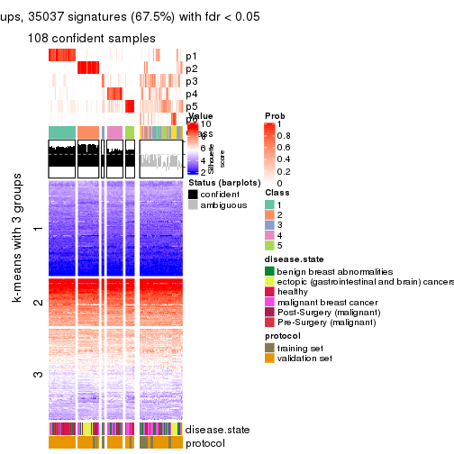</p>

</div>
</div>


Compare the overlap of signatures from different k:

```r
compare_signatures(res)
```


`get_signature()` returns a data frame invisibly. TO get the list of signatures, the function
call should be assigned to a variable explicitly. In following code, if `plot` argument is set
to `FALSE`, no heatmap is plotted while only the differential analysis is performed.

```r
# code only for demonstration
tb = get_signature(res, k = ..., plot = FALSE)
```

An example of the output of `tb` is:

```
#>   which_row         fdr    mean_1    mean_2 scaled_mean_1 scaled_mean_2 km
#> 1        38 0.042760348  8.373488  9.131774    -0.5533452     0.5164555  1
#> 2        40 0.018707592  7.106213  8.469186    -0.6173731     0.5762149  1
#> 3        55 0.019134737 10.221463 11.207825    -0.6159697     0.5749050  1
#> 4        59 0.006059896  5.921854  7.869574    -0.6899429     0.6439467  1
#> 5        60 0.018055526  8.928898 10.211722    -0.6204761     0.5791110  1
#> 6        98 0.009384629 15.714769 14.887706     0.6635654    -0.6193277  2
...
```

The columns in `tb` are:

1. `which_row`: row indices corresponding to the input matrix.
2. `fdr`: FDR for the differential test. 
3. `mean_x`: The mean value in group x.
4. `scaled_mean_x`: The mean value in group x after rows are scaled.
5. `km`: Row groups if k-means clustering is applied to rows.


UMAP plot which shows how samples are separated.


<script>
$( function() {
	$( '#tabs-MAD-mclust-dimension-reduction' ).tabs();
} );
</script>
<div id='tabs-MAD-mclust-dimension-reduction'>
<ul>
<li><a href='#tab-MAD-mclust-dimension-reduction-1'>k = 2</a></li>
<li><a href='#tab-MAD-mclust-dimension-reduction-2'>k = 3</a></li>
<li><a href='#tab-MAD-mclust-dimension-reduction-3'>k = 4</a></li>
<li><a href='#tab-MAD-mclust-dimension-reduction-4'>k = 5</a></li>
<li><a href='#tab-MAD-mclust-dimension-reduction-5'>k = 6</a></li>
</ul>
<div id='tab-MAD-mclust-dimension-reduction-1'>
<pre><code class="r">dimension_reduction(res, k = 2, method = &quot;UMAP&quot;)
</code></pre>

<p></p>

</div>
<div id='tab-MAD-mclust-dimension-reduction-2'>
<pre><code class="r">dimension_reduction(res, k = 3, method = &quot;UMAP&quot;)
</code></pre>

<p></p>

</div>
<div id='tab-MAD-mclust-dimension-reduction-3'>
<pre><code class="r">dimension_reduction(res, k = 4, method = &quot;UMAP&quot;)
</code></pre>

<p></p>

</div>
<div id='tab-MAD-mclust-dimension-reduction-4'>
<pre><code class="r">dimension_reduction(res, k = 5, method = &quot;UMAP&quot;)
</code></pre>

<p></p>

</div>
<div id='tab-MAD-mclust-dimension-reduction-5'>
<pre><code class="r">dimension_reduction(res, k = 6, method = &quot;UMAP&quot;)
</code></pre>

<p></p>

</div>
</div>


Following heatmap shows how subgroups are split when increasing `k`:

```r
collect_classes(res)
```


Test correlation between subgroups and known annotations. If the known
annotation is numeric, one-way ANOVA test is applied, and if the known
annotation is discrete, chi-squared contingency table test is applied.

```r
test_to_known_factors(res)
```

```
#>              n disease.state(p) protocol(p) k
#> MAD:mclust 158         1.58e-04    1.00e+00 2
#> MAD:mclust 112         9.55e-08    3.13e-02 3
#> MAD:mclust  93         1.50e-07    3.55e-01 4
#> MAD:mclust 110         5.16e-05    1.82e-03 5
#> MAD:mclust 108         1.15e-05    6.08e-05 6
```


If matrix rows can be associated to genes, consider to use `GO_Enrichment(res,
...)` to perform function enrichment for the signature genes.


 

---------------------------------------------------


### MAD:NMF


The object with results only for a single top-value method and a single partition method 
can be extracted as:

```r
res = res_list["MAD", "NMF"]
# you can also extract it by
# res = res_list["MAD:NMF"]
```

A summary of `res` and all the functions that can be applied to it:

```r
res
```

```
#> A 'ConsensusPartition' object with k = 2, 3, 4, 5, 6.
#>   On a matrix with 51941 rows and 162 columns.
#>   Top rows (1000, 2000, 3000, 4000, 5000) are extracted by 'MAD' method.
#>   Subgroups are detected by 'NMF' method.
#>   Performed in total 1250 partitions by row resampling.
#>   Best k for subgroups seems to be 4.
#> 
#> Following methods can be applied to this 'ConsensusPartition' object:
#>  [1] "cola_report"             "collect_classes"         "collect_plots"          
#>  [4] "collect_stats"           "colnames"                "compare_signatures"     
#>  [7] "consensus_heatmap"       "dimension_reduction"     "functional_enrichment"  
#> [10] "get_anno_col"            "get_anno"                "get_classes"            
#> [13] "get_consensus"           "get_matrix"              "get_membership"         
#> [16] "get_param"               "get_signatures"          "get_stats"              
#> [19] "is_best_k"               "is_stable_k"             "membership_heatmap"     
#> [22] "ncol"                    "nrow"                    "plot_ecdf"              
#> [25] "rownames"                "select_partition_number" "show"                   
#> [28] "suggest_best_k"          "test_to_known_factors"
```

`collect_plots()` function collects all the plots made from `res` for all `k` (number of partitions)
into one single page to provide an easy and fast comparison between different `k`.

```r
collect_plots(res)
```


The plots are:

- The first row: a plot of the ECDF (Empirical cumulative distribution
  function) curves of the consensus matrix for each `k` and the heatmap of
  predicted classes for each `k`.
- The second row: heatmaps of the consensus matrix for each `k`.
- The third row: heatmaps of the membership matrix for each `k`.
- The fouth row: heatmaps of the signatures for each `k`.

All the plots in panels can be made by individual functions and they are
plotted later in this section.

`select_partition_number()` produces several plots showing different
statistics for choosing "optimized" `k`. There are following statistics:

- ECDF curves of the consensus matrix for each `k`;
- 1-PAC. [The PAC
  score](https://en.wikipedia.org/wiki/Consensus_clustering#Over-interpretation_potential_of_consensus_clustering)
  measures the proportion of the ambiguous subgrouping.
- Mean silhouette score.
- Concordance. The mean probability of fiting the consensus class ids in all
  partitions.
- Area increased. Denote $A_k$ as the area under the ECDF curve for current
  `k`, the area increased is defined as $A_k - A_{k-1}$.
- Rand index. The percent of pairs of samples that are both in a same cluster
  or both are not in a same cluster in the partition of k and k-1.
- Jaccard index. The ratio of pairs of samples are both in a same cluster in
  the partition of k and k-1 and the pairs of samples are both in a same
  cluster in the partition k or k-1.

The detailed explanations of these statistics can be found in [the cola
vignette](http://bioconductor.org/packages/devel/bioc/vignettes/cola/inst/doc/cola.html#toc_13).

Generally speaking, lower PAC score, higher mean silhouette score or higher
concordance corresponds to better partition. Rand index and Jaccard index
measure how similar the current partition is compared to partition with `k-1`.
If they are too similar, we won't accept `k` is better than `k-1`.

```r
select_partition_number(res)
```

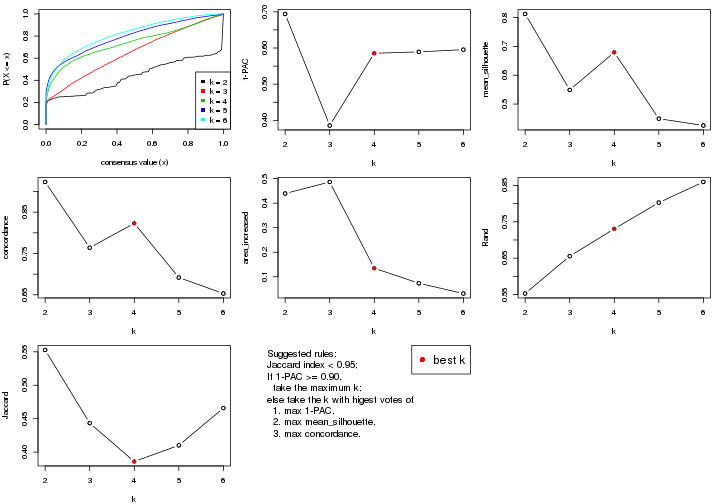

The numeric values for all these statistics can be obtained by `get_stats()`.

```r
get_stats(res)
```

```
#>   k 1-PAC mean_silhouette concordance area_increased  Rand Jaccard
#> 2 2 0.694           0.813       0.923         0.4392 0.553   0.553
#> 3 3 0.386           0.549       0.764         0.4863 0.655   0.443
#> 4 4 0.585           0.679       0.823         0.1349 0.731   0.386
#> 5 5 0.589           0.449       0.692         0.0735 0.803   0.410
#> 6 6 0.595           0.425       0.653         0.0318 0.860   0.466
```

`suggest_best_k()` suggests the best $k$ based on these statistics. The rules are as follows:

- All $k$ with Jaccard index larger than 0.95 are removed because the increase of
  the partition number does not provides enough extra information. If all $k$ are removed,
  the best $k$ is assigned by `NA`.
- For $k$ with 1-PAC larger than 0.9, the maximal $k$ is taken as the "best k". Other $k$ is called "optional k".
- If it does not fit the second rule. The $k$ with the highest vote of highest
  1-PAC, mean silhouette and concordance is taken as the "best k".

```r
suggest_best_k(res)
```

```
#> [1] 4
```


Following shows the table of the partitions (You need to click the **show/hide
code output** link to see it). The membership matrix (columns with name `p*`)
is inferred by
[`clue::cl_consensus()`](https://www.rdocumentation.org/link/cl_consensus?package=clue)
function with the `SE` method. Basically the value in the membership matrix
represents the probability to belong to a certain group. The finall class
label for an item is determined with the group with highest probability it
belongs to.

In `get_classes()` function, the entropy is calculated from the membership
matrix and the silhouette score is calculated from the consensus matrix.


<script>
$( function() {
	$( '#tabs-MAD-NMF-get-classes' ).tabs();
} );
</script>
<div id='tabs-MAD-NMF-get-classes'>
<ul>
<li><a href='#tab-MAD-NMF-get-classes-1'>k = 2</a></li>
<li><a href='#tab-MAD-NMF-get-classes-2'>k = 3</a></li>
<li><a href='#tab-MAD-NMF-get-classes-3'>k = 4</a></li>
<li><a href='#tab-MAD-NMF-get-classes-4'>k = 5</a></li>
<li><a href='#tab-MAD-NMF-get-classes-5'>k = 6</a></li>
</ul>

<div id='tab-MAD-NMF-get-classes-1'>
<p><a id='tab-MAD-NMF-get-classes-1-a' style='color:#0366d6' href='#'>show/hide code output</a></p>
<pre><code class="r">cbind(get_classes(res, k = 2), get_membership(res, k = 2))
</code></pre>

<pre><code>#&gt;           class entropy silhouette    p1    p2
#&gt; GSM682002     1  0.0000     0.9392 1.000 0.000
#&gt; GSM682003     2  0.0000     0.8486 0.000 1.000
#&gt; GSM682004     2  0.0000     0.8486 0.000 1.000
#&gt; GSM682005     1  0.0000     0.9392 1.000 0.000
#&gt; GSM682006     1  0.0000     0.9392 1.000 0.000
#&gt; GSM682007     1  0.0000     0.9392 1.000 0.000
#&gt; GSM682008     1  0.8909     0.4384 0.692 0.308
#&gt; GSM682009     2  0.0000     0.8486 0.000 1.000
#&gt; GSM682010     1  0.0000     0.9392 1.000 0.000
#&gt; GSM682011     1  0.4815     0.8313 0.896 0.104
#&gt; GSM682096     2  0.8555     0.5852 0.280 0.720
#&gt; GSM682097     2  0.9963     0.3121 0.464 0.536
#&gt; GSM682098     2  0.0000     0.8486 0.000 1.000
#&gt; GSM682099     1  0.7815     0.6533 0.768 0.232
#&gt; GSM682100     2  0.0000     0.8486 0.000 1.000
#&gt; GSM682101     2  0.2236     0.8294 0.036 0.964
#&gt; GSM682102     1  0.0000     0.9392 1.000 0.000
#&gt; GSM682103     1  0.0000     0.9392 1.000 0.000
#&gt; GSM682104     1  0.3431     0.8729 0.936 0.064
#&gt; GSM682105     1  0.0000     0.9392 1.000 0.000
#&gt; GSM682106     1  0.0000     0.9392 1.000 0.000
#&gt; GSM682107     1  0.0000     0.9392 1.000 0.000
#&gt; GSM682108     1  0.0000     0.9392 1.000 0.000
#&gt; GSM682109     1  0.0000     0.9392 1.000 0.000
#&gt; GSM682110     1  0.0000     0.9392 1.000 0.000
#&gt; GSM682111     2  0.9963     0.3115 0.464 0.536
#&gt; GSM682112     2  0.9795     0.4287 0.416 0.584
#&gt; GSM682113     1  0.0000     0.9392 1.000 0.000
#&gt; GSM682114     1  0.0376     0.9358 0.996 0.004
#&gt; GSM682115     1  0.0000     0.9392 1.000 0.000
#&gt; GSM682116     1  0.0000     0.9392 1.000 0.000
#&gt; GSM682117     1  0.0000     0.9392 1.000 0.000
#&gt; GSM682118     1  0.0000     0.9392 1.000 0.000
#&gt; GSM682119     1  0.0000     0.9392 1.000 0.000
#&gt; GSM682120     1  0.0000     0.9392 1.000 0.000
#&gt; GSM682121     1  0.0000     0.9392 1.000 0.000
#&gt; GSM682122     1  0.0376     0.9358 0.996 0.004
#&gt; GSM682012     2  0.0000     0.8486 0.000 1.000
#&gt; GSM682013     2  0.0000     0.8486 0.000 1.000
#&gt; GSM682014     2  0.0000     0.8486 0.000 1.000
#&gt; GSM682015     2  0.0000     0.8486 0.000 1.000
#&gt; GSM682016     2  0.0000     0.8486 0.000 1.000
#&gt; GSM682017     2  0.0000     0.8486 0.000 1.000
#&gt; GSM682018     2  0.0000     0.8486 0.000 1.000
#&gt; GSM682019     2  0.0000     0.8486 0.000 1.000
#&gt; GSM682020     2  0.0000     0.8486 0.000 1.000
#&gt; GSM682021     2  0.7745     0.6580 0.228 0.772
#&gt; GSM682022     2  0.0000     0.8486 0.000 1.000
#&gt; GSM682023     2  0.0000     0.8486 0.000 1.000
#&gt; GSM682024     1  0.9833     0.2261 0.576 0.424
#&gt; GSM682025     2  0.0000     0.8486 0.000 1.000
#&gt; GSM682026     2  0.0000     0.8486 0.000 1.000
#&gt; GSM682027     2  0.8713     0.5656 0.292 0.708
#&gt; GSM682028     2  0.8443     0.6023 0.272 0.728
#&gt; GSM682029     1  0.9552     0.3534 0.624 0.376
#&gt; GSM682030     1  0.7745     0.6562 0.772 0.228
#&gt; GSM682031     1  0.8386     0.5860 0.732 0.268
#&gt; GSM682032     1  0.9129     0.4654 0.672 0.328
#&gt; GSM682033     2  0.0000     0.8486 0.000 1.000
#&gt; GSM681992     2  0.8499     0.5911 0.276 0.724
#&gt; GSM681993     2  0.9815     0.4172 0.420 0.580
#&gt; GSM681994     1  0.0000     0.9392 1.000 0.000
#&gt; GSM681995     1  0.0000     0.9392 1.000 0.000
#&gt; GSM681996     1  0.0000     0.9392 1.000 0.000
#&gt; GSM681997     1  0.0000     0.9392 1.000 0.000
#&gt; GSM681998     1  0.0000     0.9392 1.000 0.000
#&gt; GSM681999     1  0.0000     0.9392 1.000 0.000
#&gt; GSM682000     1  0.0000     0.9392 1.000 0.000
#&gt; GSM682001     1  0.7602     0.6697 0.780 0.220
#&gt; GSM682055     2  0.0000     0.8486 0.000 1.000
#&gt; GSM682056     2  0.9732     0.4491 0.404 0.596
#&gt; GSM682057     2  0.0000     0.8486 0.000 1.000
#&gt; GSM682058     1  0.2423     0.9001 0.960 0.040
#&gt; GSM682059     2  0.0000     0.8486 0.000 1.000
#&gt; GSM682060     1  0.6247     0.7700 0.844 0.156
#&gt; GSM682061     2  0.9732     0.4491 0.404 0.596
#&gt; GSM682062     2  0.0000     0.8486 0.000 1.000
#&gt; GSM682063     2  0.0000     0.8486 0.000 1.000
#&gt; GSM682064     1  0.9833     0.2258 0.576 0.424
#&gt; GSM682065     1  0.0000     0.9392 1.000 0.000
#&gt; GSM682066     1  0.0000     0.9392 1.000 0.000
#&gt; GSM682067     1  0.9393     0.3742 0.644 0.356
#&gt; GSM682068     1  0.0000     0.9392 1.000 0.000
#&gt; GSM682069     1  0.9963     0.0459 0.536 0.464
#&gt; GSM682070     1  0.0000     0.9392 1.000 0.000
#&gt; GSM682071     2  0.7745     0.6826 0.228 0.772
#&gt; GSM682072     1  0.0000     0.9392 1.000 0.000
#&gt; GSM682073     1  0.0938     0.9285 0.988 0.012
#&gt; GSM682074     1  0.0000     0.9392 1.000 0.000
#&gt; GSM682075     1  0.0000     0.9392 1.000 0.000
#&gt; GSM682076     1  0.0000     0.9392 1.000 0.000
#&gt; GSM682077     1  0.0000     0.9392 1.000 0.000
#&gt; GSM682078     1  0.0000     0.9392 1.000 0.000
#&gt; GSM682079     1  0.0000     0.9392 1.000 0.000
#&gt; GSM682080     2  0.9710     0.4562 0.400 0.600
#&gt; GSM682081     2  0.9933     0.3423 0.452 0.548
#&gt; GSM682082     1  0.0000     0.9392 1.000 0.000
#&gt; GSM682083     1  0.0000     0.9392 1.000 0.000
#&gt; GSM682084     1  0.0000     0.9392 1.000 0.000
#&gt; GSM682085     1  0.0000     0.9392 1.000 0.000
#&gt; GSM682086     1  0.0000     0.9392 1.000 0.000
#&gt; GSM682087     1  0.0000     0.9392 1.000 0.000
#&gt; GSM682088     1  0.0000     0.9392 1.000 0.000
#&gt; GSM682089     1  0.0000     0.9392 1.000 0.000
#&gt; GSM682090     1  0.0000     0.9392 1.000 0.000
#&gt; GSM682091     1  0.2423     0.9024 0.960 0.040
#&gt; GSM682092     1  0.0000     0.9392 1.000 0.000
#&gt; GSM682093     1  0.0000     0.9392 1.000 0.000
#&gt; GSM682094     1  0.0000     0.9392 1.000 0.000
#&gt; GSM682095     2  0.0000     0.8486 0.000 1.000
#&gt; GSM681982     2  0.9710     0.4562 0.400 0.600
#&gt; GSM681983     1  0.0000     0.9392 1.000 0.000
#&gt; GSM681984     2  0.3274     0.8144 0.060 0.940
#&gt; GSM681985     1  0.0938     0.9286 0.988 0.012
#&gt; GSM681986     2  0.9044     0.5131 0.320 0.680
#&gt; GSM681987     2  0.0000     0.8486 0.000 1.000
#&gt; GSM681988     2  0.9710     0.4562 0.400 0.600
#&gt; GSM681989     2  0.0672     0.8447 0.008 0.992
#&gt; GSM681990     1  0.0000     0.9392 1.000 0.000
#&gt; GSM681991     2  0.0000     0.8486 0.000 1.000
#&gt; GSM682034     1  0.0000     0.9392 1.000 0.000
#&gt; GSM682035     1  0.0000     0.9392 1.000 0.000
#&gt; GSM682036     1  0.0000     0.9392 1.000 0.000
#&gt; GSM682037     1  0.0000     0.9392 1.000 0.000
#&gt; GSM682038     2  0.0000     0.8486 0.000 1.000
#&gt; GSM682039     1  0.0000     0.9392 1.000 0.000
#&gt; GSM682040     2  0.9833     0.4085 0.424 0.576
#&gt; GSM682041     1  0.0000     0.9392 1.000 0.000
#&gt; GSM682042     1  0.9944    -0.0634 0.544 0.456
#&gt; GSM682043     1  0.0000     0.9392 1.000 0.000
#&gt; GSM682044     1  0.0000     0.9392 1.000 0.000
#&gt; GSM682045     1  0.1843     0.9142 0.972 0.028
#&gt; GSM682046     1  0.0000     0.9392 1.000 0.000
#&gt; GSM682047     1  0.0000     0.9392 1.000 0.000
#&gt; GSM682048     1  0.0000     0.9392 1.000 0.000
#&gt; GSM682049     1  0.0000     0.9392 1.000 0.000
#&gt; GSM682050     1  0.0000     0.9392 1.000 0.000
#&gt; GSM682051     1  0.0000     0.9392 1.000 0.000
#&gt; GSM682052     2  0.9996     0.2390 0.488 0.512
#&gt; GSM682053     1  0.0000     0.9392 1.000 0.000
#&gt; GSM682054     1  0.0000     0.9392 1.000 0.000
#&gt; GSM682123     1  0.0000     0.9392 1.000 0.000
#&gt; GSM682124     1  0.0000     0.9392 1.000 0.000
#&gt; GSM682125     1  0.0376     0.9358 0.996 0.004
#&gt; GSM682126     1  0.0000     0.9392 1.000 0.000
#&gt; GSM682127     1  0.0000     0.9392 1.000 0.000
#&gt; GSM682128     1  0.0000     0.9392 1.000 0.000
#&gt; GSM682129     2  0.0000     0.8486 0.000 1.000
#&gt; GSM682130     2  0.0000     0.8486 0.000 1.000
#&gt; GSM682131     2  0.0000     0.8486 0.000 1.000
#&gt; GSM682132     1  0.0000     0.9392 1.000 0.000
#&gt; GSM682133     1  0.0000     0.9392 1.000 0.000
#&gt; GSM682134     1  0.0000     0.9392 1.000 0.000
#&gt; GSM682135     1  0.9460     0.3838 0.636 0.364
#&gt; GSM682136     1  0.0000     0.9392 1.000 0.000
#&gt; GSM682137     1  0.0000     0.9392 1.000 0.000
#&gt; GSM682138     1  0.0000     0.9392 1.000 0.000
#&gt; GSM682139     1  0.9795     0.2485 0.584 0.416
#&gt; GSM682140     1  0.0000     0.9392 1.000 0.000
#&gt; GSM682141     1  0.0000     0.9392 1.000 0.000
#&gt; GSM682142     1  0.0000     0.9392 1.000 0.000
#&gt; GSM682143     2  0.0000     0.8486 0.000 1.000
</code></pre>

<script>
$('#tab-MAD-NMF-get-classes-1-a').parent().next().next().hide();
$('#tab-MAD-NMF-get-classes-1-a').click(function(){
  $('#tab-MAD-NMF-get-classes-1-a').parent().next().next().toggle();
  return(false);
});
</script>
</div>

<div id='tab-MAD-NMF-get-classes-2'>
<p><a id='tab-MAD-NMF-get-classes-2-a' style='color:#0366d6' href='#'>show/hide code output</a></p>
<pre><code class="r">cbind(get_classes(res, k = 3), get_membership(res, k = 3))
</code></pre>

<pre><code>#&gt;           class entropy silhouette    p1    p2    p3
#&gt; GSM682002     1  0.0000     0.6982 1.000 0.000 0.000
#&gt; GSM682003     2  0.5138     0.6833 0.000 0.748 0.252
#&gt; GSM682004     2  0.0592     0.8541 0.000 0.988 0.012
#&gt; GSM682005     1  0.3009     0.6643 0.920 0.028 0.052
#&gt; GSM682006     1  0.0237     0.6972 0.996 0.000 0.004
#&gt; GSM682007     3  0.5785     0.4691 0.332 0.000 0.668
#&gt; GSM682008     3  0.6798     0.3478 0.400 0.016 0.584
#&gt; GSM682009     2  0.3445     0.8057 0.088 0.896 0.016
#&gt; GSM682010     3  0.5678     0.5174 0.316 0.000 0.684
#&gt; GSM682011     1  0.2096     0.6865 0.944 0.052 0.004
#&gt; GSM682096     2  0.5926     0.4668 0.356 0.644 0.000
#&gt; GSM682097     3  0.6699     0.4493 0.044 0.256 0.700
#&gt; GSM682098     2  0.3213     0.8199 0.008 0.900 0.092
#&gt; GSM682099     1  0.4209     0.6221 0.856 0.128 0.016
#&gt; GSM682100     2  0.0592     0.8530 0.000 0.988 0.012
#&gt; GSM682101     2  0.0000     0.8566 0.000 1.000 0.000
#&gt; GSM682102     1  0.4750     0.6156 0.784 0.000 0.216
#&gt; GSM682103     3  0.4702     0.5775 0.212 0.000 0.788
#&gt; GSM682104     3  0.7031     0.5336 0.196 0.088 0.716
#&gt; GSM682105     1  0.2711     0.6928 0.912 0.000 0.088
#&gt; GSM682106     3  0.6244     0.4020 0.440 0.000 0.560
#&gt; GSM682107     1  0.0000     0.6982 1.000 0.000 0.000
#&gt; GSM682108     1  0.5678     0.0873 0.684 0.000 0.316
#&gt; GSM682109     3  0.6244     0.4239 0.440 0.000 0.560
#&gt; GSM682110     1  0.0592     0.6940 0.988 0.000 0.012
#&gt; GSM682111     3  0.7337     0.5331 0.140 0.152 0.708
#&gt; GSM682112     3  0.3941     0.5704 0.000 0.156 0.844
#&gt; GSM682113     1  0.5397     0.5665 0.720 0.000 0.280
#&gt; GSM682114     3  0.5115     0.5726 0.188 0.016 0.796
#&gt; GSM682115     3  0.5497     0.4711 0.292 0.000 0.708
#&gt; GSM682116     3  0.6299     0.2894 0.476 0.000 0.524
#&gt; GSM682117     1  0.1411     0.7032 0.964 0.000 0.036
#&gt; GSM682118     1  0.6286    -0.3145 0.536 0.000 0.464
#&gt; GSM682119     3  0.6299     0.3474 0.476 0.000 0.524
#&gt; GSM682120     3  0.6280     0.3495 0.460 0.000 0.540
#&gt; GSM682121     1  0.4931     0.3634 0.768 0.000 0.232
#&gt; GSM682122     3  0.5497     0.5049 0.292 0.000 0.708
#&gt; GSM682012     2  0.0424     0.8553 0.000 0.992 0.008
#&gt; GSM682013     2  0.0000     0.8566 0.000 1.000 0.000
#&gt; GSM682014     2  0.0000     0.8566 0.000 1.000 0.000
#&gt; GSM682015     2  0.0000     0.8566 0.000 1.000 0.000
#&gt; GSM682016     2  0.5012     0.7378 0.008 0.788 0.204
#&gt; GSM682017     2  0.0000     0.8566 0.000 1.000 0.000
#&gt; GSM682018     2  0.3752     0.7600 0.000 0.856 0.144
#&gt; GSM682019     2  0.0000     0.8566 0.000 1.000 0.000
#&gt; GSM682020     2  0.2448     0.8179 0.000 0.924 0.076
#&gt; GSM682021     2  0.6264     0.5954 0.028 0.716 0.256
#&gt; GSM682022     2  0.0000     0.8566 0.000 1.000 0.000
#&gt; GSM682023     2  0.0424     0.8545 0.000 0.992 0.008
#&gt; GSM682024     2  0.9678     0.0775 0.228 0.444 0.328
#&gt; GSM682025     2  0.0000     0.8566 0.000 1.000 0.000
#&gt; GSM682026     2  0.0000     0.8566 0.000 1.000 0.000
#&gt; GSM682027     1  0.5650     0.3968 0.688 0.312 0.000
#&gt; GSM682028     1  0.5728     0.4775 0.720 0.272 0.008
#&gt; GSM682029     1  0.4062     0.5973 0.836 0.164 0.000
#&gt; GSM682030     1  0.2796     0.6604 0.908 0.092 0.000
#&gt; GSM682031     1  0.3412     0.6356 0.876 0.124 0.000
#&gt; GSM682032     1  0.3412     0.6358 0.876 0.124 0.000
#&gt; GSM682033     2  0.0237     0.8560 0.000 0.996 0.004
#&gt; GSM681992     2  0.6111     0.3764 0.396 0.604 0.000
#&gt; GSM681993     3  0.6452     0.4416 0.032 0.264 0.704
#&gt; GSM681994     1  0.1411     0.6822 0.964 0.000 0.036
#&gt; GSM681995     1  0.0000     0.6982 1.000 0.000 0.000
#&gt; GSM681996     1  0.6026     0.1579 0.624 0.000 0.376
#&gt; GSM681997     1  0.1860     0.6722 0.948 0.000 0.052
#&gt; GSM681998     1  0.1031     0.6884 0.976 0.000 0.024
#&gt; GSM681999     1  0.0237     0.6983 0.996 0.004 0.000
#&gt; GSM682000     1  0.0237     0.6983 0.996 0.004 0.000
#&gt; GSM682001     1  0.2625     0.6670 0.916 0.084 0.000
#&gt; GSM682055     2  0.5465     0.6362 0.000 0.712 0.288
#&gt; GSM682056     3  0.6155     0.3428 0.008 0.328 0.664
#&gt; GSM682057     2  0.0000     0.8566 0.000 1.000 0.000
#&gt; GSM682058     1  0.6823     0.5658 0.740 0.108 0.152
#&gt; GSM682059     2  0.0000     0.8566 0.000 1.000 0.000
#&gt; GSM682060     3  0.9084     0.2327 0.216 0.232 0.552
#&gt; GSM682061     3  0.5785     0.3411 0.000 0.332 0.668
#&gt; GSM682062     2  0.0000     0.8566 0.000 1.000 0.000
#&gt; GSM682063     2  0.2261     0.8236 0.000 0.932 0.068
#&gt; GSM682064     1  0.9734     0.3194 0.432 0.332 0.236
#&gt; GSM682065     3  0.6111     0.2943 0.396 0.000 0.604
#&gt; GSM682066     1  0.3267     0.6794 0.884 0.000 0.116
#&gt; GSM682067     3  0.3682     0.5719 0.008 0.116 0.876
#&gt; GSM682068     1  0.1878     0.7056 0.952 0.004 0.044
#&gt; GSM682069     3  0.4602     0.5541 0.016 0.152 0.832
#&gt; GSM682070     3  0.5968     0.3909 0.364 0.000 0.636
#&gt; GSM682071     3  0.6521    -0.1538 0.004 0.496 0.500
#&gt; GSM682072     3  0.5517     0.5243 0.268 0.004 0.728
#&gt; GSM682073     3  0.5760     0.4687 0.328 0.000 0.672
#&gt; GSM682074     3  0.3752     0.6009 0.144 0.000 0.856
#&gt; GSM682075     1  0.1529     0.7046 0.960 0.000 0.040
#&gt; GSM682076     1  0.6307    -0.3431 0.512 0.000 0.488
#&gt; GSM682077     3  0.3879     0.5863 0.152 0.000 0.848
#&gt; GSM682078     3  0.5968     0.4703 0.364 0.000 0.636
#&gt; GSM682079     3  0.6126     0.4107 0.400 0.000 0.600
#&gt; GSM682080     3  0.5956     0.3546 0.004 0.324 0.672
#&gt; GSM682081     3  0.7853     0.4862 0.144 0.188 0.668
#&gt; GSM682082     3  0.5988     0.4771 0.368 0.000 0.632
#&gt; GSM682083     3  0.6140     0.3081 0.404 0.000 0.596
#&gt; GSM682084     3  0.4605     0.5668 0.204 0.000 0.796
#&gt; GSM682085     3  0.5291     0.5256 0.268 0.000 0.732
#&gt; GSM682086     1  0.1643     0.7035 0.956 0.000 0.044
#&gt; GSM682087     1  0.6308    -0.3669 0.508 0.000 0.492
#&gt; GSM682088     3  0.5678     0.5014 0.316 0.000 0.684
#&gt; GSM682089     3  0.2448     0.6024 0.076 0.000 0.924
#&gt; GSM682090     3  0.5138     0.5727 0.252 0.000 0.748
#&gt; GSM682091     3  0.8398    -0.1598 0.440 0.084 0.476
#&gt; GSM682092     3  0.6215     0.1888 0.428 0.000 0.572
#&gt; GSM682093     3  0.3816     0.5883 0.148 0.000 0.852
#&gt; GSM682094     1  0.1753     0.7021 0.952 0.000 0.048
#&gt; GSM682095     2  0.2796     0.8226 0.000 0.908 0.092
#&gt; GSM681982     3  0.7057     0.4265 0.056 0.264 0.680
#&gt; GSM681983     1  0.3879     0.6593 0.848 0.000 0.152
#&gt; GSM681984     2  0.6208     0.7312 0.076 0.772 0.152
#&gt; GSM681985     3  0.5008     0.5754 0.180 0.016 0.804
#&gt; GSM681986     2  0.6045     0.4187 0.380 0.620 0.000
#&gt; GSM681987     2  0.4605     0.7395 0.000 0.796 0.204
#&gt; GSM681988     3  0.8287     0.3836 0.128 0.256 0.616
#&gt; GSM681989     2  0.6181     0.7242 0.156 0.772 0.072
#&gt; GSM681990     1  0.6180    -0.2323 0.584 0.000 0.416
#&gt; GSM681991     2  0.0000     0.8566 0.000 1.000 0.000
#&gt; GSM682034     3  0.5785     0.3960 0.332 0.000 0.668
#&gt; GSM682035     3  0.5363     0.4839 0.276 0.000 0.724
#&gt; GSM682036     3  0.6758     0.4207 0.360 0.020 0.620
#&gt; GSM682037     1  0.5948     0.4671 0.640 0.000 0.360
#&gt; GSM682038     2  0.3686     0.7933 0.000 0.860 0.140
#&gt; GSM682039     3  0.5621     0.4389 0.308 0.000 0.692
#&gt; GSM682040     3  0.3038     0.5808 0.000 0.104 0.896
#&gt; GSM682041     3  0.4654     0.5527 0.208 0.000 0.792
#&gt; GSM682042     3  0.2878     0.5850 0.000 0.096 0.904
#&gt; GSM682043     1  0.4702     0.6227 0.788 0.000 0.212
#&gt; GSM682044     1  0.6192     0.3433 0.580 0.000 0.420
#&gt; GSM682045     3  0.8519    -0.0376 0.396 0.096 0.508
#&gt; GSM682046     1  0.5327     0.5760 0.728 0.000 0.272
#&gt; GSM682047     3  0.5905     0.4993 0.352 0.000 0.648
#&gt; GSM682048     3  0.5529     0.4571 0.296 0.000 0.704
#&gt; GSM682049     3  0.3879     0.5870 0.152 0.000 0.848
#&gt; GSM682050     1  0.5650     0.5362 0.688 0.000 0.312
#&gt; GSM682051     3  0.2878     0.6002 0.096 0.000 0.904
#&gt; GSM682052     3  0.3267     0.5806 0.000 0.116 0.884
#&gt; GSM682053     3  0.3482     0.5939 0.128 0.000 0.872
#&gt; GSM682054     1  0.5465     0.5598 0.712 0.000 0.288
#&gt; GSM682123     3  0.4840     0.5742 0.168 0.016 0.816
#&gt; GSM682124     1  0.5882     0.4862 0.652 0.000 0.348
#&gt; GSM682125     3  0.3340     0.5956 0.120 0.000 0.880
#&gt; GSM682126     1  0.5465     0.5578 0.712 0.000 0.288
#&gt; GSM682127     1  0.6235     0.3027 0.564 0.000 0.436
#&gt; GSM682128     1  0.1964     0.7026 0.944 0.000 0.056
#&gt; GSM682129     2  0.1643     0.8438 0.000 0.956 0.044
#&gt; GSM682130     2  0.3192     0.7889 0.000 0.888 0.112
#&gt; GSM682131     2  0.4452     0.7508 0.000 0.808 0.192
#&gt; GSM682132     1  0.1289     0.7045 0.968 0.000 0.032
#&gt; GSM682133     1  0.3482     0.6730 0.872 0.000 0.128
#&gt; GSM682134     3  0.4750     0.5465 0.216 0.000 0.784
#&gt; GSM682135     1  0.9347     0.4275 0.508 0.204 0.288
#&gt; GSM682136     1  0.5497     0.5552 0.708 0.000 0.292
#&gt; GSM682137     1  0.2878     0.6892 0.904 0.000 0.096
#&gt; GSM682138     3  0.5138     0.5305 0.252 0.000 0.748
#&gt; GSM682139     2  0.9413     0.1579 0.184 0.468 0.348
#&gt; GSM682140     3  0.6267     0.3532 0.452 0.000 0.548
#&gt; GSM682141     1  0.5678     0.5314 0.684 0.000 0.316
#&gt; GSM682142     1  0.5678     0.5316 0.684 0.000 0.316
#&gt; GSM682143     2  0.4121     0.7696 0.000 0.832 0.168
</code></pre>

<script>
$('#tab-MAD-NMF-get-classes-2-a').parent().next().next().hide();
$('#tab-MAD-NMF-get-classes-2-a').click(function(){
  $('#tab-MAD-NMF-get-classes-2-a').parent().next().next().toggle();
  return(false);
});
</script>
</div>

<div id='tab-MAD-NMF-get-classes-3'>
<p><a id='tab-MAD-NMF-get-classes-3-a' style='color:#0366d6' href='#'>show/hide code output</a></p>
<pre><code class="r">cbind(get_classes(res, k = 4), get_membership(res, k = 4))
</code></pre>

<pre><code>#&gt;           class entropy silhouette    p1    p2    p3    p4
#&gt; GSM682002     4  0.2799     0.7837 0.108 0.000 0.008 0.884
#&gt; GSM682003     3  0.5004     0.3827 0.000 0.392 0.604 0.004
#&gt; GSM682004     2  0.0336     0.8166 0.000 0.992 0.008 0.000
#&gt; GSM682005     4  0.3444     0.7511 0.000 0.000 0.184 0.816
#&gt; GSM682006     4  0.2589     0.7943 0.000 0.000 0.116 0.884
#&gt; GSM682007     3  0.4855     0.2772 0.000 0.000 0.600 0.400
#&gt; GSM682008     4  0.4866     0.3764 0.000 0.000 0.404 0.596
#&gt; GSM682009     2  0.5750     0.1704 0.000 0.532 0.440 0.028
#&gt; GSM682010     3  0.3392     0.7427 0.072 0.000 0.872 0.056
#&gt; GSM682011     4  0.2520     0.7911 0.088 0.004 0.004 0.904
#&gt; GSM682096     2  0.4755     0.5866 0.004 0.724 0.012 0.260
#&gt; GSM682097     3  0.3239     0.7807 0.000 0.068 0.880 0.052
#&gt; GSM682098     4  0.7509     0.1606 0.000 0.360 0.188 0.452
#&gt; GSM682099     4  0.1807     0.8122 0.000 0.008 0.052 0.940
#&gt; GSM682100     2  0.0188     0.8176 0.004 0.996 0.000 0.000
#&gt; GSM682101     2  0.0779     0.8167 0.000 0.980 0.016 0.004
#&gt; GSM682102     1  0.3172     0.7501 0.840 0.000 0.000 0.160
#&gt; GSM682103     1  0.3725     0.7462 0.812 0.000 0.180 0.008
#&gt; GSM682104     3  0.2676     0.7978 0.028 0.044 0.916 0.012
#&gt; GSM682105     4  0.4817     0.2130 0.388 0.000 0.000 0.612
#&gt; GSM682106     4  0.4500     0.5538 0.000 0.000 0.316 0.684
#&gt; GSM682107     4  0.2530     0.7852 0.100 0.000 0.004 0.896
#&gt; GSM682108     1  0.7225     0.3504 0.512 0.000 0.160 0.328
#&gt; GSM682109     3  0.5141     0.5244 0.032 0.000 0.700 0.268
#&gt; GSM682110     4  0.3037     0.8021 0.020 0.000 0.100 0.880
#&gt; GSM682111     3  0.0992     0.7910 0.012 0.008 0.976 0.004
#&gt; GSM682112     3  0.3335     0.7419 0.128 0.016 0.856 0.000
#&gt; GSM682113     1  0.2281     0.7882 0.904 0.000 0.000 0.096
#&gt; GSM682114     3  0.1767     0.7920 0.044 0.012 0.944 0.000
#&gt; GSM682115     1  0.3611     0.7898 0.860 0.000 0.080 0.060
#&gt; GSM682116     1  0.5172     0.7197 0.744 0.000 0.068 0.188
#&gt; GSM682117     1  0.5906     0.2918 0.528 0.000 0.036 0.436
#&gt; GSM682118     1  0.7673     0.3014 0.416 0.000 0.368 0.216
#&gt; GSM682119     1  0.5092     0.7435 0.764 0.000 0.096 0.140
#&gt; GSM682120     1  0.5167     0.7648 0.760 0.000 0.108 0.132
#&gt; GSM682121     4  0.2924     0.8032 0.016 0.000 0.100 0.884
#&gt; GSM682122     3  0.2408     0.7599 0.000 0.000 0.896 0.104
#&gt; GSM682012     2  0.2385     0.7857 0.000 0.920 0.052 0.028
#&gt; GSM682013     2  0.0188     0.8175 0.000 0.996 0.004 0.000
#&gt; GSM682014     2  0.0000     0.8173 0.000 1.000 0.000 0.000
#&gt; GSM682015     2  0.0000     0.8173 0.000 1.000 0.000 0.000
#&gt; GSM682016     3  0.7430     0.4320 0.000 0.260 0.512 0.228
#&gt; GSM682017     2  0.0000     0.8173 0.000 1.000 0.000 0.000
#&gt; GSM682018     2  0.1474     0.7998 0.052 0.948 0.000 0.000
#&gt; GSM682019     2  0.1888     0.7983 0.000 0.940 0.016 0.044
#&gt; GSM682020     2  0.0336     0.8172 0.008 0.992 0.000 0.000
#&gt; GSM682021     2  0.2737     0.7606 0.104 0.888 0.000 0.008
#&gt; GSM682022     2  0.0657     0.8172 0.004 0.984 0.012 0.000
#&gt; GSM682023     2  0.1114     0.8153 0.004 0.972 0.016 0.008
#&gt; GSM682024     2  0.5688     0.1892 0.464 0.512 0.000 0.024
#&gt; GSM682025     2  0.0927     0.8149 0.000 0.976 0.016 0.008
#&gt; GSM682026     2  0.0927     0.8149 0.000 0.976 0.016 0.008
#&gt; GSM682027     4  0.3790     0.7817 0.040 0.088 0.012 0.860
#&gt; GSM682028     4  0.2124     0.8081 0.000 0.040 0.028 0.932
#&gt; GSM682029     4  0.1174     0.8179 0.000 0.012 0.020 0.968
#&gt; GSM682030     4  0.0804     0.8195 0.000 0.008 0.012 0.980
#&gt; GSM682031     4  0.0804     0.8192 0.000 0.008 0.012 0.980
#&gt; GSM682032     4  0.0859     0.8198 0.004 0.008 0.008 0.980
#&gt; GSM682033     2  0.2300     0.7918 0.000 0.924 0.028 0.048
#&gt; GSM681992     2  0.6722     0.6237 0.108 0.704 0.092 0.096
#&gt; GSM681993     3  0.0895     0.7941 0.004 0.020 0.976 0.000
#&gt; GSM681994     4  0.2921     0.7760 0.000 0.000 0.140 0.860
#&gt; GSM681995     4  0.0895     0.8184 0.020 0.000 0.004 0.976
#&gt; GSM681996     4  0.4164     0.6407 0.000 0.000 0.264 0.736
#&gt; GSM681997     4  0.2469     0.7930 0.000 0.000 0.108 0.892
#&gt; GSM681998     4  0.2760     0.7823 0.000 0.000 0.128 0.872
#&gt; GSM681999     4  0.2002     0.8176 0.044 0.000 0.020 0.936
#&gt; GSM682000     4  0.1118     0.8133 0.036 0.000 0.000 0.964
#&gt; GSM682001     4  0.5589     0.6802 0.152 0.076 0.020 0.752
#&gt; GSM682055     3  0.3907     0.6649 0.000 0.232 0.768 0.000
#&gt; GSM682056     3  0.4113     0.7565 0.004 0.128 0.828 0.040
#&gt; GSM682057     2  0.0967     0.8164 0.004 0.976 0.016 0.004
#&gt; GSM682058     4  0.4837     0.7217 0.008 0.056 0.148 0.788
#&gt; GSM682059     2  0.0469     0.8168 0.000 0.988 0.012 0.000
#&gt; GSM682060     2  0.5827     0.2165 0.436 0.532 0.000 0.032
#&gt; GSM682061     3  0.3534     0.7468 0.004 0.148 0.840 0.008
#&gt; GSM682062     2  0.0336     0.8172 0.000 0.992 0.008 0.000
#&gt; GSM682063     2  0.0524     0.8162 0.008 0.988 0.004 0.000
#&gt; GSM682064     2  0.7634     0.3992 0.296 0.560 0.052 0.092
#&gt; GSM682065     1  0.1284     0.8108 0.964 0.000 0.012 0.024
#&gt; GSM682066     1  0.5615     0.5089 0.612 0.000 0.032 0.356
#&gt; GSM682067     1  0.4277     0.7826 0.824 0.056 0.116 0.004
#&gt; GSM682068     4  0.2081     0.7950 0.084 0.000 0.000 0.916
#&gt; GSM682069     1  0.3521     0.7849 0.864 0.084 0.052 0.000
#&gt; GSM682070     1  0.3471     0.8028 0.880 0.016 0.068 0.036
#&gt; GSM682071     3  0.3308     0.7815 0.000 0.092 0.872 0.036
#&gt; GSM682072     3  0.2363     0.7709 0.024 0.000 0.920 0.056
#&gt; GSM682073     3  0.3837     0.6448 0.000 0.000 0.776 0.224
#&gt; GSM682074     1  0.4222     0.6275 0.728 0.000 0.272 0.000
#&gt; GSM682075     4  0.2216     0.7915 0.092 0.000 0.000 0.908
#&gt; GSM682076     1  0.7714     0.2644 0.440 0.000 0.316 0.244
#&gt; GSM682077     1  0.1867     0.8001 0.928 0.000 0.072 0.000
#&gt; GSM682078     1  0.4139     0.7500 0.800 0.000 0.176 0.024
#&gt; GSM682079     1  0.2565     0.8105 0.912 0.000 0.056 0.032
#&gt; GSM682080     3  0.3037     0.7863 0.000 0.076 0.888 0.036
#&gt; GSM682081     3  0.3335     0.7525 0.000 0.020 0.860 0.120
#&gt; GSM682082     3  0.4767     0.5773 0.020 0.000 0.724 0.256
#&gt; GSM682083     1  0.4227     0.7662 0.820 0.000 0.060 0.120
#&gt; GSM682084     3  0.2706     0.7642 0.080 0.000 0.900 0.020
#&gt; GSM682085     3  0.1297     0.7864 0.016 0.000 0.964 0.020
#&gt; GSM682086     1  0.5590     0.2579 0.524 0.000 0.020 0.456
#&gt; GSM682087     4  0.6972     0.2746 0.124 0.000 0.356 0.520
#&gt; GSM682088     1  0.3047     0.7895 0.872 0.000 0.116 0.012
#&gt; GSM682089     1  0.4830     0.4076 0.608 0.000 0.392 0.000
#&gt; GSM682090     1  0.5088     0.3795 0.572 0.000 0.424 0.004
#&gt; GSM682091     1  0.4542     0.7287 0.808 0.144 0.020 0.028
#&gt; GSM682092     1  0.1059     0.8106 0.972 0.000 0.012 0.016
#&gt; GSM682093     1  0.3105     0.7762 0.856 0.000 0.140 0.004
#&gt; GSM682094     1  0.6201     0.4087 0.564 0.000 0.060 0.376
#&gt; GSM682095     2  0.4382     0.4698 0.000 0.704 0.296 0.000
#&gt; GSM681982     3  0.0921     0.7945 0.000 0.028 0.972 0.000
#&gt; GSM681983     1  0.4855     0.6316 0.712 0.000 0.020 0.268
#&gt; GSM681984     2  0.4741     0.4942 0.004 0.668 0.328 0.000
#&gt; GSM681985     3  0.3108     0.7505 0.112 0.016 0.872 0.000
#&gt; GSM681986     2  0.7545     0.5502 0.084 0.636 0.132 0.148
#&gt; GSM681987     3  0.4916     0.2926 0.000 0.424 0.576 0.000
#&gt; GSM681988     3  0.3587     0.7689 0.000 0.052 0.860 0.088
#&gt; GSM681989     4  0.6889     0.5156 0.000 0.176 0.232 0.592
#&gt; GSM681990     1  0.7884     0.1587 0.384 0.000 0.308 0.308
#&gt; GSM681991     2  0.0188     0.8167 0.000 0.996 0.004 0.000
#&gt; GSM682034     1  0.0524     0.8087 0.988 0.000 0.008 0.004
#&gt; GSM682035     1  0.1302     0.8059 0.956 0.000 0.044 0.000
#&gt; GSM682036     1  0.4366     0.7795 0.840 0.068 0.064 0.028
#&gt; GSM682037     1  0.0592     0.8070 0.984 0.000 0.000 0.016
#&gt; GSM682038     3  0.4981     0.1170 0.000 0.464 0.536 0.000
#&gt; GSM682039     1  0.2610     0.8039 0.900 0.012 0.088 0.000
#&gt; GSM682040     3  0.5537     0.5985 0.256 0.056 0.688 0.000
#&gt; GSM682041     1  0.2081     0.7988 0.916 0.000 0.084 0.000
#&gt; GSM682042     3  0.4711     0.7329 0.152 0.064 0.784 0.000
#&gt; GSM682043     1  0.2589     0.7793 0.884 0.000 0.000 0.116
#&gt; GSM682044     1  0.0336     0.8077 0.992 0.000 0.000 0.008
#&gt; GSM682045     1  0.2553     0.7960 0.916 0.060 0.016 0.008
#&gt; GSM682046     1  0.3400     0.7332 0.820 0.000 0.000 0.180
#&gt; GSM682047     1  0.4799     0.7232 0.744 0.000 0.224 0.032
#&gt; GSM682048     1  0.1545     0.8071 0.952 0.008 0.040 0.000
#&gt; GSM682049     1  0.2704     0.7803 0.876 0.000 0.124 0.000
#&gt; GSM682050     1  0.1637     0.7998 0.940 0.000 0.000 0.060
#&gt; GSM682051     1  0.4072     0.6609 0.748 0.000 0.252 0.000
#&gt; GSM682052     3  0.4205     0.7574 0.124 0.056 0.820 0.000
#&gt; GSM682053     1  0.2589     0.7940 0.884 0.000 0.116 0.000
#&gt; GSM682054     1  0.2647     0.7760 0.880 0.000 0.000 0.120
#&gt; GSM682123     1  0.2255     0.8001 0.920 0.012 0.068 0.000
#&gt; GSM682124     1  0.1520     0.8036 0.956 0.020 0.000 0.024
#&gt; GSM682125     1  0.2198     0.7996 0.920 0.008 0.072 0.000
#&gt; GSM682126     1  0.2149     0.7921 0.912 0.000 0.000 0.088
#&gt; GSM682127     1  0.0707     0.8086 0.980 0.000 0.000 0.020
#&gt; GSM682128     4  0.1833     0.8205 0.024 0.000 0.032 0.944
#&gt; GSM682129     2  0.3142     0.7264 0.000 0.860 0.132 0.008
#&gt; GSM682130     2  0.0592     0.8154 0.016 0.984 0.000 0.000
#&gt; GSM682131     2  0.5158    -0.0310 0.000 0.524 0.472 0.004
#&gt; GSM682132     4  0.0921     0.8174 0.028 0.000 0.000 0.972
#&gt; GSM682133     1  0.4941     0.3458 0.564 0.000 0.000 0.436
#&gt; GSM682134     1  0.1807     0.8043 0.940 0.008 0.052 0.000
#&gt; GSM682135     2  0.6933     0.1552 0.420 0.488 0.008 0.084
#&gt; GSM682136     1  0.2408     0.7840 0.896 0.000 0.000 0.104
#&gt; GSM682137     4  0.3444     0.7188 0.184 0.000 0.000 0.816
#&gt; GSM682138     1  0.2334     0.7987 0.908 0.000 0.088 0.004
#&gt; GSM682139     1  0.5600    -0.0694 0.512 0.468 0.000 0.020
#&gt; GSM682140     1  0.4163     0.7997 0.828 0.000 0.076 0.096
#&gt; GSM682141     1  0.1211     0.8023 0.960 0.000 0.000 0.040
#&gt; GSM682142     1  0.1716     0.7993 0.936 0.000 0.000 0.064
#&gt; GSM682143     2  0.4277     0.4937 0.000 0.720 0.280 0.000
</code></pre>

<script>
$('#tab-MAD-NMF-get-classes-3-a').parent().next().next().hide();
$('#tab-MAD-NMF-get-classes-3-a').click(function(){
  $('#tab-MAD-NMF-get-classes-3-a').parent().next().next().toggle();
  return(false);
});
</script>
</div>

<div id='tab-MAD-NMF-get-classes-4'>
<p><a id='tab-MAD-NMF-get-classes-4-a' style='color:#0366d6' href='#'>show/hide code output</a></p>
<pre><code class="r">cbind(get_classes(res, k = 5), get_membership(res, k = 5))
</code></pre>

<pre><code>#&gt;           class entropy silhouette    p1    p2    p3    p4    p5
#&gt; GSM682002     3  0.3816    0.39742 0.000 0.000 0.696 0.304 0.000
#&gt; GSM682003     5  0.6433    0.22273 0.000 0.340 0.000 0.188 0.472
#&gt; GSM682004     2  0.1830    0.66778 0.000 0.924 0.068 0.000 0.008
#&gt; GSM682005     3  0.6495    0.14793 0.000 0.000 0.424 0.388 0.188
#&gt; GSM682006     3  0.4535    0.54518 0.000 0.000 0.752 0.140 0.108
#&gt; GSM682007     5  0.3806    0.64697 0.000 0.000 0.104 0.084 0.812
#&gt; GSM682008     5  0.5492    0.37602 0.000 0.000 0.068 0.396 0.536
#&gt; GSM682009     5  0.6337    0.15753 0.000 0.180 0.320 0.000 0.500
#&gt; GSM682010     5  0.3949    0.33939 0.000 0.000 0.332 0.000 0.668
#&gt; GSM682011     3  0.2179    0.55357 0.000 0.000 0.896 0.100 0.004
#&gt; GSM682096     2  0.5233    0.33725 0.000 0.636 0.288 0.076 0.000
#&gt; GSM682097     4  0.4564   -0.10495 0.000 0.016 0.000 0.612 0.372
#&gt; GSM682098     4  0.3491    0.31791 0.000 0.228 0.004 0.768 0.000
#&gt; GSM682099     4  0.3370    0.41093 0.000 0.028 0.148 0.824 0.000
#&gt; GSM682100     2  0.0510    0.68811 0.000 0.984 0.000 0.016 0.000
#&gt; GSM682101     2  0.0963    0.68467 0.000 0.964 0.000 0.036 0.000
#&gt; GSM682102     3  0.4088    0.24060 0.304 0.000 0.688 0.008 0.000
#&gt; GSM682103     1  0.4812    0.46885 0.600 0.000 0.028 0.000 0.372
#&gt; GSM682104     5  0.4039    0.61800 0.008 0.000 0.004 0.268 0.720
#&gt; GSM682105     3  0.4054    0.45295 0.020 0.000 0.732 0.248 0.000
#&gt; GSM682106     5  0.5732    0.46772 0.000 0.000 0.184 0.192 0.624
#&gt; GSM682107     3  0.2624    0.55040 0.000 0.000 0.872 0.116 0.012
#&gt; GSM682108     3  0.4182    0.25203 0.000 0.000 0.600 0.000 0.400
#&gt; GSM682109     5  0.3608    0.57725 0.000 0.000 0.148 0.040 0.812
#&gt; GSM682110     3  0.4844    0.52498 0.000 0.000 0.720 0.172 0.108
#&gt; GSM682111     5  0.0290    0.68128 0.000 0.000 0.008 0.000 0.992
#&gt; GSM682112     5  0.0451    0.68264 0.008 0.000 0.004 0.000 0.988
#&gt; GSM682113     3  0.4430   -0.22361 0.456 0.000 0.540 0.004 0.000
#&gt; GSM682114     5  0.3789    0.64606 0.020 0.000 0.000 0.212 0.768
#&gt; GSM682115     1  0.0324    0.79085 0.992 0.000 0.004 0.004 0.000
#&gt; GSM682116     1  0.3129    0.73103 0.832 0.000 0.004 0.156 0.008
#&gt; GSM682117     3  0.1818    0.56331 0.000 0.000 0.932 0.024 0.044
#&gt; GSM682118     5  0.5470    0.16026 0.000 0.000 0.332 0.080 0.588
#&gt; GSM682119     3  0.4804    0.30312 0.008 0.016 0.612 0.000 0.364
#&gt; GSM682120     1  0.4986    0.68310 0.748 0.000 0.136 0.088 0.028
#&gt; GSM682121     4  0.5156   -0.02375 0.008 0.000 0.464 0.504 0.024
#&gt; GSM682122     5  0.3707    0.60736 0.000 0.000 0.000 0.284 0.716
#&gt; GSM682012     4  0.4689   -0.03103 0.000 0.424 0.000 0.560 0.016
#&gt; GSM682013     2  0.1197    0.67984 0.000 0.952 0.000 0.048 0.000
#&gt; GSM682014     2  0.0000    0.68853 0.000 1.000 0.000 0.000 0.000
#&gt; GSM682015     2  0.0290    0.68868 0.000 0.992 0.000 0.008 0.000
#&gt; GSM682016     4  0.3819    0.31270 0.000 0.228 0.000 0.756 0.016
#&gt; GSM682017     2  0.0000    0.68853 0.000 1.000 0.000 0.000 0.000
#&gt; GSM682018     2  0.1043    0.68282 0.000 0.960 0.000 0.040 0.000
#&gt; GSM682019     2  0.4420    0.22952 0.000 0.548 0.004 0.448 0.000
#&gt; GSM682020     2  0.0000    0.68853 0.000 1.000 0.000 0.000 0.000
#&gt; GSM682021     2  0.3573    0.62603 0.032 0.832 0.012 0.124 0.000
#&gt; GSM682022     2  0.2605    0.61890 0.000 0.852 0.000 0.148 0.000
#&gt; GSM682023     2  0.4552    0.18663 0.000 0.524 0.000 0.468 0.008
#&gt; GSM682024     1  0.3934    0.53700 0.716 0.276 0.008 0.000 0.000
#&gt; GSM682025     2  0.4276    0.35749 0.000 0.616 0.004 0.380 0.000
#&gt; GSM682026     2  0.4060    0.39077 0.000 0.640 0.000 0.360 0.000
#&gt; GSM682027     3  0.5452   -0.06774 0.000 0.060 0.492 0.448 0.000
#&gt; GSM682028     4  0.3885    0.31761 0.000 0.008 0.268 0.724 0.000
#&gt; GSM682029     4  0.3949    0.24249 0.000 0.000 0.332 0.668 0.000
#&gt; GSM682030     4  0.4242    0.08238 0.000 0.000 0.428 0.572 0.000
#&gt; GSM682031     4  0.4192    0.13006 0.000 0.000 0.404 0.596 0.000
#&gt; GSM682032     4  0.4300   -0.03315 0.000 0.000 0.476 0.524 0.000
#&gt; GSM682033     4  0.4446    0.03121 0.000 0.400 0.008 0.592 0.000
#&gt; GSM681992     3  0.5700    0.08292 0.000 0.380 0.532 0.000 0.088
#&gt; GSM681993     5  0.1502    0.68583 0.004 0.000 0.000 0.056 0.940
#&gt; GSM681994     3  0.6402    0.27491 0.000 0.000 0.472 0.348 0.180
#&gt; GSM681995     3  0.3582    0.47918 0.000 0.000 0.768 0.224 0.008
#&gt; GSM681996     4  0.6685    0.06466 0.000 0.000 0.280 0.436 0.284
#&gt; GSM681997     3  0.4736    0.23917 0.000 0.000 0.576 0.404 0.020
#&gt; GSM681998     3  0.5500    0.45611 0.000 0.000 0.640 0.236 0.124
#&gt; GSM681999     3  0.2825    0.54819 0.000 0.000 0.860 0.124 0.016
#&gt; GSM682000     3  0.4066    0.36851 0.000 0.000 0.672 0.324 0.004
#&gt; GSM682001     3  0.1082    0.56042 0.000 0.000 0.964 0.008 0.028
#&gt; GSM682055     5  0.6092    0.24259 0.000 0.124 0.000 0.412 0.464
#&gt; GSM682056     4  0.4536    0.00957 0.004 0.016 0.000 0.656 0.324
#&gt; GSM682057     2  0.4321    0.33295 0.000 0.600 0.000 0.396 0.004
#&gt; GSM682058     4  0.2587    0.44809 0.008 0.048 0.020 0.908 0.016
#&gt; GSM682059     2  0.3809    0.51759 0.000 0.736 0.000 0.256 0.008
#&gt; GSM682060     2  0.5498    0.29114 0.380 0.556 0.060 0.004 0.000
#&gt; GSM682061     5  0.5059    0.54080 0.004 0.044 0.000 0.320 0.632
#&gt; GSM682062     2  0.1043    0.68329 0.000 0.960 0.000 0.040 0.000
#&gt; GSM682063     2  0.0000    0.68853 0.000 1.000 0.000 0.000 0.000
#&gt; GSM682064     2  0.4403    0.34506 0.008 0.608 0.384 0.000 0.000
#&gt; GSM682065     1  0.3508    0.67857 0.748 0.000 0.252 0.000 0.000
#&gt; GSM682066     3  0.3023    0.56175 0.008 0.000 0.868 0.096 0.028
#&gt; GSM682067     2  0.6165    0.44991 0.084 0.624 0.244 0.000 0.048
#&gt; GSM682068     3  0.3857    0.38426 0.000 0.000 0.688 0.312 0.000
#&gt; GSM682069     2  0.6478    0.14781 0.368 0.444 0.188 0.000 0.000
#&gt; GSM682070     3  0.7793    0.18990 0.212 0.132 0.480 0.000 0.176
#&gt; GSM682071     5  0.4590    0.43270 0.000 0.012 0.000 0.420 0.568
#&gt; GSM682072     5  0.2020    0.64580 0.000 0.000 0.100 0.000 0.900
#&gt; GSM682073     5  0.3731    0.66341 0.000 0.000 0.040 0.160 0.800
#&gt; GSM682074     1  0.3098    0.72673 0.836 0.000 0.000 0.016 0.148
#&gt; GSM682075     3  0.4151    0.33236 0.004 0.000 0.652 0.344 0.000
#&gt; GSM682076     1  0.7388    0.27143 0.436 0.000 0.040 0.292 0.232
#&gt; GSM682077     1  0.0162    0.79063 0.996 0.000 0.000 0.000 0.004
#&gt; GSM682078     1  0.4615    0.67159 0.724 0.000 0.052 0.004 0.220
#&gt; GSM682079     1  0.3064    0.76051 0.856 0.000 0.108 0.000 0.036
#&gt; GSM682080     5  0.3783    0.62250 0.000 0.008 0.000 0.252 0.740
#&gt; GSM682081     5  0.3160    0.66009 0.000 0.000 0.004 0.188 0.808
#&gt; GSM682082     4  0.4760   -0.23952 0.020 0.000 0.000 0.564 0.416
#&gt; GSM682083     1  0.1571    0.78037 0.936 0.000 0.004 0.060 0.000
#&gt; GSM682084     5  0.0912    0.68319 0.016 0.000 0.012 0.000 0.972
#&gt; GSM682085     5  0.1990    0.68768 0.004 0.000 0.008 0.068 0.920
#&gt; GSM682086     3  0.1281    0.56272 0.000 0.000 0.956 0.032 0.012
#&gt; GSM682087     5  0.7400    0.21121 0.208 0.000 0.040 0.376 0.376
#&gt; GSM682088     1  0.0693    0.79271 0.980 0.000 0.008 0.000 0.012
#&gt; GSM682089     1  0.4825    0.32684 0.568 0.000 0.000 0.024 0.408
#&gt; GSM682090     1  0.5683    0.41863 0.588 0.000 0.000 0.108 0.304
#&gt; GSM682091     2  0.5010    0.30615 0.036 0.572 0.392 0.000 0.000
#&gt; GSM682092     1  0.0771    0.79379 0.976 0.000 0.020 0.000 0.004
#&gt; GSM682093     1  0.5452    0.23254 0.492 0.000 0.060 0.000 0.448
#&gt; GSM682094     3  0.2130    0.55418 0.000 0.000 0.908 0.012 0.080
#&gt; GSM682095     2  0.2535    0.64635 0.000 0.892 0.000 0.032 0.076
#&gt; GSM681982     5  0.0510    0.68491 0.000 0.000 0.000 0.016 0.984
#&gt; GSM681983     3  0.1059    0.55544 0.020 0.000 0.968 0.008 0.004
#&gt; GSM681984     5  0.6253    0.18197 0.000 0.188 0.280 0.000 0.532
#&gt; GSM681985     5  0.1430    0.66981 0.004 0.000 0.052 0.000 0.944
#&gt; GSM681986     3  0.6392    0.23224 0.000 0.268 0.512 0.000 0.220
#&gt; GSM681987     2  0.5305    0.42592 0.000 0.640 0.020 0.040 0.300
#&gt; GSM681988     5  0.3586    0.62068 0.000 0.000 0.000 0.264 0.736
#&gt; GSM681989     3  0.4746    0.40890 0.000 0.032 0.684 0.008 0.276
#&gt; GSM681990     3  0.4557    0.08231 0.000 0.000 0.516 0.008 0.476
#&gt; GSM681991     2  0.2470    0.64910 0.000 0.884 0.104 0.000 0.012
#&gt; GSM682034     1  0.0404    0.79215 0.988 0.000 0.012 0.000 0.000
#&gt; GSM682035     1  0.0162    0.79163 0.996 0.000 0.004 0.000 0.000
#&gt; GSM682036     3  0.6532    0.16327 0.004 0.304 0.496 0.000 0.196
#&gt; GSM682037     1  0.0404    0.79079 0.988 0.000 0.012 0.000 0.000
#&gt; GSM682038     2  0.5756    0.39797 0.000 0.576 0.112 0.000 0.312
#&gt; GSM682039     1  0.6887    0.40085 0.500 0.028 0.304 0.000 0.168
#&gt; GSM682040     5  0.4462    0.58641 0.196 0.000 0.000 0.064 0.740
#&gt; GSM682041     1  0.0290    0.79063 0.992 0.000 0.000 0.000 0.008
#&gt; GSM682042     5  0.3464    0.66452 0.068 0.000 0.000 0.096 0.836
#&gt; GSM682043     1  0.1965    0.76990 0.904 0.000 0.096 0.000 0.000
#&gt; GSM682044     1  0.3561    0.66199 0.740 0.000 0.260 0.000 0.000
#&gt; GSM682045     2  0.7213    0.13985 0.212 0.416 0.344 0.000 0.028
#&gt; GSM682046     3  0.4416    0.16331 0.356 0.000 0.632 0.012 0.000
#&gt; GSM682047     5  0.5406   -0.24639 0.468 0.000 0.056 0.000 0.476
#&gt; GSM682048     1  0.3123    0.72327 0.812 0.000 0.184 0.000 0.004
#&gt; GSM682049     1  0.0290    0.79063 0.992 0.000 0.000 0.000 0.008
#&gt; GSM682050     1  0.3857    0.60502 0.688 0.000 0.312 0.000 0.000
#&gt; GSM682051     1  0.2707    0.74235 0.860 0.000 0.000 0.008 0.132
#&gt; GSM682052     5  0.2077    0.68297 0.040 0.000 0.000 0.040 0.920
#&gt; GSM682053     1  0.3003    0.71590 0.812 0.000 0.000 0.000 0.188
#&gt; GSM682054     1  0.4302    0.31637 0.520 0.000 0.480 0.000 0.000
#&gt; GSM682123     1  0.1205    0.79112 0.956 0.000 0.040 0.000 0.004
#&gt; GSM682124     1  0.0794    0.79185 0.972 0.000 0.028 0.000 0.000
#&gt; GSM682125     1  0.0162    0.79063 0.996 0.000 0.000 0.000 0.004
#&gt; GSM682126     1  0.4242    0.43618 0.572 0.000 0.428 0.000 0.000
#&gt; GSM682127     1  0.2891    0.73408 0.824 0.000 0.176 0.000 0.000
#&gt; GSM682128     4  0.4492    0.26736 0.020 0.000 0.296 0.680 0.004
#&gt; GSM682129     4  0.5478   -0.03882 0.000 0.420 0.000 0.516 0.064
#&gt; GSM682130     2  0.0404    0.68849 0.000 0.988 0.000 0.012 0.000
#&gt; GSM682131     4  0.5915   -0.04064 0.000 0.412 0.000 0.484 0.104
#&gt; GSM682132     3  0.4451    0.03468 0.004 0.000 0.504 0.492 0.000
#&gt; GSM682133     1  0.5886    0.43443 0.600 0.000 0.224 0.176 0.000
#&gt; GSM682134     1  0.0000    0.79055 1.000 0.000 0.000 0.000 0.000
#&gt; GSM682135     2  0.4702    0.25067 0.016 0.552 0.432 0.000 0.000
#&gt; GSM682136     3  0.4305   -0.30516 0.488 0.000 0.512 0.000 0.000
#&gt; GSM682137     4  0.6582   -0.11344 0.208 0.000 0.376 0.416 0.000
#&gt; GSM682138     1  0.0807    0.79298 0.976 0.000 0.012 0.000 0.012
#&gt; GSM682139     2  0.6072    0.16473 0.392 0.484 0.124 0.000 0.000
#&gt; GSM682140     1  0.2332    0.77693 0.904 0.000 0.076 0.016 0.004
#&gt; GSM682141     1  0.1341    0.78733 0.944 0.000 0.056 0.000 0.000
#&gt; GSM682142     1  0.4596    0.30005 0.496 0.004 0.496 0.000 0.004
#&gt; GSM682143     2  0.1662    0.67263 0.000 0.936 0.004 0.004 0.056
</code></pre>

<script>
$('#tab-MAD-NMF-get-classes-4-a').parent().next().next().hide();
$('#tab-MAD-NMF-get-classes-4-a').click(function(){
  $('#tab-MAD-NMF-get-classes-4-a').parent().next().next().toggle();
  return(false);
});
</script>
</div>

<div id='tab-MAD-NMF-get-classes-5'>
<p><a id='tab-MAD-NMF-get-classes-5-a' style='color:#0366d6' href='#'>show/hide code output</a></p>
<pre><code class="r">cbind(get_classes(res, k = 6), get_membership(res, k = 6))
</code></pre>

<pre><code>#&gt;           class entropy silhouette    p1    p2    p3    p4    p5    p6
#&gt; GSM682002     3  0.2066    0.67185 0.040 0.000 0.920 0.024 0.004 0.012
#&gt; GSM682003     5  0.6015    0.26076 0.000 0.168 0.000 0.060 0.600 0.172
#&gt; GSM682004     2  0.1605    0.66026 0.000 0.940 0.000 0.012 0.032 0.016
#&gt; GSM682005     3  0.5208    0.58911 0.008 0.000 0.692 0.028 0.156 0.116
#&gt; GSM682006     3  0.3469    0.59281 0.004 0.000 0.764 0.220 0.008 0.004
#&gt; GSM682007     4  0.6379    0.12067 0.004 0.000 0.128 0.436 0.392 0.040
#&gt; GSM682008     5  0.7452    0.12720 0.000 0.000 0.188 0.192 0.392 0.228
#&gt; GSM682009     5  0.7687    0.13162 0.004 0.140 0.060 0.352 0.380 0.064
#&gt; GSM682010     4  0.4785    0.07075 0.004 0.000 0.056 0.652 0.280 0.008
#&gt; GSM682011     3  0.3351    0.62697 0.012 0.000 0.828 0.124 0.004 0.032
#&gt; GSM682096     2  0.4839    0.54556 0.000 0.736 0.092 0.088 0.000 0.084
#&gt; GSM682097     5  0.6834    0.07202 0.000 0.020 0.012 0.320 0.348 0.300
#&gt; GSM682098     6  0.4666    0.56877 0.000 0.096 0.124 0.004 0.032 0.744
#&gt; GSM682099     3  0.6158    0.08603 0.000 0.024 0.444 0.104 0.012 0.416
#&gt; GSM682100     2  0.2738    0.64635 0.000 0.820 0.000 0.004 0.000 0.176
#&gt; GSM682101     2  0.3171    0.64953 0.000 0.812 0.008 0.008 0.004 0.168
#&gt; GSM682102     3  0.6036   -0.05874 0.408 0.004 0.456 0.104 0.000 0.028
#&gt; GSM682103     4  0.6342    0.14182 0.336 0.000 0.000 0.476 0.144 0.044
#&gt; GSM682104     4  0.5409    0.17406 0.004 0.004 0.000 0.552 0.340 0.100
#&gt; GSM682105     3  0.3619    0.64380 0.060 0.000 0.816 0.104 0.000 0.020
#&gt; GSM682106     4  0.6029    0.19622 0.000 0.000 0.344 0.508 0.108 0.040
#&gt; GSM682107     3  0.3409    0.60599 0.004 0.000 0.788 0.184 0.000 0.024
#&gt; GSM682108     4  0.4987    0.15168 0.004 0.004 0.268 0.656 0.052 0.016
#&gt; GSM682109     4  0.5331    0.23553 0.004 0.000 0.076 0.612 0.288 0.020
#&gt; GSM682110     3  0.4120    0.25336 0.000 0.000 0.524 0.468 0.004 0.004
#&gt; GSM682111     4  0.4331    0.21222 0.000 0.000 0.004 0.636 0.332 0.028
#&gt; GSM682112     5  0.4158    0.30514 0.012 0.000 0.000 0.280 0.688 0.020
#&gt; GSM682113     1  0.7496    0.43370 0.484 0.048 0.196 0.200 0.004 0.068
#&gt; GSM682114     4  0.5103    0.13939 0.012 0.000 0.000 0.540 0.392 0.056
#&gt; GSM682115     1  0.1065    0.74088 0.964 0.000 0.008 0.000 0.008 0.020
#&gt; GSM682116     1  0.3281    0.70090 0.828 0.000 0.124 0.000 0.012 0.036
#&gt; GSM682117     3  0.4457    0.34276 0.008 0.000 0.544 0.432 0.000 0.016
#&gt; GSM682118     4  0.5550   -0.07637 0.012 0.000 0.392 0.508 0.084 0.004
#&gt; GSM682119     4  0.6417    0.10737 0.004 0.004 0.240 0.556 0.140 0.056
#&gt; GSM682120     1  0.6125    0.41364 0.548 0.000 0.148 0.268 0.004 0.032
#&gt; GSM682121     3  0.5125    0.56899 0.024 0.000 0.700 0.072 0.020 0.184
#&gt; GSM682122     4  0.5390    0.12964 0.000 0.000 0.012 0.508 0.400 0.080
#&gt; GSM682012     6  0.4082    0.59496 0.000 0.188 0.008 0.000 0.056 0.748
#&gt; GSM682013     2  0.3494    0.57408 0.000 0.736 0.000 0.012 0.000 0.252
#&gt; GSM682014     2  0.0508    0.67256 0.000 0.984 0.000 0.000 0.004 0.012
#&gt; GSM682015     2  0.2219    0.66018 0.000 0.864 0.000 0.000 0.000 0.136
#&gt; GSM682016     6  0.3402    0.56682 0.000 0.048 0.028 0.000 0.088 0.836
#&gt; GSM682017     2  0.1082    0.67560 0.000 0.956 0.000 0.004 0.000 0.040
#&gt; GSM682018     2  0.3586    0.57534 0.000 0.720 0.000 0.012 0.000 0.268
#&gt; GSM682019     6  0.4092    0.41490 0.000 0.344 0.020 0.000 0.000 0.636
#&gt; GSM682020     2  0.1501    0.67537 0.000 0.924 0.000 0.000 0.000 0.076
#&gt; GSM682021     2  0.3499    0.64850 0.024 0.820 0.024 0.004 0.000 0.128
#&gt; GSM682022     2  0.3668    0.48481 0.000 0.668 0.000 0.004 0.000 0.328
#&gt; GSM682023     6  0.4157    0.35051 0.004 0.360 0.000 0.004 0.008 0.624
#&gt; GSM682024     1  0.4976    0.40447 0.632 0.292 0.004 0.004 0.004 0.064
#&gt; GSM682025     2  0.4289    0.33862 0.000 0.632 0.024 0.000 0.004 0.340
#&gt; GSM682026     6  0.3975    0.14145 0.000 0.452 0.004 0.000 0.000 0.544
#&gt; GSM682027     3  0.3078    0.61537 0.000 0.012 0.796 0.000 0.000 0.192
#&gt; GSM682028     3  0.4037    0.41696 0.000 0.000 0.608 0.000 0.012 0.380
#&gt; GSM682029     3  0.3756    0.46356 0.000 0.000 0.644 0.000 0.004 0.352
#&gt; GSM682030     3  0.3198    0.57699 0.000 0.000 0.740 0.000 0.000 0.260
#&gt; GSM682031     3  0.3351    0.54797 0.000 0.000 0.712 0.000 0.000 0.288
#&gt; GSM682032     3  0.3050    0.59864 0.000 0.000 0.764 0.000 0.000 0.236
#&gt; GSM682033     6  0.5737    0.54198 0.000 0.272 0.080 0.000 0.056 0.592
#&gt; GSM681992     4  0.8547   -0.05199 0.004 0.208 0.220 0.316 0.192 0.060
#&gt; GSM681993     5  0.4945    0.17626 0.004 0.000 0.000 0.292 0.620 0.084
#&gt; GSM681994     3  0.4321    0.60235 0.000 0.000 0.732 0.192 0.012 0.064
#&gt; GSM681995     3  0.2020    0.65723 0.000 0.000 0.896 0.096 0.000 0.008
#&gt; GSM681996     3  0.6335    0.35126 0.004 0.000 0.596 0.132 0.148 0.120
#&gt; GSM681997     3  0.2294    0.66019 0.000 0.000 0.892 0.036 0.000 0.072
#&gt; GSM681998     3  0.3888    0.60810 0.000 0.000 0.756 0.200 0.032 0.012
#&gt; GSM681999     3  0.3843    0.59626 0.008 0.000 0.772 0.184 0.008 0.028
#&gt; GSM682000     3  0.0603    0.67165 0.000 0.000 0.980 0.004 0.000 0.016
#&gt; GSM682001     3  0.4890    0.49715 0.008 0.000 0.648 0.280 0.008 0.056
#&gt; GSM682055     6  0.6523    0.11768 0.000 0.104 0.000 0.088 0.332 0.476
#&gt; GSM682056     6  0.6659   -0.15887 0.008 0.024 0.004 0.192 0.328 0.444
#&gt; GSM682057     2  0.4387    0.39187 0.004 0.628 0.000 0.016 0.008 0.344
#&gt; GSM682058     6  0.5480    0.31571 0.000 0.016 0.276 0.040 0.044 0.624
#&gt; GSM682059     2  0.3998    0.40784 0.000 0.644 0.000 0.000 0.016 0.340
#&gt; GSM682060     2  0.5172    0.54917 0.136 0.732 0.024 0.044 0.008 0.056
#&gt; GSM682061     5  0.6056    0.26464 0.004 0.008 0.004 0.168 0.516 0.300
#&gt; GSM682062     2  0.2969    0.60863 0.000 0.776 0.000 0.000 0.000 0.224
#&gt; GSM682063     2  0.0508    0.67042 0.000 0.984 0.000 0.004 0.000 0.012
#&gt; GSM682064     2  0.4721    0.53171 0.012 0.764 0.084 0.092 0.004 0.044
#&gt; GSM682065     1  0.5113    0.71053 0.756 0.048 0.060 0.088 0.016 0.032
#&gt; GSM682066     3  0.3863    0.61254 0.020 0.000 0.756 0.204 0.000 0.020
#&gt; GSM682067     2  0.5357    0.55832 0.076 0.728 0.008 0.108 0.028 0.052
#&gt; GSM682068     3  0.2084    0.67432 0.024 0.000 0.916 0.016 0.000 0.044
#&gt; GSM682069     2  0.6045    0.22934 0.368 0.520 0.004 0.044 0.020 0.044
#&gt; GSM682070     4  0.8616    0.00859 0.156 0.284 0.144 0.336 0.024 0.056
#&gt; GSM682071     5  0.5895    0.24307 0.000 0.004 0.004 0.156 0.472 0.364
#&gt; GSM682072     4  0.4234    0.22399 0.004 0.000 0.012 0.684 0.284 0.016
#&gt; GSM682073     4  0.5978    0.14989 0.000 0.000 0.072 0.476 0.396 0.056
#&gt; GSM682074     1  0.5921    0.32899 0.544 0.000 0.000 0.284 0.148 0.024
#&gt; GSM682075     3  0.1003    0.67249 0.004 0.000 0.964 0.004 0.000 0.028
#&gt; GSM682076     4  0.8420    0.15187 0.204 0.000 0.216 0.360 0.112 0.108
#&gt; GSM682077     1  0.3268    0.71618 0.852 0.004 0.000 0.072 0.028 0.044
#&gt; GSM682078     1  0.5123    0.48728 0.624 0.000 0.004 0.292 0.064 0.016
#&gt; GSM682079     1  0.5403    0.44471 0.556 0.000 0.024 0.364 0.008 0.048
#&gt; GSM682080     5  0.6007    0.28762 0.000 0.000 0.000 0.252 0.424 0.324
#&gt; GSM682081     5  0.5603    0.05479 0.000 0.000 0.020 0.420 0.476 0.084
#&gt; GSM682082     5  0.7470   -0.01898 0.012 0.000 0.088 0.332 0.336 0.232
#&gt; GSM682083     1  0.1977    0.73791 0.920 0.000 0.040 0.000 0.008 0.032
#&gt; GSM682084     4  0.4607    0.21907 0.012 0.000 0.004 0.624 0.336 0.024
#&gt; GSM682085     4  0.4683    0.20470 0.008 0.000 0.004 0.592 0.368 0.028
#&gt; GSM682086     3  0.3958    0.57451 0.012 0.000 0.740 0.220 0.000 0.028
#&gt; GSM682087     4  0.8630    0.09260 0.116 0.000 0.224 0.328 0.156 0.176
#&gt; GSM682088     1  0.5387    0.39581 0.544 0.000 0.000 0.372 0.040 0.044
#&gt; GSM682089     1  0.6632    0.16030 0.476 0.000 0.000 0.272 0.196 0.056
#&gt; GSM682090     4  0.7283    0.11923 0.236 0.004 0.000 0.376 0.296 0.088
#&gt; GSM682091     2  0.6308    0.42892 0.024 0.612 0.096 0.204 0.004 0.060
#&gt; GSM682092     1  0.2469    0.73065 0.896 0.000 0.004 0.044 0.008 0.048
#&gt; GSM682093     4  0.6645    0.19508 0.288 0.004 0.008 0.512 0.132 0.056
#&gt; GSM682094     3  0.5122    0.44716 0.016 0.000 0.608 0.320 0.008 0.048
#&gt; GSM682095     2  0.5845    0.43742 0.000 0.612 0.000 0.056 0.124 0.208
#&gt; GSM681982     5  0.3370    0.35954 0.000 0.000 0.000 0.148 0.804 0.048
#&gt; GSM681983     3  0.6748    0.45448 0.092 0.012 0.588 0.208 0.040 0.060
#&gt; GSM681984     5  0.7113    0.18338 0.004 0.136 0.024 0.300 0.472 0.064
#&gt; GSM681985     5  0.4262    0.30449 0.012 0.000 0.008 0.208 0.736 0.036
#&gt; GSM681986     5  0.8413    0.08147 0.008 0.152 0.148 0.280 0.348 0.064
#&gt; GSM681987     5  0.5160    0.17470 0.000 0.336 0.000 0.028 0.588 0.048
#&gt; GSM681988     5  0.5389    0.29789 0.000 0.000 0.020 0.140 0.636 0.204
#&gt; GSM681989     5  0.7487   -0.04912 0.012 0.008 0.328 0.256 0.336 0.060
#&gt; GSM681990     4  0.7020   -0.06907 0.012 0.000 0.204 0.388 0.348 0.048
#&gt; GSM681991     2  0.4126    0.56822 0.000 0.792 0.000 0.064 0.076 0.068
#&gt; GSM682034     1  0.0964    0.74429 0.968 0.000 0.016 0.012 0.000 0.004
#&gt; GSM682035     1  0.1180    0.74455 0.960 0.000 0.012 0.012 0.016 0.000
#&gt; GSM682036     4  0.8871   -0.05708 0.024 0.228 0.184 0.316 0.184 0.064
#&gt; GSM682037     1  0.1003    0.74411 0.964 0.000 0.028 0.004 0.000 0.004
#&gt; GSM682038     5  0.6891    0.26423 0.004 0.104 0.004 0.208 0.524 0.156
#&gt; GSM682039     1  0.7931    0.06696 0.356 0.008 0.040 0.260 0.268 0.068
#&gt; GSM682040     5  0.4748    0.26311 0.168 0.000 0.000 0.108 0.708 0.016
#&gt; GSM682041     1  0.0837    0.74016 0.972 0.000 0.004 0.000 0.020 0.004
#&gt; GSM682042     5  0.4832    0.34599 0.128 0.000 0.000 0.024 0.712 0.136
#&gt; GSM682043     1  0.2531    0.72108 0.860 0.000 0.128 0.008 0.000 0.004
#&gt; GSM682044     1  0.3808    0.70766 0.820 0.000 0.060 0.080 0.008 0.032
#&gt; GSM682045     1  0.8857   -0.02837 0.296 0.076 0.052 0.276 0.232 0.068
#&gt; GSM682046     1  0.5839    0.25638 0.496 0.008 0.396 0.068 0.000 0.032
#&gt; GSM682047     1  0.6669   -0.09224 0.376 0.000 0.008 0.304 0.296 0.016
#&gt; GSM682048     1  0.3966    0.71133 0.824 0.004 0.020 0.064 0.044 0.044
#&gt; GSM682049     1  0.0806    0.73825 0.972 0.000 0.000 0.000 0.020 0.008
#&gt; GSM682050     1  0.3674    0.69727 0.804 0.000 0.132 0.044 0.000 0.020
#&gt; GSM682051     1  0.2951    0.70688 0.856 0.000 0.000 0.044 0.092 0.008
#&gt; GSM682052     5  0.4732    0.35945 0.072 0.000 0.000 0.100 0.744 0.084
#&gt; GSM682053     1  0.2535    0.72963 0.888 0.000 0.000 0.064 0.036 0.012
#&gt; GSM682054     1  0.5886    0.38887 0.544 0.000 0.312 0.108 0.000 0.036
#&gt; GSM682123     1  0.1508    0.74056 0.948 0.004 0.000 0.016 0.020 0.012
#&gt; GSM682124     1  0.2188    0.74452 0.920 0.008 0.032 0.020 0.004 0.016
#&gt; GSM682125     1  0.1218    0.73868 0.956 0.000 0.000 0.004 0.028 0.012
#&gt; GSM682126     1  0.4554    0.67357 0.744 0.012 0.168 0.052 0.000 0.024
#&gt; GSM682127     1  0.4339    0.72240 0.800 0.024 0.048 0.076 0.004 0.048
#&gt; GSM682128     3  0.4499    0.48946 0.028 0.000 0.636 0.000 0.012 0.324
#&gt; GSM682129     6  0.4094    0.52918 0.000 0.264 0.000 0.004 0.032 0.700
#&gt; GSM682130     2  0.1910    0.67031 0.000 0.892 0.000 0.000 0.000 0.108
#&gt; GSM682131     6  0.4938    0.56874 0.000 0.200 0.000 0.012 0.112 0.676
#&gt; GSM682132     3  0.3460    0.61512 0.020 0.000 0.760 0.000 0.000 0.220
#&gt; GSM682133     3  0.4826    0.32524 0.332 0.004 0.612 0.008 0.000 0.044
#&gt; GSM682134     1  0.1275    0.74025 0.956 0.000 0.000 0.012 0.016 0.016
#&gt; GSM682135     2  0.5677    0.46610 0.028 0.688 0.140 0.096 0.004 0.044
#&gt; GSM682136     1  0.4903    0.62525 0.696 0.008 0.208 0.068 0.000 0.020
#&gt; GSM682137     3  0.4946    0.53729 0.220 0.000 0.656 0.000 0.004 0.120
#&gt; GSM682138     1  0.2365    0.72834 0.896 0.000 0.000 0.068 0.024 0.012
#&gt; GSM682139     2  0.5614    0.33799 0.336 0.580 0.024 0.020 0.016 0.024
#&gt; GSM682140     1  0.3990    0.70198 0.788 0.000 0.080 0.116 0.004 0.012
#&gt; GSM682141     1  0.1937    0.74195 0.924 0.000 0.048 0.012 0.004 0.012
#&gt; GSM682142     1  0.6341    0.49095 0.572 0.004 0.200 0.156 0.000 0.068
#&gt; GSM682143     2  0.3348    0.59589 0.000 0.812 0.000 0.020 0.152 0.016
</code></pre>

<script>
$('#tab-MAD-NMF-get-classes-5-a').parent().next().next().hide();
$('#tab-MAD-NMF-get-classes-5-a').click(function(){
  $('#tab-MAD-NMF-get-classes-5-a').parent().next().next().toggle();
  return(false);
});
</script>
</div>
</div>

Heatmaps for the consensus matrix. It visualizes the probability of two
samples to be in a same group.


<script>
$( function() {
	$( '#tabs-MAD-NMF-consensus-heatmap' ).tabs();
} );
</script>
<div id='tabs-MAD-NMF-consensus-heatmap'>
<ul>
<li><a href='#tab-MAD-NMF-consensus-heatmap-1'>k = 2</a></li>
<li><a href='#tab-MAD-NMF-consensus-heatmap-2'>k = 3</a></li>
<li><a href='#tab-MAD-NMF-consensus-heatmap-3'>k = 4</a></li>
<li><a href='#tab-MAD-NMF-consensus-heatmap-4'>k = 5</a></li>
<li><a href='#tab-MAD-NMF-consensus-heatmap-5'>k = 6</a></li>
</ul>
<div id='tab-MAD-NMF-consensus-heatmap-1'>
<pre><code class="r">consensus_heatmap(res, k = 2)
</code></pre>

<p></p>

</div>
<div id='tab-MAD-NMF-consensus-heatmap-2'>
<pre><code class="r">consensus_heatmap(res, k = 3)
</code></pre>

<p></p>

</div>
<div id='tab-MAD-NMF-consensus-heatmap-3'>
<pre><code class="r">consensus_heatmap(res, k = 4)
</code></pre>

<p></p>

</div>
<div id='tab-MAD-NMF-consensus-heatmap-4'>
<pre><code class="r">consensus_heatmap(res, k = 5)
</code></pre>

<p></p>

</div>
<div id='tab-MAD-NMF-consensus-heatmap-5'>
<pre><code class="r">consensus_heatmap(res, k = 6)
</code></pre>

<p></p>

</div>
</div>

Heatmaps for the membership of samples in all partitions to see how consistent they are:


<script>
$( function() {
	$( '#tabs-MAD-NMF-membership-heatmap' ).tabs();
} );
</script>
<div id='tabs-MAD-NMF-membership-heatmap'>
<ul>
<li><a href='#tab-MAD-NMF-membership-heatmap-1'>k = 2</a></li>
<li><a href='#tab-MAD-NMF-membership-heatmap-2'>k = 3</a></li>
<li><a href='#tab-MAD-NMF-membership-heatmap-3'>k = 4</a></li>
<li><a href='#tab-MAD-NMF-membership-heatmap-4'>k = 5</a></li>
<li><a href='#tab-MAD-NMF-membership-heatmap-5'>k = 6</a></li>
</ul>
<div id='tab-MAD-NMF-membership-heatmap-1'>
<pre><code class="r">membership_heatmap(res, k = 2)
</code></pre>

<p></p>

</div>
<div id='tab-MAD-NMF-membership-heatmap-2'>
<pre><code class="r">membership_heatmap(res, k = 3)
</code></pre>

<p></p>

</div>
<div id='tab-MAD-NMF-membership-heatmap-3'>
<pre><code class="r">membership_heatmap(res, k = 4)
</code></pre>

<p></p>

</div>
<div id='tab-MAD-NMF-membership-heatmap-4'>
<pre><code class="r">membership_heatmap(res, k = 5)
</code></pre>

<p></p>

</div>
<div id='tab-MAD-NMF-membership-heatmap-5'>
<pre><code class="r">membership_heatmap(res, k = 6)
</code></pre>

<p></p>

</div>
</div>

As soon as we have had the classes for columns, we can look for signatures
which are significantly different between classes which can be candidate marks
for certain classes. Following are the heatmaps for signatures.


Signature heatmaps where rows are scaled:


<script>
$( function() {
	$( '#tabs-MAD-NMF-get-signatures' ).tabs();
} );
</script>
<div id='tabs-MAD-NMF-get-signatures'>
<ul>
<li><a href='#tab-MAD-NMF-get-signatures-1'>k = 2</a></li>
<li><a href='#tab-MAD-NMF-get-signatures-2'>k = 3</a></li>
<li><a href='#tab-MAD-NMF-get-signatures-3'>k = 4</a></li>
<li><a href='#tab-MAD-NMF-get-signatures-4'>k = 5</a></li>
<li><a href='#tab-MAD-NMF-get-signatures-5'>k = 6</a></li>
</ul>
<div id='tab-MAD-NMF-get-signatures-1'>
<pre><code class="r">get_signatures(res, k = 2)
</code></pre>

<p></p>

</div>
<div id='tab-MAD-NMF-get-signatures-2'>
<pre><code class="r">get_signatures(res, k = 3)
</code></pre>

<p></p>

</div>
<div id='tab-MAD-NMF-get-signatures-3'>
<pre><code class="r">get_signatures(res, k = 4)
</code></pre>

<p></p>

</div>
<div id='tab-MAD-NMF-get-signatures-4'>
<pre><code class="r">get_signatures(res, k = 5)
</code></pre>

<p></p>

</div>
<div id='tab-MAD-NMF-get-signatures-5'>
<pre><code class="r">get_signatures(res, k = 6)
</code></pre>

<p></p>

</div>
</div>


Signature heatmaps where rows are not scaled:


<script>
$( function() {
	$( '#tabs-MAD-NMF-get-signatures-no-scale' ).tabs();
} );
</script>
<div id='tabs-MAD-NMF-get-signatures-no-scale'>
<ul>
<li><a href='#tab-MAD-NMF-get-signatures-no-scale-1'>k = 2</a></li>
<li><a href='#tab-MAD-NMF-get-signatures-no-scale-2'>k = 3</a></li>
<li><a href='#tab-MAD-NMF-get-signatures-no-scale-3'>k = 4</a></li>
<li><a href='#tab-MAD-NMF-get-signatures-no-scale-4'>k = 5</a></li>
<li><a href='#tab-MAD-NMF-get-signatures-no-scale-5'>k = 6</a></li>
</ul>
<div id='tab-MAD-NMF-get-signatures-no-scale-1'>
<pre><code class="r">get_signatures(res, k = 2, scale_rows = FALSE)
</code></pre>

<p></p>

</div>
<div id='tab-MAD-NMF-get-signatures-no-scale-2'>
<pre><code class="r">get_signatures(res, k = 3, scale_rows = FALSE)
</code></pre>

<p></p>

</div>
<div id='tab-MAD-NMF-get-signatures-no-scale-3'>
<pre><code class="r">get_signatures(res, k = 4, scale_rows = FALSE)
</code></pre>

<p></p>

</div>
<div id='tab-MAD-NMF-get-signatures-no-scale-4'>
<pre><code class="r">get_signatures(res, k = 5, scale_rows = FALSE)
</code></pre>

<p></p>

</div>
<div id='tab-MAD-NMF-get-signatures-no-scale-5'>
<pre><code class="r">get_signatures(res, k = 6, scale_rows = FALSE)
</code></pre>

<p></p>

</div>
</div>


Compare the overlap of signatures from different k:

```r
compare_signatures(res)
```


`get_signature()` returns a data frame invisibly. TO get the list of signatures, the function
call should be assigned to a variable explicitly. In following code, if `plot` argument is set
to `FALSE`, no heatmap is plotted while only the differential analysis is performed.

```r
# code only for demonstration
tb = get_signature(res, k = ..., plot = FALSE)
```

An example of the output of `tb` is:

```
#>   which_row         fdr    mean_1    mean_2 scaled_mean_1 scaled_mean_2 km
#> 1        38 0.042760348  8.373488  9.131774    -0.5533452     0.5164555  1
#> 2        40 0.018707592  7.106213  8.469186    -0.6173731     0.5762149  1
#> 3        55 0.019134737 10.221463 11.207825    -0.6159697     0.5749050  1
#> 4        59 0.006059896  5.921854  7.869574    -0.6899429     0.6439467  1
#> 5        60 0.018055526  8.928898 10.211722    -0.6204761     0.5791110  1
#> 6        98 0.009384629 15.714769 14.887706     0.6635654    -0.6193277  2
...
```

The columns in `tb` are:

1. `which_row`: row indices corresponding to the input matrix.
2. `fdr`: FDR for the differential test. 
3. `mean_x`: The mean value in group x.
4. `scaled_mean_x`: The mean value in group x after rows are scaled.
5. `km`: Row groups if k-means clustering is applied to rows.


UMAP plot which shows how samples are separated.


<script>
$( function() {
	$( '#tabs-MAD-NMF-dimension-reduction' ).tabs();
} );
</script>
<div id='tabs-MAD-NMF-dimension-reduction'>
<ul>
<li><a href='#tab-MAD-NMF-dimension-reduction-1'>k = 2</a></li>
<li><a href='#tab-MAD-NMF-dimension-reduction-2'>k = 3</a></li>
<li><a href='#tab-MAD-NMF-dimension-reduction-3'>k = 4</a></li>
<li><a href='#tab-MAD-NMF-dimension-reduction-4'>k = 5</a></li>
<li><a href='#tab-MAD-NMF-dimension-reduction-5'>k = 6</a></li>
</ul>
<div id='tab-MAD-NMF-dimension-reduction-1'>
<pre><code class="r">dimension_reduction(res, k = 2, method = &quot;UMAP&quot;)
</code></pre>

<p></p>

</div>
<div id='tab-MAD-NMF-dimension-reduction-2'>
<pre><code class="r">dimension_reduction(res, k = 3, method = &quot;UMAP&quot;)
</code></pre>

<p></p>

</div>
<div id='tab-MAD-NMF-dimension-reduction-3'>
<pre><code class="r">dimension_reduction(res, k = 4, method = &quot;UMAP&quot;)
</code></pre>

<p></p>

</div>
<div id='tab-MAD-NMF-dimension-reduction-4'>
<pre><code class="r">dimension_reduction(res, k = 5, method = &quot;UMAP&quot;)
</code></pre>

<p></p>

</div>
<div id='tab-MAD-NMF-dimension-reduction-5'>
<pre><code class="r">dimension_reduction(res, k = 6, method = &quot;UMAP&quot;)
</code></pre>

<p>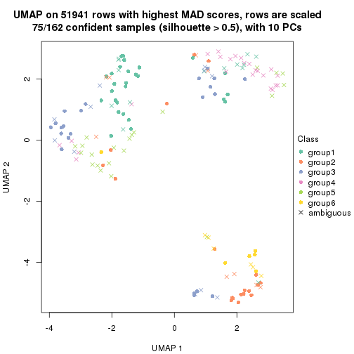</p>

</div>
</div>


Following heatmap shows how subgroups are split when increasing `k`:

```r
collect_classes(res)
```


Test correlation between subgroups and known annotations. If the known
annotation is numeric, one-way ANOVA test is applied, and if the known
annotation is discrete, chi-squared contingency table test is applied.

```r
test_to_known_factors(res)
```

```
#>           n disease.state(p) protocol(p) k
#> MAD:NMF 140         2.33e-07    7.40e-01 2
#> MAD:NMF 107         2.14e-03    6.05e-02 3
#> MAD:NMF 133         2.60e-08    4.93e-05 4
#> MAD:NMF  81         3.21e-05    1.72e-03 5
#> MAD:NMF  75         2.04e-05    2.02e-04 6
```


If matrix rows can be associated to genes, consider to use `GO_Enrichment(res,
...)` to perform function enrichment for the signature genes.


 

---------------------------------------------------


### ATC:hclust


The object with results only for a single top-value method and a single partition method 
can be extracted as:

```r
res = res_list["ATC", "hclust"]
# you can also extract it by
# res = res_list["ATC:hclust"]
```

A summary of `res` and all the functions that can be applied to it:

```r
res
```

```
#> A 'ConsensusPartition' object with k = 2, 3, 4, 5, 6.
#>   On a matrix with 51941 rows and 162 columns.
#>   Top rows (1000, 2000, 3000, 4000, 5000) are extracted by 'ATC' method.
#>   Subgroups are detected by 'hclust' method.
#>   Performed in total 1250 partitions by row resampling.
#>   Best k for subgroups seems to be 2.
#> 
#> Following methods can be applied to this 'ConsensusPartition' object:
#>  [1] "cola_report"             "collect_classes"         "collect_plots"          
#>  [4] "collect_stats"           "colnames"                "compare_signatures"     
#>  [7] "consensus_heatmap"       "dimension_reduction"     "functional_enrichment"  
#> [10] "get_anno_col"            "get_anno"                "get_classes"            
#> [13] "get_consensus"           "get_matrix"              "get_membership"         
#> [16] "get_param"               "get_signatures"          "get_stats"              
#> [19] "is_best_k"               "is_stable_k"             "membership_heatmap"     
#> [22] "ncol"                    "nrow"                    "plot_ecdf"              
#> [25] "rownames"                "select_partition_number" "show"                   
#> [28] "suggest_best_k"          "test_to_known_factors"
```

`collect_plots()` function collects all the plots made from `res` for all `k` (number of partitions)
into one single page to provide an easy and fast comparison between different `k`.

```r
collect_plots(res)
```


The plots are:

- The first row: a plot of the ECDF (Empirical cumulative distribution
  function) curves of the consensus matrix for each `k` and the heatmap of
  predicted classes for each `k`.
- The second row: heatmaps of the consensus matrix for each `k`.
- The third row: heatmaps of the membership matrix for each `k`.
- The fouth row: heatmaps of the signatures for each `k`.

All the plots in panels can be made by individual functions and they are
plotted later in this section.

`select_partition_number()` produces several plots showing different
statistics for choosing "optimized" `k`. There are following statistics:

- ECDF curves of the consensus matrix for each `k`;
- 1-PAC. [The PAC
  score](https://en.wikipedia.org/wiki/Consensus_clustering#Over-interpretation_potential_of_consensus_clustering)
  measures the proportion of the ambiguous subgrouping.
- Mean silhouette score.
- Concordance. The mean probability of fiting the consensus class ids in all
  partitions.
- Area increased. Denote $A_k$ as the area under the ECDF curve for current
  `k`, the area increased is defined as $A_k - A_{k-1}$.
- Rand index. The percent of pairs of samples that are both in a same cluster
  or both are not in a same cluster in the partition of k and k-1.
- Jaccard index. The ratio of pairs of samples are both in a same cluster in
  the partition of k and k-1 and the pairs of samples are both in a same
  cluster in the partition k or k-1.

The detailed explanations of these statistics can be found in [the cola
vignette](http://bioconductor.org/packages/devel/bioc/vignettes/cola/inst/doc/cola.html#toc_13).

Generally speaking, lower PAC score, higher mean silhouette score or higher
concordance corresponds to better partition. Rand index and Jaccard index
measure how similar the current partition is compared to partition with `k-1`.
If they are too similar, we won't accept `k` is better than `k-1`.

```r
select_partition_number(res)
```


The numeric values for all these statistics can be obtained by `get_stats()`.

```r
get_stats(res)
```

```
#>   k 1-PAC mean_silhouette concordance area_increased  Rand Jaccard
#> 2 2 0.386           0.790       0.878         0.4384 0.519   0.519
#> 3 3 0.396           0.614       0.704         0.3178 0.853   0.734
#> 4 4 0.510           0.709       0.832         0.1657 0.827   0.624
#> 5 5 0.615           0.543       0.767         0.0846 0.902   0.698
#> 6 6 0.647           0.686       0.838         0.0162 0.927   0.753
```

`suggest_best_k()` suggests the best $k$ based on these statistics. The rules are as follows:

- All $k$ with Jaccard index larger than 0.95 are removed because the increase of
  the partition number does not provides enough extra information. If all $k$ are removed,
  the best $k$ is assigned by `NA`.
- For $k$ with 1-PAC larger than 0.9, the maximal $k$ is taken as the "best k". Other $k$ is called "optional k".
- If it does not fit the second rule. The $k$ with the highest vote of highest
  1-PAC, mean silhouette and concordance is taken as the "best k".

```r
suggest_best_k(res)
```

```
#> [1] 2
```


Following shows the table of the partitions (You need to click the **show/hide
code output** link to see it). The membership matrix (columns with name `p*`)
is inferred by
[`clue::cl_consensus()`](https://www.rdocumentation.org/link/cl_consensus?package=clue)
function with the `SE` method. Basically the value in the membership matrix
represents the probability to belong to a certain group. The finall class
label for an item is determined with the group with highest probability it
belongs to.

In `get_classes()` function, the entropy is calculated from the membership
matrix and the silhouette score is calculated from the consensus matrix.


<script>
$( function() {
	$( '#tabs-ATC-hclust-get-classes' ).tabs();
} );
</script>
<div id='tabs-ATC-hclust-get-classes'>
<ul>
<li><a href='#tab-ATC-hclust-get-classes-1'>k = 2</a></li>
<li><a href='#tab-ATC-hclust-get-classes-2'>k = 3</a></li>
<li><a href='#tab-ATC-hclust-get-classes-3'>k = 4</a></li>
<li><a href='#tab-ATC-hclust-get-classes-4'>k = 5</a></li>
<li><a href='#tab-ATC-hclust-get-classes-5'>k = 6</a></li>
</ul>

<div id='tab-ATC-hclust-get-classes-1'>
<p><a id='tab-ATC-hclust-get-classes-1-a' style='color:#0366d6' href='#'>show/hide code output</a></p>
<pre><code class="r">cbind(get_classes(res, k = 2), get_membership(res, k = 2))
</code></pre>

<pre><code>#&gt;           class entropy silhouette    p1    p2
#&gt; GSM682002     2  0.0000     0.8627 0.000 1.000
#&gt; GSM682003     2  0.9686     0.3726 0.396 0.604
#&gt; GSM682004     2  0.0000     0.8627 0.000 1.000
#&gt; GSM682005     2  0.3733     0.8599 0.072 0.928
#&gt; GSM682006     2  0.3879     0.8584 0.076 0.924
#&gt; GSM682007     1  0.6531     0.8714 0.832 0.168
#&gt; GSM682008     1  0.6531     0.8714 0.832 0.168
#&gt; GSM682009     2  0.9209     0.5321 0.336 0.664
#&gt; GSM682010     1  0.6623     0.8694 0.828 0.172
#&gt; GSM682011     2  0.0000     0.8627 0.000 1.000
#&gt; GSM682096     2  0.1184     0.8651 0.016 0.984
#&gt; GSM682097     2  0.7883     0.7135 0.236 0.764
#&gt; GSM682098     2  0.1184     0.8651 0.016 0.984
#&gt; GSM682099     2  0.0000     0.8627 0.000 1.000
#&gt; GSM682100     2  0.0000     0.8627 0.000 1.000
#&gt; GSM682101     2  0.0000     0.8627 0.000 1.000
#&gt; GSM682102     2  0.3584     0.8615 0.068 0.932
#&gt; GSM682103     1  0.6343     0.8741 0.840 0.160
#&gt; GSM682104     1  0.6247     0.8745 0.844 0.156
#&gt; GSM682105     2  0.8267     0.6805 0.260 0.740
#&gt; GSM682106     1  0.5059     0.8788 0.888 0.112
#&gt; GSM682107     2  0.7299     0.7531 0.204 0.796
#&gt; GSM682108     1  0.4939     0.8785 0.892 0.108
#&gt; GSM682109     1  0.2603     0.8551 0.956 0.044
#&gt; GSM682110     1  0.6887     0.8626 0.816 0.184
#&gt; GSM682111     1  0.2603     0.8551 0.956 0.044
#&gt; GSM682112     1  0.0000     0.8283 1.000 0.000
#&gt; GSM682113     1  0.6973     0.8597 0.812 0.188
#&gt; GSM682114     1  0.0000     0.8283 1.000 0.000
#&gt; GSM682115     2  0.3584     0.8619 0.068 0.932
#&gt; GSM682116     2  0.4161     0.8560 0.084 0.916
#&gt; GSM682117     1  0.4815     0.8781 0.896 0.104
#&gt; GSM682118     1  0.4939     0.8786 0.892 0.108
#&gt; GSM682119     1  0.4690     0.8774 0.900 0.100
#&gt; GSM682120     1  0.8016     0.8038 0.756 0.244
#&gt; GSM682121     1  0.8267     0.7802 0.740 0.260
#&gt; GSM682122     1  0.4431     0.8749 0.908 0.092
#&gt; GSM682012     2  0.9850     0.2638 0.428 0.572
#&gt; GSM682013     2  0.0000     0.8627 0.000 1.000
#&gt; GSM682014     2  0.0000     0.8627 0.000 1.000
#&gt; GSM682015     2  0.0000     0.8627 0.000 1.000
#&gt; GSM682016     2  0.9922     0.1928 0.448 0.552
#&gt; GSM682017     2  0.0000     0.8627 0.000 1.000
#&gt; GSM682018     2  0.0000     0.8627 0.000 1.000
#&gt; GSM682019     2  0.0000     0.8627 0.000 1.000
#&gt; GSM682020     2  0.0000     0.8627 0.000 1.000
#&gt; GSM682021     2  0.0000     0.8627 0.000 1.000
#&gt; GSM682022     2  0.0000     0.8627 0.000 1.000
#&gt; GSM682023     2  0.0000     0.8627 0.000 1.000
#&gt; GSM682024     2  0.0000     0.8627 0.000 1.000
#&gt; GSM682025     2  0.0000     0.8627 0.000 1.000
#&gt; GSM682026     2  0.0000     0.8627 0.000 1.000
#&gt; GSM682027     2  0.0000     0.8627 0.000 1.000
#&gt; GSM682028     2  0.0000     0.8627 0.000 1.000
#&gt; GSM682029     2  0.0000     0.8627 0.000 1.000
#&gt; GSM682030     2  0.0000     0.8627 0.000 1.000
#&gt; GSM682031     2  0.0000     0.8627 0.000 1.000
#&gt; GSM682032     2  0.0000     0.8627 0.000 1.000
#&gt; GSM682033     2  0.9732     0.3461 0.404 0.596
#&gt; GSM681992     2  0.6148     0.8069 0.152 0.848
#&gt; GSM681993     1  0.0000     0.8283 1.000 0.000
#&gt; GSM681994     2  0.3733     0.8599 0.072 0.928
#&gt; GSM681995     2  0.3733     0.8599 0.072 0.928
#&gt; GSM681996     1  0.6531     0.8714 0.832 0.168
#&gt; GSM681997     1  0.6712     0.8676 0.824 0.176
#&gt; GSM681998     2  0.9963     0.1151 0.464 0.536
#&gt; GSM681999     2  0.9323     0.5045 0.348 0.652
#&gt; GSM682000     2  0.1414     0.8655 0.020 0.980
#&gt; GSM682001     2  0.4939     0.8392 0.108 0.892
#&gt; GSM682055     2  0.7883     0.7135 0.236 0.764
#&gt; GSM682056     2  0.7883     0.7135 0.236 0.764
#&gt; GSM682057     2  0.0000     0.8627 0.000 1.000
#&gt; GSM682058     2  0.1184     0.8651 0.016 0.984
#&gt; GSM682059     2  0.0000     0.8627 0.000 1.000
#&gt; GSM682060     1  0.8608     0.6622 0.716 0.284
#&gt; GSM682061     1  0.0000     0.8283 1.000 0.000
#&gt; GSM682062     2  0.0000     0.8627 0.000 1.000
#&gt; GSM682063     2  0.0000     0.8627 0.000 1.000
#&gt; GSM682064     2  0.3584     0.8615 0.068 0.932
#&gt; GSM682065     2  0.3274     0.8635 0.060 0.940
#&gt; GSM682066     2  0.3879     0.8582 0.076 0.924
#&gt; GSM682067     1  0.8016     0.8027 0.756 0.244
#&gt; GSM682068     2  0.3114     0.8635 0.056 0.944
#&gt; GSM682069     1  0.7139     0.8537 0.804 0.196
#&gt; GSM682070     1  0.7056     0.8567 0.808 0.192
#&gt; GSM682071     1  0.3431     0.8641 0.936 0.064
#&gt; GSM682072     1  0.2603     0.8551 0.956 0.044
#&gt; GSM682073     1  0.2236     0.8505 0.964 0.036
#&gt; GSM682074     1  0.6801     0.8654 0.820 0.180
#&gt; GSM682075     2  0.3879     0.8582 0.076 0.924
#&gt; GSM682076     1  0.8144     0.7922 0.748 0.252
#&gt; GSM682077     1  0.7602     0.8320 0.780 0.220
#&gt; GSM682078     1  0.5178     0.8789 0.884 0.116
#&gt; GSM682079     1  0.7883     0.8130 0.764 0.236
#&gt; GSM682080     1  0.2778     0.8570 0.952 0.048
#&gt; GSM682081     1  0.0000     0.8283 1.000 0.000
#&gt; GSM682082     1  0.4562     0.8763 0.904 0.096
#&gt; GSM682083     2  0.3584     0.8619 0.068 0.932
#&gt; GSM682084     1  0.0000     0.8283 1.000 0.000
#&gt; GSM682085     1  0.0000     0.8283 1.000 0.000
#&gt; GSM682086     2  0.7299     0.7531 0.204 0.796
#&gt; GSM682087     1  0.5842     0.8772 0.860 0.140
#&gt; GSM682088     1  0.4431     0.8750 0.908 0.092
#&gt; GSM682089     1  0.4815     0.8780 0.896 0.104
#&gt; GSM682090     1  0.8016     0.8038 0.756 0.244
#&gt; GSM682091     2  0.8267     0.6805 0.260 0.740
#&gt; GSM682092     2  0.8267     0.6805 0.260 0.740
#&gt; GSM682093     1  0.7056     0.8569 0.808 0.192
#&gt; GSM682094     2  0.7674     0.7295 0.224 0.776
#&gt; GSM682095     2  0.9909     0.2090 0.444 0.556
#&gt; GSM681982     1  0.6531     0.8714 0.832 0.168
#&gt; GSM681983     2  0.0000     0.8627 0.000 1.000
#&gt; GSM681984     1  0.7950     0.8014 0.760 0.240
#&gt; GSM681985     1  0.6531     0.8714 0.832 0.168
#&gt; GSM681986     1  0.9954     0.2348 0.540 0.460
#&gt; GSM681987     2  0.9983     0.0793 0.476 0.524
#&gt; GSM681988     1  0.6531     0.8714 0.832 0.168
#&gt; GSM681989     2  0.9209     0.5321 0.336 0.664
#&gt; GSM681990     1  0.6623     0.8694 0.828 0.172
#&gt; GSM681991     2  0.9896     0.2224 0.440 0.560
#&gt; GSM682034     2  0.7139     0.7631 0.196 0.804
#&gt; GSM682035     2  0.7139     0.7631 0.196 0.804
#&gt; GSM682036     1  0.6148     0.8751 0.848 0.152
#&gt; GSM682037     2  0.3733     0.8612 0.072 0.928
#&gt; GSM682038     1  0.7674     0.8229 0.776 0.224
#&gt; GSM682039     1  0.5178     0.8790 0.884 0.116
#&gt; GSM682040     1  0.0000     0.8283 1.000 0.000
#&gt; GSM682041     1  0.0000     0.8283 1.000 0.000
#&gt; GSM682042     1  0.0000     0.8283 1.000 0.000
#&gt; GSM682043     2  0.7139     0.7631 0.196 0.804
#&gt; GSM682044     2  0.7139     0.7631 0.196 0.804
#&gt; GSM682045     2  0.9209     0.5318 0.336 0.664
#&gt; GSM682046     2  0.0376     0.8634 0.004 0.996
#&gt; GSM682047     1  0.8813     0.7078 0.700 0.300
#&gt; GSM682048     2  0.9129     0.5497 0.328 0.672
#&gt; GSM682049     1  0.8813     0.7078 0.700 0.300
#&gt; GSM682050     2  0.0376     0.8634 0.004 0.996
#&gt; GSM682051     1  0.0000     0.8283 1.000 0.000
#&gt; GSM682052     1  0.0000     0.8283 1.000 0.000
#&gt; GSM682053     1  0.0000     0.8283 1.000 0.000
#&gt; GSM682054     2  0.3274     0.8636 0.060 0.940
#&gt; GSM682123     2  0.4161     0.8550 0.084 0.916
#&gt; GSM682124     2  0.2043     0.8652 0.032 0.968
#&gt; GSM682125     2  0.4161     0.8550 0.084 0.916
#&gt; GSM682126     2  0.1843     0.8653 0.028 0.972
#&gt; GSM682127     2  0.3733     0.8603 0.072 0.928
#&gt; GSM682128     2  0.3733     0.8599 0.072 0.928
#&gt; GSM682129     2  0.0000     0.8627 0.000 1.000
#&gt; GSM682130     2  0.0000     0.8627 0.000 1.000
#&gt; GSM682131     2  0.7883     0.7135 0.236 0.764
#&gt; GSM682132     2  0.3274     0.8633 0.060 0.940
#&gt; GSM682133     2  0.2778     0.8645 0.048 0.952
#&gt; GSM682134     2  0.4161     0.8550 0.084 0.916
#&gt; GSM682135     2  0.2603     0.8652 0.044 0.956
#&gt; GSM682136     2  0.0000     0.8627 0.000 1.000
#&gt; GSM682137     2  0.3733     0.8599 0.072 0.928
#&gt; GSM682138     1  0.8813     0.7078 0.700 0.300
#&gt; GSM682139     2  0.2043     0.8652 0.032 0.968
#&gt; GSM682140     1  0.8813     0.7078 0.700 0.300
#&gt; GSM682141     2  0.0000     0.8627 0.000 1.000
#&gt; GSM682142     2  0.3733     0.8603 0.072 0.928
#&gt; GSM682143     2  0.9993     0.0406 0.484 0.516
</code></pre>

<script>
$('#tab-ATC-hclust-get-classes-1-a').parent().next().next().hide();
$('#tab-ATC-hclust-get-classes-1-a').click(function(){
  $('#tab-ATC-hclust-get-classes-1-a').parent().next().next().toggle();
  return(false);
});
</script>
</div>

<div id='tab-ATC-hclust-get-classes-2'>
<p><a id='tab-ATC-hclust-get-classes-2-a' style='color:#0366d6' href='#'>show/hide code output</a></p>
<pre><code class="r">cbind(get_classes(res, k = 3), get_membership(res, k = 3))
</code></pre>

<pre><code>#&gt;           class entropy silhouette    p1    p2    p3
#&gt; GSM682002     1  0.4449     0.6677 0.860 0.100 0.040
#&gt; GSM682003     3  0.7878     0.2617 0.392 0.060 0.548
#&gt; GSM682004     1  0.4449     0.6677 0.860 0.100 0.040
#&gt; GSM682005     1  0.4555     0.6487 0.800 0.000 0.200
#&gt; GSM682006     1  0.4654     0.6438 0.792 0.000 0.208
#&gt; GSM682007     3  0.1170     0.7447 0.016 0.008 0.976
#&gt; GSM682008     3  0.1170     0.7447 0.016 0.008 0.976
#&gt; GSM682009     1  0.6518     0.1144 0.512 0.004 0.484
#&gt; GSM682010     3  0.1315     0.7461 0.020 0.008 0.972
#&gt; GSM682011     1  0.4335     0.6672 0.864 0.100 0.036
#&gt; GSM682096     1  0.5791     0.6534 0.784 0.168 0.048
#&gt; GSM682097     1  0.7207     0.3480 0.584 0.032 0.384
#&gt; GSM682098     1  0.5791     0.6534 0.784 0.168 0.048
#&gt; GSM682099     1  0.5678     0.5884 0.684 0.316 0.000
#&gt; GSM682100     1  0.5678     0.5884 0.684 0.316 0.000
#&gt; GSM682101     1  0.5678     0.5884 0.684 0.316 0.000
#&gt; GSM682102     1  0.4555     0.6492 0.800 0.000 0.200
#&gt; GSM682103     3  0.0424     0.7391 0.008 0.000 0.992
#&gt; GSM682104     3  0.0237     0.7369 0.004 0.000 0.996
#&gt; GSM682105     1  0.6126     0.3803 0.600 0.000 0.400
#&gt; GSM682106     3  0.2261     0.6744 0.000 0.068 0.932
#&gt; GSM682107     1  0.5859     0.4773 0.656 0.000 0.344
#&gt; GSM682108     3  0.2261     0.6750 0.000 0.068 0.932
#&gt; GSM682109     3  0.4346     0.4098 0.000 0.184 0.816
#&gt; GSM682110     3  0.1647     0.7450 0.036 0.004 0.960
#&gt; GSM682111     3  0.4702     0.3131 0.000 0.212 0.788
#&gt; GSM682112     2  0.6045     0.9314 0.000 0.620 0.380
#&gt; GSM682113     3  0.1765     0.7454 0.040 0.004 0.956
#&gt; GSM682114     2  0.6045     0.9314 0.000 0.620 0.380
#&gt; GSM682115     1  0.4963     0.6474 0.792 0.008 0.200
#&gt; GSM682116     1  0.5156     0.6361 0.776 0.008 0.216
#&gt; GSM682117     3  0.2165     0.6778 0.000 0.064 0.936
#&gt; GSM682118     3  0.2356     0.6678 0.000 0.072 0.928
#&gt; GSM682119     3  0.2448     0.6636 0.000 0.076 0.924
#&gt; GSM682120     3  0.2945     0.7306 0.088 0.004 0.908
#&gt; GSM682121     3  0.3375     0.7219 0.100 0.008 0.892
#&gt; GSM682122     3  0.2796     0.6340 0.000 0.092 0.908
#&gt; GSM682012     3  0.7824     0.3626 0.356 0.064 0.580
#&gt; GSM682013     1  0.5678     0.5884 0.684 0.316 0.000
#&gt; GSM682014     1  0.5678     0.5884 0.684 0.316 0.000
#&gt; GSM682015     1  0.5678     0.5884 0.684 0.316 0.000
#&gt; GSM682016     3  0.7727     0.4074 0.336 0.064 0.600
#&gt; GSM682017     1  0.5678     0.5884 0.684 0.316 0.000
#&gt; GSM682018     1  0.5678     0.5884 0.684 0.316 0.000
#&gt; GSM682019     1  0.5678     0.5884 0.684 0.316 0.000
#&gt; GSM682020     1  0.5678     0.5884 0.684 0.316 0.000
#&gt; GSM682021     1  0.5678     0.5884 0.684 0.316 0.000
#&gt; GSM682022     1  0.5678     0.5884 0.684 0.316 0.000
#&gt; GSM682023     1  0.5678     0.5884 0.684 0.316 0.000
#&gt; GSM682024     1  0.5678     0.5884 0.684 0.316 0.000
#&gt; GSM682025     1  0.5678     0.5884 0.684 0.316 0.000
#&gt; GSM682026     1  0.5678     0.5884 0.684 0.316 0.000
#&gt; GSM682027     1  0.5678     0.5884 0.684 0.316 0.000
#&gt; GSM682028     1  0.5678     0.5884 0.684 0.316 0.000
#&gt; GSM682029     1  0.5678     0.5884 0.684 0.316 0.000
#&gt; GSM682030     1  0.5678     0.5884 0.684 0.316 0.000
#&gt; GSM682031     1  0.5678     0.5884 0.684 0.316 0.000
#&gt; GSM682032     1  0.5678     0.5884 0.684 0.316 0.000
#&gt; GSM682033     3  0.7919     0.2991 0.380 0.064 0.556
#&gt; GSM681992     1  0.5690     0.5602 0.708 0.004 0.288
#&gt; GSM681993     2  0.6267     0.9114 0.000 0.548 0.452
#&gt; GSM681994     1  0.4605     0.6464 0.796 0.000 0.204
#&gt; GSM681995     1  0.4605     0.6464 0.796 0.000 0.204
#&gt; GSM681996     3  0.1170     0.7447 0.016 0.008 0.976
#&gt; GSM681997     3  0.1453     0.7474 0.024 0.008 0.968
#&gt; GSM681998     3  0.6264     0.3044 0.380 0.004 0.616
#&gt; GSM681999     1  0.6521     0.0740 0.500 0.004 0.496
#&gt; GSM682000     1  0.6100     0.6698 0.784 0.096 0.120
#&gt; GSM682001     1  0.5285     0.6078 0.752 0.004 0.244
#&gt; GSM682055     1  0.7207     0.3480 0.584 0.032 0.384
#&gt; GSM682056     1  0.7207     0.3480 0.584 0.032 0.384
#&gt; GSM682057     1  0.5678     0.5884 0.684 0.316 0.000
#&gt; GSM682058     1  0.5791     0.6534 0.784 0.168 0.048
#&gt; GSM682059     1  0.5678     0.5884 0.684 0.316 0.000
#&gt; GSM682060     3  0.7775     0.5184 0.156 0.168 0.676
#&gt; GSM682061     2  0.6045     0.9314 0.000 0.620 0.380
#&gt; GSM682062     1  0.5678     0.5884 0.684 0.316 0.000
#&gt; GSM682063     1  0.5678     0.5884 0.684 0.316 0.000
#&gt; GSM682064     1  0.4555     0.6492 0.800 0.000 0.200
#&gt; GSM682065     1  0.4452     0.6531 0.808 0.000 0.192
#&gt; GSM682066     1  0.4654     0.6436 0.792 0.000 0.208
#&gt; GSM682067     3  0.2796     0.7255 0.092 0.000 0.908
#&gt; GSM682068     1  0.4346     0.6551 0.816 0.000 0.184
#&gt; GSM682069     3  0.1989     0.7458 0.048 0.004 0.948
#&gt; GSM682070     3  0.1878     0.7455 0.044 0.004 0.952
#&gt; GSM682071     3  0.3619     0.5379 0.000 0.136 0.864
#&gt; GSM682072     3  0.4346     0.4098 0.000 0.184 0.816
#&gt; GSM682073     3  0.5529    -0.0887 0.000 0.296 0.704
#&gt; GSM682074     3  0.1163     0.7474 0.028 0.000 0.972
#&gt; GSM682075     1  0.4654     0.6436 0.792 0.000 0.208
#&gt; GSM682076     3  0.3213     0.7264 0.092 0.008 0.900
#&gt; GSM682077     3  0.2261     0.7404 0.068 0.000 0.932
#&gt; GSM682078     3  0.1964     0.6856 0.000 0.056 0.944
#&gt; GSM682079     3  0.2625     0.7289 0.084 0.000 0.916
#&gt; GSM682080     3  0.4121     0.4578 0.000 0.168 0.832
#&gt; GSM682081     2  0.6062     0.9307 0.000 0.616 0.384
#&gt; GSM682082     3  0.2711     0.6428 0.000 0.088 0.912
#&gt; GSM682083     1  0.4963     0.6474 0.792 0.008 0.200
#&gt; GSM682084     2  0.6045     0.9314 0.000 0.620 0.380
#&gt; GSM682085     2  0.6045     0.9314 0.000 0.620 0.380
#&gt; GSM682086     1  0.5859     0.4773 0.656 0.000 0.344
#&gt; GSM682087     3  0.3045     0.7044 0.020 0.064 0.916
#&gt; GSM682088     3  0.2796     0.6377 0.000 0.092 0.908
#&gt; GSM682089     3  0.2537     0.6590 0.000 0.080 0.920
#&gt; GSM682090     3  0.2945     0.7306 0.088 0.004 0.908
#&gt; GSM682091     1  0.6126     0.3803 0.600 0.000 0.400
#&gt; GSM682092     1  0.6126     0.3803 0.600 0.000 0.400
#&gt; GSM682093     3  0.1529     0.7460 0.040 0.000 0.960
#&gt; GSM682094     1  0.5968     0.4458 0.636 0.000 0.364
#&gt; GSM682095     3  0.7748     0.3989 0.340 0.064 0.596
#&gt; GSM681982     3  0.1170     0.7447 0.016 0.008 0.976
#&gt; GSM681983     1  0.4335     0.6672 0.864 0.100 0.036
#&gt; GSM681984     3  0.3406     0.7306 0.068 0.028 0.904
#&gt; GSM681985     3  0.1170     0.7447 0.016 0.008 0.976
#&gt; GSM681986     3  0.6388     0.5398 0.284 0.024 0.692
#&gt; GSM681987     3  0.7562     0.4610 0.308 0.064 0.628
#&gt; GSM681988     3  0.1170     0.7447 0.016 0.008 0.976
#&gt; GSM681989     1  0.6518     0.1144 0.512 0.004 0.484
#&gt; GSM681990     3  0.1315     0.7461 0.020 0.008 0.972
#&gt; GSM681991     3  0.7768     0.3912 0.344 0.064 0.592
#&gt; GSM682034     1  0.5835     0.4815 0.660 0.000 0.340
#&gt; GSM682035     1  0.5835     0.4815 0.660 0.000 0.340
#&gt; GSM682036     3  0.0475     0.7348 0.004 0.004 0.992
#&gt; GSM682037     1  0.4605     0.6483 0.796 0.000 0.204
#&gt; GSM682038     3  0.2651     0.7389 0.060 0.012 0.928
#&gt; GSM682039     3  0.1860     0.6930 0.000 0.052 0.948
#&gt; GSM682040     2  0.6045     0.9314 0.000 0.620 0.380
#&gt; GSM682041     2  0.6291     0.8942 0.000 0.532 0.468
#&gt; GSM682042     2  0.6260     0.9137 0.000 0.552 0.448
#&gt; GSM682043     1  0.5835     0.4815 0.660 0.000 0.340
#&gt; GSM682044     1  0.5835     0.4815 0.660 0.000 0.340
#&gt; GSM682045     1  0.6305     0.1258 0.516 0.000 0.484
#&gt; GSM682046     1  0.3797     0.6722 0.892 0.052 0.056
#&gt; GSM682047     3  0.4099     0.6914 0.140 0.008 0.852
#&gt; GSM682048     1  0.6299     0.1544 0.524 0.000 0.476
#&gt; GSM682049     3  0.4099     0.6914 0.140 0.008 0.852
#&gt; GSM682050     1  0.3899     0.6721 0.888 0.056 0.056
#&gt; GSM682051     2  0.6291     0.8942 0.000 0.532 0.468
#&gt; GSM682052     2  0.6267     0.9112 0.000 0.548 0.452
#&gt; GSM682053     2  0.6291     0.8942 0.000 0.532 0.468
#&gt; GSM682054     1  0.4452     0.6533 0.808 0.000 0.192
#&gt; GSM682123     1  0.4750     0.6383 0.784 0.000 0.216
#&gt; GSM682124     1  0.4390     0.6657 0.840 0.012 0.148
#&gt; GSM682125     1  0.4750     0.6383 0.784 0.000 0.216
#&gt; GSM682126     1  0.4615     0.6669 0.836 0.020 0.144
#&gt; GSM682127     1  0.4654     0.6452 0.792 0.000 0.208
#&gt; GSM682128     1  0.4605     0.6464 0.796 0.000 0.204
#&gt; GSM682129     1  0.5678     0.5884 0.684 0.316 0.000
#&gt; GSM682130     1  0.5678     0.5884 0.684 0.316 0.000
#&gt; GSM682131     1  0.7207     0.3480 0.584 0.032 0.384
#&gt; GSM682132     1  0.4452     0.6534 0.808 0.000 0.192
#&gt; GSM682133     1  0.4692     0.6620 0.820 0.012 0.168
#&gt; GSM682134     1  0.4750     0.6383 0.784 0.000 0.216
#&gt; GSM682135     1  0.4749     0.6613 0.816 0.012 0.172
#&gt; GSM682136     1  0.3875     0.6709 0.888 0.068 0.044
#&gt; GSM682137     1  0.4605     0.6464 0.796 0.000 0.204
#&gt; GSM682138     3  0.4099     0.6914 0.140 0.008 0.852
#&gt; GSM682139     1  0.4390     0.6657 0.840 0.012 0.148
#&gt; GSM682140     3  0.4099     0.6914 0.140 0.008 0.852
#&gt; GSM682141     1  0.3875     0.6709 0.888 0.068 0.044
#&gt; GSM682142     1  0.4654     0.6452 0.792 0.000 0.208
#&gt; GSM682143     3  0.7451     0.4727 0.304 0.060 0.636
</code></pre>

<script>
$('#tab-ATC-hclust-get-classes-2-a').parent().next().next().hide();
$('#tab-ATC-hclust-get-classes-2-a').click(function(){
  $('#tab-ATC-hclust-get-classes-2-a').parent().next().next().toggle();
  return(false);
});
</script>
</div>

<div id='tab-ATC-hclust-get-classes-3'>
<p><a id='tab-ATC-hclust-get-classes-3-a' style='color:#0366d6' href='#'>show/hide code output</a></p>
<pre><code class="r">cbind(get_classes(res, k = 4), get_membership(res, k = 4))
</code></pre>

<pre><code>#&gt;           class entropy silhouette    p1    p2    p3    p4
#&gt; GSM682002     1   0.430    0.48972 0.716 0.284 0.000 0.000
#&gt; GSM682003     1   0.772    0.14113 0.480 0.100 0.384 0.036
#&gt; GSM682004     1   0.433    0.48288 0.712 0.288 0.000 0.000
#&gt; GSM682005     1   0.130    0.80461 0.964 0.020 0.016 0.000
#&gt; GSM682006     1   0.130    0.80579 0.964 0.016 0.020 0.000
#&gt; GSM682007     3   0.159    0.78473 0.040 0.004 0.952 0.004
#&gt; GSM682008     3   0.159    0.78473 0.040 0.004 0.952 0.004
#&gt; GSM682009     1   0.539    0.50402 0.648 0.020 0.328 0.004
#&gt; GSM682010     3   0.185    0.78608 0.052 0.004 0.940 0.004
#&gt; GSM682011     1   0.433    0.48162 0.712 0.288 0.000 0.000
#&gt; GSM682096     2   0.545    0.25940 0.460 0.528 0.008 0.004
#&gt; GSM682097     1   0.597    0.63081 0.708 0.052 0.212 0.028
#&gt; GSM682098     2   0.545    0.25940 0.460 0.528 0.008 0.004
#&gt; GSM682099     2   0.253    0.95125 0.112 0.888 0.000 0.000
#&gt; GSM682100     2   0.253    0.95125 0.112 0.888 0.000 0.000
#&gt; GSM682101     2   0.253    0.95125 0.112 0.888 0.000 0.000
#&gt; GSM682102     1   0.130    0.80417 0.964 0.020 0.016 0.000
#&gt; GSM682103     3   0.164    0.78469 0.060 0.000 0.940 0.000
#&gt; GSM682104     3   0.130    0.78279 0.044 0.000 0.956 0.000
#&gt; GSM682105     1   0.384    0.68485 0.776 0.000 0.224 0.000
#&gt; GSM682106     3   0.140    0.74722 0.004 0.000 0.956 0.040
#&gt; GSM682107     1   0.340    0.74798 0.832 0.004 0.164 0.000
#&gt; GSM682108     3   0.140    0.74724 0.004 0.000 0.956 0.040
#&gt; GSM682109     3   0.312    0.60740 0.000 0.000 0.844 0.156
#&gt; GSM682110     3   0.215    0.78229 0.088 0.000 0.912 0.000
#&gt; GSM682111     3   0.344    0.54694 0.000 0.000 0.816 0.184
#&gt; GSM682112     4   0.121    0.74203 0.000 0.000 0.040 0.960
#&gt; GSM682113     3   0.234    0.77925 0.100 0.000 0.900 0.000
#&gt; GSM682114     4   0.156    0.75009 0.000 0.000 0.056 0.944
#&gt; GSM682115     1   0.104    0.80377 0.972 0.020 0.008 0.000
#&gt; GSM682116     1   0.141    0.80652 0.960 0.016 0.024 0.000
#&gt; GSM682117     3   0.131    0.74876 0.004 0.000 0.960 0.036
#&gt; GSM682118     3   0.149    0.74464 0.004 0.000 0.952 0.044
#&gt; GSM682119     3   0.158    0.73961 0.004 0.000 0.948 0.048
#&gt; GSM682120     3   0.367    0.72881 0.188 0.004 0.808 0.000
#&gt; GSM682121     3   0.401    0.70897 0.208 0.008 0.784 0.000
#&gt; GSM682122     3   0.190    0.72863 0.004 0.000 0.932 0.064
#&gt; GSM682012     1   0.787   -0.00524 0.436 0.112 0.416 0.036
#&gt; GSM682013     2   0.253    0.95125 0.112 0.888 0.000 0.000
#&gt; GSM682014     2   0.253    0.95125 0.112 0.888 0.000 0.000
#&gt; GSM682015     2   0.253    0.95125 0.112 0.888 0.000 0.000
#&gt; GSM682016     3   0.787    0.04543 0.416 0.112 0.436 0.036
#&gt; GSM682017     2   0.253    0.95125 0.112 0.888 0.000 0.000
#&gt; GSM682018     2   0.253    0.95125 0.112 0.888 0.000 0.000
#&gt; GSM682019     2   0.253    0.95125 0.112 0.888 0.000 0.000
#&gt; GSM682020     2   0.253    0.95125 0.112 0.888 0.000 0.000
#&gt; GSM682021     2   0.253    0.95125 0.112 0.888 0.000 0.000
#&gt; GSM682022     2   0.253    0.95125 0.112 0.888 0.000 0.000
#&gt; GSM682023     2   0.253    0.95125 0.112 0.888 0.000 0.000
#&gt; GSM682024     2   0.253    0.95125 0.112 0.888 0.000 0.000
#&gt; GSM682025     2   0.253    0.95125 0.112 0.888 0.000 0.000
#&gt; GSM682026     2   0.253    0.95125 0.112 0.888 0.000 0.000
#&gt; GSM682027     2   0.253    0.95125 0.112 0.888 0.000 0.000
#&gt; GSM682028     2   0.253    0.95125 0.112 0.888 0.000 0.000
#&gt; GSM682029     2   0.253    0.95125 0.112 0.888 0.000 0.000
#&gt; GSM682030     2   0.253    0.95125 0.112 0.888 0.000 0.000
#&gt; GSM682031     2   0.253    0.95125 0.112 0.888 0.000 0.000
#&gt; GSM682032     2   0.253    0.95125 0.112 0.888 0.000 0.000
#&gt; GSM682033     1   0.775    0.05498 0.452 0.100 0.412 0.036
#&gt; GSM681992     1   0.286    0.79562 0.892 0.012 0.092 0.004
#&gt; GSM681993     4   0.494    0.56654 0.000 0.000 0.436 0.564
#&gt; GSM681994     1   0.118    0.80460 0.968 0.016 0.016 0.000
#&gt; GSM681995     1   0.118    0.80460 0.968 0.016 0.016 0.000
#&gt; GSM681996     3   0.159    0.78473 0.040 0.004 0.952 0.004
#&gt; GSM681997     3   0.216    0.78695 0.060 0.008 0.928 0.004
#&gt; GSM681998     1   0.577    0.00733 0.492 0.020 0.484 0.004
#&gt; GSM681999     1   0.546    0.47203 0.632 0.020 0.344 0.004
#&gt; GSM682000     1   0.397    0.63693 0.788 0.204 0.008 0.000
#&gt; GSM682001     1   0.226    0.80446 0.924 0.020 0.056 0.000
#&gt; GSM682055     1   0.597    0.63081 0.708 0.052 0.212 0.028
#&gt; GSM682056     1   0.597    0.63081 0.708 0.052 0.212 0.028
#&gt; GSM682057     2   0.253    0.95125 0.112 0.888 0.000 0.000
#&gt; GSM682058     2   0.545    0.25940 0.460 0.528 0.008 0.004
#&gt; GSM682059     2   0.253    0.95125 0.112 0.888 0.000 0.000
#&gt; GSM682060     3   0.720    0.50401 0.152 0.052 0.652 0.144
#&gt; GSM682061     4   0.112    0.73829 0.000 0.000 0.036 0.964
#&gt; GSM682062     2   0.253    0.95125 0.112 0.888 0.000 0.000
#&gt; GSM682063     2   0.253    0.95125 0.112 0.888 0.000 0.000
#&gt; GSM682064     1   0.130    0.80417 0.964 0.020 0.016 0.000
#&gt; GSM682065     1   0.151    0.80200 0.956 0.028 0.016 0.000
#&gt; GSM682066     1   0.141    0.80614 0.960 0.016 0.024 0.000
#&gt; GSM682067     3   0.340    0.73580 0.180 0.000 0.820 0.000
#&gt; GSM682068     1   0.100    0.79651 0.972 0.024 0.004 0.000
#&gt; GSM682069     3   0.253    0.77563 0.112 0.000 0.888 0.000
#&gt; GSM682070     3   0.247    0.77684 0.108 0.000 0.892 0.000
#&gt; GSM682071     3   0.247    0.68065 0.000 0.000 0.892 0.108
#&gt; GSM682072     3   0.312    0.60740 0.000 0.000 0.844 0.156
#&gt; GSM682073     3   0.425    0.30975 0.000 0.000 0.724 0.276
#&gt; GSM682074     3   0.201    0.78534 0.080 0.000 0.920 0.000
#&gt; GSM682075     1   0.130    0.80552 0.964 0.016 0.020 0.000
#&gt; GSM682076     3   0.389    0.71935 0.196 0.008 0.796 0.000
#&gt; GSM682077     3   0.312    0.75448 0.156 0.000 0.844 0.000
#&gt; GSM682078     3   0.126    0.75665 0.008 0.000 0.964 0.028
#&gt; GSM682079     3   0.331    0.74184 0.172 0.000 0.828 0.000
#&gt; GSM682080     3   0.292    0.63486 0.000 0.000 0.860 0.140
#&gt; GSM682081     4   0.172    0.74901 0.000 0.000 0.064 0.936
#&gt; GSM682082     3   0.182    0.73266 0.004 0.000 0.936 0.060
#&gt; GSM682083     1   0.104    0.80377 0.972 0.020 0.008 0.000
#&gt; GSM682084     4   0.156    0.75009 0.000 0.000 0.056 0.944
#&gt; GSM682085     4   0.156    0.75009 0.000 0.000 0.056 0.944
#&gt; GSM682086     1   0.340    0.74798 0.832 0.004 0.164 0.000
#&gt; GSM682087     3   0.250    0.76519 0.044 0.004 0.920 0.032
#&gt; GSM682088     3   0.190    0.72619 0.004 0.000 0.932 0.064
#&gt; GSM682089     3   0.166    0.73882 0.004 0.000 0.944 0.052
#&gt; GSM682090     3   0.367    0.72881 0.188 0.004 0.808 0.000
#&gt; GSM682091     1   0.384    0.68485 0.776 0.000 0.224 0.000
#&gt; GSM682092     1   0.384    0.68485 0.776 0.000 0.224 0.000
#&gt; GSM682093     3   0.234    0.77992 0.100 0.000 0.900 0.000
#&gt; GSM682094     1   0.340    0.73165 0.820 0.000 0.180 0.000
#&gt; GSM682095     3   0.780    0.14359 0.380 0.108 0.476 0.036
#&gt; GSM681982     3   0.159    0.78473 0.040 0.004 0.952 0.004
#&gt; GSM681983     1   0.433    0.48162 0.712 0.288 0.000 0.000
#&gt; GSM681984     3   0.334    0.76599 0.084 0.024 0.880 0.012
#&gt; GSM681985     3   0.159    0.78473 0.040 0.004 0.952 0.004
#&gt; GSM681986     3   0.626    0.37909 0.372 0.040 0.576 0.012
#&gt; GSM681987     3   0.763    0.28001 0.332 0.104 0.528 0.036
#&gt; GSM681988     3   0.159    0.78473 0.040 0.004 0.952 0.004
#&gt; GSM681989     1   0.539    0.50402 0.648 0.020 0.328 0.004
#&gt; GSM681990     3   0.176    0.78593 0.048 0.004 0.944 0.004
#&gt; GSM681991     3   0.780    0.13250 0.384 0.108 0.472 0.036
#&gt; GSM682034     1   0.297    0.76319 0.856 0.000 0.144 0.000
#&gt; GSM682035     1   0.297    0.76319 0.856 0.000 0.144 0.000
#&gt; GSM682036     3   0.112    0.78194 0.036 0.000 0.964 0.000
#&gt; GSM682037     1   0.163    0.80602 0.952 0.024 0.024 0.000
#&gt; GSM682038     3   0.323    0.76883 0.084 0.020 0.884 0.012
#&gt; GSM682039     3   0.126    0.75633 0.008 0.000 0.964 0.028
#&gt; GSM682040     4   0.121    0.74203 0.000 0.000 0.040 0.960
#&gt; GSM682041     4   0.500    0.50267 0.000 0.000 0.488 0.512
#&gt; GSM682042     4   0.497    0.54788 0.000 0.000 0.456 0.544
#&gt; GSM682043     1   0.297    0.76319 0.856 0.000 0.144 0.000
#&gt; GSM682044     1   0.297    0.76319 0.856 0.000 0.144 0.000
#&gt; GSM682045     1   0.479    0.54538 0.680 0.008 0.312 0.000
#&gt; GSM682046     1   0.373    0.61885 0.788 0.212 0.000 0.000
#&gt; GSM682047     3   0.442    0.65795 0.256 0.008 0.736 0.000
#&gt; GSM682048     1   0.475    0.56035 0.688 0.008 0.304 0.000
#&gt; GSM682049     3   0.442    0.65795 0.256 0.008 0.736 0.000
#&gt; GSM682050     1   0.376    0.61319 0.784 0.216 0.000 0.000
#&gt; GSM682051     4   0.500    0.50267 0.000 0.000 0.488 0.512
#&gt; GSM682052     4   0.498    0.54191 0.000 0.000 0.460 0.540
#&gt; GSM682053     4   0.500    0.50267 0.000 0.000 0.488 0.512
#&gt; GSM682054     1   0.172    0.80212 0.948 0.032 0.020 0.000
#&gt; GSM682123     1   0.104    0.80645 0.972 0.008 0.020 0.000
#&gt; GSM682124     1   0.187    0.76968 0.928 0.072 0.000 0.000
#&gt; GSM682125     1   0.104    0.80645 0.972 0.008 0.020 0.000
#&gt; GSM682126     1   0.208    0.76165 0.916 0.084 0.000 0.000
#&gt; GSM682127     1   0.194    0.80536 0.940 0.028 0.032 0.000
#&gt; GSM682128     1   0.118    0.80460 0.968 0.016 0.016 0.000
#&gt; GSM682129     2   0.253    0.95125 0.112 0.888 0.000 0.000
#&gt; GSM682130     2   0.253    0.95125 0.112 0.888 0.000 0.000
#&gt; GSM682131     1   0.597    0.63081 0.708 0.052 0.212 0.028
#&gt; GSM682132     1   0.104    0.80105 0.972 0.020 0.008 0.000
#&gt; GSM682133     1   0.147    0.78226 0.948 0.052 0.000 0.000
#&gt; GSM682134     1   0.104    0.80645 0.972 0.008 0.020 0.000
#&gt; GSM682135     1   0.139    0.78567 0.952 0.048 0.000 0.000
#&gt; GSM682136     1   0.398    0.57394 0.760 0.240 0.000 0.000
#&gt; GSM682137     1   0.118    0.80460 0.968 0.016 0.016 0.000
#&gt; GSM682138     3   0.442    0.65795 0.256 0.008 0.736 0.000
#&gt; GSM682139     1   0.187    0.76968 0.928 0.072 0.000 0.000
#&gt; GSM682140     3   0.442    0.65795 0.256 0.008 0.736 0.000
#&gt; GSM682141     1   0.398    0.57394 0.760 0.240 0.000 0.000
#&gt; GSM682142     1   0.194    0.80536 0.940 0.028 0.032 0.000
#&gt; GSM682143     3   0.749    0.32389 0.320 0.096 0.548 0.036
</code></pre>

<script>
$('#tab-ATC-hclust-get-classes-3-a').parent().next().next().hide();
$('#tab-ATC-hclust-get-classes-3-a').click(function(){
  $('#tab-ATC-hclust-get-classes-3-a').parent().next().next().toggle();
  return(false);
});
</script>
</div>

<div id='tab-ATC-hclust-get-classes-4'>
<p><a id='tab-ATC-hclust-get-classes-4-a' style='color:#0366d6' href='#'>show/hide code output</a></p>
<pre><code class="r">cbind(get_classes(res, k = 5), get_membership(res, k = 5))
</code></pre>

<pre><code>#&gt;           class entropy silhouette    p1    p2    p3    p4    p5
#&gt; GSM682002     1  0.3861    0.61469 0.728 0.264 0.000 0.000 0.008
#&gt; GSM682003     5  0.5060    0.77445 0.136 0.000 0.012 0.124 0.728
#&gt; GSM682004     1  0.3992    0.60728 0.720 0.268 0.000 0.000 0.012
#&gt; GSM682005     1  0.1082    0.79999 0.964 0.008 0.000 0.000 0.028
#&gt; GSM682006     1  0.1202    0.79940 0.960 0.004 0.000 0.004 0.032
#&gt; GSM682007     4  0.4610    0.64952 0.000 0.000 0.432 0.556 0.012
#&gt; GSM682008     4  0.4610    0.64952 0.000 0.000 0.432 0.556 0.012
#&gt; GSM682009     1  0.6724    0.41286 0.576 0.000 0.060 0.248 0.116
#&gt; GSM682010     4  0.4858    0.66422 0.008 0.000 0.424 0.556 0.012
#&gt; GSM682011     1  0.3885    0.61000 0.724 0.268 0.000 0.000 0.008
#&gt; GSM682096     2  0.5125    0.16771 0.416 0.544 0.000 0.000 0.040
#&gt; GSM682097     1  0.5897    0.15023 0.496 0.000 0.004 0.088 0.412
#&gt; GSM682098     2  0.5125    0.16771 0.416 0.544 0.000 0.000 0.040
#&gt; GSM682099     2  0.0000    0.93884 0.000 1.000 0.000 0.000 0.000
#&gt; GSM682100     2  0.0000    0.93884 0.000 1.000 0.000 0.000 0.000
#&gt; GSM682101     2  0.0000    0.93884 0.000 1.000 0.000 0.000 0.000
#&gt; GSM682102     1  0.0865    0.79926 0.972 0.004 0.000 0.000 0.024
#&gt; GSM682103     4  0.5447    0.67353 0.012 0.000 0.440 0.512 0.036
#&gt; GSM682104     4  0.5065    0.64727 0.008 0.000 0.448 0.524 0.020
#&gt; GSM682105     1  0.5248    0.64009 0.728 0.000 0.068 0.160 0.044
#&gt; GSM682106     3  0.4437   -0.43095 0.000 0.000 0.532 0.464 0.004
#&gt; GSM682107     1  0.4327    0.71123 0.796 0.000 0.032 0.124 0.048
#&gt; GSM682108     3  0.4546   -0.42708 0.000 0.000 0.532 0.460 0.008
#&gt; GSM682109     3  0.4030   -0.21183 0.000 0.000 0.648 0.352 0.000
#&gt; GSM682110     4  0.5872    0.68723 0.048 0.000 0.428 0.500 0.024
#&gt; GSM682111     3  0.3913   -0.16237 0.000 0.000 0.676 0.324 0.000
#&gt; GSM682112     3  0.5799   -0.05368 0.000 0.000 0.492 0.416 0.092
#&gt; GSM682113     4  0.6138    0.69106 0.048 0.000 0.420 0.492 0.040
#&gt; GSM682114     3  0.5779   -0.03687 0.000 0.000 0.508 0.400 0.092
#&gt; GSM682115     1  0.0693    0.80004 0.980 0.000 0.000 0.008 0.012
#&gt; GSM682116     1  0.1216    0.79902 0.960 0.000 0.000 0.020 0.020
#&gt; GSM682117     3  0.4440   -0.43823 0.000 0.000 0.528 0.468 0.004
#&gt; GSM682118     3  0.4434   -0.41916 0.000 0.000 0.536 0.460 0.004
#&gt; GSM682119     3  0.4430   -0.41206 0.000 0.000 0.540 0.456 0.004
#&gt; GSM682120     4  0.6974    0.64971 0.148 0.000 0.384 0.436 0.032
#&gt; GSM682121     4  0.7185    0.62822 0.164 0.000 0.368 0.428 0.040
#&gt; GSM682122     3  0.4410   -0.37630 0.000 0.000 0.556 0.440 0.004
#&gt; GSM682012     5  0.2964    0.84318 0.024 0.000 0.000 0.120 0.856
#&gt; GSM682013     2  0.0000    0.93884 0.000 1.000 0.000 0.000 0.000
#&gt; GSM682014     2  0.0000    0.93884 0.000 1.000 0.000 0.000 0.000
#&gt; GSM682015     2  0.0000    0.93884 0.000 1.000 0.000 0.000 0.000
#&gt; GSM682016     5  0.3151    0.85180 0.020 0.000 0.000 0.144 0.836
#&gt; GSM682017     2  0.0000    0.93884 0.000 1.000 0.000 0.000 0.000
#&gt; GSM682018     2  0.0000    0.93884 0.000 1.000 0.000 0.000 0.000
#&gt; GSM682019     2  0.0000    0.93884 0.000 1.000 0.000 0.000 0.000
#&gt; GSM682020     2  0.0000    0.93884 0.000 1.000 0.000 0.000 0.000
#&gt; GSM682021     2  0.0000    0.93884 0.000 1.000 0.000 0.000 0.000
#&gt; GSM682022     2  0.0000    0.93884 0.000 1.000 0.000 0.000 0.000
#&gt; GSM682023     2  0.0000    0.93884 0.000 1.000 0.000 0.000 0.000
#&gt; GSM682024     2  0.0000    0.93884 0.000 1.000 0.000 0.000 0.000
#&gt; GSM682025     2  0.0000    0.93884 0.000 1.000 0.000 0.000 0.000
#&gt; GSM682026     2  0.0000    0.93884 0.000 1.000 0.000 0.000 0.000
#&gt; GSM682027     2  0.0000    0.93884 0.000 1.000 0.000 0.000 0.000
#&gt; GSM682028     2  0.0000    0.93884 0.000 1.000 0.000 0.000 0.000
#&gt; GSM682029     2  0.0000    0.93884 0.000 1.000 0.000 0.000 0.000
#&gt; GSM682030     2  0.0000    0.93884 0.000 1.000 0.000 0.000 0.000
#&gt; GSM682031     2  0.0000    0.93884 0.000 1.000 0.000 0.000 0.000
#&gt; GSM682032     2  0.0000    0.93884 0.000 1.000 0.000 0.000 0.000
#&gt; GSM682033     5  0.2793    0.81838 0.036 0.000 0.000 0.088 0.876
#&gt; GSM681992     1  0.3636    0.74639 0.824 0.004 0.004 0.032 0.136
#&gt; GSM681993     3  0.1830    0.26819 0.000 0.000 0.932 0.028 0.040
#&gt; GSM681994     1  0.0955    0.79946 0.968 0.004 0.000 0.000 0.028
#&gt; GSM681995     1  0.0955    0.79946 0.968 0.004 0.000 0.000 0.028
#&gt; GSM681996     4  0.4610    0.64952 0.000 0.000 0.432 0.556 0.012
#&gt; GSM681997     4  0.5458    0.67317 0.008 0.000 0.424 0.524 0.044
#&gt; GSM681998     1  0.7870   -0.05886 0.416 0.000 0.160 0.312 0.112
#&gt; GSM681999     1  0.6837    0.37378 0.556 0.000 0.064 0.268 0.112
#&gt; GSM682000     1  0.3760    0.68947 0.784 0.188 0.000 0.000 0.028
#&gt; GSM682001     1  0.2349    0.78549 0.900 0.004 0.000 0.012 0.084
#&gt; GSM682055     1  0.5897    0.15023 0.496 0.000 0.004 0.088 0.412
#&gt; GSM682056     1  0.5897    0.15023 0.496 0.000 0.004 0.088 0.412
#&gt; GSM682057     2  0.0000    0.93884 0.000 1.000 0.000 0.000 0.000
#&gt; GSM682058     2  0.5125    0.16771 0.416 0.544 0.000 0.000 0.040
#&gt; GSM682059     2  0.0000    0.93884 0.000 1.000 0.000 0.000 0.000
#&gt; GSM682060     4  0.6688    0.18399 0.000 0.000 0.356 0.404 0.240
#&gt; GSM682061     3  0.5891   -0.07765 0.000 0.000 0.468 0.432 0.100
#&gt; GSM682062     2  0.0000    0.93884 0.000 1.000 0.000 0.000 0.000
#&gt; GSM682063     2  0.0000    0.93884 0.000 1.000 0.000 0.000 0.000
#&gt; GSM682064     1  0.0865    0.79926 0.972 0.004 0.000 0.000 0.024
#&gt; GSM682065     1  0.1299    0.79952 0.960 0.012 0.000 0.008 0.020
#&gt; GSM682066     1  0.1202    0.79978 0.960 0.004 0.004 0.000 0.032
#&gt; GSM682067     4  0.6932    0.65343 0.124 0.000 0.396 0.440 0.040
#&gt; GSM682068     1  0.0693    0.79782 0.980 0.012 0.000 0.000 0.008
#&gt; GSM682069     4  0.6294    0.69199 0.060 0.000 0.412 0.488 0.040
#&gt; GSM682070     4  0.6245    0.69139 0.056 0.000 0.416 0.488 0.040
#&gt; GSM682071     3  0.4321   -0.30690 0.000 0.000 0.600 0.396 0.004
#&gt; GSM682072     3  0.4030   -0.21183 0.000 0.000 0.648 0.352 0.000
#&gt; GSM682073     3  0.3671   -0.00601 0.000 0.000 0.756 0.236 0.008
#&gt; GSM682074     4  0.5617    0.67986 0.048 0.000 0.424 0.516 0.012
#&gt; GSM682075     1  0.1041    0.79910 0.964 0.004 0.000 0.000 0.032
#&gt; GSM682076     4  0.7117    0.64035 0.152 0.000 0.376 0.432 0.040
#&gt; GSM682077     4  0.6741    0.67246 0.116 0.000 0.396 0.456 0.032
#&gt; GSM682078     3  0.4589   -0.47817 0.004 0.000 0.520 0.472 0.004
#&gt; GSM682079     4  0.6872    0.66056 0.116 0.000 0.404 0.440 0.040
#&gt; GSM682080     3  0.4088   -0.24827 0.000 0.000 0.632 0.368 0.000
#&gt; GSM682081     3  0.5742   -0.03543 0.000 0.000 0.508 0.404 0.088
#&gt; GSM682082     3  0.4415   -0.38685 0.000 0.000 0.552 0.444 0.004
#&gt; GSM682083     1  0.0693    0.80004 0.980 0.000 0.000 0.008 0.012
#&gt; GSM682084     3  0.5779   -0.03687 0.000 0.000 0.508 0.400 0.092
#&gt; GSM682085     3  0.5779   -0.03687 0.000 0.000 0.508 0.400 0.092
#&gt; GSM682086     1  0.4327    0.71123 0.796 0.000 0.032 0.124 0.048
#&gt; GSM682087     3  0.5543   -0.53193 0.036 0.000 0.500 0.448 0.016
#&gt; GSM682088     3  0.4268   -0.37578 0.000 0.000 0.556 0.444 0.000
#&gt; GSM682089     3  0.4425   -0.40111 0.000 0.000 0.544 0.452 0.004
#&gt; GSM682090     4  0.6974    0.64971 0.148 0.000 0.384 0.436 0.032
#&gt; GSM682091     1  0.5248    0.64009 0.728 0.000 0.068 0.160 0.044
#&gt; GSM682092     1  0.5248    0.64009 0.728 0.000 0.068 0.160 0.044
#&gt; GSM682093     4  0.6131    0.69385 0.052 0.000 0.420 0.492 0.036
#&gt; GSM682094     1  0.4629    0.68839 0.772 0.000 0.040 0.144 0.044
#&gt; GSM682095     5  0.3693    0.85534 0.012 0.000 0.016 0.168 0.804
#&gt; GSM681982     4  0.4610    0.64952 0.000 0.000 0.432 0.556 0.012
#&gt; GSM681983     1  0.3885    0.61000 0.724 0.268 0.000 0.000 0.008
#&gt; GSM681984     4  0.6050    0.58985 0.004 0.000 0.360 0.524 0.112
#&gt; GSM681985     4  0.4610    0.64952 0.000 0.000 0.432 0.556 0.012
#&gt; GSM681986     4  0.8476    0.20372 0.252 0.000 0.196 0.336 0.216
#&gt; GSM681987     5  0.4779    0.73462 0.012 0.000 0.024 0.292 0.672
#&gt; GSM681988     4  0.4702    0.64513 0.000 0.000 0.432 0.552 0.016
#&gt; GSM681989     1  0.6724    0.41286 0.576 0.000 0.060 0.248 0.116
#&gt; GSM681990     4  0.4745    0.65983 0.004 0.000 0.424 0.560 0.012
#&gt; GSM681991     5  0.3653    0.85602 0.012 0.000 0.016 0.164 0.808
#&gt; GSM682034     1  0.3193    0.73681 0.840 0.000 0.000 0.132 0.028
#&gt; GSM682035     1  0.3193    0.73681 0.840 0.000 0.000 0.132 0.028
#&gt; GSM682036     4  0.4965    0.62365 0.000 0.000 0.452 0.520 0.028
#&gt; GSM682037     1  0.1518    0.80272 0.952 0.012 0.000 0.020 0.016
#&gt; GSM682038     4  0.6315    0.56563 0.004 0.000 0.372 0.484 0.140
#&gt; GSM682039     3  0.4557   -0.46244 0.000 0.000 0.516 0.476 0.008
#&gt; GSM682040     3  0.5799   -0.05368 0.000 0.000 0.492 0.416 0.092
#&gt; GSM682041     3  0.1493    0.25160 0.000 0.000 0.948 0.024 0.028
#&gt; GSM682042     3  0.1043    0.26466 0.000 0.000 0.960 0.000 0.040
#&gt; GSM682043     1  0.3193    0.73681 0.840 0.000 0.000 0.132 0.028
#&gt; GSM682044     1  0.3193    0.73681 0.840 0.000 0.000 0.132 0.028
#&gt; GSM682045     1  0.5669    0.50344 0.648 0.000 0.056 0.260 0.036
#&gt; GSM682046     1  0.3282    0.69284 0.804 0.188 0.000 0.000 0.008
#&gt; GSM682047     4  0.7225    0.56459 0.212 0.000 0.312 0.444 0.032
#&gt; GSM682048     1  0.5623    0.51713 0.656 0.000 0.056 0.252 0.036
#&gt; GSM682049     4  0.7225    0.56459 0.212 0.000 0.312 0.444 0.032
#&gt; GSM682050     1  0.3318    0.68942 0.800 0.192 0.000 0.000 0.008
#&gt; GSM682051     3  0.1493    0.25160 0.000 0.000 0.948 0.024 0.028
#&gt; GSM682052     3  0.1205    0.26267 0.000 0.000 0.956 0.004 0.040
#&gt; GSM682053     3  0.1493    0.25160 0.000 0.000 0.948 0.024 0.028
#&gt; GSM682054     1  0.1299    0.80027 0.960 0.012 0.000 0.008 0.020
#&gt; GSM682123     1  0.1074    0.80071 0.968 0.004 0.000 0.016 0.012
#&gt; GSM682124     1  0.1484    0.78500 0.944 0.048 0.000 0.000 0.008
#&gt; GSM682125     1  0.1074    0.80071 0.968 0.004 0.000 0.016 0.012
#&gt; GSM682126     1  0.1697    0.77956 0.932 0.060 0.000 0.000 0.008
#&gt; GSM682127     1  0.1799    0.80032 0.940 0.012 0.000 0.028 0.020
#&gt; GSM682128     1  0.0955    0.79946 0.968 0.004 0.000 0.000 0.028
#&gt; GSM682129     2  0.0000    0.93884 0.000 1.000 0.000 0.000 0.000
#&gt; GSM682130     2  0.0000    0.93884 0.000 1.000 0.000 0.000 0.000
#&gt; GSM682131     1  0.5892    0.16283 0.500 0.000 0.004 0.088 0.408
#&gt; GSM682132     1  0.0981    0.80112 0.972 0.012 0.000 0.008 0.008
#&gt; GSM682133     1  0.1251    0.79196 0.956 0.036 0.000 0.000 0.008
#&gt; GSM682134     1  0.1074    0.80071 0.968 0.004 0.000 0.016 0.012
#&gt; GSM682135     1  0.1386    0.79305 0.952 0.032 0.000 0.000 0.016
#&gt; GSM682136     1  0.3519    0.66742 0.776 0.216 0.000 0.000 0.008
#&gt; GSM682137     1  0.0955    0.79946 0.968 0.004 0.000 0.000 0.028
#&gt; GSM682138     4  0.7225    0.56459 0.212 0.000 0.312 0.444 0.032
#&gt; GSM682139     1  0.1484    0.78500 0.944 0.048 0.000 0.000 0.008
#&gt; GSM682140     4  0.7225    0.56459 0.212 0.000 0.312 0.444 0.032
#&gt; GSM682141     1  0.3519    0.66742 0.776 0.216 0.000 0.000 0.008
#&gt; GSM682142     1  0.1799    0.80032 0.940 0.012 0.000 0.028 0.020
#&gt; GSM682143     5  0.4991    0.66180 0.004 0.000 0.040 0.320 0.636
</code></pre>

<script>
$('#tab-ATC-hclust-get-classes-4-a').parent().next().next().hide();
$('#tab-ATC-hclust-get-classes-4-a').click(function(){
  $('#tab-ATC-hclust-get-classes-4-a').parent().next().next().toggle();
  return(false);
});
</script>
</div>

<div id='tab-ATC-hclust-get-classes-5'>
<p><a id='tab-ATC-hclust-get-classes-5-a' style='color:#0366d6' href='#'>show/hide code output</a></p>
<pre><code class="r">cbind(get_classes(res, k = 6), get_membership(res, k = 6))
</code></pre>

<pre><code>#&gt;           class entropy silhouette    p1    p2    p3    p4    p5    p6
#&gt; GSM682002     1  0.3956     0.5981 0.716 0.252 0.028 0.000 0.000 0.004
#&gt; GSM682003     6  0.6153    -0.1432 0.136 0.000 0.168 0.096 0.000 0.600
#&gt; GSM682004     1  0.4086     0.5899 0.708 0.256 0.028 0.000 0.000 0.008
#&gt; GSM682005     1  0.0870     0.8007 0.972 0.004 0.012 0.000 0.000 0.012
#&gt; GSM682006     1  0.0806     0.8004 0.972 0.000 0.008 0.000 0.000 0.020
#&gt; GSM682007     4  0.0692     0.7833 0.000 0.000 0.020 0.976 0.000 0.004
#&gt; GSM682008     4  0.0692     0.7833 0.000 0.000 0.020 0.976 0.000 0.004
#&gt; GSM682009     1  0.5837     0.4300 0.576 0.000 0.040 0.272 0.000 0.112
#&gt; GSM682010     4  0.1036     0.7837 0.008 0.000 0.024 0.964 0.000 0.004
#&gt; GSM682011     1  0.3979     0.5929 0.712 0.256 0.028 0.000 0.000 0.004
#&gt; GSM682096     2  0.5352     0.1993 0.388 0.532 0.048 0.000 0.000 0.032
#&gt; GSM682097     1  0.6728     0.0494 0.464 0.000 0.280 0.064 0.000 0.192
#&gt; GSM682098     2  0.5352     0.1993 0.388 0.532 0.048 0.000 0.000 0.032
#&gt; GSM682099     2  0.0000     0.9356 0.000 1.000 0.000 0.000 0.000 0.000
#&gt; GSM682100     2  0.0000     0.9356 0.000 1.000 0.000 0.000 0.000 0.000
#&gt; GSM682101     2  0.0000     0.9356 0.000 1.000 0.000 0.000 0.000 0.000
#&gt; GSM682102     1  0.0520     0.8004 0.984 0.000 0.008 0.000 0.000 0.008
#&gt; GSM682103     4  0.1922     0.7792 0.012 0.000 0.040 0.924 0.000 0.024
#&gt; GSM682104     4  0.1313     0.7845 0.004 0.000 0.028 0.952 0.000 0.016
#&gt; GSM682105     1  0.4448     0.6413 0.724 0.000 0.040 0.204 0.000 0.032
#&gt; GSM682106     4  0.2196     0.7488 0.000 0.000 0.108 0.884 0.004 0.004
#&gt; GSM682107     1  0.3878     0.7118 0.792 0.000 0.040 0.136 0.000 0.032
#&gt; GSM682108     4  0.2468     0.7519 0.000 0.000 0.096 0.880 0.008 0.016
#&gt; GSM682109     4  0.3920     0.6289 0.000 0.000 0.120 0.768 0.112 0.000
#&gt; GSM682110     4  0.2295     0.7758 0.052 0.000 0.028 0.904 0.000 0.016
#&gt; GSM682111     4  0.4200     0.5794 0.000 0.000 0.120 0.740 0.140 0.000
#&gt; GSM682112     5  0.0000     0.4784 0.000 0.000 0.000 0.000 1.000 0.000
#&gt; GSM682113     4  0.2769     0.7642 0.052 0.000 0.036 0.880 0.000 0.032
#&gt; GSM682114     5  0.0458     0.4987 0.000 0.000 0.000 0.016 0.984 0.000
#&gt; GSM682115     1  0.1010     0.8012 0.960 0.000 0.036 0.000 0.000 0.004
#&gt; GSM682116     1  0.1477     0.8003 0.940 0.000 0.048 0.008 0.000 0.004
#&gt; GSM682117     4  0.2264     0.7545 0.000 0.000 0.096 0.888 0.004 0.012
#&gt; GSM682118     4  0.2196     0.7479 0.000 0.000 0.108 0.884 0.004 0.004
#&gt; GSM682119     4  0.2568     0.7480 0.000 0.000 0.096 0.876 0.016 0.012
#&gt; GSM682120     4  0.3891     0.6955 0.132 0.000 0.064 0.788 0.000 0.016
#&gt; GSM682121     4  0.4152     0.6697 0.148 0.000 0.072 0.764 0.000 0.016
#&gt; GSM682122     4  0.2592     0.7352 0.000 0.000 0.116 0.864 0.016 0.004
#&gt; GSM682012     3  0.5374     0.9222 0.028 0.000 0.600 0.076 0.000 0.296
#&gt; GSM682013     2  0.0000     0.9356 0.000 1.000 0.000 0.000 0.000 0.000
#&gt; GSM682014     2  0.0000     0.9356 0.000 1.000 0.000 0.000 0.000 0.000
#&gt; GSM682015     2  0.0000     0.9356 0.000 1.000 0.000 0.000 0.000 0.000
#&gt; GSM682016     3  0.5273     0.9224 0.024 0.000 0.624 0.084 0.000 0.268
#&gt; GSM682017     2  0.0000     0.9356 0.000 1.000 0.000 0.000 0.000 0.000
#&gt; GSM682018     2  0.0000     0.9356 0.000 1.000 0.000 0.000 0.000 0.000
#&gt; GSM682019     2  0.0000     0.9356 0.000 1.000 0.000 0.000 0.000 0.000
#&gt; GSM682020     2  0.0000     0.9356 0.000 1.000 0.000 0.000 0.000 0.000
#&gt; GSM682021     2  0.0000     0.9356 0.000 1.000 0.000 0.000 0.000 0.000
#&gt; GSM682022     2  0.0000     0.9356 0.000 1.000 0.000 0.000 0.000 0.000
#&gt; GSM682023     2  0.0000     0.9356 0.000 1.000 0.000 0.000 0.000 0.000
#&gt; GSM682024     2  0.0000     0.9356 0.000 1.000 0.000 0.000 0.000 0.000
#&gt; GSM682025     2  0.0000     0.9356 0.000 1.000 0.000 0.000 0.000 0.000
#&gt; GSM682026     2  0.0000     0.9356 0.000 1.000 0.000 0.000 0.000 0.000
#&gt; GSM682027     2  0.0000     0.9356 0.000 1.000 0.000 0.000 0.000 0.000
#&gt; GSM682028     2  0.0000     0.9356 0.000 1.000 0.000 0.000 0.000 0.000
#&gt; GSM682029     2  0.0000     0.9356 0.000 1.000 0.000 0.000 0.000 0.000
#&gt; GSM682030     2  0.0000     0.9356 0.000 1.000 0.000 0.000 0.000 0.000
#&gt; GSM682031     2  0.0000     0.9356 0.000 1.000 0.000 0.000 0.000 0.000
#&gt; GSM682032     2  0.0000     0.9356 0.000 1.000 0.000 0.000 0.000 0.000
#&gt; GSM682033     6  0.1333     0.1972 0.008 0.000 0.048 0.000 0.000 0.944
#&gt; GSM681992     1  0.3192     0.7498 0.836 0.000 0.020 0.024 0.000 0.120
#&gt; GSM681993     5  0.4845     0.4586 0.000 0.000 0.060 0.400 0.540 0.000
#&gt; GSM681994     1  0.0622     0.8003 0.980 0.000 0.008 0.000 0.000 0.012
#&gt; GSM681995     1  0.0622     0.8003 0.980 0.000 0.008 0.000 0.000 0.012
#&gt; GSM681996     4  0.0692     0.7833 0.000 0.000 0.020 0.976 0.000 0.004
#&gt; GSM681997     4  0.1829     0.7820 0.008 0.000 0.028 0.928 0.000 0.036
#&gt; GSM681998     4  0.6116    -0.0447 0.416 0.000 0.040 0.436 0.000 0.108
#&gt; GSM681999     1  0.5893     0.3909 0.556 0.000 0.040 0.296 0.000 0.108
#&gt; GSM682000     1  0.3529     0.6817 0.788 0.176 0.028 0.000 0.000 0.008
#&gt; GSM682001     1  0.1982     0.7875 0.912 0.000 0.016 0.004 0.000 0.068
#&gt; GSM682055     1  0.6728     0.0494 0.464 0.000 0.280 0.064 0.000 0.192
#&gt; GSM682056     1  0.6728     0.0494 0.464 0.000 0.280 0.064 0.000 0.192
#&gt; GSM682057     2  0.0000     0.9356 0.000 1.000 0.000 0.000 0.000 0.000
#&gt; GSM682058     2  0.5352     0.1993 0.388 0.532 0.048 0.000 0.000 0.032
#&gt; GSM682059     2  0.0000     0.9356 0.000 1.000 0.000 0.000 0.000 0.000
#&gt; GSM682060     4  0.5468     0.2341 0.000 0.000 0.188 0.568 0.000 0.244
#&gt; GSM682061     5  0.2805     0.2912 0.000 0.000 0.184 0.000 0.812 0.004
#&gt; GSM682062     2  0.0000     0.9356 0.000 1.000 0.000 0.000 0.000 0.000
#&gt; GSM682063     2  0.0000     0.9356 0.000 1.000 0.000 0.000 0.000 0.000
#&gt; GSM682064     1  0.0520     0.8004 0.984 0.000 0.008 0.000 0.000 0.008
#&gt; GSM682065     1  0.1536     0.7991 0.940 0.000 0.040 0.004 0.000 0.016
#&gt; GSM682066     1  0.0862     0.8006 0.972 0.000 0.008 0.004 0.000 0.016
#&gt; GSM682067     4  0.3802     0.7066 0.116 0.000 0.048 0.804 0.000 0.032
#&gt; GSM682068     1  0.0363     0.7978 0.988 0.000 0.012 0.000 0.000 0.000
#&gt; GSM682069     4  0.2950     0.7592 0.064 0.000 0.036 0.868 0.000 0.032
#&gt; GSM682070     4  0.2891     0.7610 0.060 0.000 0.036 0.872 0.000 0.032
#&gt; GSM682071     4  0.3469     0.6914 0.000 0.000 0.120 0.812 0.064 0.004
#&gt; GSM682072     4  0.3920     0.6289 0.000 0.000 0.120 0.768 0.112 0.000
#&gt; GSM682073     4  0.4704     0.4048 0.000 0.000 0.100 0.664 0.236 0.000
#&gt; GSM682074     4  0.2007     0.7761 0.044 0.000 0.036 0.916 0.000 0.004
#&gt; GSM682075     1  0.0717     0.8000 0.976 0.000 0.008 0.000 0.000 0.016
#&gt; GSM682076     4  0.4039     0.6847 0.136 0.000 0.072 0.776 0.000 0.016
#&gt; GSM682077     4  0.3533     0.7265 0.100 0.000 0.052 0.824 0.000 0.024
#&gt; GSM682078     4  0.2144     0.7605 0.004 0.000 0.092 0.896 0.004 0.004
#&gt; GSM682079     4  0.3713     0.7150 0.108 0.000 0.048 0.812 0.000 0.032
#&gt; GSM682080     4  0.3740     0.6541 0.000 0.000 0.120 0.784 0.096 0.000
#&gt; GSM682081     5  0.0632     0.4982 0.000 0.000 0.000 0.024 0.976 0.000
#&gt; GSM682082     4  0.2592     0.7370 0.000 0.000 0.116 0.864 0.016 0.004
#&gt; GSM682083     1  0.1010     0.8012 0.960 0.000 0.036 0.000 0.000 0.004
#&gt; GSM682084     5  0.0458     0.4987 0.000 0.000 0.000 0.016 0.984 0.000
#&gt; GSM682085     5  0.0458     0.4987 0.000 0.000 0.000 0.016 0.984 0.000
#&gt; GSM682086     1  0.3878     0.7118 0.792 0.000 0.040 0.136 0.000 0.032
#&gt; GSM682087     4  0.2940     0.7618 0.036 0.000 0.112 0.848 0.000 0.004
#&gt; GSM682088     4  0.2494     0.7332 0.000 0.000 0.120 0.864 0.016 0.000
#&gt; GSM682089     4  0.2355     0.7435 0.000 0.000 0.112 0.876 0.008 0.004
#&gt; GSM682090     4  0.3891     0.6955 0.132 0.000 0.064 0.788 0.000 0.016
#&gt; GSM682091     1  0.4448     0.6413 0.724 0.000 0.040 0.204 0.000 0.032
#&gt; GSM682092     1  0.4448     0.6413 0.724 0.000 0.040 0.204 0.000 0.032
#&gt; GSM682093     4  0.2763     0.7654 0.052 0.000 0.040 0.880 0.000 0.028
#&gt; GSM682094     1  0.4101     0.6896 0.768 0.000 0.040 0.160 0.000 0.032
#&gt; GSM682095     6  0.2389     0.5381 0.008 0.000 0.000 0.128 0.000 0.864
#&gt; GSM681982     4  0.0692     0.7833 0.000 0.000 0.020 0.976 0.000 0.004
#&gt; GSM681983     1  0.3979     0.5929 0.712 0.256 0.028 0.000 0.000 0.004
#&gt; GSM681984     4  0.2547     0.7306 0.004 0.000 0.016 0.868 0.000 0.112
#&gt; GSM681985     4  0.0692     0.7833 0.000 0.000 0.020 0.976 0.000 0.004
#&gt; GSM681986     4  0.6452     0.1385 0.252 0.000 0.040 0.492 0.000 0.216
#&gt; GSM681987     6  0.3518     0.5016 0.000 0.000 0.012 0.256 0.000 0.732
#&gt; GSM681988     4  0.0972     0.7826 0.000 0.000 0.028 0.964 0.000 0.008
#&gt; GSM681989     1  0.5837     0.4300 0.576 0.000 0.040 0.272 0.000 0.112
#&gt; GSM681990     4  0.0922     0.7837 0.004 0.000 0.024 0.968 0.000 0.004
#&gt; GSM681991     6  0.2346     0.5346 0.008 0.000 0.000 0.124 0.000 0.868
#&gt; GSM682034     1  0.3474     0.7387 0.824 0.000 0.056 0.104 0.000 0.016
#&gt; GSM682035     1  0.3474     0.7387 0.824 0.000 0.056 0.104 0.000 0.016
#&gt; GSM682036     4  0.1320     0.7815 0.000 0.000 0.016 0.948 0.000 0.036
#&gt; GSM682037     1  0.1382     0.8028 0.948 0.000 0.036 0.008 0.000 0.008
#&gt; GSM682038     4  0.3017     0.7028 0.000 0.000 0.020 0.816 0.000 0.164
#&gt; GSM682039     4  0.2006     0.7618 0.000 0.000 0.080 0.904 0.000 0.016
#&gt; GSM682040     5  0.0000     0.4784 0.000 0.000 0.000 0.000 1.000 0.000
#&gt; GSM682041     5  0.5069     0.3815 0.000 0.000 0.076 0.440 0.484 0.000
#&gt; GSM682042     5  0.4873     0.4324 0.000 0.000 0.060 0.420 0.520 0.000
#&gt; GSM682043     1  0.3474     0.7387 0.824 0.000 0.056 0.104 0.000 0.016
#&gt; GSM682044     1  0.3474     0.7387 0.824 0.000 0.056 0.104 0.000 0.016
#&gt; GSM682045     1  0.5036     0.5125 0.632 0.000 0.052 0.288 0.000 0.028
#&gt; GSM682046     1  0.3419     0.6835 0.792 0.176 0.028 0.000 0.000 0.004
#&gt; GSM682047     4  0.4312     0.5986 0.204 0.000 0.064 0.724 0.000 0.008
#&gt; GSM682048     1  0.5000     0.5256 0.640 0.000 0.052 0.280 0.000 0.028
#&gt; GSM682049     4  0.4312     0.5986 0.204 0.000 0.064 0.724 0.000 0.008
#&gt; GSM682050     1  0.3453     0.6799 0.788 0.180 0.028 0.000 0.000 0.004
#&gt; GSM682051     5  0.5069     0.3815 0.000 0.000 0.076 0.440 0.484 0.000
#&gt; GSM682052     5  0.4921     0.4298 0.000 0.000 0.064 0.420 0.516 0.000
#&gt; GSM682053     5  0.5069     0.3815 0.000 0.000 0.076 0.440 0.484 0.000
#&gt; GSM682054     1  0.1511     0.7996 0.940 0.000 0.044 0.004 0.000 0.012
#&gt; GSM682123     1  0.1262     0.8007 0.956 0.000 0.020 0.008 0.000 0.016
#&gt; GSM682124     1  0.1716     0.7822 0.932 0.036 0.028 0.000 0.000 0.004
#&gt; GSM682125     1  0.1262     0.8007 0.956 0.000 0.020 0.008 0.000 0.016
#&gt; GSM682126     1  0.1924     0.7765 0.920 0.048 0.028 0.000 0.000 0.004
#&gt; GSM682127     1  0.1932     0.7992 0.924 0.000 0.040 0.016 0.000 0.020
#&gt; GSM682128     1  0.0622     0.8003 0.980 0.000 0.008 0.000 0.000 0.012
#&gt; GSM682129     2  0.0000     0.9356 0.000 1.000 0.000 0.000 0.000 0.000
#&gt; GSM682130     2  0.0000     0.9356 0.000 1.000 0.000 0.000 0.000 0.000
#&gt; GSM682131     1  0.6716     0.0640 0.468 0.000 0.276 0.064 0.000 0.192
#&gt; GSM682132     1  0.0603     0.8003 0.980 0.000 0.016 0.000 0.000 0.004
#&gt; GSM682133     1  0.1341     0.7896 0.948 0.024 0.028 0.000 0.000 0.000
#&gt; GSM682134     1  0.1262     0.8007 0.956 0.000 0.020 0.008 0.000 0.016
#&gt; GSM682135     1  0.1480     0.7915 0.940 0.020 0.040 0.000 0.000 0.000
#&gt; GSM682136     1  0.3640     0.6559 0.764 0.204 0.028 0.000 0.000 0.004
#&gt; GSM682137     1  0.0622     0.8003 0.980 0.000 0.008 0.000 0.000 0.012
#&gt; GSM682138     4  0.4312     0.5986 0.204 0.000 0.064 0.724 0.000 0.008
#&gt; GSM682139     1  0.1716     0.7822 0.932 0.036 0.028 0.000 0.000 0.004
#&gt; GSM682140     4  0.4312     0.5986 0.204 0.000 0.064 0.724 0.000 0.008
#&gt; GSM682141     1  0.3640     0.6559 0.764 0.204 0.028 0.000 0.000 0.004
#&gt; GSM682142     1  0.1932     0.7992 0.924 0.000 0.040 0.016 0.000 0.020
#&gt; GSM682143     6  0.3748     0.4450 0.000 0.000 0.012 0.300 0.000 0.688
</code></pre>

<script>
$('#tab-ATC-hclust-get-classes-5-a').parent().next().next().hide();
$('#tab-ATC-hclust-get-classes-5-a').click(function(){
  $('#tab-ATC-hclust-get-classes-5-a').parent().next().next().toggle();
  return(false);
});
</script>
</div>
</div>

Heatmaps for the consensus matrix. It visualizes the probability of two
samples to be in a same group.


<script>
$( function() {
	$( '#tabs-ATC-hclust-consensus-heatmap' ).tabs();
} );
</script>
<div id='tabs-ATC-hclust-consensus-heatmap'>
<ul>
<li><a href='#tab-ATC-hclust-consensus-heatmap-1'>k = 2</a></li>
<li><a href='#tab-ATC-hclust-consensus-heatmap-2'>k = 3</a></li>
<li><a href='#tab-ATC-hclust-consensus-heatmap-3'>k = 4</a></li>
<li><a href='#tab-ATC-hclust-consensus-heatmap-4'>k = 5</a></li>
<li><a href='#tab-ATC-hclust-consensus-heatmap-5'>k = 6</a></li>
</ul>
<div id='tab-ATC-hclust-consensus-heatmap-1'>
<pre><code class="r">consensus_heatmap(res, k = 2)
</code></pre>

<p></p>

</div>
<div id='tab-ATC-hclust-consensus-heatmap-2'>
<pre><code class="r">consensus_heatmap(res, k = 3)
</code></pre>

<p></p>

</div>
<div id='tab-ATC-hclust-consensus-heatmap-3'>
<pre><code class="r">consensus_heatmap(res, k = 4)
</code></pre>

<p></p>

</div>
<div id='tab-ATC-hclust-consensus-heatmap-4'>
<pre><code class="r">consensus_heatmap(res, k = 5)
</code></pre>

<p></p>

</div>
<div id='tab-ATC-hclust-consensus-heatmap-5'>
<pre><code class="r">consensus_heatmap(res, k = 6)
</code></pre>

<p></p>

</div>
</div>

Heatmaps for the membership of samples in all partitions to see how consistent they are:


<script>
$( function() {
	$( '#tabs-ATC-hclust-membership-heatmap' ).tabs();
} );
</script>
<div id='tabs-ATC-hclust-membership-heatmap'>
<ul>
<li><a href='#tab-ATC-hclust-membership-heatmap-1'>k = 2</a></li>
<li><a href='#tab-ATC-hclust-membership-heatmap-2'>k = 3</a></li>
<li><a href='#tab-ATC-hclust-membership-heatmap-3'>k = 4</a></li>
<li><a href='#tab-ATC-hclust-membership-heatmap-4'>k = 5</a></li>
<li><a href='#tab-ATC-hclust-membership-heatmap-5'>k = 6</a></li>
</ul>
<div id='tab-ATC-hclust-membership-heatmap-1'>
<pre><code class="r">membership_heatmap(res, k = 2)
</code></pre>

<p></p>

</div>
<div id='tab-ATC-hclust-membership-heatmap-2'>
<pre><code class="r">membership_heatmap(res, k = 3)
</code></pre>

<p></p>

</div>
<div id='tab-ATC-hclust-membership-heatmap-3'>
<pre><code class="r">membership_heatmap(res, k = 4)
</code></pre>

<p></p>

</div>
<div id='tab-ATC-hclust-membership-heatmap-4'>
<pre><code class="r">membership_heatmap(res, k = 5)
</code></pre>

<p></p>

</div>
<div id='tab-ATC-hclust-membership-heatmap-5'>
<pre><code class="r">membership_heatmap(res, k = 6)
</code></pre>

<p></p>

</div>
</div>

As soon as we have had the classes for columns, we can look for signatures
which are significantly different between classes which can be candidate marks
for certain classes. Following are the heatmaps for signatures.


Signature heatmaps where rows are scaled:


<script>
$( function() {
	$( '#tabs-ATC-hclust-get-signatures' ).tabs();
} );
</script>
<div id='tabs-ATC-hclust-get-signatures'>
<ul>
<li><a href='#tab-ATC-hclust-get-signatures-1'>k = 2</a></li>
<li><a href='#tab-ATC-hclust-get-signatures-2'>k = 3</a></li>
<li><a href='#tab-ATC-hclust-get-signatures-3'>k = 4</a></li>
<li><a href='#tab-ATC-hclust-get-signatures-4'>k = 5</a></li>
<li><a href='#tab-ATC-hclust-get-signatures-5'>k = 6</a></li>
</ul>
<div id='tab-ATC-hclust-get-signatures-1'>
<pre><code class="r">get_signatures(res, k = 2)
</code></pre>

<p></p>

</div>
<div id='tab-ATC-hclust-get-signatures-2'>
<pre><code class="r">get_signatures(res, k = 3)
</code></pre>

<p></p>

</div>
<div id='tab-ATC-hclust-get-signatures-3'>
<pre><code class="r">get_signatures(res, k = 4)
</code></pre>

<p></p>

</div>
<div id='tab-ATC-hclust-get-signatures-4'>
<pre><code class="r">get_signatures(res, k = 5)
</code></pre>

<p></p>

</div>
<div id='tab-ATC-hclust-get-signatures-5'>
<pre><code class="r">get_signatures(res, k = 6)
</code></pre>

<p></p>

</div>
</div>


Signature heatmaps where rows are not scaled:


<script>
$( function() {
	$( '#tabs-ATC-hclust-get-signatures-no-scale' ).tabs();
} );
</script>
<div id='tabs-ATC-hclust-get-signatures-no-scale'>
<ul>
<li><a href='#tab-ATC-hclust-get-signatures-no-scale-1'>k = 2</a></li>
<li><a href='#tab-ATC-hclust-get-signatures-no-scale-2'>k = 3</a></li>
<li><a href='#tab-ATC-hclust-get-signatures-no-scale-3'>k = 4</a></li>
<li><a href='#tab-ATC-hclust-get-signatures-no-scale-4'>k = 5</a></li>
<li><a href='#tab-ATC-hclust-get-signatures-no-scale-5'>k = 6</a></li>
</ul>
<div id='tab-ATC-hclust-get-signatures-no-scale-1'>
<pre><code class="r">get_signatures(res, k = 2, scale_rows = FALSE)
</code></pre>

<p></p>

</div>
<div id='tab-ATC-hclust-get-signatures-no-scale-2'>
<pre><code class="r">get_signatures(res, k = 3, scale_rows = FALSE)
</code></pre>

<p></p>

</div>
<div id='tab-ATC-hclust-get-signatures-no-scale-3'>
<pre><code class="r">get_signatures(res, k = 4, scale_rows = FALSE)
</code></pre>

<p></p>

</div>
<div id='tab-ATC-hclust-get-signatures-no-scale-4'>
<pre><code class="r">get_signatures(res, k = 5, scale_rows = FALSE)
</code></pre>

<p></p>

</div>
<div id='tab-ATC-hclust-get-signatures-no-scale-5'>
<pre><code class="r">get_signatures(res, k = 6, scale_rows = FALSE)
</code></pre>

<p></p>

</div>
</div>


Compare the overlap of signatures from different k:

```r
compare_signatures(res)
```


`get_signature()` returns a data frame invisibly. TO get the list of signatures, the function
call should be assigned to a variable explicitly. In following code, if `plot` argument is set
to `FALSE`, no heatmap is plotted while only the differential analysis is performed.

```r
# code only for demonstration
tb = get_signature(res, k = ..., plot = FALSE)
```

An example of the output of `tb` is:

```
#>   which_row         fdr    mean_1    mean_2 scaled_mean_1 scaled_mean_2 km
#> 1        38 0.042760348  8.373488  9.131774    -0.5533452     0.5164555  1
#> 2        40 0.018707592  7.106213  8.469186    -0.6173731     0.5762149  1
#> 3        55 0.019134737 10.221463 11.207825    -0.6159697     0.5749050  1
#> 4        59 0.006059896  5.921854  7.869574    -0.6899429     0.6439467  1
#> 5        60 0.018055526  8.928898 10.211722    -0.6204761     0.5791110  1
#> 6        98 0.009384629 15.714769 14.887706     0.6635654    -0.6193277  2
...
```

The columns in `tb` are:

1. `which_row`: row indices corresponding to the input matrix.
2. `fdr`: FDR for the differential test. 
3. `mean_x`: The mean value in group x.
4. `scaled_mean_x`: The mean value in group x after rows are scaled.
5. `km`: Row groups if k-means clustering is applied to rows.


UMAP plot which shows how samples are separated.


<script>
$( function() {
	$( '#tabs-ATC-hclust-dimension-reduction' ).tabs();
} );
</script>
<div id='tabs-ATC-hclust-dimension-reduction'>
<ul>
<li><a href='#tab-ATC-hclust-dimension-reduction-1'>k = 2</a></li>
<li><a href='#tab-ATC-hclust-dimension-reduction-2'>k = 3</a></li>
<li><a href='#tab-ATC-hclust-dimension-reduction-3'>k = 4</a></li>
<li><a href='#tab-ATC-hclust-dimension-reduction-4'>k = 5</a></li>
<li><a href='#tab-ATC-hclust-dimension-reduction-5'>k = 6</a></li>
</ul>
<div id='tab-ATC-hclust-dimension-reduction-1'>
<pre><code class="r">dimension_reduction(res, k = 2, method = &quot;UMAP&quot;)
</code></pre>

<p></p>

</div>
<div id='tab-ATC-hclust-dimension-reduction-2'>
<pre><code class="r">dimension_reduction(res, k = 3, method = &quot;UMAP&quot;)
</code></pre>

<p></p>

</div>
<div id='tab-ATC-hclust-dimension-reduction-3'>
<pre><code class="r">dimension_reduction(res, k = 4, method = &quot;UMAP&quot;)
</code></pre>

<p></p>

</div>
<div id='tab-ATC-hclust-dimension-reduction-4'>
<pre><code class="r">dimension_reduction(res, k = 5, method = &quot;UMAP&quot;)
</code></pre>

<p></p>

</div>
<div id='tab-ATC-hclust-dimension-reduction-5'>
<pre><code class="r">dimension_reduction(res, k = 6, method = &quot;UMAP&quot;)
</code></pre>

<p></p>

</div>
</div>


Following heatmap shows how subgroups are split when increasing `k`:

```r
collect_classes(res)
```


Test correlation between subgroups and known annotations. If the known
annotation is numeric, one-way ANOVA test is applied, and if the known
annotation is discrete, chi-squared contingency table test is applied.

```r
test_to_known_factors(res)
```

```
#>              n disease.state(p) protocol(p) k
#> ATC:hclust 152         1.92e-05     0.95107 2
#> ATC:hclust 129         4.33e-06     0.31860 3
#> ATC:hclust 143         8.63e-18     0.07013 4
#> ATC:hclust 118         2.19e-10     0.00989 5
#> ATC:hclust 132         3.29e-14     0.01472 6
```


If matrix rows can be associated to genes, consider to use `GO_Enrichment(res,
...)` to perform function enrichment for the signature genes.


 

---------------------------------------------------


### ATC:kmeans*


The object with results only for a single top-value method and a single partition method 
can be extracted as:

```r
res = res_list["ATC", "kmeans"]
# you can also extract it by
# res = res_list["ATC:kmeans"]
```

A summary of `res` and all the functions that can be applied to it:

```r
res
```

```
#> A 'ConsensusPartition' object with k = 2, 3, 4, 5, 6.
#>   On a matrix with 51941 rows and 162 columns.
#>   Top rows (1000, 2000, 3000, 4000, 5000) are extracted by 'ATC' method.
#>   Subgroups are detected by 'kmeans' method.
#>   Performed in total 1250 partitions by row resampling.
#>   Best k for subgroups seems to be 4.
#> 
#> Following methods can be applied to this 'ConsensusPartition' object:
#>  [1] "cola_report"             "collect_classes"         "collect_plots"          
#>  [4] "collect_stats"           "colnames"                "compare_signatures"     
#>  [7] "consensus_heatmap"       "dimension_reduction"     "functional_enrichment"  
#> [10] "get_anno_col"            "get_anno"                "get_classes"            
#> [13] "get_consensus"           "get_matrix"              "get_membership"         
#> [16] "get_param"               "get_signatures"          "get_stats"              
#> [19] "is_best_k"               "is_stable_k"             "membership_heatmap"     
#> [22] "ncol"                    "nrow"                    "plot_ecdf"              
#> [25] "rownames"                "select_partition_number" "show"                   
#> [28] "suggest_best_k"          "test_to_known_factors"
```

`collect_plots()` function collects all the plots made from `res` for all `k` (number of partitions)
into one single page to provide an easy and fast comparison between different `k`.

```r
collect_plots(res)
```


The plots are:

- The first row: a plot of the ECDF (Empirical cumulative distribution
  function) curves of the consensus matrix for each `k` and the heatmap of
  predicted classes for each `k`.
- The second row: heatmaps of the consensus matrix for each `k`.
- The third row: heatmaps of the membership matrix for each `k`.
- The fouth row: heatmaps of the signatures for each `k`.

All the plots in panels can be made by individual functions and they are
plotted later in this section.

`select_partition_number()` produces several plots showing different
statistics for choosing "optimized" `k`. There are following statistics:

- ECDF curves of the consensus matrix for each `k`;
- 1-PAC. [The PAC
  score](https://en.wikipedia.org/wiki/Consensus_clustering#Over-interpretation_potential_of_consensus_clustering)
  measures the proportion of the ambiguous subgrouping.
- Mean silhouette score.
- Concordance. The mean probability of fiting the consensus class ids in all
  partitions.
- Area increased. Denote $A_k$ as the area under the ECDF curve for current
  `k`, the area increased is defined as $A_k - A_{k-1}$.
- Rand index. The percent of pairs of samples that are both in a same cluster
  or both are not in a same cluster in the partition of k and k-1.
- Jaccard index. The ratio of pairs of samples are both in a same cluster in
  the partition of k and k-1 and the pairs of samples are both in a same
  cluster in the partition k or k-1.

The detailed explanations of these statistics can be found in [the cola
vignette](http://bioconductor.org/packages/devel/bioc/vignettes/cola/inst/doc/cola.html#toc_13).

Generally speaking, lower PAC score, higher mean silhouette score or higher
concordance corresponds to better partition. Rand index and Jaccard index
measure how similar the current partition is compared to partition with `k-1`.
If they are too similar, we won't accept `k` is better than `k-1`.

```r
select_partition_number(res)
```


The numeric values for all these statistics can be obtained by `get_stats()`.

```r
get_stats(res)
```

```
#>   k 1-PAC mean_silhouette concordance area_increased  Rand Jaccard
#> 2 2 0.974           0.957       0.981         0.4542 0.549   0.549
#> 3 3 0.886           0.886       0.955         0.3555 0.665   0.471
#> 4 4 0.928           0.917       0.960         0.1702 0.745   0.446
#> 5 5 0.743           0.720       0.842         0.0758 0.945   0.812
#> 6 6 0.717           0.638       0.755         0.0461 0.908   0.646
```

`suggest_best_k()` suggests the best $k$ based on these statistics. The rules are as follows:

- All $k$ with Jaccard index larger than 0.95 are removed because the increase of
  the partition number does not provides enough extra information. If all $k$ are removed,
  the best $k$ is assigned by `NA`.
- For $k$ with 1-PAC larger than 0.9, the maximal $k$ is taken as the "best k". Other $k$ is called "optional k".
- If it does not fit the second rule. The $k$ with the highest vote of highest
  1-PAC, mean silhouette and concordance is taken as the "best k".

```r
suggest_best_k(res)
```

```
#> [1] 4
#> attr(,"optional")
#> [1] 2
```

There is also optional best $k$ = 2 that is worth to check.

Following shows the table of the partitions (You need to click the **show/hide
code output** link to see it). The membership matrix (columns with name `p*`)
is inferred by
[`clue::cl_consensus()`](https://www.rdocumentation.org/link/cl_consensus?package=clue)
function with the `SE` method. Basically the value in the membership matrix
represents the probability to belong to a certain group. The finall class
label for an item is determined with the group with highest probability it
belongs to.

In `get_classes()` function, the entropy is calculated from the membership
matrix and the silhouette score is calculated from the consensus matrix.


<script>
$( function() {
	$( '#tabs-ATC-kmeans-get-classes' ).tabs();
} );
</script>
<div id='tabs-ATC-kmeans-get-classes'>
<ul>
<li><a href='#tab-ATC-kmeans-get-classes-1'>k = 2</a></li>
<li><a href='#tab-ATC-kmeans-get-classes-2'>k = 3</a></li>
<li><a href='#tab-ATC-kmeans-get-classes-3'>k = 4</a></li>
<li><a href='#tab-ATC-kmeans-get-classes-4'>k = 5</a></li>
<li><a href='#tab-ATC-kmeans-get-classes-5'>k = 6</a></li>
</ul>

<div id='tab-ATC-kmeans-get-classes-1'>
<p><a id='tab-ATC-kmeans-get-classes-1-a' style='color:#0366d6' href='#'>show/hide code output</a></p>
<pre><code class="r">cbind(get_classes(res, k = 2), get_membership(res, k = 2))
</code></pre>

<pre><code>#&gt;           class entropy silhouette    p1    p2
#&gt; GSM682002     2  0.0000      0.980 0.000 1.000
#&gt; GSM682003     1  0.0000      0.980 1.000 0.000
#&gt; GSM682004     2  0.0000      0.980 0.000 1.000
#&gt; GSM682005     2  0.0000      0.980 0.000 1.000
#&gt; GSM682006     1  0.6887      0.787 0.816 0.184
#&gt; GSM682007     1  0.0000      0.980 1.000 0.000
#&gt; GSM682008     1  0.0000      0.980 1.000 0.000
#&gt; GSM682009     1  0.0000      0.980 1.000 0.000
#&gt; GSM682010     1  0.0000      0.980 1.000 0.000
#&gt; GSM682011     2  0.0000      0.980 0.000 1.000
#&gt; GSM682096     2  0.0000      0.980 0.000 1.000
#&gt; GSM682097     1  0.0000      0.980 1.000 0.000
#&gt; GSM682098     2  0.0000      0.980 0.000 1.000
#&gt; GSM682099     2  0.0000      0.980 0.000 1.000
#&gt; GSM682100     2  0.0000      0.980 0.000 1.000
#&gt; GSM682101     2  0.0000      0.980 0.000 1.000
#&gt; GSM682102     2  0.0000      0.980 0.000 1.000
#&gt; GSM682103     1  0.0000      0.980 1.000 0.000
#&gt; GSM682104     1  0.0000      0.980 1.000 0.000
#&gt; GSM682105     1  0.0000      0.980 1.000 0.000
#&gt; GSM682106     1  0.0000      0.980 1.000 0.000
#&gt; GSM682107     1  0.0000      0.980 1.000 0.000
#&gt; GSM682108     1  0.0000      0.980 1.000 0.000
#&gt; GSM682109     1  0.0000      0.980 1.000 0.000
#&gt; GSM682110     1  0.0000      0.980 1.000 0.000
#&gt; GSM682111     1  0.0000      0.980 1.000 0.000
#&gt; GSM682112     1  0.0000      0.980 1.000 0.000
#&gt; GSM682113     1  0.0000      0.980 1.000 0.000
#&gt; GSM682114     1  0.0000      0.980 1.000 0.000
#&gt; GSM682115     2  0.9933      0.137 0.452 0.548
#&gt; GSM682116     1  0.0000      0.980 1.000 0.000
#&gt; GSM682117     1  0.0000      0.980 1.000 0.000
#&gt; GSM682118     1  0.0000      0.980 1.000 0.000
#&gt; GSM682119     1  0.0000      0.980 1.000 0.000
#&gt; GSM682120     1  0.0000      0.980 1.000 0.000
#&gt; GSM682121     1  0.0000      0.980 1.000 0.000
#&gt; GSM682122     1  0.0000      0.980 1.000 0.000
#&gt; GSM682012     2  0.0000      0.980 0.000 1.000
#&gt; GSM682013     2  0.0000      0.980 0.000 1.000
#&gt; GSM682014     2  0.0000      0.980 0.000 1.000
#&gt; GSM682015     2  0.0000      0.980 0.000 1.000
#&gt; GSM682016     1  0.0000      0.980 1.000 0.000
#&gt; GSM682017     2  0.0000      0.980 0.000 1.000
#&gt; GSM682018     2  0.0000      0.980 0.000 1.000
#&gt; GSM682019     2  0.0000      0.980 0.000 1.000
#&gt; GSM682020     2  0.0000      0.980 0.000 1.000
#&gt; GSM682021     2  0.0000      0.980 0.000 1.000
#&gt; GSM682022     2  0.0000      0.980 0.000 1.000
#&gt; GSM682023     2  0.0000      0.980 0.000 1.000
#&gt; GSM682024     2  0.0000      0.980 0.000 1.000
#&gt; GSM682025     2  0.0000      0.980 0.000 1.000
#&gt; GSM682026     2  0.0000      0.980 0.000 1.000
#&gt; GSM682027     2  0.0000      0.980 0.000 1.000
#&gt; GSM682028     2  0.0000      0.980 0.000 1.000
#&gt; GSM682029     2  0.0000      0.980 0.000 1.000
#&gt; GSM682030     2  0.0000      0.980 0.000 1.000
#&gt; GSM682031     2  0.0000      0.980 0.000 1.000
#&gt; GSM682032     2  0.0000      0.980 0.000 1.000
#&gt; GSM682033     1  0.3733      0.919 0.928 0.072
#&gt; GSM681992     1  0.0938      0.972 0.988 0.012
#&gt; GSM681993     1  0.0000      0.980 1.000 0.000
#&gt; GSM681994     1  0.0938      0.972 0.988 0.012
#&gt; GSM681995     1  0.6531      0.809 0.832 0.168
#&gt; GSM681996     1  0.0000      0.980 1.000 0.000
#&gt; GSM681997     1  0.0000      0.980 1.000 0.000
#&gt; GSM681998     1  0.0000      0.980 1.000 0.000
#&gt; GSM681999     1  0.0000      0.980 1.000 0.000
#&gt; GSM682000     2  0.0000      0.980 0.000 1.000
#&gt; GSM682001     2  0.0000      0.980 0.000 1.000
#&gt; GSM682055     1  0.4022      0.910 0.920 0.080
#&gt; GSM682056     1  0.8016      0.698 0.756 0.244
#&gt; GSM682057     2  0.0000      0.980 0.000 1.000
#&gt; GSM682058     2  0.0000      0.980 0.000 1.000
#&gt; GSM682059     2  0.0000      0.980 0.000 1.000
#&gt; GSM682060     1  0.0000      0.980 1.000 0.000
#&gt; GSM682061     1  0.0000      0.980 1.000 0.000
#&gt; GSM682062     2  0.0000      0.980 0.000 1.000
#&gt; GSM682063     2  0.0000      0.980 0.000 1.000
#&gt; GSM682064     2  0.0000      0.980 0.000 1.000
#&gt; GSM682065     2  0.7139      0.744 0.196 0.804
#&gt; GSM682066     1  0.0938      0.972 0.988 0.012
#&gt; GSM682067     1  0.0000      0.980 1.000 0.000
#&gt; GSM682068     2  0.0000      0.980 0.000 1.000
#&gt; GSM682069     1  0.0000      0.980 1.000 0.000
#&gt; GSM682070     1  0.0000      0.980 1.000 0.000
#&gt; GSM682071     1  0.0000      0.980 1.000 0.000
#&gt; GSM682072     1  0.0000      0.980 1.000 0.000
#&gt; GSM682073     1  0.0000      0.980 1.000 0.000
#&gt; GSM682074     1  0.0000      0.980 1.000 0.000
#&gt; GSM682075     1  0.1633      0.963 0.976 0.024
#&gt; GSM682076     1  0.0000      0.980 1.000 0.000
#&gt; GSM682077     1  0.0000      0.980 1.000 0.000
#&gt; GSM682078     1  0.0000      0.980 1.000 0.000
#&gt; GSM682079     1  0.0000      0.980 1.000 0.000
#&gt; GSM682080     1  0.0000      0.980 1.000 0.000
#&gt; GSM682081     1  0.0000      0.980 1.000 0.000
#&gt; GSM682082     1  0.0000      0.980 1.000 0.000
#&gt; GSM682083     1  0.8443      0.649 0.728 0.272
#&gt; GSM682084     1  0.0000      0.980 1.000 0.000
#&gt; GSM682085     1  0.0000      0.980 1.000 0.000
#&gt; GSM682086     1  0.0938      0.972 0.988 0.012
#&gt; GSM682087     1  0.0000      0.980 1.000 0.000
#&gt; GSM682088     1  0.0000      0.980 1.000 0.000
#&gt; GSM682089     1  0.0000      0.980 1.000 0.000
#&gt; GSM682090     1  0.0000      0.980 1.000 0.000
#&gt; GSM682091     1  0.0000      0.980 1.000 0.000
#&gt; GSM682092     1  0.0000      0.980 1.000 0.000
#&gt; GSM682093     1  0.0000      0.980 1.000 0.000
#&gt; GSM682094     1  0.0000      0.980 1.000 0.000
#&gt; GSM682095     1  0.0000      0.980 1.000 0.000
#&gt; GSM681982     1  0.0000      0.980 1.000 0.000
#&gt; GSM681983     2  0.0000      0.980 0.000 1.000
#&gt; GSM681984     1  0.0000      0.980 1.000 0.000
#&gt; GSM681985     1  0.0000      0.980 1.000 0.000
#&gt; GSM681986     1  0.0000      0.980 1.000 0.000
#&gt; GSM681987     1  0.0000      0.980 1.000 0.000
#&gt; GSM681988     1  0.0000      0.980 1.000 0.000
#&gt; GSM681989     1  0.0000      0.980 1.000 0.000
#&gt; GSM681990     1  0.0000      0.980 1.000 0.000
#&gt; GSM681991     1  0.0000      0.980 1.000 0.000
#&gt; GSM682034     1  0.0938      0.972 0.988 0.012
#&gt; GSM682035     1  0.0000      0.980 1.000 0.000
#&gt; GSM682036     1  0.0000      0.980 1.000 0.000
#&gt; GSM682037     1  0.7528      0.742 0.784 0.216
#&gt; GSM682038     1  0.0000      0.980 1.000 0.000
#&gt; GSM682039     1  0.0000      0.980 1.000 0.000
#&gt; GSM682040     1  0.0000      0.980 1.000 0.000
#&gt; GSM682041     1  0.0000      0.980 1.000 0.000
#&gt; GSM682042     1  0.0000      0.980 1.000 0.000
#&gt; GSM682043     1  0.0000      0.980 1.000 0.000
#&gt; GSM682044     1  0.0000      0.980 1.000 0.000
#&gt; GSM682045     1  0.0000      0.980 1.000 0.000
#&gt; GSM682046     2  0.0000      0.980 0.000 1.000
#&gt; GSM682047     1  0.0000      0.980 1.000 0.000
#&gt; GSM682048     1  0.0000      0.980 1.000 0.000
#&gt; GSM682049     1  0.0000      0.980 1.000 0.000
#&gt; GSM682050     2  0.0000      0.980 0.000 1.000
#&gt; GSM682051     1  0.0000      0.980 1.000 0.000
#&gt; GSM682052     1  0.0000      0.980 1.000 0.000
#&gt; GSM682053     1  0.0000      0.980 1.000 0.000
#&gt; GSM682054     2  0.9522      0.392 0.372 0.628
#&gt; GSM682123     1  0.7299      0.759 0.796 0.204
#&gt; GSM682124     2  0.0000      0.980 0.000 1.000
#&gt; GSM682125     1  0.0938      0.972 0.988 0.012
#&gt; GSM682126     2  0.0000      0.980 0.000 1.000
#&gt; GSM682127     1  0.0938      0.972 0.988 0.012
#&gt; GSM682128     1  0.6343      0.819 0.840 0.160
#&gt; GSM682129     2  0.0000      0.980 0.000 1.000
#&gt; GSM682130     2  0.0000      0.980 0.000 1.000
#&gt; GSM682131     1  0.0938      0.972 0.988 0.012
#&gt; GSM682132     2  0.0000      0.980 0.000 1.000
#&gt; GSM682133     2  0.0000      0.980 0.000 1.000
#&gt; GSM682134     1  0.7528      0.742 0.784 0.216
#&gt; GSM682135     2  0.0000      0.980 0.000 1.000
#&gt; GSM682136     2  0.0000      0.980 0.000 1.000
#&gt; GSM682137     1  0.0938      0.972 0.988 0.012
#&gt; GSM682138     1  0.0000      0.980 1.000 0.000
#&gt; GSM682139     2  0.0000      0.980 0.000 1.000
#&gt; GSM682140     1  0.0000      0.980 1.000 0.000
#&gt; GSM682141     2  0.0000      0.980 0.000 1.000
#&gt; GSM682142     1  0.3879      0.915 0.924 0.076
#&gt; GSM682143     1  0.0000      0.980 1.000 0.000
</code></pre>

<script>
$('#tab-ATC-kmeans-get-classes-1-a').parent().next().next().hide();
$('#tab-ATC-kmeans-get-classes-1-a').click(function(){
  $('#tab-ATC-kmeans-get-classes-1-a').parent().next().next().toggle();
  return(false);
});
</script>
</div>

<div id='tab-ATC-kmeans-get-classes-2'>
<p><a id='tab-ATC-kmeans-get-classes-2-a' style='color:#0366d6' href='#'>show/hide code output</a></p>
<pre><code class="r">cbind(get_classes(res, k = 3), get_membership(res, k = 3))
</code></pre>

<pre><code>#&gt;           class entropy silhouette    p1    p2    p3
#&gt; GSM682002     2  0.6299    0.19405 0.476 0.524 0.000
#&gt; GSM682003     1  0.0000    0.95392 1.000 0.000 0.000
#&gt; GSM682004     2  0.4974    0.69822 0.236 0.764 0.000
#&gt; GSM682005     1  0.0000    0.95392 1.000 0.000 0.000
#&gt; GSM682006     1  0.0000    0.95392 1.000 0.000 0.000
#&gt; GSM682007     1  0.6280    0.12396 0.540 0.000 0.460
#&gt; GSM682008     1  0.2261    0.91175 0.932 0.000 0.068
#&gt; GSM682009     1  0.0000    0.95392 1.000 0.000 0.000
#&gt; GSM682010     1  0.2537    0.90117 0.920 0.000 0.080
#&gt; GSM682011     2  0.0000    0.91644 0.000 1.000 0.000
#&gt; GSM682096     2  0.0000    0.91644 0.000 1.000 0.000
#&gt; GSM682097     1  0.0000    0.95392 1.000 0.000 0.000
#&gt; GSM682098     2  0.0000    0.91644 0.000 1.000 0.000
#&gt; GSM682099     2  0.0000    0.91644 0.000 1.000 0.000
#&gt; GSM682100     2  0.0000    0.91644 0.000 1.000 0.000
#&gt; GSM682101     2  0.0000    0.91644 0.000 1.000 0.000
#&gt; GSM682102     1  0.0000    0.95392 1.000 0.000 0.000
#&gt; GSM682103     1  0.2261    0.91175 0.932 0.000 0.068
#&gt; GSM682104     3  0.5254    0.64497 0.264 0.000 0.736
#&gt; GSM682105     1  0.0000    0.95392 1.000 0.000 0.000
#&gt; GSM682106     3  0.0000    0.95722 0.000 0.000 1.000
#&gt; GSM682107     1  0.0000    0.95392 1.000 0.000 0.000
#&gt; GSM682108     3  0.0000    0.95722 0.000 0.000 1.000
#&gt; GSM682109     3  0.0000    0.95722 0.000 0.000 1.000
#&gt; GSM682110     1  0.4002    0.81402 0.840 0.000 0.160
#&gt; GSM682111     3  0.0000    0.95722 0.000 0.000 1.000
#&gt; GSM682112     3  0.0000    0.95722 0.000 0.000 1.000
#&gt; GSM682113     1  0.1643    0.92955 0.956 0.000 0.044
#&gt; GSM682114     3  0.0000    0.95722 0.000 0.000 1.000
#&gt; GSM682115     1  0.0000    0.95392 1.000 0.000 0.000
#&gt; GSM682116     1  0.0000    0.95392 1.000 0.000 0.000
#&gt; GSM682117     3  0.0000    0.95722 0.000 0.000 1.000
#&gt; GSM682118     3  0.0000    0.95722 0.000 0.000 1.000
#&gt; GSM682119     3  0.0000    0.95722 0.000 0.000 1.000
#&gt; GSM682120     1  0.0592    0.94742 0.988 0.000 0.012
#&gt; GSM682121     1  0.0000    0.95392 1.000 0.000 0.000
#&gt; GSM682122     3  0.0000    0.95722 0.000 0.000 1.000
#&gt; GSM682012     1  0.0000    0.95392 1.000 0.000 0.000
#&gt; GSM682013     2  0.0000    0.91644 0.000 1.000 0.000
#&gt; GSM682014     2  0.0000    0.91644 0.000 1.000 0.000
#&gt; GSM682015     2  0.0000    0.91644 0.000 1.000 0.000
#&gt; GSM682016     1  0.6308    0.00272 0.508 0.000 0.492
#&gt; GSM682017     2  0.0000    0.91644 0.000 1.000 0.000
#&gt; GSM682018     2  0.0000    0.91644 0.000 1.000 0.000
#&gt; GSM682019     2  0.0000    0.91644 0.000 1.000 0.000
#&gt; GSM682020     2  0.0000    0.91644 0.000 1.000 0.000
#&gt; GSM682021     2  0.0000    0.91644 0.000 1.000 0.000
#&gt; GSM682022     2  0.0000    0.91644 0.000 1.000 0.000
#&gt; GSM682023     2  0.0000    0.91644 0.000 1.000 0.000
#&gt; GSM682024     2  0.0000    0.91644 0.000 1.000 0.000
#&gt; GSM682025     2  0.0000    0.91644 0.000 1.000 0.000
#&gt; GSM682026     2  0.0000    0.91644 0.000 1.000 0.000
#&gt; GSM682027     2  0.0000    0.91644 0.000 1.000 0.000
#&gt; GSM682028     2  0.0000    0.91644 0.000 1.000 0.000
#&gt; GSM682029     2  0.0000    0.91644 0.000 1.000 0.000
#&gt; GSM682030     2  0.0000    0.91644 0.000 1.000 0.000
#&gt; GSM682031     2  0.0000    0.91644 0.000 1.000 0.000
#&gt; GSM682032     2  0.0000    0.91644 0.000 1.000 0.000
#&gt; GSM682033     1  0.0000    0.95392 1.000 0.000 0.000
#&gt; GSM681992     1  0.0000    0.95392 1.000 0.000 0.000
#&gt; GSM681993     3  0.0000    0.95722 0.000 0.000 1.000
#&gt; GSM681994     1  0.0000    0.95392 1.000 0.000 0.000
#&gt; GSM681995     1  0.0000    0.95392 1.000 0.000 0.000
#&gt; GSM681996     3  0.4235    0.77364 0.176 0.000 0.824
#&gt; GSM681997     1  0.2537    0.90117 0.920 0.000 0.080
#&gt; GSM681998     1  0.0000    0.95392 1.000 0.000 0.000
#&gt; GSM681999     1  0.0000    0.95392 1.000 0.000 0.000
#&gt; GSM682000     1  0.1163    0.93072 0.972 0.028 0.000
#&gt; GSM682001     1  0.0000    0.95392 1.000 0.000 0.000
#&gt; GSM682055     1  0.0000    0.95392 1.000 0.000 0.000
#&gt; GSM682056     1  0.0000    0.95392 1.000 0.000 0.000
#&gt; GSM682057     2  0.0000    0.91644 0.000 1.000 0.000
#&gt; GSM682058     2  0.0000    0.91644 0.000 1.000 0.000
#&gt; GSM682059     2  0.0000    0.91644 0.000 1.000 0.000
#&gt; GSM682060     3  0.0592    0.94661 0.012 0.000 0.988
#&gt; GSM682061     3  0.0000    0.95722 0.000 0.000 1.000
#&gt; GSM682062     2  0.0000    0.91644 0.000 1.000 0.000
#&gt; GSM682063     2  0.0000    0.91644 0.000 1.000 0.000
#&gt; GSM682064     1  0.0000    0.95392 1.000 0.000 0.000
#&gt; GSM682065     1  0.0000    0.95392 1.000 0.000 0.000
#&gt; GSM682066     1  0.0000    0.95392 1.000 0.000 0.000
#&gt; GSM682067     1  0.0000    0.95392 1.000 0.000 0.000
#&gt; GSM682068     1  0.0000    0.95392 1.000 0.000 0.000
#&gt; GSM682069     1  0.1411    0.93330 0.964 0.000 0.036
#&gt; GSM682070     1  0.4887    0.71705 0.772 0.000 0.228
#&gt; GSM682071     3  0.0000    0.95722 0.000 0.000 1.000
#&gt; GSM682072     3  0.0000    0.95722 0.000 0.000 1.000
#&gt; GSM682073     3  0.0000    0.95722 0.000 0.000 1.000
#&gt; GSM682074     1  0.2261    0.91175 0.932 0.000 0.068
#&gt; GSM682075     1  0.0000    0.95392 1.000 0.000 0.000
#&gt; GSM682076     1  0.2261    0.91175 0.932 0.000 0.068
#&gt; GSM682077     1  0.0000    0.95392 1.000 0.000 0.000
#&gt; GSM682078     3  0.0000    0.95722 0.000 0.000 1.000
#&gt; GSM682079     1  0.0000    0.95392 1.000 0.000 0.000
#&gt; GSM682080     3  0.0000    0.95722 0.000 0.000 1.000
#&gt; GSM682081     3  0.0000    0.95722 0.000 0.000 1.000
#&gt; GSM682082     3  0.0000    0.95722 0.000 0.000 1.000
#&gt; GSM682083     1  0.0000    0.95392 1.000 0.000 0.000
#&gt; GSM682084     3  0.0000    0.95722 0.000 0.000 1.000
#&gt; GSM682085     3  0.0000    0.95722 0.000 0.000 1.000
#&gt; GSM682086     1  0.0000    0.95392 1.000 0.000 0.000
#&gt; GSM682087     3  0.4121    0.78342 0.168 0.000 0.832
#&gt; GSM682088     3  0.0000    0.95722 0.000 0.000 1.000
#&gt; GSM682089     3  0.0000    0.95722 0.000 0.000 1.000
#&gt; GSM682090     1  0.1860    0.92316 0.948 0.000 0.052
#&gt; GSM682091     1  0.0000    0.95392 1.000 0.000 0.000
#&gt; GSM682092     1  0.0000    0.95392 1.000 0.000 0.000
#&gt; GSM682093     1  0.2165    0.91472 0.936 0.000 0.064
#&gt; GSM682094     1  0.0000    0.95392 1.000 0.000 0.000
#&gt; GSM682095     1  0.0000    0.95392 1.000 0.000 0.000
#&gt; GSM681982     3  0.2959    0.85954 0.100 0.000 0.900
#&gt; GSM681983     2  0.6267    0.26349 0.452 0.548 0.000
#&gt; GSM681984     1  0.2261    0.91175 0.932 0.000 0.068
#&gt; GSM681985     3  0.0000    0.95722 0.000 0.000 1.000
#&gt; GSM681986     1  0.0000    0.95392 1.000 0.000 0.000
#&gt; GSM681987     3  0.3192    0.84573 0.112 0.000 0.888
#&gt; GSM681988     3  0.0000    0.95722 0.000 0.000 1.000
#&gt; GSM681989     1  0.0000    0.95392 1.000 0.000 0.000
#&gt; GSM681990     3  0.6244    0.20928 0.440 0.000 0.560
#&gt; GSM681991     1  0.0000    0.95392 1.000 0.000 0.000
#&gt; GSM682034     1  0.0000    0.95392 1.000 0.000 0.000
#&gt; GSM682035     1  0.0000    0.95392 1.000 0.000 0.000
#&gt; GSM682036     1  0.2711    0.89473 0.912 0.000 0.088
#&gt; GSM682037     1  0.0000    0.95392 1.000 0.000 0.000
#&gt; GSM682038     1  0.3267    0.86546 0.884 0.000 0.116
#&gt; GSM682039     3  0.0000    0.95722 0.000 0.000 1.000
#&gt; GSM682040     3  0.0000    0.95722 0.000 0.000 1.000
#&gt; GSM682041     3  0.0000    0.95722 0.000 0.000 1.000
#&gt; GSM682042     3  0.0000    0.95722 0.000 0.000 1.000
#&gt; GSM682043     1  0.0000    0.95392 1.000 0.000 0.000
#&gt; GSM682044     1  0.0000    0.95392 1.000 0.000 0.000
#&gt; GSM682045     1  0.0000    0.95392 1.000 0.000 0.000
#&gt; GSM682046     1  0.6111    0.23738 0.604 0.396 0.000
#&gt; GSM682047     1  0.1964    0.92043 0.944 0.000 0.056
#&gt; GSM682048     1  0.0000    0.95392 1.000 0.000 0.000
#&gt; GSM682049     1  0.1964    0.92043 0.944 0.000 0.056
#&gt; GSM682050     2  0.6307    0.15658 0.488 0.512 0.000
#&gt; GSM682051     3  0.0000    0.95722 0.000 0.000 1.000
#&gt; GSM682052     3  0.0000    0.95722 0.000 0.000 1.000
#&gt; GSM682053     3  0.0000    0.95722 0.000 0.000 1.000
#&gt; GSM682054     1  0.0000    0.95392 1.000 0.000 0.000
#&gt; GSM682123     1  0.0000    0.95392 1.000 0.000 0.000
#&gt; GSM682124     2  0.6307    0.15658 0.488 0.512 0.000
#&gt; GSM682125     1  0.0000    0.95392 1.000 0.000 0.000
#&gt; GSM682126     1  0.0000    0.95392 1.000 0.000 0.000
#&gt; GSM682127     1  0.0000    0.95392 1.000 0.000 0.000
#&gt; GSM682128     1  0.0000    0.95392 1.000 0.000 0.000
#&gt; GSM682129     2  0.0000    0.91644 0.000 1.000 0.000
#&gt; GSM682130     2  0.0000    0.91644 0.000 1.000 0.000
#&gt; GSM682131     1  0.0000    0.95392 1.000 0.000 0.000
#&gt; GSM682132     1  0.0000    0.95392 1.000 0.000 0.000
#&gt; GSM682133     1  0.0000    0.95392 1.000 0.000 0.000
#&gt; GSM682134     1  0.0000    0.95392 1.000 0.000 0.000
#&gt; GSM682135     1  0.0000    0.95392 1.000 0.000 0.000
#&gt; GSM682136     2  0.4654    0.72856 0.208 0.792 0.000
#&gt; GSM682137     1  0.0000    0.95392 1.000 0.000 0.000
#&gt; GSM682138     1  0.1964    0.92043 0.944 0.000 0.056
#&gt; GSM682139     1  0.6204    0.14222 0.576 0.424 0.000
#&gt; GSM682140     1  0.0000    0.95392 1.000 0.000 0.000
#&gt; GSM682141     2  0.4555    0.73634 0.200 0.800 0.000
#&gt; GSM682142     1  0.0000    0.95392 1.000 0.000 0.000
#&gt; GSM682143     1  0.4504    0.76615 0.804 0.000 0.196
</code></pre>

<script>
$('#tab-ATC-kmeans-get-classes-2-a').parent().next().next().hide();
$('#tab-ATC-kmeans-get-classes-2-a').click(function(){
  $('#tab-ATC-kmeans-get-classes-2-a').parent().next().next().toggle();
  return(false);
});
</script>
</div>

<div id='tab-ATC-kmeans-get-classes-3'>
<p><a id='tab-ATC-kmeans-get-classes-3-a' style='color:#0366d6' href='#'>show/hide code output</a></p>
<pre><code class="r">cbind(get_classes(res, k = 4), get_membership(res, k = 4))
</code></pre>

<pre><code>#&gt;           class entropy silhouette    p1    p2    p3    p4
#&gt; GSM682002     1  0.0524      0.969 0.988 0.004 0.000 0.008
#&gt; GSM682003     4  0.0376      0.927 0.004 0.000 0.004 0.992
#&gt; GSM682004     1  0.1004      0.950 0.972 0.024 0.000 0.004
#&gt; GSM682005     1  0.0336      0.970 0.992 0.000 0.000 0.008
#&gt; GSM682006     1  0.0336      0.970 0.992 0.000 0.000 0.008
#&gt; GSM682007     4  0.0592      0.925 0.000 0.000 0.016 0.984
#&gt; GSM682008     4  0.0188      0.929 0.000 0.000 0.004 0.996
#&gt; GSM682009     4  0.0336      0.928 0.008 0.000 0.000 0.992
#&gt; GSM682010     4  0.0336      0.929 0.000 0.000 0.008 0.992
#&gt; GSM682011     1  0.3764      0.708 0.784 0.216 0.000 0.000
#&gt; GSM682096     2  0.0564      0.992 0.004 0.988 0.004 0.004
#&gt; GSM682097     4  0.0376      0.927 0.004 0.000 0.004 0.992
#&gt; GSM682098     2  0.0564      0.992 0.004 0.988 0.004 0.004
#&gt; GSM682099     2  0.0336      0.996 0.008 0.992 0.000 0.000
#&gt; GSM682100     2  0.0188      0.997 0.004 0.996 0.000 0.000
#&gt; GSM682101     2  0.0188      0.997 0.004 0.996 0.000 0.000
#&gt; GSM682102     1  0.0469      0.971 0.988 0.000 0.000 0.012
#&gt; GSM682103     4  0.0336      0.929 0.000 0.000 0.008 0.992
#&gt; GSM682104     4  0.0707      0.923 0.000 0.000 0.020 0.980
#&gt; GSM682105     4  0.0469      0.928 0.012 0.000 0.000 0.988
#&gt; GSM682106     4  0.1118      0.914 0.000 0.000 0.036 0.964
#&gt; GSM682107     4  0.1118      0.914 0.036 0.000 0.000 0.964
#&gt; GSM682108     4  0.4981      0.187 0.000 0.000 0.464 0.536
#&gt; GSM682109     3  0.0188      0.969 0.000 0.000 0.996 0.004
#&gt; GSM682110     4  0.0336      0.929 0.000 0.000 0.008 0.992
#&gt; GSM682111     3  0.0188      0.969 0.000 0.000 0.996 0.004
#&gt; GSM682112     3  0.0188      0.969 0.000 0.000 0.996 0.004
#&gt; GSM682113     4  0.0376      0.929 0.004 0.000 0.004 0.992
#&gt; GSM682114     3  0.0188      0.969 0.000 0.000 0.996 0.004
#&gt; GSM682115     1  0.0469      0.971 0.988 0.000 0.000 0.012
#&gt; GSM682116     4  0.4898      0.341 0.416 0.000 0.000 0.584
#&gt; GSM682117     4  0.4961      0.239 0.000 0.000 0.448 0.552
#&gt; GSM682118     4  0.1118      0.914 0.000 0.000 0.036 0.964
#&gt; GSM682119     3  0.0188      0.969 0.000 0.000 0.996 0.004
#&gt; GSM682120     4  0.0376      0.929 0.004 0.000 0.004 0.992
#&gt; GSM682121     4  0.0469      0.928 0.012 0.000 0.000 0.988
#&gt; GSM682122     3  0.4304      0.608 0.000 0.000 0.716 0.284
#&gt; GSM682012     4  0.4872      0.486 0.356 0.000 0.004 0.640
#&gt; GSM682013     2  0.0000      0.997 0.000 1.000 0.000 0.000
#&gt; GSM682014     2  0.0000      0.997 0.000 1.000 0.000 0.000
#&gt; GSM682015     2  0.0000      0.997 0.000 1.000 0.000 0.000
#&gt; GSM682016     4  0.0657      0.924 0.004 0.000 0.012 0.984
#&gt; GSM682017     2  0.0000      0.997 0.000 1.000 0.000 0.000
#&gt; GSM682018     2  0.0000      0.997 0.000 1.000 0.000 0.000
#&gt; GSM682019     2  0.0188      0.996 0.004 0.996 0.000 0.000
#&gt; GSM682020     2  0.0000      0.997 0.000 1.000 0.000 0.000
#&gt; GSM682021     2  0.0188      0.997 0.004 0.996 0.000 0.000
#&gt; GSM682022     2  0.0000      0.997 0.000 1.000 0.000 0.000
#&gt; GSM682023     2  0.0188      0.996 0.004 0.996 0.000 0.000
#&gt; GSM682024     2  0.0188      0.997 0.004 0.996 0.000 0.000
#&gt; GSM682025     2  0.0000      0.997 0.000 1.000 0.000 0.000
#&gt; GSM682026     2  0.0000      0.997 0.000 1.000 0.000 0.000
#&gt; GSM682027     2  0.0188      0.997 0.004 0.996 0.000 0.000
#&gt; GSM682028     2  0.0336      0.996 0.008 0.992 0.000 0.000
#&gt; GSM682029     2  0.0336      0.996 0.008 0.992 0.000 0.000
#&gt; GSM682030     2  0.0336      0.996 0.008 0.992 0.000 0.000
#&gt; GSM682031     2  0.0336      0.996 0.008 0.992 0.000 0.000
#&gt; GSM682032     2  0.0336      0.996 0.008 0.992 0.000 0.000
#&gt; GSM682033     4  0.1004      0.918 0.024 0.000 0.004 0.972
#&gt; GSM681992     4  0.4564      0.549 0.328 0.000 0.000 0.672
#&gt; GSM681993     3  0.0188      0.969 0.000 0.000 0.996 0.004
#&gt; GSM681994     1  0.2589      0.856 0.884 0.000 0.000 0.116
#&gt; GSM681995     1  0.0469      0.971 0.988 0.000 0.000 0.012
#&gt; GSM681996     4  0.0707      0.923 0.000 0.000 0.020 0.980
#&gt; GSM681997     4  0.0188      0.929 0.000 0.000 0.004 0.996
#&gt; GSM681998     4  0.0336      0.928 0.008 0.000 0.000 0.992
#&gt; GSM681999     4  0.0336      0.928 0.008 0.000 0.000 0.992
#&gt; GSM682000     1  0.0336      0.970 0.992 0.000 0.000 0.008
#&gt; GSM682001     1  0.0336      0.970 0.992 0.000 0.000 0.008
#&gt; GSM682055     4  0.3831      0.740 0.204 0.000 0.004 0.792
#&gt; GSM682056     4  0.3908      0.731 0.212 0.000 0.004 0.784
#&gt; GSM682057     2  0.0000      0.997 0.000 1.000 0.000 0.000
#&gt; GSM682058     2  0.0564      0.992 0.004 0.988 0.004 0.004
#&gt; GSM682059     2  0.0000      0.997 0.000 1.000 0.000 0.000
#&gt; GSM682060     4  0.3172      0.795 0.000 0.000 0.160 0.840
#&gt; GSM682061     3  0.0188      0.969 0.000 0.000 0.996 0.004
#&gt; GSM682062     2  0.0188      0.997 0.004 0.996 0.000 0.000
#&gt; GSM682063     2  0.0188      0.997 0.004 0.996 0.000 0.000
#&gt; GSM682064     1  0.0469      0.971 0.988 0.000 0.000 0.012
#&gt; GSM682065     1  0.0469      0.971 0.988 0.000 0.000 0.012
#&gt; GSM682066     1  0.0469      0.971 0.988 0.000 0.000 0.012
#&gt; GSM682067     4  0.0469      0.928 0.012 0.000 0.000 0.988
#&gt; GSM682068     1  0.0469      0.971 0.988 0.000 0.000 0.012
#&gt; GSM682069     4  0.0376      0.929 0.004 0.000 0.004 0.992
#&gt; GSM682070     4  0.0336      0.929 0.000 0.000 0.008 0.992
#&gt; GSM682071     3  0.0188      0.969 0.000 0.000 0.996 0.004
#&gt; GSM682072     3  0.0188      0.969 0.000 0.000 0.996 0.004
#&gt; GSM682073     3  0.0188      0.969 0.000 0.000 0.996 0.004
#&gt; GSM682074     4  0.0336      0.929 0.000 0.000 0.008 0.992
#&gt; GSM682075     1  0.0469      0.971 0.988 0.000 0.000 0.012
#&gt; GSM682076     4  0.0336      0.929 0.000 0.000 0.008 0.992
#&gt; GSM682077     4  0.0469      0.928 0.012 0.000 0.000 0.988
#&gt; GSM682078     4  0.1637      0.895 0.000 0.000 0.060 0.940
#&gt; GSM682079     4  0.0469      0.928 0.012 0.000 0.000 0.988
#&gt; GSM682080     3  0.0188      0.969 0.000 0.000 0.996 0.004
#&gt; GSM682081     3  0.0188      0.969 0.000 0.000 0.996 0.004
#&gt; GSM682082     3  0.0188      0.969 0.000 0.000 0.996 0.004
#&gt; GSM682083     1  0.0469      0.971 0.988 0.000 0.000 0.012
#&gt; GSM682084     3  0.0188      0.969 0.000 0.000 0.996 0.004
#&gt; GSM682085     3  0.0188      0.969 0.000 0.000 0.996 0.004
#&gt; GSM682086     1  0.0469      0.971 0.988 0.000 0.000 0.012
#&gt; GSM682087     4  0.0707      0.923 0.000 0.000 0.020 0.980
#&gt; GSM682088     3  0.0188      0.969 0.000 0.000 0.996 0.004
#&gt; GSM682089     3  0.4477      0.550 0.000 0.000 0.688 0.312
#&gt; GSM682090     4  0.0376      0.929 0.004 0.000 0.004 0.992
#&gt; GSM682091     4  0.0469      0.928 0.012 0.000 0.000 0.988
#&gt; GSM682092     4  0.1118      0.914 0.036 0.000 0.000 0.964
#&gt; GSM682093     4  0.0336      0.929 0.000 0.000 0.008 0.992
#&gt; GSM682094     4  0.0469      0.928 0.012 0.000 0.000 0.988
#&gt; GSM682095     4  0.0376      0.927 0.004 0.000 0.004 0.992
#&gt; GSM681982     4  0.0707      0.923 0.000 0.000 0.020 0.980
#&gt; GSM681983     1  0.0524      0.969 0.988 0.004 0.000 0.008
#&gt; GSM681984     4  0.0188      0.929 0.000 0.000 0.004 0.996
#&gt; GSM681985     4  0.1211      0.911 0.000 0.000 0.040 0.960
#&gt; GSM681986     4  0.0336      0.928 0.008 0.000 0.000 0.992
#&gt; GSM681987     4  0.0592      0.924 0.000 0.000 0.016 0.984
#&gt; GSM681988     4  0.0707      0.923 0.000 0.000 0.020 0.980
#&gt; GSM681989     4  0.0592      0.925 0.016 0.000 0.000 0.984
#&gt; GSM681990     4  0.0592      0.925 0.000 0.000 0.016 0.984
#&gt; GSM681991     4  0.0376      0.927 0.004 0.000 0.004 0.992
#&gt; GSM682034     1  0.0469      0.971 0.988 0.000 0.000 0.012
#&gt; GSM682035     4  0.4382      0.578 0.296 0.000 0.000 0.704
#&gt; GSM682036     4  0.0336      0.929 0.000 0.000 0.008 0.992
#&gt; GSM682037     1  0.0469      0.971 0.988 0.000 0.000 0.012
#&gt; GSM682038     4  0.0188      0.929 0.000 0.000 0.004 0.996
#&gt; GSM682039     4  0.4933      0.287 0.000 0.000 0.432 0.568
#&gt; GSM682040     3  0.0188      0.969 0.000 0.000 0.996 0.004
#&gt; GSM682041     3  0.0188      0.969 0.000 0.000 0.996 0.004
#&gt; GSM682042     3  0.0188      0.969 0.000 0.000 0.996 0.004
#&gt; GSM682043     1  0.3801      0.717 0.780 0.000 0.000 0.220
#&gt; GSM682044     1  0.3801      0.717 0.780 0.000 0.000 0.220
#&gt; GSM682045     4  0.0469      0.928 0.012 0.000 0.000 0.988
#&gt; GSM682046     1  0.0524      0.969 0.988 0.004 0.000 0.008
#&gt; GSM682047     4  0.0376      0.929 0.004 0.000 0.004 0.992
#&gt; GSM682048     4  0.0469      0.928 0.012 0.000 0.000 0.988
#&gt; GSM682049     4  0.0376      0.929 0.004 0.000 0.004 0.992
#&gt; GSM682050     1  0.0524      0.969 0.988 0.004 0.000 0.008
#&gt; GSM682051     3  0.0188      0.969 0.000 0.000 0.996 0.004
#&gt; GSM682052     3  0.0188      0.969 0.000 0.000 0.996 0.004
#&gt; GSM682053     3  0.0188      0.969 0.000 0.000 0.996 0.004
#&gt; GSM682054     1  0.0469      0.971 0.988 0.000 0.000 0.012
#&gt; GSM682123     1  0.0469      0.971 0.988 0.000 0.000 0.012
#&gt; GSM682124     1  0.0524      0.969 0.988 0.004 0.000 0.008
#&gt; GSM682125     1  0.2704      0.846 0.876 0.000 0.000 0.124
#&gt; GSM682126     1  0.0469      0.971 0.988 0.000 0.000 0.012
#&gt; GSM682127     1  0.0469      0.971 0.988 0.000 0.000 0.012
#&gt; GSM682128     1  0.0469      0.971 0.988 0.000 0.000 0.012
#&gt; GSM682129     2  0.0188      0.996 0.004 0.996 0.000 0.000
#&gt; GSM682130     2  0.0000      0.997 0.000 1.000 0.000 0.000
#&gt; GSM682131     4  0.3908      0.731 0.212 0.000 0.004 0.784
#&gt; GSM682132     1  0.0336      0.970 0.992 0.000 0.000 0.008
#&gt; GSM682133     1  0.0469      0.971 0.988 0.000 0.000 0.012
#&gt; GSM682134     1  0.0469      0.971 0.988 0.000 0.000 0.012
#&gt; GSM682135     1  0.0469      0.971 0.988 0.000 0.000 0.012
#&gt; GSM682136     1  0.0376      0.966 0.992 0.004 0.000 0.004
#&gt; GSM682137     1  0.0469      0.971 0.988 0.000 0.000 0.012
#&gt; GSM682138     4  0.0376      0.929 0.004 0.000 0.004 0.992
#&gt; GSM682139     1  0.0524      0.969 0.988 0.004 0.000 0.008
#&gt; GSM682140     4  0.2216      0.861 0.092 0.000 0.000 0.908
#&gt; GSM682141     1  0.0376      0.966 0.992 0.004 0.000 0.004
#&gt; GSM682142     1  0.0469      0.971 0.988 0.000 0.000 0.012
#&gt; GSM682143     4  0.0188      0.929 0.000 0.000 0.004 0.996
</code></pre>

<script>
$('#tab-ATC-kmeans-get-classes-3-a').parent().next().next().hide();
$('#tab-ATC-kmeans-get-classes-3-a').click(function(){
  $('#tab-ATC-kmeans-get-classes-3-a').parent().next().next().toggle();
  return(false);
});
</script>
</div>

<div id='tab-ATC-kmeans-get-classes-4'>
<p><a id='tab-ATC-kmeans-get-classes-4-a' style='color:#0366d6' href='#'>show/hide code output</a></p>
<pre><code class="r">cbind(get_classes(res, k = 5), get_membership(res, k = 5))
</code></pre>

<pre><code>#&gt;           class entropy silhouette    p1    p2    p3    p4    p5
#&gt; GSM682002     1  0.0000     0.8830 1.000 0.000 0.000 0.000 0.000
#&gt; GSM682003     5  0.4045     0.7343 0.000 0.000 0.000 0.356 0.644
#&gt; GSM682004     1  0.0963     0.8645 0.964 0.036 0.000 0.000 0.000
#&gt; GSM682005     1  0.1956     0.8727 0.916 0.000 0.000 0.008 0.076
#&gt; GSM682006     1  0.4562     0.6716 0.676 0.000 0.000 0.032 0.292
#&gt; GSM682007     4  0.1544     0.6312 0.000 0.000 0.000 0.932 0.068
#&gt; GSM682008     4  0.2127     0.6313 0.000 0.000 0.000 0.892 0.108
#&gt; GSM682009     4  0.4262     0.0163 0.000 0.000 0.000 0.560 0.440
#&gt; GSM682010     4  0.1043     0.6390 0.000 0.000 0.000 0.960 0.040
#&gt; GSM682011     1  0.3237     0.7628 0.848 0.104 0.000 0.000 0.048
#&gt; GSM682096     2  0.3527     0.8962 0.056 0.828 0.000 0.000 0.116
#&gt; GSM682097     5  0.3913     0.7849 0.000 0.000 0.000 0.324 0.676
#&gt; GSM682098     2  0.2389     0.9340 0.004 0.880 0.000 0.000 0.116
#&gt; GSM682099     2  0.1341     0.9515 0.000 0.944 0.000 0.000 0.056
#&gt; GSM682100     2  0.0963     0.9548 0.000 0.964 0.000 0.000 0.036
#&gt; GSM682101     2  0.1270     0.9521 0.000 0.948 0.000 0.000 0.052
#&gt; GSM682102     1  0.0703     0.8862 0.976 0.000 0.000 0.000 0.024
#&gt; GSM682103     4  0.1270     0.6428 0.000 0.000 0.000 0.948 0.052
#&gt; GSM682104     4  0.1608     0.6298 0.000 0.000 0.000 0.928 0.072
#&gt; GSM682105     4  0.4150     0.2584 0.000 0.000 0.000 0.612 0.388
#&gt; GSM682106     4  0.3641     0.5597 0.000 0.000 0.120 0.820 0.060
#&gt; GSM682107     4  0.5527     0.0259 0.072 0.000 0.000 0.540 0.388
#&gt; GSM682108     4  0.5659     0.3361 0.000 0.000 0.320 0.580 0.100
#&gt; GSM682109     3  0.1740     0.9361 0.000 0.000 0.932 0.012 0.056
#&gt; GSM682110     4  0.2280     0.6232 0.000 0.000 0.000 0.880 0.120
#&gt; GSM682111     3  0.1341     0.9404 0.000 0.000 0.944 0.000 0.056
#&gt; GSM682112     3  0.1341     0.9366 0.000 0.000 0.944 0.000 0.056
#&gt; GSM682113     4  0.2179     0.6169 0.000 0.000 0.000 0.888 0.112
#&gt; GSM682114     3  0.1341     0.9366 0.000 0.000 0.944 0.000 0.056
#&gt; GSM682115     1  0.2209     0.8694 0.912 0.000 0.000 0.032 0.056
#&gt; GSM682116     4  0.5731     0.2064 0.196 0.000 0.000 0.624 0.180
#&gt; GSM682117     4  0.5422     0.3690 0.000 0.000 0.296 0.616 0.088
#&gt; GSM682118     4  0.3575     0.5612 0.000 0.000 0.120 0.824 0.056
#&gt; GSM682119     3  0.1845     0.9343 0.000 0.000 0.928 0.016 0.056
#&gt; GSM682120     4  0.1965     0.6319 0.000 0.000 0.000 0.904 0.096
#&gt; GSM682121     4  0.2280     0.6182 0.000 0.000 0.000 0.880 0.120
#&gt; GSM682122     4  0.5406    -0.0602 0.000 0.000 0.468 0.476 0.056
#&gt; GSM682012     5  0.4870     0.7233 0.080 0.020 0.000 0.152 0.748
#&gt; GSM682013     2  0.1043     0.9550 0.000 0.960 0.000 0.000 0.040
#&gt; GSM682014     2  0.0000     0.9580 0.000 1.000 0.000 0.000 0.000
#&gt; GSM682015     2  0.0000     0.9580 0.000 1.000 0.000 0.000 0.000
#&gt; GSM682016     4  0.4287    -0.3436 0.000 0.000 0.000 0.540 0.460
#&gt; GSM682017     2  0.0000     0.9580 0.000 1.000 0.000 0.000 0.000
#&gt; GSM682018     2  0.0000     0.9580 0.000 1.000 0.000 0.000 0.000
#&gt; GSM682019     2  0.1732     0.9484 0.000 0.920 0.000 0.000 0.080
#&gt; GSM682020     2  0.0000     0.9580 0.000 1.000 0.000 0.000 0.000
#&gt; GSM682021     2  0.0963     0.9548 0.000 0.964 0.000 0.000 0.036
#&gt; GSM682022     2  0.1043     0.9550 0.000 0.960 0.000 0.000 0.040
#&gt; GSM682023     2  0.1732     0.9484 0.000 0.920 0.000 0.000 0.080
#&gt; GSM682024     2  0.1121     0.9542 0.000 0.956 0.000 0.000 0.044
#&gt; GSM682025     2  0.1043     0.9550 0.000 0.960 0.000 0.000 0.040
#&gt; GSM682026     2  0.1732     0.9484 0.000 0.920 0.000 0.000 0.080
#&gt; GSM682027     2  0.1270     0.9521 0.000 0.948 0.000 0.000 0.052
#&gt; GSM682028     2  0.2179     0.9479 0.000 0.888 0.000 0.000 0.112
#&gt; GSM682029     2  0.2179     0.9479 0.000 0.888 0.000 0.000 0.112
#&gt; GSM682030     2  0.2179     0.9479 0.000 0.888 0.000 0.000 0.112
#&gt; GSM682031     2  0.1965     0.9477 0.000 0.904 0.000 0.000 0.096
#&gt; GSM682032     2  0.2179     0.9479 0.000 0.888 0.000 0.000 0.112
#&gt; GSM682033     5  0.3774     0.7918 0.000 0.000 0.000 0.296 0.704
#&gt; GSM681992     5  0.6100     0.6526 0.184 0.000 0.000 0.252 0.564
#&gt; GSM681993     3  0.0000     0.9510 0.000 0.000 1.000 0.000 0.000
#&gt; GSM681994     1  0.5284     0.6565 0.660 0.000 0.000 0.104 0.236
#&gt; GSM681995     1  0.3171     0.8237 0.816 0.000 0.000 0.008 0.176
#&gt; GSM681996     4  0.2305     0.6196 0.000 0.000 0.012 0.896 0.092
#&gt; GSM681997     4  0.1270     0.6332 0.000 0.000 0.000 0.948 0.052
#&gt; GSM681998     4  0.4219     0.0938 0.000 0.000 0.000 0.584 0.416
#&gt; GSM681999     4  0.4060     0.2868 0.000 0.000 0.000 0.640 0.360
#&gt; GSM682000     1  0.0000     0.8830 1.000 0.000 0.000 0.000 0.000
#&gt; GSM682001     1  0.1270     0.8834 0.948 0.000 0.000 0.000 0.052
#&gt; GSM682055     5  0.4840     0.8045 0.056 0.000 0.000 0.268 0.676
#&gt; GSM682056     5  0.4985     0.7846 0.076 0.000 0.000 0.244 0.680
#&gt; GSM682057     2  0.1121     0.9548 0.000 0.956 0.000 0.000 0.044
#&gt; GSM682058     2  0.3527     0.8962 0.056 0.828 0.000 0.000 0.116
#&gt; GSM682059     2  0.1121     0.9548 0.000 0.956 0.000 0.000 0.044
#&gt; GSM682060     4  0.5681     0.3352 0.000 0.000 0.120 0.604 0.276
#&gt; GSM682061     3  0.1410     0.9344 0.000 0.000 0.940 0.000 0.060
#&gt; GSM682062     2  0.0963     0.9548 0.000 0.964 0.000 0.000 0.036
#&gt; GSM682063     2  0.0963     0.9548 0.000 0.964 0.000 0.000 0.036
#&gt; GSM682064     1  0.0794     0.8865 0.972 0.000 0.000 0.000 0.028
#&gt; GSM682065     1  0.0609     0.8860 0.980 0.000 0.000 0.000 0.020
#&gt; GSM682066     1  0.4898     0.7033 0.684 0.000 0.000 0.068 0.248
#&gt; GSM682067     4  0.3586     0.4788 0.000 0.000 0.000 0.736 0.264
#&gt; GSM682068     1  0.0794     0.8865 0.972 0.000 0.000 0.000 0.028
#&gt; GSM682069     4  0.2179     0.6169 0.000 0.000 0.000 0.888 0.112
#&gt; GSM682070     4  0.2377     0.6201 0.000 0.000 0.000 0.872 0.128
#&gt; GSM682071     3  0.2795     0.8936 0.000 0.000 0.880 0.064 0.056
#&gt; GSM682072     3  0.1740     0.9361 0.000 0.000 0.932 0.012 0.056
#&gt; GSM682073     3  0.0880     0.9463 0.000 0.000 0.968 0.000 0.032
#&gt; GSM682074     4  0.1732     0.6401 0.000 0.000 0.000 0.920 0.080
#&gt; GSM682075     1  0.4734     0.7257 0.704 0.000 0.000 0.064 0.232
#&gt; GSM682076     4  0.1608     0.6411 0.000 0.000 0.000 0.928 0.072
#&gt; GSM682077     4  0.2230     0.6362 0.000 0.000 0.000 0.884 0.116
#&gt; GSM682078     4  0.3888     0.5404 0.000 0.000 0.148 0.796 0.056
#&gt; GSM682079     4  0.2377     0.6225 0.000 0.000 0.000 0.872 0.128
#&gt; GSM682080     3  0.1845     0.9341 0.000 0.000 0.928 0.016 0.056
#&gt; GSM682081     3  0.1341     0.9366 0.000 0.000 0.944 0.000 0.056
#&gt; GSM682082     3  0.2922     0.8859 0.000 0.000 0.872 0.072 0.056
#&gt; GSM682083     1  0.2754     0.8612 0.880 0.000 0.000 0.040 0.080
#&gt; GSM682084     3  0.1341     0.9366 0.000 0.000 0.944 0.000 0.056
#&gt; GSM682085     3  0.1341     0.9366 0.000 0.000 0.944 0.000 0.056
#&gt; GSM682086     1  0.3812     0.7857 0.772 0.000 0.000 0.024 0.204
#&gt; GSM682087     4  0.2388     0.6180 0.000 0.000 0.028 0.900 0.072
#&gt; GSM682088     3  0.2036     0.9293 0.000 0.000 0.920 0.024 0.056
#&gt; GSM682089     4  0.4719     0.4331 0.000 0.000 0.248 0.696 0.056
#&gt; GSM682090     4  0.1965     0.6319 0.000 0.000 0.000 0.904 0.096
#&gt; GSM682091     4  0.4201     0.1228 0.000 0.000 0.000 0.592 0.408
#&gt; GSM682092     4  0.4150     0.2584 0.000 0.000 0.000 0.612 0.388
#&gt; GSM682093     4  0.2471     0.6129 0.000 0.000 0.000 0.864 0.136
#&gt; GSM682094     4  0.4060     0.3322 0.000 0.000 0.000 0.640 0.360
#&gt; GSM682095     5  0.4138     0.6940 0.000 0.000 0.000 0.384 0.616
#&gt; GSM681982     4  0.3019     0.6011 0.000 0.000 0.048 0.864 0.088
#&gt; GSM681983     1  0.0000     0.8830 1.000 0.000 0.000 0.000 0.000
#&gt; GSM681984     4  0.3932     0.3228 0.000 0.000 0.000 0.672 0.328
#&gt; GSM681985     4  0.3734     0.5523 0.000 0.000 0.128 0.812 0.060
#&gt; GSM681986     4  0.4114     0.1846 0.000 0.000 0.000 0.624 0.376
#&gt; GSM681987     4  0.4648    -0.1921 0.000 0.000 0.012 0.524 0.464
#&gt; GSM681988     4  0.3702     0.5704 0.000 0.000 0.084 0.820 0.096
#&gt; GSM681989     4  0.4300    -0.1064 0.000 0.000 0.000 0.524 0.476
#&gt; GSM681990     4  0.1410     0.6303 0.000 0.000 0.000 0.940 0.060
#&gt; GSM681991     5  0.4045     0.7343 0.000 0.000 0.000 0.356 0.644
#&gt; GSM682034     1  0.2771     0.8479 0.860 0.000 0.000 0.012 0.128
#&gt; GSM682035     4  0.4743     0.4552 0.112 0.000 0.000 0.732 0.156
#&gt; GSM682036     4  0.1965     0.6266 0.000 0.000 0.000 0.904 0.096
#&gt; GSM682037     1  0.1341     0.8844 0.944 0.000 0.000 0.000 0.056
#&gt; GSM682038     4  0.3730     0.3725 0.000 0.000 0.000 0.712 0.288
#&gt; GSM682039     4  0.5422     0.3700 0.000 0.000 0.296 0.616 0.088
#&gt; GSM682040     3  0.1341     0.9366 0.000 0.000 0.944 0.000 0.056
#&gt; GSM682041     3  0.0000     0.9510 0.000 0.000 1.000 0.000 0.000
#&gt; GSM682042     3  0.0000     0.9510 0.000 0.000 1.000 0.000 0.000
#&gt; GSM682043     1  0.5733     0.5455 0.620 0.000 0.000 0.220 0.160
#&gt; GSM682044     1  0.5567     0.5843 0.644 0.000 0.000 0.196 0.160
#&gt; GSM682045     4  0.3766     0.4891 0.004 0.000 0.000 0.728 0.268
#&gt; GSM682046     1  0.0000     0.8830 1.000 0.000 0.000 0.000 0.000
#&gt; GSM682047     4  0.2020     0.6313 0.000 0.000 0.000 0.900 0.100
#&gt; GSM682048     4  0.3366     0.5511 0.000 0.000 0.000 0.768 0.232
#&gt; GSM682049     4  0.2020     0.6313 0.000 0.000 0.000 0.900 0.100
#&gt; GSM682050     1  0.0000     0.8830 1.000 0.000 0.000 0.000 0.000
#&gt; GSM682051     3  0.0000     0.9510 0.000 0.000 1.000 0.000 0.000
#&gt; GSM682052     3  0.0000     0.9510 0.000 0.000 1.000 0.000 0.000
#&gt; GSM682053     3  0.0000     0.9510 0.000 0.000 1.000 0.000 0.000
#&gt; GSM682054     1  0.0703     0.8862 0.976 0.000 0.000 0.000 0.024
#&gt; GSM682123     1  0.1121     0.8861 0.956 0.000 0.000 0.000 0.044
#&gt; GSM682124     1  0.0000     0.8830 1.000 0.000 0.000 0.000 0.000
#&gt; GSM682125     1  0.5490     0.6149 0.644 0.000 0.000 0.128 0.228
#&gt; GSM682126     1  0.0000     0.8830 1.000 0.000 0.000 0.000 0.000
#&gt; GSM682127     1  0.2563     0.8531 0.872 0.000 0.000 0.008 0.120
#&gt; GSM682128     1  0.4465     0.7571 0.736 0.000 0.000 0.060 0.204
#&gt; GSM682129     2  0.1732     0.9484 0.000 0.920 0.000 0.000 0.080
#&gt; GSM682130     2  0.0000     0.9580 0.000 1.000 0.000 0.000 0.000
#&gt; GSM682131     5  0.4820     0.8032 0.068 0.000 0.000 0.236 0.696
#&gt; GSM682132     1  0.1571     0.8836 0.936 0.000 0.000 0.004 0.060
#&gt; GSM682133     1  0.0000     0.8830 1.000 0.000 0.000 0.000 0.000
#&gt; GSM682134     1  0.1121     0.8861 0.956 0.000 0.000 0.000 0.044
#&gt; GSM682135     1  0.0609     0.8860 0.980 0.000 0.000 0.000 0.020
#&gt; GSM682136     1  0.0000     0.8830 1.000 0.000 0.000 0.000 0.000
#&gt; GSM682137     1  0.4933     0.7033 0.688 0.000 0.000 0.076 0.236
#&gt; GSM682138     4  0.2020     0.6313 0.000 0.000 0.000 0.900 0.100
#&gt; GSM682139     1  0.0000     0.8830 1.000 0.000 0.000 0.000 0.000
#&gt; GSM682140     4  0.3695     0.5408 0.036 0.000 0.000 0.800 0.164
#&gt; GSM682141     1  0.0000     0.8830 1.000 0.000 0.000 0.000 0.000
#&gt; GSM682142     1  0.1671     0.8767 0.924 0.000 0.000 0.000 0.076
#&gt; GSM682143     4  0.4150     0.0719 0.000 0.000 0.000 0.612 0.388
</code></pre>

<script>
$('#tab-ATC-kmeans-get-classes-4-a').parent().next().next().hide();
$('#tab-ATC-kmeans-get-classes-4-a').click(function(){
  $('#tab-ATC-kmeans-get-classes-4-a').parent().next().next().toggle();
  return(false);
});
</script>
</div>

<div id='tab-ATC-kmeans-get-classes-5'>
<p><a id='tab-ATC-kmeans-get-classes-5-a' style='color:#0366d6' href='#'>show/hide code output</a></p>
<pre><code class="r">cbind(get_classes(res, k = 6), get_membership(res, k = 6))
</code></pre>

<pre><code>#&gt;           class entropy silhouette    p1    p2    p3    p4    p5    p6
#&gt; GSM682002     1  0.0260    0.81199 0.992 0.000 0.000 0.000 0.000 0.008
#&gt; GSM682003     5  0.4297    0.77447 0.000 0.000 0.000 0.100 0.724 0.176
#&gt; GSM682004     1  0.0870    0.79811 0.972 0.012 0.000 0.000 0.012 0.004
#&gt; GSM682005     1  0.3404    0.69039 0.760 0.000 0.000 0.000 0.016 0.224
#&gt; GSM682006     6  0.5100    0.09320 0.392 0.000 0.000 0.000 0.084 0.524
#&gt; GSM682007     4  0.1890    0.67468 0.000 0.000 0.000 0.916 0.024 0.060
#&gt; GSM682008     4  0.3062    0.64159 0.000 0.000 0.000 0.816 0.024 0.160
#&gt; GSM682009     6  0.5759    0.18984 0.004 0.000 0.000 0.240 0.220 0.536
#&gt; GSM682010     4  0.2060    0.67515 0.000 0.000 0.000 0.900 0.016 0.084
#&gt; GSM682011     1  0.2240    0.74877 0.908 0.016 0.000 0.000 0.032 0.044
#&gt; GSM682096     2  0.5998    0.67564 0.136 0.608 0.000 0.000 0.184 0.072
#&gt; GSM682097     5  0.4358    0.77888 0.000 0.000 0.000 0.100 0.716 0.184
#&gt; GSM682098     2  0.4506    0.81190 0.020 0.728 0.000 0.000 0.180 0.072
#&gt; GSM682099     2  0.2350    0.90360 0.000 0.880 0.000 0.000 0.020 0.100
#&gt; GSM682100     2  0.1124    0.91488 0.000 0.956 0.000 0.000 0.008 0.036
#&gt; GSM682101     2  0.1524    0.91040 0.000 0.932 0.000 0.000 0.008 0.060
#&gt; GSM682102     1  0.1714    0.81180 0.908 0.000 0.000 0.000 0.000 0.092
#&gt; GSM682103     4  0.3088    0.64283 0.000 0.000 0.000 0.808 0.020 0.172
#&gt; GSM682104     4  0.1492    0.67023 0.000 0.000 0.000 0.940 0.036 0.024
#&gt; GSM682105     6  0.4389    0.43505 0.008 0.000 0.000 0.200 0.072 0.720
#&gt; GSM682106     4  0.2461    0.63322 0.000 0.000 0.064 0.888 0.044 0.004
#&gt; GSM682107     6  0.4585    0.43956 0.024 0.000 0.000 0.180 0.072 0.724
#&gt; GSM682108     4  0.6023    0.46791 0.000 0.000 0.192 0.608 0.092 0.108
#&gt; GSM682109     3  0.3264    0.82589 0.000 0.000 0.820 0.136 0.040 0.004
#&gt; GSM682110     4  0.4328    0.60782 0.000 0.000 0.000 0.708 0.080 0.212
#&gt; GSM682111     3  0.2058    0.86493 0.000 0.000 0.908 0.056 0.036 0.000
#&gt; GSM682112     3  0.1616    0.86629 0.000 0.000 0.932 0.000 0.048 0.020
#&gt; GSM682113     4  0.4645    0.57369 0.000 0.000 0.000 0.648 0.076 0.276
#&gt; GSM682114     3  0.1616    0.86629 0.000 0.000 0.932 0.000 0.048 0.020
#&gt; GSM682115     1  0.3482    0.58431 0.684 0.000 0.000 0.000 0.000 0.316
#&gt; GSM682116     6  0.4921    0.33642 0.056 0.000 0.000 0.352 0.008 0.584
#&gt; GSM682117     4  0.6062    0.46533 0.000 0.000 0.192 0.604 0.092 0.112
#&gt; GSM682118     4  0.2519    0.62850 0.000 0.000 0.068 0.884 0.044 0.004
#&gt; GSM682119     3  0.3960    0.75469 0.000 0.000 0.736 0.220 0.040 0.004
#&gt; GSM682120     4  0.3337    0.55877 0.000 0.000 0.000 0.736 0.004 0.260
#&gt; GSM682121     4  0.3795    0.39481 0.000 0.000 0.000 0.632 0.004 0.364
#&gt; GSM682122     4  0.4163    0.43741 0.000 0.000 0.232 0.716 0.048 0.004
#&gt; GSM682012     5  0.3860    0.75742 0.012 0.004 0.000 0.016 0.748 0.220
#&gt; GSM682013     2  0.1563    0.91193 0.000 0.932 0.000 0.000 0.056 0.012
#&gt; GSM682014     2  0.0146    0.91826 0.000 0.996 0.000 0.000 0.004 0.000
#&gt; GSM682015     2  0.0000    0.91816 0.000 1.000 0.000 0.000 0.000 0.000
#&gt; GSM682016     5  0.4515    0.65529 0.000 0.000 0.000 0.280 0.656 0.064
#&gt; GSM682017     2  0.0000    0.91816 0.000 1.000 0.000 0.000 0.000 0.000
#&gt; GSM682018     2  0.0000    0.91816 0.000 1.000 0.000 0.000 0.000 0.000
#&gt; GSM682019     2  0.2776    0.89898 0.000 0.860 0.000 0.000 0.088 0.052
#&gt; GSM682020     2  0.0000    0.91816 0.000 1.000 0.000 0.000 0.000 0.000
#&gt; GSM682021     2  0.1049    0.91481 0.000 0.960 0.000 0.000 0.008 0.032
#&gt; GSM682022     2  0.1333    0.91354 0.000 0.944 0.000 0.000 0.048 0.008
#&gt; GSM682023     2  0.2776    0.89898 0.000 0.860 0.000 0.000 0.088 0.052
#&gt; GSM682024     2  0.1196    0.91556 0.000 0.952 0.000 0.000 0.008 0.040
#&gt; GSM682025     2  0.1434    0.91347 0.000 0.940 0.000 0.000 0.048 0.012
#&gt; GSM682026     2  0.2006    0.90876 0.000 0.904 0.000 0.000 0.080 0.016
#&gt; GSM682027     2  0.1524    0.91040 0.000 0.932 0.000 0.000 0.008 0.060
#&gt; GSM682028     2  0.3270    0.89404 0.000 0.820 0.000 0.000 0.060 0.120
#&gt; GSM682029     2  0.3270    0.89404 0.000 0.820 0.000 0.000 0.060 0.120
#&gt; GSM682030     2  0.3270    0.89404 0.000 0.820 0.000 0.000 0.060 0.120
#&gt; GSM682031     2  0.3088    0.89455 0.000 0.832 0.000 0.000 0.048 0.120
#&gt; GSM682032     2  0.3270    0.89404 0.000 0.820 0.000 0.000 0.060 0.120
#&gt; GSM682033     5  0.3858    0.77911 0.000 0.000 0.000 0.044 0.740 0.216
#&gt; GSM681992     6  0.5951   -0.22500 0.080 0.000 0.000 0.052 0.356 0.512
#&gt; GSM681993     3  0.0260    0.88380 0.000 0.000 0.992 0.000 0.008 0.000
#&gt; GSM681994     6  0.4699    0.21334 0.356 0.000 0.000 0.024 0.020 0.600
#&gt; GSM681995     1  0.4185    0.21030 0.496 0.000 0.000 0.000 0.012 0.492
#&gt; GSM681996     4  0.1666    0.66963 0.000 0.000 0.008 0.936 0.020 0.036
#&gt; GSM681997     4  0.2436    0.67814 0.000 0.000 0.000 0.880 0.032 0.088
#&gt; GSM681998     6  0.5870    0.00016 0.000 0.000 0.000 0.328 0.212 0.460
#&gt; GSM681999     6  0.5888    0.03553 0.000 0.000 0.000 0.320 0.220 0.460
#&gt; GSM682000     1  0.1124    0.80837 0.956 0.000 0.000 0.000 0.008 0.036
#&gt; GSM682001     1  0.2750    0.78551 0.844 0.000 0.000 0.000 0.020 0.136
#&gt; GSM682055     5  0.4563    0.77163 0.012 0.000 0.000 0.088 0.716 0.184
#&gt; GSM682056     5  0.4556    0.75975 0.012 0.000 0.000 0.080 0.712 0.196
#&gt; GSM682057     2  0.1838    0.91053 0.000 0.916 0.000 0.000 0.068 0.016
#&gt; GSM682058     2  0.5998    0.67564 0.136 0.608 0.000 0.000 0.184 0.072
#&gt; GSM682059     2  0.1838    0.91053 0.000 0.916 0.000 0.000 0.068 0.016
#&gt; GSM682060     4  0.6287    0.39746 0.000 0.000 0.076 0.572 0.184 0.168
#&gt; GSM682061     3  0.2106    0.85204 0.000 0.000 0.904 0.000 0.064 0.032
#&gt; GSM682062     2  0.1124    0.91488 0.000 0.956 0.000 0.000 0.008 0.036
#&gt; GSM682063     2  0.1049    0.91481 0.000 0.960 0.000 0.000 0.008 0.032
#&gt; GSM682064     1  0.2357    0.80192 0.872 0.000 0.000 0.000 0.012 0.116
#&gt; GSM682065     1  0.1663    0.81296 0.912 0.000 0.000 0.000 0.000 0.088
#&gt; GSM682066     6  0.4845    0.12369 0.388 0.000 0.000 0.008 0.044 0.560
#&gt; GSM682067     4  0.5391    0.25310 0.000 0.000 0.000 0.456 0.112 0.432
#&gt; GSM682068     1  0.2482    0.79698 0.848 0.000 0.000 0.000 0.004 0.148
#&gt; GSM682069     4  0.4682    0.57012 0.000 0.000 0.000 0.640 0.076 0.284
#&gt; GSM682070     4  0.4223    0.60992 0.000 0.000 0.000 0.720 0.076 0.204
#&gt; GSM682071     3  0.4024    0.75017 0.000 0.000 0.732 0.220 0.044 0.004
#&gt; GSM682072     3  0.3381    0.81812 0.000 0.000 0.808 0.148 0.040 0.004
#&gt; GSM682073     3  0.1789    0.87009 0.000 0.000 0.924 0.044 0.032 0.000
#&gt; GSM682074     4  0.3109    0.59863 0.000 0.000 0.000 0.772 0.004 0.224
#&gt; GSM682075     6  0.4310    0.06500 0.404 0.000 0.000 0.004 0.016 0.576
#&gt; GSM682076     4  0.3190    0.59984 0.000 0.000 0.000 0.772 0.008 0.220
#&gt; GSM682077     4  0.4150    0.47240 0.000 0.000 0.000 0.592 0.016 0.392
#&gt; GSM682078     4  0.2839    0.61388 0.000 0.000 0.092 0.860 0.044 0.004
#&gt; GSM682079     4  0.4167    0.48923 0.000 0.000 0.000 0.612 0.020 0.368
#&gt; GSM682080     3  0.3304    0.82263 0.000 0.000 0.816 0.140 0.040 0.004
#&gt; GSM682081     3  0.1616    0.86629 0.000 0.000 0.932 0.000 0.048 0.020
#&gt; GSM682082     3  0.4064    0.73847 0.000 0.000 0.720 0.236 0.040 0.004
#&gt; GSM682083     1  0.3937    0.40891 0.572 0.000 0.000 0.004 0.000 0.424
#&gt; GSM682084     3  0.1616    0.86629 0.000 0.000 0.932 0.000 0.048 0.020
#&gt; GSM682085     3  0.1616    0.86629 0.000 0.000 0.932 0.000 0.048 0.020
#&gt; GSM682086     6  0.4534   -0.15580 0.476 0.000 0.000 0.000 0.032 0.492
#&gt; GSM682087     4  0.1577    0.66572 0.000 0.000 0.016 0.940 0.008 0.036
#&gt; GSM682088     3  0.3960    0.75469 0.000 0.000 0.736 0.220 0.040 0.004
#&gt; GSM682089     4  0.3076    0.59747 0.000 0.000 0.112 0.840 0.044 0.004
#&gt; GSM682090     4  0.3314    0.56400 0.000 0.000 0.000 0.740 0.004 0.256
#&gt; GSM682091     6  0.5101    0.34651 0.004 0.000 0.000 0.216 0.140 0.640
#&gt; GSM682092     6  0.4337    0.43741 0.008 0.000 0.000 0.200 0.068 0.724
#&gt; GSM682093     4  0.4638    0.56115 0.000 0.000 0.000 0.636 0.068 0.296
#&gt; GSM682094     6  0.4568    0.39046 0.008 0.000 0.000 0.244 0.064 0.684
#&gt; GSM682095     5  0.5012    0.69032 0.000 0.000 0.000 0.132 0.632 0.236
#&gt; GSM681982     4  0.2164    0.65787 0.000 0.000 0.044 0.912 0.028 0.016
#&gt; GSM681983     1  0.0260    0.81199 0.992 0.000 0.000 0.000 0.000 0.008
#&gt; GSM681984     4  0.5753    0.37192 0.000 0.000 0.000 0.512 0.236 0.252
#&gt; GSM681985     4  0.2425    0.62605 0.000 0.000 0.088 0.884 0.024 0.004
#&gt; GSM681986     4  0.6038    0.20625 0.000 0.000 0.000 0.416 0.268 0.316
#&gt; GSM681987     5  0.6009    0.25374 0.000 0.000 0.012 0.356 0.464 0.168
#&gt; GSM681988     4  0.2505    0.63706 0.000 0.000 0.064 0.888 0.040 0.008
#&gt; GSM681989     6  0.5362    0.21922 0.004 0.000 0.000 0.188 0.200 0.608
#&gt; GSM681990     4  0.1594    0.67791 0.000 0.000 0.000 0.932 0.016 0.052
#&gt; GSM681991     5  0.4972    0.69338 0.000 0.000 0.000 0.116 0.628 0.256
#&gt; GSM682034     1  0.3915    0.42581 0.584 0.000 0.000 0.000 0.004 0.412
#&gt; GSM682035     6  0.4913    0.31874 0.072 0.000 0.000 0.364 0.000 0.564
#&gt; GSM682036     4  0.4586    0.58410 0.000 0.000 0.000 0.660 0.076 0.264
#&gt; GSM682037     1  0.3390    0.66547 0.704 0.000 0.000 0.000 0.000 0.296
#&gt; GSM682038     4  0.5787    0.34410 0.000 0.000 0.000 0.504 0.244 0.252
#&gt; GSM682039     4  0.5958    0.48684 0.000 0.000 0.176 0.620 0.096 0.108
#&gt; GSM682040     3  0.1616    0.86629 0.000 0.000 0.932 0.000 0.048 0.020
#&gt; GSM682041     3  0.0260    0.88380 0.000 0.000 0.992 0.000 0.008 0.000
#&gt; GSM682042     3  0.0260    0.88380 0.000 0.000 0.992 0.000 0.008 0.000
#&gt; GSM682043     6  0.5116    0.29016 0.344 0.000 0.000 0.096 0.000 0.560
#&gt; GSM682044     6  0.5052    0.20258 0.388 0.000 0.000 0.080 0.000 0.532
#&gt; GSM682045     6  0.4972    0.10250 0.008 0.000 0.000 0.352 0.060 0.580
#&gt; GSM682046     1  0.0000    0.81372 1.000 0.000 0.000 0.000 0.000 0.000
#&gt; GSM682047     4  0.3601    0.49377 0.000 0.000 0.000 0.684 0.004 0.312
#&gt; GSM682048     6  0.4482    0.07663 0.000 0.000 0.000 0.360 0.040 0.600
#&gt; GSM682049     4  0.3601    0.49377 0.000 0.000 0.000 0.684 0.004 0.312
#&gt; GSM682050     1  0.0000    0.81372 1.000 0.000 0.000 0.000 0.000 0.000
#&gt; GSM682051     3  0.0260    0.88380 0.000 0.000 0.992 0.000 0.008 0.000
#&gt; GSM682052     3  0.0260    0.88380 0.000 0.000 0.992 0.000 0.008 0.000
#&gt; GSM682053     3  0.0260    0.88380 0.000 0.000 0.992 0.000 0.008 0.000
#&gt; GSM682054     1  0.2260    0.79727 0.860 0.000 0.000 0.000 0.000 0.140
#&gt; GSM682123     1  0.2793    0.76017 0.800 0.000 0.000 0.000 0.000 0.200
#&gt; GSM682124     1  0.0000    0.81372 1.000 0.000 0.000 0.000 0.000 0.000
#&gt; GSM682125     6  0.4462    0.22293 0.356 0.000 0.000 0.020 0.012 0.612
#&gt; GSM682126     1  0.0260    0.81511 0.992 0.000 0.000 0.000 0.000 0.008
#&gt; GSM682127     1  0.3774    0.43769 0.592 0.000 0.000 0.000 0.000 0.408
#&gt; GSM682128     6  0.4262   -0.00157 0.424 0.000 0.000 0.004 0.012 0.560
#&gt; GSM682129     2  0.2776    0.89898 0.000 0.860 0.000 0.000 0.088 0.052
#&gt; GSM682130     2  0.0000    0.91816 0.000 1.000 0.000 0.000 0.000 0.000
#&gt; GSM682131     5  0.4325    0.77705 0.012 0.000 0.000 0.056 0.724 0.208
#&gt; GSM682132     1  0.3650    0.67597 0.708 0.000 0.000 0.000 0.012 0.280
#&gt; GSM682133     1  0.0260    0.81511 0.992 0.000 0.000 0.000 0.000 0.008
#&gt; GSM682134     1  0.2730    0.76620 0.808 0.000 0.000 0.000 0.000 0.192
#&gt; GSM682135     1  0.1444    0.81436 0.928 0.000 0.000 0.000 0.000 0.072
#&gt; GSM682136     1  0.0146    0.81157 0.996 0.000 0.000 0.000 0.000 0.004
#&gt; GSM682137     6  0.4284    0.14578 0.384 0.000 0.000 0.012 0.008 0.596
#&gt; GSM682138     4  0.3601    0.49377 0.000 0.000 0.000 0.684 0.004 0.312
#&gt; GSM682139     1  0.0000    0.81372 1.000 0.000 0.000 0.000 0.000 0.000
#&gt; GSM682140     6  0.4195    0.15604 0.008 0.000 0.000 0.440 0.004 0.548
#&gt; GSM682141     1  0.0146    0.81157 0.996 0.000 0.000 0.000 0.000 0.004
#&gt; GSM682142     1  0.3490    0.67808 0.724 0.000 0.000 0.000 0.008 0.268
#&gt; GSM682143     4  0.5910    0.12067 0.000 0.000 0.000 0.448 0.332 0.220
</code></pre>

<script>
$('#tab-ATC-kmeans-get-classes-5-a').parent().next().next().hide();
$('#tab-ATC-kmeans-get-classes-5-a').click(function(){
  $('#tab-ATC-kmeans-get-classes-5-a').parent().next().next().toggle();
  return(false);
});
</script>
</div>
</div>

Heatmaps for the consensus matrix. It visualizes the probability of two
samples to be in a same group.


<script>
$( function() {
	$( '#tabs-ATC-kmeans-consensus-heatmap' ).tabs();
} );
</script>
<div id='tabs-ATC-kmeans-consensus-heatmap'>
<ul>
<li><a href='#tab-ATC-kmeans-consensus-heatmap-1'>k = 2</a></li>
<li><a href='#tab-ATC-kmeans-consensus-heatmap-2'>k = 3</a></li>
<li><a href='#tab-ATC-kmeans-consensus-heatmap-3'>k = 4</a></li>
<li><a href='#tab-ATC-kmeans-consensus-heatmap-4'>k = 5</a></li>
<li><a href='#tab-ATC-kmeans-consensus-heatmap-5'>k = 6</a></li>
</ul>
<div id='tab-ATC-kmeans-consensus-heatmap-1'>
<pre><code class="r">consensus_heatmap(res, k = 2)
</code></pre>

<p></p>

</div>
<div id='tab-ATC-kmeans-consensus-heatmap-2'>
<pre><code class="r">consensus_heatmap(res, k = 3)
</code></pre>

<p></p>

</div>
<div id='tab-ATC-kmeans-consensus-heatmap-3'>
<pre><code class="r">consensus_heatmap(res, k = 4)
</code></pre>

<p></p>

</div>
<div id='tab-ATC-kmeans-consensus-heatmap-4'>
<pre><code class="r">consensus_heatmap(res, k = 5)
</code></pre>

<p></p>

</div>
<div id='tab-ATC-kmeans-consensus-heatmap-5'>
<pre><code class="r">consensus_heatmap(res, k = 6)
</code></pre>

<p></p>

</div>
</div>

Heatmaps for the membership of samples in all partitions to see how consistent they are:


<script>
$( function() {
	$( '#tabs-ATC-kmeans-membership-heatmap' ).tabs();
} );
</script>
<div id='tabs-ATC-kmeans-membership-heatmap'>
<ul>
<li><a href='#tab-ATC-kmeans-membership-heatmap-1'>k = 2</a></li>
<li><a href='#tab-ATC-kmeans-membership-heatmap-2'>k = 3</a></li>
<li><a href='#tab-ATC-kmeans-membership-heatmap-3'>k = 4</a></li>
<li><a href='#tab-ATC-kmeans-membership-heatmap-4'>k = 5</a></li>
<li><a href='#tab-ATC-kmeans-membership-heatmap-5'>k = 6</a></li>
</ul>
<div id='tab-ATC-kmeans-membership-heatmap-1'>
<pre><code class="r">membership_heatmap(res, k = 2)
</code></pre>

<p></p>

</div>
<div id='tab-ATC-kmeans-membership-heatmap-2'>
<pre><code class="r">membership_heatmap(res, k = 3)
</code></pre>

<p></p>

</div>
<div id='tab-ATC-kmeans-membership-heatmap-3'>
<pre><code class="r">membership_heatmap(res, k = 4)
</code></pre>

<p></p>

</div>
<div id='tab-ATC-kmeans-membership-heatmap-4'>
<pre><code class="r">membership_heatmap(res, k = 5)
</code></pre>

<p></p>

</div>
<div id='tab-ATC-kmeans-membership-heatmap-5'>
<pre><code class="r">membership_heatmap(res, k = 6)
</code></pre>

<p></p>

</div>
</div>

As soon as we have had the classes for columns, we can look for signatures
which are significantly different between classes which can be candidate marks
for certain classes. Following are the heatmaps for signatures.


Signature heatmaps where rows are scaled:


<script>
$( function() {
	$( '#tabs-ATC-kmeans-get-signatures' ).tabs();
} );
</script>
<div id='tabs-ATC-kmeans-get-signatures'>
<ul>
<li><a href='#tab-ATC-kmeans-get-signatures-1'>k = 2</a></li>
<li><a href='#tab-ATC-kmeans-get-signatures-2'>k = 3</a></li>
<li><a href='#tab-ATC-kmeans-get-signatures-3'>k = 4</a></li>
<li><a href='#tab-ATC-kmeans-get-signatures-4'>k = 5</a></li>
<li><a href='#tab-ATC-kmeans-get-signatures-5'>k = 6</a></li>
</ul>
<div id='tab-ATC-kmeans-get-signatures-1'>
<pre><code class="r">get_signatures(res, k = 2)
</code></pre>

<p></p>

</div>
<div id='tab-ATC-kmeans-get-signatures-2'>
<pre><code class="r">get_signatures(res, k = 3)
</code></pre>

<p>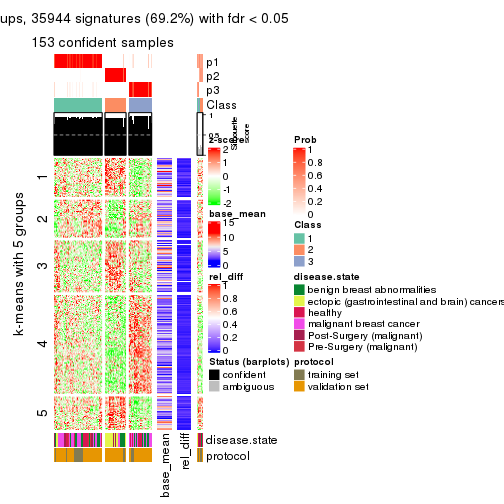</p>

</div>
<div id='tab-ATC-kmeans-get-signatures-3'>
<pre><code class="r">get_signatures(res, k = 4)
</code></pre>

<p></p>

</div>
<div id='tab-ATC-kmeans-get-signatures-4'>
<pre><code class="r">get_signatures(res, k = 5)
</code></pre>

<p>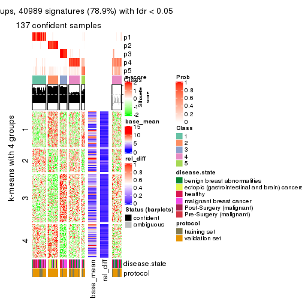</p>

</div>
<div id='tab-ATC-kmeans-get-signatures-5'>
<pre><code class="r">get_signatures(res, k = 6)
</code></pre>

<p></p>

</div>
</div>


Signature heatmaps where rows are not scaled:


<script>
$( function() {
	$( '#tabs-ATC-kmeans-get-signatures-no-scale' ).tabs();
} );
</script>
<div id='tabs-ATC-kmeans-get-signatures-no-scale'>
<ul>
<li><a href='#tab-ATC-kmeans-get-signatures-no-scale-1'>k = 2</a></li>
<li><a href='#tab-ATC-kmeans-get-signatures-no-scale-2'>k = 3</a></li>
<li><a href='#tab-ATC-kmeans-get-signatures-no-scale-3'>k = 4</a></li>
<li><a href='#tab-ATC-kmeans-get-signatures-no-scale-4'>k = 5</a></li>
<li><a href='#tab-ATC-kmeans-get-signatures-no-scale-5'>k = 6</a></li>
</ul>
<div id='tab-ATC-kmeans-get-signatures-no-scale-1'>
<pre><code class="r">get_signatures(res, k = 2, scale_rows = FALSE)
</code></pre>

<p></p>

</div>
<div id='tab-ATC-kmeans-get-signatures-no-scale-2'>
<pre><code class="r">get_signatures(res, k = 3, scale_rows = FALSE)
</code></pre>

<p></p>

</div>
<div id='tab-ATC-kmeans-get-signatures-no-scale-3'>
<pre><code class="r">get_signatures(res, k = 4, scale_rows = FALSE)
</code></pre>

<p></p>

</div>
<div id='tab-ATC-kmeans-get-signatures-no-scale-4'>
<pre><code class="r">get_signatures(res, k = 5, scale_rows = FALSE)
</code></pre>

<p></p>

</div>
<div id='tab-ATC-kmeans-get-signatures-no-scale-5'>
<pre><code class="r">get_signatures(res, k = 6, scale_rows = FALSE)
</code></pre>

<p></p>

</div>
</div>


Compare the overlap of signatures from different k:

```r
compare_signatures(res)
```


`get_signature()` returns a data frame invisibly. TO get the list of signatures, the function
call should be assigned to a variable explicitly. In following code, if `plot` argument is set
to `FALSE`, no heatmap is plotted while only the differential analysis is performed.

```r
# code only for demonstration
tb = get_signature(res, k = ..., plot = FALSE)
```

An example of the output of `tb` is:

```
#>   which_row         fdr    mean_1    mean_2 scaled_mean_1 scaled_mean_2 km
#> 1        38 0.042760348  8.373488  9.131774    -0.5533452     0.5164555  1
#> 2        40 0.018707592  7.106213  8.469186    -0.6173731     0.5762149  1
#> 3        55 0.019134737 10.221463 11.207825    -0.6159697     0.5749050  1
#> 4        59 0.006059896  5.921854  7.869574    -0.6899429     0.6439467  1
#> 5        60 0.018055526  8.928898 10.211722    -0.6204761     0.5791110  1
#> 6        98 0.009384629 15.714769 14.887706     0.6635654    -0.6193277  2
...
```

The columns in `tb` are:

1. `which_row`: row indices corresponding to the input matrix.
2. `fdr`: FDR for the differential test. 
3. `mean_x`: The mean value in group x.
4. `scaled_mean_x`: The mean value in group x after rows are scaled.
5. `km`: Row groups if k-means clustering is applied to rows.


UMAP plot which shows how samples are separated.


<script>
$( function() {
	$( '#tabs-ATC-kmeans-dimension-reduction' ).tabs();
} );
</script>
<div id='tabs-ATC-kmeans-dimension-reduction'>
<ul>
<li><a href='#tab-ATC-kmeans-dimension-reduction-1'>k = 2</a></li>
<li><a href='#tab-ATC-kmeans-dimension-reduction-2'>k = 3</a></li>
<li><a href='#tab-ATC-kmeans-dimension-reduction-3'>k = 4</a></li>
<li><a href='#tab-ATC-kmeans-dimension-reduction-4'>k = 5</a></li>
<li><a href='#tab-ATC-kmeans-dimension-reduction-5'>k = 6</a></li>
</ul>
<div id='tab-ATC-kmeans-dimension-reduction-1'>
<pre><code class="r">dimension_reduction(res, k = 2, method = &quot;UMAP&quot;)
</code></pre>

<p></p>

</div>
<div id='tab-ATC-kmeans-dimension-reduction-2'>
<pre><code class="r">dimension_reduction(res, k = 3, method = &quot;UMAP&quot;)
</code></pre>

<p></p>

</div>
<div id='tab-ATC-kmeans-dimension-reduction-3'>
<pre><code class="r">dimension_reduction(res, k = 4, method = &quot;UMAP&quot;)
</code></pre>

<p></p>

</div>
<div id='tab-ATC-kmeans-dimension-reduction-4'>
<pre><code class="r">dimension_reduction(res, k = 5, method = &quot;UMAP&quot;)
</code></pre>

<p></p>

</div>
<div id='tab-ATC-kmeans-dimension-reduction-5'>
<pre><code class="r">dimension_reduction(res, k = 6, method = &quot;UMAP&quot;)
</code></pre>

<p></p>

</div>
</div>


Following heatmap shows how subgroups are split when increasing `k`:

```r
collect_classes(res)
```


Test correlation between subgroups and known annotations. If the known
annotation is numeric, one-way ANOVA test is applied, and if the known
annotation is discrete, chi-squared contingency table test is applied.

```r
test_to_known_factors(res)
```

```
#>              n disease.state(p) protocol(p) k
#> ATC:kmeans 160         3.83e-09    0.294193 2
#> ATC:kmeans 153         8.46e-13    0.085631 3
#> ATC:kmeans 157         3.04e-16    0.000628 4
#> ATC:kmeans 137         4.36e-12    0.006810 5
#> ATC:kmeans 116         1.24e-10    0.002388 6
```


If matrix rows can be associated to genes, consider to use `GO_Enrichment(res,
...)` to perform function enrichment for the signature genes.


 

---------------------------------------------------


### ATC:skmeans**


The object with results only for a single top-value method and a single partition method 
can be extracted as:

```r
res = res_list["ATC", "skmeans"]
# you can also extract it by
# res = res_list["ATC:skmeans"]
```

A summary of `res` and all the functions that can be applied to it:

```r
res
```

```
#> A 'ConsensusPartition' object with k = 2, 3, 4, 5, 6.
#>   On a matrix with 51941 rows and 162 columns.
#>   Top rows (1000, 2000, 3000, 4000, 5000) are extracted by 'ATC' method.
#>   Subgroups are detected by 'skmeans' method.
#>   Performed in total 1250 partitions by row resampling.
#>   Best k for subgroups seems to be 3.
#> 
#> Following methods can be applied to this 'ConsensusPartition' object:
#>  [1] "cola_report"             "collect_classes"         "collect_plots"          
#>  [4] "collect_stats"           "colnames"                "compare_signatures"     
#>  [7] "consensus_heatmap"       "dimension_reduction"     "functional_enrichment"  
#> [10] "get_anno_col"            "get_anno"                "get_classes"            
#> [13] "get_consensus"           "get_matrix"              "get_membership"         
#> [16] "get_param"               "get_signatures"          "get_stats"              
#> [19] "is_best_k"               "is_stable_k"             "membership_heatmap"     
#> [22] "ncol"                    "nrow"                    "plot_ecdf"              
#> [25] "rownames"                "select_partition_number" "show"                   
#> [28] "suggest_best_k"          "test_to_known_factors"
```

`collect_plots()` function collects all the plots made from `res` for all `k` (number of partitions)
into one single page to provide an easy and fast comparison between different `k`.

```r
collect_plots(res)
```


The plots are:

- The first row: a plot of the ECDF (Empirical cumulative distribution
  function) curves of the consensus matrix for each `k` and the heatmap of
  predicted classes for each `k`.
- The second row: heatmaps of the consensus matrix for each `k`.
- The third row: heatmaps of the membership matrix for each `k`.
- The fouth row: heatmaps of the signatures for each `k`.

All the plots in panels can be made by individual functions and they are
plotted later in this section.

`select_partition_number()` produces several plots showing different
statistics for choosing "optimized" `k`. There are following statistics:

- ECDF curves of the consensus matrix for each `k`;
- 1-PAC. [The PAC
  score](https://en.wikipedia.org/wiki/Consensus_clustering#Over-interpretation_potential_of_consensus_clustering)
  measures the proportion of the ambiguous subgrouping.
- Mean silhouette score.
- Concordance. The mean probability of fiting the consensus class ids in all
  partitions.
- Area increased. Denote $A_k$ as the area under the ECDF curve for current
  `k`, the area increased is defined as $A_k - A_{k-1}$.
- Rand index. The percent of pairs of samples that are both in a same cluster
  or both are not in a same cluster in the partition of k and k-1.
- Jaccard index. The ratio of pairs of samples are both in a same cluster in
  the partition of k and k-1 and the pairs of samples are both in a same
  cluster in the partition k or k-1.

The detailed explanations of these statistics can be found in [the cola
vignette](http://bioconductor.org/packages/devel/bioc/vignettes/cola/inst/doc/cola.html#toc_13).

Generally speaking, lower PAC score, higher mean silhouette score or higher
concordance corresponds to better partition. Rand index and Jaccard index
measure how similar the current partition is compared to partition with `k-1`.
If they are too similar, we won't accept `k` is better than `k-1`.

```r
select_partition_number(res)
```


The numeric values for all these statistics can be obtained by `get_stats()`.

```r
get_stats(res)
```

```
#>   k 1-PAC mean_silhouette concordance area_increased  Rand Jaccard
#> 2 2 1.000           0.990       0.996         0.5013 0.499   0.499
#> 3 3 0.961           0.942       0.972         0.2627 0.830   0.671
#> 4 4 0.769           0.754       0.887         0.1347 0.898   0.731
#> 5 5 0.720           0.692       0.848         0.0487 0.945   0.816
#> 6 6 0.761           0.643       0.825         0.0408 0.941   0.773
```

`suggest_best_k()` suggests the best $k$ based on these statistics. The rules are as follows:

- All $k$ with Jaccard index larger than 0.95 are removed because the increase of
  the partition number does not provides enough extra information. If all $k$ are removed,
  the best $k$ is assigned by `NA`.
- For $k$ with 1-PAC larger than 0.9, the maximal $k$ is taken as the "best k". Other $k$ is called "optional k".
- If it does not fit the second rule. The $k$ with the highest vote of highest
  1-PAC, mean silhouette and concordance is taken as the "best k".

```r
suggest_best_k(res)
```

```
#> [1] 3
#> attr(,"optional")
#> [1] 2
```

There is also optional best $k$ = 2 that is worth to check.

Following shows the table of the partitions (You need to click the **show/hide
code output** link to see it). The membership matrix (columns with name `p*`)
is inferred by
[`clue::cl_consensus()`](https://www.rdocumentation.org/link/cl_consensus?package=clue)
function with the `SE` method. Basically the value in the membership matrix
represents the probability to belong to a certain group. The finall class
label for an item is determined with the group with highest probability it
belongs to.

In `get_classes()` function, the entropy is calculated from the membership
matrix and the silhouette score is calculated from the consensus matrix.


<script>
$( function() {
	$( '#tabs-ATC-skmeans-get-classes' ).tabs();
} );
</script>
<div id='tabs-ATC-skmeans-get-classes'>
<ul>
<li><a href='#tab-ATC-skmeans-get-classes-1'>k = 2</a></li>
<li><a href='#tab-ATC-skmeans-get-classes-2'>k = 3</a></li>
<li><a href='#tab-ATC-skmeans-get-classes-3'>k = 4</a></li>
<li><a href='#tab-ATC-skmeans-get-classes-4'>k = 5</a></li>
<li><a href='#tab-ATC-skmeans-get-classes-5'>k = 6</a></li>
</ul>

<div id='tab-ATC-skmeans-get-classes-1'>
<p><a id='tab-ATC-skmeans-get-classes-1-a' style='color:#0366d6' href='#'>show/hide code output</a></p>
<pre><code class="r">cbind(get_classes(res, k = 2), get_membership(res, k = 2))
</code></pre>

<pre><code>#&gt;           class entropy silhouette    p1    p2
#&gt; GSM682002     2  0.0000      0.992 0.000 1.000
#&gt; GSM682003     1  0.0000      0.999 1.000 0.000
#&gt; GSM682004     2  0.0000      0.992 0.000 1.000
#&gt; GSM682005     2  0.0000      0.992 0.000 1.000
#&gt; GSM682006     2  0.0000      0.992 0.000 1.000
#&gt; GSM682007     1  0.0000      0.999 1.000 0.000
#&gt; GSM682008     1  0.0000      0.999 1.000 0.000
#&gt; GSM682009     1  0.0000      0.999 1.000 0.000
#&gt; GSM682010     1  0.0000      0.999 1.000 0.000
#&gt; GSM682011     2  0.0000      0.992 0.000 1.000
#&gt; GSM682096     2  0.0000      0.992 0.000 1.000
#&gt; GSM682097     1  0.1414      0.979 0.980 0.020
#&gt; GSM682098     2  0.0000      0.992 0.000 1.000
#&gt; GSM682099     2  0.0000      0.992 0.000 1.000
#&gt; GSM682100     2  0.0000      0.992 0.000 1.000
#&gt; GSM682101     2  0.0000      0.992 0.000 1.000
#&gt; GSM682102     2  0.0000      0.992 0.000 1.000
#&gt; GSM682103     1  0.0000      0.999 1.000 0.000
#&gt; GSM682104     1  0.0000      0.999 1.000 0.000
#&gt; GSM682105     1  0.0000      0.999 1.000 0.000
#&gt; GSM682106     1  0.0000      0.999 1.000 0.000
#&gt; GSM682107     1  0.0000      0.999 1.000 0.000
#&gt; GSM682108     1  0.0000      0.999 1.000 0.000
#&gt; GSM682109     1  0.0000      0.999 1.000 0.000
#&gt; GSM682110     1  0.0000      0.999 1.000 0.000
#&gt; GSM682111     1  0.0000      0.999 1.000 0.000
#&gt; GSM682112     1  0.0000      0.999 1.000 0.000
#&gt; GSM682113     1  0.0000      0.999 1.000 0.000
#&gt; GSM682114     1  0.0000      0.999 1.000 0.000
#&gt; GSM682115     2  0.0000      0.992 0.000 1.000
#&gt; GSM682116     1  0.1184      0.983 0.984 0.016
#&gt; GSM682117     1  0.0000      0.999 1.000 0.000
#&gt; GSM682118     1  0.0000      0.999 1.000 0.000
#&gt; GSM682119     1  0.0000      0.999 1.000 0.000
#&gt; GSM682120     1  0.0000      0.999 1.000 0.000
#&gt; GSM682121     1  0.0000      0.999 1.000 0.000
#&gt; GSM682122     1  0.0000      0.999 1.000 0.000
#&gt; GSM682012     2  0.0000      0.992 0.000 1.000
#&gt; GSM682013     2  0.0000      0.992 0.000 1.000
#&gt; GSM682014     2  0.0000      0.992 0.000 1.000
#&gt; GSM682015     2  0.0000      0.992 0.000 1.000
#&gt; GSM682016     1  0.0000      0.999 1.000 0.000
#&gt; GSM682017     2  0.0000      0.992 0.000 1.000
#&gt; GSM682018     2  0.0000      0.992 0.000 1.000
#&gt; GSM682019     2  0.0000      0.992 0.000 1.000
#&gt; GSM682020     2  0.0000      0.992 0.000 1.000
#&gt; GSM682021     2  0.0000      0.992 0.000 1.000
#&gt; GSM682022     2  0.0000      0.992 0.000 1.000
#&gt; GSM682023     2  0.0000      0.992 0.000 1.000
#&gt; GSM682024     2  0.0000      0.992 0.000 1.000
#&gt; GSM682025     2  0.0000      0.992 0.000 1.000
#&gt; GSM682026     2  0.0000      0.992 0.000 1.000
#&gt; GSM682027     2  0.0000      0.992 0.000 1.000
#&gt; GSM682028     2  0.0000      0.992 0.000 1.000
#&gt; GSM682029     2  0.0000      0.992 0.000 1.000
#&gt; GSM682030     2  0.0000      0.992 0.000 1.000
#&gt; GSM682031     2  0.0000      0.992 0.000 1.000
#&gt; GSM682032     2  0.0000      0.992 0.000 1.000
#&gt; GSM682033     2  0.0000      0.992 0.000 1.000
#&gt; GSM681992     2  0.0000      0.992 0.000 1.000
#&gt; GSM681993     1  0.0000      0.999 1.000 0.000
#&gt; GSM681994     2  0.0000      0.992 0.000 1.000
#&gt; GSM681995     2  0.0000      0.992 0.000 1.000
#&gt; GSM681996     1  0.0000      0.999 1.000 0.000
#&gt; GSM681997     1  0.0000      0.999 1.000 0.000
#&gt; GSM681998     1  0.0000      0.999 1.000 0.000
#&gt; GSM681999     1  0.0000      0.999 1.000 0.000
#&gt; GSM682000     2  0.0000      0.992 0.000 1.000
#&gt; GSM682001     2  0.0000      0.992 0.000 1.000
#&gt; GSM682055     2  0.9661      0.357 0.392 0.608
#&gt; GSM682056     2  0.0000      0.992 0.000 1.000
#&gt; GSM682057     2  0.0000      0.992 0.000 1.000
#&gt; GSM682058     2  0.0000      0.992 0.000 1.000
#&gt; GSM682059     2  0.0000      0.992 0.000 1.000
#&gt; GSM682060     1  0.0000      0.999 1.000 0.000
#&gt; GSM682061     1  0.0000      0.999 1.000 0.000
#&gt; GSM682062     2  0.0000      0.992 0.000 1.000
#&gt; GSM682063     2  0.0000      0.992 0.000 1.000
#&gt; GSM682064     2  0.0000      0.992 0.000 1.000
#&gt; GSM682065     2  0.0000      0.992 0.000 1.000
#&gt; GSM682066     2  0.0000      0.992 0.000 1.000
#&gt; GSM682067     1  0.0000      0.999 1.000 0.000
#&gt; GSM682068     2  0.0000      0.992 0.000 1.000
#&gt; GSM682069     1  0.0000      0.999 1.000 0.000
#&gt; GSM682070     1  0.0000      0.999 1.000 0.000
#&gt; GSM682071     1  0.0000      0.999 1.000 0.000
#&gt; GSM682072     1  0.0000      0.999 1.000 0.000
#&gt; GSM682073     1  0.0000      0.999 1.000 0.000
#&gt; GSM682074     1  0.0000      0.999 1.000 0.000
#&gt; GSM682075     2  0.0000      0.992 0.000 1.000
#&gt; GSM682076     1  0.0000      0.999 1.000 0.000
#&gt; GSM682077     1  0.0000      0.999 1.000 0.000
#&gt; GSM682078     1  0.0000      0.999 1.000 0.000
#&gt; GSM682079     1  0.0000      0.999 1.000 0.000
#&gt; GSM682080     1  0.0000      0.999 1.000 0.000
#&gt; GSM682081     1  0.0000      0.999 1.000 0.000
#&gt; GSM682082     1  0.0000      0.999 1.000 0.000
#&gt; GSM682083     2  0.0000      0.992 0.000 1.000
#&gt; GSM682084     1  0.0000      0.999 1.000 0.000
#&gt; GSM682085     1  0.0000      0.999 1.000 0.000
#&gt; GSM682086     2  0.0376      0.989 0.004 0.996
#&gt; GSM682087     1  0.0000      0.999 1.000 0.000
#&gt; GSM682088     1  0.0000      0.999 1.000 0.000
#&gt; GSM682089     1  0.0000      0.999 1.000 0.000
#&gt; GSM682090     1  0.0000      0.999 1.000 0.000
#&gt; GSM682091     1  0.0000      0.999 1.000 0.000
#&gt; GSM682092     1  0.0000      0.999 1.000 0.000
#&gt; GSM682093     1  0.0000      0.999 1.000 0.000
#&gt; GSM682094     1  0.0000      0.999 1.000 0.000
#&gt; GSM682095     1  0.0000      0.999 1.000 0.000
#&gt; GSM681982     1  0.0000      0.999 1.000 0.000
#&gt; GSM681983     2  0.0000      0.992 0.000 1.000
#&gt; GSM681984     1  0.0000      0.999 1.000 0.000
#&gt; GSM681985     1  0.0000      0.999 1.000 0.000
#&gt; GSM681986     1  0.0000      0.999 1.000 0.000
#&gt; GSM681987     1  0.0000      0.999 1.000 0.000
#&gt; GSM681988     1  0.0000      0.999 1.000 0.000
#&gt; GSM681989     1  0.0000      0.999 1.000 0.000
#&gt; GSM681990     1  0.0000      0.999 1.000 0.000
#&gt; GSM681991     1  0.2778      0.949 0.952 0.048
#&gt; GSM682034     2  0.0672      0.985 0.008 0.992
#&gt; GSM682035     1  0.0000      0.999 1.000 0.000
#&gt; GSM682036     1  0.0000      0.999 1.000 0.000
#&gt; GSM682037     2  0.0000      0.992 0.000 1.000
#&gt; GSM682038     1  0.0000      0.999 1.000 0.000
#&gt; GSM682039     1  0.0000      0.999 1.000 0.000
#&gt; GSM682040     1  0.0000      0.999 1.000 0.000
#&gt; GSM682041     1  0.0000      0.999 1.000 0.000
#&gt; GSM682042     1  0.0000      0.999 1.000 0.000
#&gt; GSM682043     1  0.0000      0.999 1.000 0.000
#&gt; GSM682044     1  0.0000      0.999 1.000 0.000
#&gt; GSM682045     1  0.0000      0.999 1.000 0.000
#&gt; GSM682046     2  0.0000      0.992 0.000 1.000
#&gt; GSM682047     1  0.0000      0.999 1.000 0.000
#&gt; GSM682048     1  0.0000      0.999 1.000 0.000
#&gt; GSM682049     1  0.0000      0.999 1.000 0.000
#&gt; GSM682050     2  0.0000      0.992 0.000 1.000
#&gt; GSM682051     1  0.0000      0.999 1.000 0.000
#&gt; GSM682052     1  0.0000      0.999 1.000 0.000
#&gt; GSM682053     1  0.0000      0.999 1.000 0.000
#&gt; GSM682054     2  0.0000      0.992 0.000 1.000
#&gt; GSM682123     2  0.0000      0.992 0.000 1.000
#&gt; GSM682124     2  0.0000      0.992 0.000 1.000
#&gt; GSM682125     2  0.0376      0.989 0.004 0.996
#&gt; GSM682126     2  0.0000      0.992 0.000 1.000
#&gt; GSM682127     2  0.6623      0.791 0.172 0.828
#&gt; GSM682128     2  0.0000      0.992 0.000 1.000
#&gt; GSM682129     2  0.0000      0.992 0.000 1.000
#&gt; GSM682130     2  0.0000      0.992 0.000 1.000
#&gt; GSM682131     2  0.0000      0.992 0.000 1.000
#&gt; GSM682132     2  0.0000      0.992 0.000 1.000
#&gt; GSM682133     2  0.0000      0.992 0.000 1.000
#&gt; GSM682134     2  0.0000      0.992 0.000 1.000
#&gt; GSM682135     2  0.0000      0.992 0.000 1.000
#&gt; GSM682136     2  0.0000      0.992 0.000 1.000
#&gt; GSM682137     2  0.0000      0.992 0.000 1.000
#&gt; GSM682138     1  0.0000      0.999 1.000 0.000
#&gt; GSM682139     2  0.0000      0.992 0.000 1.000
#&gt; GSM682140     1  0.0000      0.999 1.000 0.000
#&gt; GSM682141     2  0.0000      0.992 0.000 1.000
#&gt; GSM682142     2  0.0000      0.992 0.000 1.000
#&gt; GSM682143     1  0.0000      0.999 1.000 0.000
</code></pre>

<script>
$('#tab-ATC-skmeans-get-classes-1-a').parent().next().next().hide();
$('#tab-ATC-skmeans-get-classes-1-a').click(function(){
  $('#tab-ATC-skmeans-get-classes-1-a').parent().next().next().toggle();
  return(false);
});
</script>
</div>

<div id='tab-ATC-skmeans-get-classes-2'>
<p><a id='tab-ATC-skmeans-get-classes-2-a' style='color:#0366d6' href='#'>show/hide code output</a></p>
<pre><code class="r">cbind(get_classes(res, k = 3), get_membership(res, k = 3))
</code></pre>

<pre><code>#&gt;           class entropy silhouette    p1    p2    p3
#&gt; GSM682002     1  0.2537     0.9142 0.920 0.080 0.000
#&gt; GSM682003     3  0.0000     0.9821 0.000 0.000 1.000
#&gt; GSM682004     2  0.0000     0.9845 0.000 1.000 0.000
#&gt; GSM682005     2  0.0000     0.9845 0.000 1.000 0.000
#&gt; GSM682006     2  0.0000     0.9845 0.000 1.000 0.000
#&gt; GSM682007     3  0.0000     0.9821 0.000 0.000 1.000
#&gt; GSM682008     3  0.0000     0.9821 0.000 0.000 1.000
#&gt; GSM682009     3  0.0000     0.9821 0.000 0.000 1.000
#&gt; GSM682010     3  0.0000     0.9821 0.000 0.000 1.000
#&gt; GSM682011     2  0.0000     0.9845 0.000 1.000 0.000
#&gt; GSM682096     2  0.0000     0.9845 0.000 1.000 0.000
#&gt; GSM682097     2  0.6309    -0.0146 0.000 0.500 0.500
#&gt; GSM682098     2  0.0000     0.9845 0.000 1.000 0.000
#&gt; GSM682099     2  0.0000     0.9845 0.000 1.000 0.000
#&gt; GSM682100     2  0.0000     0.9845 0.000 1.000 0.000
#&gt; GSM682101     2  0.0000     0.9845 0.000 1.000 0.000
#&gt; GSM682102     1  0.2625     0.9124 0.916 0.084 0.000
#&gt; GSM682103     3  0.0000     0.9821 0.000 0.000 1.000
#&gt; GSM682104     3  0.0000     0.9821 0.000 0.000 1.000
#&gt; GSM682105     3  0.0000     0.9821 0.000 0.000 1.000
#&gt; GSM682106     3  0.0000     0.9821 0.000 0.000 1.000
#&gt; GSM682107     1  0.5497     0.5972 0.708 0.000 0.292
#&gt; GSM682108     3  0.0000     0.9821 0.000 0.000 1.000
#&gt; GSM682109     3  0.0000     0.9821 0.000 0.000 1.000
#&gt; GSM682110     3  0.0000     0.9821 0.000 0.000 1.000
#&gt; GSM682111     3  0.0000     0.9821 0.000 0.000 1.000
#&gt; GSM682112     3  0.0000     0.9821 0.000 0.000 1.000
#&gt; GSM682113     3  0.0000     0.9821 0.000 0.000 1.000
#&gt; GSM682114     3  0.0000     0.9821 0.000 0.000 1.000
#&gt; GSM682115     1  0.0000     0.9263 1.000 0.000 0.000
#&gt; GSM682116     1  0.0000     0.9263 1.000 0.000 0.000
#&gt; GSM682117     3  0.0000     0.9821 0.000 0.000 1.000
#&gt; GSM682118     3  0.0000     0.9821 0.000 0.000 1.000
#&gt; GSM682119     3  0.0000     0.9821 0.000 0.000 1.000
#&gt; GSM682120     3  0.0000     0.9821 0.000 0.000 1.000
#&gt; GSM682121     3  0.1643     0.9437 0.044 0.000 0.956
#&gt; GSM682122     3  0.0000     0.9821 0.000 0.000 1.000
#&gt; GSM682012     2  0.0000     0.9845 0.000 1.000 0.000
#&gt; GSM682013     2  0.0000     0.9845 0.000 1.000 0.000
#&gt; GSM682014     2  0.0000     0.9845 0.000 1.000 0.000
#&gt; GSM682015     2  0.0000     0.9845 0.000 1.000 0.000
#&gt; GSM682016     3  0.0000     0.9821 0.000 0.000 1.000
#&gt; GSM682017     2  0.0000     0.9845 0.000 1.000 0.000
#&gt; GSM682018     2  0.0000     0.9845 0.000 1.000 0.000
#&gt; GSM682019     2  0.0000     0.9845 0.000 1.000 0.000
#&gt; GSM682020     2  0.0000     0.9845 0.000 1.000 0.000
#&gt; GSM682021     2  0.0000     0.9845 0.000 1.000 0.000
#&gt; GSM682022     2  0.0000     0.9845 0.000 1.000 0.000
#&gt; GSM682023     2  0.0000     0.9845 0.000 1.000 0.000
#&gt; GSM682024     2  0.0000     0.9845 0.000 1.000 0.000
#&gt; GSM682025     2  0.0000     0.9845 0.000 1.000 0.000
#&gt; GSM682026     2  0.0000     0.9845 0.000 1.000 0.000
#&gt; GSM682027     2  0.0000     0.9845 0.000 1.000 0.000
#&gt; GSM682028     2  0.0000     0.9845 0.000 1.000 0.000
#&gt; GSM682029     2  0.0000     0.9845 0.000 1.000 0.000
#&gt; GSM682030     2  0.0000     0.9845 0.000 1.000 0.000
#&gt; GSM682031     2  0.0000     0.9845 0.000 1.000 0.000
#&gt; GSM682032     2  0.0000     0.9845 0.000 1.000 0.000
#&gt; GSM682033     2  0.0000     0.9845 0.000 1.000 0.000
#&gt; GSM681992     2  0.0000     0.9845 0.000 1.000 0.000
#&gt; GSM681993     3  0.0000     0.9821 0.000 0.000 1.000
#&gt; GSM681994     1  0.1163     0.9246 0.972 0.028 0.000
#&gt; GSM681995     1  0.0892     0.9254 0.980 0.020 0.000
#&gt; GSM681996     3  0.0000     0.9821 0.000 0.000 1.000
#&gt; GSM681997     3  0.0000     0.9821 0.000 0.000 1.000
#&gt; GSM681998     3  0.0000     0.9821 0.000 0.000 1.000
#&gt; GSM681999     3  0.0000     0.9821 0.000 0.000 1.000
#&gt; GSM682000     2  0.0000     0.9845 0.000 1.000 0.000
#&gt; GSM682001     2  0.0000     0.9845 0.000 1.000 0.000
#&gt; GSM682055     2  0.0000     0.9845 0.000 1.000 0.000
#&gt; GSM682056     2  0.0000     0.9845 0.000 1.000 0.000
#&gt; GSM682057     2  0.0000     0.9845 0.000 1.000 0.000
#&gt; GSM682058     2  0.0000     0.9845 0.000 1.000 0.000
#&gt; GSM682059     2  0.0000     0.9845 0.000 1.000 0.000
#&gt; GSM682060     3  0.0000     0.9821 0.000 0.000 1.000
#&gt; GSM682061     3  0.0000     0.9821 0.000 0.000 1.000
#&gt; GSM682062     2  0.0000     0.9845 0.000 1.000 0.000
#&gt; GSM682063     2  0.0000     0.9845 0.000 1.000 0.000
#&gt; GSM682064     1  0.4887     0.7781 0.772 0.228 0.000
#&gt; GSM682065     1  0.0000     0.9263 1.000 0.000 0.000
#&gt; GSM682066     1  0.2796     0.9074 0.908 0.092 0.000
#&gt; GSM682067     3  0.0000     0.9821 0.000 0.000 1.000
#&gt; GSM682068     1  0.4399     0.8246 0.812 0.188 0.000
#&gt; GSM682069     3  0.0000     0.9821 0.000 0.000 1.000
#&gt; GSM682070     3  0.0000     0.9821 0.000 0.000 1.000
#&gt; GSM682071     3  0.0000     0.9821 0.000 0.000 1.000
#&gt; GSM682072     3  0.0000     0.9821 0.000 0.000 1.000
#&gt; GSM682073     3  0.0000     0.9821 0.000 0.000 1.000
#&gt; GSM682074     3  0.0000     0.9821 0.000 0.000 1.000
#&gt; GSM682075     1  0.2165     0.9183 0.936 0.064 0.000
#&gt; GSM682076     3  0.0000     0.9821 0.000 0.000 1.000
#&gt; GSM682077     3  0.0000     0.9821 0.000 0.000 1.000
#&gt; GSM682078     3  0.0000     0.9821 0.000 0.000 1.000
#&gt; GSM682079     3  0.0000     0.9821 0.000 0.000 1.000
#&gt; GSM682080     3  0.0000     0.9821 0.000 0.000 1.000
#&gt; GSM682081     3  0.0000     0.9821 0.000 0.000 1.000
#&gt; GSM682082     3  0.0000     0.9821 0.000 0.000 1.000
#&gt; GSM682083     1  0.0000     0.9263 1.000 0.000 0.000
#&gt; GSM682084     3  0.0000     0.9821 0.000 0.000 1.000
#&gt; GSM682085     3  0.0000     0.9821 0.000 0.000 1.000
#&gt; GSM682086     1  0.0000     0.9263 1.000 0.000 0.000
#&gt; GSM682087     3  0.0000     0.9821 0.000 0.000 1.000
#&gt; GSM682088     3  0.0000     0.9821 0.000 0.000 1.000
#&gt; GSM682089     3  0.0000     0.9821 0.000 0.000 1.000
#&gt; GSM682090     3  0.0000     0.9821 0.000 0.000 1.000
#&gt; GSM682091     3  0.0000     0.9821 0.000 0.000 1.000
#&gt; GSM682092     3  0.3038     0.8830 0.104 0.000 0.896
#&gt; GSM682093     3  0.0000     0.9821 0.000 0.000 1.000
#&gt; GSM682094     3  0.5497     0.5767 0.292 0.000 0.708
#&gt; GSM682095     3  0.0000     0.9821 0.000 0.000 1.000
#&gt; GSM681982     3  0.0000     0.9821 0.000 0.000 1.000
#&gt; GSM681983     1  0.6008     0.5279 0.628 0.372 0.000
#&gt; GSM681984     3  0.0000     0.9821 0.000 0.000 1.000
#&gt; GSM681985     3  0.0000     0.9821 0.000 0.000 1.000
#&gt; GSM681986     3  0.0000     0.9821 0.000 0.000 1.000
#&gt; GSM681987     3  0.0000     0.9821 0.000 0.000 1.000
#&gt; GSM681988     3  0.0000     0.9821 0.000 0.000 1.000
#&gt; GSM681989     3  0.3482     0.8471 0.000 0.128 0.872
#&gt; GSM681990     3  0.0000     0.9821 0.000 0.000 1.000
#&gt; GSM681991     3  0.6204     0.2718 0.000 0.424 0.576
#&gt; GSM682034     1  0.0000     0.9263 1.000 0.000 0.000
#&gt; GSM682035     1  0.1860     0.8920 0.948 0.000 0.052
#&gt; GSM682036     3  0.0000     0.9821 0.000 0.000 1.000
#&gt; GSM682037     1  0.0000     0.9263 1.000 0.000 0.000
#&gt; GSM682038     3  0.0000     0.9821 0.000 0.000 1.000
#&gt; GSM682039     3  0.0000     0.9821 0.000 0.000 1.000
#&gt; GSM682040     3  0.0000     0.9821 0.000 0.000 1.000
#&gt; GSM682041     3  0.0000     0.9821 0.000 0.000 1.000
#&gt; GSM682042     3  0.0000     0.9821 0.000 0.000 1.000
#&gt; GSM682043     1  0.0000     0.9263 1.000 0.000 0.000
#&gt; GSM682044     1  0.0000     0.9263 1.000 0.000 0.000
#&gt; GSM682045     3  0.5363     0.6083 0.276 0.000 0.724
#&gt; GSM682046     1  0.2537     0.9142 0.920 0.080 0.000
#&gt; GSM682047     3  0.0000     0.9821 0.000 0.000 1.000
#&gt; GSM682048     3  0.0000     0.9821 0.000 0.000 1.000
#&gt; GSM682049     3  0.2537     0.9093 0.080 0.000 0.920
#&gt; GSM682050     1  0.2537     0.9142 0.920 0.080 0.000
#&gt; GSM682051     3  0.0000     0.9821 0.000 0.000 1.000
#&gt; GSM682052     3  0.0000     0.9821 0.000 0.000 1.000
#&gt; GSM682053     3  0.0000     0.9821 0.000 0.000 1.000
#&gt; GSM682054     1  0.0000     0.9263 1.000 0.000 0.000
#&gt; GSM682123     1  0.0000     0.9263 1.000 0.000 0.000
#&gt; GSM682124     1  0.4555     0.8121 0.800 0.200 0.000
#&gt; GSM682125     1  0.0000     0.9263 1.000 0.000 0.000
#&gt; GSM682126     1  0.0000     0.9263 1.000 0.000 0.000
#&gt; GSM682127     1  0.0000     0.9263 1.000 0.000 0.000
#&gt; GSM682128     1  0.2537     0.9142 0.920 0.080 0.000
#&gt; GSM682129     2  0.0000     0.9845 0.000 1.000 0.000
#&gt; GSM682130     2  0.0000     0.9845 0.000 1.000 0.000
#&gt; GSM682131     2  0.0000     0.9845 0.000 1.000 0.000
#&gt; GSM682132     1  0.4796     0.7884 0.780 0.220 0.000
#&gt; GSM682133     1  0.2537     0.9142 0.920 0.080 0.000
#&gt; GSM682134     1  0.0000     0.9263 1.000 0.000 0.000
#&gt; GSM682135     1  0.2625     0.9124 0.916 0.084 0.000
#&gt; GSM682136     1  0.2625     0.9124 0.916 0.084 0.000
#&gt; GSM682137     1  0.0000     0.9263 1.000 0.000 0.000
#&gt; GSM682138     3  0.0000     0.9821 0.000 0.000 1.000
#&gt; GSM682139     1  0.2625     0.9124 0.916 0.084 0.000
#&gt; GSM682140     1  0.1643     0.8981 0.956 0.000 0.044
#&gt; GSM682141     1  0.4555     0.8121 0.800 0.200 0.000
#&gt; GSM682142     1  0.0000     0.9263 1.000 0.000 0.000
#&gt; GSM682143     3  0.0000     0.9821 0.000 0.000 1.000
</code></pre>

<script>
$('#tab-ATC-skmeans-get-classes-2-a').parent().next().next().hide();
$('#tab-ATC-skmeans-get-classes-2-a').click(function(){
  $('#tab-ATC-skmeans-get-classes-2-a').parent().next().next().toggle();
  return(false);
});
</script>
</div>

<div id='tab-ATC-skmeans-get-classes-3'>
<p><a id='tab-ATC-skmeans-get-classes-3-a' style='color:#0366d6' href='#'>show/hide code output</a></p>
<pre><code class="r">cbind(get_classes(res, k = 4), get_membership(res, k = 4))
</code></pre>

<pre><code>#&gt;           class entropy silhouette    p1    p2    p3    p4
#&gt; GSM682002     1  0.1022    0.91094 0.968 0.032 0.000 0.000
#&gt; GSM682003     3  0.4907   -0.05878 0.000 0.000 0.580 0.420
#&gt; GSM682004     2  0.3219    0.79666 0.164 0.836 0.000 0.000
#&gt; GSM682005     2  0.0469    0.96652 0.012 0.988 0.000 0.000
#&gt; GSM682006     2  0.0817    0.95766 0.024 0.976 0.000 0.000
#&gt; GSM682007     3  0.0000    0.79889 0.000 0.000 1.000 0.000
#&gt; GSM682008     3  0.0000    0.79889 0.000 0.000 1.000 0.000
#&gt; GSM682009     4  0.4422    0.82298 0.008 0.000 0.256 0.736
#&gt; GSM682010     3  0.0000    0.79889 0.000 0.000 1.000 0.000
#&gt; GSM682011     2  0.1302    0.94148 0.044 0.956 0.000 0.000
#&gt; GSM682096     2  0.0000    0.97445 0.000 1.000 0.000 0.000
#&gt; GSM682097     3  0.6723    0.23417 0.000 0.260 0.600 0.140
#&gt; GSM682098     2  0.0000    0.97445 0.000 1.000 0.000 0.000
#&gt; GSM682099     2  0.0000    0.97445 0.000 1.000 0.000 0.000
#&gt; GSM682100     2  0.0000    0.97445 0.000 1.000 0.000 0.000
#&gt; GSM682101     2  0.0000    0.97445 0.000 1.000 0.000 0.000
#&gt; GSM682102     1  0.1022    0.91094 0.968 0.032 0.000 0.000
#&gt; GSM682103     3  0.0336    0.79882 0.000 0.000 0.992 0.008
#&gt; GSM682104     3  0.0336    0.79882 0.000 0.000 0.992 0.008
#&gt; GSM682105     3  0.4967   -0.22996 0.000 0.000 0.548 0.452
#&gt; GSM682106     3  0.0336    0.79882 0.000 0.000 0.992 0.008
#&gt; GSM682107     4  0.7402    0.57552 0.308 0.000 0.192 0.500
#&gt; GSM682108     3  0.4855   -0.04316 0.000 0.000 0.600 0.400
#&gt; GSM682109     3  0.0336    0.79882 0.000 0.000 0.992 0.008
#&gt; GSM682110     3  0.4830   -0.00912 0.000 0.000 0.608 0.392
#&gt; GSM682111     3  0.0336    0.79882 0.000 0.000 0.992 0.008
#&gt; GSM682112     3  0.0336    0.79882 0.000 0.000 0.992 0.008
#&gt; GSM682113     3  0.4948   -0.19692 0.000 0.000 0.560 0.440
#&gt; GSM682114     3  0.0336    0.79882 0.000 0.000 0.992 0.008
#&gt; GSM682115     1  0.0921    0.90465 0.972 0.000 0.000 0.028
#&gt; GSM682116     1  0.7766    0.17991 0.412 0.000 0.344 0.244
#&gt; GSM682117     3  0.4804    0.02367 0.000 0.000 0.616 0.384
#&gt; GSM682118     3  0.0336    0.79882 0.000 0.000 0.992 0.008
#&gt; GSM682119     3  0.4790    0.03892 0.000 0.000 0.620 0.380
#&gt; GSM682120     3  0.3266    0.64887 0.000 0.000 0.832 0.168
#&gt; GSM682121     3  0.3668    0.62258 0.004 0.000 0.808 0.188
#&gt; GSM682122     3  0.0000    0.79889 0.000 0.000 1.000 0.000
#&gt; GSM682012     2  0.1022    0.95136 0.000 0.968 0.000 0.032
#&gt; GSM682013     2  0.0000    0.97445 0.000 1.000 0.000 0.000
#&gt; GSM682014     2  0.0000    0.97445 0.000 1.000 0.000 0.000
#&gt; GSM682015     2  0.0000    0.97445 0.000 1.000 0.000 0.000
#&gt; GSM682016     3  0.1474    0.75679 0.000 0.000 0.948 0.052
#&gt; GSM682017     2  0.0000    0.97445 0.000 1.000 0.000 0.000
#&gt; GSM682018     2  0.0000    0.97445 0.000 1.000 0.000 0.000
#&gt; GSM682019     2  0.0000    0.97445 0.000 1.000 0.000 0.000
#&gt; GSM682020     2  0.0000    0.97445 0.000 1.000 0.000 0.000
#&gt; GSM682021     2  0.0000    0.97445 0.000 1.000 0.000 0.000
#&gt; GSM682022     2  0.0000    0.97445 0.000 1.000 0.000 0.000
#&gt; GSM682023     2  0.0000    0.97445 0.000 1.000 0.000 0.000
#&gt; GSM682024     2  0.0000    0.97445 0.000 1.000 0.000 0.000
#&gt; GSM682025     2  0.0000    0.97445 0.000 1.000 0.000 0.000
#&gt; GSM682026     2  0.0000    0.97445 0.000 1.000 0.000 0.000
#&gt; GSM682027     2  0.0000    0.97445 0.000 1.000 0.000 0.000
#&gt; GSM682028     2  0.0000    0.97445 0.000 1.000 0.000 0.000
#&gt; GSM682029     2  0.0000    0.97445 0.000 1.000 0.000 0.000
#&gt; GSM682030     2  0.0000    0.97445 0.000 1.000 0.000 0.000
#&gt; GSM682031     2  0.0000    0.97445 0.000 1.000 0.000 0.000
#&gt; GSM682032     2  0.0000    0.97445 0.000 1.000 0.000 0.000
#&gt; GSM682033     2  0.4500    0.62415 0.000 0.684 0.000 0.316
#&gt; GSM681992     4  0.5067    0.49608 0.048 0.216 0.000 0.736
#&gt; GSM681993     3  0.0000    0.79889 0.000 0.000 1.000 0.000
#&gt; GSM681994     1  0.0672    0.91091 0.984 0.008 0.000 0.008
#&gt; GSM681995     1  0.0188    0.90969 0.996 0.004 0.000 0.000
#&gt; GSM681996     3  0.0000    0.79889 0.000 0.000 1.000 0.000
#&gt; GSM681997     3  0.0336    0.79882 0.000 0.000 0.992 0.008
#&gt; GSM681998     4  0.4277    0.82477 0.000 0.000 0.280 0.720
#&gt; GSM681999     4  0.4277    0.82477 0.000 0.000 0.280 0.720
#&gt; GSM682000     2  0.1716    0.92337 0.064 0.936 0.000 0.000
#&gt; GSM682001     2  0.2704    0.85798 0.124 0.876 0.000 0.000
#&gt; GSM682055     2  0.2704    0.87509 0.000 0.876 0.000 0.124
#&gt; GSM682056     2  0.1022    0.95136 0.000 0.968 0.000 0.032
#&gt; GSM682057     2  0.0000    0.97445 0.000 1.000 0.000 0.000
#&gt; GSM682058     2  0.0000    0.97445 0.000 1.000 0.000 0.000
#&gt; GSM682059     2  0.0000    0.97445 0.000 1.000 0.000 0.000
#&gt; GSM682060     3  0.4776    0.05405 0.000 0.000 0.624 0.376
#&gt; GSM682061     3  0.0336    0.79882 0.000 0.000 0.992 0.008
#&gt; GSM682062     2  0.0000    0.97445 0.000 1.000 0.000 0.000
#&gt; GSM682063     2  0.0000    0.97445 0.000 1.000 0.000 0.000
#&gt; GSM682064     1  0.2469    0.85870 0.892 0.108 0.000 0.000
#&gt; GSM682065     1  0.0000    0.90875 1.000 0.000 0.000 0.000
#&gt; GSM682066     1  0.1022    0.91094 0.968 0.032 0.000 0.000
#&gt; GSM682067     3  0.4948   -0.19692 0.000 0.000 0.560 0.440
#&gt; GSM682068     1  0.1940    0.88535 0.924 0.076 0.000 0.000
#&gt; GSM682069     3  0.4948   -0.19692 0.000 0.000 0.560 0.440
#&gt; GSM682070     3  0.4948   -0.19692 0.000 0.000 0.560 0.440
#&gt; GSM682071     3  0.0336    0.79882 0.000 0.000 0.992 0.008
#&gt; GSM682072     3  0.0336    0.79882 0.000 0.000 0.992 0.008
#&gt; GSM682073     3  0.0336    0.79882 0.000 0.000 0.992 0.008
#&gt; GSM682074     3  0.3266    0.64887 0.000 0.000 0.832 0.168
#&gt; GSM682075     1  0.1305    0.91048 0.960 0.036 0.000 0.004
#&gt; GSM682076     3  0.2081    0.73083 0.000 0.000 0.916 0.084
#&gt; GSM682077     3  0.3219    0.66358 0.000 0.000 0.836 0.164
#&gt; GSM682078     3  0.0000    0.79889 0.000 0.000 1.000 0.000
#&gt; GSM682079     3  0.0188    0.79900 0.000 0.000 0.996 0.004
#&gt; GSM682080     3  0.0336    0.79882 0.000 0.000 0.992 0.008
#&gt; GSM682081     3  0.0336    0.79882 0.000 0.000 0.992 0.008
#&gt; GSM682082     3  0.0000    0.79889 0.000 0.000 1.000 0.000
#&gt; GSM682083     1  0.1118    0.90185 0.964 0.000 0.000 0.036
#&gt; GSM682084     3  0.0336    0.79882 0.000 0.000 0.992 0.008
#&gt; GSM682085     3  0.0000    0.79889 0.000 0.000 1.000 0.000
#&gt; GSM682086     1  0.0469    0.90807 0.988 0.000 0.000 0.012
#&gt; GSM682087     3  0.0188    0.79673 0.000 0.000 0.996 0.004
#&gt; GSM682088     3  0.0336    0.79882 0.000 0.000 0.992 0.008
#&gt; GSM682089     3  0.0000    0.79889 0.000 0.000 1.000 0.000
#&gt; GSM682090     3  0.3356    0.64021 0.000 0.000 0.824 0.176
#&gt; GSM682091     4  0.4477    0.79643 0.000 0.000 0.312 0.688
#&gt; GSM682092     4  0.5217    0.37711 0.012 0.000 0.380 0.608
#&gt; GSM682093     3  0.3610    0.53901 0.000 0.000 0.800 0.200
#&gt; GSM682094     4  0.7186    0.56754 0.140 0.000 0.384 0.476
#&gt; GSM682095     4  0.4103    0.81985 0.000 0.000 0.256 0.744
#&gt; GSM681982     3  0.0000    0.79889 0.000 0.000 1.000 0.000
#&gt; GSM681983     1  0.4134    0.68357 0.740 0.260 0.000 0.000
#&gt; GSM681984     4  0.4713    0.72951 0.000 0.000 0.360 0.640
#&gt; GSM681985     3  0.0000    0.79889 0.000 0.000 1.000 0.000
#&gt; GSM681986     4  0.4277    0.82477 0.000 0.000 0.280 0.720
#&gt; GSM681987     4  0.4331    0.82156 0.000 0.000 0.288 0.712
#&gt; GSM681988     3  0.0000    0.79889 0.000 0.000 1.000 0.000
#&gt; GSM681989     4  0.4214    0.79263 0.016 0.000 0.204 0.780
#&gt; GSM681990     3  0.0000    0.79889 0.000 0.000 1.000 0.000
#&gt; GSM681991     4  0.4155    0.81117 0.000 0.004 0.240 0.756
#&gt; GSM682034     1  0.3486    0.81136 0.812 0.000 0.000 0.188
#&gt; GSM682035     1  0.6027    0.65457 0.664 0.000 0.092 0.244
#&gt; GSM682036     3  0.4804    0.02367 0.000 0.000 0.616 0.384
#&gt; GSM682037     1  0.0707    0.90588 0.980 0.000 0.000 0.020
#&gt; GSM682038     4  0.4356    0.81931 0.000 0.000 0.292 0.708
#&gt; GSM682039     3  0.4585    0.20195 0.000 0.000 0.668 0.332
#&gt; GSM682040     3  0.0336    0.79882 0.000 0.000 0.992 0.008
#&gt; GSM682041     3  0.0000    0.79889 0.000 0.000 1.000 0.000
#&gt; GSM682042     3  0.0188    0.79905 0.000 0.000 0.996 0.004
#&gt; GSM682043     1  0.4008    0.76615 0.756 0.000 0.000 0.244
#&gt; GSM682044     1  0.3942    0.77132 0.764 0.000 0.000 0.236
#&gt; GSM682045     4  0.5740    0.74509 0.092 0.000 0.208 0.700
#&gt; GSM682046     1  0.1022    0.91094 0.968 0.032 0.000 0.000
#&gt; GSM682047     3  0.4008    0.55917 0.000 0.000 0.756 0.244
#&gt; GSM682048     4  0.4040    0.55305 0.000 0.000 0.248 0.752
#&gt; GSM682049     3  0.4872    0.52260 0.028 0.000 0.728 0.244
#&gt; GSM682050     1  0.1022    0.91094 0.968 0.032 0.000 0.000
#&gt; GSM682051     3  0.0000    0.79889 0.000 0.000 1.000 0.000
#&gt; GSM682052     3  0.0188    0.79905 0.000 0.000 0.996 0.004
#&gt; GSM682053     3  0.0336    0.79882 0.000 0.000 0.992 0.008
#&gt; GSM682054     1  0.0000    0.90875 1.000 0.000 0.000 0.000
#&gt; GSM682123     1  0.0707    0.90588 0.980 0.000 0.000 0.020
#&gt; GSM682124     1  0.1637    0.89674 0.940 0.060 0.000 0.000
#&gt; GSM682125     1  0.1940    0.88459 0.924 0.000 0.000 0.076
#&gt; GSM682126     1  0.0000    0.90875 1.000 0.000 0.000 0.000
#&gt; GSM682127     1  0.2589    0.86232 0.884 0.000 0.000 0.116
#&gt; GSM682128     1  0.1488    0.91134 0.956 0.032 0.000 0.012
#&gt; GSM682129     2  0.0000    0.97445 0.000 1.000 0.000 0.000
#&gt; GSM682130     2  0.0000    0.97445 0.000 1.000 0.000 0.000
#&gt; GSM682131     2  0.2589    0.88294 0.000 0.884 0.000 0.116
#&gt; GSM682132     1  0.4222    0.67006 0.728 0.272 0.000 0.000
#&gt; GSM682133     1  0.1022    0.91094 0.968 0.032 0.000 0.000
#&gt; GSM682134     1  0.0707    0.90588 0.980 0.000 0.000 0.020
#&gt; GSM682135     1  0.1302    0.90605 0.956 0.044 0.000 0.000
#&gt; GSM682136     1  0.1022    0.91094 0.968 0.032 0.000 0.000
#&gt; GSM682137     1  0.2149    0.87885 0.912 0.000 0.000 0.088
#&gt; GSM682138     3  0.4008    0.55917 0.000 0.000 0.756 0.244
#&gt; GSM682139     1  0.1211    0.90796 0.960 0.040 0.000 0.000
#&gt; GSM682140     3  0.7683    0.09062 0.304 0.000 0.452 0.244
#&gt; GSM682141     1  0.1637    0.89674 0.940 0.060 0.000 0.000
#&gt; GSM682142     1  0.0000    0.90875 1.000 0.000 0.000 0.000
#&gt; GSM682143     4  0.4356    0.81931 0.000 0.000 0.292 0.708
</code></pre>

<script>
$('#tab-ATC-skmeans-get-classes-3-a').parent().next().next().hide();
$('#tab-ATC-skmeans-get-classes-3-a').click(function(){
  $('#tab-ATC-skmeans-get-classes-3-a').parent().next().next().toggle();
  return(false);
});
</script>
</div>

<div id='tab-ATC-skmeans-get-classes-4'>
<p><a id='tab-ATC-skmeans-get-classes-4-a' style='color:#0366d6' href='#'>show/hide code output</a></p>
<pre><code class="r">cbind(get_classes(res, k = 5), get_membership(res, k = 5))
</code></pre>

<pre><code>#&gt;           class entropy silhouette    p1    p2    p3    p4    p5
#&gt; GSM682002     1  0.1638      0.757 0.932 0.064 0.000 0.004 0.000
#&gt; GSM682003     5  0.4752      0.485 0.000 0.000 0.184 0.092 0.724
#&gt; GSM682004     2  0.2690      0.773 0.156 0.844 0.000 0.000 0.000
#&gt; GSM682005     2  0.0955      0.917 0.004 0.968 0.000 0.028 0.000
#&gt; GSM682006     2  0.3124      0.773 0.144 0.840 0.000 0.008 0.008
#&gt; GSM682007     3  0.0290      0.859 0.000 0.000 0.992 0.008 0.000
#&gt; GSM682008     3  0.0404      0.856 0.000 0.000 0.988 0.012 0.000
#&gt; GSM682009     5  0.3714      0.686 0.000 0.000 0.132 0.056 0.812
#&gt; GSM682010     3  0.0000      0.864 0.000 0.000 1.000 0.000 0.000
#&gt; GSM682011     2  0.3586      0.588 0.264 0.736 0.000 0.000 0.000
#&gt; GSM682096     2  0.0000      0.940 0.000 1.000 0.000 0.000 0.000
#&gt; GSM682097     3  0.7830     -0.260 0.000 0.176 0.384 0.092 0.348
#&gt; GSM682098     2  0.0000      0.940 0.000 1.000 0.000 0.000 0.000
#&gt; GSM682099     2  0.0000      0.940 0.000 1.000 0.000 0.000 0.000
#&gt; GSM682100     2  0.0000      0.940 0.000 1.000 0.000 0.000 0.000
#&gt; GSM682101     2  0.0000      0.940 0.000 1.000 0.000 0.000 0.000
#&gt; GSM682102     1  0.1544      0.756 0.932 0.068 0.000 0.000 0.000
#&gt; GSM682103     3  0.0162      0.862 0.000 0.000 0.996 0.004 0.000
#&gt; GSM682104     3  0.0000      0.864 0.000 0.000 1.000 0.000 0.000
#&gt; GSM682105     3  0.6661     -0.184 0.000 0.000 0.412 0.232 0.356
#&gt; GSM682106     3  0.0000      0.864 0.000 0.000 1.000 0.000 0.000
#&gt; GSM682107     5  0.7719      0.223 0.324 0.000 0.060 0.236 0.380
#&gt; GSM682108     3  0.5322      0.498 0.000 0.000 0.672 0.140 0.188
#&gt; GSM682109     3  0.0000      0.864 0.000 0.000 1.000 0.000 0.000
#&gt; GSM682110     3  0.5392      0.484 0.000 0.000 0.664 0.144 0.192
#&gt; GSM682111     3  0.0000      0.864 0.000 0.000 1.000 0.000 0.000
#&gt; GSM682112     3  0.0000      0.864 0.000 0.000 1.000 0.000 0.000
#&gt; GSM682113     3  0.5882      0.314 0.000 0.000 0.588 0.148 0.264
#&gt; GSM682114     3  0.0000      0.864 0.000 0.000 1.000 0.000 0.000
#&gt; GSM682115     1  0.4375      0.198 0.576 0.004 0.000 0.420 0.000
#&gt; GSM682116     4  0.4781      0.562 0.160 0.000 0.112 0.728 0.000
#&gt; GSM682117     3  0.5120      0.542 0.000 0.000 0.696 0.140 0.164
#&gt; GSM682118     3  0.0000      0.864 0.000 0.000 1.000 0.000 0.000
#&gt; GSM682119     3  0.4487      0.630 0.000 0.000 0.756 0.104 0.140
#&gt; GSM682120     3  0.2561      0.737 0.000 0.000 0.856 0.144 0.000
#&gt; GSM682121     3  0.4171      0.240 0.000 0.000 0.604 0.396 0.000
#&gt; GSM682122     3  0.0000      0.864 0.000 0.000 1.000 0.000 0.000
#&gt; GSM682012     2  0.4683      0.684 0.000 0.732 0.000 0.092 0.176
#&gt; GSM682013     2  0.0000      0.940 0.000 1.000 0.000 0.000 0.000
#&gt; GSM682014     2  0.0000      0.940 0.000 1.000 0.000 0.000 0.000
#&gt; GSM682015     2  0.0000      0.940 0.000 1.000 0.000 0.000 0.000
#&gt; GSM682016     3  0.4786      0.541 0.000 0.000 0.720 0.092 0.188
#&gt; GSM682017     2  0.0000      0.940 0.000 1.000 0.000 0.000 0.000
#&gt; GSM682018     2  0.0000      0.940 0.000 1.000 0.000 0.000 0.000
#&gt; GSM682019     2  0.0000      0.940 0.000 1.000 0.000 0.000 0.000
#&gt; GSM682020     2  0.0000      0.940 0.000 1.000 0.000 0.000 0.000
#&gt; GSM682021     2  0.0000      0.940 0.000 1.000 0.000 0.000 0.000
#&gt; GSM682022     2  0.0000      0.940 0.000 1.000 0.000 0.000 0.000
#&gt; GSM682023     2  0.0000      0.940 0.000 1.000 0.000 0.000 0.000
#&gt; GSM682024     2  0.0000      0.940 0.000 1.000 0.000 0.000 0.000
#&gt; GSM682025     2  0.0000      0.940 0.000 1.000 0.000 0.000 0.000
#&gt; GSM682026     2  0.0000      0.940 0.000 1.000 0.000 0.000 0.000
#&gt; GSM682027     2  0.0000      0.940 0.000 1.000 0.000 0.000 0.000
#&gt; GSM682028     2  0.0000      0.940 0.000 1.000 0.000 0.000 0.000
#&gt; GSM682029     2  0.0000      0.940 0.000 1.000 0.000 0.000 0.000
#&gt; GSM682030     2  0.0000      0.940 0.000 1.000 0.000 0.000 0.000
#&gt; GSM682031     2  0.0000      0.940 0.000 1.000 0.000 0.000 0.000
#&gt; GSM682032     2  0.0000      0.940 0.000 1.000 0.000 0.000 0.000
#&gt; GSM682033     5  0.4974      0.352 0.000 0.212 0.000 0.092 0.696
#&gt; GSM681992     5  0.1845      0.564 0.000 0.016 0.000 0.056 0.928
#&gt; GSM681993     3  0.0000      0.864 0.000 0.000 1.000 0.000 0.000
#&gt; GSM681994     1  0.4520      0.529 0.684 0.032 0.000 0.284 0.000
#&gt; GSM681995     1  0.3732      0.663 0.792 0.032 0.000 0.176 0.000
#&gt; GSM681996     3  0.0162      0.861 0.000 0.000 0.996 0.004 0.000
#&gt; GSM681997     3  0.0000      0.864 0.000 0.000 1.000 0.000 0.000
#&gt; GSM681998     5  0.3366      0.688 0.000 0.000 0.232 0.000 0.768
#&gt; GSM681999     5  0.4031      0.697 0.000 0.000 0.184 0.044 0.772
#&gt; GSM682000     2  0.4088      0.489 0.304 0.688 0.000 0.008 0.000
#&gt; GSM682001     1  0.4291      0.209 0.536 0.464 0.000 0.000 0.000
#&gt; GSM682055     2  0.5452      0.508 0.000 0.616 0.000 0.092 0.292
#&gt; GSM682056     2  0.4610      0.694 0.000 0.740 0.000 0.092 0.168
#&gt; GSM682057     2  0.0000      0.940 0.000 1.000 0.000 0.000 0.000
#&gt; GSM682058     2  0.0000      0.940 0.000 1.000 0.000 0.000 0.000
#&gt; GSM682059     2  0.0000      0.940 0.000 1.000 0.000 0.000 0.000
#&gt; GSM682060     3  0.3573      0.694 0.000 0.000 0.812 0.036 0.152
#&gt; GSM682061     3  0.0000      0.864 0.000 0.000 1.000 0.000 0.000
#&gt; GSM682062     2  0.0000      0.940 0.000 1.000 0.000 0.000 0.000
#&gt; GSM682063     2  0.0000      0.940 0.000 1.000 0.000 0.000 0.000
#&gt; GSM682064     1  0.3003      0.682 0.812 0.188 0.000 0.000 0.000
#&gt; GSM682065     1  0.0000      0.729 1.000 0.000 0.000 0.000 0.000
#&gt; GSM682066     1  0.3409      0.706 0.824 0.032 0.000 0.144 0.000
#&gt; GSM682067     3  0.5968      0.290 0.000 0.000 0.576 0.156 0.268
#&gt; GSM682068     1  0.3914      0.697 0.788 0.164 0.000 0.048 0.000
#&gt; GSM682069     3  0.5882      0.314 0.000 0.000 0.588 0.148 0.264
#&gt; GSM682070     3  0.5882      0.314 0.000 0.000 0.588 0.148 0.264
#&gt; GSM682071     3  0.0000      0.864 0.000 0.000 1.000 0.000 0.000
#&gt; GSM682072     3  0.0000      0.864 0.000 0.000 1.000 0.000 0.000
#&gt; GSM682073     3  0.0000      0.864 0.000 0.000 1.000 0.000 0.000
#&gt; GSM682074     3  0.2516      0.742 0.000 0.000 0.860 0.140 0.000
#&gt; GSM682075     1  0.4066      0.672 0.768 0.044 0.000 0.188 0.000
#&gt; GSM682076     3  0.1197      0.829 0.000 0.000 0.952 0.048 0.000
#&gt; GSM682077     3  0.3579      0.675 0.000 0.000 0.756 0.240 0.004
#&gt; GSM682078     3  0.0000      0.864 0.000 0.000 1.000 0.000 0.000
#&gt; GSM682079     3  0.2471      0.766 0.000 0.000 0.864 0.136 0.000
#&gt; GSM682080     3  0.0000      0.864 0.000 0.000 1.000 0.000 0.000
#&gt; GSM682081     3  0.0000      0.864 0.000 0.000 1.000 0.000 0.000
#&gt; GSM682082     3  0.0000      0.864 0.000 0.000 1.000 0.000 0.000
#&gt; GSM682083     1  0.4273      0.103 0.552 0.000 0.000 0.448 0.000
#&gt; GSM682084     3  0.0000      0.864 0.000 0.000 1.000 0.000 0.000
#&gt; GSM682085     3  0.0000      0.864 0.000 0.000 1.000 0.000 0.000
#&gt; GSM682086     1  0.4159      0.607 0.776 0.000 0.000 0.156 0.068
#&gt; GSM682087     3  0.0290      0.859 0.000 0.000 0.992 0.008 0.000
#&gt; GSM682088     3  0.0000      0.864 0.000 0.000 1.000 0.000 0.000
#&gt; GSM682089     3  0.0000      0.864 0.000 0.000 1.000 0.000 0.000
#&gt; GSM682090     3  0.2852      0.700 0.000 0.000 0.828 0.172 0.000
#&gt; GSM682091     5  0.5372      0.614 0.000 0.000 0.152 0.180 0.668
#&gt; GSM682092     4  0.7037     -0.295 0.008 0.000 0.308 0.372 0.312
#&gt; GSM682093     3  0.3346      0.742 0.000 0.000 0.844 0.092 0.064
#&gt; GSM682094     5  0.8012      0.316 0.084 0.000 0.300 0.268 0.348
#&gt; GSM682095     5  0.1872      0.637 0.000 0.000 0.052 0.020 0.928
#&gt; GSM681982     3  0.0000      0.864 0.000 0.000 1.000 0.000 0.000
#&gt; GSM681983     1  0.3508      0.612 0.748 0.252 0.000 0.000 0.000
#&gt; GSM681984     5  0.4182      0.494 0.000 0.000 0.400 0.000 0.600
#&gt; GSM681985     3  0.0000      0.864 0.000 0.000 1.000 0.000 0.000
#&gt; GSM681986     5  0.4100      0.696 0.000 0.000 0.192 0.044 0.764
#&gt; GSM681987     5  0.3809      0.675 0.000 0.000 0.256 0.008 0.736
#&gt; GSM681988     3  0.0000      0.864 0.000 0.000 1.000 0.000 0.000
#&gt; GSM681989     5  0.2740      0.670 0.000 0.000 0.096 0.028 0.876
#&gt; GSM681990     3  0.0000      0.864 0.000 0.000 1.000 0.000 0.000
#&gt; GSM681991     5  0.0671      0.590 0.000 0.000 0.004 0.016 0.980
#&gt; GSM682034     1  0.4278     -0.100 0.548 0.000 0.000 0.452 0.000
#&gt; GSM682035     4  0.4252      0.435 0.340 0.000 0.008 0.652 0.000
#&gt; GSM682036     3  0.4948      0.556 0.000 0.000 0.708 0.108 0.184
#&gt; GSM682037     1  0.2074      0.660 0.896 0.000 0.000 0.104 0.000
#&gt; GSM682038     5  0.4243      0.667 0.000 0.000 0.264 0.024 0.712
#&gt; GSM682039     3  0.2813      0.757 0.000 0.000 0.868 0.024 0.108
#&gt; GSM682040     3  0.0000      0.864 0.000 0.000 1.000 0.000 0.000
#&gt; GSM682041     3  0.0000      0.864 0.000 0.000 1.000 0.000 0.000
#&gt; GSM682042     3  0.0000      0.864 0.000 0.000 1.000 0.000 0.000
#&gt; GSM682043     4  0.4015      0.421 0.348 0.000 0.000 0.652 0.000
#&gt; GSM682044     4  0.4294      0.216 0.468 0.000 0.000 0.532 0.000
#&gt; GSM682045     5  0.7491      0.361 0.060 0.000 0.172 0.364 0.404
#&gt; GSM682046     1  0.1478      0.756 0.936 0.064 0.000 0.000 0.000
#&gt; GSM682047     4  0.4114      0.412 0.000 0.000 0.376 0.624 0.000
#&gt; GSM682048     4  0.5752      0.233 0.020 0.000 0.124 0.664 0.192
#&gt; GSM682049     4  0.5027      0.483 0.056 0.000 0.304 0.640 0.000
#&gt; GSM682050     1  0.1478      0.756 0.936 0.064 0.000 0.000 0.000
#&gt; GSM682051     3  0.0000      0.864 0.000 0.000 1.000 0.000 0.000
#&gt; GSM682052     3  0.0000      0.864 0.000 0.000 1.000 0.000 0.000
#&gt; GSM682053     3  0.0000      0.864 0.000 0.000 1.000 0.000 0.000
#&gt; GSM682054     1  0.0000      0.729 1.000 0.000 0.000 0.000 0.000
#&gt; GSM682123     1  0.2891      0.569 0.824 0.000 0.000 0.176 0.000
#&gt; GSM682124     1  0.2605      0.717 0.852 0.148 0.000 0.000 0.000
#&gt; GSM682125     4  0.4557      0.133 0.476 0.000 0.000 0.516 0.008
#&gt; GSM682126     1  0.0000      0.729 1.000 0.000 0.000 0.000 0.000
#&gt; GSM682127     1  0.3003      0.573 0.812 0.000 0.000 0.188 0.000
#&gt; GSM682128     1  0.5218      0.503 0.624 0.068 0.000 0.308 0.000
#&gt; GSM682129     2  0.0000      0.940 0.000 1.000 0.000 0.000 0.000
#&gt; GSM682130     2  0.0000      0.940 0.000 1.000 0.000 0.000 0.000
#&gt; GSM682131     2  0.5192      0.588 0.000 0.664 0.000 0.092 0.244
#&gt; GSM682132     1  0.6257      0.348 0.460 0.392 0.000 0.148 0.000
#&gt; GSM682133     1  0.1410      0.756 0.940 0.060 0.000 0.000 0.000
#&gt; GSM682134     1  0.2516      0.618 0.860 0.000 0.000 0.140 0.000
#&gt; GSM682135     1  0.1851      0.751 0.912 0.088 0.000 0.000 0.000
#&gt; GSM682136     1  0.1544      0.756 0.932 0.068 0.000 0.000 0.000
#&gt; GSM682137     4  0.4219      0.230 0.416 0.000 0.000 0.584 0.000
#&gt; GSM682138     4  0.4114      0.412 0.000 0.000 0.376 0.624 0.000
#&gt; GSM682139     1  0.1792      0.752 0.916 0.084 0.000 0.000 0.000
#&gt; GSM682140     4  0.4772      0.562 0.164 0.000 0.108 0.728 0.000
#&gt; GSM682141     1  0.2561      0.720 0.856 0.144 0.000 0.000 0.000
#&gt; GSM682142     1  0.0000      0.729 1.000 0.000 0.000 0.000 0.000
#&gt; GSM682143     5  0.4106      0.673 0.000 0.000 0.256 0.020 0.724
</code></pre>

<script>
$('#tab-ATC-skmeans-get-classes-4-a').parent().next().next().hide();
$('#tab-ATC-skmeans-get-classes-4-a').click(function(){
  $('#tab-ATC-skmeans-get-classes-4-a').parent().next().next().toggle();
  return(false);
});
</script>
</div>

<div id='tab-ATC-skmeans-get-classes-5'>
<p><a id='tab-ATC-skmeans-get-classes-5-a' style='color:#0366d6' href='#'>show/hide code output</a></p>
<pre><code class="r">cbind(get_classes(res, k = 6), get_membership(res, k = 6))
</code></pre>

<pre><code>#&gt;           class entropy silhouette    p1    p2    p3    p4    p5    p6
#&gt; GSM682002     1  0.1312    0.73514 0.956 0.020 0.008 0.000 0.004 0.012
#&gt; GSM682003     5  0.3356    0.43944 0.000 0.000 0.092 0.020 0.836 0.052
#&gt; GSM682004     2  0.2793    0.71703 0.200 0.800 0.000 0.000 0.000 0.000
#&gt; GSM682005     2  0.4323    0.70969 0.028 0.772 0.060 0.000 0.008 0.132
#&gt; GSM682006     2  0.4356    0.72979 0.112 0.784 0.044 0.000 0.020 0.040
#&gt; GSM682007     4  0.1364    0.85607 0.000 0.000 0.012 0.952 0.020 0.016
#&gt; GSM682008     4  0.1364    0.85607 0.000 0.000 0.012 0.952 0.020 0.016
#&gt; GSM682009     5  0.5398    0.50208 0.000 0.000 0.280 0.084 0.608 0.028
#&gt; GSM682010     4  0.0951    0.86544 0.000 0.000 0.008 0.968 0.020 0.004
#&gt; GSM682011     2  0.2491    0.76578 0.164 0.836 0.000 0.000 0.000 0.000
#&gt; GSM682096     2  0.0000    0.93767 0.000 1.000 0.000 0.000 0.000 0.000
#&gt; GSM682097     5  0.6776    0.11340 0.000 0.028 0.096 0.340 0.476 0.060
#&gt; GSM682098     2  0.0000    0.93767 0.000 1.000 0.000 0.000 0.000 0.000
#&gt; GSM682099     2  0.0000    0.93767 0.000 1.000 0.000 0.000 0.000 0.000
#&gt; GSM682100     2  0.0000    0.93767 0.000 1.000 0.000 0.000 0.000 0.000
#&gt; GSM682101     2  0.0000    0.93767 0.000 1.000 0.000 0.000 0.000 0.000
#&gt; GSM682102     1  0.0865    0.73759 0.964 0.036 0.000 0.000 0.000 0.000
#&gt; GSM682103     4  0.0713    0.86446 0.000 0.000 0.028 0.972 0.000 0.000
#&gt; GSM682104     4  0.0260    0.87478 0.000 0.000 0.008 0.992 0.000 0.000
#&gt; GSM682105     3  0.3316    0.57325 0.000 0.000 0.812 0.152 0.008 0.028
#&gt; GSM682106     4  0.0146    0.87472 0.000 0.000 0.004 0.996 0.000 0.000
#&gt; GSM682107     3  0.3693    0.36907 0.092 0.000 0.828 0.016 0.028 0.036
#&gt; GSM682108     4  0.4086   -0.34664 0.000 0.000 0.464 0.528 0.008 0.000
#&gt; GSM682109     4  0.0260    0.87478 0.000 0.000 0.008 0.992 0.000 0.000
#&gt; GSM682110     3  0.4097    0.41305 0.000 0.000 0.504 0.488 0.008 0.000
#&gt; GSM682111     4  0.0260    0.87478 0.000 0.000 0.008 0.992 0.000 0.000
#&gt; GSM682112     4  0.0260    0.87478 0.000 0.000 0.008 0.992 0.000 0.000
#&gt; GSM682113     3  0.4209    0.61220 0.000 0.000 0.596 0.384 0.020 0.000
#&gt; GSM682114     4  0.0260    0.87478 0.000 0.000 0.008 0.992 0.000 0.000
#&gt; GSM682115     6  0.5251    0.07059 0.432 0.000 0.072 0.000 0.008 0.488
#&gt; GSM682116     6  0.2749    0.56773 0.044 0.000 0.048 0.020 0.004 0.884
#&gt; GSM682117     4  0.4067   -0.27779 0.000 0.000 0.444 0.548 0.008 0.000
#&gt; GSM682118     4  0.0260    0.87478 0.000 0.000 0.008 0.992 0.000 0.000
#&gt; GSM682119     4  0.3081    0.56159 0.000 0.000 0.220 0.776 0.004 0.000
#&gt; GSM682120     4  0.2776    0.75004 0.000 0.000 0.032 0.860 0.004 0.104
#&gt; GSM682121     4  0.4587    0.08634 0.000 0.000 0.036 0.508 0.000 0.456
#&gt; GSM682122     4  0.0146    0.87451 0.000 0.000 0.004 0.996 0.000 0.000
#&gt; GSM682012     2  0.6151    0.14227 0.000 0.476 0.092 0.000 0.376 0.056
#&gt; GSM682013     2  0.0000    0.93767 0.000 1.000 0.000 0.000 0.000 0.000
#&gt; GSM682014     2  0.0000    0.93767 0.000 1.000 0.000 0.000 0.000 0.000
#&gt; GSM682015     2  0.0000    0.93767 0.000 1.000 0.000 0.000 0.000 0.000
#&gt; GSM682016     4  0.6192   -0.01979 0.000 0.000 0.096 0.468 0.380 0.056
#&gt; GSM682017     2  0.0000    0.93767 0.000 1.000 0.000 0.000 0.000 0.000
#&gt; GSM682018     2  0.0000    0.93767 0.000 1.000 0.000 0.000 0.000 0.000
#&gt; GSM682019     2  0.0000    0.93767 0.000 1.000 0.000 0.000 0.000 0.000
#&gt; GSM682020     2  0.0000    0.93767 0.000 1.000 0.000 0.000 0.000 0.000
#&gt; GSM682021     2  0.0000    0.93767 0.000 1.000 0.000 0.000 0.000 0.000
#&gt; GSM682022     2  0.0000    0.93767 0.000 1.000 0.000 0.000 0.000 0.000
#&gt; GSM682023     2  0.0000    0.93767 0.000 1.000 0.000 0.000 0.000 0.000
#&gt; GSM682024     2  0.0000    0.93767 0.000 1.000 0.000 0.000 0.000 0.000
#&gt; GSM682025     2  0.0000    0.93767 0.000 1.000 0.000 0.000 0.000 0.000
#&gt; GSM682026     2  0.0000    0.93767 0.000 1.000 0.000 0.000 0.000 0.000
#&gt; GSM682027     2  0.0000    0.93767 0.000 1.000 0.000 0.000 0.000 0.000
#&gt; GSM682028     2  0.0000    0.93767 0.000 1.000 0.000 0.000 0.000 0.000
#&gt; GSM682029     2  0.0000    0.93767 0.000 1.000 0.000 0.000 0.000 0.000
#&gt; GSM682030     2  0.0000    0.93767 0.000 1.000 0.000 0.000 0.000 0.000
#&gt; GSM682031     2  0.0000    0.93767 0.000 1.000 0.000 0.000 0.000 0.000
#&gt; GSM682032     2  0.0000    0.93767 0.000 1.000 0.000 0.000 0.000 0.000
#&gt; GSM682033     5  0.3813    0.44337 0.000 0.076 0.072 0.000 0.812 0.040
#&gt; GSM681992     5  0.3147    0.52263 0.000 0.008 0.160 0.000 0.816 0.016
#&gt; GSM681993     4  0.0405    0.87340 0.000 0.000 0.004 0.988 0.008 0.000
#&gt; GSM681994     1  0.5581    0.05972 0.492 0.008 0.084 0.000 0.008 0.408
#&gt; GSM681995     1  0.5540    0.20449 0.544 0.012 0.080 0.000 0.008 0.356
#&gt; GSM681996     4  0.1269    0.85828 0.000 0.000 0.012 0.956 0.020 0.012
#&gt; GSM681997     4  0.0820    0.86753 0.000 0.000 0.012 0.972 0.016 0.000
#&gt; GSM681998     5  0.5258    0.50648 0.000 0.000 0.184 0.188 0.624 0.004
#&gt; GSM681999     5  0.5288    0.49132 0.000 0.000 0.264 0.132 0.600 0.004
#&gt; GSM682000     2  0.4431    0.61317 0.212 0.724 0.036 0.000 0.004 0.024
#&gt; GSM682001     1  0.4058    0.36069 0.616 0.372 0.008 0.000 0.000 0.004
#&gt; GSM682055     5  0.6175   -0.00142 0.000 0.400 0.092 0.000 0.452 0.056
#&gt; GSM682056     2  0.6139    0.16371 0.000 0.484 0.092 0.000 0.368 0.056
#&gt; GSM682057     2  0.0000    0.93767 0.000 1.000 0.000 0.000 0.000 0.000
#&gt; GSM682058     2  0.0000    0.93767 0.000 1.000 0.000 0.000 0.000 0.000
#&gt; GSM682059     2  0.0000    0.93767 0.000 1.000 0.000 0.000 0.000 0.000
#&gt; GSM682060     4  0.2491    0.74248 0.000 0.000 0.112 0.868 0.020 0.000
#&gt; GSM682061     4  0.0405    0.87471 0.000 0.000 0.008 0.988 0.004 0.000
#&gt; GSM682062     2  0.0000    0.93767 0.000 1.000 0.000 0.000 0.000 0.000
#&gt; GSM682063     2  0.0000    0.93767 0.000 1.000 0.000 0.000 0.000 0.000
#&gt; GSM682064     1  0.2805    0.63668 0.828 0.160 0.012 0.000 0.000 0.000
#&gt; GSM682065     1  0.0000    0.72924 1.000 0.000 0.000 0.000 0.000 0.000
#&gt; GSM682066     1  0.5213    0.33775 0.544 0.000 0.352 0.000 0.000 0.104
#&gt; GSM682067     3  0.4078    0.61888 0.000 0.000 0.656 0.320 0.024 0.000
#&gt; GSM682068     1  0.4372    0.61965 0.760 0.140 0.048 0.000 0.000 0.052
#&gt; GSM682069     3  0.4292    0.60920 0.000 0.000 0.588 0.388 0.024 0.000
#&gt; GSM682070     3  0.4292    0.60920 0.000 0.000 0.588 0.388 0.024 0.000
#&gt; GSM682071     4  0.0260    0.87478 0.000 0.000 0.008 0.992 0.000 0.000
#&gt; GSM682072     4  0.0260    0.87478 0.000 0.000 0.008 0.992 0.000 0.000
#&gt; GSM682073     4  0.0260    0.87478 0.000 0.000 0.008 0.992 0.000 0.000
#&gt; GSM682074     4  0.2838    0.73852 0.000 0.000 0.028 0.852 0.004 0.116
#&gt; GSM682075     1  0.6223    0.14856 0.476 0.016 0.156 0.000 0.008 0.344
#&gt; GSM682076     4  0.2189    0.80155 0.000 0.000 0.032 0.904 0.004 0.060
#&gt; GSM682077     4  0.5295   -0.42506 0.000 0.000 0.440 0.460 0.000 0.100
#&gt; GSM682078     4  0.0000    0.87487 0.000 0.000 0.000 1.000 0.000 0.000
#&gt; GSM682079     3  0.4097    0.36227 0.000 0.000 0.500 0.492 0.000 0.008
#&gt; GSM682080     4  0.0260    0.87478 0.000 0.000 0.008 0.992 0.000 0.000
#&gt; GSM682081     4  0.0260    0.87478 0.000 0.000 0.008 0.992 0.000 0.000
#&gt; GSM682082     4  0.0000    0.87487 0.000 0.000 0.000 1.000 0.000 0.000
#&gt; GSM682083     6  0.5072    0.23117 0.372 0.000 0.064 0.000 0.008 0.556
#&gt; GSM682084     4  0.0260    0.87478 0.000 0.000 0.008 0.992 0.000 0.000
#&gt; GSM682085     4  0.0000    0.87487 0.000 0.000 0.000 1.000 0.000 0.000
#&gt; GSM682086     1  0.3991    0.27981 0.524 0.000 0.472 0.000 0.000 0.004
#&gt; GSM682087     4  0.1237    0.85411 0.000 0.000 0.020 0.956 0.004 0.020
#&gt; GSM682088     4  0.0260    0.87478 0.000 0.000 0.008 0.992 0.000 0.000
#&gt; GSM682089     4  0.0000    0.87487 0.000 0.000 0.000 1.000 0.000 0.000
#&gt; GSM682090     4  0.3492    0.64162 0.000 0.000 0.032 0.788 0.004 0.176
#&gt; GSM682091     3  0.3354    0.41442 0.000 0.000 0.812 0.060 0.128 0.000
#&gt; GSM682092     3  0.3728    0.56705 0.000 0.000 0.784 0.152 0.004 0.060
#&gt; GSM682093     4  0.2883    0.58541 0.000 0.000 0.212 0.788 0.000 0.000
#&gt; GSM682094     3  0.3850    0.52797 0.032 0.000 0.816 0.104 0.020 0.028
#&gt; GSM682095     5  0.4201    0.55363 0.000 0.000 0.196 0.068 0.732 0.004
#&gt; GSM681982     4  0.1269    0.85895 0.000 0.000 0.012 0.956 0.020 0.012
#&gt; GSM681983     1  0.3543    0.50492 0.720 0.272 0.004 0.000 0.000 0.004
#&gt; GSM681984     5  0.4763    0.30395 0.000 0.000 0.064 0.344 0.592 0.000
#&gt; GSM681985     4  0.0976    0.86520 0.000 0.000 0.008 0.968 0.016 0.008
#&gt; GSM681986     5  0.5298    0.49281 0.000 0.000 0.252 0.140 0.604 0.004
#&gt; GSM681987     5  0.4849    0.51715 0.000 0.000 0.148 0.188 0.664 0.000
#&gt; GSM681988     4  0.1269    0.85828 0.000 0.000 0.012 0.956 0.020 0.012
#&gt; GSM681989     5  0.5114    0.54339 0.000 0.000 0.216 0.072 0.672 0.040
#&gt; GSM681990     4  0.1167    0.86055 0.000 0.000 0.012 0.960 0.020 0.008
#&gt; GSM681991     5  0.3261    0.53491 0.000 0.000 0.204 0.016 0.780 0.000
#&gt; GSM682034     1  0.3998   -0.14191 0.504 0.000 0.000 0.000 0.004 0.492
#&gt; GSM682035     6  0.3519    0.49894 0.244 0.000 0.004 0.004 0.004 0.744
#&gt; GSM682036     4  0.3794    0.45856 0.000 0.000 0.248 0.724 0.028 0.000
#&gt; GSM682037     1  0.1141    0.70491 0.948 0.000 0.000 0.000 0.000 0.052
#&gt; GSM682038     5  0.5336    0.40771 0.000 0.000 0.160 0.256 0.584 0.000
#&gt; GSM682039     4  0.1926    0.80531 0.000 0.000 0.068 0.912 0.020 0.000
#&gt; GSM682040     4  0.0508    0.87414 0.000 0.000 0.012 0.984 0.004 0.000
#&gt; GSM682041     4  0.0551    0.87203 0.000 0.000 0.004 0.984 0.004 0.008
#&gt; GSM682042     4  0.0405    0.87417 0.000 0.000 0.008 0.988 0.004 0.000
#&gt; GSM682043     6  0.3360    0.47977 0.264 0.000 0.000 0.000 0.004 0.732
#&gt; GSM682044     6  0.3975    0.15656 0.452 0.000 0.000 0.000 0.004 0.544
#&gt; GSM682045     3  0.7974   -0.02018 0.052 0.000 0.340 0.088 0.220 0.300
#&gt; GSM682046     1  0.0632    0.73878 0.976 0.024 0.000 0.000 0.000 0.000
#&gt; GSM682047     6  0.3878    0.34068 0.000 0.000 0.008 0.320 0.004 0.668
#&gt; GSM682048     6  0.6669    0.28835 0.024 0.000 0.172 0.080 0.148 0.576
#&gt; GSM682049     6  0.4072    0.42646 0.020 0.000 0.008 0.256 0.004 0.712
#&gt; GSM682050     1  0.0632    0.73878 0.976 0.024 0.000 0.000 0.000 0.000
#&gt; GSM682051     4  0.0551    0.87203 0.000 0.000 0.004 0.984 0.004 0.008
#&gt; GSM682052     4  0.0405    0.87417 0.000 0.000 0.008 0.988 0.004 0.000
#&gt; GSM682053     4  0.0508    0.87414 0.000 0.000 0.012 0.984 0.004 0.000
#&gt; GSM682054     1  0.0000    0.72924 1.000 0.000 0.000 0.000 0.000 0.000
#&gt; GSM682123     1  0.2048    0.63048 0.880 0.000 0.000 0.000 0.000 0.120
#&gt; GSM682124     1  0.1863    0.69642 0.896 0.104 0.000 0.000 0.000 0.000
#&gt; GSM682125     6  0.4328    0.43399 0.284 0.000 0.040 0.000 0.004 0.672
#&gt; GSM682126     1  0.0000    0.72924 1.000 0.000 0.000 0.000 0.000 0.000
#&gt; GSM682127     1  0.2883    0.53179 0.788 0.000 0.000 0.000 0.000 0.212
#&gt; GSM682128     1  0.6204    0.07596 0.460 0.052 0.076 0.000 0.008 0.404
#&gt; GSM682129     2  0.0000    0.93767 0.000 1.000 0.000 0.000 0.000 0.000
#&gt; GSM682130     2  0.0000    0.93767 0.000 1.000 0.000 0.000 0.000 0.000
#&gt; GSM682131     5  0.6183   -0.05791 0.000 0.420 0.092 0.000 0.432 0.056
#&gt; GSM682132     6  0.7363   -0.04017 0.284 0.300 0.076 0.000 0.008 0.332
#&gt; GSM682133     1  0.0951    0.73773 0.968 0.020 0.004 0.000 0.000 0.008
#&gt; GSM682134     1  0.1814    0.65337 0.900 0.000 0.000 0.000 0.000 0.100
#&gt; GSM682135     1  0.0790    0.73865 0.968 0.032 0.000 0.000 0.000 0.000
#&gt; GSM682136     1  0.0713    0.73905 0.972 0.028 0.000 0.000 0.000 0.000
#&gt; GSM682137     6  0.4440    0.47617 0.200 0.000 0.076 0.000 0.008 0.716
#&gt; GSM682138     6  0.3827    0.35866 0.000 0.000 0.008 0.308 0.004 0.680
#&gt; GSM682139     1  0.0790    0.73865 0.968 0.032 0.000 0.000 0.000 0.000
#&gt; GSM682140     6  0.1816    0.57248 0.048 0.000 0.004 0.016 0.004 0.928
#&gt; GSM682141     1  0.1610    0.71174 0.916 0.084 0.000 0.000 0.000 0.000
#&gt; GSM682142     1  0.0000    0.72924 1.000 0.000 0.000 0.000 0.000 0.000
#&gt; GSM682143     5  0.5202    0.45437 0.000 0.000 0.164 0.224 0.612 0.000
</code></pre>

<script>
$('#tab-ATC-skmeans-get-classes-5-a').parent().next().next().hide();
$('#tab-ATC-skmeans-get-classes-5-a').click(function(){
  $('#tab-ATC-skmeans-get-classes-5-a').parent().next().next().toggle();
  return(false);
});
</script>
</div>
</div>

Heatmaps for the consensus matrix. It visualizes the probability of two
samples to be in a same group.


<script>
$( function() {
	$( '#tabs-ATC-skmeans-consensus-heatmap' ).tabs();
} );
</script>
<div id='tabs-ATC-skmeans-consensus-heatmap'>
<ul>
<li><a href='#tab-ATC-skmeans-consensus-heatmap-1'>k = 2</a></li>
<li><a href='#tab-ATC-skmeans-consensus-heatmap-2'>k = 3</a></li>
<li><a href='#tab-ATC-skmeans-consensus-heatmap-3'>k = 4</a></li>
<li><a href='#tab-ATC-skmeans-consensus-heatmap-4'>k = 5</a></li>
<li><a href='#tab-ATC-skmeans-consensus-heatmap-5'>k = 6</a></li>
</ul>
<div id='tab-ATC-skmeans-consensus-heatmap-1'>
<pre><code class="r">consensus_heatmap(res, k = 2)
</code></pre>

<p></p>

</div>
<div id='tab-ATC-skmeans-consensus-heatmap-2'>
<pre><code class="r">consensus_heatmap(res, k = 3)
</code></pre>

<p></p>

</div>
<div id='tab-ATC-skmeans-consensus-heatmap-3'>
<pre><code class="r">consensus_heatmap(res, k = 4)
</code></pre>

<p></p>

</div>
<div id='tab-ATC-skmeans-consensus-heatmap-4'>
<pre><code class="r">consensus_heatmap(res, k = 5)
</code></pre>

<p></p>

</div>
<div id='tab-ATC-skmeans-consensus-heatmap-5'>
<pre><code class="r">consensus_heatmap(res, k = 6)
</code></pre>

<p></p>

</div>
</div>

Heatmaps for the membership of samples in all partitions to see how consistent they are:


<script>
$( function() {
	$( '#tabs-ATC-skmeans-membership-heatmap' ).tabs();
} );
</script>
<div id='tabs-ATC-skmeans-membership-heatmap'>
<ul>
<li><a href='#tab-ATC-skmeans-membership-heatmap-1'>k = 2</a></li>
<li><a href='#tab-ATC-skmeans-membership-heatmap-2'>k = 3</a></li>
<li><a href='#tab-ATC-skmeans-membership-heatmap-3'>k = 4</a></li>
<li><a href='#tab-ATC-skmeans-membership-heatmap-4'>k = 5</a></li>
<li><a href='#tab-ATC-skmeans-membership-heatmap-5'>k = 6</a></li>
</ul>
<div id='tab-ATC-skmeans-membership-heatmap-1'>
<pre><code class="r">membership_heatmap(res, k = 2)
</code></pre>

<p></p>

</div>
<div id='tab-ATC-skmeans-membership-heatmap-2'>
<pre><code class="r">membership_heatmap(res, k = 3)
</code></pre>

<p></p>

</div>
<div id='tab-ATC-skmeans-membership-heatmap-3'>
<pre><code class="r">membership_heatmap(res, k = 4)
</code></pre>

<p></p>

</div>
<div id='tab-ATC-skmeans-membership-heatmap-4'>
<pre><code class="r">membership_heatmap(res, k = 5)
</code></pre>

<p></p>

</div>
<div id='tab-ATC-skmeans-membership-heatmap-5'>
<pre><code class="r">membership_heatmap(res, k = 6)
</code></pre>

<p></p>

</div>
</div>

As soon as we have had the classes for columns, we can look for signatures
which are significantly different between classes which can be candidate marks
for certain classes. Following are the heatmaps for signatures.


Signature heatmaps where rows are scaled:


<script>
$( function() {
	$( '#tabs-ATC-skmeans-get-signatures' ).tabs();
} );
</script>
<div id='tabs-ATC-skmeans-get-signatures'>
<ul>
<li><a href='#tab-ATC-skmeans-get-signatures-1'>k = 2</a></li>
<li><a href='#tab-ATC-skmeans-get-signatures-2'>k = 3</a></li>
<li><a href='#tab-ATC-skmeans-get-signatures-3'>k = 4</a></li>
<li><a href='#tab-ATC-skmeans-get-signatures-4'>k = 5</a></li>
<li><a href='#tab-ATC-skmeans-get-signatures-5'>k = 6</a></li>
</ul>
<div id='tab-ATC-skmeans-get-signatures-1'>
<pre><code class="r">get_signatures(res, k = 2)
</code></pre>

<pre><code>#&gt; Error in mat[ceiling(1:nr/h_ratio), ceiling(1:nc/w_ratio), drop = FALSE]: subscript out of bounds
</code></pre>

<p></p>

</div>
<div id='tab-ATC-skmeans-get-signatures-2'>
<pre><code class="r">get_signatures(res, k = 3)
</code></pre>

<p></p>

</div>
<div id='tab-ATC-skmeans-get-signatures-3'>
<pre><code class="r">get_signatures(res, k = 4)
</code></pre>

<p></p>

</div>
<div id='tab-ATC-skmeans-get-signatures-4'>
<pre><code class="r">get_signatures(res, k = 5)
</code></pre>

<p></p>

</div>
<div id='tab-ATC-skmeans-get-signatures-5'>
<pre><code class="r">get_signatures(res, k = 6)
</code></pre>

<p></p>

</div>
</div>


Signature heatmaps where rows are not scaled:


<script>
$( function() {
	$( '#tabs-ATC-skmeans-get-signatures-no-scale' ).tabs();
} );
</script>
<div id='tabs-ATC-skmeans-get-signatures-no-scale'>
<ul>
<li><a href='#tab-ATC-skmeans-get-signatures-no-scale-1'>k = 2</a></li>
<li><a href='#tab-ATC-skmeans-get-signatures-no-scale-2'>k = 3</a></li>
<li><a href='#tab-ATC-skmeans-get-signatures-no-scale-3'>k = 4</a></li>
<li><a href='#tab-ATC-skmeans-get-signatures-no-scale-4'>k = 5</a></li>
<li><a href='#tab-ATC-skmeans-get-signatures-no-scale-5'>k = 6</a></li>
</ul>
<div id='tab-ATC-skmeans-get-signatures-no-scale-1'>
<pre><code class="r">get_signatures(res, k = 2, scale_rows = FALSE)
</code></pre>

<pre><code>#&gt; Error in mat[ceiling(1:nr/h_ratio), ceiling(1:nc/w_ratio), drop = FALSE]: subscript out of bounds
</code></pre>

<p></p>

</div>
<div id='tab-ATC-skmeans-get-signatures-no-scale-2'>
<pre><code class="r">get_signatures(res, k = 3, scale_rows = FALSE)
</code></pre>

<p></p>

</div>
<div id='tab-ATC-skmeans-get-signatures-no-scale-3'>
<pre><code class="r">get_signatures(res, k = 4, scale_rows = FALSE)
</code></pre>

<p></p>

</div>
<div id='tab-ATC-skmeans-get-signatures-no-scale-4'>
<pre><code class="r">get_signatures(res, k = 5, scale_rows = FALSE)
</code></pre>

<p></p>

</div>
<div id='tab-ATC-skmeans-get-signatures-no-scale-5'>
<pre><code class="r">get_signatures(res, k = 6, scale_rows = FALSE)
</code></pre>

<p></p>

</div>
</div>


Compare the overlap of signatures from different k:

```r
compare_signatures(res)
```


`get_signature()` returns a data frame invisibly. TO get the list of signatures, the function
call should be assigned to a variable explicitly. In following code, if `plot` argument is set
to `FALSE`, no heatmap is plotted while only the differential analysis is performed.

```r
# code only for demonstration
tb = get_signature(res, k = ..., plot = FALSE)
```

An example of the output of `tb` is:

```
#>   which_row         fdr    mean_1    mean_2 scaled_mean_1 scaled_mean_2 km
#> 1        38 0.042760348  8.373488  9.131774    -0.5533452     0.5164555  1
#> 2        40 0.018707592  7.106213  8.469186    -0.6173731     0.5762149  1
#> 3        55 0.019134737 10.221463 11.207825    -0.6159697     0.5749050  1
#> 4        59 0.006059896  5.921854  7.869574    -0.6899429     0.6439467  1
#> 5        60 0.018055526  8.928898 10.211722    -0.6204761     0.5791110  1
#> 6        98 0.009384629 15.714769 14.887706     0.6635654    -0.6193277  2
...
```

The columns in `tb` are:

1. `which_row`: row indices corresponding to the input matrix.
2. `fdr`: FDR for the differential test. 
3. `mean_x`: The mean value in group x.
4. `scaled_mean_x`: The mean value in group x after rows are scaled.
5. `km`: Row groups if k-means clustering is applied to rows.


UMAP plot which shows how samples are separated.


<script>
$( function() {
	$( '#tabs-ATC-skmeans-dimension-reduction' ).tabs();
} );
</script>
<div id='tabs-ATC-skmeans-dimension-reduction'>
<ul>
<li><a href='#tab-ATC-skmeans-dimension-reduction-1'>k = 2</a></li>
<li><a href='#tab-ATC-skmeans-dimension-reduction-2'>k = 3</a></li>
<li><a href='#tab-ATC-skmeans-dimension-reduction-3'>k = 4</a></li>
<li><a href='#tab-ATC-skmeans-dimension-reduction-4'>k = 5</a></li>
<li><a href='#tab-ATC-skmeans-dimension-reduction-5'>k = 6</a></li>
</ul>
<div id='tab-ATC-skmeans-dimension-reduction-1'>
<pre><code class="r">dimension_reduction(res, k = 2, method = &quot;UMAP&quot;)
</code></pre>

<p></p>

</div>
<div id='tab-ATC-skmeans-dimension-reduction-2'>
<pre><code class="r">dimension_reduction(res, k = 3, method = &quot;UMAP&quot;)
</code></pre>

<p></p>

</div>
<div id='tab-ATC-skmeans-dimension-reduction-3'>
<pre><code class="r">dimension_reduction(res, k = 4, method = &quot;UMAP&quot;)
</code></pre>

<p></p>

</div>
<div id='tab-ATC-skmeans-dimension-reduction-4'>
<pre><code class="r">dimension_reduction(res, k = 5, method = &quot;UMAP&quot;)
</code></pre>

<p></p>

</div>
<div id='tab-ATC-skmeans-dimension-reduction-5'>
<pre><code class="r">dimension_reduction(res, k = 6, method = &quot;UMAP&quot;)
</code></pre>

<p>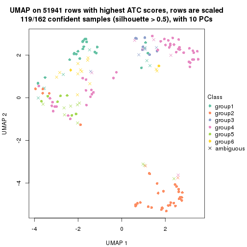</p>

</div>
</div>


Following heatmap shows how subgroups are split when increasing `k`:

```r
collect_classes(res)
```


Test correlation between subgroups and known annotations. If the known
annotation is numeric, one-way ANOVA test is applied, and if the known
annotation is discrete, chi-squared contingency table test is applied.

```r
test_to_known_factors(res)
```

```
#>               n disease.state(p) protocol(p) k
#> ATC:skmeans 161         2.03e-09    0.315232 2
#> ATC:skmeans 160         6.97e-18    0.221488 3
#> ATC:skmeans 144         4.60e-15    0.007891 4
#> ATC:skmeans 131         2.88e-13    0.000568 5
#> ATC:skmeans 119         1.27e-13    0.000209 6
```


If matrix rows can be associated to genes, consider to use `GO_Enrichment(res,
...)` to perform function enrichment for the signature genes.


 

---------------------------------------------------


### ATC:pam**


The object with results only for a single top-value method and a single partition method 
can be extracted as:

```r
res = res_list["ATC", "pam"]
# you can also extract it by
# res = res_list["ATC:pam"]
```

A summary of `res` and all the functions that can be applied to it:

```r
res
```

```
#> A 'ConsensusPartition' object with k = 2, 3, 4, 5, 6.
#>   On a matrix with 51941 rows and 162 columns.
#>   Top rows (1000, 2000, 3000, 4000, 5000) are extracted by 'ATC' method.
#>   Subgroups are detected by 'pam' method.
#>   Performed in total 1250 partitions by row resampling.
#>   Best k for subgroups seems to be 2.
#> 
#> Following methods can be applied to this 'ConsensusPartition' object:
#>  [1] "cola_report"             "collect_classes"         "collect_plots"          
#>  [4] "collect_stats"           "colnames"                "compare_signatures"     
#>  [7] "consensus_heatmap"       "dimension_reduction"     "functional_enrichment"  
#> [10] "get_anno_col"            "get_anno"                "get_classes"            
#> [13] "get_consensus"           "get_matrix"              "get_membership"         
#> [16] "get_param"               "get_signatures"          "get_stats"              
#> [19] "is_best_k"               "is_stable_k"             "membership_heatmap"     
#> [22] "ncol"                    "nrow"                    "plot_ecdf"              
#> [25] "rownames"                "select_partition_number" "show"                   
#> [28] "suggest_best_k"          "test_to_known_factors"
```

`collect_plots()` function collects all the plots made from `res` for all `k` (number of partitions)
into one single page to provide an easy and fast comparison between different `k`.

```r
collect_plots(res)
```


The plots are:

- The first row: a plot of the ECDF (Empirical cumulative distribution
  function) curves of the consensus matrix for each `k` and the heatmap of
  predicted classes for each `k`.
- The second row: heatmaps of the consensus matrix for each `k`.
- The third row: heatmaps of the membership matrix for each `k`.
- The fouth row: heatmaps of the signatures for each `k`.

All the plots in panels can be made by individual functions and they are
plotted later in this section.

`select_partition_number()` produces several plots showing different
statistics for choosing "optimized" `k`. There are following statistics:

- ECDF curves of the consensus matrix for each `k`;
- 1-PAC. [The PAC
  score](https://en.wikipedia.org/wiki/Consensus_clustering#Over-interpretation_potential_of_consensus_clustering)
  measures the proportion of the ambiguous subgrouping.
- Mean silhouette score.
- Concordance. The mean probability of fiting the consensus class ids in all
  partitions.
- Area increased. Denote $A_k$ as the area under the ECDF curve for current
  `k`, the area increased is defined as $A_k - A_{k-1}$.
- Rand index. The percent of pairs of samples that are both in a same cluster
  or both are not in a same cluster in the partition of k and k-1.
- Jaccard index. The ratio of pairs of samples are both in a same cluster in
  the partition of k and k-1 and the pairs of samples are both in a same
  cluster in the partition k or k-1.

The detailed explanations of these statistics can be found in [the cola
vignette](http://bioconductor.org/packages/devel/bioc/vignettes/cola/inst/doc/cola.html#toc_13).

Generally speaking, lower PAC score, higher mean silhouette score or higher
concordance corresponds to better partition. Rand index and Jaccard index
measure how similar the current partition is compared to partition with `k-1`.
If they are too similar, we won't accept `k` is better than `k-1`.

```r
select_partition_number(res)
```


The numeric values for all these statistics can be obtained by `get_stats()`.

```r
get_stats(res)
```

```
#>   k 1-PAC mean_silhouette concordance area_increased  Rand Jaccard
#> 2 2 1.000           0.961       0.982         0.3622 0.620   0.620
#> 3 3 0.868           0.926       0.969         0.6233 0.685   0.535
#> 4 4 0.790           0.827       0.927         0.2051 0.863   0.679
#> 5 5 0.721           0.592       0.793         0.1128 0.804   0.430
#> 6 6 0.716           0.573       0.754         0.0313 0.925   0.674
```

`suggest_best_k()` suggests the best $k$ based on these statistics. The rules are as follows:

- All $k$ with Jaccard index larger than 0.95 are removed because the increase of
  the partition number does not provides enough extra information. If all $k$ are removed,
  the best $k$ is assigned by `NA`.
- For $k$ with 1-PAC larger than 0.9, the maximal $k$ is taken as the "best k". Other $k$ is called "optional k".
- If it does not fit the second rule. The $k$ with the highest vote of highest
  1-PAC, mean silhouette and concordance is taken as the "best k".

```r
suggest_best_k(res)
```

```
#> [1] 2
```


Following shows the table of the partitions (You need to click the **show/hide
code output** link to see it). The membership matrix (columns with name `p*`)
is inferred by
[`clue::cl_consensus()`](https://www.rdocumentation.org/link/cl_consensus?package=clue)
function with the `SE` method. Basically the value in the membership matrix
represents the probability to belong to a certain group. The finall class
label for an item is determined with the group with highest probability it
belongs to.

In `get_classes()` function, the entropy is calculated from the membership
matrix and the silhouette score is calculated from the consensus matrix.


<script>
$( function() {
	$( '#tabs-ATC-pam-get-classes' ).tabs();
} );
</script>
<div id='tabs-ATC-pam-get-classes'>
<ul>
<li><a href='#tab-ATC-pam-get-classes-1'>k = 2</a></li>
<li><a href='#tab-ATC-pam-get-classes-2'>k = 3</a></li>
<li><a href='#tab-ATC-pam-get-classes-3'>k = 4</a></li>
<li><a href='#tab-ATC-pam-get-classes-4'>k = 5</a></li>
<li><a href='#tab-ATC-pam-get-classes-5'>k = 6</a></li>
</ul>

<div id='tab-ATC-pam-get-classes-1'>
<p><a id='tab-ATC-pam-get-classes-1-a' style='color:#0366d6' href='#'>show/hide code output</a></p>
<pre><code class="r">cbind(get_classes(res, k = 2), get_membership(res, k = 2))
</code></pre>

<pre><code>#&gt;           class entropy silhouette    p1    p2
#&gt; GSM682002     2  0.9983      0.220 0.476 0.524
#&gt; GSM682003     1  0.0000      0.999 1.000 0.000
#&gt; GSM682004     2  0.5737      0.826 0.136 0.864
#&gt; GSM682005     1  0.0376      0.995 0.996 0.004
#&gt; GSM682006     1  0.0000      0.999 1.000 0.000
#&gt; GSM682007     1  0.0000      0.999 1.000 0.000
#&gt; GSM682008     1  0.0000      0.999 1.000 0.000
#&gt; GSM682009     1  0.0000      0.999 1.000 0.000
#&gt; GSM682010     1  0.0000      0.999 1.000 0.000
#&gt; GSM682011     2  0.0000      0.927 0.000 1.000
#&gt; GSM682096     2  0.1414      0.915 0.020 0.980
#&gt; GSM682097     1  0.0000      0.999 1.000 0.000
#&gt; GSM682098     2  0.0000      0.927 0.000 1.000
#&gt; GSM682099     2  0.0000      0.927 0.000 1.000
#&gt; GSM682100     2  0.0000      0.927 0.000 1.000
#&gt; GSM682101     2  0.0000      0.927 0.000 1.000
#&gt; GSM682102     1  0.0000      0.999 1.000 0.000
#&gt; GSM682103     1  0.0000      0.999 1.000 0.000
#&gt; GSM682104     1  0.0000      0.999 1.000 0.000
#&gt; GSM682105     1  0.0000      0.999 1.000 0.000
#&gt; GSM682106     1  0.0000      0.999 1.000 0.000
#&gt; GSM682107     1  0.0000      0.999 1.000 0.000
#&gt; GSM682108     1  0.0000      0.999 1.000 0.000
#&gt; GSM682109     1  0.0000      0.999 1.000 0.000
#&gt; GSM682110     1  0.0000      0.999 1.000 0.000
#&gt; GSM682111     1  0.0000      0.999 1.000 0.000
#&gt; GSM682112     1  0.0000      0.999 1.000 0.000
#&gt; GSM682113     1  0.0000      0.999 1.000 0.000
#&gt; GSM682114     1  0.0000      0.999 1.000 0.000
#&gt; GSM682115     1  0.0000      0.999 1.000 0.000
#&gt; GSM682116     1  0.0000      0.999 1.000 0.000
#&gt; GSM682117     1  0.0000      0.999 1.000 0.000
#&gt; GSM682118     1  0.0000      0.999 1.000 0.000
#&gt; GSM682119     1  0.0000      0.999 1.000 0.000
#&gt; GSM682120     1  0.0000      0.999 1.000 0.000
#&gt; GSM682121     1  0.0000      0.999 1.000 0.000
#&gt; GSM682122     1  0.0000      0.999 1.000 0.000
#&gt; GSM682012     1  0.0376      0.995 0.996 0.004
#&gt; GSM682013     2  0.0000      0.927 0.000 1.000
#&gt; GSM682014     2  0.0000      0.927 0.000 1.000
#&gt; GSM682015     2  0.0000      0.927 0.000 1.000
#&gt; GSM682016     1  0.0000      0.999 1.000 0.000
#&gt; GSM682017     2  0.0000      0.927 0.000 1.000
#&gt; GSM682018     2  0.0000      0.927 0.000 1.000
#&gt; GSM682019     2  0.0000      0.927 0.000 1.000
#&gt; GSM682020     2  0.0000      0.927 0.000 1.000
#&gt; GSM682021     2  0.0000      0.927 0.000 1.000
#&gt; GSM682022     2  0.0000      0.927 0.000 1.000
#&gt; GSM682023     2  0.0000      0.927 0.000 1.000
#&gt; GSM682024     2  0.0000      0.927 0.000 1.000
#&gt; GSM682025     2  0.0000      0.927 0.000 1.000
#&gt; GSM682026     2  0.0000      0.927 0.000 1.000
#&gt; GSM682027     2  0.0000      0.927 0.000 1.000
#&gt; GSM682028     2  0.0000      0.927 0.000 1.000
#&gt; GSM682029     2  0.0000      0.927 0.000 1.000
#&gt; GSM682030     2  0.0000      0.927 0.000 1.000
#&gt; GSM682031     2  0.0000      0.927 0.000 1.000
#&gt; GSM682032     2  0.0000      0.927 0.000 1.000
#&gt; GSM682033     1  0.0000      0.999 1.000 0.000
#&gt; GSM681992     1  0.0000      0.999 1.000 0.000
#&gt; GSM681993     1  0.0000      0.999 1.000 0.000
#&gt; GSM681994     1  0.0000      0.999 1.000 0.000
#&gt; GSM681995     1  0.0000      0.999 1.000 0.000
#&gt; GSM681996     1  0.0000      0.999 1.000 0.000
#&gt; GSM681997     1  0.0000      0.999 1.000 0.000
#&gt; GSM681998     1  0.0000      0.999 1.000 0.000
#&gt; GSM681999     1  0.0000      0.999 1.000 0.000
#&gt; GSM682000     1  0.4022      0.904 0.920 0.080
#&gt; GSM682001     1  0.0000      0.999 1.000 0.000
#&gt; GSM682055     1  0.0000      0.999 1.000 0.000
#&gt; GSM682056     1  0.0000      0.999 1.000 0.000
#&gt; GSM682057     2  0.0000      0.927 0.000 1.000
#&gt; GSM682058     2  0.8955      0.614 0.312 0.688
#&gt; GSM682059     2  0.0000      0.927 0.000 1.000
#&gt; GSM682060     1  0.0000      0.999 1.000 0.000
#&gt; GSM682061     1  0.0000      0.999 1.000 0.000
#&gt; GSM682062     2  0.0000      0.927 0.000 1.000
#&gt; GSM682063     2  0.0000      0.927 0.000 1.000
#&gt; GSM682064     1  0.0000      0.999 1.000 0.000
#&gt; GSM682065     1  0.0000      0.999 1.000 0.000
#&gt; GSM682066     1  0.0000      0.999 1.000 0.000
#&gt; GSM682067     1  0.0000      0.999 1.000 0.000
#&gt; GSM682068     1  0.0000      0.999 1.000 0.000
#&gt; GSM682069     1  0.0000      0.999 1.000 0.000
#&gt; GSM682070     1  0.0000      0.999 1.000 0.000
#&gt; GSM682071     1  0.0000      0.999 1.000 0.000
#&gt; GSM682072     1  0.0000      0.999 1.000 0.000
#&gt; GSM682073     1  0.0000      0.999 1.000 0.000
#&gt; GSM682074     1  0.0000      0.999 1.000 0.000
#&gt; GSM682075     1  0.0000      0.999 1.000 0.000
#&gt; GSM682076     1  0.0000      0.999 1.000 0.000
#&gt; GSM682077     1  0.0000      0.999 1.000 0.000
#&gt; GSM682078     1  0.0000      0.999 1.000 0.000
#&gt; GSM682079     1  0.0000      0.999 1.000 0.000
#&gt; GSM682080     1  0.0000      0.999 1.000 0.000
#&gt; GSM682081     1  0.0000      0.999 1.000 0.000
#&gt; GSM682082     1  0.0000      0.999 1.000 0.000
#&gt; GSM682083     1  0.0000      0.999 1.000 0.000
#&gt; GSM682084     1  0.0000      0.999 1.000 0.000
#&gt; GSM682085     1  0.0000      0.999 1.000 0.000
#&gt; GSM682086     1  0.0000      0.999 1.000 0.000
#&gt; GSM682087     1  0.0000      0.999 1.000 0.000
#&gt; GSM682088     1  0.0000      0.999 1.000 0.000
#&gt; GSM682089     1  0.0000      0.999 1.000 0.000
#&gt; GSM682090     1  0.0000      0.999 1.000 0.000
#&gt; GSM682091     1  0.0000      0.999 1.000 0.000
#&gt; GSM682092     1  0.0000      0.999 1.000 0.000
#&gt; GSM682093     1  0.0000      0.999 1.000 0.000
#&gt; GSM682094     1  0.0000      0.999 1.000 0.000
#&gt; GSM682095     1  0.0000      0.999 1.000 0.000
#&gt; GSM681982     1  0.0000      0.999 1.000 0.000
#&gt; GSM681983     2  0.9358      0.547 0.352 0.648
#&gt; GSM681984     1  0.0000      0.999 1.000 0.000
#&gt; GSM681985     1  0.0000      0.999 1.000 0.000
#&gt; GSM681986     1  0.0000      0.999 1.000 0.000
#&gt; GSM681987     1  0.0000      0.999 1.000 0.000
#&gt; GSM681988     1  0.0000      0.999 1.000 0.000
#&gt; GSM681989     1  0.0000      0.999 1.000 0.000
#&gt; GSM681990     1  0.0000      0.999 1.000 0.000
#&gt; GSM681991     1  0.0000      0.999 1.000 0.000
#&gt; GSM682034     1  0.0000      0.999 1.000 0.000
#&gt; GSM682035     1  0.0000      0.999 1.000 0.000
#&gt; GSM682036     1  0.0000      0.999 1.000 0.000
#&gt; GSM682037     1  0.0000      0.999 1.000 0.000
#&gt; GSM682038     1  0.0000      0.999 1.000 0.000
#&gt; GSM682039     1  0.0000      0.999 1.000 0.000
#&gt; GSM682040     1  0.0000      0.999 1.000 0.000
#&gt; GSM682041     1  0.0000      0.999 1.000 0.000
#&gt; GSM682042     1  0.0000      0.999 1.000 0.000
#&gt; GSM682043     1  0.0000      0.999 1.000 0.000
#&gt; GSM682044     1  0.0000      0.999 1.000 0.000
#&gt; GSM682045     1  0.0000      0.999 1.000 0.000
#&gt; GSM682046     2  0.9358      0.547 0.352 0.648
#&gt; GSM682047     1  0.0000      0.999 1.000 0.000
#&gt; GSM682048     1  0.0000      0.999 1.000 0.000
#&gt; GSM682049     1  0.0000      0.999 1.000 0.000
#&gt; GSM682050     2  0.9323      0.555 0.348 0.652
#&gt; GSM682051     1  0.0000      0.999 1.000 0.000
#&gt; GSM682052     1  0.0000      0.999 1.000 0.000
#&gt; GSM682053     1  0.0000      0.999 1.000 0.000
#&gt; GSM682054     1  0.0000      0.999 1.000 0.000
#&gt; GSM682123     1  0.0000      0.999 1.000 0.000
#&gt; GSM682124     2  0.9323      0.555 0.348 0.652
#&gt; GSM682125     1  0.0000      0.999 1.000 0.000
#&gt; GSM682126     1  0.0000      0.999 1.000 0.000
#&gt; GSM682127     1  0.0000      0.999 1.000 0.000
#&gt; GSM682128     1  0.0000      0.999 1.000 0.000
#&gt; GSM682129     2  0.0000      0.927 0.000 1.000
#&gt; GSM682130     2  0.0000      0.927 0.000 1.000
#&gt; GSM682131     1  0.0000      0.999 1.000 0.000
#&gt; GSM682132     1  0.0000      0.999 1.000 0.000
#&gt; GSM682133     1  0.0000      0.999 1.000 0.000
#&gt; GSM682134     1  0.0000      0.999 1.000 0.000
#&gt; GSM682135     1  0.0000      0.999 1.000 0.000
#&gt; GSM682136     2  0.1633      0.913 0.024 0.976
#&gt; GSM682137     1  0.0000      0.999 1.000 0.000
#&gt; GSM682138     1  0.0000      0.999 1.000 0.000
#&gt; GSM682139     2  0.9323      0.555 0.348 0.652
#&gt; GSM682140     1  0.0000      0.999 1.000 0.000
#&gt; GSM682141     2  0.6531      0.795 0.168 0.832
#&gt; GSM682142     1  0.0000      0.999 1.000 0.000
#&gt; GSM682143     1  0.0000      0.999 1.000 0.000
</code></pre>

<script>
$('#tab-ATC-pam-get-classes-1-a').parent().next().next().hide();
$('#tab-ATC-pam-get-classes-1-a').click(function(){
  $('#tab-ATC-pam-get-classes-1-a').parent().next().next().toggle();
  return(false);
});
</script>
</div>

<div id='tab-ATC-pam-get-classes-2'>
<p><a id='tab-ATC-pam-get-classes-2-a' style='color:#0366d6' href='#'>show/hide code output</a></p>
<pre><code class="r">cbind(get_classes(res, k = 3), get_membership(res, k = 3))
</code></pre>

<pre><code>#&gt;           class entropy silhouette    p1    p2    p3
#&gt; GSM682002     1  0.0892     0.9428 0.980 0.020 0.000
#&gt; GSM682003     1  0.0000     0.9575 1.000 0.000 0.000
#&gt; GSM682004     1  0.2625     0.8880 0.916 0.084 0.000
#&gt; GSM682005     1  0.0000     0.9575 1.000 0.000 0.000
#&gt; GSM682006     1  0.0000     0.9575 1.000 0.000 0.000
#&gt; GSM682007     1  0.4452     0.7812 0.808 0.000 0.192
#&gt; GSM682008     1  0.4452     0.7812 0.808 0.000 0.192
#&gt; GSM682009     1  0.0000     0.9575 1.000 0.000 0.000
#&gt; GSM682010     1  0.4452     0.7812 0.808 0.000 0.192
#&gt; GSM682011     2  0.0000     0.9737 0.000 1.000 0.000
#&gt; GSM682096     2  0.6192     0.2504 0.420 0.580 0.000
#&gt; GSM682097     1  0.0000     0.9575 1.000 0.000 0.000
#&gt; GSM682098     2  0.0000     0.9737 0.000 1.000 0.000
#&gt; GSM682099     2  0.0000     0.9737 0.000 1.000 0.000
#&gt; GSM682100     2  0.0000     0.9737 0.000 1.000 0.000
#&gt; GSM682101     2  0.0000     0.9737 0.000 1.000 0.000
#&gt; GSM682102     1  0.0000     0.9575 1.000 0.000 0.000
#&gt; GSM682103     1  0.0000     0.9575 1.000 0.000 0.000
#&gt; GSM682104     1  0.3686     0.8373 0.860 0.000 0.140
#&gt; GSM682105     1  0.0000     0.9575 1.000 0.000 0.000
#&gt; GSM682106     3  0.0000     0.9731 0.000 0.000 1.000
#&gt; GSM682107     1  0.0000     0.9575 1.000 0.000 0.000
#&gt; GSM682108     3  0.0000     0.9731 0.000 0.000 1.000
#&gt; GSM682109     3  0.0000     0.9731 0.000 0.000 1.000
#&gt; GSM682110     1  0.0000     0.9575 1.000 0.000 0.000
#&gt; GSM682111     3  0.0000     0.9731 0.000 0.000 1.000
#&gt; GSM682112     3  0.0000     0.9731 0.000 0.000 1.000
#&gt; GSM682113     1  0.0000     0.9575 1.000 0.000 0.000
#&gt; GSM682114     3  0.0000     0.9731 0.000 0.000 1.000
#&gt; GSM682115     1  0.0000     0.9575 1.000 0.000 0.000
#&gt; GSM682116     1  0.0000     0.9575 1.000 0.000 0.000
#&gt; GSM682117     3  0.0000     0.9731 0.000 0.000 1.000
#&gt; GSM682118     3  0.0000     0.9731 0.000 0.000 1.000
#&gt; GSM682119     3  0.0000     0.9731 0.000 0.000 1.000
#&gt; GSM682120     1  0.0000     0.9575 1.000 0.000 0.000
#&gt; GSM682121     1  0.0000     0.9575 1.000 0.000 0.000
#&gt; GSM682122     3  0.0000     0.9731 0.000 0.000 1.000
#&gt; GSM682012     1  0.0000     0.9575 1.000 0.000 0.000
#&gt; GSM682013     2  0.0000     0.9737 0.000 1.000 0.000
#&gt; GSM682014     2  0.0000     0.9737 0.000 1.000 0.000
#&gt; GSM682015     2  0.0000     0.9737 0.000 1.000 0.000
#&gt; GSM682016     1  0.4452     0.7812 0.808 0.000 0.192
#&gt; GSM682017     2  0.0000     0.9737 0.000 1.000 0.000
#&gt; GSM682018     2  0.0000     0.9737 0.000 1.000 0.000
#&gt; GSM682019     2  0.0000     0.9737 0.000 1.000 0.000
#&gt; GSM682020     2  0.0000     0.9737 0.000 1.000 0.000
#&gt; GSM682021     2  0.0000     0.9737 0.000 1.000 0.000
#&gt; GSM682022     2  0.0000     0.9737 0.000 1.000 0.000
#&gt; GSM682023     2  0.0000     0.9737 0.000 1.000 0.000
#&gt; GSM682024     2  0.0000     0.9737 0.000 1.000 0.000
#&gt; GSM682025     2  0.0000     0.9737 0.000 1.000 0.000
#&gt; GSM682026     2  0.0000     0.9737 0.000 1.000 0.000
#&gt; GSM682027     2  0.0000     0.9737 0.000 1.000 0.000
#&gt; GSM682028     2  0.0000     0.9737 0.000 1.000 0.000
#&gt; GSM682029     2  0.0000     0.9737 0.000 1.000 0.000
#&gt; GSM682030     2  0.0000     0.9737 0.000 1.000 0.000
#&gt; GSM682031     2  0.0000     0.9737 0.000 1.000 0.000
#&gt; GSM682032     2  0.0000     0.9737 0.000 1.000 0.000
#&gt; GSM682033     1  0.0000     0.9575 1.000 0.000 0.000
#&gt; GSM681992     1  0.0000     0.9575 1.000 0.000 0.000
#&gt; GSM681993     3  0.0000     0.9731 0.000 0.000 1.000
#&gt; GSM681994     1  0.0000     0.9575 1.000 0.000 0.000
#&gt; GSM681995     1  0.0000     0.9575 1.000 0.000 0.000
#&gt; GSM681996     3  0.1643     0.9209 0.044 0.000 0.956
#&gt; GSM681997     1  0.4452     0.7812 0.808 0.000 0.192
#&gt; GSM681998     1  0.0000     0.9575 1.000 0.000 0.000
#&gt; GSM681999     1  0.0000     0.9575 1.000 0.000 0.000
#&gt; GSM682000     1  0.0000     0.9575 1.000 0.000 0.000
#&gt; GSM682001     1  0.0000     0.9575 1.000 0.000 0.000
#&gt; GSM682055     1  0.0000     0.9575 1.000 0.000 0.000
#&gt; GSM682056     1  0.0000     0.9575 1.000 0.000 0.000
#&gt; GSM682057     2  0.0000     0.9737 0.000 1.000 0.000
#&gt; GSM682058     1  0.6126     0.3207 0.600 0.400 0.000
#&gt; GSM682059     2  0.0000     0.9737 0.000 1.000 0.000
#&gt; GSM682060     3  0.1289     0.9364 0.032 0.000 0.968
#&gt; GSM682061     3  0.0000     0.9731 0.000 0.000 1.000
#&gt; GSM682062     2  0.0000     0.9737 0.000 1.000 0.000
#&gt; GSM682063     2  0.0000     0.9737 0.000 1.000 0.000
#&gt; GSM682064     1  0.0000     0.9575 1.000 0.000 0.000
#&gt; GSM682065     1  0.0000     0.9575 1.000 0.000 0.000
#&gt; GSM682066     1  0.0000     0.9575 1.000 0.000 0.000
#&gt; GSM682067     1  0.0000     0.9575 1.000 0.000 0.000
#&gt; GSM682068     1  0.0000     0.9575 1.000 0.000 0.000
#&gt; GSM682069     1  0.0000     0.9575 1.000 0.000 0.000
#&gt; GSM682070     1  0.3752     0.8233 0.856 0.000 0.144
#&gt; GSM682071     3  0.0000     0.9731 0.000 0.000 1.000
#&gt; GSM682072     3  0.0000     0.9731 0.000 0.000 1.000
#&gt; GSM682073     3  0.0000     0.9731 0.000 0.000 1.000
#&gt; GSM682074     1  0.4452     0.7812 0.808 0.000 0.192
#&gt; GSM682075     1  0.0000     0.9575 1.000 0.000 0.000
#&gt; GSM682076     1  0.4346     0.7905 0.816 0.000 0.184
#&gt; GSM682077     1  0.0000     0.9575 1.000 0.000 0.000
#&gt; GSM682078     3  0.0000     0.9731 0.000 0.000 1.000
#&gt; GSM682079     1  0.0000     0.9575 1.000 0.000 0.000
#&gt; GSM682080     3  0.0000     0.9731 0.000 0.000 1.000
#&gt; GSM682081     3  0.0000     0.9731 0.000 0.000 1.000
#&gt; GSM682082     3  0.0000     0.9731 0.000 0.000 1.000
#&gt; GSM682083     1  0.0000     0.9575 1.000 0.000 0.000
#&gt; GSM682084     3  0.0000     0.9731 0.000 0.000 1.000
#&gt; GSM682085     3  0.0000     0.9731 0.000 0.000 1.000
#&gt; GSM682086     1  0.0000     0.9575 1.000 0.000 0.000
#&gt; GSM682087     1  0.4452     0.7812 0.808 0.000 0.192
#&gt; GSM682088     3  0.0000     0.9731 0.000 0.000 1.000
#&gt; GSM682089     3  0.0000     0.9731 0.000 0.000 1.000
#&gt; GSM682090     1  0.0892     0.9439 0.980 0.000 0.020
#&gt; GSM682091     1  0.0000     0.9575 1.000 0.000 0.000
#&gt; GSM682092     1  0.0000     0.9575 1.000 0.000 0.000
#&gt; GSM682093     1  0.0000     0.9575 1.000 0.000 0.000
#&gt; GSM682094     1  0.0000     0.9575 1.000 0.000 0.000
#&gt; GSM682095     1  0.0000     0.9575 1.000 0.000 0.000
#&gt; GSM681982     3  0.6180     0.2362 0.416 0.000 0.584
#&gt; GSM681983     1  0.2959     0.8684 0.900 0.100 0.000
#&gt; GSM681984     1  0.0000     0.9575 1.000 0.000 0.000
#&gt; GSM681985     3  0.0000     0.9731 0.000 0.000 1.000
#&gt; GSM681986     1  0.0000     0.9575 1.000 0.000 0.000
#&gt; GSM681987     3  0.4452     0.7090 0.192 0.000 0.808
#&gt; GSM681988     3  0.0000     0.9731 0.000 0.000 1.000
#&gt; GSM681989     1  0.0000     0.9575 1.000 0.000 0.000
#&gt; GSM681990     1  0.4452     0.7812 0.808 0.000 0.192
#&gt; GSM681991     1  0.0000     0.9575 1.000 0.000 0.000
#&gt; GSM682034     1  0.0000     0.9575 1.000 0.000 0.000
#&gt; GSM682035     1  0.0000     0.9575 1.000 0.000 0.000
#&gt; GSM682036     1  0.0000     0.9575 1.000 0.000 0.000
#&gt; GSM682037     1  0.0000     0.9575 1.000 0.000 0.000
#&gt; GSM682038     1  0.0237     0.9549 0.996 0.000 0.004
#&gt; GSM682039     3  0.0000     0.9731 0.000 0.000 1.000
#&gt; GSM682040     3  0.0000     0.9731 0.000 0.000 1.000
#&gt; GSM682041     3  0.0000     0.9731 0.000 0.000 1.000
#&gt; GSM682042     3  0.0000     0.9731 0.000 0.000 1.000
#&gt; GSM682043     1  0.0000     0.9575 1.000 0.000 0.000
#&gt; GSM682044     1  0.0000     0.9575 1.000 0.000 0.000
#&gt; GSM682045     1  0.0000     0.9575 1.000 0.000 0.000
#&gt; GSM682046     1  0.0000     0.9575 1.000 0.000 0.000
#&gt; GSM682047     1  0.0424     0.9524 0.992 0.000 0.008
#&gt; GSM682048     1  0.0000     0.9575 1.000 0.000 0.000
#&gt; GSM682049     1  0.4452     0.7812 0.808 0.000 0.192
#&gt; GSM682050     1  0.0000     0.9575 1.000 0.000 0.000
#&gt; GSM682051     3  0.0000     0.9731 0.000 0.000 1.000
#&gt; GSM682052     3  0.0000     0.9731 0.000 0.000 1.000
#&gt; GSM682053     3  0.0000     0.9731 0.000 0.000 1.000
#&gt; GSM682054     1  0.0000     0.9575 1.000 0.000 0.000
#&gt; GSM682123     1  0.0000     0.9575 1.000 0.000 0.000
#&gt; GSM682124     1  0.1289     0.9332 0.968 0.032 0.000
#&gt; GSM682125     1  0.0000     0.9575 1.000 0.000 0.000
#&gt; GSM682126     1  0.0000     0.9575 1.000 0.000 0.000
#&gt; GSM682127     1  0.0000     0.9575 1.000 0.000 0.000
#&gt; GSM682128     1  0.0000     0.9575 1.000 0.000 0.000
#&gt; GSM682129     2  0.0000     0.9737 0.000 1.000 0.000
#&gt; GSM682130     2  0.0000     0.9737 0.000 1.000 0.000
#&gt; GSM682131     1  0.0000     0.9575 1.000 0.000 0.000
#&gt; GSM682132     1  0.0000     0.9575 1.000 0.000 0.000
#&gt; GSM682133     1  0.0000     0.9575 1.000 0.000 0.000
#&gt; GSM682134     1  0.0000     0.9575 1.000 0.000 0.000
#&gt; GSM682135     1  0.0000     0.9575 1.000 0.000 0.000
#&gt; GSM682136     2  0.4399     0.7314 0.188 0.812 0.000
#&gt; GSM682137     1  0.0000     0.9575 1.000 0.000 0.000
#&gt; GSM682138     1  0.4452     0.7812 0.808 0.000 0.192
#&gt; GSM682139     1  0.0000     0.9575 1.000 0.000 0.000
#&gt; GSM682140     1  0.0000     0.9575 1.000 0.000 0.000
#&gt; GSM682141     1  0.6299     0.0774 0.524 0.476 0.000
#&gt; GSM682142     1  0.0000     0.9575 1.000 0.000 0.000
#&gt; GSM682143     1  0.4605     0.7428 0.796 0.000 0.204
</code></pre>

<script>
$('#tab-ATC-pam-get-classes-2-a').parent().next().next().hide();
$('#tab-ATC-pam-get-classes-2-a').click(function(){
  $('#tab-ATC-pam-get-classes-2-a').parent().next().next().toggle();
  return(false);
});
</script>
</div>

<div id='tab-ATC-pam-get-classes-3'>
<p><a id='tab-ATC-pam-get-classes-3-a' style='color:#0366d6' href='#'>show/hide code output</a></p>
<pre><code class="r">cbind(get_classes(res, k = 4), get_membership(res, k = 4))
</code></pre>

<pre><code>#&gt;           class entropy silhouette    p1    p2    p3    p4
#&gt; GSM682002     1  0.0000     0.8417 1.000 0.000 0.000 0.000
#&gt; GSM682003     4  0.0000     0.8808 0.000 0.000 0.000 1.000
#&gt; GSM682004     1  0.0000     0.8417 1.000 0.000 0.000 0.000
#&gt; GSM682005     4  0.4888     0.2520 0.412 0.000 0.000 0.588
#&gt; GSM682006     4  0.1940     0.8313 0.076 0.000 0.000 0.924
#&gt; GSM682007     4  0.3444     0.7438 0.000 0.000 0.184 0.816
#&gt; GSM682008     4  0.3444     0.7438 0.000 0.000 0.184 0.816
#&gt; GSM682009     4  0.0000     0.8808 0.000 0.000 0.000 1.000
#&gt; GSM682010     4  0.3444     0.7438 0.000 0.000 0.184 0.816
#&gt; GSM682011     1  0.0000     0.8417 1.000 0.000 0.000 0.000
#&gt; GSM682096     1  0.6355     0.3671 0.576 0.348 0.000 0.076
#&gt; GSM682097     4  0.0000     0.8808 0.000 0.000 0.000 1.000
#&gt; GSM682098     2  0.4605     0.4738 0.336 0.664 0.000 0.000
#&gt; GSM682099     2  0.0000     0.9873 0.000 1.000 0.000 0.000
#&gt; GSM682100     2  0.0000     0.9873 0.000 1.000 0.000 0.000
#&gt; GSM682101     2  0.0000     0.9873 0.000 1.000 0.000 0.000
#&gt; GSM682102     4  0.3975     0.6388 0.240 0.000 0.000 0.760
#&gt; GSM682103     4  0.0000     0.8808 0.000 0.000 0.000 1.000
#&gt; GSM682104     4  0.1211     0.8607 0.000 0.000 0.040 0.960
#&gt; GSM682105     4  0.0000     0.8808 0.000 0.000 0.000 1.000
#&gt; GSM682106     3  0.1940     0.8817 0.000 0.000 0.924 0.076
#&gt; GSM682107     4  0.0000     0.8808 0.000 0.000 0.000 1.000
#&gt; GSM682108     3  0.0000     0.9388 0.000 0.000 1.000 0.000
#&gt; GSM682109     3  0.0000     0.9388 0.000 0.000 1.000 0.000
#&gt; GSM682110     4  0.0000     0.8808 0.000 0.000 0.000 1.000
#&gt; GSM682111     3  0.0000     0.9388 0.000 0.000 1.000 0.000
#&gt; GSM682112     3  0.0000     0.9388 0.000 0.000 1.000 0.000
#&gt; GSM682113     4  0.0000     0.8808 0.000 0.000 0.000 1.000
#&gt; GSM682114     3  0.0000     0.9388 0.000 0.000 1.000 0.000
#&gt; GSM682115     1  0.4830     0.3887 0.608 0.000 0.000 0.392
#&gt; GSM682116     4  0.3123     0.7473 0.156 0.000 0.000 0.844
#&gt; GSM682117     3  0.0000     0.9388 0.000 0.000 1.000 0.000
#&gt; GSM682118     3  0.0000     0.9388 0.000 0.000 1.000 0.000
#&gt; GSM682119     3  0.0000     0.9388 0.000 0.000 1.000 0.000
#&gt; GSM682120     4  0.0000     0.8808 0.000 0.000 0.000 1.000
#&gt; GSM682121     4  0.0000     0.8808 0.000 0.000 0.000 1.000
#&gt; GSM682122     3  0.1118     0.9145 0.000 0.000 0.964 0.036
#&gt; GSM682012     4  0.2081     0.8252 0.084 0.000 0.000 0.916
#&gt; GSM682013     2  0.0000     0.9873 0.000 1.000 0.000 0.000
#&gt; GSM682014     2  0.0000     0.9873 0.000 1.000 0.000 0.000
#&gt; GSM682015     2  0.0000     0.9873 0.000 1.000 0.000 0.000
#&gt; GSM682016     4  0.3444     0.7438 0.000 0.000 0.184 0.816
#&gt; GSM682017     2  0.0000     0.9873 0.000 1.000 0.000 0.000
#&gt; GSM682018     2  0.0000     0.9873 0.000 1.000 0.000 0.000
#&gt; GSM682019     2  0.0000     0.9873 0.000 1.000 0.000 0.000
#&gt; GSM682020     2  0.0000     0.9873 0.000 1.000 0.000 0.000
#&gt; GSM682021     2  0.0000     0.9873 0.000 1.000 0.000 0.000
#&gt; GSM682022     2  0.0000     0.9873 0.000 1.000 0.000 0.000
#&gt; GSM682023     2  0.0000     0.9873 0.000 1.000 0.000 0.000
#&gt; GSM682024     2  0.0000     0.9873 0.000 1.000 0.000 0.000
#&gt; GSM682025     2  0.0000     0.9873 0.000 1.000 0.000 0.000
#&gt; GSM682026     2  0.0000     0.9873 0.000 1.000 0.000 0.000
#&gt; GSM682027     2  0.0000     0.9873 0.000 1.000 0.000 0.000
#&gt; GSM682028     2  0.0000     0.9873 0.000 1.000 0.000 0.000
#&gt; GSM682029     2  0.0000     0.9873 0.000 1.000 0.000 0.000
#&gt; GSM682030     2  0.0000     0.9873 0.000 1.000 0.000 0.000
#&gt; GSM682031     2  0.0000     0.9873 0.000 1.000 0.000 0.000
#&gt; GSM682032     2  0.0000     0.9873 0.000 1.000 0.000 0.000
#&gt; GSM682033     4  0.1389     0.8525 0.048 0.000 0.000 0.952
#&gt; GSM681992     4  0.0000     0.8808 0.000 0.000 0.000 1.000
#&gt; GSM681993     3  0.0000     0.9388 0.000 0.000 1.000 0.000
#&gt; GSM681994     4  0.0817     0.8687 0.024 0.000 0.000 0.976
#&gt; GSM681995     4  0.4406     0.5273 0.300 0.000 0.000 0.700
#&gt; GSM681996     3  0.4331     0.6227 0.000 0.000 0.712 0.288
#&gt; GSM681997     4  0.3444     0.7438 0.000 0.000 0.184 0.816
#&gt; GSM681998     4  0.0000     0.8808 0.000 0.000 0.000 1.000
#&gt; GSM681999     4  0.0000     0.8808 0.000 0.000 0.000 1.000
#&gt; GSM682000     1  0.3942     0.6680 0.764 0.000 0.000 0.236
#&gt; GSM682001     4  0.3837     0.6600 0.224 0.000 0.000 0.776
#&gt; GSM682055     4  0.0000     0.8808 0.000 0.000 0.000 1.000
#&gt; GSM682056     4  0.0000     0.8808 0.000 0.000 0.000 1.000
#&gt; GSM682057     2  0.0000     0.9873 0.000 1.000 0.000 0.000
#&gt; GSM682058     4  0.5673     0.0631 0.448 0.024 0.000 0.528
#&gt; GSM682059     2  0.0000     0.9873 0.000 1.000 0.000 0.000
#&gt; GSM682060     3  0.2814     0.7889 0.000 0.000 0.868 0.132
#&gt; GSM682061     3  0.0000     0.9388 0.000 0.000 1.000 0.000
#&gt; GSM682062     2  0.0000     0.9873 0.000 1.000 0.000 0.000
#&gt; GSM682063     2  0.0000     0.9873 0.000 1.000 0.000 0.000
#&gt; GSM682064     4  0.4907     0.2308 0.420 0.000 0.000 0.580
#&gt; GSM682065     1  0.0921     0.8362 0.972 0.000 0.000 0.028
#&gt; GSM682066     4  0.2081     0.8261 0.084 0.000 0.000 0.916
#&gt; GSM682067     4  0.0000     0.8808 0.000 0.000 0.000 1.000
#&gt; GSM682068     1  0.4790     0.4023 0.620 0.000 0.000 0.380
#&gt; GSM682069     4  0.0000     0.8808 0.000 0.000 0.000 1.000
#&gt; GSM682070     4  0.0817     0.8698 0.000 0.000 0.024 0.976
#&gt; GSM682071     3  0.0000     0.9388 0.000 0.000 1.000 0.000
#&gt; GSM682072     3  0.0000     0.9388 0.000 0.000 1.000 0.000
#&gt; GSM682073     3  0.0000     0.9388 0.000 0.000 1.000 0.000
#&gt; GSM682074     4  0.3444     0.7438 0.000 0.000 0.184 0.816
#&gt; GSM682075     4  0.3172     0.7430 0.160 0.000 0.000 0.840
#&gt; GSM682076     4  0.3400     0.7476 0.000 0.000 0.180 0.820
#&gt; GSM682077     4  0.0000     0.8808 0.000 0.000 0.000 1.000
#&gt; GSM682078     3  0.1792     0.8890 0.000 0.000 0.932 0.068
#&gt; GSM682079     4  0.0000     0.8808 0.000 0.000 0.000 1.000
#&gt; GSM682080     3  0.0000     0.9388 0.000 0.000 1.000 0.000
#&gt; GSM682081     3  0.0000     0.9388 0.000 0.000 1.000 0.000
#&gt; GSM682082     3  0.0000     0.9388 0.000 0.000 1.000 0.000
#&gt; GSM682083     4  0.4040     0.6212 0.248 0.000 0.000 0.752
#&gt; GSM682084     3  0.0000     0.9388 0.000 0.000 1.000 0.000
#&gt; GSM682085     3  0.0000     0.9388 0.000 0.000 1.000 0.000
#&gt; GSM682086     4  0.0000     0.8808 0.000 0.000 0.000 1.000
#&gt; GSM682087     4  0.3444     0.7438 0.000 0.000 0.184 0.816
#&gt; GSM682088     3  0.0000     0.9388 0.000 0.000 1.000 0.000
#&gt; GSM682089     3  0.1557     0.8990 0.000 0.000 0.944 0.056
#&gt; GSM682090     4  0.2281     0.8188 0.000 0.000 0.096 0.904
#&gt; GSM682091     4  0.0000     0.8808 0.000 0.000 0.000 1.000
#&gt; GSM682092     4  0.0000     0.8808 0.000 0.000 0.000 1.000
#&gt; GSM682093     4  0.0000     0.8808 0.000 0.000 0.000 1.000
#&gt; GSM682094     4  0.0000     0.8808 0.000 0.000 0.000 1.000
#&gt; GSM682095     4  0.0000     0.8808 0.000 0.000 0.000 1.000
#&gt; GSM681982     3  0.4830     0.3777 0.000 0.000 0.608 0.392
#&gt; GSM681983     1  0.0000     0.8417 1.000 0.000 0.000 0.000
#&gt; GSM681984     4  0.0000     0.8808 0.000 0.000 0.000 1.000
#&gt; GSM681985     3  0.1940     0.8820 0.000 0.000 0.924 0.076
#&gt; GSM681986     4  0.0000     0.8808 0.000 0.000 0.000 1.000
#&gt; GSM681987     3  0.4585     0.5413 0.000 0.000 0.668 0.332
#&gt; GSM681988     3  0.3873     0.7061 0.000 0.000 0.772 0.228
#&gt; GSM681989     4  0.0000     0.8808 0.000 0.000 0.000 1.000
#&gt; GSM681990     4  0.3444     0.7438 0.000 0.000 0.184 0.816
#&gt; GSM681991     4  0.0000     0.8808 0.000 0.000 0.000 1.000
#&gt; GSM682034     1  0.4382     0.5744 0.704 0.000 0.000 0.296
#&gt; GSM682035     4  0.0000     0.8808 0.000 0.000 0.000 1.000
#&gt; GSM682036     4  0.0000     0.8808 0.000 0.000 0.000 1.000
#&gt; GSM682037     1  0.0921     0.8362 0.972 0.000 0.000 0.028
#&gt; GSM682038     4  0.0188     0.8794 0.000 0.000 0.004 0.996
#&gt; GSM682039     3  0.0000     0.9388 0.000 0.000 1.000 0.000
#&gt; GSM682040     3  0.0000     0.9388 0.000 0.000 1.000 0.000
#&gt; GSM682041     3  0.0000     0.9388 0.000 0.000 1.000 0.000
#&gt; GSM682042     3  0.0000     0.9388 0.000 0.000 1.000 0.000
#&gt; GSM682043     4  0.0336     0.8774 0.008 0.000 0.000 0.992
#&gt; GSM682044     4  0.4855     0.2653 0.400 0.000 0.000 0.600
#&gt; GSM682045     4  0.0000     0.8808 0.000 0.000 0.000 1.000
#&gt; GSM682046     1  0.0000     0.8417 1.000 0.000 0.000 0.000
#&gt; GSM682047     4  0.0592     0.8737 0.000 0.000 0.016 0.984
#&gt; GSM682048     4  0.0000     0.8808 0.000 0.000 0.000 1.000
#&gt; GSM682049     4  0.3444     0.7438 0.000 0.000 0.184 0.816
#&gt; GSM682050     1  0.0000     0.8417 1.000 0.000 0.000 0.000
#&gt; GSM682051     3  0.0000     0.9388 0.000 0.000 1.000 0.000
#&gt; GSM682052     3  0.0000     0.9388 0.000 0.000 1.000 0.000
#&gt; GSM682053     3  0.0000     0.9388 0.000 0.000 1.000 0.000
#&gt; GSM682054     1  0.3610     0.7109 0.800 0.000 0.000 0.200
#&gt; GSM682123     1  0.1867     0.8134 0.928 0.000 0.000 0.072
#&gt; GSM682124     1  0.0000     0.8417 1.000 0.000 0.000 0.000
#&gt; GSM682125     4  0.4193     0.5893 0.268 0.000 0.000 0.732
#&gt; GSM682126     1  0.0000     0.8417 1.000 0.000 0.000 0.000
#&gt; GSM682127     1  0.4948     0.2229 0.560 0.000 0.000 0.440
#&gt; GSM682128     4  0.4643     0.4323 0.344 0.000 0.000 0.656
#&gt; GSM682129     2  0.0000     0.9873 0.000 1.000 0.000 0.000
#&gt; GSM682130     2  0.0000     0.9873 0.000 1.000 0.000 0.000
#&gt; GSM682131     4  0.0188     0.8792 0.004 0.000 0.000 0.996
#&gt; GSM682132     1  0.4804     0.3920 0.616 0.000 0.000 0.384
#&gt; GSM682133     1  0.0000     0.8417 1.000 0.000 0.000 0.000
#&gt; GSM682134     1  0.0707     0.8387 0.980 0.000 0.000 0.020
#&gt; GSM682135     1  0.0000     0.8417 1.000 0.000 0.000 0.000
#&gt; GSM682136     1  0.0000     0.8417 1.000 0.000 0.000 0.000
#&gt; GSM682137     4  0.4790     0.3375 0.380 0.000 0.000 0.620
#&gt; GSM682138     4  0.3444     0.7438 0.000 0.000 0.184 0.816
#&gt; GSM682139     1  0.0000     0.8417 1.000 0.000 0.000 0.000
#&gt; GSM682140     4  0.0000     0.8808 0.000 0.000 0.000 1.000
#&gt; GSM682141     1  0.0000     0.8417 1.000 0.000 0.000 0.000
#&gt; GSM682142     1  0.3726     0.6971 0.788 0.000 0.000 0.212
#&gt; GSM682143     4  0.2281     0.8207 0.000 0.000 0.096 0.904
</code></pre>

<script>
$('#tab-ATC-pam-get-classes-3-a').parent().next().next().hide();
$('#tab-ATC-pam-get-classes-3-a').click(function(){
  $('#tab-ATC-pam-get-classes-3-a').parent().next().next().toggle();
  return(false);
});
</script>
</div>

<div id='tab-ATC-pam-get-classes-4'>
<p><a id='tab-ATC-pam-get-classes-4-a' style='color:#0366d6' href='#'>show/hide code output</a></p>
<pre><code class="r">cbind(get_classes(res, k = 5), get_membership(res, k = 5))
</code></pre>

<pre><code>#&gt;           class entropy silhouette    p1    p2    p3    p4    p5
#&gt; GSM682002     1  0.4287     0.5915 0.540 0.000 0.000 0.000 0.460
#&gt; GSM682003     5  0.6265     0.5770 0.220 0.000 0.000 0.240 0.540
#&gt; GSM682004     1  0.4287     0.5915 0.540 0.000 0.000 0.000 0.460
#&gt; GSM682005     5  0.3774     0.2557 0.296 0.000 0.000 0.000 0.704
#&gt; GSM682006     5  0.4632     0.6470 0.448 0.000 0.000 0.012 0.540
#&gt; GSM682007     4  0.2179     0.3769 0.000 0.000 0.000 0.888 0.112
#&gt; GSM682008     5  0.4297     0.4275 0.000 0.000 0.000 0.472 0.528
#&gt; GSM682009     5  0.4632     0.6470 0.448 0.000 0.000 0.012 0.540
#&gt; GSM682010     5  0.4291     0.4358 0.000 0.000 0.000 0.464 0.536
#&gt; GSM682011     1  0.4287     0.5915 0.540 0.000 0.000 0.000 0.460
#&gt; GSM682096     2  0.7561    -0.1987 0.272 0.352 0.000 0.040 0.336
#&gt; GSM682097     5  0.4803     0.6421 0.444 0.000 0.000 0.020 0.536
#&gt; GSM682098     2  0.6102     0.3145 0.176 0.560 0.000 0.000 0.264
#&gt; GSM682099     2  0.0000     0.9621 0.000 1.000 0.000 0.000 0.000
#&gt; GSM682100     2  0.0000     0.9621 0.000 1.000 0.000 0.000 0.000
#&gt; GSM682101     2  0.0000     0.9621 0.000 1.000 0.000 0.000 0.000
#&gt; GSM682102     1  0.3741     0.2913 0.816 0.000 0.000 0.108 0.076
#&gt; GSM682103     4  0.4283     0.6085 0.456 0.000 0.000 0.544 0.000
#&gt; GSM682104     4  0.2020     0.5236 0.100 0.000 0.000 0.900 0.000
#&gt; GSM682105     4  0.4287     0.6060 0.460 0.000 0.000 0.540 0.000
#&gt; GSM682106     4  0.2516     0.4120 0.000 0.000 0.140 0.860 0.000
#&gt; GSM682107     1  0.6257    -0.5214 0.460 0.000 0.000 0.148 0.392
#&gt; GSM682108     3  0.2074     0.9405 0.000 0.000 0.896 0.104 0.000
#&gt; GSM682109     3  0.2074     0.9405 0.000 0.000 0.896 0.104 0.000
#&gt; GSM682110     4  0.5773     0.4583 0.396 0.000 0.000 0.512 0.092
#&gt; GSM682111     3  0.1478     0.9412 0.000 0.000 0.936 0.064 0.000
#&gt; GSM682112     3  0.0000     0.9270 0.000 0.000 1.000 0.000 0.000
#&gt; GSM682113     1  0.6401    -0.5274 0.448 0.000 0.000 0.172 0.380
#&gt; GSM682114     3  0.0000     0.9270 0.000 0.000 1.000 0.000 0.000
#&gt; GSM682115     1  0.6712     0.1580 0.416 0.000 0.000 0.324 0.260
#&gt; GSM682116     4  0.4273     0.6120 0.448 0.000 0.000 0.552 0.000
#&gt; GSM682117     3  0.2074     0.9405 0.000 0.000 0.896 0.104 0.000
#&gt; GSM682118     3  0.2074     0.9405 0.000 0.000 0.896 0.104 0.000
#&gt; GSM682119     3  0.2074     0.9405 0.000 0.000 0.896 0.104 0.000
#&gt; GSM682120     4  0.4273     0.6120 0.448 0.000 0.000 0.552 0.000
#&gt; GSM682121     4  0.4273     0.6120 0.448 0.000 0.000 0.552 0.000
#&gt; GSM682122     3  0.4300     0.4583 0.000 0.000 0.524 0.476 0.000
#&gt; GSM682012     5  0.4731     0.6371 0.456 0.000 0.000 0.016 0.528
#&gt; GSM682013     2  0.0000     0.9621 0.000 1.000 0.000 0.000 0.000
#&gt; GSM682014     2  0.0000     0.9621 0.000 1.000 0.000 0.000 0.000
#&gt; GSM682015     2  0.0000     0.9621 0.000 1.000 0.000 0.000 0.000
#&gt; GSM682016     5  0.4291     0.4356 0.000 0.000 0.000 0.464 0.536
#&gt; GSM682017     2  0.0000     0.9621 0.000 1.000 0.000 0.000 0.000
#&gt; GSM682018     2  0.0000     0.9621 0.000 1.000 0.000 0.000 0.000
#&gt; GSM682019     2  0.0000     0.9621 0.000 1.000 0.000 0.000 0.000
#&gt; GSM682020     2  0.0000     0.9621 0.000 1.000 0.000 0.000 0.000
#&gt; GSM682021     2  0.0000     0.9621 0.000 1.000 0.000 0.000 0.000
#&gt; GSM682022     2  0.0000     0.9621 0.000 1.000 0.000 0.000 0.000
#&gt; GSM682023     2  0.0000     0.9621 0.000 1.000 0.000 0.000 0.000
#&gt; GSM682024     2  0.0000     0.9621 0.000 1.000 0.000 0.000 0.000
#&gt; GSM682025     2  0.0000     0.9621 0.000 1.000 0.000 0.000 0.000
#&gt; GSM682026     2  0.0000     0.9621 0.000 1.000 0.000 0.000 0.000
#&gt; GSM682027     2  0.0000     0.9621 0.000 1.000 0.000 0.000 0.000
#&gt; GSM682028     2  0.0000     0.9621 0.000 1.000 0.000 0.000 0.000
#&gt; GSM682029     2  0.0000     0.9621 0.000 1.000 0.000 0.000 0.000
#&gt; GSM682030     2  0.0000     0.9621 0.000 1.000 0.000 0.000 0.000
#&gt; GSM682031     2  0.0000     0.9621 0.000 1.000 0.000 0.000 0.000
#&gt; GSM682032     2  0.0000     0.9621 0.000 1.000 0.000 0.000 0.000
#&gt; GSM682033     5  0.4632     0.6470 0.448 0.000 0.000 0.012 0.540
#&gt; GSM681992     5  0.4632     0.6470 0.448 0.000 0.000 0.012 0.540
#&gt; GSM681993     3  0.0000     0.9270 0.000 0.000 1.000 0.000 0.000
#&gt; GSM681994     5  0.4727     0.6383 0.452 0.000 0.000 0.016 0.532
#&gt; GSM681995     5  0.4807     0.5295 0.448 0.000 0.000 0.020 0.532
#&gt; GSM681996     4  0.4088    -0.1805 0.000 0.000 0.000 0.632 0.368
#&gt; GSM681997     5  0.4287     0.4388 0.000 0.000 0.000 0.460 0.540
#&gt; GSM681998     5  0.5901     0.6509 0.344 0.000 0.000 0.116 0.540
#&gt; GSM681999     5  0.5977     0.6480 0.332 0.000 0.000 0.128 0.540
#&gt; GSM682000     5  0.3932    -0.3324 0.328 0.000 0.000 0.000 0.672
#&gt; GSM682001     1  0.5836    -0.5168 0.516 0.000 0.000 0.100 0.384
#&gt; GSM682055     5  0.4818     0.6155 0.460 0.000 0.000 0.020 0.520
#&gt; GSM682056     4  0.5553     0.5381 0.448 0.000 0.000 0.484 0.068
#&gt; GSM682057     2  0.0000     0.9621 0.000 1.000 0.000 0.000 0.000
#&gt; GSM682058     1  0.7954     0.3519 0.392 0.220 0.000 0.092 0.296
#&gt; GSM682059     2  0.0000     0.9621 0.000 1.000 0.000 0.000 0.000
#&gt; GSM682060     3  0.2592     0.8974 0.056 0.000 0.892 0.052 0.000
#&gt; GSM682061     3  0.0000     0.9270 0.000 0.000 1.000 0.000 0.000
#&gt; GSM682062     2  0.0000     0.9621 0.000 1.000 0.000 0.000 0.000
#&gt; GSM682063     2  0.0000     0.9621 0.000 1.000 0.000 0.000 0.000
#&gt; GSM682064     1  0.3682     0.2977 0.820 0.000 0.000 0.108 0.072
#&gt; GSM682065     1  0.4639     0.5774 0.612 0.000 0.000 0.020 0.368
#&gt; GSM682066     1  0.5799    -0.4321 0.564 0.000 0.000 0.112 0.324
#&gt; GSM682067     4  0.4287     0.6060 0.460 0.000 0.000 0.540 0.000
#&gt; GSM682068     1  0.5595     0.5192 0.560 0.000 0.000 0.084 0.356
#&gt; GSM682069     4  0.4735     0.5878 0.460 0.000 0.000 0.524 0.016
#&gt; GSM682070     5  0.8083     0.4176 0.328 0.000 0.096 0.244 0.332
#&gt; GSM682071     3  0.2074     0.9405 0.000 0.000 0.896 0.104 0.000
#&gt; GSM682072     3  0.2074     0.9405 0.000 0.000 0.896 0.104 0.000
#&gt; GSM682073     3  0.1410     0.9408 0.000 0.000 0.940 0.060 0.000
#&gt; GSM682074     4  0.0404     0.4991 0.012 0.000 0.000 0.988 0.000
#&gt; GSM682075     4  0.4294     0.6007 0.468 0.000 0.000 0.532 0.000
#&gt; GSM682076     4  0.0880     0.5096 0.032 0.000 0.000 0.968 0.000
#&gt; GSM682077     4  0.4278     0.6106 0.452 0.000 0.000 0.548 0.000
#&gt; GSM682078     4  0.3210     0.3465 0.000 0.000 0.212 0.788 0.000
#&gt; GSM682079     4  0.4273     0.6120 0.448 0.000 0.000 0.552 0.000
#&gt; GSM682080     3  0.2074     0.9405 0.000 0.000 0.896 0.104 0.000
#&gt; GSM682081     3  0.0000     0.9270 0.000 0.000 1.000 0.000 0.000
#&gt; GSM682082     3  0.2074     0.9405 0.000 0.000 0.896 0.104 0.000
#&gt; GSM682083     4  0.5341     0.5409 0.444 0.000 0.000 0.504 0.052
#&gt; GSM682084     3  0.0000     0.9270 0.000 0.000 1.000 0.000 0.000
#&gt; GSM682085     3  0.0000     0.9270 0.000 0.000 1.000 0.000 0.000
#&gt; GSM682086     4  0.4644     0.5933 0.460 0.000 0.000 0.528 0.012
#&gt; GSM682087     4  0.0609     0.4770 0.000 0.000 0.000 0.980 0.020
#&gt; GSM682088     3  0.2074     0.9405 0.000 0.000 0.896 0.104 0.000
#&gt; GSM682089     4  0.4300    -0.1896 0.000 0.000 0.476 0.524 0.000
#&gt; GSM682090     4  0.3336     0.5675 0.228 0.000 0.000 0.772 0.000
#&gt; GSM682091     1  0.5778    -0.5775 0.460 0.000 0.000 0.452 0.088
#&gt; GSM682092     4  0.4287     0.6060 0.460 0.000 0.000 0.540 0.000
#&gt; GSM682093     4  0.4287     0.6060 0.460 0.000 0.000 0.540 0.000
#&gt; GSM682094     4  0.4287     0.6060 0.460 0.000 0.000 0.540 0.000
#&gt; GSM682095     5  0.5100     0.6243 0.448 0.000 0.000 0.036 0.516
#&gt; GSM681982     4  0.3003     0.2591 0.000 0.000 0.000 0.812 0.188
#&gt; GSM681983     1  0.4287     0.5915 0.540 0.000 0.000 0.000 0.460
#&gt; GSM681984     5  0.5845     0.5171 0.108 0.000 0.000 0.352 0.540
#&gt; GSM681985     4  0.2690     0.3883 0.000 0.000 0.156 0.844 0.000
#&gt; GSM681986     5  0.5645     0.6540 0.376 0.000 0.000 0.084 0.540
#&gt; GSM681987     5  0.6539     0.5225 0.104 0.000 0.036 0.320 0.540
#&gt; GSM681988     5  0.4905     0.4016 0.000 0.000 0.024 0.476 0.500
#&gt; GSM681989     5  0.4632     0.6470 0.448 0.000 0.000 0.012 0.540
#&gt; GSM681990     5  0.4287     0.4388 0.000 0.000 0.000 0.460 0.540
#&gt; GSM681991     5  0.4632     0.6470 0.448 0.000 0.000 0.012 0.540
#&gt; GSM682034     1  0.4276     0.4445 0.764 0.000 0.000 0.068 0.168
#&gt; GSM682035     4  0.4273     0.6120 0.448 0.000 0.000 0.552 0.000
#&gt; GSM682036     5  0.6653     0.5502 0.320 0.000 0.000 0.244 0.436
#&gt; GSM682037     1  0.4639     0.5774 0.612 0.000 0.000 0.020 0.368
#&gt; GSM682038     5  0.6000     0.6464 0.328 0.000 0.000 0.132 0.540
#&gt; GSM682039     3  0.2074     0.9405 0.000 0.000 0.896 0.104 0.000
#&gt; GSM682040     3  0.0000     0.9270 0.000 0.000 1.000 0.000 0.000
#&gt; GSM682041     3  0.2074     0.9405 0.000 0.000 0.896 0.104 0.000
#&gt; GSM682042     3  0.0000     0.9270 0.000 0.000 1.000 0.000 0.000
#&gt; GSM682043     4  0.4278     0.6106 0.452 0.000 0.000 0.548 0.000
#&gt; GSM682044     1  0.4171     0.3174 0.784 0.000 0.000 0.112 0.104
#&gt; GSM682045     1  0.5933    -0.5946 0.448 0.000 0.000 0.104 0.448
#&gt; GSM682046     1  0.4287     0.5915 0.540 0.000 0.000 0.000 0.460
#&gt; GSM682047     4  0.2011     0.5156 0.088 0.000 0.000 0.908 0.004
#&gt; GSM682048     1  0.6186    -0.5245 0.452 0.000 0.000 0.412 0.136
#&gt; GSM682049     4  0.0290     0.4973 0.008 0.000 0.000 0.992 0.000
#&gt; GSM682050     1  0.4287     0.5915 0.540 0.000 0.000 0.000 0.460
#&gt; GSM682051     3  0.0510     0.9316 0.000 0.000 0.984 0.016 0.000
#&gt; GSM682052     3  0.1671     0.9416 0.000 0.000 0.924 0.076 0.000
#&gt; GSM682053     3  0.1410     0.9408 0.000 0.000 0.940 0.060 0.000
#&gt; GSM682054     1  0.4229     0.5405 0.704 0.000 0.000 0.020 0.276
#&gt; GSM682123     1  0.4151     0.5679 0.652 0.000 0.000 0.004 0.344
#&gt; GSM682124     1  0.4287     0.5915 0.540 0.000 0.000 0.000 0.460
#&gt; GSM682125     1  0.6191    -0.3582 0.536 0.000 0.000 0.172 0.292
#&gt; GSM682126     1  0.4287     0.5915 0.540 0.000 0.000 0.000 0.460
#&gt; GSM682127     1  0.3495     0.4013 0.816 0.000 0.000 0.032 0.152
#&gt; GSM682128     1  0.6296    -0.0334 0.504 0.000 0.000 0.324 0.172
#&gt; GSM682129     2  0.0000     0.9621 0.000 1.000 0.000 0.000 0.000
#&gt; GSM682130     2  0.0000     0.9621 0.000 1.000 0.000 0.000 0.000
#&gt; GSM682131     5  0.5028     0.6259 0.444 0.000 0.000 0.032 0.524
#&gt; GSM682132     5  0.4898    -0.2870 0.376 0.000 0.000 0.032 0.592
#&gt; GSM682133     1  0.4287     0.5915 0.540 0.000 0.000 0.000 0.460
#&gt; GSM682134     1  0.4473     0.5872 0.580 0.000 0.000 0.008 0.412
#&gt; GSM682135     1  0.4287     0.5915 0.540 0.000 0.000 0.000 0.460
#&gt; GSM682136     1  0.4287     0.5915 0.540 0.000 0.000 0.000 0.460
#&gt; GSM682137     1  0.6152    -0.0705 0.524 0.000 0.000 0.324 0.152
#&gt; GSM682138     4  0.0000     0.4924 0.000 0.000 0.000 1.000 0.000
#&gt; GSM682139     1  0.4287     0.5915 0.540 0.000 0.000 0.000 0.460
#&gt; GSM682140     4  0.2891     0.5467 0.176 0.000 0.000 0.824 0.000
#&gt; GSM682141     1  0.4287     0.5915 0.540 0.000 0.000 0.000 0.460
#&gt; GSM682142     1  0.3970     0.5190 0.744 0.000 0.000 0.020 0.236
#&gt; GSM682143     5  0.6149     0.6346 0.296 0.000 0.000 0.164 0.540
</code></pre>

<script>
$('#tab-ATC-pam-get-classes-4-a').parent().next().next().hide();
$('#tab-ATC-pam-get-classes-4-a').click(function(){
  $('#tab-ATC-pam-get-classes-4-a').parent().next().next().toggle();
  return(false);
});
</script>
</div>

<div id='tab-ATC-pam-get-classes-5'>
<p><a id='tab-ATC-pam-get-classes-5-a' style='color:#0366d6' href='#'>show/hide code output</a></p>
<pre><code class="r">cbind(get_classes(res, k = 6), get_membership(res, k = 6))
</code></pre>

<pre><code>#&gt;           class entropy silhouette    p1    p2    p3    p4    p5    p6
#&gt; GSM682002     1  0.0000    0.77531 1.000 0.000 0.000 0.000 0.000 0.000
#&gt; GSM682003     3  0.3259    0.57012 0.000 0.000 0.772 0.216 0.000 0.012
#&gt; GSM682004     1  0.0632    0.76542 0.976 0.000 0.000 0.000 0.000 0.024
#&gt; GSM682005     3  0.3717    0.24162 0.384 0.000 0.616 0.000 0.000 0.000
#&gt; GSM682006     3  0.0000    0.65860 0.000 0.000 1.000 0.000 0.000 0.000
#&gt; GSM682007     4  0.3265    0.20091 0.000 0.000 0.248 0.748 0.004 0.000
#&gt; GSM682008     3  0.3607    0.49773 0.000 0.000 0.652 0.348 0.000 0.000
#&gt; GSM682009     3  0.0363    0.65957 0.000 0.000 0.988 0.000 0.000 0.012
#&gt; GSM682010     3  0.3592    0.50163 0.000 0.000 0.656 0.344 0.000 0.000
#&gt; GSM682011     1  0.1387    0.74084 0.932 0.068 0.000 0.000 0.000 0.000
#&gt; GSM682096     2  0.5562    0.06285 0.368 0.536 0.004 0.068 0.000 0.024
#&gt; GSM682097     3  0.0363    0.65579 0.000 0.000 0.988 0.012 0.000 0.000
#&gt; GSM682098     2  0.3766    0.47566 0.256 0.720 0.000 0.000 0.000 0.024
#&gt; GSM682099     2  0.1663    0.77922 0.000 0.912 0.000 0.000 0.000 0.088
#&gt; GSM682100     2  0.3464    0.83445 0.000 0.688 0.000 0.000 0.000 0.312
#&gt; GSM682101     2  0.3351    0.83427 0.000 0.712 0.000 0.000 0.000 0.288
#&gt; GSM682102     1  0.7109    0.02329 0.396 0.000 0.280 0.240 0.000 0.084
#&gt; GSM682103     4  0.4913    0.54058 0.000 0.000 0.332 0.588 0.000 0.080
#&gt; GSM682104     4  0.3919    0.44689 0.000 0.000 0.020 0.792 0.116 0.072
#&gt; GSM682105     4  0.4970    0.53669 0.000 0.000 0.336 0.580 0.000 0.084
#&gt; GSM682106     4  0.3221    0.32704 0.000 0.000 0.000 0.736 0.264 0.000
#&gt; GSM682107     3  0.4793    0.17481 0.000 0.000 0.628 0.288 0.000 0.084
#&gt; GSM682108     5  0.0000    0.77816 0.000 0.000 0.000 0.000 1.000 0.000
#&gt; GSM682109     5  0.0000    0.77816 0.000 0.000 0.000 0.000 1.000 0.000
#&gt; GSM682110     4  0.5135    0.42847 0.000 0.000 0.368 0.540 0.000 0.092
#&gt; GSM682111     5  0.1556    0.68384 0.000 0.000 0.000 0.000 0.920 0.080
#&gt; GSM682112     6  0.3817    0.99448 0.000 0.000 0.000 0.000 0.432 0.568
#&gt; GSM682113     3  0.4939    0.15697 0.000 0.000 0.612 0.292 0.000 0.096
#&gt; GSM682114     6  0.3817    0.99448 0.000 0.000 0.000 0.000 0.432 0.568
#&gt; GSM682115     1  0.5608    0.03985 0.436 0.000 0.124 0.436 0.000 0.004
#&gt; GSM682116     4  0.3531    0.55301 0.000 0.000 0.328 0.672 0.000 0.000
#&gt; GSM682117     5  0.0000    0.77816 0.000 0.000 0.000 0.000 1.000 0.000
#&gt; GSM682118     5  0.0000    0.77816 0.000 0.000 0.000 0.000 1.000 0.000
#&gt; GSM682119     5  0.0000    0.77816 0.000 0.000 0.000 0.000 1.000 0.000
#&gt; GSM682120     4  0.3531    0.55301 0.000 0.000 0.328 0.672 0.000 0.000
#&gt; GSM682121     4  0.3531    0.55301 0.000 0.000 0.328 0.672 0.000 0.000
#&gt; GSM682122     5  0.3672    0.23488 0.000 0.000 0.000 0.368 0.632 0.000
#&gt; GSM682012     3  0.0405    0.65494 0.004 0.000 0.988 0.008 0.000 0.000
#&gt; GSM682013     2  0.3151    0.83632 0.000 0.748 0.000 0.000 0.000 0.252
#&gt; GSM682014     2  0.3151    0.83632 0.000 0.748 0.000 0.000 0.000 0.252
#&gt; GSM682015     2  0.3330    0.83689 0.000 0.716 0.000 0.000 0.000 0.284
#&gt; GSM682016     3  0.3578    0.50369 0.000 0.000 0.660 0.340 0.000 0.000
#&gt; GSM682017     2  0.3464    0.83445 0.000 0.688 0.000 0.000 0.000 0.312
#&gt; GSM682018     2  0.3151    0.83632 0.000 0.748 0.000 0.000 0.000 0.252
#&gt; GSM682019     2  0.0632    0.77396 0.000 0.976 0.000 0.000 0.000 0.024
#&gt; GSM682020     2  0.3151    0.83632 0.000 0.748 0.000 0.000 0.000 0.252
#&gt; GSM682021     2  0.3464    0.83445 0.000 0.688 0.000 0.000 0.000 0.312
#&gt; GSM682022     2  0.3151    0.83632 0.000 0.748 0.000 0.000 0.000 0.252
#&gt; GSM682023     2  0.3101    0.83738 0.000 0.756 0.000 0.000 0.000 0.244
#&gt; GSM682024     2  0.3198    0.83625 0.000 0.740 0.000 0.000 0.000 0.260
#&gt; GSM682025     2  0.3151    0.83632 0.000 0.748 0.000 0.000 0.000 0.252
#&gt; GSM682026     2  0.2793    0.83501 0.000 0.800 0.000 0.000 0.000 0.200
#&gt; GSM682027     2  0.3330    0.83407 0.000 0.716 0.000 0.000 0.000 0.284
#&gt; GSM682028     2  0.1501    0.77760 0.000 0.924 0.000 0.000 0.000 0.076
#&gt; GSM682029     2  0.1501    0.77760 0.000 0.924 0.000 0.000 0.000 0.076
#&gt; GSM682030     2  0.1610    0.77759 0.000 0.916 0.000 0.000 0.000 0.084
#&gt; GSM682031     2  0.1610    0.77759 0.000 0.916 0.000 0.000 0.000 0.084
#&gt; GSM682032     2  0.1610    0.77759 0.000 0.916 0.000 0.000 0.000 0.084
#&gt; GSM682033     3  0.0146    0.65937 0.000 0.000 0.996 0.000 0.000 0.004
#&gt; GSM681992     3  0.0000    0.65860 0.000 0.000 1.000 0.000 0.000 0.000
#&gt; GSM681993     5  0.3499   -0.23545 0.000 0.000 0.000 0.000 0.680 0.320
#&gt; GSM681994     3  0.0363    0.65359 0.000 0.000 0.988 0.012 0.000 0.000
#&gt; GSM681995     3  0.3279    0.55257 0.176 0.000 0.796 0.028 0.000 0.000
#&gt; GSM681996     4  0.5808   -0.00834 0.000 0.000 0.288 0.492 0.220 0.000
#&gt; GSM681997     3  0.3563    0.50603 0.000 0.000 0.664 0.336 0.000 0.000
#&gt; GSM681998     3  0.2019    0.64986 0.000 0.000 0.900 0.088 0.000 0.012
#&gt; GSM681999     3  0.2170    0.64582 0.000 0.000 0.888 0.100 0.000 0.012
#&gt; GSM682000     1  0.3737    0.31022 0.608 0.000 0.392 0.000 0.000 0.000
#&gt; GSM682001     3  0.5575    0.23968 0.064 0.000 0.632 0.228 0.000 0.076
#&gt; GSM682055     3  0.0935    0.63712 0.000 0.000 0.964 0.032 0.000 0.004
#&gt; GSM682056     4  0.3991    0.38442 0.000 0.000 0.472 0.524 0.000 0.004
#&gt; GSM682057     2  0.0937    0.79811 0.000 0.960 0.000 0.000 0.000 0.040
#&gt; GSM682058     2  0.7917   -0.29422 0.316 0.328 0.036 0.212 0.000 0.108
#&gt; GSM682059     2  0.0937    0.79814 0.000 0.960 0.000 0.000 0.000 0.040
#&gt; GSM682060     5  0.2670    0.55394 0.000 0.000 0.040 0.084 0.872 0.004
#&gt; GSM682061     6  0.3817    0.99448 0.000 0.000 0.000 0.000 0.432 0.568
#&gt; GSM682062     2  0.3464    0.83445 0.000 0.688 0.000 0.000 0.000 0.312
#&gt; GSM682063     2  0.3464    0.83445 0.000 0.688 0.000 0.000 0.000 0.312
#&gt; GSM682064     1  0.7041    0.07725 0.412 0.000 0.276 0.232 0.000 0.080
#&gt; GSM682065     1  0.1908    0.76139 0.916 0.000 0.056 0.028 0.000 0.000
#&gt; GSM682066     3  0.6005    0.14512 0.084 0.000 0.584 0.248 0.000 0.084
#&gt; GSM682067     4  0.4970    0.53669 0.000 0.000 0.336 0.580 0.000 0.084
#&gt; GSM682068     1  0.4402    0.57734 0.724 0.000 0.008 0.188 0.000 0.080
#&gt; GSM682069     4  0.5094    0.52052 0.000 0.000 0.336 0.568 0.000 0.096
#&gt; GSM682070     3  0.5992    0.26845 0.000 0.000 0.528 0.328 0.048 0.096
#&gt; GSM682071     5  0.0000    0.77816 0.000 0.000 0.000 0.000 1.000 0.000
#&gt; GSM682072     5  0.0000    0.77816 0.000 0.000 0.000 0.000 1.000 0.000
#&gt; GSM682073     5  0.1610    0.67692 0.000 0.000 0.000 0.000 0.916 0.084
#&gt; GSM682074     4  0.2883    0.39076 0.000 0.000 0.000 0.788 0.212 0.000
#&gt; GSM682075     4  0.5205    0.53204 0.008 0.000 0.336 0.572 0.000 0.084
#&gt; GSM682076     4  0.3136    0.43098 0.000 0.000 0.016 0.796 0.188 0.000
#&gt; GSM682077     4  0.4900    0.54251 0.000 0.000 0.328 0.592 0.000 0.080
#&gt; GSM682078     4  0.3578    0.21758 0.000 0.000 0.000 0.660 0.340 0.000
#&gt; GSM682079     4  0.3867    0.55309 0.000 0.000 0.328 0.660 0.000 0.012
#&gt; GSM682080     5  0.0000    0.77816 0.000 0.000 0.000 0.000 1.000 0.000
#&gt; GSM682081     6  0.3838    0.96599 0.000 0.000 0.000 0.000 0.448 0.552
#&gt; GSM682082     5  0.0000    0.77816 0.000 0.000 0.000 0.000 1.000 0.000
#&gt; GSM682083     4  0.5216    0.49709 0.128 0.000 0.256 0.612 0.000 0.004
#&gt; GSM682084     6  0.3817    0.99448 0.000 0.000 0.000 0.000 0.432 0.568
#&gt; GSM682085     6  0.3817    0.99448 0.000 0.000 0.000 0.000 0.432 0.568
#&gt; GSM682086     4  0.5004    0.52399 0.000 0.000 0.348 0.568 0.000 0.084
#&gt; GSM682087     4  0.3460    0.37014 0.000 0.000 0.020 0.760 0.220 0.000
#&gt; GSM682088     5  0.0000    0.77816 0.000 0.000 0.000 0.000 1.000 0.000
#&gt; GSM682089     5  0.3747    0.21470 0.000 0.000 0.000 0.396 0.604 0.000
#&gt; GSM682090     4  0.3475    0.51065 0.000 0.000 0.140 0.800 0.060 0.000
#&gt; GSM682091     4  0.5142    0.40216 0.000 0.000 0.428 0.488 0.000 0.084
#&gt; GSM682092     4  0.4970    0.53669 0.000 0.000 0.336 0.580 0.000 0.084
#&gt; GSM682093     4  0.4970    0.53669 0.000 0.000 0.336 0.580 0.000 0.084
#&gt; GSM682094     4  0.4970    0.53669 0.000 0.000 0.336 0.580 0.000 0.084
#&gt; GSM682095     3  0.3278    0.52609 0.000 0.000 0.824 0.088 0.000 0.088
#&gt; GSM681982     4  0.4625    0.32125 0.000 0.000 0.104 0.680 0.216 0.000
#&gt; GSM681983     1  0.0000    0.77531 1.000 0.000 0.000 0.000 0.000 0.000
#&gt; GSM681984     3  0.3852    0.51117 0.000 0.000 0.664 0.324 0.000 0.012
#&gt; GSM681985     4  0.3266    0.30187 0.000 0.000 0.000 0.728 0.272 0.000
#&gt; GSM681986     3  0.1563    0.65697 0.000 0.000 0.932 0.056 0.000 0.012
#&gt; GSM681987     3  0.4435    0.51260 0.000 0.000 0.664 0.292 0.032 0.012
#&gt; GSM681988     3  0.5995    0.21927 0.000 0.000 0.408 0.356 0.236 0.000
#&gt; GSM681989     3  0.0146    0.65937 0.000 0.000 0.996 0.000 0.000 0.004
#&gt; GSM681990     3  0.3563    0.50603 0.000 0.000 0.664 0.336 0.000 0.000
#&gt; GSM681991     3  0.0363    0.65957 0.000 0.000 0.988 0.000 0.000 0.012
#&gt; GSM682034     1  0.4924    0.50239 0.636 0.000 0.268 0.092 0.000 0.004
#&gt; GSM682035     4  0.3531    0.55301 0.000 0.000 0.328 0.672 0.000 0.000
#&gt; GSM682036     3  0.4945    0.40167 0.000 0.000 0.604 0.304 0.000 0.092
#&gt; GSM682037     1  0.1908    0.76139 0.916 0.000 0.056 0.028 0.000 0.000
#&gt; GSM682038     3  0.2218    0.64402 0.000 0.000 0.884 0.104 0.000 0.012
#&gt; GSM682039     5  0.0000    0.77816 0.000 0.000 0.000 0.000 1.000 0.000
#&gt; GSM682040     6  0.3817    0.99448 0.000 0.000 0.000 0.000 0.432 0.568
#&gt; GSM682041     5  0.0000    0.77816 0.000 0.000 0.000 0.000 1.000 0.000
#&gt; GSM682042     5  0.2941    0.24447 0.000 0.000 0.000 0.000 0.780 0.220
#&gt; GSM682043     4  0.4660    0.54773 0.000 0.000 0.328 0.612 0.000 0.060
#&gt; GSM682044     1  0.5582    0.30275 0.528 0.000 0.328 0.140 0.000 0.004
#&gt; GSM682045     3  0.4565    0.31136 0.000 0.000 0.684 0.220 0.000 0.096
#&gt; GSM682046     1  0.0000    0.77531 1.000 0.000 0.000 0.000 0.000 0.000
#&gt; GSM682047     4  0.0725    0.46828 0.000 0.000 0.012 0.976 0.012 0.000
#&gt; GSM682048     3  0.5261   -0.34629 0.000 0.000 0.460 0.444 0.000 0.096
#&gt; GSM682049     4  0.3081    0.38001 0.000 0.000 0.004 0.776 0.220 0.000
#&gt; GSM682050     1  0.0000    0.77531 1.000 0.000 0.000 0.000 0.000 0.000
#&gt; GSM682051     5  0.3838   -0.70640 0.000 0.000 0.000 0.000 0.552 0.448
#&gt; GSM682052     5  0.1141    0.72392 0.000 0.000 0.000 0.000 0.948 0.052
#&gt; GSM682053     5  0.1556    0.68417 0.000 0.000 0.000 0.000 0.920 0.080
#&gt; GSM682054     1  0.3521    0.68548 0.796 0.000 0.156 0.044 0.000 0.004
#&gt; GSM682123     1  0.2212    0.74334 0.880 0.000 0.112 0.008 0.000 0.000
#&gt; GSM682124     1  0.0000    0.77531 1.000 0.000 0.000 0.000 0.000 0.000
#&gt; GSM682125     3  0.6476    0.01470 0.120 0.000 0.516 0.280 0.000 0.084
#&gt; GSM682126     1  0.0000    0.77531 1.000 0.000 0.000 0.000 0.000 0.000
#&gt; GSM682127     1  0.4756    0.46105 0.608 0.000 0.332 0.056 0.000 0.004
#&gt; GSM682128     4  0.6937    0.08010 0.360 0.000 0.168 0.388 0.000 0.084
#&gt; GSM682129     2  0.0632    0.77396 0.000 0.976 0.000 0.000 0.000 0.024
#&gt; GSM682130     2  0.3464    0.83445 0.000 0.688 0.000 0.000 0.000 0.312
#&gt; GSM682131     3  0.0713    0.64847 0.000 0.000 0.972 0.028 0.000 0.000
#&gt; GSM682132     1  0.6098    0.42407 0.588 0.000 0.220 0.112 0.000 0.080
#&gt; GSM682133     1  0.0000    0.77531 1.000 0.000 0.000 0.000 0.000 0.000
#&gt; GSM682134     1  0.1049    0.77205 0.960 0.000 0.032 0.008 0.000 0.000
#&gt; GSM682135     1  0.0000    0.77531 1.000 0.000 0.000 0.000 0.000 0.000
#&gt; GSM682136     1  0.0000    0.77531 1.000 0.000 0.000 0.000 0.000 0.000
#&gt; GSM682137     4  0.7045    0.16315 0.324 0.000 0.200 0.392 0.000 0.084
#&gt; GSM682138     4  0.3287    0.37571 0.000 0.000 0.012 0.768 0.220 0.000
#&gt; GSM682139     1  0.0000    0.77531 1.000 0.000 0.000 0.000 0.000 0.000
#&gt; GSM682140     4  0.1556    0.49601 0.000 0.000 0.080 0.920 0.000 0.000
#&gt; GSM682141     1  0.0000    0.77531 1.000 0.000 0.000 0.000 0.000 0.000
#&gt; GSM682142     1  0.3848    0.64373 0.752 0.000 0.204 0.040 0.000 0.004
#&gt; GSM682143     3  0.2572    0.63005 0.000 0.000 0.852 0.136 0.000 0.012
</code></pre>

<script>
$('#tab-ATC-pam-get-classes-5-a').parent().next().next().hide();
$('#tab-ATC-pam-get-classes-5-a').click(function(){
  $('#tab-ATC-pam-get-classes-5-a').parent().next().next().toggle();
  return(false);
});
</script>
</div>
</div>

Heatmaps for the consensus matrix. It visualizes the probability of two
samples to be in a same group.


<script>
$( function() {
	$( '#tabs-ATC-pam-consensus-heatmap' ).tabs();
} );
</script>
<div id='tabs-ATC-pam-consensus-heatmap'>
<ul>
<li><a href='#tab-ATC-pam-consensus-heatmap-1'>k = 2</a></li>
<li><a href='#tab-ATC-pam-consensus-heatmap-2'>k = 3</a></li>
<li><a href='#tab-ATC-pam-consensus-heatmap-3'>k = 4</a></li>
<li><a href='#tab-ATC-pam-consensus-heatmap-4'>k = 5</a></li>
<li><a href='#tab-ATC-pam-consensus-heatmap-5'>k = 6</a></li>
</ul>
<div id='tab-ATC-pam-consensus-heatmap-1'>
<pre><code class="r">consensus_heatmap(res, k = 2)
</code></pre>

<p></p>

</div>
<div id='tab-ATC-pam-consensus-heatmap-2'>
<pre><code class="r">consensus_heatmap(res, k = 3)
</code></pre>

<p></p>

</div>
<div id='tab-ATC-pam-consensus-heatmap-3'>
<pre><code class="r">consensus_heatmap(res, k = 4)
</code></pre>

<p></p>

</div>
<div id='tab-ATC-pam-consensus-heatmap-4'>
<pre><code class="r">consensus_heatmap(res, k = 5)
</code></pre>

<p></p>

</div>
<div id='tab-ATC-pam-consensus-heatmap-5'>
<pre><code class="r">consensus_heatmap(res, k = 6)
</code></pre>

<p></p>

</div>
</div>

Heatmaps for the membership of samples in all partitions to see how consistent they are:


<script>
$( function() {
	$( '#tabs-ATC-pam-membership-heatmap' ).tabs();
} );
</script>
<div id='tabs-ATC-pam-membership-heatmap'>
<ul>
<li><a href='#tab-ATC-pam-membership-heatmap-1'>k = 2</a></li>
<li><a href='#tab-ATC-pam-membership-heatmap-2'>k = 3</a></li>
<li><a href='#tab-ATC-pam-membership-heatmap-3'>k = 4</a></li>
<li><a href='#tab-ATC-pam-membership-heatmap-4'>k = 5</a></li>
<li><a href='#tab-ATC-pam-membership-heatmap-5'>k = 6</a></li>
</ul>
<div id='tab-ATC-pam-membership-heatmap-1'>
<pre><code class="r">membership_heatmap(res, k = 2)
</code></pre>

<p></p>

</div>
<div id='tab-ATC-pam-membership-heatmap-2'>
<pre><code class="r">membership_heatmap(res, k = 3)
</code></pre>

<p></p>

</div>
<div id='tab-ATC-pam-membership-heatmap-3'>
<pre><code class="r">membership_heatmap(res, k = 4)
</code></pre>

<p></p>

</div>
<div id='tab-ATC-pam-membership-heatmap-4'>
<pre><code class="r">membership_heatmap(res, k = 5)
</code></pre>

<p></p>

</div>
<div id='tab-ATC-pam-membership-heatmap-5'>
<pre><code class="r">membership_heatmap(res, k = 6)
</code></pre>

<p></p>

</div>
</div>

As soon as we have had the classes for columns, we can look for signatures
which are significantly different between classes which can be candidate marks
for certain classes. Following are the heatmaps for signatures.


Signature heatmaps where rows are scaled:


<script>
$( function() {
	$( '#tabs-ATC-pam-get-signatures' ).tabs();
} );
</script>
<div id='tabs-ATC-pam-get-signatures'>
<ul>
<li><a href='#tab-ATC-pam-get-signatures-1'>k = 2</a></li>
<li><a href='#tab-ATC-pam-get-signatures-2'>k = 3</a></li>
<li><a href='#tab-ATC-pam-get-signatures-3'>k = 4</a></li>
<li><a href='#tab-ATC-pam-get-signatures-4'>k = 5</a></li>
<li><a href='#tab-ATC-pam-get-signatures-5'>k = 6</a></li>
</ul>
<div id='tab-ATC-pam-get-signatures-1'>
<pre><code class="r">get_signatures(res, k = 2)
</code></pre>

<pre><code>#&gt; Error in mat[ceiling(1:nr/h_ratio), ceiling(1:nc/w_ratio), drop = FALSE]: subscript out of bounds
</code></pre>

<p></p>

</div>
<div id='tab-ATC-pam-get-signatures-2'>
<pre><code class="r">get_signatures(res, k = 3)
</code></pre>

<p>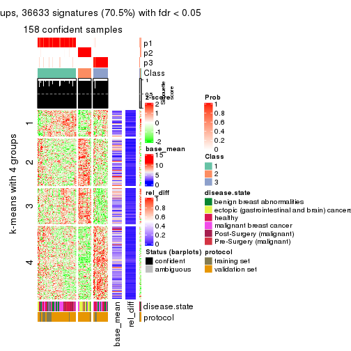</p>

</div>
<div id='tab-ATC-pam-get-signatures-3'>
<pre><code class="r">get_signatures(res, k = 4)
</code></pre>

<p></p>

</div>
<div id='tab-ATC-pam-get-signatures-4'>
<pre><code class="r">get_signatures(res, k = 5)
</code></pre>

<p></p>

</div>
<div id='tab-ATC-pam-get-signatures-5'>
<pre><code class="r">get_signatures(res, k = 6)
</code></pre>

<p></p>

</div>
</div>


Signature heatmaps where rows are not scaled:


<script>
$( function() {
	$( '#tabs-ATC-pam-get-signatures-no-scale' ).tabs();
} );
</script>
<div id='tabs-ATC-pam-get-signatures-no-scale'>
<ul>
<li><a href='#tab-ATC-pam-get-signatures-no-scale-1'>k = 2</a></li>
<li><a href='#tab-ATC-pam-get-signatures-no-scale-2'>k = 3</a></li>
<li><a href='#tab-ATC-pam-get-signatures-no-scale-3'>k = 4</a></li>
<li><a href='#tab-ATC-pam-get-signatures-no-scale-4'>k = 5</a></li>
<li><a href='#tab-ATC-pam-get-signatures-no-scale-5'>k = 6</a></li>
</ul>
<div id='tab-ATC-pam-get-signatures-no-scale-1'>
<pre><code class="r">get_signatures(res, k = 2, scale_rows = FALSE)
</code></pre>

<pre><code>#&gt; Error in mat[ceiling(1:nr/h_ratio), ceiling(1:nc/w_ratio), drop = FALSE]: subscript out of bounds
</code></pre>

<p></p>

</div>
<div id='tab-ATC-pam-get-signatures-no-scale-2'>
<pre><code class="r">get_signatures(res, k = 3, scale_rows = FALSE)
</code></pre>

<p></p>

</div>
<div id='tab-ATC-pam-get-signatures-no-scale-3'>
<pre><code class="r">get_signatures(res, k = 4, scale_rows = FALSE)
</code></pre>

<p></p>

</div>
<div id='tab-ATC-pam-get-signatures-no-scale-4'>
<pre><code class="r">get_signatures(res, k = 5, scale_rows = FALSE)
</code></pre>

<p></p>

</div>
<div id='tab-ATC-pam-get-signatures-no-scale-5'>
<pre><code class="r">get_signatures(res, k = 6, scale_rows = FALSE)
</code></pre>

<p></p>

</div>
</div>


Compare the overlap of signatures from different k:

```r
compare_signatures(res)
```


`get_signature()` returns a data frame invisibly. TO get the list of signatures, the function
call should be assigned to a variable explicitly. In following code, if `plot` argument is set
to `FALSE`, no heatmap is plotted while only the differential analysis is performed.

```r
# code only for demonstration
tb = get_signature(res, k = ..., plot = FALSE)
```

An example of the output of `tb` is:

```
#>   which_row         fdr    mean_1    mean_2 scaled_mean_1 scaled_mean_2 km
#> 1        38 0.042760348  8.373488  9.131774    -0.5533452     0.5164555  1
#> 2        40 0.018707592  7.106213  8.469186    -0.6173731     0.5762149  1
#> 3        55 0.019134737 10.221463 11.207825    -0.6159697     0.5749050  1
#> 4        59 0.006059896  5.921854  7.869574    -0.6899429     0.6439467  1
#> 5        60 0.018055526  8.928898 10.211722    -0.6204761     0.5791110  1
#> 6        98 0.009384629 15.714769 14.887706     0.6635654    -0.6193277  2
...
```

The columns in `tb` are:

1. `which_row`: row indices corresponding to the input matrix.
2. `fdr`: FDR for the differential test. 
3. `mean_x`: The mean value in group x.
4. `scaled_mean_x`: The mean value in group x after rows are scaled.
5. `km`: Row groups if k-means clustering is applied to rows.


UMAP plot which shows how samples are separated.


<script>
$( function() {
	$( '#tabs-ATC-pam-dimension-reduction' ).tabs();
} );
</script>
<div id='tabs-ATC-pam-dimension-reduction'>
<ul>
<li><a href='#tab-ATC-pam-dimension-reduction-1'>k = 2</a></li>
<li><a href='#tab-ATC-pam-dimension-reduction-2'>k = 3</a></li>
<li><a href='#tab-ATC-pam-dimension-reduction-3'>k = 4</a></li>
<li><a href='#tab-ATC-pam-dimension-reduction-4'>k = 5</a></li>
<li><a href='#tab-ATC-pam-dimension-reduction-5'>k = 6</a></li>
</ul>
<div id='tab-ATC-pam-dimension-reduction-1'>
<pre><code class="r">dimension_reduction(res, k = 2, method = &quot;UMAP&quot;)
</code></pre>

<p></p>

</div>
<div id='tab-ATC-pam-dimension-reduction-2'>
<pre><code class="r">dimension_reduction(res, k = 3, method = &quot;UMAP&quot;)
</code></pre>

<p></p>

</div>
<div id='tab-ATC-pam-dimension-reduction-3'>
<pre><code class="r">dimension_reduction(res, k = 4, method = &quot;UMAP&quot;)
</code></pre>

<p></p>

</div>
<div id='tab-ATC-pam-dimension-reduction-4'>
<pre><code class="r">dimension_reduction(res, k = 5, method = &quot;UMAP&quot;)
</code></pre>

<p></p>

</div>
<div id='tab-ATC-pam-dimension-reduction-5'>
<pre><code class="r">dimension_reduction(res, k = 6, method = &quot;UMAP&quot;)
</code></pre>

<p></p>

</div>
</div>


Following heatmap shows how subgroups are split when increasing `k`:

```r
collect_classes(res)
```


Test correlation between subgroups and known annotations. If the known
annotation is numeric, one-way ANOVA test is applied, and if the known
annotation is discrete, chi-squared contingency table test is applied.

```r
test_to_known_factors(res)
```

```
#>           n disease.state(p) protocol(p) k
#> ATC:pam 161         8.34e-11    7.87e-02 2
#> ATC:pam 158         5.78e-14    1.99e-02 3
#> ATC:pam 149         6.20e-18    1.37e-02 4
#> ATC:pam 120         3.56e-14    2.93e-09 5
#> ATC:pam 115         2.35e-11    4.53e-10 6
```


If matrix rows can be associated to genes, consider to use `GO_Enrichment(res,
...)` to perform function enrichment for the signature genes.


 

---------------------------------------------------


### ATC:mclust**


The object with results only for a single top-value method and a single partition method 
can be extracted as:

```r
res = res_list["ATC", "mclust"]
# you can also extract it by
# res = res_list["ATC:mclust"]
```

A summary of `res` and all the functions that can be applied to it:

```r
res
```

```
#> A 'ConsensusPartition' object with k = 2, 3, 4, 5, 6.
#>   On a matrix with 51941 rows and 162 columns.
#>   Top rows (1000, 2000, 3000, 4000, 5000) are extracted by 'ATC' method.
#>   Subgroups are detected by 'mclust' method.
#>   Performed in total 1250 partitions by row resampling.
#>   Best k for subgroups seems to be 2.
#> 
#> Following methods can be applied to this 'ConsensusPartition' object:
#>  [1] "cola_report"             "collect_classes"         "collect_plots"          
#>  [4] "collect_stats"           "colnames"                "compare_signatures"     
#>  [7] "consensus_heatmap"       "dimension_reduction"     "functional_enrichment"  
#> [10] "get_anno_col"            "get_anno"                "get_classes"            
#> [13] "get_consensus"           "get_matrix"              "get_membership"         
#> [16] "get_param"               "get_signatures"          "get_stats"              
#> [19] "is_best_k"               "is_stable_k"             "membership_heatmap"     
#> [22] "ncol"                    "nrow"                    "plot_ecdf"              
#> [25] "rownames"                "select_partition_number" "show"                   
#> [28] "suggest_best_k"          "test_to_known_factors"
```

`collect_plots()` function collects all the plots made from `res` for all `k` (number of partitions)
into one single page to provide an easy and fast comparison between different `k`.

```r
collect_plots(res)
```


The plots are:

- The first row: a plot of the ECDF (Empirical cumulative distribution
  function) curves of the consensus matrix for each `k` and the heatmap of
  predicted classes for each `k`.
- The second row: heatmaps of the consensus matrix for each `k`.
- The third row: heatmaps of the membership matrix for each `k`.
- The fouth row: heatmaps of the signatures for each `k`.

All the plots in panels can be made by individual functions and they are
plotted later in this section.

`select_partition_number()` produces several plots showing different
statistics for choosing "optimized" `k`. There are following statistics:

- ECDF curves of the consensus matrix for each `k`;
- 1-PAC. [The PAC
  score](https://en.wikipedia.org/wiki/Consensus_clustering#Over-interpretation_potential_of_consensus_clustering)
  measures the proportion of the ambiguous subgrouping.
- Mean silhouette score.
- Concordance. The mean probability of fiting the consensus class ids in all
  partitions.
- Area increased. Denote $A_k$ as the area under the ECDF curve for current
  `k`, the area increased is defined as $A_k - A_{k-1}$.
- Rand index. The percent of pairs of samples that are both in a same cluster
  or both are not in a same cluster in the partition of k and k-1.
- Jaccard index. The ratio of pairs of samples are both in a same cluster in
  the partition of k and k-1 and the pairs of samples are both in a same
  cluster in the partition k or k-1.

The detailed explanations of these statistics can be found in [the cola
vignette](http://bioconductor.org/packages/devel/bioc/vignettes/cola/inst/doc/cola.html#toc_13).

Generally speaking, lower PAC score, higher mean silhouette score or higher
concordance corresponds to better partition. Rand index and Jaccard index
measure how similar the current partition is compared to partition with `k-1`.
If they are too similar, we won't accept `k` is better than `k-1`.

```r
select_partition_number(res)
```


The numeric values for all these statistics can be obtained by `get_stats()`.

```r
get_stats(res)
```

```
#>   k 1-PAC mean_silhouette concordance area_increased  Rand Jaccard
#> 2 2 1.000           0.982       0.992         0.3605 0.639   0.639
#> 3 3 0.533           0.678       0.845         0.7359 0.699   0.530
#> 4 4 0.624           0.673       0.836         0.1211 0.870   0.654
#> 5 5 0.714           0.748       0.864         0.0554 0.967   0.885
#> 6 6 0.665           0.589       0.757         0.0652 0.881   0.591
```

`suggest_best_k()` suggests the best $k$ based on these statistics. The rules are as follows:

- All $k$ with Jaccard index larger than 0.95 are removed because the increase of
  the partition number does not provides enough extra information. If all $k$ are removed,
  the best $k$ is assigned by `NA`.
- For $k$ with 1-PAC larger than 0.9, the maximal $k$ is taken as the "best k". Other $k$ is called "optional k".
- If it does not fit the second rule. The $k$ with the highest vote of highest
  1-PAC, mean silhouette and concordance is taken as the "best k".

```r
suggest_best_k(res)
```

```
#> [1] 2
```


Following shows the table of the partitions (You need to click the **show/hide
code output** link to see it). The membership matrix (columns with name `p*`)
is inferred by
[`clue::cl_consensus()`](https://www.rdocumentation.org/link/cl_consensus?package=clue)
function with the `SE` method. Basically the value in the membership matrix
represents the probability to belong to a certain group. The finall class
label for an item is determined with the group with highest probability it
belongs to.

In `get_classes()` function, the entropy is calculated from the membership
matrix and the silhouette score is calculated from the consensus matrix.


<script>
$( function() {
	$( '#tabs-ATC-mclust-get-classes' ).tabs();
} );
</script>
<div id='tabs-ATC-mclust-get-classes'>
<ul>
<li><a href='#tab-ATC-mclust-get-classes-1'>k = 2</a></li>
<li><a href='#tab-ATC-mclust-get-classes-2'>k = 3</a></li>
<li><a href='#tab-ATC-mclust-get-classes-3'>k = 4</a></li>
<li><a href='#tab-ATC-mclust-get-classes-4'>k = 5</a></li>
<li><a href='#tab-ATC-mclust-get-classes-5'>k = 6</a></li>
</ul>

<div id='tab-ATC-mclust-get-classes-1'>
<p><a id='tab-ATC-mclust-get-classes-1-a' style='color:#0366d6' href='#'>show/hide code output</a></p>
<pre><code class="r">cbind(get_classes(res, k = 2), get_membership(res, k = 2))
</code></pre>

<pre><code>#&gt;           class entropy silhouette    p1    p2
#&gt; GSM682002     1  0.0000     0.9954 1.000 0.000
#&gt; GSM682003     1  0.9988     0.0337 0.520 0.480
#&gt; GSM682004     1  0.0938     0.9836 0.988 0.012
#&gt; GSM682005     1  0.0000     0.9954 1.000 0.000
#&gt; GSM682006     1  0.0000     0.9954 1.000 0.000
#&gt; GSM682007     1  0.0000     0.9954 1.000 0.000
#&gt; GSM682008     1  0.0000     0.9954 1.000 0.000
#&gt; GSM682009     1  0.0000     0.9954 1.000 0.000
#&gt; GSM682010     1  0.0000     0.9954 1.000 0.000
#&gt; GSM682011     1  0.0000     0.9954 1.000 0.000
#&gt; GSM682096     2  0.2948     0.9500 0.052 0.948
#&gt; GSM682097     2  0.4022     0.9240 0.080 0.920
#&gt; GSM682098     2  0.0000     0.9806 0.000 1.000
#&gt; GSM682099     2  0.0000     0.9806 0.000 1.000
#&gt; GSM682100     2  0.0000     0.9806 0.000 1.000
#&gt; GSM682101     2  0.0000     0.9806 0.000 1.000
#&gt; GSM682102     1  0.0000     0.9954 1.000 0.000
#&gt; GSM682103     1  0.0000     0.9954 1.000 0.000
#&gt; GSM682104     1  0.0000     0.9954 1.000 0.000
#&gt; GSM682105     1  0.0000     0.9954 1.000 0.000
#&gt; GSM682106     1  0.0000     0.9954 1.000 0.000
#&gt; GSM682107     1  0.0000     0.9954 1.000 0.000
#&gt; GSM682108     1  0.0000     0.9954 1.000 0.000
#&gt; GSM682109     1  0.0000     0.9954 1.000 0.000
#&gt; GSM682110     1  0.0000     0.9954 1.000 0.000
#&gt; GSM682111     1  0.0000     0.9954 1.000 0.000
#&gt; GSM682112     1  0.0000     0.9954 1.000 0.000
#&gt; GSM682113     1  0.0000     0.9954 1.000 0.000
#&gt; GSM682114     1  0.0000     0.9954 1.000 0.000
#&gt; GSM682115     1  0.0000     0.9954 1.000 0.000
#&gt; GSM682116     1  0.0000     0.9954 1.000 0.000
#&gt; GSM682117     1  0.0000     0.9954 1.000 0.000
#&gt; GSM682118     1  0.0000     0.9954 1.000 0.000
#&gt; GSM682119     1  0.0000     0.9954 1.000 0.000
#&gt; GSM682120     1  0.0000     0.9954 1.000 0.000
#&gt; GSM682121     1  0.0000     0.9954 1.000 0.000
#&gt; GSM682122     1  0.0000     0.9954 1.000 0.000
#&gt; GSM682012     2  0.3114     0.9471 0.056 0.944
#&gt; GSM682013     2  0.0000     0.9806 0.000 1.000
#&gt; GSM682014     2  0.0000     0.9806 0.000 1.000
#&gt; GSM682015     2  0.0000     0.9806 0.000 1.000
#&gt; GSM682016     2  0.3114     0.9471 0.056 0.944
#&gt; GSM682017     2  0.0000     0.9806 0.000 1.000
#&gt; GSM682018     2  0.0000     0.9806 0.000 1.000
#&gt; GSM682019     2  0.0000     0.9806 0.000 1.000
#&gt; GSM682020     2  0.0000     0.9806 0.000 1.000
#&gt; GSM682021     2  0.0000     0.9806 0.000 1.000
#&gt; GSM682022     2  0.0000     0.9806 0.000 1.000
#&gt; GSM682023     2  0.0000     0.9806 0.000 1.000
#&gt; GSM682024     2  0.2778     0.9528 0.048 0.952
#&gt; GSM682025     2  0.0000     0.9806 0.000 1.000
#&gt; GSM682026     2  0.0000     0.9806 0.000 1.000
#&gt; GSM682027     2  0.0000     0.9806 0.000 1.000
#&gt; GSM682028     2  0.0000     0.9806 0.000 1.000
#&gt; GSM682029     2  0.0000     0.9806 0.000 1.000
#&gt; GSM682030     2  0.0000     0.9806 0.000 1.000
#&gt; GSM682031     2  0.0000     0.9806 0.000 1.000
#&gt; GSM682032     2  0.0000     0.9806 0.000 1.000
#&gt; GSM682033     2  0.4690     0.9026 0.100 0.900
#&gt; GSM681992     1  0.0000     0.9954 1.000 0.000
#&gt; GSM681993     1  0.0000     0.9954 1.000 0.000
#&gt; GSM681994     1  0.0000     0.9954 1.000 0.000
#&gt; GSM681995     1  0.0000     0.9954 1.000 0.000
#&gt; GSM681996     1  0.0000     0.9954 1.000 0.000
#&gt; GSM681997     1  0.0000     0.9954 1.000 0.000
#&gt; GSM681998     1  0.0000     0.9954 1.000 0.000
#&gt; GSM681999     1  0.0000     0.9954 1.000 0.000
#&gt; GSM682000     1  0.0000     0.9954 1.000 0.000
#&gt; GSM682001     1  0.0000     0.9954 1.000 0.000
#&gt; GSM682055     2  0.3114     0.9471 0.056 0.944
#&gt; GSM682056     2  0.3114     0.9471 0.056 0.944
#&gt; GSM682057     2  0.0000     0.9806 0.000 1.000
#&gt; GSM682058     2  0.0938     0.9743 0.012 0.988
#&gt; GSM682059     2  0.0000     0.9806 0.000 1.000
#&gt; GSM682060     1  0.0000     0.9954 1.000 0.000
#&gt; GSM682061     1  0.0000     0.9954 1.000 0.000
#&gt; GSM682062     2  0.0000     0.9806 0.000 1.000
#&gt; GSM682063     2  0.0000     0.9806 0.000 1.000
#&gt; GSM682064     1  0.0000     0.9954 1.000 0.000
#&gt; GSM682065     1  0.0000     0.9954 1.000 0.000
#&gt; GSM682066     1  0.0000     0.9954 1.000 0.000
#&gt; GSM682067     1  0.0000     0.9954 1.000 0.000
#&gt; GSM682068     1  0.0000     0.9954 1.000 0.000
#&gt; GSM682069     1  0.0000     0.9954 1.000 0.000
#&gt; GSM682070     1  0.0000     0.9954 1.000 0.000
#&gt; GSM682071     1  0.0000     0.9954 1.000 0.000
#&gt; GSM682072     1  0.0000     0.9954 1.000 0.000
#&gt; GSM682073     1  0.0000     0.9954 1.000 0.000
#&gt; GSM682074     1  0.0000     0.9954 1.000 0.000
#&gt; GSM682075     1  0.0000     0.9954 1.000 0.000
#&gt; GSM682076     1  0.0000     0.9954 1.000 0.000
#&gt; GSM682077     1  0.0000     0.9954 1.000 0.000
#&gt; GSM682078     1  0.0000     0.9954 1.000 0.000
#&gt; GSM682079     1  0.0000     0.9954 1.000 0.000
#&gt; GSM682080     1  0.0000     0.9954 1.000 0.000
#&gt; GSM682081     1  0.0000     0.9954 1.000 0.000
#&gt; GSM682082     1  0.0000     0.9954 1.000 0.000
#&gt; GSM682083     1  0.0000     0.9954 1.000 0.000
#&gt; GSM682084     1  0.0000     0.9954 1.000 0.000
#&gt; GSM682085     1  0.0000     0.9954 1.000 0.000
#&gt; GSM682086     1  0.0000     0.9954 1.000 0.000
#&gt; GSM682087     1  0.0000     0.9954 1.000 0.000
#&gt; GSM682088     1  0.0000     0.9954 1.000 0.000
#&gt; GSM682089     1  0.0000     0.9954 1.000 0.000
#&gt; GSM682090     1  0.0000     0.9954 1.000 0.000
#&gt; GSM682091     1  0.0000     0.9954 1.000 0.000
#&gt; GSM682092     1  0.0000     0.9954 1.000 0.000
#&gt; GSM682093     1  0.0000     0.9954 1.000 0.000
#&gt; GSM682094     1  0.0000     0.9954 1.000 0.000
#&gt; GSM682095     1  0.2778     0.9451 0.952 0.048
#&gt; GSM681982     1  0.0000     0.9954 1.000 0.000
#&gt; GSM681983     1  0.0000     0.9954 1.000 0.000
#&gt; GSM681984     1  0.0000     0.9954 1.000 0.000
#&gt; GSM681985     1  0.0000     0.9954 1.000 0.000
#&gt; GSM681986     1  0.0000     0.9954 1.000 0.000
#&gt; GSM681987     1  0.0376     0.9915 0.996 0.004
#&gt; GSM681988     1  0.0000     0.9954 1.000 0.000
#&gt; GSM681989     1  0.0000     0.9954 1.000 0.000
#&gt; GSM681990     1  0.0000     0.9954 1.000 0.000
#&gt; GSM681991     1  0.0672     0.9876 0.992 0.008
#&gt; GSM682034     1  0.0000     0.9954 1.000 0.000
#&gt; GSM682035     1  0.0000     0.9954 1.000 0.000
#&gt; GSM682036     1  0.0000     0.9954 1.000 0.000
#&gt; GSM682037     1  0.0000     0.9954 1.000 0.000
#&gt; GSM682038     1  0.0000     0.9954 1.000 0.000
#&gt; GSM682039     1  0.0000     0.9954 1.000 0.000
#&gt; GSM682040     1  0.0000     0.9954 1.000 0.000
#&gt; GSM682041     1  0.0000     0.9954 1.000 0.000
#&gt; GSM682042     1  0.0000     0.9954 1.000 0.000
#&gt; GSM682043     1  0.0000     0.9954 1.000 0.000
#&gt; GSM682044     1  0.0000     0.9954 1.000 0.000
#&gt; GSM682045     1  0.0000     0.9954 1.000 0.000
#&gt; GSM682046     1  0.0000     0.9954 1.000 0.000
#&gt; GSM682047     1  0.0000     0.9954 1.000 0.000
#&gt; GSM682048     1  0.0000     0.9954 1.000 0.000
#&gt; GSM682049     1  0.0000     0.9954 1.000 0.000
#&gt; GSM682050     1  0.0000     0.9954 1.000 0.000
#&gt; GSM682051     1  0.0000     0.9954 1.000 0.000
#&gt; GSM682052     1  0.0000     0.9954 1.000 0.000
#&gt; GSM682053     1  0.0000     0.9954 1.000 0.000
#&gt; GSM682054     1  0.0000     0.9954 1.000 0.000
#&gt; GSM682123     1  0.0000     0.9954 1.000 0.000
#&gt; GSM682124     1  0.0000     0.9954 1.000 0.000
#&gt; GSM682125     1  0.0000     0.9954 1.000 0.000
#&gt; GSM682126     1  0.0000     0.9954 1.000 0.000
#&gt; GSM682127     1  0.0000     0.9954 1.000 0.000
#&gt; GSM682128     1  0.0000     0.9954 1.000 0.000
#&gt; GSM682129     2  0.0000     0.9806 0.000 1.000
#&gt; GSM682130     2  0.0000     0.9806 0.000 1.000
#&gt; GSM682131     2  0.7219     0.7694 0.200 0.800
#&gt; GSM682132     1  0.0000     0.9954 1.000 0.000
#&gt; GSM682133     1  0.0000     0.9954 1.000 0.000
#&gt; GSM682134     1  0.0000     0.9954 1.000 0.000
#&gt; GSM682135     1  0.0000     0.9954 1.000 0.000
#&gt; GSM682136     1  0.0000     0.9954 1.000 0.000
#&gt; GSM682137     1  0.0000     0.9954 1.000 0.000
#&gt; GSM682138     1  0.0000     0.9954 1.000 0.000
#&gt; GSM682139     1  0.0000     0.9954 1.000 0.000
#&gt; GSM682140     1  0.0000     0.9954 1.000 0.000
#&gt; GSM682141     1  0.0000     0.9954 1.000 0.000
#&gt; GSM682142     1  0.0000     0.9954 1.000 0.000
#&gt; GSM682143     1  0.0000     0.9954 1.000 0.000
</code></pre>

<script>
$('#tab-ATC-mclust-get-classes-1-a').parent().next().next().hide();
$('#tab-ATC-mclust-get-classes-1-a').click(function(){
  $('#tab-ATC-mclust-get-classes-1-a').parent().next().next().toggle();
  return(false);
});
</script>
</div>

<div id='tab-ATC-mclust-get-classes-2'>
<p><a id='tab-ATC-mclust-get-classes-2-a' style='color:#0366d6' href='#'>show/hide code output</a></p>
<pre><code class="r">cbind(get_classes(res, k = 3), get_membership(res, k = 3))
</code></pre>

<pre><code>#&gt;           class entropy silhouette    p1    p2    p3
#&gt; GSM682002     3  0.2356     0.7500 0.072 0.000 0.928
#&gt; GSM682003     2  0.6476     0.2428 0.004 0.548 0.448
#&gt; GSM682004     1  0.5785     0.6296 0.668 0.000 0.332
#&gt; GSM682005     3  0.0237     0.7783 0.004 0.000 0.996
#&gt; GSM682006     3  0.1753     0.7512 0.048 0.000 0.952
#&gt; GSM682007     3  0.0424     0.7787 0.008 0.000 0.992
#&gt; GSM682008     3  0.0237     0.7783 0.004 0.000 0.996
#&gt; GSM682009     1  0.5254     0.6961 0.736 0.000 0.264
#&gt; GSM682010     3  0.5968     0.3544 0.364 0.000 0.636
#&gt; GSM682011     3  0.3412     0.6682 0.124 0.000 0.876
#&gt; GSM682096     2  0.1453     0.9609 0.008 0.968 0.024
#&gt; GSM682097     2  0.1999     0.9493 0.012 0.952 0.036
#&gt; GSM682098     2  0.0424     0.9729 0.008 0.992 0.000
#&gt; GSM682099     2  0.0000     0.9753 0.000 1.000 0.000
#&gt; GSM682100     2  0.0000     0.9753 0.000 1.000 0.000
#&gt; GSM682101     2  0.0000     0.9753 0.000 1.000 0.000
#&gt; GSM682102     1  0.6079     0.5596 0.612 0.000 0.388
#&gt; GSM682103     3  0.3267     0.7145 0.116 0.000 0.884
#&gt; GSM682104     3  0.4796     0.5925 0.220 0.000 0.780
#&gt; GSM682105     3  0.6274    -0.1540 0.456 0.000 0.544
#&gt; GSM682106     3  0.0237     0.7775 0.004 0.000 0.996
#&gt; GSM682107     1  0.6154     0.5256 0.592 0.000 0.408
#&gt; GSM682108     1  0.3686     0.7234 0.860 0.000 0.140
#&gt; GSM682109     1  0.4750     0.6834 0.784 0.000 0.216
#&gt; GSM682110     1  0.5882     0.5882 0.652 0.000 0.348
#&gt; GSM682111     3  0.4399     0.6703 0.188 0.000 0.812
#&gt; GSM682112     1  0.6260     0.0336 0.552 0.000 0.448
#&gt; GSM682113     1  0.1964     0.7205 0.944 0.000 0.056
#&gt; GSM682114     1  0.6267     0.0319 0.548 0.000 0.452
#&gt; GSM682115     3  0.0424     0.7787 0.008 0.000 0.992
#&gt; GSM682116     3  0.0424     0.7787 0.008 0.000 0.992
#&gt; GSM682117     1  0.1529     0.7100 0.960 0.000 0.040
#&gt; GSM682118     3  0.6126     0.2620 0.400 0.000 0.600
#&gt; GSM682119     1  0.2625     0.7187 0.916 0.000 0.084
#&gt; GSM682120     3  0.0424     0.7787 0.008 0.000 0.992
#&gt; GSM682121     3  0.2796     0.7208 0.092 0.000 0.908
#&gt; GSM682122     3  0.0000     0.7773 0.000 0.000 1.000
#&gt; GSM682012     2  0.1620     0.9597 0.012 0.964 0.024
#&gt; GSM682013     2  0.0000     0.9753 0.000 1.000 0.000
#&gt; GSM682014     2  0.0000     0.9753 0.000 1.000 0.000
#&gt; GSM682015     2  0.0000     0.9753 0.000 1.000 0.000
#&gt; GSM682016     2  0.1620     0.9597 0.012 0.964 0.024
#&gt; GSM682017     2  0.0000     0.9753 0.000 1.000 0.000
#&gt; GSM682018     2  0.0000     0.9753 0.000 1.000 0.000
#&gt; GSM682019     2  0.0000     0.9753 0.000 1.000 0.000
#&gt; GSM682020     2  0.0000     0.9753 0.000 1.000 0.000
#&gt; GSM682021     2  0.0000     0.9753 0.000 1.000 0.000
#&gt; GSM682022     2  0.0000     0.9753 0.000 1.000 0.000
#&gt; GSM682023     2  0.0424     0.9729 0.008 0.992 0.000
#&gt; GSM682024     2  0.1267     0.9618 0.004 0.972 0.024
#&gt; GSM682025     2  0.0000     0.9753 0.000 1.000 0.000
#&gt; GSM682026     2  0.0000     0.9753 0.000 1.000 0.000
#&gt; GSM682027     2  0.0000     0.9753 0.000 1.000 0.000
#&gt; GSM682028     2  0.0000     0.9753 0.000 1.000 0.000
#&gt; GSM682029     2  0.0000     0.9753 0.000 1.000 0.000
#&gt; GSM682030     2  0.0000     0.9753 0.000 1.000 0.000
#&gt; GSM682031     2  0.0000     0.9753 0.000 1.000 0.000
#&gt; GSM682032     2  0.0000     0.9753 0.000 1.000 0.000
#&gt; GSM682033     2  0.1832     0.9480 0.036 0.956 0.008
#&gt; GSM681992     1  0.6267     0.4353 0.548 0.000 0.452
#&gt; GSM681993     3  0.0000     0.7773 0.000 0.000 1.000
#&gt; GSM681994     3  0.0237     0.7783 0.004 0.000 0.996
#&gt; GSM681995     3  0.0424     0.7773 0.008 0.000 0.992
#&gt; GSM681996     3  0.0000     0.7773 0.000 0.000 1.000
#&gt; GSM681997     3  0.0424     0.7787 0.008 0.000 0.992
#&gt; GSM681998     3  0.1753     0.7640 0.048 0.000 0.952
#&gt; GSM681999     1  0.6095     0.5510 0.608 0.000 0.392
#&gt; GSM682000     3  0.1163     0.7658 0.028 0.000 0.972
#&gt; GSM682001     1  0.6154     0.5256 0.592 0.000 0.408
#&gt; GSM682055     2  0.1620     0.9597 0.012 0.964 0.024
#&gt; GSM682056     2  0.1620     0.9597 0.012 0.964 0.024
#&gt; GSM682057     2  0.0000     0.9753 0.000 1.000 0.000
#&gt; GSM682058     2  0.0848     0.9696 0.008 0.984 0.008
#&gt; GSM682059     2  0.0000     0.9753 0.000 1.000 0.000
#&gt; GSM682060     1  0.5397     0.6246 0.720 0.000 0.280
#&gt; GSM682061     3  0.6204     0.2931 0.424 0.000 0.576
#&gt; GSM682062     2  0.0000     0.9753 0.000 1.000 0.000
#&gt; GSM682063     2  0.0000     0.9753 0.000 1.000 0.000
#&gt; GSM682064     1  0.5706     0.6239 0.680 0.000 0.320
#&gt; GSM682065     1  0.2261     0.7250 0.932 0.000 0.068
#&gt; GSM682066     1  0.6302     0.3510 0.520 0.000 0.480
#&gt; GSM682067     1  0.4974     0.7138 0.764 0.000 0.236
#&gt; GSM682068     1  0.6154     0.5256 0.592 0.000 0.408
#&gt; GSM682069     1  0.1289     0.7081 0.968 0.000 0.032
#&gt; GSM682070     1  0.1411     0.7105 0.964 0.000 0.036
#&gt; GSM682071     3  0.0237     0.7775 0.004 0.000 0.996
#&gt; GSM682072     3  0.6192     0.2793 0.420 0.000 0.580
#&gt; GSM682073     3  0.6008     0.3971 0.372 0.000 0.628
#&gt; GSM682074     3  0.0424     0.7787 0.008 0.000 0.992
#&gt; GSM682075     3  0.0237     0.7783 0.004 0.000 0.996
#&gt; GSM682076     3  0.0424     0.7787 0.008 0.000 0.992
#&gt; GSM682077     1  0.3038     0.7389 0.896 0.000 0.104
#&gt; GSM682078     3  0.3816     0.6844 0.148 0.000 0.852
#&gt; GSM682079     3  0.4504     0.6306 0.196 0.000 0.804
#&gt; GSM682080     3  0.6045     0.4067 0.380 0.000 0.620
#&gt; GSM682081     3  0.5968     0.4126 0.364 0.000 0.636
#&gt; GSM682082     3  0.0000     0.7773 0.000 0.000 1.000
#&gt; GSM682083     3  0.0592     0.7781 0.012 0.000 0.988
#&gt; GSM682084     1  0.6235     0.0792 0.564 0.000 0.436
#&gt; GSM682085     1  0.6267     0.0319 0.548 0.000 0.452
#&gt; GSM682086     1  0.3686     0.7376 0.860 0.000 0.140
#&gt; GSM682087     3  0.0000     0.7773 0.000 0.000 1.000
#&gt; GSM682088     1  0.3619     0.6993 0.864 0.000 0.136
#&gt; GSM682089     3  0.5859     0.4406 0.344 0.000 0.656
#&gt; GSM682090     3  0.0424     0.7787 0.008 0.000 0.992
#&gt; GSM682091     1  0.6154     0.5256 0.592 0.000 0.408
#&gt; GSM682092     3  0.6026     0.1603 0.376 0.000 0.624
#&gt; GSM682093     3  0.6267    -0.0818 0.452 0.000 0.548
#&gt; GSM682094     1  0.5058     0.6889 0.756 0.000 0.244
#&gt; GSM682095     1  0.5948     0.5602 0.640 0.000 0.360
#&gt; GSM681982     3  0.0000     0.7773 0.000 0.000 1.000
#&gt; GSM681983     3  0.5621     0.2666 0.308 0.000 0.692
#&gt; GSM681984     3  0.5291     0.5148 0.268 0.000 0.732
#&gt; GSM681985     3  0.6062     0.3474 0.384 0.000 0.616
#&gt; GSM681986     1  0.3879     0.7200 0.848 0.000 0.152
#&gt; GSM681987     1  0.5178     0.6532 0.744 0.000 0.256
#&gt; GSM681988     3  0.0000     0.7773 0.000 0.000 1.000
#&gt; GSM681989     3  0.5926     0.2889 0.356 0.000 0.644
#&gt; GSM681990     3  0.5431     0.4852 0.284 0.000 0.716
#&gt; GSM681991     1  0.5706     0.6010 0.680 0.000 0.320
#&gt; GSM682034     1  0.2878     0.7320 0.904 0.000 0.096
#&gt; GSM682035     1  0.2878     0.7337 0.904 0.000 0.096
#&gt; GSM682036     1  0.3619     0.7301 0.864 0.000 0.136
#&gt; GSM682037     1  0.4062     0.7291 0.836 0.000 0.164
#&gt; GSM682038     1  0.5926     0.5753 0.644 0.000 0.356
#&gt; GSM682039     1  0.3038     0.7235 0.896 0.000 0.104
#&gt; GSM682040     1  0.6252     0.0461 0.556 0.000 0.444
#&gt; GSM682041     1  0.3686     0.6965 0.860 0.000 0.140
#&gt; GSM682042     3  0.6154     0.3267 0.408 0.000 0.592
#&gt; GSM682043     1  0.2796     0.7315 0.908 0.000 0.092
#&gt; GSM682044     1  0.2537     0.7289 0.920 0.000 0.080
#&gt; GSM682045     1  0.2356     0.7323 0.928 0.000 0.072
#&gt; GSM682046     1  0.3482     0.7327 0.872 0.000 0.128
#&gt; GSM682047     3  0.6079     0.3268 0.388 0.000 0.612
#&gt; GSM682048     1  0.2261     0.7250 0.932 0.000 0.068
#&gt; GSM682049     3  0.6299     0.0655 0.476 0.000 0.524
#&gt; GSM682050     1  0.4062     0.7255 0.836 0.000 0.164
#&gt; GSM682051     1  0.6235     0.0792 0.564 0.000 0.436
#&gt; GSM682052     1  0.6274     0.0183 0.544 0.000 0.456
#&gt; GSM682053     1  0.3752     0.6960 0.856 0.000 0.144
#&gt; GSM682054     1  0.2878     0.7320 0.904 0.000 0.096
#&gt; GSM682123     1  0.4121     0.7288 0.832 0.000 0.168
#&gt; GSM682124     1  0.5621     0.6290 0.692 0.000 0.308
#&gt; GSM682125     3  0.1031     0.7754 0.024 0.000 0.976
#&gt; GSM682126     1  0.2959     0.7320 0.900 0.000 0.100
#&gt; GSM682127     1  0.1964     0.7196 0.944 0.000 0.056
#&gt; GSM682128     3  0.0237     0.7783 0.004 0.000 0.996
#&gt; GSM682129     2  0.0237     0.9741 0.004 0.996 0.000
#&gt; GSM682130     2  0.0000     0.9753 0.000 1.000 0.000
#&gt; GSM682131     2  0.4963     0.7406 0.008 0.792 0.200
#&gt; GSM682132     3  0.1129     0.7646 0.004 0.020 0.976
#&gt; GSM682133     1  0.6295     0.4009 0.528 0.000 0.472
#&gt; GSM682134     1  0.3116     0.7317 0.892 0.000 0.108
#&gt; GSM682135     1  0.3752     0.7392 0.856 0.000 0.144
#&gt; GSM682136     1  0.3879     0.7297 0.848 0.000 0.152
#&gt; GSM682137     3  0.0237     0.7783 0.004 0.000 0.996
#&gt; GSM682138     1  0.6309     0.0369 0.504 0.000 0.496
#&gt; GSM682139     1  0.4178     0.7295 0.828 0.000 0.172
#&gt; GSM682140     3  0.5098     0.5717 0.248 0.000 0.752
#&gt; GSM682141     1  0.5560     0.6385 0.700 0.000 0.300
#&gt; GSM682142     1  0.2959     0.7334 0.900 0.000 0.100
#&gt; GSM682143     1  0.3340     0.7117 0.880 0.000 0.120
</code></pre>

<script>
$('#tab-ATC-mclust-get-classes-2-a').parent().next().next().hide();
$('#tab-ATC-mclust-get-classes-2-a').click(function(){
  $('#tab-ATC-mclust-get-classes-2-a').parent().next().next().toggle();
  return(false);
});
</script>
</div>

<div id='tab-ATC-mclust-get-classes-3'>
<p><a id='tab-ATC-mclust-get-classes-3-a' style='color:#0366d6' href='#'>show/hide code output</a></p>
<pre><code class="r">cbind(get_classes(res, k = 4), get_membership(res, k = 4))
</code></pre>

<pre><code>#&gt;           class entropy silhouette    p1    p2    p3    p4
#&gt; GSM682002     4  0.0592     0.8161 0.016 0.000 0.000 0.984
#&gt; GSM682003     4  0.5441     0.2843 0.004 0.396 0.012 0.588
#&gt; GSM682004     1  0.7393     0.2143 0.488 0.000 0.332 0.180
#&gt; GSM682005     4  0.0592     0.8065 0.016 0.000 0.000 0.984
#&gt; GSM682006     4  0.0469     0.8167 0.012 0.000 0.000 0.988
#&gt; GSM682007     4  0.0000     0.8213 0.000 0.000 0.000 1.000
#&gt; GSM682008     4  0.0000     0.8213 0.000 0.000 0.000 1.000
#&gt; GSM682009     1  0.5165     0.6272 0.752 0.000 0.168 0.080
#&gt; GSM682010     1  0.6894     0.2651 0.512 0.000 0.112 0.376
#&gt; GSM682011     4  0.0921     0.8084 0.028 0.000 0.000 0.972
#&gt; GSM682096     2  0.1004     0.9704 0.024 0.972 0.004 0.000
#&gt; GSM682097     2  0.1975     0.9525 0.048 0.936 0.016 0.000
#&gt; GSM682098     2  0.1297     0.9671 0.020 0.964 0.016 0.000
#&gt; GSM682099     2  0.0000     0.9810 0.000 1.000 0.000 0.000
#&gt; GSM682100     2  0.0000     0.9810 0.000 1.000 0.000 0.000
#&gt; GSM682101     2  0.0000     0.9810 0.000 1.000 0.000 0.000
#&gt; GSM682102     1  0.4382     0.5720 0.704 0.000 0.000 0.296
#&gt; GSM682103     4  0.2775     0.7560 0.020 0.000 0.084 0.896
#&gt; GSM682104     4  0.6366     0.4566 0.240 0.000 0.120 0.640
#&gt; GSM682105     4  0.6553     0.3108 0.316 0.000 0.100 0.584
#&gt; GSM682106     4  0.0000     0.8213 0.000 0.000 0.000 1.000
#&gt; GSM682107     1  0.6804     0.3514 0.520 0.000 0.104 0.376
#&gt; GSM682108     1  0.5085     0.4217 0.676 0.000 0.304 0.020
#&gt; GSM682109     3  0.4933     0.5274 0.296 0.000 0.688 0.016
#&gt; GSM682110     1  0.6516     0.4392 0.592 0.000 0.308 0.100
#&gt; GSM682111     4  0.5367     0.4517 0.032 0.000 0.304 0.664
#&gt; GSM682112     3  0.6167     0.6193 0.256 0.000 0.648 0.096
#&gt; GSM682113     1  0.4874     0.6031 0.764 0.000 0.180 0.056
#&gt; GSM682114     3  0.6423     0.6460 0.196 0.000 0.648 0.156
#&gt; GSM682115     4  0.0000     0.8213 0.000 0.000 0.000 1.000
#&gt; GSM682116     4  0.0000     0.8213 0.000 0.000 0.000 1.000
#&gt; GSM682117     1  0.4053     0.4476 0.768 0.000 0.228 0.004
#&gt; GSM682118     1  0.7079     0.4174 0.556 0.000 0.168 0.276
#&gt; GSM682119     1  0.4401     0.3878 0.724 0.000 0.272 0.004
#&gt; GSM682120     4  0.0000     0.8213 0.000 0.000 0.000 1.000
#&gt; GSM682121     4  0.1637     0.7776 0.060 0.000 0.000 0.940
#&gt; GSM682122     4  0.0000     0.8213 0.000 0.000 0.000 1.000
#&gt; GSM682012     2  0.1975     0.9525 0.048 0.936 0.016 0.000
#&gt; GSM682013     2  0.0000     0.9810 0.000 1.000 0.000 0.000
#&gt; GSM682014     2  0.0000     0.9810 0.000 1.000 0.000 0.000
#&gt; GSM682015     2  0.0000     0.9810 0.000 1.000 0.000 0.000
#&gt; GSM682016     2  0.1975     0.9525 0.048 0.936 0.016 0.000
#&gt; GSM682017     2  0.0000     0.9810 0.000 1.000 0.000 0.000
#&gt; GSM682018     2  0.0000     0.9810 0.000 1.000 0.000 0.000
#&gt; GSM682019     2  0.0000     0.9810 0.000 1.000 0.000 0.000
#&gt; GSM682020     2  0.0000     0.9810 0.000 1.000 0.000 0.000
#&gt; GSM682021     2  0.0000     0.9810 0.000 1.000 0.000 0.000
#&gt; GSM682022     2  0.0000     0.9810 0.000 1.000 0.000 0.000
#&gt; GSM682023     2  0.0336     0.9785 0.000 0.992 0.008 0.000
#&gt; GSM682024     2  0.0895     0.9718 0.020 0.976 0.004 0.000
#&gt; GSM682025     2  0.0000     0.9810 0.000 1.000 0.000 0.000
#&gt; GSM682026     2  0.0000     0.9810 0.000 1.000 0.000 0.000
#&gt; GSM682027     2  0.0000     0.9810 0.000 1.000 0.000 0.000
#&gt; GSM682028     2  0.0000     0.9810 0.000 1.000 0.000 0.000
#&gt; GSM682029     2  0.0000     0.9810 0.000 1.000 0.000 0.000
#&gt; GSM682030     2  0.0000     0.9810 0.000 1.000 0.000 0.000
#&gt; GSM682031     2  0.0000     0.9810 0.000 1.000 0.000 0.000
#&gt; GSM682032     2  0.0000     0.9810 0.000 1.000 0.000 0.000
#&gt; GSM682033     2  0.2483     0.9383 0.052 0.916 0.032 0.000
#&gt; GSM681992     4  0.6939     0.2112 0.332 0.000 0.128 0.540
#&gt; GSM681993     4  0.0000     0.8213 0.000 0.000 0.000 1.000
#&gt; GSM681994     4  0.0000     0.8213 0.000 0.000 0.000 1.000
#&gt; GSM681995     4  0.0188     0.8203 0.004 0.000 0.000 0.996
#&gt; GSM681996     4  0.0000     0.8213 0.000 0.000 0.000 1.000
#&gt; GSM681997     4  0.0336     0.8191 0.008 0.000 0.000 0.992
#&gt; GSM681998     4  0.1211     0.8031 0.040 0.000 0.000 0.960
#&gt; GSM681999     1  0.6609     0.5104 0.620 0.000 0.144 0.236
#&gt; GSM682000     4  0.0469     0.8167 0.012 0.000 0.000 0.988
#&gt; GSM682001     1  0.6669     0.4455 0.572 0.000 0.108 0.320
#&gt; GSM682055     2  0.1975     0.9525 0.048 0.936 0.016 0.000
#&gt; GSM682056     2  0.1975     0.9525 0.048 0.936 0.016 0.000
#&gt; GSM682057     2  0.0000     0.9810 0.000 1.000 0.000 0.000
#&gt; GSM682058     2  0.1297     0.9671 0.020 0.964 0.016 0.000
#&gt; GSM682059     2  0.0000     0.9810 0.000 1.000 0.000 0.000
#&gt; GSM682060     3  0.6454     0.1367 0.344 0.000 0.572 0.084
#&gt; GSM682061     3  0.0927     0.5479 0.008 0.000 0.976 0.016
#&gt; GSM682062     2  0.0000     0.9810 0.000 1.000 0.000 0.000
#&gt; GSM682063     2  0.0000     0.9810 0.000 1.000 0.000 0.000
#&gt; GSM682064     1  0.4175     0.6544 0.776 0.000 0.012 0.212
#&gt; GSM682065     1  0.1716     0.7162 0.936 0.000 0.000 0.064
#&gt; GSM682066     4  0.6412     0.3191 0.320 0.000 0.088 0.592
#&gt; GSM682067     1  0.3198     0.7166 0.880 0.000 0.040 0.080
#&gt; GSM682068     1  0.5721     0.5386 0.660 0.000 0.056 0.284
#&gt; GSM682069     1  0.4234     0.6105 0.816 0.000 0.132 0.052
#&gt; GSM682070     1  0.4932     0.5163 0.728 0.000 0.240 0.032
#&gt; GSM682071     4  0.0000     0.8213 0.000 0.000 0.000 1.000
#&gt; GSM682072     3  0.5894     0.6312 0.200 0.000 0.692 0.108
#&gt; GSM682073     3  0.5358     0.5832 0.048 0.000 0.700 0.252
#&gt; GSM682074     4  0.0000     0.8213 0.000 0.000 0.000 1.000
#&gt; GSM682075     4  0.0000     0.8213 0.000 0.000 0.000 1.000
#&gt; GSM682076     4  0.0000     0.8213 0.000 0.000 0.000 1.000
#&gt; GSM682077     1  0.1792     0.7186 0.932 0.000 0.000 0.068
#&gt; GSM682078     4  0.2915     0.7549 0.028 0.000 0.080 0.892
#&gt; GSM682079     4  0.5690     0.5553 0.196 0.000 0.096 0.708
#&gt; GSM682080     4  0.6504     0.3447 0.148 0.000 0.216 0.636
#&gt; GSM682081     3  0.5141     0.5541 0.032 0.000 0.700 0.268
#&gt; GSM682082     4  0.0000     0.8213 0.000 0.000 0.000 1.000
#&gt; GSM682083     4  0.0000     0.8213 0.000 0.000 0.000 1.000
#&gt; GSM682084     3  0.5420     0.5134 0.352 0.000 0.624 0.024
#&gt; GSM682085     3  0.6655     0.6346 0.184 0.000 0.624 0.192
#&gt; GSM682086     1  0.2081     0.7221 0.916 0.000 0.000 0.084
#&gt; GSM682087     4  0.0000     0.8213 0.000 0.000 0.000 1.000
#&gt; GSM682088     1  0.5506    -0.2944 0.512 0.000 0.472 0.016
#&gt; GSM682089     4  0.4289     0.6538 0.172 0.000 0.032 0.796
#&gt; GSM682090     4  0.0000     0.8213 0.000 0.000 0.000 1.000
#&gt; GSM682091     1  0.7200     0.3046 0.484 0.000 0.144 0.372
#&gt; GSM682092     4  0.5910     0.5032 0.236 0.000 0.088 0.676
#&gt; GSM682093     4  0.7242     0.0302 0.376 0.000 0.148 0.476
#&gt; GSM682094     1  0.3726     0.6571 0.788 0.000 0.000 0.212
#&gt; GSM682095     3  0.6351     0.1315 0.332 0.000 0.588 0.080
#&gt; GSM681982     4  0.0000     0.8213 0.000 0.000 0.000 1.000
#&gt; GSM681983     4  0.0469     0.8167 0.012 0.000 0.000 0.988
#&gt; GSM681984     4  0.6739     0.3067 0.304 0.000 0.120 0.576
#&gt; GSM681985     4  0.5751     0.5689 0.164 0.000 0.124 0.712
#&gt; GSM681986     1  0.5792     0.4705 0.648 0.000 0.296 0.056
#&gt; GSM681987     3  0.5903     0.1587 0.332 0.000 0.616 0.052
#&gt; GSM681988     4  0.0000     0.8213 0.000 0.000 0.000 1.000
#&gt; GSM681989     4  0.6370     0.4043 0.280 0.000 0.100 0.620
#&gt; GSM681990     4  0.7151    -0.1450 0.420 0.000 0.132 0.448
#&gt; GSM681991     3  0.6041     0.1517 0.332 0.000 0.608 0.060
#&gt; GSM682034     1  0.1792     0.7190 0.932 0.000 0.000 0.068
#&gt; GSM682035     1  0.1792     0.7186 0.932 0.000 0.000 0.068
#&gt; GSM682036     1  0.5172     0.6118 0.744 0.000 0.188 0.068
#&gt; GSM682037     1  0.2469     0.7178 0.892 0.000 0.000 0.108
#&gt; GSM682038     1  0.7792     0.0771 0.416 0.000 0.324 0.260
#&gt; GSM682039     1  0.4770     0.4180 0.700 0.000 0.288 0.012
#&gt; GSM682040     3  0.6390     0.6396 0.224 0.000 0.644 0.132
#&gt; GSM682041     1  0.5497    -0.2733 0.524 0.000 0.460 0.016
#&gt; GSM682042     3  0.6378     0.5891 0.108 0.000 0.628 0.264
#&gt; GSM682043     1  0.1792     0.7186 0.932 0.000 0.000 0.068
#&gt; GSM682044     1  0.1792     0.7186 0.932 0.000 0.000 0.068
#&gt; GSM682045     1  0.2011     0.7223 0.920 0.000 0.000 0.080
#&gt; GSM682046     1  0.2081     0.7221 0.916 0.000 0.000 0.084
#&gt; GSM682047     4  0.5111     0.5960 0.204 0.000 0.056 0.740
#&gt; GSM682048     1  0.1792     0.7186 0.932 0.000 0.000 0.068
#&gt; GSM682049     1  0.4661     0.3008 0.652 0.000 0.000 0.348
#&gt; GSM682050     1  0.2647     0.7128 0.880 0.000 0.000 0.120
#&gt; GSM682051     3  0.6506     0.3545 0.460 0.000 0.468 0.072
#&gt; GSM682052     3  0.6550     0.6411 0.184 0.000 0.636 0.180
#&gt; GSM682053     3  0.5511     0.2913 0.484 0.000 0.500 0.016
#&gt; GSM682054     1  0.1792     0.7190 0.932 0.000 0.000 0.068
#&gt; GSM682123     1  0.2589     0.7152 0.884 0.000 0.000 0.116
#&gt; GSM682124     1  0.4072     0.6188 0.748 0.000 0.000 0.252
#&gt; GSM682125     4  0.0336     0.8180 0.008 0.000 0.000 0.992
#&gt; GSM682126     1  0.1792     0.7190 0.932 0.000 0.000 0.068
#&gt; GSM682127     1  0.1792     0.7186 0.932 0.000 0.000 0.068
#&gt; GSM682128     4  0.0000     0.8213 0.000 0.000 0.000 1.000
#&gt; GSM682129     2  0.0336     0.9783 0.000 0.992 0.008 0.000
#&gt; GSM682130     2  0.0000     0.9810 0.000 1.000 0.000 0.000
#&gt; GSM682131     2  0.4931     0.6704 0.028 0.760 0.012 0.200
#&gt; GSM682132     4  0.1624     0.7791 0.020 0.028 0.000 0.952
#&gt; GSM682133     4  0.5151    -0.0266 0.464 0.000 0.004 0.532
#&gt; GSM682134     1  0.1792     0.7190 0.932 0.000 0.000 0.068
#&gt; GSM682135     1  0.2271     0.7213 0.916 0.000 0.008 0.076
#&gt; GSM682136     1  0.2408     0.7179 0.896 0.000 0.000 0.104
#&gt; GSM682137     4  0.0188     0.8203 0.004 0.000 0.000 0.996
#&gt; GSM682138     1  0.3219     0.6651 0.836 0.000 0.000 0.164
#&gt; GSM682139     1  0.2081     0.7221 0.916 0.000 0.000 0.084
#&gt; GSM682140     4  0.2704     0.7236 0.124 0.000 0.000 0.876
#&gt; GSM682141     1  0.3400     0.6758 0.820 0.000 0.000 0.180
#&gt; GSM682142     1  0.1940     0.7214 0.924 0.000 0.000 0.076
#&gt; GSM682143     1  0.6209     0.0865 0.492 0.000 0.456 0.052
</code></pre>

<script>
$('#tab-ATC-mclust-get-classes-3-a').parent().next().next().hide();
$('#tab-ATC-mclust-get-classes-3-a').click(function(){
  $('#tab-ATC-mclust-get-classes-3-a').parent().next().next().toggle();
  return(false);
});
</script>
</div>

<div id='tab-ATC-mclust-get-classes-4'>
<p><a id='tab-ATC-mclust-get-classes-4-a' style='color:#0366d6' href='#'>show/hide code output</a></p>
<pre><code class="r">cbind(get_classes(res, k = 5), get_membership(res, k = 5))
</code></pre>

<pre><code>#&gt;           class entropy silhouette    p1    p2    p3    p4    p5
#&gt; GSM682002     4  0.1908     0.8107 0.092 0.000 0.000 0.908 0.000
#&gt; GSM682003     2  0.4843     0.2375 0.004 0.552 0.000 0.428 0.016
#&gt; GSM682004     5  0.5858     0.4713 0.308 0.000 0.000 0.124 0.568
#&gt; GSM682005     4  0.1282     0.8328 0.004 0.000 0.000 0.952 0.044
#&gt; GSM682006     4  0.1186     0.8447 0.020 0.000 0.008 0.964 0.008
#&gt; GSM682007     4  0.0865     0.8558 0.024 0.000 0.004 0.972 0.000
#&gt; GSM682008     4  0.0771     0.8561 0.020 0.000 0.004 0.976 0.000
#&gt; GSM682009     1  0.4729     0.6738 0.748 0.000 0.024 0.048 0.180
#&gt; GSM682010     1  0.6552     0.1874 0.508 0.000 0.040 0.364 0.088
#&gt; GSM682011     4  0.1597     0.8358 0.012 0.000 0.000 0.940 0.048
#&gt; GSM682096     2  0.1270     0.9343 0.000 0.948 0.000 0.000 0.052
#&gt; GSM682097     2  0.1952     0.9157 0.000 0.912 0.004 0.000 0.084
#&gt; GSM682098     2  0.1502     0.9315 0.000 0.940 0.004 0.000 0.056
#&gt; GSM682099     2  0.0000     0.9573 0.000 1.000 0.000 0.000 0.000
#&gt; GSM682100     2  0.0000     0.9573 0.000 1.000 0.000 0.000 0.000
#&gt; GSM682101     2  0.0000     0.9573 0.000 1.000 0.000 0.000 0.000
#&gt; GSM682102     1  0.5185     0.5969 0.672 0.000 0.000 0.228 0.100
#&gt; GSM682103     4  0.3238     0.8209 0.048 0.000 0.032 0.872 0.048
#&gt; GSM682104     4  0.4733     0.7513 0.108 0.000 0.040 0.776 0.076
#&gt; GSM682105     4  0.5894     0.5738 0.180 0.000 0.044 0.672 0.104
#&gt; GSM682106     4  0.1026     0.8553 0.024 0.000 0.004 0.968 0.004
#&gt; GSM682107     1  0.6190     0.4996 0.624 0.000 0.036 0.228 0.112
#&gt; GSM682108     1  0.5614     0.5640 0.680 0.000 0.180 0.020 0.120
#&gt; GSM682109     3  0.3640     0.7802 0.052 0.000 0.840 0.016 0.092
#&gt; GSM682110     1  0.5377     0.6295 0.700 0.000 0.048 0.048 0.204
#&gt; GSM682111     4  0.6446     0.5075 0.044 0.000 0.204 0.612 0.140
#&gt; GSM682112     3  0.0671     0.8312 0.004 0.000 0.980 0.016 0.000
#&gt; GSM682113     1  0.4164     0.6998 0.812 0.000 0.064 0.028 0.096
#&gt; GSM682114     3  0.0671     0.8312 0.004 0.000 0.980 0.016 0.000
#&gt; GSM682115     4  0.0290     0.8500 0.008 0.000 0.000 0.992 0.000
#&gt; GSM682116     4  0.0290     0.8532 0.008 0.000 0.000 0.992 0.000
#&gt; GSM682117     1  0.4434     0.4705 0.640 0.000 0.348 0.008 0.004
#&gt; GSM682118     1  0.5901     0.6199 0.688 0.000 0.136 0.064 0.112
#&gt; GSM682119     1  0.4905     0.4581 0.624 0.000 0.344 0.008 0.024
#&gt; GSM682120     4  0.0794     0.8555 0.028 0.000 0.000 0.972 0.000
#&gt; GSM682121     4  0.3203     0.7631 0.168 0.000 0.000 0.820 0.012
#&gt; GSM682122     4  0.0992     0.8549 0.024 0.000 0.008 0.968 0.000
#&gt; GSM682012     2  0.1952     0.9157 0.000 0.912 0.004 0.000 0.084
#&gt; GSM682013     2  0.0000     0.9573 0.000 1.000 0.000 0.000 0.000
#&gt; GSM682014     2  0.0000     0.9573 0.000 1.000 0.000 0.000 0.000
#&gt; GSM682015     2  0.0000     0.9573 0.000 1.000 0.000 0.000 0.000
#&gt; GSM682016     2  0.1952     0.9157 0.000 0.912 0.004 0.000 0.084
#&gt; GSM682017     2  0.0000     0.9573 0.000 1.000 0.000 0.000 0.000
#&gt; GSM682018     2  0.0000     0.9573 0.000 1.000 0.000 0.000 0.000
#&gt; GSM682019     2  0.0000     0.9573 0.000 1.000 0.000 0.000 0.000
#&gt; GSM682020     2  0.0000     0.9573 0.000 1.000 0.000 0.000 0.000
#&gt; GSM682021     2  0.0000     0.9573 0.000 1.000 0.000 0.000 0.000
#&gt; GSM682022     2  0.0000     0.9573 0.000 1.000 0.000 0.000 0.000
#&gt; GSM682023     2  0.0324     0.9546 0.000 0.992 0.004 0.000 0.004
#&gt; GSM682024     2  0.0963     0.9425 0.000 0.964 0.000 0.000 0.036
#&gt; GSM682025     2  0.0000     0.9573 0.000 1.000 0.000 0.000 0.000
#&gt; GSM682026     2  0.0000     0.9573 0.000 1.000 0.000 0.000 0.000
#&gt; GSM682027     2  0.0000     0.9573 0.000 1.000 0.000 0.000 0.000
#&gt; GSM682028     2  0.0000     0.9573 0.000 1.000 0.000 0.000 0.000
#&gt; GSM682029     2  0.0000     0.9573 0.000 1.000 0.000 0.000 0.000
#&gt; GSM682030     2  0.0000     0.9573 0.000 1.000 0.000 0.000 0.000
#&gt; GSM682031     2  0.0000     0.9573 0.000 1.000 0.000 0.000 0.000
#&gt; GSM682032     2  0.0000     0.9573 0.000 1.000 0.000 0.000 0.000
#&gt; GSM682033     2  0.3305     0.7724 0.000 0.776 0.000 0.000 0.224
#&gt; GSM681992     4  0.6841    -0.1606 0.408 0.000 0.040 0.440 0.112
#&gt; GSM681993     4  0.1267     0.8550 0.024 0.000 0.012 0.960 0.004
#&gt; GSM681994     4  0.0290     0.8500 0.008 0.000 0.000 0.992 0.000
#&gt; GSM681995     4  0.0451     0.8497 0.008 0.000 0.000 0.988 0.004
#&gt; GSM681996     4  0.1026     0.8560 0.024 0.000 0.004 0.968 0.004
#&gt; GSM681997     4  0.2378     0.8368 0.048 0.000 0.000 0.904 0.048
#&gt; GSM681998     4  0.2729     0.8294 0.056 0.000 0.000 0.884 0.060
#&gt; GSM681999     1  0.5307     0.6465 0.716 0.000 0.032 0.080 0.172
#&gt; GSM682000     4  0.0671     0.8487 0.016 0.000 0.000 0.980 0.004
#&gt; GSM682001     1  0.6147     0.5238 0.608 0.000 0.024 0.252 0.116
#&gt; GSM682055     2  0.1952     0.9157 0.000 0.912 0.004 0.000 0.084
#&gt; GSM682056     2  0.1952     0.9157 0.000 0.912 0.004 0.000 0.084
#&gt; GSM682057     2  0.0000     0.9573 0.000 1.000 0.000 0.000 0.000
#&gt; GSM682058     2  0.1831     0.9203 0.000 0.920 0.004 0.000 0.076
#&gt; GSM682059     2  0.0000     0.9573 0.000 1.000 0.000 0.000 0.000
#&gt; GSM682060     5  0.5133     0.5969 0.228 0.000 0.036 0.036 0.700
#&gt; GSM682061     5  0.4701     0.0295 0.004 0.000 0.368 0.016 0.612
#&gt; GSM682062     2  0.0000     0.9573 0.000 1.000 0.000 0.000 0.000
#&gt; GSM682063     2  0.0000     0.9573 0.000 1.000 0.000 0.000 0.000
#&gt; GSM682064     1  0.5045     0.6492 0.712 0.000 0.004 0.172 0.112
#&gt; GSM682065     1  0.1808     0.7382 0.936 0.000 0.040 0.020 0.004
#&gt; GSM682066     4  0.5576     0.6159 0.168 0.000 0.032 0.696 0.104
#&gt; GSM682067     1  0.3374     0.7308 0.844 0.000 0.004 0.044 0.108
#&gt; GSM682068     1  0.5809     0.5724 0.648 0.000 0.020 0.224 0.108
#&gt; GSM682069     1  0.3525     0.6979 0.816 0.000 0.156 0.024 0.004
#&gt; GSM682070     1  0.5132     0.6397 0.736 0.000 0.140 0.028 0.096
#&gt; GSM682071     4  0.1116     0.8557 0.028 0.000 0.004 0.964 0.004
#&gt; GSM682072     3  0.4636     0.6915 0.064 0.000 0.764 0.020 0.152
#&gt; GSM682073     3  0.4557     0.7085 0.044 0.000 0.768 0.028 0.160
#&gt; GSM682074     4  0.0703     0.8556 0.024 0.000 0.000 0.976 0.000
#&gt; GSM682075     4  0.0290     0.8500 0.008 0.000 0.000 0.992 0.000
#&gt; GSM682076     4  0.0880     0.8560 0.032 0.000 0.000 0.968 0.000
#&gt; GSM682077     1  0.1828     0.7474 0.936 0.000 0.032 0.028 0.004
#&gt; GSM682078     4  0.3398     0.8162 0.048 0.000 0.044 0.864 0.044
#&gt; GSM682079     4  0.4195     0.7853 0.096 0.000 0.036 0.812 0.056
#&gt; GSM682080     4  0.6059     0.6291 0.092 0.000 0.100 0.680 0.128
#&gt; GSM682081     3  0.4361     0.7180 0.016 0.000 0.776 0.048 0.160
#&gt; GSM682082     4  0.1153     0.8550 0.024 0.000 0.008 0.964 0.004
#&gt; GSM682083     4  0.0290     0.8500 0.008 0.000 0.000 0.992 0.000
#&gt; GSM682084     3  0.0671     0.8312 0.004 0.000 0.980 0.016 0.000
#&gt; GSM682085     3  0.0671     0.8312 0.004 0.000 0.980 0.016 0.000
#&gt; GSM682086     1  0.1331     0.7566 0.952 0.000 0.000 0.040 0.008
#&gt; GSM682087     4  0.0865     0.8558 0.024 0.000 0.004 0.972 0.000
#&gt; GSM682088     1  0.4843     0.3211 0.552 0.000 0.428 0.016 0.004
#&gt; GSM682089     4  0.5282     0.6940 0.184 0.000 0.048 0.716 0.052
#&gt; GSM682090     4  0.0703     0.8556 0.024 0.000 0.000 0.976 0.000
#&gt; GSM682091     1  0.6273     0.4904 0.616 0.000 0.036 0.228 0.120
#&gt; GSM682092     4  0.4411     0.7484 0.104 0.000 0.032 0.796 0.068
#&gt; GSM682093     4  0.7091     0.1027 0.376 0.000 0.040 0.436 0.148
#&gt; GSM682094     1  0.3779     0.7144 0.816 0.000 0.004 0.124 0.056
#&gt; GSM682095     5  0.2387     0.6632 0.048 0.000 0.004 0.040 0.908
#&gt; GSM681982     4  0.0865     0.8558 0.024 0.000 0.004 0.972 0.000
#&gt; GSM681983     4  0.0693     0.8492 0.012 0.000 0.000 0.980 0.008
#&gt; GSM681984     4  0.5368     0.6836 0.148 0.000 0.036 0.720 0.096
#&gt; GSM681985     4  0.5281     0.6904 0.192 0.000 0.044 0.712 0.052
#&gt; GSM681986     1  0.4897     0.6816 0.748 0.000 0.048 0.040 0.164
#&gt; GSM681987     5  0.2644     0.6639 0.060 0.000 0.008 0.036 0.896
#&gt; GSM681988     4  0.0865     0.8558 0.024 0.000 0.004 0.972 0.000
#&gt; GSM681989     4  0.4367     0.7488 0.064 0.000 0.028 0.796 0.112
#&gt; GSM681990     1  0.6415     0.2977 0.520 0.000 0.040 0.364 0.076
#&gt; GSM681991     5  0.2513     0.6637 0.048 0.000 0.008 0.040 0.904
#&gt; GSM682034     1  0.1153     0.7518 0.964 0.000 0.008 0.024 0.004
#&gt; GSM682035     1  0.1202     0.7559 0.960 0.000 0.004 0.032 0.004
#&gt; GSM682036     1  0.4240     0.7100 0.804 0.000 0.044 0.036 0.116
#&gt; GSM682037     1  0.1571     0.7552 0.936 0.000 0.000 0.060 0.004
#&gt; GSM682038     1  0.6887     0.4216 0.564 0.000 0.052 0.172 0.212
#&gt; GSM682039     1  0.5419     0.5798 0.696 0.000 0.184 0.020 0.100
#&gt; GSM682040     3  0.0671     0.8312 0.004 0.000 0.980 0.016 0.000
#&gt; GSM682041     3  0.4219     0.4386 0.264 0.000 0.716 0.016 0.004
#&gt; GSM682042     3  0.4036     0.7691 0.052 0.000 0.816 0.024 0.108
#&gt; GSM682043     1  0.1739     0.7452 0.940 0.000 0.032 0.024 0.004
#&gt; GSM682044     1  0.1471     0.7455 0.952 0.000 0.024 0.020 0.004
#&gt; GSM682045     1  0.1538     0.7573 0.948 0.000 0.008 0.036 0.008
#&gt; GSM682046     1  0.1502     0.7521 0.940 0.000 0.004 0.056 0.000
#&gt; GSM682047     4  0.4782     0.6350 0.264 0.000 0.032 0.692 0.012
#&gt; GSM682048     1  0.1743     0.7490 0.940 0.000 0.028 0.028 0.004
#&gt; GSM682049     1  0.4714     0.3280 0.644 0.000 0.032 0.324 0.000
#&gt; GSM682050     1  0.1502     0.7521 0.940 0.000 0.004 0.056 0.000
#&gt; GSM682051     3  0.1117     0.8246 0.020 0.000 0.964 0.016 0.000
#&gt; GSM682052     3  0.1988     0.8208 0.048 0.000 0.928 0.016 0.008
#&gt; GSM682053     3  0.2966     0.6909 0.136 0.000 0.848 0.016 0.000
#&gt; GSM682054     1  0.1153     0.7518 0.964 0.000 0.008 0.024 0.004
#&gt; GSM682123     1  0.1942     0.7566 0.920 0.000 0.000 0.068 0.012
#&gt; GSM682124     1  0.4768     0.6519 0.724 0.000 0.000 0.180 0.096
#&gt; GSM682125     4  0.1410     0.8404 0.060 0.000 0.000 0.940 0.000
#&gt; GSM682126     1  0.1788     0.7511 0.932 0.000 0.008 0.056 0.004
#&gt; GSM682127     1  0.1808     0.7382 0.936 0.000 0.040 0.020 0.004
#&gt; GSM682128     4  0.0290     0.8500 0.008 0.000 0.000 0.992 0.000
#&gt; GSM682129     2  0.0290     0.9546 0.000 0.992 0.000 0.000 0.008
#&gt; GSM682130     2  0.0000     0.9573 0.000 1.000 0.000 0.000 0.000
#&gt; GSM682131     2  0.3840     0.6940 0.004 0.784 0.004 0.192 0.016
#&gt; GSM682132     4  0.1518     0.8294 0.004 0.004 0.000 0.944 0.048
#&gt; GSM682133     4  0.5849     0.0901 0.396 0.000 0.012 0.524 0.068
#&gt; GSM682134     1  0.1041     0.7553 0.964 0.000 0.004 0.032 0.000
#&gt; GSM682135     1  0.2264     0.7554 0.912 0.000 0.004 0.060 0.024
#&gt; GSM682136     1  0.1502     0.7521 0.940 0.000 0.004 0.056 0.000
#&gt; GSM682137     4  0.0510     0.8514 0.016 0.000 0.000 0.984 0.000
#&gt; GSM682138     1  0.2719     0.6775 0.852 0.000 0.004 0.144 0.000
#&gt; GSM682139     1  0.2124     0.7521 0.916 0.000 0.000 0.056 0.028
#&gt; GSM682140     4  0.3942     0.6611 0.260 0.000 0.000 0.728 0.012
#&gt; GSM682141     1  0.2722     0.7445 0.872 0.000 0.000 0.108 0.020
#&gt; GSM682142     1  0.1243     0.7535 0.960 0.000 0.008 0.028 0.004
#&gt; GSM682143     5  0.6340     0.2828 0.372 0.000 0.100 0.020 0.508
</code></pre>

<script>
$('#tab-ATC-mclust-get-classes-4-a').parent().next().next().hide();
$('#tab-ATC-mclust-get-classes-4-a').click(function(){
  $('#tab-ATC-mclust-get-classes-4-a').parent().next().next().toggle();
  return(false);
});
</script>
</div>

<div id='tab-ATC-mclust-get-classes-5'>
<p><a id='tab-ATC-mclust-get-classes-5-a' style='color:#0366d6' href='#'>show/hide code output</a></p>
<pre><code class="r">cbind(get_classes(res, k = 6), get_membership(res, k = 6))
</code></pre>

<pre><code>#&gt;           class entropy silhouette    p1    p2    p3    p4    p5    p6
#&gt; GSM682002     4  0.3606    0.73843 0.172 0.000 0.016 0.788 0.000 0.024
#&gt; GSM682003     2  0.7010   -0.07945 0.056 0.408 0.020 0.396 0.008 0.112
#&gt; GSM682004     1  0.7107   -0.03614 0.332 0.000 0.300 0.056 0.004 0.308
#&gt; GSM682005     4  0.2880    0.75993 0.024 0.000 0.012 0.856 0.000 0.108
#&gt; GSM682006     4  0.3956    0.71508 0.152 0.000 0.088 0.760 0.000 0.000
#&gt; GSM682007     4  0.1194    0.81176 0.000 0.000 0.032 0.956 0.004 0.008
#&gt; GSM682008     4  0.1929    0.81298 0.048 0.000 0.016 0.924 0.004 0.008
#&gt; GSM682009     3  0.3957    0.42007 0.200 0.000 0.752 0.036 0.012 0.000
#&gt; GSM682010     3  0.5947    0.32295 0.244 0.000 0.528 0.216 0.012 0.000
#&gt; GSM682011     4  0.4603    0.70980 0.132 0.004 0.032 0.748 0.000 0.084
#&gt; GSM682096     2  0.1644    0.88442 0.004 0.920 0.000 0.000 0.000 0.076
#&gt; GSM682097     2  0.3302    0.74938 0.004 0.760 0.000 0.004 0.000 0.232
#&gt; GSM682098     2  0.2053    0.86338 0.004 0.888 0.000 0.000 0.000 0.108
#&gt; GSM682099     2  0.0260    0.92714 0.000 0.992 0.000 0.000 0.000 0.008
#&gt; GSM682100     2  0.0000    0.92836 0.000 1.000 0.000 0.000 0.000 0.000
#&gt; GSM682101     2  0.0000    0.92836 0.000 1.000 0.000 0.000 0.000 0.000
#&gt; GSM682102     1  0.5213    0.08547 0.544 0.000 0.352 0.104 0.000 0.000
#&gt; GSM682103     4  0.5344    0.28564 0.100 0.000 0.328 0.564 0.008 0.000
#&gt; GSM682104     3  0.5615    0.37054 0.152 0.000 0.560 0.280 0.008 0.000
#&gt; GSM682105     3  0.5656    0.33806 0.256 0.000 0.532 0.212 0.000 0.000
#&gt; GSM682106     4  0.2203    0.80061 0.000 0.000 0.084 0.896 0.016 0.004
#&gt; GSM682107     3  0.4808    0.38482 0.272 0.000 0.636 0.092 0.000 0.000
#&gt; GSM682108     3  0.5870    0.15999 0.276 0.000 0.576 0.000 0.096 0.052
#&gt; GSM682109     5  0.3842    0.69725 0.012 0.000 0.168 0.004 0.780 0.036
#&gt; GSM682110     3  0.3996    0.43664 0.164 0.000 0.772 0.036 0.028 0.000
#&gt; GSM682111     5  0.5628    0.39511 0.012 0.000 0.212 0.188 0.588 0.000
#&gt; GSM682112     5  0.0000    0.77714 0.000 0.000 0.000 0.000 1.000 0.000
#&gt; GSM682113     3  0.5582    0.17103 0.284 0.000 0.604 0.008 0.072 0.032
#&gt; GSM682114     5  0.0000    0.77714 0.000 0.000 0.000 0.000 1.000 0.000
#&gt; GSM682115     4  0.2247    0.79860 0.060 0.000 0.012 0.904 0.000 0.024
#&gt; GSM682116     4  0.2196    0.80456 0.056 0.000 0.016 0.908 0.000 0.020
#&gt; GSM682117     3  0.6128    0.10491 0.268 0.000 0.464 0.000 0.260 0.008
#&gt; GSM682118     3  0.6755    0.34136 0.176 0.000 0.524 0.128 0.172 0.000
#&gt; GSM682119     3  0.6112    0.11096 0.276 0.000 0.468 0.000 0.248 0.008
#&gt; GSM682120     4  0.0632    0.81259 0.000 0.000 0.024 0.976 0.000 0.000
#&gt; GSM682121     4  0.3740    0.72681 0.120 0.000 0.096 0.784 0.000 0.000
#&gt; GSM682122     4  0.1718    0.80881 0.000 0.000 0.044 0.932 0.016 0.008
#&gt; GSM682012     2  0.2933    0.78902 0.004 0.796 0.000 0.000 0.000 0.200
#&gt; GSM682013     2  0.0000    0.92836 0.000 1.000 0.000 0.000 0.000 0.000
#&gt; GSM682014     2  0.0000    0.92836 0.000 1.000 0.000 0.000 0.000 0.000
#&gt; GSM682015     2  0.0000    0.92836 0.000 1.000 0.000 0.000 0.000 0.000
#&gt; GSM682016     2  0.2964    0.78523 0.004 0.792 0.000 0.000 0.000 0.204
#&gt; GSM682017     2  0.0000    0.92836 0.000 1.000 0.000 0.000 0.000 0.000
#&gt; GSM682018     2  0.0000    0.92836 0.000 1.000 0.000 0.000 0.000 0.000
#&gt; GSM682019     2  0.0363    0.92631 0.000 0.988 0.000 0.000 0.000 0.012
#&gt; GSM682020     2  0.0000    0.92836 0.000 1.000 0.000 0.000 0.000 0.000
#&gt; GSM682021     2  0.0000    0.92836 0.000 1.000 0.000 0.000 0.000 0.000
#&gt; GSM682022     2  0.0000    0.92836 0.000 1.000 0.000 0.000 0.000 0.000
#&gt; GSM682023     2  0.0547    0.92339 0.000 0.980 0.000 0.000 0.000 0.020
#&gt; GSM682024     2  0.0508    0.92419 0.004 0.984 0.000 0.000 0.000 0.012
#&gt; GSM682025     2  0.0000    0.92836 0.000 1.000 0.000 0.000 0.000 0.000
#&gt; GSM682026     2  0.0000    0.92836 0.000 1.000 0.000 0.000 0.000 0.000
#&gt; GSM682027     2  0.0000    0.92836 0.000 1.000 0.000 0.000 0.000 0.000
#&gt; GSM682028     2  0.0363    0.92631 0.000 0.988 0.000 0.000 0.000 0.012
#&gt; GSM682029     2  0.0363    0.92631 0.000 0.988 0.000 0.000 0.000 0.012
#&gt; GSM682030     2  0.0363    0.92631 0.000 0.988 0.000 0.000 0.000 0.012
#&gt; GSM682031     2  0.0363    0.92631 0.000 0.988 0.000 0.000 0.000 0.012
#&gt; GSM682032     2  0.0260    0.92714 0.000 0.992 0.000 0.000 0.000 0.008
#&gt; GSM682033     6  0.4559    0.14412 0.000 0.412 0.016 0.004 0.008 0.560
#&gt; GSM681992     3  0.5081    0.38603 0.256 0.000 0.616 0.128 0.000 0.000
#&gt; GSM681993     4  0.3200    0.78390 0.008 0.000 0.092 0.840 0.060 0.000
#&gt; GSM681994     4  0.1938    0.80271 0.052 0.000 0.008 0.920 0.000 0.020
#&gt; GSM681995     4  0.1644    0.80376 0.076 0.000 0.004 0.920 0.000 0.000
#&gt; GSM681996     4  0.1116    0.81185 0.000 0.000 0.028 0.960 0.004 0.008
#&gt; GSM681997     4  0.3010    0.75591 0.020 0.000 0.148 0.828 0.004 0.000
#&gt; GSM681998     4  0.3907    0.70624 0.068 0.000 0.176 0.756 0.000 0.000
#&gt; GSM681999     3  0.4372    0.43488 0.184 0.000 0.728 0.080 0.008 0.000
#&gt; GSM682000     4  0.4018    0.73102 0.140 0.000 0.024 0.780 0.000 0.056
#&gt; GSM682001     3  0.5339    0.34187 0.312 0.000 0.568 0.116 0.004 0.000
#&gt; GSM682055     2  0.2964    0.78523 0.004 0.792 0.000 0.000 0.000 0.204
#&gt; GSM682056     2  0.2964    0.78523 0.004 0.792 0.000 0.000 0.000 0.204
#&gt; GSM682057     2  0.0000    0.92836 0.000 1.000 0.000 0.000 0.000 0.000
#&gt; GSM682058     2  0.2402    0.84046 0.004 0.856 0.000 0.000 0.000 0.140
#&gt; GSM682059     2  0.0000    0.92836 0.000 1.000 0.000 0.000 0.000 0.000
#&gt; GSM682060     3  0.5668   -0.10885 0.072 0.000 0.524 0.000 0.036 0.368
#&gt; GSM682061     5  0.5129    0.13422 0.008 0.000 0.060 0.000 0.468 0.464
#&gt; GSM682062     2  0.0000    0.92836 0.000 1.000 0.000 0.000 0.000 0.000
#&gt; GSM682063     2  0.0000    0.92836 0.000 1.000 0.000 0.000 0.000 0.000
#&gt; GSM682064     3  0.5203    0.27941 0.376 0.000 0.536 0.084 0.004 0.000
#&gt; GSM682065     1  0.2513    0.55145 0.852 0.000 0.140 0.008 0.000 0.000
#&gt; GSM682066     3  0.6054    0.20893 0.284 0.000 0.412 0.304 0.000 0.000
#&gt; GSM682067     3  0.4310    0.36199 0.272 0.000 0.684 0.036 0.008 0.000
#&gt; GSM682068     3  0.5262    0.09237 0.448 0.000 0.456 0.096 0.000 0.000
#&gt; GSM682069     3  0.5541    0.08262 0.352 0.000 0.536 0.008 0.100 0.004
#&gt; GSM682070     3  0.5630    0.17182 0.276 0.000 0.604 0.004 0.072 0.044
#&gt; GSM682071     4  0.2487    0.79619 0.000 0.000 0.092 0.876 0.032 0.000
#&gt; GSM682072     5  0.3457    0.72309 0.008 0.000 0.152 0.004 0.808 0.028
#&gt; GSM682073     5  0.3120    0.74185 0.008 0.000 0.132 0.000 0.832 0.028
#&gt; GSM682074     4  0.0458    0.81120 0.000 0.000 0.016 0.984 0.000 0.000
#&gt; GSM682075     4  0.1719    0.80612 0.056 0.000 0.008 0.928 0.000 0.008
#&gt; GSM682076     4  0.0865    0.81278 0.000 0.000 0.036 0.964 0.000 0.000
#&gt; GSM682077     1  0.4015    0.21592 0.616 0.000 0.372 0.012 0.000 0.000
#&gt; GSM682078     4  0.5142    0.49855 0.064 0.000 0.276 0.632 0.028 0.000
#&gt; GSM682079     4  0.5656   -0.09892 0.152 0.000 0.408 0.440 0.000 0.000
#&gt; GSM682080     4  0.6089    0.50227 0.032 0.000 0.200 0.552 0.216 0.000
#&gt; GSM682081     5  0.3068    0.74466 0.008 0.000 0.120 0.000 0.840 0.032
#&gt; GSM682082     4  0.2510    0.79933 0.004 0.000 0.088 0.884 0.016 0.008
#&gt; GSM682083     4  0.2247    0.79860 0.060 0.000 0.012 0.904 0.000 0.024
#&gt; GSM682084     5  0.0000    0.77714 0.000 0.000 0.000 0.000 1.000 0.000
#&gt; GSM682085     5  0.0000    0.77714 0.000 0.000 0.000 0.000 1.000 0.000
#&gt; GSM682086     1  0.3886    0.44191 0.708 0.000 0.264 0.028 0.000 0.000
#&gt; GSM682087     4  0.0767    0.80965 0.000 0.000 0.012 0.976 0.004 0.008
#&gt; GSM682088     5  0.5001    0.46235 0.236 0.000 0.116 0.004 0.644 0.000
#&gt; GSM682089     4  0.5038    0.67606 0.092 0.000 0.180 0.692 0.036 0.000
#&gt; GSM682090     4  0.0806    0.81283 0.008 0.000 0.020 0.972 0.000 0.000
#&gt; GSM682091     3  0.4590    0.41997 0.224 0.000 0.680 0.096 0.000 0.000
#&gt; GSM682092     3  0.6026    0.18204 0.244 0.000 0.380 0.376 0.000 0.000
#&gt; GSM682093     3  0.4344    0.43836 0.188 0.000 0.716 0.096 0.000 0.000
#&gt; GSM682094     3  0.5152    0.08697 0.448 0.000 0.468 0.084 0.000 0.000
#&gt; GSM682095     6  0.4356    0.67523 0.012 0.000 0.212 0.040 0.008 0.728
#&gt; GSM681982     4  0.1078    0.80932 0.000 0.000 0.012 0.964 0.016 0.008
#&gt; GSM681983     4  0.5903    0.46936 0.164 0.000 0.224 0.580 0.000 0.032
#&gt; GSM681984     3  0.5051    0.42572 0.140 0.000 0.648 0.208 0.004 0.000
#&gt; GSM681985     4  0.6344    0.29980 0.180 0.000 0.292 0.492 0.036 0.000
#&gt; GSM681986     3  0.4657    0.34117 0.156 0.000 0.744 0.012 0.056 0.032
#&gt; GSM681987     6  0.4289    0.62776 0.008 0.000 0.268 0.000 0.036 0.688
#&gt; GSM681988     4  0.1346    0.80947 0.000 0.000 0.024 0.952 0.016 0.008
#&gt; GSM681989     3  0.5969    0.24538 0.260 0.000 0.448 0.292 0.000 0.000
#&gt; GSM681990     3  0.5644    0.40956 0.168 0.000 0.592 0.224 0.016 0.000
#&gt; GSM681991     6  0.4661    0.67839 0.012 0.000 0.216 0.036 0.024 0.712
#&gt; GSM682034     1  0.1838    0.60395 0.916 0.000 0.068 0.016 0.000 0.000
#&gt; GSM682035     1  0.1950    0.60054 0.912 0.000 0.064 0.024 0.000 0.000
#&gt; GSM682036     3  0.5366    0.14121 0.392 0.000 0.528 0.016 0.060 0.004
#&gt; GSM682037     1  0.3516    0.50997 0.788 0.000 0.164 0.048 0.000 0.000
#&gt; GSM682038     3  0.4445    0.43567 0.140 0.000 0.768 0.040 0.024 0.028
#&gt; GSM682039     3  0.5779    0.16814 0.276 0.000 0.580 0.000 0.104 0.040
#&gt; GSM682040     5  0.0000    0.77714 0.000 0.000 0.000 0.000 1.000 0.000
#&gt; GSM682041     5  0.3543    0.59207 0.224 0.000 0.016 0.004 0.756 0.000
#&gt; GSM682042     5  0.2706    0.73525 0.008 0.000 0.160 0.000 0.832 0.000
#&gt; GSM682043     1  0.1913    0.59945 0.908 0.000 0.080 0.012 0.000 0.000
#&gt; GSM682044     1  0.2266    0.57874 0.880 0.000 0.108 0.012 0.000 0.000
#&gt; GSM682045     1  0.4486    0.07335 0.512 0.000 0.464 0.016 0.008 0.000
#&gt; GSM682046     1  0.1418    0.59284 0.944 0.000 0.024 0.032 0.000 0.000
#&gt; GSM682047     4  0.5861    0.29357 0.204 0.000 0.288 0.504 0.004 0.000
#&gt; GSM682048     1  0.3898    0.25752 0.652 0.000 0.336 0.012 0.000 0.000
#&gt; GSM682049     4  0.5990    0.03529 0.404 0.000 0.144 0.436 0.016 0.000
#&gt; GSM682050     1  0.2325    0.57808 0.892 0.000 0.060 0.048 0.000 0.000
#&gt; GSM682051     5  0.0603    0.77185 0.016 0.000 0.004 0.000 0.980 0.000
#&gt; GSM682052     5  0.1700    0.77489 0.024 0.000 0.048 0.000 0.928 0.000
#&gt; GSM682053     5  0.4389    0.55920 0.208 0.000 0.076 0.004 0.712 0.000
#&gt; GSM682054     1  0.1802    0.60127 0.916 0.000 0.072 0.012 0.000 0.000
#&gt; GSM682123     1  0.3679    0.49787 0.772 0.000 0.176 0.052 0.000 0.000
#&gt; GSM682124     1  0.5056    0.17079 0.588 0.000 0.312 0.100 0.000 0.000
#&gt; GSM682125     4  0.3227    0.78557 0.088 0.000 0.084 0.828 0.000 0.000
#&gt; GSM682126     1  0.1168    0.60409 0.956 0.000 0.028 0.016 0.000 0.000
#&gt; GSM682127     1  0.2768    0.53376 0.832 0.000 0.156 0.012 0.000 0.000
#&gt; GSM682128     4  0.1983    0.80307 0.060 0.000 0.012 0.916 0.000 0.012
#&gt; GSM682129     2  0.0547    0.92339 0.000 0.980 0.000 0.000 0.000 0.020
#&gt; GSM682130     2  0.0000    0.92836 0.000 1.000 0.000 0.000 0.000 0.000
#&gt; GSM682131     2  0.5119    0.57987 0.020 0.672 0.000 0.128 0.000 0.180
#&gt; GSM682132     4  0.3220    0.74895 0.032 0.004 0.012 0.840 0.000 0.112
#&gt; GSM682133     1  0.6109   -0.13562 0.376 0.000 0.308 0.316 0.000 0.000
#&gt; GSM682134     1  0.2121    0.60226 0.892 0.000 0.096 0.012 0.000 0.000
#&gt; GSM682135     1  0.4500    0.13112 0.572 0.000 0.392 0.036 0.000 0.000
#&gt; GSM682136     1  0.2442    0.57464 0.884 0.000 0.068 0.048 0.000 0.000
#&gt; GSM682137     4  0.2201    0.80734 0.052 0.000 0.048 0.900 0.000 0.000
#&gt; GSM682138     1  0.6213    0.00166 0.412 0.000 0.240 0.340 0.008 0.000
#&gt; GSM682139     1  0.3821    0.42394 0.740 0.000 0.220 0.040 0.000 0.000
#&gt; GSM682140     4  0.4127    0.68825 0.172 0.000 0.088 0.740 0.000 0.000
#&gt; GSM682141     1  0.4094    0.44199 0.740 0.000 0.180 0.080 0.000 0.000
#&gt; GSM682142     1  0.1838    0.60586 0.916 0.000 0.068 0.016 0.000 0.000
#&gt; GSM682143     3  0.4944    0.21553 0.056 0.000 0.724 0.004 0.072 0.144
</code></pre>

<script>
$('#tab-ATC-mclust-get-classes-5-a').parent().next().next().hide();
$('#tab-ATC-mclust-get-classes-5-a').click(function(){
  $('#tab-ATC-mclust-get-classes-5-a').parent().next().next().toggle();
  return(false);
});
</script>
</div>
</div>

Heatmaps for the consensus matrix. It visualizes the probability of two
samples to be in a same group.


<script>
$( function() {
	$( '#tabs-ATC-mclust-consensus-heatmap' ).tabs();
} );
</script>
<div id='tabs-ATC-mclust-consensus-heatmap'>
<ul>
<li><a href='#tab-ATC-mclust-consensus-heatmap-1'>k = 2</a></li>
<li><a href='#tab-ATC-mclust-consensus-heatmap-2'>k = 3</a></li>
<li><a href='#tab-ATC-mclust-consensus-heatmap-3'>k = 4</a></li>
<li><a href='#tab-ATC-mclust-consensus-heatmap-4'>k = 5</a></li>
<li><a href='#tab-ATC-mclust-consensus-heatmap-5'>k = 6</a></li>
</ul>
<div id='tab-ATC-mclust-consensus-heatmap-1'>
<pre><code class="r">consensus_heatmap(res, k = 2)
</code></pre>

<p></p>

</div>
<div id='tab-ATC-mclust-consensus-heatmap-2'>
<pre><code class="r">consensus_heatmap(res, k = 3)
</code></pre>

<p></p>

</div>
<div id='tab-ATC-mclust-consensus-heatmap-3'>
<pre><code class="r">consensus_heatmap(res, k = 4)
</code></pre>

<p></p>

</div>
<div id='tab-ATC-mclust-consensus-heatmap-4'>
<pre><code class="r">consensus_heatmap(res, k = 5)
</code></pre>

<p></p>

</div>
<div id='tab-ATC-mclust-consensus-heatmap-5'>
<pre><code class="r">consensus_heatmap(res, k = 6)
</code></pre>

<p></p>

</div>
</div>

Heatmaps for the membership of samples in all partitions to see how consistent they are:


<script>
$( function() {
	$( '#tabs-ATC-mclust-membership-heatmap' ).tabs();
} );
</script>
<div id='tabs-ATC-mclust-membership-heatmap'>
<ul>
<li><a href='#tab-ATC-mclust-membership-heatmap-1'>k = 2</a></li>
<li><a href='#tab-ATC-mclust-membership-heatmap-2'>k = 3</a></li>
<li><a href='#tab-ATC-mclust-membership-heatmap-3'>k = 4</a></li>
<li><a href='#tab-ATC-mclust-membership-heatmap-4'>k = 5</a></li>
<li><a href='#tab-ATC-mclust-membership-heatmap-5'>k = 6</a></li>
</ul>
<div id='tab-ATC-mclust-membership-heatmap-1'>
<pre><code class="r">membership_heatmap(res, k = 2)
</code></pre>

<p></p>

</div>
<div id='tab-ATC-mclust-membership-heatmap-2'>
<pre><code class="r">membership_heatmap(res, k = 3)
</code></pre>

<p></p>

</div>
<div id='tab-ATC-mclust-membership-heatmap-3'>
<pre><code class="r">membership_heatmap(res, k = 4)
</code></pre>

<p></p>

</div>
<div id='tab-ATC-mclust-membership-heatmap-4'>
<pre><code class="r">membership_heatmap(res, k = 5)
</code></pre>

<p></p>

</div>
<div id='tab-ATC-mclust-membership-heatmap-5'>
<pre><code class="r">membership_heatmap(res, k = 6)
</code></pre>

<p></p>

</div>
</div>

As soon as we have had the classes for columns, we can look for signatures
which are significantly different between classes which can be candidate marks
for certain classes. Following are the heatmaps for signatures.


Signature heatmaps where rows are scaled:


<script>
$( function() {
	$( '#tabs-ATC-mclust-get-signatures' ).tabs();
} );
</script>
<div id='tabs-ATC-mclust-get-signatures'>
<ul>
<li><a href='#tab-ATC-mclust-get-signatures-1'>k = 2</a></li>
<li><a href='#tab-ATC-mclust-get-signatures-2'>k = 3</a></li>
<li><a href='#tab-ATC-mclust-get-signatures-3'>k = 4</a></li>
<li><a href='#tab-ATC-mclust-get-signatures-4'>k = 5</a></li>
<li><a href='#tab-ATC-mclust-get-signatures-5'>k = 6</a></li>
</ul>
<div id='tab-ATC-mclust-get-signatures-1'>
<pre><code class="r">get_signatures(res, k = 2)
</code></pre>

<pre><code>#&gt; Error in mat[ceiling(1:nr/h_ratio), ceiling(1:nc/w_ratio), drop = FALSE]: subscript out of bounds
</code></pre>

<p></p>

</div>
<div id='tab-ATC-mclust-get-signatures-2'>
<pre><code class="r">get_signatures(res, k = 3)
</code></pre>

<p></p>

</div>
<div id='tab-ATC-mclust-get-signatures-3'>
<pre><code class="r">get_signatures(res, k = 4)
</code></pre>

<p></p>

</div>
<div id='tab-ATC-mclust-get-signatures-4'>
<pre><code class="r">get_signatures(res, k = 5)
</code></pre>

<p></p>

</div>
<div id='tab-ATC-mclust-get-signatures-5'>
<pre><code class="r">get_signatures(res, k = 6)
</code></pre>

<p>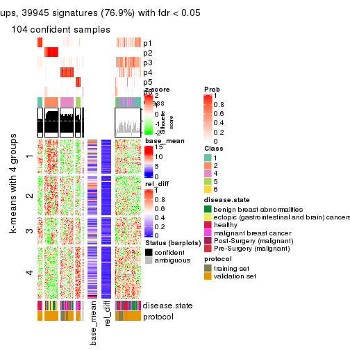</p>

</div>
</div>


Signature heatmaps where rows are not scaled:


<script>
$( function() {
	$( '#tabs-ATC-mclust-get-signatures-no-scale' ).tabs();
} );
</script>
<div id='tabs-ATC-mclust-get-signatures-no-scale'>
<ul>
<li><a href='#tab-ATC-mclust-get-signatures-no-scale-1'>k = 2</a></li>
<li><a href='#tab-ATC-mclust-get-signatures-no-scale-2'>k = 3</a></li>
<li><a href='#tab-ATC-mclust-get-signatures-no-scale-3'>k = 4</a></li>
<li><a href='#tab-ATC-mclust-get-signatures-no-scale-4'>k = 5</a></li>
<li><a href='#tab-ATC-mclust-get-signatures-no-scale-5'>k = 6</a></li>
</ul>
<div id='tab-ATC-mclust-get-signatures-no-scale-1'>
<pre><code class="r">get_signatures(res, k = 2, scale_rows = FALSE)
</code></pre>

<pre><code>#&gt; Error in mat[ceiling(1:nr/h_ratio), ceiling(1:nc/w_ratio), drop = FALSE]: subscript out of bounds
</code></pre>

<p></p>

</div>
<div id='tab-ATC-mclust-get-signatures-no-scale-2'>
<pre><code class="r">get_signatures(res, k = 3, scale_rows = FALSE)
</code></pre>

<p></p>

</div>
<div id='tab-ATC-mclust-get-signatures-no-scale-3'>
<pre><code class="r">get_signatures(res, k = 4, scale_rows = FALSE)
</code></pre>

<p></p>

</div>
<div id='tab-ATC-mclust-get-signatures-no-scale-4'>
<pre><code class="r">get_signatures(res, k = 5, scale_rows = FALSE)
</code></pre>

<p></p>

</div>
<div id='tab-ATC-mclust-get-signatures-no-scale-5'>
<pre><code class="r">get_signatures(res, k = 6, scale_rows = FALSE)
</code></pre>

<p></p>

</div>
</div>


Compare the overlap of signatures from different k:

```r
compare_signatures(res)
```


`get_signature()` returns a data frame invisibly. TO get the list of signatures, the function
call should be assigned to a variable explicitly. In following code, if `plot` argument is set
to `FALSE`, no heatmap is plotted while only the differential analysis is performed.

```r
# code only for demonstration
tb = get_signature(res, k = ..., plot = FALSE)
```

An example of the output of `tb` is:

```
#>   which_row         fdr    mean_1    mean_2 scaled_mean_1 scaled_mean_2 km
#> 1        38 0.042760348  8.373488  9.131774    -0.5533452     0.5164555  1
#> 2        40 0.018707592  7.106213  8.469186    -0.6173731     0.5762149  1
#> 3        55 0.019134737 10.221463 11.207825    -0.6159697     0.5749050  1
#> 4        59 0.006059896  5.921854  7.869574    -0.6899429     0.6439467  1
#> 5        60 0.018055526  8.928898 10.211722    -0.6204761     0.5791110  1
#> 6        98 0.009384629 15.714769 14.887706     0.6635654    -0.6193277  2
...
```

The columns in `tb` are:

1. `which_row`: row indices corresponding to the input matrix.
2. `fdr`: FDR for the differential test. 
3. `mean_x`: The mean value in group x.
4. `scaled_mean_x`: The mean value in group x after rows are scaled.
5. `km`: Row groups if k-means clustering is applied to rows.


UMAP plot which shows how samples are separated.


<script>
$( function() {
	$( '#tabs-ATC-mclust-dimension-reduction' ).tabs();
} );
</script>
<div id='tabs-ATC-mclust-dimension-reduction'>
<ul>
<li><a href='#tab-ATC-mclust-dimension-reduction-1'>k = 2</a></li>
<li><a href='#tab-ATC-mclust-dimension-reduction-2'>k = 3</a></li>
<li><a href='#tab-ATC-mclust-dimension-reduction-3'>k = 4</a></li>
<li><a href='#tab-ATC-mclust-dimension-reduction-4'>k = 5</a></li>
<li><a href='#tab-ATC-mclust-dimension-reduction-5'>k = 6</a></li>
</ul>
<div id='tab-ATC-mclust-dimension-reduction-1'>
<pre><code class="r">dimension_reduction(res, k = 2, method = &quot;UMAP&quot;)
</code></pre>

<p></p>

</div>
<div id='tab-ATC-mclust-dimension-reduction-2'>
<pre><code class="r">dimension_reduction(res, k = 3, method = &quot;UMAP&quot;)
</code></pre>

<p></p>

</div>
<div id='tab-ATC-mclust-dimension-reduction-3'>
<pre><code class="r">dimension_reduction(res, k = 4, method = &quot;UMAP&quot;)
</code></pre>

<p></p>

</div>
<div id='tab-ATC-mclust-dimension-reduction-4'>
<pre><code class="r">dimension_reduction(res, k = 5, method = &quot;UMAP&quot;)
</code></pre>

<p></p>

</div>
<div id='tab-ATC-mclust-dimension-reduction-5'>
<pre><code class="r">dimension_reduction(res, k = 6, method = &quot;UMAP&quot;)
</code></pre>

<p></p>

</div>
</div>


Following heatmap shows how subgroups are split when increasing `k`:

```r
collect_classes(res)
```


Test correlation between subgroups and known annotations. If the known
annotation is numeric, one-way ANOVA test is applied, and if the known
annotation is discrete, chi-squared contingency table test is applied.

```r
test_to_known_factors(res)
```

```
#>              n disease.state(p) protocol(p) k
#> ATC:mclust 161         3.70e-17    2.18e-03 2
#> ATC:mclust 132         5.31e-14    1.05e-05 3
#> ATC:mclust 127         4.69e-12    3.83e-07 4
#> ATC:mclust 145         2.11e-12    2.83e-06 5
#> ATC:mclust 104         1.14e-11    4.36e-07 6
```


If matrix rows can be associated to genes, consider to use `GO_Enrichment(res,
...)` to perform function enrichment for the signature genes.


 

---------------------------------------------------


### ATC:NMF


The object with results only for a single top-value method and a single partition method 
can be extracted as:

```r
res = res_list["ATC", "NMF"]
# you can also extract it by
# res = res_list["ATC:NMF"]
```

A summary of `res` and all the functions that can be applied to it:

```r
res
```

```
#> A 'ConsensusPartition' object with k = 2, 3, 4, 5, 6.
#>   On a matrix with 51941 rows and 162 columns.
#>   Top rows (1000, 2000, 3000, 4000, 5000) are extracted by 'ATC' method.
#>   Subgroups are detected by 'NMF' method.
#>   Performed in total 1250 partitions by row resampling.
#>   Best k for subgroups seems to be 2.
#> 
#> Following methods can be applied to this 'ConsensusPartition' object:
#>  [1] "cola_report"             "collect_classes"         "collect_plots"          
#>  [4] "collect_stats"           "colnames"                "compare_signatures"     
#>  [7] "consensus_heatmap"       "dimension_reduction"     "functional_enrichment"  
#> [10] "get_anno_col"            "get_anno"                "get_classes"            
#> [13] "get_consensus"           "get_matrix"              "get_membership"         
#> [16] "get_param"               "get_signatures"          "get_stats"              
#> [19] "is_best_k"               "is_stable_k"             "membership_heatmap"     
#> [22] "ncol"                    "nrow"                    "plot_ecdf"              
#> [25] "rownames"                "select_partition_number" "show"                   
#> [28] "suggest_best_k"          "test_to_known_factors"
```

`collect_plots()` function collects all the plots made from `res` for all `k` (number of partitions)
into one single page to provide an easy and fast comparison between different `k`.

```r
collect_plots(res)
```


The plots are:

- The first row: a plot of the ECDF (Empirical cumulative distribution
  function) curves of the consensus matrix for each `k` and the heatmap of
  predicted classes for each `k`.
- The second row: heatmaps of the consensus matrix for each `k`.
- The third row: heatmaps of the membership matrix for each `k`.
- The fouth row: heatmaps of the signatures for each `k`.

All the plots in panels can be made by individual functions and they are
plotted later in this section.

`select_partition_number()` produces several plots showing different
statistics for choosing "optimized" `k`. There are following statistics:

- ECDF curves of the consensus matrix for each `k`;
- 1-PAC. [The PAC
  score](https://en.wikipedia.org/wiki/Consensus_clustering#Over-interpretation_potential_of_consensus_clustering)
  measures the proportion of the ambiguous subgrouping.
- Mean silhouette score.
- Concordance. The mean probability of fiting the consensus class ids in all
  partitions.
- Area increased. Denote $A_k$ as the area under the ECDF curve for current
  `k`, the area increased is defined as $A_k - A_{k-1}$.
- Rand index. The percent of pairs of samples that are both in a same cluster
  or both are not in a same cluster in the partition of k and k-1.
- Jaccard index. The ratio of pairs of samples are both in a same cluster in
  the partition of k and k-1 and the pairs of samples are both in a same
  cluster in the partition k or k-1.

The detailed explanations of these statistics can be found in [the cola
vignette](http://bioconductor.org/packages/devel/bioc/vignettes/cola/inst/doc/cola.html#toc_13).

Generally speaking, lower PAC score, higher mean silhouette score or higher
concordance corresponds to better partition. Rand index and Jaccard index
measure how similar the current partition is compared to partition with `k-1`.
If they are too similar, we won't accept `k` is better than `k-1`.

```r
select_partition_number(res)
```


The numeric values for all these statistics can be obtained by `get_stats()`.

```r
get_stats(res)
```

```
#>   k 1-PAC mean_silhouette concordance area_increased  Rand Jaccard
#> 2 2 0.774           0.873       0.947         0.4768 0.510   0.510
#> 3 3 0.764           0.836       0.926         0.3628 0.749   0.551
#> 4 4 0.584           0.644       0.808         0.0895 0.897   0.730
#> 5 5 0.542           0.503       0.716         0.0798 0.867   0.616
#> 6 6 0.576           0.496       0.700         0.0564 0.869   0.548
```

`suggest_best_k()` suggests the best $k$ based on these statistics. The rules are as follows:

- All $k$ with Jaccard index larger than 0.95 are removed because the increase of
  the partition number does not provides enough extra information. If all $k$ are removed,
  the best $k$ is assigned by `NA`.
- For $k$ with 1-PAC larger than 0.9, the maximal $k$ is taken as the "best k". Other $k$ is called "optional k".
- If it does not fit the second rule. The $k$ with the highest vote of highest
  1-PAC, mean silhouette and concordance is taken as the "best k".

```r
suggest_best_k(res)
```

```
#> [1] 2
```


Following shows the table of the partitions (You need to click the **show/hide
code output** link to see it). The membership matrix (columns with name `p*`)
is inferred by
[`clue::cl_consensus()`](https://www.rdocumentation.org/link/cl_consensus?package=clue)
function with the `SE` method. Basically the value in the membership matrix
represents the probability to belong to a certain group. The finall class
label for an item is determined with the group with highest probability it
belongs to.

In `get_classes()` function, the entropy is calculated from the membership
matrix and the silhouette score is calculated from the consensus matrix.


<script>
$( function() {
	$( '#tabs-ATC-NMF-get-classes' ).tabs();
} );
</script>
<div id='tabs-ATC-NMF-get-classes'>
<ul>
<li><a href='#tab-ATC-NMF-get-classes-1'>k = 2</a></li>
<li><a href='#tab-ATC-NMF-get-classes-2'>k = 3</a></li>
<li><a href='#tab-ATC-NMF-get-classes-3'>k = 4</a></li>
<li><a href='#tab-ATC-NMF-get-classes-4'>k = 5</a></li>
<li><a href='#tab-ATC-NMF-get-classes-5'>k = 6</a></li>
</ul>

<div id='tab-ATC-NMF-get-classes-1'>
<p><a id='tab-ATC-NMF-get-classes-1-a' style='color:#0366d6' href='#'>show/hide code output</a></p>
<pre><code class="r">cbind(get_classes(res, k = 2), get_membership(res, k = 2))
</code></pre>

<pre><code>#&gt;           class entropy silhouette    p1    p2
#&gt; GSM682002     2  0.0000     0.9099 0.000 1.000
#&gt; GSM682003     1  0.0000     0.9637 1.000 0.000
#&gt; GSM682004     2  0.0000     0.9099 0.000 1.000
#&gt; GSM682005     2  0.2778     0.8887 0.048 0.952
#&gt; GSM682006     2  0.7602     0.7513 0.220 0.780
#&gt; GSM682007     1  0.0000     0.9637 1.000 0.000
#&gt; GSM682008     1  0.0000     0.9637 1.000 0.000
#&gt; GSM682009     1  0.0938     0.9532 0.988 0.012
#&gt; GSM682010     1  0.0000     0.9637 1.000 0.000
#&gt; GSM682011     2  0.0000     0.9099 0.000 1.000
#&gt; GSM682096     2  0.0000     0.9099 0.000 1.000
#&gt; GSM682097     1  0.0000     0.9637 1.000 0.000
#&gt; GSM682098     2  0.0000     0.9099 0.000 1.000
#&gt; GSM682099     2  0.0000     0.9099 0.000 1.000
#&gt; GSM682100     2  0.0000     0.9099 0.000 1.000
#&gt; GSM682101     2  0.0000     0.9099 0.000 1.000
#&gt; GSM682102     2  0.5408     0.8394 0.124 0.876
#&gt; GSM682103     1  0.0000     0.9637 1.000 0.000
#&gt; GSM682104     1  0.0000     0.9637 1.000 0.000
#&gt; GSM682105     1  0.0000     0.9637 1.000 0.000
#&gt; GSM682106     1  0.0000     0.9637 1.000 0.000
#&gt; GSM682107     1  0.1843     0.9378 0.972 0.028
#&gt; GSM682108     1  0.0000     0.9637 1.000 0.000
#&gt; GSM682109     1  0.0000     0.9637 1.000 0.000
#&gt; GSM682110     1  0.0000     0.9637 1.000 0.000
#&gt; GSM682111     1  0.0000     0.9637 1.000 0.000
#&gt; GSM682112     1  0.0000     0.9637 1.000 0.000
#&gt; GSM682113     1  0.0000     0.9637 1.000 0.000
#&gt; GSM682114     1  0.0000     0.9637 1.000 0.000
#&gt; GSM682115     2  0.7602     0.7513 0.220 0.780
#&gt; GSM682116     1  0.0000     0.9637 1.000 0.000
#&gt; GSM682117     1  0.0000     0.9637 1.000 0.000
#&gt; GSM682118     1  0.0000     0.9637 1.000 0.000
#&gt; GSM682119     1  0.0000     0.9637 1.000 0.000
#&gt; GSM682120     1  0.0000     0.9637 1.000 0.000
#&gt; GSM682121     1  0.0000     0.9637 1.000 0.000
#&gt; GSM682122     1  0.0000     0.9637 1.000 0.000
#&gt; GSM682012     2  0.5946     0.8236 0.144 0.856
#&gt; GSM682013     2  0.0000     0.9099 0.000 1.000
#&gt; GSM682014     2  0.0000     0.9099 0.000 1.000
#&gt; GSM682015     2  0.0000     0.9099 0.000 1.000
#&gt; GSM682016     1  0.0000     0.9637 1.000 0.000
#&gt; GSM682017     2  0.0000     0.9099 0.000 1.000
#&gt; GSM682018     2  0.0000     0.9099 0.000 1.000
#&gt; GSM682019     2  0.0000     0.9099 0.000 1.000
#&gt; GSM682020     2  0.0000     0.9099 0.000 1.000
#&gt; GSM682021     2  0.0000     0.9099 0.000 1.000
#&gt; GSM682022     2  0.0000     0.9099 0.000 1.000
#&gt; GSM682023     2  0.0000     0.9099 0.000 1.000
#&gt; GSM682024     2  0.0000     0.9099 0.000 1.000
#&gt; GSM682025     2  0.0000     0.9099 0.000 1.000
#&gt; GSM682026     2  0.0000     0.9099 0.000 1.000
#&gt; GSM682027     2  0.0000     0.9099 0.000 1.000
#&gt; GSM682028     2  0.0000     0.9099 0.000 1.000
#&gt; GSM682029     2  0.0000     0.9099 0.000 1.000
#&gt; GSM682030     2  0.0000     0.9099 0.000 1.000
#&gt; GSM682031     2  0.0000     0.9099 0.000 1.000
#&gt; GSM682032     2  0.0000     0.9099 0.000 1.000
#&gt; GSM682033     2  0.7453     0.7602 0.212 0.788
#&gt; GSM681992     1  0.9998    -0.1172 0.508 0.492
#&gt; GSM681993     1  0.0000     0.9637 1.000 0.000
#&gt; GSM681994     1  0.7950     0.6373 0.760 0.240
#&gt; GSM681995     2  0.8499     0.6732 0.276 0.724
#&gt; GSM681996     1  0.0000     0.9637 1.000 0.000
#&gt; GSM681997     1  0.0000     0.9637 1.000 0.000
#&gt; GSM681998     1  0.0000     0.9637 1.000 0.000
#&gt; GSM681999     1  0.0000     0.9637 1.000 0.000
#&gt; GSM682000     2  0.0000     0.9099 0.000 1.000
#&gt; GSM682001     2  0.5629     0.8333 0.132 0.868
#&gt; GSM682055     1  0.5629     0.8145 0.868 0.132
#&gt; GSM682056     2  0.9881     0.3380 0.436 0.564
#&gt; GSM682057     2  0.0000     0.9099 0.000 1.000
#&gt; GSM682058     2  0.0000     0.9099 0.000 1.000
#&gt; GSM682059     2  0.0000     0.9099 0.000 1.000
#&gt; GSM682060     1  0.0000     0.9637 1.000 0.000
#&gt; GSM682061     1  0.0000     0.9637 1.000 0.000
#&gt; GSM682062     2  0.0000     0.9099 0.000 1.000
#&gt; GSM682063     2  0.0000     0.9099 0.000 1.000
#&gt; GSM682064     2  0.4815     0.8537 0.104 0.896
#&gt; GSM682065     2  0.7219     0.7725 0.200 0.800
#&gt; GSM682066     2  0.9963     0.2533 0.464 0.536
#&gt; GSM682067     1  0.0000     0.9637 1.000 0.000
#&gt; GSM682068     2  0.1633     0.9008 0.024 0.976
#&gt; GSM682069     1  0.0000     0.9637 1.000 0.000
#&gt; GSM682070     1  0.0000     0.9637 1.000 0.000
#&gt; GSM682071     1  0.0000     0.9637 1.000 0.000
#&gt; GSM682072     1  0.0000     0.9637 1.000 0.000
#&gt; GSM682073     1  0.0000     0.9637 1.000 0.000
#&gt; GSM682074     1  0.0000     0.9637 1.000 0.000
#&gt; GSM682075     2  0.9866     0.3492 0.432 0.568
#&gt; GSM682076     1  0.0000     0.9637 1.000 0.000
#&gt; GSM682077     1  0.0000     0.9637 1.000 0.000
#&gt; GSM682078     1  0.0000     0.9637 1.000 0.000
#&gt; GSM682079     1  0.0000     0.9637 1.000 0.000
#&gt; GSM682080     1  0.0000     0.9637 1.000 0.000
#&gt; GSM682081     1  0.0000     0.9637 1.000 0.000
#&gt; GSM682082     1  0.0000     0.9637 1.000 0.000
#&gt; GSM682083     2  0.9983     0.2128 0.476 0.524
#&gt; GSM682084     1  0.0000     0.9637 1.000 0.000
#&gt; GSM682085     1  0.0000     0.9637 1.000 0.000
#&gt; GSM682086     2  0.9795     0.3915 0.416 0.584
#&gt; GSM682087     1  0.0000     0.9637 1.000 0.000
#&gt; GSM682088     1  0.0000     0.9637 1.000 0.000
#&gt; GSM682089     1  0.0000     0.9637 1.000 0.000
#&gt; GSM682090     1  0.0000     0.9637 1.000 0.000
#&gt; GSM682091     1  0.0376     0.9603 0.996 0.004
#&gt; GSM682092     1  0.0000     0.9637 1.000 0.000
#&gt; GSM682093     1  0.0000     0.9637 1.000 0.000
#&gt; GSM682094     1  0.0000     0.9637 1.000 0.000
#&gt; GSM682095     1  0.0672     0.9568 0.992 0.008
#&gt; GSM681982     1  0.0000     0.9637 1.000 0.000
#&gt; GSM681983     2  0.0000     0.9099 0.000 1.000
#&gt; GSM681984     1  0.0000     0.9637 1.000 0.000
#&gt; GSM681985     1  0.0000     0.9637 1.000 0.000
#&gt; GSM681986     1  0.0000     0.9637 1.000 0.000
#&gt; GSM681987     1  0.0000     0.9637 1.000 0.000
#&gt; GSM681988     1  0.0000     0.9637 1.000 0.000
#&gt; GSM681989     1  0.5519     0.8199 0.872 0.128
#&gt; GSM681990     1  0.0000     0.9637 1.000 0.000
#&gt; GSM681991     1  0.9954     0.0128 0.540 0.460
#&gt; GSM682034     1  0.9552     0.3104 0.624 0.376
#&gt; GSM682035     1  0.0000     0.9637 1.000 0.000
#&gt; GSM682036     1  0.0000     0.9637 1.000 0.000
#&gt; GSM682037     2  0.7815     0.7367 0.232 0.768
#&gt; GSM682038     1  0.0000     0.9637 1.000 0.000
#&gt; GSM682039     1  0.0000     0.9637 1.000 0.000
#&gt; GSM682040     1  0.0000     0.9637 1.000 0.000
#&gt; GSM682041     1  0.0000     0.9637 1.000 0.000
#&gt; GSM682042     1  0.0000     0.9637 1.000 0.000
#&gt; GSM682043     1  0.0000     0.9637 1.000 0.000
#&gt; GSM682044     1  0.1184     0.9495 0.984 0.016
#&gt; GSM682045     1  0.0000     0.9637 1.000 0.000
#&gt; GSM682046     2  0.0000     0.9099 0.000 1.000
#&gt; GSM682047     1  0.0000     0.9637 1.000 0.000
#&gt; GSM682048     1  0.0000     0.9637 1.000 0.000
#&gt; GSM682049     1  0.0000     0.9637 1.000 0.000
#&gt; GSM682050     2  0.0000     0.9099 0.000 1.000
#&gt; GSM682051     1  0.0000     0.9637 1.000 0.000
#&gt; GSM682052     1  0.0000     0.9637 1.000 0.000
#&gt; GSM682053     1  0.0000     0.9637 1.000 0.000
#&gt; GSM682054     2  0.7453     0.7602 0.212 0.788
#&gt; GSM682123     2  0.7950     0.7263 0.240 0.760
#&gt; GSM682124     2  0.0000     0.9099 0.000 1.000
#&gt; GSM682125     1  0.2603     0.9213 0.956 0.044
#&gt; GSM682126     2  0.1633     0.9008 0.024 0.976
#&gt; GSM682127     1  0.9896     0.0932 0.560 0.440
#&gt; GSM682128     2  0.9833     0.3710 0.424 0.576
#&gt; GSM682129     2  0.0000     0.9099 0.000 1.000
#&gt; GSM682130     2  0.0000     0.9099 0.000 1.000
#&gt; GSM682131     1  0.9998    -0.1169 0.508 0.492
#&gt; GSM682132     2  0.2603     0.8909 0.044 0.956
#&gt; GSM682133     2  0.1843     0.8990 0.028 0.972
#&gt; GSM682134     2  0.7883     0.7317 0.236 0.764
#&gt; GSM682135     2  0.1843     0.8990 0.028 0.972
#&gt; GSM682136     2  0.0000     0.9099 0.000 1.000
#&gt; GSM682137     1  0.3733     0.8902 0.928 0.072
#&gt; GSM682138     1  0.0000     0.9637 1.000 0.000
#&gt; GSM682139     2  0.0000     0.9099 0.000 1.000
#&gt; GSM682140     1  0.0000     0.9637 1.000 0.000
#&gt; GSM682141     2  0.0000     0.9099 0.000 1.000
#&gt; GSM682142     2  0.7883     0.7317 0.236 0.764
#&gt; GSM682143     1  0.0000     0.9637 1.000 0.000
</code></pre>

<script>
$('#tab-ATC-NMF-get-classes-1-a').parent().next().next().hide();
$('#tab-ATC-NMF-get-classes-1-a').click(function(){
  $('#tab-ATC-NMF-get-classes-1-a').parent().next().next().toggle();
  return(false);
});
</script>
</div>

<div id='tab-ATC-NMF-get-classes-2'>
<p><a id='tab-ATC-NMF-get-classes-2-a' style='color:#0366d6' href='#'>show/hide code output</a></p>
<pre><code class="r">cbind(get_classes(res, k = 3), get_membership(res, k = 3))
</code></pre>

<pre><code>#&gt;           class entropy silhouette    p1    p2    p3
#&gt; GSM682002     1  0.0237     0.9058 0.996 0.004 0.000
#&gt; GSM682003     3  0.2711     0.8521 0.000 0.088 0.912
#&gt; GSM682004     2  0.1031     0.9264 0.024 0.976 0.000
#&gt; GSM682005     2  0.2448     0.8728 0.076 0.924 0.000
#&gt; GSM682006     2  0.5012     0.8059 0.080 0.840 0.080
#&gt; GSM682007     3  0.0592     0.9102 0.012 0.000 0.988
#&gt; GSM682008     3  0.0237     0.9126 0.004 0.000 0.996
#&gt; GSM682009     3  0.6305     0.0797 0.484 0.000 0.516
#&gt; GSM682010     3  0.3619     0.8210 0.136 0.000 0.864
#&gt; GSM682011     2  0.5291     0.5870 0.268 0.732 0.000
#&gt; GSM682096     2  0.0000     0.9432 0.000 1.000 0.000
#&gt; GSM682097     3  0.3412     0.8192 0.000 0.124 0.876
#&gt; GSM682098     2  0.0000     0.9432 0.000 1.000 0.000
#&gt; GSM682099     2  0.0000     0.9432 0.000 1.000 0.000
#&gt; GSM682100     2  0.0000     0.9432 0.000 1.000 0.000
#&gt; GSM682101     2  0.0000     0.9432 0.000 1.000 0.000
#&gt; GSM682102     1  0.2165     0.8749 0.936 0.064 0.000
#&gt; GSM682103     3  0.0237     0.9126 0.004 0.000 0.996
#&gt; GSM682104     3  0.0000     0.9119 0.000 0.000 1.000
#&gt; GSM682105     3  0.5859     0.4950 0.344 0.000 0.656
#&gt; GSM682106     3  0.0237     0.9126 0.004 0.000 0.996
#&gt; GSM682107     1  0.5882     0.4561 0.652 0.000 0.348
#&gt; GSM682108     3  0.0000     0.9119 0.000 0.000 1.000
#&gt; GSM682109     3  0.0000     0.9119 0.000 0.000 1.000
#&gt; GSM682110     3  0.0237     0.9126 0.004 0.000 0.996
#&gt; GSM682111     3  0.0000     0.9119 0.000 0.000 1.000
#&gt; GSM682112     3  0.0237     0.9126 0.004 0.000 0.996
#&gt; GSM682113     3  0.4504     0.7462 0.196 0.000 0.804
#&gt; GSM682114     3  0.0237     0.9126 0.004 0.000 0.996
#&gt; GSM682115     1  0.0000     0.9072 1.000 0.000 0.000
#&gt; GSM682116     1  0.0000     0.9072 1.000 0.000 0.000
#&gt; GSM682117     3  0.5859     0.5316 0.344 0.000 0.656
#&gt; GSM682118     3  0.0424     0.9116 0.008 0.000 0.992
#&gt; GSM682119     3  0.0237     0.9126 0.004 0.000 0.996
#&gt; GSM682120     3  0.5988     0.4873 0.368 0.000 0.632
#&gt; GSM682121     1  0.1163     0.8953 0.972 0.000 0.028
#&gt; GSM682122     3  0.0000     0.9119 0.000 0.000 1.000
#&gt; GSM682012     2  0.5216     0.6036 0.000 0.740 0.260
#&gt; GSM682013     2  0.0000     0.9432 0.000 1.000 0.000
#&gt; GSM682014     2  0.0000     0.9432 0.000 1.000 0.000
#&gt; GSM682015     2  0.0000     0.9432 0.000 1.000 0.000
#&gt; GSM682016     3  0.0000     0.9119 0.000 0.000 1.000
#&gt; GSM682017     2  0.0000     0.9432 0.000 1.000 0.000
#&gt; GSM682018     2  0.0000     0.9432 0.000 1.000 0.000
#&gt; GSM682019     2  0.0000     0.9432 0.000 1.000 0.000
#&gt; GSM682020     2  0.0000     0.9432 0.000 1.000 0.000
#&gt; GSM682021     2  0.0000     0.9432 0.000 1.000 0.000
#&gt; GSM682022     2  0.0000     0.9432 0.000 1.000 0.000
#&gt; GSM682023     2  0.0000     0.9432 0.000 1.000 0.000
#&gt; GSM682024     2  0.0892     0.9270 0.020 0.980 0.000
#&gt; GSM682025     2  0.0000     0.9432 0.000 1.000 0.000
#&gt; GSM682026     2  0.0000     0.9432 0.000 1.000 0.000
#&gt; GSM682027     2  0.0000     0.9432 0.000 1.000 0.000
#&gt; GSM682028     2  0.0000     0.9432 0.000 1.000 0.000
#&gt; GSM682029     2  0.0000     0.9432 0.000 1.000 0.000
#&gt; GSM682030     2  0.0000     0.9432 0.000 1.000 0.000
#&gt; GSM682031     2  0.0000     0.9432 0.000 1.000 0.000
#&gt; GSM682032     2  0.0000     0.9432 0.000 1.000 0.000
#&gt; GSM682033     2  0.5926     0.3861 0.000 0.644 0.356
#&gt; GSM681992     3  0.5443     0.6525 0.004 0.260 0.736
#&gt; GSM681993     3  0.0000     0.9119 0.000 0.000 1.000
#&gt; GSM681994     1  0.0892     0.9004 0.980 0.000 0.020
#&gt; GSM681995     1  0.0000     0.9072 1.000 0.000 0.000
#&gt; GSM681996     3  0.0237     0.9126 0.004 0.000 0.996
#&gt; GSM681997     3  0.0237     0.9126 0.004 0.000 0.996
#&gt; GSM681998     3  0.0237     0.9126 0.004 0.000 0.996
#&gt; GSM681999     3  0.2165     0.8807 0.064 0.000 0.936
#&gt; GSM682000     2  0.5988     0.3475 0.368 0.632 0.000
#&gt; GSM682001     2  0.5785     0.5146 0.300 0.696 0.004
#&gt; GSM682055     3  0.5178     0.6566 0.000 0.256 0.744
#&gt; GSM682056     3  0.6252     0.2570 0.000 0.444 0.556
#&gt; GSM682057     2  0.0000     0.9432 0.000 1.000 0.000
#&gt; GSM682058     2  0.0000     0.9432 0.000 1.000 0.000
#&gt; GSM682059     2  0.0000     0.9432 0.000 1.000 0.000
#&gt; GSM682060     3  0.0000     0.9119 0.000 0.000 1.000
#&gt; GSM682061     3  0.0000     0.9119 0.000 0.000 1.000
#&gt; GSM682062     2  0.0000     0.9432 0.000 1.000 0.000
#&gt; GSM682063     2  0.0000     0.9432 0.000 1.000 0.000
#&gt; GSM682064     1  0.6307     0.1396 0.512 0.488 0.000
#&gt; GSM682065     1  0.0000     0.9072 1.000 0.000 0.000
#&gt; GSM682066     1  0.6245     0.7294 0.760 0.060 0.180
#&gt; GSM682067     3  0.1753     0.8926 0.048 0.000 0.952
#&gt; GSM682068     1  0.5859     0.5254 0.656 0.344 0.000
#&gt; GSM682069     3  0.5465     0.6217 0.288 0.000 0.712
#&gt; GSM682070     3  0.4931     0.6965 0.232 0.000 0.768
#&gt; GSM682071     3  0.0000     0.9119 0.000 0.000 1.000
#&gt; GSM682072     3  0.0000     0.9119 0.000 0.000 1.000
#&gt; GSM682073     3  0.0000     0.9119 0.000 0.000 1.000
#&gt; GSM682074     3  0.5497     0.6286 0.292 0.000 0.708
#&gt; GSM682075     1  0.2066     0.8730 0.940 0.000 0.060
#&gt; GSM682076     3  0.3412     0.8321 0.124 0.000 0.876
#&gt; GSM682077     1  0.1411     0.8912 0.964 0.000 0.036
#&gt; GSM682078     3  0.0237     0.9126 0.004 0.000 0.996
#&gt; GSM682079     3  0.1163     0.9037 0.028 0.000 0.972
#&gt; GSM682080     3  0.0237     0.9126 0.004 0.000 0.996
#&gt; GSM682081     3  0.0000     0.9119 0.000 0.000 1.000
#&gt; GSM682082     3  0.0000     0.9119 0.000 0.000 1.000
#&gt; GSM682083     1  0.0000     0.9072 1.000 0.000 0.000
#&gt; GSM682084     3  0.0237     0.9126 0.004 0.000 0.996
#&gt; GSM682085     3  0.0237     0.9126 0.004 0.000 0.996
#&gt; GSM682086     1  0.0000     0.9072 1.000 0.000 0.000
#&gt; GSM682087     3  0.0424     0.9116 0.008 0.000 0.992
#&gt; GSM682088     3  0.1411     0.8990 0.036 0.000 0.964
#&gt; GSM682089     3  0.1031     0.9052 0.024 0.000 0.976
#&gt; GSM682090     3  0.4062     0.7933 0.164 0.000 0.836
#&gt; GSM682091     3  0.0475     0.9118 0.004 0.004 0.992
#&gt; GSM682092     1  0.5948     0.4148 0.640 0.000 0.360
#&gt; GSM682093     3  0.0592     0.9102 0.012 0.000 0.988
#&gt; GSM682094     1  0.4291     0.7592 0.820 0.000 0.180
#&gt; GSM682095     3  0.4796     0.7088 0.000 0.220 0.780
#&gt; GSM681982     3  0.0237     0.9126 0.004 0.000 0.996
#&gt; GSM681983     1  0.4654     0.7357 0.792 0.208 0.000
#&gt; GSM681984     3  0.0424     0.9116 0.008 0.000 0.992
#&gt; GSM681985     3  0.1163     0.9029 0.028 0.000 0.972
#&gt; GSM681986     3  0.0237     0.9126 0.004 0.000 0.996
#&gt; GSM681987     3  0.0424     0.9089 0.000 0.008 0.992
#&gt; GSM681988     3  0.0000     0.9119 0.000 0.000 1.000
#&gt; GSM681989     3  0.1636     0.9016 0.020 0.016 0.964
#&gt; GSM681990     3  0.0747     0.9088 0.016 0.000 0.984
#&gt; GSM681991     3  0.6215     0.3052 0.000 0.428 0.572
#&gt; GSM682034     1  0.0000     0.9072 1.000 0.000 0.000
#&gt; GSM682035     1  0.0000     0.9072 1.000 0.000 0.000
#&gt; GSM682036     3  0.5882     0.4867 0.348 0.000 0.652
#&gt; GSM682037     1  0.0000     0.9072 1.000 0.000 0.000
#&gt; GSM682038     3  0.0000     0.9119 0.000 0.000 1.000
#&gt; GSM682039     3  0.0237     0.9126 0.004 0.000 0.996
#&gt; GSM682040     3  0.0237     0.9126 0.004 0.000 0.996
#&gt; GSM682041     3  0.4702     0.7384 0.212 0.000 0.788
#&gt; GSM682042     3  0.0237     0.9126 0.004 0.000 0.996
#&gt; GSM682043     1  0.0000     0.9072 1.000 0.000 0.000
#&gt; GSM682044     1  0.0000     0.9072 1.000 0.000 0.000
#&gt; GSM682045     1  0.3267     0.8256 0.884 0.000 0.116
#&gt; GSM682046     1  0.0237     0.9058 0.996 0.004 0.000
#&gt; GSM682047     1  0.1163     0.8957 0.972 0.000 0.028
#&gt; GSM682048     1  0.0000     0.9072 1.000 0.000 0.000
#&gt; GSM682049     1  0.0747     0.9020 0.984 0.000 0.016
#&gt; GSM682050     1  0.0237     0.9058 0.996 0.004 0.000
#&gt; GSM682051     3  0.2537     0.8682 0.080 0.000 0.920
#&gt; GSM682052     3  0.0237     0.9126 0.004 0.000 0.996
#&gt; GSM682053     3  0.0237     0.9126 0.004 0.000 0.996
#&gt; GSM682054     1  0.0000     0.9072 1.000 0.000 0.000
#&gt; GSM682123     1  0.0000     0.9072 1.000 0.000 0.000
#&gt; GSM682124     1  0.5465     0.6245 0.712 0.288 0.000
#&gt; GSM682125     1  0.2066     0.8694 0.940 0.000 0.060
#&gt; GSM682126     1  0.0000     0.9072 1.000 0.000 0.000
#&gt; GSM682127     1  0.0000     0.9072 1.000 0.000 0.000
#&gt; GSM682128     1  0.1399     0.8958 0.968 0.004 0.028
#&gt; GSM682129     2  0.0000     0.9432 0.000 1.000 0.000
#&gt; GSM682130     2  0.0000     0.9432 0.000 1.000 0.000
#&gt; GSM682131     3  0.6330     0.3902 0.004 0.396 0.600
#&gt; GSM682132     1  0.6225     0.3178 0.568 0.432 0.000
#&gt; GSM682133     1  0.0000     0.9072 1.000 0.000 0.000
#&gt; GSM682134     1  0.0000     0.9072 1.000 0.000 0.000
#&gt; GSM682135     1  0.4931     0.7068 0.768 0.232 0.000
#&gt; GSM682136     1  0.1964     0.8774 0.944 0.056 0.000
#&gt; GSM682137     1  0.0424     0.9050 0.992 0.000 0.008
#&gt; GSM682138     1  0.0747     0.9020 0.984 0.000 0.016
#&gt; GSM682139     1  0.2448     0.8654 0.924 0.076 0.000
#&gt; GSM682140     1  0.0000     0.9072 1.000 0.000 0.000
#&gt; GSM682141     1  0.4452     0.7546 0.808 0.192 0.000
#&gt; GSM682142     1  0.0000     0.9072 1.000 0.000 0.000
#&gt; GSM682143     3  0.0237     0.9126 0.004 0.000 0.996
</code></pre>

<script>
$('#tab-ATC-NMF-get-classes-2-a').parent().next().next().hide();
$('#tab-ATC-NMF-get-classes-2-a').click(function(){
  $('#tab-ATC-NMF-get-classes-2-a').parent().next().next().toggle();
  return(false);
});
</script>
</div>

<div id='tab-ATC-NMF-get-classes-3'>
<p><a id='tab-ATC-NMF-get-classes-3-a' style='color:#0366d6' href='#'>show/hide code output</a></p>
<pre><code class="r">cbind(get_classes(res, k = 4), get_membership(res, k = 4))
</code></pre>

<pre><code>#&gt;           class entropy silhouette    p1    p2    p3    p4
#&gt; GSM682002     1  0.2011     0.6761 0.920 0.000 0.000 0.080
#&gt; GSM682003     3  0.4220     0.7953 0.008 0.088 0.836 0.068
#&gt; GSM682004     2  0.5219     0.5439 0.216 0.728 0.000 0.056
#&gt; GSM682005     2  0.5754     0.4411 0.040 0.644 0.004 0.312
#&gt; GSM682006     2  0.6281     0.5040 0.004 0.676 0.140 0.180
#&gt; GSM682007     3  0.3215     0.8571 0.032 0.000 0.876 0.092
#&gt; GSM682008     3  0.5135     0.6555 0.012 0.008 0.684 0.296
#&gt; GSM682009     3  0.7730     0.2443 0.328 0.012 0.488 0.172
#&gt; GSM682010     3  0.4035     0.7977 0.176 0.000 0.804 0.020
#&gt; GSM682011     2  0.6566     0.3495 0.236 0.624 0.000 0.140
#&gt; GSM682096     2  0.0336     0.7788 0.000 0.992 0.000 0.008
#&gt; GSM682097     3  0.4541     0.7333 0.000 0.144 0.796 0.060
#&gt; GSM682098     2  0.2469     0.7381 0.000 0.892 0.000 0.108
#&gt; GSM682099     2  0.3311     0.6831 0.000 0.828 0.000 0.172
#&gt; GSM682100     2  0.1661     0.7728 0.004 0.944 0.000 0.052
#&gt; GSM682101     2  0.2048     0.7662 0.008 0.928 0.000 0.064
#&gt; GSM682102     1  0.6580     0.5409 0.632 0.172 0.000 0.196
#&gt; GSM682103     3  0.1716     0.8660 0.000 0.000 0.936 0.064
#&gt; GSM682104     3  0.0921     0.8716 0.000 0.000 0.972 0.028
#&gt; GSM682105     3  0.5371     0.7232 0.080 0.000 0.732 0.188
#&gt; GSM682106     3  0.1211     0.8717 0.000 0.000 0.960 0.040
#&gt; GSM682107     4  0.8119     0.0783 0.272 0.008 0.328 0.392
#&gt; GSM682108     3  0.1302     0.8637 0.000 0.000 0.956 0.044
#&gt; GSM682109     3  0.0817     0.8717 0.000 0.000 0.976 0.024
#&gt; GSM682110     3  0.1118     0.8664 0.000 0.000 0.964 0.036
#&gt; GSM682111     3  0.1302     0.8632 0.000 0.000 0.956 0.044
#&gt; GSM682112     3  0.1305     0.8672 0.004 0.000 0.960 0.036
#&gt; GSM682113     3  0.5304     0.7409 0.104 0.000 0.748 0.148
#&gt; GSM682114     3  0.0524     0.8709 0.004 0.000 0.988 0.008
#&gt; GSM682115     4  0.5345     0.3023 0.428 0.000 0.012 0.560
#&gt; GSM682116     4  0.5614     0.4227 0.304 0.000 0.044 0.652
#&gt; GSM682117     3  0.5560     0.7178 0.156 0.000 0.728 0.116
#&gt; GSM682118     3  0.2081     0.8633 0.000 0.000 0.916 0.084
#&gt; GSM682119     3  0.1022     0.8710 0.000 0.000 0.968 0.032
#&gt; GSM682120     3  0.6769     0.4867 0.220 0.000 0.608 0.172
#&gt; GSM682121     4  0.6233     0.3371 0.388 0.000 0.060 0.552
#&gt; GSM682122     3  0.0817     0.8714 0.000 0.000 0.976 0.024
#&gt; GSM682012     2  0.5564     0.5114 0.000 0.708 0.216 0.076
#&gt; GSM682013     2  0.0469     0.7783 0.000 0.988 0.000 0.012
#&gt; GSM682014     2  0.1584     0.7640 0.012 0.952 0.000 0.036
#&gt; GSM682015     2  0.1004     0.7757 0.004 0.972 0.000 0.024
#&gt; GSM682016     3  0.2402     0.8478 0.000 0.012 0.912 0.076
#&gt; GSM682017     2  0.1256     0.7731 0.008 0.964 0.000 0.028
#&gt; GSM682018     2  0.0895     0.7778 0.004 0.976 0.000 0.020
#&gt; GSM682019     2  0.1389     0.7704 0.000 0.952 0.000 0.048
#&gt; GSM682020     2  0.1256     0.7707 0.008 0.964 0.000 0.028
#&gt; GSM682021     2  0.0895     0.7780 0.004 0.976 0.000 0.020
#&gt; GSM682022     2  0.0657     0.7783 0.004 0.984 0.000 0.012
#&gt; GSM682023     2  0.0707     0.7772 0.000 0.980 0.000 0.020
#&gt; GSM682024     2  0.1767     0.7736 0.012 0.944 0.000 0.044
#&gt; GSM682025     2  0.0469     0.7787 0.000 0.988 0.000 0.012
#&gt; GSM682026     2  0.0469     0.7781 0.000 0.988 0.000 0.012
#&gt; GSM682027     2  0.2281     0.7485 0.000 0.904 0.000 0.096
#&gt; GSM682028     2  0.4250     0.5585 0.000 0.724 0.000 0.276
#&gt; GSM682029     4  0.4998    -0.0535 0.000 0.488 0.000 0.512
#&gt; GSM682030     4  0.4999    -0.0560 0.000 0.492 0.000 0.508
#&gt; GSM682031     2  0.4898     0.2612 0.000 0.584 0.000 0.416
#&gt; GSM682032     4  0.4977     0.0320 0.000 0.460 0.000 0.540
#&gt; GSM682033     2  0.5969     0.3016 0.000 0.564 0.392 0.044
#&gt; GSM681992     2  0.9020     0.1290 0.152 0.400 0.348 0.100
#&gt; GSM681993     3  0.1174     0.8710 0.012 0.000 0.968 0.020
#&gt; GSM681994     4  0.5962     0.4776 0.232 0.024 0.048 0.696
#&gt; GSM681995     4  0.5398     0.2585 0.404 0.000 0.016 0.580
#&gt; GSM681996     3  0.4212     0.7704 0.012 0.000 0.772 0.216
#&gt; GSM681997     3  0.2589     0.8491 0.000 0.000 0.884 0.116
#&gt; GSM681998     3  0.0921     0.8729 0.000 0.000 0.972 0.028
#&gt; GSM681999     3  0.3505     0.8546 0.048 0.000 0.864 0.088
#&gt; GSM682000     4  0.5231     0.3930 0.028 0.296 0.000 0.676
#&gt; GSM682001     2  0.7538    -0.0503 0.380 0.480 0.016 0.124
#&gt; GSM682055     3  0.6400     0.1296 0.000 0.408 0.524 0.068
#&gt; GSM682056     2  0.6602     0.1503 0.000 0.484 0.436 0.080
#&gt; GSM682057     2  0.0000     0.7790 0.000 1.000 0.000 0.000
#&gt; GSM682058     2  0.2345     0.7429 0.000 0.900 0.000 0.100
#&gt; GSM682059     2  0.0336     0.7788 0.000 0.992 0.000 0.008
#&gt; GSM682060     3  0.2149     0.8643 0.000 0.000 0.912 0.088
#&gt; GSM682061     3  0.1302     0.8671 0.000 0.000 0.956 0.044
#&gt; GSM682062     2  0.1576     0.7720 0.004 0.948 0.000 0.048
#&gt; GSM682063     2  0.1452     0.7744 0.008 0.956 0.000 0.036
#&gt; GSM682064     1  0.7673     0.3186 0.476 0.316 0.004 0.204
#&gt; GSM682065     1  0.1489     0.6820 0.952 0.004 0.000 0.044
#&gt; GSM682066     1  0.8994     0.0736 0.376 0.096 0.152 0.376
#&gt; GSM682067     3  0.5154     0.6659 0.236 0.012 0.728 0.024
#&gt; GSM682068     4  0.4656     0.5167 0.072 0.112 0.008 0.808
#&gt; GSM682069     1  0.6207    -0.0197 0.496 0.000 0.452 0.052
#&gt; GSM682070     3  0.5566     0.6485 0.224 0.000 0.704 0.072
#&gt; GSM682071     3  0.0707     0.8713 0.000 0.000 0.980 0.020
#&gt; GSM682072     3  0.0592     0.8713 0.000 0.000 0.984 0.016
#&gt; GSM682073     3  0.0707     0.8711 0.000 0.000 0.980 0.020
#&gt; GSM682074     4  0.6998     0.0219 0.116 0.000 0.416 0.468
#&gt; GSM682075     4  0.3861     0.5133 0.080 0.008 0.056 0.856
#&gt; GSM682076     3  0.4072     0.8025 0.120 0.000 0.828 0.052
#&gt; GSM682077     1  0.1724     0.6824 0.948 0.000 0.032 0.020
#&gt; GSM682078     3  0.2345     0.8547 0.000 0.000 0.900 0.100
#&gt; GSM682079     3  0.1629     0.8723 0.024 0.000 0.952 0.024
#&gt; GSM682080     3  0.0779     0.8723 0.004 0.000 0.980 0.016
#&gt; GSM682081     3  0.0921     0.8685 0.000 0.000 0.972 0.028
#&gt; GSM682082     3  0.1302     0.8713 0.000 0.000 0.956 0.044
#&gt; GSM682083     4  0.5607     0.1365 0.484 0.000 0.020 0.496
#&gt; GSM682084     3  0.0657     0.8716 0.004 0.000 0.984 0.012
#&gt; GSM682085     3  0.1042     0.8732 0.008 0.000 0.972 0.020
#&gt; GSM682086     1  0.5208     0.5911 0.712 0.012 0.020 0.256
#&gt; GSM682087     3  0.3710     0.7979 0.004 0.000 0.804 0.192
#&gt; GSM682088     3  0.2411     0.8646 0.040 0.000 0.920 0.040
#&gt; GSM682089     3  0.2928     0.8472 0.012 0.000 0.880 0.108
#&gt; GSM682090     3  0.5070     0.7336 0.192 0.000 0.748 0.060
#&gt; GSM682091     3  0.1796     0.8700 0.016 0.004 0.948 0.032
#&gt; GSM682092     3  0.7417     0.1815 0.348 0.004 0.492 0.156
#&gt; GSM682093     3  0.2593     0.8540 0.004 0.000 0.892 0.104
#&gt; GSM682094     1  0.6797     0.2830 0.468 0.000 0.096 0.436
#&gt; GSM682095     3  0.5861     0.4823 0.000 0.296 0.644 0.060
#&gt; GSM681982     3  0.2613     0.8580 0.024 0.008 0.916 0.052
#&gt; GSM681983     1  0.6139     0.5310 0.656 0.244 0.000 0.100
#&gt; GSM681984     3  0.3385     0.8442 0.048 0.012 0.884 0.056
#&gt; GSM681985     3  0.3056     0.8544 0.072 0.004 0.892 0.032
#&gt; GSM681986     3  0.3721     0.8476 0.072 0.008 0.864 0.056
#&gt; GSM681987     3  0.3070     0.8445 0.016 0.020 0.896 0.068
#&gt; GSM681988     3  0.2741     0.8573 0.012 0.000 0.892 0.096
#&gt; GSM681989     3  0.4071     0.8431 0.036 0.012 0.840 0.112
#&gt; GSM681990     3  0.2699     0.8552 0.068 0.000 0.904 0.028
#&gt; GSM681991     2  0.7939     0.1596 0.040 0.444 0.404 0.112
#&gt; GSM682034     1  0.1284     0.6829 0.964 0.000 0.012 0.024
#&gt; GSM682035     1  0.2670     0.6692 0.904 0.000 0.024 0.072
#&gt; GSM682036     3  0.6476     0.5537 0.272 0.000 0.616 0.112
#&gt; GSM682037     1  0.3881     0.6710 0.812 0.000 0.016 0.172
#&gt; GSM682038     3  0.2861     0.8591 0.016 0.000 0.888 0.096
#&gt; GSM682039     3  0.1936     0.8726 0.028 0.000 0.940 0.032
#&gt; GSM682040     3  0.1297     0.8699 0.016 0.000 0.964 0.020
#&gt; GSM682041     3  0.5464     0.6810 0.228 0.000 0.708 0.064
#&gt; GSM682042     3  0.2376     0.8679 0.016 0.000 0.916 0.068
#&gt; GSM682043     1  0.3991     0.6489 0.808 0.000 0.020 0.172
#&gt; GSM682044     1  0.4149     0.6667 0.804 0.000 0.028 0.168
#&gt; GSM682045     1  0.5594     0.5703 0.724 0.000 0.112 0.164
#&gt; GSM682046     1  0.6393     0.5834 0.656 0.100 0.008 0.236
#&gt; GSM682047     1  0.5352     0.5414 0.740 0.000 0.092 0.168
#&gt; GSM682048     1  0.2214     0.6694 0.928 0.000 0.044 0.028
#&gt; GSM682049     1  0.3876     0.6113 0.836 0.000 0.040 0.124
#&gt; GSM682050     1  0.4700     0.6528 0.792 0.084 0.000 0.124
#&gt; GSM682051     3  0.3691     0.8427 0.076 0.000 0.856 0.068
#&gt; GSM682052     3  0.1510     0.8720 0.016 0.000 0.956 0.028
#&gt; GSM682053     3  0.1629     0.8706 0.024 0.000 0.952 0.024
#&gt; GSM682054     1  0.5175     0.5834 0.656 0.004 0.012 0.328
#&gt; GSM682123     1  0.2189     0.6630 0.932 0.020 0.004 0.044
#&gt; GSM682124     1  0.6275     0.4112 0.596 0.328 0.000 0.076
#&gt; GSM682125     1  0.1833     0.6747 0.944 0.000 0.032 0.024
#&gt; GSM682126     1  0.2053     0.6869 0.924 0.004 0.000 0.072
#&gt; GSM682127     1  0.1970     0.6910 0.932 0.000 0.008 0.060
#&gt; GSM682128     4  0.3857     0.5198 0.060 0.020 0.056 0.864
#&gt; GSM682129     2  0.1211     0.7711 0.000 0.960 0.000 0.040
#&gt; GSM682130     2  0.1398     0.7733 0.004 0.956 0.000 0.040
#&gt; GSM682131     2  0.6315     0.2834 0.000 0.540 0.396 0.064
#&gt; GSM682132     4  0.4170     0.5170 0.012 0.168 0.012 0.808
#&gt; GSM682133     1  0.6986     0.4405 0.552 0.104 0.008 0.336
#&gt; GSM682134     1  0.0376     0.6808 0.992 0.000 0.004 0.004
#&gt; GSM682135     1  0.7392     0.4579 0.560 0.228 0.008 0.204
#&gt; GSM682136     1  0.4171     0.6487 0.828 0.088 0.000 0.084
#&gt; GSM682137     4  0.5365     0.3089 0.264 0.000 0.044 0.692
#&gt; GSM682138     1  0.3734     0.6313 0.848 0.000 0.044 0.108
#&gt; GSM682139     1  0.5619     0.5143 0.688 0.248 0.000 0.064
#&gt; GSM682140     1  0.5430     0.4054 0.664 0.000 0.036 0.300
#&gt; GSM682141     1  0.6461     0.5217 0.640 0.216 0.000 0.144
#&gt; GSM682142     1  0.3727     0.6764 0.832 0.008 0.008 0.152
#&gt; GSM682143     3  0.2075     0.8727 0.016 0.004 0.936 0.044
</code></pre>

<script>
$('#tab-ATC-NMF-get-classes-3-a').parent().next().next().hide();
$('#tab-ATC-NMF-get-classes-3-a').click(function(){
  $('#tab-ATC-NMF-get-classes-3-a').parent().next().next().toggle();
  return(false);
});
</script>
</div>

<div id='tab-ATC-NMF-get-classes-4'>
<p><a id='tab-ATC-NMF-get-classes-4-a' style='color:#0366d6' href='#'>show/hide code output</a></p>
<pre><code class="r">cbind(get_classes(res, k = 5), get_membership(res, k = 5))
</code></pre>

<pre><code>#&gt;           class entropy silhouette    p1    p2    p3    p4    p5
#&gt; GSM682002     1  0.4735    0.30645 0.672 0.000 0.000 0.044 0.284
#&gt; GSM682003     3  0.7014    0.13764 0.000 0.276 0.372 0.008 0.344
#&gt; GSM682004     2  0.5405    0.44324 0.328 0.596 0.000 0.000 0.076
#&gt; GSM682005     2  0.7523    0.19555 0.052 0.440 0.000 0.244 0.264
#&gt; GSM682006     4  0.7282    0.40852 0.056 0.300 0.052 0.536 0.056
#&gt; GSM682007     5  0.5411   -0.08151 0.016 0.000 0.400 0.032 0.552
#&gt; GSM682008     4  0.6933   -0.13746 0.004 0.000 0.304 0.376 0.316
#&gt; GSM682009     1  0.7795    0.05235 0.448 0.016 0.312 0.060 0.164
#&gt; GSM682010     3  0.5054    0.55508 0.216 0.000 0.696 0.004 0.084
#&gt; GSM682011     1  0.5630    0.38607 0.580 0.324 0.000 0.096 0.000
#&gt; GSM682096     2  0.2362    0.80797 0.008 0.900 0.008 0.000 0.084
#&gt; GSM682097     3  0.6772    0.13398 0.000 0.348 0.456 0.012 0.184
#&gt; GSM682098     2  0.3980    0.73887 0.000 0.796 0.000 0.128 0.076
#&gt; GSM682099     2  0.4527    0.55935 0.028 0.696 0.000 0.272 0.004
#&gt; GSM682100     2  0.2325    0.81324 0.068 0.904 0.000 0.028 0.000
#&gt; GSM682101     2  0.3037    0.78683 0.100 0.860 0.000 0.040 0.000
#&gt; GSM682102     1  0.5571    0.51854 0.716 0.148 0.020 0.100 0.016
#&gt; GSM682103     3  0.1484    0.70513 0.000 0.000 0.944 0.008 0.048
#&gt; GSM682104     3  0.0609    0.70366 0.000 0.000 0.980 0.000 0.020
#&gt; GSM682105     3  0.4425    0.61417 0.064 0.000 0.784 0.132 0.020
#&gt; GSM682106     3  0.0451    0.70149 0.000 0.000 0.988 0.004 0.008
#&gt; GSM682107     3  0.7466   -0.04772 0.336 0.008 0.412 0.216 0.028
#&gt; GSM682108     3  0.0703    0.70008 0.000 0.000 0.976 0.000 0.024
#&gt; GSM682109     3  0.0510    0.70348 0.000 0.000 0.984 0.000 0.016
#&gt; GSM682110     3  0.0865    0.69953 0.000 0.000 0.972 0.004 0.024
#&gt; GSM682111     3  0.0404    0.70229 0.000 0.000 0.988 0.000 0.012
#&gt; GSM682112     3  0.1608    0.70196 0.000 0.000 0.928 0.000 0.072
#&gt; GSM682113     3  0.4093    0.64174 0.120 0.000 0.808 0.052 0.020
#&gt; GSM682114     3  0.2074    0.69373 0.000 0.000 0.896 0.000 0.104
#&gt; GSM682115     4  0.5741    0.50779 0.204 0.000 0.004 0.636 0.156
#&gt; GSM682116     4  0.5241    0.50619 0.068 0.000 0.008 0.664 0.260
#&gt; GSM682117     3  0.3363    0.69079 0.076 0.000 0.860 0.020 0.044
#&gt; GSM682118     3  0.0727    0.70379 0.004 0.000 0.980 0.012 0.004
#&gt; GSM682119     3  0.0703    0.70258 0.000 0.000 0.976 0.000 0.024
#&gt; GSM682120     3  0.7072    0.29208 0.092 0.000 0.560 0.124 0.224
#&gt; GSM682121     4  0.7370    0.39302 0.192 0.000 0.180 0.532 0.096
#&gt; GSM682122     3  0.0880    0.70461 0.000 0.000 0.968 0.000 0.032
#&gt; GSM682012     2  0.6116    0.48915 0.000 0.588 0.104 0.020 0.288
#&gt; GSM682013     2  0.0865    0.83209 0.004 0.972 0.000 0.000 0.024
#&gt; GSM682014     2  0.1757    0.82541 0.048 0.936 0.000 0.004 0.012
#&gt; GSM682015     2  0.0703    0.83149 0.024 0.976 0.000 0.000 0.000
#&gt; GSM682016     3  0.5008    0.49022 0.000 0.024 0.620 0.012 0.344
#&gt; GSM682017     2  0.1121    0.82728 0.044 0.956 0.000 0.000 0.000
#&gt; GSM682018     2  0.0404    0.83179 0.012 0.988 0.000 0.000 0.000
#&gt; GSM682019     2  0.2228    0.81405 0.000 0.912 0.000 0.040 0.048
#&gt; GSM682020     2  0.1043    0.82828 0.040 0.960 0.000 0.000 0.000
#&gt; GSM682021     2  0.1082    0.82972 0.028 0.964 0.000 0.008 0.000
#&gt; GSM682022     2  0.0740    0.83313 0.008 0.980 0.000 0.004 0.008
#&gt; GSM682023     2  0.1628    0.82205 0.000 0.936 0.000 0.008 0.056
#&gt; GSM682024     2  0.1830    0.81696 0.068 0.924 0.000 0.008 0.000
#&gt; GSM682025     2  0.0740    0.83166 0.004 0.980 0.000 0.008 0.008
#&gt; GSM682026     2  0.1408    0.82657 0.000 0.948 0.000 0.008 0.044
#&gt; GSM682027     2  0.3289    0.77112 0.048 0.844 0.000 0.108 0.000
#&gt; GSM682028     2  0.4464    0.29435 0.000 0.584 0.000 0.408 0.008
#&gt; GSM682029     4  0.4183    0.52319 0.008 0.272 0.000 0.712 0.008
#&gt; GSM682030     4  0.3779    0.58251 0.012 0.236 0.000 0.752 0.000
#&gt; GSM682031     4  0.4791    0.28373 0.012 0.392 0.000 0.588 0.008
#&gt; GSM682032     4  0.3727    0.60103 0.016 0.216 0.000 0.768 0.000
#&gt; GSM682033     3  0.6688    0.20094 0.004 0.368 0.472 0.012 0.144
#&gt; GSM681992     1  0.8511    0.11417 0.316 0.188 0.244 0.000 0.252
#&gt; GSM681993     3  0.3336    0.63707 0.000 0.000 0.772 0.000 0.228
#&gt; GSM681994     4  0.5386    0.59258 0.112 0.008 0.004 0.696 0.180
#&gt; GSM681995     4  0.5508    0.49750 0.244 0.000 0.000 0.636 0.120
#&gt; GSM681996     5  0.6456   -0.13860 0.000 0.000 0.392 0.180 0.428
#&gt; GSM681997     3  0.5523    0.47902 0.000 0.000 0.592 0.320 0.088
#&gt; GSM681998     3  0.4206    0.59174 0.000 0.000 0.708 0.020 0.272
#&gt; GSM681999     3  0.6932    0.49726 0.156 0.000 0.588 0.088 0.168
#&gt; GSM682000     4  0.4086    0.59727 0.152 0.056 0.000 0.788 0.004
#&gt; GSM682001     1  0.5650    0.48337 0.672 0.244 0.020 0.036 0.028
#&gt; GSM682055     3  0.6797   -0.05326 0.000 0.388 0.404 0.008 0.200
#&gt; GSM682056     2  0.7086    0.25321 0.000 0.468 0.336 0.040 0.156
#&gt; GSM682057     2  0.0807    0.83387 0.012 0.976 0.000 0.000 0.012
#&gt; GSM682058     2  0.4010    0.74725 0.000 0.796 0.000 0.088 0.116
#&gt; GSM682059     2  0.1282    0.82725 0.000 0.952 0.000 0.004 0.044
#&gt; GSM682060     3  0.2722    0.69998 0.000 0.000 0.872 0.020 0.108
#&gt; GSM682061     3  0.2127    0.69883 0.000 0.000 0.892 0.000 0.108
#&gt; GSM682062     2  0.2067    0.82042 0.048 0.920 0.000 0.032 0.000
#&gt; GSM682063     2  0.2583    0.77195 0.132 0.864 0.000 0.004 0.000
#&gt; GSM682064     1  0.5715    0.41927 0.628 0.300 0.028 0.028 0.016
#&gt; GSM682065     1  0.2452    0.54087 0.896 0.016 0.004 0.000 0.084
#&gt; GSM682066     3  0.7603   -0.19128 0.336 0.016 0.348 0.284 0.016
#&gt; GSM682067     3  0.3769    0.62607 0.172 0.004 0.796 0.000 0.028
#&gt; GSM682068     4  0.3495    0.61096 0.120 0.036 0.000 0.836 0.008
#&gt; GSM682069     3  0.5099    0.42706 0.336 0.000 0.612 0.000 0.052
#&gt; GSM682070     3  0.3653    0.65841 0.124 0.000 0.828 0.012 0.036
#&gt; GSM682071     3  0.1121    0.70475 0.000 0.000 0.956 0.000 0.044
#&gt; GSM682072     3  0.0162    0.70259 0.000 0.000 0.996 0.000 0.004
#&gt; GSM682073     3  0.0162    0.70251 0.000 0.000 0.996 0.000 0.004
#&gt; GSM682074     3  0.7204   -0.04760 0.020 0.000 0.404 0.312 0.264
#&gt; GSM682075     4  0.4144    0.58663 0.100 0.008 0.092 0.800 0.000
#&gt; GSM682076     3  0.4667    0.63152 0.052 0.000 0.780 0.052 0.116
#&gt; GSM682077     1  0.6972   -0.00329 0.404 0.000 0.360 0.012 0.224
#&gt; GSM682078     3  0.2740    0.69333 0.000 0.000 0.876 0.028 0.096
#&gt; GSM682079     3  0.1997    0.69742 0.024 0.000 0.932 0.016 0.028
#&gt; GSM682080     3  0.2516    0.68070 0.000 0.000 0.860 0.000 0.140
#&gt; GSM682081     3  0.0609    0.70421 0.000 0.000 0.980 0.000 0.020
#&gt; GSM682082     3  0.1831    0.70024 0.000 0.000 0.920 0.004 0.076
#&gt; GSM682083     4  0.6469    0.35305 0.220 0.000 0.004 0.524 0.252
#&gt; GSM682084     3  0.2329    0.68659 0.000 0.000 0.876 0.000 0.124
#&gt; GSM682085     3  0.2471    0.68237 0.000 0.000 0.864 0.000 0.136
#&gt; GSM682086     1  0.6813    0.39236 0.616 0.036 0.124 0.196 0.028
#&gt; GSM682087     3  0.4581    0.60706 0.000 0.000 0.732 0.196 0.072
#&gt; GSM682088     3  0.1764    0.70230 0.008 0.000 0.928 0.000 0.064
#&gt; GSM682089     3  0.3476    0.64852 0.000 0.000 0.804 0.020 0.176
#&gt; GSM682090     5  0.6778    0.20846 0.128 0.000 0.408 0.028 0.436
#&gt; GSM682091     3  0.2866    0.67752 0.080 0.004 0.884 0.008 0.024
#&gt; GSM682092     3  0.5505    0.44970 0.288 0.000 0.636 0.056 0.020
#&gt; GSM682093     3  0.1582    0.70473 0.000 0.000 0.944 0.028 0.028
#&gt; GSM682094     1  0.7147    0.20081 0.452 0.000 0.260 0.264 0.024
#&gt; GSM682095     3  0.4370    0.55523 0.000 0.236 0.724 0.000 0.040
#&gt; GSM681982     5  0.4691    0.09124 0.004 0.012 0.320 0.008 0.656
#&gt; GSM681983     1  0.5037    0.56332 0.760 0.076 0.000 0.064 0.100
#&gt; GSM681984     3  0.5392    0.34640 0.020 0.016 0.520 0.004 0.440
#&gt; GSM681985     5  0.5160    0.19106 0.056 0.000 0.336 0.000 0.608
#&gt; GSM681986     3  0.6211    0.52701 0.116 0.012 0.600 0.008 0.264
#&gt; GSM681987     3  0.4492    0.56258 0.000 0.020 0.680 0.004 0.296
#&gt; GSM681988     3  0.5175    0.41502 0.000 0.000 0.548 0.044 0.408
#&gt; GSM681989     3  0.6714    0.27747 0.064 0.000 0.468 0.068 0.400
#&gt; GSM681990     3  0.5689    0.33275 0.072 0.000 0.528 0.004 0.396
#&gt; GSM681991     3  0.8298    0.17704 0.132 0.224 0.396 0.004 0.244
#&gt; GSM682034     5  0.4443    0.16657 0.472 0.000 0.000 0.004 0.524
#&gt; GSM682035     5  0.4655    0.33049 0.384 0.000 0.004 0.012 0.600
#&gt; GSM682036     3  0.6982    0.34731 0.228 0.000 0.516 0.032 0.224
#&gt; GSM682037     1  0.4740   -0.16265 0.516 0.000 0.000 0.016 0.468
#&gt; GSM682038     3  0.4920    0.47570 0.000 0.000 0.584 0.032 0.384
#&gt; GSM682039     3  0.4848    0.55140 0.032 0.000 0.644 0.004 0.320
#&gt; GSM682040     3  0.3366    0.63340 0.000 0.000 0.768 0.000 0.232
#&gt; GSM682041     5  0.5197    0.45447 0.068 0.000 0.236 0.012 0.684
#&gt; GSM682042     3  0.4747    0.27267 0.000 0.000 0.496 0.016 0.488
#&gt; GSM682043     5  0.5103    0.29400 0.404 0.000 0.000 0.040 0.556
#&gt; GSM682044     5  0.5002    0.10931 0.484 0.000 0.008 0.016 0.492
#&gt; GSM682045     1  0.6021    0.28137 0.604 0.000 0.076 0.032 0.288
#&gt; GSM682046     1  0.5214    0.54183 0.728 0.040 0.000 0.164 0.068
#&gt; GSM682047     5  0.5014    0.46539 0.212 0.000 0.040 0.032 0.716
#&gt; GSM682048     5  0.4518    0.43186 0.320 0.000 0.016 0.004 0.660
#&gt; GSM682049     5  0.4806    0.40998 0.336 0.000 0.012 0.016 0.636
#&gt; GSM682050     1  0.3720    0.55865 0.836 0.048 0.000 0.020 0.096
#&gt; GSM682051     5  0.4807   -0.04185 0.008 0.000 0.464 0.008 0.520
#&gt; GSM682052     3  0.4182    0.45725 0.000 0.000 0.600 0.000 0.400
#&gt; GSM682053     3  0.4350    0.43633 0.004 0.000 0.588 0.000 0.408
#&gt; GSM682054     1  0.5524    0.48458 0.664 0.004 0.000 0.180 0.152
#&gt; GSM682123     1  0.4902   -0.13938 0.508 0.024 0.000 0.000 0.468
#&gt; GSM682124     1  0.4127    0.48160 0.680 0.312 0.000 0.000 0.008
#&gt; GSM682125     5  0.4516    0.43051 0.276 0.000 0.012 0.016 0.696
#&gt; GSM682126     1  0.3643    0.42722 0.776 0.004 0.000 0.008 0.212
#&gt; GSM682127     1  0.3402    0.46521 0.804 0.008 0.000 0.004 0.184
#&gt; GSM682128     4  0.2228    0.64770 0.020 0.016 0.000 0.920 0.044
#&gt; GSM682129     2  0.2569    0.80759 0.000 0.892 0.000 0.040 0.068
#&gt; GSM682130     2  0.1478    0.81968 0.064 0.936 0.000 0.000 0.000
#&gt; GSM682131     2  0.5964    0.47439 0.000 0.600 0.128 0.008 0.264
#&gt; GSM682132     4  0.2798    0.65034 0.008 0.044 0.000 0.888 0.060
#&gt; GSM682133     1  0.6063    0.29168 0.572 0.056 0.000 0.332 0.040
#&gt; GSM682134     1  0.4722    0.03204 0.572 0.004 0.000 0.012 0.412
#&gt; GSM682135     1  0.4944    0.49705 0.700 0.240 0.000 0.044 0.016
#&gt; GSM682136     1  0.2353    0.57293 0.908 0.060 0.000 0.004 0.028
#&gt; GSM682137     4  0.4325    0.60309 0.100 0.004 0.000 0.780 0.116
#&gt; GSM682138     5  0.5162    0.44303 0.300 0.000 0.032 0.020 0.648
#&gt; GSM682139     1  0.5334    0.51035 0.652 0.244 0.000 0.000 0.104
#&gt; GSM682140     5  0.5364    0.41203 0.284 0.000 0.004 0.076 0.636
#&gt; GSM682141     1  0.4651    0.55800 0.728 0.208 0.000 0.004 0.060
#&gt; GSM682142     1  0.3021    0.56739 0.888 0.032 0.008 0.020 0.052
#&gt; GSM682143     3  0.4199    0.59548 0.000 0.008 0.692 0.004 0.296
</code></pre>

<script>
$('#tab-ATC-NMF-get-classes-4-a').parent().next().next().hide();
$('#tab-ATC-NMF-get-classes-4-a').click(function(){
  $('#tab-ATC-NMF-get-classes-4-a').parent().next().next().toggle();
  return(false);
});
</script>
</div>

<div id='tab-ATC-NMF-get-classes-5'>
<p><a id='tab-ATC-NMF-get-classes-5-a' style='color:#0366d6' href='#'>show/hide code output</a></p>
<pre><code class="r">cbind(get_classes(res, k = 6), get_membership(res, k = 6))
</code></pre>

<pre><code>#&gt;           class entropy silhouette    p1    p2    p3    p4    p5    p6
#&gt; GSM682002     3  0.5100     0.0017 0.392 0.004 0.548 0.000 0.040 0.016
#&gt; GSM682003     5  0.4172     0.4816 0.004 0.156 0.004 0.080 0.756 0.000
#&gt; GSM682004     2  0.6649     0.0275 0.308 0.396 0.032 0.000 0.264 0.000
#&gt; GSM682005     5  0.6607     0.0245 0.072 0.112 0.016 0.000 0.540 0.260
#&gt; GSM682006     6  0.6907     0.5077 0.132 0.080 0.008 0.012 0.236 0.532
#&gt; GSM682007     5  0.5211     0.4815 0.008 0.000 0.248 0.096 0.640 0.008
#&gt; GSM682008     5  0.6600     0.1259 0.012 0.004 0.068 0.076 0.424 0.416
#&gt; GSM682009     1  0.7123    -0.1886 0.424 0.004 0.060 0.096 0.376 0.040
#&gt; GSM682010     5  0.6730     0.3743 0.216 0.000 0.040 0.304 0.436 0.004
#&gt; GSM682011     1  0.6050     0.3506 0.616 0.140 0.012 0.000 0.048 0.184
#&gt; GSM682096     2  0.3043     0.6949 0.004 0.796 0.000 0.000 0.196 0.004
#&gt; GSM682097     2  0.6483     0.1271 0.020 0.396 0.004 0.208 0.372 0.000
#&gt; GSM682098     2  0.4733     0.6111 0.012 0.708 0.000 0.000 0.136 0.144
#&gt; GSM682099     2  0.4083     0.4770 0.020 0.688 0.000 0.000 0.008 0.284
#&gt; GSM682100     2  0.2462     0.7550 0.096 0.876 0.000 0.000 0.000 0.028
#&gt; GSM682101     2  0.3861     0.6420 0.184 0.756 0.000 0.000 0.000 0.060
#&gt; GSM682102     1  0.5875     0.4701 0.624 0.100 0.188 0.088 0.000 0.000
#&gt; GSM682103     4  0.1728     0.7449 0.008 0.000 0.064 0.924 0.004 0.000
#&gt; GSM682104     4  0.0935     0.7466 0.000 0.000 0.032 0.964 0.004 0.000
#&gt; GSM682105     4  0.2379     0.7353 0.052 0.000 0.012 0.904 0.008 0.024
#&gt; GSM682106     4  0.1268     0.7393 0.008 0.000 0.004 0.952 0.036 0.000
#&gt; GSM682107     4  0.6944     0.0446 0.320 0.000 0.016 0.416 0.036 0.212
#&gt; GSM682108     4  0.1929     0.7322 0.016 0.000 0.008 0.924 0.048 0.004
#&gt; GSM682109     4  0.1226     0.7389 0.004 0.000 0.000 0.952 0.040 0.004
#&gt; GSM682110     4  0.2224     0.7306 0.036 0.000 0.012 0.912 0.036 0.004
#&gt; GSM682111     4  0.1750     0.7368 0.004 0.000 0.008 0.928 0.056 0.004
#&gt; GSM682112     4  0.3447     0.6861 0.004 0.000 0.044 0.804 0.148 0.000
#&gt; GSM682113     4  0.2361     0.7275 0.104 0.000 0.012 0.880 0.000 0.004
#&gt; GSM682114     4  0.3225     0.7015 0.000 0.000 0.080 0.828 0.092 0.000
#&gt; GSM682115     3  0.6003    -0.1341 0.116 0.000 0.444 0.020 0.004 0.416
#&gt; GSM682116     6  0.5639     0.1333 0.036 0.000 0.408 0.064 0.000 0.492
#&gt; GSM682117     4  0.2900     0.7361 0.088 0.000 0.044 0.860 0.008 0.000
#&gt; GSM682118     4  0.1476     0.7438 0.012 0.000 0.004 0.948 0.028 0.008
#&gt; GSM682119     4  0.1340     0.7392 0.000 0.000 0.008 0.948 0.040 0.004
#&gt; GSM682120     4  0.6292     0.3939 0.080 0.000 0.312 0.536 0.016 0.056
#&gt; GSM682121     4  0.7410     0.0933 0.108 0.000 0.264 0.376 0.004 0.248
#&gt; GSM682122     4  0.1760     0.7444 0.004 0.000 0.020 0.928 0.048 0.000
#&gt; GSM682012     2  0.5892     0.3043 0.004 0.504 0.052 0.020 0.396 0.024
#&gt; GSM682013     2  0.0692     0.7902 0.004 0.976 0.000 0.000 0.020 0.000
#&gt; GSM682014     2  0.1219     0.7868 0.048 0.948 0.000 0.000 0.004 0.000
#&gt; GSM682015     2  0.0547     0.7913 0.020 0.980 0.000 0.000 0.000 0.000
#&gt; GSM682016     5  0.6306     0.4726 0.000 0.048 0.108 0.268 0.560 0.016
#&gt; GSM682017     2  0.0937     0.7887 0.040 0.960 0.000 0.000 0.000 0.000
#&gt; GSM682018     2  0.0653     0.7917 0.012 0.980 0.000 0.000 0.004 0.004
#&gt; GSM682019     2  0.1977     0.7744 0.008 0.920 0.000 0.000 0.032 0.040
#&gt; GSM682020     2  0.0935     0.7907 0.032 0.964 0.000 0.000 0.004 0.000
#&gt; GSM682021     2  0.1321     0.7872 0.024 0.952 0.000 0.000 0.004 0.020
#&gt; GSM682022     2  0.0810     0.7920 0.008 0.976 0.004 0.000 0.008 0.004
#&gt; GSM682023     2  0.1225     0.7858 0.004 0.956 0.004 0.000 0.032 0.004
#&gt; GSM682024     2  0.2201     0.7695 0.076 0.896 0.000 0.000 0.000 0.028
#&gt; GSM682025     2  0.0405     0.7914 0.004 0.988 0.000 0.000 0.008 0.000
#&gt; GSM682026     2  0.0603     0.7906 0.004 0.980 0.000 0.000 0.016 0.000
#&gt; GSM682027     2  0.4025     0.5421 0.048 0.720 0.000 0.000 0.000 0.232
#&gt; GSM682028     6  0.4325     0.0557 0.008 0.480 0.000 0.000 0.008 0.504
#&gt; GSM682029     6  0.2979     0.6295 0.004 0.188 0.000 0.000 0.004 0.804
#&gt; GSM682030     6  0.2773     0.6455 0.008 0.152 0.000 0.000 0.004 0.836
#&gt; GSM682031     6  0.3791     0.5101 0.008 0.300 0.000 0.000 0.004 0.688
#&gt; GSM682032     6  0.2872     0.6506 0.024 0.140 0.000 0.000 0.000 0.836
#&gt; GSM682033     4  0.6981    -0.0962 0.024 0.172 0.012 0.440 0.332 0.020
#&gt; GSM681992     5  0.5766     0.3388 0.280 0.052 0.008 0.064 0.596 0.000
#&gt; GSM681993     4  0.5235     0.1395 0.000 0.000 0.100 0.520 0.380 0.000
#&gt; GSM681994     6  0.5707     0.4585 0.068 0.012 0.036 0.000 0.288 0.596
#&gt; GSM681995     6  0.6455     0.5262 0.172 0.016 0.080 0.000 0.140 0.592
#&gt; GSM681996     5  0.6752     0.4709 0.000 0.000 0.184 0.128 0.524 0.164
#&gt; GSM681997     6  0.6005     0.2133 0.012 0.000 0.020 0.148 0.244 0.576
#&gt; GSM681998     5  0.4401     0.5763 0.040 0.000 0.012 0.140 0.768 0.040
#&gt; GSM681999     5  0.6605     0.3778 0.316 0.000 0.028 0.112 0.504 0.040
#&gt; GSM682000     6  0.4436     0.6110 0.176 0.044 0.000 0.000 0.040 0.740
#&gt; GSM682001     1  0.3902     0.5330 0.796 0.080 0.004 0.000 0.108 0.012
#&gt; GSM682055     2  0.6335     0.1791 0.016 0.416 0.004 0.188 0.376 0.000
#&gt; GSM682056     2  0.6549     0.3078 0.020 0.464 0.004 0.188 0.316 0.008
#&gt; GSM682057     2  0.0508     0.7922 0.012 0.984 0.000 0.000 0.004 0.000
#&gt; GSM682058     2  0.4668     0.6179 0.012 0.708 0.000 0.000 0.180 0.100
#&gt; GSM682059     2  0.0458     0.7910 0.000 0.984 0.000 0.000 0.016 0.000
#&gt; GSM682060     4  0.4726     0.5668 0.004 0.000 0.076 0.716 0.184 0.020
#&gt; GSM682061     4  0.4216     0.5225 0.000 0.000 0.040 0.720 0.228 0.012
#&gt; GSM682062     2  0.2350     0.7653 0.076 0.888 0.000 0.000 0.000 0.036
#&gt; GSM682063     2  0.2631     0.7170 0.152 0.840 0.000 0.000 0.000 0.008
#&gt; GSM682064     1  0.4422     0.5251 0.720 0.180 0.000 0.096 0.000 0.004
#&gt; GSM682065     1  0.4513     0.4160 0.652 0.020 0.304 0.024 0.000 0.000
#&gt; GSM682066     4  0.6516     0.3028 0.240 0.004 0.040 0.504 0.000 0.212
#&gt; GSM682067     4  0.2972     0.7208 0.108 0.000 0.016 0.852 0.024 0.000
#&gt; GSM682068     6  0.3855     0.6006 0.164 0.012 0.012 0.020 0.004 0.788
#&gt; GSM682069     4  0.4023     0.6626 0.188 0.000 0.052 0.752 0.008 0.000
#&gt; GSM682070     4  0.2586     0.7304 0.096 0.000 0.020 0.876 0.004 0.004
#&gt; GSM682071     4  0.2568     0.7240 0.004 0.000 0.024 0.880 0.088 0.004
#&gt; GSM682072     4  0.1096     0.7414 0.004 0.000 0.008 0.964 0.020 0.004
#&gt; GSM682073     4  0.1508     0.7383 0.004 0.000 0.004 0.940 0.048 0.004
#&gt; GSM682074     4  0.6119     0.2847 0.028 0.000 0.356 0.504 0.012 0.100
#&gt; GSM682075     6  0.5333     0.4635 0.120 0.000 0.040 0.172 0.000 0.668
#&gt; GSM682076     4  0.5254     0.6217 0.084 0.000 0.176 0.692 0.012 0.036
#&gt; GSM682077     4  0.5482     0.4158 0.156 0.000 0.300 0.544 0.000 0.000
#&gt; GSM682078     4  0.2651     0.7371 0.004 0.000 0.088 0.872 0.036 0.000
#&gt; GSM682079     4  0.3424     0.7162 0.068 0.000 0.048 0.844 0.036 0.004
#&gt; GSM682080     4  0.3703     0.6784 0.000 0.000 0.104 0.788 0.108 0.000
#&gt; GSM682081     4  0.1812     0.7363 0.004 0.000 0.008 0.924 0.060 0.004
#&gt; GSM682082     4  0.1930     0.7415 0.000 0.000 0.048 0.916 0.036 0.000
#&gt; GSM682083     3  0.5718     0.0400 0.108 0.000 0.524 0.020 0.000 0.348
#&gt; GSM682084     4  0.2985     0.7158 0.000 0.000 0.100 0.844 0.056 0.000
#&gt; GSM682085     4  0.3361     0.7031 0.000 0.000 0.108 0.816 0.076 0.000
#&gt; GSM682086     1  0.5318     0.3864 0.680 0.000 0.020 0.176 0.016 0.108
#&gt; GSM682087     4  0.3418     0.7098 0.004 0.000 0.084 0.820 0.000 0.092
#&gt; GSM682088     4  0.1888     0.7429 0.004 0.000 0.068 0.916 0.012 0.000
#&gt; GSM682089     4  0.3601     0.6950 0.008 0.000 0.160 0.792 0.040 0.000
#&gt; GSM682090     3  0.6070    -0.1132 0.072 0.000 0.460 0.416 0.044 0.008
#&gt; GSM682091     4  0.2706     0.7242 0.084 0.000 0.008 0.876 0.028 0.004
#&gt; GSM682092     4  0.4353     0.6707 0.144 0.000 0.052 0.768 0.020 0.016
#&gt; GSM682093     4  0.2084     0.7474 0.016 0.000 0.044 0.916 0.024 0.000
#&gt; GSM682094     1  0.6067     0.0482 0.448 0.000 0.008 0.388 0.008 0.148
#&gt; GSM682095     4  0.5739     0.4196 0.020 0.140 0.008 0.628 0.200 0.004
#&gt; GSM681982     5  0.3394     0.5429 0.000 0.000 0.144 0.052 0.804 0.000
#&gt; GSM681983     1  0.6574     0.4754 0.604 0.048 0.176 0.000 0.088 0.084
#&gt; GSM681984     5  0.3751     0.5606 0.060 0.004 0.048 0.064 0.824 0.000
#&gt; GSM681985     5  0.4581     0.4600 0.016 0.000 0.244 0.036 0.696 0.008
#&gt; GSM681986     5  0.6299     0.4797 0.256 0.008 0.040 0.148 0.548 0.000
#&gt; GSM681987     5  0.4018     0.5785 0.008 0.012 0.020 0.196 0.760 0.004
#&gt; GSM681988     5  0.5830     0.5436 0.000 0.000 0.140 0.156 0.632 0.072
#&gt; GSM681989     5  0.6459     0.4736 0.084 0.004 0.188 0.060 0.616 0.048
#&gt; GSM681990     5  0.4203     0.5598 0.056 0.000 0.096 0.064 0.784 0.000
#&gt; GSM681991     5  0.5923     0.5239 0.156 0.072 0.004 0.120 0.644 0.004
#&gt; GSM682034     3  0.4738     0.4489 0.224 0.000 0.688 0.008 0.076 0.004
#&gt; GSM682035     3  0.4641     0.5580 0.084 0.000 0.736 0.024 0.152 0.004
#&gt; GSM682036     4  0.7719    -0.1308 0.112 0.000 0.192 0.396 0.272 0.028
#&gt; GSM682037     3  0.5533     0.4437 0.232 0.000 0.632 0.004 0.100 0.032
#&gt; GSM682038     5  0.6182     0.4771 0.008 0.004 0.192 0.212 0.564 0.020
#&gt; GSM682039     5  0.6621     0.3435 0.028 0.000 0.176 0.340 0.444 0.012
#&gt; GSM682040     4  0.5389     0.3246 0.004 0.000 0.132 0.576 0.288 0.000
#&gt; GSM682041     3  0.5641     0.2378 0.000 0.000 0.560 0.160 0.272 0.008
#&gt; GSM682042     5  0.6027     0.3543 0.000 0.000 0.264 0.236 0.492 0.008
#&gt; GSM682043     3  0.4897     0.5536 0.108 0.000 0.736 0.028 0.112 0.016
#&gt; GSM682044     3  0.5620     0.4500 0.220 0.000 0.632 0.028 0.112 0.008
#&gt; GSM682045     1  0.6875    -0.0780 0.388 0.000 0.276 0.032 0.296 0.008
#&gt; GSM682046     1  0.4942     0.5458 0.712 0.048 0.156 0.000 0.000 0.084
#&gt; GSM682047     3  0.4801     0.4258 0.012 0.000 0.672 0.032 0.264 0.020
#&gt; GSM682048     3  0.5417     0.3912 0.068 0.000 0.588 0.024 0.316 0.004
#&gt; GSM682049     3  0.4115     0.5595 0.068 0.000 0.788 0.020 0.116 0.008
#&gt; GSM682050     1  0.4867     0.4883 0.644 0.076 0.272 0.000 0.000 0.008
#&gt; GSM682051     3  0.5940     0.0386 0.004 0.000 0.456 0.348 0.192 0.000
#&gt; GSM682052     5  0.6069     0.1739 0.000 0.000 0.216 0.384 0.396 0.004
#&gt; GSM682053     4  0.5931    -0.1046 0.000 0.000 0.216 0.424 0.360 0.000
#&gt; GSM682054     1  0.5307     0.3843 0.600 0.000 0.300 0.012 0.004 0.084
#&gt; GSM682123     3  0.5721     0.3483 0.256 0.032 0.608 0.000 0.096 0.008
#&gt; GSM682124     1  0.5045     0.3972 0.552 0.364 0.084 0.000 0.000 0.000
#&gt; GSM682125     3  0.5208     0.2581 0.068 0.004 0.520 0.000 0.404 0.004
#&gt; GSM682126     1  0.4262     0.2674 0.560 0.012 0.424 0.000 0.000 0.004
#&gt; GSM682127     1  0.4184     0.3754 0.640 0.004 0.340 0.012 0.000 0.004
#&gt; GSM682128     6  0.2534     0.6507 0.024 0.016 0.056 0.008 0.000 0.896
#&gt; GSM682129     2  0.2044     0.7766 0.008 0.920 0.004 0.000 0.040 0.028
#&gt; GSM682130     2  0.1588     0.7782 0.072 0.924 0.000 0.000 0.000 0.004
#&gt; GSM682131     2  0.5461     0.3483 0.012 0.524 0.032 0.032 0.400 0.000
#&gt; GSM682132     6  0.3122     0.6493 0.008 0.020 0.060 0.004 0.040 0.868
#&gt; GSM682133     6  0.6629     0.0763 0.348 0.056 0.164 0.000 0.000 0.432
#&gt; GSM682134     3  0.4159     0.3140 0.284 0.008 0.688 0.000 0.012 0.008
#&gt; GSM682135     1  0.4172     0.5027 0.708 0.252 0.016 0.000 0.000 0.024
#&gt; GSM682136     1  0.3575     0.5527 0.804 0.048 0.140 0.000 0.004 0.004
#&gt; GSM682137     6  0.4339     0.5850 0.064 0.000 0.144 0.008 0.020 0.764
#&gt; GSM682138     3  0.4643     0.5546 0.032 0.000 0.748 0.060 0.148 0.012
#&gt; GSM682139     1  0.5938     0.4400 0.520 0.296 0.172 0.000 0.008 0.004
#&gt; GSM682140     3  0.5044     0.5705 0.048 0.000 0.732 0.024 0.136 0.060
#&gt; GSM682141     1  0.5478     0.4830 0.568 0.236 0.196 0.000 0.000 0.000
#&gt; GSM682142     1  0.2999     0.5600 0.852 0.024 0.112 0.004 0.004 0.004
#&gt; GSM682143     4  0.6408    -0.2043 0.008 0.004 0.156 0.408 0.408 0.016
</code></pre>

<script>
$('#tab-ATC-NMF-get-classes-5-a').parent().next().next().hide();
$('#tab-ATC-NMF-get-classes-5-a').click(function(){
  $('#tab-ATC-NMF-get-classes-5-a').parent().next().next().toggle();
  return(false);
});
</script>
</div>
</div>

Heatmaps for the consensus matrix. It visualizes the probability of two
samples to be in a same group.


<script>
$( function() {
	$( '#tabs-ATC-NMF-consensus-heatmap' ).tabs();
} );
</script>
<div id='tabs-ATC-NMF-consensus-heatmap'>
<ul>
<li><a href='#tab-ATC-NMF-consensus-heatmap-1'>k = 2</a></li>
<li><a href='#tab-ATC-NMF-consensus-heatmap-2'>k = 3</a></li>
<li><a href='#tab-ATC-NMF-consensus-heatmap-3'>k = 4</a></li>
<li><a href='#tab-ATC-NMF-consensus-heatmap-4'>k = 5</a></li>
<li><a href='#tab-ATC-NMF-consensus-heatmap-5'>k = 6</a></li>
</ul>
<div id='tab-ATC-NMF-consensus-heatmap-1'>
<pre><code class="r">consensus_heatmap(res, k = 2)
</code></pre>

<p></p>

</div>
<div id='tab-ATC-NMF-consensus-heatmap-2'>
<pre><code class="r">consensus_heatmap(res, k = 3)
</code></pre>

<p></p>

</div>
<div id='tab-ATC-NMF-consensus-heatmap-3'>
<pre><code class="r">consensus_heatmap(res, k = 4)
</code></pre>

<p></p>

</div>
<div id='tab-ATC-NMF-consensus-heatmap-4'>
<pre><code class="r">consensus_heatmap(res, k = 5)
</code></pre>

<p></p>

</div>
<div id='tab-ATC-NMF-consensus-heatmap-5'>
<pre><code class="r">consensus_heatmap(res, k = 6)
</code></pre>

<p></p>

</div>
</div>

Heatmaps for the membership of samples in all partitions to see how consistent they are:


<script>
$( function() {
	$( '#tabs-ATC-NMF-membership-heatmap' ).tabs();
} );
</script>
<div id='tabs-ATC-NMF-membership-heatmap'>
<ul>
<li><a href='#tab-ATC-NMF-membership-heatmap-1'>k = 2</a></li>
<li><a href='#tab-ATC-NMF-membership-heatmap-2'>k = 3</a></li>
<li><a href='#tab-ATC-NMF-membership-heatmap-3'>k = 4</a></li>
<li><a href='#tab-ATC-NMF-membership-heatmap-4'>k = 5</a></li>
<li><a href='#tab-ATC-NMF-membership-heatmap-5'>k = 6</a></li>
</ul>
<div id='tab-ATC-NMF-membership-heatmap-1'>
<pre><code class="r">membership_heatmap(res, k = 2)
</code></pre>

<p></p>

</div>
<div id='tab-ATC-NMF-membership-heatmap-2'>
<pre><code class="r">membership_heatmap(res, k = 3)
</code></pre>

<p></p>

</div>
<div id='tab-ATC-NMF-membership-heatmap-3'>
<pre><code class="r">membership_heatmap(res, k = 4)
</code></pre>

<p></p>

</div>
<div id='tab-ATC-NMF-membership-heatmap-4'>
<pre><code class="r">membership_heatmap(res, k = 5)
</code></pre>

<p></p>

</div>
<div id='tab-ATC-NMF-membership-heatmap-5'>
<pre><code class="r">membership_heatmap(res, k = 6)
</code></pre>

<p></p>

</div>
</div>

As soon as we have had the classes for columns, we can look for signatures
which are significantly different between classes which can be candidate marks
for certain classes. Following are the heatmaps for signatures.


Signature heatmaps where rows are scaled:


<script>
$( function() {
	$( '#tabs-ATC-NMF-get-signatures' ).tabs();
} );
</script>
<div id='tabs-ATC-NMF-get-signatures'>
<ul>
<li><a href='#tab-ATC-NMF-get-signatures-1'>k = 2</a></li>
<li><a href='#tab-ATC-NMF-get-signatures-2'>k = 3</a></li>
<li><a href='#tab-ATC-NMF-get-signatures-3'>k = 4</a></li>
<li><a href='#tab-ATC-NMF-get-signatures-4'>k = 5</a></li>
<li><a href='#tab-ATC-NMF-get-signatures-5'>k = 6</a></li>
</ul>
<div id='tab-ATC-NMF-get-signatures-1'>
<pre><code class="r">get_signatures(res, k = 2)
</code></pre>

<p></p>

</div>
<div id='tab-ATC-NMF-get-signatures-2'>
<pre><code class="r">get_signatures(res, k = 3)
</code></pre>

<p></p>

</div>
<div id='tab-ATC-NMF-get-signatures-3'>
<pre><code class="r">get_signatures(res, k = 4)
</code></pre>

<p></p>

</div>
<div id='tab-ATC-NMF-get-signatures-4'>
<pre><code class="r">get_signatures(res, k = 5)
</code></pre>

<p></p>

</div>
<div id='tab-ATC-NMF-get-signatures-5'>
<pre><code class="r">get_signatures(res, k = 6)
</code></pre>

<p></p>

</div>
</div>


Signature heatmaps where rows are not scaled:


<script>
$( function() {
	$( '#tabs-ATC-NMF-get-signatures-no-scale' ).tabs();
} );
</script>
<div id='tabs-ATC-NMF-get-signatures-no-scale'>
<ul>
<li><a href='#tab-ATC-NMF-get-signatures-no-scale-1'>k = 2</a></li>
<li><a href='#tab-ATC-NMF-get-signatures-no-scale-2'>k = 3</a></li>
<li><a href='#tab-ATC-NMF-get-signatures-no-scale-3'>k = 4</a></li>
<li><a href='#tab-ATC-NMF-get-signatures-no-scale-4'>k = 5</a></li>
<li><a href='#tab-ATC-NMF-get-signatures-no-scale-5'>k = 6</a></li>
</ul>
<div id='tab-ATC-NMF-get-signatures-no-scale-1'>
<pre><code class="r">get_signatures(res, k = 2, scale_rows = FALSE)
</code></pre>

<p></p>

</div>
<div id='tab-ATC-NMF-get-signatures-no-scale-2'>
<pre><code class="r">get_signatures(res, k = 3, scale_rows = FALSE)
</code></pre>

<p></p>

</div>
<div id='tab-ATC-NMF-get-signatures-no-scale-3'>
<pre><code class="r">get_signatures(res, k = 4, scale_rows = FALSE)
</code></pre>

<p></p>

</div>
<div id='tab-ATC-NMF-get-signatures-no-scale-4'>
<pre><code class="r">get_signatures(res, k = 5, scale_rows = FALSE)
</code></pre>

<p>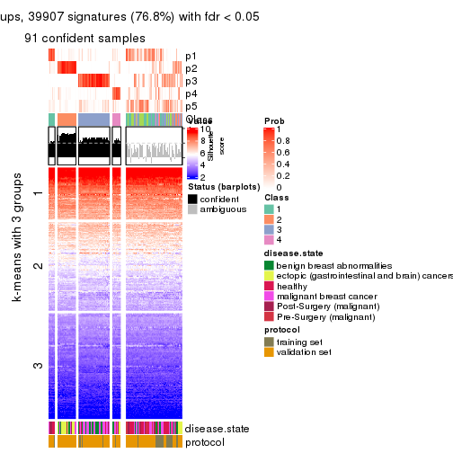</p>

</div>
<div id='tab-ATC-NMF-get-signatures-no-scale-5'>
<pre><code class="r">get_signatures(res, k = 6, scale_rows = FALSE)
</code></pre>

<p></p>

</div>
</div>


Compare the overlap of signatures from different k:

```r
compare_signatures(res)
```


`get_signature()` returns a data frame invisibly. TO get the list of signatures, the function
call should be assigned to a variable explicitly. In following code, if `plot` argument is set
to `FALSE`, no heatmap is plotted while only the differential analysis is performed.

```r
# code only for demonstration
tb = get_signature(res, k = ..., plot = FALSE)
```

An example of the output of `tb` is:

```
#>   which_row         fdr    mean_1    mean_2 scaled_mean_1 scaled_mean_2 km
#> 1        38 0.042760348  8.373488  9.131774    -0.5533452     0.5164555  1
#> 2        40 0.018707592  7.106213  8.469186    -0.6173731     0.5762149  1
#> 3        55 0.019134737 10.221463 11.207825    -0.6159697     0.5749050  1
#> 4        59 0.006059896  5.921854  7.869574    -0.6899429     0.6439467  1
#> 5        60 0.018055526  8.928898 10.211722    -0.6204761     0.5791110  1
#> 6        98 0.009384629 15.714769 14.887706     0.6635654    -0.6193277  2
...
```

The columns in `tb` are:

1. `which_row`: row indices corresponding to the input matrix.
2. `fdr`: FDR for the differential test. 
3. `mean_x`: The mean value in group x.
4. `scaled_mean_x`: The mean value in group x after rows are scaled.
5. `km`: Row groups if k-means clustering is applied to rows.


UMAP plot which shows how samples are separated.


<script>
$( function() {
	$( '#tabs-ATC-NMF-dimension-reduction' ).tabs();
} );
</script>
<div id='tabs-ATC-NMF-dimension-reduction'>
<ul>
<li><a href='#tab-ATC-NMF-dimension-reduction-1'>k = 2</a></li>
<li><a href='#tab-ATC-NMF-dimension-reduction-2'>k = 3</a></li>
<li><a href='#tab-ATC-NMF-dimension-reduction-3'>k = 4</a></li>
<li><a href='#tab-ATC-NMF-dimension-reduction-4'>k = 5</a></li>
<li><a href='#tab-ATC-NMF-dimension-reduction-5'>k = 6</a></li>
</ul>
<div id='tab-ATC-NMF-dimension-reduction-1'>
<pre><code class="r">dimension_reduction(res, k = 2, method = &quot;UMAP&quot;)
</code></pre>

<p>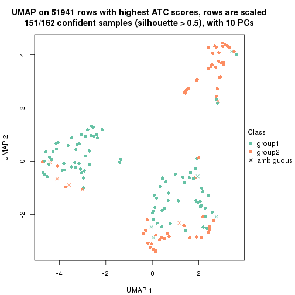</p>

</div>
<div id='tab-ATC-NMF-dimension-reduction-2'>
<pre><code class="r">dimension_reduction(res, k = 3, method = &quot;UMAP&quot;)
</code></pre>

<p></p>

</div>
<div id='tab-ATC-NMF-dimension-reduction-3'>
<pre><code class="r">dimension_reduction(res, k = 4, method = &quot;UMAP&quot;)
</code></pre>

<p></p>

</div>
<div id='tab-ATC-NMF-dimension-reduction-4'>
<pre><code class="r">dimension_reduction(res, k = 5, method = &quot;UMAP&quot;)
</code></pre>

<p></p>

</div>
<div id='tab-ATC-NMF-dimension-reduction-5'>
<pre><code class="r">dimension_reduction(res, k = 6, method = &quot;UMAP&quot;)
</code></pre>

<p></p>

</div>
</div>


Following heatmap shows how subgroups are split when increasing `k`:

```r
collect_classes(res)
```


Test correlation between subgroups and known annotations. If the known
annotation is numeric, one-way ANOVA test is applied, and if the known
annotation is discrete, chi-squared contingency table test is applied.

```r
test_to_known_factors(res)
```

```
#>           n disease.state(p) protocol(p) k
#> ATC:NMF 151         5.16e-09    3.95e-01 2
#> ATC:NMF 149         3.15e-18    4.64e-02 3
#> ATC:NMF 127         4.35e-15    2.85e-02 4
#> ATC:NMF  91         6.76e-09    2.77e-01 5
#> ATC:NMF  91         1.73e-16    3.48e-12 6
```


If matrix rows can be associated to genes, consider to use `GO_Enrichment(res,
...)` to perform function enrichment for the signature genes.


 

## Session info


```r
sessionInfo()
```

```
#> R version 3.6.0 (2019-04-26)
#> Platform: x86_64-pc-linux-gnu (64-bit)
#> Running under: CentOS Linux 7 (Core)
#> 
#> Matrix products: default
#> BLAS:   /usr/lib64/libblas.so.3.4.2
#> LAPACK: /usr/lib64/liblapack.so.3.4.2
#> 
#> locale:
#>  [1] LC_CTYPE=en_GB.UTF-8       LC_NUMERIC=C               LC_TIME=en_GB.UTF-8       
#>  [4] LC_COLLATE=en_GB.UTF-8     LC_MONETARY=en_GB.UTF-8    LC_MESSAGES=en_GB.UTF-8   
#>  [7] LC_PAPER=en_GB.UTF-8       LC_NAME=C                  LC_ADDRESS=C              
#> [10] LC_TELEPHONE=C             LC_MEASUREMENT=en_GB.UTF-8 LC_IDENTIFICATION=C       
#> 
#> attached base packages:
#> [1] grid      parallel  stats     graphics  grDevices utils     datasets  methods   base     
#> 
#> other attached packages:
#>  [1] genefilter_1.66.0     ComplexHeatmap_2.1.1  markdown_1.1          knitr_1.26           
#>  [5] preprocessCore_1.46.0 cola_1.3.2            GEOquery_2.52.0       Biobase_2.44.0       
#>  [9] BiocGenerics_0.30.0   GetoptLong_0.1.7     
#> 
#> loaded via a namespace (and not attached):
#>  [1] bitops_1.0-6         matrixStats_0.55.0   bit64_0.9-7          doParallel_1.0.15   
#>  [5] RColorBrewer_1.1-2   httr_1.4.1           tools_3.6.0          backports_1.1.5     
#>  [9] R6_2.4.1             DBI_1.0.0            lazyeval_0.2.2       colorspace_1.4-1    
#> [13] withr_2.1.2          tidyselect_0.2.5     gridExtra_2.3        bit_1.1-14          
#> [17] compiler_3.6.0       xml2_1.2.2           microbenchmark_1.4-7 pkgmaker_0.28       
#> [21] slam_0.1-46          scales_1.1.0         readr_1.3.1          NMF_0.23.6          
#> [25] stringr_1.4.0        digest_0.6.23        pkgconfig_2.0.3      bibtex_0.4.2        
#> [29] highr_0.8            limma_3.40.6         rlang_0.4.2          GlobalOptions_0.1.1 
#> [33] RSQLite_2.1.2        impute_1.58.0        shape_1.4.4          mclust_5.4.5        
#> [37] dendextend_1.12.0    dplyr_0.8.3          RCurl_1.95-4.12      magrittr_1.5        
#> [41] Matrix_1.2-17        Rcpp_1.0.3           munsell_0.5.0        S4Vectors_0.22.1    
#> [45] viridis_0.5.1        lifecycle_0.1.0      stringi_1.4.3        plyr_1.8.4          
#> [49] blob_1.2.0           crayon_1.3.4         lattice_0.20-38      splines_3.6.0       
#> [53] annotate_1.62.0      circlize_0.4.9       hms_0.5.2            zeallot_0.1.0       
#> [57] pillar_1.4.2         rjson_0.2.20         rngtools_1.4         reshape2_1.4.3      
#> [61] codetools_0.2-16     stats4_3.6.0         XML_3.98-1.20        glue_1.3.1          
#> [65] evaluate_0.14        png_0.1-7            vctrs_0.2.0          foreach_1.4.7       
#> [69] polyclip_1.10-0      gtable_0.3.0         purrr_0.3.3          tidyr_1.0.0         
#> [73] clue_0.3-57          assertthat_0.2.1     ggplot2_3.2.1        xfun_0.11           
#> [77] gridBase_0.4-7       eulerr_6.0.0         xtable_1.8-4         skmeans_0.2-11      
#> [81] survival_2.44-1.1    viridisLite_0.3.0    tibble_2.1.3         iterators_1.0.12    
#> [85] AnnotationDbi_1.46.1 registry_0.5-1       memoise_1.1.0        IRanges_2.18.3      
#> [89] cluster_2.1.0        brew_1.0-6
```


